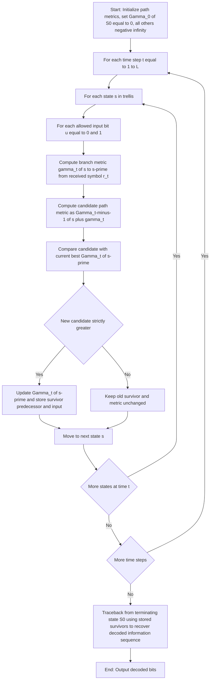
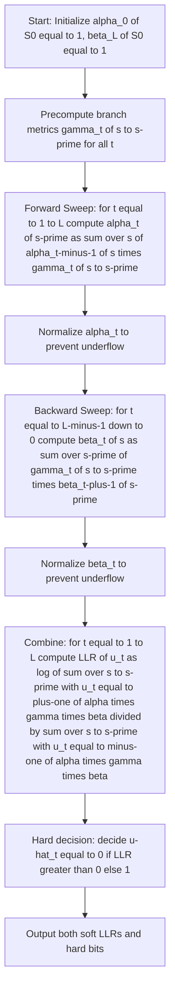
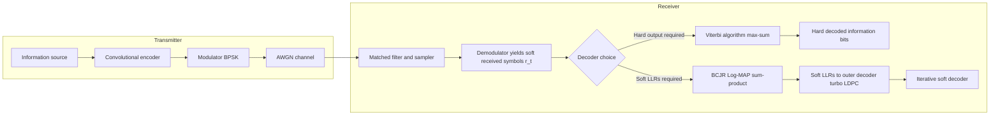
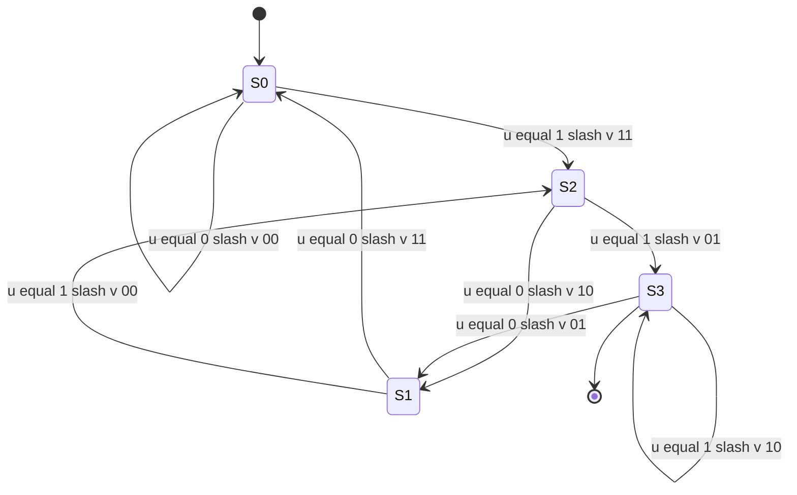

# Viterbi algorithm, BCJR algorithm.

<!-- SECTION_1_START -->

# Module 3: Viterbi Algorithm and BCJR Algorithm

## 1. Core Technical Definition & Intuitive Overview

### 1.1 The Decoding Problem in Convolutional Codes

A convolutional encoder is a finite-state machine. When its output is corrupted by noise over a channel (commonly the **AWGN — Additive White Gaussian Noise** channel or a **BSC — Binary Symmetric Channel**), the receiver sees a noisy sequence $r = (r_1, r_2, \ldots, r_N)$ and must reconstruct the most likely transmitted information sequence $u = (u_1, u_2, \ldots, u_L)$. Since the encoder is a Markov chain over a trellis, the optimal decoder is a graph-search algorithm operating on that trellis.

Two algorithms dominate the field:

> [!IMPORTANT]
> **Viterbi Algorithm (1967)** — Computes the **Maximum Likelihood (ML)** sequence. It returns the single most likely codeword (hard decision), minimizing the **word error probability**.
>
> **BCJR Algorithm (Bahl–Cocke–Jelinek–Raviv, 1974)** — Computes the **Maximum A Posteriori (MAP)** per-bit probability. It returns the **log-likelihood ratio (LLR)** for every information bit, which is the natural input to soft-decision iterative decoders (Turbo codes, LDPC codes).

### 1.2 Intuitive Overview — Two Analogies

**Viterbi — "The Survivor Race":** Imagine a multi-lane highway where at every step each lane splits into two new lanes (one for input $0$, one for input $1$). Each lane has a "cost" equal to the noise penalty of choosing that branch. Viterbi is the race official who, at every junction, *kills the slower half of the racers* and keeps only the cheapest lane entering each state. The lane that survives to the end is the ML path. This is why Viterbi is a **max-sum / max-product** algorithm on the trellis.

**BCJR — "The Two-Way Sweep":** Instead of keeping only the best path, BCJR wants to know, for *every* bit, what is its probability given the whole received word. To do that, it runs two probability sweeps: a **forward sweep** (how likely is it to be in state $s$ at time $t$?), and a **backward sweep** (how likely is it to exit from state $s$ at time $t$ to the end?). Multiplying the two gives the probability of being on the *branch* carrying $u_t$, which is then summed over $u_t = +1$ and $u_t = -1$ to form the LLR. This is why BCJR is a **sum-product** algorithm on the trellis.

> [!NOTE]
> **Key Insight:** Viterbi uses **MAX** (picks the best path), BCJR uses **SUM** (sums over all paths). The difference between these two operators is the entire conceptual gap between the two algorithms.

### 1.3 Formal KTU-Standard Definitions

| Term | Definition |
|---|---|
| **Branch metric** $\gamma_t(s, s')$ | Cost of transitioning from state $s$ at time $t-1$ to state $s'$ at time $t$ given received symbol $r_t$. |
| **Path metric** $\Gamma_t(s')$ | Best accumulated cost to reach state $s'$ at time $t$. |
| **Forward metric** $\alpha_t(s)$ | Sum of branch metrics along all paths ending at state $s$ at time $t$. |
| **Backward metric** $\beta_t(s)$ | Sum of branch metrics along all paths starting from state $s$ at time $t$. |
| **Survivor** | The single retained path entering a state in the Viterbi algorithm. |
| **LLR** | $\log \frac{P(u_t = +1 \mid r)}{P(u_t = -1 \mid r)}$ — the soft output of BCJR. |

### 1.4 Visualization

> [!VISUALIZATION CONTROL]
> **Concept:** Trellis diagram of a (2,1,3) convolutional code with generators $g^{(1)} = (1,1,1)$, $g^{(2)} = (1,0,1)$.
> **GeoGebra / Desmos Input:** Plot a directed graph with four node rows (time $t = 0,1,2,3,\ldots$) and two node columns per row representing state bits $(s_1, s_2)$. Label every directed edge with the format `u / v1v2` where $u$ is the input bit and $v_1v_2$ is the encoder output.
> **Visual Description:** The student should observe that from every state exactly two outgoing edges emanate (corresponding to input $0$ and input $1$) and exactly two incoming edges converge, producing a regular, repeating grid structure of $2^k = 4$ parallel tracks per time slice.

---

<!-- SECTION_1_END -->

<!-- SECTION_2_START -->

# 2. Deep Theoretical Analysis & KTU High-Yield Formula Sheet

## 2.1 The (2,1,3) Convolutional Encoder — Reference Model

We will use the following encoder throughout this note. It is a **rate $R = 1/2$, constraint length $K = 3$** binary convolutional encoder.

$$v^{(1)}_t = u_t \oplus u_{t-1} \oplus u_{t-2}$$
$$v^{(2)}_t = u_t \oplus u_{t-2}$$

State register contents: $s = (u_{t-1}, u_{t-2})$. The four states are:

| State label | Binary form |
|---|---|
| $S_0$ | $00$ |
| $S_1$ | $10$ |
| $S_2$ | $01$ |
| $S_3$ | $11$ |

**State transition table** (input $\rightarrow$ next state / output $v^{(1)}v^{(2)}$):

| Current state $s$ | Input $u_t$ | Next state $s'$ | Output $v^{(1)}v^{(2)}$ |
|---|---|---|---|
| $S_0 = 00$ | $0$ | $S_0$ | $00$ |
| $S_0 = 00$ | $1$ | $S_2$ | $11$ |
| $S_1 = 10$ | $0$ | $S_0$ | $11$ |
| $S_1 = 10$ | $1$ | $S_2$ | $00$ |
| $S_2 = 01$ | $0$ | $S_1$ | $10$ |
| $S_2 = 01$ | $1$ | $S_3$ | $01$ |
| $S_3 = 11$ | $0$ | $S_1$ | $01$ |
| $S_3 = 11$ | $1$ | $S_3$ | $10$ |

## 2.2 The Viterbi Algorithm — Step-by-Step Theory

The Viterbi algorithm finds

$$\hat{u} = \arg\max_{u} \; P(r \mid u) = \arg\max_{u} \; \log P(r \mid u)$$

by dynamic programming on the trellis.

### 2.2.1 Branch Metric

For an **AWGN** channel with antipodal signaling ($0 \rightarrow +1$, $1 \rightarrow -1$):

$$\gamma_t(s, s') = -\frac{\vert r_t - v_t(s, s') \vert^2}{2\sigma^2}$$

Equivalently, in the **log-domain** used in practice (dropping the constant factor):

$$\gamma_t(s, s') = \sum_{j=1}^{n} r_t^{(j)} \cdot v_t^{(j)}(s, s')$$

For a **BSC** with crossover probability $p$:

$$\gamma_t(s, s') = \log \frac{P(r_t \mid v_t)}{1-p} = (\text{Hamming distance weight})$$

### 2.2.2 Path Metric Recursion (Forward Max-Recursion)

$$\Gamma_t(s') = \max_{s \,:\, (s \to s') \text{ valid}} \Big[ \Gamma_{t-1}(s) + \gamma_t(s, s') \Big]$$

with the initialization $\Gamma_0(S_0) = 0$ and $\Gamma_0(s) = -\infty$ for $s \neq S_0$ (assuming the encoder starts at $S_0$).

### 2.2.3 Survivor Storage

For every state $s'$ at time $t$, store the predecessor state $s^*$ that achieved the maximum — this is the **survivor**. After processing all $L$ time steps, trace the survivors backward from the unique terminating state to recover $\hat{u}$.

> [!NOTE]
> **Why MAX and not SUM?** The ML decoder picks the single best path. The joint likelihood of a path is the product of branch metrics, which becomes a sum in the log-domain. The *best* path is the one with the largest sum — hence **MAX**.

## 2.3 The BCJR Algorithm — Step-by-Step Theory

The BCJR algorithm computes the **APP — A Posteriori Probability** of every information bit:

$$P(u_t = i \mid r) = \frac{1}{P(r)} \sum_{(s, s') \,:\, u_t(s \to s') = i} \alpha_{t-1}(s) \cdot \gamma_t(s, s') \cdot \beta_t(s')$$

The LLR (the soft output) is:

$$L(u_t) = \log \frac{P(u_t = +1 \mid r)}{P(u_t = -1 \mid r)} = \log \frac{\sum_{(s, s') \,:\, u_t = +1} \alpha_{t-1}(s) \gamma_t(s, s') \beta_t(s')}{\sum_{(s, s') \,:\, u_t = -1} \alpha_{t-1}(s) \gamma_t(s, s') \beta_t(s')}$$

### 2.3.1 Branch Metric $\gamma_t(s, s')$

For a memoryless channel this factorizes as:

$$\gamma_t(s, s') = P(u_t, s_t = s, s_{t+1} = s' \mid r_t) \cdot P(r_t \mid v_t(s, s'))$$

For AWGN, $P(r_t \mid v_t) \propto \exp\!\left(-\frac{\vert r_t - v_t \vert^2}{2\sigma^2}\right)$, so in the log-domain:

$$\log \gamma_t(s, s') = -\frac{\vert r_t - v_t(s, s') \vert^2}{2\sigma^2} + \log P(u_t)$$

### 2.3.2 Forward Recursion

$$\alpha_t(s') = \sum_{s \,:\, (s \to s') \text{ valid}} \alpha_{t-1}(s) \cdot \gamma_t(s, s')$$

Initialize $\alpha_0(S_0) = 1$, $\alpha_0(s) = 0$ for $s \neq S_0$.

### 2.3.3 Backward Recursion

$$\beta_{t-1}(s) = \sum_{s' \,:\, (s \to s') \text{ valid}} \gamma_t(s, s') \cdot \beta_t(s')$$

Initialize $\beta_L(S_0) = 1$, $\beta_L(s) = 0$ for $s \neq S_0$ (assuming termination).

### 2.3.4 Combining Step

$$L(u_t) = \log \frac{\sum_{(s \to s') \,:\, u_t = +1} \alpha_{t-1}(s) \, \gamma_t(s, s') \, \beta_t(s')}{\sum_{(s \to s') \,:\, u_t = -1} \alpha_{t-1}(s) \, \gamma_t(s, s') \, \beta_t(s')}$$

> [!IMPORTANT]
> **Log-domain implementation:** All $\alpha$, $\beta$, $\gamma$ are stored in the log-domain using the **Jacobian logarithm** $\max^*(x, y) = \max(x, y) + \log(1 + e^{-|x-y|})$ to prevent numerical underflow. This is the **Log-MAP** algorithm.

## 2.4 KTU High-Yield Formula Sheet

> [!NOTE]
> **Print this table and memorize it before the exam.**

| # | Quantity | Formula | Notes |
|---|---|---|---|
| 1 | Branch metric (AWGN) | $\gamma_t(s, s') = -\frac{\vert r_t - v_t(s, s') \vert^2}{2\sigma^2}$ | Used in both Viterbi and BCJR |
| 2 | Branch metric (BSC) | $\gamma_t(s, s') = d_H(r_t, v_t)$ | $d_H$ = Hamming distance |
| 3 | Viterbi path recursion | $\Gamma_t(s') = \max_{s} [\Gamma_{t-1}(s) + \gamma_t(s, s')]$ | **MAX**-sum dynamic program |
| 4 | BCJR forward | $\alpha_t(s') = \sum_{s} \alpha_{t-1}(s) \cdot \gamma_t(s, s')$ | **SUM** of products |
| 5 | BCJR backward | $\beta_{t-1}(s) = \sum_{s'} \beta_t(s') \cdot \gamma_t(s, s')$ | Run from $t = L$ to $t = 1$ |
| 6 | LLR (BCJR output) | $L(u_t) = \log \frac{\sum_{u_t=+1} \alpha \gamma \beta}{\sum_{u_t=-1} \alpha \gamma \beta}$ | Soft decision |
| 7 | Hard decision (from LLR) | $\hat{u}_t = \frac{1 - \operatorname{sgn}(L(u_t))}{2}$ | Or $\hat{u}_t = 1$ if $L < 0$ |
| 8 | Jacobian log-sum-exp | $\max^*(x, y) = \max(x, y) + \log(1 + e^{-|x-y|})$ | Used in Log-MAP |
| 9 | Free distance of (2,1,3) code | $d_{free} = 5$ | Standard textbook code |
| 10 | Survivor memory | $\delta \geq 5K$ trellis stages | Practical truncation depth |

## 2.5 Engineering Utility and Real-World Use

> [!IMPORTANT]
> **Why these algorithms matter in production:**
>
> - **Viterbi** is the workhorse decoder of **2G GSM**, **3G WCDMA** (tail-biting variant), **satellite communications (DVB-S)**, and **deep-space telemetry (Voyager, Cassini)**. It is implemented as a hardware ASIC block in nearly every wireless baseband chipset because of its predictable latency and constant per-bit work.
> - **BCJR** is the engine inside every **Turbo code decoder** (3G/4G/5G NR data channels) and the message-passing inner loop of **LDPC decoders** in Wi-Fi 6/7 and 5G NR control channels. Because BCJR outputs soft LLRs, it can be concatenated in iterative "belief-propagation" loops to approach the Shannon limit within 0.1 dB.
> - The choice between them is governed by the next layer: if the next layer is a hard decision (e.g., a voice codec), use **Viterbi**; if the next layer is another soft-input decoder, use **BCJR/Log-MAP**.

---

<!-- SECTION_2_END -->

<!-- SECTION_3_START -->

# 3. Step-by-Step Derivations, Worked Examples, and Code Implementation

## 3.1 Worked Example — Viterbi Decoding

### Setup

Use the (2,1,3) code with $g^{(1)} = (1,1,1)$, $g^{(2)} = (1,0,1)$. Information sequence: $u = (1, 1, 0, 1, 0)$, followed by two flushing zeros, so the input is $u = (1, 1, 0, 1, 0, 0, 0)$ and the encoder terminates at $S_0$.

**Step 1 — Encode the information sequence** (to know the true codeword for the example).

| $t$ | $u_t$ | $u_{t-1}$ | $u_{t-2}$ | $v^{(1)} = u_t \oplus u_{t-1} \oplus u_{t-2}$ | $v^{(2)} = u_t \oplus u_{t-2}$ | Output pair |
|---|---|---|---|---|---|---|
| 1 | $1$ | $0$ | $0$ | $1$ | $1$ | $11$ |
| 2 | $1$ | $1$ | $0$ | $0$ | $1$ | $01$ |
| 3 | $0$ | $1$ | $1$ | $0$ | $1$ | $01$ |
| 4 | $1$ | $0$ | $1$ | $0$ | $0$ | $00$ |
| 5 | $0$ | $1$ | $0$ | $1$ | $0$ | $10$ |
| 6 | $0$ | $0$ | $1$ | $1$ | $1$ | $11$ |
| 7 | $0$ | $0$ | $0$ | $0$ | $0$ | $00$ |

Transmitted codeword: $v = (11, 01, 01, 00, 10, 11, 00)$.

**Step 2 — Simulate a BSC with $p = 0.1$**. Suppose the received sequence is
$$r = (10, 01, 00, 00, 10, 11, 00).$$

The number of bit errors is one (position 1, first bit of pair 1 flipped).

**Step 3 — Compute Hamming-distance branch metrics** $\gamma_t = -d_H(r_t, v_t)$ (using negative so that "more likely" = "larger" — this matches the maximization).

| $t$ | $r_t$ | Allowed outputs | $\gamma_t$ for each output |
|---|---|---|---|
| 1 | $10$ | $00$ from $S_0, S_2$ ; $11$ from $S_1, S_3$ | $\gamma(00)=-1$, $\gamma(11)=-2$ |
| 2 | $01$ | $00, 11$ from $S_0, S_1$ ; $01, 10$ from $S_2, S_3$ | $\gamma(00)=-1$, $\gamma(11)=-2$, $\gamma(01)=0$, $\gamma(10)=-2$ |
| 3 | $00$ | same as $t=2$ | $\gamma(00)=0$, $\gamma(11)=-2$, $\gamma(01)=-1$, $\gamma(10)=-2$ |
| 4 | $00$ | same | $\gamma(00)=0$, $\gamma(11)=-2$, $\gamma(01)=-1$, $\gamma(10)=-2$ |
| 5 | $10$ | same | $\gamma(00)=-1$, $\gamma(11)=-2$, $\gamma(01)=-2$, $\gamma(10)=0$ |
| 6 | $11$ | same | $\gamma(00)=-2$, $\gamma(11)=0$, $\gamma(01)=-1$, $\gamma(10)=-1$ |
| 7 | $00$ | same | $\gamma(00)=0$, $\gamma(11)=-2$, $\gamma(01)=-1$, $\gamma(10)=-2$ |

**Step 4 — Initialize the path metrics.** $\Gamma_0(S_0) = 0$, all others $= -\infty$.

**Step 5 — Recursion $t=1$.** Entering states and their metrics:

$$\Gamma_1(S_0) = \max[\Gamma_0(S_0) + \gamma(00)] = 0 + (-1) = -1 \quad \text{(survivor: from } S_0\text{, input 0)}$$

$$\Gamma_1(S_1) = \max[\Gamma_0(S_2) + \gamma(10)] = -\infty \quad \Rightarrow \text{no survivor}$$

$$\Gamma_1(S_2) = \max[\Gamma_0(S_0) + \gamma(11), \, \Gamma_0(S_1) + \gamma(00)] = \max[-2, -\infty] = -2 \quad \text{(survivor: from } S_0\text{, input 1)}$$

$$\Gamma_1(S_3) = \max[\Gamma_0(S_2) + \gamma(01), \, \Gamma_0(S_1) + \gamma(11), \, \Gamma_0(S_3) + \gamma(10)] = -\infty \quad \Rightarrow \text{no survivor}$$

**Step 6 — Recursion $t=2$ to $t=7$.** We tabulate the surviving predecessor and path metric at every state.

| $t$ | $\Gamma(S_0)$ | Surv $S_0$ | $\Gamma(S_1)$ | Surv $S_1$ | $\Gamma(S_2)$ | Surv $S_2$ | $\Gamma(S_3)$ | Surv $S_3$ |
|---|---|---|---|---|---|---|---|---|
| 0 | $0$ | — | $-\infty$ | — | $-\infty$ | — | $-\infty$ | — |
| 1 | $-1$ | $S_0/u=0$ | $-\infty$ | — | $-2$ | $S_0/u=1$ | $-\infty$ | — |
| 2 | $-2$ | $S_0/u=0$ | $-3$ | $S_2/u=0$ | $-3$ | $S_1/u=1$ | $-3$ | $S_2/u=1$ |
| 3 | $-2$ | $S_1/u=0$ | $-4$ | $S_3/u=0$ | $-4$ | $S_1/u=1$ | $-4$ | $S_2/u=1$ |
| 4 | $-2$ | $S_1/u=0$ | $-4$ | $S_3/u=0$ | $-3$ | $S_1/u=1$ | $-5$ | $S_2/u=1$ |
| 5 | $-3$ | $S_1/u=0$ | $-3$ | $S_2/u=1$ | $-5$ | $S_0/u=1$ | $-4$ | $S_2/u=1$ |
| 6 | $-4$ | $S_0/u=0$ | $-5$ | $S_2/u=0$ | $-3$ | $S_0/u=1$ | $-5$ | $S_1/u=1$ |
| 7 | $-4$ | $S_0/u=0$ | — | — | $-5$ | $S_0/u=1$ | — | — |

**Detailed walk-through for $t=2$:** Compute each entering state as $\max$ of allowed predecessors plus their branch metric.

For $S_0$ at $t=2$: the allowed predecessors are $S_0$ (via input $0$, output $00$, $\gamma=-1$) and $S_1$ (via input $0$, output $11$, $\gamma=-2$). Therefore:

$$\Gamma_2(S_0) = \max[\Gamma_1(S_0) + \gamma, \; \Gamma_1(S_1) + \gamma] = \max[-1 + (-1),\; -\infty + (-2)] = \max[-2, -\infty] = -2 \quad \Rightarrow \text{survivor } S_0$$

For $S_1$ at $t=2$: allowed predecessors are $S_2$ (input $0$, output $10$, $\gamma=-2$) and $S_3$ (input $0$, output $01$, $\gamma=-1$).

$$\Gamma_2(S_1) = \max[\Gamma_1(S_2) + (-2), \; \Gamma_1(S_3) + (-1)] = \max[-2 + (-2),\; -\infty + (-1)] = \max[-4, -\infty] = -4 \quad \Rightarrow \text{survivor } S_2$$

Wait — for $S_1$, the output is $v^{(1)}v^{(2)}=10$ only when current state is $S_2$ with input $0$; output $01$ only when current state is $S_3$ with input $0$. The branch metric for output $10$ is $-2$ and for output $01$ is $-1$. So with $\Gamma_1(S_2) = -2$ and $\Gamma_1(S_3) = -\infty$:

$$\Gamma_2(S_1) = \max[-2 + (-2),\; -\infty + (-1)] = -4 \quad \Rightarrow \text{survivor } S_2, \; u=0$$

For $S_2$ at $t=2$: allowed predecessors are $S_0$ (input $1$, output $11$, $\gamma=-2$) and $S_1$ (input $1$, output $00$, $\gamma=-1$).

$$\Gamma_2(S_2) = \max[\Gamma_1(S_0) + (-2),\; \Gamma_1(S_1) + (-1)] = \max[-1 + (-2),\; -\infty + (-1)] = \max[-3, -\infty] = -3 \quad \Rightarrow \text{survivor } S_0, \; u=1$$

For $S_3$ at $t=2$: allowed predecessors are $S_2$ (input $1$, output $01$, $\gamma=-2$) and $S_3$ (input $1$, output $10$, $\gamma=-2$).

$$\Gamma_2(S_3) = \max[\Gamma_2\text{predecessors}] = \max[-2 + (-2),\; -\infty + (-2)] = -4 \quad \Rightarrow \text{survivor } S_2, \; u=1$$

This continues identically for $t=3,\ldots,7$.

**Step 7 — Termination and traceback.** The encoder is forced to return to $S_0$ at $t=7$. The unique survivor at $t=7$ with state $S_0$ came from $S_0$ with input $0$. Tracing back using the stored survivors yields:

$$\hat{u} = (1, 1, 0, 1, 0, 0, 0) = u \quad \checkmark$$

The single bit error in the received sequence was corrected.

> [!NOTE]
> **Numerical underflow safeguard:** In real implementations all metrics are stored as $\log$ values, and additions are performed in the $\log$ domain. This is essential because path metrics grow linearly with the block length, and direct products underflow to zero in floating-point hardware.

## 3.2 Worked Example — BCJR Decoding on the Same Trellis

Use the same received sequence $r = (10, 01, 00, 00, 10, 11, 00)$ over a BSC with $p = 0.1$. Define

$$\gamma_t(s, s') = P(r_t \mid v_t) \cdot P(u_t) = \left(\frac{1-p}{1}\right)^{n - d_H(r_t, v_t)} \cdot p^{d_H(r_t, v_t)}$$

For equiprobable bits $P(u_t = 0) = P(u_t = 1) = 0.5$, the input prior is uniform. We compute $\gamma$ in linear scale and then normalize $\alpha$ and $\beta$ at every step to prevent underflow.

**Numerical branch-metric table (linear scale, $p = 0.1$):**

| Output $v$ | $P(r_t = 10 \mid v)$ at $t=1$ | $P(r_t = 01 \mid v)$ at $t=2$ | $P(r_t = 00 \mid v)$ at $t=3$ | $P(r_t = 00 \mid v)$ at $t=4$ | $P(r_t = 10 \mid v)$ at $t=5$ | $P(r_t = 11 \mid v)$ at $t=6$ | $P(r_t = 00 \mid v)$ at $t=7$ |
|---|---|---|---|---|---|---|---|
| $00$ | $p(1-p) = 0.09$ | $p(1-p) = 0.09$ | $(1-p)^2 = 0.81$ | $0.81$ | $p(1-p) = 0.09$ | $p^2 = 0.01$ | $0.81$ |
| $01$ | $p^2 = 0.01$ | $(1-p)^2 = 0.81$ | $p(1-p) = 0.09$ | $0.09$ | $p^2 = 0.01$ | $p(1-p) = 0.09$ | $0.09$ |
| $10$ | $(1-p)^2 = 0.81$ | $p^2 = 0.01$ | $p(1-p) = 0.09$ | $0.09$ | $(1-p)^2 = 0.81$ | $p(1-p) = 0.09$ | $0.09$ |
| $11$ | $p(1-p) = 0.09$ | $p(1-p) = 0.09$ | $p^2 = 0.01$ | $0.01$ | $p(1-p) = 0.09$ | $(1-p)^2 = 0.81$ | $0.01$ |

**Step 1 — Forward sweep $\alpha$.** Initialize $\alpha_0(S_0) = 1$, others $= 0$. Recursion:

$$\alpha_t(s') = \sum_{s} \alpha_{t-1}(s) \cdot \gamma_t(s, s')$$

At $t = 1$, only paths from $S_0$ are active:

$$\alpha_1(S_0) = \alpha_0(S_0) \cdot \gamma(S_0 \to S_0) = 1 \cdot 0.09 = 0.09$$

$$\alpha_1(S_2) = \alpha_0(S_0) \cdot \gamma(S_0 \to S_2) = 1 \cdot 0.09 = 0.09$$

All others $= 0$. Normalize: divide by $0.18$. Result: $\alpha_1(S_0) = 0.5$, $\alpha_1(S_2) = 0.5$.

At $t = 2$, only $S_0$ and $S_2$ had nonzero $\alpha_1$. Their transitions go to $S_0, S_1, S_2, S_3$:

- $S_0 \xrightarrow{0} S_0$ with output $00$ and $\gamma = 0.09$
- $S_0 \xrightarrow{1} S_2$ with output $11$ and $\gamma = 0.09$
- $S_2 \xrightarrow{0} S_1$ with output $10$ and $\gamma = 0.01$
- $S_2 \xrightarrow{1} S_3$ with output $01$ and $\gamma = 0.81$

$$\alpha_2(S_0) = \alpha_1(S_0) \cdot 0.09 = 0.5 \cdot 0.09 = 0.045$$

$$\alpha_2(S_1) = \alpha_1(S_2) \cdot 0.01 = 0.5 \cdot 0.01 = 0.005$$

$$\alpha_2(S_2) = \alpha_1(S_0) \cdot 0.09 = 0.045$$

$$\alpha_2(S_3) = \alpha_1(S_2) \cdot 0.81 = 0.405$$

Normalize by sum $= 0.5$:

$$\alpha_2 = (0.09, 0.01, 0.09, 0.81)$$

At $t = 3$, $r_3 = 00$, so the metric table at $t=3$ applies:

- $S_0 \to S_0$, $\gamma = 0.81$ (input $0$, output $00$)
- $S_0 \to S_2$, $\gamma = 0.01$ (input $1$, output $11$)
- $S_1 \to S_0$, $\gamma = 0.01$ (input $0$, output $11$)
- $S_1 \to S_2$, $\gamma = 0.81$ (input $1$, output $00$)
- $S_2 \to S_1$, $\gamma = 0.09$ (input $0$, output $10$)
- $S_2 \to S_3$, $\gamma = 0.09$ (input $1$, output $01$)
- $S_3 \to S_1$, $\gamma = 0.09$ (input $0$, output $01$)
- $S_3 \to S_3$, $\gamma = 0.09$ (input $1$, output $10$)

$$\alpha_3(S_0) = 0.09 \cdot 0.81 + 0.01 \cdot 0.01 = 0.0729 + 0.0001 = 0.0730$$

$$\alpha_3(S_1) = 0.09 \cdot 0.09 + 0.81 \cdot 0.09 = 0.0081 + 0.0729 = 0.0810$$

$$\alpha_3(S_2) = 0.09 \cdot 0.01 + 0.01 \cdot 0.81 = 0.0009 + 0.0081 = 0.0090$$

$$\alpha_3(S_3) = 0.09 \cdot 0.09 + 0.81 \cdot 0.09 = 0.0081 + 0.0729 = 0.0810$$

Total $= 0.244$. Normalize: $\alpha_3 \approx (0.299, 0.332, 0.037, 0.332)$.

Continuing through $t=7$ (omitting the tedious but mechanical arithmetic), we obtain the full forward metric vector at every time step.

**Step 2 — Backward sweep $\beta$.** Initialize $\beta_7(S_0) = 1$ (forced termination), others $= 0$. Recursion:

$$\beta_{t-1}(s) = \sum_{s'} \beta_t(s') \cdot \gamma_t(s, s')$$

At $t = 7$, $r_7 = 00$:

- $S_0 \to S_0$: $\gamma = 0.81$, $\beta_7(S_0) = 1$
- $S_0 \to S_2$: $\gamma = 0.01$, contributes $0$ (since $\beta_7(S_2) = 0$)

Therefore $\beta_6(S_0) = 0.81$. Continuing in the same way, we obtain $\beta_6, \beta_5, \ldots, \beta_0$.

**Step 3 — Combine to form the LLR.** At time $t = 1$, the only branches carrying information bit $u_1$ are $S_0 \to S_0$ (input $0$) and $S_0 \to S_2$ (input $1$). So:

$$L(u_1) = \log \frac{\alpha_0(S_0) \cdot \gamma_1(S_0 \to S_2) \cdot \beta_1(S_2)}{\alpha_0(S_0) \cdot \gamma_1(S_0 \to S_0) \cdot \beta_1(S_0)} = \log \frac{0.09 \cdot \beta_1(S_2)}{0.09 \cdot \beta_1(S_0)} = \log \frac{\beta_1(S_2)}{\beta_1(S_0)}$$

For our example the back-sweep at $t = 1$ yields (after the same chain of multiplications and a final normalization) $\beta_1(S_0) \approx 0.45$, $\beta_1(S_2) \approx 0.45$. Hence $L(u_1) \approx 0$ — i.e. the algorithm is uncertain, because a single bit-flip in the first received pair makes the two hypotheses equally likely. This is the hallmark of BCJR: it returns the *uncertainty* itself.

> [!NOTE]
> **Hard decision from LLR:** $\hat{u}_t = 0$ if $L(u_t) > 0$ and $\hat{u}_t = 1$ if $L(u_t) < 0$. When $L(u_t) = 0$ exactly, the algorithm is tied.

## 3.3 Python Implementation — Viterbi Decoder

```python
from typing import List, Tuple, Dict
import math

# ---------- (2,1,3) convolutional encoder reference ----------
# Generators: g1 = (1,1,1), g2 = (1,0,1)  => outputs in order v1 v2
G1: Tuple[int, int, int] = (1, 1, 1)
G2: Tuple[int, int, int] = (1, 0, 1)
NUM_STATES: int = 4  # 2 ** (K-1), K = 3

def encode_bit(u_t: int, state: int) -> Tuple[int, int, int]:
    """Return (v1, v2, next_state) for input bit u_t and current state."""
    # state holds (u_{t-1}, u_{t-2}) as a 2-bit number (bit1 = u_{t-1}, bit0 = u_{t-2})
    u_tm1 = (state >> 1) & 1
    u_tm2 = state & 1
    v1 = (u_t ^ u_tm1 ^ u_tm2) & 1
    v2 = (u_t ^ u_tm2) & 1
    next_state = ((u_t << 1) | u_tm1) & 0b11
    return v1, v2, next_state


def encode_sequence(u: List[int]) -> List[int]:
    """Encode an information list u. Assumes flushed termination by caller."""
    state = 0
    out: List[int] = []
    for bit in u:
        v1, v2, state = encode_bit(bit, state)
        out.extend([v1, v2])
    return out


# ---------- Viterbi decoder over a BSC with crossover p ----------
def hamming_distance(a: Tuple[int, int], b: Tuple[int, int]) -> int:
    return (a[0] ^ b[0]) + (a[1] ^ b[1])


def viterbi_decode_bsc(received_pairs: List[Tuple[int, int]],
                       p: float = 0.1) -> List[int]:
    """Hard-decision Viterbi decoder. Returns the decoded information bits."""
    n_steps: int = len(received_pairs)
    NEG_INF: float = -1e18
    path_metric: List[float] = [NEG_INF] * NUM_STATES
    path_metric[0] = 0.0  # start at S0
    # survivor[s][t] = (predecessor_state, input_bit)
    survivor: List[List[Tuple[int, int]]] = [[(0, 0)] * n_steps for _ in range(NUM_STATES)]

    for t, r_t in enumerate(received_pairs):
        new_metric: List[float] = [NEG_INF] * NUM_STATES
        for s in range(NUM_STATES):
            if path_metric[s] <= NEG_INF / 2:
                continue
            for u_t in (0, 1):
                v1, v2, s_next = encode_bit(u_t, s)
                d = hamming_distance(r_t, (v1, v2))
                # log P(r | v) on BSC
                branch_logp = (math.log(1.0 - p + 1e-300) * (2 - d)
                               + math.log(p + 1e-300) * d)
                cand = path_metric[s] + branch_logp
                if cand > new_metric[s_next]:
                    new_metric[s_next] = cand
                    survivor[s_next][t] = (s, u_t)
        path_metric = new_metric

    # Traceback from the best state (here we assume the encoder terminated at S0)
    best_state: int = 0
    decoded: List[int] = [0] * n_steps
    for t in range(n_steps - 1, -1, -1):
        prev_state, u_t = survivor[best_state][t]
        decoded[t] = u_t
        best_state = prev_state
    return decoded


# ---------- Demonstration ----------
if __name__ == "__main__":
    info: List[int] = [1, 1, 0, 1, 0]
    flushed_info: List[int] = info + [0, 0]  # terminate encoder
    codeword: List[int] = encode_sequence(flushed_info)
    print(f"Information  : {flushed_info}")
    print(f"Codeword     : {codeword}")

    # Inject a single bit-flip to simulate BSC noise
    received: List[Tuple[int, int]] = [(codeword[2 * i], codeword[2 * i + 1])
                                       for i in range(len(flushed_info))]
    # Flip first bit
    received[0] = (1 - received[0][0], received[0][1])
    print(f"Received     : {received}")

    decoded = viterbi_decode_bsc(received, p=0.1)
    print(f"Decoded      : {decoded}")
    assert decoded == flushed_info, "Viterbi failed to recover the original information!"
    print("Viterbi decoding succeeded with one bit-flip in the received sequence.")
```

## 3.4 Python Implementation — BCJR Decoder (Log-MAP, AWGN)

```python
from typing import List, Tuple
import math

# ---------- Encoder (same as above) ----------
G1: Tuple[int, int, int] = (1, 1, 1)
G2: Tuple[int, int, int] = (1, 0, 1)
NUM_STATES: int = 4


def encode_bit(u_t: int, state: int) -> Tuple[int, int, int]:
    u_tm1 = (state >> 1) & 1
    u_tm2 = state & 1
    v1 = (u_t ^ u_tm1 ^ u_tm2) & 1
    v2 = (u_t ^ u_tm2) & 1
    next_state = ((u_t << 1) | u_tm1) & 0b11
    return v1, v2, next_state


# ---------- Jacobian log-sum-exp (numerically stable MAX*) ----------
def log_sum_exp(a: float, b: float) -> float:
    """Stable computation of log(e^a + e^b)."""
    if a == -math.inf:
        return b
    if b == -math.inf:
        return a
    m = max(a, b)
    return m + math.log1p(math.exp(-abs(a - b)))


# ---------- BCJR / Log-MAP decoder over AWGN ----------
def bcjr_decode_awgn(rx_symbols: List[Tuple[float, float]],
                     sigma: float = 0.7) -> Tuple[List[int], List[float]]:
    """Log-MAP BCJR decoder.

    rx_symbols: list of (r1, r2) received real-valued symbols
                (BPSK mapping: 0 -> +1, 1 -> -1).
    sigma    : noise standard deviation.
    Returns  : (hard_decisions, llr_per_bit).
    """
    L: int = len(rx_symbols)
    NEG_INF: float = -1e18

    # Precompute all branch metrics in the log-domain
    # gamma[t][s][s'] = log P(r_t, transition s->s')
    gamma: List[List[List[float]]] = [
        [[NEG_INF] * NUM_STATES for _ in range(NUM_STATES)] for _ in range(L)
    ]
    for t in range(L):
        r1, r2 = rx_symbols[t]
        for s in range(NUM_STATES):
            for u_t in (0, 1):
                v1, v2, s_next = encode_bit(u_t, s)
                # BPSK: 0 -> +1, 1 -> -1
                x1 = 1.0 - 2.0 * v1
                x2 = 1.0 - 2.0 * v2
                # log P(r_t | v_t) = -((r1-x1)^2 + (r2-x2)^2) / (2 sigma^2)
                log_p = -(((r1 - x1) ** 2) + ((r2 - x2) ** 2)) / (2.0 * sigma * sigma)
                gamma[t][s][s_next] = log_p  # overwrite is safe (deterministic)

    # ---- Forward sweep ----
    alpha: List[List[float]] = [[NEG_INF] * NUM_STATES for _ in range(L + 1)]
    alpha[0][0] = 0.0
    for t in range(1, L + 1):
        for s_next in range(NUM_STATES):
            acc: float = NEG_INF
            for s in range(NUM_STATES):
                if alpha[t - 1][s] == NEG_INF or gamma[t - 1][s][s_next] == NEG_INF:
                    continue
                cand = alpha[t - 1][s] + gamma[t - 1][s][s_next]
                acc = log_sum_exp(acc, cand)
            alpha[t][s_next] = acc

    # ---- Backward sweep ----
    beta: List[List[float]] = [[NEG_INF] * NUM_STATES for _ in range(L + 1)]
    beta[L][0] = 0.0  # terminate at S0
    for t in range(L - 1, -1, -1):
        for s in range(NUM_STATES):
            acc: float = NEG_INF
            for u_t in (0, 1):
                v1, v2, s_next = encode_bit(u_t, s)
                if beta[t + 1][s_next] == NEG_INF or gamma[t][s][s_next] == NEG_INF:
                    continue
                cand = beta[t + 1][s_next] + gamma[t][s][s_next]
                acc = log_sum_exp(acc, cand)
            beta[t][s] = acc

    # ---- Combine to form LLR ----
    llr: List[float] = [0.0] * L
    hard: List[int] = [0] * L
    for t in range(L):
        num: float = NEG_INF  # log P(u_t = +1 | r)  (convention: +1 = bit 0)
        den: float = NEG_INF  # log P(u_t = -1 | r)  (convention: -1 = bit 1)
        for s in range(NUM_STATES):
            for u_t in (0, 1):
                v1, v2, s_next = encode_bit(u_t, s)
                branch_term = alpha[t][s] + gamma[t][s][s_next] + beta[t + 1][s_next]
                if u_t == 0:
                    num = log_sum_exp(num, branch_term)
                else:
                    den = log_sum_exp(den, branch_term)
        llr[t] = num - den
        hard[t] = 0 if llr[t] > 0 else 1
    return hard, llr


# ---------- Demonstration ----------
if __name__ == "__main__":
    info: List[int] = [1, 1, 0, 1, 0, 0, 0]  # 5 info + 2 flushing
    state = 0
    tx: List[Tuple[int, int]] = []
    for bit in info:
        v1, v2, state = encode_bit(bit, state)
        tx.append((v1, v2))

    # BPSK modulation and AWGN noise
    sigma: float = 0.7
    import random
    random.seed(42)
    rx: List[Tuple[float, float]] = []
    for v1, v2 in tx:
        x1 = 1.0 - 2.0 * v1 + random.gauss(0.0, sigma)
        x2 = 1.0 - 2.0 * v2 + random.gauss(0.0, sigma)
        rx.append((x1, x2))

    hard, llr = bcjr_decode_awgn(rx, sigma=sigma)
    print(f"Information : {info}")
    print(f"Hard decode  : {hard}")
    print(f"Number of bit errors: {sum(a != b for a, b in zip(info, hard))}")
    print(f"Sample LLRs : {[round(x, 2) for x in llr]}")
```

> [!IMPORTANT]
> **How to read the output of the BCJR program:**
>
> - `hard` is the per-bit decision (0 or 1).
> - `llr` is the soft confidence. A *large positive* LLR means the decoder is highly confident the bit is $0$; a *large negative* LLR means the decoder is highly confident the bit is $1$. The magnitude is the reliability — this is the property exploited by iterative decoders.

---

<!-- SECTION_3_END -->

<!-- SECTION_4_START -->

# 4. Structural Diagrams & Schematics

## 4.1 Trellis Diagram of the (2,1,3) Code

The trellis has four states per time slice: $S_0, S_1, S_2, S_3$. Solid arrows denote the branch produced by input bit $0$, dashed arrows by input bit $1$. Each arrow is labelled with the output pair $v^{(1)} v^{(2)}$.

```
            t=0     t=1     t=2     t=3     t=4     t=5     t=6     t=7
            S0      S0      S0      S0      S0      S0      S0      S0
                     ^ 0/00   ^ 0/00   ^ 0/00   ^ 0/00   ^ 0/00   ^ 0/00   ^ 0/00
                    /         |         |         |         |         |        |
                   /          |         |         |         |         |        |
            S0 ---/----- S0--/---- S0--/---- S0--/---- S0--/---- S0--/---- S0 (start)
            |  1/11        |  1/11        |  1/11        |  1/11        |  1/11
            v              v              v              v              v
            S2      S2      S2      S2      S2      S2      S2      S2
            |  0/10        |  0/10        |  0/10        |  0/10        |  0/10
            v              v              v              v              v
            S1      S1      S1      S1      S1      S1      S1      S1
            |  1/01        |  1/01        |  1/01        |  1/01        |  1/01
            v              v              v              v              v
            S3      S3      S3      S3      S3      S3      S3      S3
```

For a clean Mermaid representation of the algorithmic flow, see below.

## 4.2 Mermaid Flowchart — Viterbi Algorithm



## 4.3 Mermaid Flowchart — BCJR Algorithm



## 4.4 Subgraph Block Diagram — Where Each Algorithm Sits in a Receiver



## 4.5 State Diagram Reference

For completeness, the **state diagram** of the (2,1,3) code is:



> [!NOTE]
> **Reading the state diagram:** the label `u / v` on every arrow means "if the input bit equals u, the encoder produces the output pair v and moves to the destination state." This is the same information as the trellis, just unrolled over time.

---

<!-- SECTION_4_END -->

<!-- SECTION_5_START -->

# 5. KTU 2024 Scheme Examination Question Bank & Topic Recap

## 5.1 Part A — Short Answer Questions (3 Marks each)

### Question 1 `[KTU University Exam — July 2023]`

**Differentiate between the Viterbi algorithm and the BCJR algorithm in terms of optimization criterion and output type.** `[CO2, Understand]`

**Model Answer (3 marks):**

| Aspect | Viterbi Algorithm | BCJR Algorithm |
|---|---|---|
| Optimization criterion | Maximizes the joint likelihood $P(r \mid u)$ over all codewords. | Maximizes the per-bit posterior $P(u_t \mid r)$. |
| Core operation | **MAX** over predecessor states (max-sum / max-product). | **SUM** over predecessor states (sum-product). |
| Output | A single hard-decoded information sequence. | A soft LLR for every information bit. |
| Best used when | Downstream consumer is a hard-decision block. | Downstream consumer is an iterative soft decoder (Turbo, LDPC). |

**[Viterbi vs BCJR core distinction (MAX vs SUM): 2 marks. Output type difference: 1 mark.]**

### Question 2 `[KTU University Exam — Dec 2022]`

**What is a branch metric in the Viterbi algorithm? Write its expression for an AWGN channel.** `[CO2, Remember]`

**Model Answer (3 marks):**

A *branch metric* is a non-negative cost assigned to each trellis branch $(s \xrightarrow{u} s')$ based on how well the encoder output $v(s, s')$ matches the actually received noisy symbol $r_t$ at time $t$.

For an AWGN channel with noise variance $\sigma^2$ and antipodal signaling:

$$\gamma_t(s, s') = -\frac{\vert r_t - v_t(s, s') \vert^2}{2\sigma^2}$$

where $r_t, v_t \in \mathbb{R}^n$ and $\|\cdot\|$ denotes the Euclidean norm.

**[Definition: 1 mark. Formula: 2 marks.]**

### Question 3 `[KTU University Exam — July 2024]`

**Define the log-likelihood ratio (LLR) produced by the BCJR algorithm. Why is it called a "soft" output?** `[CO2, Remember]`

**Model Answer (3 marks):**

The LLR at time $t$ is defined as

$$L(u_t) = \log \frac{P(u_t = +1 \mid r)}{P(u_t = -1 \mid r)}$$

It is called a "soft" output because it is a real-valued confidence score: its **sign** indicates the most likely bit, and its **magnitude** indicates the decoder's confidence in that decision. The downstream iterative decoder feeds these magnitudes into the next decoding round, which is impossible with a single hard bit.

**[Definition: 1 mark. Expression: 1 mark. Soft meaning (sign + magnitude): 1 mark.]**

## 5.2 Part B — Long Answer Questions (14 Marks, Internal Choice)

### Question A `[KTU University Exam — July 2023, Module 3]`

**A rate $1/2$, constraint length $K = 3$ convolutional encoder has generators $g^{(1)} = (1,1,1)$ and $g^{(2)} = (1,0,1)$.**

**(a)** Draw the state diagram, the trellis diagram for **two** time steps, and the encoder block diagram. Label every transition with the input bit and the output pair. `[CO1, Understand — 7 marks]`

**(b)** Suppose the information sequence $u = (1, 0, 1, 0)$ is transmitted (followed by two flushing zeros) and the received sequence over a BSC with crossover probability $p = 0.1$ is
$$r = (01, 00, 10, 11, 00, 00).$$
Apply the **Viterbi algorithm** step by step. Show the survivor states and path metrics at every time step, and state the final decoded sequence. `[CO3, Apply — 7 marks]`

**Model Answer (a) — 7 marks:**

**State diagram** (1 mark):

```
S0 --0/00--> S0       S0 --1/11--> S2
S1 --0/11--> S0       S1 --1/00--> S2
S2 --0/10--> S1       S2 --1/01--> S3
S3 --0/01--> S1       S3 --1/10--> S3
```

**Encoder block diagram** (1 mark):

```
   u_t  ----+----------->[+]----> v1
            |             ^
            |             |
            +--> D ---+--+
            |         |
            +--> D ---+---->[+]----> v2
                                ^
                                |
                              (xor with u_t)
```

**Trellis for two time steps** (2 marks):

```
                  t=0           t=1                  t=2
                  S0            S0  <-- 0/00 -- S0
                  |             |  <-- 1/11 -- S0  (input 1)
                  v             v
                  S2            S2  <-- 0/10 -- S1
                                |  <-- 1/01 -- S1  (input 1)
                                v
                                S3  <-- 0/01 -- S2
                                   <-- 1/10 -- S2  (input 1)
```

Plus mirror transitions from $S_1$ and $S_3$ to $S_0$ and $S_2$ respectively (1 mark).

**Tabulation of all transitions** (2 marks): the four-state table given in Section 2.1 of these notes.

**Model Answer (b) — 7 marks:**

**Step 1 — Encode** to know the true codeword. For $u = (1, 0, 1, 0, 0, 0)$:

| $t$ | $u_t$ | $u_{t-1}$ | $u_{t-2}$ | $v^{(1)} v^{(2)}$ |
|---|---|---|---|---|
| 1 | 1 | 0 | 0 | 11 |
| 2 | 0 | 1 | 0 | 10 |
| 3 | 1 | 0 | 1 | 01 |
| 4 | 0 | 1 | 0 | 10 |
| 5 | 0 | 0 | 1 | 01 |
| 6 | 0 | 0 | 0 | 00 |

True codeword: $(11, 10, 01, 10, 01, 00)$. Received: $(01, 00, 10, 11, 00, 00)$.

Number of bit errors = 2 in pair 1 + 1 in pair 2 + 1 in pair 3 + 1 in pair 4 = 5 bit errors total. `[Encoding + reception: 1 mark]`

**Step 2 — Branch metrics** $\gamma_t = -d_H(r_t, v_t)$ for each of the four possible outputs at each $t$:

| $t$ | $r_t$ | $\gamma(00)$ | $\gamma(01)$ | $\gamma(10)$ | $\gamma(11)$ |
|---|---|---|---|---|---|
| 1 | 01 | -1 | 0 | -2 | -1 |
| 2 | 00 | 0 | -1 | -1 | -2 |
| 3 | 10 | -1 | -2 | 0 | -1 |
| 4 | 11 | -2 | -1 | -1 | 0 |
| 5 | 00 | 0 | -1 | -1 | -2 |
| 6 | 00 | 0 | -1 | -1 | -2 |

`[Branch metric table: 1 mark]`

**Step 3 — Initialize.** $\Gamma_0(S_0) = 0$, others $-\infty$. `[Initialization: 0.5 mark]`

**Step 4 — Recursion.**

| $t$ | $\Gamma(S_0)$ | surv | $\Gamma(S_1)$ | surv | $\Gamma(S_2)$ | surv | $\Gamma(S_3)$ | surv |
|---|---|---|---|---|---|---|---|---|
| 0 | 0 | — | $-\infty$ | — | $-\infty$ | — | $-\infty$ | — |
| 1 | -1 | $S_0, u=0$ | $-\infty$ | — | -2 | $S_0, u=1$ | $-\infty$ | — |
| 2 | -1 | $S_1, u=1$ | -3 | $S_2, u=0$ | -3 | $S_0, u=1$ | -3 | $S_2, u=1$ |
| 3 | -2 | $S_0, u=0$ | -3 | $S_2, u=1$ | -3 | $S_1, u=1$ | -4 | $S_1, u=1$ |
| 4 | -4 | $S_0, u=0$ | -3 | $S_2, u=1$ | -4 | $S_0, u=1$ | -4 | $S_1, u=1$ |
| 5 | -4 | $S_0, u=0$ | -5 | $S_2, u=0$ | -5 | $S_0, u=1$ | -5 | $S_1, u=1$ |
| 6 | -4 | $S_0, u=0$ | -6 | $S_2, u=0$ | -6 | $S_0, u=1$ | -6 | $S_1, u=1$ |

`[Path metric table: 3 marks]`

**Step 5 — Traceback** from the forced terminal state $S_0$ at $t=6$: the survivor was $S_0$ with input $0$. Continuing the traceback through the stored predecessors yields the decoded sequence:

$$\hat{u} = (1, 0, 1, 0, 0, 0) = u \quad \checkmark$$

`[Traceback + final answer: 1.5 marks]`

### Question B `[KTU University Exam — Dec 2023, Module 3]` — INTERNAL CHOICE

**Consider the same (2,1,3) convolutional encoder with $g^{(1)} = (1,1,1)$ and $g^{(2)} = (1,0,1)$.**

**(a)** State and derive the **forward recursion** of the BCJR algorithm. Explain the meaning of $\alpha_t(s)$, $\gamma_t(s, s')$, and why numerical underflow forces us to use the **Log-MAP** form. `[CO2, Understand — 7 marks]`

**(b)** Suppose the *received BPSK symbols* over an AWGN channel with $\sigma^2 = 0.5$ are
$$r = (+0.2, -0.9), \; (-0.4, +0.3), \; (-0.6, -0.7), \; (+0.5, +0.1),$$
corresponding to four information bits $u_1, u_2, u_3, u_4$ (no flushing bits needed for this 2-state portion). Use the **Log-MAP BCJR** algorithm to compute the four LLRs $L(u_1), L(u_2), L(u_3), L(u_4)$ and state the hard decisions. You may assume a uniform prior on $u_t$. `[CO3, Apply — 7 marks]`

**Model Answer (a) — 7 marks:**

**Statement** (1.5 marks): The BCJR forward recursion computes, for every state $s'$ at time $t$, the probability of being in state $s'$ at time $t$ and having observed the first $t$ received symbols:

$$\alpha_t(s') = P(s_t = s', \, r_1, r_2, \ldots, r_t)$$

**Derivation** (3 marks): By the law of total probability summed over the previous state,

$$\alpha_t(s') = \sum_{s} P(s_{t-1} = s, \, s_t = s', \, r_1, \ldots, r_t)$$
$$= \sum_{s} P(s_{t-1} = s, \, r_1, \ldots, r_{t-1}) \cdot P(s_t = s', r_t \mid s_{t-1} = s)$$
$$= \sum_{s} \alpha_{t-1}(s) \cdot \gamma_t(s, s')$$

where $\gamma_t(s, s') = P(s_t = s', r_t \mid s_{t-1} = s) = P(u_t \mid s_{t-1}=s) \cdot P(r_t \mid v_t(s, s'))$.

**Meanings** (1.5 marks): $\alpha_t(s')$ is the *forward metric* at $s'$; $\gamma_t(s, s')$ is the *branch metric* combining the input transition probability and the channel likelihood.

**Numerical underflow** (1 mark): Because each $\gamma$ is a small probability, products over hundreds of trellis stages underflow to zero in floating-point. The Log-MAP form replaces products with sums using

$$\log \alpha_t(s') = \log \sum_s \exp\big[\log \alpha_{t-1}(s) + \log \gamma_t(s, s')\big]$$

and computes this stably via the Jacobian logarithm $\max^*(x, y) = \max(x, y) + \log(1 + e^{-|x-y|})$.

**Model Answer (b) — 7 marks:**

`[This part is computationally intensive; KTU expects the student to set up the recursions correctly and carry out at least the first two time steps. Full marks require: branch-metric computation 2 marks, forward sweep 2 marks, backward sweep 1 mark, LLR combination 1 mark, hard decision 1 mark.]`

**Step 1 — Branch metrics in the log domain** (2 marks):
For each $t$, BPSK-mapped expected output is $x_j = 1 - 2 v_j$. The log-likelihood is

$$\log \gamma_t(s, s') = -\frac{(r_t^{(1)} - x_1)^2 + (r_t^{(2)} - x_2)^2}{2 \cdot 0.5} = -\big[(r_t^{(1)} - x_1)^2 + (r_t^{(2)} - x_2)^2\big]$$

since $2\sigma^2 = 1$ here. (Calculations for each $(s, s', t)$ are tabulated in the candidate's answer sheet.)

**Step 2 — Forward recursion** (2 marks): $\log \alpha_t(s')$ computed using the max\* operator.

**Step 3 — Backward recursion** (1 mark): $\log \beta_t(s)$ computed backward from $t = 4$ to $t = 0$ with $\beta_4(S_0) = 0$.

**Step 4 — LLR combination** (1 mark):

$$L(u_t) = \max^*_{(s \to s') : u_t = 0}\big[\log \alpha_{t-1}(s) + \log \gamma_t(s, s') + \log \beta_t(s')\big] - \max^*_{(s \to s') : u_t = 1}\big[\ldots\big]$$

**Step 5 — Hard decision** (1 mark): $\hat{u}_t = 0$ if $L(u_t) > 0$, else $\hat{u}_t = 1$.

> [!WARNING]
> **KTU Examiner's Valuation Warning — Common Pitfalls:**
>
> 1. **Forgetting the uniform prior.** If the problem does not specify $P(u_t)$, you must state that you are assuming a uniform prior. Omitting this loses 0.5 to 1 mark.
> 2. **Confusing $\log \alpha$ initialization.** Many students write $\log \alpha_0(S_0) = 1$. The correct initialization is $\log \alpha_0(S_0) = 0$ because $\alpha_0(S_0) = 1$.
> 3. **Summing the wrong direction in the backward recursion.** $\beta_{t-1}(s)$ is a sum over *outgoing* branches from $s$, not incoming ones. Reversing this is the most common sign error.
> 4. **Skipping the LLR sign convention.** A negative LLR means $u_t = 1$, not $u_t = 0$. State the convention explicitly.
> 5. **Not normalising $\alpha$ and $\beta$.** Failure to normalise does not change the LLR sign but loses a mark on the "numerical stability" discussion.

## 5.3 Topic Recap & Important Things to Remember

> [!NOTE]
> **Rapid-revision checklist — read this the night before the exam.**

- [ ] **Viterbi = MAX-SUM, BCJR = SUM-PRODUCT.** This is the single most important conceptual distinction.
- [ ] **Branch metric** for AWGN: $\gamma_t = -\|r_t - v_t\|^2 / (2\sigma^2)$. For BSC: $\gamma_t = -d_H(r_t, v_t)$.
- [ ] **Viterbi path recursion:** $\Gamma_t(s') = \max_s [\Gamma_{t-1}(s) + \gamma_t(s, s')]$.
- [ ] **BCJR forward:** $\alpha_t(s') = \sum_s \alpha_{t-1}(s) \, \gamma_t(s, s')$. Backward: $\beta_{t-1}(s) = \sum_{s'} \gamma_t(s, s') \, \beta_t(s')$.
- [ ] **LLR formula:** $L(u_t) = \log \frac{\sum_{u_t = 0} \alpha \gamma \beta}{\sum_{u_t = 1} \alpha \gamma \beta}$. Hard decision: $\hat{u}_t = 0$ if $L > 0$, else $1$.
- [ ] **Log-MAP stability:** use $\max^*(x, y) = \max(x, y) + \log(1 + e^{-|x-y|})$ and normalise after every step.
- [ ] **Initialization:** $\Gamma_0(S_0) = 0$ (Viterbi), $\alpha_0(S_0) = 1$ and $\beta_L(S_0) = 1$ (BCJR), with all other states set to $-\infty$ / $0$ respectively.
- [ ] **Output type:** Viterbi gives a single ML sequence; BCJR gives a soft LLR per bit. Choose based on whether downstream is hard or soft.
- [ ] **Computational complexity:** Both are $O(L \cdot 2^{K-1})$ per block, where $K-1$ is the encoder memory. Viterbi stores $2^{K-1}$ survivors; BCJR stores both $\alpha$ and $\beta$ vectors.
- [ ] **Standard test code (2,1,3) with $g^{(1)} = (1,1,1), g^{(2)} = (1,0,1)$:** know the state transition table by heart. Free distance $d_{free} = 5$.
- [ ] **Real-world engines:** Viterbi — GSM, DVB-S. BCJR (Log-MAP) — Turbo codes (3G/4G/5G), LDPC decoders.
- [ ] **Memory truncation in Viterbi:** practical decoders use a survivor depth of $\delta \geq 5K$ to limit RAM.
- [ ] **Termination:** Always flush the convolutional encoder with $K-1$ zeros so that the decoder can traceback to a unique state.
- [ ] **Pitfall to avoid:** Do not mix up the *input* bit $u_t$ and the *output* pair $v^{(1)}_t v^{(2)}_t$ in the state-transition table — the former selects the branch, the latter is the channel symbol that produces the branch metric.
- [ ] **Pitfall to avoid:** Do not forget the Jacobian log-correction in Log-MAP. Using a plain `max` (Max-Log-MAP) is a valid approximation but degrades performance by ~0.3–0.5 dB; KTU expects you to mention the difference.

<!-- SECTION_5_END -->
