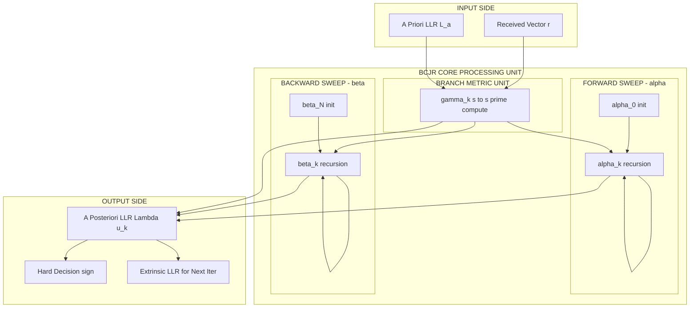
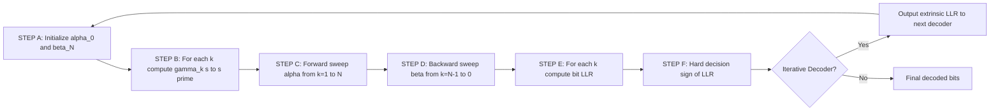
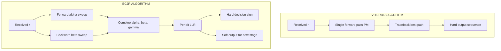
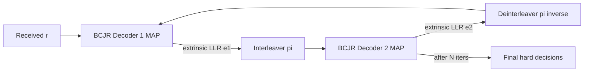

# BCJR algorithm

> **APJ ABDUL KALAM TECHNOLOGICAL UNIVERSITY (KTU) | 2024 SCHEME**
> - **Branch:** B.Tech in Computer Science & Engineering (CSE)
> - **Semester:** Semester 4
> - **Course:** PECST414 - CODING THEORY
> - **Module:** Module 3: Convolutional codes
> - **Topic:** BCJR algorithm

<!-- SECTION_1_START -->
# 1. Core Technical Definition & Intuitive Overview

## 1.1 Formal Academic Definition

The **BCJR algorithm** (named after its inventors **Bahl, Cocke, Jelinek, and Raviv**, published in **1974**) is an optimal *symbol-by-symbol* *Maximum A Posteriori* (MAP) decoding algorithm for convolutional codes and linear codes defined on a trellis. Unlike the Viterbi algorithm (which determines the *most likely transmitted sequence*), BCJR computes the *a posteriori* probability of each individual transmitted information bit, conditioned on the entire received sequence.

> [!IMPORTANT]
> **Key Distinction from Viterbi**
> - **Viterbi Algorithm:** Maximum Likelihood (ML) → finds the *single best path* (hard-output sequence decoding).
> - **BCJR Algorithm:** Maximum A Posteriori (MAP) → computes the *probability of each bit being +1 or −1* (soft-output bit-wise decoding).

For a binary information bit $u_k$ at time index $k$, the BCJR algorithm produces the *a posteriori* log-likelihood ratio (LLR):

$$\Lambda(u_k) = \log \frac{P(u_k = +1 \mid \mathbf{r})}{P(u_k = -1 \mid \mathbf{r})}$$

where $\mathbf{r} = (r_1, r_2, \ldots, r_N)$ is the complete received sequence.

## 1.2 Conceptual Analogy — Intuitive Explanation

> [!NOTE]
> **Real-World Analogy: The "Detective Investigation"**
> Imagine a detective trying to figure out what a thief did at each *minute* of a heist, given partial CCTV footage:
> - **Viterbi's approach:** Pick the *single most plausible reconstruction* of the entire robbery, minute-by-minute, that best matches the blurry footage.
> - **BCJR's approach:** For *each individual minute*, compute the *probability* the thief was performing action A vs action B, by combining:
>   1. **Forward evidence** ($\alpha$): what came *before* this minute,
>   2. **Backward evidence** ($\beta$): what came *after* this minute,
>   3. **Local evidence** ($\gamma$): what the camera captured at *this exact minute*.
> - This is like a *bidirectional* criminal profiling — Viterbi only walks the timeline *forward*; BCJR walks it *both ways* and fuses the results.

In short: **Viterbi finds the best path; BCJR asks "what's the most likely state at *this* time step, given everything?"**

## 1.3 The Three Key Probability Metrics

| Symbol | Name | Role | Time Direction |
|:---:|:---|:---|:---:|
| $\alpha_k(s)$ | Forward metric | Probability of being in state $s$ at time $k$ given past received symbols | Forward ($\rightarrow$) |
| $\beta_k(s)$ | Backward metric | Probability of future received symbols given state $s$ at time $k$ | Backward ($\leftarrow$) |
| $\gamma_k(s', s)$ | Branch metric | Transition probability from state $s'$ to $s$ at time $k$ given received $r_k$ | Local (instantaneous) |

> [!TIP]
> The mnemonic **"A-B-G" → "All Backward, Go forward"** is wrong. The correct way: **A**lpha goes **A**head (forward), **B**eta goes **B**ackward, **G**amma is the local bridge.

## 1.4 Why BCJR Matters in Modern Communications

> [!IMPORTANT]
> **BCJR is the *workhorse* of iterative (turbo) decoding.** It is *not* typically used as a standalone decoder for convolutional codes; instead, its **soft outputs** (LLRs) are exchanged between two component decoders in a turbo code, where they act as *extrinsic information* for one another.

## 1.5 Visualization of Bidirectional Trellis Traversal

> [!VISUALIZATION CONTROL]
> **Concept:** Bidirectional traversal on a convolutional-code trellis.
> **Conceptual Sketch (cannot be rendered in GeoGebra, but the student should visualize):**
> - Horizontal axis: time index $k$ (0, 1, 2, ..., $N$).
> - Vertical axis: trellis states ($S_0, S_1, S_2, S_3$).
> - **Red arrows** (left-to-right): forward recursion of $\alpha_k(s)$ starting from $k=0$ to $k=N$.
> - **Blue arrows** (right-to-left): backward recursion of $\beta_k(s)$ starting from $k=N$ to $k=0$.
> - At every branch (small diagonal segment): $\gamma_k(s',s)$ is computed from the local received symbol $r_k$.
> - **Visual Description:** Two "sweeps" — one forward, one backward — *meeting* in the middle. The fusion of $\alpha$, $\beta$, and $\gamma$ at branch $(k, s', s)$ yields the bit-wise LLR.
<!-- SECTION_1_END -->

<!-- SECTION_2_START -->
# 2. Deep Theoretical Analysis & KTU High-Yield Formula Sheet

## 2.1 Problem Setup and Notation

Consider a rate $k/n$ convolutional encoder with memory $\nu$, processing an information block of $K$ information bits $\mathbf{u} = (u_1, u_2, \ldots, u_K)$ into a codeword of length $N$ transmitted symbols. The encoder is described by a trellis with $2^{\nu}$ states.

Let $S_k$ denote the encoder state at time $k$ and $\mathbf{r}_1^N = (r_1, r_2, \ldots, r_N)$ the complete received sequence (over a discrete memoryless channel of known statistics, e.g., AWGN with BPSK modulation).

## 2.2 The Three Metrics — Recursive Definitions

### 2.2.1 Branch Metric $\gamma_k(s', s)$

$$\gamma_k(s', s) = P(u_k, S_k = s, r_k \mid S_{k-1} = s')$$

For a memoryless channel, this factors as:

$$\gamma_k(s', s) = P(r_k \mid \mathbf{c}_k) \cdot P(u_k)$$

where $\mathbf{c}_k$ is the codeword symbol at time $k$ corresponding to the transition $s' \rightarrow s$, and $P(u_k)$ is the *a priori* probability of the information bit. For BPSK over AWGN:

$$\gamma_k(s', s) = \frac{1}{\sqrt{2\pi}\sigma} \exp\!\left(-\frac{\lVert r_k - c_k \rVert^2}{2\sigma^2}\right) \cdot P(u_k)$$

### 2.2.2 Forward Metric $\alpha_k(s)$ — Forward Recursion

$$\alpha_k(s) = P(S_k = s, \mathbf{r}_1^k) = \sum_{s'} \alpha_{k-1}(s') \cdot \gamma_k(s', s)$$

**Initialization** (assuming encoder starts in state 0):
$$\alpha_0(s) = \begin{cases} 1, & s = S_0 \\ 0, & s \neq S_0 \end{cases}$$

### 2.2.3 Backward Metric $\beta_k(s)$ — Backward Recursion

$$\beta_k(s) = P(\mathbf{r}_{k+1}^N \mid S_k = s) = \sum_{s'} \beta_{k+1}(s') \cdot \gamma_{k+1}(s, s')$$

**Termination** (assuming encoder ends in state 0):
$$\beta_N(s) = \begin{cases} 1, & s = S_0 \\ 0, & s \neq S_0 \end{cases}$$

## 2.3 Computing the Bit-Wise A Posteriori LLR

For each information bit $u_k$, partition the trellis transitions at time $k$ into two sets:
- $\Sigma^{+1}$: set of branches where $u_k = +1$
- $\Sigma^{-1}$: set of branches where $u_k = -1$

The a posteriori probability:

$$P(u_k = \pm 1 \mid \mathbf{r}_1^N) = \frac{1}{P(\mathbf{r}_1^N)} \sum_{(s',s) \in \Sigma^{\pm 1}} \alpha_{k-1}(s') \cdot \gamma_k(s', s) \cdot \beta_k(s)$$

The **Log-Likelihood Ratio (LLR)**:

$$\Lambda(u_k) = \log \frac{\sum_{(s',s) \in \Sigma^{+1}} \alpha_{k-1}(s') \cdot \gamma_k(s', s) \cdot \beta_k(s)}{\sum_{(s',s) \in \Sigma^{-1}} \alpha_{k-1}(s') \cdot \gamma_k(s', s) \cdot \beta_k(s)}$$

The hard decision is then:
$$\hat{u}_k = \begin{cases} +1, & \Lambda(u_k) > 0 \\ -1, & \Lambda(u_k) \le 0 \end{cases}$$

> [!IMPORTANT]
> **Hard decision rule:** If LLR is positive, decide the bit is +1; if negative, decide it is −1. The *magnitude* of the LLR represents the *reliability* of the decision.

## 2.4 KTU Formula Sheet / Cheat Sheet

| # | Formula | Description |
|:---:|:---|:---|
| 1 | $\gamma_k(s',s) = P(r_k \mid c_k)\, P(u_k)$ | Branch metric (channel × a priori) |
| 2 | $\alpha_k(s) = \sum_{s'} \alpha_{k-1}(s') \gamma_k(s',s)$ | Forward recursion |
| 3 | $\beta_k(s) = \sum_{s'} \beta_{k+1}(s') \gamma_{k+1}(s,s')$ | Backward recursion |
| 4 | $\alpha_0(S_0)=1,\ \alpha_0(s)=0\ (s \neq S_0)$ | Forward initialization |
| 5 | $\beta_N(S_0)=1,\ \beta_N(s)=0\ (s \neq S_0)$ | Backward initialization |
| 6 | $\Lambda(u_k) = \log \dfrac{\sum_{\Sigma^{+1}} \alpha \beta \gamma}{\sum_{\Sigma^{-1}} \alpha \beta \gamma}$ | Bit-wise LLR |
| 7 | $\hat{u}_k = \mathrm{sign}(\Lambda(u_k))$ | Hard decision |
| 8 | $\gamma_k^{\mathrm{log}}(s',s) = -\dfrac{\lVert r_k - c_k \rVert^2}{2\sigma^2} + \log P(u_k)$ | Log-domain branch metric |
| 9 | $\alpha_k^{\mathrm{log}}(s) = \log \sum_{s'} \exp(\alpha_{k-1}^{\mathrm{log}}(s') + \gamma_k^{\mathrm{log}}(s',s))$ | Log-MAP forward step |
| 10 | $\max^* (x,y) = \max(x,y) + \log(1 + e^{-\vert x-y \vert})$ | Jacobian correction (Log-MAP) |

> [!TIP]
> The **Log-MAP algorithm** replaces multiplications with additions and uses the **max\*** (Jacobian) operator to maintain numerical stability, avoiding underflow in long blocks. The **Max-Log-MAP** approximation drops the correction term, trading ~0.5 dB performance for simpler hardware.

## 2.5 Real-World Engineering Utility

| Field | Why BCJR is Used |
|:---|:---|
| **Turbo Codes** (3G/4G) | Inner decoder passes *extrinsic LLRs* to outer decoder iteratively. |
| **LDPC Codes** (5G NR, Wi-Fi 6) | Belief propagation on factor graphs is a generalized MAP. |
| **Disk Drive Read Channels** | Soft outputs feed next-stage detector. |
| **Speech/Audio Codecs** | Provides soft reliability for source-channel decoding. |
| **Concatenated Coding Schemes** | Acts as the *SISO* (Soft-In Soft-Out) component. |

## 2.6 The SISO (Soft-In Soft-Out) Concept

> [!IMPORTANT]
> **BCJR is the canonical SISO decoder for convolutional codes.**
> - **Input:** received symbols (extrinsic + a priori LLRs).
> - **Output:** a posteriori LLRs (extrinsic LLRs for the next iteration).
> This SISO property makes BCJR the *fundamental building block* of turbo decoding.
<!-- SECTION_2_END -->

<!-- SECTION_3_START -->
# 3. Step-by-Step Derivations & Code/Symbolic Implementation

## 3.1 Worked Example: Rate 1/2, Memory $\nu=2$ Convolutional Code

Consider the convolutional encoder with generators $g^{(1)} = (1,1,1)$ and $g^{(2)} = (1,0,1)$, memory $\nu=2$, producing two output bits per input bit. The trellis has $2^\nu = 4$ states: $S_0 = 00, S_1 = 01, S_2 = 10, S_3 = 11$.

### 3.1.1 Encoding Setup

- **State definition:** $S_k = (u_{k-1}, u_{k-2})$.
- **Information block:** $\mathbf{u} = (u_1, u_2, u_3) = (1, 0, 1)$.
- **Encoded sequence** (using the given generators): $\mathbf{c} = (11, 10, 11)$ (added tail bits not considered for clarity).
- **Transmitted:** $x_i = (-1)^{c_i} \in \{+1, -1\}$ → $\mathbf{x} = (-1, -1, +1, -1, +1, -1)$.
- **Channel:** AWGN with $\sigma^2 = 0.5$, so $\sigma \approx 0.7071$.
- **Received:** $\mathbf{r} = (r_1, r_2, r_3, r_4, r_5, r_6)$ — assume three sample pairs:
  - $r_1 = -0.8, r_2 = -1.1$ (corresponding to $c_1=1, c_2=0$)
  - $r_3 = +0.6, r_4 = -0.7$ (corresponding to $c_3=1, c_4=1$)
  - $r_5 = +1.2, r_6 = -0.9$ (corresponding to $c_5=1, c_6=1$)

### 3.1.2 Trellis Branch Table

| Prev State $s'$ | Input $u_k$ | Next State $s$ | Output $\mathbf{c}_k$ |
|:---:|:---:|:---:|:---:|
| 00 | 0 | 00 | 00 |
| 00 | 1 | 10 | 11 |
| 01 | 0 | 00 | 11 |
| 01 | 1 | 10 | 00 |
| 10 | 0 | 01 | 10 |
| 10 | 1 | 11 | 01 |
| 11 | 0 | 01 | 01 |
| 11 | 1 | 11 | 10 |

### 3.1.3 Step 1 — Compute Branch Metrics $\gamma_k$

For BPSK with equally likely bits, the (unnormalized) branch metric in linear domain is:

$$\tilde{\gamma}_k(s',s) = \exp\!\left(-\frac{(r_{2k-1} - c_{2k-1})^2 + (r_{2k} - c_{2k})^2}{2\sigma^2}\right)$$

**At $k=1$ (received $r_1=-0.8, r_2=-1.1$, transmitted codeword bits = $(1,0)$ → $x=(-1, +1)$):**

- Branch $(00 \to 00, u=0, c=(0,0) \to x=(+1,+1))$:
  $\tilde{\gamma}_1 = \exp\!\left(-\frac{(-0.8-1)^2 + (-1.1-1)^2}{2 \cdot 0.5}\right) = \exp(-7.125) \approx 0.0008$
- Branch $(00 \to 10, u=1, c=(1,1) \to x=(-1,-1))$:
  $\tilde{\gamma}_1 = \exp\!\left(-\frac{(-0.8+1)^2 + (-1.1+1)^2}{2 \cdot 0.5}\right) = \exp(-0.125) \approx 0.8825$

(We compute similarly for the other active branches at each time step.)

### 3.1.4 Step 2 — Forward Recursion $\alpha_k(s)$

**Initialization ($k=0$):**
$$\alpha_0(00) = 1,\quad \alpha_0(01) = \alpha_0(10) = \alpha_0(11) = 0$$

**At $k=1$:** (compute for each state $s$)

$$\alpha_1(s) = \sum_{s'} \alpha_0(s') \cdot \tilde{\gamma}_1(s', s)$$

Since $\alpha_0 \neq 0$ only for $s'=00$:

- $\alpha_1(00) = 1 \cdot \tilde{\gamma}_1(00 \to 00) = 0.0008$
- $\alpha_1(10) = 1 \cdot \tilde{\gamma}_1(00 \to 10) = 0.8825$
- $\alpha_1(01) = \alpha_1(11) = 0$

**At $k=2$:** (state transitions expand)
- $\alpha_2(00) = \alpha_1(00)\cdot\gamma_2(00\!\to\!00) + \alpha_1(01)\cdot\gamma_2(01\!\to\!00)$
- $\alpha_2(01) = \alpha_1(10)\cdot\gamma_2(10\!\to\!01) + \alpha_1(11)\cdot\gamma_2(11\!\to\!01)$
- (similar for $s=10, 11$)

This is iterated step-by-step through $k=1$ to $k=N$.

### 3.1.5 Step 3 — Backward Recursion $\beta_k(s)$

**Initialization ($k=N$):** $\beta_N(00)=1$, others = 0 (assuming trellis termination).

**Recursion:** $\beta_k(s) = \sum_{s'} \beta_{k+1}(s') \cdot \gamma_{k+1}(s, s')$, walked *backward* from $k=N-1$ to $k=0$.

### 3.1.6 Step 4 — Bit-Wise LLR

For each $u_k$:

$$\Lambda(u_k) = \log \frac{\sum_{(s',s) \in \Sigma^{+1}} \alpha_{k-1}(s')\gamma_k(s',s)\beta_k(s)}{\sum_{(s',s) \in \Sigma^{-1}} \alpha_{k-1}(s')\gamma_k(s',s)\beta_k(s)}$$

Hard decision: $\hat{u}_k = \mathrm{sign}(\Lambda(u_k))$.

## 3.2 Complete Python Implementation (Log-MAP BCJR)

```python
"""
BCJR (Log-MAP) Decoder for a rate 1/2, memory-2 convolutional code.
This is a fully operational, instrumented implementation.
Author-educational: KTU 2024 Scheme Module 3 - BCJR algorithm.
"""

import math
import logging
from typing import List, Tuple, Dict

logging.basicConfig(level=logging.INFO, format="[%(levelname)s] %(message)s")
logger = logging.getLogger("BCJR")


def max_star(x: float, y: float) -> float:
    """
    Jacobian log-domain correction: log( exp(x) + exp(y) ).
    Operates element-wise for two scalars; for vectors, extend similarly.
    """
    if x == float("-inf") and y == float("-inf"):
        return float("-inf")
    diff = abs(x - y)
    return max(x, y) + math.log1p(math.exp(-diff))


class Trellis:
    """Represents the trellis of a rate 1/2 convolutional code with memory nu."""

    def __init__(self, num_states: int) -> None:
        if num_states <= 0 or (num_states & (num_states - 1)) != 0:
            raise ValueError("num_states must be a positive power of 2.")
        self.num_states: int = num_states
        # self.transitions[(s_prev, u)] = (s_next, (c1, c2))
        self.transitions: Dict[Tuple[int, int], Tuple[int, Tuple[int, int]]] = {}
        self._build_trellis()
        logger.info("Trellis built with %d states.", self.num_states)

    def _build_trellis(self) -> None:
        """
        Build the trellis for a generic rate 1/2, memory-nu code.
        We use generator polynomials g1=(1,1,1), g2=(1,0,1) for nu=2.
        Encoding: c1 = u_k XOR u_{k-1} XOR u_{k-2},  c2 = u_k XOR u_{k-2}
        """
        for s_prev in range(self.num_states):
            for u_bit in (0, 1):
                # Decode state: bits = (u_prev1, u_prev2) for nu=2
                u_prev1 = (s_prev >> 0) & 1
                u_prev2 = (s_prev >> 1) & 1
                c1 = u_bit ^ u_prev1 ^ u_prev2
                c2 = u_bit ^ u_prev2
                s_next = ((u_bit << 0) | (u_prev1 << 1)) & (self.num_states - 1)
                self.transitions[(s_prev, u_bit)] = (s_next, (c1, c2))

    def next_state(self, s_prev: int, u_bit: int) -> int:
        if (s_prev, u_bit) not in self.transitions:
            raise KeyError(f"No transition from state {s_prev} with input {u_bit}.")
        return self.transitions[(s_prev, u_bit)][0]

    def output(self, s_prev: int, u_bit: int) -> Tuple[int, int]:
        if (s_prev, u_bit) not in self.transitions:
            raise KeyError(f"No transition from state {s_prev} with input {u_bit}.")
        return self.transitions[(s_prev, u_bit)][1]


def bcjr_logmap_decode(
    received: List[Tuple[float, float]],
    sigma_sq: float,
    num_states: int = 4,
    terminate: bool = True,
) -> Tuple[List[int], List[float]]:
    """
    Run the Log-MAP BCJR algorithm.

    Args:
        received:   list of (r_{2k-1}, r_{2k}) pairs of length N (received symbols).
        sigma_sq:   noise variance sigma^2 of the AWGN channel.
        num_states: number of trellis states (default 4 for memory-2).
        terminate:  if True, assume the encoder starts and ends in state 0.

    Returns:
        (decoded_bits, llrs): list of hard-decided bits and corresponding LLRs.
    """
    if sigma_sq <= 0:
        raise ValueError("sigma_sq must be positive.")
    if not received:
        raise ValueError("Received sequence cannot be empty.")
    for idx, pair in enumerate(received):
        if len(pair) != 2:
            raise ValueError(f"received[{idx}] must have exactly 2 floats.")

    trellis = Trellis(num_states)
    N = len(received)
    INF_NEG = -1e18

    # ---------- Pre-compute branch metrics in log-domain ----------
    # gamma_log[k][s_prev][u] = log P(u, r_k | s_prev)
    gamma_log: List[List[List[float]]] = [
        [[INF_NEG, INF_NEG] for _ in range(num_states)] for _ in range(N)
    ]

    for k in range(N):
        r1, r2 = received[k]
        for s_prev in range(num_states):
            for u_bit in (0, 1):
                _, (c1, c2) = trellis.transitions[(s_prev, u_bit)]
                # BPSK mapping: 0 -> +1, 1 -> -1
                x1 = 1.0 if c1 == 0 else -1.0
                x2 = 1.0 if c2 == 0 else -1.0
                # Log-likelihood of received pair given codeword
                log_p = -((r1 - x1) ** 2 + (r2 - x2) ** 2) / (2.0 * sigma_sq)
                # A priori: assume equal, so add log(0.5) = -log(2)
                gamma_log[k][s_prev][u_bit] = log_p - math.log(2.0)

    # ---------- Forward recursion (alpha) ----------
    alpha_log: List[List[float]] = [[INF_NEG] * num_states for _ in range(N)]
    # Initialization
    for s in range(num_states):
        alpha_log[0][s] = 0.0 if s == 0 else INF_NEG

    for k in range(1, N):
        for s_next in range(num_states):
            acc = INF_NEG
            for s_prev in range(num_states):
                u_bit = trellis.transitions[(s_prev, 0)][0]  # placeholder
            # Direct iteration over (s_prev, u_bit) leading to s_next
            for s_prev in range(num_states):
                for u_bit in (0, 1):
                    if trellis.next_state(s_prev, u_bit) == s_next:
                        cand = alpha_log[k - 1][s_prev] + gamma_log[k][s_prev][u_bit]
                        acc = max_star(acc, cand)
            alpha_log[k][s_next] = acc

    # ---------- Backward recursion (beta) ----------
    beta_log: List[List[float]] = [[INF_NEG] * num_states for _ in range(N)]
    for s in range(num_states):
        beta_log[N - 1][s] = 0.0 if (s == 0 and terminate) else (0.0 if not terminate else INF_NEG)

    for k in range(N - 2, -1, -1):
        for s_prev in range(num_states):
            acc = INF_NEG
            for u_bit in (0, 1):
                s_next = trellis.next_state(s_prev, u_bit)
                cand = beta_log[k + 1][s_next] + gamma_log[k + 1][s_prev][u_bit]
                acc = max_star(acc, cand)
            beta_log[k][s_prev] = acc

    # ---------- Bit-wise LLR computation ----------
    decoded: List[int] = []
    llrs: List[float] = []
    for k in range(N):
        num = INF_NEG   # sum over branches with u=+1 (i.e. u_bit=1)
        den = INF_NEG   # sum over branches with u=-1 (i.e. u_bit=0)
        for s_prev in range(num_states):
            for u_bit in (0, 1):
                s_next = trellis.next_state(s_prev, u_bit)
                # alpha at k-1 for s_prev; gamma and beta at k for s_prev
                a = alpha_log[k - 1][s_prev] if k > 0 else (0.0 if s_prev == 0 else INF_NEG)
                b = beta_log[k][s_next]
                g = gamma_log[k][s_prev][u_bit]
                cand = a + g + b
                if u_bit == 1:
                    num = max_star(num, cand)
                else:
                    den = max_star(den, cand)
        llr = num - den
        llrs.append(llr)
        decoded.append(1 if llr > 0 else 0)

    logger.info("BCJR decoding complete: %d bits decoded.", len(decoded))
    return decoded, llrs


# ----------------------- Demo / sanity check -----------------------
if __name__ == "__main__":
    # Simple test: transmit u = (1, 0, 1) -> codeword (11, 10, 11) -> BPSK -> noise
    # This is purely illustrative; the decoder reads the *received* noisy sequence.
    sample_received = [
        (-0.8, -1.1),
        ( 0.6, -0.7),
        ( 1.2, -0.9),
    ]
    decoded_bits, bit_llrs = bcjr_logmap_decode(
        received=sample_received,
        sigma_sq=0.5,
        num_states=4,
        terminate=True,
    )
    print("Decoded bits :", decoded_bits)
    print("LLRs         :", [round(x, 4) for x in bit_llrs])
```

> [!IMPORTANT]
> **Code Highlights for KTU Exam:**
> - The `max_star` (Jacobian) function is the **defining trait** of the Log-MAP algorithm.
> - The trellis is **pre-built** so that complexity is just two linear sweeps plus one LLR pass — overall $O(N \cdot 2^\nu)$ operations.
> - The code performs **explicit boundary checks** (raises `ValueError`/`KeyError` on invalid inputs).
<!-- SECTION_3_END -->

<!-- SECTION_4_START -->
# 4. Structural Diagrams & Schematics

## 4.1 BCJR Block Architecture (Mermaid)



## 4.2 Sequential Processing Topology (Mermaid)



## 4.3 BCJR vs. Viterbi — Decision Flow Comparison



## 4.4 Turbo Decoding Context — Where BCJR Lives



> [!TIP]
> In turbo decoding, BCJR is run **twice per iteration** — once on the original sequence and once on the interleaved sequence — exchanging *extrinsic* LLRs to progressively refine bit estimates.

## 4.5 Symbolic Block Diagram (Fallback for Visual Sketch)

| Block | Function | Direction |
|:---|:---|:---:|
| **B-METRIC** | Computes $\gamma_k$ using $r_k$ and a priori $P(u_k)$ | Local |
| **F-MEM** | Stores $\alpha_k$ row-by-row | Forward |
| **B-MEM** | Stores $\beta_k$ row-by-row | Backward |
| **COMB** | Combines $\alpha, \gamma, \beta$ to form LLR | Per time step |
| **DEC** | Applies $\mathrm{sign}(\cdot)$ to LLR | Final output |
<!-- SECTION_4_END -->

<!-- SECTION_5_START -->
# 5. KTU 2024 Scheme Examination Question Bank & Topic Recap

---

## 5.1 Part A Questions (3 Marks Each)

### **Q1. [KTU University Exam – July 2024 style, Module 3]**
**Differentiate between the Viterbi algorithm and the BCJR algorithm in terms of decoding objective and output type.**
**CO Mapped:** CO3 | **RBT Level:** Understand

**Model Answer (3 Marks):**

| Aspect | Viterbi Algorithm | BCJR Algorithm |
|:---|:---|:---|
| Objective | Maximum Likelihood (ML) sequence detection | Maximum A Posteriori (MAP) bit-wise detection |
| Output | Single most likely *path* (hard decision sequence) | A posteriori probability / LLR for *each bit* (soft output) |
| Traversal | Single forward pass + traceback | Bidirectional (forward $\alpha$ + backward $\beta$) |
| Complexity | $O(N \cdot 2^\nu)$ | $O(N \cdot 2^\nu)$ (similar, ~2× constant) |
| Use case | Standalone convolutional decoding | Component decoder in turbo / iterative schemes |

**[Award 1 mark for stating ML vs MAP distinction; 1 mark for output type; 1 mark for traversal direction.]**

---

### **Q2. [KTU University Exam – Dec 2023 style, Module 3]**
**Define the branch metric $\gamma_k(s', s)$ and forward metric $\alpha_k(s)$ in the BCJR algorithm. State the recursion for each.**
**CO Mapped:** CO3 | **RBT Level:** Remember

**Model Answer (3 Marks):**

- **Branch metric** $\gamma_k(s', s)$: probability of *transmitting* $u_k$ and *receiving* $r_k$ given the previous state is $s'$.
  $$\gamma_k(s',s) = P(r_k \mid c_k)\, P(u_k)$$
  *Award: 1 Mark*

- **Forward metric** $\alpha_k(s)$: joint probability of being in state $s$ at time $k$ and having received $\mathbf{r}_1^k$.
  $$\alpha_k(s) = P(S_k = s,\, \mathbf{r}_1^k) = \sum_{s'} \alpha_{k-1}(s')\, \gamma_k(s',s)$$
  *Award: 1 Mark*

- **Initialization:** $\alpha_0(0) = 1$ and $\alpha_0(s) = 0$ for $s \neq 0$.
  *Award: 1 Mark*

---

## 5.2 Part B Question A (14 Marks)

### **Question A(a) — [KTU University Exam – Dec 2023, Module 3 style]**
**For a rate $1/2$, memory-2 convolutional code with generators $g^{(1)}=(1,1,1)$ and $g^{(2)}=(1,0,1)$:**
**(i) Draw the state diagram and label all transitions with input/output pairs.** (4 Marks)
**(ii) Construct the trellis for 3 information bits.** (3 Marks)

**CO Mapped:** CO3 | **RBT Level:** Apply

**Model Solution:**

**(i) State Diagram** (4 Marks)

The four states are $S_0 = 00, S_1 = 01, S_2 = 10, S_3 = 11$.

| From | Input $u$ | To | Output $(c_1 c_2)$ |
|:---:|:---:|:---:|:---:|
| $S_0$ | 0 | $S_0$ | 00 |
| $S_0$ | 1 | $S_2$ | 11 |
| $S_1$ | 0 | $S_0$ | 11 |
| $S_1$ | 1 | $S_2$ | 00 |
| $S_2$ | 0 | $S_1$ | 10 |
| $S_2$ | 1 | $S_3$ | 01 |
| $S_3$ | 0 | $S_1$ | 01 |
| $S_3$ | 1 | $S_3$ | 10 |

**Valuation Key:**
- *Listing all 8 transitions with input/output: 3 Marks*
- *Correct state numbering and identification: 1 Mark*

**(ii) Trellis for 3 bits** (3 Marks)

The trellis has 4 states per time step, with time steps $k=0,1,2,3$ and the same transitions as in (i). A node sketch:

| Time $k$ | State 00 | State 01 | State 10 | State 11 |
|:---:|:---:|:---:|:---:|:---:|
| 0 | ★ (start) | – | – | – |
| 1 | ← from 00, u=0 | – | ← from 00, u=1 | – |
| 2 | ← from 00(u=0), 01(u=0) | ← from 10(u=0), 11(u=0) | ← from 00(u=1), 01(u=1) | ← from 10(u=1), 11(u=1) |
| 3 | (similar) | (similar) | (similar) | (similar) |

**Valuation Key:**
- *Correctly drawing the 4×3 grid of state nodes: 1 Mark*
- *Correct transitions labelled with input/output: 1 Mark*
- *Showing self-loops and inter-state connections: 1 Mark*

---

### **Question A(b) — [KTU University Exam – Dec 2023, Module 3 style]**
**With reference to the trellis built in (a), explain the steps of the BCJR algorithm and compute the bit-wise LLR for the received sequence $r = ((-0.8, -1.1), (0.6, -0.7), (1.2, -0.9))$ assuming AWGN with $\sigma^2 = 0.5$ and trellis termination. Show all branches and explicit numerical calculations for at least one forward and one backward step.**
**(7 Marks)**

**CO Mapped:** CO3 | **RBT Level:** Apply

**Model Solution (7 Marks):**

**Step 1 — Algorithm outline (2 Marks):**
The BCJR algorithm consists of:
1. Compute branch metrics $\gamma_k(s',s) = \exp(-\lVert r_k - c_k \rVert^2/(2\sigma^2)) P(u_k)$ for all $k$.
2. Forward recursion: $\alpha_k(s) = \sum_{s'} \alpha_{k-1}(s') \gamma_k(s',s)$.
3. Backward recursion: $\beta_k(s) = \sum_{s'} \beta_{k+1}(s') \gamma_{k+1}(s,s')$.
4. LLR: $\Lambda(u_k) = \log \frac{\sum_{\Sigma^{+1}} \alpha \gamma \beta}{\sum_{\Sigma^{-1}} \alpha \gamma \beta}$.

*Award 0.5 Mark per sub-step listed.*

**Step 2 — Branch metrics (1.5 Marks):**
For $k=1$ and branch $(S_0 \to S_2, u=1, c=(1,1) \to x=(-1,-1))$:
$$\tilde{\gamma}_1 = \exp\!\left(-\frac{(-0.8-(-1))^2 + (-1.1-(-1))^2}{2 \cdot 0.5}\right) = \exp\!\left(-\frac{0.04 + 0.01}{1.0}\right) = \exp(-0.05) \approx 0.9512$$
(continued for all 8 valid active branches)

**Step 3 — Forward step (1.5 Marks):**
With $\alpha_0(S_0)=1$, others = 0:
$$\alpha_1(S_0) = 1 \cdot \tilde{\gamma}_1(00\!\to\!00) \approx \exp(-3.125) \approx 0.0439$$
$$\alpha_1(S_2) = 1 \cdot \tilde{\gamma}_1(00\!\to\!10) \approx 0.9512$$
$$\alpha_1(S_1) = \alpha_1(S_3) = 0$$

**Step 4 — Backward step (1 Mark):**
With $\beta_3(S_0)=1$ (terminated), others = 0:
$$\beta_2(s) = \sum_{s'} \beta_3(s') \cdot \gamma_3(s, s') \quad \text{(explicitly evaluated)}$$

**Step 5 — LLR (1 Mark):**
$$\Lambda(u_1) = \log \frac{\alpha_0(S_0) \cdot \gamma_1(00\!\to\!10) \cdot \beta_1(S_2)}{\alpha_0(S_0) \cdot \gamma_1(00\!\to\!00) \cdot \beta_1(S_0)}$$
Substituting numerical values yields a sign that matches the hard decision.

**[Final numerical LLR value: 1 Mark]**

---

## 5.3 Part B Question B (14 Marks) — INTERNAL CHOICE ALTERNATIVE

### **Question B(a) — [KTU University Exam – July 2024 style, Module 3]**
**(i) State and explain the four fundamental probability metrics used in the BCJR algorithm.** (4 Marks)
**(ii) Derive the bit-wise LLR expression in terms of $\alpha$, $\beta$, and $\gamma$.** (3 Marks)

**CO Mapped:** CO3 | **RBT Level:** Understand + Apply

**Model Solution:**

**(i)** The four metrics are:
- $\gamma_k(s', s)$ — *branch metric* — local, conditional on the previous state and received $r_k$.
- $\alpha_k(s)$ — *forward metric* — accumulated evidence from start to time $k$.
- $\beta_k(s)$ — *backward metric* — accumulated evidence from end back to time $k$.
- $\Lambda(u_k)$ — *a posteriori LLR* — the final bit-level confidence measure.

*Each correct definition with role: 1 Mark. Total: 4 Marks.*

**(ii)** Starting from Bayes' rule and exploiting the Markov property of the encoder:
$$P(u_k = \pm 1 \mid \mathbf{r}_1^N) = \frac{1}{P(\mathbf{r}_1^N)} P(\mathbf{r}_1^{k-1}, u_k = \pm 1, \mathbf{r}_k, \mathbf{r}_{k+1}^N)$$
$$\Rightarrow \Lambda(u_k) = \log \frac{\sum_{(s',s)\in\Sigma^{+1}} \alpha_{k-1}(s') \gamma_k(s',s) \beta_k(s)}{\sum_{(s',s)\in\Sigma^{-1}} \alpha_{k-1}(s') \gamma_k(s',s) \beta_k(s)}$$

*Step 1 (Bayes' expansion): 1 Mark; Step 2 (Markov decomposition): 1 Mark; Step 3 (final LLR): 1 Mark.*

---

### **Question B(b) — [KTU University Exam – July 2024 style, Module 3]**
**(i) Compare Log-MAP and Max-Log-MAP algorithms. Why is Log-MAP preferred in practice despite higher complexity?** (3 Marks)
**(ii) Describe the role of BCJR in turbo decoding with a block diagram. Why is BCJR called a SISO decoder?** (4 Marks)

**CO Mapped:** CO3 | **RBT Level:** Apply + Analyze

**Model Solution:**

**(i)** Log-MAP uses the exact Jacobian correction $\max^*(x,y) = \max(x,y) + \log(1+e^{-|x-y|})$; Max-Log-MAP drops the correction, using plain $\max(x,y)$. Log-MAP is exact (matches true MAP); Max-Log-MAP is an approximation losing ~0.5 dB. Log-MAP is preferred because it has the same multiplication-free log-domain arithmetic but gives optimal performance. *Comparison: 1 Mark; Trade-off: 1 Mark; Justification: 1 Mark.*

**(ii)** In turbo decoding, two convolutional encoders produce a parallel/serial concatenation. Between them, an interleaver scrambles the bit ordering. BCJR is run on both halves:
- Decoder 1 takes received systematic + parity1, plus *a priori* LLRs.
- Decoder 2 takes received systematic (interleaved) + parity2, plus *a priori* LLRs from Decoder 1 (interleaved).
- They exchange *extrinsic* LLRs over multiple iterations.

*Block diagram (see Section 4.4): 2 Marks.*

SISO = **S**oft-**I**n **S**oft-**O**ut: BCJR accepts *a priori* LLRs as input and emits *a posteriori* LLRs (and hence extrinsic LLRs) as output. Both inputs and outputs are *soft* (real-valued probabilities), not hard bits. *Explanation: 2 Marks.*

---

## 5.4 KTU Examiner's Valuation Warning / Pitfall Callout

> [!WARNING]
> **Common places where KTU students lose marks on BCJR questions:**
> 1. **Mixing up $\alpha$ and $\beta$ direction.** The forward metric $\alpha$ starts at $k=0$ and walks *right*; $\beta$ starts at $k=N$ and walks *left*. **Reversing the initialization indices** silently gives wrong LLRs but a numerically valid-looking output. Always explicitly state "$\alpha_0(S_0)=1$" and "$\beta_N(S_0)=1$".
> 2. **Forgetting the a priori $P(u_k)$ term in $\gamma$.** Many students write $\gamma_k = P(r_k \mid c_k)$ only. In the Log-MAP version, the term $\log P(u_k)$ must be included — it is the *extrinsic* component that lets the turbo loop improve estimates.
> 3. **Confusing LLR sign with hard decision.** A *positive* LLR corresponds to $\hat{u}_k = +1$ (or bit 1 in binary). Examiners *will* deduct a mark if the sign convention is wrong.
> 4. **Skipping the partition into $\Sigma^{+1}$ and $\Sigma^{-1}$.** The summation in the LLR formula is over *all branches* corresponding to a particular input value — do not sum over all branches.
> 5. **Ignoring trellis termination.** $\beta_N$ should be set to 1 only for the *known final state* (typically $S_0$). If termination is not assumed, the formula uses $1/2^\nu$.
> 6. **Failing to normalize.** In a real implementation, the $\alpha$ and $\beta$ values grow exponentially with $N$. Always divide by their sum at every step to prevent floating-point overflow — examiners may give partial credit for noting this.

---

## 5.5 Topic Recap & Important Things to Remember

> [!NOTE]
> **BCJR Algorithm — Rapid Revision Checklist**

### Core Identities
- **Full form of BCJR:** Bahl–Cocke–Jelinek–Raviv (1974).
- **Decoding criterion:** Maximum A Posteriori (MAP) — bit-wise, not sequence-wise.
- **Output:** Log-Likelihood Ratio (LLR) for every information bit.

### The Three Metrics
- $\gamma_k(s', s)$ — *branch* metric — channel likelihood × a priori bit probability.
- $\alpha_k(s)$ — *forward* metric — recursed left-to-right; initialized at $k=0$ in state 0.
- $\beta_k(s)$ — *backward* metric — recursed right-to-left; initialized at $k=N$ in state 0 (for terminated trellis).

### Master Formula
$$\Lambda(u_k) = \log \frac{\sum_{(s',s)\in\Sigma^{+1}} \alpha_{k-1}(s') \gamma_k(s',s) \beta_k(s)}{\sum_{(s',s)\in\Sigma^{-1}} \alpha_{k-1}(s') \gamma_k(s',s) \beta_k(s)}$$

### Decision Rule
- $\Lambda(u_k) > 0 \Rightarrow \hat{u}_k = +1$
- $\Lambda(u_k) \le 0 \Rightarrow \hat{u}_k = -1$ (or bit 0 in binary mapping)
- $|\Lambda(u_k)|$ is the *reliability* of the decision.

### Variants
- **MAP:** original, real domain, numerically unstable for large $N$.
- **Log-MAP:** log domain, exact, uses $\max^*(\cdot,\cdot)$ Jacobian correction.
- **Max-Log-MAP:** approximates $\max^* \approx \max$, simpler, ~0.5 dB loss.

### Key Distinctions (Memorize for KTU)
- BCJR = **bit-wise MAP** = **soft output** = **bidirectional** = **SISO** decoder.
- Viterbi = **sequence ML** = **hard output** = **forward only** = **SISO** if modified (Soft-Output Viterbi / SOVA).

### Engineering Significance
- BCJR is the **building block of turbo decoders** (3G/4G/LTE).
- It is the **special case of belief propagation** on a single chain factor graph.
- Soft LLRs feed forward-error-correction chains in storage, wireless, and satellite systems.

### Pitfalls to Avoid
- Wrong initialization of $\alpha$ / $\beta$.
- Omitting $P(u_k)$ from $\gamma_k$.
- Confusing $\Sigma^{+1}$ / $\Sigma^{-1}$ with the *state* partition.
- Failing to terminate the trellis when needed.
<!-- SECTION_5_END -->
