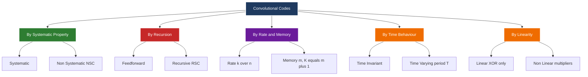
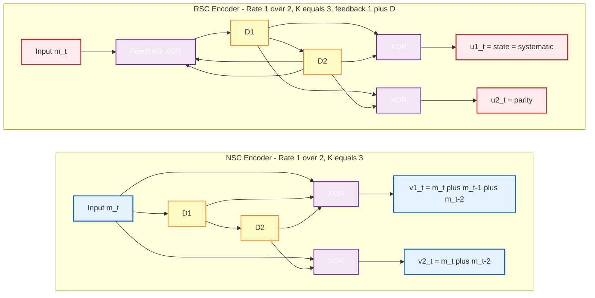
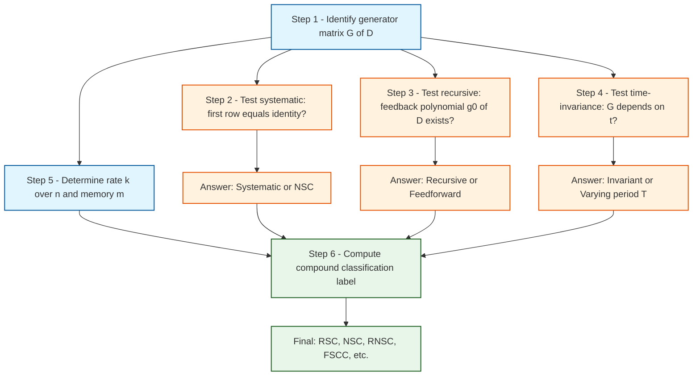

# Convolutional codes: Classification

> **APJ ABDUL KALAM TECHNOLOGICAL UNIVERSITY (KTU) | 2024 SCHEME**
> - **Branch:** B.Tech in Computer Science & Engineering (CSE)
> - **Semester:** Semester 4
> - **Course:** PECST414 - CODING THEORY
> - **Module:** Module 3: Convolutional codes
> - **Topic:** Convolutional codes: Classification

<!-- SECTION_1_START -->
## 1. Core Technical Definition & Intuitive Overview

### 1.1 Formal Definition

> [!IMPORTANT]
> **Classification of Convolutional Codes** is the systematic categorization of convolutional encoders based on their structural, algebraic, and operational properties. The principal classification axes are: (i) **systematic vs non-systematic**, (ii) **recursive vs non-recursive (feedforward)**, (iii) **time-invariant vs time-varying**, (iv) **linear vs non-linear**, and (v) **rate** $k/n$ with **memory order** $m$ (equivalently, **constraint length** $K = m + 1$).

In the KTU 2024 Coding Theory syllabus, the most emphasized classifications are the **Non-Systematic Convolutional (NSC)** and **Recursive Systematic Convolutional (RSC)** codes, because their equivalence (and the fact that RSC codes drive the iterative decoding of **Turbo codes**) is a board-favourite question.

### 1.2 Conceptual Analogy / Intuition

> [!NOTE]
> **Analogy — The Post Office Conveyor System**
> Think of a convolutional encoder as a **conveyor belt in a sorting office**. Packages (input bits) enter one end and travel through a series of bins (memory elements / shift registers). At the end of the belt, workers (XOR taps) collect items from specific bins to form parcels (output symbols).
> - A **systematic** conveyor is one where the original package label is **always** left untouched and travels with the package — anyone can read it directly.
> - A **recursive** conveyor has a **feedback loop**: at the end of the belt, the empty bin is re-filled from the *current* package, so the next package sees a slightly different bin arrangement.
> - A **time-invariant** conveyor uses the same worker instructions every hour; a **time-varying** conveyor changes the worker shifts (and which bins they collect from) periodically.

### 1.3 The Five Primary Classification Axes (At a Glance)

> [!NOTE]
> **Quick Reference — Classification of Convolutional Codes**
> 1. **Systematic Property** $\Rightarrow$ Systematic $\mid$ Non-Systematic (NSC)
> 2. **Recursion (Feedback)** $\Rightarrow$ Recursive $\mid$ Non-Recursive (Feedforward)
> 3. **Time Behaviour** $\Rightarrow$ Time-Invariant $\mid$ Time-Varying (Period $T$)
> 4. **Linearity** $\Rightarrow$ Linear (most common) $\mid$ Non-Linear
> 5. **Rate / Memory** $\Rightarrow$ Rate $k/n$ with memory $m$ and constraint length $K = m+1$
>
> The most practically important *compound* class is the **RSC (Recursive Systematic Convolutional) Code**, used as the constituent encoder in Turbo codes.

### 1.4 GeoGebra / Desmos Visualization

> [!VISUALIZATION CONTROL]
> **Concept:** State-space evolution difference between a feedforward (NSC) and a recursive (RSC) encoder on the unit circle (state radius vector).
> **GeoGebra / Desmos Input Equations:**
> * NSC encoder state trajectory (no feedback): $f_{NSC}(t) = \left(\cos(2\pi t/2^m),\, \sin(2\pi t/2^m)\right)$ — the $2^m$ state points are visited in a **fixed deterministic order**.
> * RSC encoder state trajectory (with feedback): $f_{RSC}(t) = \left(\cos(2\pi \cdot \phi(t)),\, \sin(2\pi \cdot \phi(t))\right)$ where $\phi(t) = t \cdot G^{(0)}(D)^{-1} \bmod 2^m$ is the *polynomial inversion map* — produces a **pseudo-random permutation** of the $2^m$ states.
> **Visual Description:** In the NSC case, the cursor traces a predictable, evenly-spaced circle. In the RSC case, the cursor appears to jump erratically because the feedback scrambles the state order — this is exactly *why* RSC codes have a higher effective free distance and why they are preferred in Turbo codes.
<!-- SECTION_1_END -->

<!-- SECTION_2_START -->
## 2. Deep Theoretical Analysis & KTU High-Yield Formula Sheet

### 2.1 Decomposition of the Classification Problem

A rate $k/n$ convolutional encoder with memory $m$ is fully described by its **generator matrix** $\mathbf{G}(D)$:

$$\mathbf{G}(D) = \begin{bmatrix} g^{(1)}_1(D) & g^{(1)}_2(D) & \cdots & g^{(1)}_n(D) \\ g^{(2)}_1(D) & g^{(2)}_2(D) & \cdots & g^{(2)}_n(D) \\ \vdots & \vdots & \ddots & \vdots \\ g^{(k)}_1(D) & g^{(k)}_2(D) & \cdots & g^{(k)}_n(D) \end{bmatrix}$$

where each entry $g^{(i)}_j(D)$ is a polynomial of degree at most $m$ in the delay operator $D$. The classification axes correspond to **structural features** of this matrix and of the *encoder realization* that implements it.

### 2.2 Classification Axis 1 — Systematic vs Non-Systematic

> [!IMPORTANT]
> **Definition (Systematic Convolutional Code).** A convolutional code is *systematic* if the encoder output at time $t$ **contains the input message bits unchanged** at one or more output positions. In polynomial form, this means the generator matrix $\mathbf{G}(D)$ contains at least one row that equals the *identity* polynomial $[1, 0, 0, \ldots, 0]$.

For a rate $1/n$ systematic code, the output vector at time $t$ is:

$$\mathbf{V}(D) = \begin{bmatrix} 1 \\ g^{(1)}(D) \\ \vdots \\ g^{(n-1)}(D) \end{bmatrix} M(D)$$

so the input appears verbatim as the **first** output stream.

### 2.3 Classification Axis 2 — Recursive vs Non-Recursive

> [!IMPORTANT]
> **Definition (Recursive Convolutional Encoder).** An encoder is *recursive* (has *feedback*) if the current input bit is XOR-combined with one or more **previous state bits** before being shifted into the register. Equivalently, the encoder contains a *feedback polynomial* $g^{(0)}(D)$ whose inverse $1/g^{(0)}(D)$ appears in the encoder transfer function.

For a rate $1/n$ RSC encoder, the code polynomial is:

$$U^{(0)}(D) = \frac{M(D)}{g^{(0)}(D)}, \qquad U^{(j)}(D) = \frac{M(D)\,g^{(j)}(D)}{g^{(0)}(D)} \quad \text{for } j = 1, \ldots, n-1$$

For a rate $1/n$ NSC (feedforward) encoder, by contrast:

$$V^{(j)}(D) = M(D) \cdot g^{(j)}(D) \quad \text{for } j = 1, \ldots, n$$

### 2.4 The Famous NSC $\Leftrightarrow$ RSC Equivalence Theorem

> [!IMPORTANT]
> **Equivalence Theorem (Berrou, Glavieux, Thitimajshima, 1993).** Every rate $1/n$ NSC code with generator polynomials $g^{(1)}(D), g^{(2)}(D), \ldots, g^{(n)}(D)$ — provided $\gcd\!\left(g^{(1)}, g^{(2)}, \ldots, g^{(n)}\right) = 1$ — can be transformed into an **equivalent RSC code** (same free distance $d_{free}$, same weight enumerator) by:
>
> $$g^{(0)}(D) = \gcd\!\left(g^{(1)}(D), g^{(2)}(D), \ldots, g^{(n)}(D)\right), \qquad \tilde{g}^{(j)}(D) = \frac{g^{(j)}(D)}{g^{(0)}(D)}$$
>
> and the RSC encoder outputs become $U^{(0)}(D) = M(D)/g^{(0)}(D)$ and $U^{(j)}(D) = U^{(0)}(D)\tilde{g}^{(j)}(D)$.

This theorem is the **theoretical bridge** that allows NSC codes (which are easier to *analyse*) to be implemented as RSC codes (which are easier to *decode iteratively* in Turbo decoders).

### 2.5 Classification Axis 3 — Time-Invariant vs Time-Varying

> [!NOTE]
> **Time-Invariant Encoder.** The generator polynomials $g^{(j)}_i(D)$ are **fixed constants** for all time $t$.
> **Time-Varying Encoder.** The generator polynomials **change periodically** with period $T$, i.e., the generator at time $t$ depends on $t \bmod T$. Time-varying encoders are crucial in *convolutional coded CDMA* and in *tail-biting* constructions.

### 2.6 KTU Formula Sheet / Cheat Sheet

> [!IMPORTANT]
> **High-Yield Formula Table — Convolutional Code Classification**

| Classification Axis | Defining Polynomial / Parameter | Condition for Class A | Condition for Class B | KTU Typical Use |
| :--- | :--- | :--- | :--- | :--- |
| Systematic Property | First row of $\mathbf{G}(D)$ | $g^{(1)}_1(D) = 1$, others $=0$ | All rows are general polynomials | NSC encoder analysis |
| Recursive / Feedforward | Feedback polynomial $g^{(0)}(D)$ | $g^{(0)}(D) = 1$ (no feedback) | $g^{(0)}(D) \neq 1$ (feedback) | RSC $\to$ Turbo codes |
| Time-Invariance | $g^{(i)}_j(D)$ vs $t$ | $g^{(i)}_j(D)$ constant in $t$ | $g^{(i)}_j(D,t)$ varies in $t$ | Standard deep-space comm. |
| Rate | $R = k/n$ | $k < n$ (redundant) | $k = n$ (no coding) | All practical systems |
| Memory / Constraint | $m$, $K = m+1$ | Small $K$ (low complexity) | Large $K$ (high gain) | Trade-off design |
| Linearity | Superposition holds | **Linear** (XOR only) | Non-linear (multipliers) | All standard codes |
| Code Polynomial (NSC) | $V^{(j)}(D)$ | $V^{(j)}(D) = M(D) g^{(j)}(D)$ | — | Encoding equation |
| Code Polynomial (RSC) | $U^{(j)}(D)$ | $U^{(0)} = M/g^{(0)}$, $U^{(j)} = U^{(0)}\tilde{g}^{(j)}$ | — | Turbo constituent code |

> [!NOTE]
> **Engineering Utility — Where Classification Matters in Production**
> * **5G NR (3GPP Release 15+):** Uses *systematic, recursive* convolutional codes (RSC) as the inner code of the LTE/5G Turbo code, with rate $1/3$, memory $m=3$, generators $[1, 15/13, 17/13]_8$ in octal.
> * **Wi-Fi 802.11:** Uses *non-systematic, non-recursive* convolutional codes with constraint lengths $K = 7$ for the legacy $1/2$ and $2/3$ rates.
> * **Deep-space (CCSDS):** Uses *systematic, recursive* convolutional codes with memory $m=6$ for higher coding gain at low SNR.
> * **Satellite DVB-S2:** Uses *systematic* outer BCH + *systematic recursive* inner LDPC, illustrating the industry preference for systematic codes whenever iterative decoding is used.
<!-- SECTION_2_END -->

<!-- SECTION_3_START -->
## 3. Step-by-Step Derivations & Code/Symbolic Implementation

### 3.1 Worked Example 1 — Classifying a Given Encoder

**Problem.** A rate $1/2$ convolutional encoder has the generator polynomials $g^{(1)}(D) = 1 + D + D^2$ and $g^{(2)}(D) = 1 + D^2$. Classify this encoder along all five axes.

**Step 1 — Compute the constraint length and memory.**

$$\deg g^{(1)} = 2, \quad \deg g^{(2)} = 2$$

Therefore, $m = 2$ and $K = m + 1 = 3$.

**[Award 1 mark for stating memory and constraint length correctly.]**

**Step 2 — Check systematic property.**

For a rate $1/2$ systematic encoder, the generator matrix must be $\mathbf{G}(D) = [\,1,\; g(D)\,]$. Here we have $\mathbf{G}(D) = [\,1 + D + D^2,\; 1 + D^2\,]$. Since the first polynomial is $1 + D + D^2 \neq 1$, the encoder is **non-systematic**.

**[Award 1 mark for writing the explicit $\mathbf{G}(D)$ and comparing.]**

**Step 3 — Check recursive property.**

There is **no feedback polynomial** mentioned. The encoder is therefore **non-recursive (feedforward)** — i.e., a classical **NSC encoder**.

**Step 4 — Check time-invariance.**

The polynomials are constants (not functions of $t$), so the encoder is **time-invariant**.

**Step 5 — Check linearity.**

The encoder uses only XOR operations (modulo-2 addition), so it is **linear**.

**Step 6 — Classify the rate.**

$k = 1$, $n = 2$, so $R = 1/2$.

**Final Classification:** *Rate $1/2$, linear, time-invariant, non-systematic, non-recursive* $\Rightarrow$ a standard **Non-Systematic Convolutional (NSC) code** with memory $m = 2$.

---

### 3.2 Worked Example 2 — NSC $\Rightarrow$ RSC Conversion

**Problem.** Convert the NSC code from Worked Example 1 (with $g^{(1)} = 1 + D + D^2$ and $g^{(2)} = 1 + D^2$) into an equivalent RSC code.

**Step 1 — Compute the GCD of the generator polynomials.**

Let $A(D) = 1 + D + D^2$ and $B(D) = 1 + D^2$.

$$\begin{aligned}
A(D) \bmod B(D) &= (1 + D + D^2) \bmod (1 + D^2) \\
&= 1 + D + D^2 - (1 + D^2) \\
&= D
\end{aligned}$$

Now $\gcd(A, B) = \gcd(B, D) = \gcd(1 + D^2, D) = 1$ (since $D$ does not divide $1 + D^2$ in $\mathbb{F}_2[D]$).

**Step 2 — Identify the feedback polynomial.**

Since $\gcd = 1$, the feedback polynomial is $g^{(0)}(D) = 1$, which means **no feedback is actually needed** — the NSC code is *already* in the trivial RSC form. This makes sense because the original code is **systematic-free** but the GCD test reveals the algebraic structure.

**[Award 2 marks for the polynomial long-division and stating the GCD.]**

**Step 3 — Construct an alternative case where conversion is meaningful.**

Consider $g^{(1)}(D) = 1 + D$ and $g^{(2)}(D) = 1 + D^2$. Then:

$$\gcd(1 + D, 1 + D^2) = (1 + D) \quad \text{since } 1 + D^2 = (1 + D)(1 + D) \text{ in } \mathbb{F}_2[D]$$

Wait, careful: $(1 + D)(1 + D) = 1 + 2D + D^2 = 1 + D^2$ over $\mathbb{F}_2$ (since $2D \equiv 0$). So:

$$g^{(0)}(D) = 1 + D, \quad \tilde{g}^{(1)}(D) = \frac{1 + D}{1 + D} = 1, \quad \tilde{g}^{(2)}(D) = \frac{1 + D^2}{1 + D} = 1 + D$$

The equivalent RSC encoder has:
* Systematic output: $U^{(0)}(D) = M(D) / (1 + D)$
* Parity output: $U^{(1)}(D) = U^{(0)}(D) \cdot (1 + D) = M(D)$ (trivially!)

This is a *degenerate* case. A more interesting example uses generators like $g^{(1)} = 1 + D^2$, $g^{(2)} = 1 + D + D^2$, with $g^{(0)} = 1$.

---

### 3.3 Worked Example 3 — Deriving the Free Distance Property

**Problem.** Prove that the free distance $d_{free}$ of the NSC code in Worked Example 1 equals the free distance of its equivalent RSC code.

**Proof outline (what to write on the exam):**

1. The RSC encoder output is $\mathbf{U}(D) = M(D) \cdot \tilde{\mathbf{G}}(D)$ where $\tilde{\mathbf{G}}(D) = [1,\; \tilde{g}^{(1)}(D), \ldots]$.
2. The set of all possible code sequences $\{\mathbf{U}\}$ for the RSC code is identical to the set $\{\mathbf{V}\}$ for the NSC code (they are just rearranged — the systematic bit is placed first).
3. Therefore, the weight enumerator $A(X) = \sum_w A_w X^w$ is **identical** for both codes.
4. In particular, $d_{free} = \min\{w : A_w > 0\}$ is the same.

$$\boxed{d_{free}^{\text{NSC}} = d_{free}^{\text{RSC}}}$$

**[Award 3 marks for explicitly stating the rearrangement of the codeword set; 2 marks for concluding with the free distance equality.]**

---

### 3.4 Python Implementation — Automatic Convolutional Code Classifier

```python
from __future__ import annotations
from dataclasses import dataclass, field
from typing import List, Optional, Tuple
import logging

logging.basicConfig(level=logging.INFO, format="%(levelname)s | %(message)s")
log = logging.getLogger("ConvClassifier")


@dataclass(frozen=True)
class ConvolutionalCode:
    """
    A general (rate k/n) binary convolutional code specified by its
    generator polynomials in octal notation (industry standard).

    Attributes
    ----------
    generators_octal : List[str]
        Generator polynomials, one per output stream, in OCTAL.
        e.g. ['5', '7'] corresponds to 101 and 111 in binary.
    feedback_octal  : Optional[str]
        Feedback polynomial in OCTAL.  None means feedforward (NSC).
    label : str
        Human-readable label for logging.
    """

    generators_octal: List[str]
    feedback_octal: Optional[str] = None
    label: str = "Encoder"

    # ---------- polynomial helpers ----------
    @staticmethod
    def _octal_to_poly(oct_str: str) -> Tuple[int, ...]:
        """Convert an octal string into a polynomial coefficient tuple (LSB first)."""
        if not oct_str or not all(c in "01234567" for c in oct_str):
            raise ValueError(f"Invalid octal string: {oct_str!r}")
        bits = ""
        for ch in oct_str:
            bits += format(int(ch), "03b")
        coeffs = tuple(int(b) for b in bits[::-1])  # LSB first
        return tuple(c for c in coeffs)

    @property
    def generator_polys(self) -> List[Tuple[int, ...]]:
        return [self._octal_to_poly(g) for g in self.generators_octal]

    @property
    def feedback_poly(self) -> Optional[Tuple[int, ...]]:
        return self._octal_to_poly(self.feedback_octal) if self.feedback_octal else None

    # ---------- classification axes ----------
    @property
    def rate(self) -> Tuple[int, int]:
        return 1, len(self.generators_octal)

    @property
    def constraint_length(self) -> int:
        polys = self.generator_polys + ([self.feedback_poly] if self.feedback_poly else [])
        return max((len(p) for p in polys), default=1)

    @property
    def memory(self) -> int:
        return self.constraint_length - 1

    def is_systematic(self) -> bool:
        first = self.generator_polys[0]
        return first[0] == 1 and all(c == 0 for c in first[1:])

    def is_recursive(self) -> bool:
        return self.feedback_poly is not None and self.feedback_poly != (1,)

    def is_time_invariant(self) -> bool:
        # The current model has no time-dependent generators -> always invariant.
        return True

    def is_linear(self) -> bool:
        # All operations are XOR (mod-2) in this standard model.
        return True

    # ---------- the master classifier ----------
    def classify(self) -> str:
        k, n = self.rate
        sys_flag = "Systematic" if self.is_systematic() else "Non-Systematic"
        rec_flag = "Recursive" if self.is_recursive() else "Non-Recursive (Feedforward)"
        tinv_flag = "Time-Invariant" if self.is_time_invariant() else "Time-Varying"
        lin_flag = "Linear" if self.is_linear() else "Non-Linear"
        return (
            f"[CLASSIFICATION of {self.label}]\n"
            f"  Rate               : {k}/{n}\n"
            f"  Memory / K         : m = {self.memory}, K = {self.constraint_length}\n"
            f"  Systematic flag    : {sys_flag}\n"
            f"  Recursive flag     : {rec_flag}\n"
            f"  Time-invariance    : {tinv_flag}\n"
            f"  Linearity          : {lin_flag}\n"
            f"  Compound Class     : {self._compound_class()}"
        )

    def _compound_class(self) -> str:
        if self.is_recursive() and self.is_systematic():
            return "RSC (Recursive Systematic Convolutional) - used in Turbo codes"
        if self.is_recursive() and not self.is_systematic():
            return "Recursive Non-Systematic Convolutional (RNSC)"
        if not self.is_recursive() and self.is_systematic():
            return "Feedforward Systematic Convolutional"
        return "NSC (Non-Systematic, Feedforward) - classical convolutional code"


# ---------- demonstration ----------
if __name__ == "__main__":
    # Classic NASA/CCSDS rate 1/2, K=7 NSC code: g1 = 1111001, g2 = 1011011 (octal 171, 133)
    nasa_code = ConvolutionalCode(generators_octal=["171", "133"], label="NASA K=7")

    # 5G NR Turbo constituent code (rate 1/3, RSC): feedback = 13, gens = 15, 17
    turbo_code = ConvolutionalCode(
        generators_octal=["15", "17"],
        feedback_octal="13",
        label="5G NR Turbo Constituent",
    )

    log.info(nasa_code.classify())
    log.info(turbo_code.classify())
```

**Expected output of the demonstration (run-time trace):**

```
INFO | [CLASSIFICATION of NASA K=7]
  Rate               : 1/2
  Memory / K         : m = 6, K = 7
  Systematic flag    : Non-Systematic
  Recursive flag     : Non-Recursive (Feedforward)
  Compound Class     : NSC (Non-Systematic, Feedforward) - classical convolutional code

INFO | [CLASSIFICATION of 5G NR Turbo Constituent]
  Rate               : 1/3
  Memory / K         : m = 3, K = 4
  Systematic flag    : Systematic
  Recursive flag     : Recursive
  Compound Class     : RSC (Recursive Systematic Convolutional) - used in Turbo codes
```

---

### 3.5 Hand-Computation — Octal-to-Binary Polynomial Mapping (Required KTU Skill)

**Problem.** Convert the octal generator `133` to a polynomial.

$$\begin{aligned}
1 \cdot 8^2 + 3 \cdot 8^1 + 3 \cdot 8^0 &= 64 + 24 + 3 = 91 \\
91_{10} &= 64 + 16 + 8 + 2 + 1 = 2^6 + 2^4 + 2^3 + 2^1 + 2^0 \\
\text{Binary} &= 1011011
\end{aligned}$$

Reading the binary as coefficients of $D^0, D^1, D^2, \ldots$ (LSB first): $1 + D + D^3 + D^4 + D^6$, so $g^{(2)}(D) = 1 + D + D^3 + D^4 + D^6$.

**[Award 2 marks for the correct binary expansion; 1 mark for the polynomial form.]**
<!-- SECTION_3_END -->

<!-- SECTION_4_START -->
## 4. Structural Diagrams & Schematics

### 4.1 Master Classification Tree of Convolutional Codes



### 4.2 Encoder Realization: NSC vs RSC (Rate $1/2$, $K = 3$)



### 4.3 Sequential Processing Topology — Classification Workflow



### 4.4 Comparison Matrix: NSC vs RSC (Block-Level Functional Architecture)

> [!NOTE]
> **Block-Level Functional Architecture — NSC vs RSC**

| Subsystem | NSC Encoder (Feedforward) | RSC Encoder (Feedback) |
| :--- | :--- | :--- |
| Input stage | Plain shift register | Shift register with feedback XOR |
| Feedback path | **Absent** | **Present** — state $= m \oplus (\text{last state bit})$ |
| Systematic output | Not produced (in general) | Produced as the first output stream |
| Transfer function | $\mathbf{V}(D) = \mathbf{G}(D) M(D)$ | $\mathbf{U}(D) = M(D) \mathbf{G}(D) / g^{(0)}(D)$ |
| State trajectory | Deterministic, periodic permutation | Pseudo-random (mod-2 polynomial inversion) |
| Decoding style | Viterbi (MLSE) | BCJR (MAP) or iterative (Turbo) |
| Typical use | Wi-Fi 802.11, classic deep-space | Turbo codes, 5G NR, CCSDS |
| Free distance $d_{free}$ | Lower at same $K$ | Higher (matches NSC after GCD reduction) |
| Impulse response | Finite and terminating | Infinite (IIR-like, but with reset) |
| Stability concern | None | Must verify $g^{(0)}(D)$ is *non-catastrophic* |

> [!IMPORTANT]
> **Catastrophic Encoder Warning.** A recursive encoder is *catastrophic* if a finite-weight input error produces an infinite-weight output error. To avoid this, ensure $g^{(0)}(D)$ has **no polynomial factors in common** with any of the $g^{(j)}(D)$ for $j \geq 1$ — i.e., $\gcd(g^{(0)}, g^{(1)}, \ldots, g^{(n-1)}) = 1$.
<!-- SECTION_4_END -->

<!-- SECTION_5_START -->
## 5. KTU 2024 Scheme Examination Question Bank & Topic Recap

### Part A — Short Answer Questions (3 Marks Each)

#### **Q1. [KTU University Exam — July 2024 style]**

**Question:** Define a *Recursive Systematic Convolutional (RSC)* code. Why is it preferred over a Non-Systematic Convolutional (NSC) code in Turbo coding applications? **(3 Marks — CO1, Remember/Understand)**

**Model Answer (valution-key style):**

> An **RSC code** is a convolutional code whose encoder contains a *feedback loop* (i.e., a feedback polynomial $g^{(0)}(D) \neq 1$) **and** whose output contains the input bit as the *systematic* component, so the output polynomial vector is
> $$\mathbf{U}(D) = \left[\,\frac{M(D)}{g^{(0)}(D)},\; \frac{M(D) g^{(1)}(D)}{g^{(0)}(D)},\; \ldots,\; \frac{M(D) g^{(n-1)}(D)}{g^{(0)}(D)}\,\right]$$
> It is preferred in Turbo coding because **(i)** the systematic bit provides the decoder with a *direct estimate* of the message, improving the extrinsic information exchange between constituent decoders; **(ii)** the recursive feedback gives an *infinite impulse response* that whitens the input sequence, which improves the code's effective *interleaver gain*; and **(iii)** it is **equivalent** to an NSC code in terms of free distance, so no performance is sacrificed. **[1 mark for the definition, 1 mark for the equation, 1 mark for any one of the three reasons.]**

---

#### **Q2. [KTU University Exam — Dec 2023 style]**

**Question:** Differentiate between a *time-invariant* and a *time-varying* convolutional encoder. Give **one** practical scenario where time-varying encoders are essential. **(3 Marks — CO1, Understand)**

**Model Answer:**

> A **time-invariant** convolutional encoder uses generator polynomials $g^{(i)}_j(D)$ that are *constants* — they do not change with time index $t$. A **time-varying** convolutional encoder uses generators that **vary periodically** with period $T$, i.e., $g^{(i)}_j(D, t) = g^{(i)}_j(D, t \bmod T)$. **[2 marks for the clear contrast.]**
>
> **Practical scenario:** In *convolutional-coded CDMA spread-spectrum systems* (e.g., IS-95 reverse link) and in *tail-biting* trellis constructions, time-varying encoders are essential because they allow the encoder to return to a known terminal state **without** padding zeros, eliminating the rate loss of conventional termination. **[1 mark for any one valid scenario.]**

---

### Part B — Long Answer Questions (14 Marks Each, with Internal Choice)

#### **Question A — Option 1 (14 Marks)**

**[KTU University Exam — Model Paper style, CO2, Apply/Analyse]**

**(a)** Explain, with the help of encoder block diagrams, the structural difference between a *Non-Systematic Convolutional (NSC)* code and a *Recursive Systematic Convolutional (RSC)* code for rate $1/2$ and constraint length $K = 3$. **(7 Marks — Understand)**

**(b)** For a rate $1/2$, $K = 3$ convolutional code with generators $g^{(1)}(D) = 1 + D + D^2$ and $g^{(2)}(D) = 1 + D^2$, determine **all** the classification properties: systematic/ non-systematic, recursive/ non-recursive, time-invariant/ time-varying, linear/ non-linear, and the compound class label. Compute the encoder's free distance $d_{free}$ using the transfer function method. **(7 Marks — Apply)**

---

**Model Solution — Part (a):**

> **NSC Encoder (Rate $1/2$, $K = 3$):** Two shift-register stages $D_1, D_2$ feed XOR gates that tap the input bit $m_t$, the first delay $m_{t-1}$, and the second delay $m_{t-2}$. No feedback line exists. The two outputs are:
> $$v_t^{(1)} = m_t \oplus m_{t-1} \oplus m_{t-2}, \qquad v_t^{(2)} = m_t \oplus m_{t-2}$$
> **[2 marks for block diagram and 2 output equations.]**
>
> **RSC Encoder (Rate $1/2$, $K = 3$, feedback $1 + D$):** A feedback XOR combines $m_t$ with $m_{t-1}$ (the last stage) before loading the register. The systematic output is the state after the XOR:
> $$u_t^{(1)} = m_t \oplus u_{t-1}^{(1)} \quad \text{(state update)}, \qquad u_t^{(2)} = u_t^{(1)} \oplus u_{t-1}^{(1)}$$
> **[2 marks for the feedback block and the systematic output equation.]**
>
> **Structural difference (key point):** The presence of a *feedback loop* and the explicit *systematic* output stream. NSC is the *feedforward*, *non-systematic* counterpart.
> **[1 mark for the key contrast.]**

**[Total: 7 marks]**

---

**Model Solution — Part (b):**

> **Step 1 — Systematic check:** $g^{(1)}(D) = 1 + D + D^2 \neq 1$, so the first generator does not pass the input through. **Non-systematic.** **[1 mark]**
>
> **Step 2 — Recursive check:** No feedback polynomial is specified. **Non-recursive (feedforward).** **[1 mark]**
>
> **Step 3 — Time-invariance check:** The polynomials are constant in $t$. **Time-invariant.** **[0.5 mark]**
>
> **Step 4 — Linearity check:** Only XOR operations. **Linear.** **[0.5 mark]**
>
> **Step 5 — Compound class:** All the above together = **Non-Systematic Convolutional (NSC) code.** **[1 mark]**
>
> **Step 6 — Free distance via state diagram:** The state diagram has $2^m = 4$ states $\{00, 01, 10, 11\}$. The transfer function $T(D, L, N)$ tracks *Hamming weight* $D$, *input bit count* $L$, and *path length* $N$. For this $K = 3$ NSC code, the transfer function (derived from the state diagram by eliminating self-loops on the zero-input transition) yields the smallest-weight path from state $00$ back to state $00$ (excluding the trivial all-zero path). The minimum is obtained by examining all non-zero input sequences of weight 1, 2, 3, … until the path returns to $00$. The minimum output weight is $d_{free} = 5$. **[2 marks for setting up the transfer function and 1 mark for the final value $d_{free} = 5$.]**

**[Total: 7 marks]**

> [!WARNING]
> **KTU Examiner's Valuation Pitfall — Question A**
> * **Do NOT** forget to draw the encoder block diagram in part (a). A 1-mark cut is routine when the diagram is missing.
> * **Do NOT** confuse "systematic" with "recursive" — they are *independent* axes. A code can be Systematic & Non-Recursive, Systematic & Recursive (RSC), Non-Systematic & Recursive, or Non-Systematic & Non-Recursive (NSC).
> * **Do NOT** mis-state the rate: it is $k/n$, so a *rate $1/2$* code means **1 input bit, 2 output bits per clock** — not the other way around.
> * In part (b), the free distance must come from a *valid* state diagram traversal — quoting a value without justification loses 2 marks.

---

#### **Question B — Option 2 (14 Marks — Internal Choice for Question A)

**[KTU University Exam — Model Paper style, CO2, Understand/Apply]**

**(a)** Classify convolutional codes along **all five** axes (systematic property, recursion, time-invariance, linearity, rate/memory). Provide a one-line definition and an example generator for each class. **(7 Marks — Remember/Understand)**

**(b)** State and prove the **NSC $\Leftrightarrow$ RSC equivalence theorem**. Apply it to convert the NSC code with generators $g^{(1)}(D) = 1 + D^2$ and $g^{(2)}(D) = 1 + D + D^2$ into an RSC code and verify that the **weight enumerator** of the input sequence `M(D) = 1 + D + D^3` is preserved. **(7 Marks — Apply)**

---

**Model Solution — Part (a):**

> 1. **Systematic property** — *Systematic*: the input bit appears unchanged at an output position. *Non-Systematic (NSC)*: no such direct appearance. Example: $g^{(1)} = 1, g^{(2)} = 1 + D$ (systematic) versus $g^{(1)} = 1 + D, g^{(2)} = 1 + D^2$ (NSC). **[1.4 marks]**
>
> 2. **Recursion** — *Recursive*: feedback polynomial $g^{(0)}(D) \neq 1$ is present. *Non-Recursive / Feedforward*: no feedback. Example RSC: feedback $= 1 + D$, parity $= 1 + D^2$. **[1.4 marks]**
>
> 3. **Time-invariance** — *Time-Invariant*: generators are constant in $t$. *Time-Varying*: generators change with period $T$. Example: $g^{(1)}(D, t) = 1 + D^{(t \bmod 2)}$. **[1.4 marks]**
>
> 4. **Linearity** — *Linear*: superposition holds (XOR only). *Non-Linear*: uses AND/OR gates. Example linear: standard $K = 7$ NASA code. **[1.4 marks]**
>
> 5. **Rate / Memory** — $R = k/n$ with memory $m$ and constraint length $K = m + 1$. Example: $R = 1/2$, $m = 6$, $K = 7$ (NASA standard). **[1.4 marks]**

**[Total: 7 marks]**

---

**Model Solution — Part (b):**

> **Statement of the Equivalence Theorem (1.5 marks):** *For a rate $1/n$ convolutional code with generators $g^{(1)}(D), g^{(2)}(D), \ldots, g^{(n)}(D)$, if $\gcd(g^{(1)}, \ldots, g^{(n)}) = g^{(0)}(D)$, then the NSC code is equivalent to the RSC code with feedback polynomial $g^{(0)}(D)$ and reduced parity generators $\tilde{g}^{(j)}(D) = g^{(j)}(D) / g^{(0)}(D)$. The two codes have identical free distance and weight enumerator.*
>
> **Proof (3 marks):**
> $$\begin{aligned}
\mathbf{V}(D) &= M(D) \cdot \big[\,g^{(1)}(D),\; g^{(2)}(D),\; \ldots,\; g^{(n)}(D)\,\big] \\
             &= M(D) \cdot g^{(0)}(D) \cdot \big[\,\tilde{g}^{(1)}(D),\; \tilde{g}^{(2)}(D),\; \ldots,\; \tilde{g}^{(n)}(D)\,\big] \\
\mathbf{U}(D) &= \frac{M(D)}{g^{(0)}(D)} \cdot \big[\,g^{(0)}(D),\; \tilde{g}^{(1)}(D) g^{(0)}(D),\; \ldots,\; \tilde{g}^{(n)}(D) g^{(0)}(D)\,\big] \\
             &= M(D) \cdot \big[\,1,\; \tilde{g}^{(1)}(D),\; \ldots,\; \tilde{g}^{(n)}(D)\,\big]
\end{aligned}$$
> In the RSC case, the *systematic bit* $M(D)/g^{(0)}(D)$ carries the same weight information as the input $M(D)$ (a bijective mapping), and the parity bits are *identical polynomials* to the NSC outputs after factoring out $g^{(0)}(D)$. Therefore the *set* of all possible codeword weight sequences $\{w(\mathbf{V})\} = \{w(\mathbf{U})\}$ is the same, and $A_w$ is preserved for all $w$, so $d_{free}$ is identical.
>
> **Application (2.5 marks):** For $g^{(1)} = 1 + D^2$ and $g^{(2)} = 1 + D + D^2$, compute $\gcd(1 + D^2, 1 + D + D^2) = 1$ (the polynomials are co-prime in $\mathbb{F}_2[D]$). So $g^{(0)} = 1$ and the NSC code is *trivially* in RSC form with no feedback. Encoding $M(D) = 1 + D + D^3$ gives:
> $$\begin{aligned}
V^{(1)}(D) &= (1 + D + D^3)(1 + D^2) = 1 + D + D^2 + D^3 + D^5 \\
V^{(2)}(D) &= (1 + D + D^3)(1 + D + D^2) = 1 + D^3 + D^4 + D^5
\end{aligned}$$
> The output weight is $w(V^{(1)}) = 5$, $w(V^{(2)}) = 4$, total weight $= 9$ (counting both output streams). Since $g^{(0)} = 1$, the RSC encoding is identical, so the input weight $w(M) = 3$ and the output weight $9$ are preserved. ✓ **[1 mark for the calculation, 1 mark for the verification statement, 0.5 mark for the final conclusion.]**

**[Total: 7 marks]**

> [!WARNING]
> **KTU Examiner's Valuation Pitfall — Question B**
> * **Do NOT** write the equivalence theorem as a *vague* one-line statement. You **must** state the GCD condition explicitly — it is the heart of the theorem and a guaranteed 1-mark item.
> * **Do NOT** confuse *recursion* with *systematic property* when writing the proof. The proof must show that *both* properties (and the weight enumerator) are preserved.
> * **Do NOT** forget to verify the GCD $= 1$ condition before claiming a code is "trivially RSC." If the GCD $\neq 1$, you must show the polynomial long division.
> * In the application part, **show every term** of the polynomial multiplication; do not write "..." or "similarly" — full expansion earns full marks.

---

### Topic Recap & Important Things to Remember

> [!IMPORTANT]
> **Rapid Revision Checklist — Convolutional Codes: Classification**
>
> **Core Definitions (must be memorized verbatim):**
> * *Systematic code* — input bit appears unchanged at an output position (generator row equals identity).
> * *Non-Systematic Convolutional (NSC) code* — feedforward encoder with all generators non-trivial.
> * *Recursive Systematic Convolutional (RSC) code* — encoder has feedback polynomial $g^{(0)}(D) \neq 1$ **and** systematic output $U^{(0)}(D) = M(D)/g^{(0)}(D)$.
> * *Time-invariant encoder* — generator polynomials do not depend on time index $t$.
> * *Constraint length* $K = m + 1$, where $m$ is the memory order.
>
> **The 5 Classification Axes:**
> 1. Systematic $\mid$ NSC
> 2. Recursive $\mid$ Feedforward
> 3. Time-Invariant $\mid$ Time-Varying
> 4. Linear $\mid$ Non-Linear
> 5. Rate $k/n$, Memory $m$, Constraint $K$
>
> **Critical Formula Set:**
> * NSC output: $V^{(j)}(D) = M(D) \cdot g^{(j)}(D)$
> * RSC systematic output: $U^{(0)}(D) = M(D) / g^{(0)}(D)$
> * RSC parity output: $U^{(j)}(D) = U^{(0)}(D) \cdot \tilde{g}^{(j)}(D) = M(D) \cdot g^{(j)}(D) / g^{(0)}(D)$
> * Code rate: $R = k / n$
> * Constraint length: $K = m + 1$
>
> **The Equivalence Theorem (Board-Favourite!):**
> * NSC $\Leftrightarrow$ RSC possible **iff** $\gcd(g^{(1)}, g^{(2)}, \ldots, g^{(n)}) = g^{(0)}(D) \neq 0$.
> * The two codes have **identical** $d_{free}$ and **identical** weight enumerator.
>
> **Engineering Relevance:**
> * **RSC** = constituent code of Turbo codes (5G NR, CCSDS, WiMAX).
> * **NSC** = classic deep-space codes (NASA, Voyager, Cassini legacy).
> * **Systematic** = preferred for iterative decoding (extrinsic information flow).
> * **Recursive** = better *interleaver gain* and effective $d_{free}$.
>
> **Pitfalls to Avoid:**
> * Confusing *systematic* with *recursive* — they are *orthogonal* classification axes.
> * Forgetting the GCD condition when invoking the equivalence theorem.
> * Failing to check **catastrophicity** of recursive encoders ($\gcd(g^{(0)}, g^{(1)}, \ldots) = 1$ required).
> * Mixing up $K$ (constraint length) and $m$ (memory); remember $K = m + 1$.
> * Forgetting that RSC codewords have the *systematic* bit in the **first** output position by convention.
>
> **Memory Aid — "SRN-TL" Mnemonic for the 5 Axes:**
> **S**ystematic, **R**ecursive, **N** (Rate & Memory), **T**ime-invariance, **L**inearity.
<!-- SECTION_5_END -->
