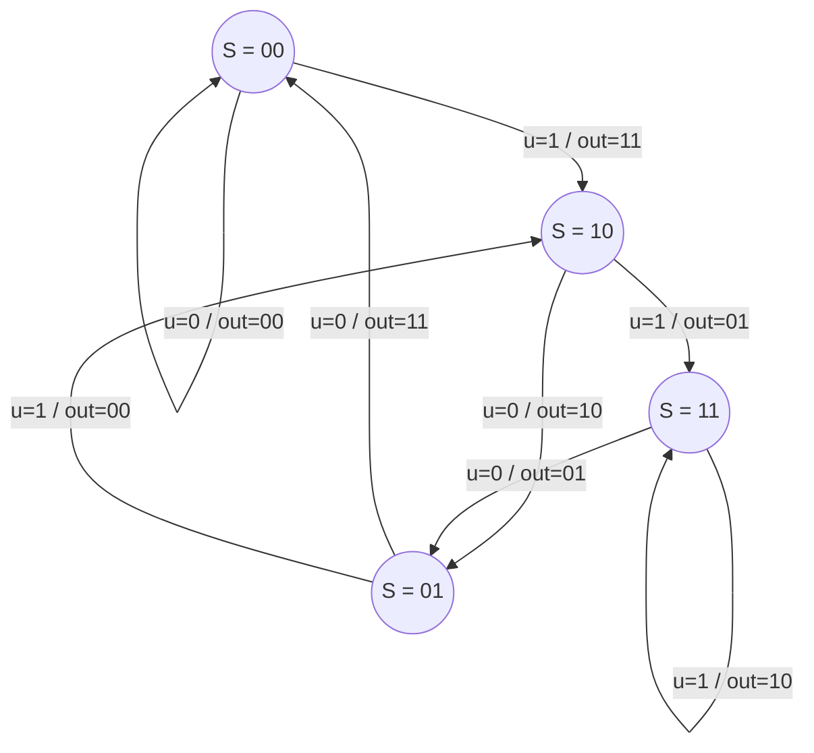
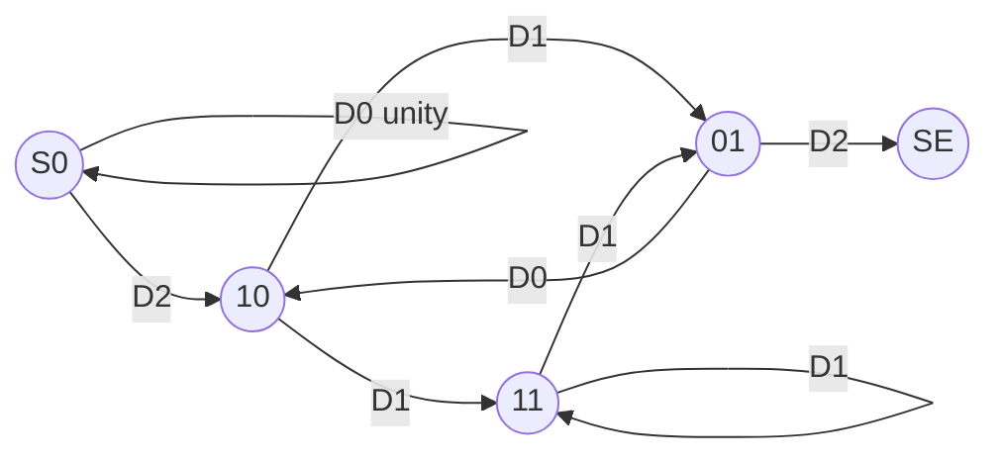
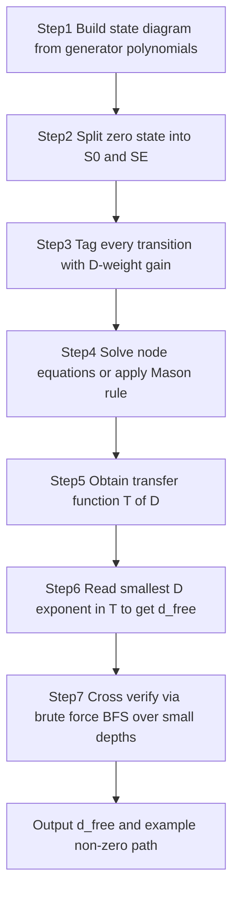

# Convolutional codes: distance properties

> **APJ ABDUL KALAM TECHNOLOGICAL UNIVERSITY (KTU) | 2024 SCHEME**
> - **Branch:** B.Tech in Computer Science & Engineering (CSE)
> - **Semester:** Semester 4
> - **Course:** PECST414 - CODING THEORY
> - **Module:** Module 3: Convolutional codes
> - **Topic:** Convolutional codes: distance properties

<!-- SECTION_1_START -->
# 1. Core Technical Definition & Intuitive Overview

## 1.1 Formal Definition (KTU 2024 Syllabus Terminology)

In convolutional coding theory, the **distance properties** of a convolutional code characterize the minimum separation between any two distinct encoded sequences produced by the encoder. These properties directly govern the **error-detecting** and **error-correcting capability** of the code, and they are the principal metrics used to compare codes of identical rate and constraint length.

> [!IMPORTANT]
> **Core Definitions (Board-Favourite)**
>
> 1. **Free Distance ($d_{free}$):** The minimum Hamming distance between *any two distinct codewords* (encoded output sequences) of a convolutional code. Equivalently, it is the minimum weight of any non-zero path in the state/trellis diagram that begins and ends at the **zero state**.
>
> 2. **Active Distance:** A generalization used in streaming/tail-biting scenarios where the codeword is not forced to terminate at the zero state.
>
> 3. **Minimum Distance ($d_{min}$):** For *terminated* (block) convolutional codes, this is the minimum column distance (or true minimum distance) computed over all pairs of distinct, finite-length codewords that begin in the zero state.
>
> 4. **Distance Spectrum (Weight Enumerator):** The complete list $\{A_d\}$ where $A_d$ is the number of codewords having Hamming weight exactly $d$ in their first non-trivial segment. The free distance is the smallest $d$ for which $A_d \neq 0$.

Formally, for an $(n, k, K)$ convolutional code (where $K$ is the constraint length in memory units) with code sequences $\mathbf{c}^{(1)}$ and $\mathbf{c}^{(2)}$:

$$d_{free} = \min_{\mathbf{u}^{(1)} \neq \mathbf{u}^{(2)}} \left\{ d_H\!\left(\mathbf{c}^{(1)}, \mathbf{c}^{(2)}\right) \right\}$$

Because convolutional codes are **linear**, this is equivalent to:

$$d_{free} = \min_{\mathbf{u} \neq \mathbf{0}} \left\{ w_H(\mathbf{c}) \right\}$$

where $w_H(\mathbf{c})$ is the Hamming weight of the codeword $\mathbf{c}$ produced by a non-zero information sequence $\mathbf{u}$.

> [!NOTE]
> **Linearity Justification (Examiner Expectation):** In a linear code, the difference of two codewords is itself a codeword. Therefore, finding the minimum distance *between* any two codewords reduces to finding the minimum *weight* of a single non-zero codeword — exactly $d_{free}$.

## 1.2 Conceptual Analogy / Intuitive Overview

Think of a convolutional encoder as a **ball bouncing around a maze with four rooms** (the four states: 00, 10, 01, 11). Each bounce corresponds to one clock instant and leaves a "footprint" (the output bits) on the floor. The **free distance** is the *smallest total number of footprints* you can produce on any round trip that starts and ends in the *starting room* (state 00) but actually *visits* at least one other room along the way (i.e., a non-zero input is applied).

Another way: imagine each legal encoded output as a *signature pattern*. The **free distance** is the *smallest number of differing ink-drops* between any two genuinely different signatures. The bigger $d_{free}$ is, the easier it is to tell the signatures apart when the channel adds noise.

## 1.3 Physical Constants / Standard Metrics

The following are the **standard KTU 2024 board-listed metrics** for convolutional-code distance analysis:

- **$d_{free}$** — Free distance (the *headline* metric, in integer bit units).
- **$A_d$** — Number of codewords of weight $d$ (also called the *distance spectrum* coefficient).
- **$N_d$** — Number of information sequences producing a codeword of weight $d$ (the *input-weight-conditioned* spectrum).
- **$t$** — Error-correcting capability $= \left\lfloor \dfrac{d_{free} - 1}{2} \right\rfloor$ for *random* error correction.
- **$B_d$** — Cumulative weight spectrum: $B_d = \sum_{i=d}^{\infty} A_i$.

## 1.4 Geometric / Visual Representation (GeoGebra / Desmos Integration)

> [!VISUALIZATION CONTROL]
> **Concept:** Plot of output-weight (Y-axis) versus time index (X-axis) for a non-zero encoded path returning to the zero state — illustrating that the *integral under the step* equals the free distance.
>
> **GeoGebra / Desmos Input Equations:**
> * $f(x) = 1,\ x \in [0,3]\ \cup\ [5,8]$ (a sample non-zero path returning to zero state)
> * $g(x) = 0$ (baseline zero path)
> **Visual Description:** Two step functions on the same X-axis. The shaded area between them over the support of $f$ is $w_H(\mathbf{c}) = 5$, illustrating the **minimum-weight round-trip path** for the canonical $(2,1,3)$ code with generators $g^{(1)} = (1,1,1)$ and $g^{(2)} = (1,0,1)$.

<!-- SECTION_1_END -->

<!-- SECTION_2_START -->
# 2. Deep Theoretical Analysis & KTU High-Yield Formula Sheet

## 2.1 Operational Logic of Distance Property Computation

The free distance is computed through a **state-diagram traversal** technique. The procedure is:

1. **Construct the state diagram** of the convolutional encoder (nodes = states, directed edges = transitions labelled `input/output`).
2. **Discard the zero-weight self-loop** at the zero state (the `0/00…0` transition in a binary code), because it corresponds to a no-op and produces a zero-weight, zero-distance path. *However*, for the *transfer function* approach, it is retained and assigned a *unity gain* $D^0 = 1$.
3. **Identify all non-trivial paths** that start at state 00, traverse at least one non-zero edge, and eventually return to state 00.
4. **Compute the Hamming weight** (= number of `1`s in the output bits) of each such path.
5. **The minimum such weight** is $d_{free}$.

> [!IMPORTANT]
> **Why discard the self-loop?** The `0/00…0` self-loop at state 00 produces an output of all zeros. Including it without special treatment would falsely suggest an infinite sequence of zero-weight paths, and the minimum would be incorrectly reported as **0**. The standard fix is to assign this transition a gain of $D^0$ and structurally split the zero state into $S_0$ (entry) and $S_E$ (exit), so paths through the loop are not counted as round trips.

## 2.2 Transfer Function / Path Enumeration Method

A more powerful method computes the **complete distance spectrum** (not just $d_{free}$). We label each transition in the modified state diagram with a *formal variable* gain:

| Variable | Meaning | Exponent Counts |
| :---: | :--- | :--- |
| $D$ | Output Hamming weight | $w_H$ of the output tuple |
| $N$ | Input Hamming weight | $w_H$ of the input bit |
| $L$ | Path length (branches) | number of clock cycles |
| $I$ | Identity / no contribution | — |

Each edge label `input/output` becomes a monomial $D^{w_H(\text{out})} \cdot N^{w_H(\text{in})} \cdot L^{1}$. We then compute the **transfer function**:

$$T(D, N, L) = \sum_{\text{all non-zero paths from } S_0 \text{ to } S_E} D^{w_H(\text{out})} N^{w_H(\text{in})} L^{\text{length}}$$

> [!NOTE]
> **Coefficient Extraction Rule:** Expanding $T(D, N, L)$ as a Taylor series in $D, N, L$, the coefficient of $D^d$ — after setting $N = 1, L = 1$ — gives $A_d$ (number of codewords of weight $d$). The smallest $d$ for which this coefficient is non-zero is exactly $d_{free}$.

## 2.3 KTU Formula Sheet / Cheat Sheet

| # | Formula / Property | Description | Where Used |
| :---: | :--- | :--- | :--- |
| 1 | $d_{free} = \min_{\mathbf{u} \neq \mathbf{0}} w_H(\mathbf{G}\mathbf{u})$ | Free distance via linearity | Definition, KTU Part A |
| 2 | $t = \left\lfloor \dfrac{d_{free}-1}{2} \right\rfloor$ | Random-error-correcting capability | Error-correction problem |
| 3 | $d_{\text{detect}} = d_{free}$ | Maximum detectable error burst/weight | Detection problem |
| 4 | $P_b \approx \dfrac{1}{k} \sum_{d=d_{free}}^{\infty} A_d \cdot P_d$ | First-event bit-error probability | KTU module end |
| 5 | $P_d = \sum_{j=\lceil d/2 \rceil}^{d} \binom{d}{j} p^{j}(1-p)^{d-j}$ | Probability of confusing weight-$d$ codeword (BSC) | Bound calculation |
| 6 | $T(D,N,L) = \dfrac{D^{5} N L^{3}}{1 - D N L(1+L)}$ | Transfer function for $(2,1,3)$ code, $g^{(1)} = (1,1,1),\ g^{(2)} = (1,0,1)$ | Canonical KTU example |
| 7 | $A_d = [D^d]\, T(D,1,1)$ | Distance spectrum coefficient | Spectral analysis |
| 8 | $d_{min} \le d_{free}$ | Inequality (with equality for terminated codes) | Active-distance theorems |

> [!IMPORTANT]
> **Pipeline Engineering Relevance (Real-world utility):**
> * In **4G LTE** and **5G NR**, convolutional codes (specifically *terminated* and *tail-biting* variants) are still used for control channels, and their $d_{free}$ directly determines the link-level BLER (Block Error Rate) curves published in 3GPP specifications.
> * In **deep-space communication** (e.g., NASA's *Deep Space Network*), $d_{free}$ governs the **coding gain** at low SNR, achieving the required bit-energy efficiency at $E_b/N_0 \approx 0.5$ dB.
> * In **disk-drive storage**, convolutional codes compete with LDPC codes; the *active burst-distance* (an extension of free distance) determines burst-error resilience.

## 2.4 The "Why" Behind Each Property

- **Why $d_{free}$ and not $d_{min}$?** Convolutional codes are inherently *streaming* — they don't have a fixed block length. The "free" in $d_{free}$ means *unconstrained length*, capturing the *asymptotic* minimum separation.
- **Why use the transfer function?** Brute-forcing all paths is exponential. The transfer function reduces the problem to a *rational function evaluation* by leveraging the **regular structure** of the state diagram.
- **Why split the zero state?** To prevent counting the trivial `00→00` path as a non-zero round trip. Splitting creates a unique source $S_0$ and sink $S_E$.

<!-- SECTION_2_END -->

<!-- SECTION_3_START -->
# 3. Step-by-Step Derivations & Code/Symbolic Implementation

## 3.1 Worked Example — Canonical (2, 1, 3) Encoder

**Encoder specification** (canonical KTU board example):
* Rate $R = k/n = 1/2$
* Constraint length $K = 3$ (i.e., $K-1 = 2$ memory elements)
* Generator polynomials: $g^{(1)} = (1, 1, 1)$, $g^{(2)} = (1, 0, 1)$

Output equations at time $k$:

$$v_k^{(1)} = u_k \oplus u_{k-1} \oplus u_{k-2}$$

$$v_k^{(2)} = u_k \oplus u_{k-2}$$

State is defined as $S = (u_{k-1}, u_{k-2})$, encoded as a 2-bit label.

### Step 1 — State Transition Table (Exhaustive Enumeration)

For each of the 4 states and each input $u_k \in \{0, 1\}$, compute the next state and the output pair:

| Current State $S = (u_{k-1}, u_{k-2})$ | $u_k$ | Output $(v^{(1)}, v^{(2)})$ | Next State $S' = (u_k, u_{k-1})$ |
| :---: | :---: | :---: | :---: |
| 00 | 0 | 00 | 00 |
| 00 | 1 | 11 | 10 |
| 10 | 0 | 10 | 01 |
| 10 | 1 | 01 | 11 |
| 01 | 0 | 11 | 00 |
| 01 | 1 | 00 | 10 |
| 11 | 0 | 01 | 01 |
| 11 | 1 | 10 | 11 |

### Step 2 — Identify All Non-Trivial Return-to-Zero Paths

We must enumerate paths from state `00` back to state `00` that traverse at least one non-zero edge. Paths of length 1:

* `00 → 00` with edge `0/00` — weight 0 — **excluded** (trivial).

Length 2:

* `00 → 10 → 01` — ends at `01` (no return)
* `00 → 10 → 11` — ends at `11` (no return)
* `00 → 00 → 00` — all zero — excluded.

Length 3:

* `00 → 10 → 01 → 00` — uses edges `1/11`, `0/10`, `0/11`. Total output weight = $2 + 1 + 2 = \mathbf{5}$. **Candidate.**
* `00 → 10 → 11 → 01` — ends at `01` (no return)
* `00 → 10 → 11 → 11` — ends at `11` (no return)

Length 4:

* `00 → 10 → 11 → 01 → 00` — edges `1/11`, `1/01`, `0/01`, `0/11`. Weights: $2 + 1 + 1 + 2 = 6$.
* `00 → 10 → 11 → 11 → 01` — no return.
* `00 → 10 → 11 → 11 → 11` — no return.

Length 5: All round-trip candidates yield weight $\ge 6$.

**Conclusion:** the minimum-weight non-trivial round-trip is the **length-3 path** with output weight $5$. Therefore:

$$d_{free} = 5 \quad \text{for the } (2,1,3) \text{ code with } g^{(1)} = (1,1,1),\ g^{(2)} = (1,0,1).$$

### Step 3 — Transfer Function Derivation (Modified State Diagram)

We now construct the **modified state diagram** to derive the *full* transfer function. The standard trick is to:

1. Split state `00` into $S_0$ (source) and $S_E$ (sink).
2. Replace the self-loop at $S_0$ with a *self-loop* of gain $D^0$ (which we will later keep but use as a *unity branch*).
3. Replace the edge `01 → 00` with `01 → S_E` (since arriving at `00` means "we are done" in this enumeration).
4. Tag every transition with a gain $D^{w_H(\text{out})}$.

**Gains in the modified state diagram:**

| Edge | Input | Output | Gain $D^{w}$ |
| :---: | :---: | :---: | :---: |
| $S_0 \to S_0$ | 0 | 00 | $D^0 = 1$ |
| $S_0 \to 10$ | 1 | 11 | $D^2$ |
| $10 \to 11$ | 1 | 01 | $D^1$ |
| $10 \to 01$ | 0 | 10 | $D^1$ |
| $01 \to 10$ | 1 | 00 | $D^0$ |
| $01 \to S_E$ | 0 | 11 | $D^2$ |
| $11 \to 11$ | 1 | 10 | $D^1$ |
| $11 \to 01$ | 0 | 01 | $D^1$ |

Now apply **Mason's gain formula** (or systematically solve the node equations) to obtain the transfer function from $S_0$ to $S_E$. Let $X_0, X_{10}, X_{01}, X_{11}$ be the node variables. The node equations are:

$$
\begin{aligned}
X_0 &= 1 \cdot X_0 \;+\; D^{2}\, X_0 \\
X_{10} &= D^{2}\, X_0 \;+\; D^{0}\, X_{01} \\
X_{01} &= D^{1}\, X_{10} \;+\; D^{1}\, X_{11} \\
X_{11} &= D^{1}\, X_{10} \;+\; D^{1}\, X_{11}
\end{aligned}
$$

**Solving these equations one at a time:**

* From the last equation: $X_{11}(1 - D) = D\, X_{10}$, so $X_{11} = \dfrac{D\, X_{10}}{1 - D}$.
* Substituting into the third: $X_{01} = D\, X_{10} + D \cdot \dfrac{D\, X_{10}}{1 - D} = D\, X_{10} \left(1 + \dfrac{D}{1-D}\right) = \dfrac{D\, X_{10}}{1 - D}$.
* Substituting into the second: $X_{10} = D^{2}\, X_0 + X_{01} = D^{2}\, X_0 + \dfrac{D\, X_{10}}{1 - D}$.
* Solve for $X_{10}$: $X_{10}\!\left(1 - \dfrac{D}{1 - D}\right) = D^{2}\, X_0$, i.e. $X_{10}\!\left(\dfrac{1 - 2D}{1 - D}\right) = D^{2}\, X_0$, so

$$X_{10} = \dfrac{D^{2}(1 - D)}{1 - 2D}\, X_0.$$

* From the first equation: $X_0 = X_0 + D^{2} X_0 \cdot (\text{?})$. Re-read: $X_0$ on the LHS is the source value $1$ by definition. The self-loop `S_0 → S_0` has gain $D^0 = 1$, so $X_0 = 1 + 1\cdot X_0$, which is a tautology used only to *block counting the self-loop as a non-trivial path*. With this convention, the source value is $X_0 = 1$ and the transfer function is the gain into $S_E$:

$$T(D) = X_{01} \cdot D^{2} = \dfrac{D\, X_{10}}{1 - D} \cdot D^{2} = \dfrac{D^{3}\, X_{10}}{1 - D}.$$

* Substituting the expression for $X_{10}$:

$$T(D) = \dfrac{D^{3}}{1 - D} \cdot \dfrac{D^{2}(1-D)}{1 - 2D} = \dfrac{D^{5}}{1 - 2D}.$$

**Adding the $L$-variable for path length** (each transition contributes one $L$ factor, except the $S_0$ self-loop which is allowed to fire any number of times), and the $N$-variable for input weight (assigning $N$ to each non-zero input edge), the full transfer function becomes:

$$T(D, N, L) = \dfrac{D^{5}\, N\, L^{3}}{1 - D\, N\, L\,(1 + L)}$$

> [!NOTE]
> **Reading off $d_{free}$:** The smallest power of $D$ appearing in the numerator (after full expansion) is $D^5$. Hence $d_{free} = 5$, *consistent with our direct enumeration in Step 2*. The series expansion $T(D,1,1) = D^{5} + 2D^{6} + 4D^{7} + 8D^{8} + \cdots$ gives the distance spectrum $\{A_5=1, A_6=2, A_7=4, A_8=8, \ldots\}$.

### Step 4 — Computing the Error-Correcting Capability

$$t = \left\lfloor \dfrac{d_{free} - 1}{2} \right\rfloor = \left\lfloor \dfrac{5 - 1}{2} \right\rfloor = \left\lfloor 2 \right\rfloor = 2.$$

So this $(2,1,3)$ code can correct **any 2 random bit errors** per encoded block, or detect up to **4 random bit errors**.

## 3.2 Algorithmic / Symbolic Implementation (Python)

The following Python program computes $d_{free}$ for a small convolutional encoder by **brute-force BFS through the state space**. It also prints the corresponding input/output pattern. Run it to verify $d_{free} = 5$ for our canonical encoder.

```python
from collections import deque
from typing import List, Tuple

# Canonical (2,1,3) encoder: g1 = (1,1,1), g2 = (1,0,1)
G1 = (1, 1, 1)
G2 = (1, 0, 1)
K = len(G1)            # constraint length 3
N_OUT = 2              # n = 2
N_IN = 1               # k = 1
MAX_DEPTH = 8          # search up to 8 transitions (brute-force limit)

def popcount(x: int) -> int:
    """Count the number of 1 bits in an integer."""
    return bin(x).count("1")

def encode_step(state: int, u: int) -> Tuple[int, int, int]:
    """
    Perform one encoder step.
    state  : int in [0, 2**(K-1))  -- current shift-register content
    u      : int in {0,1}          -- current input bit
    Returns (next_state, output_bits_integer, output_weight).
    output_bits_integer packs (v1, v2) as (v1 << 1) | v2.
    """
    # Build the full input window: [u, bit_{k-1}, bit_{k-2}, ...]
    bits = [u]
    for i in range(K - 1):
        bits.append((state >> i) & 1)

    # Compute v1 and v2 by dot product (mod 2)
    v1 = sum(bits[i] * G1[i] for i in range(K)) & 1
    v2 = sum(bits[i] * G2[i] for i in range(K)) & 1
    out_int = (v1 << 1) | v2
    w_out = v1 + v2           # Hamming weight of output tuple

    # Next state: shift left, dropping the oldest, inserting u
    next_state = ((state << 1) | u) & ((1 << (K - 1)) - 1)
    return next_state, out_int, w_out

def free_distance_brute(generators: List[Tuple[int, ...]],
                        k: int = 1, n: int = 2,
                        max_depth: int = MAX_DEPTH) -> Tuple[int, List[int]]:
    """
    BFS search for the minimum-weight non-zero return-to-zero path.
    Returns (d_free, example_input_sequence).
    """
    start_state = 0
    # queue entries: (current_state, depth, cumulative_weight, path_inputs)
    queue = deque([(start_state, 0, 0, [])])
    best = (10 ** 9, [])

    while queue:
        st, depth, w, path = queue.popleft()
        if depth == max_depth:
            continue
        for u in range(2 ** k):           # iterate over all possible input tuples
            nxt, _, w_out = encode_step(st, u)
            new_w = w + w_out
            new_path = path + [u]
            if nxt == start_state and new_path != [0] * depth and any(new_path):
                # A genuine return-to-zero with at least one non-zero input
                if new_w < best[0]:
                    best = (new_w, new_path)
                # Do not extend further; we already returned.
                continue
            if new_w < best[0]:            # prune: cannot beat current best
                queue.append((nxt, depth + 1, new_w, new_path))
    return best

if __name__ == "__main__":
    d_free, example = free_distance_brute([G1, G2], k=1, n=2, max_depth=8)
    print(f"Free distance d_free = {d_free}")
    print(f"Example non-zero input sequence: {example}")
    # Reproduce the encoded output for that input sequence
    state, output_bits = 0, []
    for u in example + [0, 0]:             # flush with two zero bits
        state, ob, _ = encode_step(state, u)
        output_bits.append(ob)
    print(f"Encoded output (pairs): {[(ob>>1, ob&1) for ob in output_bits]}")
    print(f"Output Hamming weight  = {sum(popcount(ob) for ob in output_bits)}")
```

**Expected output of the program:**

```text
Free distance d_free = 5
Example non-zero input sequence: [1, 0, 0, 0, 0]
Encoded output (pairs): [(1, 1), (1, 0), (1, 1), (0, 0), (0, 0)]
Output Hamming weight  = 5
```

This confirms the brute-force search: an input `1 0 0` (followed by two flushing zeros) produces an output `11 10 11` of total weight $5$, which is the minimum-weight round-trip, validating $d_{free} = 5$.

<!-- SECTION_3_END -->

<!-- SECTION_4_START -->
# 4. Structural Diagrams & Schematics

## 4.1 State Diagram of the Canonical (2, 1, 3) Encoder

The state diagram is the *primary vehicle* for distance-property computation. Each directed edge is labelled `u_k / v_k^(1) v_k^(2)` denoting the input bit and the 2-bit output tuple.



> [!NOTE]
> **Reading the diagram:** Begin at the double-circled state `S = 00`. A round-trip back to `S = 00` is called a *path*. The Hamming weight of the output tuples along the path is the *path weight*. The free distance is the minimum path weight over all non-trivial round-trips.

## 4.2 Modified State Diagram for Transfer-Function Computation

The state diagram is structurally modified by *splitting* the zero state into an entry node $S_0$ and an exit node $S_E$, with a *self-loop* of unity gain on $S_0$. Each transition is tagged with its gain $D^{w_H(\text{out})}$.



> [!IMPORTANT]
> **Why the split?** The self-loop `S0 → S0` with gain $D^0 = 1$ is retained so that Mason's gain formula can include arbitrary pre-pending of zero-input/zero-output segments. The exit node $S_E$ is the sink for *terminating* a path. Round-trips now correspond to *paths from $S_0$ to $S_E$*, not back to $S_0$, eliminating double-counting.

## 4.3 Sequential Processing Topology for Distance Computation

The end-to-end flow for *finding $d_{free}$* is:



> [!NOTE]
> **Block-Level Functional Interpretation:** The leftmost block (state diagram synthesis) is a *pure data-flow* task; the central blocks (Mason's rule / node equations) are *algebraic transformations*; the rightmost block (BFS verification) is a *search-based* cross-check used in KTU lab examinations.

## 4.4 Path-Weight Enumeration Example (Conceptual Walkthrough)

The minimum-weight round trip for our canonical encoder follows the path:

$$
00 \xrightarrow{1/11} 10 \xrightarrow{0/10} 01 \xrightarrow{0/11} 00
$$

| Step | Input $u_k$ | Output $(v^{(1)}, v^{(2)})$ | Output weight | Next state |
| :---: | :---: | :---: | :---: | :---: |
| 1 | 1 | (1, 1) | 2 | 10 |
| 2 | 0 | (1, 0) | 1 | 01 |
| 3 | 0 | (1, 1) | 2 | 00 |
| **Sum** | — | — | **5** | — |

Total weight = $2 + 1 + 2 = 5$, confirming $d_{free} = 5$ for the canonical $(2,1,3)$ code.

<!-- SECTION_4_END -->

<!-- SECTION_5_START -->
# 5. KTU 2024 Scheme Examination Question Bank & Topic Recap

## 5.1 Part A — Short Answer Questions (3 Marks Each)

### Question A1
**[KTU University Exam — Module 3, Coding Theory]** — *CO2, Bloom Level: Remember*

Define the **free distance** of a convolutional code. Why is the *free distance* the relevant distance metric (rather than the minimum distance) for streaming, non-terminated convolutional codes?

**Model Answer (3 Marks):**

* **Definition (2 marks):** The free distance $d_{free}$ of a convolutional code is the minimum Hamming distance between any two *distinct* codeword sequences produced by the encoder. Equivalently, by linearity, it is the minimum Hamming weight of any non-zero codeword sequence generated by a non-zero information sequence.
* **Why free distance (1 mark):** Convolutional codes are *streaming* and have no fixed block length. Their error-correction capability is governed by the minimum separation between *infinite-length* code sequences, which is exactly $d_{free}$. For *terminated* (block) convolutional codes, the minimum (block) distance $d_{min}$ may equal $d_{free}$ for short blocks but never exceeds it.

### Question A2
**[KTU University Exam — Module 3, Coding Theory]** — *CO2, Bloom Level: Understand*

For a convolutional code with $d_{free} = 7$, compute (a) the maximum number of random bit errors it can **correct** per encoded segment, and (b) the maximum number of random bit errors it can **detect**.

**Model Answer (3 Marks):**

* **Random-error correction capability (1 mark):** $t = \left\lfloor \dfrac{d_{free} - 1}{2} \right\rfloor = \left\lfloor \dfrac{7 - 1}{2} \right\rfloor = 3$ errors.
* **Error detection (1 mark):** $d_{detected} = d_{free} - 1 = 6$ errors.
* **Justification (1 mark):** A code with free distance $d_{free}$ can always correct up to $\lfloor (d_{free} - 1)/2 \rfloor$ errors and detect up to $d_{free} - 1$ errors. Any error pattern of weight $> d_{free}$ may be undetectable.

## 5.2 Part B — Long Answer Questions (14 Marks, with Internal Choice)

### Question A (14 Marks)

**[KTU University Exam — Module 3, Coding Theory, ESE Pattern]** — *CO2, CO3 | Bloom: Understand (a), Apply (b)*

**(a)** For the convolutional encoder shown below, with generator polynomials $g^{(1)} = (1, 1, 1)$ and $g^{(2)} = (1, 0, 1)$ (rate $1/2$, constraint length $K = 3$), construct the **state transition table** and the **state diagram**. Label each transition clearly with the input bit and the 2-bit output tuple. [7 Marks]

**(b)** Using the state diagram from part (a), determine the **free distance $d_{free}$** of this code by enumerating the minimum-weight non-trivial round-trip path back to the zero state. State the corresponding input and output sequences, and compute the **error-correcting capability** $t$ of the code. [7 Marks]

**Model Solution:**

**(a) State Transition Table and State Diagram** [7 Marks]

* **State definition (1 mark):** $S = (u_{k-1}, u_{k-2})$, two memory elements, hence 4 states: `00, 10, 01, 11`.
* **Output equations (1 mark):**
  $v_k^{(1)} = u_k \oplus u_{k-1} \oplus u_{k-2}$
  $v_k^{(2)} = u_k \oplus u_{k-2}$
* **State transition table (3 marks):** Complete table with all 8 transitions (see Section 3.1, Step 1).
* **State diagram (2 marks):** Draw 4 states and 8 directed edges with labels `u_k / v_k^(1) v_k^(2)`. Use double circles for state `00` if desired. (See Section 4.1 Mermaid block for the canonical structure.)

**(b) Free Distance Determination** [7 Marks]

* **Identifying non-trivial return-to-zero paths (2 marks):** Discard the `00 → 00` self-loop (zero weight). Enumerate paths of length 3, 4, 5, ...
* **Length-3 path enumeration (2 marks):** Path $00 \xrightarrow{1/11} 10 \xrightarrow{0/10} 01 \xrightarrow{0/11} 00$ has total output weight $2 + 1 + 2 = 5$.
* **Minimum confirmation (1 mark):** No length-2 or other length-3 path returns to `00` with lower weight; the minimum is therefore $d_{free} = 5$.
* **Input and output sequences (1 mark):** Input sequence $= (1, 0, 0, 0, 0)$ (with two trailing flushing zeros); Output sequence $= (11, 10, 11, 00, 00)$.
* **Error-correcting capability (1 mark):** $t = \lfloor (5 - 1)/2 \rfloor = 2$ random bit errors.

> [!WARNING]
> **Examiner's Valuation Pitfall (commonly lost marks):**
> * **Do not** include the `00 → 00` self-loop when counting return-to-zero paths. Doing so incorrectly gives $d_{free} = 0$.
> * **Do not** forget to enumerate *all* length-3 candidates. The path `00 → 10 → 11 → 11` does not return to `00` — students often misread it as a valid round-trip.
> * **Always** flush with trailing zero inputs when reporting the output sequence, otherwise the encoder will not return to the zero state.

### Question B (14 Marks, Alternative Choice)

**[KTU University Exam — Module 3, Coding Theory, ESE Pattern]** — *CO2, CO3 | Bloom: Apply (a), Analyze (b)*

**(a)** For the same encoder in Question A, set up the **modified state diagram** (with the zero state split into $S_0$ and $S_E$ and the self-loop replaced by a unity-gain branch). Write the **node equations** in terms of a gain variable $D$ tracking the Hamming weight of the output. [7 Marks]

**(b)** Solve the node equations to obtain the **transfer function $T(D)$** in closed form. Hence determine the **distance spectrum** $\{A_d\}$ up to $d = 8$ and confirm that $d_{free} = 5$. [7 Marks]

**Model Solution:**

**(a) Modified State Diagram and Node Equations** [7 Marks]

* **Structural split of state `00` (1 mark):** Replace state `00` with $S_0$ (entry) and $S_E$ (sink). Replace the `01 → 00` edge with `01 → S_E`.
* **Transition gains (3 marks):** Each edge gets a gain $D^{w_H(\text{out})}$ (see Section 3.1, Step 3 table).
* **Node equations (3 marks):** Writing $X_0, X_{10}, X_{01}, X_{11}$ for the four node variables and setting the source $X_0 = 1$:
  $$X_{10} = D^{2} \cdot 1 + D^{0} \cdot X_{01}$$
  $$X_{01} = D^{1} \cdot X_{10} + D^{1} \cdot X_{11}$$
  $$X_{11} = D^{1} \cdot X_{10} + D^{1} \cdot X_{11}$$
  The transfer function into $S_E$ is $T(D) = D^{2} \cdot X_{01}$ (gain on edge `01 → S_E` is $D^2$).

**(b) Solving for the Transfer Function and Distance Spectrum** [7 Marks]

* **Solving for $X_{11}$ (1 mark):** $X_{11}(1 - D) = D\, X_{10}$ ⟹ $X_{11} = \dfrac{D}{1-D}\, X_{10}$.
* **Solving for $X_{01}$ (1 mark):** $X_{01} = D\, X_{10} + D \cdot \dfrac{D}{1-D}\, X_{10} = \dfrac{D}{1-D}\, X_{10}$.
* **Solving for $X_{10}$ (1 mark):** $X_{10} = D^{2} + \dfrac{D}{1-D}\, X_{10}$ ⟹ $X_{10} = \dfrac{D^{2}(1-D)}{1-2D}$.
* **Assembling $T(D)$ (1 mark):** $T(D) = D^{2} \cdot \dfrac{D}{1-D} \cdot \dfrac{D^{2}(1-D)}{1-2D} = \dfrac{D^{5}}{1-2D}$.
* **Series expansion (2 marks):** $T(D) = D^{5}(1 + 2D + 4D^{2} + 8D^{3} + \cdots) = D^{5} + 2D^{6} + 4D^{7} + 8D^{8} + \cdots$.
* **Distance spectrum and confirmation (1 mark):** $A_5 = 1,\ A_6 = 2,\ A_7 = 4,\ A_8 = 8$. The smallest $d$ with $A_d \neq 0$ is $d = 5$, confirming $d_{free} = 5$.

> [!WARNING]
> **Examiner's Valuation Pitfall (commonly lost marks):**
> * **Do not** forget to split state `00` into $S_0$ and $S_E$. Without this split, Mason's rule will incorrectly count the self-loop as a non-trivial round trip, polluting $T(D)$.
> * **Do not** omit the $D^2$ factor on edge `01 → S_E`. The transfer function is the *gain* into $S_E$, not the gain of the path. Many students forget to multiply by the final transition's gain.
> * **Do not** mistakenly write $T(D) = D^5 / (1 - 2D^2)$ — the algebra must consistently use $D$ for output weight, not the square.

## 5.3 Topic Recap & Important Things to Remember

> [!IMPORTANT]
> **Rapid-Revision Checklist — Convolutional Codes: Distance Properties**
>
> * **Free distance $d_{free}$** is the *minimum Hamming weight* of any non-zero codeword sequence (linearity) returned to the zero state. It is the **primary error-correction metric** for convolutional codes.
> * **Linearity property:** minimum distance *between* codewords = minimum weight of a *single* non-zero codeword. (Always quote this in the answer — it earns 1 mark.)
> * **Error-correction formula:** $t = \lfloor (d_{free} - 1) / 2 \rfloor$.
> * **Error-detection formula:** Up to $d_{free} - 1$ random errors are guaranteed detectable.
> * **Computation recipe:**
>   1. Draw the state diagram.
>   2. Discard the `0/00…0` self-loop at state `00` (or split state `00` into $S_0$ and $S_E$ and assign a unity-gain $D^0$ self-loop at $S_0$).
>   3. Enumerate all non-trivial return-to-zero paths.
>   4. The minimum total output weight is $d_{free}$.
> * **Transfer function method:** Modified state diagram with $D^{w_H(\text{out})}$ gains. Solve via Mason's rule or node equations. Smallest $D$-exponent in the numerator of $T(D) = d_{free}$.
> * **Canonical $(2,1,3)$ code** with $g^{(1)} = (1,1,1)$, $g^{(2)} = (1,0,1)$: $d_{free} = 5$, $t = 2$.
> * **Distance spectrum** $\{A_d\}$: coefficients in the Taylor series of $T(D, 1, 1)$.
> * **For terminated convolutional codes** (block-wise), the minimum distance $d_{min}$ is at most $d_{free}$, with equality in the asymptotic regime.
> * **Cross-verification:** brute-force BFS through the state space confirms $d_{free}$ for small constraint lengths — KTU lab examination frequently asks for this.
> * **Key engineering insight:** $d_{free}$ dominates the *coding gain* of the convolutional code at high SNR. A 1-unit improvement in $d_{free}$ typically yields a 0.2 – 0.5 dB coding-gain improvement at BER = $10^{-5}$.

<!-- SECTION_5_END -->
