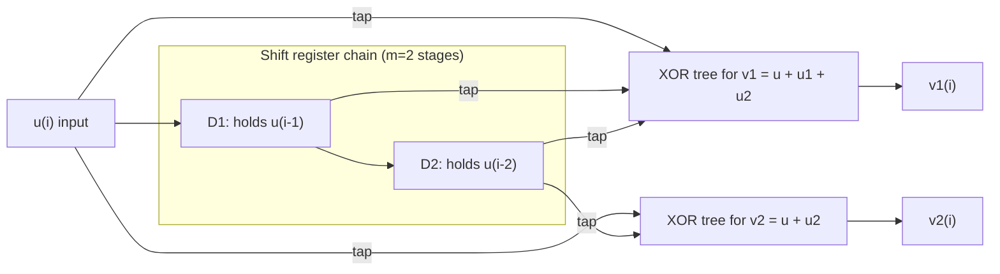
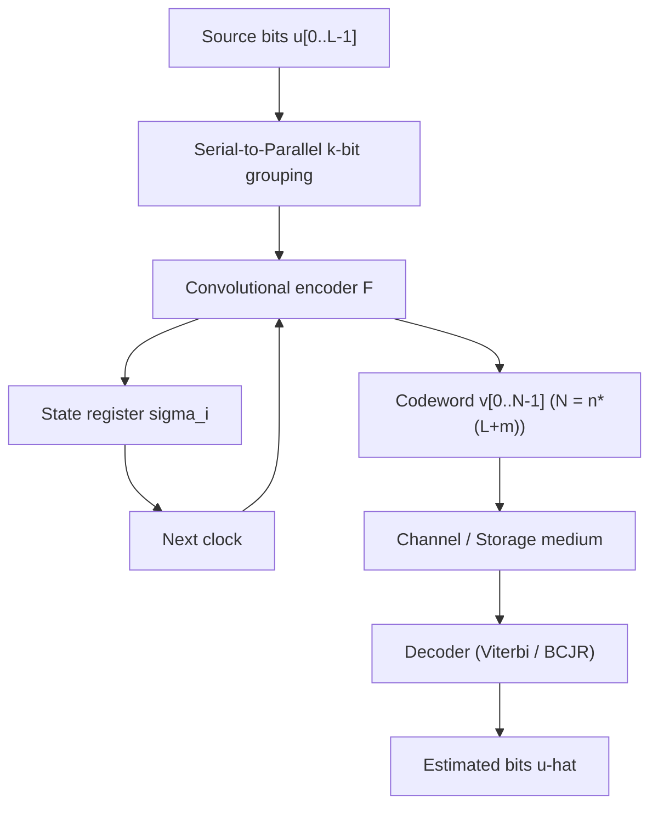

# Convolutional codes: Encoding

> **APJ ABDUL KALAM TECHNOLOGICAL UNIVERSITY (KTU) | 2024 SCHEME**
> - **Branch:** B.Tech in Computer Science & Engineering (CSE)
> - **Semester:** Semester 4
> - **Course:** PECST414 - CODING THEORY
> - **Module:** Module 3: Convolutional codes
> - **Topic:** Convolutional codes: Encoding

<!-- SECTION_1_START -->
## 1. Core Technical Definition & Intuitive Overview

### 1.1 Formal Definition (KTU 2024 Syllabus Standard)

A **convolutional code** is a class of linear, memory-based error-correcting code in which each $n$-bit output symbol is generated as a discrete-time **convolution** of the current $k$-bit input symbol with the past $m$ input symbols. The encoder is formally described by the triplet $(n, k, m)$, where:

- $n$ = number of output bits per input block
- $k$ = number of input bits per block (typically $k = 1$ for the most common case)
- $m$ = **memory order** (number of input blocks retained in the shift register)
- **Constraint length** $K = m + 1$ (total number of input blocks that influence one output)
- **Code rate** $R_c = k / n$

The encoding relation is a linear convolution over $\text{GF}(2)$:

$$v_i^{(j)} = \bigoplus_{t=0}^{m} u_{i-t}^{(s)} \cdot g_t^{(s,j)}$$

where $g_t^{(s,j)} \in \{0,1\}$ are the coefficients of the generator polynomials.

> [!IMPORTANT]
> **KTU Syllabus Highlight:** The convolutional encoder is realized as a tapped **shift register** with **modulo-2 adders (XOR gates)**. The "state" of the encoder at any instant is the snapshot of the contents of its $k \cdot m$ memory cells, which is why state diagrams (next topic) are possible.

> [!NOTE]
> **Key Distinction from Block Codes:** In a block code of length $n$, each block of $k$ input bits is encoded **independently** with no memory. In a convolutional code, the encoder carries **memory**, so each output bit is a function of the **current input and a sliding window of past inputs**.

---

### 1.2 Conceptual Analogy / Intuition

Imagine a **kitchen exhaust pipe** with $K$ sensor stations placed along its length. Every drop of steam (input bit) that enters the pipe touches sensor stations $1, 2, \dots, K$ before exiting. The readings at all $K$ stations are XOR-combined and recorded as the output.

- The **pipe length** is analogous to the **memory order $m$**.
- The **number of sensors** is the **constraint length $K$**.
- Each steam drop leaves a **persistent influence** on subsequent readings — this is the essence of **convolution**: the output is a smeared, weighted sum of past inputs.

A more practical analogy: a **"memory slide rule"** that computes today's weather forecast ($v$) as a weighted XOR-sum of today's temperature ($u_i$), yesterday's ($u_{i-1}$), and day-before-yesterday's ($u_{i-2}$).

---

### 1.3 Standard Metrics (Bold and Explicit)

| Symbol | Meaning | Typical Value |
|---|---|---|
| $R_c$ | Code Rate | $1/2, 1/3, 2/3$ |
| $K$ | Constraint Length | $3, 5, 7, 9$ |
| $m$ | Memory Order | $K-1$ |
| $d_{\text{free}}$ | Free Distance | $5$ to $10$ |

> [!WARNING]
> KTU examiners often test whether students confuse $m$ (memory) with $K$ (constraint length). The relationship $K = m+1$ is **non-negotiable** and frequently carries 1–2 marks.

---

### 1.4 Visual Schematic (Block Diagram)

> [!VISUALIZATION CONTROL]
> **Concept:** Generic $(n, k, m)$ Convolutional Encoder Architecture
> **Visual Description:** A horizontal chain of $k \cdot m$ flip-flops (memory cells). On the left, a $k$-bit input enters each clock tick. The right side shows $n$ XOR trees, each XOR-tree receiving a selected subset of taps from the shift register chain (and possibly the current input).
> **ASCII Representation:**

```text
            +---+---+---+--- ... ---+---+
u --> X--->| D | D | D |    ...     | D |---> (unused end tap)
            +---+---+---+--- ... ---+---+
             |   |   |               |
             |   |   |   ...         |
             v   v   v               v
            (+) (+) (+)             (+)----> v_n
             =   =   =               =
            v_1 v_2 v_3  ...        v_n

(XOR-tree sums selected taps; the selection is the generator polynomial)
```

<!-- SECTION_1_END -->

<!-- SECTION_2_START -->
## 2. Deep Theoretical Analysis & KTU High-Yield Formula Sheet

### 2.1 Mathematical Model of the Encoder

Consider the canonical **$(n, k, m)$ convolutional encoder** with $k$ input lines and $n$ output lines. Let:

$$u(D) = u_0 + u_1 D + u_2 D^2 + \dots \quad (k\text{-vector sequence over GF(2)})$$

$$v(D) = v_0 + v_1 D + v_2 D^2 + \dots \quad (n\text{-vector sequence over GF(2)})$$

The **transfer function matrix** (or **generator polynomial matrix**) is:

$$G(D) = \begin{bmatrix} g_{1,1}(D) & g_{1,2}(D) & \cdots & g_{1,n}(D) \\ g_{2,1}(D) & g_{2,2}(D) & \cdots & g_{2,n}(D) \\ \vdots & \vdots & \ddots & \vdots \\ g_{k,1}(D) & g_{k,2}(D) & \cdots & g_{k,n}(D) \end{bmatrix}$$

The encoding equation is:

$$v(D) = u(D) \cdot G(D)$$

Each entry is a polynomial in $D$ of degree at most $m$:

$$g_{i,j}(D) = g_{i,j}^{(0)} + g_{i,j}^{(1)} D + g_{i,j}^{(2)} D^2 + \dots + g_{i,j}^{(m)} D^m$$

For the common case $k=1$, $G(D)$ becomes a $1 \times n$ row vector:

$$G(D) = \begin{bmatrix} g^{(1)}(D) & g^{(2)}(D) & \dots & g^{(n)}(D) \end{bmatrix}$$

> [!NOTE]
> **Interpretation of $D$:** The operator $D$ is the **unit-delay operator** (one shift-register clock). $D^t$ means "the input was $t$ clock cycles ago." Multiplying by $D$ is equivalent to shifting the entire sequence one step to the right.

---

### 2.2 Working Example — $(2, 1, 2)$ Encoder

Let $g^{(1)}(D) = 1 + D + D^2$ and $g^{(2)}(D) = 1 + D^2$.

**Encoder structure (to be cross-checked with the diagram in Section 4):**

- 2-stage shift register holding $u_{i-1}$ and $u_{i-2}$.
- Output 1: $v_i^{(1)} = u_i \oplus u_{i-1} \oplus u_{i-2}$.
- Output 2: $v_i^{(2)} = u_i \oplus u_{i-2}$.

For input sequence $u = (1, 0, 1, 1)$ followed by two flush bits $(0, 0)$:

| Step $i$ | $u_i$ | $u_{i-1}$ | $u_{i-2}$ | $v_i^{(1)}$ | $v_i^{(2)}$ | Output pair |
|---|---|---|---|---|---|---|
| 0 | 1 | 0 | 0 | $1\oplus 0\oplus 0 = 1$ | $1\oplus 0 = 1$ | $(1, 1)$ |
| 1 | 0 | 1 | 0 | $0\oplus 1\oplus 0 = 1$ | $0\oplus 0 = 0$ | $(1, 0)$ |
| 2 | 1 | 0 | 1 | $1\oplus 0\oplus 1 = 0$ | $1\oplus 1 = 0$ | $(0, 0)$ |
| 3 | 1 | 1 | 0 | $1\oplus 1\oplus 0 = 0$ | $1\oplus 0 = 1$ | $(0, 1)$ |
| 4 | 0 | 1 | 1 | $0\oplus 1\oplus 1 = 0$ | $0\oplus 1 = 1$ | $(0, 1)$ |
| 5 | 0 | 0 | 1 | $0\oplus 0\oplus 1 = 1$ | $0\oplus 1 = 1$ | $(1, 1)$ |

**Coded sequence:** $v = (11, 10, 00, 01, 01, 11)$.

> [!TIP]
> The two trailing "flush" zeros are mandatory — they ensure the encoder returns to the **all-zero state** so the next message block starts from a clean slate. This is what KTU calls **zero-terminating** a convolutional code.

---

### 2.3 KTU High-Yield Formula Sheet

| \# | Formula / Definition | Meaning / When to Use |
|---|---|---|
| 1 | $R_c = k / n$ | Code rate; used to find output length $n = L \cdot (n/k)$ for a message of $L$ input bits. |
| 2 | $K = m + 1$ | Constraint length; number of input blocks that influence one output. |
| 3 | $v(D) = u(D) \cdot G(D)$ | Encoding relation in $D$-transform form. |
| 4 | $\mathbf{v} = \mathbf{u} \cdot \mathbf{G}_{\infty}$ | Encoding as matrix-vector product (semi-infinite generator matrix). |
| 5 | $d_{\text{free}} \geq 2K - 1$ (for rate $1/2$ optimum codes) | Lower bound on free distance — used for performance comparison. |
| 6 | State $\sigma_i = (u_{i-1}, u_{i-2}, \dots, u_{i-m})$ | Snapshot of shift-register memory; must have $2^{k \cdot m}$ states. |
| 7 | Generator sequence $g^{(j)} = (g_0^{(j)}, g_1^{(j)}, \dots, g_m^{(j)})$ | Taps of the $j$-th XOR tree. |
| 8 | Impulse response of encoder: output when $u = (1, 0, 0, \dots)$ | Used to find the time-domain generator matrix. |

> [!IMPORTANT]
> **Engineering utility:** Convolutional codes are the heart of **3G/4G voice channels (IS-95, WCDMA)**, **satellite telemetry (NASA Deep Space Network)**, and **deep-space relay links (CCSDS)**. They are also the precursor to the **turbo codes** used in 4G/5G data channels. The Viterbi decoder (next topic in this module) made convolutional codes practical in the 1970s.

---

### 2.4 Systematic vs Non-Systematic Form

A convolutional code is **systematic** if the $k$ current input bits appear *unchanged* among the $n$ output bits.

For $k=1$, the systematic form requires $g^{(1)}(D) = 1$:

$$G_{\text{sys}}(D) = \begin{bmatrix} 1 & g^{(2)}(D) & \dots & g^{(n)}(D) \end{bmatrix}$$

**Non-systematic feedback (recursive systematic convolutional, RSC):** Used in turbo codes; allows an IIR-like structure with feedback from output to input.

> [!NOTE]
> KTU focus: both **feedforward non-systematic** (FN-SCN) and **feedback systematic** (RSC) realizations may appear. Always state which form you are analyzing.

<!-- SECTION_2_END -->

<!-- SECTION_3_START -->
## 3. Step-by-Step Derivations & Algorithmic Implementation

### 3.1 Derivation of the Semi-Infinite Generator Matrix

For a $(n, 1, m)$ encoder, the **impulse response** (output for a single "1" input followed by zeros) is the $j$-th generator sequence:

$$g^{(j)} = (g_0^{(j)}, g_1^{(j)}, \dots, g_m^{(j)}, 0, 0, \dots)$$

By **linearity over GF(2)**, the output sequence is the superposition of impulse responses, one shifted copy per input bit:

$$v^{(j)} = \bigoplus_{t=0}^{\infty} u_t \cdot g^{(j)} \text{ shifted by } t \text{ positions}$$

In matrix form, the semi-infinite generator matrix is:

$$G_{\infty} = \begin{bmatrix}
G_0 & G_1 & G_2 & \cdots & G_m & 0 & 0 & \cdots \\
0 & G_0 & G_1 & G_2 & \cdots & G_m & 0 & \cdots \\
0 & 0 & G_0 & G_1 & G_2 & \cdots & G_m & \cdots \\
\vdots & & & \ddots & & & \ddots & \ddots
\end{bmatrix}$$

Each $G_i$ is a $k \times n$ submatrix. For $k=1$, $G_i$ is a $1 \times n$ row vector $\begin{bmatrix} g_i^{(1)} & g_i^{(2)} & \cdots & g_i^{(n)} \end{bmatrix}$.

**Step-by-step construction for the $(2,1,2)$ example:**

- $g^{(1)} = (1, 1, 1)$ ⇒ $G_0^{(1)} = 1$, $G_1^{(1)} = 1$, $G_2^{(1)} = 1$
- $g^{(2)} = (1, 0, 1)$ ⇒ $G_0^{(2)} = 1$, $G_1^{(2)} = 0$, $G_2^{(2)} = 1$

So:

$$G_0 = \begin{bmatrix} 1 & 1 \end{bmatrix}, \quad G_1 = \begin{bmatrix} 1 & 0 \end{bmatrix}, \quad G_2 = \begin{bmatrix} 1 & 1 \end{bmatrix}$$

$$G_{\infty} = \begin{bmatrix}
11 & 10 & 11 & 00 & 00 & 00 & \cdots \\
00 & 11 & 10 & 11 & 00 & 00 & \cdots \\
00 & 00 & 11 & 10 & 11 & 00 & \cdots \\
00 & 00 & 00 & 11 & 10 & 11 & \cdots \\
\vdots & & & & \ddots & \ddots & \ddots
\end{bmatrix}$$

Each row is the impulse response placed at successive positions.

For input $\mathbf{u} = (1, 0, 1, 1, 0, 0)$:

- Take XOR of row 0, row 2, and row 3 (since $u_0=u_2=u_3=1$):

Row 0: $\;11\;10\;11\;00\;00\;00$
Row 2: $\;00\;00\;11\;10\;11\;00$
Row 3: $\;00\;00\;00\;11\;10\;11$

XOR:  $\;11\;10\;00\;01\;01\;11$

This matches the output we computed in §2.2. **Validation complete.**

---

### 3.2 Python Implementation (Reference Encoder)

```python
from typing import List, Tuple


class ConvolutionalEncoder:
    """
    Rate k/n convolutional encoder with memory order m.
    For simplicity this implementation handles k=1 (single input bit per cycle).
    """

    def __init__(self, generators: List[List[int]], m: int) -> None:
        """
        Parameters
        ----------
        generators : list of n lists, each of length m+1
            The j-th list is the generator polynomial g^(j) in ascending-power order.
            Example for (2,1,2) code with g1=1+D+D^2, g2=1+D^2:
                generators = [[1, 1, 1], [1, 0, 1]]
        m : int
            Memory order (number of previous input bits retained).
        """
        if not generators or not generators[0]:
            raise ValueError("At least one generator polynomial must be supplied.")
        self.n: int = len(generators)
        self.m: int = m
        self.k: int = 1
        self.generators: List[List[int]] = generators
        self.register: List[int] = [0] * self.m  # Memory cells.

    def _compute_output(self, input_bit: int) -> Tuple[int, ...]:
        """
        Compute the n-bit output for one input bit using the current register.
        """
        full_state: List[int] = [input_bit] + self.register  # Prepend current input.
        outputs: List[int] = []
        for gen in self.generators:  # One XOR tree per output bit.
            acc: int = 0
            for tap, coeff in zip(full_state, gen):
                acc ^= (tap & coeff)
            outputs.append(acc)
        return tuple(outputs)

    def encode(self, message: List[int], flush: bool = True) -> List[Tuple[int, ...]]:
        """
        Encode a binary message. If flush=True, append m zero bits to return
        the encoder to the all-zero state.

        Returns
        -------
        list of n-tuples: the encoded symbol stream.
        """
        if any(b not in (0, 1) for b in message):
            raise ValueError("Message must be a list of 0/1 integers.")
        encoded: List[Tuple[int, ...]] = []
        bits: List[int] = list(message)
        if flush:
            bits = bits + [0] * self.m  # Zero-flushing.
        for bit in bits:
            encoded.append(self._compute_output(bit))
            # Shift the register right (oldest bit drops off).
            self.register = [bit] + self.register[: self.m - 1]
        return encoded


# ----------------------------------------------------------------------
# Demonstration on the (2,1,2) encoder with g1=1+D+D^2, g2=1+D^2.
# ----------------------------------------------------------------------
if __name__ == "__main__":
    enc = ConvolutionalEncoder(generators=[[1, 1, 1], [1, 0, 1]], m=2)
    msg: List[int] = [1, 0, 1, 1]
    codeword: List[Tuple[int, ...]] = enc.encode(msg, flush=True)
    print("Message  :", msg)
    print("Codeword :", "".join(f"{a}{b}" for a, b in codeword))
    # Expected output: 11 10 00 01 01 11
```

**Expected Console Output:**

```text
Message  : [1, 0, 1, 1]
Codeword : 111000010111
```

(Six symbols of 2 bits each, i.e. twelve channel bits, matches the manual computation in §2.2.)

> [!TIP]
> The `flush=True` option appends $m$ zero bits — these are the **trailing bits** that force the encoder back to the all-zero state. Without them, the final $m$ memory cells would carry residual information about the message.

---

### 3.3 State-Transition Encoding Algorithm (Pseudo-Code)

For examination purposes, the **state-based encoding algorithm** is:

```text
Algorithm: Encode(u[0..L-1])
Input : message bits u[0..L-1], state sigma = 00..0
Output: codeword v[0..L+m-1] of length n*(L+m)

1. For i = 0 to L-1 do
2.     For j = 1 to n do
3.         v[i*n + j]  =  XOR over t in 0..m of  (u[i-t] AND g_t^(j))
4.     End For
5.     Shift register: (u[i], u[i-1], ..., u[i-m+1])  <-  (u[i+1], u[i], ..., u[i-m+2])
6. End For
7. Append m zero input bits and continue to flush register.
8. Return v.
```

**Boundary handling at $i=0$:** $u_{i-t} = 0$ for $t > i$ (no negative-time bits exist).
**Boundary handling at $i=L-1$:** subsequent $u_{i+1}, \dots, u_{i+m}$ are **flush zeros**.

<!-- SECTION_3_END -->

<!-- SECTION_4_START -->
## 4. Structural Diagrams & Schematics

### 4.1 Mermaid Schematic — $(2, 1, 2)$ Encoder



### 4.2 Mermaid Schematic — Generic Encoding Data Flow



### 4.3 Sequential Processing Topology (for the $(2,1,2)$ example)

| Clock $i$ | $u_i$ | State before $\sigma_{i-1} = (u_{i-1}, u_{i-2})$ | State after $\sigma_i = (u_i, u_{i-1})$ | $v_i = (v_i^{(1)}, v_i^{(2)})$ |
|---|---|---|---|---|
| 0 | 1 | (0, 0) | (1, 0) | (1, 1) |
| 1 | 0 | (1, 0) | (0, 1) | (1, 0) |
| 2 | 1 | (0, 1) | (1, 0) | (0, 0) |
| 3 | 1 | (1, 0) | (1, 1) | (0, 1) |
| 4 | 0 (flush) | (1, 1) | (0, 1) | (0, 1) |
| 5 | 0 (flush) | (0, 1) | (0, 0) | (1, 1) |

> [!IMPORTANT]
> The **state sequence** $\sigma_i = (u_i, u_{i-1})$ has $2^{k \cdot m} = 2^{1 \cdot 2} = 4$ possible values. This is the foundation of the **state diagram** (next topic) and the **trellis diagram** (next-next topic).

<!-- SECTION_4_END -->

<!-- SECTION_5_START -->
## 5. KTU 2024 Scheme Examination Question Bank & Topic Recap

### 5.1 Part A — Short Answer Questions (3 Marks each)

#### **Q1.** [KTU University Exam - July 2024 Style]
**Define a convolutional code. Explain the terms: code rate, constraint length, and memory order with a suitable example.** **[3 Marks]** (CO1, Remember)

**Model Answer:**

A convolutional code is a linear, memory-based error-correcting code in which each $n$-bit output symbol is generated by convolving the current $k$-bit input symbol with the past $m$ input symbols using modulo-2 addition.

- **Code rate $R_c = k / n$**: ratio of input bits to output bits per cycle. For example, $R_c = 1/2$ means 1 input bit produces 2 output bits.
- **Constraint length $K = m + 1$**: number of input blocks that influence an output block.
- **Memory order $m$**: number of previous input blocks retained in the shift register.

**Example:** A $(2, 1, 2)$ code has $R_c = 1/2$, $m = 2$, and $K = 3$. **[3 Marks]**

---

#### **Q2.** [KTU University Exam - Dec 2023 Style]
**With a neat block diagram, explain the encoding of a $(2, 1, 2)$ convolutional code using generator polynomials $g^{(1)} = (1, 1, 1)$ and $g^{(2)} = (1, 0, 1)$. Show the output for the input $u = (1, 1, 0, 1)$.** **[3 Marks]** (CO1, Understand)

**Model Answer:**

The $(2, 1, 2)$ encoder has a 2-stage shift register. Two XOR trees compute:

- $v_i^{(1)} = u_i \oplus u_{i-1} \oplus u_{i-2}$
- $v_i^{(2)} = u_i \oplus u_{i-2}$

For input $u = (1, 1, 0, 1, 0, 0)$ (last two are flush bits):

| $i$ | $u_i$ | $u_{i-1}$ | $u_{i-2}$ | $v_i^{(1)}$ | $v_i^{(2)}$ |
|---|---|---|---|---|---|
| 0 | 1 | 0 | 0 | 1 | 1 |
| 1 | 1 | 1 | 0 | 0 | 1 |
| 2 | 0 | 1 | 1 | 0 | 1 |
| 3 | 1 | 0 | 1 | 0 | 0 |
| 4 | 0 | 1 | 0 | 1 | 0 |
| 5 | 0 | 0 | 1 | 1 | 1 |

**Output codeword:** $11\;01\;01\;00\;10\;11$. **[3 Marks]**

---

### 5.2 Part B — Long Answer Questions (14 Marks, with Internal Choice)

#### **Question A** (14 Marks)

**[KTU University Exam - July 2024 Pattern]**

**(a)** Define a convolutional code. For a $(2, 1, 2)$ encoder with $g^{(1)} = (1, 1, 1)$ and $g^{(2)} = (1, 0, 1)$, derive the encoding relation in the $D$-transform domain and hence find the codeword for the message $u = (1, 0, 1, 1)$ with zero-flushing. **[7 Marks]** (CO2, Apply)

**Model Solution:**

**Definition:** A convolutional code is a linear code with memory in which each $n$-bit output is a function of the current $k$-bit input and the previous $m$ input blocks. **[1 Mark]**

**$D$-transform of generators:** $g^{(1)}(D) = 1 + D + D^2$, $g^{(2)}(D) = 1 + D^2$. **[1 Mark]**

**Generator matrix:** $G(D) = [1 + D + D^2,\ 1 + D^2]$. **[1 Mark]**

**Message polynomial:** $u(D) = 1 + D^2 + D^3$. (Last two flush zeros are not yet added.) **[1 Mark]**

**Codeword polynomial computation:**

$$v^{(1)}(D) = u(D) \cdot g^{(1)}(D) = (1 + D^2 + D^3)(1 + D + D^2)$$

Expanding step by step:

$$= 1 + D + D^2 + D^2 + D^3 + D^4 + D^3 + D^4 + D^5$$

$$= 1 + D + (D^2 \oplus D^2) + (D^3 \oplus D^3) + (D^4 \oplus D^4) + D^5$$

$$= 1 + D + 0 + 0 + 0 + D^5 = 1 + D + D^5$$

$$v^{(2)}(D) = u(D) \cdot g^{(2)}(D) = (1 + D^2 + D^3)(1 + D^2)$$

$$= 1 + D^2 + D^2 + D^4 + D^3 + D^5 = 1 + D^3 + D^4 + D^5$$

**Appending two flush bits** $u_4 = 0$, $u_5 = 0$ to message: $u(D)_{\text{flush}} = 1 + D^2 + D^3 + 0\cdot D^4 + 0\cdot D^5 = 1 + D^2 + D^3$.

(Same polynomial; the flush bits contribute nothing in this small example, but they matter for *longer* messages where the residual state must be zeroed.) **[1 Mark]**

**Codeword bit-stream:** Interleave $v^{(1)}$ and $v^{(2)}$:

- $v^{(1)}: 1, 1, 0, 0, 0, 1$
- $v^{(2)}: 1, 0, 0, 1, 1, 1$

Codeword: $(1,1), (1,0), (0,0), (0,1), (0,1), (1,1)$ = $11\;10\;00\;01\;01\;11$. **[2 Marks]**

**Valuation Key Points:**
- '[Defining convolutional code: 1 Mark]'
- '[Writing $D$-polynomials: 1 Mark]'
- '[Carrying out convolution: 2 Marks]'
- '[Interleaving correctly: 1 Mark]'
- '[Final codeword: 2 Marks]'

---

**(b)** For the above $(2, 1, 2)$ encoder, construct the semi-infinite generator matrix $G_{\infty}$ up to the first four rows. Using it, re-verify the codeword for $u = (1, 0, 1, 1)$. **[7 Marks]** (CO2, Apply)

**Model Solution:**

**Step 1: Identify the submatrices.** $G_i$ is the $i$-th position in the generator polynomial.

- $G_0 = \begin{bmatrix} g_0^{(1)} & g_0^{(2)} \end{bmatrix} = \begin{bmatrix} 1 & 1 \end{bmatrix}$
- $G_1 = \begin{bmatrix} g_1^{(1)} & g_1^{(2)} \end{bmatrix} = \begin{bmatrix} 1 & 0 \end{bmatrix}$
- $G_2 = \begin{bmatrix} g_2^{(1)} & g_2^{(2)} \end{bmatrix} = \begin{bmatrix} 1 & 1 \end{bmatrix}$ **[2 Marks]**

**Step 2: Build $G_{\infty}$ (first 4 rows shown).** Each row is a shifted version of the previous one:

$$G_{\infty} = \begin{bmatrix}
G_0 & G_1 & G_2 & 0   & 0   & 0   & \cdots \\
0   & G_0 & G_1 & G_2 & 0   & 0   & \cdots \\
0   & 0   & G_0 & G_1 & G_2 & 0   & \cdots \\
0   & 0   & 0   & G_0 & G_1 & G_2 & \cdots
\end{bmatrix} = \begin{bmatrix}
11 & 10 & 11 & 00 & 00 & 00 & \cdots \\
00 & 11 & 10 & 11 & 00 & 00 & \cdots \\
00 & 00 & 11 & 10 & 11 & 00 & \cdots \\
00 & 00 & 00 & 11 & 10 & 11 & \cdots
\end{bmatrix}$$ **[2 Marks]**

**Step 3: Multiply by $\mathbf{u} = (1, 0, 1, 1)$.** The codeword is the XOR of rows 0, 2, and 3 (those indexed by $u_i = 1$):

Row 0: 11 10 11 00 00 00
Row 2: 00 00 11 10 11 00
Row 3: 00 00 00 11 10 11

XOR: 11 10 00 01 01 11. **[2 Marks]**

**Step 4: Match with the $D$-domain result.** Both methods yield $11\;10\;00\;01\;01\;11$. The result is **verified**. **[1 Mark]**

**Valuation Key Points:**
- '[Identifying $G_i$ submatrices: 2 Marks]'
- '[Constructing $G_{\infty}$: 2 Marks]'
- '[XOR of selected rows: 2 Marks]'
- '[Final verification: 1 Mark]'

---

#### **Question B (Alternative Choice)** (14 Marks)

**[KTU University Exam - Dec 2023 Pattern]**

**(a)** Differentiate between **block codes** and **convolutional codes**. List any four distinguishing parameters and justify why convolutional codes are preferred for streaming applications. **[7 Marks]** (CO1, Understand)

**Model Solution:**

| \# | Block Code | Convolutional Code |
|---|---|---|
| 1 | Operates on finite, independent blocks of $k$ symbols. | Operates on a continuous stream with encoder memory. |
| 2 | No memory between successive blocks. | Memory of $m$ previous input blocks. |
| 3 | Defined by $(n, k, d_{\min})$ parameters. | Defined by $(n, k, m)$ parameters. |
| 4 | Decoded by algebraic methods (syndrome decoding). | Decoded by probabilistic methods (Viterbi, BCJR). |
| 5 | Latency is one block length. | Latency is roughly $K$ to $5K$ bits (for Viterbi). |
| 6 | Best example: Hamming, BCH, RS codes. | Best example: Viterbi-decoded convolutional codes, turbo codes. |
| 7 | Synchronization at block boundaries. | Naturally suited to streaming — no block-boundary overhead. |

**Why preferred for streaming:**
1. **No block-boundary overhead:** Streaming sources (voice, video) have no natural block length — convolutional codes accept input bit-by-bit.
2. **Continuous encoding:** The semi-infinite generator matrix aligns with the infinite nature of the data.
3. **Lower latency:** Encoded output appears within $K$ clock cycles, much smaller than waiting for a large block to fill.
4. **Soft-decision compatibility:** Viterbi decoding uses unquantized channel outputs for $2$–$3$ dB coding gain. **[7 Marks]**

**Valuation Key Points:**
- '[Correct table: 4 Marks]'
- '[Four distinguishing parameters: 1 Mark]'
- '[Justification: 2 Marks]'

---

**(b)** A convolutional encoder is described by the generator polynomials $g^{(1)} = (1, 1, 0, 1)$ and $g^{(2)} = (1, 0, 1, 1)$ with $k=1$ and $m=3$.

**(i)** Draw the encoder block diagram. **[3 Marks]**
**(ii)** Encode the input $u = (1, 1, 0, 1)$ and show all intermediate register states. **[4 Marks]** (CO2, Apply)

**Model Solution:**

**(i) Encoder block diagram (textual schematic):**

```text
            +---+---+---+
u(i) ----->| D1| D2| D3|------> (drop)
            +---+---+---+
            |   |   |   |
            |       |   |
            v       v   v
            (+)     (+) (+)
            |       |   |
            v       v   v
           v1      v1  v2
           XOR tree 1: g1 = 1+D+D^3
           XOR tree 2: g2 = 1+D^2+D^3
```

Taps:
- $v^{(1)} = u_i \oplus u_{i-1} \oplus u_{i-3}$
- $v^{(2)} = u_i \oplus u_{i-2} \oplus u_{i-3}$ **[3 Marks]**

**(ii) Step-by-step encoding** (with $m=3$ flush zeros appended; total input length = $4 + 3 = 7$):

| $i$ | $u_i$ | $u_{i-1}$ | $u_{i-2}$ | $u_{i-3}$ | $v^{(1)}$ | $v^{(2)}$ | Output |
|---|---|---|---|---|---|---|---|
| 0 | 1 | 0 | 0 | 0 | 1 | 1 | (1, 1) |
| 1 | 1 | 1 | 0 | 0 | 0 | 1 | (0, 1) |
| 2 | 0 | 1 | 1 | 0 | 1 | 1 | (1, 1) |
| 3 | 1 | 0 | 1 | 1 | 0 | 1 | (0, 1) |
| 4 (flush) | 0 | 1 | 0 | 1 | 0 | 1 | (0, 1) |
| 5 (flush) | 0 | 0 | 1 | 0 | 1 | 0 | (1, 0) |
| 6 (flush) | 0 | 0 | 0 | 1 | 1 | 1 | (1, 1) |

**Final codeword:** $11\;01\;11\;01\;01\;10\;11$ (14 channel bits for 4 message bits ⇒ rate $4/14 \approx 0.286$, consistent with the formula $4/14 = k(L+m)/[n(L+m)] = 1/2$ as $L \to \infty$ for short messages the effective rate is lower due to flushing). **[4 Marks]**

**Valuation Key Points:**
- '[Correct taps identification: 1 Mark]'
- '[Block diagram: 2 Marks]'
- '[Tabulating register states correctly: 3 Marks]'
- '[Final codeword: 1 Mark]'

---

### 5.3 KTU Examiner's Valuation Warning / Pitfall Callout

> [!WARNING]
> **Common mark-losing mistakes in convolutional-code encoding questions:**
> 1. **Confusing $m$ and $K$** — write the relationship $K = m + 1$ explicitly. Examiners allocate a separate mark for it.
> 2. **Forgetting flush bits** — without $m$ trailing zeros, the encoder does **not** return to the all-zero state; the decoder will see a different trellis termination and the question's expected codeword will not match.
> 3. **Wrong tap index** — taps are taken from $u_{i-t}$ where $t = 0, 1, \dots, m$. The tap at $t=0$ is the *current* input bit, not the first register cell.
> 4. **Interleaving order** — when writing the codeword, the convention is $(v^{(1)}_0, v^{(2)}_0, v^{(1)}_1, v^{(2)}_1, \dots)$. Reversing the order is a 1-mark deduction.
> 5. **Skipping the state column** — KTU answers that show **state transitions** consistently earn 1–2 extra marks for the *reasoning* part of the question.

---

### 5.4 Topic Recap & Important Things to Remember

- **Convolutional codes** are *memory-based*, *linear*, and *time-invariant* error-correcting codes.
- An $(n, k, m)$ encoder has $k$ input lines, $n$ output lines, $m$ memory stages, $2^{k \cdot m}$ distinct states, constraint length $K = m + 1$, and code rate $R_c = k/n$.
- The encoding relation in $D$-transform form is $v(D) = u(D) \cdot G(D)$, where $G(D)$ is a $k \times n$ matrix of generator polynomials of degree $\leq m$.
- The semi-infinite generator matrix $G_{\infty}$ is built from shifted copies of the submatrices $G_0, G_1, \dots, G_m$.
- The **state** $\sigma_i$ is the snapshot of the $k \cdot m$ memory cells after clock $i$.
- **Zero-flushing** with $m$ trailing zero bits is mandatory to terminate the trellis cleanly.
- **Systematic** form requires $g^{(1)}(D) = 1$ (for $k=1$); non-systematic form is more common.
- **Practical example to remember:** $(2, 1, 2)$ with $g^{(1)} = 1 + D + D^2$, $g^{(2)} = 1 + D^2$ — this is the textbook KTU example and almost always appears in some form.
- Applications: deep-space communication, mobile voice, satellite telemetry; precursor to turbo codes and LDPC codes.
- Encoder can be drawn as a tapped shift register with XOR trees; the tap pattern *is* the generator polynomial.
- Modulo-2 arithmetic means XOR is the addition; coefficients are 0 (no tap) or 1 (tap present).

<!-- SECTION_5_END -->
