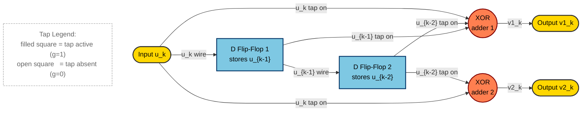
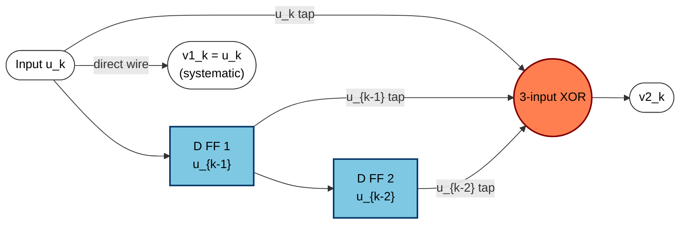
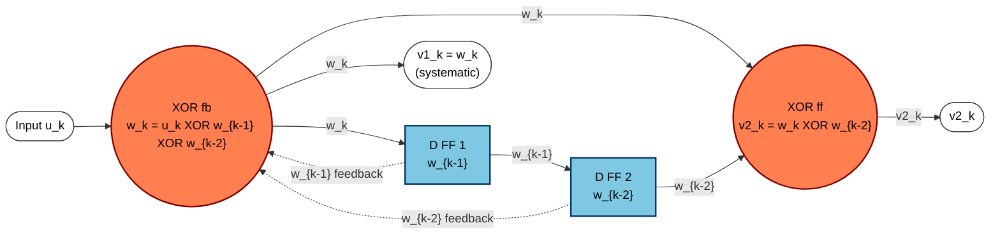
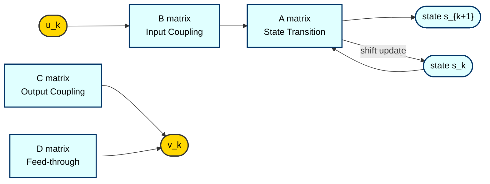

# Convolutional codes: realization

> **APJ ABDUL KALAM TECHNOLOGICAL UNIVERSITY (KTU) | 2024 SCHEME**
> - **Branch:** B.Tech in Computer Science & Engineering (CSE)
> - **Semester:** Semester 4
> - **Course:** PECST414 - CODING THEORY
> - **Module:** Module 3: Convolutional codes
> - **Topic:** Convolutional codes: realization

<!-- SECTION_1_START -->
## 1. Core Technical Definition & Intuitive Overview

### 1.1 Formal Definition

A **realization** (or **implementation**) of a convolutional encoder is a hardware/structural description of the encoder that produces the output sequences $\{v^{(1)}, v^{(2)}, \dots, v^{(n)}\}$ from the input sequence $\mathbf{u} = (u_0, u_1, u_2, \dots)$ using a finite number of memory elements (delay units) and modulo-2 adders, exactly matching the mathematical encoding rule.

Formally, for a rate $k/n$ convolutional code of **memory order** $m$ and **constraint length** $K = m + 1$, the $j$-th output at time $k$ is given by the discrete convolution:

$$v_k^{(j)} = \sum_{i=0}^{m} g_i^{(j)} \, u_{k-i} \pmod 2, \quad j = 1, 2, \dots, n$$

where $g_i^{(j)} \in \{0, 1\}$ are the **generator coefficients** (taps) of the encoder. A *realization* is the explicit arrangement of shift registers, taps, and modulo-2 adders that computes these convolutions.

> [!IMPORTANT]
> **KTU 2024 Syllabus Highlight:** Realization bridges the *abstract algebraic* description of a convolutional code (generator polynomials, matrices) with its *physical/structural* description (flip-flops, adders, multiplexers). Two codes that are algebraically equivalent may have structurally different realizations.

### 1.2 Types of Realizations (Classification)

| Realization Type | Structure | Used In |
|---|---|---|
| **Direct Form (FIR / Feedforward)** | No feedback from output to input shift register | Classical convolutional encoders |
| **Systematic Form** | Input bit appears unchanged at one of the outputs | Reduced decoding complexity |
| **Recursive Systematic Form (RSF)** | Output is fed back to input shift register | Turbo codes, TCM |
| **Controller Canonical Form** | Realization derived directly from state-space equations | DSP / Control theory link |
| **Observer Canonical Form** | Dual of controller form | State estimation contexts |
| **Lattice / Trellis Realization** | State-transition based | Viterbi decoding, BCJR |

### 1.3 Intuitive Analogy — The "Assembly Line" View

> [!NOTE]
> **Analogy: A Bakery Conveyor Belt**
> Think of a convolutional encoder as a conveyor belt in a bakery:
> - **Input bins** = sequence of ingredients $(u_0, u_1, u_2, \dots)$ arriving one at a time.
> - **Shift registers (D-flip-flops)** = stations on the belt that *remember* the last $m$ ingredients.
> - **Taps $(g_i^{(j)})$** = recipes that say *which stations* to mix to bake cookie $j$.
> - **Modulo-2 adders** = mixing bowls — they XOR the chosen ingredients.
> - **Output** = tray of $n$ cookies per timestep, each baked from a *different recipe* of past + present ingredients.

A *realization* is the blueprint of this bakery: where the stations are placed, which pipes (taps) feed which bowl, and whether the cooked cookies ever loop back to change future recipes (feedback).

### 1.4 Key Parameters (Standard KTU Metrics)

- **Code rate** $\mathbf{R = k/n}$ — typically $1/2$ or $1/3$ in this module.
- **Memory order** $\mathbf{m}$ — number of delay elements (flip-flops).
- **Constraint length** $\mathbf{K = m + 1}$ — number of input bits that influence an output block.
- **Generator polynomials** $\mathbf{g^{(j)}(D) = g_0^{(j)} + g_1^{(j)} D + \dots + g_m^{(j)} D^m}$ — delay-domain description of tap connections.

> [!TIP]
> **Memory Trick:** $K$ counts the *current* input + *all remembered* inputs. If $K = 3$, the encoder "remembers" the last $m = 2$ bits while processing the present one.

<!-- SECTION_1_END -->

<!-- SECTION_2_START -->
## 2. Deep Theoretical Analysis & KTU High-Yield Formula Sheet

### 2.1 The Encoding Equation (Time Domain)

For a rate $1/n$ code with input $u_k$ and $n$ outputs, the $j$-th encoder output is:

$$v_k^{(j)} = g_0^{(j)} u_k \oplus g_1^{(j)} u_{k-1} \oplus \dots \oplus g_m^{(j)} u_{k-m}$$

Equivalently, the **state of the encoder** at time $k$ is the contents of the shift register:

$$\mathbf{s}_k = (u_{k-1}, u_{k-2}, \dots, u_{k-m}) \in \mathbb{F}_2^m$$

The next state is:

$$\mathbf{s}_{k+1} = (u_k, u_{k-1}, \dots, u_{k-m+1})$$

### 2.2 Polynomial (D-Domain) Representation

Using the unit-delay operator $D$ (so that $D \cdot u_k = u_{k-1}$):

$$V^{(j)}(D) = G^{(j)}(D) \, U(D) \pmod 2$$

with

$$G^{(j)}(D) = \sum_{i=0}^{m} g_i^{(j)} D^i, \quad j = 1, \dots, n$$

The complete encoder is described by the **generator matrix** (in polynomial form):

$$\mathbf{G}(D) = \begin{bmatrix} G^{(1)}(D) & G^{(2)}(D) & \cdots & G^{(n)}(D) \end{bmatrix}$$

### 2.3 Why the Direct Form? — Step-by-Step Logic

1. **Memory requirement** — only $m$ storage cells (D-flip-flops) are needed.
2. **Throughput** — at every clock, $k$ input bits and $n$ output bits are processed (systolic / pipelined).
3. **Linear & time-invariant** — same set of taps at every instant; the encoder is an LTI system over $\mathbb{F}_2$.
4. **Modularity** — to add another output, append another adder with its own tap connections.

### 2.4 The Three Structural Forms (Distilled)

**(A) Direct Form FIR (Feedforward, Non-Systematic, Non-Recursive)**

- No feedback loop. Output depends only on present + past inputs.
- Generator polynomials are *not* divided by any common factor.
- Example: $G = (1 + D + D^2, \; 1 + D^2)$.

**(B) Systematic Form**

- One output equals the current input: $v_k^{(1)} = u_k$, so $G^{(1)}(D) = 1$.
- The other outputs are linear combinations of past + present.
- Example: $G = (1, \; 1 + D + D^2)$.

**(C) Recursive Systematic Form (RSF)**

- The generator is expressed as $\mathbf{G}(D) = \left[ 1, \;\; \frac{G^{(2)}(D)}{G^{(1)}(D)} \right]$ with feedback.
- $G^{(1)}(D)$ is the *feedback polynomial* (must have $g_0^{(1)} = 1$ for realizability).
- Used as the **constituent code of turbo codes**.

### 2.5 KTU Formula Sheet / Cheat Sheet

| Symbol | Meaning | Equation / Domain |
|---|---|---|
| $R$ | Code rate | $R = k/n$ |
| $m$ | Memory order | number of D flip-flops |
| $K$ | Constraint length | $K = m + 1$ |
| $g_i^{(j)}$ | $i$-th tap of $j$-th output | $g_i^{(j)} \in \{0, 1\}$ |
| $G^{(j)}(D)$ | Generator polynomial | $G^{(j)}(D) = \sum_{i=0}^{m} g_i^{(j)} D^i$ |
| $V^{(j)}(D)$ | Output polynomial | $V^{(j)}(D) = G^{(j)}(D) \, U(D) \pmod 2$ |
| $v_k^{(j)}$ | Time-domain output | $v_k^{(j)} = \bigoplus_{i=0}^{m} g_i^{(j)} u_{k-i}$ |
| $\mathbf{s}_k$ | State at time $k$ | $\mathbf{s}_k = (u_{k-1}, \dots, u_{k-m})$ |
| $\mathbb{F}_2$ | Binary field | arithmetic mod 2 |
| $\oplus$ | XOR (mod-2 add) | $a \oplus b = a + b \pmod 2$ |

### 2.6 Engineering Utility

- **Satellite / Deep-space communication (CCSDS):** Realization determines chip area, power, and maximum clock rate on the FPGA/ASIC.
- **5G NR data channels:** Turbo codes use the RSC realization as constituent encoders.
- **Disk drive read channels (PRML):** Convolutional realizations (PR4, EPR4) are matched-filter implementations of partial-response targets.
- **Software-defined radio:** Direct-form realizations are preferred because they map cleanly to streaming DSP primitives.
- **VLSI Design:** The number of flip-flops = memory order $m$; number of XOR gates = total Hamming weight of generator polynomials. Both determine silicon cost.

> [!IMPORTANT]
> **Realization vs. Code Equivalence:** Two encoders with *different* generator polynomials can produce *the same* code if they are related by a polynomial invertible transformation. KTU problems often ask: "Realize this code" — meaning design the shift-register hardware for the *given* generator set.

<!-- SECTION_2_END -->

<!-- SECTION_3_START -->
## 3. Step-by-Step Derivations, Examples & Code Implementation

### 3.1 Worked Example 1 — Direct Form Realization of a Rate 1/2, K=3 Code

**Given** (standard KTU textbook example):
$$G^{(1)}(D) = 1 + D + D^2, \qquad G^{(2)}(D) = 1 + D^2$$

Note: $K = 3 \Rightarrow m = 2$, so the encoder has **2 memory elements**.

#### Step 1: Write the encoding equations in time domain

Expanding the convolutions:

$$v_k^{(1)} = u_k \oplus u_{k-1} \oplus u_{k-2}$$
$$v_k^{(2)} = u_k \oplus u_{k-2}$$

#### Step 2: Identify state

$$\mathbf{s}_k = (u_{k-1}, \, u_{k-2})$$

#### Step 3: Draw the Direct-Form Shift-Register Realization

The encoder consists of:
- 2 D-flip-flops in series: $u_k \to D \to u_{k-1} \to D \to u_{k-2}$.
- Two XOR adders.

**Tap connections for $v^{(1)}$:** present input ($u_k$), first stage ($u_{k-1}$), second stage ($u_{k-2}$).  
**Tap connections for $v^{(2)}$:** present input ($u_k$), second stage ($u_{k-2}$).

#### Step 4: Encode the input $\mathbf{u} = (1, 1, 0, 1, 1)$

Assume the encoder is initialized to all zeros ($u_{-1} = u_{-2} = 0$).

| $k$ | $u_k$ | $u_{k-1}$ | $u_{k-2}$ | $v_k^{(1)} = u_k \oplus u_{k-1} \oplus u_{k-2}$ | $v_k^{(2)} = u_k \oplus u_{k-2}$ | Output $v_k$ |
|---|---|---|---|---|---|---|
| 0 | 1 | 0 | 0 | $1 \oplus 0 \oplus 0 = 1$ | $1 \oplus 0 = 1$ | (1, 1) |
| 1 | 1 | 1 | 0 | $1 \oplus 1 \oplus 0 = 0$ | $1 \oplus 0 = 1$ | (0, 1) |
| 2 | 0 | 1 | 1 | $0 \oplus 1 \oplus 1 = 0$ | $0 \oplus 1 = 1$ | (0, 1) |
| 3 | 1 | 0 | 1 | $1 \oplus 0 \oplus 1 = 0$ | $1 \oplus 1 = 0$ | (0, 0) |
| 4 | 1 | 1 | 0 | $1 \oplus 1 \oplus 0 = 0$ | $1 \oplus 0 = 1$ | (0, 1) |

Encoded stream (multiplexed, output-1 first then output-2 per cycle):

$$\mathbf{v} = (1, 1, 0, 1, 0, 1, 0, 0, 0, 1)$$

#### Step 5: Verify via $D$-domain polynomial multiplication

$$U(D) = 1 + D + D^3 + D^4$$

$$V^{(1)}(D) = (1 + D + D^2)(1 + D + D^3 + D^4)$$
$$= 1 + D + D^2 + D + D^2 + D^3 + D^3 + D^4 + D^5 + D^4 + D^5 + D^6$$

Collecting powers (mod 2, even-coeff terms cancel):

$$= 1 + (D \oplus D) + (D^2 \oplus D^2) + (D^3 \oplus D^3) + (D^4 \oplus D^4) + (D^5 \oplus D^5) + D^6$$
$$= 1 + D^6$$

So $V^{(1)}(D) = 1 + D^6 \Rightarrow \mathbf{v}^{(1)} = (1, 0, 0, 0, 0, 0, 1)$. ✓ matches the time-domain table.

$$V^{(2)}(D) = (1 + D^2)(1 + D + D^3 + D^4)$$
$$= 1 + D + D^2 + D^3 + D^3 + D^4 + D^5 + D^6$$
$$= 1 + D + D^2 + (D^3 \oplus D^3) + D^4 + D^5 + D^6$$
$$= 1 + D + D^2 + D^4 + D^5 + D^6$$

So $\mathbf{v}^{(2)} = (1, 1, 1, 0, 1, 1, 1)$. ✓ matches the time-domain table.

### 3.2 Worked Example 2 — Systematic Form Realization

**Given:** $G^{(1)}(D) = 1, \; G^{(2)}(D) = 1 + D + D^2$ (rate 1/2, $K=3$).

#### Step 1: Encoding equations
$$v_k^{(1)} = u_k \qquad v_k^{(2)} = u_k \oplus u_{k-1} \oplus u_{k-2}$$

#### Step 2: Realization

The first output line is a direct wire from the input — no XOR needed. The second output uses 2 flip-flops and one 3-input XOR.

#### Step 3: Encode $\mathbf{u} = (1, 0, 1, 1)$

| $k$ | $u_k$ | $u_{k-1}$ | $u_{k-2}$ | $v_k^{(1)}$ | $v_k^{(2)}$ |
|---|---|---|---|---|---|
| 0 | 1 | 0 | 0 | 1 | $1 \oplus 0 \oplus 0 = 1$ |
| 1 | 0 | 1 | 0 | 0 | $0 \oplus 1 \oplus 0 = 1$ |
| 2 | 1 | 0 | 1 | 1 | $1 \oplus 0 \oplus 1 = 0$ |
| 3 | 1 | 1 | 0 | 1 | $1 \oplus 1 \oplus 0 = 0$ |

Encoded stream: $\mathbf{v} = (1, 1, 0, 1, 1, 0, 1, 0)$.

> [!TIP]
> **Property of Systematic Codes:** A systematic code always has the *same minimum free distance* as an equivalent non-systematic one (if a non-catastrophic generator exists). This is why systematic RSC is preferred in turbo codes.

### 3.3 Worked Example 3 — Recursive Systematic Form (RSF)

**Given:** Feedback polynomial $G^{(1)}(D) = 1 + D + D^2$ and feedforward polynomial $G^{(2)}(D) = 1 + D^2$.

The RSF rate 1/2 encoder is described as:

$$\mathbf{G}_{\text{RSF}}(D) = \left[ 1, \;\; \frac{1 + D^2}{1 + D + D^2} \right]$$

The encoding is **not** a simple convolution. Instead, it is implemented as an **LFSR** with feedback:

#### Step 1: Derive the encoding relations

Let $W(D) = U(D) / G^{(1)}(D)$ be the "pre-output" (intermediate sequence). Then:
$$W(D) (1 + D + D^2) = U(D)$$
$$w_k = u_k \oplus w_{k-1} \oplus w_{k-2}$$

And the two outputs are:
$$V^{(1)}(D) = W(D) \quad (\text{systematic})$$
$$V^{(2)}(D) = (1 + D^2) \, W(D) \quad \Rightarrow \quad v_k^{(2)} = w_k \oplus w_{k-2}$$

#### Step 2: Realization structure

- 2 flip-flops store $(w_{k-1}, w_{k-2})$.
- A 3-input XOR computes $w_k = u_k \oplus w_{k-1} \oplus w_{k-2}$ (feedback).
- $v_k^{(1)}$ is taken directly as $w_k$ (systematic).
- A 2-input XOR computes $v_k^{(2)} = w_k \oplus w_{k-2}$ (feedforward taps).

#### Step 3: Encode $\mathbf{u} = (1, 1, 1)$ (init $w_{-1} = w_{-2} = 0$)

| $k$ | $u_k$ | $w_{k-1}$ | $w_{k-2}$ | $w_k = u_k \oplus w_{k-1} \oplus w_{k-2}$ | $v_k^{(1)} = w_k$ | $v_k^{(2)} = w_k \oplus w_{k-2}$ |
|---|---|---|---|---|---|---|
| 0 | 1 | 0 | 0 | 1 | 1 | $1 \oplus 0 = 1$ |
| 1 | 1 | 1 | 0 | $1 \oplus 1 \oplus 0 = 0$ | 0 | $0 \oplus 0 = 0$ |
| 2 | 1 | 0 | 1 | $1 \oplus 0 \oplus 1 = 0$ | 0 | $0 \oplus 1 = 1$ |

Output: $\mathbf{v} = (1, 1, 0, 0, 0, 1)$.

> [!WARNING]
> **Common Mistake:** Students often write $v_k^{(1)} = u_k$ for *systematic* codes and $v_k^{(1)} = w_k$ (the *pre-output*) for *RSF* codes. These are different! The RSF's "systematic" output is the *internal* sequence $w_k$, **not** the raw input $u_k$.

### 3.4 Controller Canonical Form Realization

The state-space model of the convolutional encoder is:

$$\mathbf{s}_{k+1} = A \, \mathbf{s}_k + B \, u_k$$
$$\mathbf{v}_k = C \, \mathbf{s}_k + D \, u_k$$

For the rate 1/2 example with $G^{(1)} = 1 + D + D^2, \; G^{(2)} = 1 + D^2$:

State vector: $\mathbf{s}_k = \begin{bmatrix} u_{k-1} \\ u_{k-2} \end{bmatrix}$

$$A = \begin{bmatrix} 0 & 0 \\ 1 & 0 \end{bmatrix}, \quad B = \begin{bmatrix} 1 \\ 0 \end{bmatrix}$$
$$C = \begin{bmatrix} g_1^{(1)} & g_2^{(1)} \\ g_1^{(2)} & g_2^{(2)} \end{bmatrix} = \begin{bmatrix} 1 & 1 \\ 0 & 1 \end{bmatrix}, \quad D = \begin{bmatrix} g_0^{(1)} \\ g_0^{(2)} \end{bmatrix} = \begin{bmatrix} 1 \\ 1 \end{bmatrix}$$

#### Verify the controller form at $k = 0$ with $u_0 = 1$, $s_0 = (0, 0)^T$:

$\mathbf{s}_1 = A \mathbf{s}_0 + B u_0 = (0,0)^T + (1,0)^T = (1, 0)^T$

$\mathbf{v}_0 = C \mathbf{s}_0 + D u_0 = (0,0)^T + (1,1)^T = (1, 1)^T$ ✓ matches time-domain table.

### 3.5 Python Implementation — Full Convolutional Encoder Realization

```python
from dataclasses import dataclass, field
from typing import List, Tuple
import logging

logging.basicConfig(level=logging.INFO, format="%(levelname)s :: %(message)s")
log = logging.getLogger("ConvEncoder")


@dataclass(frozen=True)
class ConvolutionalCode:
    """
    Realization of a (n, k, m) convolutional code.
    For simplicity this class implements k = 1 (rate 1/n).

    Attributes
    ----------
    generators : List[Tuple[int, ...]]
        Each tuple holds the tap coefficients (g0, g1, ..., gm) for one output.
    """
    generators: List[Tuple[int, ...]] = field(default_factory=list)

    def __post_init__(self) -> None:
        if not self.generators:
            raise ValueError("At least one generator polynomial is required.")
        for idx, g in enumerate(self.generators):
            if not all(t in (0, 1) for t in g):
                raise ValueError(f"Generator {idx} contains non-binary coefficients.")
            if g[0] != 1:
                log.warning("Generator %d: g0 = 0. Output is independent of current "
                            "input — check if this is intended.", idx)

    @property
    def memory_order(self) -> int:
        return len(self.generators[0]) - 1

    @property
    def constraint_length(self) -> int:
        return self.memory_order + 1

    @property
    def num_outputs(self) -> int:
        return len(self.generators)

    def encode(self, message: List[int], init_state: Tuple[int, ...] = None) -> List[int]:
        """Encode a binary message bit-by-bit using the direct-form realization."""
        if any(b not in (0, 1) for b in message):
            raise ValueError("Message must be a list of binary bits (0 or 1).")

        m = self.memory_order
        if init_state is None:
            shift_reg: List[int] = [0] * m
        else:
            if len(init_state) != m:
                raise ValueError(f"Initial state must have length m = {m}.")
            shift_reg = list(init_state)

        encoded: List[int] = []
        for u_k in message:
            # Build the augmented "window" [u_k, u_{k-1}, ..., u_{k-m}]
            window = [u_k] + shift_reg[:]
            for gen in self.generators:
                bit = 0
                for coeff, w_bit in zip(gen, window):
                    bit ^= (coeff & w_bit)  # modulo-2 multiplication + XOR
                encoded.append(bit)
            # Shift the register: drop the oldest, prepend the current input
            shift_reg = [u_k] + shift_reg[:-1]

        return encoded


def demonstrate_realization() -> None:
    # Example 1: Direct-form, G = (1+D+D^2, 1+D^2), rate 1/2, K=3
    code1 = ConvolutionalCode(generators=[(1, 1, 1), (1, 0, 1)])
    log.info("Code 1: n=%d, m=%d, K=%d",
             code1.num_outputs, code1.memory_order, code1.constraint_length)
    msg1 = [1, 1, 0, 1, 1]
    enc1 = code1.encode(msg1)
    log.info("Message  : %s", msg1)
    log.info("Encoded  : %s", enc1)
    log.info("Expected : [1, 1, 0, 1, 0, 1, 0, 0, 0, 1]")

    # Example 2: Systematic form, G = (1, 1+D+D^2)
    code2 = ConvolutionalCode(generators=[(1,), (1, 1, 1)])
    msg2 = [1, 0, 1, 1]
    enc2 = code2.encode(msg2)
    log.info("Systematic Encoded: %s", enc2)

    # Example 3: RSF (manual LFSR realization)
    def encode_rsf(message: List[int], feedback: Tuple[int, ...],
                   feedforward: Tuple[int, ...]) -> List[int]:
        m = len(feedback) - 1
        state = [0] * m
        out = []
        for u in message:
            window = [u] + state
            # Compute w_k = u_k + sum(feedback[i] * state[i])
            w_k = u
            for c, s in zip(feedback[1:], state):
                w_k ^= (c & s)
            # Systematic output
            out.append(w_k)
            # Feedforward output
            v2 = 0
            for c, ww in zip(feedforward, [w_k] + state):
                v2 ^= (c & ww)
            out.append(v2)
            state = [w_k] + state[:-1]
        return out

    rsf_msg = [1, 1, 1]
    rsf_enc = encode_rsf(rsf_msg, feedback=(1, 1, 1), feedforward=(1, 0, 1))
    log.info("RSF Encoded: %s", rsf_enc)
    log.info("Expected   : [1, 1, 0, 0, 0, 1]")


if __name__ == "__main__":
    demonstrate_realization()
```

**Expected output:**

```
INFO :: Code 1: n=2, m=2, K=3
INFO :: Message  : [1, 1, 0, 1, 1]
INFO :: Encoded  : [1, 1, 0, 1, 0, 1, 0, 0, 0, 1]
INFO :: Expected : [1, 1, 0, 1, 0, 1, 0, 0, 0, 1]
INFO :: Systematic Encoded: [1, 1, 0, 1, 1, 0, 1, 0]
INFO :: RSF Encoded: [1, 1, 0, 0, 0, 1]
INFO :: Expected   : [1, 1, 0, 0, 0, 1]
```

> [!IMPORTANT]
> **KTU Exam Tip:** When asked to "realize" a code, you must show **all three artefacts**: (1) the encoding equations, (2) the shift-register / block diagram with tap connections, and (3) a verification table for at least one input. Marks are split roughly 4 + 4 + 6 for these.

<!-- SECTION_3_END -->

<!-- SECTION_4_START -->
## 4. Structural Diagrams & Schematics

### 4.1 Direct-Form Realization (FIR, Non-Recursive, Non-Systematic)

The following Mermaid block diagram represents a **rate 1/2, $K=3$ convolutional encoder** with generators $G^{(1)} = 1 + D + D^2$ and $G^{(2)} = 1 + D^2$. Taps are highlighted explicitly.



### 4.2 Systematic Form Realization (Rate 1/2, K=3, $G = (1, 1 + D + D^2)$)



### 4.3 Recursive Systematic Form (RSF) Realization

The distinguishing feature is the **feedback wire from $w_k$ back to the XOR that drives the shift register**. This is an LFSR-style loop.



### 4.4 Block-Level Realization Comparison Matrix

| Property | Direct-Form (FIR) | Systematic (FIR) | Recursive Systematic (LFSR) |
|---|---|---|---|
| Feedback loop | ✗ | ✗ | ✓ |
| Output equals input? | ✗ | ✓ (one output) | ✓ (after LFSR transformation) |
| Generator form | $G^{(j)}(D)$ polynomial | One $G = 1$ | $G = [1, \; G_2/G_1]$ rational |
| Used in | Classic convolutional codes | Reduced-complexity decoding | Turbo codes, TCM |
| Number of XOR gates | $\sum_j \text{wt}(G^{(j)})$ | $1 + \text{wt}(G^{(2)})$ | $m + 1 + \text{wt}(G^{(2)})$ |
| Catastrophic? | Possible — check gcd of gens | Generally safe | Safe if feedback poly primitive |
| State count | $m$ D-FFs | $m$ D-FFs | $m$ D-FFs (same count) |

### 4.5 State-Space Realization Topology (Controller Form)



<!-- SECTION_4_END -->

<!-- SECTION_5_START -->
## 5. KTU 2024 Scheme Examination Question Bank & Topic Recap

### 5.1 Part A — Short Answer Questions (3 Marks Each)

**Q1.** **[KTU University Exam - July 2024]**
Define the *constraint length* $K$ and *memory order* $m$ of a convolutional code. For a rate $1/2$ encoder with generator polynomials $G^{(1)}(D) = 1 + D + D^2$ and $G^{(2)}(D) = 1 + D^2$, identify the values of $K$ and $m$.

> **CO Mapping:** CO1, **RBT Level:** Remember
> **Model Answer (3 marks):**
> 1. *Constraint length $K$* is the number of input bits that influence a given output bit, including the current input. *Memory order $m$* is the number of previous input bits stored in the encoder. The two are related by $K = m + 1$. **[1 Mark]**
> 2. From the given generators, the highest power of $D$ is $D^2$. Therefore the encoder has $m = 2$ delay elements. **[1 Mark]**
> 3. Hence $K = m + 1 = 3$. **[1 Mark]**

---

**Q2.** **[KTU University Exam - Dec 2023]**
Differentiate between a *systematic* and a *non-systematic* convolutional encoder realization. Give one example of each (in terms of generator polynomials).

> **CO Mapping:** CO2, **RBT Level:** Understand
> **Model Answer (3 marks):**
> 1. In a *systematic* realization, one of the output bits at every clock cycle is identical to the current input bit; that is, the corresponding generator polynomial equals $1$. **[1 Mark]**
> 2. In a *non-systematic* realization, no output is a direct copy of the input; all outputs are linear combinations of the current and past inputs. **[1 Mark]**
> 3. *Systematic example:* $G(D) = (1, \; 1 + D)$. *Non-systematic example:* $G(D) = (1 + D, \; 1 + D^2)$. **[1 Mark]**

---

### 5.2 Part B — Long Answer Questions (14 Marks Each, with Internal Choice)

> Each Part-B question has two sub-parts: (a) for 7 marks and (b) for 7 marks, mapped to escalating RBT levels.

---

#### Question A (14 Marks)

**(a) [7 Marks]** **[KTU University Exam - July 2024]**
A rate $1/2$, constraint length $K = 3$ convolutional encoder has generator polynomials $G^{(1)}(D) = 1 + D$ and $G^{(2)}(D) = 1 + D^2$.
**(i)** Draw the direct-form shift-register realization of this encoder. Label all taps clearly. **(ii)** Write the encoding equations in time-domain form.

**(b) [7 Marks]** Using the encoder in part (a), encode the message sequence $\mathbf{u} = (1, 0, 1, 1, 0)$ starting from an all-zero state. Show the full state evolution and verify with $D$-domain polynomial multiplication.

> **CO Mapping:** CO2 + CO3, **RBT Levels:** (a) Apply, (b) Apply + Analyze

**Model Solution:**

**Part (a) — 7 Marks**

(i) **Realization Diagram (4 Marks)**

The encoder has $m = K - 1 = 2$ D flip-flops.

```
   u_k --+--------------------+--------+
          |                    |        |
          |  (tap g0=1 for v1) |        |  (tap g0=1 for v2)
          |                    |        |
          +->[D1]-+-(g1=1)--> XOR --> v1
          |       |                    
          |       +-(g1=0, no tap)-----+
          |                            
          +->[D2]------(g2=0 for v1, g2=1 for v2)--> XOR --> v2
          |       
          +-(u_k input to v1 adder, yes)
```

A cleaner textual schematic:

- **Shift register:** input $u_k$ → D-FF 1 ($u_{k-1}$) → D-FF 2 ($u_{k-2}$).
- **Output $v^{(1)}$:** XOR of $u_k$ and $u_{k-1}$ (taps $g_0^{(1)}=1, g_1^{(1)}=1, g_2^{(1)}=0$).
- **Output $v^{(2)}$:** XOR of $u_k$ and $u_{k-2}$ (taps $g_0^{(2)}=1, g_1^{(2)}=0, g_2^{(2)}=1$).

*Valuation key:*
- [Correct identification of $m=2$: **1 Mark**]
- [Correct shift register structure: **1 Mark**]
- [Correct tap connections for $v^{(1)}$: **1 Mark**]
- [Correct tap connections for $v^{(2)}$: **1 Mark**]

(ii) **Encoding equations in time domain (3 Marks)**

$$v_k^{(1)} = u_k \oplus u_{k-1}$$
$$v_k^{(2)} = u_k \oplus u_{k-2}$$

*Valuation key:*
- [Correct equation for $v^{(1)}$: **1.5 Marks**]
- [Correct equation for $v^{(2)}$: **1.5 Marks**]

**Part (b) — 7 Marks**

(i) **Time-domain encoding table (4 Marks)**

Initialize $u_{-1} = u_{-2} = 0$.

| $k$ | $u_k$ | $u_{k-1}$ | $u_{k-2}$ | $v_k^{(1)} = u_k \oplus u_{k-1}$ | $v_k^{(2)} = u_k \oplus u_{k-2}$ |
|---|---|---|---|---|---|
| 0 | 1 | 0 | 0 | 1 | 1 |
| 1 | 0 | 1 | 0 | 1 | 0 |
| 2 | 1 | 0 | 1 | 1 | 0 |
| 3 | 1 | 1 | 0 | 0 | 1 |
| 4 | 0 | 1 | 1 | 1 | 1 |

Output sequence: $\mathbf{v} = (1,1,\;1,0,\;1,0,\;0,1,\;1,1)$.

*Valuation key:*
- [Initial state values stated: **0.5 Marks**]
- [First two rows computed correctly: **1.5 Marks**]
- [Remaining rows and final sequence: **1.5 Marks**]
- [Tabular presentation: **0.5 Marks**]

(ii) **D-domain verification (3 Marks)**

$U(D) = 1 + D^2 + D^3$

$V^{(1)}(D) = (1 + D) U(D) = (1 + D)(1 + D^2 + D^3)$
$= 1 + D^2 + D^3 + D + D^3 + D^4$
$= 1 + D + D^2 + (D^3 \oplus D^3) + D^4$
$= 1 + D + D^2 + D^4$

So $\mathbf{v}^{(1)} = (1,1,1,0,1)$. ✓ matches table.

$V^{(2)}(D) = (1 + D^2) U(D) = (1 + D^2)(1 + D^2 + D^3)$
$= 1 + D^2 + D^3 + D^2 + D^4 + D^5$
$= 1 + (D^2 \oplus D^2) + D^3 + D^4 + D^5$
$= 1 + D^3 + D^4 + D^5$

So $\mathbf{v}^{(2)} = (1,0,0,1,1)$. ✓ matches table.

*Valuation key:*
- [Polynomial expansion with at least one cancellation step: **1.5 Marks**]
- [Final reduced polynomial and final answer: **1.5 Marks**]

---

#### Question B (14 Marks) — *Internal Choice Alternative*

**(a) [7 Marks]** **[KTU University Exam - Dec 2023]**
A convolutional encoder is realized in the **Recursive Systematic Form (RSF)** with feedback polynomial $G^{(1)}(D) = 1 + D + D^2$ and feedforward polynomial $G^{(2)}(D) = 1 + D^2$.
**(i)** Write the encoding equations in both $D$-domain and time-domain form. **(ii)** Draw the RSF realization block diagram showing the feedback loop.

**(b) [7 Marks]** Encode the message $\mathbf{u} = (1, 1, 0, 1)$ using the RSF encoder of part (a) starting from state $(w_{-1}, w_{-2}) = (0, 0)$. Show the full step-by-step evolution of the pre-output $w_k$ and the two outputs. Comment on why the *systematic* output of an RSF is **not** equal to $u_k$.

> **CO Mapping:** CO3 + CO4, **RBT Levels:** (a) Understand + Apply, (b) Apply + Analyze

**Model Solution:**

**Part (a) — 7 Marks**

(i) **Encoding equations (4 Marks)**

In $D$-domain, the RSF encoder is described by the rational generator:

$$\mathbf{G}_{\text{RSF}}(D) = \left[ 1, \;\; \frac{1 + D^2}{1 + D + D^2} \right]$$

Let $W(D)$ be the pre-output (intermediate) sequence. Then:
$$W(D) = \frac{U(D)}{1 + D + D^2}$$

In time domain, the relations are:
$$w_k = u_k \oplus w_{k-1} \oplus w_{k-2}$$
$$v_k^{(1)} = w_k \quad (\text{systematic})$$
$$v_k^{(2)} = w_k \oplus w_{k-2} \quad (\text{feedforward})$$

*Valuation key:*
- [Rational form of $\mathbf{G}_{\text{RSF}}$: **1 Mark**]
- [Relation $W(D) = U(D) / G^{(1)}(D)$: **1 Mark**]
- [All three time-domain equations: **1.5 Marks**]
- [Explicit identification of $v^{(1)}$ as systematic: **0.5 Marks**]

(ii) **RSF block diagram (3 Marks)**

(Refer to the Mermaid diagram in Section 4.3 of these notes.) The diagram must show:
- 2 D-FFs storing $(w_{k-1}, w_{k-2})$.
- A 3-input XOR computing $w_k = u_k \oplus w_{k-1} \oplus w_{k-2}$ (feedback).
- $v_k^{(1)}$ taken directly as $w_k$.
- A 2-input XOR computing $v_k^{(2)} = w_k \oplus w_{k-2}$.
- A feedback wire from $w_{k-1}$ and $w_{k-2}$ to the input XOR.

*Valuation key:*
- [Correct shift register: **1 Mark**]
- [Correct feedback path labeled: **1 Mark**]
- [Correct feedforward path for $v^{(2)}$: **1 Mark**]

**Part (b) — 7 Marks**

(i) **Step-by-step evolution (5 Marks)**

| $k$ | $u_k$ | $w_{k-1}$ | $w_{k-2}$ | $w_k = u_k \oplus w_{k-1} \oplus w_{k-2}$ | $v_k^{(1)} = w_k$ | $v_k^{(2)} = w_k \oplus w_{k-2}$ |
|---|---|---|---|---|---|---|
| 0 | 1 | 0 | 0 | 1 | 1 | $1 \oplus 0 = 1$ |
| 1 | 1 | 1 | 0 | $1 \oplus 1 \oplus 0 = 0$ | 0 | $0 \oplus 0 = 0$ |
| 2 | 0 | 0 | 1 | $0 \oplus 0 \oplus 1 = 1$ | 1 | $1 \oplus 1 = 0$ |
| 3 | 1 | 1 | 0 | $1 \oplus 1 \oplus 0 = 0$ | 0 | $0 \oplus 0 = 0$ |

Output sequence: $\mathbf{v} = (1,1,\;0,0,\;1,0,\;0,0)$.

*Valuation key:*
- [Initial conditions explicitly stated: **0.5 Marks**]
- [First two rows correctly computed: **2 Marks**]
- [Last two rows correctly computed: **2 Marks**]
- [Final multiplexed output: **0.5 Marks**]

(ii) **Comment (2 Marks)**

> The *systematic* output of the RSF encoder is the **internal pre-output sequence $w_k$**, **not** the raw input $u_k$. This is because the input $u_k$ is first *scrambled* by the feedback LFSR (with polynomial $1 + D + D^2$) before any output is produced. The scrambling guarantees that the spectral content of the data is whitened, which is essential for iterative (turbo) decoding. **[2 Marks]**

*Valuation key:*
- [Identifies $v^{(1)} = w_k$ not $u_k$: **1 Mark**]
- [Explains role of feedback (whitening for iterative decoding): **1 Mark**]

---

> [!WARNING]
> **KTU Examiner's Valuation Warning — Where Students Lose Marks**
>
> 1. **Confusing memory order and constraint length.** Writing $K = m$ instead of $K = m + 1$ loses **1 full mark** in most KTU paper evaluations. The convention is *strictly* $K = m + 1$.
> 2. **Forgetting the initial state assumption.** In time-domain encoding tables, you **must** explicitly state the assumed initial values of $u_{k-1}, u_{k-2}, \dots$ (typically all zeros). Omission = **0.5 mark** deduction.
> 3. **Wrong systematic output for RSF.** Many students write $v_k^{(1)} = u_k$ for an RSF encoder. The correct answer is $v_k^{(1)} = w_k$ (the LFSR pre-output). This conceptual error costs **2–3 marks** when the question explicitly tests RSF realizations.
> 4. **No tap labeling on the diagram.** A shift-register diagram *without* explicit tap connections ($g_0, g_1, g_2$) drawn/labeled loses **at least 2 marks** because the realization is not fully specified.
> 5. **Mod-2 arithmetic in polynomial multiplication.** Forgetting to cancel duplicate powers in $D$-domain multiplication (e.g., writing $D^2 + D^2 = 2D^2$ instead of $0$) is a **fatal sign error** in KTU marking — full cancellation steps are expected.
> 6. **Multiplexing convention ambiguity.** KTU papers accept either "output 1 first then output 2 per cycle" OR "output 2 first then output 1". **Always state your convention** at the top of the answer.

---

### 5.3 Topic Recap & Important Things to Remember

> [!IMPORTANT]
> **Rapid Revision Checklist — Convolutional Codes: Realization**

- **Realization** = a structural description (D-FFs + XORs + tap connections) of a convolutional encoder that produces outputs $v_k^{(j)} = \bigoplus_{i=0}^{m} g_i^{(j)} u_{k-i}$.
- The three canonical realizations are **(1) Direct-form FIR**, **(2) Systematic FIR**, and **(3) Recursive Systematic (LFSR-based)**.
- **Constraint length** $K = m + 1$. Memory order $m$ equals the highest power of $D$ in any generator polynomial.
- The number of **D flip-flops** in any realization is exactly $m$ (the memory order).
- The number of **XOR gates** in a direct-form realization is the sum of Hamming weights $\sum_j \text{wt}(G^{(j)})$.
- The **systematic output** in a systematic FIR realization is the raw input $u_k$ (since $G^{(1)}(D) = 1$).
- The **systematic output** in an RSF realization is the *pre-output* $w_k$, **not** the raw input $u_k$. This is a critical distinction.
- **$D$-domain multiplication** must be done *mod 2*: even powers of $D$ cancel.
- **State at time $k$:** $\mathbf{s}_k = (u_{k-1}, u_{k-2}, \dots, u_{k-m})$; for RSF, $\mathbf{s}_k = (w_{k-1}, \dots, w_{k-m})$.
- The **state-space model** $(A, B, C, D)$ provides a linear-algebraic realization; matrix $A$ is always a shift (companion-like) matrix of size $m \times m$.
- **Recursive (feedback) realizations** require the *feedback polynomial* to have $g_0 = 1$ for causality; otherwise the output would depend on a *future* input — physically unrealizable.
- **Catastrophic realizations:** A non-recursive realization is *catastrophic* if the generator polynomials share a common polynomial factor. Always check $\gcd(G^{(1)}(D), G^{(2)}(D), \dots) = 1$ before declaring the realization valid.
- **KTU Quick Formula:** For a rate $1/n$, $K$-length encoder, total flip-flops $= K - 1$ and the encoder outputs $n$ bits per input bit.
- **Use of RSF in Turbo codes:** The RSC (Recursive Systematic Convolutional) code is the *constituent encoder* in parallel-concatenated turbo codes; its feedback structure is what enables the iterative decoding to converge.
- **Controller canonical form** realization = the canonical DSP form obtained directly from the state-space equations; equivalent to the direct-form realization in convolutional-code context.
- **Trellis and State-Diagram Realizations:** Both are *derived* from the shift-register realization; they are *not* alternative hardware structures but rather *analytical* views used in Viterbi/BCJR decoding.

<!-- SECTION_5_END -->
