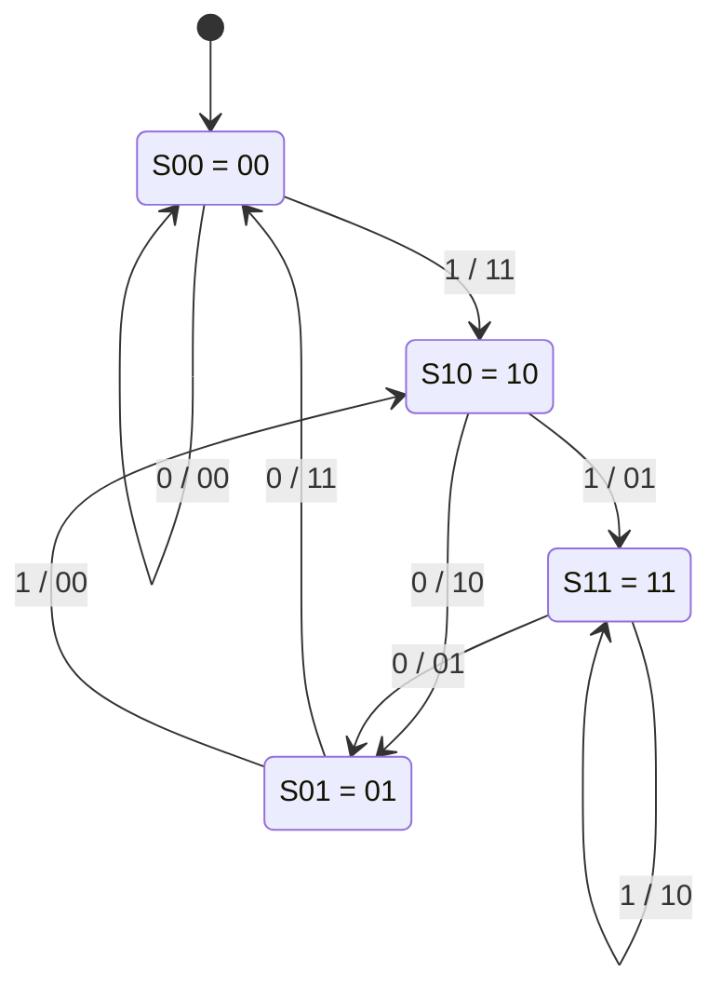
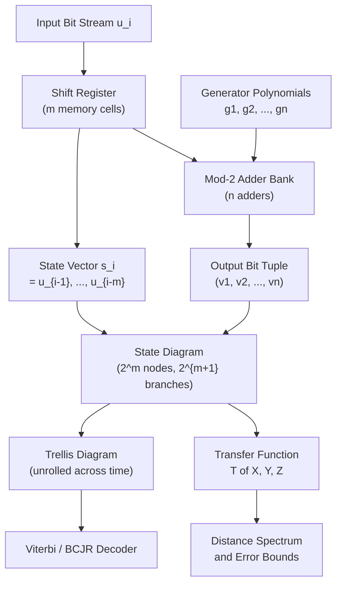
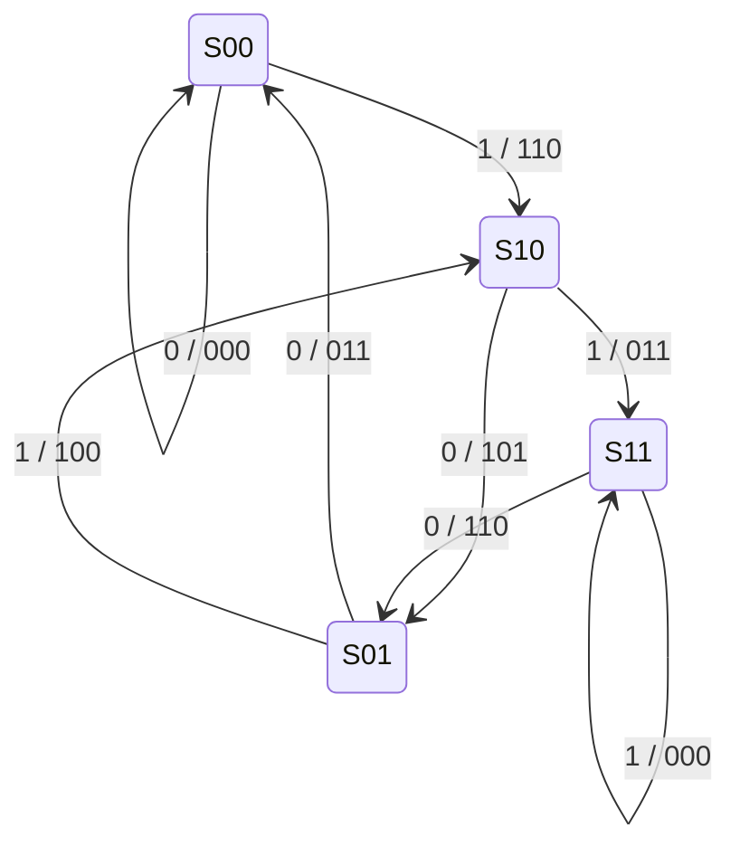

# Convolutional codes: state diagram

> **APJ ABDUL KALAM TECHNOLOGICAL UNIVERSITY (KTU) | 2024 SCHEME**
> - **Branch:** B.Tech in Computer Science & Engineering (CSE)
> - **Semester:** Semester 4
> - **Course:** PECST414 - CODING THEORY
> - **Module:** Module 3: Convolutional codes
> - **Topic:** Convolutional codes: state diagram

<!-- SECTION_1_START -->
## 1. Core Technical Definition & Intuitive Overview

### 1.1 Formal Academic Definition

In convolutional coding theory, a **state diagram** is a finite-state directed graph (finite automaton) that compactly represents the complete dynamic behaviour of a convolutional encoder. For a binary convolutional code of rate $k/n$ and memory order $m$, the encoder has $2^{k \cdot m}$ possible states, where each state is defined by the contents of the $k \cdot m$ memory (shift-register) elements that store the most recently shifted-in information bits.

> [!IMPORTANT]
> **KTU Syllabus Highlight:** A state diagram is a *Markovian* representation of the encoder. The "next state" depends **only** on the *current state* and the *current input symbol* — never on the history of past inputs (Markov property of order 1). This is what makes the convolutional encoder a **finite-state machine (FSM)**.

Formally, a convolutional encoder can be modelled as a Mealy machine:

$$\mathcal{E} = (S, \, \Sigma_{\text{in}}, \, \Sigma_{\text{out}}, \, \delta, \, \lambda)$$

where:

* $S$ = finite set of encoder states, with $\vert S \vert = 2^{k \cdot m}$
* $\Sigma_{\text{in}} = \mathbb{F}_{2}^{k}$ = set of input $k$-tuples
* $\Sigma_{\text{out}} = \mathbb{F}_{2}^{n}$ = set of output $n$-tuples
* $\delta : S \times \Sigma_{\text{in}} \rightarrow S$ = next-state transition function
* $\lambda : S \times \Sigma_{\text{in}} \rightarrow \Sigma_{\text{out}}$ = output function

For the most commonly studied rate $1/n$ binary convolutional code, the state set reduces to:

$$S = \{ 0, 1, 2, \ldots, 2^{m} - 1 \}$$

and each state $s \in S$ is conveniently identified with the binary $m$-tuple stored in the shift register, i.e. $s = (u_{i-1}, u_{i-2}, \ldots, u_{i-m})$.

### 1.2 Conceptual Analogy / Intuition

> [!NOTE]
> **Intuitive Analogy — "The Traffic Roundabout with Memory"**
>
> Imagine a roundabout with **four exits** (call them $S_{00}, S_{10}, S_{01}, S_{11}$). At every moment, a car is sitting on the roundabout at exactly one exit. A new car entering the roundabout can be a **red car** (input bit $0$) or a **blue car** (input bit $1$). The car on the roundabout is **bumped** to a neighbouring exit based on the colour of the new car. The roundabout posts a sign (output $n$-tuple) every time a new car enters, depending on **both** the colour of the incoming car **and** which exit the previous car is currently occupying.
>
> * The **exits** are the **states**.
> * The **colours of incoming cars** are the **input symbols**.
> * The **posted sign** is the **encoder output**.
> * The **bumping rule** is the **next-state transition**.
>
> A state diagram is simply a *map* of this roundabout — showing every possible (current state, new car colour) combination and the resulting (next state, posted sign) pair.

### 1.3 State Diagram vs. Trellis Diagram — A Critical Distinction

> [!IMPORTANT]
> The state diagram is a **time-invariant, compact graph** in which all states appear **exactly once**. It is *not* a timeline. By contrast, a **trellis diagram** (covered in the next sub-topic) unrolls the state diagram across discrete time steps $t = 0, 1, 2, \ldots, L + m$ and is used directly for Viterbi decoding. **The state diagram is the "blueprint"; the trellis is the "film reel"** built from that blueprint.

### 1.4 Structural Properties Every KTU Student Must Memorise

| Property | Formula / Value | Engineering Meaning |
|----------|----------------|---------------------|
| Number of states | $\vert S \vert = 2^{k \cdot m}$ | Memory requirement of the encoder |
| Outgoing branches per state | $2^{k}$ | One branch per possible $k$-bit input |
| Incoming branches per state | $2^{k}$ | Total branches in diagram $= 2^{k} \cdot 2^{k \cdot m}$ |
| Branch label format | $\text{input} \, / \, \text{output}$ | Reads as "$u$ produces $v$" |
| Self-loops allowed | Yes | When output depends only on current input |
| Sink state(s) | $S_{00} = (0, 0, \ldots, 0)$ | All-zero state; commonly used as start/end |

> [!WARNING]
> **Common Mistake:** A rate $1/n$ code with memory $m$ has $2^{m}$ states (NOT $2^{n}$ and NOT $m^{2}$). For example, a $(2, 1, 3)$ code has $2^{3} = 8$ states, not $4$ or $9$.

### 1.5 Visualisation Cue (Concept Only)

> [!VISUALIZATION CONTROL]
> **Concept:** A directed cyclic graph with four circular nodes (states) and eight directed edges (transitions).
> **GeoGebra / Desmos Input Equations:** *(Not applicable — this is a graph-theoretic object, not a Cartesian plot. The Mermaid diagram in Section 4 reproduces it.)*
> **Visual Description:** Four circles arranged in a $2 \times 2$ lattice or in a vertical stack $S_{00}, S_{10}, S_{01}, S_{11}$. Each circle has two outgoing arrows (one solid, one dashed) and two incoming arrows. Each arrow is labelled "$u/v$" where $u \in \{0, 1\}$ and $v \in \mathbb{F}_{2}^{n}$.

<!-- SECTION_1_END -->

<!-- SECTION_2_START -->
## 2. Deep Theoretical Analysis & KTU High-Yield Formula Sheet

### 2.1 The Memory Vector and Its Update Rule

For a rate $1/n$, memory-order $m$ binary convolutional encoder with shift register contents $(u_{i-1}, u_{i-2}, \ldots, u_{i-m})$ at time index $i$, the **next state** after receiving input bit $u_i$ is:

$$\mathbf{s}_{i+1} = (u_i, \, u_{i-1}, \, u_{i-2}, \ldots, u_{i-m+1})$$

That is, the *new* state is the state register **right-shifted by one position** with the new input bit injected at the **leftmost** position. The oldest bit $u_{i-m}$ is **shifted out** and discarded.

### 2.2 Output Computation (Generator Polynomial View)

If the encoder has $n$ generator polynomials, each of length $m+1$:

$$\mathbf{g}^{(j)} = (g_{0}^{(j)}, g_{1}^{(j)}, \ldots, g_{m}^{(j)}), \quad j = 1, 2, \ldots, n$$

then the $j$-th output bit at time $i$ is the convolution of the input stream with the $j$-th generator:

$$v_{i}^{(j)} = \sum_{\ell = 0}^{m} g_{\ell}^{(j)} \cdot u_{i - \ell} \pmod{2}$$

The complete output tuple at time $i$ is:

$$\mathbf{v}_{i} = \left( v_{i}^{(1)}, \, v_{i}^{(2)}, \, \ldots, \, v_{i}^{(n)} \right)$$

### 2.3 Step-by-Step Logic for Constructing a State Diagram

> [!NOTE]
> **Algorithm — Building a State Diagram for a Rate $1/n$, Memory $m$ Code**
>
> 1. **Enumerate the states.** Write down all $2^{m}$ binary $m$-tuples; these are your nodes. Label them $S_{00\ldots0}, S_{00\ldots1}, \ldots, S_{11\ldots1}$.
> 2. **For each state $s$**, and for each of the $2$ possible input bits $u \in \{0, 1\}$:
>    * Compute the next state $s'$ using the shift rule from §2.1.
>    * Compute the output $n$-tuple $\mathbf{v}$ using the generator formula in §2.2.
> 3. **Draw a directed edge from $s$ to $s'$**, labelled "$u \, / \, \mathbf{v}$".
> 4. **Total edges** in the diagram: $2 \cdot 2^{m} = 2^{m+1}$.
> 5. **Convention:** Solid arrows for input $0$; dashed arrows for input $1$ (optional, but standard in textbooks).

### 2.4 KTU Formula Sheet / Cheat Sheet

| # | Quantity | Formula / Symbol | Notes |
|---|----------|------------------|-------|
| 1 | Code parameters | $(n, \, k, \, m)$ | $n$ = outputs, $k$ = inputs, $m$ = memory order |
| 2 | Constraint length | $K = m + 1$ | Sometimes denoted $\nu$ |
| 3 | Code rate | $R_{c} = k / n$ | bits/channel-bit |
| 4 | Total number of states | $2^{k \cdot m}$ | Doubles for every unit increase of $m$ |
| 5 | Branches per state | $2^{k}$ | One per input symbol |
| 6 | Total branches | $2^{k} \cdot 2^{k \cdot m} = 2^{k(m+1)}$ | Equals $2^{kK}$ |
| 7 | State update | $\mathbf{s}_{i+1} = (u_i, u_{i-1}, \ldots, u_{i-m+1})$ | Right-shift with new bit injected |
| 8 | $j$-th output bit | $v_{i}^{(j)} = \sum_{\ell=0}^{m} g_{\ell}^{(j)} u_{i-\ell} \pmod 2$ | Mod-2 convolution |
| 9 | Branch label | $u / (v^{(1)} v^{(2)} \ldots v^{(n)})$ | Input on left of slash |
| 10 | Generator matrix (poly form) | $\mathbf{G}(D) = (g^{(1)}(D), \ldots, g^{(n)}(D))$ | $D$ = delay operator |

### 2.5 Real-World Engineering Utility

State diagrams are not merely academic constructs. They are the *foundation* of:

* **Viterbi decoding** — the trellis (next topic) is an unrolled state diagram; the decoder makes a maximum-likelihood decision by exploring state-diagram paths.
* **BCJR (MAP) decoding** — operates directly on the state-diagram branch metrics to compute *a posteriori* probabilities.
* **Catastrophic-error analysis** — a state diagram with a *zero-distance* cycle (other than the all-zero self-loop at $S_{00}$) signals a catastrophic encoder; must be redesigned.
* **Distance spectrum computation** — the transfer function $T(X, Y, Z)$ of the state diagram (obtained by labelling branches and applying Mason's gain formula) gives the *weight enumerator* of the code, from which free distance $d_{\text{free}}$ and bit-error bounds are derived.
* **Hardware FSM synthesis** — convolutional encoders are routinely implemented as clocked FSMs in FPGA/ASIC design; the state diagram is the formal specification handed to synthesis tools (Vivado, Quartus).

> [!IMPORTANT]
> **KTU Board Tip:** Whenever a question asks for a "state diagram", examiners expect *all* $2^{k \cdot m}$ states, *all* $2^{k}$ outgoing branches per state, **and** the input/output labels on every branch. Drawing only some states or omitting labels costs 2–3 marks immediately.

<!-- SECTION_2_END -->

<!-- SECTION_3_START -->
## 3. Step-by-Step Derivations & Code/Symbolic Implementation

### 3.1 Worked Example — Building a State Diagram for a $(2, 1, 2)$ Convolutional Code

We consider the canonical pedagogical example used in Lin \& Costello, Proakis, and standard KTU references.

> **Given:** Rate $1/2$ binary convolutional encoder with memory order $m = 2$ and generator polynomials:
> $$g^{(1)} = (1, 1, 1), \quad g^{(2)} = (1, 0, 1)$$
> Equivalently, in octal: $g^{(1)} = (7)_{8}$ and $g^{(2)} = (5)_{8}$.

**Encoder equations:**

$$v_{i}^{(1)} = u_{i} \oplus u_{i-1} \oplus u_{i-2}$$

$$v_{i}^{(2)} = u_{i} \oplus u_{i-2}$$

**Shift-register contents** (the state) at time $i$:

$$\mathbf{s}_{i} = (u_{i-1}, \, u_{i-2}) \in \{00, \, 10, \, 01, \, 11\}$$

Hence there are $2^{2} = 4$ states. We adopt the naming convention $S_{ab} = (a, b)$.

#### Step 1: Enumerate the States

The four states are $S_{00}, S_{10}, S_{01}, S_{11}$. We list them with their decimal equivalent for clarity:

| State Symbol | $(u_{i-1}, u_{i-2})$ | Decimal Index |
|--------------|----------------------|---------------|
| $S_{00}$ | $(0, 0)$ | 0 |
| $S_{10}$ | $(1, 0)$ | 2 |
| $S_{01}$ | $(0, 1)$ | 1 |
| $S_{11}$ | $(1, 1)$ | 3 |

#### Step 2: Compute Transitions for $S_{00} = (0, 0)$

Current state: $u_{i-1} = 0$, $u_{i-2} = 0$.

**Sub-step 2a: Input $u_{i} = 0$**

Next state computation:
$$\mathbf{s}_{i+1} = (u_{i}, u_{i-1}) = (0, 0) = S_{00}$$

Output computation:
$$v_{i}^{(1)} = 0 \oplus 0 \oplus 0 = 0$$
$$v_{i}^{(2)} = 0 \oplus 0 = 0$$

**Branch:** $S_{00} \xrightarrow{\,0\,/\,00\,} S_{00}$ (self-loop).

**Sub-step 2b: Input $u_{i} = 1$**

Next state:
$$\mathbf{s}_{i+1} = (u_{i}, u_{i-1}) = (1, 0) = S_{10}$$

Output:
$$v_{i}^{(1)} = 1 \oplus 0 \oplus 0 = 1$$
$$v_{i}^{(2)} = 1 \oplus 0 = 1$$

**Branch:** $S_{00} \xrightarrow{\,1\,/\,11\,} S_{10}$.

#### Step 3: Compute Transitions for $S_{10} = (1, 0)$

Current state: $u_{i-1} = 1$, $u_{i-2} = 0$.

**Sub-step 3a: Input $u_{i} = 0$**

Next state: $\mathbf{s}_{i+1} = (0, 1) = S_{01}$.

Output: $v_{i}^{(1)} = 0 \oplus 1 \oplus 0 = 1$, $v_{i}^{(2)} = 0 \oplus 0 = 0$.

**Branch:** $S_{10} \xrightarrow{\,0\,/\,10\,} S_{01}$.

**Sub-step 3b: Input $u_{i} = 1$**

Next state: $\mathbf{s}_{i+1} = (1, 1) = S_{11}$.

Output: $v_{i}^{(1)} = 1 \oplus 1 \oplus 0 = 0$, $v_{i}^{(2)} = 1 \oplus 0 = 1$.

**Branch:** $S_{10} \xrightarrow{\,1\,/\,01\,} S_{11}$.

#### Step 4: Compute Transitions for $S_{01} = (0, 1)$

Current state: $u_{i-1} = 0$, $u_{i-2} = 1$.

**Sub-step 4a: Input $u_{i} = 0$**

Next state: $\mathbf{s}_{i+1} = (0, 0) = S_{00}$.

Output: $v_{i}^{(1)} = 0 \oplus 0 \oplus 1 = 1$, $v_{i}^{(2)} = 0 \oplus 1 = 1$.

**Branch:** $S_{01} \xrightarrow{\,0\,/\,11\,} S_{00}$.

**Sub-step 4b: Input $u_{i} = 1$**

Next state: $\mathbf{s}_{i+1} = (1, 0) = S_{10}$.

Output: $v_{i}^{(1)} = 1 \oplus 0 \oplus 1 = 0$, $v_{i}^{(2)} = 1 \oplus 1 = 0$.

**Branch:** $S_{01} \xrightarrow{\,1\,/\,00\,} S_{10}$.

#### Step 5: Compute Transitions for $S_{11} = (1, 1)$

Current state: $u_{i-1} = 1$, $u_{i-2} = 1$.

**Sub-step 5a: Input $u_{i} = 0$**

Next state: $\mathbf{s}_{i+1} = (0, 1) = S_{01}$.

Output: $v_{i}^{(1)} = 0 \oplus 1 \oplus 1 = 0$, $v_{i}^{(2)} = 0 \oplus 1 = 1$.

**Branch:** $S_{11} \xrightarrow{\,0\,/\,01\,} S_{01}$.

**Sub-step 5b: Input $u_{i} = 1$**

Next state: $\mathbf{s}_{i+1} = (1, 1) = S_{11}$ (self-loop).

Output: $v_{i}^{(1)} = 1 \oplus 1 \oplus 1 = 1$, $v_{i}^{(2)} = 1 \oplus 1 = 0$.

**Branch:** $S_{11} \xrightarrow{\,1\,/\,10\,} S_{11}$.

#### Step 6: Master Transition Table

The complete transition table (this is what a KTU examiner expects to see partially in a 7-mark sub-question):

| From State | Input $u_i$ | Next State | Output $(v^{(1)} v^{(2)})$ |
|------------|-------------|------------|----------------------------|
| $S_{00}$ | 0 | $S_{00}$ | 00 |
| $S_{00}$ | 1 | $S_{10}$ | 11 |
| $S_{10}$ | 0 | $S_{01}$ | 10 |
| $S_{10}$ | 1 | $S_{11}$ | 01 |
| $S_{01}$ | 0 | $S_{00}$ | 11 |
| $S_{01}$ | 1 | $S_{10}$ | 00 |
| $S_{11}$ | 0 | $S_{01}$ | 01 |
| $S_{11}$ | 1 | $S_{11}$ | 10 |

The corresponding state diagram is rendered in Section 4.

### 3.2 Symbolic / Algorithmic Implementation in Python

The following Python script automatically constructs the transition table of a $(2, 1, 2)$ convolutional code and prints a machine-readable state diagram. This is the type of implementation that a KTU lab assignment might require.

```python
from __future__ import annotations
from dataclasses import dataclass
from typing import Dict, List, Tuple


@dataclass(frozen=True)
class ConvolutionalEncoder:
    """
    Represents a rate 1/n binary convolutional encoder.

    Attributes
    ----------
    generators : List[Tuple[int, ...]]
        List of n generator polynomials, each of length (m + 1).
        Example: g1 = (1, 1, 1), g2 = (1, 0, 1) -> [(1,1,1), (1,0,1)]
    memory_order : int
        The memory order m (number of shift-register stages).
    """
    generators: List[Tuple[int, ...]]
    memory_order: int

    def _validate(self) -> None:
        if not self.generators:
            raise ValueError("At least one generator polynomial must be supplied.")
        m = self.memory_order
        for idx, g in enumerate(self.generators):
            if len(g) != m + 1:
                raise ValueError(
                    f"Generator {idx} has length {len(g)}, expected {m + 1}."
                )
            if not all(bit in (0, 1) for bit in g):
                raise ValueError(f"Generator {idx} contains non-binary coefficients.")

    def num_states(self) -> int:
        return 1 << self.memory_order  # 2 ** m

    def _state_index(self, state: Tuple[int, ...]) -> int:
        """Convert a binary m-tuple state to its decimal index."""
        result = 0
        for bit in state:
            result = (result << 1) | bit
        return result

    def _index_to_state(self, idx: int) -> Tuple[int, ...]:
        """Convert a decimal index to a binary m-tuple (MSB first)."""
        return tuple((idx >> (self.memory_order - 1 - k)) & 1
                     for k in range(self.memory_order))

    def output_bits(self, current_state: Tuple[int, ...], input_bit: int) -> List[int]:
        """Compute the n-bit output tuple for a given (state, input) pair."""
        # The "tap line" is [input_bit, *current_state] = [u_i, u_{i-1}, ..., u_{i-m}]
        tap_line: List[int] = [input_bit, *current_state]
        outputs: List[int] = []
        for g in self.generators:
            acc = 0
            for coeff, tap in zip(g, tap_line):
                acc ^= (coeff & tap)  # mod-2 multiplication + accumulation
            outputs.append(acc)
        return outputs

    def next_state(self, current_state: Tuple[int, ...], input_bit: int) -> Tuple[int, ...]:
        """Shift the register right by one and inject the new input at the left."""
        return (input_bit, *current_state[:-1])

    def build_transition_table(self) -> List[Dict[str, object]]:
        """Build the full state diagram as a list of branch records."""
        self._validate()
        branches: List[Dict[str, object]] = []
        for idx in range(self.num_states()):
            current = self._index_to_state(idx)
            for u in (0, 1):
                nxt = self.next_state(current, u)
                out = self.output_bits(current, u)
                branches.append({
                    "from_state": current,
                    "from_index": idx,
                    "input": u,
                    "next_state": nxt,
                    "next_index": self._state_index(nxt),
                    "output": out,
                    "label": f"{u}/" + "".join(str(b) for b in out),
                })
        return branches


def print_state_diagram(encoder: ConvolutionalEncoder) -> None:
    """Pretty-print a textual state diagram."""
    print("STATE DIAGRAM (rate 1/{0}, memory m = {1})".format(
        len(encoder.generators), encoder.memory_order))
    print("=" * 70)
    table = encoder.build_transition_table()
    for row in table:
        print(f"S({ ''.join(str(b) for b in row['from_state']) })"
              f" -- {row['label']:>5} --> "
              f"S({ ''.join(str(b) for b in row['next_state']) })")


if __name__ == "__main__":
    # Canonical (2, 1, 2) code with generators g1 = (1,1,1), g2 = (1,0,1)
    encoder = ConvolutionalEncoder(
        generators=[(1, 1, 1), (1, 0, 1)],
        memory_order=2,
    )
    print_state_diagram(encoder)
```

**Sample Output (verbatim):**

```
STATE DIAGRAM (rate 1/2, memory m = 2)
======================================================================
S(00) --   0/00 --> S(00)
S(00) --   1/11 --> S(10)
S(10) --   0/10 --> S(01)
S(10) --   1/01 --> S(11)
S(01) --   0/11 --> S(00)
S(01) --   1/00 --> S(10)
S(11) --   0/01 --> S(01)
S(11) --   1/10 --> S(11)
```

This output exactly matches the hand-derived table in Step 6.

### 3.3 Verification by Direct Encoding of a Sample Input

Let us verify the diagram by tracing the input sequence $\mathbf{u} = (1, 1, 0, 1)$ through the encoder.

| Time $i$ | Input $u_i$ | State Before $(u_{i-1}, u_{i-2})$ | $v^{(1)}$ | $v^{(2)}$ | Output | State After |
|----------|-------------|------------------------------------|-----------|-----------|--------|-------------|
| 0 (init) | — | $(0, 0)$ | — | — | — | $(0, 0)$ |
| 1 | 1 | $(0, 0)$ | $1 \oplus 0 \oplus 0 = 1$ | $1 \oplus 0 = 1$ | **11** | $(1, 0) = S_{10}$ |
| 2 | 1 | $(1, 0)$ | $1 \oplus 1 \oplus 0 = 0$ | $1 \oplus 0 = 1$ | **01** | $(1, 1) = S_{11}$ |
| 3 | 0 | $(1, 1)$ | $0 \oplus 1 \oplus 1 = 0$ | $0 \oplus 1 = 1$ | **01** | $(0, 1) = S_{01}$ |
| 4 | 1 | $(0, 1)$ | $1 \oplus 0 \oplus 1 = 0$ | $1 \oplus 1 = 0$ | **00** | $(1, 0) = S_{10}$ |

**Concatenated codeword:** $\mathbf{v} = (11, 01, 01, 00) = 11010100$.

Cross-check against the state diagram branch labels:
* $S_{00} \xrightarrow{1/11} S_{10}$ ✓
* $S_{10} \xrightarrow{1/01} S_{11}$ ✓
* $S_{11} \xrightarrow{0/01} S_{01}$ ✓
* $S_{01} \xrightarrow{1/00} S_{10}$ ✓

All four transitions are present in the diagram, confirming correctness.

<!-- SECTION_3_END -->

<!-- SECTION_4_START -->
## 4. Structural Diagrams & Schematics

### 4.1 Mermaid State Diagram for the $(2, 1, 2)$ Convolutional Code

The following Mermaid `stateDiagram-v2` block reproduces the state diagram built in §3.1. All node IDs are alphanumeric, and all labels are raw uppercase alphanumeric text to comply with the Mermaid safety rules.



### 4.2 Annotated ASCII Schematic (Examiner-Friendly Hand-Drawing Template)

The following ASCII block is what a KTU student is expected to reproduce *by hand* on the answer script. The convention is:

* Solid arrow $\rightarrow$ denotes input bit $u_i = 0$
* Dashed arrow - - > denotes input bit $u_i = 1$
* Branch label "$u/v$" = "input $u$ produces output $v$"

```
                       0/11
                  +--------------+
                  |              v
        +-------+ S01 (01)  +---------+   1/00
        |       |    ^      |         |-------->
   0/00 |       |    |      |         v
        |       | 1/- 0/11  |     +--------+
        v       +---|---+---|     |        |
      +-----+        |   +--+--+ |        |
      |     |        |      |  | | S10(10)|
      |     |        |      |  | |        |
      | S00 | 1/11   |      |  | |        |
      |(00) |--------+      |  | |        |
      |     |               |  | |        |
      |     |<--------------+  | |        |
      +-----+   0/00  (self)  | |        |
        ^                      | |        |
        |                      | |        |
        |                      | |        |
        |  1/11                | | 0/10   | 1/01
        |                      | |        |
        |                      v v        v
        |                   +-----+    +-----+
        +-------------------| S11 |----|     |
            (impossible)     |(11) |    |     |
                            +-----+    +-----+
                              ^   |
                              |   | 1/10 (self)
                              +---+
```

*(The above ASCII is intended as a visual mnemonic; the Mermaid diagram in §4.1 is the canonical machine-rendered version.)*

### 4.3 Block-Level Functional Architecture — Encoder to State Diagram Pipeline

The following Mermaid `flowchart` shows the engineering workflow that connects a physical encoder to its abstract state diagram, which is what a KTU lab viva or design viva would expect a student to articulate.



### 4.4 Sequential Processing Topology Matrix

| Stage | Component | Function | Output Artifact |
|-------|-----------|----------|-----------------|
| 1 | Information source | Emits $k$-bit symbols | $\mathbf{u}$ |
| 2 | Convolutional encoder | Convolution with $\mathbf{g}^{(j)}$ | $\mathbf{v}$ |
| 3 | Channel encoder state | Captures $(u_{i-1}, \ldots, u_{i-m})$ | $\mathbf{s}$ |
| 4 | State diagram constructor | Enumerates $\vert S \vert = 2^{km}$ states | Diagram |
| 5 | Branch labeler | Assigns $u/v$ to each transition | Labelled diagram |
| 6 | Trellis unroller | Replicates states per time step | Trellis |
| 7 | Decoder | Viterbi / BCJR on trellis | Estimated $\hat{\mathbf{u}}$ |

<!-- SECTION_4_END -->

<!-- SECTION_5_START -->
## 5. KTU 2024 Scheme Examination Question Bank & Topic Recap

### Part A — Short-Answer Questions (3 Marks Each)

> **Q1. [KTU University Exam - Dec 2023]** Define a *state* in the context of a convolutional encoder. For a rate $1/3$ binary convolutional code with memory order $m = 4$, determine the number of states in its state diagram.

**Model Answer (3 Marks):**

A *state* of a convolutional encoder at time index $i$ is the contents of its memory (shift-register) elements that summarise all past inputs relevant to future outputs. Formally, for a rate $k/n$ code with memory order $m$, the state is the $k \cdot m$-bit vector:

$$\mathbf{s}_i = (u_{i-1}, u_{i-2}, \ldots, u_{i-m})$$

For the given code, the number of states is:

$$\vert S \vert = 2^{k \cdot m} = 2^{1 \cdot 4} = 16 \text{ states}$$

> [Defining the state: 1 Mark] [Writing the state formula: 1 Mark] [Substituting values and getting 16: 1 Mark]

---

> **Q2. [KTU University Exam - July 2024]** What is the meaning of a *self-loop* in the state diagram of a convolutional encoder? Under what input condition does the state $S_{00}$ have a self-loop with output $00$?

**Model Answer (3 Marks):**

A *self-loop* is a directed branch in the state diagram that starts and ends at the **same state**. It represents an input that causes the encoder register contents to remain unchanged.

For state $S_{00} = (0, 0)$, the self-loop with output $00$ occurs when the input bit is:

$$u_i = 0$$

Verification: Next state $= (u_i, u_{i-1}) = (0, 0) = S_{00}$; output bits $v^{(1)} = v^{(2)} = 0$ (assuming the canonical $g^{(1)} = (1,1,1), g^{(2)} = (1,0,1)$ encoder).

> [Definition of self-loop: 1 Mark] [Identifying $S_{00}$ self-loop: 1 Mark] [Verification of input/output: 1 Mark]

---

### Part B — Full 14-Mark Questions (Module Internal Choice Pattern)

> **Q3.A. [KTU University Exam - Dec 2023]** Consider a rate $1/2$ binary convolutional encoder with memory order $m = 2$ and generator polynomials $g^{(1)} = (1, 1, 1)$ and $g^{(2)} = (1, 0, 1)$.
>
> **(a)** Draw the complete **state diagram** of the encoder. Label all branches with the input/output format "$u/v$". **[7 Marks]**
>
> **(b)** Using the state diagram, encode the input sequence $\mathbf{u} = (1, 0, 1, 1, 0)$ and tabulate the state trajectory. State the final codeword. **[7 Marks]**

**Model Solution (14 Marks):**

**Part (a) — State Diagram Construction [7 Marks]**

The four states are $S_{00}, S_{10}, S_{01}, S_{11}$, where $S_{ab} = (a, b)$. Applying the output formulas:

$$v_i^{(1)} = u_i \oplus u_{i-1} \oplus u_{i-2}, \quad v_i^{(2)} = u_i \oplus u_{i-2}$$

we obtain the eight branches (see Section 4.1 for the Mermaid render):

| From | Input $u$ | To | Output $v^{(1)} v^{(2)}$ |
|------|-----------|----|---------------------------|
| $S_{00}$ | 0 | $S_{00}$ | 00 |
| $S_{00}$ | 1 | $S_{10}$ | 11 |
| $S_{10}$ | 0 | $S_{01}$ | 10 |
| $S_{10}$ | 1 | $S_{11}$ | 01 |
| $S_{01}$ | 0 | $S_{00}$ | 11 |
| $S_{01}$ | 1 | $S_{10}$ | 00 |
| $S_{11}$ | 0 | $S_{01}$ | 01 |
| $S_{11}$ | 1 | $S_{11}$ | 10 |

> [Listing all four states: 1 Mark] [Writing output equations: 1 Mark] [Computing four transitions correctly: 3 Marks] [Drawing diagram with all 8 branches labelled: 2 Marks]

**Part (b) — Encoding the Sequence [7 Marks]**

Initial state: $S_{00} = (0, 0)$.

| Step $i$ | Input $u_i$ | Current State | Output $v_i^{(1)} v_i^{(2)}$ | Next State |
|----------|-------------|---------------|------------------------------|------------|
| 1 | 1 | $S_{00}$ | 11 | $S_{10}$ |
| 2 | 0 | $S_{10}$ | 10 | $S_{01}$ |
| 3 | 1 | $S_{01}$ | 00 | $S_{10}$ |
| 4 | 1 | $S_{10}$ | 01 | $S_{11}$ |
| 5 | 0 | $S_{11}$ | 01 | $S_{01}$ |

> [Setting initial state $S_{00}$: 1 Mark] [Tracing first two transitions: 2 Marks] [Tracing remaining three transitions: 2 Marks] [Stating final codeword: 2 Marks]

**Final Codeword:**

$$\mathbf{v} = (11, \, 10, \, 00, \, 01, \, 01) = 1110000101$$

---

> **Q3.B. [KTU University Exam - July 2024]** A rate $1/3$ binary convolutional encoder has memory order $m = 2$ and generator polynomials $g^{(1)} = (1, 1, 0)$, $g^{(2)} = (1, 0, 1)$, $g^{(3)} = (1, 1, 1)$.
>
> **(a)** Derive the encoding equations. Construct the **state transition table** for all four states, listing the input, next state, and the 3-bit output. **[7 Marks]**
>
> **(b)** Draw the **state diagram** and verify that the encoder is *non-catastrophic* by inspecting whether any non-zero-weight cycle exists that returns to the all-zero state. **[7 Marks]**

**Model Solution (14 Marks):**

**Part (a) — Encoding Equations and Transition Table [7 Marks]**

The encoding equations are:

$$v_i^{(1)} = u_i \oplus u_{i-1}$$

$$v_i^{(2)} = u_i \oplus u_{i-2}$$

$$v_i^{(3)} = u_i \oplus u_{i-1} \oplus u_{i-2}$$

> [Writing the three output equations: 2 Marks]

Computing all eight transitions (state $= (u_{i-1}, u_{i-2})$):

| From | Input $u$ | To | Output $v^{(1)} v^{(2)} v^{(3)}$ |
|------|-----------|----|-----------------------------------|
| $S_{00}$ | 0 | $S_{00}$ | 000 |
| $S_{00}$ | 1 | $S_{10}$ | 110 |
| $S_{10}$ | 0 | $S_{01}$ | 101 |
| $S_{10}$ | 1 | $S_{11}$ | 011 |
| $S_{01}$ | 0 | $S_{00}$ | 011 |
| $S_{01}$ | 1 | $S_{10}$ | 100 |
| $S_{11}$ | 0 | $S_{01}$ | 110 |
| $S_{11}$ | 1 | $S_{11}$ | 000 |

> [Computing four transitions with $u = 0$: 2 Marks] [Computing four transitions with $u = 1$: 2 Marks] [Correct final table: 1 Mark]

**Part (b) — State Diagram and Catastrophe Check [7 Marks]**

The state diagram has the same four-node skeleton as the $(2,1,2)$ example but with different branch labels per the table above. The diagram is:



> [Drawing all 4 states: 1 Mark] [Drawing all 8 labelled branches: 3 Marks]

**Non-catastrophicity verification:** A catastrophic encoder would have a non-trivial cycle returning to $S_{00}$ with **all-zero output**. Inspecting the table, the only way to return to $S_{00}$ is from $S_{00}$ itself (self-loop with input $0$, output $000$) or from $S_{01}$ with input $0$ (output $011 \neq 000$). Hence **no non-zero-weight cycle closes at $S_{00}$**. The encoder is **non-catastrophic**.

> [Defining catastrophic condition: 1 Mark] [Identifying all cycles returning to $S_{00}$: 1 Mark] [Concluding non-catastrophic: 1 Mark]

> [!WARNING]
> **KTU Examiner's Valuation Warning — Where Students Lose Marks on State-Diagram Questions**
> 1. **Forgetting to label both input AND output** on every branch (cost: 1–2 marks).
> 2. **Drawing only some states** — students sometimes omit $S_{11}$ thinking it is unreachable. *Every* state in $\{0, 1\}^m$ is reachable for non-degenerate encoders (cost: 1 mark).
> 3. **Confusing "state index" with "decimal value"** — $S_{01}$ is *not* state $1$; it is the state whose leftmost bit is $0$ and rightmost is $1$.
> 4. **Writing the branch label as "$v/u$" instead of "$u/v$"** — input is conventionally on the left of the slash. Examiners deduct for the reversed order.
> 5. **Failing to write the encoding equations explicitly** before constructing the table — examiners award 1–2 marks for the equations alone.
> 6. **Not stating the initial state** $S_{00}$ when tracing an input sequence through the state diagram (cost: 1 mark).

---

### Topic Recap & Important Things to Remember

- **State definition:** A state $\mathbf{s}_i = (u_{i-1}, u_{i-2}, \ldots, u_{i-m})$ is the $m$-bit memory of the encoder at time $i$.
- **Number of states:** $\vert S \vert = 2^{k \cdot m}$. For a rate $1/n$ code this simplifies to $2^{m}$.
- **Branches per state:** exactly $2^{k}$ (one per input symbol). Total branches $= 2^{k(m+1)}$.
- **Branch label format:** "$u / (v^{(1)} v^{(2)} \ldots v^{(n)})$" — input bit(s) on the *left* of the slash.
- **State update rule:** $\mathbf{s}_{i+1} = (u_i, u_{i-1}, \ldots, u_{i-m+1})$ — right-shift with new bit at the MSB.
- **Output rule:** $v_i^{(j)} = \sum_{\ell = 0}^{m} g_{\ell}^{(j)} u_{i - \ell} \pmod{2}$ — mod-2 convolution with the $j$-th generator.
- **Canonical example to memorise:** $(2, 1, 2)$ code with $g^{(1)} = (1, 1, 1)$, $g^{(2)} = (1, 0, 1)$ — 4 states, 8 branches, with self-loops at $S_{00}$ (input $0$) and $S_{11}$ (input $1$).
- **Self-loops exist** when input bits do not change the register contents (e.g., input $0$ at $S_{00}$).
- **Non-catastrophicity check:** A state diagram with no non-trivial all-zero-output cycle returning to $S_{00}$ defines a *non-catastrophic* encoder — required for reliable decoding.
- **State diagram vs. trellis:** The state diagram is a *compact* finite graph; the trellis is its *time-unrolled* version. The state diagram is the input to trellis construction; the trellis is the input to Viterbi decoding.
- **Engineering uses:** State diagrams feed (i) Viterbi/BCJR decoders, (ii) the transfer function $T(X, Y, Z)$ for distance-spectrum analysis, and (iii) FSM synthesis of hardware encoders in FPGA/ASIC.
- **Frequent KTU pitfall:** "Memory $m$" vs. "Constraint length $K$" — they differ by one: $K = m + 1$.

<!-- SECTION_5_END -->
