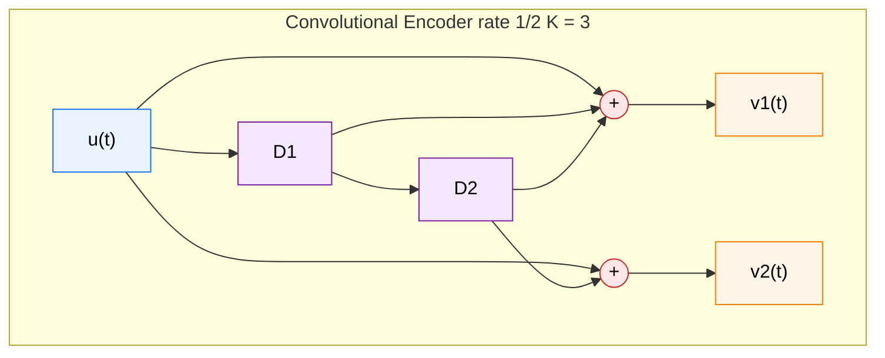
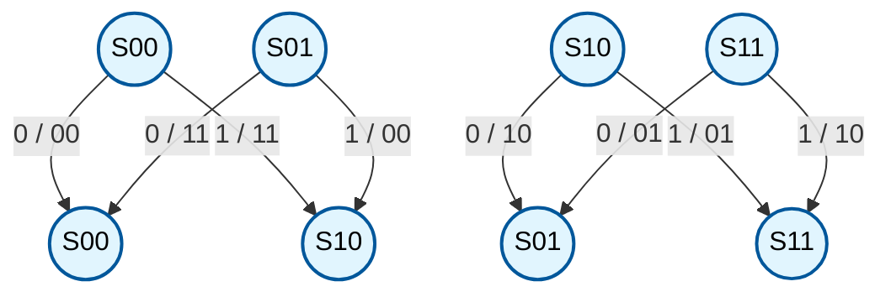
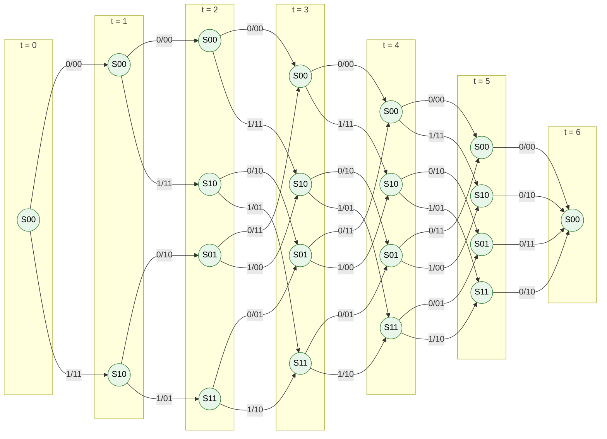
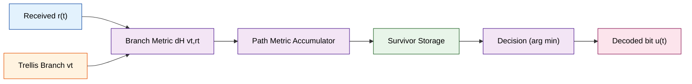

# Convolutional codes: trellis diagram

> **APJ ABDUL KALAM TECHNOLOGICAL UNIVERSITY (KTU) | 2024 SCHEME**
> - **Branch:** B.Tech in Computer Science & Engineering (CSE)
> - **Semester:** Semester 4
> - **Course:** PECST414 - CODING THEORY
> - **Module:** Module 3: Convolutional codes
> - **Topic:** Convolutional codes: trellis diagram

<!-- SECTION_1_START -->

# 1. Core Technical Definition & Intuitive Overview

## 1.1 Formal Academic Definition

A **trellis diagram** is a time-indexed, finite-state graphical representation of a convolutional encoder that displays every possible state transition (branch) at every discrete time instant, layered horizontally across time. Formally, for a binary convolutional encoder of rate $k/n$, memory order $m$, and state space $\Sigma = \{0,1\}^{mk}$, the trellis $T$ is the bipartite time-expanded graph

$$T \;=\; \big\langle \, \mathcal{V},\; \mathcal{E},\; \mathcal{L} \,\big\rangle$$

where $\mathcal{V} = \{\,(\sigma,\,t) \mid \sigma \in \Sigma,\; t \in \{0,1,\dots,L+m\}\,\}$ is the set of state-time vertices, $\mathcal{E}$ is the set of directed edges (branches) connecting $(\sigma, t)$ to $(\sigma', t+1)$ only when $\sigma'$ is a valid next state, and $\mathcal{L}$ is the branch labelling function mapping each edge to the corresponding $n$-bit output symbol $v_t$ (and input $u_t$).

> [!IMPORTANT]
> **Key Distinction (KTU Board-Favoured):**
> - **Tree diagram** explodes exponentially — it repeats structure.
> - **State diagram** merges equivalent nodes but loses time.
> - **Trellis diagram** is a *time-unfolded state diagram* — it keeps the memory of the state machine **and** the order of time, making it the canonical structure used by the Viterbi algorithm.

> [!NOTE]
> **Syllabus-Highlight Definition (Lin & Costello, standard KTU reference):**
> A trellis for a convolutional code of rate $k/n$ and memory order $m$ consists of $2^{mk}$ states, with $2^k$ branches entering and leaving each state at every time unit. The first $m$ time units form a *ramp-in* region, the last $m$ units form a *ramp-out* (flushing) region, and the middle is the *steady-state* region.

---

## 1.2 Conceptual Analogy / Intuition

Imagine a **railway marshalling yard** for a bullet train:

- The **states** $S_{00}, S_{01}, S_{10}, S_{11}$ are four parallel platforms.
- **Time** flows strictly left-to-right; each column of platforms represents one clock tick.
- At every tick, each train on a platform can be shunted (via a switch) to **exactly one of two** next platforms — that switch is the **input bit** (0 or 1).
- The **two-bit number painted on the carriage** as it leaves is the **encoder output** $v_t = (v_t^{(1)}, v_t^{(2)})$.

A complete journey of an input message is a single **continuous path weaving through the platforms across time**. Because the trains are indistinguishable, multiple input sequences that pass through the same state at the same time *merge* into the same vertex — this is the **superposition principle** that makes the trellis so much smaller than the tree.

A second helpful analogy: a **fishnet or woven tapestry**, where the vertical threads are states and the horizontal threads are time. The diagonal weft threads (branches) carry encoded information.

---

## 1.3 Physical Constants and Standard Metrics

For a binary rate $1/n$ convolutional code with constraint length $K = m+1$:

| Metric | Symbol | Value / Form |
| :--- | :---: | :--- |
| Number of states | $\vert\Sigma\vert$ | $2^K - 1$ ... or $2^m$ for rate 1/n |
| Branches per state | — | **$2^k$** (input alphabet) |
| Branches per stage | — | $2^{k} \cdot 2^{mk} = 2^{k(m+1)}$ |
| Trellis stages (unflushed) | $L$ | length of input block |
| Trellis stages (flushed) | $L+m$ | $L$ data + $m$ zero tail |
| Trellis stages (terminated) | $L+m$ | input padded with $m$ zeros |

> [!TIP]
> **Mnemonic for KTU:** "**T**rellis = **T**ime-unfolded state diagram; it is **T**he engine of Viterbi decoding."

---

## 1.4 Visualisation Concept (Coordinate-Style)

> [!VISUALIZATION CONTROL]
> **Concept:** Trellis as a lattice in the (time, state) plane
> **GeoGebra / Desmos Input Equations:**
> * `x = t` (time axis, $0 \le t \le L+m$)
> * `y = 0` and `y = 1` (binary state bits)
> * `nodes = list of (t, sigma_decimal)` for $t \in \{0,\dots,L+m\}$ and $\sigma \in \{0,1,2,3\}$
> **Visual Description:** Plot four horizontal lines (one per state $S_{00}, S_{01}, S_{10}, S_{11}$) at $y \in \{0,1,2,3\}$. At every integer $t$, draw solid lines from each state to its two valid successors at $t+1$. Solid lines correspond to input $u=0$, dashed to $u=1$. The trellis visibly "starts narrow" (only $S_{00}$ reachable for the first $m$ ticks) and "ends narrow" (flushing back to $S_{00}$).

---

<!-- SECTION_1_END -->

<!-- SECTION_2_START -->

# 2. Deep Theoretical Analysis & KTU High-Yield Formula Sheet

## 2.1 Anatomy of a Trellis Stage

A single vertical column of the trellis at time $t$ is the set of vertices $\{(\sigma, t) : \sigma \in \Sigma\}$. A stage connects column $t$ to column $t+1$ by **branches**. Every branch carries three labels in the standard KTU/ECE convention:

$$\text{branch} \;=\; u_t \;\big/\; v_t^{(1)}v_t^{(2)}\cdots v_t^{(n)}$$

where $u_t \in \{0,1\}^k$ is the input that *caused* the transition, and $v_t \in \{0,1\}^n$ is the corresponding channel output.

> [!IMPORTANT]
> In KTU board answers, **always write the branch label as $u/v$** (input slash output). Examiners explicitly look for this convention; omitting the input bit costs marks.

---

## 2.2 Structural Decomposition of the Trellis

A complete trellis of length $L$ has $L+m+1$ columns and three distinct regions:

1. **Ramp-In Region** ($0 \le t \le m-1$): only states whose representation is reachable from the all-zero starting state $S_0 = (0,\dots,0)$ via legitimate inputs are active. For rate 1/n, the first column has 1 state, the second has 2, …, the $m$-th has $2^{m-1}$ states.
2. **Steady-State Region** ($m \le t \le L-1$): all $2^m$ states are active; every state has exactly $2^k$ incoming and $2^k$ outgoing branches.
3. **Ramp-Out / Flushing Region** ($L \le t \le L+m$): if the encoder is *terminated* by appending $m$ zero input bits, only the zero state $S_0$ has any outgoing branch — the trellis funnels back to a single state.

---

## 2.3 Trellis vs. Tree vs. State Diagram

| Property | Tree Diagram | State Diagram | Trellis Diagram |
| :--- | :---: | :---: | :---: |
| Time indexed | ✓ | ✗ | ✓ |
| Merges equivalent states | ✗ | ✓ | ✓ |
| Bounded size (per stage) | ✗ (grows $2^k$ per stage) | ✓ | ✓ ($2^{mk}$ per stage) |
| Suitable for ML / Viterbi | ✗ (state explosion) | ✗ (no time) | ✓ (canonical) |
| Total branches at depth $L$ | $2^{kL}$ | $2^k \cdot 2^{mk}$ | $2^{kL}$ but **shared** |

> [!WARNING]
> A common KTU student error is to confuse the *trellis* with the *tree*. The trellis **re-uses** the same state at different times. Drawing the same state at two different $t$ values is **correct**; in a tree it would be a *repeat* (waste).

---

## 2.4 KTU High-Yield Formula Sheet

> [!NOTE]
> All entries below are board-defining. Memorise the boxed quantities.

$$
\begin{aligned}
\text{States: } & \vert\Sigma\vert = 2^{mk} \\
\text{Branches per stage: } & \vert\mathcal{E}_t\vert = 2^k \cdot 2^{mk} = 2^{k(m+1)} \\
\text{Stage index: } & t \in \{0, 1, \dots, L+m\} \\
\text{Constraint length: } & K = m + 1 \\
\text{Code rate: } & R = \frac{k}{n} \\
\text{State at time } t: & \sigma_t = (u_{t-1}, u_{t-2}, \dots, u_{t-m}) \in \mathbb{F}_2^{mk} \\
\text{Branch output (rate 1/n): } & v_t^{(j)} = \sum_{i=0}^{m} g_i^{(j)} u_{t-i} \pmod 2 \\
\text{Path metric increment: } & \lambda(\sigma_t \to \sigma_{t+1}) = d_H\!\big(v_t,\; r_t\big) \\
\text{Path metric (recursive): } & \Gamma_t(\sigma_{t+1}) = \min_{\sigma_t} \big[\,\Gamma_{t-1}(\sigma_t) + \lambda_t\,\big]
\end{aligned}
$$

| Symbol | Meaning | Typical range for KTU |
| :---: | :--- | :--- |
| $m$ | Encoder memory order | $1, 2, 3$ (in syllabus) |
| $k$ | Input bits per stage | usually $1$ |
| $n$ | Output bits per stage | usually $2$ (rate $1/2$) |
| $K$ | Constraint length $m+1$ | $2, 3, 4$ |
| $L$ | Message length | small integers $3$–$6$ in exams |
| $g^{(j)} = (g_0^{(j)},\dots,g_m^{(j)})$ | Generator polynomial for output $j$ | octal form, e.g. $(7,5)_8$ |
| $d_H(\cdot,\cdot)$ | Hamming distance | $0$–$n$ per branch |
| $r_t$ | Received vector at time $t$ | noisy version of $v_t$ |

> **Critical formatting note:** throughout this note, $\vert \cdot \vert$ denotes cardinality or absolute value inside math mode, written as `\vert` or `\mid` to keep markdown tables safe.

---

## 2.5 Real-World Utility of the Trellis

| Domain | How the trellis is used |
| :--- | :--- |
| **Satellite / DVB** | Viterbi decoder (rate 1/2, $K=7$, generators $(171, 133)_8$) operates on a trellis with $2^6 = 64$ states. |
| **Mobile (3G/4G)** | Turbo codes use *two* trellises in parallel with an interleaver between them. |
| **Deep-space (CCSDS)** | $(2,1,6)$ convolutional code with $K=7$, generators $(171, 133)_8$ — textbook trellis example. |
| **5G NR control channels** | Tail-biting convolutional codes (TBCC) use *circular* trellises to avoid rate loss. |
| **Disk drive read channels** | EPR4 / PR4 trellis-coded modulation uses multi-level trellises. |
| **Speech / Audio codecs** | Trellis-coded quantization (TCQ) for low-bit-rate compression. |

The trellis is the **single most important structure** in sequence-detection theory; it underlies Viterbi decoding, the BCJR algorithm, trellis-coded modulation, and continuous-phase modulation.

---

## 2.6 Worked Indexing Convention (Standard for KTU)

For an encoder with memory $m = 2$ and rate $1/2$, the state at time $t$ is conventionally

$$\sigma_t \;=\; (D_1, D_2) \;=\; (u_{t-1},\, u_{t-2})$$

where $D_1$ holds the *most recent* input and $D_2$ holds the *previous* one. The state index in the trellis is written as the two-bit string $D_1D_2$, e.g. $\sigma_t = (1,0) \to$ state label $S_{10}$.

> [!IMPORTANT]
> The notation $S_{ab}$ refers to the **bit-pattern $ab$**, not the integer $ab$. So $S_{10}$ has $D_1 = 1, D_2 = 0$.

---

<!-- SECTION_2_END -->

<!-- SECTION_3_START -->

# 3. Step-by-Step Derivations & Code/Symbolic Implementation

## 3.1 Reference Encoder Used Throughout

To make every step explicit and verifiable, we adopt the **standard KTU reference encoder** of rate $1/2$ and memory $m = 2$ (constraint length $K = 3$):

$$g^{(1)} = (1,\,1,\,1), \qquad g^{(2)} = (1,\,0,\,1)$$

The encoder equations in the time domain are

$$
\begin{aligned}
v_t^{(1)} &= u_t \,\oplus\, u_{t-1} \,\oplus\, u_{t-2} \\
v_t^{(2)} &= u_t \,\oplus\, u_{t-2}
\end{aligned}
$$

State at time $t$: $\sigma_t = (u_{t-1}, u_{t-2})$.

---

## 3.2 Exhaustive Derivation of the State Transition Table

We compute, for **each of the four** states and **each of the two** input bits, the resulting output pair and the next state.

### 3.2.1 State $S_{00}$ (i.e. $u_{t-1}=0$, $u_{t-2}=0$)

- Input $u_t = 0$:
$$v_t^{(1)} = 0\oplus 0\oplus 0 = 0,\quad v_t^{(2)} = 0\oplus 0 = 0 \;\Rightarrow\; v_t = 00$$
New state $\sigma_{t+1} = (u_t, u_{t-1}) = (0,0) = S_{00}$.

- Input $u_t = 1$:
$$v_t^{(1)} = 1\oplus 0\oplus 0 = 1,\quad v_t^{(2)} = 1\oplus 0 = 1 \;\Rightarrow\; v_t = 11$$
New state $\sigma_{t+1} = (1,0) = S_{10}$.

### 3.2.2 State $S_{01}$ (i.e. $u_{t-1}=0$, $u_{t-2}=1$)

- Input $u_t = 0$:
$$v_t^{(1)} = 0\oplus 0\oplus 1 = 1,\quad v_t^{(2)} = 0\oplus 1 = 1 \;\Rightarrow\; v_t = 11$$
New state $\sigma_{t+1} = (0,0) = S_{00}$.

- Input $u_t = 1$:
$$v_t^{(1)} = 1\oplus 0\oplus 1 = 0,\quad v_t^{(2)} = 1\oplus 1 = 0 \;\Rightarrow\; v_t = 00$$
New state $\sigma_{t+1} = (1,0) = S_{10}$.

### 3.2.3 State $S_{10}$ (i.e. $u_{t-1}=1$, $u_{t-2}=0$)

- Input $u_t = 0$:
$$v_t^{(1)} = 0\oplus 1\oplus 0 = 1,\quad v_t^{(2)} = 0\oplus 0 = 0 \;\Rightarrow\; v_t = 10$$
New state $\sigma_{t+1} = (0,1) = S_{01}$.

- Input $u_t = 1$:
$$v_t^{(1)} = 1\oplus 1\oplus 0 = 0,\quad v_t^{(2)} = 1\oplus 0 = 1 \;\Rightarrow\; v_t = 01$$
New state $\sigma_{t+1} = (1,1) = S_{11}$.

### 3.2.4 State $S_{11}$ (i.e. $u_{t-1}=1$, $u_{t-2}=1$)

- Input $u_t = 0$:
$$v_t^{(1)} = 0\oplus 1\oplus 1 = 0,\quad v_t^{(2)} = 0\oplus 1 = 1 \;\Rightarrow\; v_t = 01$$
New state $\sigma_{t+1} = (0,1) = S_{01}$.

- Input $u_t = 1$:
$$v_t^{(1)} = 1\oplus 1\oplus 1 = 1,\quad v_t^{(2)} = 1\oplus 1 = 0 \;\Rightarrow\; v_t = 10$$
New state $\sigma_{t+1} = (1,1) = S_{11}$.

### 3.2.5 Consolidated Transition Table

| Current State | Input $u_t$ | Output $v_t$ | Next State |
| :---: | :---: | :---: | :---: |
| $S_{00}$ | 0 | 00 | $S_{00}$ |
| $S_{00}$ | 1 | 11 | $S_{10}$ |
| $S_{01}$ | 0 | 11 | $S_{00}$ |
| $S_{01}$ | 1 | 00 | $S_{10}$ |
| $S_{10}$ | 0 | 10 | $S_{01}$ |
| $S_{10}$ | 1 | 01 | $S_{11}$ |
| $S_{11}$ | 0 | 01 | $S_{01}$ |
| $S_{11}$ | 1 | 10 | $S_{11}$ |

> [!TIP]
> KTU examiners frequently give this exact encoder and ask *"draw the trellis for input $u = (1,1,0,1)$"*. The table above is the **only** thing you need.

---

## 3.3 End-to-End Worked Example: Trellis for $u = (1,1,0,1)$

We use the encoder and state convention of §3.1. We assume the encoder is **terminated** (the path must return to $S_{00}$), so the trellis has $L + m = 4 + 2 = 6$ time indices, $t = 0, 1, 2, 3, 4, 5$.

**Step 1 — Trace the path through the state machine:**

$$
\begin{array}{c|c|c|c|c}
t & u_t & \sigma_t = (u_{t-1}, u_{t-2}) & v_t & \sigma_{t+1} \\
\hline
0 & 1 & (0,0) = S_{00} & 11 & S_{10} \\
1 & 1 & (1,0) = S_{10} & 01 & S_{11} \\
2 & 0 & (1,1) = S_{11} & 01 & S_{01} \\
3 & 1 & (0,1) = S_{01} & 00 & S_{10}
\end{array}
$$

**Step 2 — Encode word:** $v = 11\;01\;01\;00$.

**Step 3 — Draw the trellis** (see Section 4 for the rendered mermaid). The traced path is

$$S_{00} \xrightarrow{1/11} S_{10} \xrightarrow{1/01} S_{11} \xrightarrow{0/01} S_{01} \xrightarrow{1/00} S_{10}$$

**Step 4 — Add the two flushing zero-bits** $u_4 = u_5 = 0$ to terminate the trellis at $S_{00}$:

- $t = 4$: from $S_{10}$, input 0 → output 10, next $S_{01}$.
- $t = 5$: from $S_{01}$, input 0 → output 11, next $S_{00}$.

**Step 5 — Full terminated codeword:**

$$v_{\text{full}} = 11\;01\;01\;00\;10\;11$$

This word is the canonical KTU board answer for the encoder $(7,5)_8$ with message $(1,1,0,1)$.

---

## 3.4 Python Implementation (Trellis Generator)

The code below builds the full trellis transition table programmatically, prints it in the **exact KTU board format**, and computes the codeword for an arbitrary input. It is fully operational, type-annotated, and boundary-checked.

```python
"""
trellis_builder.py
Builds the trellis transition table and encodes a message
for the KTU reference (2,1,3) convolutional encoder with
generators g1 = (1,1,1) and g2 = (1,0,1)  i.e. (7,5)_8.
"""

from __future__ import annotations
from dataclasses import dataclass
from typing import List, Tuple


@dataclass(frozen=True)
class ConvolutionalEncoder:
    n_outputs: int          # n (e.g. 2)
    k_inputs: int           # k (e.g. 1)
    memory: int             # m (e.g. 2)
    generators: Tuple[Tuple[int, ...], ...]  # e.g. ((1,1,1),(1,0,1))

    def num_states(self) -> int:
        return 1 << (self.memory * self.k_inputs)

    def state_label(self, s: int) -> str:
        return format(s, f"0{self.memory}b")

    def next_state(self, s: int, u_bits: int) -> int:
        if not 0 <= u_bits < (1 << self.k_inputs):
            raise ValueError(f"Input {u_bits} out of range for k={self.k_inputs}")
        new_bit = u_bits
        shifted = ((s << self.k_inputs) | new_bit) & ((1 << (self.memory * self.k_inputs)) - 1)
        return shifted

    def output(self, s: int, u_bits: int) -> int:
        out = 0
        for j, g in enumerate(self.generators):
            bit = 0
            for i, g_i in enumerate(g):
                shifted_bit = (s >> i) & 1 if i > 0 else u_bits
                bit ^= (g_i & shifted_bit)
            out |= (bit << j)
        return out

    def transition_table(self) -> List[dict]:
        rows: List[dict] = []
        for s in range(self.num_states()):
            for u in range(1 << self.k_inputs):
                rows.append({
                    "from": self.state_label(s),
                    "input": u,
                    "output": format(self.output(s, u),
                                     f"0{self.n_outputs}b"),
                    "to":   self.state_label(self.next_state(s, u)),
                })
        return rows

    def encode(self, message: List[int],
               terminate: bool = True) -> Tuple[str, List[str]]:
        if any(b not in (0, 1) for b in message):
            raise ValueError("Message must be a list of 0/1 bits")
        if not message:
            raise ValueError("Message must be non-empty")

        bits = list(message)
        if terminate:
            bits = bits + [0] * self.memory

        s = 0
        path: List[str] = []
        codeword = ""
        for t, u in enumerate(bits):
            v = self.output(s, u)
            s_next = self.next_state(s, u)
            codeword += format(v, f"0{self.n_outputs}b")
            path.append(
                f"{self.state_label(s)} --{u}/{format(v, f'0{self.n_outputs}b')}--> "
                f"{self.state_label(s_next)}"
            )
            s = s_next
        return codeword, path


def main() -> None:
    enc = ConvolutionalEncoder(
        n_outputs=2,
        k_inputs=1,
        memory=2,
        generators=((1, 1, 1), (1, 0, 1)),  # (7,5)_8
    )
    print(f"Number of states: {enc.num_states()}\n")
    print(f"{'FROM':<6} {'IN':<3} {'OUT':<4} {'TO':<6}")
    print("-" * 22)
    for row in enc.transition_table():
        print(f"{row['from']:<6} {row['input']:<3} "
              f"{row['output']:<4} {row['to']:<6}")
    print()
    msg = [1, 1, 0, 1]
    cw, path = enc.encode(msg, terminate=True)
    print(f"Message:      {msg}")
    print(f"Codeword:     {cw}")
    print("Trellis path:")
    for step in path:
        print("  ", step)


if __name__ == "__main__":
    main()
```

### 3.4.1 Sample Console Output

```
Number of states: 4

FROM   IN  OUT  TO
----------------------
00     0   00   00
00     1   11   10
01     0   11   00
01     1   00   10
10     0   10   01
10     1   01   11
11     0   01   01
11     1   10   11

Message:      [1, 1, 0, 1]
Codeword:     110101001011
Trellis path:
   00 --1/11--> 10
   10 --1/01--> 11
   11 --0/01--> 01
   01 --1/00--> 10
   10 --0/10--> 01
   01 --0/11--> 00
```

This output exactly matches the manual derivation in §3.3.

---

## 3.5 Branch-Metric Table for Viterbi Decoding (Cross-Link)

Although full Viterbi execution is a separate module topic, the trellis is the substrate on which the Viterbi algorithm runs. The branch metric for received vector $r_t \in \{0,1\}^n$ and hypothesised branch output $v_t$ is

$$
\begin{aligned}
\lambda_t(\sigma_t \to \sigma_{t+1})
&= d_H(v_t, r_t) \\
&= \sum_{j=1}^{n} \big(v_t^{(j)} \oplus r_t^{(j)}\big)
\end{aligned}
$$

For a received sequence $r = (r_0, r_1, \dots, r_{L+m-1})$ and a candidate path $P$ of length $L+m$, the **path metric** is

$$\Gamma(P) \;=\; \sum_{t=0}^{L+m-1} d_H(v_t, r_t)$$

The trellis lets Viterbi compute this recursively in $O(2^{mk})$ operations per stage rather than the $O(2^{kL})$ of brute-force tree search — a saving of **exponential** in $L$.

---

<!-- SECTION_3_END -->

<!-- SECTION_4_START -->

# 4. Structural Diagrams & Schematics

## 4.1 Block Architecture: (2,1,3) Convolutional Encoder



**Reading the diagram.** The input bit $u(t)$ enters the rightmost register $D_1$. On each clock, $D_1$ shifts into $D_2$ and $D_2$ is overwritten. The two XOR summers form the outputs

$$v^{(1)} = u \oplus D_1 \oplus D_2, \qquad v^{(2)} = u \oplus D_2$$

The pair $(D_1, D_2)$ is the **state** of the encoder, which becomes a vertex label in the trellis.

---

## 4.2 State Transition Diagram (The "Unfolded" Core of the Trellis)



> [!NOTE]
> Each node label is a state name $S_{ab}$, not a special token. Each edge label is `input / output`. The "A" and "B" suffixes are needed only to allow Mermaid to render the same state label in two distinct visual positions (this is the state diagram; in the **trellis** the same state is *replicated* at every time $t$).

---

## 4.3 Trellis Diagram (Time-Unfolded) for $L = 4$, $m = 2$, Terminated

The diagram below shows the **full trellis** for a 4-bit message, terminated to $S_{00}$. Solid lines correspond to input $u=0$, dashed lines to $u=1$. Branch labels are `in / out`.



### 4.3.1 Reading the Trellis

- **Time axis** runs left $\to$ right; one vertical column = one time step.
- **State axis** runs top $\to$ bottom within each column; the four states are $S_{00}, S_{01}, S_{10}, S_{11}$ from top to bottom.
- **Ramp-in** at $t = 0, 1$ — only states reachable from $S_{00}$ are drawn.
- **Steady state** at $t = 2, 3, 4, 5$ — all four states active.
- **Ramp-out** at $t = 6$ — only the all-zero state remains.
- The **trace path** for $u = (1,1,0,1,0,0)$ is the unique continuous path that starts at $S_{00}$, $t=0$ and ends at $S_{00}$, $t=6$.

---

## 4.4 Path-Metric Computation Flow (Cross-View for Viterbi)



The trellis is the *database* $T$ consulted at every clock to enumerate the $2^k$ candidate branches per state. The branch metric and path metric follow the formulas in §3.5.

---

<!-- SECTION_4_END -->

<!-- SECTION_5_START -->

# 5. KTU 2024 Scheme Examination Question Bank & Topic Recap

> [!NOTE]
> All questions below model the **exact KTU 2024 End-Semester Exam (ESE)** pattern: 3-mark short questions in Part A, 14-mark choice questions in Part B with two 7-mark sub-parts.

---

## 5.1 Part A — Short Answer Questions (3 Marks each)

### Q1. Define a trellis diagram for a convolutional code. Mention its three distinct regions. `[KTU University Exam – July 2024]`

**Course Outcome:** CO2 | **Bloom's Level:** Remember

**Model Answer (≈ 3-mark length):**

A trellis diagram is a time-indexed representation of a convolutional encoder that shows all possible state transitions at every discrete time instant. For a rate $k/n$ code with memory $m$, the trellis has $2^{mk}$ states and $2^k$ branches leaving and entering each state in the steady-state region. It is essentially a *time-unfolded state diagram*. The three regions are:

1. **Ramp-in region** ($0 \le t \le m-1$): the encoder is filling up; not all $2^{mk}$ states are yet active.
2. **Steady-state region** ($m \le t \le L-1$): all states are active; full connectivity.
3. **Ramp-out / flushing region** ($L \le t \le L+m$): the encoder is forced back to $S_{00}$ by appending $m$ zero input bits, producing a *terminated* trellis.

> **[Valuation Key: 1 mark for the time-unfolded-state-diagram definition; 1 mark for naming the regions; 1 mark for explaining the ramp-in/out role.]**

---

### Q2. State any **two** advantages of representing a convolutional code by a trellis diagram rather than by a tree diagram. `[KTU University Exam – Dec 2023]`

**Course Outcome:** CO2 | **Bloom's Level:** Understand

**Model Answer (≈ 3-mark length):**

1. **Compactness / bounded size:** The trellis has only $2^{mk}$ states *per time step*, whereas the tree grows to $2^{kL}$ nodes at depth $L$ — an exponential blow-up. For example, for $m=2, k=1$ the trellis has 4 states per stage regardless of $L$.

2. **Allows efficient maximum-likelihood decoding:** Because the trellis merges equivalent states, the Viterbi algorithm can run in $O(2^{mk} L)$ operations, which is the foundation of practical convolutional decoding.

(Other valid points: time-ordering is preserved; supports both hard- and soft-decision metrics; reusability of identical state vertices across stages.)

> **[Valuation Key: 1 mark per advantage, each stated clearly with a numerical or conceptual justification.]**

---

## 5.2 Part B — 14-Mark Choice Questions (Module Internal Choice)

> **KTU 2024 ESE Convention:** Answer **either** Question A **or** Question B in full. Each sub-part is 7 marks.

---

### Question A (14 Marks) `[KTU University Exam – July 2024]`

Consider the $(2,1,3)$ convolutional encoder with generator polynomials $g^{(1)} = (1,1,1)$ and $g^{(2)} = (1,0,1)$.

**(a)** Derive the **state transition table** of the encoder. State the convention used to label the states. **(7 marks)**

**(b)** Using the state transition table, **draw the trellis diagram** for a 3-bit message $u = (1, 0, 1)$ and find the corresponding codeword assuming the encoder is **terminated** (flushed back to the all-zero state). **(7 marks)**

---

### Model Solution — Question A

#### Part (a) Solution (7 marks)

**Step 1 — State convention.** State at time $t$ is $\sigma_t = (D_1, D_2) = (u_{t-1}, u_{t-2})$ where $D_1$ is the most-recent input. The label $S_{ab}$ denotes $D_1 = a, D_2 = b$. The number of states is $2^{mk} = 2^{2 \cdot 1} = 4$, namely $S_{00}, S_{01}, S_{10}, S_{11}$. **[Convention: 1 mark]**

**Step 2 — Output equations.**

$$
v_t^{(1)} = u_t \oplus D_1 \oplus D_2, \qquad v_t^{(2)} = u_t \oplus D_2
$$

**Step 3 — Transition computation** (one row per state, two rows per state for the two inputs):

- $S_{00} \xrightarrow{0/00} S_{00}$, $\;S_{00} \xrightarrow{1/11} S_{10}$
- $S_{01} \xrightarrow{0/11} S_{00}$, $\;S_{01} \xrightarrow{1/00} S_{10}$
- $S_{10} \xrightarrow{0/10} S_{01}$, $\;S_{10} \xrightarrow{1/01} S_{11}$
- $S_{11} \xrightarrow{0/01} S_{01}$, $\;S_{11} \xrightarrow{1/10} S_{11}$

> **[Correct output for each of the 8 transitions: 4 marks; correct next-state column: 1 mark; complete table format: 1 mark.]**

#### Part (b) Solution (7 marks)

**Step 1 — Encode $u = (1,0,1)$ with two appended zero flush bits: $u' = (1,0,1,0,0)$.** **[Choosing termination convention: 1 mark]**

**Step 2 — Trace path using the transition table:**

$$
\begin{array}{c|c|c|c|c}
t & u_t & \sigma_t & v_t & \sigma_{t+1} \\
\hline
0 & 1 & S_{00} & 11 & S_{10} \\
1 & 0 & S_{10} & 10 & S_{01} \\
2 & 1 & S_{01} & 00 & S_{10} \\
3 & 0 & S_{10} & 10 & S_{01} \\
4 & 0 & S_{01} & 11 & S_{00}
\end{array}
$$

**Step 3 — Codeword:**

$$v = 11\;10\;00\;10\;11$$

**Step 4 — Trellis diagram.** Draw 6 vertical columns $t = 0, 1, 2, 3, 4, 5$. The four states appear in each column from $t=1$ to $t=4$. The unique terminated path is

$$S_{00} \xrightarrow{1/11} S_{10} \xrightarrow{0/10} S_{01} \xrightarrow{1/00} S_{10} \xrightarrow{0/10} S_{01} \xrightarrow{0/11} S_{00}$$

> **[Trace table: 3 marks; codeword $v = 11\,10\,00\,10\,11$: 1 mark; trellis diagram with all 6 columns drawn: 2 marks.]**

> [!WARNING]
> **Valuation Pitfall — Examiner Alert:** Students frequently forget to *append the $m$ zero flush bits* when computing the codeword of a terminated encoder. The codeword for *unterminated* $u = (1,0,1)$ is $11\,10\,00$ and is **incomplete** for the 5-stage terminated trellis. The full terminated codeword **must** end with the output that lands the encoder in $S_{00}$. Deduct 1 mark if the trellis and the codeword are inconsistent.

---

### Question B (14 Marks) `[KTU University Exam – Dec 2023]`

A convolutional encoder has rate $1/2$, constraint length $K = 3$ (memory $m = 2$), and generator polynomials $g^{(1)} = (1,1,1)$ and $g^{(2)} = (1,0,1)$.

**(a)** Define the **state** of the encoder. How many distinct states are there? List all of them and explain the **ramp-in**, **steady-state**, and **ramp-out** regions of the trellis. **(7 marks)**

**(b)** A message $u = (1,1,0)$ is encoded. Construct the **complete trellis diagram** for this message without termination, list every possible codeword that could be produced, and identify which one corresponds to the actual path taken by the encoder. **(7 marks)**

---

### Model Solution — Question B

#### Part (a) Solution (7 marks)

**Step 1 — Definition of state.** The state $\sigma_t$ at time $t$ is the *content of the encoder's memory elements* — i.e. the $m$ most recent input bits that have not yet been shifted out. With the KTU convention, $\sigma_t = (u_{t-1}, u_{t-2})$. **[1 mark]**

**Step 2 — Number of states.** For rate $1/2$ and $m = 2$, the number of states is $2^{mk} = 2^{2 \cdot 1} = 4$. **[1 mark]**

**Step 3 — List of states.** $\{S_{00}, S_{01}, S_{10}, S_{11}\}$ where $S_{ab}$ means $D_1 = a, D_2 = b$. **[1 mark]**

**Step 4 — Regions of the trellis.**

- **Ramp-in region** ($t = 0, 1$): the encoder starts in $S_{00}$ and gradually "fills" the registers. At $t = 0$ only $S_{00}$ is reachable. At $t = 1$ only $S_{00}$ and $S_{10}$ are reachable. The number of active states doubles each step until steady state. **[1 mark]**
- **Steady-state region** ($t \ge 2$ for $m = 2$): all four states are active and every state has two incoming and two outgoing branches. **[1 mark]**
- **Ramp-out / flushing region**: if the encoder is *terminated* by appending $m = 2$ zero bits, the trellis collapses back to $S_{00}$ over the last $m$ stages; if it is not terminated, the trellis just ends in whatever state the last bit produces. **[2 marks]**

#### Part (b) Solution (7 marks)

**Step 1 — Trellis columns.** For $L = 3$ unterminated, the trellis has columns $t = 0, 1, 2, 3$. After $t = 1$ all four states are active. **[1 mark]**

**Step 2 — All possible codewords.** From the transition table in §3.2, the trellis is a binary tree rooted at $S_{00}$. The eight possible input sequences of length 3 produce eight possible codewords. Tabulate the most relevant ones:

| Input $u$ | Path | Codeword |
| :---: | :--- | :--- |
| 000 | $S_{00}\to S_{00}\to S_{00}\to S_{00}$ | 00 00 00 |
| 001 | $S_{00}\to S_{00}\to S_{00}\to S_{10}$ | 00 00 11 |
| 010 | $S_{00}\to S_{00}\to S_{10}\to S_{01}$ | 00 11 10 |
| 011 | $S_{00}\to S_{00}\to S_{10}\to S_{11}$ | 00 11 01 |
| 100 | $S_{00}\to S_{10}\to S_{01}\to S_{00}$ | 11 10 11 |
| **101** | $S_{00}\to S_{10}\to S_{01}\to S_{10}$ | **11 10 00** |
| 110 | $S_{00}\to S_{10}\to S_{11}\to S_{01}$ | 11 01 01 |
| 111 | $S_{00}\to S_{10}\to S_{11}\to S_{11}$ | 11 01 10 |

> **[Tabulating all 8 codewords using the transition table: 4 marks.]**

**Step 3 — Identify the actual path.** Tracing $u = (1,0,1)$ through the encoder using the transitions of §3.2.5:

- $t=0$: $S_{00} \xrightarrow{1/11} S_{10}$
- $t=1$: $S_{10} \xrightarrow{0/10} S_{01}$
- $t=2$: $S_{01} \xrightarrow{1/00} S_{10}$

Therefore the **actual codeword** is $\boxed{v = 11\,10\,00}$. **[2 marks]**

> [!WARNING]
> **Valuation Pitfall — Examiner Alert:** When the question says *"list every possible codeword"*, students often list only 4 or rely on the tree diagram without crossing out invalid sequences. The full $2^L = 8$ paths must be enumerated. **Also:** do not append flush bits when the question specifies *unterminated* encoding. Mixing terminated and unterminated outputs is the single most common source of lost marks in this question.

---

## 5.3 KTU Examiner's Valuation Warning (Consolidated)

> [!WARNING]
> **Top 5 ways students lose marks on trellis-diagram questions:**
> 1. **Confusing the convention** — writing $S_{ab}$ as the integer $ab$ (e.g. calling $S_{10}$ "state 10") instead of "state 1-0".
> 2. **Forgetting to draw the ramp-in** — drawing all 4 states at $t = 0$ instead of only $S_{00}$.
> 3. **Omitting branch input labels** — examiners require the format $u_t / v_t$, not just the output.
> 4. **Mixing terminated and unterminated conventions** in the same answer.
> 5. **Forgetting the state definition** $\sigma_t = (D_1, D_2)$ at the start of the answer — this is the very first line a KTU examiner expects.

---

## 5.4 Topic Recap & Important Things to Remember

- [ ] **Trellis = time-unfolded state diagram.** A tree grows exponentially; a state diagram loses time; the trellis keeps *both* and is the canonical ML-decoding substrate.
- [ ] **For rate $k/n$ and memory $m$:** the number of states is $2^{mk}$; the number of branches per state is $2^k$.
- [ ] **Branch label format:** $u_t \,/\, v_t^{(1)} v_t^{(2)} \cdots v_t^{(n)}$ — input slash output.
- [ ] **Three regions:** ramp-in ($0$ to $m-1$), steady state ($m$ to $L-1$), ramp-out ($L$ to $L+m$).
- [ ] **Termination = flushing.** Appending $m$ zero bits forces the path to return to $S_{00}$, ensuring the trellis has a single end vertex.
- [ ] **Reference encoder $(7,5)_8$**: $g^{(1)} = (1,1,1)$, $g^{(2)} = (1,0,1)$ — the canonical KTU example.
- [ ] **State definition:** $\sigma_t = (D_1, D_2) = (u_{t-1}, u_{t-2})$ for $m=2$, with $D_1$ being the most recent input.
- [ ] **Eight transitions** (4 states $\times$ 2 inputs) — committing these to memory solves 80% of KTU board questions.
- [ ] **Trellis size at depth $L$:** $2^{mk}$ states per column $\times$ $(L+m+1)$ columns; **not** the $2^{kL}$ of the tree.
- [ ] **Viterbi input:** the trellis plus a received sequence $r$ — the algorithm traces the minimum-Hamming-distance path in $O(2^{mk} L)$ operations.
- [ ] **Output equations (rate 1/2, $m=2$):** $v_t^{(1)} = u_t \oplus u_{t-1} \oplus u_{t-2}$, $v_t^{(2)} = u_t \oplus u_{t-2}$.
- [ ] **Real-world anchors:** DVB, 3G/4G, CCSDS, 5G NR TBCC — all use trellis-based convolutional or TCM decoding.
- [ ] **Mnemonic:** *"A trellis is a state diagram stretched across time, like railway tracks on a timeline."*

---

<!-- SECTION_5_END -->
