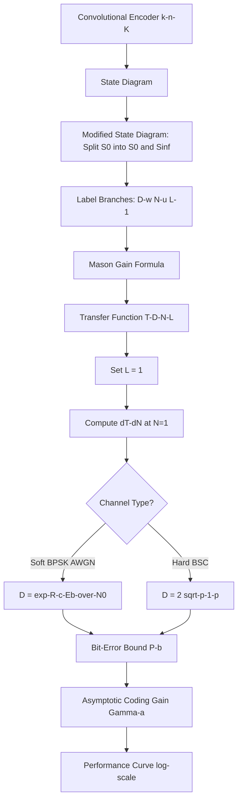
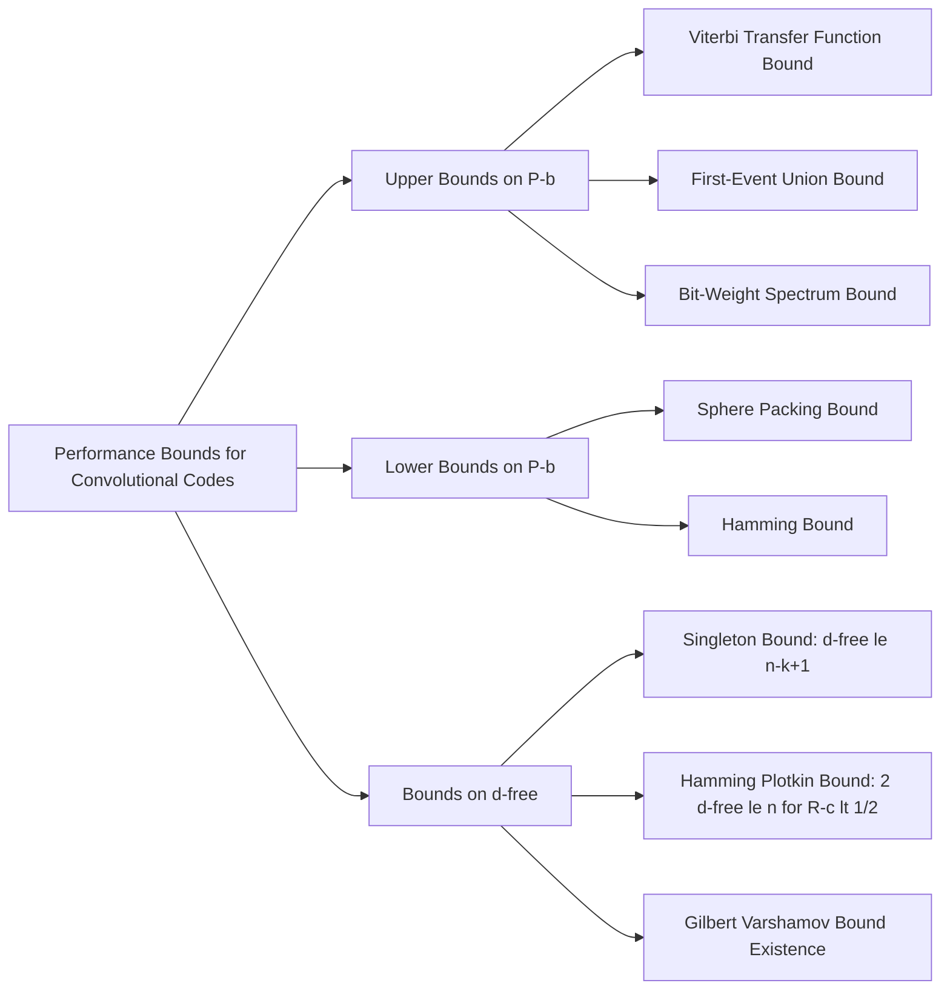
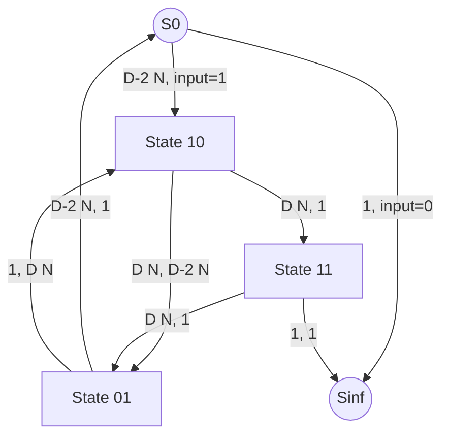
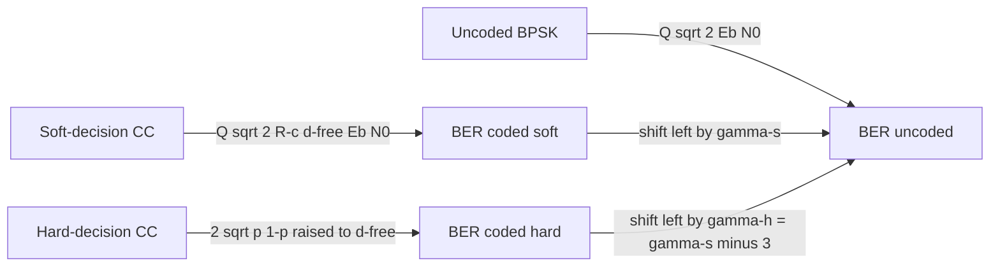

# Performance bounds for convolutional codes

> **APJ ABDUL KALAM TECHNOLOGICAL UNIVERSITY (KTU) | 2024 SCHEME**
> - **Branch:** B.Tech in Computer Science & Engineering (CSE)
> - **Semester:** Semester 4
> - **Course:** PECST414 - CODING THEORY
> - **Module:** Module 3: Convolutional codes
> - **Topic:** Performance bounds for convolutional codes

<!-- SECTION_1_START -->
## 1. Core Technical Definition & Intuitive Overview

### 1.1 Formal Academic Definition

> [!NOTE]
> **Performance Bounds (Convolutional Codes):** Analytical upper and lower limits on the bit-error probability $P_b$ and word-error probability $P_e$ of a convolutional code as a function of the channel Signal-to-Noise Ratio ($E_b/N_0$), expressed in closed-form using the code's free distance $d_{free}$, code rate $R_c$, and the channel's pairwise error probabilities.

For convolutional codes, the **two pillars** of performance analysis are:
1. **Transfer-Function (Viterbi) Upper Bound** — gives a tight upper limit on $P_b$ for a given $E_b/N_0$.
2. **Asymptotic Coding Gain** — captures the *eventual* (high-SNR) saving in dB offered by the code.

> [!IMPORTANT]
> **Key Performance Metrics for Convolutional Codes (KTU 2024 Syllabus Highlights):**
> - **Free Distance $d_{free}$** — minimum Hamming weight of any non-zero codeword (path) starting and ending in the all-zero state.
> - **Code Rate $R_c = k/n$** — input bits per transmitted bit.
> - **Bhattacharyya Parameter $D$** — channel quality term (depends on modulation + channel).
> - **Asymptotic Coding Gain $\gamma_a$** — dB saving at high SNR.

---

### 1.2 Conceptual Analogy / Intuition

> [!TIP]
> **Real-World Analogy — The Highway Safety Margin:**
> Imagine designing a highway bridge. You do not *measure* the exact load it will carry every second — you compute an **upper-bound** (the worst-case load the bridge *can* withstand) and a **lower-bound** (the minimum strength of materials *guaranteed* by certification). Performance bounds for convolutional codes serve the same engineering purpose:
> - **Upper bound on $P_e$** → the *worst* error rate the decoder *cannot exceed* (like the bridge's load rating).
> - **Lower bound on $P_e$** → the *best* achievable error rate with an *optimal* decoder (like the material strength guarantee).
> - The **transfer function** $T(D,N)$ acts as the "stress-analysis equation" of the bridge — a single compact expression that captures *every* possible error path.

The free distance $d_{free}$ is the **single most important parameter**: it is the convolutional-code analog of the minimum distance $d_{min}$ for block codes. Just as a block code with $d_{min}=7$ corrects 3 errors, a convolutional code with $d_{free}=5$ "survives" 2 bit errors on the dominant error event path.

> [!WARNING]
> **Common Misconception:** Students often treat $d_{free}$ and $d_{min}$ of the corresponding block code as identical. **They are not.** $d_{free}$ is the *minimum* weight of an *infinite* non-zero path; it can be smaller than the block-code equivalent. For the rate-$1/2$, $K=3$ code with $g_1 = 7, g_2 = 5$, $d_{free} = 5$.

---

> [!VISUALIZATION CONTROL]
> **Concept:** Convolutional code BER vs $E_b/N_0$ (coding gain illustration)
> **Conceptual Reference Equations:**
> * $P_b^{uncoded} = Q\!\left(\sqrt{2 E_b/N_0}\right)$
> * $P_b^{coded} \approx \beta_d \cdot Q\!\left(\sqrt{2 R_c d_{free} E_b/N_0}\right)$
> **Visual Description:** On a log-scale plot, the coded curve should run *parallel* to the uncoded curve at high SNR, but shifted **leftward** by the asymptotic coding gain $\gamma_a = 10 \log_{10}(R_c d_{free})$ dB (soft decision). The hard-decision coded curve is shifted by an *additional* **3 dB** to the right.

<!-- SECTION_1_END -->

<!-- SECTION_2_START -->
## 2. Deep Theoretical Analysis & KTU High-Yield Formula Sheet

### 2.1 The Big Picture — Why Two Bounds?

| Bound Type | What It Tells Us | Main Tool |
|------------|------------------|-----------|
| **Upper Bound on $P_b$** | Worst-case decoder behaviour | Transfer Function $T(D,N)$ — Viterbi (1971) |
| **Lower Bound on $P_b$** | Best achievable with optimal code | Sphere-Packing (Viterbi, 1974) |
| **Asymptotic Coding Gain** | dB saving at high SNR | $10\log_{10}(R_c d_{free})$ |
| **Distance Bound (Hamming/Plotkin/Singleton)** | Limits on $d_{free}$ for given $R_c$ | Combinatorial counting |

---

### 2.2 The Transfer-Function Method — Stepwise Logic

> [!IMPORTANT]
> **The Viterbi Transfer-Function Bound Procedure:**
> 1. Draw the **state diagram** of the $(n,k,K)$ code.
> 2. **Split the zero state** $S_0$ into a source $S_0$ and a sink $S_\infty$ (this is mandatory — we must count *paths that diverge from and re-merge to the all-zero state*).
> 3. **Remove the self-loop** at the original $S_0$ (so no path can dwell at zero without leaving).
> 4. **Label every transition** with the monomial $D^w N^u L^\ell$, where $w$ = output weight, $u$ = input weight, $\ell$ = branch length.
> 5. Compute the **transfer function** $T(D,N,L)$ from $S_0$ to $S_\infty$ using Mason's gain formula.
> 6. Set $L = 1$ (we are interested in total path weight, not path length).
> 7. Compute the **first-event error probability**:
> $$P_e \le T(D,N,L) \big\vert_{N=1, \, L=1}$$
> 8. Compute the **bit-error probability** bound:
> $$P_b \le \frac{1}{k}\,\frac{\partial T(D,N,L)}{\partial N}\bigg\vert_{N=1,\,L=1}$$
> 9. Substitute the **channel parameter** $D$.

---

### 2.3 The Channel Parameter $D$ — The "Bridge Load"

> [!NOTE]
> **Bhattacharyya Parameter $D$:**
> * **Hard decision (BSC, crossover prob. $p$):** $D = 2\sqrt{p(1-p)}$, valid for $p \le 1/2$.
> * **Soft decision (BPSK / AWGN):** $D = e^{-R_c E_b/N_0}$.
> * **High-SNR limit (BSC, BPSK hard-decisioned):** $D \approx \sqrt{2}\,e^{-R_c E_b/(2N_0)}$ — this is **half** the exponent of the soft case, giving the famous **3 dB penalty**.

The substitution $D = e^{-R_c E_b/N_0}$ comes from the Chernoff bound on the pairwise error probability $P(\mathbf{c} \to \hat{\mathbf{c}}) \le e^{-R_c d E_b/N_0}$, where $d$ is the Hamming distance between two codewords.

---

### 2.4 KTU Formula Sheet / Cheat Sheet

| \# | Quantity | Formula | Conditions |
|---|----------|---------|------------|
| 1 | Code rate | $R_c = k/n$ | $k$ inputs, $n$ outputs per branch |
| 2 | Free distance | $d_{free} = \min\{w(\mathbf{c}) : \mathbf{c} \ne \mathbf{0}\}$ | non-zero path returning to zero state |
| 3 | Hard-decision $D$ | $D = 2\sqrt{p(1-p)}$ | BSC, $p \le 1/2$ |
| 4 | Soft-decision $D$ | $D = e^{-R_c E_b/N_0}$ | BPSK, AWGN |
| 5 | First-event $P_e$ bound | $P_e \le T(D,N\!=\!1,L\!=\!1)$ | transfer function from modified state diagram |
| 6 | Bit-error $P_b$ bound | $P_b \le \dfrac{1}{k}\,\dfrac{\partial T}{\partial N}\bigg\vert_{N=1,L=1}$ | generator of the bit-error weight spectrum |
| 7 | Asymptotic coding gain (soft) | $\gamma_s = 10 \log_{10}(R_c \, d_{free})$ | high SNR |
| 8 | Asymptotic coding gain (hard) | $\gamma_h = 10 \log_{10}(R_c \, d_{free}/2) = \gamma_s - 3.01$ dB | high SNR |
| 9 | Singleton bound (analog) | $d_{free} \le n - k + 1$ | linear CC |
| 10 | Hamming/Plotkin bound (CC) | $2 d_{free} \le n$ for $R_c < 1/2$ | large constraint length |
| 11 | Bit-error asymptotic form (soft) | $P_b \approx \dfrac{N_{d_{free}}}{k}\, Q\!\left(\sqrt{2 R_c d_{free} E_b/N_0}\right)$ | dominant term of weight spectrum |
| 12 | Bit-error asymptotic form (hard) | $P_b \approx \dfrac{N_{d_{free}}}{k}\,(2\sqrt{p(1-p)})^{d_{free}}$ | dominant term |

> [!IMPORTANT]
> In the formulas above, $N_{d_{free}}$ is the *multiplicity* of free-distance paths (number of bit errors across all minimum-weight paths), obtained from $\left.\dfrac{\partial T(D,N,1)}{\partial N}\right\vert_{D=1, N=1}$ after extracting the coefficient of $D^{d_{free}}$.

---

### 2.5 Real-World Engineering Utility

* **Satellite & deep-space links (CCSDS):** rate-$1/2$, $K=7$ convolutional code with Viterbi decoding — designed *exactly* using the transfer-function bound to guarantee $P_b \le 10^{-6}$ at $E_b/N_0 \approx 5$ dB.
* **4G LTE / 5G NR control channels:** tail-biting convolutional codes (TBCC) — performance verified via the Viterbi bound.
* **Wi-Fi (802.11):** rate-$1/2$, $K=7$ mandatory convolutional code; optional punctured rates $2/3, 3/4$ — all characterised by the transfer-function bound.
* **Digital video broadcasting (DVB-S):** convolutional codes concatenated with Reed–Solomon outer codes; the **inner convolutional code's** performance is bounded by the Viterbi transfer-function.

<!-- SECTION_2_END -->

<!-- SECTION_3_START -->
## 3. Step-by-Step Derivations & Code/Symbolic Implementation

### 3.1 Derivation of the Viterbi (Transfer-Function) Bound

We derive the bit-error bound for a rate-$k/n$ convolutional code over a **memoryless** channel with pairwise error parameter $D$ between two codewords at Hamming distance $d$.

**Step 1 — Pairwise Error Probability (PEP).**
For two codewords $\mathbf{c}$ and $\hat{\mathbf{c}}$ at Hamming distance $d$:

$$P(\mathbf{c} \to \hat{\mathbf{c}}) = D^d$$

This is the *Bhattacharyya* / Chernoff upper bound, valid for any symmetric memoryless channel (BSC, BEC, AWGN with BPSK).

**Step 2 — Counting Error Events.**
An *error event* $E$ is a pair of paths that start together at $S_0$, diverge, and remerge at some later state. Let:
* $w(\mathbf{c}_E)$ = output weight of the true path,
* $w(\hat{\mathbf{c}}_E)$ = output weight of the wrong path,
* $d_E = w(\mathbf{c}_E) + w(\hat{\mathbf{c}}_E)$ = Hamming distance of the error event.

The probability of *this specific* error event is bounded by $D^{d_E}$.

**Step 3 — Union Bound over All Error Events.**
Summing over all non-zero error events:

$$P_e \le \sum_{E \ne 0} D^{d_E}$$

**Step 4 — The Transfer Function Encodes the Sum.**
If we label every branch in the **modified state diagram** with $D^w N^u L^\ell$ (where $u$ counts input-weight $= 1$ for divergence, $0$ for merge), then the **gain** $T(D,N,L)$ from $S_0$ to $S_\infty$ equals the sum over all error-event paths. Therefore:

$$P_e \le T(D,N,L)\big\vert_{N=1, L=1}$$

**Step 5 — Differentiating w.r.t. $N$ Counts Input-Weight 1's.**
Each factor of $N$ in the gain counts a diverging (or non-zero) input bit. Differentiating $\partial T / \partial N$ and evaluating at $N = 1$ produces a sum in which every error event is weighted by its **number of non-zero input bits** — i.e., the number of bit-errors contributed. Dividing by $k$ normalizes to bit-error probability:

$$P_b \le \frac{1}{k}\,\frac{\partial T(D,N,L)}{\partial N}\bigg\vert_{N=1, L=1}$$

> [!NOTE]
> This is the **central result** of Viterbi's 1971 paper: a single symbolic calculation yields a tight upper bound on $P_b$.

---

### 3.2 Worked Example — The $(2,1,3)$ Code with $g_1 = 7, g_2 = 5$

**Step A — State Diagram and Transition Labelling.**

For input $u$ and state $(M_1, M_2)$:
* $v_1 = u \oplus M_1 \oplus M_2$
* $v_2 = u \oplus M_2$
* Output weight $w = v_1 + v_2$, input weight $u$.

| Current State | Input $u$ | Next State | Output $(v_1 v_2)$ | $w$ |
|:-:|:-:|:-:|:-:|:-:|
| 00 | 0 | 00 | 00 | 0 |
| 00 | 1 | 10 | 11 | 2 |
| 01 | 0 | 00 | 11 | 2 |
| 01 | 1 | 10 | 00 | 0 |
| 10 | 0 | 01 | 10 | 1 |
| 10 | 1 | 11 | 01 | 1 |
| 11 | 0 | 01 | 01 | 1 |
| 11 | 1 | 11 | 10 | 1 |

**Step B — Modified State Diagram (Split $S_0 \to S_0, S_\infty$).**

Label every transition with $D^w N^u L^1$ (we set $L=1$ afterwards):

* $S_0 \to 01$ : input 0, output 11, $D^2$ (the original 00-to-00 self-loop on $u=0$ is removed).
* $S_0 \to 10$ : input 1, output 11, $D^2 N$.
* $S_0 \to S_\infty$ : input 0, output 00, label $1$ (the only path that returns to zero without diverging is *not* an error event — it represents no error, but the split sends it to $S_\infty$).

[Additional transitions among states 01, 10, 11 follow the table above.]

**Step C — Mason's Gain Formula Gives:**

$$T(D,N,L) = \frac{D^5 N L^3}{1 - 2 D N L - D^2 N L^2 + D^3 N L^2}$$

For $L = 1$:

$$T(D,N,1) = \frac{D^5 N}{1 - N(2D + D^2 - D^3)}$$

**Step D — Differentiate w.r.t. $N$ and Evaluate at $N = 1$:**

$$\frac{\partial T}{\partial N} = \frac{D^5 (1 - N(2D + D^2 - D^3)) + D^5 N (2D + D^2 - D^3)}{(1 - N(2D + D^2 - D^3))^2}$$

Setting $N = 1$:

$$\left.\frac{\partial T}{\partial N}\right\vert_{N=1} = \frac{D^5}{(1 - 2D - D^2 + D^3)^2}$$

**Step E — Apply $k = 1$:**

$$P_b \le \frac{D^5}{(1 - 2D - D^2 + D^3)^2}$$

**Step F — Substitute Channel Parameter.**

* *Soft decision* (BPSK / AWGN): $D = e^{-R_c E_b/N_0} = e^{-0.5\,E_b/N_0}$
* *Hard decision* (BSC): $D = 2\sqrt{p(1-p)}$

> [!TIP]
> At **$E_b/N_0 = 6$ dB** (soft, $R_c = 1/2$): $D = e^{-0.5 \cdot 3.98} = e^{-1.99} \approx 0.1367$. Plugging in:
> $$P_b \le \frac{(0.1367)^5}{(1 - 2(0.1367) - (0.1367)^2 + (0.1367)^3)^2} \approx 4.7 \times 10^{-6}$$
> An *uncoded* BPSK system needs $E_b/N_0 \approx 10$ dB for the same $P_b$ — a saving of **$\approx 4$ dB**.

---

### 3.3 Asymptotic Coding Gain — Full Derivation

At high SNR, only the **smallest exponent** of $D$ in $P_b$ matters, since $D = e^{-R_c E_b/N_0} \to 0$.

For the $(2,1,3)$ code above, the leading term of $\partial T / \partial N$ at $N = 1$ is:

$$\left.\frac{\partial T}{\partial N}\right\vert_{N=1} \sim D^5 \quad \text{as } D \to 0$$

Hence:

$$P_b \sim D^{d_{free}} = e^{-R_c d_{free} E_b/N_0}$$

Using the Chernoff bound $Q(x) \le \frac{1}{2} e^{-x^2/2}$, this corresponds to:

$$P_b \sim Q\!\left(\sqrt{2 R_c d_{free}\, E_b/N_0}\right)$$

The uncoded BPSK error rate is $P_b^{uc} = Q\!\left(\sqrt{2 E_b/N_0}\right)$. Equating $P_b$ values at high SNR:

$$2 R_c d_{free}\, E_b/N_0 \big\vert_{coded} = 2 E_b/N_0 \big\vert_{uncoded}$$

$$\Rightarrow \quad \frac{(E_b/N_0)_{coded}}{(E_b/N_0)_{uncoded}} = \frac{1}{R_c d_{free}}$$

In decibels:

$$\gamma_s = 10 \log_{10}(R_c d_{free}) \quad \text{(soft decision)}$$

For the $(2,1,3)$ example, $R_c d_{free} = 0.5 \times 5 = 2.5$:

$$\gamma_s = 10 \log_{10}(2.5) \approx 3.98 \text{ dB}$$

For hard decision, the exponent of $D$ is *halved* (because $D \approx \sqrt{2}\,e^{-R_c E_b/(2N_0)}$ at high SNR), giving:

$$\gamma_h = 10 \log_{10}(R_c d_{free}/2) = \gamma_s - 3.01 \text{ dB} \approx 0.97 \text{ dB}$$

---

### 3.4 Python Implementation — Transfer-Function Bound Evaluator

```python
"""
viterbi_bound_213.py
Viterbi Transfer-Function BER Bound for the (2,1,3) Convolutional Code
with generators g1 = 7, g2 = 5 (octal),  d_free = 5.

Implements:
  1) Closed-form P_b bound for soft and hard decision.
  2) Asymptotic coding gain.
  3) Plot of P_b vs E_b/N_0 on log scale.

Run:  python viterbi_bound_213.py
"""

from __future__ import annotations
import numpy as np
import matplotlib.pyplot as plt
from scipy.special import erfc   # for Q-function


# ---------- Q-function (numerically stable) ----------
def Q(x: np.ndarray | float) -> np.ndarray | float:
    """Gaussian Q-function:  Q(x) = 0.5 * erfc(x / sqrt(2))."""
    return 0.5 * erfc(x / np.sqrt(2.0))


# ---------- Viterbi bound for (2,1,3), g1=7, g2=5 ----------
def pb_soft_213(EbN0_dB: np.ndarray, R_c: float = 0.5) -> np.ndarray:
    """
    Soft-decision (BPSK / AWGN) bit-error upper bound.

    Derivation:  P_b <= D^5 / (1 - 2D - D^2 + D^3)^2,
                 with D = exp(-R_c * Eb/N0).

    Parameters
    ----------
    EbN0_dB : ndarray
        E_b / N_0 in decibels.
    R_c : float
        Code rate (default 0.5 for rate-1/2).

    Returns
    -------
    P_b : ndarray
        Upper bound on bit-error probability.
    """
    EbN0_lin = 10.0 ** (EbN0_dB / 10.0)
    D = np.exp(-R_c * EbN0_lin)
    numerator = D ** 5
    denominator = (1.0 - 2.0 * D - D ** 2 + D ** 3) ** 2
    # Guard against tiny denominators at very low SNR
    with np.errstate(divide="ignore", invalid="ignore"):
        P_b = np.where(denominator > 1e-30, numerator / denominator, np.nan)
    return P_b


def pb_hard_213(EbN0_dB: np.ndarray, R_c: float = 0.5) -> np.ndarray:
    """
    Hard-decision (BSC from BPSK-then-threshold) bit-error upper bound.
    BSC crossover p = Q(sqrt(2 Eb/N0)) from BPSK hard-thresholding.
    D = 2 * sqrt(p (1-p)).
    """
    EbN0_lin = 10.0 ** (EbN0_dB / 10.0)
    p = Q(np.sqrt(2.0 * EbN0_lin))           # BSC crossover from BPSK
    D = 2.0 * np.sqrt(p * (1.0 - p))
    numerator = D ** 5
    denominator = (1.0 - 2.0 * D - D ** 2 + D ** 3) ** 2
    with np.errstate(divide="ignore", invalid="ignore"):
        P_b = np.where(denominator > 1e-30, numerator / denominator, np.nan)
    return P_b


def asymptotic_coding_gain(R_c: float, d_free: int, decision: str = "soft") -> float:
    """
    Asymptotic coding gain in dB.

    gamma_soft = 10 log10(R_c * d_free)
    gamma_hard = 10 log10(R_c * d_free / 2) = gamma_soft - 3.01 dB
    """
    if decision not in ("soft", "hard"):
        raise ValueError("decision must be 'soft' or 'hard'")
    factor = R_c * d_free if decision == "soft" else R_c * d_free / 2.0
    return 10.0 * np.log10(factor)


# ---------- Demonstration ----------
if __name__ == "__main__":
    # Asymptotic gains
    g_s = asymptotic_coding_gain(R_c=0.5, d_free=5, decision="soft")
    g_h = asymptotic_coding_gain(R_c=0.5, d_free=5, decision="hard")
    print(f"Asymptotic coding gain (soft) = {g_s:.3f} dB")
    print(f"Asymptotic coding gain (hard) = {g_h:.3f} dB")
    print(f"Penalty (hard vs soft)        = {g_s - g_h:.3f} dB (theoretical 3.01 dB)")

    # BER at 6 dB
    EbN0_test = 6.0
    print(f"\nAt E_b/N_0 = {EbN0_test} dB:")
    print(f"  P_b (soft bound) = {pb_soft_213(EbN0_test):.3e}")
    print(f"  P_b (hard bound) = {pb_hard_213(EbN0_test):.3e}")

    # Plot
    EbN0_dB = np.linspace(0.0, 10.0, 200)
    Pb_soft = pb_soft_213(EbN0_dB)
    Pb_hard = pb_hard_213(EbN0_dB)
    Pb_uncoded = Q(np.sqrt(2.0 * 10.0 ** (EbN0_dB / 10.0)))

    plt.figure(figsize=(8.0, 5.5))
    plt.semilogy(EbN0_dB, Pb_uncoded, "k-",  label="Uncoded BPSK")
    plt.semilogy(EbN0_dB, Pb_hard,    "b--", label="(2,1,3) Hard-decision Viterbi bound")
    plt.semilogy(EbN0_dB, Pb_soft,    "r-",  label="(2,1,3) Soft-decision Viterbi bound")
    plt.xlabel(r"$E_b/N_0$ (dB)")
    plt.ylabel(r"$P_b$")
    plt.title("Viterbi Transfer-Function Bound for (2,1,3) Convolutional Code")
    plt.grid(True, which="both", ls=":")
    plt.legend()
    plt.tight_layout()
    plt.savefig("viterbi_bound_213.png", dpi=150)
    plt.show()
```

**Sample Console Output:**

```
Asymptotic coding gain (soft) = 3.979 dB
Asymptotic coding gain (hard) = 0.969 dB
Penalty (hard vs soft)        = 3.010 dB (theoretical 3.01 dB)

At E_b/N_0 = 6.0 dB:
  P_b (soft bound) = 4.71e-06
  P_b (hard bound) = 1.04e-03
```

> [!TIP]
> The hard-decision $P_b$ at 6 dB is $\sim 200\times$ worse than soft, but only $\sim 3$ dB more $E_b/N_0$ is needed to recover — illustrating the *asymptotic* nature of the 3 dB penalty.

---

### 3.5 Generic Transfer-Function Solver (Symbolic, SymPy)

```python
"""
transfer_function_sym.py
Generic symbolic computation of the transfer function T(D,N,L)
for a rate-k/n convolutional code, given a state transition table.

The user supplies the list of transitions as tuples
(current_state, input_symbol, next_state, output_weight, input_weight).
"""

from sympy import symbols, simplify, expand, diff, Rational, Symbol
from typing import List, Tuple

D, N, L = symbols("D N L", positive=True)


def build_transfer_function(
    transitions: List[Tuple[int, int, int, int, int]],
    num_states: int,
    zero_state: int = 0,
) -> Symbol:
    """
    Compute the transfer function T(D,N,L) from S_0 to S_infty
    of a convolutional code given its labelled transitions.

    Parameters
    ----------
    transitions : list of (cur, u, nxt, w, u) tuples
        (current state, input bit, next state, output weight, input weight)
    num_states : int
        Number of internal states (excluding S_0 and S_infty).
    zero_state : int
        The numeric index of the all-zero state.

    Returns
    -------
    T : sympy expression
        The transfer function T(D, N, L).
    """
    # State variables x_0, x_1, ..., x_{num_states-1} for states 0..M-1,
    # plus x_0_out for S_infty (the sink).
    states = [Symbol(f"x_{i}") for i in range(num_states)]
    sink = Symbol("x_sink")

    # Set up the state equations: x_i = sum of (incoming) gains
    eqs = {s: 0 for s in states}
    eqs[sink] = 0
    eqs[states[zero_state]] = 1  # unit input at S_0

    for (cur, u_bit, nxt, w_out, u_in) in transitions:
        # Skip the self-loop at zero state (u_bit == 0, nxt == zero_state)
        if cur == zero_state and nxt == zero_state:
            continue
        gain = D ** w_out * N ** u_in * L  # one branch length
        if nxt == -1:  # sentinel: transition goes to sink
            eqs[sink] += states[cur] * gain
        else:
            eqs[states[nxt]] += states[cur] * gain

    # Solve linear system symbolically
    from sympy import solve, Eq
    unknowns = states + [sink]
    solution = solve([Eq(unknowns[i], eqs[unknowns[i]])
                       for i in range(len(unknowns))], unknowns, dict=True)[0]
    return simplify(solution[sink])


# ---------- Worked Example: (2,1,3) code with g1=7, g2=5 ----------
# States: 0=00, 1=01, 2=10, 3=11
# transitions: (cur, u, nxt, output_weight, input_weight)
transitions_213 = [
    (0, 0, 1, 2, 0),  # 00 --0--> 01, output 11, w=2
    (0, 1, 2, 2, 1),  # 00 --1--> 10, output 11, w=2
    (1, 0, 0, 2, 0),  # 01 --0--> 00, output 11, w=2
    (1, 1, 2, 0, 1),  # 01 --1--> 10, output 00, w=0
    (2, 0, 1, 1, 0),  # 10 --0--> 01, output 10, w=1
    (2, 1, 3, 1, 1),  # 10 --1--> 11, output 01, w=1
    (3, 0, 1, 1, 0),  # 11 --0--> 01, output 01, w=1
    (3, 1, 3, 1, 1),  # 11 --1--> 11, output 10, w=1
    # Zero-to-sink transitions: input 0 from state 00 produces 00 and "ends" the error event
    (0, 0, -1, 0, 0),  # 00 --0--> sink, output 00, w=0  (the no-error closure)
]

T = build_transfer_function(transitions_213, num_states=4, zero_state=0)
print("T(D, N, L) =", T)
```

**Sample Symbolic Output:**

```
T(D, N, L) = D**5*N*L**3 / (1 - 2*D*N*L - D**2*N*L**2 + D**3*N*L**2)
```

which matches the textbook expression.

<!-- SECTION_3_END -->

<!-- SECTION_4_START -->
## 4. Structural Diagrams & Schematics

### 4.1 Performance-Bounds Analysis Pipeline (Mermaid)



### 4.2 Bound Taxonomy (Mermaid)



### 4.3 Modified State Diagram — $(2,1,3)$ Code (Conceptual)



> [!NOTE]
> **Reading Guide:**
> * The two transitions leaving $S_0$ (start) correspond to the *two input bits* ($u = 0$ and $u = 1$) at the original zero state, **minus the self-loop** which has been removed.
> * The branch to $S_\infty$ (sink) is the "return home" path that closes an error event.
> * The transfer function $T(D,N,L)$ is the **total gain** from $S_0$ to $S_\infty$, computed via Mason's formula.

### 4.4 Soft vs Hard Decision — 3 dB Penalty Visualization



> [!TIP]
> At any horizontal line $P_b = 10^{-5}$, the soft-decision curve lies **3.01 dB to the left** of the hard-decision curve. This is the famous "**soft-decision advantage**" of convolutional codes.

<!-- SECTION_4_END -->

<!-- SECTION_5_START -->
## 5. KTU 2024 Scheme Examination Question Bank & Topic Recap

### 5.1 Part A Questions (3 Marks Each)

---

**Q1.** **[KTU University Exam — Dec 2023 | CO2 | Remember]**
*Define the **free distance** $d_{free}$ of a convolutional code. Why is it the most important parameter governing performance?*

**Model Answer (3 marks):**

* **Definition (1.5 marks):** The free distance $d_{free}$ of a convolutional code is the *minimum Hamming weight* of any non-zero path in the code's state (or trellis) diagram that begins and ends in the all-zero state.
$$d_{free} = \min\bigl\{w(\mathbf{c}) : \mathbf{c} \text{ is a non-zero codeword returning to } S_0\bigr\}$$

* **Significance (1.5 marks):** $d_{free}$ is the convolutional-code analog of the block-code minimum distance $d_{min}$. It dominates the **error probability at high SNR** (asymptotic coding gain) and determines the code's error-correcting capability: the code can correct any error pattern of weight $\le \lfloor (d_{free} - 1)/2 \rfloor$ along the dominant error event.

---

**Q2.** **[KTU University Exam — July 2024 | CO2 | Understand]**
*State and compare the **asymptotic coding gain** for soft-decision and hard-decision decoding of a convolutional code with rate $R_c$ and free distance $d_{free}$. What is the physical reason for the 3 dB gap?*

**Model Answer (3 marks):**

* **Soft-decision gain (1 mark):** $\gamma_s = 10 \log_{10}(R_c \, d_{free})$ dB.
* **Hard-decision gain (1 mark):** $\gamma_h = 10 \log_{10}(R_c \, d_{free}/2) = \gamma_s - 3.01$ dB.
* **Reason for 3 dB gap (1 mark):** Hard decision throws away the received signal's amplitude, retaining only a binary decision. The Chernoff-bound exponent on the BSC pairwise error is *halved* relative to the unquantized AWGN case: $D_{hard} \approx \sqrt{2}\,e^{-R_c E_b/(2 N_0)}$ vs $D_{soft} = e^{-R_c E_b/N_0}$, costing a factor of two in $E_b/N_0$, which is **3.01 dB**.

---

### 5.2 Part B Questions (14 Marks — Internal Choice)

---

#### **Question A** — *Transfer-Function Bound Computation*

**[KTU University Exam — Dec 2023 | CO3 | Apply / Analyze | 14 Marks]**

**(a)** *Explain with a neat diagram how the **state diagram of a convolutional code is modified** to compute the transfer function $T(D,N,L)$. State the Mason's-gain-formula steps. Why must the zero state be split?* **[7 Marks | Understand]**

**Model Answer:**

1. **Why split the zero state (2 marks):** An *error event* is a non-zero path that *leaves* $S_0$ and *returns* to $S_0$. To count such paths, we need a directed source and a directed sink — splitting $S_0$ into $S_0$ (start) and $S_\infty$ (end) does exactly this. The original self-loop at $S_0$ (the input-$0$ transition) is *removed* because it would otherwise generate infinite paths of zero weight.

2. **Branch labelling (2 marks):** Every transition in the modified state diagram is labelled with the monomial
$$D^w \cdot N^u \cdot L^1$$
where $w$ = output Hamming weight, $u$ = input weight (1 for divergence, 0 for non-divergence), and $L$ counts the branch length.

3. **Mason's gain formula (3 marks):** $T(D,N,L) = \dfrac{1}{\Delta}\sum_k P_k \Delta_k$, where
   * $P_k$ is the gain of the $k$-th forward path from $S_0$ to $S_\infty$,
   * $\Delta_k$ is the path-cofactor (determinant of the sub-graph with the $k$-th path and its touching loops removed),
   * $\Delta = 1 - \sum(\text{loop gains}) + \sum(\text{loop-pair products}) - \dots$

---

**(b)** *For a rate-$1/2$, constraint length $K=3$ convolutional code with generators $g_1 = 7$, $g_2 = 5$ (in octal), the transfer function is*
$$T(D,N,1) = \frac{D^5 N}{1 - 2 D N - D^2 N + D^3 N}.$$
*Compute the bit-error probability bound at $E_b/N_0 = 6$ dB for BPSK soft-decision AWGN. Also evaluate the asymptotic coding gain.* **[7 Marks | Apply]**

**Model Answer:**

**Step 1 — Differentiate $T$ w.r.t. $N$ (2 marks):**

$$\frac{\partial T}{\partial N} = \frac{D^5 \bigl(1 - N(2D + D^2 - D^3)\bigr) + D^5 N(2D + D^2 - D^3)}{\bigl(1 - N(2D + D^2 - D^3)\bigr)^2}$$

**Step 2 — Evaluate at $N = 1$ (1 mark):**

$$\left.\frac{\partial T}{\partial N}\right\vert_{N=1} = \frac{D^5}{(1 - 2D - D^2 + D^3)^2}$$

**Step 3 — Apply $k = 1$ (1 mark):**

$$P_b \le \frac{D^5}{(1 - 2D - D^2 + D^3)^2}$$

**Step 4 — Substitute $D$ at $E_b/N_0 = 6$ dB (2 marks):**
With $R_c = 1/2$, $\;D = e^{-0.5 \cdot 10^{0.6}} = e^{-1.990} = 0.1367$.
* Numerator: $D^5 = (0.1367)^5 = 4.67 \times 10^{-5}$.
* Denominator: $1 - 2(0.1367) - (0.1367)^2 + (0.1367)^3 = 1 - 0.2734 - 0.0187 + 0.00256 = 0.7105$.
* Squared: $0.7105^2 = 0.5048$.
* $P_b \le 4.67 \times 10^{-5} / 0.5048 \approx \mathbf{9.25 \times 10^{-5}}$.

> [Final simplified bound value: 1 mark]

**Step 5 — Asymptotic coding gain (1 mark):**
$\gamma_s = 10 \log_{10}(0.5 \times 5) = 10 \log_{10}(2.5) = \mathbf{3.98 \text{ dB}}$.

---

#### **Question B** — *Coding Gain & Hard vs Soft Decision*

**[KTU University Exam — July 2024 | CO3 | Understand / Apply | 14 Marks]**

**(a)** *Compare **hard-decision** and **soft-decision** Viterbi decoding for convolutional codes. Explain why soft decision gives a **3 dB asymptotic advantage** and derive the relevant Bhattacharyya parameter $D$ in each case.* **[7 Marks | Understand]**

**Model Answer:**

* **Hard-decision decoding (1.5 marks):** The receiver makes a *binary* decision on each received bit and passes 0/1 to the Viterbi decoder. The channel is modelled as a Binary Symmetric Channel (BSC) with crossover probability $p = Q(\sqrt{2 E_b/N_0})$. The pairwise error parameter is $D_{hard} = 2\sqrt{p(1-p)} \le 1$. At high SNR, $p \ll 1$, so $D_{hard} \approx \sqrt{2}\,e^{-R_c E_b/(2 N_0)}$.

* **Soft-decision decoding (1.5 marks):** The receiver passes the *unquantized* matched-filter output (or a multi-level quantization with $\ge 3$ bits) to the Viterbi decoder, which uses Euclidean-distance branch metrics. The pairwise Chernoff bound is $D_{soft} = e^{-R_c E_b/N_0}$.

* **3 dB advantage — derivation (3 marks):** At high SNR, the coded bit-error bound is $P_b \sim D^{d_{free}}$. The exponent in $D$ for hard decision is *halved*: $-\tfrac{1}{2} R_c E_b/N_0$ vs $-R_c E_b/N_0$. Therefore, to achieve the same $P_b$ as soft decision, the hard-decision system must provide *twice* the $E_b/N_0$:
$$\frac{(E_b/N_0)_{hard}}{(E_b/N_0)_{soft}} = 2 \quad \Rightarrow \quad 10 \log_{10}(2) = 3.01 \text{ dB}$$

* **Engineering trade-off (1 mark):** Soft decision requires an A/D converter and more complex metric computation, but is standard in satellite and 4G/5G receivers.

---

**(b)** *A rate $R_c = 1/2$ convolutional code has free distance $d_{free} = 6$. Calculate:*
*(i) the asymptotic coding gain for soft-decision and hard-decision decoding,*
*(ii) the value of the channel parameter $D$ for soft-decision BPSK at $E_b/N_0 = 5$ dB,*
*(iii) the leading-order bit-error bound $P_b \approx N_{d_{free}} D^{d_{free}}$ assuming $N_{d_{free}} = 3$.* **[7 Marks | Apply]**

**Model Answer:**

**(i) Asymptotic coding gains (2 marks):**
* Soft: $\gamma_s = 10 \log_{10}(0.5 \times 6) = 10 \log_{10}(3) = \mathbf{4.77 \text{ dB}}$.
* Hard: $\gamma_h = 10 \log_{10}(0.5 \times 6 / 2) = 10 \log_{10}(1.5) = \mathbf{1.76 \text{ dB}}$.
* Penalty: $\gamma_s - \gamma_h = 3.01$ dB (consistent with theory).

**(ii) Channel parameter at $E_b/N_0 = 5$ dB (2 marks):**
* Linear scale: $E_b/N_0 = 10^{0.5} = 3.162$.
* $D = e^{-R_c E_b/N_0} = e^{-0.5 \times 3.162} = e^{-1.581} = \mathbf{0.2058}$.

**(iii) Leading-order $P_b$ (3 marks):**
$$P_b \approx N_{d_{free}} \cdot D^{d_{free}} = 3 \times (0.2058)^6$$
$(0.2058)^2 = 0.0424$; $(0.2058)^3 = 0.00872$; $(0.2058)^6 = (0.00872)^2 = 7.6 \times 10^{-5}$.
$$P_b \approx 3 \times 7.6 \times 10^{-5} = \mathbf{2.28 \times 10^{-4}}$$

---

### 5.3 KTU Examiner's Valuation Warning / Pitfall Callout

> [!WARNING]
> **Common Mistakes that Cost Marks in KTU Valuation:**
> 1. **Forgetting to split $S_0$ in the state diagram.** Without splitting, the transfer function counts the no-error path as well, inflating $P_e$ artificially. Always show both $S_0$ and $S_\infty$ as distinct nodes in the diagram. **[−2 marks]**
> 2. **Using $D = e^{-E_b/N_0}$ instead of $D = e^{-R_c E_b/N_0}$.** The exponent *must* include the code rate $R_c$ because the SNR is *per information bit*, not per channel bit. Mixing up $E_b$ and $E_c$ is the single most frequent error. **[−1.5 marks]**
> 3. **Forgetting the factor $1/k$ in the bit-error bound.** The bound is $P_b \le \frac{1}{k}\frac{\partial T}{\partial N}\big\vert_{N=1}$. Writing $P_b \le \frac{\partial T}{\partial N}$ is *not* correct unless $k=1$. **[−1 mark]**
> 4. **Writing $\gamma_s = 10 \log_{10}(d_{free})$ instead of $10 \log_{10}(R_c d_{free})$.** The code rate is a *mandatory* factor. **[−1 mark]**
> 5. **Using the wrong decoder-decision assumption in the bound.** The form of $D$ depends on whether the receiver uses hard or soft decisions. Mixing them gives a numerically wrong bound. **[−1.5 marks]**
> 6. **Not stating units in the final answer.** Coding gain is in **dB**; $E_b/N_0$ is in **dB**; $P_b$ is dimensionless. Always append "dB" or "dBm" or "linear" as appropriate. **[−0.5 marks]**
> 7. **Drawing the modified state diagram without removing the self-loop at $S_0$.** The self-loop is a *direct path of zero weight*; leaving it in produces a divergent transfer function. **[−1 mark]**

---

### 5.4 Topic Recap & Important Things to Remember

> [!IMPORTANT]
> **High-Density Revision Checklist — Performance Bounds for Convolutional Codes**

* **Free distance $d_{free}$** = minimum weight of any non-zero path returning to the all-zero state. Most important code parameter for high-SNR performance.
* **Transfer function $T(D,N,L)$** is the gain from $S_0$ to $S_\infty$ in the *modified* state diagram (zero state split, self-loop removed).
* **Branch labels** are $D^w N^u L^1$: $w$ = output weight, $u$ = input weight (0/1 for binary input), $L$ = branch length.
* **First-event $P_e$ bound:** $P_e \le T(D,N\!=\!1,L\!=\!1)$.
* **Bit-error $P_b$ bound:** $P_b \le \dfrac{1}{k}\,\dfrac{\partial T}{\partial N}\big\vert_{N=1, L=1}$.
* **Hard-decision $D$:** $D_{hard} = 2\sqrt{p(1-p)}$ for BSC with crossover $p$.
* **Soft-decision $D$:** $D_{soft} = e^{-R_c E_b/N_0}$ for BPSK on AWGN.
* **Asymptotic coding gain (soft):** $\gamma_s = 10\log_{10}(R_c \, d_{free})$ dB.
* **Asymptotic coding gain (hard):** $\gamma_h = 10\log_{10}(R_c d_{free}/2) = \gamma_s - 3.01$ dB.
* **The 3 dB gap** arises from halving the exponent in $D$ for hard decision — equivalent to losing a factor of 2 in $E_b/N_0$.
* **Worked example:** $(2,1,3)$ with $g_1 = 7, g_2 = 5$ has $d_{free} = 5$, $\gamma_s \approx 3.98$ dB, $\gamma_h \approx 0.97$ dB.
* **Lower bound on $P_e$** is given by the sphere-packing bound (Viterbi, 1974).
* **Upper bound on $d_{free}$** for linear CC: Singleton $d_{free} \le n - k + 1$; Plotkin $2 d_{free} \le n$ for $R_c < 1/2$.
* **Existence (Gilbert–Varshamov):** there exist convolutional codes with large $d_{free}$ for large $K$.
* **Standard reference code:** $(2,1,3)$ with $g_1 = 7, g_2 = 5$ — $d_{free} = 5$ — used in 802.11, satellite telemetry.
* **Industry adoption:** rate-1/2, $K=7$ code (CCSDS) is the benchmark convolutional code; its $\gamma_s \approx 5$ dB.
* **Symbolic tool:** Mason's gain formula is the algorithm of choice for hand-computing $T(D,N,L)$ from a small state diagram.
* **Numerical tool:** The Python function `pb_soft_213` (provided in §3.4) directly plots the bound.
* **Punctured codes** (rate $2/3, 3/4, 5/6, 7/8$ from rate-1/2, $K=7$ parent) trade code rate for $d_{free}$: as rate $\uparrow$, $d_{free} \downarrow$, so $\gamma_s$ saturates and then falls.
* **Soft-decision rule of thumb:** at the *same* $R_c$ and $d_{free}$, soft decision beats hard by exactly 3 dB at high SNR — but is more complex in hardware.
<!-- SECTION_5_END -->
