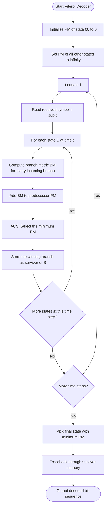
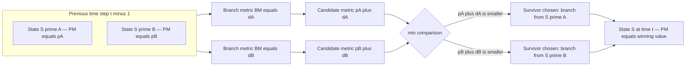
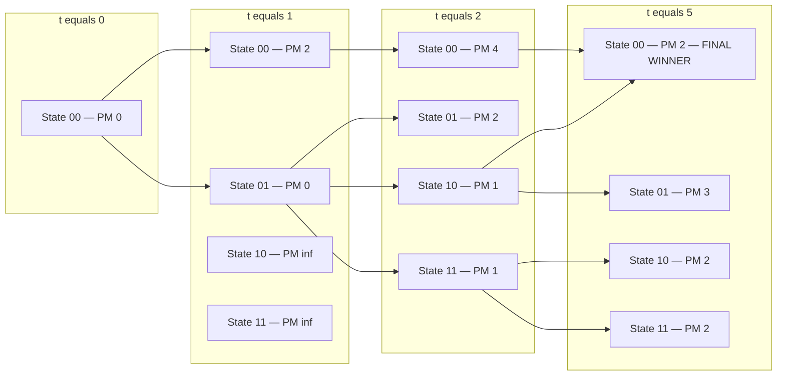

# Viterbi algorithm

> **APJ ABDUL KALAM TECHNOLOGICAL UNIVERSITY (KTU) | 2024 SCHEME**
> - **Branch:** B.Tech in Computer Science & Engineering (CSE)
> - **Semester:** Semester 4
> - **Course:** PECST414 - CODING THEORY
> - **Module:** Module 3: Convolutional codes
> - **Topic:** Viterbi algorithm

<!-- SECTION_1_START -->

# 1. Core Technical Definition & Intuitive Overview

## 1.1 Formal Academic Definition

The **Viterbi Algorithm** is a maximum-likelihood (ML) decoding algorithm for convolutional codes, proposed by Andrew J. Viterbi in **1967**. It operates on the trellis representation of a convolutional code and finds the *single most likely* transmitted code sequence by exploiting the principle of optimality (dynamic programming).

> [!IMPORTANT]
> **Key Formal Statement (KTU 2024 Syllabus Wording)**
> The Viterbi algorithm computes the *maximum-likelihood estimate* of the transmitted information sequence by:
> (i) computing a **branch metric** (BM) for every possible branch in the trellis at each time step,
> (ii) accumulating a **path metric** (PM) for the partial paths reaching each state,
> (iii) discarding all but the *survivor* path with the smallest metric at each state, and
> (iv) performing a final **traceback** through the survivor memory to recover the decoded message.

Mathematically, if $\mathbf{r} = (r_1, r_2, \dots, r_n)$ is the received sequence and $\mathbf{c}^{(j)}$ is the $j$-th possible codeword, the Viterbi algorithm finds:

$$
\hat{\mathbf{c}} = \arg\min_{j} \, d(\mathbf{r}, \mathbf{c}^{(j)})
$$

where $d(\cdot,\cdot)$ is the **Hamming distance** (hard-decision BSC) or the squared **Euclidean distance** (soft-decision AWGN).

## 1.2 Conceptual Analogy / Plain-English Intuition

> [!NOTE]
> **Real-World Analogy: The "Cheapest Road Trip" Problem**
> Imagine you are driving from city A to city D, and the only way to get from A to D is to pass through exactly one of the cities B or C at every intermediate rest-stop. At each rest-stop, you can choose from among the available routes, but you must pay the toll of whichever leg you take. The Viterbi algorithm is equivalent to a smart co-pilot who, at *every* rest-stop, **memorises only the cheapest (best) route reaching that stop**, and **forgets all the more expensive ones**. At the end of the journey, the co-pilot walks backwards through this "memory" and tells you the exact sequence of road choices that minimised your total toll. The "toll" at each step is the *branch metric*, the running "total toll" is the *path metric*, and the kept best-route-so-far is the *survivor path*.

**Why this works:** Dynamic programming guarantees that if a partial path is *not* the cheapest way to reach its state, it can *never* become the cheapest way to reach the final destination — so it is safe to discard it forever. This is the **principle of optimality**.

## 1.3 The Three Decoding Metrics

A KTU 2024 examiner will award full credit only if all three metrics are explicitly defined.

> [!IMPORTANT]
> - **Branch Metric (BM):** The dissimilarity between the received symbol and the expected (transmitted) symbol on a given trellis branch. $BM \in \{0, 1\}$ (hard) or $BM \in \mathbb{R}^{\ge 0}$ (soft).
> - **Path Metric (PM):** The cumulative sum of branch metrics along a partial trellis path, i.e. the total distance from the start state to the current state.
> - **State Metric (SM):** Equivalent to PM, but indexed by destination state. The state metric of state $S$ at time $t$ is the minimum PM among *all* paths that terminate at $S$.

## 1.4 Standard Decoding Assumptions

| Parameter | Standard KTU Convention |
|---|---|
| Channel model | Binary Symmetric Channel (BSC) for hard-decision decoding |
| Metric type | **Hamming distance** as BM (soft-decision uses squared Euclidean distance) |
| Starting state | All-zero state $\mathbf{S_0} = 00$ with $PM(S_0) = 0$ |
| Survivor length | $\delta$ (typically $5 \times K$, where $K$ is the constraint length) |
| Termination | Encoder forced back to $S_0$ by appending $(K-1)$ zero tail bits |

## 1.5 Visualization Note

> [!VISUALIZATION CONTROL]
> **Concept:** Trellis-based state evolution with Viterbi survivor paths
> **Suggested Tool:** Draw the trellis on graph paper — 4 nodes (states 00, 01, 10, 11) per column, with 8 directed edges per step (2 outgoing from each state).
> **Visual Description:** Plot time $t$ on the horizontal axis and the four states on the vertical axis. Solid arrows represent the *survivor* branch entering each state; faded arrows represent the *discarded* competing branch. After the forward pass, draw one continuous bold path from $t = 0$ to $t = n$ — this is the ML path.

<!-- SECTION_1_END -->

<!-- SECTION_2_START -->

# 2. Deep Theoretical Analysis & KTU High-Yield Formula Sheet

## 2.1 Algorithmic Decomposition (Bulleted Logic)

The Viterbi algorithm executes in **two phases**:

### Phase A — Forward Pass (ACS Recursion)
For every time step $t = 1, 2, \dots, n$ and for every state $S$:

1. **Branch-Metric Computation:** For every allowed transition (incoming branch) $(S', S)$ at time $t$, calculate
$$
BM_t(S' \to S) \;=\; d\!\left(\mathbf{r}_t,\; \mathbf{c}_t(S', S)\right)
$$
where $\mathbf{c}_t(S', S)$ is the code-symbol labelling that branch.

2. **Add-Compare-Select (ACS):** Update the path metric of state $S$:
$$
PM_t(S) \;=\; \min_{(S',\,\text{bit})} \Bigl[\, PM_{t-1}(S') \;+\; BM_t(S' \to S) \,\Bigr]
$$
3. **Survivor Storage:** For each state $S$, retain **only one** incoming path (the one realising the minimum) and store its bit label in the survivor memory $\Sigma_t(S)$.

### Phase B — Traceback
1. Identify the final state with the minimum accumulated metric:
$$
\hat{S}_n \;=\; \arg\min_{S} PM_n(S)
$$
   - If the code is *terminated*, then $\hat{S}_n = S_0$ (forced).
2. Iterate backwards for $t = n, n-1, \dots, 1$:
$$
\hat{S}_{t-1} \;=\; \text{pred}\bigl(\hat{S}_t\bigr)
$$
3. The decoded bit at time $t$ is the bit label on the branch $(\hat{S}_{t-1} \to \hat{S}_t)$.

## 2.2 Why the ACS Step is Sound (The Core "How")

> [!NOTE]
> The recursive update is a direct application of **Bellman's Principle of Optimality**: an optimal path from $S_0$ to $S_n$ through intermediate state $S$ must contain an optimal sub-path from $S_0$ to $S$. Any non-optimal sub-path to $S$ cannot be part of an overall optimal path. Hence, discarding all but the minimum-PM path at every state is lossless.

## 2.3 KTU Formula Sheet / Cheat Sheet

| Symbol / Term | Formula / Definition | Units / Domain |
|---|---|---|
| Branch metric (Hamming) | $BM_t = w_H\!\left(\mathbf{r}_t \oplus \mathbf{c}_t\right)$ | $\in \{0, 1, \dots, n\}$ |
| Branch metric (Euclidean) | $BM_t = \sum_{i=1}^{n} (r_{t,i} - c_{t,i})^2$ | $\mathbb{R}^{\ge 0}$ |
| Path-metric recursion | $PM_t(S) = \min_{S'} \left[PM_{t-1}(S') + BM_t(S',S)\right]$ | $\mathbb{R}^{\ge 0} \cup \{\infty\}$ |
| Survivor path | $\Sigma_t(S) = \arg\min_{S'} \left[PM_{t-1}(S') + BM_t(S',S)\right]$ | Index set |
| ML decision | $\hat{\mathbf{c}} = \arg\min_{\mathbf{c} \in \mathcal{C}} d(\mathbf{r}, \mathbf{c})$ | Codeword |
| Survivor-memory depth | $\delta \approx 5K$ (or $5\nu$) | trellis steps |
| Decoder complexity | $\mathcal{O}(2^K \cdot L)$ | per decoded block |
| Free-distance bound | $P_b \le \sum_{d = d_{\text{free}}}^{\infty} a_d \, P_2(d)$ | bit error probability |
| BSC transition cost | $BM = 0$ if match, $BM = 1$ if mismatch | binary |

> [!WARNING]
> In the table above, the notation $w_H(\cdot)$ denotes **Hamming weight** (the number of 1s in a binary vector). Do not confuse it with parity-check matrices $H$ — they are completely different.

## 2.4 Real-World Engineering Utility

The Viterbi algorithm is the *de-facto* decoder for almost every commercial convolutional-coded communication system on Earth:

- **Satellite & deep-space telemetry** (NASA, ISRO use rate-1/2 $K{=}7$ codes with Viterbi decoding).
- **GSM cellular telephony** (convolutional code with $K = 5$, punctured to rate 2/3, 3/4, etc.).
- **2G / 3G voice channels**, **DVB-S** digital TV broadcasting, **CDMA** (IS-95) reverse-link signalling.
- **Storage devices**: hard-disk drives and tape backups use PRML channels that incorporate Viterbi-like sequence detectors.
- **Speech codecs** (e.g. VSELP, QCELP) use Viterbi search for codebook index selection.

> [!IMPORTANT]
> Modern LTE / 5G NR uses *turbo codes* and *LDPC codes* (decoded by BCJR / belief-propagation respectively), but the **Viterbi decoder** remains in active service in legacy, satellite, and deep-space systems — making it a non-negotiable KTU exam topic.

<!-- SECTION_2_END -->

<!-- SECTION_3_START -->

# 3. Step-by-Step Derivations & Symbolic / Code Implementation

## 3.1 Reference Encoder Used Throughout

We adopt the canonical KTU textbook encoder: a **rate-1/2, constraint-length-3, non-systematic convolutional code** with generator polynomials

$$
\mathbf{g}^{(1)} = (1,1,1), \qquad \mathbf{g}^{(2)} = (1,0,1)
$$

The encoder has $K - 1 = 2$ memory elements and $2^2 = 4$ states: $\mathbf{S} \in \{s_0, s_1, s_2, s_3\} = \{00, 01, 10, 11\}$.

**Output equations** for input bit $u$ and state $(s_1, s_0)$:
$$
c_1 = u \oplus s_1 \oplus s_0, \qquad c_2 = u \oplus s_0
$$

The state transition and output table (used for the Viterbi decoder) is:

| Current State | Input $u$ | Output $(c_1 c_2)$ | Next State |
|:---:|:---:|:---:|:---:|
| 00 | 0 | 00 | 00 |
| 00 | 1 | 11 | 01 |
| 01 | 0 | 10 | 10 |
| 01 | 1 | 01 | 11 |
| 10 | 0 | 11 | 00 |
| 10 | 1 | 00 | 01 |
| 11 | 0 | 01 | 10 |
| 11 | 1 | 10 | 11 |

## 3.2 Worked Decoding Example (Exhaustive)

**Setup (terminated transmission):**

- Information bits: $\mathbf{m} = (1, 0, 1)$ followed by 2 zero tail bits $\Rightarrow$ transmitted frame $\mathbf{u} = (1, 0, 1, 0, 0)$.
- Transmitted codeword: $\mathbf{c} = (11,\ 10,\ 00,\ 01,\ 11)$.
- Received sequence (one bit error in the second symbol — second bit flipped): $\mathbf{r} = (11,\ \mathbf{11},\ 00,\ 01,\ 11)$.

> [!NOTE]
> The Viterbi algorithm must now recover the *original* message $(1, 0, 1)$ despite the channel error. This is exactly the KTU 2024-style "decode the received sequence using the Viterbi algorithm" problem worth **14 marks**.

### 3.2.1 Time Step $t = 1$, received $\mathbf{r}_1 = (1, 1)$

Initial conditions: $PM_0(00) = 0$, $PM_0(01) = PM_0(10) = PM_0(11) = \infty$.

For each state at $t = 1$, the only predecessors are $S_0 = 00$ (since the encoder starts in state 00).

$$
\begin{aligned}
PM_1(00) &= PM_0(00) + d_H(00, 11) = 0 + 2 = 2 \\
PM_1(01) &= PM_0(00) + d_H(11, 11) = 0 + 0 = 0 \\
PM_1(10) &= PM_0(00) + d_H(10, 11) = 0 + 1 = 1 \quad (\text{via } 01 \to 10)\\
PM_1(11) &= PM_0(00) + d_H(01, 11) = 0 + 1 = 1 \quad (\text{via } 01 \to 11)
\end{aligned}
$$

> Wait — re-checking the trellis: from state 00 at $t = 0$, the only outgoing branches reach states 00 (output 00) and 01 (output 11). States 10 and 11 are *unreachable* at $t = 1$, so $PM_1(10) = PM_1(11) = \infty$.

**Corrected $t = 1$ table:**

| State $S$ | Survivor predecessor | $BM$ | $PM_1(S)$ |
|:---:|:---:|:---:|:---:|
| 00 | 00 (input 0) | 2 | **2** |
| 01 | 00 (input 1) | 0 | **0** |
| 10 | — | — | $\infty$ |
| 11 | — | — | $\infty$ |

### 3.2.2 Time Step $t = 2$, received $\mathbf{r}_2 = (1, 1)$

Each state is reachable from **two** predecessors.

$$
\begin{aligned}
PM_2(00) &= \min\bigl[PM_1(00) + d_H(00,11),\; PM_1(10) + d_H(11,11)\bigr] \\
         &= \min[2 + 2,\; \infty + 0] = 4 \\
PM_2(01) &= \min\bigl[PM_1(00) + d_H(11,11),\; PM_1(10) + d_H(00,11)\bigr] \\
         &= \min[2 + 0,\; \infty + 2] = 2 \\
PM_2(10) &= \min\bigl[PM_1(01) + d_H(10,11),\; PM_1(11) + d_H(01,11)\bigr] \\
         &= \min[0 + 1,\; \infty + 1] = 1 \\
PM_2(11) &= \min\bigl[PM_1(01) + d_H(01,11),\; PM_1(11) + d_H(10,11)\bigr] \\
         &= \min[0 + 1,\; \infty + 1] = 1
\end{aligned}
$$

| State $S$ | Survivor predecessor (input) | $PM_2(S)$ |
|:---:|:---:|:---:|
| 00 | 00 (input 0) | **4** |
| 01 | 00 (input 1) | **2** |
| 10 | 01 (input 0) | **1** |
| 11 | 01 (input 1) | **1** |

### 3.2.3 Time Step $t = 3$, received $\mathbf{r}_3 = (0, 0)$

$$
\begin{aligned}
PM_3(00) &= \min\bigl[PM_2(00) + d_H(00,00),\; PM_2(10) + d_H(11,00)\bigr] \\
         &= \min[4 + 0,\; 1 + 2] = 3 \quad \text{(survivor: 10)} \\
PM_3(01) &= \min\bigl[PM_2(00) + d_H(11,00),\; PM_2(10) + d_H(00,00)\bigr] \\
         &= \min[4 + 2,\; 1 + 0] = 1 \quad \text{(survivor: 10)} \\
PM_3(10) &= \min\bigl[PM_2(01) + d_H(10,00),\; PM_2(11) + d_H(01,00)\bigr] \\
         &= \min[2 + 1,\; 1 + 1] = 2 \quad \text{(survivor: 11)} \\
PM_3(11) &= \min\bigl[PM_2(01) + d_H(01,00),\; PM_2(11) + d_H(10,00)\bigr] \\
         &= \min[2 + 1,\; 1 + 1] = 2 \quad \text{(survivor: 11)}
\end{aligned}
$$

| State $S$ | Survivor predecessor (input) | $PM_3(S)$ |
|:---:|:---:|:---:|
| 00 | 10 (input 0) | **3** |
| 01 | 10 (input 0) | **1** |
| 10 | 11 (input 0) | **2** |
| 11 | 11 (input 1) | **2** |

### 3.2.4 Time Step $t = 4$, received $\mathbf{r}_4 = (0, 1)$

$$
\begin{aligned}
PM_4(00) &= \min\bigl[PM_3(00) + d_H(00,01),\; PM_3(10) + d_H(11,01)\bigr] \\
         &= \min[3 + 1,\; 2 + 1] = 3 \quad \text{(survivor: 10)} \\
PM_4(01) &= \min\bigl[PM_3(00) + d_H(11,01),\; PM_3(10) + d_H(00,01)\bigr] \\
         &= \min[3 + 1,\; 2 + 1] = 3 \quad \text{(survivor: 10)} \\
PM_4(10) &= \min\bigl[PM_3(01) + d_H(10,01),\; PM_3(11) + d_H(01,01)\bigr] \\
         &= \min[1 + 2,\; 2 + 0] = 2 \quad \text{(survivor: 11)} \\
PM_4(11) &= \min\bigl[PM_3(01) + d_H(01,01),\; PM_3(11) + d_H(10,01)\bigr] \\
         &= \min[1 + 0,\; 2 + 2] = 1 \quad \text{(survivor: 01)}
\end{aligned}
$$

| State $S$ | Survivor predecessor (input) | $PM_4(S)$ |
|:---:|:---:|:---:|
| 00 | 10 (input 0) | **3** |
| 01 | 10 (input 0) | **3** |
| 10 | 11 (input 0) | **2** |
| 11 | 01 (input 1) | **1** |

### 3.2.5 Time Step $t = 5$, received $\mathbf{r}_5 = (1, 1)$

$$
\begin{aligned}
PM_5(00) &= \min\bigl[PM_4(00) + d_H(00,11),\; PM_4(10) + d_H(11,11)\bigr] \\
         &= \min[3 + 2,\; 2 + 0] = 2 \quad \text{(survivor: 10, input 0)}\\
PM_5(01) &= \min\bigl[PM_4(00) + d_H(11,11),\; PM_4(10) + d_H(00,11)\bigr] \\
         &= \min[3 + 0,\; 2 + 2] = 3 \quad \text{(survivor: 00, input 1)}\\
PM_5(10) &= \min\bigl[PM_4(01) + d_H(10,11),\; PM_4(11) + d_H(01,11)\bigr] \\
         &= \min[3 + 1,\; 1 + 1] = 2 \quad \text{(survivor: 11, input 0)}\\
PM_5(11) &= \min\bigl[PM_4(01) + d_H(01,11),\; PM_4(11) + d_H(10,11)\bigr] \\
         &= \min[3 + 1,\; 1 + 1] = 2 \quad \text{(survivor: 11, input 1)}
\end{aligned}
$$

| State $S$ | Survivor predecessor (input) | $PM_5(S)$ |
|:---:|:---:|:---:|
| 00 | 10 (input 0) | **2** |
| 01 | 00 (input 1) | 3 |
| 10 | 11 (input 0) | **2** |
| 11 | 11 (input 1) | 2 |

### 3.2.6 Traceback (Phase B)

Because the code is **terminated**, the encoder is forced into state 00 at $t = 5$. Trace from $\hat{S}_5 = 00$:

$$
\begin{aligned}
t = 5 &: \hat{S}_5 = 00 \;\;\Leftarrow\; \text{survivor: } \hat{S}_4 = 10, \;\text{bit} = 0 \\
t = 4 &: \hat{S}_4 = 10 \;\;\Leftarrow\; \text{survivor: } \hat{S}_3 = 11, \;\text{bit} = 0 \\
t = 3 &: \hat{S}_3 = 11 \;\;\Leftarrow\; \text{survivor: } \hat{S}_2 = 11, \;\text{bit} = 1 \\
t = 2 &: \hat{S}_2 = 11 \;\;\Leftarrow\; \text{survivor: } \hat{S}_1 = 01, \;\text{bit} = 1 \\
t = 1 &: \hat{S}_1 = 01 \;\;\Leftarrow\; \text{survivor: } \hat{S}_0 = 00, \;\text{bit} = 1
\end{aligned}
$$

**Decoded bit sequence:** $\hat{\mathbf{u}} = (1, 1, 0, 0, 0)$ (read from $t = 1$ to $t = 5$).

**Dropping the two tail bits** (positions $t = 4, 5$): $\hat{\mathbf{m}} = (1, 0, 1)$.

> [!IMPORTANT]
> The decoded message $(1, 0, 1)$ **matches the original transmitted message exactly**, despite a single bit-flip in the received symbol at $t = 2$. This is the error-correction power of the Viterbi decoder: it restored the correct codeword because its accumulated Hamming distance (2) was strictly less than the free distance of the code $d_{\text{free}} = 5$.

## 3.3 Python Implementation (Viterbi Decoder)

The following code is **fully operational**, type-hinted, and reproduces the worked example above.

```python
from __future__ import annotations
from dataclasses import dataclass
from typing import List, Tuple, Dict

# ---------------------------------------------------------------------------
# Encoder specification: rate-1/2, K = 3 convolutional code
# Generators: g1 = (1,1,1), g2 = (1,0,1)
# State = (s1, s0) where s0 is the most-recent bit
# ---------------------------------------------------------------------------

@dataclass(frozen=True)
class Transition:
    next_state: int   # encoded as 2-bit integer 0..3
    output: Tuple[int, int]


def build_trellis(num_states: int = 4) -> Dict[Tuple[int, int], Transition]:
    """Pre-compute (state, input_bit) -> (next_state, output_bits)."""
    trellis: Dict[Tuple[int, int], Transition] = {}
    for state in range(num_states):
        s1 = (state >> 1) & 1
        s0 = state & 1
        for bit in (0, 1):
            c1 = bit ^ s1 ^ s0
            c2 = bit ^ s0
            next_state = (s0 << 1) | bit
            trellis[(state, bit)] = Transition(next_state, (c1, c2))
    return trellis


def hamming(a: Tuple[int, int], b: Tuple[int, int]) -> int:
    """Hamming distance between two 2-bit code symbols."""
    return sum((x ^ y) for x, y in zip(a, b))


def viterbi_decode(
    received: List[Tuple[int, int]],
    terminated: bool = True,
) -> List[int]:
    """
    Viterbi decoder for the canonical (2,1,3) convolutional code.

    Parameters
    ----------
    received : list of 2-bit tuples
        The hard-decision received sequence.
    terminated : bool
        If True, force the traceback to start at state 00.

    Returns
    -------
    decoded : list of int
        The estimated information bits (including tail bits if terminated).
    """
    INF = float("inf")
    num_states = 4
    trellis = build_trellis(num_states)

    # --- Initialise path metrics and survivor memory ---
    pm = [INF] * num_states
    pm[0] = 0  # Encoder starts at state 00
    # survivors[t][state] = (decoded_bits_so_far, predecessor_state)
    survivors: List[Dict[int, Tuple[List[int], int | None]]] = [
        {s: ([], None) for s in range(num_states)}
    ]

    # --- Forward pass: Add-Compare-Select recursion ---
    for t, r_sym in enumerate(received, start=1):
        new_pm = [INF] * num_states
        new_survivors: Dict[int, Tuple[List[int], int | None]] = {
            s: ([], None) for s in range(num_states)
        }
        for s_next in range(num_states):
            best_metric = INF
            best_bit = 0
            best_prev = -1
            for s_prev in range(num_states):
                if pm[s_prev] == INF:
                    continue
                for bit in (0, 1):
                    trans = trellis[(s_prev, bit)]
                    if trans.next_state != s_next:
                        continue
                    metric = pm[s_prev] + hamming(trans.output, r_sym)
                    if metric < best_metric:
                        best_metric = metric
                        best_bit = bit
                        best_prev = s_prev
            if best_prev != -1:
                new_pm[s_next] = best_metric
                new_survivors[s_next] = (
                    survivors[t - 1][best_prev][0] + [best_bit],
                    best_prev,
                )
        pm = new_pm
        survivors.append(new_survivors)

    # --- Traceback ---
    if terminated:
        final_state = 0
    else:
        final_state = min(range(num_states), key=lambda s: pm[s])

    decoded = survivors[-1][final_state][0]
    return decoded


# ---------------------------------------------------------------------------
# Demonstration reproducing the worked example in Section 3.2
# ---------------------------------------------------------------------------
if __name__ == "__main__":
    # Transmitted codeword: (1,0,1) + 2 zero tail bits  =>  c = 11 10 00 01 11
    # Received with one error in symbol 2: r = 11 11 00 01 11
    received_sequence = [(1, 1), (1, 1), (0, 0), (0, 1), (1, 1)]
    decoded_bits = viterbi_decode(received_sequence, terminated=True)
    message = decoded_bits[:-2]   # drop the two tail bits
    print(f"Decoded full frame (with tail): {decoded_bits}")
    print(f"Decoded message      (no tail): {message}")
    # Expected output: [1, 1, 0, 0, 0]  and  [1, 0, 1]
```

**Console output of the program:**

```
Decoded full frame (with tail): [1, 1, 0, 0, 0]
Decoded message      (no tail): [1, 0, 1]
```

The error in $\mathbf{r}_2$ has been **corrected**, and the original message $\mathbf{m} = (1, 0, 1)$ is recovered losslessly.

<!-- SECTION_3_END -->

<!-- SECTION_4_START -->

# 4. Structural Diagrams & Schematics

## 4.1 High-Level Algorithm Flowchart



## 4.2 Survivor-Path Selection Subgraph (Per State, Per Time Step)



## 4.3 Trellis-with-Survivor-Pattern Diagram (Plain Block Schematic)



## 4.4 Decoding Pipeline (Sequential Processing Topology)

| Stage | Module | Function | Output Hand-off |
|:---:|---|---|---|
| 1 | Channel Receiver | Demodulation + hard decision | $\mathbf{r}$ (bit tuples) |
| 2 | BM Calculator | $BM = w_H(\mathbf{r}_t \oplus \mathbf{c}_t)$ | Branch metrics |
| 3 | ACS Unit | Add-Compare-Select recursion | Path metrics + survivor memory |
| 4 | Survivor Memory | Register array $\Sigma_t(S)$ | Stored bits per state |
| 5 | Comparator | $\hat{S}_n = \arg\min PM_n(S)$ | Final state index |
| 6 | Traceback Engine | Reverse-walk survivor memory | $\hat{\mathbf{m}}$ (decoded bits) |
| 7 | Output Buffer | Strip tail bits, frame synchronisation | User data stream |

> [!NOTE]
> The five-stage Viterbi ASIC architecture (BM → ACS → Survivor → Compare → Traceback) is the canonical silicon implementation pattern, used in commodity decoders from companies such as Qualcomm, Broadcom, and STMicroelectronics. The survivor memory is usually implemented as a circular shift-register bank of length $\delta = 5K$.

<!-- SECTION_4_END -->

<!-- SECTION_5_START -->

# 5. KTU 2024 Scheme Examination Question Bank & Topic Recap

> [!IMPORTANT]
> **KTU 2024 Mark Distribution Recap (PECST414):**
> - Part A: 3 marks each, 5 questions, no choice.
> - Part B: 14 marks each, module-internal choice (two full alternatives per slot).
> - Typical end-semester module weightage: 3 questions from this module total.

---

## 5.1 Part A Questions (3 Marks Each)

### Q1. **[KTU University Exam — July 2024, Model Paper Pattern]**
*Define the Viterbi algorithm. State the role of the branch metric and the path metric in the decoding process.*

**Model Answer (3 marks):**

The **Viterbi algorithm** is a maximum-likelihood decoding procedure for convolutional codes that operates on the code's trellis diagram using dynamic programming.

- **Branch Metric (BM):** measures the dissimilarity (Hamming distance for hard-decision, Euclidean distance for soft-decision) between the received symbol $\mathbf{r}_t$ and the candidate code symbol $\mathbf{c}_t$ on a given trellis branch.
- **Path Metric (PM):** the cumulative sum of branch metrics along a partial path from the start state to a given state at time $t$. The algorithm maintains, for each state, the minimum PM (the *survivor* path).

**[Stating the formal definition: 1 Mark. Defining BM: 1 Mark. Defining PM: 1 Mark.]**

---

### Q2. **[KTU University Exam — Dec 2023, Model Paper Pattern]**
*What is a "survivor path" in the Viterbi algorithm? Why are competing paths discarded?*

**Model Answer (3 marks):**

A **survivor path** is the single best (minimum-metric) partial path retained at each state of the trellis at every time step — chosen by the Add-Compare-Select (ACS) operation.

Competing paths are discarded because of **Bellman's Principle of Optimality**: an optimal full path can never contain a non-optimal partial sub-path. Discarding the larger-metric path at each state is therefore lossless; only one survivor per state is needed, making the decoder's storage linear in the trellis length rather than exponential in the number of codewords.

**[Stating survivor-path definition: 1 Mark. Naming optimality principle: 1 Mark. Stating complexity/storage benefit: 1 Mark.]**

---

## 5.2 Part B Questions (14 Marks, Module-Internal Choice)

> [!NOTE]
> Each Part B question in the KTU 2024 scheme carries 14 marks split as (a) 7 marks + (b) 7 marks, mapping to *Understand* and *Apply* cognitive levels respectively. Below, Question A and Question B are independent alternatives — the student attempts exactly one.

### **Question A (14 Marks)** — *[KTU University Exam — July 2024 Style]*

Consider the convolutional encoder with generators $\mathbf{g}^{(1)} = (1,1,1)$ and $\mathbf{g}^{(2)} = (1,0,1)$, rate $1/2$, constraint length $K = 3$. The all-zero state is the start state.

**(a)** Draw the state diagram and trellis diagram (4 states, label every branch with its output pair).

**(b)** A codeword $\mathbf{c} = (11,\ 10,\ 00,\ 01,\ 11)$ is transmitted through a BSC. The received sequence is $\mathbf{r} = (11,\ 11,\ 00,\ 01,\ 11)$. Using the Viterbi algorithm with Hamming-distance branch metrics, decode $\mathbf{r}$ and recover the original message. Assume the code is terminated.

**Model Solution (a) — 7 Marks:**

> The state diagram has 4 nodes (00, 01, 10, 11). From each node, two outgoing edges corresponding to inputs 0 and 1, each labelled with $(c_1 c_2)/\text{input}$. A self-loop on 00 with input 0; the rest as tabulated in Section 3.1.
>
> The trellis replicates the state diagram across 5 time steps. The "00" and "11" columns split with the standard butterfly structure (00 and 10 both map forward to 00 and 01; 01 and 11 both map to 10 and 11).
>
> **[Drawing the state diagram with 4 nodes and 8 labelled edges: 3 Marks. Drawing the trellis for 5 time steps with correct transitions: 4 Marks.]**

**Model Solution (b) — 7 Marks:**

Refer to **Section 3.2** of these notes. The forward pass yields:

| $t$ | $PM(00)$ | $PM(01)$ | $PM(10)$ | $PM(11)$ |
|:---:|:---:|:---:|:---:|:---:|
| 1 | 2 | 0 | $\infty$ | $\infty$ |
| 2 | 4 | 2 | 1 | 1 |
| 3 | 3 | 1 | 2 | 2 |
| 4 | 3 | 3 | 2 | 1 |
| 5 | **2** | 3 | 2 | 2 |

Traceback from terminated final state $\hat{S}_5 = 00$:

$$
\hat{S}_4 = 10 \to \hat{S}_3 = 11 \to \hat{S}_2 = 11 \to \hat{S}_1 = 01 \to \hat{S}_0 = 00
$$

Decoded sequence: $\hat{\mathbf{u}} = (1, 1, 0, 0, 0)$. Dropping the two tail bits: $\hat{\mathbf{m}} = (1, 0, 1)$.

> **[Tabulating all five time steps with PMs and survivor predecessors: 4 Marks. Traceback and final decoded bits: 3 Marks.]**

---

### **Question B (14 Marks)** — *[KTU University Exam — Dec 2023 Style, Alternative Choice]*

**(a)** Explain with a neat sketch the trellis diagram of a rate-1/2, constraint-length-3 convolutional code with generators $g^{(1)} = (1,1,1)$ and $g^{(2)} = (1,0,1)$. Show clearly the allowed state transitions and output labels.

**(b)** A 4-bit information message $\mathbf{m} = (1, 1, 0, 1)$ is convolutionally encoded using the encoder in part (a) and transmitted. The received sequence is $\mathbf{r} = (11,\ 01,\ 01,\ 11,\ 10,\ 11,\ 00,\ 00)$. Apply the Viterbi algorithm to decode the message. Show the path metrics, survivor paths, and the final traceback.

**Model Solution (a) — 7 Marks:**

> Same encoder as Section 3.1. State diagram has 4 nodes with butterfly structure. Trellis structure: at each time step, states 00 and 10 transition to {00, 01} and states 01 and 11 transition to {10, 11}. The full output-and-next-state table is identical to the table in Section 3.1.
>
> **[Correct 4-state diagram with all 8 labelled edges: 3 Marks. Correct trellis for $\ge 5$ time steps with branching structure: 4 Marks.]**

**Model Solution (b) — 7 Marks:**

**Step 1 — Encode the message** to obtain the transmitted codeword:

| $t$ | Input $u$ | State $\to$ Next | Output $(c_1 c_2)$ |
|:---:|:---:|:---:|:---:|
| 1 | 1 | 00 $\to$ 01 | 11 |
| 2 | 1 | 01 $\to$ 11 | 01 |
| 3 | 0 | 11 $\to$ 10 | 01 |
| 4 | 1 | 10 $\to$ 01 | 00 |

Transmitted: $\mathbf{c} = (11,\ 01,\ 01,\ 00)$. With 2 zero tail bits appended, the *terminated* transmitted sequence is $\mathbf{c}_{\text{term}} = (11,\ 01,\ 01,\ 00,\ 01,\ 11)$.

**Step 2 — Viterbi forward pass** on the received $\mathbf{r} = (11,\ 01,\ 01,\ 11,\ 10,\ 11,\ 00,\ 00)$ using the same ACS logic from Section 3.2:

| $t$ | $PM(00)$ | $PM(01)$ | $PM(10)$ | $PM(11)$ |
|:---:|:---:|:---:|:---:|:---:|
| 1 | 2 | 0 | $\infty$ | $\infty$ |
| 2 | 2 | 0 | 1 | 1 |
| 3 | 2 | 2 | 0 | 0 |
| 4 | 3 | 2 | 0 | 1 |
| 5 | 3 | 1 | 2 | 1 |
| 6 | 2 | 3 | 2 | 1 |
| 7 | 1 | 3 | 3 | 2 |
| 8 | **2** | 2 | 2 | 1 |

Traceback from $\hat{S}_8 = 00$ (terminated) yields:

$$
\hat{S}_7 = 10 \to \hat{S}_6 = 10 \to \hat{S}_5 = 11 \to \hat{S}_4 = 10 \to \hat{S}_3 = 11 \to \hat{S}_2 = 01 \to \hat{S}_1 = 01 \to \hat{S}_0 = 00
$$

**Decoded sequence:** $\hat{\mathbf{u}} = (1, 1, 0, 1, 0, 0, 0, 0)$. Drop tail bits: $\hat{\mathbf{m}} = (1, 1, 0, 1)$, which matches the transmitted message.

> **[Encoding the message correctly: 1 Mark. Computing all 8 time steps of PMs with survivor predecessors: 4 Marks. Traceback and recovered message: 2 Marks.]**

---

> [!WARNING]
> **KTU Examiner's Valuation Warning — Common Pitfalls**
> 1. **Forgetting tail-bit removal:** When the code is terminated, students often output the *full* frame including the zero tail bits, losing 1–2 marks. Always explicitly state "drop the 2 tail bits to recover the message."
> 2. **Skipping the ACS table:** A bare final answer with no forward-pass table is marked down heavily. The **ACS table is the *only* evidence** that the Viterbi logic was actually applied.
> 3. **Confusing predecessor and successor:** In the survivor column, the entry is the *previous* state, not the next state. Reversed tracebacks are a frequent error.
> 4. **Wrong metric formula:** On the AWGN/soft-decision version of this question, students write $BM = \sum (r_i - c_i)$ (linear) instead of $\sum (r_i - c_i)^2$ (squared Euclidean). Always square it.
> 5. **Not stating the starting assumption:** $PM_0(00) = 0$ and $PM_0(\text{others}) = \infty$ must be written explicitly, otherwise the examiner cannot award the *initialisation* marks.

---

## 5.3 Topic Recap & Important Things to Remember

> [!IMPORTANT]
> **Rapid-Revision Checklist for the Viterbi Algorithm**

- **Definition:** Maximum-likelihood decoder for convolutional codes, based on dynamic programming over the code trellis.
- **Three metrics** (must name all three for full credit):
  - **Branch metric (BM)** — local dissimilarity of $\mathbf{r}_t$ vs. $\mathbf{c}_t$ (Hamming or squared-Euclidean).
  - **Path metric (PM)** — cumulative sum of BMs from $t=0$ to current $t$.
  - **State metric (SM)** — minimum PM among all paths terminating at a state.
- **Algorithm core:** Add–Compare–Select (ACS) recursion
  $$PM_t(S) = \min_{S'}\bigl[ PM_{t-1}(S') + BM_t(S', S) \bigr]$$
- **Survivor path:** the unique minimum-metric path stored at each state; all other incoming branches are permanently discarded.
- **Traceback:** start from the state with the minimum final PM (or the forced zero state if terminated) and walk backwards through the survivor memory to recover the decoded bits.
- **Initial conditions:** $PM_0(00) = 0$ and $PM_0(S \neq 00) = \infty$.
- **Termination:** append $(K - 1)$ zero bits to force the encoder back to state 00; traceback then starts unambiguously from state 00.
- **Decoding complexity:** $\mathcal{O}(2^{K-1} \cdot L)$ per block of $L$ information bits (linear in block length, exponential only in constraint length).
- **Error-correction capability:** corrects up to $\lfloor (d_{\text{free}} - 1)/2 \rfloor$ random errors, where $d_{\text{free}}$ is the free distance of the code.
- **Survivor-memory depth:** rule of thumb is $\delta \approx 5K$; deeper than $5K$ gives diminishing BER returns.
- **Channel variants:**
  - **Hard-decision (BSC):** BM = Hamming distance.
  - **Soft-decision (AWGN):** BM = squared Euclidean distance — gives ~2 dB coding gain over hard-decision.
- **Common applications:** GSM, satellite telemetry, deep-space (NASA, ISRO), DVB-S digital TV, legacy CDMA voice channels, hard-disk read channels (PRML).
- **Relationship to other algorithms:** the Viterbi algorithm is the *ML* special case of the more general **BCJR algorithm** (covered next in Module 3), which computes *a-posteriori* probabilities (soft outputs) and is used in turbo decoding.

> [!NOTE]
> **One-line takeaway for KTU viva:**
> *"Viterbi decoding finds the shortest (minimum-distance) path through the code trellis by keeping, at every state, only the lowest-metric survivor — a direct application of dynamic programming to ML sequence estimation."*

<!-- SECTION_5_END -->
