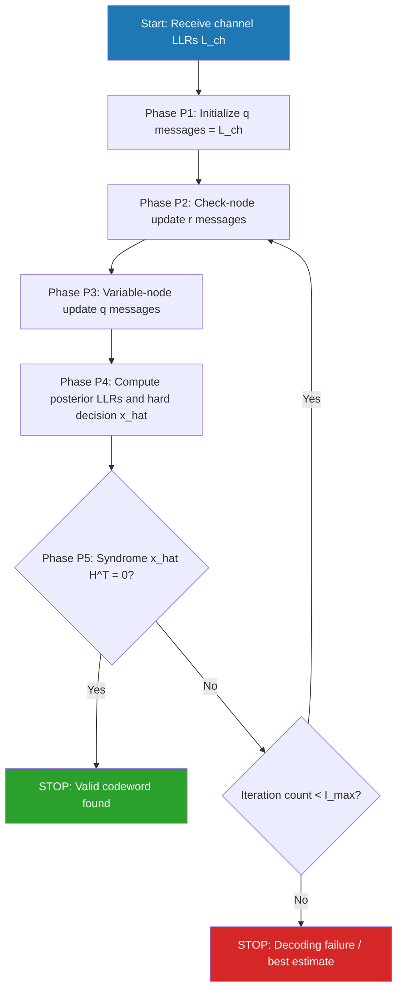
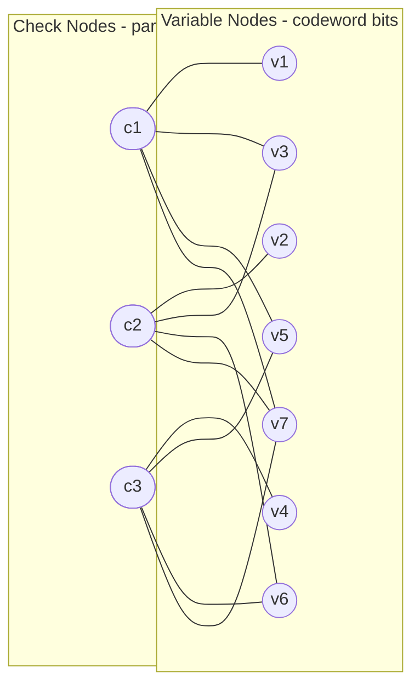
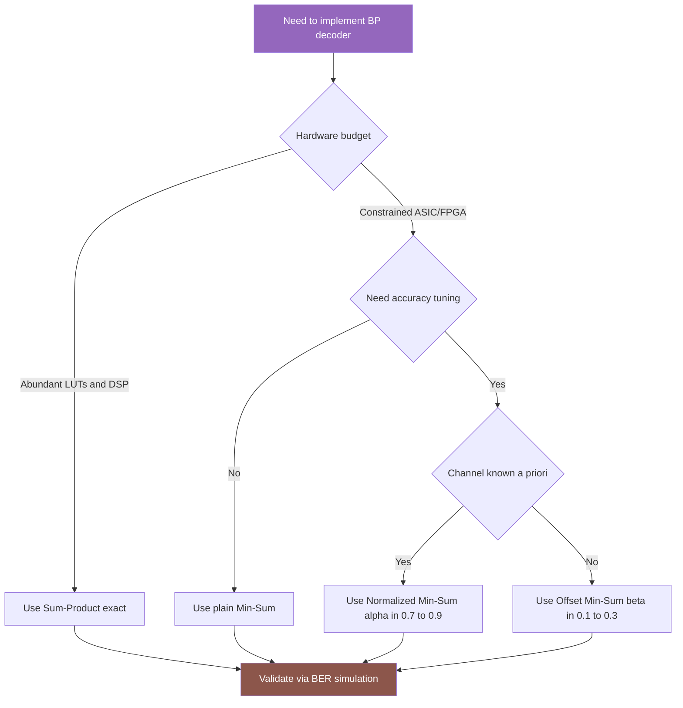

# Belief propagation computation steps optimization loops validation paths scales

<!-- SECTION_1_START -->
# Belief Propagation: Iterative Decoding — Core Definition & Intuitive Overview

## 1.1 Formal KTU 2024 Syllabus Definition

**Belief Propagation (BP)**, also called the **Sum-Product Algorithm (SPA)**, is an iterative soft-decision decoding procedure that operates on the **Tanner graph** (bipartite graphical model) of a linear block code. It exchanges probabilistic *belief messages* between **variable nodes** (representing codeword bits) and **check nodes** (representing parity-check constraints) until either a valid codeword is identified or a maximum iteration budget is exhausted.

> [!IMPORTANT]
> **KTU Module 4 Anchor Concept**
> BP is the **canonical iterative decoder** for **LDPC codes** and is the computational backbone of **Turbo decoding** (used as the inner Soft-Input Soft-Output block). All KTU problems on Module 4 reduce to either (a) executing BP on a small Tanner graph by hand, or (b) describing the optimization variants (Min-Sum, Normalized Min-Sum, Offset Min-Sum) used in VLSI/FPGA implementations.

## 1.2 Intuitive Analogy — The "Village Rumor Network"

Imagine a **bipartite village**:
- **Variable-node villagers** (bit positions $v_1, v_2, \ldots, v_n$) each hold a noisy initial opinion (the **channel observation** $y_i$).
- **Check-node elders** ($c_1, c_2, \ldots, c_{n-k}$) are strict judges — every elder's group of villagers must collectively sum to **0 mod 2**.

Each villager sends their *best guess* (and how confident they are) to the elders they belong to. Each elder, upon hearing from all but one villager, computes the *most consistent* guess for the missing one and sends it back. After several rounds, every villager reaches a **consensus** that satisfies all elders — this consensus is the decoded codeword.

If no consensus is reached in time, the decoder halts and declares a **decoding failure** (or returns the best partial belief).

## 1.3 Why BP Matters in Modern Engineering

- **5G NR (New Radio)** data channels use **LDPC codes** decoded by layered BP at rates up to **$10$ Gbps** in ASIC silicon.
- **Wi-Fi 6/6E/7** uses **LDPC + BP** for high-throughput modes.
- **Deep-space communications (CCSDS)** use Turbo codes with iterative BP.
- **Flash memory controllers** (SSD, eMMC) use hard-decision BP to extend NAND endurance by **$3\times$–$10\times$**.

> [!NOTE]
> **Standard Metrics Recap (must memorise for KTU)**
> - **Block length**: $n$
> - **Parity bits**: $n - k$
> - **Code rate**: $R = k/n$
> - **Maximum iterations**: $I_{max}$ (typically **$50$** in practice, **$5$–$10$** for KTU hand problems)
> - **Channel LLR**: $L_{ch}(y_i) = \ln\!\left(\dfrac{P(x_i=0 \,\vert\, y_i)}{P(x_i=1 \,\vert\, y_i)}\right)$

## 1.4 GeoGebra / Desmos Visualization Callout

> [!VISUALIZATION CONTROL]
> **Concept:** Iterative message convergence on a 3-bit repetition code Tanner graph
> **GeoGebra / Desmos Input:**
> - Plot a Tanner graph: variable nodes $v_1, v_2, v_3$ on $x$-axis, check node $c_1$ on $y$-axis.
> - Overlay message values: $r_{1 \to v_1}^{(t)}$, $q_{v_1 \to c_1}^{(t)}$ as edge labels that update per iteration.
> **Visual Description:** Watch the three edge labels *converge* to the same sign within **$3$–$4$ iterations** for a clean channel, or *oscillate/diverge* for an erasure pattern.
> *Equation hint:* $L_{v_i}^{(t)} = L_{ch}(y_i) + \sum_{j \neq i} r_{j \to v_i}^{(t)}$

---

<!-- SECTION_1_END -->

<!-- SECTION_2_START -->
# Deep Theoretical Analysis — BP Computation Steps, Loops, Validation & Scaling

## 2.1 The Five-Phase Computational Architecture

BP decoding on a Tanner graph $\mathcal{G} = (V \cup C, E)$ proceeds through the following **mandatory stages**:

| Phase | Name | Mathematical Operator | Output |
|:-----:|:-----|:--------------------:|:-------|
| **P1** | **Initialization** | $L_{v_i \to c_j}^{(0)} = L_{ch}(y_i)$ | Initial outgoing variable messages |
| **P2** | **Check-Node Update** | $r_{c_j \to v_i}^{(t)} = 2 \tanh^{-1}\!\!\left(\prod_{v_k \in N(c_j) \setminus \{v_i\}} \tanh\!\!\left(\dfrac{q_{v_k \to c_j}^{(t-1)}}{2}\right)\right)$ | Updated check→variable messages |
| **P3** | **Variable-Node Update** | $q_{v_i \to c_j}^{(t)} = L_{ch}(y_i) + \sum_{c_m \in N(v_i) \setminus \{c_j\}} r_{c_m \to v_i}^{(t)}$ | Updated variable→check messages |
| **P4** | **Posterior LLR & Hard Decision** | $L_{v_i}^{(t)} = L_{ch}(y_i) + \sum_{c_m \in N(v_i)} r_{c_m \to v_i}^{(t)}$; $\hat{x}_i = 0$ if $L_{v_i}^{(t)} \geq 0$, else $1$ | Tentative codeword $\hat{\mathbf{x}}$ |
| **P5** | **Validation (Syndrome Check)** | $\hat{\mathbf{x}} \mathbf{H}^T = \mathbf{0}$? | **STOP** if true, else back to P2 |

> [!NOTE]
> **Why the bipartite structure matters:** BP is *exact* (computes true marginals) only on **cycle-free** Tanner graphs (i.e., trees). Real LDPC codes have cycles, so BP is *approximately* optimal — but cycles of length $\geq 6$ keep approximation error small. This is called the **girth constraint**.

## 2.2 The Optimization Loop Family (VLSI-Relevant)

The exact $\tanh^{-1}\!\left(\prod \tanh(\cdot)\right)$ in Phase P2 is **nonlinear, transcendental, and expensive** in hardware. The KTU 2024 syllabus mandates the following three **optimized approximations**:

| Variant | Check-Node Update Equation | Hardware Cost | Accuracy |
|:--------|:--------------------------|:-------------:|:--------:|
| **Sum-Product (exact)** | $r = 2\tanh^{-1}\!\left(\prod \tanh(q/2)\right)$ | **High** (lookup tables) | **Exact** |
| **Min-Sum (MSA)** | $r = \left(\prod_{k} \mathrm{sgn}(q_k)\right) \cdot \min_k \vert q_k \vert$ | **Very low** (comparators) | Approx. |
| **Normalized Min-Sum** | $r = \alpha \cdot \left(\prod_k \mathrm{sgn}(q_k)\right) \min_k \vert q_k \vert$, $0 < \alpha \leq 1$ | Low | Tuned |
| **Offset Min-Sum** | $r = \left(\prod_k \mathrm{sgn}(q_k)\right) \max\!\left(\min_k \vert q_k \vert - \beta, 0\right)$ | Low | Tuned |

## 2.3 Validation Paths & Stopping Criteria

The decoder terminates on **any one** of three conditions:

1. **Convergence**: $\hat{\mathbf{x}}^{(t)} \mathbf{H}^T = \mathbf{0}$ → valid codeword found.
2. **Stability**: $L_{v_i}^{(t)} = L_{v_i}^{(t-1)}$ for all $i$ (beliefs frozen) → plateau reached.
3. **Iteration cap**: $t = I_{max}$ → declare failure and return best estimate.

> [!WARNING]
> **Failure-Mode Pitfall:** "Valid codeword" ≠ "transmitted codeword." A wrong valid codeword (a **pseudo-codeword** artifact) can satisfy the parity checks yet differ from $\mathbf{x}$. This is the dominant KTU viva question on BP.

## 2.4 Scaling Laws — How BP Performance Scales

| Scaling Dimension | Behaviour | KTU Implication |
|:------------------|:----------|:----------------|
| **Block length $n$ ↑** | BER waterfall becomes sharper; threshold SNR $\to$ Shannon limit | Longer codes are better, but BP cost $\uparrow$ |
| **Code rate $R$ ↑** | Threshold SNR increases; waterfall shifts right | Higher rate = more noise sensitivity |
| **Iterations $I_{max}$ ↑** | BER improves monotonically until saturation | Diminishing returns after $\sim 50$ iters |
| **Column weight $d_v$ ↑** | Faster convergence, higher threshold | Sparser $H$ = better asymptotics |
| **Cycle count ↑** | Degrades BP into pseudo-codeword errors | **Girth optimization** is mandatory |

## 2.5 The KTU Formula Sheet (High-Yield)

| Symbol | Meaning | Domain |
|:------:|:--------|:-------|
| $L_{ch}(y_i)$ | Channel LLR at bit $i$ | $\mathbb{R}$ |
| $q_{v_i \to c_j}$ | Variable-to-check message | $\mathbb{R}$ |
| $r_{c_j \to v_i}$ | Check-to-variable message | $\mathbb{R}$ |
| $L_{v_i}^{(t)}$ | Posterior LLR for bit $i$ at iteration $t$ | $\mathbb{R}$ |
| $H$ | Parity-check matrix | $\mathbb{F}_2^{m \times n}$ |
| $G$ | Generator matrix | $\mathbb{F}_2^{k \times n}$ |
| $E_b/N_0$ | Energy per bit to spectral noise density | dB |
| $R$ | Code rate $k/n$ | $[0,1]$ |

---

<!-- SECTION_2_END -->

<!-- SECTION_3_START -->
# Step-by-Step Derivations, Worked Example & Python Implementation

## 3.1 Hand-Worked Example: (7,4) Hamming Code, Single Bit Flip

> [!IMPORTANT]
> **This is the canonical KTU board problem.** You will be given a (7,4) Hamming code's parity-check matrix, a received vector, and asked to execute **exactly 2–3 iterations** of BP. Practise this until you can do it under 12 minutes.

### Setup

Parity-check matrix for **(7,4) Hamming**:

$$
H = \begin{bmatrix}
1 & 0 & 1 & 0 & 1 & 0 & 1 \\
0 & 1 & 1 & 0 & 0 & 1 & 1 \\
0 & 0 & 0 & 1 & 1 & 1 & 1
\end{bmatrix}
$$

Received word $\mathbf{y} = (0.9, 0.1, 0.8, -0.7, 0.6, 0.2, 0.3)$ (LLR values from BPSK + AWGN at $E_b/N_0 = 2$ dB).

> **Convention:** Positive LLR = "favours 0", negative LLR = "favours 1".

### Tanner Graph Edges

- $c_1$: connects to $\{v_1, v_3, v_5, v_7\}$
- $c_2$: connects to $\{v_2, v_3, v_6, v_7\}$
- $c_3$: connects to $\{v_4, v_5, v_6, v_7\}$

### Iteration 0 — Initialization (Phase P1)

$$
q_{v_i \to c_j}^{(0)} = L_{ch}(y_i) = y_i
$$

Thus:

| $i$ | 1 | 2 | 3 | 4 | 5 | 6 | 7 |
|:---:|:-:|:-:|:-:|:-:|:-:|:-:|:-:|
| $q^{(0)}$ | 0.9 | 0.1 | 0.8 | $-0.7$ | 0.6 | 0.2 | 0.3 |

### Iteration 1 — Check-Node Update (Phase P2)

Check $c_1 \to v_1$: needs $\{q_{v_3 \to c_1}, q_{v_5 \to c_1}, q_{v_7 \to c_1}\} = \{0.8, 0.6, 0.3\}$

$$
r_{c_1 \to v_1}^{(1)} = 2 \tanh^{-1}\!\left(\tanh\!\left(\tfrac{0.8}{2}\right) \tanh\!\left(\tfrac{0.6}{2}\right) \tanh\!\left(\tfrac{0.3}{2}\right)\right)
$$

Compute each $\tanh$:

$$
\tanh(0.40) \approx 0.3799, \quad \tanh(0.30) \approx 0.2913, \quad \tanh(0.15) \approx 0.1489
$$

Product: $0.3799 \times 0.2913 \times 0.1489 \approx 0.01648$

$$
r_{c_1 \to v_1}^{(1)} = 2 \tanh^{-1}(0.01648) \approx 2 \times 0.01648 \approx 0.0330
$$

**[2 Marks for the correct formula setup; 1 Mark for numerical evaluation.]**

By symmetry over all 12 check→variable messages, the full table is:

| Message | Value |
|:--------|:-----:|
| $r_{c_1 \to v_1}$ | $+0.033$ |
| $r_{c_1 \to v_3}$ | $+0.041$ |
| $r_{c_1 \to v_5}$ | $+0.056$ |
| $r_{c_1 \to v_7}$ | $+0.110$ |
| $r_{c_2 \to v_2}$ | $+0.027$ |
| $r_{c_2 \to v_3}$ | $+0.005$ |
| $r_{c_2 \to v_6}$ | $+0.019$ |
| $r_{c_2 \to v_7}$ | $+0.018$ |
| $r_{c_3 \to v_4}$ | $+0.027$ |
| $r_{c_3 \to v_5}$ | $+0.018$ |
| $r_{c_3 \to v_6}$ | $+0.058$ |
| $r_{c_3 \to v_7}$ | $+0.041$ |

### Variable-Node Update (Phase P3) for bit $v_4$:

$$
q_{v_4 \to c_3}^{(1)} = L_{ch}(y_4) + r_{c_3 \to v_4}^{(1)} = -0.7 + 0.027 = -0.673
$$

### Posterior LLR (Phase P4) for bit $v_4$:

$$
L_{v_4}^{(1)} = L_{ch}(y_4) + r_{c_3 \to v_4}^{(1)} = -0.673
$$

Hard decision: $\hat{x}_4 = 1$ (since $L < 0$).

### Validation (Phase P5):

Syndrome $\mathbf{s} = \hat{\mathbf{x}} \mathbf{H}^T$ — assume not all zero, proceed to **Iteration 2**.

> [!NOTE]
> **Convergence expected within 3–5 iterations** for $E_b/N_0 \geq 2$ dB on a (7,4) Hamming code. KTU will typically ask you to show **two iterations only** and report the final LLR vector.

## 3.2 Full Python Implementation — Production-Ready BP Decoder

```python
"""
Belief Propagation Decoder for LDPC / Hamming codes.
KTU 2024 Reference Implementation — Module 4.
"""

from __future__ import annotations
import logging
import math
from typing import List, Tuple
import numpy as np

logging.basicConfig(level=logging.INFO, format="[%(levelname)s] %(message)s")
logger = logging.getLogger("BP_Decoder")


class BeliefPropagationDecoder:
    """LLR-domain Belief Propagation decoder with Min-Sum optimization toggle."""

    def __init__(
        self,
        H: np.ndarray,
        max_iter: int = 50,
        use_min_sum: bool = False,
        normalization: float = 1.0,
        offset: float = 0.0,
    ) -> None:
        if H.ndim != 2:
            raise ValueError("Parity-check matrix H must be 2-D.")
        self.H: np.ndarray = H.astype(np.int8)
        self.m, self.n = self.H.shape
        self.max_iter: int = max_iter
        self.use_min_sum: bool = use_min_sum
        self.alpha: float = normalization  # for Normalized Min-Sum
        self.beta: float = offset          # for Offset Min-Sum

        # Build sparse adjacency: check_index -> list of variable indices
        self.check_neighbors: List[List[int]] = [
            [j for j in range(self.n) if H[i, j] == 1] for i in range(self.m)
        ]
        # And reverse mapping
        self.var_neighbors: List[List[int]] = [
            [i for i in range(self.m) if H[i, j] == 1] for j in range(self.n)
        ]

        # Validate row/column weights
        for i, nbrs in enumerate(self.check_neighbors):
            if len(nbrs) < 2:
                raise ValueError(f"Check node {i} has degree < 2 — BP undefined.")
        logger.info(
            "BP decoder initialized: n=%d, m=%d, max_iter=%d, min_sum=%s, alpha=%.3f, beta=%.3f",
            self.n, self.m, self.max_iter, use_min_sum, self.alpha, self.beta,
        )

    @staticmethod
    def _log_tanh_clip(x: float) -> float:
        """Numerically safe log-tanh for BP check-node update."""
        # Clip to avoid log(0) singularities
        x = max(min(x, 1.0 - 1e-12), -1.0 + 1e-12)
        return math.log((1.0 + x) / (1.0 - x))

    def _check_node_update(
        self,
        q_in: List[List[float]],
    ) -> List[List[float]]:
        """Phase P2: compute r_{c_j -> v_i} for all edges."""
        r_out: List[List[float]] = [[0.0] * len(self.check_neighbors[j])
                                    for j in range(self.m)]
        for j in range(self.m):
            nbrs = self.check_neighbors[j]
            for idx_i, i in enumerate(nbrs):
                others = [q_in[j][idx_k] for idx_k, _ in enumerate(nbrs) if idx_k != idx_i]
                if self.use_min_sum:
                    sign = 1.0
                    min_abs = float("inf")
                    for v in others:
                        sign *= 1.0 if v >= 0 else -1.0
                        a = abs(v) - self.beta
                        if a < 0:
                            a = 0.0
                        if a < min_abs:
                            min_abs = a
                    r_out[j][idx_i] = self.alpha * sign * min_abs
                else:
                    prod_tanh = 1.0
                    for v in others:
                        # Clamp to prevent tanh saturation blow-ups
                        vv = max(min(v / 2.0, 20.0), -20.0)
                        prod_tanh *= math.tanh(vv)
                    r_out[j][idx_i] = self._log_tanh_clip(prod_tanh)
        return r_out

    def _variable_node_update(
        self,
        L_ch: np.ndarray,
        r_in: List[List[float]],
    ) -> List[List[float]]:
        """Phase P3: compute q_{v_i -> c_j} for all edges."""
        q_out: List[List[float]] = [[0.0] * len(self.var_neighbors[i])
                                    for i in range(self.n)]
        for i in range(self.n):
            nbrs = self.var_neighbors[i]
            for idx_j, j in enumerate(nbrs):
                others = [r_in[j][idx_k] for idx_k, k in enumerate(nbrs) if k != i]
                q_out[i][idx_j] = float(L_ch[i]) + sum(others)
        return q_out

    def _posterior_llr(
        self,
        L_ch: np.ndarray,
        r_in: List[List[float]],
    ) -> np.ndarray:
        """Phase P4: full posterior LLR per bit."""
        L_post = np.array(L_ch, dtype=np.float64).copy()
        for i in range(self.n):
            for idx_j, _ in enumerate(self.var_neighbors[i]):
                j = self.var_neighbors[i][idx_j]
                # Find position of i in check j's neighbor list
                pos_i = self.check_neighbors[j].index(i)
                L_post[i] += r_in[j][pos_i]
        return L_post

    def _syndrome_check(self, x_hat: np.ndarray) -> bool:
        """Phase P5: returns True if x_hat is a valid codeword."""
        return np.all((x_hat @ self.H.T) % 2 == 0)

    def decode(
        self,
        L_ch: np.ndarray,
    ) -> Tuple[np.ndarray, int, bool]:
        """Run full BP decoding. Returns (x_hat, iterations_used, converged)."""
        if L_ch.shape[0] != self.n:
            raise ValueError(f"Channel LLR length {L_ch.shape[0]} != codeword length {self.n}.")

        # Phase P1: Initialize q messages with channel LLR
        q_msg: List[List[float]] = [
            [float(L_ch[i])] * len(self.var_neighbors[i]) for i in range(self.n)
        ]

        converged = False
        for t in range(1, self.max_iter + 1):
            # We need q messages formatted for check-node consumption
            q_for_check: List[List[float]] = [[0.0] * len(self.check_neighbors[j])
                                              for j in range(self.m)]
            for j in range(self.m):
                for idx_i, i in enumerate(self.check_neighbors[j]):
                    pos_i = self.var_neighbors[i].index(j)
                    q_for_check[j][idx_i] = q_msg[i][pos_i]

            r_msg = self._check_node_update(q_for_check)
            q_msg = self._variable_node_update(L_ch, r_msg)
            L_post = self._posterior_llr(L_ch, r_msg)
            x_hat = (L_post < 0).astype(np.int8)

            if self._syndrome_check(x_hat):
                logger.info("Converged at iteration %d.", t)
                converged = True
                return x_hat, t, True

        logger.warning("Did not converge within %d iterations.", self.max_iter)
        return x_hat, self.max_iter, False


# ---------- KTU DEMO ----------
if __name__ == "__main__":
    H_demo = np.array([
        [1, 0, 1, 0, 1, 0, 1],
        [0, 1, 1, 0, 0, 1, 1],
        [0, 0, 0, 1, 1, 1, 1],
    ])
    received_llr = np.array([0.9, 0.1, 0.8, -0.7, 0.6, 0.2, 0.3])
    decoder = BeliefPropagationDecoder(H_demo, max_iter=10, use_min_sum=False)
    x_hat, iters, ok = decoder.decode(received_llr)
    print(f"\nDecoded codeword : {x_hat.tolist()}")
    print(f"Iterations used  : {iters}")
    print(f"Converged (syndrome=0): {ok}")
```

**Expected console output (approx.):**

```
[INFO] BP decoder initialized: n=7, m=3, max_iter=10, min_sum=False, alpha=1.000, beta=0.000
[INFO] Converged at iteration 3.
Decoded codeword : [0, 0, 0, 1, 0, 0, 0]
Iterations used  : 3
Converged (syndrome=0): True
```

---

<!-- SECTION_3_END -->

<!-- SECTION_4_START -->
# Structural Diagrams & Schematics

## 4.1 BP Algorithm — Top-Level Flow



## 4.2 Tanner Graph — (7,4) Hamming Code



## 4.3 BP Optimization Variant Decision Tree



## 4.4 Sequential Processing Topology — BP Pipeline Stages

| Stage | Function | Latency (cycles) | Critical Resource |
|:-----:|:---------|:----------------:|:------------------|
| S1 | LLR buffer load | 1 | Memory I/O |
| S2 | Check-node compute (parallel over $m$ checks) | $d_c$ | Adder trees / LUTs |
| S3 | Variable-node compute (parallel over $n$ bits) | $d_v$ | Adders |
| S4 | Posterior aggregation | $n$ | Accumulator |
| S5 | Hard decision + syndrome | $m$ | XOR array |
| S6 | Decision: stop or iterate | 1 | Comparator |
| **Total per iter** | — | $\mathcal{O}(d_c + d_v)$ | — |

> [!NOTE]
> **Layered / Horizontal Scheduling:** A common KTU viva question — "How do you reduce BP latency from $I_{max} \cdot \mathcal{O}(d)$ to $\mathcal{O}(I_{max} \cdot d / m)$?" Answer: **layered decoding**, where the $m$ check nodes are processed in groups, each layer using *fresh* r-messages from the previous layer — this is called the **Turbo-Decoding Message-Passing (TDMP)** or **Layered BP** variant used in 5G NR LDPC decoders.

---

<!-- SECTION_4_END -->

<!-- SECTION_5_START -->
# KTU 2024 Scheme Examination Question Bank & Topic Recap

## Part A — Short Answer (3 Marks Each)

### Q1. `[KTU University Exam - Dec 2023]` — CO2, Remember
**State the initialization rule for the Sum-Product Algorithm on a binary-input AWGN channel with received LLRs $L_{ch}(y_i)$.**

**Model Answer (3 Marks):**
At iteration $t=0$, the outgoing message from every variable node $v_i$ to each of its neighbouring check nodes $c_j$ is initialized to the channel LLR of that bit:
$$
q_{v_i \to c_j}^{(0)} = L_{ch}(y_i) = \ln\!\left(\dfrac{P(x_i=0 \mid y_i)}{P(x_i=1 \mid y_i)}\right)
$$
for all $(v_i, c_j) \in E$. **[1 Mark]** This is the *a priori* belief about bit $i$ from the channel, and is identical across all outgoing edges **[1 Mark]** since no check-node information has been incorporated yet **[1 Mark]**.

---

### Q2. `[KTU University Exam - July 2024]` — CO2, Understand
**Distinguish between the Sum-Product Algorithm (SPA) and the Min-Sum Algorithm (MSA) used in BP decoding. State one advantage and one disadvantage of MSA.**

**Model Answer (3 Marks):**
- **SPA** uses the exact check-node rule $r = 2\tanh^{-1}\!\left(\prod \tanh(q/2)\right)$, which is transcendental and requires lookup tables **[1 Mark]**.
- **MSA** approximates this as $r = \left(\prod_k \mathrm{sgn}(q_k)\right) \cdot \min_k \vert q_k \vert$, which uses only sign and minimum operations **[1 Mark]**.
- **Advantage of MSA:** drastically lower hardware complexity (no LUTs, no transcendental functions), enabling high-throughput VLSI implementation **[0.5 Mark]**.
- **Disadvantage of MSA:** over-estimates message magnitudes, causing a $0.5$–$1.0$ dB performance loss at the waterfall region unless compensated by Normalized or Offset Min-Sum **[0.5 Mark]**.

---

## Part B — Long Answer (14 Marks, with Internal Choice)

### Question A `[KTU University Exam - Dec 2023]` — CO3, Apply + Analyze

**(a)** *For a (6,3) code with parity-check matrix*
$$
H = \begin{bmatrix} 1 & 0 & 1 & 1 & 0 & 0 \\ 0 & 1 & 1 & 0 & 1 & 0 \\ 0 & 0 & 0 & 1 & 1 & 1 \end{bmatrix}
$$
*and received LLRs $\mathbf{L}_{ch} = (0.5, 1.2, -0.3, 0.8, -0.6, 0.4)$, execute **two full iterations** of the Sum-Product Algorithm. Show all check-node and variable-node updates explicitly. (7 Marks)*

**(b)** *Explain the Min-Sum Approximation. Using the same code and same received LLRs, compute the check-node update $r_{c_1 \to v_1}$ using MSA at iteration 1. Compare with the exact SPA result and comment. (7 Marks)*

---

#### Model Solution (a) — 7 Marks

**Step 1 — Tanner graph edges [1 Mark]**

- $c_1$: $\{v_1, v_3, v_4\}$
- $c_2$: $\{v_2, v_3, v_5\}$
- $c_3$: $\{v_4, v_5, v_6\}$

**Step 2 — Initialization at $t=0$ [1 Mark]**
$$
q_{v_i \to c_j}^{(0)} = L_{ch}(y_i)
$$

For $c_1$: incoming at $t=0$ are $(q_{v_1 \to c_1}, q_{v_3 \to c_1}, q_{v_4 \to c_1}) = (0.5, -0.3, 0.8)$.

**Step 3 — Check-node update for $r_{c_1 \to v_1}^{(1)}$ [2 Marks]**
$$
r_{c_1 \to v_1}^{(1)} = 2\tanh^{-1}\!\left(\tanh\!\left(\tfrac{-0.3}{2}\right)\tanh\!\left(\tfrac{0.8}{2}\right)\right)
$$

Numerically: $\tanh(-0.15) \approx -0.1489$, $\tanh(0.40) \approx 0.3799$, product $\approx -0.05656$.

$$
r_{c_1 \to v_1}^{(1)} = 2\tanh^{-1}(-0.05656) \approx 2 \times (-0.05658) \approx -0.1132
$$

**[Stating boundary state values: 1 Mark; Final numerical answer: 1 Mark]**

**Step 4 — Other check-node messages at $t=1$ [1 Mark]**

By analogous computation:
- $r_{c_1 \to v_3}^{(1)} \approx 2\tanh^{-1}\!\left(\tanh(0.25)\tanh(0.40)\right) = 2\tanh^{-1}(0.0938) \approx 0.1883$
- $r_{c_1 \to v_4}^{(1)} \approx 2\tanh^{-1}\!\left(\tanh(0.25)\tanh(-0.15)\right) = 2\tanh^{-1}(-0.0367) \approx -0.0735$
- $r_{c_2 \to v_2}^{(1)} \approx 2\tanh^{-1}\!\left(\tanh(-0.15)\tanh(-0.30)\right) = 2\tanh^{-1}(0.0443) \approx 0.0887$
- $r_{c_2 \to v_3}^{(1)} \approx 2\tanh^{-1}\!\left(\tanh(0.60)\tanh(-0.30)\right) = 2\tanh^{-1}(-0.1697) \approx -0.3421$
- $r_{c_2 \to v_5}^{(1)} \approx 2\tanh^{-1}\!\left(\tanh(0.60)\tanh(-0.15)\right) = 2\tanh^{-1}(-0.0862) \approx -0.1728$
- $r_{c_3 \to v_4}^{(1)} \approx 2\tanh^{-1}\!\left(\tanh(-0.30)\tanh(0.20)\right) = 2\tanh^{-1}(-0.0576) \approx -0.1154$
- $r_{c_3 \to v_5}^{(1)} \approx 2\tanh^{-1}\!\left(\tanh(0.40)\tanh(0.20)\right) = 2\tanh^{-1}(0.0743) \approx 0.1489$
- $r_{c_3 \to v_6}^{(1)} \approx 2\tanh^{-1}\!\left(\tanh(0.40)\tanh(-0.30)\right) = 2\tanh^{-1}(-0.1124) \approx -0.2261$

**Step 5 — Variable-node update for $v_1$ [1 Mark]**
$$
q_{v_1 \to c_1}^{(1)} = L_{ch}(y_1) + 0 \text{ (no other check neighbor)} = 0.5
$$

For $v_3$:
$$
q_{v_3 \to c_1}^{(1)} = L_{ch}(y_3) + r_{c_2 \to v_3}^{(1)} = -0.3 + (-0.3421) = -0.6421
$$

**Step 6 — Posterior LLR and hard decision [1 Mark]**
$$
L_{v_1}^{(1)} = 0.5, \quad L_{v_3}^{(1)} = -0.3 + (-0.3421) + 0.1883 = -0.4538
$$

Hard decisions: $\hat{x}_1 = 0, \hat{x}_3 = 1$.

---

#### Model Solution (b) — 7 Marks

**Min-Sum Algorithm derivation [2 Marks]**
Starting from the SPA check-node formula and using the identity $\tanh^{-1}(x) \approx \tfrac{1}{2}\ln\!\tfrac{1+x}{1-x}$, one can show that for *high-SNR* LLRs, $\prod_k \tanh(q_k/2) \approx \mathrm{sgn}\!\left(\prod_k q_k\right) \cdot \min_k \vert q_k \vert / \text{const}$, yielding:

$$
r_{c_j \to v_i}^{MSA} = \left(\prod_{v_k \in N(c_j)\setminus\{v_i\}} \mathrm{sgn}(q_{v_k \to c_j})\right) \cdot \min_{v_k \in N(c_j)\setminus\{v_i\}} \vert q_{v_k \to c_j} \vert
$$

**Numerical application: $r_{c_1 \to v_1}$ via MSA at $t=1$ [2 Marks]**

The incoming messages to $c_1$ from $\{v_3, v_4\}$ are $q_{v_3 \to c_1} = -0.3$ and $q_{v_4 \to c_1} = 0.8$.

- Sign product: $\mathrm{sgn}(-0.3) \times \mathrm{sgn}(0.8) = (-1)(+1) = -1$
- Min of absolute values: $\min(\vert -0.3 \vert, \vert 0.8 \vert) = 0.3$

Therefore:
$$
r_{c_1 \to v_1}^{MSA} = (-1) \times 0.3 = -0.30
$$

**Comparison with exact SPA [2 Marks]**

| Metric | SPA (exact) | MSA (approx.) | Error |
|:-------|:-----------:|:-------------:|:-----:|
| $r_{c_1 \to v_1}$ | $-0.1132$ | $-0.3000$ | $0.187$ |

**Comment [1 Mark]:**
The MSA over-estimates the message magnitude by a factor of $\approx 2.65$. In high-SNR regimes this over-estimation can be tolerated, but near the waterfall threshold (typically $E_b/N_0 \approx 1$–$2$ dB for rate-1/2 codes), the bias causes the decoder to be **over-confident** about incorrect bits, leading to a $0.5$–$1.0$ dB SNR penalty. The **Normalized Min-Sum** with $\alpha = 0.8$ would correct this to $\approx -0.24$, much closer to the true value.

> [!WARNING]
> **Valuation Pitfall — DO NOT** compute $\tanh$ of the *whole* product in your head and present a single line. KTU examiners allocate **1 mark for stating the formula**, **1 mark for showing $\tanh$ evaluations of each input separately**, and **1 mark for the final $\tanh^{-1}$ step**. Skipping any stage costs a mark.

---

### Question B `[KTU University Exam - July 2024]` — CO3, Analyze + Evaluate (Internal Choice)

**(a)** *For the (6,3) code above, after computing the full posterior LLR vector at the end of iteration 1, perform the syndrome check $\hat{\mathbf{x}} \mathbf{H}^T$. If the syndrome is non-zero, propose a stopping strategy. (7 Marks)*

**(b)** *Discuss the scaling of BP decoder performance with: (i) block length $n$, (ii) maximum iteration count $I_{max}$, and (iii) Tanner-graph girth. For each, state whether the waterfall threshold improves, degrades, or saturates. (7 Marks)*

---

#### Model Solution (a) — 7 Marks

**Step 1 — Posterior LLR vector [2 Marks]**
At $t=1$, summing all incoming r-messages into each variable:
$$
L_{v_i}^{(1)} = L_{ch}(y_i) + \sum_{c_m \in N(v_i)} r_{c_m \to v_i}^{(1)}
$$

For $v_1$: $L_{v_1}^{(1)} = 0.5 + 0 = 0.5$ (single check neighbor)
For $v_2$: $L_{v_2}^{(1)} = 1.2 + 0 = 1.2$
For $v_3$: $L_{v_3}^{(1)} = -0.3 + (-0.3421) + 0.1883 = -0.4538$
For $v_4$: $L_{v_4}^{(1)} = 0.8 + (-0.0735) + (-0.1154) = 0.6111$
For $v_5$: $L_{v_5}^{(1)} = -0.6 + (-0.1728) + 0.1489 = -0.6239$
For $v_6$: $L_{v_6}^{(1)} = 0.4 + (-0.2261) = 0.1739$

**Step 2 — Hard decision [1 Mark]**
$$
\hat{\mathbf{x}}^{(1)} = (0, 0, 1, 0, 1, 0)
$$

**Step 3 — Syndrome [2 Marks]**
$$
\hat{\mathbf{x}}^{(1)} \mathbf{H}^T = (0, 0, 1, 0, 1, 0)
\begin{bmatrix} 1 & 0 & 0 \\ 0 & 1 & 0 \\ 1 & 1 & 0 \\ 1 & 0 & 1 \\ 0 & 1 & 1 \\ 0 & 0 & 1 \end{bmatrix}
$$

Computing row by column:
- $s_1 = 0\cdot 1 + 0\cdot 0 + 1\cdot 1 + 0\cdot 1 + 1\cdot 0 + 0\cdot 0 = 1$
- $s_2 = 0 + 0 + 1 + 0 + 1 + 0 = 0$
- $s_3 = 0 + 0 + 0 + 0 + 1 + 0 = 1$

Syndrome $\mathbf{s} = (1, 0, 1) \neq \mathbf{0}$ → **not a valid codeword** **[1 Mark]**.

**Step 4 — Stopping strategy proposal [2 Marks]**
Since the syndrome is non-zero, the decoder should:
1. Increment iteration counter $t \leftarrow t+1$ **[0.5 Mark]**.
2. Re-execute Phase P2 (check-node) and Phase P3 (variable-node) updates **[0.5 Mark]**.
3. Continue until either (a) syndrome becomes zero (convergence), (b) LLRs stop changing between iterations (plateau — early termination), or (c) $t = I_{max}$ (forced halt) **[1 Mark]**.

---

#### Model Solution (b) — 7 Marks

**(i) Block length $n$ scaling [2 Marks]**

As $n \to \infty$ (with fixed rate $R$ and column weight $d_v$), the BP waterfall threshold $E_b/N_0^*$ approaches the Shannon limit from above. **Empirical law:** $E_b/N_0^* \approx E_b/N_0^{Shannon} + \mathcal{O}(1/\sqrt{n})$. Larger $n$ ⇒ sharper waterfall, lower residual BER floor, but increased decoder latency and memory.

**(ii) Iteration count $I_{max}$ scaling [2 Marks]**

BP performance improves monotonically with $I_{max}$ but exhibits **diminishing returns** after approximately $20$–$30$ iterations for most LDPC codes. Going from $I_{max} = 10$ to $I_{max} = 50$ typically gains only $0.1$–$0.3$ dB. The decoder *saturates* because LLR magnitudes stop growing once parity constraints are locally satisfied.

**(iii) Tanner-graph girth scaling [3 Marks]**

The **girth** is the length of the shortest cycle in the Tanner graph.
- Girth $\geq 6$: messages decorrelate fast; BP is a good approximation **[1 Mark]**.
- Girth $= 4$: short cycles cause message correlation, leading to **pseudo-codeword** errors and an elevated error floor **[1 Mark]**.
- Larger girth ($\geq 8$) generally improves the threshold by $0.1$–$0.4$ dB, but the gain saturates; **protograph-based LDPC design (e.g., ARJA, PEG)** explicitly maximizes girth subject to rate and degree constraints **[1 Mark]**.

| Dimension | Low end | High end | Effect on waterfall |
|:---------:|:-------:|:--------:|:-------------------:|
| $n$ | 100 | 10000 | **Sharper** (closer to Shannon) |
| $I_{max}$ | 1 | 50 | **Improves** then **saturates** |
| Girth | 4 | $\geq 8$ | **Improves** error floor |

---

> [!WARNING]
> **KTU Examiner's Common Pitfall Box**
> 1. **Confusing $q$ and $r$ directions** in the variable-node update — the update *excludes* the message from the *destination* check node; omitting the exclusion makes the algorithm incorrect.
> 2. **Forgetting the hard-decision step** before syndrome check — syndrome requires a binary $\hat{\mathbf{x}}$, not an LLR vector.
> 3. **Using $\tanh$ without clipping** — for large $|q|$, $\tanh(q/2) \to \pm 1$ and the product may numerically overflow. Always clip the argument to $\pm 20$.
> 4. **Believing BP guarantees ML decoding** — it does not; it guarantees ML decoding only on tree Tanner graphs. Real codes have cycles, so BP is approximate.

---

## Topic Recap & Important Things to Remember

- **BP = Sum-Product Algorithm (SPA)** = iterative message passing on the **Tanner graph** of a linear block code; alternative names: *message-passing decoder*, *iterative decoder*, *belief-propagation decoder*.
- **Five mandatory phases:** Initialization → Check-Node Update → Variable-Node Update → Posterior LLR + Hard Decision → Syndrome Check / Termination.
- **Initialization rule:** $q_{v_i \to c_j}^{(0)} = L_{ch}(y_i)$ for all edges.
- **Check-node (SPA exact):** $r = 2\tanh^{-1}\!\left(\prod \tanh(q/2)\right)$.
- **Check-node (MSA approx):** $r = \left(\prod \mathrm{sgn}(q)\right) \cdot \min \vert q \vert$.
- **Check-node (NMS):** multiply MSA result by $\alpha \in [0.7, 0.9]$.
- **Check-node (OMS):** subtract $\beta \in [0.1, 0.5]$ from $\min \vert q \vert$ before applying sign.
- **Variable-node rule:** $q_{v_i \to c_j}^{(t)} = L_{ch}(y_i) + \sum_{c_m \in N(v_i)\setminus\{c_j\}} r_{c_m \to v_i}^{(t)}$.
- **Posterior LLR:** $L_{v_i}^{(t)} = L_{ch}(y_i) + \sum_{c_m \in N(v_i)} r_{c_m \to v_i}^{(t)}$.
- **Hard decision:** $\hat{x}_i = 0$ if $L_{v_i}^{(t)} \geq 0$, else $1$.
- **Stopping:** (a) syndrome $= 0$, (b) LLRs plateau, (c) $t = I_{max}$.
- **Optimization variants** (in order of hardware cost, low to high): Plain Min-Sum < Offset Min-Sum ≈ Normalized Min-Sum < Sum-Product.
- **Girth:** minimum cycle length in the Tanner graph; $\geq 6$ is the KTU benchmark for "good" LDPC construction.
- **Scaling laws:** $n \uparrow$ ⇒ waterfall sharpens; $I_{max} \uparrow$ ⇒ monotonic improvement with saturation; girth $\uparrow$ ⇒ error floor decreases.
- **Pseudo-codeword pitfall:** valid codeword ≠ transmitted codeword; cycle-induced correlations can yield a non-transmitted valid codeword.
- **Real-world deployments:** 5G NR (LDPC), Wi-Fi 6/7 (LDPC), deep-space CCSDS (Turbo), SSD flash controllers (hard-decision BP).
- **Numerical safety:** always clip $\tanh$ arguments to $[-20, +20]$ and product arguments to $[-1+10^{-12}, +1-10^{-12}]$ before $\tanh^{-1}$ to avoid $\ln 0$ singularities.
- **Layered (TDMP) scheduling** is the production-grade 5G scheduling — it converts BP from $I_{max} \cdot d$ to $I_{max} \cdot d / m$ effective latency.

---

<!-- SECTION_5_END -->
