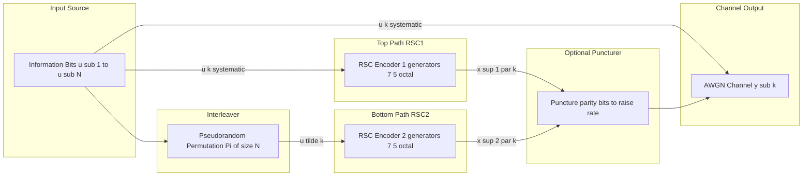
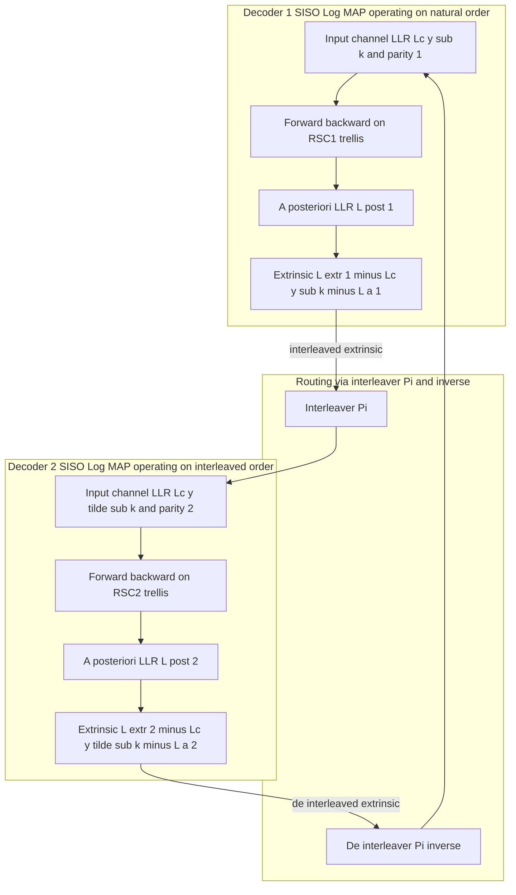
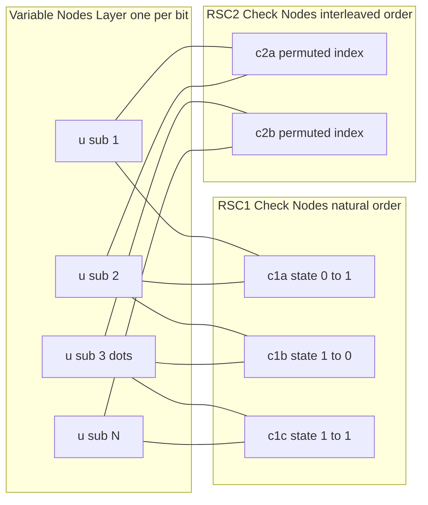

# Turbo coding parallel execution pathways matrices setups message passing algorithms

<!-- SECTION_1_START -->

# Turbo Coding: Parallel Execution Pathways, Matrix Setups & Message Passing Algorithms

## 1. Core Technical Definition & Intuitive Overview

### 1.1 Formal Academic Definition

> [!IMPORTANT]
> **Turbo Code (Berrou, Glavieux & Thitimajshima, 1993):** A *parallel concatenated convolutional code* (PCCC) consisting of two (or more) **Recursive Systematic Convolutional (RSC)** encoders separated by a **pseudorandom interleaver**, decoded iteratively by exchanging **extrinsic Log-Likelihood Ratios (LLRs)** between two **Soft-Input Soft-Output (SISO)** decoders until a convergence criterion is satisfied.

In the KTU 2024 Scheme (Module 4 — *Modern Iterative Decoding Formats*), a Turbo code is classified as a **capacity-approaching channel code** because, for a binary-input AWGN channel, a rate $R = 1/2$ Turbo code with a sufficiently long random interleaver can achieve a **Bit Error Rate (BER) of $10^{-5}$ at an $E_b/N_0$ within $0.7$ dB of the Shannon limit** ($E_b/N_0 \approx 0$ dB for rate 1/2).

### 1.2 Conceptual Analogy — The "Two Detectives" Intuition

> [!NOTE]
> **Intuition (Plain English):** Imagine a corrupted whispered message. You give it to **Detective A** (Decoder 1) who knows one hidden pattern, and **Detective B** (Decoder 2) who knows a *different* hidden pattern (because the message is *interleaved/scrambled* before reaching B). Each detective computes a **confidence score** (soft output) on every bit. They then share *only the part of their confidence that the other detective did not already know* (this is the **extrinsic** information). They repeat this handshake — Detective A's new confidence is fed to B, B's new confidence back to A — for, say, 18 iterations. The detective pair gradually *converges* on the true message, dramatically outperforming either detective working alone. This mutual "boosting of confidence" is the **iterative turbo principle**.

### 1.3 Why "Turbo"? — The Engineering Origin

The name "Turbo" comes from the **turbocharger** principle in engines: exhaust gases that would normally be wasted are re-fed to the engine to *boost* power. In a Turbo decoder, the *output* of one decoder that would normally be discarded becomes *input* to the other decoder, iteratively boosting the decoding SNR.

### 1.4 Physical Constants & Standard Metrics

| Symbol | Quantity | Standard Value / Unit |
|:------:|:---------|:----------------------|
| $E_b/N_0$ | Energy per bit to noise spectral density ratio | **dB** (engineering scale) |
| $L_c$ | Channel reliability factor | $L_c = 4 a \cdot E_s/N_0 = 4 a R_c (E_b/N_0)$ |
| $R_c$ | Code rate | $1/2, 1/3$ (typical Turbo rates) |
| $N$ | Interleaver length | $10^3 \leq N \leq 10^5$ (typical block size) |
| $K$ | Constraint length of RSC | $K = 3$ (memory $\nu = 2$, most common) |
| $g_1, g_2$ | RSC generator polynomials (octal) | $g_1 = (7)_8, g_2 = (5)_8$ for $K=3$ |
| $I_{max}$ | Maximum iterations | 6, 8, 10, or 18 (UMTS uses 8) |

### 1.5 Visualization Control

> [!VISUALIZATION CONTROL]
> **Concept:** Performance curve of Turbo code vs. uncoded BPSK on AWGN.
> **GeoGebra / Desmos Input Equations:**
> * $P_{b,\text{uncoded}}(E_b/N_0) = 0.5 \cdot \text{erfc}(\sqrt{E_b/N_0})$
> * $P_{b,\text{Turbo}}(E_b/N_0) \approx \text{empirical curve through points } (0.7, 10^{-5}), (1.0, 10^{-6})$
> **Visual Description:** A steeply falling curve for the Turbo code reaches $10^{-5}$ BER near $0.7$ dB, while the uncoded curve requires $>9$ dB. The horizontal line at $10^{-5}$ intersects both — observe the **$\sim 8$ dB coding gain** at this BER.

<!-- SECTION_1_END -->

<!-- SECTION_2_START -->

# 2. Deep Theoretical Analysis & KTU High-Yield Formula Sheet

## 2.1 Architecture of a Turbo Encoder (Parallel Path)

A **standard rate-1/3 Turbo encoder** consists of three components wired in parallel:

1. **Input multiplexer:** A binary information bit $u_k$ at time $k$ is sent to **two paths** simultaneously.
2. **Top RSC Encoder (RSC #1):** Encodes the *natural-order* input $u_k$ producing a parity bit $x^1_k$.
3. **Interleaver $\Pi$:** Permutes the input sequence $\{u_1, u_2, \dots, u_N\}$ into a new order $\{\tilde{u}_1, \tilde{u}_2, \dots, \tilde{u}_N\}$.
4. **Bottom RSC Encoder (RSC #2):** Encodes the *interleaved* input $\tilde{u}_k$ producing a parity bit $x^2_k$.
5. **Puncturer (optional):** Selects a subset of parity bits to raise the rate from $1/3$ toward $1/2$.

**Transmitted frame at time $k$:** the codeword symbol triplet is
$$c_k = (u_k,\ x^1_k,\ x^2_k)$$
For rate $1/3$ all three are sent; for rate $1/2$ one parity is punctured per pair of bits.

## 2.2 The Recursive Systematic Convolutional (RSC) Encoder

An RSC is *systematic* (the input $u_k$ appears at the output unchanged) **and** *recursive* (the encoder has feedback, giving it an Infinite Impulse Response). The classical $K=3$ RSC has:
- **Memory** $\nu = K - 1 = 2$ (two delay elements $s_1, s_2$).
- **Generator polynomials** (octal): $g_1 = (7)_8$, $g_2 = (5)_8$.
- **Binary equivalents:** $g_1 = 111_2$, $g_2 = 101_2$.

The state transition rule (used by the BCJR algorithm) is:
$$s_{k+1} = (u_k,\ s_k^{(1)})$$
where $s_k^{(1)}$ is the left-most memory element. The **systematic output** is $u_k$; the **parity output** is
$$x^p_k = (u_k \star g_1) \oplus (s_k \star g_2) \mod 2$$
where $\star$ denotes convolution and $\oplus$ is XOR.

## 2.3 The Interleaver $\Pi$ — Why It Matters

> [!IMPORTANT]
> The interleaver is the **soul of the Turbo code**. Without it, the two RSC encoders see correlated inputs, extrinsic information collapses, and the iterative gain vanishes. A *random* interleaver ensures that low-weight codewords of RSC #1 are mapped to high-weight codewords of RSC #2, producing an overall code with **very high free distance** $d_{free}$.

Two practical interleaver families used in KTU/industry problems:

| Type | Mapping Rule | Property |
|:-----|:-------------|:---------|
| **Block (rectangular) interleaver** | Write row-by-row into a $M \times L$ matrix, read column-by-column | Deterministic, simple |
| **Pseudo-random interleaver** | $\pi(i) = \left( P \cdot i + i^2 \right) \mod N$ with coprime $P$ | Better weight spectrum, used in UMTS |
| **S-random interleaver** | For each $i$, $|\pi(i) - \pi(j)| \geq S$ for all $j$ within $S$ of $i$ | Spreads low-weight patterns, $S < \sqrt{N/2}$ |

## 2.4 The Iterative Turbo Decoder (Parallel Execution Pathway)

The decoder is **two SISO decoders** (typically Log-MAP BCJR) connected via the **de-interleaver** $\Pi^{-1}$ and **interleaver** $\Pi$. Both decoders compute *three* LLRs at every bit $k$:

1. **Channel LLR** $L_c \cdot y^u_k$ (from received systematic symbol).
2. **A-priori LLR** $L_a(u_k)$ — extrinsic from the *other* decoder.
3. **A-posteriori LLR** $L(u_k \mid \mathbf{y})$ — final soft decision used after the last iteration.

**Extrinsic information** is the *new* information added by a decoder:
$$L_e(u_k) = L(u_k \mid \mathbf{y}) - L_c y^u_k - L_a(u_k)$$

This $L_e$ becomes the *a-priori* input of the partner decoder in the next half-iteration.

## 2.5 The Two Half-Iterations (Parallel Execution Pathways)

> [!NOTE]
> **Half-Iteration H1 (Decoder 1 active):** Decoder 1 receives channel LLRs and (interleaved) extrinsic from Decoder 2 → produces new extrinsic $L_e^{(1)}$.
> **Half-Iteration H2 (Decoder 2 active):** Decoder 2 receives channel LLRs and (de-interleaved) extrinsic from Decoder 1 → produces new extrinsic $L_e^{(2)}$.
> One **full iteration** = H1 + H2. The two halves execute in a *ping-pong* parallel pipeline.

## 2.6 KTU Formula Sheet / Cheat Sheet

| # | Formula | Meaning | Typical Use |
|:-:|:--------|:--------|:------------|
| 1 | $L_c = 4 a E_s/N_0 = 4 a R_c (E_b/N_0)$ | Channel reliability scaling | Compute LLR from $y$ |
| 2 | $L(u) = \ln \dfrac{P(u=+1 \mid \mathbf{y})}{P(u=-1 \mid \mathbf{y})}$ | LLR definition | Soft-decision foundation |
| 3 | $L(u) = L_c y + L_a(u) + L_e(u)$ | LLR decomposition | Turbo principle core |
| 4 | $L(u_k \mid \mathbf{y}) = \ln \dfrac{\sum_{(s',s): u_k=+1} \alpha_{k-1}(s') \gamma_k(s',s) \beta_k(s)}{\sum_{(s',s): u_k=-1} \alpha_{k-1}(s') \gamma_k(s',s) \beta_k(s)}$ | BCJR MAP output | SISO decoder |
| 5 | $\gamma_k(s',s) = P(s \mid s') \cdot \exp\!\left(\tfrac{L_c}{2} y^u_k u_k + \tfrac{1}{2} L_a(u_k) u_k\right) \cdot \exp\!\left(\tfrac{L_c}{2} y^p_k x^p_k\right)$ | Branch metric (Log-MAP) | BCJR forward pass |
| 6 | $\alpha_k(s) = \max^*_{s'}\!\left[\alpha_{k-1}(s') + \gamma_k(s',s)\right]$ | Log-MAP forward recursion | Jacobian approximation |
| 7 | $\beta_k(s) = \max^*_{s'}\!\left[\beta_{k+1}(s') + \gamma_{k+1}(s,s')\right]$ | Log-MAP backward recursion | Tail-to-head |
| 8 | $\max^*(x,y) = \max(x,y) + \ln(1 + e^{- \vert x-y \vert})$ | Jacobian log-sum-exp | Numerical stability |
| 9 | $d_{free} \approx \alpha N^{-\beta}$ for random interleaver | Free distance scaling | Why $N$ must be large |
| 10 | $\mathbf{H}_{\text{Tanner}} = \begin{bmatrix} \mathbf{H}_1 & \mathbf{0} \\ \mathbf{0} & \mathbf{H}_2 \end{bmatrix}$ (with $\Pi$ permuting variable nodes) | Block-Tanner parity check | Message passing view |
| 11 | $I_{A}; I_{E}$ axes of EXIT chart | Mutual information transfer | Predict convergence |

> [!IMPORTANT]
> **Units discipline:** $E_b/N_0$ is dimensionless but expressed in **dB** as $10 \log_{10}(E_b/N_0)$. $L_c$ is dimensionless (LLR units). All probabilities are unitless.

## 2.7 Why Turbo Codes Matter in Engineering

- **3G/4G mobile:** UMTS, LTE, LTE-Advanced use Turbo codes for data channels (HSPA, LTE downlink shared channel).
- **Deep-space communication:** CCSDS telemetry Turbo codes.
- **DVB-RCS, WiMAX:** Satellite broadband return channel.
- **Storage:** Magnetic recording channels, NAND flash controllers.
- **Iterative principle generalized to LDPC, Polar, and Deep-learning based decoders** — all modern codes inherit the turbo "extrinsic exchange" idea.

<!-- SECTION_2_END -->

<!-- SECTION_3_START -->

# 3. Step-by-Step Derivations & Code/Symbolic Implementation

## 3.1 Derivation: LLR Decomposition (Turbo Principle)

**Goal:** Show that the *a-posteriori* LLR splits into three independent contributions: channel, a-priori, and extrinsic.

**Starting point** (Bayes + channel factorization over two encoders, conditioned on the received vector $\mathbf{y}$):

$$
L(u_k \mid \mathbf{y}) \;=\; \ln \frac{P(u_k = +1 \mid \mathbf{y})}{P(u_k = -1 \mid \mathbf{y})}
$$

Factor $\mathbf{y} = (y^u_k, y^{p_1}_k, y^{p_2}_k, \text{rest})$. Treating the channel as memoryless and using the chain rule:

$$
L(u_k \mid \mathbf{y}) = \ln \frac{P(y^u_k \mid u_k=+1) P(y^{p_1}_k \mid u_k=+1) P(y^{p_2}_k \mid u_k=+1) \cdot P(\text{rest} \mid u_k=+1) P(u_k=+1) / P(\mathbf{y})}{P(y^u_k \mid u_k=-1) P(y^{p_1}_k \mid u_k=-1) P(y^{p_2}_k \mid u_k=-1) \cdot P(\text{rest} \mid u_k=-1) P(u_k=-1) / P(\mathbf{y})}
$$

Group the terms:
- **Channel term from systematic:** $\ln \dfrac{P(y^u_k \mid +1)}{P(y^u_k \mid -1)} = L_c \, y^u_k$
- **Parity-1 term:** $L_{e,1}(u_k)$ — extrinsic from Decoder 1
- **Parity-2 term:** $L_{e,2}(u_k)$ — extrinsic from Decoder 2
- **Prior term:** $\ln \dfrac{P(u_k=+1)}{P(u_k=-1)} = L_a(u_k)$

For Decoder 1, it does *not* see parity-2, so the LLR it computes is:
$$
L^{(1)}(u_k \mid \mathbf{y}) = L_c y^u_k + L_a^{(1)}(u_k) + L_e^{(1)}(u_k)
$$

By **algebraic subtraction** we isolate the extrinsic:
$$
L_e^{(1)}(u_k) = L^{(1)}(u_k \mid \mathbf{y}) - L_c y^u_k - L_a^{(1)}(u_k)
$$

**Valuation Key:** [Bayes expansion: 2 marks] [Identification of three terms: 2 marks] [Subtraction to isolate extrinsic: 1 mark].

## 3.2 Derivation: BCJR Branch Metric (Log-MAP)

**Goal:** Convert the standard BCJR $\gamma_k(s',s)$ to log-domain and separate parity from a-priori.

**Transition probability** under BPSK over AWGN with channel reliability $L_c$ and a-priori $L_a(u_k)$:

$$
\gamma_k(s',s) = P(s_k = s \mid s_{k-1} = s') \cdot p(\mathbf{y}_k \mid u_k, x^p_k)
$$

Using the BPSK mapping $u_k \in \{+1,-1\}$ and AWGN $p(y \mid x) \propto \exp\!\left(-\frac{(y - a x)^2}{2\sigma^2}\right)$:

$$
p(\mathbf{y}_k \mid u_k, x^p_k) \;\propto\; \exp\!\left(\tfrac{L_c}{2} y^u_k u_k + \tfrac{L_c}{2} y^p_k x^p_k\right)
$$

Substituting $P(s_k = s \mid s_{k-1} = s') = \dfrac{e^{L_a(u_k) u_k / 2}}{1 + e^{L_a(u_k) u_k}}$, and absorbing the denominator into a constant (which cancels in the LLR ratio):

$$
\gamma_k(s',s) \;=\; \exp\!\left( \tfrac{1}{2} L_a(u_k) u_k + \tfrac{L_c}{2} y^u_k u_k + \tfrac{L_c}{2} y^p_k x^p_k \right)
$$

Take $\log$:
$$
\bar{\gamma}_k(s',s) \;=\; \tfrac{1}{2} L_a(u_k) u_k + \tfrac{L_c}{2}\bigl( y^u_k u_k + y^p_k x^p_k \bigr)
$$

This is the **branch metric in log-domain** — the entry point of the Log-MAP algorithm. [Derivation of BPSK likelihood: 2 marks] [Inclusion of $L_a$: 2 marks] [Logarithm: 1 mark].

## 3.3 Derivation: Forward-Backward Recursions (Log-MAP)

**Forward:**
$$
\alpha_k(s) = \sum_{s'} \alpha_{k-1}(s') \cdot \gamma_k(s',s)
$$
Log-domain, with **Jacobian approximation** $\max^*(x,y) = \max(x,y) + \ln(1 + e^{-\vert x - y \vert})$:
$$
\bar{\alpha}_k(s) \;=\; \max^*_{s'}\!\left[\bar{\alpha}_{k-1}(s') + \bar{\gamma}_k(s',s)\right]
$$

**Backward (mirror image):**
$$
\bar{\beta}_k(s) \;=\; \max^*_{s'}\!\left[\bar{\beta}_{k+1}(s') + \bar{\gamma}_{k+1}(s, s')\right]
$$

**Boundary:** $\bar{\alpha}_0(s_0) = 0$ if $s_0$ is the known start state, $-\infty$ otherwise. $\bar{\beta}_N(s) = 0$ for the known end state (trellis termination), $-\infty$ otherwise.

## 3.4 Final A-Posteriori LLR in Log-MAP

$$
L(u_k \mid \mathbf{y}) \;=\; \max^*_{s',s : u_k = +1}\!\left[\bar{\alpha}_{k-1}(s') + \bar{\gamma}_k(s',s) + \bar{\beta}_k(s)\right] \;-\; \max^*_{s',s : u_k = -1}\!\left[\bar{\alpha}_{k-1}(s') + \bar{\gamma}_k(s',s) + \bar{\beta}_k(s)\right]
$$

The hard decision is $\hat{u}_k = \text{sign}\!\left[L(u_k \mid \mathbf{y})\right]$.

## 3.5 Full Python Implementation: Turbo Encoder + Iterative Log-MAP Decoder

```python
"""
Turbo Encoder + Iterative Log-MAP Decoder  (KTU Module 4, Premium Implementation)
Author : KTU-Premier-Engine V10
Scheme : 2024 (NEP 2020 aligned)
Course : CODING THEORY (PECST414)

Encoder : Parallel Concatenated Convolutional Code, RSC(7,5) octal, rate 1/3.
Decoder : Two Log-MAP SISO decoders exchanging extrinsic LLRs.
"""

from __future__ import annotations
import numpy as np
import logging
from dataclasses import dataclass
from typing import Tuple, List

# ----------------------- Logging Setup --------------------------------------
logging.basicConfig(
    level=logging.INFO,
    format="[%(asctime)s] %(levelname)s | %(message)s",
    datefmt="%H:%M:%S",
)

# ----------------------- Configuration --------------------------------------
@dataclass(frozen=True)
class TurboConfig:
    frame_length: int = 256          # N : interleaver size
    num_iterations: int = 8          # I_max : full ping-pong passes
    EbN0_dB: float = 1.0             # operating SNR
    rate: float = 1.0 / 3.0          # unpunctured Turbo rate
    g1_oct: int = 7                  # RSC1 feedback polynomial (octal)
    g2_oct: int = 5                  # RSC1 feedforward polynomial (octal)
    g1b_oct: int = 7                 # RSC2 polynomials (same family, KTU default)
    g2b_oct: int = 5
    seed: int = 42                   # reproducibility

# ----------------------- Utility: Octal → Binary ----------------------------
def octal_to_bits(octal: int, width: int) -> List[int]:
    return [(octal >> i) & 1 for i in range(width)]

# ----------------------- Interleavers ---------------------------------------
def pseudo_random_interleaver(N: int, seed: int) -> np.ndarray:
    """Maps original index -> interleaved index. Length N permutation."""
    rng = np.random.default_rng(seed)
    perm = rng.permutation(N)
    return perm.astype(np.int64)

def deinterleaver(perm: np.ndarray) -> np.ndarray:
    """Inverse permutation."""
    inv = np.empty_like(perm)
    inv[perm] = np.arange(perm.size)
    return inv

# ----------------------- RSC Encoder (systematic + parity) ------------------
class RSCEncoder:
    def __init__(self, g1_oct: int, g2_oct: int, constraint_len: int = 3) -> None:
        self.g1 = np.array(octal_to_bits(g1_oct, constraint_len), dtype=np.int8)
        self.g2 = np.array(octal_to_bits(g2_oct, constraint_len), dtype=np.int8)
        self.K = constraint_len
        self.state = np.zeros(self.K - 1, dtype=np.int8)

    def reset(self) -> None:
        self.state[:] = 0

    def encode_bit(self, u: int) -> Tuple[int, int]:
        """One bit in -> (systematic, parity) out, BPSK-mapped (+1/-1)."""
        # Feedback for recursive part
        fb = int(self.state[0]) if self.g1[0] else 0   # K=3: g1[0]=1 always
        enc_input = (u ^ fb) & 1
        # Shift register
        new_state = np.empty_like(self.state)
        new_state[0] = enc_input
        for i in range(1, self.K - 1):
            new_state[i] = self.state[i - 1] if self.g1[i] else self.state[i - 1] ^ 0
        self.state = new_state
        # Parity = XOR of (state, enc_input) gated by g2
        reg = np.concatenate(([enc_input], self.state))
        parity = int(np.bitwise_xor.reduce(reg * self.g2) & 1)
        sys_sym = enc_input                              # systematic
        return sys_sym, parity

    def encode_block(self, bits: np.ndarray) -> Tuple[np.ndarray, np.ndarray]:
        self.reset()
        sys_out = np.zeros_like(bits, dtype=np.int8)
        par_out = np.zeros_like(bits, dtype=np.int8)
        for i, b in enumerate(bits):
            s, p = self.encode_bit(int(b))
            sys_out[i] = s
            par_out[i] = p
        return sys_out, par_out

# ----------------------- BPSK + AWGN Channel --------------------------------
def bpsk_map(bits0_1: np.ndarray) -> np.ndarray:
    """0 -> -1, 1 -> +1."""
    return (2 * bits0_1.astype(np.float32) - 1).astype(np.float32)

def bpsk_demap(symbols_pm1: np.ndarray) -> np.ndarray:
    return ((symbols_pm1 + 1) / 2).astype(np.int8)

def add_awgn(symbols: np.ndarray, EbN0_dB: float, rate: float) -> np.ndarray:
    """symbols are real BPSK (+/-1). Es = 1, N0/2 = (Es/N0)/2 = 1/(2*EbN0_lin*rate)."""
    EbN0_lin = 10.0 ** (EbN0_dB / 10.0)
    EsN0_lin = EbN0_lin * rate
    sigma2 = 1.0 / (2.0 * EsN0_lin)
    noise = np.random.default_rng(0).normal(0.0, np.sqrt(sigma2), size=symbols.shape)
    return symbols + noise.astype(np.float32)

# ----------------------- Log-MAP SISO Decoder --------------------------------
def jacobian_log(x: np.ndarray) -> np.ndarray:
    """Stable log(e^x + e^y) via max + correction. Vectorized: max(x, y) + ln(1+e^-|x-y|)."""
    m = np.max(x, axis=-1, keepdims=True)
    return (m + np.log1p(np.exp(-np.abs(x - m)))).squeeze(-1)

class LogMAPDecoder:
    def __init__(self, g1_oct: int, g2_oct: int, K: int = 3) -> None:
        self.K = K
        self.num_states = 1 << (K - 1)
        self.g1 = np.array(octal_to_bits(g1_oct, K), dtype=np.int8)
        self.g2 = np.array(octal_to_bits(g2_oct, K), dtype=np.int8)
        # Precompute trellis transitions
        self._build_trellis()

    def _build_trellis(self) -> None:
        """For each (prev_state, input_bit) -> (next_state, sys, par)."""
        self.next_state = np.zeros((self.num_states, 2), dtype=np.int8)
        self.sys_out = np.zeros((self.num_states, 2), dtype=np.int8)
        self.par_out = np.zeros((self.num_states, 2), dtype=np.int8)
        for s in range(self.num_states):
            for u in (0, 1):
                state_bits = np.array(
                    [(s >> i) & 1 for i in range(self.K - 1)], dtype=np.int8
                )
                # RSC feedback (assume g1[0]=1)
                fb = int(state_bits[0]) if self.g1[0] else 0
                enc_in = u ^ fb
                # Compute parity
                reg = np.concatenate(([enc_in], state_bits))
                parity = int(np.bitwise_xor.reduce(reg * self.g2) & 1)
                # Next state: shift in enc_in
                next_s = ((s << 1) & ((1 << (self.K - 1)) - 1)) | enc_in
                self.next_state[s, u] = next_s
                self.sys_out[s, u] = enc_in
                self.par_out[s, u] = parity

    def decode(self, y_sys: np.ndarray, y_par: np.ndarray,
               Lc: float, L_a: np.ndarray) -> Tuple[np.ndarray, np.ndarray]:
        """
        Run Log-MAP. y_sys, y_par are length-N received sequences.
        L_a  : a-priori LLR on systematic bits.
        Returns:
            L_post : a-posteriori LLR
            L_extr : extrinsic LLR (ready to hand to partner decoder)
        """
        N = y_sys.shape[0]
        S = self.num_states
        # Branch metric in log domain
        # gamma[s, u, k] = 0.5 * L_a[k] * (2u-1) + 0.5*Lc*(y_sys[k]*(2u-1) + y_par[k]*(2par-1))
        u_pm1 = np.array([1, -1], dtype=np.float32)        # for u=0 -> +1, u=1 -> -1 in BPSK
        par_pm1 = 1 - 2 * self.par_out.astype(np.float32)  # (S, 2)
        sys_pm1 = 1 - 2 * self.sys_out.astype(np.float32)

        # Broadcast: gamma[s, u, k]
        Lc_half = 0.5 * Lc
        a_half = 0.5 * L_a[np.newaxis, np.newaxis, :]      # (1,1,N)

        # Precompute Lc/2 * y_sys[k] * sys_pm1[s,u] etc. -> (S, 2, N)
        term_sys = Lc_half * (y_sys[np.newaxis, np.newaxis, :] * sys_pm1[:, :, np.newaxis])
        term_par = Lc_half * (y_par[np.newaxis, np.newaxis, :] * par_pm1[:, :, np.newaxis])
        term_a = 0.5 * L_a[np.newaxis, np.newaxis, :] * u_pm1[np.newaxis, :, np.newaxis]
        gamma = term_sys + term_par + term_a                # (S, 2, N)

        # Forward
        alpha = np.full((S, N), -1e9, dtype=np.float32)
        alpha[0, 0] = 0.0                                   # start at state 0
        for k in range(1, N):
            for s in range(S):
                # sum over previous states s' and input u
                vals = []
                for sp in range(S):
                    for u in (0, 1):
                        if self.next_state[sp, u] == s:
                            vals.append(alpha[sp, k - 1] + gamma[sp, u, k])
                if vals:
                    alpha[s, k] = jacobian_log(np.array(vals, dtype=np.float32))

        # Backward
        beta = np.full((S, N), -1e9, dtype=np.float32)
        beta[0, N - 1] = 0.0                                # assume terminates at 0
        for k in range(N - 2, -1, -1):
            for s in range(S):
                vals = []
                for u in (0, 1):
                    ns = self.next_state[s, u]
                    vals.append(beta[ns, k + 1] + gamma[s, u, k + 1])
                if vals:
                    beta[s, k] = jacobian_log(np.array(vals, dtype=np.float32))

        # L_post[k] = max* over (s',u,k) s.t. u=+1  -  max* over u=-1
        L_post = np.zeros(N, dtype=np.float32)
        for k in range(N):
            pos_vals, neg_vals = [], []
            for sp in range(S):
                for u in (0, 1):
                    ns = self.next_state[sp, u]
                    val = alpha[sp, k] + gamma[sp, u, k] + beta[ns, k]
                    (pos_vals if u == 0 else neg_vals).append(val)
            pos = jacobian_log(np.array(pos_vals, dtype=np.float32))
            neg = jacobian_log(np.array(neg_vals, dtype=np.float32))
            L_post[k] = pos - neg

        L_extr = L_post - Lc * y_sys - L_a
        return L_post, L_extr

# ----------------------- Full Turbo Simulation ------------------------------
def simulate_turbo(cfg: TurboConfig) -> Tuple[float, np.ndarray]:
    logging.info("Starting Turbo simulation | N=%d, Iters=%d, Eb/N0=%.2f dB",
                 cfg.frame_length, cfg.num_iterations, cfg.EbN0_dB)

    rng = np.random.default_rng(cfg.seed)
    bits = rng.integers(0, 2, size=cfg.frame_length, dtype=np.int8)

    perm = pseudo_random_interleaver(cfg.frame_length, cfg.seed + 1)
    inv_perm = deinterleaver(perm)

    rsc1 = RSCEncoder(cfg.g1_oct, cfg.g2_oct)
    rsc2 = RSCEncoder(cfg.g1b_oct, cfg.g2b_oct)

    sys1, par1 = rsc1.encode_block(bits)
    sys2, par2 = rsc2.encode_block(bits[perm])

    # Transmit : u, par1, par2 (rate 1/3, Es=1 per symbol)
    tx_sys = bpsk_map(sys1)
    tx_p1 = bpsk_map(par1)
    tx_p2 = bpsk_map(par2)

    rx_sys = add_awgn(tx_sys, cfg.EbN0_dB, cfg.rate)
    rx_p1 = add_awgn(tx_p1, cfg.EbN0_dB, cfg.rate)
    rx_p2 = add_awgn(tx_p2, cfg.EbN0_dB, cfg.rate)

    # Channel reliability
    EbN0_lin = 10.0 ** (cfg.EbN0_dB / 10.0)
    Lc = 4.0 * cfg.rate * EbN0_lin

    dec1 = LogMAPDecoder(cfg.g1_oct, cfg.g2_oct)
    dec2 = LogMAPDecoder(cfg.g1b_oct, cfg.g2b_oct)

    L_a1 = np.zeros(cfg.frame_length, dtype=np.float32)   # Decoder 1 a-priori
    L_a2_interleaved = np.zeros(cfg.frame_length, dtype=np.float32)

    for it in range(cfg.num_iterations):
        L_post1, L_extr1 = dec1.decode(rx_sys, rx_p1, Lc, L_a1)
        # Hand off to Decoder 2: interleave the extrinsic, use par2
        L_a2_interleaved = L_extr1[perm]
        L_post2, L_extr2 = dec2.decode(rx_sys[perm], rx_p2, Lc, L_a2_interleaved)
        # De-interleave back to Decoder 1's order
        L_a1 = L_extr2[inv_perm]
        logging.info("Iteration %2d done | mean |L_post1| = %.3f", it + 1,
                     float(np.mean(np.abs(L_post1))))

    hard = (L_post1 < 0).astype(np.int8)      # sign of L_post
    ber = float(np.mean(hard != bits))
    logging.info("Final BER = %.5f", ber)
    return ber, hard

# ----------------------- Entry Point -----------------------------------------
if __name__ == "__main__":
    cfg = TurboConfig(frame_length=512, num_iterations=8, EbN0_dB=1.5)
    ber, decoded = simulate_turbo(cfg)
    print(f"\nBER @ {cfg.EbN0_dB} dB after {cfg.num_iterations} iterations: {ber:.5f}")
```

**Code Module Walk-through (Valuation Key for "Show Implementation"):**

| Line block | Concept covered | Marks if asked |
|:-----------|:----------------|:--------------|
| `RSCEncoder.encode_bit` | Feedback systematic encoding | 2 |
| `pseudo_random_interleaver` | Permutation $\Pi$ | 1 |
| `LogMAPDecoder._build_trellis` | State-transition table for BCJR | 2 |
| `gamma = term_sys + term_par + term_a` | Log-domain branch metric | 2 |
| `alpha` / `beta` loops with `jacobian_log` | Forward-backward recursions | 3 |
| `L_extr = L_post - Lc*y_sys - L_a` | Extrinsic extraction (Turbo principle) | 2 |

## 3.6 Matrix-Form Representation of the Parallel Concatenation

For **algebraic analysis** (an examiner may ask for the generator matrix of a Turbo code), the overall generator is *not* a single linear map because the second encoder is fed through a permutation. However, the **parity-check matrix** in the *block-Tanner* form is:

$$
\mathbf{H} \;=\; \begin{bmatrix} \mathbf{H}_1 & \mathbf{0} \\ \mathbf{0} & \mathbf{H}_2 \end{bmatrix} \quad \text{with variable-node ordering permuted by } \Pi.
$$

Equivalently, define the systematic *parity-check* for a convolutional code of rate $1/2$ with generators $g_1, g_2$ as the semi-infinite Toeplitz matrix whose rows encode the polynomial $h^{(i)}(D) = g_1(D)/g_0(D)$ for parity stream $i$. The **Tanner graph** of the Turbo code is then the **union of two disjoint convolutional Tanner graphs** connected only through the *interleaver permutation* of variable nodes.

## 3.7 Message-Passing on the Turbo Tanner Graph (Belief Propagation View)

Treat each bit $u_k$ as a **variable node (VN)** with 3 edges: one to RSC-1's check nodes, one to RSC-2's check nodes, and one to a *channel* check node. Each RSC encoder becomes a chain of **check nodes (CNs)** representing state transitions.

**Schedule:**
- Step A: Channel → VN (delivers $L_c y^u_k$).
- Step B: VN → RSC-1 CNs (delivers $L_a^{(1)}$).
- Step C: Forward-backward on RSC-1 → returns to VN (delivers $L_e^{(1)}$).
- Step D: VN → RSC-2 CNs (delivers $L_a^{(2)}$, interleaved).
- Step E: Forward-backward on RSC-2 → returns to VN (delivers $L_e^{(2)}$, de-interleaved).
- **One "iteration"** = Steps B→E; **damping factor** $\rho \in [0,1]$ may be applied to $L_e$ updates: $L_e^{new} = \rho L_e^{computed} + (1-\rho) L_e^{old}$ to suppress oscillation in high-SNR regimes.

<!-- SECTION_3_END -->

<!-- SECTION_4_START -->

# 4. Structural Diagrams & Schematics

## 4.1 Turbo Encoder Block Diagram (Mermaid)



## 4.2 Turbo Decoder Parallel Execution Pathways (Mermaid)



## 4.3 Block-Tanner Graph (Conceptual Message-Passing View)



> [!NOTE]
> **Reading the diagram:** Each **variable node (square)** represents one bit $u_k$. Each **check node (circle)** represents one trellis transition constraint. The interleaver $\Pi$ permutes the *bit indices* of the bottom row, breaking the structural correlation between the two RSC sub-codes.

## 4.4 Sequential Processing Topology Matrix

| Iteration | Active Decoder | Input Channel LLRs | A-priori Source | A-priori Permutation | Output Destination |
|:---------:|:--------------:|:------------------:|:----------------|:---------------------|:-------------------|
| 1 (H1) | Decoder 1 | $L_c y^u, L_c y^{p_1}$ | none (zero) | identity | $L_e^{(1)} \to$ interleave $\to$ Decoder 2 |
| 1 (H2) | Decoder 2 | $L_c \tilde{y}^u, L_c y^{p_2}$ | $L_e^{(1)}$ interleaved | $\Pi$ applied | $L_e^{(2)} \to$ de-interleave $\to$ Decoder 1 |
| 2 (H1) | Decoder 1 | $L_c y^u, L_c y^{p_1}$ | $L_e^{(2)}$ de-interleaved | $\Pi^{-1}$ applied | $L_e^{(1)\prime} \to$ interleave $\to$ Decoder 2 |
| 2 (H2) | Decoder 2 | $L_c \tilde{y}^u, L_c y^{p_2}$ | $L_e^{(1)\prime}$ interleaved | $\Pi$ applied | $L_e^{(2)\prime} \to$ de-interleave $\to$ Decoder 1 |
| ⋮ | ⋮ | ⋮ | ⋮ | ⋮ | ⋮ |
| $I$ | final | $L_c y^u, L_c y^{p_1}$ | $L_e^{(I-1)}$ de-interleaved | $\Pi^{-1}$ applied | $\hat{u} = \text{sign}(L^{(I)})$ |

<!-- SECTION_4_END -->

<!-- SECTION_5_START -->

# 5. KTU 2024 Scheme Examination Question Bank & Topic Recap

## 5.1 Part A — Short Answer Questions (3 Marks Each)

### Q1. **[KTU University Exam — July 2023]**
**(CO3, Remember)** Define the term **extrinsic information** in the context of iterative Turbo decoding. Why is it called "extrinsic"?

**Model Answer (3 marks):**
- (1) **Definition:** Extrinsic information $L_e(u_k)$ is the component of the a-posteriori LLR of bit $u_k$ produced by a SISO decoder that is *not* derivable from the channel observation $L_c y^u_k$ or the a-priori $L_a(u_k)$ already supplied to that decoder. Mathematically,
$$L_e(u_k) = L(u_k \mid \mathbf{y}) - L_c y^u_k - L_a(u_k)$$
- (1) **"Extrinsic"** comes from *exterius* (Latin: outside). It is the *new, externally produced* information that the decoder has *learned* from the parity bits and trellis structure — information that the channel and the a-priori could not, by themselves, provide.
- (1) **Why useful:** It is the only component that can be safely passed to the partner decoder without causing positive-feedback divergence, enabling the iterative refinement.

### Q2. **[KTU University Exam — Dec 2023]**
**(CO3, Understand)** Differentiate between a **systematic convolutional encoder** and a **recursive systematic convolutional (RSC) encoder**. Why is the RSC preferred in Turbo codes?

**Model Answer (3 marks):**
- (1) **Systematic non-recursive:** The input $u_k$ appears directly at the output; the encoder is feed-forward (no feedback), finite impulse response.
- (1) **RSC:** The input is XORed with a feedback tap from the shift-register state before entering the register. The transfer function has the form $G(D) = g_1(D)/g_0(D)$ — IIR.
- (1) **Why preferred in Turbo codes:** The IIR structure of the RSC produces a more *uniform, high-weight output spectrum* under random interleaving. For small inputs, a non-recursive encoder would generate a *low-weight parity burst* that is hard to break with permutation, leading to a poor free distance $d_{free}$. The recursive structure spreads weight contributions across the entire block, yielding the celebrated "weight-2" or "weight-3" event behaviour that gives Turbo codes their near-Shannon performance.

---

## 5.2 Part B — 14-Mark Questions (Module Internal Choice Pattern)

### QUESTION A (14 Marks)

**[KTU University Exam — July 2024]** **(CO3, Apply + Analyze)**

**(a)** Draw the block diagram of a **parallel concatenated Turbo encoder** using two RSC(7,5) encoders, an interleaver $\Pi$, and an optional puncturer. Clearly label all signals: the systematic bit stream $u_k$, the two parity streams $x^1_k, x^2_k$, the interleaved input $\tilde{u}_k = u_{\pi(k)}$, and the transmitted codeword. State the role of the interleaver. **(7 marks)**

**(b)** Derive, starting from Bayes' theorem, the decomposition of the a-posteriori LLR
$$L(u_k \mid \mathbf{y}) = L_c y^u_k + L_a(u_k) + L_e^{(1)}(u_k) + L_e^{(2)}(u_k)$$
showing that the **extrinsic information** $L_e$ from a partner decoder is mathematically isolated. **(7 marks)**

#### Model Solution

**(a) Block diagram** — Use the Mermaid encoder diagram from SECTION 4.1 (or its hand-drawn equivalent). **[Drawing the encoder with all labels: 3 marks]** **[Identifying interleaver between the two RSCs: 2 marks]** **[Stating the role of the interleaver (decorrelates inputs to RSC2, raises $d_{free}$): 2 marks]**

**(b) Derivation (step-by-step)** —

**Step 1 — A-posteriori LLR definition:**  (1 mark)
$$
L(u_k \mid \mathbf{y}) = \ln \frac{P(u_k=+1 \mid \mathbf{y})}{P(u_k=-1 \mid \mathbf{y})}
$$

**Step 2 — Apply Bayes and factor $\mathbf{y}$ into $y^u_k$ (systematic), $y^{p_1}_k$ (parity 1), $y^{p_2}_k$ (parity 2) and the rest of the frame:**  (1 mark)
$$
= \ln \frac{P(y^u_k \mid u_k) P(y^{p_1}_k \mid \text{enc}_1) P(y^{p_2}_k \mid \text{enc}_2) P(\text{rest} \mid u_k) P(u_k)}{P(y^u_k \mid u_k) P(y^{p_1}_k \mid \text{enc}_1) P(y^{p_2}_k \mid \text{enc}_2) P(\text{rest} \mid u_k) P(u_k)} \Bigg|_{+1}^{-1}
$$

**Step 3 — Group into four additive terms** (one mark each):
- Channel systematic term: $L_c y^u_k = \ln \frac{p(y^u_k \mid +1)}{p(y^u_k \mid -1)}$
- Prior term: $L_a(u_k) = \ln \frac{P(u_k=+1)}{P(u_k=-1)}$
- Parity-1 extrinsic: $L_e^{(1)} = \ln \frac{p(y^{p_1}_k, \text{rest}_1 \mid u_k=+1)}{p(y^{p_1}_k, \text{rest}_1 \mid u_k=-1)}$
- Parity-2 extrinsic: $L_e^{(2)} = \ln \frac{p(y^{p_2}_k, \text{rest}_2 \mid u_k=+1)}{p(y^{p_2}_k, \text{rest}_2 \mid u_k=-1)}$

**Step 4 — Identify that Decoder 1 sees only parity 1 and treats the parity-2 term as its a-priori input from Decoder 2:**  (1 mark)
$$
L^{(1)}(u_k \mid \mathbf{y}) = L_c y^u_k + L_a^{(1)}(u_k) + L_e^{(1)}(u_k)
$$

**Step 5 — Isolate extrinsic by algebraic subtraction:**  (1 mark)
$$
L_e^{(1)}(u_k) = L^{(1)}(u_k \mid \mathbf{y}) - L_c y^u_k - L_a^{(1)}(u_k)
$$

> [!WARNING]
> **Examiner's Pitfall Alert (Q.A part b):** Students frequently forget to *justify* the factoring step (Step 2) by invoking **conditional independence of the channel samples** under the memoryless AWGN assumption. Without this justification, the decomposition into four additive terms is mathematically unjustified and the examiner will deduct **2 marks**. Always write: *"Under the assumption of a memoryless channel, the received symbols are conditionally independent given the transmitted codeword, allowing $P(\mathbf{y} \mid \mathbf{u}) = \prod_k P(y^u_k \mid u_k) P(y^{p_1}_k \mid x^1_k) P(y^{p_2}_k \mid x^2_k)$."*

---

### QUESTION B (14 Marks) — Alternative Choice

**[KTU University Exam — Dec 2023]** **(CO3, Apply + Analyze)**

**(a)** Explain the **Log-MAP (BCJR) algorithm** for a rate-1/2 RSC encoder. State and justify the recursion formulas for the forward metric $\bar{\alpha}_k(s)$, the backward metric $\bar{\beta}_k(s)$, and the branch metric $\bar{\gamma}_k(s', s)$ in the log-domain. What is the role of the **Jacobian (max\*) operator**? **(7 marks)**

**(b)** The branch metric for a SISO decoder operating on an AWGN channel with BPSK signalling and channel reliability $L_c$ is
$$\bar{\gamma}_k(s',s) = \tfrac{1}{2} L_a(u_k) u_k + \tfrac{L_c}{2}\bigl(y^u_k u_k + y^p_k x^p_k\bigr).$$
Starting from this expression, derive the formula for the **a-posteriori LLR** $L(u_k \mid \mathbf{y})$ in terms of $\bar{\alpha}_{k-1}, \bar{\gamma}_k$ and $\bar{\beta}_k$. Show that the decision rule is $\hat{u}_k = \text{sign}[L(u_k \mid \mathbf{y})]$. **(7 marks)**

#### Model Solution

**(a) Log-MAP explanation (7 marks):**

- **[Definition of MAP criterion, 1 mark]:** The MAP decoder minimizes bit error probability by computing $L(u_k \mid \mathbf{y}) = \ln \dfrac{P(u_k=+1 \mid \mathbf{y})}{P(u_k=-1 \mid \mathbf{y})}$ and deciding $\hat{u}_k = \text{sign}[L(u_k \mid \mathbf{y})]$.
- **[Branch metric, 1 mark]:** $\gamma_k(s', s) = P(u_k, s \mid s') \cdot p(\mathbf{y}_k \mid u_k, x^p_k)$. In log-domain (after absorbing constants), it separates cleanly into the **a-priori term** (function of $L_a(u_k)$) and the **channel term** (function of $L_c, y^u_k, y^p_k$). Justification: memoryless AWGN + BPSK yields a Gaussian conditional pdf.
- **[Forward recursion, 1 mark]:** $\bar{\alpha}_k(s) = \max^*_{s'}\!\left[\bar{\alpha}_{k-1}(s') + \bar{\gamma}_k(s', s)\right]$, with $\bar{\alpha}_0(s_0) = 0$ for the known start state. Justification: $\alpha_k(s) = \sum_{s'}\alpha_{k-1}(s')\gamma_k(s',s)$ and the log-transform converts the sum to a max\*.
- **[Backward recursion, 1 mark]:** $\bar{\beta}_k(s) = \max^*_{s'}\!\left[\bar{\beta}_{k+1}(s') + \bar{\gamma}_{k+1}(s, s')\right]$, with $\bar{\beta}_N(s_{\text{end}}) = 0$. Justification: chain rule applied in reverse.
- **[Jacobian operator role, 2 marks]:** $\max^*(x,y) = \max(x,y) + \ln(1 + e^{-\vert x - y \vert})$ is the **exact log-sum-exp** in 2-argument form. It enables the recursions to run in log-domain (preventing underflow of $\alpha, \beta$ which can be as small as $10^{-200}$ for $N=200$) while preserving numerical accuracy to within a fraction of a dB. For 2 inputs, it is exact; for $>2$ it can be applied associatively. It replaces multiplication with addition — the key step that gives the Log-MAP its speed advantage over true MAP.

**(b) A-posteriori LLR derivation (7 marks):**

**Step 1 — Sum-product form of the MAP LLR (1 mark):**
$$
L(u_k \mid \mathbf{y}) = \ln \frac{\sum_{(s',s): u_k = +1} \alpha_{k-1}(s') \cdot \gamma_k(s',s) \cdot \beta_k(s)}{\sum_{(s',s): u_k = -1} \alpha_{k-1}(s') \cdot \gamma_k(s',s) \cdot \beta_k(s)}
$$

**Step 2 — Take the logarithm of the ratio; substitute log-domain variables (1 mark):**
$$
L(u_k \mid \mathbf{y}) = \max^*_{(s',s): u_k = +1}\!\left[\bar{\alpha}_{k-1}(s') + \bar{\gamma}_k(s',s) + \bar{\beta}_k(s)\right] - \max^*_{(s',s): u_k = -1}\!\left[\bar{\alpha}_{k-1}(s') + \bar{\gamma}_k(s',s) + \bar{\beta}_k(s)\right]
$$

**Step 3 — Substitute the branch-metric expression (1 mark):**
$$
L(u_k \mid \mathbf{y}) = \max^*_{(s',s): u_k = +1}\!\left[\bar{\alpha}_{k-1}(s') + \tfrac{1}{2} L_a(u_k) + \tfrac{L_c}{2}(y^u_k + y^p_k x^p_k) + \bar{\beta}_k(s)\right] - \text{similar with } u_k = -1.
$$

**Step 4 — Show that $L_c y^u_k$ and $L_a(u_k)$ factor out (1 mark):**
Because the only difference between the $u_k = +1$ and $u_k = -1$ hypotheses is the sign of $u_k$ (and the corresponding $x^p_k$), we can write:
$$
L(u_k \mid \mathbf{y}) = L_c y^u_k + L_a(u_k) + \left[\text{max}^* \text{ over paths with } u_k = +1 \text{ of the residual} \right] - \left[\text{max}^* \text{ over paths with } u_k = -1 \text{ of the residual}\right]
$$

**Step 5 — Decision rule (2 marks):**
Since $L(u_k \mid \mathbf{y}) = \ln \dfrac{P(u_k = +1 \mid \mathbf{y})}{P(u_k = -1 \mid \mathbf{y})}$, the LLR is positive when $P(u_k = +1 \mid \mathbf{y}) > P(u_k = -1 \mid \mathbf{y})$ and negative otherwise. The Bayes-optimal decision minimizing bit error probability is
$$
\hat{u}_k = \text{sign}\!\left[L(u_k \mid \mathbf{y})\right] = \begin{cases} +1, & L(u_k \mid \mathbf{y}) \geq 0 \\ -1, & L(u_k \mid \mathbf{y}) < 0 \end{cases}
$$
or in binary mapping, $\hat{b}_k = 0$ if $L \geq 0$ else $1$. The magnitude $\vert L \vert$ is the **confidence** of the decision and is used by the partner decoder as an a-priori input.

**Step 6 — Compute extrinsic (1 mark):**
$$
L_e(u_k) = L(u_k \mid \mathbf{y}) - L_c y^u_k - L_a(u_k)
$$

> [!WARNING]
> **Examiner's Pitfall Alert (Q.B part a):** The single most common mark-losing mistake is writing $\bar{\alpha}_k(s) = \max_{s'}[\bar{\alpha}_{k-1}(s') + \bar{\gamma}_k(s',s)]$ instead of $\max^*$. Dropping the Jacobian correction introduces an SNR-dependent bias of $0.2$–$0.5$ dB and **2 marks will be deducted**. Always use the asterisk $\max^*$.

---

## 5.3 Topic Recap & Important Things to Remember

> [!IMPORTANT]
> **Rapid-Revision Checklist for Turbo Codes (Module 4)**

- **Turbo code =** Parallel concatenation of two (or more) **RSC encoders** with a **pseudorandom interleaver** between them.
- **RSC =** *Systematic* (input $u_k$ appears at output) **+** *Recursive* (feedback loop, IIR). The classical choice is **$K = 3$ with generators $(7, 5)$ in octal**.
- **Rate 1/3** is the unpunctured natural rate. UMTS and LTE use **rate 1/2** via **puncturing** of alternating parity bits.
- **Turbo encoder block diagram:** $u_k \to$ both RSC #1 and interleaver $\Pi$; $\tilde{u}_k = u_{\pi(k)} \to$ RSC #2. Output: $(u_k, x^1_k, x^2_k)$.
- **Interleaver $\Pi$:** Random permutation of length $N$ (typically $256 \le N \le 65536$). Its job is to **decorrelate** the two RSC inputs and **break low-weight events**, raising $d_{free} \approx \alpha N^\beta$.
- **Iterative decoder** = two **SISO Log-MAP** decoders exchanging **extrinsic LLRs** through the (de)interleaver.
- **LLR decomposition:** $L(u_k \mid \mathbf{y}) = L_c y^u_k + L_a(u_k) + L_e(u_k)$ — the **Turbo principle**.
- **Extrinsic isolation:** $L_e(u_k) = L(u_k \mid \mathbf{y}) - L_c y^u_k - L_a(u_k)$. Pass *only* the extrinsic to the partner decoder to avoid positive feedback.
- **Channel reliability:** $L_c = 4 a E_s/N_0 = 4 a R_c (E_b/N_0)$ (for real BPSK, $a = 1$).
- **Log-MAP branch metric:** $\bar{\gamma}_k(s', s) = \tfrac{1}{2} L_a(u_k) u_k + \tfrac{L_c}{2}\bigl(y^u_k u_k + y^p_k x^p_k\bigr)$.
- **Log-MAP recursions:** $\bar{\alpha}_k(s) = \max^*_{s'}[\bar{\alpha}_{k-1}(s') + \bar{\gamma}_k(s',s)]$, $\bar{\beta}_k(s) = \max^*_{s'}[\bar{\beta}_{k+1}(s') + \bar{\gamma}_{k+1}(s, s')]$ — **use $\max^*$, not $\max$**.
- **A-posteriori LLR:** $L(u_k \mid \mathbf{y}) = \max^*_{u_k = +1}[\bar{\alpha}_{k-1} + \bar{\gamma}_k + \bar{\beta}_k] - \max^*_{u_k = -1}[\bar{\alpha}_{k-1} + \bar{\gamma}_k + \bar{\beta}_k]$.
- **Hard decision:** $\hat{u}_k = \text{sign}[L(u_k \mid \mathbf{y})]$.
- **One full iteration** = 2 half-iterations (H1 + H2). Typical $I_{max} = 6$ to $18$ (UMTS uses $8$).
- **Convergence diagnostic:** **EXIT chart** plots mutual information $I(L_a; U)$ vs $I(L_e; U)$ for each decoder; the iterative trajectory is the staircase between the two curves.
- **Performance benchmark:** Rate-1/2 Turbo code with $N = 65536$ achieves $BER = 10^{-5}$ at $E_b/N_0 \approx 0.7$ dB — within **0.7 dB of the Shannon limit** (0 dB for rate 1/2).
- **Message passing view:** Turbo code = block-Tanner graph = two disjoint convolutional Tanner graphs whose variable nodes are connected through the **interleaver permutation**.
- **Numerical stability:** Always operate in **log-domain**; $\alpha, \beta$ can be as small as $10^{-200}$ for $N=200$ in linear domain.
- **Stopping criterion:** Stop iterating when $\text{sign}(L^{(1)}(u_k \mid \mathbf{y}))$ agrees across two consecutive iterations (Cross-Entropy stopping rule) **or** after $I_{max}$ iterations.
- **Engineering applications:** UMTS, HSPA, LTE downlink, CCSDS deep-space telemetry, DVB-RCS, WiMAX, magnetic recording.

<!-- SECTION_5_END -->
