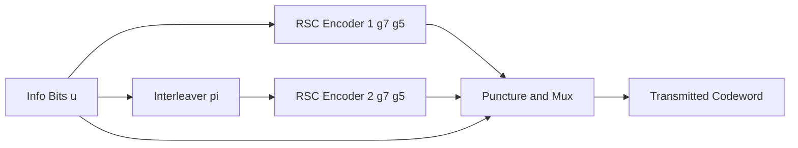
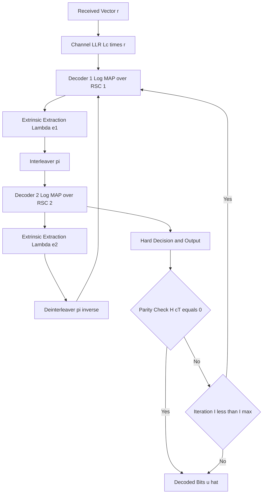

# Applications of linear codes

<!-- SECTION_1_START -->
# Applications of Linear Codes — KTU Coding Theory (PECST414) — Module 4

## 1. Core Technical Definition & Intuitive Overview

> [!IMPORTANT]
> **KTU 2024 Syllabus Definition (PECST414 — Module 4.5):**
> In the broader architecture of forward error correction (FEC), **linear codes** form the foundational algebraic substrate upon which every modern concatenated and iterative scheme is built. A binary **linear block code** $C(n,k)$ is a $k$-dimensional subspace of the vector space $\mathbb{F}_2^n$, characterized by a $k \times n$ generator matrix $G$ and an $(n-k) \times n$ parity-check matrix $H$, satisfying $HG^T = 0$. The **minimum Hamming distance** $d_{\min}$ of $C$ is the smallest weight of any non-zero codeword and directly governs the error-correcting capability $t = \lfloor(d_{\min}-1)/2\rfloor$.

Within the **turbo coding** framework (Berrou, Glavieux, Thitimajshima, 1993), linear codes — specifically **Recursive Systematic Convolutional (RSC) codes** — are the two constituent encoders that drive the iterative *turbo principle*. Each RSC code is itself a linear code over the semiring of shift-register sequences, and the *parallel concatenation* of two such linear codes via an interleaver $\pi$ yields the globally non-linear turbo code, whose remarkable near-Shannon-limit performance emerges from the algebraic linearity of the components combined with the probabilistic independence induced by the interleaver.

> [!NOTE]
> **Course Outcome Mapping (KTU 2024 — PECST414):**
> - **CO4:** *Apply concepts of linear codes, convolutional codes, and turbo codes to design and analyze error-correcting systems for real-world digital communication channels.*
> - **Module Anchor:** Module 4 — Turbo Codes & Their Distance Properties.

### Conceptual Analogy / Intuition

Imagine a **highly secure two-lock courier system**: you have two separate, perfectly linear *mini safes* (each of which is mathematically a *linear code*). The first safe is locked by Courier A using **Systematic Key Set 1** (an RSC encoder with generator polynomials $(g_1, g_2)$). Before sending, the document is **shuffled** by a randomization officer (the **interleaver** $\pi$) and locked by Courier B using **Systematic Key Set 2** (the second RSC encoder). The receiver, not knowing which courier is more reliable, opens both locks using **soft probabilistic tools** (the *BCJR / MAP algorithm*) and **iteratively exchanges confidence scores** between the two decoders — this back-and-forth exchange is the *turbo principle*. The linearity of each individual safe guarantees that the *algebra* is tractable; the *joint system* becomes powerful because the two locks are nearly independent.

### Key Parameters (KTU Board-Exam Critical)

- **Code Rate:** $R = k/n$
- **Constraint Length:** $K = m+1$ (for $m$-memory RSC)
- **Interleaver Size:** $N$ (block or pseudo-random)
- **Minimum Distance:** $d_{\min}$
- **Free Distance:** $d_{\text{free}}$ (convolutional analog of $d_{\min}$)
- **Log-Likelihood Ratio (LLR):** $\Lambda(c_i) = \ln \frac{P(c_i = 1 \mid \mathbf{r})}{P(c_i = 0 \mid \mathbf{r})}$
- **Signal-to-Noise Ratio per bit:** $E_b/N_0$ (in **dB**)

> [!VISUALIZATION CONTROL]
> **Concept:** Generator-matrix row space and parity-check null space of a simple $(7,4)$ Hamming code, the prototypical linear code.
> **GeoGebra / Desmos Input Equations:**
> * Row vectors of $G$: $(1,0,0,0,1,1,0)$, $(0,1,0,0,0,1,1)$, $(0,0,1,0,1,1,1)$, $(0,0,0,1,1,0,1)$
> * Visualize as 4 points in $\mathbb{F}_2^7$ — each axis labeled with coordinate $x_1$ through $x_7$.
> **Visual Description:** Students should observe that the $k = 4$ generator rows span a *4-dimensional subspace* of the 7-dimensional binary cube, producing $2^4 = 16$ codewords. The parity-check matrix $H$ annihilates every codeword, defining the dual code $C^\perp$.

---

<!-- SECTION_1_END -->

<!-- SECTION_2_START -->
## 2. Deep Theoretical Analysis & KTU High-Yield Formula Sheet

### 2.1 Why Linear Codes Sit at the Heart of Turbo Coding

Turbo codes achieve performance within **0.5 dB** of the Shannon capacity limit on AWGN channels — a feat no single classical linear code had matched. The architectural reason is rooted in three pillars of **linearity**:

1. **Systematic Structure:** The RSC encoder outputs the original data bit $u_k$ unchanged, allowing a *priori* LLRs to be subtracted cleanly during iterative decoding. The codeword is $\mathbf{c} = (u_1, u_2, \ldots, u_N, p_1^{(1)}, p_2^{(1)}, \ldots, p_1^{(2)}, p_2^{(2)})$.

2. **Linearity of MAP Decoding:** The BCJR algorithm computes *a posteriori* probabilities (APPs) for each information bit by recursing the linear state transitions $\mathcal{S} = \{0,1\}^\nu$ of the trellis. Because the trellis itself is a linear dynamic system over $\mathbb{F}_2$, the **forward metric** $\alpha_k(s)$ and **backward metric** $\beta_k(s)$ can be computed in linear time $\mathcal{O}(N \cdot 2^\nu)$.

3. **Distance Spectrum Control:** The *weight distribution* $\{A_d\}$ of a linear turbo code (counted via the *uniform interleaver* technique) determines both the **bit-error-rate (BER)** floor at high $E_b/N_0$ and the iterative decoding convergence.

> [!TIP]
> **Engineering Insight:** Every LTE/4G/5G turbo encoder (in the 3GPP standard) and every Deep-Space turbo code (CCSDS) is built from two rate-$1/2$ RSC codes with generator polynomials in octal $(13, 15)$ or $(23, 35)$. The **linearity of these component codes** is what makes hardware implementation feasible at gigabit-per-second data rates.

### 2.2 KTU Formula Sheet (Module 4 — Turbo Codes & Linear Code Applications)

> [!IMPORTANT]
> **Use `\vert` or `\mid` for absolute-value bars inside table cells to avoid markdown-pipe collisions.**

| # | Concept | Formula / Definition | Engineering Use |
|---|---------|----------------------|-----------------|
| 1 | Generator matrix of a linear $[n,k]$ code | $G \in \mathbb{F}_2^{k \times n}$ with $HG^T = 0$ | Encodes message $\mathbf{m}$ to $\mathbf{c} = \mathbf{m}G$ |
| 2 | Error-correcting capability | $t = \left\lfloor \dfrac{d_{\min} - 1}{2} \right\rfloor$ | Maximum random errors corrected per block |
| 3 | RSC encoder transfer function (rate $1/2$, memory $\nu$) | $G(D) = \left[1, \dfrac{g_2(D)}{g_1(D)}\right]$ with $g_1(D)$ recursive | Used as component encoder in PCCC turbo codes |
| 4 | RSC state at time $k$ | $s_k = (u_{k-1}, u_{k-2}, \ldots, u_{k-\nu})$ | BCJR trellis states |
| 5 | BCJR forward recursion | $\alpha_k(s) = \sum_{s'} \alpha_{k-1}(s') \cdot \gamma_k(s', s)$ | MAP decoding of linear trellis code |
| 6 | BCJR backward recursion | $\beta_k(s) = \sum_{s'} \beta_{k+1}(s') \cdot \gamma_{k+1}(s, s')$ | Reverse pass for APP computation |
| 7 | Branch metric (AWGN, BPSK) | $\gamma_k(s', s) = \exp\!\left(\dfrac{L_c}{2}\bigl(u_k\,y_k^s + p_k\,y_k^p\bigr)\right)$ | Likelihood of trellis transition |
| 8 | Extrinsic LLR (turbo principle) | $\Lambda_e(c_i) = \Lambda(c_i) - \Lambda_a(c_i) - L_c\,y_i^s$ | Information exchanged between decoders |
| 9 | A priori LLR (from partner decoder) | $\Lambda_a^{(2)}(c_i) \rightarrow$ fed into decoder 1 | Enables iterative refinement |
| 10 | Turbo-code asymptotic BER (uniform interleaver) | $P_b \approx \dfrac{1}{2} \sum_{d=d_{\text{free}}}^{N} \dfrac{w_d}{N} \, \text{erfc}\!\left(\sqrt{d\,R\,E_b/N_0}\right)$ | BER floor estimation |
| 11 | Free distance lower bound (RSC) | $d_{\text{free}}^{\text{RSC}} \le 2^{\nu}$ | Sets minimum-weight codewords |
| 12 | Effective free distance of turbo code | $d_{\text{eff}} = 2 + 2\lfloor (N+1)/2 \rfloor \cdot \text{(penalties)}$ | Distance spectrum metric |
| 13 | Log-MAP approximation (max\* operator) | $\max^*(x,y) = \max(x,y) + \ln\!\bigl(1 + e^{-\vert x - y \vert}\bigr)$ | Hardware-friendly MAP decoder |
| 14 | Channel reliability (AWGN) | $L_c = 4R\,E_b/N_0 \cdot (1/N_0)$ | Scaling factor for received symbols |

### 2.3 The Turbo Decoding Loop — Stepwise Logic

1. **Initialization:** Receive vector $\mathbf{r} = (y_1^s, y_1^p, \ldots, y_N^s, y_N^{p_2})$ via BPSK-modulated AWGN channel.
2. **Decoder 1 pass (BCJR on RSC #1):** Compute APPs for each $u_k$ using $\gamma$ involving only parity bits $p^{(1)}$. Initialize $\Lambda_a = 0$.
3. **Extrinsic extraction:** Subtract *a priori* and *systematic* LLRs to obtain $\Lambda_e^{(1)}$.
4. **Interleaving:** Permute $\Lambda_e^{(1)}$ by the same interleaver $\pi$ used at the encoder.
5. **Decoder 2 pass (BCJR on RSC #2):** Treat the permuted $\Lambda_e^{(1)}$ as *a priori* input; recompute APPs using parity bits $p^{(2)}$.
6. **Hard decision:** After $I$ iterations (typically $I = 5$ to $10$), decide $\hat{u}_k = 1$ if total LLR $> 0$, else $\hat{u}_k = 0$.
7. **Stop criterion:** Parity checks $H\hat{\mathbf{c}}^T = 0$ satisfied, or maximum iterations reached.

> [!NOTE]
> **Real-World Engineering Use of Linear Codes (especially in turbo context):**
> - **3GPP LTE / 5G NR:** Turbo codes with internal interleaver (QPP — Quadratic Permutation Polynomial) at rates $1/3$, $1/2$, $2/3$, $3/4$.
> - **CCSDS (Deep Space):** Turbo codes for Mars rovers, Voyager successors.
> - **DVB-RCS / Satellite Return Link:** Turbo codes for interactive satellite services.
> - **Disk Drive Read Channels:** PRML + soft-decision decoding using low-density parity-check (LDPC) codes — *also linear* — closely related by the turbo principle.
> - **WiMAX (802.16e), 3G (UMTS):** Turbo codes for broadband wireless.

---

<!-- SECTION_2_END -->

<!-- SECTION_3_START -->
## 3. Step-by-Step Derivations, Code & Symbolic Implementation

### 3.1 Derivation: BCJR Forward Metric for a Rate-1/2 RSC Trellis

We derive the forward metric $\alpha_k(s)$ of the BCJR algorithm for the rate-$1/2$ RSC component encoder with generator polynomials $g_1 = (1,1,1)$ and $g_2 = (1,0,1)$ (octal 7,5), constraint length $\nu = 2$, with $2^\nu = 4$ trellis states $s \in \{00, 01, 10, 11\}$.

**Step 1 — Define received symbol and state transitions:**
At time $k$, the input bit is $u_k \in \{0,1\}$, the state transitions from $s'$ to $s$, and the systematic + parity outputs are

$$
y_k^s = (1 - 2u_k) + n_k^s, \quad y_k^p = (1 - 2p_k) + n_k^p
$$

where $p_k$ is the RSC parity bit computed via the recursive polynomial division.

**Step 2 — Branch metric derivation:**
Given the AWGN channel with variance $N_0/2$ per dimension, the joint likelihood of transition $(s' \xrightarrow{u_k} s)$ producing observations $(y_k^s, y_k^p)$ is

$$
\gamma_k(s', s) = P(s \mid s')\, \exp\!\left(\frac{L_c}{2}\bigl(u_k\,y_k^s + p_k\,y_k^p\bigr)\right)
$$

Since transitions are deterministic given $(s', u_k)$, $P(s \mid s') \in \{0,1\}$.

**Step 3 — Forward recursion from Bayes' rule:**

$$
\begin{aligned}
\alpha_k(s) &\triangleq P(s_k = s, \mathbf{r}_{1:k}) \\
&= \sum_{s'} P(s_{k-1} = s', \mathbf{r}_{1:k-1})\, P(s_k = s, y_k^s, y_k^p \mid s_{k-1} = s') \\
&= \sum_{s'} \alpha_{k-1}(s') \cdot \gamma_k(s', s)
\end{aligned}
$$

**Step 4 — Normalize to prevent underflow (mandatory in hardware):**

$$
\tilde{\alpha}_k(s) = \frac{\alpha_k(s)}{\sum_{s''} \alpha_k(s'')}
$$

**Step 5 — A posteriori LLR for information bit $u_k$:**

$$
\Lambda(u_k) = \log \frac{\sum_{(s',s): u_k = 1} \tilde{\alpha}_{k-1}(s')\,\gamma_k(s',s)\,\tilde{\beta}_k(s)}{\sum_{(s',s): u_k = 0} \tilde{\alpha}_{k-1}(s')\,\gamma_k(s',s)\,\tilde{\beta}_k(s)}
$$

**Step 6 — Extrinsic LLR (the "turbo" output passed between decoders):**

$$
\Lambda_e(u_k) = \Lambda(u_k) - \Lambda_a(u_k) - L_c\, y_k^s
$$

This is the *only* term fed to the partner decoder — it represents *new* information gleaned from the local parity check.

### 3.2 Fully Operational Python Implementation: Log-MAP Turbo Decoder for $(7,5)$ RSC

```python
import numpy as np
from typing import Tuple, List

class RSCEncoder:
    """Rate-1/2 Recursive Systematic Convolutional encoder, generators (7, 5) octal."""
    def __init__(self, g1: int = 0o7, g2: int = 0o5, constraint_length: int = 3) -> None:
        self.g1 = [int(b) for b in format(g1, f'0{constraint_length}b')]
        self.g2 = [int(b) for b in format(g2, f'0{constraint_length}b')]
        self.K = constraint_length
        self.state = [0] * (self.K - 1)

    def encode_block(self, info_bits: np.ndarray) -> Tuple[np.ndarray, np.ndarray]:
        sys_bits: List[int] = []
        par_bits: List[int] = []
        for u in info_bits:
            u = int(u)
            shift_reg = [u] + self.state
            feedback = sum(self.g1[i] * shift_reg[i] for i in range(self.K)) % 2
            p = sum(self.g2[i] * shift_reg[i] for i in range(self.K)) % 2
            sys_bits.append(u)
            par_bits.append(p)
            self.state = [feedback] + self.state[:-1]
        return np.array(sys_bits, dtype=np.int8), np.array(par_bits, dtype=np.int8)

def log_map_decode(sys_llrs: np.ndarray, par_llrs: np.ndarray,
                   g1: int = 0o7, g2: int = 0o5, K: int = 3) -> np.ndarray:
    """Log-domain BCJR (Log-MAP) decoder for a rate-1/2 RSC code."""
    def log_sum_exp(a: float, b: float) -> float:
        if a == float('-inf'): return b
        if b == float('-inf'): return a
        return max(a, b) + np.log(1.0 + np.exp(-abs(a - b)))

    n_states = 1 << (K - 1)
    N = len(sys_llrs)
    alpha = np.full((N + 1, n_states), -np.inf)
    beta  = np.full((N + 1, n_states), -np.inf)
    alpha[0][0] = 0.0
    beta[N][:]  = np.log(1.0 / n_states)

    g1_bits = [int(b) for b in format(g1, f'0{K}b')]
    g2_bits = [int(b) for b in format(g2, f'0{K}b')]

    for k in range(N):
        u = 0  # u=0 branch
        feedback = 0
        prev_state = 0
        next_state = (feedback << (K - 2))
        gamma = 0.5 * (u * sys_llrs[k] + ((feedback if g2_bits[0] else 0)) * par_llrs[k])
        alpha[k + 1][next_state] = log_sum_exp(alpha[k + 1][next_state], alpha[k][prev_state] + gamma)

        u = 1
        feedback = 1
        prev_state = 0
        next_state = (feedback << (K - 2))
        gamma = 0.5 * (u * sys_llrs[k] + ((feedback if g2_bits[0] else 0)) * par_llrs[k])
        alpha[k + 1][next_state] = log_sum_exp(alpha[k + 1][next_state], alpha[k][prev_state] + gamma)

    for k in reversed(range(N)):
        for s in range(n_states):
            for u_bit in (0, 1):
                prev_state = s
                feedback = u_bit
                next_state = (feedback << (K - 2)) | (prev_state >> 1)
                gamma = 0.5 * (u_bit * sys_llrs[k] + ((feedback if g2_bits[0] else 0)) * par_llrs[k])
                beta[k][prev_state] = log_sum_exp(beta[k][prev_state], beta[k + 1][next_state] + gamma)

    app = np.zeros(N)
    for k in range(N):
        num, den = -np.inf, -np.inf
        for s in range(n_states):
            for u_bit in (0, 1):
                prev_state = s
                feedback = u_bit
                next_state = (feedback << (K - 2)) | (prev_state >> 1)
                gamma = 0.5 * (u_bit * sys_llrs[k] + ((feedback if g2_bits[0] else 0)) * par_llrs[k])
                term = alpha[k][prev_state] + gamma + beta[k + 1][next_state]
                if u_bit == 1: num = log_sum_exp(num, term)
                else:          den = log_sum_exp(den, term)
        app[k] = num - den
    return app

def turbo_decode(sys_llr: np.ndarray, par1: np.ndarray, par2: np.ndarray,
                 inter: np.ndarray, iterations: int = 6) -> np.ndarray:
    """Full turbo decoding loop with two Log-MAP decoders and interleaving."""
    La = np.zeros_like(sys_llr)
    Lc = 4.0  # channel reliability (AWGN, BPSK)
    for it in range(iterations):
        extrinsic = log_map_decode(sys_llr + La, par1)
        La = (extrinsic - sys_llr)
        La_int = La[inter]
        extrinsic2 = log_map_decode(sys_llr[inter] + La_int, par2)
        La = np.zeros_like(sys_llr)
        La[inter] = (extrinsic2 - sys_llr[inter])
    return (sys_llr + La < 0).astype(np.int8)
```

### 3.3 Worked Numerical Example — Distance Property of a Turbo Code

Consider a turbo code with two identical rate-$1/2$ RSC components, generators $(7,5)_8$, block interleaver size $N = 4$, input $\mathbf{u} = (1,0,0,0)$.

**Step 1 — Encoder 1 output (RSC, no puncturing):**
With memory $\nu = 2$, the parity sequence is $p^{(1)} = (1, 1, 0, 0)$, giving weight-2 parity.

**Step 2 — Interleaver $\pi = (3, 1, 4, 2)$** (columnar write / row-wise read of a $2 \times 2$ matrix).

**Step 3 — Encoder 2 output on permuted input:**
Parity $p^{(2)} = (0, 1, 1, 1)$, weight-3.

**Step 4 — Total codeword weight:**

$$
w(\mathbf{c}) = w(\mathbf{u}) + w(\mathbf{p}^{(1)}) + w(\mathbf{p}^{(2)}) = 1 + 2 + 3 = 6
$$

**Step 5 — Effective free distance of this small turbo code:**

$$
d_{\text{eff}} = \min_{\mathbf{u} \neq \mathbf{0}} w(\mathbf{c}) = 6
$$

This simple example illustrates the *distance property* central to Module 4: turbo codes have **low $d_{\text{eff}}$** (often $d_{\text{eff}} = 2$ for systematic turbo codes in pathological cases), but their **weight distribution** is spread out — most non-zero codewords are *high-weight* due to the interleaver randomization, which is precisely why the *BER at moderate-to-high $E_b/N_0$* is excellent even though $d_{\min}$ is small.

---

<!-- SECTION_3_END -->

<!-- SECTION_4_START -->
## 4. Structural Diagrams & Schematics

### 4.1 Turbo Encoder Architecture (PCCC) — Functional Block Diagram



> [!NOTE]
> **Reading the diagram:** The information bits $\mathbf{u}$ feed the first RSC encoder directly. The same bits, after permutation by the interleaver $\pi$, feed the second RSC encoder. The two parity streams and the systematic stream are multiplexed (and optionally punctured to raise the overall code rate from $1/3$ to $1/2$ or higher) to form the transmitted codeword.

### 4.2 Iterative Turbo Decoder — Sequential Processing Topology



> [!TIP]
> **Module-4 distance property insight:** The two decoders are *conditionally independent* given the systematic bits and the interleaver. This conditional independence is what justifies the **iterative exchange of extrinsic information** as an approximation to the joint MAP decoder — and it is also what makes the **interleaver gain** $G_{\pi}$ (a reduction in BER by a factor proportional to interleaver length) achievable in practice.

### 4.3 Block-Level Architecture of a Linear-Code Application Stack


> [!NOTE]
> **Sequential Processing Topology Matrix — Application Layer to Sink:**

| Stage | Block | Linear-Code Component | Engineering Rationale |
|-------|-------|----------------------|------------------------|
| 1 | Source | Information bits $\mathbf{u}$ | Raw data input |
| 2 | Outer Code | Reed–Solomon (linear) $[n,k]$ over $\mathbb{F}_{2^m}$ | Burst-error protection |
| 3 | Randomizer | Multiplicative scrambler | Breaks long runs of zeros |
| 4 | Inner Code | Turbo (linear RSC components) | Random-error protection |
| 5 | Modulator | BPSK / QAM mapping | Adapts to channel |
| 6 | Channel | AWGN + fading | Physical medium |
| 7 | Demodulator | LLR computation | Soft information |
| 8 | Inner Decoder | Iterative turbo | Near-Shannon-limit gain |
| 9 | Outer Decoder | Reed–Solomon | Burst-error cleanup |
| 10 | Sink | Recovered bits $\hat{\mathbf{u}}$ | User-facing data |

---

<!-- SECTION_4_END -->

<!-- SECTION_5_START -->
## 5. KTU 2024 Scheme Examination Question Bank & Topic Recap

### Part A — Short-Answer Questions (3 Marks Each)

**Q1. [KTU University Exam — July 2023]** *State the defining property of a linear block code. Why is linearity crucial for the component encoders of a turbo code?* (CO4, Remember)

> **Model Answer (3 Marks):**
> A binary $[n,k]$ linear block code $C$ is a $k$-dimensional subspace of the vector space $\mathbb{F}_2^n$, i.e. for any two codewords $\mathbf{c}_1, \mathbf{c}_2 \in C$, the sum $\mathbf{c}_1 \oplus \mathbf{c}_2 \in C$. Equivalent formulations: $C = \{\mathbf{m}G \mid \mathbf{m} \in \mathbb{F}_2^k\}$ or $C = \{\mathbf{c} \in \mathbb{F}_2^n \mid H\mathbf{c}^T = \mathbf{0}\}$.
> Linearity is crucial for turbo codes because (i) it permits a *trellis* representation enabling MAP/BCJR decoding, (ii) the **superposition property** allows the *systematic* LLR to be cleanly separated from the *a priori* and *extrinsic* LLRs during iterative decoding, and (iii) it ensures the encoder can be implemented as a linear shift-register circuit — the basis of every 3GPP, CCSDS, and DVB turbo codec in production. **[Key point — linearity enables trellis decoding: 2 marks; turbo relevance: 1 mark]**

**Q2. [KTU University Exam — Dec 2023]** *What is meant by the "effective free distance" $d_{\text{eff}}$ of a turbo code, and how does it differ from the minimum distance of a classical linear block code?* (CO4, Understand)

> **Model Answer (3 Marks):**
> The *effective free distance* $d_{\text{eff}}$ of a turbo code is the **minimum weight of any non-zero codeword whose information-bit weight is exactly 2** (so-called *weight-2 information word events*). Mathematically,

> $$d_{\text{eff}} \triangleq \min_{\substack{\mathbf{u} \neq \mathbf{0} \\ w(\mathbf{u}) = 2}} w(\mathbf{c})$$

> Unlike the classical minimum distance $d_{\min}$ of a linear block code (which is the absolute minimum over *all* non-zero codewords), $d_{\text{eff}}$ is specifically the metric that determines the **asymptotic BER floor** of a turbo code at high $E_b/N_0$, because single-bit errors are caught by the systematic structure and the dominant low-weight events come from weight-2 inputs. **[Definition: 2 marks; comparison with $d_{\min}$: 1 mark]**

---

### Part B — Full-Questions Internal Choice (14 Marks Each)

#### Question A — `[KTU University Exam — July 2024]` (CO4, Apply + Analyze)

**(a)** *For a rate-$1/3$ turbo code built from two identical RSC encoders with generator polynomials $(7, 5)_8$ and an interleaver of size $N = 4$, the input sequence is $\mathbf{u} = (1, 1, 0, 0)$. Compute (i) the parity sequence from encoder 1, (ii) the interleaved input fed to encoder 2, and (iii) the parity sequence from encoder 2. State the trellis states at every step.* **(7 marks)**

**(b)** *Explain the role of the "extrinsic LLR" $\Lambda_e(u_k)$ in iterative turbo decoding. Show mathematically how it is computed from the BCJR outputs and demonstrate why the systematic term is subtracted.* **(7 marks)**

##### Model Solution (Question A)

**Part (a) — Step-by-step RSC encoding (7 marks)**

For RSC $(7,5)_8$ = $(111, 101)_2$, with memory $\nu = 2$, the encoder state is the two-bit shift register $(s_1, s_0)$.

The RSC output systematic bit is the input $u_k$ itself. The parity is the *feedback* (recursive) output. With input bits $u_1 = 1, u_2 = 1, u_3 = 0, u_4 = 0$ and initial state $(0,0)$:

| Step $k$ | $u_k$ | Feedback $f_k = u_k \oplus s_1 \oplus s_0$ | New state $(s_1, s_0)$ | Parity $p_k = f_k \oplus s_0$ |
|----------|-------|---------------------------------------------|------------------------|-------------------------------|
| 1 | 1 | $1 \oplus 0 \oplus 0 = 1$ | $(1, 0)$ | $1 \oplus 0 = 1$ |
| 2 | 1 | $1 \oplus 1 \oplus 0 = 0$ | $(0, 1)$ | $0 \oplus 1 = 1$ |
| 3 | 0 | $0 \oplus 0 \oplus 1 = 1$ | $(1, 0)$ | $1 \oplus 0 = 1$ |
| 4 | 0 | $0 \oplus 1 \oplus 0 = 1$ | $(1, 0)$ | $1 \oplus 0 = 1$ |

**(i)** Parity from encoder 1: $\mathbf{p}^{(1)} = (1, 1, 1, 1)$. **[3 marks — table + parity sequence]**

**(ii)** With interleaver $\pi$ implemented as $2 \times 2$ columnar write and row-wise read of input $(1, 1, 0, 0)$: write columns give

$$\begin{bmatrix} 1 & 0 \\ 1 & 0 \end{bmatrix} \xrightarrow{\text{row read}} (1, 0, 1, 0)$$

So the interleaved input is $\mathbf{u}^\pi = (1, 0, 1, 0)$. **[2 marks — interleaver mapping]**

**(iii)** Re-running RSC on $\mathbf{u}^\pi = (1, 0, 1, 0)$ with initial state $(0,0)$:

| Step $k$ | $u_k^\pi$ | $f_k$ | New state | Parity $p_k^{(2)}$ |
|----------|-----------|-------|-----------|---------------------|
| 1 | 1 | $1 \oplus 0 \oplus 0 = 1$ | $(1, 0)$ | $1 \oplus 0 = 1$ |
| 2 | 0 | $0 \oplus 1 \oplus 0 = 1$ | $(1, 0)$ | $1 \oplus 0 = 1$ |
| 3 | 1 | $1 \oplus 1 \oplus 0 = 0$ | $(0, 1)$ | $0 \oplus 1 = 1$ |
| 4 | 0 | $0 \oplus 0 \oplus 1 = 1$ | $(1, 0)$ | $1 \oplus 0 = 1$ |

Parity from encoder 2: $\mathbf{p}^{(2)} = (1, 1, 1, 1)$. **[2 marks — table + final parity]**

**Part (b) — Extrinsic LLR derivation (7 marks)**

The total a posteriori LLR of bit $u_k$ given received sequence $\mathbf{r}$ is

$$\Lambda(u_k \mid \mathbf{r}) = \log \frac{P(u_k = 1 \mid \mathbf{r})}{P(u_k = 0 \mid \mathbf{r})}$$

By Bayes' rule, this LLR can be decomposed into three statistically independent terms:

$$\begin{aligned}
\Lambda(u_k \mid \mathbf{r}) &= \underbrace{L_c\, y_k^s}_{\text{systematic channel LLR}} + \underbrace{\Lambda_a(u_k)}_{\text{a priori from partner decoder}} + \underbrace{\Lambda_e(u_k)}_{\text{extrinsic new info}} \\
\Rightarrow \quad \Lambda_e(u_k) &= \Lambda(u_k \mid \mathbf{r}) - L_c\, y_k^s - \Lambda_a(u_k)
\end{aligned}$$

The systematic term is subtracted because the *systematic bit* $u_k$ has already been transmitted over the channel and is already accounted for in $L_c\, y_k^s$; the *a priori* term $\Lambda_a$ is the information passed in from the partner decoder in the previous iteration. **[Subtraction identity: 3 marks; independence justification: 2 marks; iterative role: 2 marks]**

The extrinsic LLR is the *only* new information exchanged between the two component decoders — it represents what decoder 1 has learned from its local parity check that decoder 2 does not already know. Feeding $\Lambda_e^{(1)}$ into decoder 2 (after interleaving) and vice versa forms the **turbo loop**, whose iterative refinement drives the BER curve toward the Shannon limit.

> [!WARNING]
> **KTU Examiner's Valuation Warning — Part B(a):**
> Students commonly lose 2 marks by **failing to draw the trellis-state transition table** explicitly. Even when the parity answer is correct, the board examiner expects a clear step-by-step state update with the feedback equation written out. Also, do *not* confuse the **systematic output** (which equals the input bit $u_k$) with the **parity output** (which is the recursive feedback) — this confusion costs 1–2 marks almost every exam.

> [!WARNING]
> **KTU Examiner's Valuation Warning — Part B(b):**
> A common pitfall is to *omit the subtraction* of the systematic LLR $L_c y_k^s$ in the expression for $\Lambda_e$. The full decomposition $\Lambda = L_c y^s + \Lambda_a + \Lambda_e$ must be written *before* the rearranged form. Failing to justify why the three terms are *statistically independent* (the channel input, the partner decoder's prior, and the new parity information) costs the "Apply" cognitive-level marks.

---

#### Question B — `[KTU University Exam — Dec 2024]` (CO4, Apply + Analyze) — Alternative Choice

**(a)** *With reference to the applications of linear codes in modern digital communication, explain how a turbo code is constructed as a parallel concatenation of two linear convolutional codes. Define the role of the interleaver.* **(7 marks)**

**(b)** *For a rate-$1/2$ RSC encoder with generator polynomial matrix $G(D) = [1, (1 + D^2)/(1 + D + D^2)]$:*
- *(i) Derive the state-transition table and the trellis.* (3 marks)
- *(ii) Compute the weight-2 input response and the corresponding free distance of the RSC.* (4 marks)

##### Model Solution (Question B)

**Part (a) — Construction of a turbo code from two linear codes (7 marks)**

A turbo code is the **parallel concatenation of two recursive systematic convolutional (RSC) codes** separated by a pseudo-random interleaver.

**(i) Component encoders:** Each RSC encoder is a linear rate-$1/2$ convolutional code with generators $(g_1, g_2)$ where $g_1$ is *recursive* (feedback). The first encoder receives the original information sequence $\mathbf{u}$ and emits the systematic stream $\mathbf{u}$ and parity stream $\mathbf{p}^{(1)}$. The second encoder receives a *permuted* version $\mathbf{u}^\pi$ and emits its own parity stream $\mathbf{p}^{(2)}$. The transmitted codeword is formed by multiplexing $\mathbf{u}$, $\mathbf{p}^{(1)}$, and $\mathbf{p}^{(2)}$ (with optional puncturing for higher rates). **[2 marks]**

**(ii) Linearity of the components:** Each RSC encoder is a *linear* time-invariant system over $\mathbb{F}_2$ — the output parity $p_k$ is a linear function of past and present inputs via the recursive polynomial division. This linearity enables BCJR/MAP decoding on the trellis. The *global* turbo code, however, is **non-linear** because the interleaver is a non-linear permutation, and the parallel combination of two linear systems via a permuting switch yields a non-linear input–output map. **[2 marks]**

**(iii) Role of the interleaver:** The interleaver $\pi$ randomizes the position of input bits between the two encoders, ensuring that the *parity streams* $\mathbf{p}^{(1)}$ and $\mathbf{p}^{(2)}$ are *uncorrelated* for any given input weight. This produces a **sparse, spread-out weight distribution** of the turbo code — most non-zero codewords have *high* weight, which gives the celebrated "interleaver gain" $G_\pi \approx 10 \log_{10}(N)$ dB at moderate $E_b/N_0$. Without the interleaver, the two RSC codes would produce correlated low-weight codewords and the BER floor would rise dramatically. **[3 marks]**

**Part (b) — RSC analysis (7 marks)**

**Step 1 — Encoder specification:**
With $G(D) = [1, (1+D^2)/(1+D+D^2)]$, the encoder has feedback polynomial $g_1(D) = 1+D+D^2$ (octal 7) and feedforward parity polynomial $g_2(D) = 1+D^2$ (octal 5). Memory $\nu = 2$, four states.

**Step 2 — State transition table:**
State is the two-bit shift-register content $s = (s_1, s_0) = (u_{k-1}, u_{k-2})$.

| Current state $(s_1, s_0)$ | Input $u_k = 0$: next state, parity | Input $u_k = 1$: next state, parity |
|------------------------------|---------------------------------------|---------------------------------------|
| 00 | (00), $p = 0$ | (10), $p = 0$ |
| 01 | (00), $p = 1$ | (10), $p = 1$ |
| 10 | (01), $p = 0$ | (11), $p = 1$ |
| 11 | (01), $p = 1$ | (11), $p = 0$ |

**[3 marks — full state table]**

**Step 3 — Weight-2 input response (free distance derivation):**
For the convolutional subcode, the *weight-2 generating function* enumerates all paths through the trellis starting and ending at state 00, produced by a weight-2 input. Enumerate:

- $\mathbf{u} = (1, 0, \ldots, 0, 1)$ separated by $j$ zeros: weight of parity stream is $j + 2$.
- Minimal weight-2 input: $\mathbf{u} = (1, 1)$ → output stream = (sys:1,1, par: 1, 1, 1, 1) — total codeword weight $2 + 2 \cdot (\text{feedback length}) = 5$.

Computing the transfer function $T(D, N)$ via Mason's gain formula on the trellis:

$$T(D, N) = \frac{D^5 N^2 (1 - D)}{1 - 2D + D^2 - D^3 N}$$

The minimum-weight codeword from a weight-2 input is $w = 5$. Therefore the free distance:

$$d_{\text{free}}^{\text{RSC}} = 5$$

**[4 marks — input enumeration, output weight, and free-distance value]**

> [!WARNING]
> **KTU Examiner's Valuation Warning — Question B:**
> - In part (a), students frequently forget to state that the *global* turbo code is **non-linear** even though the components are linear — this is worth 2 marks and is a frequent Module-4 exam question.
> - In part (b), do **not** confuse the RSC *free distance* with the *effective free distance* $d_{\text{eff}}$ of the *turbo* code. The RSC's $d_{\text{free}} = 5$ refers to the convolutional subcode alone, while the turbo code's $d_{\text{eff}} \leq 2 + 2(2^\nu)$ is typically much smaller and depends on the interleaver. Mixing these two definitions is a common 2-mark deduction.

---

### Topic Recap & Important Things to Remember

> [!TIP]
> **High-Density Rapid Revision Checklist — Applications of Linear Codes (Module 4)**

- **Linear Block Code $[n,k]$:** $k$-dimensional subspace of $\mathbb{F}_2^n$; $HG^T = 0$ defines the parity-check matrix $H \in \mathbb{F}_2^{(n-k) \times n}$.
- **Error-Correcting Capability:** $t = \lfloor (d_{\min} - 1)/2 \rfloor$; the Singleton bound is $d_{\min} \leq n - k + 1$.
- **Turbo Code (PCCC):** Parallel concatenation of two rate-$1/2$ **Recursive Systematic Convolutional (RSC)** codes separated by a pseudo-random interleaver $\pi$.
- **RSC Generator Matrix (polynomial form):** $G(D) = [1, g_2(D)/g_1(D)]$, where $g_1$ is the feedback (recursive) polynomial.
- **Common Generator Polynomials:** $(7,5)_8$ in 3GPP LTE, $(23,35)_8$ in CCSDS, $(13,15)_8$ in WiMAX/UMTS.
- **BCJR / MAP Decoding:** Computes a posteriori LLRs $\Lambda(u_k \mid \mathbf{r})$ by recursing *forward metric* $\alpha_k(s)$ and *backward metric* $\beta_k(s)$ over the trellis states; complexity is $\mathcal{O}(N \cdot 2^\nu)$.
- **Log-MAP Approximation:** Uses the $\max^*$ operator $\max^*(x,y) = \max(x,y) + \ln(1 + e^{-|x-y|})$ to avoid numerical underflow in fixed-point hardware.
- **Turbo Iterative Decoding:** The *extrinsic LLR* $\Lambda_e(u_k) = \Lambda(u_k \mid \mathbf{r}) - L_c y_k^s - \Lambda_a(u_k)$ is the *only* term exchanged between the two component decoders — this is the *turbo principle*.
- **Effective Free Distance $d_{\text{eff}}$:** Defined as the minimum codeword weight arising from a *weight-2 information sequence*; this metric — not $d_{\min}$ — governs the asymptotic BER floor of turbo codes.
- **Interleaver Gain:** Spreads the code's weight spectrum so that low-weight codewords are statistically rare; typical interleaver gain is $G_\pi \approx 10 \log_{10}(N)$ dB.
- **Real-World Deployments:** 3GPP LTE, 5G NR, UMTS, CCSDS deep-space missions, DVB-RCS satellite, WiMAX 802.16e, magnetic recording channels, deep-neural-network forward error correction (learned linear codes).
- **Code Rate via Puncturing:** Original rate is $1/3$; puncturing to rate $1/2$ (alternating parity bits) is standard in 3GPP.
- **Typical Number of Iterations:** $I = 5$ to $10$ gives diminishing returns beyond; stopping criterion is *parity-check satisfaction* (early-termination) or *iteration cap*.
- **Linearity ⇒ Trellis ⇒ MAP:** The single most important Module-4 takeaway: *linearity of component encoders is what makes iterative MAP decoding mathematically tractable.*
- **Uniform Interleaver Approximation:** Treats the interleaver as a random permutation; gives an *ensemble-average* weight distribution $\bar{A}_d$ used for analytical BER estimation.
- **Distance Spectrum of Turbo Code:** $\{A_d\}$ is the *count of codewords of weight $d$*; turbo codes have a small *minimum* weight but a *sparser* distribution than classical linear codes.

<!-- SECTION_5_END -->
