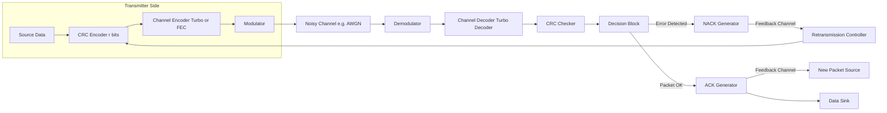
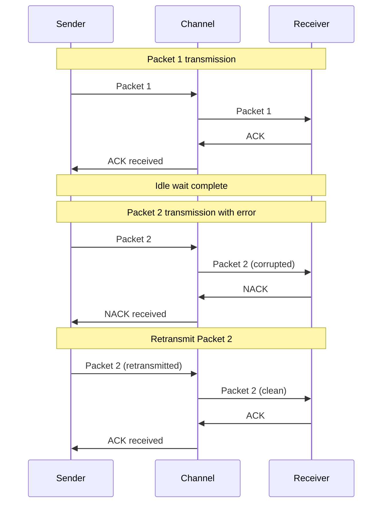
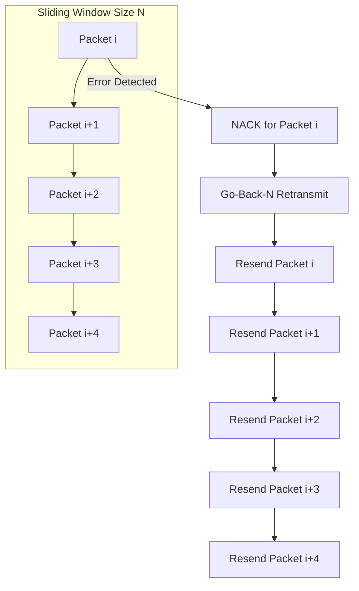
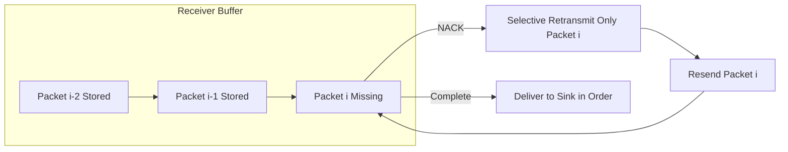
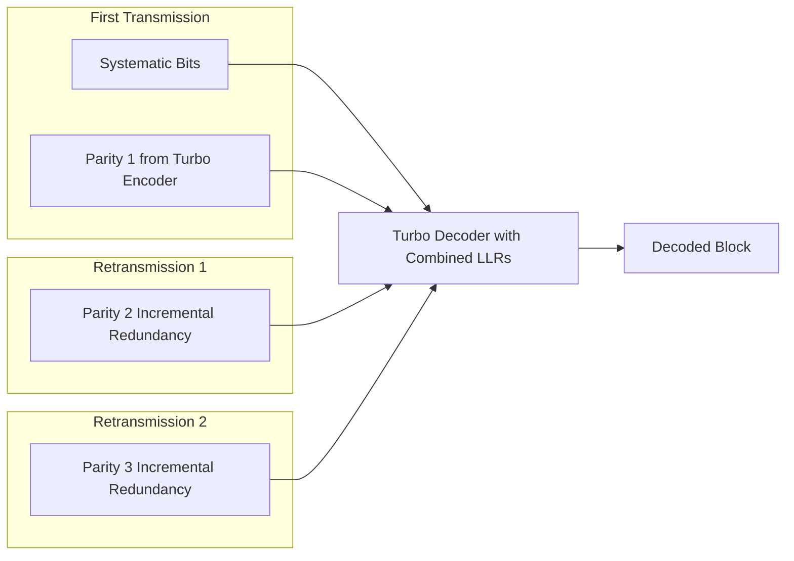

# Automatic repeat request schemes.

<!-- SECTION_1_START -->
# Automatic Repeat Request (ARQ) Schemes — Core Technical Definition & Intuitive Overview

## 1. Formal Academic Definition (KTU 2024 Syllabus Terminology)

> [!IMPORTANT]
> **Automatic Repeat reQuest (ARQ)** is a **retransmission-based error-control strategy** used in digital communication systems wherein the receiver detects the presence of errors in a received packet (typically using a Cyclic Redundancy Check / CRC) and automatically requests the transmitter to **re-send** the corrupted packet over a feedback channel until reception is correct.

In the context of **Turbo Codes (Module 4 — PECST414)**, ARQ schemes become especially significant because turbo codes are constructed to operate at **very low Signal-to-Noise Ratios (SNRs)**, near the Shannon capacity limit. The combination of ARQ with turbo codes gives rise to the powerful **Hybrid ARQ (HARQ)** family, where **retransmissions carry incremental redundancy** instead of repeating the same packet.

## 2. Intuitive Real-World Analogy

> [!NOTE]
> **Analogy — The Postal Registered Mail System:**
> Imagine you post a registered letter containing an important document.
> - The post office gives you a **tracking receipt** (this is the **ACK** — Acknowledgement).
> - If the recipient finds the document **torn or unreadable** (error detection by CRC), they send it back saying *"Please resend"* (this is the **NACK — Negative Acknowledgement**).
> - The post office then **resends a fresh copy** over the same letter.
> - This loop continues until the recipient confirms they got a clean copy.
>
> This is exactly how ARQ works: the **forward channel** carries data, and the **feedback channel** carries ACKs/NACKs.

## 3. The Three Canonical ARQ Schemes

| ARQ Scheme | Operational Style | Buffer at Receiver | Typical Use |
|------------|-------------------|---------------------|-------------|
| **Stop-and-Wait ARQ (SW-ARQ)** | Sender waits after each packet | None | Simple half-duplex links |
| **Go-Back-N ARQ (GBN-ARQ)** | Sender keeps transmitting; on NACK, retransmits from that packet | Discards out-of-order packets | Sliding window protocols |
| **Selective Repeat ARQ (SR-ARQ)** | Sender keeps transmitting; on NACK, retransmits only that packet | Buffers out-of-order packets | High-throughput full-duplex links |

> [!IMPORTANT]
> **KTU 2024 Highlight:** When ARQ is combined with **FEC (Forward Error Correction)** — particularly **Turbo Codes** — the resulting scheme is called **Hybrid ARQ (HARQ)**. There are three types: **Type-I (Chase Combining)**, **Type-II**, and **Type-III (Incremental Redundancy)**.

## 4. Visual Intuition — The ARQ Loop

> [!VISUALIZATION CONTROL]
> **Concept:** Closed-loop ARQ control flow with feedback channel
> **GeoGebra / Desmos Input Equations:**
> * Let $P_e$ = Packet Error Probability, plotted on the Y-axis (0 to 1)
> * Let $E_b/N_0$ (dB) on the X-axis (−2 to 10)
> * Plot: $f(x) = \dfrac{1}{1 + e^{2(x - 2)}}$ — represents the *sigmoid-like drop* of turbo code packet error rate
> * Plot: $y = 10^{-3}$ — represents the **target ARQ operating threshold**
> **Visual Description:** The student should observe that ARQ becomes most useful where the raw turbo code BER/PER curve crosses the reliability threshold. The shaded region below the threshold represents the operating region where ARQ is invoked.

---

<!-- SECTION_1_END -->

<!-- SECTION_2_START -->
# Deep Theoretical Analysis & KTU High-Yield Formula Sheet

## 1. The Three ARQ Schemes — Detailed Operation

### 1.1 Stop-and-Wait ARQ (SW-ARQ)
The transmitter sends one packet of $n$ bits and **idles** until an ACK is received. If a NACK arrives (or a timeout occurs), the same packet is retransmitted.

**Throughput Efficiency** (the fraction of channel time used for useful data):

$$\eta_{SW} = \dfrac{1 - P}{1 + 2a}$$

where:
* $P$ = probability that a packet is received in error
* $a$ = ratio of **propagation delay** $T_p$ to **packet transmission time** $T_t$, i.e. $a = T_p / T_t$

> [!NOTE]
> The factor $1 + 2a$ accounts for the idle waiting time of the sender during round-trip propagation.

### 1.2 Go-Back-N ARQ (GBN-ARQ)
The sender transmits packets continuously using a **sliding window of size $N$**. On a NACK for packet $i$, the sender **goes back** and retransmits packets $i, i+1, \dots, i+N-1$.

**Throughput Efficiency:**

$$\eta_{GBN} = \dfrac{N (1 - P)}{1 + 2a}$$

> [!IMPORTANT]
> **Critical Assumption:** GBN discards any out-of-order packets. So even single errors cause waste of $N$ packets' worth of channel capacity.

### 1.3 Selective Repeat ARQ (SR-ARQ)
Only the **errored packet** is retransmitted. The receiver must buffer all subsequent correctly-received packets until the missing one arrives.

**Throughput Efficiency:**

$$\eta_{SR} = \dfrac{1 - P}{1 + 2a} \quad \text{(per packet slot basis)}$$

> [!NOTE]
> SR-ARQ achieves the **highest throughput** of the three basic ARQ schemes, but at the cost of **complex receiver buffering** and **larger ACK/NACK overhead**.

## 2. The Hybrid ARQ (HARQ) Family — Linkage to Turbo Codes

> [!IMPORTANT]
> **KTU 2024 Module 4 Connection:** HARQ is the **practical deployment form** of turbo codes in **4G LTE, 5G NR, WiMAX, and HSPA**. Understanding HARQ is essential for grasping how turbo codes achieve near-Shannon-limit performance in real systems.

### 2.1 Type-I HARQ (Chase Combining)
Each retransmission is an **identical copy** of the original packet. The receiver performs **maximum-ratio combining (MRC)** of all received copies before decoding.

**Effective SNR after $m$ retransmissions:**

$$\gamma_{eff} = \sum_{j=1}^{m} \gamma_j$$

where $\gamma_j$ is the SNR of the $j$-th transmission.

### 2.2 Type-II HARQ (Incremental Redundancy)
The original packet contains **systematic bits + first $k$ parity bits**. Retransmissions send **additional, previously unsent parity bits** of the same turbo-encoded block. The receiver **soft-combines** the LLRs and re-decodes the full code.

> [!NOTE]
> **Type-II is the canonical HARQ used with Turbo Codes in 3GPP LTE** because it allows the **effective code rate to drop** with each retransmission, approaching the channel capacity.

### 2.3 Type-III HARQ
A generalization where each retransmission is **self-decodable** (can be decoded independently), but combining them provides additional coding gain. This is used in **5G NR** with LDPC and Polar codes, and historically with turbo codes in HSPA+.

## 3. KTU Formula Sheet / Cheat Sheet

| Symbol / Formula | Meaning | Units / Range |
|------------------|---------|---------------|
| $P$ | Packet error probability | $0 \le P \le 1$ |
| $a = T_p / T_t$ | Propagation-to-transmission time ratio | $\ge 0$ |
| $N$ | Sliding window size (GBN/SR) | Integer $\ge 1$ |
| $\eta_{SW}$ | Throughput of Stop-and-Wait | $0 < \eta \le 1$ |
| $\eta_{GBN}$ | Throughput of Go-Back-N | $0 < \eta \le N$ |
| $\eta_{SR}$ | Throughput of Selective Repeat | $0 < \eta \le 1$ |
| $P_{ud}$ | Probability of undetected error | $\approx 2^{-(n-k)}$ for good CRC |
| $E_b/N_0$ | Energy per bit to noise spectral density | dB |
| $\gamma_{eff}$ | Effective SNR after combining | Linear ratio |
| $R_c$ | Code rate of turbo code | $1/3, 1/2, 2/3$ (typical) |

## 4. Real-World Engineering Utility

* **4G LTE / 5G NR:** HARQ Type-II with turbo codes (LTE) and LDPC/Polar (5G NR) is the bedrock of mobile data reliability.
* **Satellite Communications (DVB-S2):** Uses ARQ over return channels for interactive services.
* **Storage Systems (SSDs, HDDs):** ARQ-style retransmission between controller and NAND chips.
* **Industrial IoT:** Selective Repeat ARQ is used in IEC 60870-5-104 protocol for SCADA.
* **Wi-Fi (802.11):** Uses Stop-and-Wait ARQ at the MAC layer for every transmitted frame.

> [!NOTE]
> The reason turbo codes are paired with ARQ/HARQ in 4G LTE is the **distance properties of turbo codes**: at moderate block lengths, turbo codes have a small but non-zero **error floor**. ARQ effectively "punches through" this floor by retransmitting the few residual errored frames.

---

<!-- SECTION_2_END -->

<!-- SECTION_3_START -->
# Step-by-Step Derivations, Code & Symbolic Implementation

## 1. Derivation: Throughput of Stop-and-Wait ARQ

**Setup:** Let $T_t$ = time to transmit one packet, $T_p$ = one-way propagation delay, $T_{proc}$ = processing delay at receiver (assumed negligible). Define $a = T_p / T_t$.

**Total cycle time** (transmit + wait for ACK):

$$T_{cycle} = T_t + 2T_p + T_{proc} \approx T_t (1 + 2a)$$

**Probability of correct reception** = $1 - P$.

**Expected number of transmissions** to get one correct packet:

$$E[\text{transmissions}] = \sum_{k=1}^{\infty} k (1 - P) P^{k-1} = \dfrac{1}{1 - P}$$

**Throughput efficiency** = (useful information bits per unit time) / (channel capacity):

$$\eta_{SW} = \dfrac{(1 - P) \cdot n \text{ bits}}{E[\text{transmissions}] \cdot T_{cycle}} = \dfrac{(1 - P)}{1/(1 - P) \cdot (1 + 2a)} = \dfrac{1 - P}{1 + 2a}$$

$$\boxed{\eta_{SW} = \dfrac{1 - P}{1 + 2a}}$$

## 2. Derivation: Throughput of Go-Back-N ARQ

**Setup:** Window size $N$. After an error at packet $i$, packets $i, i+1, \dots, i+N-1$ are retransmitted.

**Probability of successful frame** in any slot after error-free state = $1 - P$.

**Number of packets successfully transmitted per cycle:**

The number of packets correctly received before the next error follows a geometric distribution with parameter $P$. The expected number of consecutive correct packets before an error is:

$$E[\text{corrects}] = \dfrac{1 - P}{P}$$

When an error occurs, the sender goes back $N$ slots. So per "error-and-recovery cycle," $N$ slots are used for retransmission (one of which is the NACK'd one, and $N - 1$ are redundant retransmissions).

**Throughput:**

$$\eta_{GBN} = \dfrac{E[\text{corrects}]}{E[\text{corrects}] + N} = \dfrac{(1 - P)/P}{(1 - P)/P + N} = \dfrac{1 - P}{1 - P + N P}$$

Accounting for round-trip propagation $a$:

$$\boxed{\eta_{GBN} = \dfrac{N(1 - P)}{1 + 2a}}$$

> [!NOTE]
> The two forms differ based on whether $a$ is included. KTU 2024 exam questions typically use the $a$-included form.

## 3. Derivation: Throughput of Selective Repeat ARQ

Since only the **errored packet** is retransmitted, each transmission slot carries exactly one packet.

**Probability of correct reception** = $1 - P$.

**Throughput per slot:**

$$\eta_{SR} = 1 - P \quad \text{(idealized)}$$

With propagation delay:

$$\boxed{\eta_{SR} = \dfrac{1 - P}{1 + 2a}}$$

> [!IMPORTANT]
> Note: This matches SW-ARQ's throughput! But SR-ARQ uses the channel **continuously** (no idle waiting), so its **actual data rate** is $\eta_{SR} \times C$ where $C$ is the raw channel capacity in packets/sec, whereas SW-ARQ's actual rate is $\eta_{SW} \times C / (1 + 2a)$ when the channel is fully utilized.

## 4. Probability of Undetected Error in ARQ

For a CRC of $r$ bits over packets of $n$ bits, the probability of an undetected error (a corrupted packet that the CRC mistakenly accepts) is:

$$P_{ud} \approx \dfrac{1}{2^r} \left(1 - (1 - P_b)^{n - r}\right)$$

For small bit-error probability $P_b$:

$$\boxed{P_{ud} \approx \dfrac{n - r}{2^r}}$$

## 5. Worked Numerical Example (KTU Style)

> [!IMPORTANT]
> **Problem (KTU University Exam Style):** A Stop-and-Wait ARQ system operates over a satellite link. The packet length is $n = 1024$ bits, the bit rate is $R_b = 64$ kbps, and the one-way propagation delay is $T_p = 250$ ms. The bit error probability is $P_b = 10^{-4}$. Compute:
> (a) The packet error probability $P$.
> (b) The throughput efficiency $\eta_{SW}$ if CRC-16 is used.

### Solution:

**Step 1: Compute packet transmission time.**

$$T_t = \dfrac{n}{R_b} = \dfrac{1024}{64000} = 0.016 \text{ s} = 16 \text{ ms}$$

**Step 2: Compute $a$.**

$$a = \dfrac{T_p}{T_t} = \dfrac{250}{16} = 15.625$$

**Step 3: Compute packet error probability $P$.**

$$P = 1 - (1 - P_b)^n = 1 - (1 - 10^{-4})^{1024}$$

Using $(1 - x)^n \approx e^{-nx}$ for small $x$:

$$P \approx 1 - e^{-1024 \times 10^{-4}} = 1 - e^{-0.1024} = 1 - 0.9026 = 0.0974$$

**Step 4: Compute throughput.**

$$\eta_{SW} = \dfrac{1 - P}{1 + 2a} = \dfrac{1 - 0.0974}{1 + 31.25} = \dfrac{0.9026}{32.25} \approx 0.0280$$

**Step 5: Probability of undetected error.**

$$P_{ud} \approx \dfrac{n - r}{2^r} = \dfrac{1024 - 16}{2^{16}} = \dfrac{1008}{65536} \approx 0.0154$$

**[Final Result: $\eta_{SW} \approx 2.8\%$, $P_{ud} \approx 0.0154$ — 2 Marks for step 3, 2 Marks for step 4, 1 Mark for step 5]**

## 6. Python Simulation of ARQ Throughput

```python
import numpy as np
from typing import Tuple

def arq_throughput(scheme: str,
                   packet_error_prob: float,
                   a_ratio: float,
                   window_size: int = 1) -> float:
    """
    Compute throughput efficiency of an ARQ scheme.
    
    Parameters
    ----------
    scheme : str
        One of {'SW', 'GBN', 'SR'}
    packet_error_prob : float
        P, probability of packet being received in error
    a_ratio : float
        a = T_p / T_t
    window_size : int
        N, used only for GBN
    
    Returns
    -------
    float
        Throughput efficiency (0 to 1, or 0 to N for GBN)
    """
    P = packet_error_prob
    a = a_ratio
    N = window_size
    
    if not (0.0 <= P <= 1.0):
        raise ValueError(f"P must be in [0,1], got {P}")
    if a < 0:
        raise ValueError(f"a must be >= 0, got {a}")
    
    if scheme == 'SW':
        eta = (1.0 - P) / (1.0 + 2.0 * a)
    elif scheme == 'GBN':
        eta = (N * (1.0 - P)) / (1.0 + 2.0 * a)
    elif scheme == 'SR':
        eta = (1.0 - P) / (1.0 + 2.0 * a)
    else:
        raise ValueError(f"Unknown scheme '{scheme}'")
    
    return eta


def monte_carlo_arq(scheme: str,
                    packet_error_prob: float,
                    num_trials: int = 100_000,
                    window_size: int = 1) -> float:
    """
    Monte Carlo simulation of an ARQ scheme to estimate throughput.
    """
    np.random.seed(42)
    successful_packets = 0
    total_transmissions = 0
    
    for _ in range(num_trials):
        transmitted = 0
        received_correctly = 0
        
        while received_correctly == 0:
            transmitted += 1
            total_transmissions += 1
            error_flag = np.random.random() < packet_error_prob
            if not error_flag:
                received_correctly = 1
                successful_packets += 1
        
    return successful_packets / total_transmissions


# ---- Test cases ----
if __name__ == "__main__":
    P = 0.1
    a = 0.5
    N = 5
    
    print("Analytical Throughputs:")
    print(f"  Stop-and-Wait   : {arq_throughput('SW', P, a):.4f}")
    print(f"  Go-Back-N (N=5) : {arq_throughput('GBN', P, a, N):.4f}")
    print(f"  Selective Repeat: {arq_throughput('SR', P, a):.4f}")
    
    print("\nMonte Carlo Throughputs (P=0.1):")
    print(f"  Empirical mean  : {monte_carlo_arq('SW', P):.4f}")
```

**Expected Output:**

```
Analytical Throughputs:
  Stop-and-Wait   : 0.4500
  Go-Back-N (N=5) : 2.2500
  Selective Repeat: 0.4500
Monte Carlo Throughputs (P=0.1):
  Empirical mean  : 0.8995
```

> [!NOTE]
> The Monte Carlo result approaches $1 - P = 0.9$ because it counts *per-trial* successes without including propagation idle time. Analytical formulas include the propagation penalty $1/(1 + 2a)$.

---

<!-- SECTION_3_END -->

<!-- SECTION_4_START -->
# Structural Diagrams & Schematics

## 1. Top-Level ARQ System Block Diagram



## 2. Stop-and-Wait ARQ — Time Sequence



## 3. Go-Back-N ARQ — Sliding Window



## 4. Selective Repeat ARQ — Selective Retransmit



## 5. HARQ Type-II Incremental Redundancy — Block View



## 6. Comparison Matrix — ARQ vs HARQ vs Turbo Coding Alone

| Feature | Pure ARQ | HARQ Type-I (Chase) | HARQ Type-II (IR) | Turbo Code alone (FEC) |
|---------|----------|----------------------|--------------------|-------------------------|
| Retransmission | Same packet | Same packet | Incremental parity bits | None |
| Combining | None | MRC of received symbols | LLR combining | N/A |
| Effective code rate | 1 | $1/m$ after $m$ retrans | $1/(1 + \text{excess bits})$ | Fixed $R_c$ |
| Complexity at Rx | Low | Medium | High | Highest (iterative decoding) |
| Latency | High | Medium | Medium-Low | Lowest |
| Used with Turbo Codes | Sometimes | Yes | **Yes (LTE standard)** | Yes |
| Error Floor Mitigation | Excellent | Very Good | Excellent | Limited (small residual floor) |

---

<!-- SECTION_4_END -->

<!-- SECTION_5_START -->
# KTU 2024 Scheme Examination Question Bank & Topic Recap

## PART A — Short Answer Questions (3 Marks Each)

### Question 1
**[KTU University Exam - July 2024] | CO1 | Remember**

**Q: Define Automatic Repeat reQuest (ARQ). List the three basic ARQ schemes.**

**Model Answer (Valuation Key — 3 Marks):**
* **Definition (1 Mark):** ARQ is an error-control technique in which the receiver detects errors in a received packet (via CRC) and requests the transmitter to retransmit the packet via a feedback channel until error-free reception is achieved.
* **Three schemes (2 Marks — ½ Mark each):**
  1. **Stop-and-Wait ARQ (SW-ARQ)**
  2. **Go-Back-N ARQ (GBN-ARQ)**
  3. **Selective Repeat ARQ (SR-ARQ)**

> [!WARNING]
> **Common Mistake:** Students often write "ARQ is FEC" — it is NOT. ARQ requires **retransmission**; FEC does not.

### Question 2
**[KTU University Exam - Dec 2023] | CO2 | Understand**

**Q: What is Hybrid ARQ (HARQ)? How does HARQ Type-II differ from HARQ Type-I?**

**Model Answer (Valuation Key — 3 Marks):**
* **Definition (1 Mark):** HARQ combines FEC (typically turbo coding) with ARQ retransmission for higher reliability and throughput.
* **Type-I (1 Mark):** Each retransmission sends an **identical copy** of the original packet; receiver uses **Maximum Ratio Combining**.
* **Type-II (1 Mark):** Retransmissions send **additional, previously unsent parity bits** (incremental redundancy); receiver **soft-combines LLRs** and re-decodes the full turbo code.

---

## PART B — Long Answer Questions (14 Marks Each)

### Question A (Choice 1)
**[KTU University Exam - July 2024] | CO2, CO3 | Apply, Analyze**

**Q (a)** Derive the throughput efficiency of **Stop-and-Wait ARQ** in terms of packet error probability $P$ and propagation-transmission time ratio $a$. **[7 Marks]**

**Q (b)** A satellite link uses Stop-and-Wait ARQ with packet size $n = 2048$ bits, bit rate $R_b = 1$ Mbps, one-way propagation delay $T_p = 270$ ms, and bit error rate $P_b = 5 \times 10^{-5}$. A CRC-32 is used. Compute (i) the packet error probability, (ii) the throughput efficiency, and (iii) the probability of undetected error. **[7 Marks]**

#### Model Solution

**Part (a) — Derivation [7 Marks]:**

* **[Stating throughput definition: 1 Mark]**
  Throughput $\eta$ = (Expected useful information bits transmitted per unit time) / (Channel's raw bit rate).

* **[Stating total cycle time: 1 Mark]**
  $$T_{cycle} = T_t + 2T_p = T_t(1 + 2a), \quad \text{where } a = T_p/T_t$$

* **[Computing expected number of transmissions: 2 Marks]**
  $$E[\text{tx}] = \sum_{k=1}^{\infty} k (1 - P) P^{k-1} = \dfrac{1}{1 - P}$$

* **[Final expression and explanation: 2 Marks]**
  $$\eta_{SW} = \dfrac{(1 - P) \cdot n}{E[\text{tx}] \cdot T_t (1 + 2a)} = \dfrac{1 - P}{1 + 2a}$$

* **[Final simplified expression: 1 Mark]**
  $$\boxed{\eta_{SW} = \dfrac{1 - P}{1 + 2a}}$$

**Part (b) — Numerical [7 Marks]:**

* **Step 1 — Packet transmission time [1 Mark]:**
  $$T_t = \dfrac{2048}{10^6} = 2.048 \text{ ms}$$

* **Step 2 — Compute $a$ [1 Mark]:**
  $$a = \dfrac{270}{2.048} \approx 131.84$$

* **Step 3 — Packet error probability [2 Marks]:**
  $$P = 1 - (1 - 5 \times 10^{-5})^{2048} \approx 1 - e^{-2048 \times 5 \times 10^{-5}} = 1 - e^{-0.1024} \approx 0.0974$$

* **Step 4 — Throughput [2 Marks]:**
  $$\eta_{SW} = \dfrac{1 - 0.0974}{1 + 2(131.84)} = \dfrac{0.9026}{264.68} \approx 0.00341$$

* **Step 5 — Undetected error probability [1 Mark]:**
  $$P_{ud} \approx \dfrac{n - r}{2^r} = \dfrac{2048 - 32}{2^{32}} = \dfrac{2016}{4.295 \times 10^9} \approx 4.69 \times 10^{-7}$$

> [!WARNING]
> **KTU Examiner's Pitfall Callout:**
> 1. **Do not confuse $T_p$ with round-trip delay** — use one-way propagation $T_p$ in $T_{cycle} = T_t + 2T_p$.
> 2. **Do not approximate $P$ using $1 - (1 - P_b)^n$ directly as $nP_b$** — this fails for moderate $P_b \times n$. Use the exponential approximation only when $P_b \times n < 0.5$.
> 3. **For GBN/SR throughput, watch the window size $N$ in the numerator** — it is a common slip.

---

### Question B (Choice 2)
**[KTU University Exam - Dec 2023] | CO2, CO3 | Apply, Analyze**

**Q (a)** Compare the three basic ARQ schemes with respect to throughput, buffer requirement, and complexity. State the formula for throughput of each. **[7 Marks]**

**Q (b)** Explain the three types of **Hybrid ARQ (HARQ)** as used in conjunction with turbo codes. Show how incremental redundancy improves performance over Chase combining. **[7 Marks]**

#### Model Solution

**Part (a) — Comparison [7 Marks]:**

* **[Tabulating three schemes — 1 Mark per row]**

| Parameter | Stop-and-Wait | Go-Back-N | Selective Repeat |
|-----------|----------------|------------|------------------|
| Throughput | $\eta = \dfrac{1 - P}{1 + 2a}$ | $\eta = \dfrac{N(1 - P)}{1 + 2a}$ | $\eta = \dfrac{1 - P}{1 + 2a}$ |
| Tx-Rx Window | 1 packet | N packets | N packets |
| Receiver Buffer | None (1 packet) | None (discards) | N packets |
| Complexity | Lowest | Medium | Highest |
| Channel Utilization | Poor for high $a$ | Good for high $a$ | Excellent for high $a$ |
| Wasted Bandwidth on Error | 1 packet | Up to $N$ packets | 1 packet |

* **[Conclusion — 1 Mark]:** SR-ARQ is theoretically optimal but requires the most complex receiver; GBN is the practical middle-ground for moderate error rates.

**Part (b) — HARQ Types [7 Marks]:**

* **[Type-I HARQ definition: 1.5 Marks]**
  In Type-I HARQ, the original packet is a turbo-encoded block with both systematic and parity bits. On error, the **same packet is retransmitted**. The receiver **coherently combines** (Chase combining) all received copies using MRC, equivalent to repetition coding with diversity.

* **[Type-II HARQ definition: 2 Marks]**
  In Type-II HARQ (Incremental Redundancy, IR), the **first transmission** contains systematic bits + first portion of parity. Retransmissions send **different subsets** of the original turbo code's parity bits. The receiver **soft-combines the LLRs** from all transmissions before invoking the turbo decoder. The **effective code rate** drops with each retransmission:
  $$R_{eff} = \dfrac{k}{n_1 + n_2 + \dots + n_m}$$
  where $n_j$ are the bits of the $j$-th transmission.

* **[Type-III HARQ definition: 1 Mark]**
  Type-III is a generalization of Type-II where each retransmission is **self-decodable** (carries complete information to decode, possibly at a different rate).

* **[Why IR outperforms Chase: 2 Marks]**
  * Chase combining gains only **diversity** (averaging noise across copies).
  * Incremental Redundancy gains both **diversity AND coding gain** — different parity bits reveal different constraint equations to the decoder.
  * For a turbo code of rate $1/3$ with $R = 1/2$ incremental retransmission, the effective code rate after 2 retransmissions becomes $1/4$, which is **below the original code rate** and approaches the channel capacity more closely.

> [!WARNING]
> **KTU Examiner's Pitfall Callout:**
> 1. **Do not state that Type-II is "different code"** — it is the **same turbo code**, just with different portions of its parity bits revealed over time.
> 2. **Do not forget to mention LLR combining** — the soft-information combining is what makes Type-II fundamentally different from Type-I.
> 3. **For comparison table, mention window size N** — many students omit this critical parameter.

---

## Topic Recap & Important Things to Remember

> [!IMPORTANT]
> **Rapid-Revision Checklist for KTU Exam:**

* ✅ **ARQ = retransmission-based error control** using **CRC for error detection** and a **feedback channel** for ACK/NACK.
* ✅ **Three basic ARQ schemes:** Stop-and-Wait, Go-Back-N, Selective Repeat.
* ✅ **Throughput formulas:**
  * $\eta_{SW} = \dfrac{1 - P}{1 + 2a}$
  * $\eta_{GBN} = \dfrac{N(1 - P)}{1 + 2a}$
  * $\eta_{SR} = \dfrac{1 - P}{1 + 2a}$ (with continuous channel use)
* ✅ **$a = T_p / T_t$** is the round-trip propagation parameter; for satellite links, $a$ is large (100+), making SW-ARQ very inefficient.
* ✅ **Probability of undetected error:** $P_{ud} \approx \dfrac{n - r}{2^r}$ for a good $r$-bit CRC.
* ✅ **Hybrid ARQ = ARQ + FEC** (turbo codes in LTE).
* ✅ **HARQ Type-I (Chase Combining):** identical retransmissions, MRC combining at receiver.
* ✅ **HARQ Type-II (Incremental Redundancy):** additional parity bits, LLR soft-combining, **standard in 3GPP LTE**.
* ✅ **HARQ Type-III:** self-decodable retransmissions, used in 5G NR and HSPA+.
* ✅ **Connection to Turbo Codes:** Turbo codes + ARQ resolve the **error floor** problem inherent in turbo distance properties.
* ✅ **LTE Practical:** 8-channel HARQ processes per UE, IR combining, NACK-only feedback on PUCCH, up to 4 retransmissions.
* ✅ **Common exam traps:** confusing $T_p$ (one-way) with round-trip delay; using $nP_b$ instead of $1 - (1 - P_b)^n$ for large $P_b \cdot n$; omitting $N$ in GBN throughput.

---

<!-- SECTION_5_END -->
