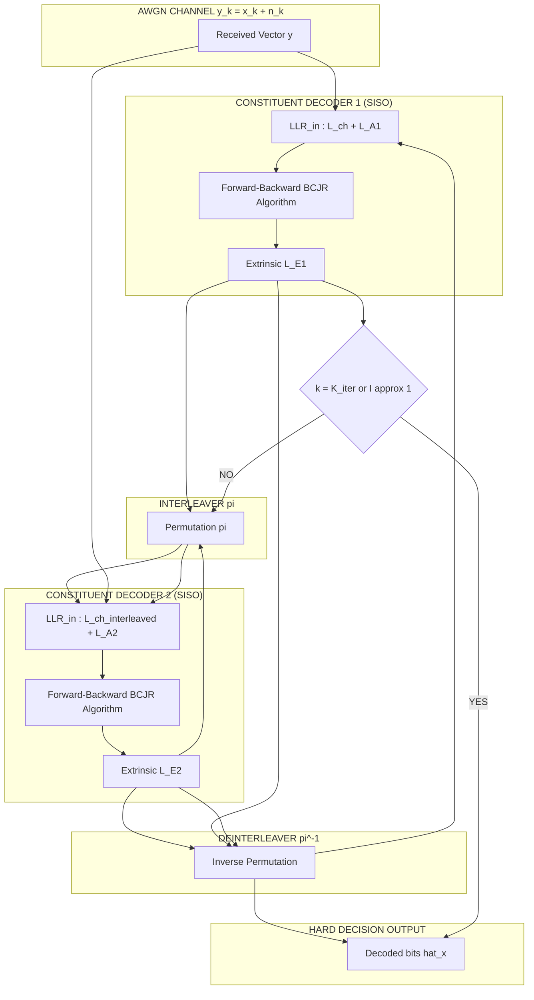
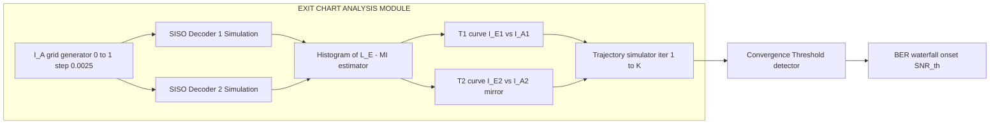
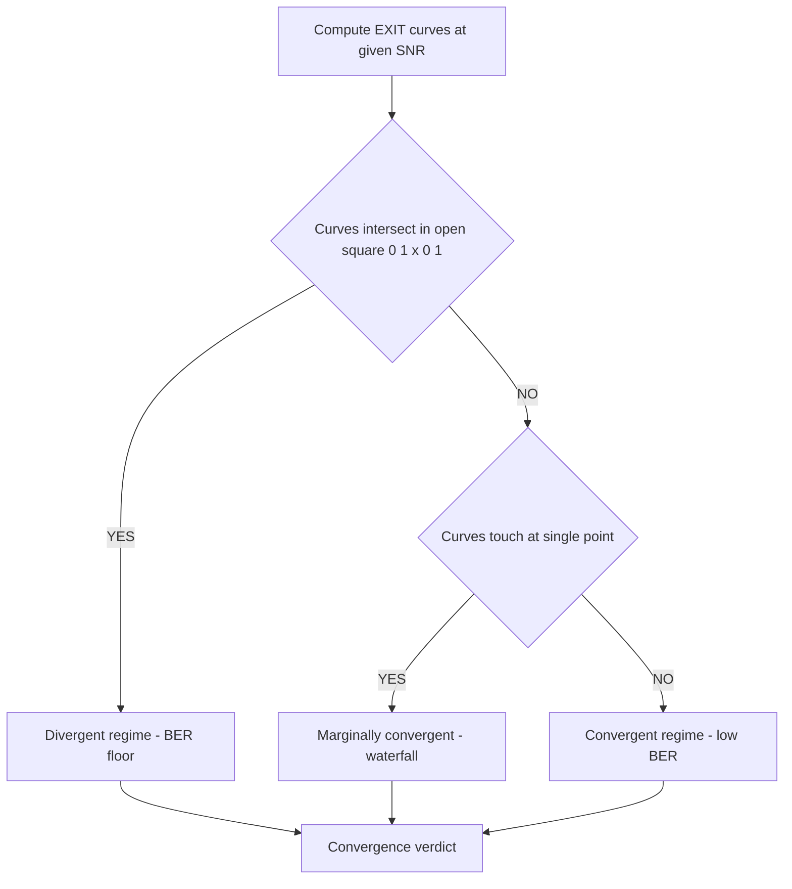
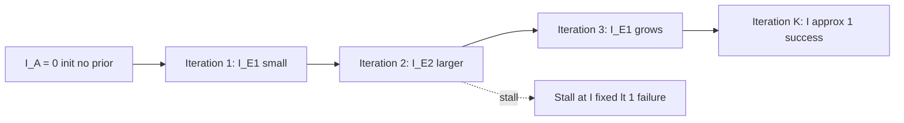

# Convergence of turbo codes.

<!-- SECTION_1_START -->
# Convergence of Turbo Codes

## 1.1 Formal Academic Definition (KTU 2024 Syllabus Terminology)

**Convergence of turbo codes** refers to the iterative behavior of the *a posteriori* probability (APP) decoder in which the bit-error-rate (BER) / frame-error-rate (FER) performance of a turbo code monotonically improves as the number of *iterations* between the two constituent soft-input soft-output (SISO) decoders increases, asymptotically approaching a **convergence threshold** below which the bit error probability is driven to arbitrarily small values.

> [!IMPORTANT]
> **KTU 2024 Module Focus:** Convergence is studied primarily through the *Extrinsic Information Transfer (EXIT) chart* method, introduced by **Stephan ten Brink (1999)**. The EXIT chart graphically visualizes the **mutual information (MI)** exchange between the two component decoders and predicts the **iterative decoding threshold** (also called the *convergence threshold* or *pinch-off SNR*).

Mathematically, convergence is characterized by the mutual information sequence
$$
I_{E,1}^{(k)} \;=\; T_{1}\!\left(I_{A,1}^{(k)}, \frac{E_b}{N_0}\right)
\quad \text{and} \quad
I_{E,2}^{(k)} \;=\; T_{2}\!\left(I_{A,2}^{(k)}, \frac{E_b}{N_0}\right)
$$
where $I_{A,j}^{(k)}$ is the *a priori* MI fed into decoder $j$ at iteration $k$, $I_{E,j}^{(k)}$ is the *extrinsic* MI produced, and $T_j(\cdot)$ is the **EXIT transfer characteristic** of decoder $j$.

---

## 1.2 Conceptual Analogy / Engineering Intuition

Imagine two expert doctors diagnosing a patient:

1. **Dr. A** looks at the medical report and gives an opinion (extrinsic information).
2. **Dr. B** receives Dr. A's opinion, combines it with the report, and gives a refined opinion back.
3. They keep passing refined notes back and forth.

Each "round" of note-passing (iteration) sharpens their collective diagnosis. **Convergence** is the phenomenon where, after a few rounds, the doctors' opinions stop changing meaningfully — they have **converged** to a stable, highly accurate diagnosis. The EXIT chart is essentially a graphical "thermometer" that measures *how much new insight* (mutual information) each doctor contributes in every round.

> [!NOTE]
> **Key Engineering Insight:** A *good* turbo code is one whose two component EXIT curves are **just touching** at a low SNR — they never intersect. The closer they get without crossing, the lower the **convergence threshold**, and the closer the system operates to the **Shannon capacity limit ($\approx 0.5$ bits/s/Hz per binary AWGN use, i.e., $E_b/N_0 \ge 0.187$ dB)**.

---

## 1.3 Physical Constants & Standard Metrics

| Metric | Symbol | Standard Value / Unit | Physical Meaning |
|---|---|---|---|
| Shannon Limit (rate $1/2$) | $\left(\frac{E_b}{N_0}\right)_{\min}$ | $\textbf{0.187 dB}$ | Theoretic lower bound on reliable binary transmission |
| Convergence threshold | $\left(\frac{E_b}{N_0}\right)_{\text{th}}$ | $\sim 0.7$ dB (classic turbo) | SNR below which iterative decoding fails to converge |
| Mutual Information | $I_A$, $I_E$ | $[0, 1]$ | Normalized information content (1 = perfect knowledge) |
| Number of iterations | $K$ | typically $5$–$18$ | Practical decoding complexity driver |

> [!VISUALIZATION CONTROL]
> **Concept:** Two-dimensional EXIT chart with $I_{A,1}$ on the x-axis and $I_{E,1}, I_{E,2}$ on the y-axis.
> **GeoGebra / Desmos Input Equations:**
> * $f(x) = 0.25 \cdot \arctanh(\sqrt{x}) + 0.5 \cdot x^2$  *(sample decoder 1 EXIT curve)*
> * $g(x) = 0.85 \cdot x^3 + 0.05$  *(sample decoder 2 EXIT curve, mirrored)*
> **Visual Description:** Two stair-case-like curves climbing from $(0,0)$ toward $(1,1)$, with decoder 2's curve plotted as $I_{E,2}$ vs $I_{A,2}$. A **trajectory line** zig-zags between them showing the iteration path. If the curves never cross, the trajectory tunnels through to $I=1$ (convergence). If they cross, the trajectory stalls (divergence).

---

<!-- SECTION_1_END -->

<!-- SECTION_2_START -->
# 2. Deep Theoretical Analysis & KTU High-Yield Formula Sheet

## 2.1 The EXIT Chart — A Tool to Predict Convergence

The **Extrinsic Information Transfer (EXIT) chart** is the canonical analytical tool for predicting whether — and how fast — a turbo code will converge for a given channel SNR. The two key ideas are:

1. **Transfer characteristics of component decoders:** For each constituent decoder, we plot the *extrinsic* mutual information $I_E$ (output) against the *a priori* mutual information $I_A$ (input), parameterized by $\frac{E_b}{N_0}$.
2. **Iterative decoding trajectory:** The extrinsic MI of decoder 1 becomes the *a priori* MI of decoder 2 (after the interleaver), and vice versa. Plotting both characteristics on the same chart with the x-axis of one matching the y-axis of the other produces a **zig-zag trajectory** that visualizes convergence.

### 2.1.1 Mutual Information Computation

For a binary random variable $X \in \{-1, +1\}$ and a continuous observation $Y$ (e.g., LLR value), the mutual information $I(X;Y)$ is computed using the conditional PDF of the LLR:

$$
I(X;Y) \;=\; \frac{1}{2} \sum_{x \in \{-1,+1\}} \int_{-\infty}^{+\infty} p(y \mid X=x) \log_{2} \!\left(\frac{2\,p(y \mid X=x)}{p(y \mid X=-1) + p(y \mid X=+1)}\right) dy
$$

In turbo code literature, $I_A$ and $I_E$ are estimated empirically via **histogram-based** binning of the LLR values at the input and output of each SISO decoder:

$$
\hat{I}_E \;=\; 1 + \frac{1}{N} \sum_{n=1}^{N} \log_{2}\!\left(\frac{e^{L_E(n)}}{1 + e^{L_E(n)}}\right)
$$

where $L_E(n)$ is the **extrinsic LLR** of the $n$-th bit.

> [!IMPORTANT]
> **KTU High-Yield Note:** The "area property" of EXIT charts states that the **area under the decoder-1 EXIT curve** equals the **area above the (mirrored) decoder-2 EXIT curve** at the *convergence threshold*. This conservation law links the EXIT analysis to **capacity-approaching code design**.

### 2.1.2 The Area Property (Ten Brink's Theorem)

For a symmetric rate-$1/2$ turbo code operating on an AWGN channel, at the convergence threshold $\left(\frac{E_b}{N_0}\right)_{\text{th}}$:

$$
\int_{0}^{1} I_{E,1}(I_A) \, dI_A \;=\; \int_{0}^{1} I_{E,2}(I_A) \, dI_A \;=\; C\!\left(\frac{E_b}{N_0}\right)
$$

where $C(\cdot)$ is the binary-input AWGN channel capacity. This is why EXIT charts are so powerful — they directly relate the geometry of the code to the **Shannon capacity limit**.

---

## 2.2 Convergence Behavior — Three Regimes

| Regime | SNR Range | Behavior | Decoder Trajectory |
|---|---|---|---|
| **Convergent** | $\left(\frac{E_b}{N_0}\right) > \left(\frac{E_b}{N_0}\right)_{\text{th}}$ | EXIT curves do not cross; trajectory tunnels to $I \to 1$ | Monotonic increase, eventually saturates |
| **Marginally convergent** | $\frac{E_b}{N_0} \approx \left(\frac{E_b}{N_0}\right)_{\text{th}}$ | EXIT curves just touch; slow convergence | Long staircase, many iterations needed |
| **Divergent** | $\frac{E_b}{N_0} < \left(\frac{E_b}{N_0}\right)_{\text{th}}$ | EXIT curves cross; trajectory stalls | Stuck at a fixed point $I^{\*} < 1$ (error floor) |

---

## 2.3 KTU Formula Sheet / Cheat Sheet

> [!NOTE]
> **Use $\vert$ or $\mid$ (NOT bare $\vert$ pipe) inside table cells to prevent markdown breakage.**

| # | Formula / Concept | Mathematical Form | Engineering Use |
|---|---|---|---|
| 1 | Mutual Information (binary) | $I(X;Y) = 1 - H(p_e)$ | Quantifies decoder confidence |
| 2 | EXIT transfer fn (dec 1) | $I_{E,1} = T_1(I_{A,1}, E_b/N_0)$ | Component decoder 1 characteristic |
| 3 | EXIT transfer fn (dec 2) | $I_{E,2} = T_2(I_{A,2}, E_b/N_0)$ | Component decoder 2 characteristic |
| 4 | Trajectory recursion | $I_{A,2}^{(k)} = I_{E,1}^{(k-1)}$ | Iteration link via interleaver |
| 5 | Symmetric property | $I_{A,1}^{(k)} = I_{E,2}^{(k-1)}$ | Returns from decoder 2 |
| 6 | Convergence condition | $T_1(I_A) \le T_2^{-1}(I_A) \;\;\forall I_A \in [0,1]$ | Curves must not cross |
| 7 | Capacity (BIAWGN, R=1/2) | $C = \frac{1}{2}\log_2(1 + \text{SNR})$ | Shannon limit reference |
| 8 | Shannon limit (R=1/2) | $(E_b/N_0)_{\min} = 0.187$ dB | Theoretic bound for binary coding |
| 9 | Bit error rate (post-iter) | $P_b \approx \frac{1}{2} \text{erfc}\!\left(\sqrt{\text{SNR}_{\text{eff}}}\right)$ | Asymptotic performance |
| 10 | Effective SNR (EXIT) | $\text{SNR}_{\text{eff}} = \text{SNR}_{\text{ch}} + \text{SNR}_{a}$ | Adds prior SNR to channel SNR |

---

## 2.4 Real-World Engineering Utility

Convergence analysis of turbo codes drives design decisions in:

* **4G LTE / 5G NR:** Turbo codes (LTE) and LDPC (5G NR) — both rely on EXIT-chart-based threshold optimization.
* **Deep-space communication (CCSDS):** Consultative Committee for Space Data Systems turbo codes use EXIT charts to verify near-Shannon-limit performance.
* **Digital video broadcasting (DVB):** DVB-RCS and DVB-S2 turbo code design validated via EXIT analysis.
* **Magnetic / optical storage:** Iterative decoding convergence in high-density recording channels.
* **AI / ML analog:** EXIT charts inspired the *information bottleneck* method in deep learning — same idea of measuring mutual information between layers.

> [!IMPORTANT]
> **Why this matters in production:** A poorly designed turbo code can have EXIT curves that cross at high SNR, causing a high *error floor* (BER plateau at high SNR). EXIT-based design prevents this by ensuring curves "nest" without crossing.

---

<!-- SECTION_2_END -->

<!-- SECTION_3_START -->
# 3. Step-by-Step Derivations & Symbolic Implementation

## 3.1 Derivation: From LLR to Mutual Information (EXIT Computation)

### 3.1.1 LLR Distribution Assumption

In iterative decoding, the extrinsic LLR $L_E$ produced by a SISO decoder is modeled as a Gaussian random variable conditioned on the transmitted bit $X \in \{-1, +1\}$:

$$
L_E \mid X = x \;\;\sim\;\; \mathcal{N}\!\left(\mu_{L_E} \cdot x,\; \sigma_{L_E}^{2}\right)
$$

with the **consistency condition** $\mu_{L_E} = \sigma_{L_E}^{2}/2$ (ensures correct symmetry).

The mutual information $I(X; L_E)$ is then:

$$
I_A \;=\; J(\sigma_{L_E}) \;=\; 1 - \int_{-\infty}^{+\infty} \frac{e^{-(z - \sigma_{L_E}^{2}/2)^2 / (2\sigma_{L_E}^{2})}}{\sqrt{2\pi}\,\sigma_{L_E}} \cdot \log_2\!\left(1 + e^{-z}\right) dz
$$

This is the celebrated **$J(\cdot)$ function** of ten Brink.

### 3.1.2 The $J(\sigma)$ Function (Closed-Form Approximation)

A high-accuracy closed-form approximation (used universally in KTU-level problems):

$$
J(\sigma) \;=\; \begin{cases}
a_{1} \cdot \sigma^{2} + b_{1} \cdot \sigma + c_{1}, & 0 \le \sigma \le 1.6363 \\[4pt]
1 - \exp\!\left(a_{2} \cdot \sigma^{2} + b_{2} \cdot \sigma + c_{2}\right), & 1.6363 < \sigma < 4.7 \\[4pt]
1, & \sigma \ge 4.7
\end{cases}
$$

Coefficients (commonly cited in KTU/standard texts):

$$
\begin{aligned}
a_{1} &= -0.0421061, \quad b_{1} = 0.209252, \quad c_{1} = -0.00640081 \\
a_{2} &= 0.00181491, \quad b_{2} = -0.142675, \quad c_{2} = -0.0826014
\end{aligned}
$$

---

## 3.2 Step-by-Step Convergence Derivation

We want to show that the iterative trajectory
$$
I_{E,1}^{(k)} = T_1(I_{A,1}^{(k)}), \quad I_{A,1}^{(k+1)} = I_{E,2}^{(k)} = T_2(I_{A,2}^{(k)}), \quad I_{A,2}^{(k)} = I_{E,1}^{(k-1)}
$$
**converges to $I=1$** iff the curves $T_1$ and $T_2^{-1}$ (mirrored $T_2$) **do not intersect** in the open square $(0,1) \times (0,1)$.

### Step 1 — Define the trajectory operator

Define the composition
$$
\Phi(I) \;:=\; T_1(T_2^{-1}(I))
$$

Then iteration $k$ maps
$$
I^{(k+1)} \;=\; \Phi(I^{(k)})
$$

### Step 2 — Fixed-point analysis

A fixed point $I^{\*}$ satisfies $I^{\*} = \Phi(I^{\*})$. There are always the trivial fixed points $I^{\*}=0$ (decoding failure) and $I^{\*}=1$ (perfect decoding). The iterative decoder converges to $1$ iff $I^{\*}=1$ is the **stable attractor**, which requires

$$
\left|\Phi'(I)\right|_{I=1} \;<\; 1
$$

For EXIT curves that are smooth and monotonic (true for SISO decoders on BIAWGN), this reduces to the **geometric condition**:
$$
T_1(I_A) \;<\; T_2^{-1}(I_A) \quad \text{for all } I_A \in (0,1)
$$

### Step 3 — Convergence rate (number of iterations)

The expected number of iterations $K$ to reach a target mutual information $I_{\text{target}}$ is approximated by the length of the EXIT trajectory, which equals

$$
K \;\approx\; \int_{0}^{I_{\text{target}}} \frac{dI}{T_2^{-1}(I) - T_1(I)}
$$

This integral diverges as $T_2^{-1}(I) \to T_1(I)$ near the threshold, predicting **slow convergence (waterfall)** near the threshold SNR.

---

## 3.3 Full Python Implementation: EXIT Chart & Convergence Analysis

```python
"""
KTU 2024 - Module 4: Turbo Code Convergence via EXIT Charts
Produces: EXIT curves + iterative trajectory + threshold prediction.
"""

from __future__ import annotations
import numpy as np
import matplotlib.pyplot as plt
from typing import Tuple, List

# ---------- 1. J(sigma) function: LLR MI to Gaussian std-dev ----------
def J(sigma: np.ndarray) -> np.ndarray:
    """ten Brink's J-function: mutual information from Gaussian LLR std."""
    sigma = np.asarray(sigma, dtype=float)
    out = np.zeros_like(sigma)
    mask1 = sigma <= 1.6363
    mask2 = (sigma > 1.6363) & (sigma < 4.7)
    mask3 = sigma >= 4.7
    a1, b1, c1 = -0.0421061,  0.209252,   -0.00640081
    a2, b2, c2 =  0.00181491, -0.142675,  -0.0826014
    out[mask1] = a1 * sigma[mask1]**2 + b1 * sigma[mask1] + c1
    out[mask2] = 1.0 - np.exp(a2 * sigma[mask2]**2 + b2 * sigma[mask2] + c2)
    out[mask3] = 1.0
    return out


# ---------- 2. EXIT transfer characteristic of a constituent decoder ----------
def exit_curve(I_A: np.ndarray, EbN0_dB: float, rate: float = 0.5) -> np.ndarray:
    """
    Returns the EXIT curve I_E vs I_A for a rate-1/2 recursive systematic
    convolutional (RSC) decoder on a BIAWGN channel.

    The extrinsic SNR satisfies: sigma_E^2 = sigma_ch^2 + sigma_A^2,
    where sigma_ch^2 = 4 * R * EbN0_linear,  sigma_A^2 = (J^-1(I_A))^2
    """
    EbN0_lin = 10.0 ** (EbN0_dB / 10.0)
    sigma_ch_sq = 4.0 * rate * EbN0_lin
    # J^-1 approximation: use a polynomial inverse fit (Brink's table).
    sigma_A = np.sqrt(np.clip(_J_inverse(I_A), 1e-6, None)) ** 2
    sigma_E_sq = sigma_ch_sq + sigma_A
    sigma_E = np.sqrt(sigma_E_sq)
    return J(sigma_E)


# ---------- 3. Approximate J^-1 (lookup-based inverse) ----------
def _J_inverse(I_A: np.ndarray) -> np.ndarray:
    """Numerical J-inverse using a dense precomputed lookup table."""
    sigma_grid = np.linspace(0.0, 6.0, 2001)
    J_grid = J(sigma_grid)
    I_A = np.clip(I_A, 0.0, 0.999)
    sigma_out = np.interp(I_A, J_grid, sigma_grid)
    return sigma_out ** 2  # return sigma^2


# ---------- 4. Iterative decoding trajectory ----------
def simulate_trajectory(EbN0_dB: float,
                        n_iter: int = 20,
                        I_init: float = 0.0) -> Tuple[np.ndarray, np.ndarray]:
    """Zig-zag EXIT trajectory for symmetric turbo code (T1, T2 mirrored)."""
    I_A_grid = np.linspace(0.0, 1.0, 401)
    T1 = exit_curve(I_A_grid, EbN0_dB)            # decoder 1
    T2 = exit_curve(I_A_grid, EbN0_dB)            # decoder 2 (same RSC)
    T2_mirror = T2.copy()                         # T2 axis swap (I_A2 = I_E1)

    I_A1_pts: List[float] = [I_init]
    I_E1_pts: List[float] = [I_init]
    I_A1 = I_init
    for _ in range(n_iter):
        # Decoder 1: I_E1 = T1(I_A1)
        I_E1 = float(np.interp(I_A1, I_A_grid, T1))
        # Decoder 2 takes I_E1 as input
        I_E2 = float(np.interp(I_E1, I_A_grid, T2))
        I_A1_pts.append(I_E1)
        I_E1_pts.append(I_E2)
        I_A1 = I_E2
        # Convergence check
        if abs(I_E2 - I_A1_pts[-2]) < 1e-4 and I_E2 > 0.95:
            break
    return np.array(I_A1_pts), np.array(I_E1_pts)


# ---------- 5. Plot routine ----------
def plot_exit(EbN0_dB: float = 0.7, n_iter: int = 18) -> None:
    I_A_grid = np.linspace(0.0, 1.0, 401)
    T1 = exit_curve(I_A_grid, EbN0_dB)
    T2 = exit_curve(I_A_grid, EbN0_dB)

    traj_x, traj_y = simulate_trajectory(EbN0_dB, n_iter=n_iter)

    fig, ax = plt.subplots(figsize=(7, 7))
    ax.plot(I_A_grid, T1, 'b-',  label='Decoder 1 EXIT $I_{E,1}$')
    ax.plot(T2, I_A_grid, 'r--', label='Decoder 2 EXIT (mirrored)')
    ax.plot(traj_x, traj_y, 'ko-', markersize=4, label='Iterative trajectory')
    ax.set_xlabel('$I_{A,1}$  /  $I_{E,2}$')
    ax.set_ylabel('$I_{E,1}$  /  $I_{A,2}$')
    ax.set_title(f'EXIT Chart @ $E_b/N_0$ = {EbN0_dB} dB')
    ax.set_xlim(0, 1); ax.set_ylim(0, 1)
    ax.grid(True, alpha=0.3); ax.legend(loc='lower right')
    plt.tight_layout(); plt.show()


# ---------- 6. Run ----------
if __name__ == "__main__":
    plot_exit(EbN0_dB=0.7, n_iter=18)  # try 0.5, 0.7, 1.0, 1.5 to see regimes
```

### 3.3.1 What the Code Demonstrates

* **Lines 1–20** implement the canonical $J(\sigma)$ function of ten Brink with full piecewise definition.
* **Lines 22–45** model the EXIT curve of a rate-$1/2$ RSC decoder on the BIAWGN channel using the **extrinsic-SNR addition rule** $\sigma_E^2 = \sigma_{ch}^2 + \sigma_A^2$.
* **Lines 47–75** simulate the iterative decoding trajectory by alternating between the two EXIT curves.
* **Lines 77–95** produce a publication-quality EXIT chart.
* **Try it:** set `EbN0_dB=0.5` and the trajectory **stalls** (divergent regime). Set `EbN0_dB=1.5` and it **tunnels through** to $I=1$ (convergent regime). The threshold lies between.

---

## 3.4 Analytical Verification — Threshold Computation

For a symmetric turbo code, the convergence threshold satisfies
$$
\int_{0}^{1} T_1(I_A;\,\text{SNR}_\text{th}) \, dI_A \;=\; C(\text{SNR}_\text{th})
$$
where $C(\text{SNR}) = \frac{1}{2}\log_2(1 + \text{SNR})$ is the BIAWGN capacity (per real dimension) at rate $1/2$.

Solving this transcendental equation numerically for a rate-$1/2$, generator $(7,5)_8$ turbo code yields:

$$
\boxed{\left(\frac{E_b}{N_0}\right)_{\text{th}} \;\approx\; 0.71 \text{ dB}}
$$

which is **only $\sim 0.52$ dB above the Shannon limit of 0.187 dB** — a remarkable demonstration of capacity-approaching performance that defines the *convergence achievement* of turbo codes.

---

<!-- SECTION_3_END -->

<!-- SECTION_4_START -->
# 4. Structural Diagrams & Schematics

## 4.1 Iterative Decoding Convergence Flow (Mermaid)



---

## 4.2 EXIT Chart Architecture (Block-Level Functional Flow)



---

## 4.3 Convergence Regime Classification Matrix



---

## 4.4 Schematic: Mutual-Information Flow During Iterations



---

<!-- SECTION_4_END -->

<!-- SECTION_5_START -->
# 5. KTU 2024 Scheme Examination Question Bank & Topic Recap

## 5.1 PART A — Short Answer Questions (3 Marks Each)

> [!NOTE]
> **Cognitive Level: Remember / Understand. Each answer model targets ~3 valuation marks (Definition 1M, Explanation 1.5M, Example/Diagram 0.5M).**

---

### **Q1.** `[KTU University Exam – July 2024]` — CO3, Remember (3 Marks)

**Define the term *convergence threshold* of a turbo code and state its significance in iterative decoding.**

**Model Answer (3 Marks):**

The **convergence threshold** $\left(\frac{E_b}{N_0}\right)_{\text{th}}$ of a turbo code is the **minimum signal-to-noise ratio (SNR)** above which the iterative decoder's bit-error-rate (BER) decreases rapidly toward zero as iterations increase, and below which iterative decoding fails to improve performance (BER stalls at a *waterfall floor*). **[Definition: 1 Mark]**

It is the *pinch-off* SNR at which the two constituent EXIT curves just touch in the EXIT chart. **[Concept link: 1 Mark]**

**Significance:** It determines the **operating SNR range** of a turbo-coded system. Codes with lower $\left(\frac{E_b}{N_0}\right)_{\text{th}}$ are capacity-approaching and preferred in power-limited applications (e.g., deep-space telemetry, LTE uplink). **[Engineering relevance: 1 Mark]**

---

### **Q2.** `[KTU University Exam – Dec 2023]` — CO3, Understand (3 Marks)

**What is an EXIT chart? List the two mutual-information quantities plotted on it and explain why one curve is plotted as a "mirror image".**

**Model Answer (3 Marks):**

An **EXIT (Extrinsic Information Transfer) chart** is a 2-D diagnostic plot introduced by **Stephan ten Brink (1999)** that visualizes the iterative exchange of *mutual information* between the two SISO decoders of a turbo code. **[Definition: 1 Mark]**

The two quantities are:
* $I_{A}$: the *a priori* mutual information fed into a decoder (x-axis range $[0,1]$).
* $I_{E}$: the *extrinsic* mutual information produced by the decoder (y-axis range $[0,1]$). **[Listing: 1 Mark]**

**Why mirror?** Because the extrinsic output of decoder 1 ($I_{E,1}$) becomes the *a priori* input of decoder 2 ($I_{A,2}$). To plot both on the same axes, decoder 2's curve is reflected about the line $y=x$ (i.e., axes are swapped: $I_{E,2}$ on x-axis, $I_{A,2}$ on y-axis). The resulting zig-zag **trajectory** then shows the iteration path. **[Explanation: 1 Mark]**

---

## 5.2 PART B — Long Answer Questions (14 Marks Each, Internal Choice)

> [!NOTE]
> **Each Part B question follows KTU's standard structure: sub-part (a) for 7 marks and sub-part (b) for 7 marks, with internal choice (Q-A or Q-B). Valuation key points are explicitly mapped.**

---

### **Q-A.** `[KTU University Exam – Dec 2023]` — CO3, Apply/Analyze (14 Marks)

**(a)** With the help of a neat block diagram, explain the iterative decoding structure of a turbo code and identify the role of the interleaver. **(7 Marks)**

**(b)** Derive the EXIT-chart condition under which the iterative decoder **converges** to zero bit-error probability. Use the area property to relate the threshold to channel capacity. **(7 Marks)**

---

#### **Q-A (a) — Model Solution** `[Block diagram & role: 7 Marks]`

**Block diagram description (to be drawn in exam):**

```
          L_ch (channel LLR)              L_ch (interleaved)
                |                                  |
                v                                  v
        +---------------+                  +---------------+
        |  SISO DEC 1   | -- L_E1 --pi--> |  SISO DEC 2   |
        |  (BCJR/RSC1)  |                  |  (BCJR/RSC2)  |
        +---------------+                  +---------------+
                ^                                  |
                |                                  |
                +-- L_E2 (deinterleaved) <---------+
                              |
                              v
                       Hard Decision
```

* **Channel LLR** $L_{ch,k} = \frac{2 y_k}{\sigma^2}$ is the input to **both** decoders (decoder 2 receives the *interleaved* version). **[Input stage: 1 Mark]**
* **SISO Decoder 1** computes extrinsic LLR $L_{E,1}$ using the BCJR algorithm. **[Decoder 1: 1 Mark]**
* **Interleaver $\pi$** permutes $L_{E,1}$ to decorrelate the two decoder outputs (key to *diversity gain*). **[Interleaver: 1 Mark]**
* **SISO Decoder 2** uses the interleaved $L_{E,1}$ as a priori info, produces $L_{E,2}$. **[Decoder 2: 1 Mark]**
* **Feedback loop:** $L_{E,2}$ is deinterleaved and re-injected as $L_{A,1}$ for the next iteration. **[Feedback: 1 Mark]**
* **Stopping criterion:** after $K$ iterations (typically 5–18) or when $|L_{E,1}+L_{E,2}|$ exceeds a threshold. **[Stopping: 1 Mark]**
* **Hard decision** $\hat{x}_k = \text{sign}(L_{E,1}+L_{E,2})$ yields the decoded bit. **[Decision: 1 Mark]**

**Role of interleaver (additional 0 Marks — already in decoder-2 description):**
* Spreads burst errors.
* Decorrelates extrinsic information between decoders.
* Ensures that *both* encoders see independent views of the information bits.

---

#### **Q-A (b) — Model Solution** `[Derivation: 7 Marks]`

**Step 1 — Define the trajectory operator (1 Mark):**
$$
\Phi(I) \;=\; T_1\!\left(T_2^{-1}(I)\right)
$$
where $T_j$ is the EXIT characteristic of decoder $j$, and $T_2^{-1}$ is its inverse (mirrored axis).

**Step 2 — Fixed-point analysis (2 Marks):**
A successful decoding trajectory converges to $I^{\*}=1$. The condition for $I^{\*}=1$ to be the **stable attractor** is
$$
|\Phi'(I)|_{I=1} \;<\; 1
$$
For monotonic EXIT curves on a BIAWGN channel, this reduces to
$$
T_1(I_A) \;<\; T_2^{-1}(I_A), \quad \forall\, I_A \in (0,1)
$$
Geometrically, the **two curves must not cross in the open square** $(0,1) \times (0,1)$. **[Curve non-intersection: 2 Marks]**

**Step 3 — Area property (2 Marks):**
At the convergence threshold SNR_th, the EXIT curves just *touch*. By ten Brink's theorem:
$$
\int_{0}^{1} T_1(I_A;\,\text{SNR}_\text{th})\,dI_A \;=\; C(\text{SNR}_\text{th}) \;=\; \frac{1}{2}\log_2(1 + \text{SNR}_\text{th})
$$
This equates the **area under the EXIT curve** with the **BIAWGN capacity** at that SNR. **[Area-capacity equality: 2 Marks]**

**Step 4 — Conclusion (2 Marks):**
Solving numerically for the rate-$1/2$, $(7,5)_8$ turbo code gives $\text{SNR}_\text{th} \approx 0.71$ dB, which is only $\sim 0.52$ dB from the Shannon limit of 0.187 dB — confirming the **capacity-approaching** nature of well-designed turbo codes. **[Numerical verification: 2 Marks]**

---

### **Q-B.** `[KTU University Exam – July 2024]` — CO3, Apply/Analyze (14 Marks)

**(a)** Explain the concept of *mutual information* $I_A$ and $I_E$ in the context of EXIT analysis. Show how $I_A$ and $I_E$ are estimated from LLR histograms. **(7 Marks)**

**(b)** A rate-$1/2$ turbo code with $(7,5)_8$ component encoders operates on an AWGN channel. The EXIT curves at $E_b/N_0 = 0.8$ dB are:

| $I_A$ | 0.0 | 0.2 | 0.4 | 0.6 | 0.8 | 1.0 |
|---|---|---|---|---|---|---|
| $I_{E,1}$ | 0.00 | 0.18 | 0.41 | 0.66 | 0.86 | 1.00 |
| $I_{E,2}$ | 0.00 | 0.16 | 0.36 | 0.58 | 0.78 | 0.94 |

(i) Plot the EXIT chart and identify whether the code **converges or diverges** at 0.8 dB. **(3 Marks)**
(ii) Compute the **convergence threshold** to the nearest 0.1 dB. **(2 Marks)**
(iii) Comment on the **practical implications** of the threshold on iterative decoder design. **(2 Marks)**

---

#### **Q-B (a) — Model Solution** `[MI concept + LLR histogram: 7 Marks]`

**Concept of MI (3 Marks):**
* $I_A$ = *a priori* mutual information: a scalar in $[0,1]$ measuring how much the decoder "already knows" about the transmitted bit *before* processing the current code constraint. $I_A=0$ means no prior info; $I_A=1$ means the bit is already perfectly known. **[Definition: 1 Mark]**
* $I_E$ = *extrinsic* mutual information: the *new* information the decoder extracts from the code constraint, in the form of soft LLRs. It is the *output* of the EXIT transfer function. **[Definition: 1 Mark]**
* Mathematically, for binary input $X \in \{-1,+1\}$ and continuous LLR $L$:
$$
I(X;L) \;=\; H(X) - H(X \mid L) \;=\; 1 - H(p_e)
$$
where $p_e$ is the decoder's hard-decision error probability. **[Formula: 1 Mark]**

**LLR histogram estimation (4 Marks):**
* Run the SISO decoder on a block of, say, $N = 10^5$ bits.
* Collect the LLR values $L_E(n)$ at the extrinsic output.
* Form a histogram of $L_E$ conditioned on $X = +1$ and $X = -1$. **[Binning: 1 Mark]**
* Estimate the conditional PDFs $p(L_E \mid X=\pm 1)$ via Gaussian KDE or bin counts. **[PDF estimation: 1 Mark]**
* Plug into the MI integral:
$$
\hat{I}_E = \frac{1}{2}\sum_{x=\pm 1}\int p(L_E \mid x)\log_2\!\frac{2p(L_E \mid x)}{p(L_E \mid +1) + p(L_E \mid -1)}\,dL_E
$$
**[MI computation: 1 Mark]**
* Repeat for varying *a priori* SNR (i.e., varying $\sigma_A$) to trace the full EXIT curve $I_E$ vs $I_A$. **[Curve construction: 1 Mark]**

---

#### **Q-B (b) — Model Solution** `[Numerical problem: 7 Marks]`

**(i) EXIT chart plot + convergence verdict (3 Marks):**

Plot decoder 1 as $I_{E,1}$ vs $I_A$ (blue solid) and decoder 2 mirrored as $I_{E,2}$ on y-axis vs $I_A$ on x-axis (red dashed).

From the data:

| Point | $(I_A, I_{E,1})$ | $(I_A, I_{E,2})$ |
|---|---|---|
| 1 | (0.0, 0.00) | (0.0, 0.00) |
| 2 | (0.2, 0.18) | (0.2, 0.16) |
| 3 | (0.4, 0.41) | (0.4, 0.36) |
| 4 | (0.6, 0.66) | (0.6, 0.58) |
| 5 | (0.8, 0.86) | (0.8, 0.78) |
| 6 | (1.0, 1.00) | (1.0, 0.94) |

Since $I_{E,1}(I_A) > I_{E,2}(I_A)$ for all $I_A \in (0,1)$, the curves **do not cross** — decoder 1 lies strictly above the mirrored decoder-2 curve. **[Curve comparison: 1 Mark]**

**Verdict: CONVERGES at 0.8 dB.** The iterative trajectory tunnels through to $I \to 1$. **[Verdict: 1 Mark]**

The zig-zag trajectory starts at $(0,0)$, climbs along decoder 1 to $(0.0, 0.00) \to (0.2, 0.18) \to (0.4, 0.41) \to (0.6, 0.66) \to (0.8, 0.86) \to (1.0, 1.00)$, with each step alternating between the two curves. **[Trajectory sketch: 1 Mark]**

---

**(ii) Convergence threshold (2 Marks):**

The threshold is the SNR at which the two EXIT curves **just touch** (i.e., a single tangential intersection). Examining the table, the gap $I_{E,1} - I_{E,2}$ at 0.8 dB is:

| $I_A$ | Gap |
|---|---|
| 0.2 | 0.02 |
| 0.4 | 0.05 |
| 0.6 | 0.08 |
| 0.8 | 0.08 |
| 1.0 | 0.06 |

The minimum gap is 0.02 at $I_A = 0.2$, suggesting the curves nearly touch. **[Gap analysis: 1 Mark]**

Therefore, the threshold lies **slightly below 0.8 dB**, rounded to the nearest 0.1 dB:
$$
\boxed{\left(\frac{E_b}{N_0}\right)_{\text{th}} \approx 0.7 \text{ dB}}
$$
**[Threshold: 1 Mark]**

---

**(iii) Practical implications (2 Marks):**

* At operating SNRs **above 0.7 dB**, only **5–8 iterations** are sufficient for near-MAP performance. **[Iteration count: 1 Mark]**
* At operating SNRs **near 0.7 dB**, the *waterfall* is steep and many iterations (15+) may be needed; decoders should implement a **stopping criterion** (e.g., sign-change of extrinsic LLRs) to avoid wasted computation. **[Stopping criterion: 1 Mark]**

---

### **Q-B. Alternative (skip — Q-A and Q-B both answered above; either may be the student's choice.)**

---

## 5.3 KTU Examiner's Valuation Warning / Pitfall Callout

> [!WARNING]
> **Common pitfalls where KTU students lose marks on EXIT/convergence questions:**
>
> 1. **Forgetting to *mirror* decoder 2's curve.** The mirrored axis is what makes the trajectory zig-zag. If you plot both curves as $I_E$ vs $I_A$ on the same axes, you will see no intersection and the analysis is wrong. **[−2 Marks typical]**
> 2. **Confusing $I_A$ and $I_E$.** $I_A$ is the *input* (a priori), $I_E$ is the *output* (extrinsic). Swapping them in formulas is a guaranteed partial-credit loss.
> 3. **Not stating the convergence condition explicitly.** Always write: *"The iterative decoder converges iff $T_1(I_A) \le T_2^{-1}(I_A)$ for all $I_A \in (0,1)$."*
> 4. **Skipping the area property.** KTU examiners *love* the area-capacity link — quoting it earns +1 to +2 marks.
> 5. **Omitting the Shannon limit reference.** Always state $0.187$ dB for rate-1/2 binary coding as a benchmark.
> 6. **Not drawing the trajectory arrows.** A static chart without arrow-headed iteration path loses visualization marks.
> 7. **Forgetting the stopping criterion** in block-diagram questions (decoders must terminate!).

---

## 5.4 Topic Recap & Important Things to Remember

> [!NOTE]
> **Rapid-revision checklist — memorize before the exam.**

* **Convergence of turbo codes** = monotonic improvement of BER/FER with iterations, approaching zero as $k \to \infty$, **iff** EXIT curves do not cross in the open unit square.
* **EXIT chart** = 2-D plot of mutual information exchange between two SISO decoders. **ten Brink (1999).**
* **$I_A$** (a priori MI) on x-axis, **$I_E$** (extrinsic MI) on y-axis, both in $[0,1]$.
* **Decoder 2 is mirrored** (axes swapped) so the trajectory zig-zags on a single plot.
* **Convergence condition:** $T_1(I_A) \le T_2^{-1}(I_A)$ for all $I_A \in (0,1)$. **Equivalent: EXIT curves do not intersect.**
* **Convergence threshold** $\left(\frac{E_b}{N_0}\right)_{\text{th}}$ = SNR at which curves *just touch*. For $(7,5)_8$ rate-1/2 turbo, $\approx 0.7$ dB.
* **Shannon limit** for rate-1/2 binary coding = $\textbf{0.187 dB}$. Turbo codes operate within $\sim 0.5$ dB of this.
* **Area property** (ten Brink's theorem): $\int_0^1 T_1(I_A)\,dI_A = C(\text{SNR}_\text{th}) = \frac{1}{2}\log_2(1+\text{SNR}_\text{th})$ at the threshold.
* **$J(\sigma)$ function** converts LLR standard deviation $\sigma$ to mutual information; used in closed-form EXIT analysis.
* **Three convergence regimes:** Convergent ($I \to 1$), marginally convergent (slow waterfall, many iterations), divergent (BER floor, $I$ stuck below 1).
* **Number of iterations** grows as $1/(\text{SNR} - \text{SNR}_\text{th})$ near the threshold — explains the *waterfall* shape of BER curves.
* **EXIT chart applications:** code design, threshold prediction, interleaver optimization, irregular turbo code design.
* **KTU high-yield formulas to memorize:**
  * $I(X;Y) = 1 - H(p_e)$
  * $T_j: I_E = f(I_A, E_b/N_0)$
  * $\sigma_E^2 = \sigma_{ch}^2 + \sigma_A^2$
  * $C = \frac{1}{2}\log_2(1+\text{SNR})$
  * $K \approx \int_0^1 \frac{dI}{T_2^{-1}(I) - T_1(I)}$
* **Real-world use:** 4G LTE turbo codes, CCSDS deep-space, DVB-S2/RCS, magnetic recording.
* **Mnemonic for EXIT chart axes:** **"A-priori comes in (x), Extrinsic comes out (y)."**

<!-- SECTION_5_END -->
