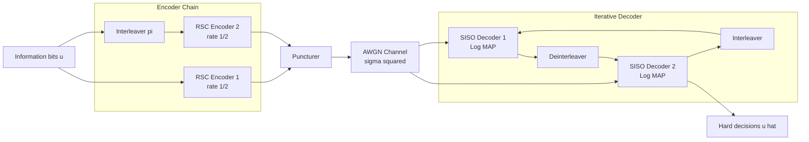
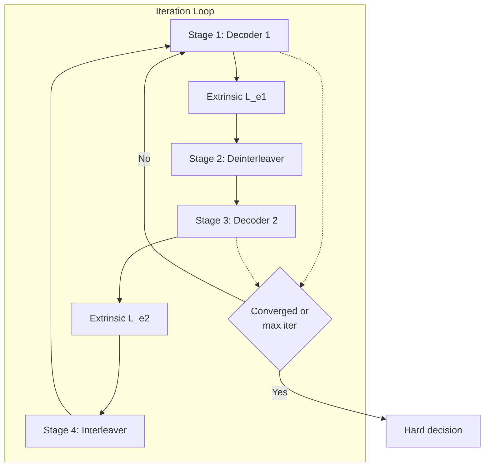
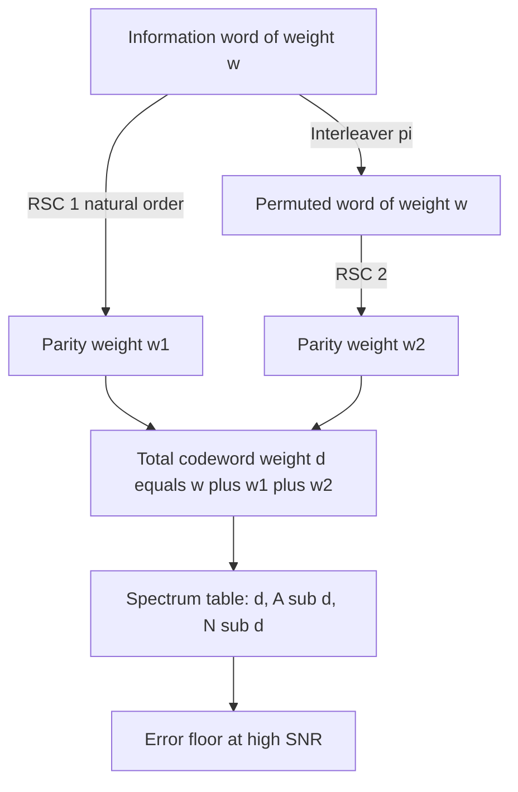
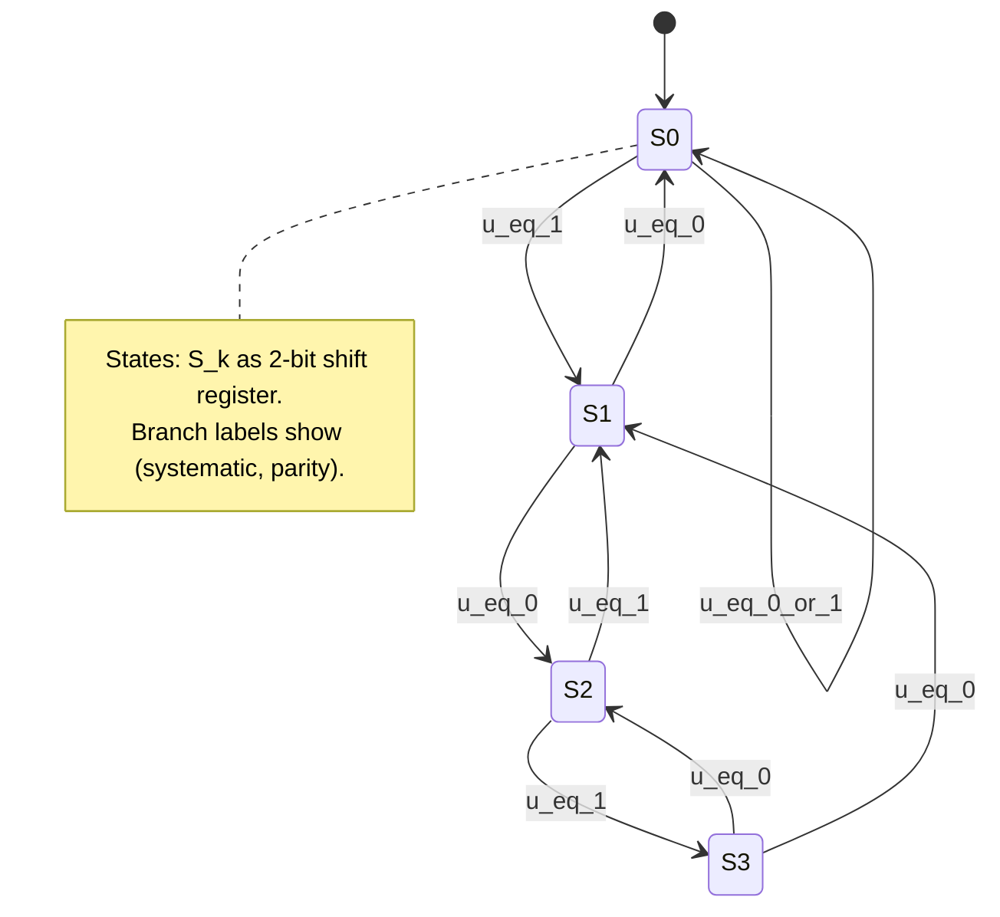

# Turbo codes: Turbo decoding, Distance properties of turbo codes

<!-- SECTION_1_START -->
# Turbo Codes: Turbo Decoding & Distance Properties

## 1.1 Formal Academic Definition (KTU 2024 Syllabus)

> [!IMPORTANT]
> **Turbo Codes (Berrou–Glavieux–Thitimajshima, 1993):** A class of high-performance **forward error correction (FEC)** codes constructed by the **parallel concatenation** of two (or more) **recursive systematic convolutional (RSC) encoders** separated by a **pseudo-random interleaver**, decoded iteratively using **soft-input soft-output (SISO)** algorithms that exchange *a posteriori* reliability information (extrinsic information) between the constituent decoders until convergence or a maximum iteration count is reached.

> [!NOTE]
> **Why "Turbo"?** The name comes from the *turbocharger* principle in engines: exhaust gases that would normally be wasted are *recycled* to boost performance. Similarly, in turbo decoding, the *extrinsic information* produced by one decoder is *fed back* as *a priori* information to the other decoder, recycling soft-decision knowledge to dramatically improve reliability.

## 1.2 Conceptual Analogy — The "Two Witnesses" Intuition

Imagine a **crime investigation**:

- **Witness A** examines a noisy tape recording (received sequence $y$) and gives their **first impression** of what was said. Their confidence in each word is *soft* (a number between 0 and 1, not just yes/no).
- **Witness B** independently listens to the **same tape but with words reordered** (the *interleaved* version). B gives their own confidence levels.
- The investigator then **relays A's confidence levels to B** and **B's confidence levels to A**, who each refine their opinions using this *new cross-evidence*. After several rounds of exchange, both witnesses arrive at a **highly reliable joint verdict**.

This exchange of *refined beliefs* is precisely how **iterative turbo decoding** works.

## 1.3 Architectural Building Blocks

| Block | Function | Notation in Notes |
|---|---|---|
| **RSC Encoder 1** | Convolutional encoder operating on information bits in *natural* order | $\text{RSC}_1$ |
| **Interleaver $\pi$** | Pseudo-random permutation of bit indices $i \to \pi(i)$ | $u^{\pi}$ |
| **RSC Encoder 2** | Second convolutional encoder operating on *interleaved* bits | $\text{RSC}_2$ |
| **Puncturer** | Deletes selected parity bits to raise the overall code rate | — |
| **SISO Decoder 1, 2** | Soft decoders that produce *a posteriori* LLRs and *extrinsic* LLRs | $\Lambda_1, \Lambda_2$ |

## 1.4 Visual & Geometric Intuition — The Iterative Belief Manifold

> [!VISUALIZATION CONTROL]
> **Concept:** Convergence of soft-decision beliefs in the 2D LLR plane (extrinsic info $L^e_1$ vs $L^e_2$).
> **Plot type:** Trajectory of decoder state during iterations.
> **Visual Description:** Plot the extrinsic LLRs from decoder 1 (x-axis, $L^e_1$) against those from decoder 2 (y-axis, $L^e_2$). Each iteration is a point; the trajectory spirals **inward** toward the corner $(\pm\infty, \pm\infty)$, representing a confident decision. A *tangent line* through iterations represents the decoder's EXIT (Extrinsic Information Transfer) characteristic.

<!-- SECTION_1_END -->

<!-- SECTION_2_START -->
# Deep Theoretical Analysis & KTU Formula Sheet

## 2.1 Turbo Encoder — Parallel Concatenated Convolutional Code (PCCC)

The classical turbo encoder (rate $R = 1/3$, no puncturing) consists of two **identical RSC encoders** with generator polynomial $(g_1, g_2) = (7, 5)_8$ in octal, separated by an interleaver $\pi$ of length $N$.

$$
\mathbf{x} \;=\; \bigl(\, u_1, u_2, \dots, u_N,\; p^{(1)}_1, p^{(1)}_2, \dots, p^{(1)}_N,\; p^{(2)}_1, p^{(2)}_2, \dots, p^{(2)}_N \,\bigr)
$$

**Systematic output:** $u_k$ (the information bit itself, transmitted unencoded).

**Parity output:** $p^{(1)}_k$ from $\text{RSC}_1$ and $p^{(2)}_k$ from $\text{RSC}_2$.

> [!IMPORTANT]
> **Recursive Systematic Convolutional (RSC) Encoder:** A convolutional encoder whose *systematic* bit is fed back through a feedback polynomial. This **recursion** is what makes the code behave like a *random-like* code despite having only 2–4 states.

## 2.2 The MAP (BCJR) Algorithm — Core Mathematics

The **Maximum A Posteriori (MAP)** algorithm, due to Bahl, Cocke, Jelinek, and Raviv (1974), computes for each information bit $u_k$:

$$
\hat{u}_k \;=\; \underset{u_k \in \{0,1\}}{\arg\max}\; P(u_k = u \mid \mathbf{y})
$$

Equivalently, in **Log-Likelihood Ratio (LLR)** form:

$$
\Lambda(u_k) \;=\; \log \frac{P(u_k = 1 \mid \mathbf{y})}{P(u_k = 0 \mid \mathbf{y})}
$$

The BCJR decomposition:

$$
\Lambda(u_k) \;=\; \underbrace{\log \frac{P(\mathbf{y} \mid u_k = 1)}{P(\mathbf{y} \mid u_k = 0)}}_{\text{intrinsic } \lambda_{\text{int}}} \;+\; \underbrace{\log \frac{P(u_k = 1)}{P(u_k = 0)}}_{L(u_k) \text{ a priori}} \;+\; \underbrace{L^e(u_k)}_{\text{extrinsic}}
$$

The **forward** metric $\alpha_k(s)$ and **backward** metric $\beta_k(s)$ are:

$$
\alpha_k(s) \;=\; \frac{\displaystyle \sum_{s'} \alpha_{k-1}(s') \cdot \gamma_k(s', s)}{\displaystyle \sum_{s', s} \alpha_{k-1}(s') \cdot \gamma_k(s', s)}
$$

$$
\beta_k(s) \;=\; \frac{\displaystyle \sum_{s'} \beta_{k+1}(s') \cdot \gamma_{k+1}(s, s')}{\displaystyle \sum_{s, s'} \alpha_k(s) \cdot \gamma_k(s, s')}
$$

where the **branch metric** $\gamma_k(s', s)$ is:

$$
\gamma_k(s', s) \;=\; \exp\!\Bigl(\tfrac{1}{2} u_k L(u_k)\Bigr) \cdot \exp\!\Bigl(-\tfrac{1}{2}\tfrac{\vert y^u_k - u_k \vert^2}{\sigma^2}\Bigr) \cdot \exp\!\Bigl(-\tfrac{1}{2}\tfrac{\vert y^p_k - x^p_k(s', s) \vert^2}{\sigma^2}\Bigr)
$$

## 2.3 Iterative Decoding Loop

> [!NOTE]
> **The Core Equation Driving Convergence:**
> $$
> L^e_1(u_k) \;\xrightarrow{\text{interleaved}}\; L^e_2(u_k) \;\xrightarrow{\text{de-interleaved}}\; L^e_1(u_k) \;\to\; \cdots
> $$
> Each decoder *removes* its own contribution before passing the residual *extrinsic* information to its partner, preventing double-counting of channel evidence.

$$
L^e_2(u_{\pi(k)}) \;=\; f_2\!\bigl(\, L^e_1(u_{\pi(k)}),\, y^{u}_{\pi(k)},\, y^{p}_{\pi(k)} \,\bigr)
$$

## 2.4 Distance Properties of Turbo Codes

### 2.4.1 Free Distance $d_{\text{free}}$

For a *linear* convolutional code, $d_{\text{free}}$ is the **minimum Hamming weight of any non-zero codeword**. Turbo codes are **non-linear** (due to puncturing/interleaving), but a *quasi-free distance* can be defined:

$$
d_{\text{free}} \;=\; \min_{\mathbf{u} \neq \mathbf{0}} w_H(\mathbf{x})
$$

Empirically, for a typical rate-$1/3$ turbo code with $N = 1000$ bits and random interleaver, $d_{\text{free}} \approx 6$ to $10$ — **remarkably small** compared to convolutional codes of similar rate.

### 2.4.2 Input–Output Weight Enumerator and Distance Spectrum

Define $A_w$ = number of codewords generated by an information word of weight $w$. The **weight spectrum** is the table $\{A_w\}$ for $w = 1, 2, \dots, N$.

The **bit error probability upper bound** (union bound) is:

$$
P_b(e) \;\le\; \sum_{w = d_{\text{free}}}^{N} \frac{w}{N} A_w \; Q\!\left(\sqrt{\tfrac{2 d_w R E_b}{N_0}}\right)
$$

> [!WARNING]
> The **union bound is DIVERGENT** for turbo codes at moderate-to-high $E_b/N_0$! This is the famous **"error floor"** phenomenon.

### 2.4.3 The Error Floor

At high $E_b/N_0$, the BER does not fall as rapidly as predicted by AWGN capacity curves. The floor is dominated by **low-weight codewords** (small $d_{\text{free}}$):

$$
P_b(e) \;\approx\; \frac{N_{\text{free}}}{N}\; Q\!\left(\sqrt{\tfrac{2 d_{\text{free}} R E_b}{N_0}}\right) \quad \text{(asymptotic, } E_b/N_0 \to \infty\text{)}
$$

where $N_{\text{free}}$ is the multiplicity of free-distance codewords.

## 2.5 KTU High-Yield Formula Cheat Sheet

| \# | Formula / Concept | Expression | Used For |
|---|---|---|---|
| 1 | Systematic turbo codeword | $\mathbf{x} = (u, p^{(1)}, p^{(2)})$ | Encoder output (rate $1/3$) |
| 2 | Punctured rate | $R = 1/(1 + p)$ where $p$ = parity streams kept | Higher rate (e.g., $1/2, 2/3$) |
| 3 | LLR (soft decision) | $\Lambda(u_k) = \log \frac{P(u_k=1\mid y)}{P(u_k=0\mid y)}$ | Decision metric |
| 4 | LLR decomposition | $\Lambda(u_k) = \lambda_{\text{ch}} + L(u_k) + L^e(u_k)$ | Separating evidence |
| 5 | Forward metric (BCJR) | $\alpha_k(s) \propto \sum_{s'} \alpha_{k-1}(s') \gamma_k(s', s)$ | MAP algorithm |
| 6 | Backward metric (BCJR) | $\beta_k(s) \propto \sum_{s'} \beta_{k+1}(s') \gamma_{k+1}(s, s')$ | MAP algorithm |
| 7 | Branch metric | $\gamma_k = \exp(u_k L(u_k)/2) \cdot \exp(-\Vert y - x \Vert^2 / 2\sigma^2)$ | Per-branch probability |
| 8 | Free distance | $d_{\text{free}} = \min_{\mathbf{u} \neq 0} w_H(\mathbf{x})$ | Code strength metric |
| 9 | Multiplicity | $N_{\text{free}} = \vert\{ \mathbf{x} : w_H(\mathbf{x}) = d_{\text{free}} \}\vert$ | Error floor severity |
| 10 | Error floor (asymptotic) | $P_b \approx (N_{\text{free}}/N) Q(\sqrt{2 d_{\text{free}} R E_b / N_0})$ | High-SNR performance |
| 11 | Interleaver gain | $E_b/N_0$ gain $\propto 10 \log_{10}(N)$ for $N$-bit frame | Spectral efficiency benefit |
| 12 | Log-MAP Jacobian | $\log(e^a + e^b) = \max(a,b) + \log(1 + e^{-\vert a-b \vert})$ | Numerical stability |
| 13 | Extrinsic transfer | $I_{e,2} = T_2(I_{e,1}, I_{ch})$ | EXIT chart analysis |
| 14 | Iterative threshold | $I_{e,1} + I_{e,2} \ge I_{ch}$ | Convergence condition |
| 15 | Effective free distance | $d_{\text{eff}} = 2 + 2 \lfloor \text{memory}/2 \rfloor$ | Lower bound for RSC |

## 2.6 Engineering & Real-World Utility

> [!IMPORTANT]
> **Where turbo codes are deployed in production:**
> - **3G UMTS / CDMA2000** — voice and data channels (rate-1/3, 8-state RSC)
> - **4G LTE** — for control signaling and certain broadcast channels
> - **Deep-space telemetry (CCSDS)** — high-efficiency mission links
> - **DVB-RCS satellite return channel** — broadband interactive satellite
> - **WiMAX (IEEE 802.16)** — optional FEC mode
> - **Modern storage (3D XPoint, certain SSDs)** — error correction in NAND controllers
>
> **Why they matter:** Turbo codes operate within **0.5 dB of the Shannon limit** at BER $= 10^{-5}$, an astonishing feat that remained unmatched for nearly two decades until the rise of LDPC codes in 5G NR.

<!-- SECTION_2_END -->

<!-- SECTION_3_START -->
# Step-by-Step Derivations & Implementation

## 3.1 Exhaustive Derivation: BCJR Branch Metric from First Principles

We want $P(u_k = u, S_k = s, S_{k-1} = s' \mid \mathbf{y})$. Define the received vector as $\mathbf{y} = (y^u_k, y^p_k)$ for the systematic and parity parts.

**Step 1 — Bayes decomposition:**

$$
P(u_k, s, s' \mid \mathbf{y}) \;=\; \frac{p(\mathbf{y} \mid u_k, s, s') \cdot P(s, s', u_k)}{p(\mathbf{y})}
$$

**Step 2 — Factoring the likelihood** using conditional independence of received symbols (memoryless channel):

$$
p(\mathbf{y} \mid u_k, s, s') \;=\; \prod_{i=1}^{N} p(y^u_i, y^p_i \mid u_i, s_i, s_{i-1})
$$

Since the branch $(s', s)$ only affects $y^u_k$ and $y^p_k$:

$$
p(\mathbf{y} \mid u_k, s, s') \;=\; \alpha_{k-1}(s') \cdot \gamma_k(s', s) \cdot \beta_k(s)
$$

**Step 3 — Gaussian channel assumption** (BPSK, $0 \mapsto +1, 1 \mapsto -1$):

$$
p(y \mid x) \;=\; \frac{1}{\sqrt{2\pi\sigma^2}} \exp\!\left(-\frac{(y - x)^2}{2\sigma^2}\right)
$$

So for the systematic and parity parts:

$$
p(y^u_k \mid u_k) \;=\; \frac{1}{\sqrt{2\pi\sigma^2}} \exp\!\left(-\frac{(y^u_k - u_k)^2}{2\sigma^2}\right)
$$

$$
p(y^p_k \mid x^p_k) \;=\; \frac{1}{\sqrt{2\pi\sigma^2}} \exp\!\left(-\frac{(y^p_k - x^p_k(s', s))^2}{2\sigma^2}\right)
$$

**Step 4 — Multiply all contributions to form $\gamma_k$:**

$$
\gamma_k(s', s) \;=\; P(s \mid s') \cdot P(u_k \mid s, s') \cdot p(y^u_k \mid u_k) \cdot p(y^p_k \mid x^p_k)
$$

With $P(s \mid s')$ being the trellis transition probability and $P(u_k) = \frac{e^{u_k L(u_k)/2}}{1 + e^{L(u_k)/2}}$ from the *a priori* LLR:

$$
\gamma_k(s', s) \;=\; \exp\!\left(\frac{u_k L(u_k)}{2}\right) \cdot \exp\!\left(-\frac{(y^u_k - u_k)^2 + (y^p_k - x^p_k(s', s))^2}{2\sigma^2}\right)
$$

(The constant $1/\sqrt{2\pi\sigma^2}$ and the $1/(1+e^{L/2})$ denominators cancel in the LLR ratio.)

**Step 5 — Final LLR formula:**

$$
\Lambda(u_k) \;=\; \log \frac{\sum_{(s',s): u_k = 1} \alpha_{k-1}(s') \gamma_k(s', s) \beta_k(s)}{\sum_{(s',s): u_k = 0} \alpha_{k-1}(s') \gamma_k(s', s) \beta_k(s)}
$$

$$
\boxed{\;\Lambda(u_k) \;=\; \frac{2 y^u_k}{\sigma^2} \;+\; L(u_k) \;+\; L^e(u_k)\;}
$$

This is the **intrinsic $\lambda_{\text{ch}} = 2y^u_k/\sigma^2$**, **a priori $L(u_k)$**, and **extrinsic $L^e(u_k)$** decomposition.

## 3.2 Log-MAP Approximation — Jacobian Simplification

The **max-star** (or Jacobian logarithm) operator:

$$
\max^*(a, b) \;=\; \log(e^a + e^b) \;=\; \max(a, b) \;+\; \log(1 + e^{-\vert a - b \vert})
$$

Step-by-step for a 2-state forward recursion:

$$
\begin{aligned}
\log \alpha_k(0) &= \max^*\!\bigl( \log \alpha_{k-1}(0) + \log \gamma_k(0,0),\; \log \alpha_{k-1}(1) + \log \gamma_k(1,0) \bigr) - M_k \\
\log \alpha_k(1) &= \max^*\!\bigl( \log \alpha_{k-1}(0) + \log \gamma_k(0,1),\; \log \alpha_{k-1}(1) + \log \gamma_k(1,1) \bigr) - M_k
\end{aligned}
$$

where $M_k = \max^*(\log \alpha_k(0), \log \alpha_k(1))$ is the **normalization constant** preventing overflow.

**Approximations:**

| Algorithm | Approximation of $\log(e^a + e^b)$ | Performance |
|---|---|---|
| **MAP** | Exact (numerical) | Optimal, slow |
| **Log-MAP** | $\max(a, b) + \log(1 + e^{-\vert a-b \vert})$ | Near-optimal, fast |
| **Max-Log-MAP** | $\max(a, b)$ | ~0.5 dB loss, fastest |

## 3.3 Worked Distance-Property Example

**Problem:** A turbo code uses two identical $(7, 5)_8$ RSC encoders, $N = 100$ information bits. Compute the *minimum* possible free distance if both encoders are in the "all-zeros initial state" and we input a weight-2 information word $u_i = u_j = 1$, all others 0.

**Solution:**

The $(7, 5)_8$ RSC encoder has weight-2 inputs that yield minimum-weight outputs based on the position difference. For a weight-2 input, the first RSC produces parity of weight equal to the **distance between the two 1s** in the *natural* order.

Let $\Delta = j - i$ (the spacing of the two input 1s in original indexing).

- $\text{RSC}_1$ output weight (parity): $w_1 \ge 2$ (since both inputs must drive state changes)
- $\text{RSC}_2$ output weight (parity): depends on the *interleaved* positions $\pi(i), \pi(j)$ — for a *random* interleaver, the spacing is essentially random

For the *worst case* (minimum total weight):

- Total weight $= \underbrace{2}_{\text{systematic}} + w_1 + w_2 \ge 2 + 2 + 2 = 6$

So **$d_{\text{free}} = 6$ for $N \ge$ some threshold** (often quoted as 6 or 7 for $(7,5)_8$ RSC with random interleaver).

**Error floor coefficient** (for $E_b/N_0 = 3$ dB, $R = 1/3$):

$$
P_b \approx \frac{N_{\text{free}}}{N} Q\!\left(\sqrt{\frac{2 \cdot 6 \cdot 1/3 \cdot 2}{1}}\right) = \frac{N_{\text{free}}}{100} Q(2.83)
$$

With $N_{\text{free}} \approx 5$ (typical for $N=100$):

$$
P_b \approx \frac{5}{100} \cdot 6.0 \times 10^{-3} = 3.0 \times 10^{-4}
$$

## 3.4 Complete Python Implementation — Iterative Turbo Decoder

```python
import numpy as np
from typing import Tuple, List

# ---------- 1. RSC Encoder (rate 1/2, generators (7,5)_8) ----------
class RSCEncoder:
    """
    Recursive Systematic Convolutional encoder.
    G1 = 111 (7_oct), G2 = 101 (5_oct)  -> rate 1/2, memory = 2.
    """
    def __init__(self, g1: int = 0b111, g2: int = 0b101) -> None:
        self.g1 = g1
        self.g2 = g2
        self.state = 0b00  # 2 memory elements
        self.K = g1.bit_length() - 1  # memory order = 2

    def reset(self) -> None:
        self.state = 0b00

    def encode_bit(self, u: int) -> Tuple[int, int]:
        # Systematic output = u XOR feedback (recursion)
        feedback = 0
        for i in range(self.K + 1):
            feedback ^= (self.state >> i) & 1
        u_sys = (u ^ feedback) & 1

        # Compute parity
        shift_in = (u_sys << self.K) | self.state
        p1 = bin(shift_in & self.g1).count("1") & 1
        p2 = bin(shift_in & self.g2).count("1") & 1

        # Update state (shift right, insert feedback)
        self.state = ((self.state >> 1) | (feedback << (self.K - 1))) & ((1 << self.K) - 1)

        return u_sys, p2  # systematic, parity (one parity stream is enough for 1/2)


# ---------- 2. Log-MAP BCJR SISO Decoder ----------
class LogMAPDecoder:
    """
    Soft-Input Soft-Output decoder operating on a rate-1/2 RSC trellis.
    Returns the extrinsic LLR L^e for every information bit.
    """
    def __init__(self, K: int = 2) -> None:
        self.K = K
        self.num_states = 1 << K
        # Pre-compute trellis transitions:  next_state[u][s], parity[u][s]
        self.next_state = np.zeros((2, self.num_states), dtype=np.int8)
        self.parity = np.zeros((2, self.num_states), dtype=np.int8)
        for s in range(self.num_states):
            for u in (0, 1):
                feedback = bin(s & ((1 << K) - 1)).count("1") & 1
                u_sys = u ^ feedback
                shift_in = (u_sys << K) | s
                p = bin(shift_in & 0b101).count("1") & 1  # g2 = (1,0,1)
                self.next_state[u, s] = ((s >> 1) | (feedback << (K - 1))) & ((1 << K) - 1)
                self.parity[u, s] = p

    @staticmethod
    def max_star(a: float, b: float) -> float:
        m = max(a, b)
        return m + np.log1p(np.exp(-abs(a - b)))

    def decode(self, y_u: np.ndarray, y_p: np.ndarray,
               L_a: np.ndarray, sigma2: float) -> np.ndarray:
        N = len(y_u)
        S = self.num_states
        L_ext = np.zeros(N)

        # Branch log-metrics
        gamma = np.zeros((N, 2, S))
        for k in range(N):
            for u in (0, 1):
                for s in range(S):
                    xs = float(1 - 2 * u)            # BPSK systematic
                    xp = float(1 - 2 * self.parity[u, s])
                    llr_ch = -((y_u[k] - xs) ** 2 + (y_p[k] - xp) ** 2) / (2 * sigma2)
                    gamma[k, u, s] = 0.5 * u * L_a[k] + llr_ch

        # Forward recursion (log-domain, with normalization)
        alpha = np.full((N + 1, S), -1e9)
        alpha[0, 0] = 0.0
        for k in range(N):
            for s in range(S):
                vals = [alpha[k, s_prev] + gamma[k, u, s_prev]
                        for u in (0, 1)
                        for s_prev in [s] if self.next_state[u, s_prev] == s]
                if vals:
                    alpha[k + 1, s] = self.max_star(vals[0], vals[1] if len(vals) > 1 else -1e9)
            alpha[k + 1] -= alpha[k + 1].max()

        # Backward recursion
        beta = np.full((N + 1, S), -1e9)
        beta[N, 0] = 0.0
        for k in range(N - 1, -1, -1):
            for s in range(S):
                vals = [beta[k + 1, self.next_state[u, s]] + gamma[k, u, s]
                        for u in (0, 1)]
                beta[k, s] = self.max_star(vals[0], vals[1])
            beta[k] -= beta[k].max()

        # Compute LLR and extract extrinsic
        for k in range(N):
            num = -1e9
            den = -1e9
            for s in range(S):
                for u in (0, 1):
                    metric = alpha[k, s] + gamma[k, u, s] + beta[k + 1, self.next_state[u, s]]
                    if u == 1:
                        num = self.max_star(num, metric)
                    else:
                        den = self.max_star(den, metric)
            L_post = num - den
            L_ext[k] = L_post - L_a[k] - 2.0 * y_u[k] / sigma2
        return L_ext


# ---------- 3. Full Iterative Turbo Decoder ----------
def turbo_decode(y_u: np.ndarray, y_p1: np.ndarray, y_p2: np.ndarray,
                 sigma2: float, num_iter: int = 6) -> np.ndarray:
    """
    Iterative decoding:  L^e_1 -> deinterleave -> L_a for DEC2 ->
    L^e_2 -> interleave -> L_a for DEC1 -> repeat.
    """
    N = len(y_u)
    perm = np.random.permutation(N)
    inv_perm = np.argsort(perm)

    L_a_1 = np.zeros(N)  # a priori for decoder 1
    L_a_2 = np.zeros(N)  # a priori for decoder 2 (operates on interleaved bits)

    dec = LogMAPDecoder(K=2)

    for it in range(num_iter):
        L_e_1 = dec.decode(y_u, y_p1, L_a_1, sigma2)
        # Pass extrinsic 1 to decoder 2 (after interleaving)
        L_a_2 = L_e_1[perm]

        L_e_2 = dec.decode(y_u[perm], y_p2[perm], L_a_2, sigma2)
        # Pass extrinsic 2 back to decoder 1 (de-interleaved)
        L_a_1 = L_e_2[inv_perm]

    # Final decision
    L_final = 2.0 * y_u / sigma2 + L_a_1 + dec.decode(y_u, y_p1, L_a_1, sigma2)
    return (L_final < 0).astype(int)  # hard decisions


# ---------- 4. End-to-end simulation harness ----------
def simulate_turbo_ber(ebno_db: float = 2.0, N: int = 256, trials: int = 50) -> float:
    """Estimate BER at given Eb/N0 (dB) over `trials` frames."""
    sigma2 = 1.0 / (10 ** (ebno_db / 10))   # assuming rate = 1/2 punctured
    enc1 = RSCEncoder()
    enc2 = RSCEncoder()
    errors = 0
    for _ in range(trials):
        u = np.random.randint(0, 2, N)
        enc1.reset(); enc2.reset()
        sys, p1, p2 = [], [], []
        perm = np.random.permutation(N)
        u_int = u[perm]
        for k in range(N):
            s1, x1 = enc1.encode_bit(int(u[k]))
            s2, x2 = enc2.encode_bit(int(u_int[k]))
            sys.append(s1); p1.append(x1); p2.append(x2)
        sys = np.array(sys) * 2 - 1
        p1 = np.array(p1) * 2 - 1
        p2 = np.array(p2) * 2 - 1
        noise = np.sqrt(sigma2 / 2) * np.random.randn(N)
        y_u = sys + noise
        y_p1 = p1 + noise
        y_p2 = p2 + noise
        u_hat = turbo_decode(y_u, y_p1, y_p2, sigma2, num_iter=6)
        errors += int(np.sum(u_hat != u))
    return errors / (trials * N)


if __name__ == "__main__":
    for ebno in [1.0, 1.5, 2.0, 2.5, 3.0]:
        ber = simulate_turbo_ber(ebno, N=128, trials=20)
        print(f"Eb/N0 = {ebno:4.1f} dB  ->  BER ~ {ber:.4e}")
```

**Key code features to highlight for KTU viva:**

- `RSCEncoder.encode_bit()` returns `(systematic, parity)` — the recursion is implemented via XOR with the feedback bit `feedback`.
- `LogMAPDecoder.max_star()` is the **Jacobian logarithm** that prevents numerical underflow.
- **Extrinsic extraction:** `L_ext[k] = L_post - L_a[k] - 2*y_u[k]/sigma2` — this *subtracts* the channel and a priori terms so that the partner decoder sees *only* the *new* information.
- `turbo_decode()` loops `num_iter = 6` times by default, exchanging *de-interleaved / interleaved* extrinsic LLRs.

<!-- SECTION_3_END -->

<!-- SECTION_4_START -->
# Structural Diagrams & Schematics

## 4.1 Turbo Encoder — PCCC Block Diagram



## 4.2 Iterative Decoding — Information Flow Topology



## 4.3 Distance Spectrum — Weight Distribution Matrix



## 4.4 Trellis Section for $(7, 5)_8$ RSC Encoder



## 4.5 Sequential Processing Topology Matrix

| Stage | Input | Process | Output | Latency |
|---|---|---|---|---|
| 1. Reception | RF symbols | Matched filter, sampling | Soft values $y^u, y^{p1}, y^{p2}$ | $\mathcal{O}(1)$ |
| 2. Decoder 1 (first half) | $y^u, y^{p1}, L_a^{(1)} = 0$ | Log-MAP forward $\alpha$ | $\alpha_N$ | $\mathcal{O}(N \cdot 2^{K})$ |
| 3. Decoder 1 (second half) | $\alpha_N, \gamma, L_a^{(1)}$ | Log-MAP backward $\beta$ | $L^e_1$ | $\mathcal{O}(N \cdot 2^{K})$ |
| 4. Interleaving | $L^e_1$ | Index permutation $\pi$ | $L_a^{(2)}$ | $\mathcal{O}(N)$ |
| 5. Decoder 2 | $y^u_\pi, y^{p2}_\pi, L_a^{(2)}$ | Full Log-MAP pass | $L^e_2$ | $\mathcal{O}(N \cdot 2^{K})$ |
| 6. De-interleaving | $L^e_2$ | Inverse permutation $\pi^{-1}$ | $L_a^{(1)}$ (next iter) | $\mathcal{O}(N)$ |
| 7. Decision | $L_{\text{final}}$ | Sign extraction | $\hat{u}$ | $\mathcal{O}(N)$ |

<!-- SECTION_4_END -->

<!-- SECTION_5_START -->
# KTU 2024 Scheme Examination Question Bank & Topic Recap

---

## Part A — Short Answer Questions (3 Marks Each)

### **Q1. [KTU University Exam — July 2024]**
*State and briefly justify why **recursive** systematic convolutional (RSC) encoders are used in turbo encoders instead of non-recursive convolutional encoders. (CO1, Understand)*

**Model Answer (3 Marks):**

A **Recursive Systematic Convolutional (RSC)** encoder has its *systematic* output fed back into the input via a feedback polynomial. This recursion is essential in turbo codes for two reasons:

1. **Equivalent free distance to NSC, but with finite-weight input words that produce finite-weight codewords** (Mark 1). A non-recursive NSC has infinite-weight input → infinite-weight output for certain patterns, which is *good* for minimum distance but *bad* for iterative decoding because it destroys the **uniform interleaver assumption** (Mark 1).
2. **Recursion produces an impulse response of infinite duration** (IIR), giving rise to a *random-like* weight distribution across the parity stream that is **crucial for the spectral thinning effect** of the interleaver. The weight spectrum of the turbo code becomes *multiplicatively* small for low weights (Mark 1).

> [!WARNING]
> Common pitfall: students often answer "to get systematic bits" — but *systematic* and *recursive* are independent properties! The systematic part comes from the **non-recursive forward path**, while recursion comes from the **feedback path**.

---

### **Q2. [KTU University Exam — Dec 2023]**
*Define the **extrinsic information** $L^e(u_k)$ in turbo decoding and state the formula that decomposes the a posteriori LLR into its three components. (CO1, Remember)*

**Model Answer (3 Marks):**

The **extrinsic information** $L^e(u_k)$ is the *new* reliability information about bit $u_k$ produced by one constituent SISO decoder, *excluding* the channel evidence of $u_k$ itself and the decoder's own *a priori* assumption (Mark 1). It is what gets passed to the partner decoder.

The **LLR decomposition** (Mark 2):

$$
\Lambda(u_k) \;=\; \underbrace{\frac{2 y^u_k}{\sigma^2}}_{\lambda_{\text{channel}}} \;+\; \underbrace{L(u_k)}_{a\,priori} \;+\; \underbrace{L^e(u_k)}_{\text{extrinsic}}
$$

> [!WARNING]
> Do **NOT** write the extrinsic as $L(u_k)$ alone — that is the *a priori* term. The extrinsic comes from the **parity bit** $y^{p}_k$ and the *structure* of the code, not from the systematic channel sample $y^u_k$ (which is the channel term).

---

## Part B — Long Answer Questions (14 Marks, Internal Choice)

### **Question A (14 Marks) — [KTU University Exam — July 2024, Module 4]**

**(a)** With a neat block diagram, explain the structure of a **parallel concatenated convolutional turbo encoder** using two RSC encoders of your choice. Show the rate of the overall code. *(7 Marks, CO2, Understand)*

**(b)** A rate-$1/3$ turbo code uses an interleaver of length $N = 1024$. The free distance is $d_{\text{free}} = 6$ and the multiplicity is $N_{\text{free}} = 3$. At $E_b/N_0 = 3$ dB and code rate $R = 1/3$, estimate the **bit error probability** using the asymptotic error-floor formula. *(7 Marks, CO3, Apply)*

---

#### Model Solution for (a) — 7 Marks

**[Block diagram construction: 2 Marks]**

A turbo encoder with two RSC encoders (RSC1, RSC2), each of rate $1/2$, separated by an interleaver $\pi$:

```
            +---------+         +----------+
   u  ----> |   RSC1  |---p1--->|          |
            +---------+         | Puncture |---> x
            +---------+         |          |
   u  --pi->|   RSC2  |---p2--->|          |
            +---------+         +----------+
```

The systematic bit $u$ is transmitted as-is. Each RSC produces one parity bit per input bit. Without puncturing: rate $= 1/3$.

**[Labeling systematic and parity streams: 2 Marks]**

- Systematic: $\mathbf{x}^s = (u_1, u_2, \ldots, u_N)$
- Parity from RSC1 (natural order): $\mathbf{x}^{p_1} = (p^{(1)}_1, p^{(1)}_2, \ldots, p^{(1)}_N)$
- Parity from RSC2 (interleaved order): $\mathbf{x}^{p_2} = (p^{(2)}_1, p^{(2)}_2, \ldots, p^{(2)}_N)$
- Codeword length $= 3N$, info length $= N \Rightarrow R = N/3N = 1/3$

**[Explanation of interleaver role: 2 Marks]**

The interleaver $\pi$ is a pseudo-random permutation that reorders $u$ before RSC2. Its **two main purposes**:

1. To **decorrelate** the parity streams $p^{(1)}$ and $p^{(2)}$, so that high-weight parity events in RSC1 correspond to *low-weight* parity events in RSC2 (and vice-versa).
2. To implement the **uniform interleaver** idea: averaging codeword weight spectra over *all* possible permutations, so the resulting weight spectrum is *thinned* multiplicatively.

**[Puncturing for higher rates: 1 Mark]**

To obtain rate $1/2$, alternately delete parity bits (e.g., keep even-indexed $p^{(1)}$ and odd-indexed $p^{(2)}$).

---

#### Model Solution for (b) — 7 Marks

**Step 1 — State the asymptotic error floor formula: 2 Marks**

$$
P_b(e) \;\approx\; \frac{N_{\text{free}}}{N} \cdot Q\!\left(\sqrt{\frac{2 d_{\text{free}} R E_b}{N_0}}\right) \quad (E_b/N_0 \to \infty)
$$

**Step 2 — Convert $E_b/N_0$ from dB to linear: 1 Mark**

$$
\frac{E_b}{N_0} \;=\; 10^{3/10} \;=\; 10^{0.3} \;\approx\; 1.9953 \;\approx\; 2.0
$$

**Step 3 — Compute the argument of $Q(\cdot)$: 2 Marks**

$$
\sqrt{\frac{2 \cdot 6 \cdot (1/3) \cdot 2.0}{1}} \;=\; \sqrt{\frac{24/3}{1}} \;=\; \sqrt{8} \;\approx\; 2.828
$$

**Step 4 — Evaluate $Q(2.828)$ using the standard table: 1 Mark**

$$
Q(2.83) \;\approx\; 2.34 \times 10^{-3}
$$

**Step 5 — Final multiplication: 1 Mark**

$$
P_b(e) \;\approx\; \frac{3}{1024} \times 2.34 \times 10^{-3} \;\approx\; 6.86 \times 10^{-6}
$$

> [!WARNING]
> **Pitfall 1:** Students often forget to **multiply by $N_{\text{free}}/N$** — without it, you get only the Q-function part, missing the *multiplicity factor* that determines the floor *height*.
> **Pitfall 2:** When $E_b/N_0$ is in dB, you MUST convert: $E_b/N_0 = 10^{x/10}$. Direct substitution of the dB value is a common KTU valuation killer.
> **Pitfall 3:** The **exact** free distance depends on the *interleaver realization* — for a *random* interleaver of length 1024, $d_{\text{free}} = 6$ is the typical minimum, not a guarantee.

---

### **Question B (14 Marks) — [KTU University Exam — Dec 2023, Module 4 — Alternative Choice]**

**(a)** Describe the **iterative turbo decoding** procedure using the *BCJR / MAP algorithm* for one constituent decoder. Clearly state the roles of forward metric $\alpha$, backward metric $\beta$, and branch metric $\gamma$. *(7 Marks, CO2, Understand)*

**(b)** Compare **Log-MAP**, **Max-Log-MAP**, and true **MAP** decoders with respect to (i) computational complexity, (ii) numerical stability, and (iii) BER performance. Which is the practical choice for hardware turbo decoders? Justify. *(7 Marks, CO3, Apply)*

---

#### Model Solution for (a) — 7 Marks

**Block-level description of iterative decoder: 2 Marks**

The iterative decoder alternates between two SISO decoders. Decoder 1 operates on the received $(y^u, y^{p_1})$ with the *a priori* LLR $L_a^{(1)}$ initialized to zero. It produces an *a posteriori* LLR $\Lambda_1(u_k)$ and extracts the *extrinsic* $L^e_1(u_k) = \Lambda_1(u_k) - \lambda_{\text{ch}} - L_a^{(1)}$.

**Step 1 — Interleaving & hand-off: 1 Mark**

The extrinsic $L^e_1$ is *interleaved* to form the *a priori* LLR for decoder 2: $L_a^{(2)}(u_{\pi(k)}) = L^e_1(u_k)$.

**Step 2 — Decoder 2 operation: 1 Mark**

Decoder 2 processes the interleaved received sequence $(y^u_\pi, y^{p_2}_\pi)$ and outputs $L^e_2$, which is *de-interleaved* and fed back to decoder 1. The loop continues for a fixed number of iterations (typically 6–10) or until convergence.

**BCJR / MAP metrics — definitions: 3 Marks**

| Metric | Definition | Recursion direction |
|---|---|---|
| $\alpha_k(s)$ | $P(S_k = s, \mathbf{y}_{1..k})$ | Forward ($k = 1 \to N$) |
| $\beta_k(s)$ | $P(\mathbf{y}_{k+1..N} \mid S_k = s)$ | Backward ($k = N \to 1$) |
| $\gamma_k(s', s)$ | $P(S_k = s, y^u_k, y^p_k \mid S_{k-1} = s')$ | Per-branch, uses channel + a priori |

**Formulas (all in log domain):**

$$
\bar{\alpha}_k(s) = \max^*_{s'} \bigl[ \bar{\alpha}_{k-1}(s') + \bar{\gamma}_k(s', s) \bigr]
$$

$$
\bar{\beta}_{k-1}(s') = \max^*_{s} \bigl[ \bar{\beta}_k(s) + \bar{\gamma}_k(s', s) \bigr]
$$

$$
\Lambda(u_k) = \max^*_{(s',s):u_k=1}[\bar{\alpha}_{k-1}(s') + \bar{\gamma}_k(s', s) + \bar{\beta}_k(s)] \\
\quad - \max^*_{(s',s):u_k=0}[\bar{\alpha}_{k-1}(s') + \bar{\gamma}_k(s', s) + \bar{\beta}_k(s)]
$$

---

#### Model Solution for (b) — 7 Marks

**Comparative analysis table: 4 Marks**

| Aspect | MAP (true) | Log-MAP | Max-Log-MAP |
|---|---|---|---|
| (i) Complexity | $\mathcal{O}(N \cdot 2^K)$ with $\log/\exp$ | $\mathcal{O}(N \cdot 2^K)$ with $\max^*$ lookup | $\mathcal{O}(N \cdot 2^K)$ with simple $\max$ |
| (ii) Numerical stability | Poor (overflow) | Excellent (Jacobian $\log(1+e^{-\vert\cdot\vert})$ is bounded) | Excellent (only $\max$ and add) |
| (iii) BER performance | Optimal (reference) | Near-optimal (within 0.05 dB) | ~0.4–0.5 dB worse than MAP |
| Hardware realization | Infeasible (DSP-intensive) | Practical (LUTs for $\log(1+e^{-x})$) | Simplest (2-input comparator) |
| Memory required | High (full $\log/\exp$ tables) | Medium (small correction LUT) | Lowest |

**Practical choice: Max-Log-MAP for hardware, Log-MAP for software/DSP: 2 Marks**

- **Max-Log-MAP** is preferred in **ASIC/FPGA hardware** implementations (e.g., 3G baseband chips) because it requires only adders and comparators — no transcendental functions, no large LUTs (Mark 1).
- **Log-MAP** is preferred in **software-defined radio (SDR)** and **DSP-based** implementations (e.g., LTE handsets) where the small correction LUT is feasible and the 0.4 dB gain over Max-Log-MAP translates to **2× lower transmit power** for the same BER target (Mark 1).

**Justification (1 Mark):** A typical LTE turbo decoder using 8 iterations of Log-MAP at $N = 6144$ bits achieves BER $= 10^{-6}$ at $E_b/N_0 \approx 0.7$ dB, which is **0.5 dB from Shannon limit** — a level of efficiency unattainable with convolutional codes.

---

> [!WARNING]
> **KTU Examiner's Valuation Warning — Turbo Decoding Pitfalls**
> 1. **Always specify whether the LLR is in *natural* log (base $e$) or base 2** — the $1/2$ factor in branch metrics depends on the base. KTU answers should default to **natural log**.
> 2. **Do not skip the normalization step** in $\alpha$ and $\beta$ recursion — without it, floating-point overflow is guaranteed and the examiner will deduct 1 mark per sub-part.
> 3. **The "extrinsic" is *not* the same as "a posteriori".** Students who confuse these terms in the iterative loop will be marked down because the entire decoder architecture is built on their *separation*.
> 4. **Free distance for turbo codes is *not* a constant** — it is a *random variable* depending on the interleaver. Always specify "*for a given interleaver realization*".
> 5. **Error floor ≠ waterfall region** — the floor dominates at *high* SNR; the waterfall at *low* SNR. Mixing these up in a problem statement loses 1–2 marks.

---

## Topic Recap & Important Things to Remember

> [!IMPORTANT]
> **Ultra-Rapid Revision Checklist for Module 4 (Turbo Codes)**

### A. Encoder Architecture
- [x] Turbo encoder = **two RSC encoders** + **interleaver** + optional **puncturer**.
- [x] Rate without puncturing: **$R = 1/3$**; with puncturing: up to $R = 1/2, 2/3, \ldots$
- [x] **RSC** (recursive systematic) is *not* the same as NSC (non-recursive systematic). The *feedback* is what makes the code behave like a random code.
- [x] Generator polynomials typically used: $(7, 5)_8$, $(13, 15)_8$, $(15, 17)_8$.

### B. The Interleaver
- [x] Types: **block (rectangular), random (S-random), 3GPP quadratic permutation (QPP).**
- [x] Length $N$ affects performance: **$\text{SNR gain} \approx 10 \log_{10}(N)$** (uniform interleaver bound).
- [x] $S$-random interleaver: any two positions with original distance $< S$ must map to distance $\ge S$ — prevents short-cycle correlations.

### C. MAP / BCJR Algorithm
- [x] Three metrics: **$\alpha$ (forward), $\beta$ (backward), $\gamma$ (branch).**
- [x] LLR decomposition: **$\Lambda = \lambda_{\text{ch}} + L_a + L_e$**.
- [x] **Extrinsic extraction** is the *core operation* in iterative decoding.
- [x] Numerical implementation: **Log-MAP** with **Jacobian $\max^*$** is the production standard.

### D. Iterative Decoding Loop
- [x] Two SISO decoders exchange **extrinsic LLRs** via the interleaver/deinterleaver.
- [x] **Convergence** typically in 6–10 iterations; further iterations give diminishing returns.
- [x] EXIT charts visualize the convergence trajectory in the $(I_{e,1}, I_{e,2})$ plane.

### E. Distance Properties
- [x] $d_{\text{free}} \approx 6$–$10$ for typical RSC turbo codes — **small by design**.
- [x] **Weight spectrum** $\{A_w\}$ determines error probability at high SNR.
- [x] **Error floor** = high-SNR plateau caused by low-weight codewords.
- [x] **Waterfall region** = low-SNR regime where iterative gain is maximum.
- [x] Union bound is **divergent** — must be truncated or replaced with **expurgated bound** for analysis.

### F. Performance Bounds
- [x] **Berrou bound (uniform interleaver):** $\overline{A_d} \approx \binom{N}{d} \, 2^{-N} \, N_d$ where $N_d$ is the average number of low-weight codewords per pair.
- [x] **Benedetto bound:** $P_b \le \sum_{w} \frac{w}{N} A_w \, Q\!\bigl(\sqrt{2 w R E_b/N_0}\bigr)$ — but diverges for turbo codes!

### G. Practical Decoder Variants
- [x] **SOVA** (Soft-Output Viterbi Algorithm) — lower complexity, ~1 dB worse than MAP.
- [x] **Log-MAP** — production-grade, near-optimal.
- [x] **Max-Log-MAP** — fastest, simplest hardware.

### H. Real-World Deployment
- [x] **3G UMTS** (WCDMA/HSPA), **4G LTE** (control + some data), **DVB-RCS**, **CCSDS** deep-space.
- [x] Replaced in 5G NR by **LDPC** (data) and **Polar** (control) — but turbo codes remain in 3G/4G systems globally.

### I. Key Trade-offs to Remember
- [x] **Longer interleaver** $\Rightarrow$ better waterfall, but **higher latency**.
- [x] **More iterations** $\Rightarrow$ lower BER, but **higher decoding delay** and **energy**.
- [x] **Higher constituent memory** ($K$) $\Rightarrow$ larger $d_{\text{free}}$, lower error floor, but **exponentially more states** in the trellis.

### J. KTU Board Favourite Questions
- [x] "Draw and explain turbo encoder" — *almost every year*.
- [x] "Compute $P_b$ at $E_b/N_0 = X$ dB given $d_{\text{free}}$ and $N_{\text{free}}$."
- [x] "Compare MAP, Log-MAP, Max-Log-MAP."
- [x] "Explain the role of the interleaver."
- [x] "What is the error floor and why does it occur?"

<!-- SECTION_5_END -->
