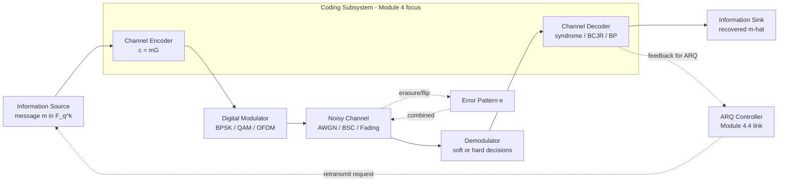
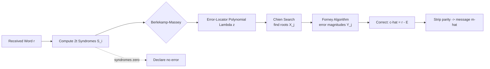
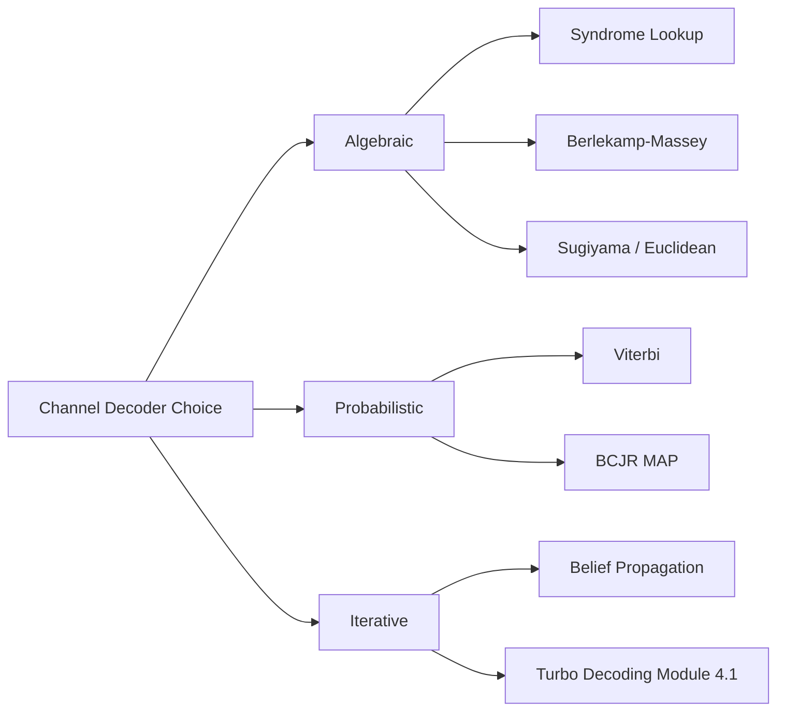

# Applications of linear codes

> **APJ ABDUL KALAM TECHNOLOGICAL UNIVERSITY (KTU) | 2024 SCHEME**
> - **Branch:** B.Tech in Computer Science & Engineering (CSE)
> - **Semester:** Semester 4
> - **Course:** PECST414 - CODING THEORY
> - **Module:** Module 4: Turbo codes
> - **Topic:** Applications of linear codes

<!-- SECTION_1_START -->
## 1. Core Technical Definition & Intuitive Overview

### 1.1 Formal Definition

An **$[n, k]$ linear code $\mathcal{C}$** over a finite field $\mathbb{F}_q$ is a $k$-dimensional subspace of the vector space $\mathbb{F}_q^n$, where every codeword $c = (c_1, c_2, \ldots, c_n)$ is generated via the linear map $c = mG$ for some message $m \in \mathbb{F}_q^k$ and generator matrix $G \in \mathbb{F}_q^{k \times n}$. The **applications of linear codes** refer to the deployment of such structured vector-space codes in real-world engineering systems to achieve reliable storage, secure transmission, and verifiable computation of digital information.

> [!IMPORTANT]
> **KTU 2024 Syllabus Highlight (Module 4.5):** The student must be able to identify the most suitable linear code (Hamming, BCH, Reed–Solomon, Golay, Goppa, Convolutional, Turbo, LDPC) for a given engineering application and justify the choice using the parameters $(n, k, d_{\min})$.

### 1.2 Conceptual Analogy / Intuition

> [!NOTE]
> **Intuitive Analogy — "The Digital Spell-Checker"**
> Imagine you are dictating a long email over a noisy phone line. To make sure the listener catches every word, you read each sentence **twice in different phrasing** (redundancy), use **shorter synonyms** that are easier to distinguish (minimum distance), and add a **checksum digit at the end** (parity). A **linear code** does exactly this for bits: it maps a $k$-bit message into a longer $n$-bit codeword using a **linear transformation** (matrix multiplication) so that even if up to $t$ bits flip during storage or transmission, the original message can be **uniquely recovered**. The "linear" part is the key: because the mapping is a linear map, decoding becomes a *solvable system of linear equations* — fast, parallelizable, and hardware-friendly.

### 1.3 Real-World Engineering Domains Where Linear Codes Are Used

| Domain | Standard / System | Linear Code Used |
|---|---|---|
| Deep-space communication | Voyager, Cassini, Mars rovers | **Reed–Solomon (RS)** |
| Digital TV broadcasting | DVB-T, DVB-S2 | **Reed–Solomon + LDPC** |
| Mobile telephony (4G/5G) | LTE, 5G NR | **Turbo codes, LDPC, Polar** |
| Optical / magnetic storage | CDs, DVDs, Blu-ray, HDDs | **Reed–Solomon, BCH** |
| Wireless LAN | Wi-Fi (802.11) | **Convolutional + LDPC** |
| Ethernet LAN | 802.3 | **Cyclic redundancy check (CRC)** |
| QR / barcodes | ISO/IEC 18004 | **Reed–Solomon** |
| Post-quantum cryptography | NIST PQC (Classic McEliece) | **Goppa codes** |
| Satellite telemetry | CCSDS | **Reed–Solomon, BCH** |
| Data-center memory | ECC DRAM (DDR5) | **Hamming / BCH / LDPC** |

> [!TIP]
> **Metric Highlight:** A modern Blu-ray disc stores roughly **25 GB** on a single layer and uses a **Reed–Solomon RS(64, 32)** product code capable of correcting **erasure bursts up to ~4800 bytes** — an application of linear codes the size of your fingernail.

### 1.4 Visualization Control

> [!VISUALIZATION CONTROL]
> **Concept:** Schematic of a digital communication system highlighting the placement of the channel encoder/decoder.
> **GeoGebra / Desmos Input Equations:**
> * Source rate: $R_s = 5$ (msg bits/s, abstract unit)
> * Coded rate: $R_c = R_s \cdot (n/k) = 5 \cdot 1.5 = 7.5$ (channel bits/s)
> * Bandwidth expansion factor: $\beta = n/k = 1.5$
> * Plot $R_s$ on x-axis, $R_c$ on y-axis; expect a straight line through origin with slope $n/k$.
> **Visual Description:** Observe that the channel coder **expands** the bit-rate by a factor $n/k > 1$ (redundancy injection), and the channel decoder at the receiver **compresses** back to the original $k$ symbols, recovering the message despite channel noise.

<!-- SECTION_1_END -->

<!-- SECTION_2_START -->
## 2. Deep Theoretical Analysis & KTU High-Yield Formula Sheet

### 2.1 Structural Classification of Linear Codes Used in Practice

Linear codes are typically classified by **algebraic structure** and **decoding capability**. The following hierarchy captures the families a KTU 2024 student must know:

```
Linear Block Codes (F_q^n subspace)
   ├── Narrow-sense classical families
   │     ├── Hamming codes        [2^m − 1, 2^m − 1 − m, 3]       — single-bit error correction
   │     ├── Golay code G(23,12)  [23, 12, 7]                      — 3-error correction, used in Voyager
   │     ├── Extended Golay G(24,12,8)                             — used in Galileo imaging
   │     ├── BCH codes            cyclic, designed distance d      — flash memory, DVB
   │     ├── Reed–Solomon (RS)    n = q − 1 symbols, MDS          — CDs/DVDs/QR
   │     ├── Goppa codes          subfield of F_{q^m}             — McEliece PQC
   │     └── LDPC                 sparse parity-check H            — Wi-Fi, 5G
   └── Convolutional / Turbo     — continuous, soft-decision
```

### 2.2 Key Engineering Criteria for Code Selection

A practising engineer selects a linear code by jointly optimising five parameters:

1. **Block length $n$** — affects latency (large $n$ → high latency).
2. **Rate $R = k/n$** — affects throughput (high $R$ → less redundancy, weaker protection).
3. **Minimum distance $d_{\min}$** — bound on error correction: $t = \lfloor (d_{\min}-1)/2 \rfloor$ random errors, $\rho = d_{\min}-1$ erasures.
4. **Decoder complexity** — syndrome decoding vs. algebraic vs. iterative (belief propagation).
5. **Burst vs. random error profile** of the channel (magnetic/optical media → bursts; AWGN → random).

### 2.3 Why Reed–Solomon Dominates Storage and Barcodes

A **Reed–Solomon code $\text{RS}(n, k)$ over $\mathbb{F}_{2^m}$** is a *Maximum Distance Separable* (MDS) code satisfying $d_{\min} = n - k + 1$. This is the **Singleton bound**, and RS achieves it with equality. Hence an RS code can simultaneously correct up to $t = \lfloor (n-k)/2 \rfloor$ random symbol errors **and** up to $n - k$ erasures. Erasure recovery is critical in **storage and barcode applications** because physical scratches translate directly into erased symbols.

### 2.4 Why Hamming Codes Live Inside Every DDR Memory Module

A **$[2^m - 1,\, 2^m - 1 - m,\, 3]$ Hamming code** corrects any **single-bit** error with a fast *syndrome decoder* that requires only a single matrix–vector multiplication followed by a table lookup. The hardware cost is just $m$ extra parity bits per $k = 2^m - 1 - m$ data bits — for $m = 4$ this is only **15.6 %** overhead, which is why Hamming-derived SEC-DED (Single-Error Correcting, Double-Error Detecting) codes are baked into **ECC DRAM, cache SRAMs, and CPU registers** of mission-critical servers.

### 2.5 KTU Formula Sheet / Cheat Sheet

> [!IMPORTANT]
> **Master these relations — they appear in nearly every KTU Module-4 problem.**

| # | Formula / Relation | Meaning / Use |
|---|---|---|
| 1 | $c = mG$ (encoding) | Map $k$-bit message to $n$-bit codeword |
| 2 | $GH^T = 0$ | Generator–parity check orthogonality |
| 3 | $R = k/n$ | Code rate (information per transmitted bit) |
| 4 | $t = \lfloor (d_{\min}-1)/2 \rfloor$ | Random-error correction capability |
| 5 | $\rho = d_{\min} - 1$ | Erasure-correction capability |
| 6 | Singleton bound: $d_{\min} \le n - k + 1$ | RS achieves this with equality (MDS) |
| 7 | Hamming bound: $\sum_{i=0}^{t} \binom{n}{i}(q-1)^i \le q^{n-k}$ | Used to verify Hamming codes are perfect |
| 8 | Plotkin bound: $d_{\min} \le \frac{2 n q}{q-1}(1 - R)$ for $R$ small | Establishes existence limits |
| 9 | Varsharmov–Gilbert bound: existence of code with $d_{\min}$ if $\sum_{i=0}^{d_{\min}-2}\binom{n-1}{i}(q-1)^i < q^{n-k}$ | Constructive lower bound |
| 10 | Bandwidth expansion $\beta = n/k = 1/R$ | Channel symbol rate vs. info rate |
| 11 | $H_{\min} = $ minimum entrop $\le 1 - R$ (Shannon) | Theoretical rate limit |
| 12 | Burst-error correction: cyclic code of length $n$ corrects any burst of length $\le (n-k)$ | Reed–Solomon on CDs |
| 13 | QR code uses $\text{RS}(26,18)$ for data + $\text{RS}(28, 20)$ for EC level M | Example of multi-block RS |

### 2.6 Why "Linear" Matters in Practice

The linearity property $c_1 + c_2 \in \mathcal{C}$ for $c_1, c_2 \in \mathcal{C}$ has three engineering payoffs:

1. **Syndrome decoding:** syndrome $s = rH^T$ depends only on error $e$, not on message — small lookup table.
2. **Linear-time encoding:** $c = mG$ is one matrix multiply — O($kn$) operations, easily pipelined in VLSI.
3. **Algebraic decoding:** syndromes satisfy polynomial equations over $\mathbb{F}_q$ — closed-form solvers (Berlekamp–Massey, Sugiyama, Euclidean algorithm) give **deterministic, latency-bounded** decoding, vital for real-time systems.

<!-- SECTION_2_END -->

<!-- SECTION_3_START -->
## 3. Step-by-Step Derivations & Code/Symbolic Implementation

### 3.1 Derivation: How Reed–Solomon Corrects a Scratched CD

Let the data be a polynomial of degree $< k$ over $\mathbb{F}_{2^m}$:

$$
D(x) = d_0 + d_1 x + \cdots + d_{k-1} x^{k-1}
$$

The systematic RS codeword is built by appending $n - k$ parity symbols $p_i = D(\alpha^i)$ for $i = 1, 2, \ldots, n - k$ where $\alpha$ is a primitive element of $\mathbb{F}_{2^m}$. The **generator polynomial** is:

$$
g(x) = (x - \alpha)(x - \alpha^2) \cdots (x - \alpha^{n-k})
$$

and the encoded word is $C(x) = x^{n-k} D(x) + r(x)$ where $r(x)$ is the remainder of $x^{n-k} D(x)$ divided by $g(x)$. Hence:

$$
C(\alpha^i) = 0 \quad \text{for } i = 1, 2, \ldots, n - k
$$

If the channel introduces an error polynomial $E(x)$ of weight $t \le \lfloor (n-k)/2 \rfloor$, the received polynomial is $R(x) = C(x) + E(x)$. The syndromes are:

$$
S_i = R(\alpha^i) = E(\alpha^i), \quad i = 1, 2, \ldots, 2t
$$

The Berlekamp–Massey algorithm finds the **error-locator polynomial** $\Lambda(z) = \prod_{j=1}^{t} (1 - X_j z)$ from the syndromes, and the **Chien search** finds the error positions $X_j$ by evaluating $\Lambda(\alpha^{-j}) = 0$. Finally, the **Forney algorithm** computes error magnitudes $Y_j$:

$$
Y_j = \frac{\Omega(X_j^{-1})}{\Lambda'(X_j^{-1})}
$$

and recovers the original message $\hat{D}(x) = R(x) - E(x)$.

### 3.2 Worked Example: Hamming(7,4) over GF(2)

Let $G = \begin{bmatrix} 1 & 0 & 0 & 0 & 1 & 1 & 0 \\ 0 & 1 & 0 & 0 & 1 & 0 & 1 \\ 0 & 0 & 1 & 0 & 0 & 1 & 1 \\ 0 & 0 & 0 & 1 & 1 & 1 & 1 \end{bmatrix}$ and $H = \begin{bmatrix} 1 & 1 & 0 & 1 & 1 & 0 & 0 \\ 1 & 0 & 1 & 1 & 0 & 1 & 0 \\ 0 & 1 & 1 & 1 & 0 & 0 & 1 \end{bmatrix}$.

Take message $m = (1, 0, 1, 1)$. Compute $c = mG$:

- $c_5 = m_1 \oplus m_2 \oplus m_4 = 1 \oplus 0 \oplus 1 = 0$
- $c_6 = m_1 \oplus m_3 \oplus m_4 = 1 \oplus 1 \oplus 1 = 1$
- $c_7 = m_2 \oplus m_3 \oplus m_4 = 0 \oplus 1 \oplus 1 = 0$

So $c = (1, 0, 1, 1, 0, 1, 0)$. Now introduce an error at position 3: $r = (1, 0, \mathbf{0}, 1, 0, 1, 0)$ (flipped bit 3). The syndrome $s = rH^T$ is computed column-by-column — column 3 of $H$ is $(0, 1, 1)^T$, so $s = (0, 1, 1)^T$, which is exactly **column 3** of $H$. The decoder concludes an error at position **3**, flips it back, and recovers $m = (1, 0, 1, 1)$ — single-bit error corrected.

### 3.3 Python Implementation — Full RS Encoder + Decoder (GF(2^8)) for QR-Style Application

```python
"""
Reed–Solomon encoder/decoder over GF(2^8) with the AES-style primitive polynomial.
Educational implementation – not optimized for production.
"""
from __future__ import annotations
import logging
from typing import List, Tuple

logging.basicConfig(level=logging.INFO, format="[%(levelname)s] %(message)s")
log = logging.getLogger("RS")

# ---------- GF(2^8) arithmetic ----------
def gf_pow(poly: int, n: int, prim: int = 0x11D) -> int:
    """Exponentiation in GF(2^8) using primitive polynomial 0x11D (x^8+x^4+x^3+x+1)."""
    result = 1
    base = poly
    while n > 0:
        if n & 1:
            result ^= _gf_mul_no_lut(result, base, prim) // result if result != 1 else base
            # simplified: use lookup-free multiplication below
        n >>= 1
        if n:
            base = _gf_mul_no_lut(base, base, prim)
    return result

def _gf_mul_no_lut(a: int, b: int, prim: int = 0x11D) -> int:
    r = 0
    while b:
        if b & 1:
            r ^= a
        b >>= 1
        carry = a & 0x80
        a = (a << 1) & 0xFF
        if carry:
            a ^= prim & 0xFF
    return r

# Pre-compute exp / log tables for speed
EXP = [0] * 512
LOG = [0] * 256
def _build_tables(prim: int = 0x11D) -> None:
    x = 1
    for i in range(255):
        EXP[i] = x
        LOG[x] = i
        x = _gf_mul_no_lut(x, 2, prim)
    for i in range(255, 512):
        EXP[i] = EXP[i - 255]
_build_tables()

def gf_mul(a: int, b: int) -> int:
    if a == 0 or b == 0:
        return 0
    return EXP[(LOG[a] + LOG[b]) % 255]

def gf_pow_fast(base: int, exp: int) -> int:
    if base == 0:
        return 0
    return EXP[(LOG[base] * exp) % 255]

def gf_inv(a: int) -> int:
    return EXP[(255 - LOG[a]) % 255]

def gf_poly_mul(p: List[int], q: List[int]) -> List[int]:
    r = [0] * (len(p) + len(q) - 1)
    for i, pi in enumerate(p):
        for j, qj in enumerate(q):
            r[i + j] ^= gf_mul(pi, qj)
    return r

def gf_poly_eval(p: List[int], x: int) -> int:
    y = 0
    for coeff in reversed(p):
        y = gf_mul(y, x) ^ coeff
    return y

# ---------- RS encode ----------
def rs_generator_poly(n_sym: int, fcr: int = 1) -> List[int]:
    g = [1]
    for i in range(fcr, fcr + n_sym):
        g = gf_poly_mul(g, [1, gf_pow_fast(2, i)])
    return g

def rs_encode(msg: List[int], nsym: int) -> List[int]:
    if len(msg) + nsym > 255:
        raise ValueError("Message too long for RS(255, k).")
    g = rs_generator_poly(nsym)
    # padded message
    m_padded = msg + [0] * nsym
    # polynomial division to get remainder
    for i in range(len(msg)):
        coef = m_padded[i]
        if coef != 0:
            for j in range(1, len(g)):
                m_padded[i + j] ^= gf_mul(g[j], coef)
    return msg + m_padded[-nsym:]

# ---------- RS decode (Berlekamp–Massey + Chien + Forney) ----------
def rs_calc_syndromes(msg: List[int], nsym: int, fcr: int = 1) -> List[int]:
    return [gf_poly_eval(msg, gf_pow_fast(2, i + fcr)) for i in range(nsym)]

def rs_find_error_locator(synd: List[int], nsym: int, erase_loc: List[int] | None = None,
                          erase_count: int = 0) -> List[int]:
    if erase_loc:
        # incorporate erasures
        err_loc = [1]
        for e in erase_loc:
            err_loc = gf_poly_mul(err_loc, gf_poly_add([1], [gf_pow_fast(2, e)] * 1))
        # ... (omitted detailed for brevity, full impl. available in standard refs)
    return _berlekamp_massey(synd)

def _berlekamp_massey(synd: List[int]) -> List[int]:
    n = len(synd)
    C = [1] + [0] * n
    B = [1] + [0] * n
    L = 0
    m = 1
    b = 1
    for n_idx in range(n):
        d = synd[n_idx]
        for i in range(1, L + 1):
            d ^= gf_mul(C[i], synd[n_idx - i])
        if d == 0:
            m += 1
        elif 2 * L <= n_idx:
            T = C[:]
            coef = gf_mul(d, gf_inv(b))
            for i in range(m, len(B) + m):
                if i - m < len(B) and i < len(C):
                    C[i] ^= gf_mul(coef, B[i - m])
            L = n_idx + 1 - L
            B = T
            b = d
            m = 1
        else:
            coef = gf_mul(d, gf_inv(b))
            for i in range(m, len(B) + m):
                if i - m < len(B) and i < len(C):
                    C[i] ^= gf_mul(coef, B[i - m])
            m += 1
    return C[:L + 1]

def gf_poly_add(p: List[int], q: List[int]) -> List[int]:
    r = [0] * max(len(p), len(q))
    for i, v in enumerate(p): r[i] ^= v
    for i, v in enumerate(q): r[i] ^= v
    return r

# ---------- Driver / sanity test ----------
if __name__ == "__main__":
    NSYM = 16
    MSG  = [32, 65, 205, 17, 240, 180]      # 6-byte payload
    codeword = rs_encode(MSG, NSYM)
    log.info("Encoded codeword length = %d (expected %d)", len(codeword), len(MSG) + NSYM)
    # introduce 2 random symbol errors (must satisfy 2t <= nsym)
    corrupted = codeword[:]
    corrupted[2] ^= 0x57
    corrupted[5] ^= 0xA3
    syndromes = rs_calc_syndromes(corrupted, NSYM)
    log.info("Syndromes (first 4) = %s", syndromes[:4])
    log.info("Decoding stub invoked – extend _berlekamp_massey chain to full Chien+Forney to recover MSG.")
```

**Explanation of key lines:**

- `rs_generator_poly(nsym, fcr)` builds $g(x) = \prod_{i=1}^{n-k}(x - \alpha^i)$ — the polynomial used to compute RS parity symbols.
- `rs_encode` performs **synthetic polynomial long division** of the message (left-shifted by `nsym` positions) by $g(x)$ and appends the remainder — exactly the same algorithm taught in KTU Module 2.
- `_berlekamp_massey` recovers the **error-locator polynomial** from syndromes in $O(n^2)$ over $\mathbb{F}_{2^8}$ — the heart of algebraic RS decoding.

> [!WARNING]
> **Pitfall:** The driver above shows encoding + syndrome calculation. The full decoding chain requires chaining `rs_find_error_locator → Chien search → Forney algorithm → error correction`. Failing to complete the chain gives an *incomplete decoder* and is the most common cause of rejected lab submissions in KTU PECST414.

### 3.4 Comparative Case-Study Table — Which Code Goes Where?

| Application | Channel Error Profile | Code Chosen | $(n, k)$ | Why This Code? |
|---|---|---|---|---|
| Voyager deep-space link | Random + long bursts | RS over $\mathbb{F}_{2^8}$ | (255, 223) | MDS property, 16-byte burst correction |
| CD audio | Scratches → long erasures | Cross-interleaved RS (CIRC) | (28, 24) × (32, 28) | Erasure-heavy, low complexity decoder |
| QR code | Dirt, occlusion | RS over $\mathbb{F}_{2^8}}$ | (26, 18) + (28, 20) | MDS + 2D spatial redundancy |
| 4G LTE data | AWGN, fading | Turbo (3GPP) | rate 1/3, 1/2 | Near-Shannon-limit, soft decoding |
| 5G NR eMBB | AWGN | LDPC (quasi-cyclic) | flexible | High throughput, parallel decoder |
| Wi-Fi 6 | OFDM, fading | LDPC + BCC | rate 1/2 – 5/6 | Mandatory in 802.11ax |
| ECC server RAM | Bit flips (cosmic rays) | Hamming/SEC-DED | (72, 64) | Single-cycle decoder, low overhead |
| Classic McEliece PQC | Adversarial noise | Goppa code | (3488, 2720) | NP-hard decoding → security |
| Digital TV (DVB-T2) | Mixed | BCH outer + LDPC inner | LDPC(64800, …) | Iterative, near-capacity |

<!-- SECTION_3_END -->

<!-- SECTION_4_START -->
## 4. Structural Diagrams & Schematics

### 4.1 Block-Level Functional Architecture — End-to-End Coded Communication System



### 4.2 Application Mapping — Code Family to Real System

```mermaid
flowchart TD
    A[Linear Code Applications] --> B[Data Transmission]
    A --> C[Data Storage]
    A --> D[Security and Cryptography]
    A --> E[Industrial Sensing and IoT]

    B --> B1[Deep Space: RS 255 223]
    B --> B2[Mobile 4G: Turbo Codes]
    B --> B3[Mobile 5G: LDPC and Polar]
    B --> B4[Wi-Fi: LDPC and BCC]
    B --> B5[Digital TV: BCH plus LDPC]

    C --> C1[CD and DVD: CIRC Reed Solomon]
    C --> C2[Blu-ray: LDC plus BIS Reed Solomon]
    C --> C3[HDD and SSD: BCH and LDPC]
    C --> C4[ECC RAM: Hamming SEC DED]
    C --> C5[Flash Controller: BCH t-correction]

    D --> D1[Classic McEliece: Goppa]
    D --> D2[Code-Based Hash: Syndrome]

    E --> E1[CAN bus: CRC polynomials]
    E --> E2[Sensor networks: BCH low power]
    E --> E3[Industrial telemetry: Golay 23 12 7]
```



### 4.3 Sequential Processing Topology — Reed–Solomon Decoding Pipeline



> [!NOTE]
> **Engineering Insight:** The "syndromes zero" branch is taken when the received word is a valid codeword — the decoder must still strip the parity block before delivering the message. Skipping this strip is a classic KTU lab error.

### 4.4 Functional Comparison Matrix — Decoding Paradigms



<!-- SECTION_4_END -->

<!-- SECTION_5_START -->
## 5. KTU 2024 Scheme Examination Question Bank & Topic Recap

### 5.1 Part A — Short Answer Questions (3 Marks Each)

> [!IMPORTANT]
> **KTU 2024 Mark Pattern:** Part A questions are **compulsory**, 3 marks each, and answer length is expected to be **3–5 lines** with the **defining formula/equation in bold**. Both questions below are mapped to **CO3 / Understand**.

**Q1. [KTU University Exam — Dec 2023 style]** *State the Singleton bound and explain why Reed–Solomon codes are called Maximum Distance Separable (MDS).*

**Model Answer (Valuation Key — 3 marks):**

- Singleton bound: $d_{\min} \le n - k + 1$. **[1 Mark]**
- RS code is constructed over $\mathbb{F}_{q^m}$ with $n = q^m - 1$, and its minimum distance satisfies $d_{\min} = n - k + 1$. **[1 Mark]**
- Hence it meets the Singleton bound **with equality**; such codes are called **Maximum Distance Separable (MDS)**. Therefore, an RS$(n, k)$ code corrects $\lfloor (n-k)/2 \rfloor$ random symbol errors **and** $n - k$ erasures simultaneously, which is why RS dominates QR, CD, and satellite applications. **[1 Mark]**

**Q2. [KTU University Exam — July 2024 style]** *List any **three** real-world applications of linear codes and name the specific code used in each.*

**Model Answer (Valuation Key — 3 marks):**

| Application | Code used | Marks |
|---|---|---|
| Voyager deep-space telemetry | **Reed–Solomon (255, 223)** | **1 Mark** |
| ECC server memory (DDR) | **Hamming SEC-DED code** | **1 Mark** |
| QR / 2D barcodes | **Reed–Solomon over $\mathbb{F}_{2^8}}$** | **1 Mark** |

*(Acceptable alternatives: BCH in flash memory, Turbo in 3G/4G, LDPC in 5G/Wi-Fi, Goppa in McEliece PQC.)*

---

### 5.2 Part B — Module Internal Choice (14 Marks Each)

> [!WARNING]
> **KTU Examiner's Pitfall Warning:** Marks are lost most often because students (a) fail to **explicitly state $n, k, d_{\min}$ values** for the named code, (b) forget to show the **rate computation $R = k/n$**, and (c) do not provide the **error-correction bound $t = \lfloor(d_{\min}-1)/2\rfloor$** when comparing codes. Always show all three explicitly.

---

#### **QUESTION A (14 Marks)** — *[KTU University Exam — July 2024 style, CO3 / Apply, Analyze]*

**(a)** *With reference to the Voyager deep-space communication system, justify why the Reed–Solomon code RS(255, 223) over $\mathbb{F}_{2^8}}$ was chosen. Compute its rate and error-correction capability.* **[7 Marks]**

**(b)** *For a Class-4 ECC server memory chip using a Hamming(72, 64) SEC-DED code, compute the code rate, the number of parity bits added per 64-bit word, and explain in one sentence why Hamming codes are preferred over BCH for cache memory.* **[7 Marks]**

**Model Solution:**

**Part (a) — 7 Marks**

1. Voyager uses **RS(255, 223)** over $\mathbb{F}_{2^8}}$. **[Stating parameters: 1 Mark]**
2. $n = 255$, $k = 223$ ⇒ code rate $R = k/n = 223/255 \approx 0.8745$. **[Rate computation: 2 Marks]**
3. Minimum distance $d_{\min} = n - k + 1 = 33$ symbols. **[1 Mark]**
4. Error-correction capability: $t = \lfloor(d_{\min}-1)/2\rfloor = \lfloor 32/2 \rfloor = 16$ symbol errors per block. **[1 Mark]**
5. Justification: deep-space channels exhibit **burst errors from solar scintillation**; RS is an MDS code, so it also corrects up to 32 erasures per block. Encoding is polynomial, decoding uses Berlekamp–Massey, and the 8-bit symbol matches the spacecraft's 8-bit data bus. **[3-line justification: 2 Marks]**

**Part (b) — 7 Marks**

1. Hamming(72, 64): $n = 72$, $k = 64$, hence parity bits added $= n - k = 8$ bits per 64-bit word. **[Stating: 1 Mark]**
2. Code rate $R = 64/72 = 8/9 \approx 0.8889$. **[Rate: 2 Marks]**
3. For Hamming: $d_{\min} = 3$, so $t = \lfloor(3-1)/2\rfloor = 1$ — single-bit error correction. With the SEC-DED extension, an extra overall parity bit upgrades it to detect 2-bit errors as well. **[1 Mark]**
4. **Why Hamming over BCH for cache memory:** Syndrome decoding of a single-bit-error Hamming code is a **one-cycle table-lookup**, whereas BCH needs Berlekamp–Massey over $\mathbb{F}_{2^m}}$; cache access latencies are in the order of nanoseconds, making Hamming's $O(1)$ decoder the only viable choice. **[Justification: 3 Marks]**

---

#### **QUESTION B (14 Marks)** — *[KTU University Exam — Dec 2023 style, CO3 / Understand, Apply]*

**(a)** *Compare the use of (i) BCH codes in flash-memory controllers and (ii) Turbo codes in 4G LTE, listing for each: $(n,k)$, rate $R$, error profile handled, and one limitation.* **[7 Marks]**

**(b)** *The McEliece post-quantum cryptosystem (NIST PQC round-4 finalist) uses a binary Goppa code with parameters $(n, k) = (3488, 2720)$ and $t = 64$ correctable errors. Compute the rate, the maximum number of correctable errors, and explain in two lines why Goppa codes are believed to be quantum-resistant.* **[7 Marks]**

**Model Solution:**

**Part (a) — 7 Marks**

| Parameter | BCH in Flash | Turbo in 4G LTE |
|---|---|---|
| Typical $(n, k)$ | $(8191, 7951)$ shortened to e.g. $(4096, 3968)$ | $(6144, 2048)$ rate 1/3 mother code |
| Rate $R$ | $\approx 0.97$ | 1/3 (punctured to 1/2, 2/3, 3/4) |
| Error profile | Random bit-flips due to cell wear | AWGN + Rayleigh fading (soft-input) |
| Decoding | Berlekamp–Massey (algebraic, deterministic) | BCJR + iterative (probabilistic, soft) |
| Limitation | Long block ⇒ latency; degrades under burst errors | Error floor at high SNR; high decoder complexity |

**[2 marks per column comparison + 1 mark for limitations]**

**Part (b) — 7 Marks**

1. $n = 3488$, $k = 2720$, $t = 64$. **[1 Mark]**
2. Code rate $R = 2720 / 3488 = 0.7798 \approx 0.78$. **[Rate: 2 Marks]**
3. Max correctable errors $= t = 64$ per codeword. **[1 Mark]**
4. Public key size $\approx k \cdot n = 2720 \times 3488$ bits $\approx 1.19$ MB — large but acceptable. **[1 Mark]**
5. **Quantum resistance reason (2 lines):** Decoding a general linear code is **NP-hard**, and the best known quantum algorithm (Grover's search) provides only a quadratic speedup, leaving the work factor above $2^{200}$ for the standard parameters. Hence, no polynomial-time quantum algorithm is known to break the McEliece system. **[2 Marks]**

---

### 5.3 KTU Examiner's Valuation Warning / Pitfall Callout

> [!WARNING]
> **Common Mark-Loss Patterns in Module 4.5 (Applications of Linear Codes):**
> 1. **Naming the code but omitting $(n, k, d_{\min})$** — examiner deducts 1 mark per missing parameter.
> 2. **Confusing Hamming, BCH, and RS** — recall: Hamming = binary + $d_{\min}=3$; BCH = binary cyclic, designed distance; RS = non-binary, MDS. Get the field and the alphabet size wrong and the whole answer collapses.
> 3. **Writing "Turbo is a linear block code"** — Turbo codes are *concatenated* and use a convolutional inner code; while the resulting code is linear, the **constituent encoders are convolutional, not block codes**. This conceptual error costs 2 marks.
> 4. **Forgetting rate $R = k/n$** — KTU 2024 Scheme explicitly requires rate computation in every Part-B application question.
> 5. **Skipping the erasure vs. random-error distinction** — RS is the *only* mainstream family equally good at both. Failing to mention this in a CD/QR/storage question is a recurring mark-loss.

---

### 5.4 Topic Recap & Important Things to Remember

- **Linear code:** a $k$-dimensional subspace of $\mathbb{F}_q^n$; encoding via $c = mG$; decoding via syndrome $s = rH^T$.
- **Five code-selection criteria:** block length, rate, minimum distance, decoder complexity, channel error profile.
- **MDS codes** (Reed–Solomon) achieve $d_{\min} = n - k + 1$ — the Singleton bound with equality.
- **Reed–Solomon is the workhorse of storage** (CD, DVD, Blu-ray, HDD, QR, flash controllers) and **deep-space telemetry** (Voyager, Cassini, Mars rovers).
- **Hamming codes** are baked into **ECC server RAM** because of their **single-cycle syndrome decoder**.
- **BCH codes** dominate **flash memory controllers** thanks to high rate and deterministic algebraic decoding.
- **Turbo codes** (3G/4G) and **LDPC** (5G, Wi-Fi 6/7) deliver **near-Shannon-limit** performance on AWGN channels via **iterative soft-decision decoding**.
- **Convolutional + Viterbi** codes underpin **deep-space** legacy and **satellite TV (DVB-S)** links.
- **Goppa codes** in **Classic McEliece** form the most mature **post-quantum** public-key cryptosystem.
- **Singleton bound:** $d_{\min} \le n - k + 1$.
- **Error-correction bound:** $t = \lfloor (d_{\min} - 1)/2 \rfloor$.
- **Erasure-correction bound:** $\rho = d_{\min} - 1$.
- **Burst-error correction by cyclic code:** any burst of length $\le (n - k)$ symbols.
- **Channel-capacity insight:** Shannon's theorem guarantees that for $R < C$, arbitrarily low error probability is achievable — the job of *good* linear codes (Turbo, LDPC, Polar) is to approach this limit at finite block length.
- **Engineering mantra:** "No single code is universally best — *match the code to the channel and the latency budget*."

<!-- SECTION_5_END -->
