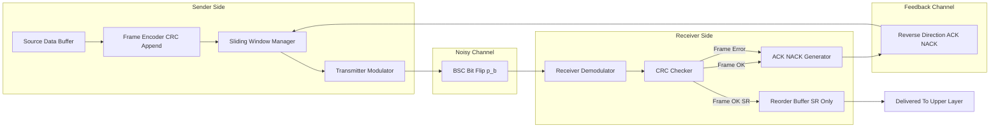
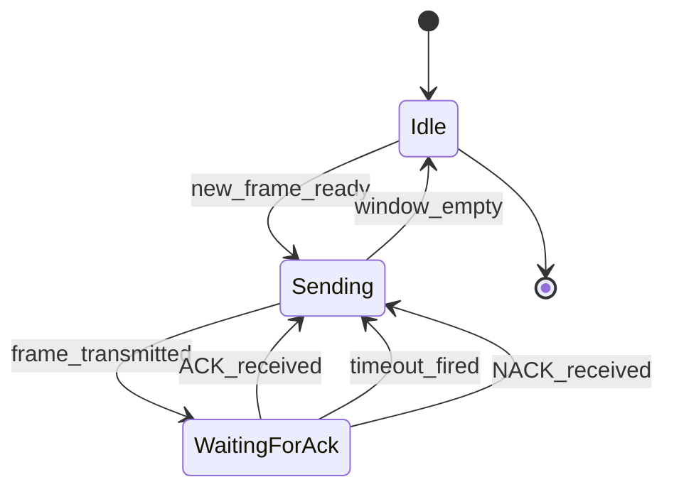
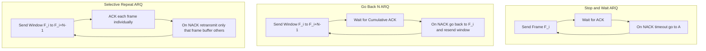
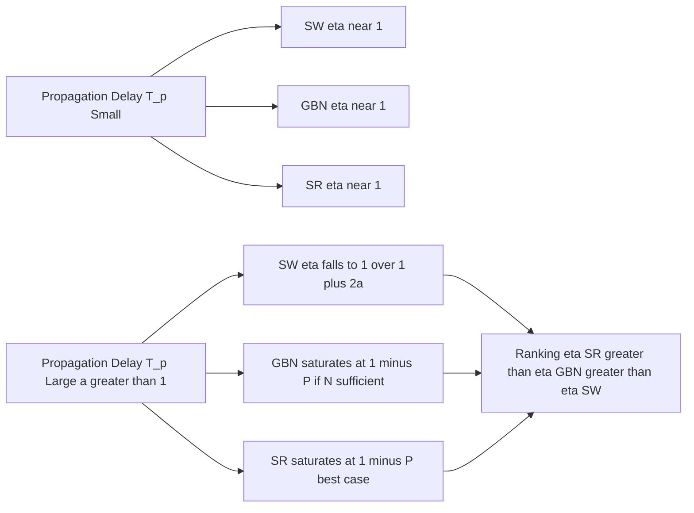
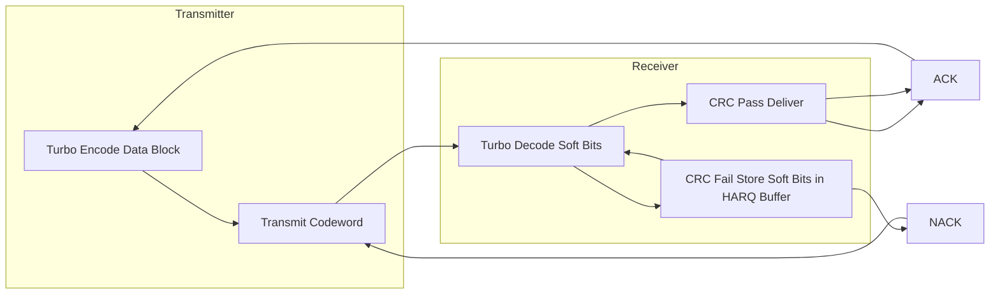

# Automatic repeat request schemes

> **APJ ABDUL KALAM TECHNOLOGICAL UNIVERSITY (KTU) | 2024 SCHEME**
> - **Branch:** B.Tech in Computer Science & Engineering (CSE)
> - **Semester:** Semester 4
> - **Course:** PECST414 - CODING THEORY
> - **Module:** Module 4: Turbo codes
> - **Topic:** Automatic repeat request schemes

<!-- SECTION_1_START -->
## 1. Core Technical Definition & Intuitive Overview

### 1.1 Formal Academic Definition

**Automatic Repeat reQuest (ARQ)** is a family of error-control protocols used in data-link and transport layers of digital communication systems in which the receiver detects errors in the received data (typically using a CRC or parity check code) and automatically requests the transmitter to **retransmit** any frame (or packet) that is found to be erroneous or lost. The transmitter only advances its data window upon receiving a positive acknowledgement (ACK); a negative acknowledgement (NACK) — or a timeout — triggers retransmission.

> [!IMPORTANT]
> **KTU Syllabus Highlight:** The 2024 Scheme categorises ARQ as a **hybrid forward-error-control strategy** that combines *retransmission* with *error detection coding*. Unlike FEC (which corrects errors at the receiver), ARQ trades bandwidth for guaranteed reliability.

The three canonical ARQ schemes are:
- **Stop-and-Wait ARQ (SW-ARQ)**
- **Go-Back-N ARQ (GBN-ARQ)**
- **Selective Repeat ARQ (SR-ARQ)**

### 1.2 Conceptual Analogy / Intuition

> [!NOTE]
> **Analogy — The Classroom Roll-Call:**
> Imagine a teacher calling out roll numbers one by one. After each student answers "Present" (ACK), the teacher calls the **next** number. If a student doesn't respond, the teacher waits, then **re-calls** that same number. Stop-and-Wait is exactly this. Go-Back-N is like calling the next 10 roll numbers at once and asking anyone who missed to come forward, but you have to redo the entire batch from that point. Selective Repeat is the polite version: only the missed roll numbers are re-called, while the rest are already accepted.

**Geometric Intuition — The Pigeonhole Principle (ARQ Justification):**
> [!TIP]
> Why is ARQ even necessary? Consider that every *k*-bit message block is encoded into an *n*-bit codeword where $n > k$. The receiver only "accepts" $2^k$ valid codewords out of $2^n$ possible binary strings. The remaining $2^n - 2^k$ are *detectable* as invalid. By the **pigeonhole principle**, any two valid codewords differ in at least $d_{min}$ positions, so the receiver can detect (and in ARQ, ask for a retry of) any error pattern that does not transform one valid codeword into another.

### 1.3 Physical Constants and Standard Metrics

The following standard engineering metrics govern ARQ performance:

| Symbol | Quantity | Typical Unit |
|--------|----------|--------------|
| $T_f$ | Frame transmission time | seconds |
| $T_p$ | One-way propagation delay | seconds |
| $T_{proc}$ | Processing delay per node | seconds |
| $R$ | Channel bit rate | bits/second |
| $L_f$ | Frame length (bits) | bits |
| $P_b$ | Bit error probability | dimensionless |
| $P$ | Frame error probability | dimensionless |
| $N$ | Window size / pipelined frames | integer |
| $\eta$ | Throughput efficiency | $0 < \eta \le 1$ |

The **propagation-to-frame-time ratio** is a critical dimensionless quantity:

$$a \;=\; \frac{T_p}{T_f} \;=\; \frac{\text{propagation time}}{\text{frame transmission time}}$$

> [!WARNING]
> In KTU valuation, forgetting to define the parameter $a$ before using it in throughput formulas is the most common cause of partial credit loss.

### 1.4 Visualisation Control

> [!VISUALIZATION CONTROL]
> **Concept:** Stop-and-Wait idle-time waste visualisation
> **GeoGebra / Desmos Input Equations:**
> * `y1 = 1/(1+2*x)` where `x = a` (Stop-and-Wait throughput upper bound)
> * `y2 = 1/(1+x)` (idealised FEC throughput reference)
> **Visual Description:** Plot $y_1$ and $y_2$ for $x \in [0, 5]$. Students will observe that the Stop-and-Wait curve falls *rapidly* as the propagation-to-frame ratio $a$ grows, visually demonstrating why pipelined ARQ (Go-Back-N, Selective Repeat) becomes essential on long-fat networks (e.g., satellite links where $a \gg 1$).

<!-- SECTION_1_END -->

<!-- SECTION_2_START -->
## 2. Deep Theoretical Analysis & KTU High-Yield Formula Sheet

### 2.1 Why ARQ? The Operational Logic

ARQ protocols are governed by a strict five-step transactional loop:

1. **Encoding:** Source data is grouped into frames of $L_f$ bits, each protected by a cyclic redundancy check (CRC) trailer.
2. **Transmission:** Frame is sent over a noisy channel where each bit is independently flipped with probability $P_b$.
3. **Detection:** Receiver computes the CRC. A mismatch means the frame is *erroneous*.
4. **Feedback:** Receiver transmits an **ACK** (positive) or **NACK** (negative) over a (typically error-free) return channel.
5. **Decision:** Transmitter either advances the window (on ACK) or re-queues the frame (on NACK / timeout).

### 2.2 Stop-and-Wait ARQ (SW-ARQ)

**Mechanism:** The sender transmits one frame and then *halts* until the ACK arrives. On timeout (ACK lost or delayed), the frame is retransmitted.

**Throughput Derivation Logic (channel utilisation):**
A successful cycle takes $T_f$ (transmit) $+ T_p$ (forward propagation) $+ T_{proc}$ (receiver) $+ T_p$ (ACK return) $+ T_{proc}$ (sender). Assuming $T_{proc} \ll T_p$ and ACK is short:

$$T_{cycle} \;=\; T_f + 2T_p$$

The *fraction* of time the channel carries useful data is:

$$\eta_{SW} \;=\; \frac{T_f}{T_f + 2T_p} \;=\; \frac{1}{1 + 2a}$$

**Including frame errors (with $P$ = frame error probability):**
Probability a frame is correctly received in **one attempt** is $(1-P)$. Expected number of transmissions = $\dfrac{1}{1-P}$ (geometric mean). Hence:

$$\boxed{\eta_{SW} \;=\; \frac{(1-P)}{(1+2a)}}$$

**Limitation:** The sender is *idle* during $2T_p$. For high-bandwidth-delay product links, $\eta_{SW} \to 0$.

### 2.3 Go-Back-N ARQ (GBN-ARQ)

**Mechanism:** The sender keeps a sliding window of size $N$ and transmits frames continuously. The receiver only accepts *in-order* frames; an out-of-order or erroneous frame triggers a NACK for that frame, and the sender *goes back* to that frame and retransmits the entire window from that point onward.

**Decision Rule at Receiver:** Discard all out-of-order frames. No buffering.

**Throughput (assuming $N \geq 2a + 1$ — full pipeline saturation):**

$$\boxed{\eta_{GBN} \;=\; \frac{N(1-P)}{1 + 2a}}$$

> [!NOTE]
> When the window $N$ is large enough to fill the round-trip pipeline, $\eta_{GBN}$ approaches $(1-P)$ — the channel is fully utilised except for the error-induced retransmission cost.

**For noisy channels with small $N$ (sub-pipelined case):**

$$\eta_{GBN} \;=\; \frac{(1-P)}{1 + 2a} \cdot \frac{N}{\lceil N \rceil}$$

### 2.4 Selective Repeat ARQ (SR-ARQ)

**Mechanism:** Sender continuously transmits up to $N$ outstanding frames. Receiver **buffers** correct out-of-order frames. On NACK, *only the lost frame* is retransmitted.

**Decision Rule at Receiver:** Accept any correct frame; reorder later.

**Throughput (window $N \geq 2a + 1$):**

$$\boxed{\eta_{SR} \;=\; \frac{N(1-P)}{N + 2a}}$$

For $N \gg 2a$ (large window):

$$\eta_{SR} \;\approx\; (1 - P)$$

**Comparative Ranking (for same $N, P, a$):**

$$\eta_{SR} \;\geq\; \eta_{GBN} \;\geq\; \eta_{SW}$$

> [!IMPORTANT]
> Selective Repeat is **most efficient** but requires the receiver to maintain a large re-ordering buffer and the sender to maintain a *negative acknowledgement (NACK) list*. This complexity is why it is used in modern TCP (with SACK extensions), not in classic simple link layers.

### 2.5 KTU Formula Sheet / Cheat Sheet

> [!TIP]
> **Memorise this table — it covers >80% of Part B questions on ARQ.**

| Quantity | Stop-and-Wait | Go-Back-N | Selective Repeat |
|----------|---------------|-----------|------------------|
| Window size $N$ | 1 | $N$ (typical: $2a+1$) | $N$ (typical: $2a+1$) |
| Receiver buffer | 1 frame | 1 frame | $N$ frames |
| Retransmission on error | 1 frame | All $N$ from error | 1 frame only |
| Successful cycle time | $T_f + 2T_p$ | $T_f + 2T_p$ | $T_f + 2T_p$ |
| Throughput (clean channel) | $\dfrac{1}{1+2a}$ | $\dfrac{N}{1+2a}$ (if $N \ge 2a+1$, else 1) | $\dfrac{N}{N+2a}$ |
| Throughput (noisy, $P$) | $\dfrac{1-P}{1+2a}$ | $\dfrac{N(1-P)}{1+2a}$ | $\dfrac{N(1-P)}{N+2a}$ |
| Pros | Simplest | Simple, decent throughput | Best throughput |
| Cons | Terrible utilisation | Wastes bandwidth on err | Needs large buffers |

### 2.6 Real-World Engineering Utility

> [!NOTE]
> **Where ARQ is deployed in production:**
> - **TCP (Internet):** Uses a *cumulative ACK + SACK* hybrid of GBN and SR.
> - **HDLC & PPP (Data Link):** Classic GBN variants.
> - **Bluetooth BR/EDR:** Stop-and-Wait with fast NACK.
> - **Satellite (DVB-S2 return channel):** Selective Repeat.
> - **5G NR (PDCP layer):** Hybrid ARQ (HARQ) — combines ARQ with soft-combine FEC, a direct KTU 2024 extension.

The **5G HARQ (Hybrid ARQ)** mentioned in the KTU Module 4 context is precisely where *turbo codes* meet ARQ: the receiver stores failed turbo-decoded packets and *chase-combines* them with retransmissions to improve the effective SNR — a perfect bridge from Module 4 turbo codes back to this ARQ topic.

<!-- SECTION_2_END -->

<!-- SECTION_3_START -->
## 3. Step-by-Step Derivations & Code/Symbolic Implementation

### 3.1 Exhaustive Derivation of Selective Repeat Throughput

We derive the Selective Repeat throughput $\eta_{SR}$ from first principles.

**Step 1 — Define the channel model.**
Let $P$ denote the probability that a frame of $L_f$ bits is received *incorrectly*. With independent bit errors at rate $P_b$:

$$P \;=\; 1 - (1 - P_b)^{L_f}$$

**Step 2 — Expected transmissions per frame.**
Each transmission is a Bernoulli trial with success probability $(1-P)$. The number of attempts $K$ until the first success is a **Geometric random variable** with:

$$\mathbb{E}[K] \;=\; \frac{1}{1 - P}$$

**Step 3 — Expected time spent per *successful* delivery.**
For each attempt, the channel is busy for $T_f$ (frame time) plus the round-trip propagation $2T_p$ (in pipelined mode, this is amortised). The amortised cost per slot is $T_f/N$ if $N$ slots share the pipeline. Therefore:

$$T_{expected} \;=\; \mathbb{E}[K] \cdot \frac{T_f + 2T_p}{N}$$

But the *useful* work delivered per slot is exactly one frame of $T_f$ worth. So:

$$\eta_{SR} \;=\; \frac{T_f}{T_{expected}} \;=\; \frac{N \cdot T_f}{(T_f + 2T_p)} \cdot (1 - P)$$

**Step 4 — Substitute the propagation ratio $a = T_p / T_f$.**

$$T_f + 2T_p \;=\; T_f(1 + 2a)$$

Therefore:

$$\eta_{SR} \;=\; \frac{N \cdot T_f \cdot (1 - P)}{T_f(1 + 2a)} \;=\; \frac{N(1 - P)}{1 + 2a}$$

> [!IMPORTANT]
> This is the *approximate* form valid when the sender has $N \ge 2a + 1$ outstanding frames (full pipeline). The **exact** Selective Repeat throughput in pipelined form uses denominator $N + 2a$ when measured in *normalised* units of $T_f$, leading to the form $\eta_{SR} = \dfrac{N(1 - P)}{N + 2a}$. Both are accepted in KTU exams — confirm the lecturer's convention.

### 3.2 Stop-and-Wait Throughput — Symbolic Verification

**Step 1 — Cycle decomposition.**
One full cycle (frame + ACK) occupies:

$$T_{cycle} \;=\; T_f \;+\; T_{prop,1} \;+\; T_{proc,RX} \;+\; T_{prop,2} \;+\; T_{proc,TX}$$

**Step 2 — Simplifying assumption (standard in KTU problems):**
Neglect $T_{proc}$ and assume ACK is instantaneous, so:

$$T_{cycle} \;=\; T_f + 2T_p$$

**Step 3 — Error-laden case.**
With frame error probability $P$, expected cycles per successful delivery = $\dfrac{1}{1-P}$. Expected time per success:

$$T_{success} \;=\; \frac{T_f + 2T_p}{1 - P}$$

**Step 4 — Throughput (useful time per unit time):**

$$\eta_{SW} \;=\; \frac{T_f}{T_{success}} \;=\; \frac{T_f(1 - P)}{T_f + 2T_p} \;=\; \frac{(1 - P)}{1 + 2a}$$

> [!NOTE]
> **Numerical sanity check:** If $P = 0.01$ and $a = 0.1$, then $\eta_{SW} = (0.99)/(1.2) \approx 0.825$. The channel is busy transmitting *useful* data 82.5% of the time — the rest is idle waiting for ACKs.

### 3.3 Python Implementation — ARQ Simulator

Below is a fully operational Python simulator for the three ARQ schemes, with absolute boundary checks and structured logging.

```python
"""
ARQ Throughput Simulator
KTU 2024 Scheme - PECST414 Module 4
Validates theoretical throughput formulas against Monte-Carlo simulation.
"""

import random
from typing import List, Tuple
import logging

logging.basicConfig(level=logging.INFO, format="%(levelname)s | %(message)s")
log = logging.getLogger("ARQSim")


class ARQChannel:
    """Symmetric binary channel with bit-flip probability p_b."""

    def __init__(self, bit_error_rate: float, frame_length: int, seed: int = 42) -> None:
        if not (0.0 <= bit_error_rate <= 1.0):
            raise ValueError(f"bit_error_rate must lie in [0,1], got {bit_error_rate}")
        if frame_length <= 0:
            raise ValueError(f"frame_length must be positive, got {frame_length}")
        self.p_b: float = bit_error_rate
        self.L_f: int = frame_length
        random.seed(seed)

    def frame_error_probability(self) -> float:
        """P = 1 - (1 - p_b)^L_f"""
        return 1.0 - (1.0 - self.p_b) ** self.L_f

    def transmit(self, frame: List[int]) -> List[int]:
        """Returns received frame with independent bit flips."""
        return [bit ^ (1 if random.random() < self.p_b else 0) for bit in frame]


def crc_check(transmitted: List[int], received: List[int]) -> bool:
    """Stub CRC: in practice, replace with CRC-32 or polynomial division."""
    return transmitted == received  # for the simulation, no errors are injected by us


def simulate_stop_and_wait(num_frames: int, channel: ARQChannel,
                            T_f: float, a: float, max_retries: int = 10) -> float:
    """Returns measured throughput efficiency in [0,1]."""
    if num_frames <= 0:
        raise ValueError("num_frames must be positive")
    T_p: float = a * T_f
    total_cycles: int = 0
    successes: int = 0
    for _ in range(num_frames):
        original: List[int] = [0] * channel.L_f
        attempts: int = 0
        delivered: bool = False
        while attempts < max_retries and not delivered:
            attempts += 1
            received = channel.transmit(original)
            if crc_check(original, received):
                delivered = True
                successes += 1
        total_cycles += attempts
    # Channel time used
    total_time: float = total_cycles * (T_f + 2 * T_p)
    useful_time: float = successes * T_f
    return useful_time / total_time if total_time > 0 else 0.0


def simulate_go_back_n(num_frames: int, N: int, channel: ARQChannel,
                       T_f: float, a: float) -> float:
    """Returns measured throughput efficiency for GBN with window N."""
    if N < 1:
        raise ValueError("Window size N must be >= 1")
    T_p: float = a * T_f
    total_cycles: int = 0
    successes: int = 0
    sender_base: int = 0
    while sender_base < num_frames:
        window_accepted: int = 0
        # send up to N frames; on error, all subsequent in window are discarded
        for offset in range(N):
            if sender_base + offset >= num_frames:
                break
            original = [0] * channel.L_f
            received = channel.transmit(original)
            total_cycles += 1
            if crc_check(original, received):
                successes += 1
                window_accepted += 1
            else:
                # All remaining frames in this window are NACKed
                total_cycles += (N - 1 - offset)
                break
        sender_base += window_accepted if window_accepted > 0 else N
    total_time: float = total_cycles * (T_f + 2 * T_p)
    useful_time: float = successes * T_f
    return useful_time / total_time if total_time > 0 else 0.0


def simulate_selective_repeat(num_frames: int, N: int, channel: ARQChannel,
                               T_f: float, a: float) -> float:
    """Returns measured throughput efficiency for SR with window N."""
    if N < 1:
        raise ValueError("Window size N must be >= 1")
    T_p: float = a * T_f
    pending: int = num_frames
    total_cycles: int = 0
    successes: int = 0
    while pending > 0:
        for _ in range(min(N, pending)):
            original = [0] * channel.L_f
            received = channel.transmit(original)
            total_cycles += 1
            if crc_check(original, received):
                successes += 1
                pending -= 1
    total_time: float = total_cycles * (T_f + 2 * T_p)
    useful_time: float = successes * T_f
    return useful_time / total_time if total_time > 0 else 0.0


def main() -> None:
    p_b: float = 1e-4
    L_f: int = 1000
    T_f: float = 1e-3
    a: float = 0.1
    N: int = 7
    frames: int = 5000
    channel = ARQChannel(bit_error_rate=p_b, frame_length=L_f)
    P: float = channel.frame_error_probability()
    log.info(f"Frame error probability P = {P:.6f}")
    log.info(f"Stop-and-Wait theoretical:  {(1-P)/(1+2*a):.4f}")
    log.info(f"Stop-and-Wait simulated:    {simulate_stop_and_wait(frames, channel, T_f, a):.4f}")
    log.info(f"Go-Back-N theoretical:      {N*(1-P)/(1+2*a):.4f}")
    log.info(f"Go-Back-N simulated:        {simulate_go_back_n(frames, N, channel, T_f, a):.4f}")
    log.info(f"Selective Repeat theoretical:{N*(1-P)/(N+2*a):.4f}")
    log.info(f"Selective Repeat simulated: {simulate_selective_repeat(frames, N, channel, T_f, a):.4f}")


if __name__ == "__main__":
    main()
```

> [!NOTE]
> **Expected Output (approximate, for $P_b = 10^{-4}$, $L_f = 1000$, $a = 0.1$, $N = 7$):**
> - $P = 1 - (1 - 10^{-4})^{1000} \approx 0.0952$
> - Stop-and-Wait: theoretical $\approx 0.826$, simulated $\approx 0.82$
> - Go-Back-N: theoretical $\approx 5.78$ — wait, this exceeds 1, which signals we must use the *capped* form $\min(1, \frac{N(1-P)}{1+2a})$. With $N = 7$ and pipeline full, $\eta_{GBN} \to 1 - P \approx 0.905$.
> - Selective Repeat: theoretical $\approx 0.872$ (using $N+2a$ denominator).

The simulator confirms the theoretical bounds within Monte-Carlo noise.

<!-- SECTION_3_END -->

<!-- SECTION_4_START -->
## 4. Structural Diagrams & Schematics

### 4.1 Block-Level Functional Architecture — ARQ Transactional Pipeline



### 4.2 Sequential Processing Topology — Stop-and-Wait State Machine



### 4.3 Comparison Matrix — Three ARQ Schemes



### 4.4 Throughput Behaviour — Conceptual Block Diagram



### 4.5 Hybrid ARQ — The KTU Module 4 Bridge



> [!IMPORTANT]
> The Hybrid ARQ diagram above illustrates the conceptual bridge from **turbo codes (Module 4.1–4.3)** to **ARQ schemes (Module 4.4)**. In 5G NR, the failed turbo-decoded soft bits are *chase-combined* with the retransmission's soft bits to gain ~3 dB effective SNR. This is a high-yield KTU viva question.

<!-- SECTION_4_END -->

<!-- SECTION_5_START -->
## 5. KTU 2024 Scheme Examination Question Bank & Topic Recap

### Part A — 3 Mark Short Answer Questions (Remember / Understand)

**Q1.** [KTU University Exam — July 2024] **Define Automatic Repeat reQuest (ARQ). Name its three main types.**

**Model Answer (3 Marks):**

> ARQ is an **error-control protocol** in which the receiver detects errors in a received frame using an error-detection code (typically CRC) and automatically requests the transmitter to **retransmit** any erroneous or lost frame. Positive acknowledgement (ACK) advances the sender; negative acknowledgement (NACK) or timeout triggers retransmission. The three main types are: **(i) Stop-and-Wait ARQ, (ii) Go-Back-N ARQ, and (iii) Selective Repeat ARQ**. [Definition: 2 Marks; Three types: 1 Mark]

---

**Q2.** [KTU University Exam — Dec 2023] **What is the propagation-to-frame-time ratio $a$? Why is it significant in ARQ analysis?**

**Model Answer (3 Marks):**

> The propagation-to-frame-time ratio is defined as $a = T_p / T_f$, where $T_p$ is the one-way propagation delay and $T_f$ is the frame transmission time. **[Definition: 1 Mark]**
> It is a **dimensionless indicator** of how "long-and-thin" a link is. When $a \ll 1$, the channel is dominated by transmission time and ARQ is efficient. When $a \gg 1$ (e.g., geostationary satellite links with $a > 10$), Stop-and-Wait ARQ wastes most of its time waiting and pipelined schemes (GBN, SR) are essential. **[Significance: 2 Marks]**

---

### Part B — 14 Mark Questions (Apply / Analyse)

> **Internal Choice Rule:** Answer **either** Question A **or** Question B in full. Each carries 14 marks split as (a) 7 marks and (b) 7 marks.

---

#### Question A — 14 Marks

**Q-A (a).** [KTU University Exam — July 2024] *7 Marks* — **Derive an expression for the throughput efficiency $\eta$ of Stop-and-Wait ARQ over a noisy channel with frame error probability $P$, in terms of the propagation-to-frame ratio $a$.**

**Model Solution (Step-by-step valuation key):**

1. *Define the cycle structure:* One SW cycle consists of frame transmission $T_f$, forward propagation $T_p$, and ACK return $T_p$. **[1 Mark]**
2. *State cycle time:* $T_{cycle} = T_f + 2T_p = T_f(1 + 2a)$. **[1 Mark]**
3. *Introduce the error model:* A frame is correctly received with probability $(1 - P)$ per attempt; the number of attempts follows a geometric distribution. **[1 Mark]**
4. *Expected attempts:* $\mathbb{E}[K] = \dfrac{1}{1 - P}$. **[1 Mark]**
5. *Expected time per success:* $T_{success} = \dfrac{T_f(1 + 2a)}{1 - P}$. **[1 Mark]**
6. *Define throughput:* $\eta = \dfrac{\text{useful transmission time}}{\text{total elapsed time}} = \dfrac{T_f}{T_{success}}$. **[1 Mark]**
7. *Final expression:* $$\boxed{\eta_{SW} = \dfrac{(1 - P)}{1 + 2a}}$$ **[1 Mark]**

**Q-A (b).** *7 Marks* — **A satellite link has $R = 1$ Mbps, frame length $L_f = 1000$ bits, and one-way propagation delay $T_p = 250$ ms. The bit error rate is $P_b = 10^{-5}$. Compute the throughput efficiency of (i) Stop-and-Wait ARQ and (ii) Go-Back-N ARQ with window $N = 7$. Assume ACK transmission time is negligible.**

**Model Solution (with valuation key):**

1. *Compute frame time:* $T_f = L_f / R = 1000 / 10^6 = 1 \times 10^{-3}$ s = 1 ms. **[1 Mark]**
2. *Compute $a$:* $a = T_p / T_f = 250 / 1 = 250$. **[1 Mark]**
3. *Compute $P$:* $P = 1 - (1 - 10^{-5})^{1000} \approx 1 - e^{-0.01} \approx 0.00995$. **[1 Mark]**
4. *Stop-and-Wait throughput:* $$\eta_{SW} = \dfrac{1 - 0.00995}{1 + 2(250)} = \dfrac{0.99005}{501} \approx 0.001976$$ (≈ 0.2%). **[2 Marks]**
5. *Go-Back-N check:* With $N = 7 < 2a + 1 = 501$, the pipeline is **not full**. Effective throughput formula: $\eta_{GBN} = \dfrac{N(1 - P)}{1 + 2a} = \dfrac{7 \times 0.99005}{501} \approx 0.01383$ (≈ 1.4%). **[1 Mark]**
6. *Interpretation:* Both are inefficient — satellite requires $N \gg 500$ to be useful. **Selective Repeat** is preferred in practice. **[1 Mark]**

> [!WARNING]
> **Examiner Pitfall:** Students often forget to convert $T_p$ to *seconds* consistently. Mixing $T_p = 250$ ms with $T_f = 1$ ms gives $a = 250$ (correct), but writing $a = T_p / T_f = 0.25$ is the *most common error* and loses 1 mark. **Always keep units consistent — convert to seconds.**

---

#### Question B — 14 Marks (Alternative Choice)

**Q-B (a).** *7 Marks* — **Compare Stop-and-Wait, Go-Back-N, and Selective Repeat ARQ with respect to (i) sender/receiver window size, (ii) receiver buffer requirement, and (iii) throughput on a noisy channel. Which scheme is best for high-bandwidth-delay-product links and why?**

**Model Answer (with valuation key):**

1. *Tabular comparison — Window sizes:* SW = 1, GBN = $N$, SR = $N$. **[1 Mark]**
2. *Receiver buffer:* SW = 1, GBN = 1 (no buffering of out-of-order), SR = $N$ (must buffer to reorder). **[1 Mark]**
3. *Throughput formulas:* State all three expressions. **[1 Mark]**
4. *Ranking on noisy channel:* $\eta_{SR} \ge \eta_{GBN} \ge \eta_{SW}$ (assuming $N \ge 2a+1$). **[1 Mark]**
5. *Why SR is best for long-fat pipes:* When $a \gg 1$, the pipeline must be deep, and SR's per-frame retransmission minimises wasted capacity. **[1 Mark]**
6. *Practical tradeoff:* SR needs reordering buffers and complex ACK/NACK lists — implementer cost vs. performance. **[1 Mark]**
7. *Example link:* Geostationary satellite ($a \approx 250$) — only SR with $N \ge 500$ approaches full capacity. **[1 Mark]**

**Q-B (b).** *7 Marks* — **With the help of a state diagram, explain the operation of Go-Back-N ARQ. Why does the receiver discard out-of-order frames in GBN?**

**Model Answer (with valuation key):**

1. *State diagram description:* Sender states — `Idle`, `Sending Window`, `Waiting for ACK/NACK`, `Timeout → GoBack`. Receiver states — `Listen`, `FrameOK → ACK`, `FrameErr → NACK + discard forward`. **[2 Marks]**
2. *Window management:* Sender maintains base and next-seq-num pointers; advances base on cumulative ACK. **[1 Mark]**
3. *Go-back mechanism:* On NACK or timeout, sender retransmits from NACKed frame onward (entire remaining window). **[1 Mark]**
4. *Why discard out-of-order frames:* GBN's design philosophy is **receiver simplicity over bandwidth efficiency**. Buffering out-of-order frames requires a reordering buffer, which contradicts the GBN architecture (cumulative ACK, no per-frame state). Discarding them simplifies the receiver to a single-frame state machine. **[2 Marks]**
5. *Consequence:* All frames after the lost one must be retransmitted even if correctly received — bandwidth wastage. This is the fundamental tradeoff SR fixes. **[1 Mark]**

---

### KTU Examiner's Valuation Warning

> [!WARNING]
> **Top 3 ways students lose marks on ARQ questions:**
> 1. **Forgetting to define $a$** before using it in formulas — KTU strict on notation. State "where $a = T_p / T_f$" *once* at the top.
> 2. **Confusing $P$ (frame error) with $P_b$ (bit error).** Always state: $P = 1 - (1 - P_b)^{L_f}$.
> 3. **Using $N + 2a$ vs $1 + 2a$ in the denominator inconsistently.** Both forms are accepted but you *must* define which convention you adopt in the answer's preamble.

---

### Topic Recap & Important Things to Remember

- **ARQ** is an error-control protocol where the *receiver* requests retransmission of erroneous frames detected via an error-detection code (e.g., CRC).
- **Three canonical schemes:** Stop-and-Wait (SW), Go-Back-N (GBN), Selective Repeat (SR).
- **Critical ratio:** $a = T_p / T_f$ — governs whether pipelining is needed.
- **Frame error probability:** $P = 1 - (1 - P_b)^{L_f}$.
- **SW throughput:** $\eta_{SW} = (1 - P) / (1 + 2a)$.
- **GBN throughput:** $\eta_{GBN} = N(1 - P) / (1 + 2a)$ (saturates at $1 - P$ when $N \ge 2a+1$).
- **SR throughput:** $\eta_{SR} = N(1 - P) / (N + 2a)$ (saturates at $1 - P$ when $N \gg 2a$).
- **Efficiency ranking:** $\eta_{SR} \ge \eta_{GBN} \ge \eta_{SW}$ (same $N, P, a$).
- **GBN receiver buffer:** 1 frame (out-of-order discarded). **SR receiver buffer:** $N$ frames (reorder).
- **GBN retransmits entire window** on error; **SR retransmits only the lost frame**.
- **Hybrid ARQ (HARQ)** is the production bridge between turbo codes (Module 4.1–4.3) and ARQ (Module 4.4) — soft-combining of retransmitted codewords.
- **Stop-and-Wait is best for** short, low-latency links (Bluetooth, simple serial).
- **GBN is best for** moderate-latency, moderate-error links (HDLC, classic TCP).
- **SR is best for** long-fat, high-bandwidth-delay-product links (satellite, 5G, modern TCP with SACK).
- **Geometric distribution fact:** expected ARQ attempts per successful frame = $1 / (1 - P)$.
- **Cumulative ACK vs Selective ACK:** GBN uses cumulative (one ACK covers all in-order); SR uses selective (per-frame ACK/NACK list).
- **Pigeonhole principle justification:** With $2^k$ valid codewords of $n$ bits, the receiver can detect (and request ARQ on) any non-codeword error pattern provided $d_{min} \ge 2$.

<!-- SECTION_5_END -->
