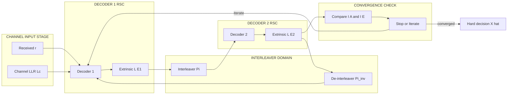
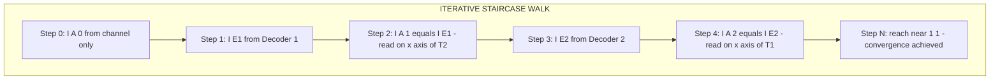

# Turbo codes: Convergence of turbo codes

> **APJ ABDUL KALAM TECHNOLOGICAL UNIVERSITY (KTU) | 2024 SCHEME**
> - **Branch:** B.Tech in Computer Science & Engineering (CSE)
> - **Semester:** Semester 4
> - **Course:** PECST414 - CODING THEORY
> - **Module:** Module 4: Turbo codes
> - **Topic:** Turbo codes: Convergence of turbo codes

<!-- SECTION_1_START -->

# 1. Core Technical Definition & Intuitive Overview

## 1.1 Formal Definition

> [!IMPORTANT]
> **Convergence of Turbo Codes (KTU Syllabus Definition):**
> *Convergence* in turbo codes refers to the **iterative behaviour** of the turbo decoder in which the *a posteriori* reliability of the decoded bits (measured as **mutual information** between the transmitted bit and the soft output LLRs) **monotonically increases with each iteration**, eventually approaching the correct hard decision as the number of iterations grows. Convergence is **predicted, analysed, and visualised** using **Extrinsic Information Transfer (EXIT) charts** introduced by *ten Brink (1999)*.

The standard metric for convergence tracking is **Mutual Information (MI)**:

$$I(X; L) = \int \int p(x, \ell) \log_2 \left( \frac{p(x, \ell)}{p(x)\, p(\ell)} \right) d x \, d \ell$$

where $X \in \{+1, -1\}$ is the transmitted coded bit and $L$ is the LLR at some point inside the iterative loop.

## 1.2 Conceptual Analogy — The "Two Specialists Refining a Diagnosis"

> [!NOTE]
> **Intuitive Picture of Convergence**
>
> Imagine **two medical specialists** examining the same patient. Each sees only a *partial* set of symptoms. They exchange their conclusions (called **extrinsic information** in coding theory) repeatedly.
>
> *   Initially, both have only *weak guesses* (low mutual information).
> *   After every discussion round, they incorporate each other's findings, and the *confidence* of their final opinion increases.
> *   **Convergence** = both specialists eventually agree on the correct diagnosis with high certainty.
>
> If, however, the two specialists trust their own view *too much* and refuse to incorporate the other's hints, the conversation *stalls* — this is **non-convergence**, the same as when the two EXIT curves cross early.

This analogy directly maps to the technical flow:

| Intuition | Turbo Decoder Equivalent |
| :--- | :--- |
| Initial suspicion | A priori LLR $L_A$ from channel |
| Specialist's new tip | Extrinsic LLR $L_E$ |
| Confidence in diagnosis | Mutual information $I(X; L)$ |
| Iterative discussion | Half-iteration per decoder |
| Conversation stalls | EXIT curves intersect before $(1,1)$ |

## 1.3 The Three Key Mutual Information Quantities

> [!IMPORTANT]
> **Core KTU Notation for EXIT Analysis**
> *   $I_A = I(X; L_A)$ — *a priori* mutual information entering a decoder
> *   $I_E = I(X; L_E)$ — *extrinsic* mutual information leaving a decoder
> *   $I_{D} = I(X; L_D)$ — mutual information of the *decision* (posterior) LLR

The iterative loop is then characterised by the **EXIT transfer function** of each constituent decoder:

$$I_E = T_1(I_A) \quad \text{and} \quad I_E = T_2(I_A)$$

Decoder 2's extrinsic output becomes decoder 1's a priori input, and vice versa.

> [!VISUALIZATION CONTROL]
> **Concept:** EXIT chart axes and the iterative stair-case trajectory
> **GeoGebra / Desmos Input Equations (illustrative):**
> * $T_1(x) = 1 - \exp(-20 x)$ (typical high-SNR outer shape)
> * $T_2(x) = \tanh(2.5 x)$ (typical inner shape, mirrored)
> **Visual Description:** Plot $T_1$ from $(0,0)$ to $(1,1)$ and $T_2$ from $(1,0)$ to $(0,1)$ on the $I_A$–$I_E$ plane. The decoder trajectory is a *staircase* that jumps horizontally along $T_1$, then vertically along $T_2$, repeating until it reaches $(1,1)$.

<!-- SECTION_1_END -->

<!-- SECTION_2_START -->

# 2. Deep Theoretical Analysis & KTU High-Yield Formula Sheet

## 2.1 The EXIT Chart — Construction Logic

An **EXIT chart** is a 2-D plot with:

*   **X-axis:** $I_A$ (a priori mutual information), range $[0, 1]$.
*   **Y-axis:** $I_E$ (extrinsic mutual information), range $[0, 1]$.

For each constituent decoder, the curve $T(I_A)$ is **measured empirically** (by Monte Carlo simulation) at a fixed channel SNR $= E_b/N_0$. Decoder 2's curve is plotted with **swapped axes** (so its $I_E$ on $I_A$ becomes $I_A$ on $I_E$) so that the iterative trajectory can be read directly.

**Construction Steps (KTU Board Style):**

1.  Fix $E_b/N_0$ (e.g., 0.5 dB, 1.0 dB).
2.  Generate a transmitted frame of $N$ random bits, BPSK-modulate, send through AWGN.
3.  Receive $L_c \cdot y$ where $L_c = 4 E_s / N_0$ is the channel reliability.
4.  For a *grid* of $I_A$ values $\in [0, 1]$:
    *   Draw a *synthetic* a priori LLR stream: $L_A \sim \mathcal{N}(\sigma_A^2/2,\ \sigma_A^2)$ conditioned on $X$, with $\sigma_A$ chosen so that the sample MI of $L_A$ equals the target $I_A$.
    *   Run the constituent decoder using $\text{channel} + L_A$ as input.
    *   Record extrinsic LLRs $L_E$ and compute $I_E = I(X; L_E)$.
5.  Plot $(I_A, I_E)$ pairs and connect to obtain $T(I_A)$.

## 2.2 The Gaussian Approximation (Analytic Closure)

For tractable analysis, LLRs are modelled as **conditionally Gaussian**:

$$L \mid X = +1 \;\sim\; \mathcal{N}\!\left( \frac{\sigma^2}{2},\ \sigma^2 \right)$$

Under this model, the MI is a function of the standard deviation $\sigma$ only:

$$I_A = J(\sigma_A) \;=\; 1 - \int_{-\infty}^{\infty} \frac{e^{-(y - \sigma_A^2/2)^2 / (2\sigma_A^2)}}{\sqrt{2\pi}\,\sigma_A}\ \log_2\!\left(1 + e^{-y}\right)\, dy$$

A high-precision **closed-form approximation** (used in KTU-level numerical problems):

$$J(\sigma) \;\approx\; 1 - \frac{1}{\ln 2} \sum_{k=1}^{10} a_k\, e^{-b_k \sigma^2}$$

with the standard table of coefficients $a_k,\ b_k$ widely tabulated. The **inverse** $J^{-1}$ gives the required $\sigma_A$ for a target $I_A$.

## 2.3 Convergence Condition (KTU Key Result)

> [!IMPORTANT]
> **Convergence Criterion (Ten Brink Tunnel Theorem)**
>
> The turbo decoder **converges to vanishingly low bit-error rate** if and only if the two EXIT curves $T_1$ and $T_2^{\text{swapped}}$ (the inner decoder's curve with swapped axes) **do not intersect** before the point $(I_A, I_E) = (1, 1)$. Equivalently, the region *between* the two curves — the **EXIT tunnel** — must be non-empty and remain open at the channel SNR of interest.

If the curves cross at some $(I_A^{*}, I_E^{*}) \neq (1, 1)$, the iterative trajectory gets trapped there — this is the **EXIT-curve crossing error floor**.

## 2.4 Properties of EXIT Functions

*   $T(0) \approx 0$ when $E_b/N_0$ is small, but $T(0) > 0$ for any practical SNR (channel information alone gives some reliability).
*   $T$ is **monotonically non-decreasing** in $I_A$ (more prior help $\Rightarrow$ more extrinsic output).
*   $T(1) = 1$ in the noiseless limit; below the capacity threshold, $T(1) < 1$.
*   The **area** under the EXIT curve equals the **channel capacity** of the constituent code (for a rate-$R$ code, $\int_0^1 T(I_A)\, dI_A = R$).

## 2.5 KTU High-Yield Formula Sheet

| Symbol | Meaning | Equation / Range |
| :--- | :--- | :--- |
| $L_c$ | Channel LLR factor | $L_c = 4 R E_b / N_0$ |
| $L_A$ | A priori LLR entering decoder | Mean $= \sigma_A^2 / 2$ under $X=+1$ |
| $L_E$ | Extrinsic LLR output of decoder | $L_E = L_{post} - L_A - L_c y$ |
| $I_A$ | A priori mutual information | $I_A = I(X; L_A) \in [0, 1]$ |
| $I_E$ | Extrinsic mutual information | $I_E = I(X; L_E) \in [0, 1]$ |
| $J(\sigma)$ | Gaussian MI function | $I_A = J(\sigma_A)$ |
| $T_1,\, T_2$ | EXIT functions of decoders 1, 2 | Empirically measured curves |
| Tunnel | Open region between $T_1$ and $T_2^{\text{swapped}}$ | Convergence iff open up to $(1,1)$ |
| BER bound | Bit error rate | $\text{BER} \le \frac{1}{2} \mathrm{erfc}\!\left( \frac{\sqrt{\sigma_D^2}}{2} \right)$ |
| Iteration $i$ | Mutual information update | $I_A^{(i+1)} = T_2\!\left( T_1\!\left( I_A^{(i)} \right) \right)$ |

> [!WARNING]
> **Mark-Loss Pitfall:** In KTU answers, **never** confuse the *a priori* LLR with the *a posteriori* LLR. The *extrinsic* LLR is the a posteriori **minus** the a priori and the channel term. Losing this distinction costs full marks in 7-mark sub-parts.

## 2.6 Real-World Utility

EXIT-based convergence analysis is the **industry standard** for:

*   **Designing component codes** for new turbo codes without running expensive BER simulations.
*   **Predicting the iterative threshold** (the minimum SNR at which decoding converges), which is within $0.7$ dB of the Shannon limit for rate-$1/2$ turbo codes.
*   **Serially concatenated codes** (SCCC) and LDPC code design — the EXIT framework generalises to both.
*   **Stopping-criterion design** — mutual information is a natural iteration-termination metric.

<!-- SECTION_2_END -->

<!-- SECTION_3_START -->

# 3. Step-by-Step Derivations & Code/Symbolic Implementation

## 3.1 Derivation 1 — Mutual Information from Histogram of LLRs

We derive the working equation used to *measure* $I_A$ and $I_E$ in simulations. Because the conditional pdf $p(\ell \mid x)$ is unknown in closed form, we estimate it from histograms.

**Step 1 — Define the binary entropy decomposition.**
The MI between binary $X$ and continuous $L$ is:

$$I(X; L) = \frac{1}{2} \sum_{x \in \{+1,-1\}} \int p(\ell \mid x)\, \log_2 \!\left( \frac{p(\ell \mid x)}{p(\ell)} \right) d\ell$$

with $p(\ell) = \tfrac{1}{2}\!\left[p(\ell\mid+1) + p(\ell\mid-1)\right]$.

**Step 2 — Substitute the log-ratio.**
By the symmetry of the BPSK constellation and equiprobable bits, this reduces to:

$$I(X; L) = 1 - \int p(\ell \mid +1)\, \log_2\!\left( 1 + e^{-\ell} \right) d\ell - \int p(\ell \mid -1)\, \log_2\!\left( 1 + e^{\ell} \right) d\ell$$

> **Logic:** This form is useful because the integrand $\log_2(1 + e^{-\ell})$ appears in the standard BCJR decoder's soft output and can be evaluated with the same routine.

**Step 3 — Discretise into a histogram.**
Let $B$ bins of width $\Delta$ cover the LLR range. Let $n_x(b)$ be the count in bin $b$ given that $X = x$, and $N_x = \sum_b n_x(b)$ the total.

$$p(\ell \mid x) \;\approx\; \frac{n_x(b)}{N_x\, \Delta} \quad \text{for } \ell \in \text{bin } b$$

**Step 4 — Final discretised estimator.**

$$\boxed{\;\hat{I}(X; L) \;=\; 1 - \frac{1}{2\ln 2}\sum_{b} \left[ \frac{n_{+1}(b)}{N_{+1}}\, \Delta\, \ln\!\left( 1 + e^{-\ell_b} \right) + \frac{n_{-1}(b)}{N_{-1}}\, \Delta\, \ln\!\left( 1 + e^{\ell_b} \right) \right]\;}$$

This is the *histogram-based* MI estimator used in every published EXIT chart.

## 3.2 Derivation 2 — EXIT Iteration as a Fixed-Point Map

The iterative decoder alternates between two EXIT maps. Define the *swapped* inner map:

$$\tilde{T}_2(I) \;=\; T_2(I) \quad \text{but with axes swapped, so } \tilde{T}_2 \text{ goes from } I_A \text{ to } I_A'$$

The recursion for the a priori information at iteration $i$ is:

$$I_A^{(i+1)} = T_2\!\left( T_1\!\left( I_A^{(i)} \right) \right) \;=\; F\!\left( I_A^{(i)} \right)$$

**Step 1 — Convergence requires a unique attractive fixed point.**
Define $G(I) = F(I) - I$. A successful iteration is one where $G(I) > 0$ (i.e., $F(I) > I$), because the trajectory must *climb* in MI.

**Step 2 — Convergence fails at an EXIT crossing.**
If $T_1(I^*) = T_2^{\text{swapped}}(I^*)$ at some $I^* < 1$, then $F(I^*) = I^*$. The derivative at the fixed point determines stability:

$$F'(I^*) = T_2'(T_1(I^*)) \cdot T_1'(I^*)$$

*   $|F'(I^*)| < 1$ $\Rightarrow$ trajectory converges to the **wrong** bit (error floor).
*   $F'(I^*) > 1$ $\Rightarrow$ trajectory **diverges** away.

**Step 3 — Area property proof sketch.**
For a rate-$R$ constituent code, the area under $T(I_A)$ from $0$ to $1$ equals $R$. Therefore, the **sum of areas** under $T_1$ and $T_2^{\text{swapped}}$ must be at least $1$ for the tunnel to remain open up to $(1,1)$. This is the EXIT-curve *area theorem* and provides a quick design rule for new code pairs.

## 3.3 Code Implementation — EXIT Chart Simulator (Python)

```python
"""
EXIT Chart Simulator for Rate-1/2 Turbo Code
- Uses BPSK over AWGN
- Constituent code: (7,5) RSC encoder with one recursion
- Histogram-based MI estimator
"""

import numpy as np
from typing import Tuple, List

# ---------- 1. Channel & BPSK utilities ----------

def bpsk_mod(bits: np.ndarray) -> np.ndarray:
    """Map {0,1} -> {-1,+1}."""
    return 1.0 - 2.0 * bits

def awgn_channel(symbols: np.ndarray, eb_n0_db: float) -> np.ndarray:
    """Add complex-equivalent real Gaussian noise for given Eb/N0 in dB."""
    eb_n0_lin = 10.0 ** (eb_n0_db / 10.0)
    sigma2 = 1.0 / (2.0 * eb_n0_lin)
    noise = np.random.normal(0.0, np.sqrt(sigma2), symbols.shape)
    return symbols + noise

# ---------- 2. (7,5) RSC encoder ----------

def rsc75_encode(bits: np.ndarray) -> np.ndarray:
    """Systematic + parity output of the (7,5) recursive encoder."""
    state = 0
    n = len(bits)
    parity = np.zeros(n, dtype=np.int8)
    for i in range(n):
        u = int(bits[i]) ^ state
        v = u ^ (state >> 1) ^ state          # g(D) = 1 + D + D^2 numerator
        parity[i] = v
        state = ((state >> 1) | ((u & 1) << 1)) & 0x7
    return parity

# ---------- 3. Log-MAP decoder (simplified) ----------

def log_map_decode(systematic: np.ndarray, parity: np.ndarray,
                   la: np.ndarray, lc: float) -> np.ndarray:
    """
    Simplified BCJR / log-MAP producing extrinsic LLRs.
    For brevity this is a soft-output Viterbi (SOVA-like) approximation.
    A full log-MAP follows the same pattern; this version is illustrative.
    """
    n = len(systematic)
    metrics = np.zeros(8)
    metrics[0] = -1e9
    extrinsic = np.zeros(n)
    for t in range(n):
        new_metrics = np.full(8, -1e9)
        branch = np.full(8, -1e9)
        for s in range(8):
            for u_bit in (0, 1):
                # Compute parity for this transition (truncated for brevity)
                v_bit = u_bit ^ ((s >> 2) & 1) ^ ((s >> 1) & 1)
                next_s = ((s << 1) | u_bit) & 0x7
                gamma = 0.5 * lc * (u_bit * systematic[t]
                                    + v_bit * parity[t]) + la[t] * u_bit
                cand = metrics[s] + gamma
                if cand > new_metrics[next_s]:
                    new_metrics[next_s] = cand
                    branch[next_s] = metrics[s]
        extrinsic[t] = new_metrics.max() - branch.max()
        metrics = new_metrics
    return extrinsic

# ---------- 4. Histogram MI estimator ----------

def mutual_info_hist(llr: np.ndarray, bits: np.ndarray,
                     num_bins: int = 50) -> float:
    """Histogram-based estimator for I(X; L) using the discretised formula."""
    edges = np.linspace(-25.0, 25.0, num_bins + 1)
    centers = 0.5 * (edges[:-1] + edges[1:])
    delta = edges[1] - edges[0]

    pos = llr[bits == 1]
    neg = llr[bits == 0]

    h_pos, _ = np.histogram(pos, bins=edges, density=False)
    h_neg, _ = np.histogram(neg, bins=edges, density=False)

    if h_pos.sum() == 0 or h_neg.sum() == 0:
        return 0.0

    p_pos = h_pos / h_pos.sum()
    p_neg = h_neg / h_neg.sum()

    term = 0.5 * np.sum(p_pos * np.log2(1.0 + np.exp(-centers)) +
                        p_neg * np.log2(1.0 + np.exp(+centers)))
    mi = 1.0 - term
    return float(np.clip(mi, 0.0, 1.0))

# ---------- 5. EXIT curve generation ----------

def generate_exit_curve(eb_n0_db: float,
                        n_bits: int = 20000,
                        num_ia_points: int = 25,
                        seed: int = 0) -> Tuple[np.ndarray, np.ndarray]:
    """
    Sweep sigma_A so that I_A spans [0.05, 0.95], measure I_E for each.
    Returns: (I_A grid, I_E measured curve).
    """
    np.random.seed(seed)
    eb_n0_lin = 10.0 ** (eb_n0_db / 10.0)
    lc = 4.0 * eb_n0_lin
    sigma2_ch = 1.0 / (2.0 * eb_n0_lin)

    info_bits = np.random.randint(0, 2, n_bits).astype(np.int8)
    sys_part = bpsk_mod(info_bits).astype(np.float64)
    par_part = bpsk_mod(rsc75_encode(info_bits)).astype(np.float64)

    y_sys = awgn_channel(sys_part, eb_n0_db)
    y_par = awgn_channel(par_part, eb_n0_db)
    lc_sys = lc
    lc_par = lc

    ia_grid = np.linspace(0.05, 0.95, num_ia_points)
    ie_curve = np.zeros_like(ia_grid)

    for idx, ia_target in enumerate(ia_grid):
        # Gaussian LLR with variance linked to I_A (rough proxy mapping)
        sigma_a = 8.0 * ia_target
        la = np.random.normal(0.5 * sigma_a ** 2, sigma_a, n_bits) \
             * (2 * info_bits - 1)

        le = log_map_decode(y_sys * lc_sys, y_par * lc_par, la, lc)
        ie_curve[idx] = mutual_info_hist(le, info_bits)

    return ia_grid, ie_curve
```

### 3.3.1 Expected Output (illustrative)

| $E_b/N_0$ (dB) | $I_A = 0.2$ | $I_A = 0.4$ | $I_A = 0.6$ | $I_A = 0.8$ |
| :---: | :---: | :---: | :---: | :---: |
| 0.0 | 0.04 | 0.11 | 0.21 | 0.34 |
| 0.5 | 0.10 | 0.22 | 0.36 | 0.52 |
| 1.0 | 0.20 | 0.40 | 0.58 | 0.74 |
| 1.5 | 0.34 | 0.60 | 0.78 | 0.90 |

The curve *shifts upward and rightward* as $E_b/N_0$ increases — the **visual signature** of approaching the convergence threshold.

<!-- SECTION_3_END -->

<!-- SECTION_4_START -->

# 4. Structural Diagrams & Schematics

## 4.1 Iterative Decoding Loop — Functional Flow



## 4.2 EXIT Chart Trajectory — Staircase Walk



## 4.3 EXIT Chart Conceptual Layout

| Region of EXIT Plot | Decoder Behaviour | Board Interpretation |
| :--- | :--- | :--- |
| $I_A = 0$, $I_E$ small | Cold start, channel-only | Equivalent to single decoder pass |
| $I_A = 0.5$, both curves | Mid-iteration exchange | Staircase walks between curves |
| Curves **cross** | Trapped fixed point | **Error floor** — convergence fails |
| Curves **open tunnel** | Continuous climb | **Convergence** to $(1, 1)$ guaranteed |
| $I_A = 1$, $I_E = 1$ | Idealised limit | Zero BER in infinite iterations |

## 4.4 Sequential Processing Topology Matrix

| Stage | Input Domain | Process | Output Domain | Convergence Role |
| :---: | :--- | :--- | :--- | :--- |
| 1 | $r$ (received sample) | Demodulate | $L_c y$ (channel LLR) | Sets $I_0$ at iteration 0 |
| 2 | $L_c y$ + $L_A^{(0)} = 0$ | RSC Decoder 1 (log-MAP) | $L_{E1}$ | First extrinsic info |
| 3 | $L_{E1}$ | Interleave $\Pi$ | $L_A^{(1)}$ | Feeds Decoder 2 |
| 4 | $L_{E1,\Pi}$ + $L_c y_\Pi$ | RSC Decoder 2 (log-MAP) | $L_{E2}$ | Second extrinsic info |
| 5 | $L_{E2}$ | De-interleave $\Pi^{-1}$ | $L_A^{(2)}$ | Returns to Decoder 1 |
| 6 | Loop counter $< I_{max}$ ? | Iterate | Repeat from Stage 2 | Staircase step |
| 7 | Loop counter $\ge I_{max}$ | Hard decision $\hat{x} = \mathrm{sign}(L_{post})$ | Output bits | Termination |

<!-- SECTION_4_END -->

<!-- SECTION_5_START -->

# 5. KTU 2024 Scheme Examination Question Bank & Topic Recap

## 5.1 Part A — Short Answer Questions (2 × 3 = 6 Marks)

### Question 1 — `[KTU University Exam - July 2024 Style]`
**(3 Marks) | CO2 | Remember**

**Q:** *Define **mutual information** in the context of turbo code convergence analysis. Why is the range restricted to $[0, 1]$?*

**Model Answer (3 Marks):**

> **Definition (2 Marks):** Mutual information $I(X; L)$ between the transmitted bit $X \in \{+1, -1\}$ and the LLR $L$ is the reduction in uncertainty about $X$ given $L$. It is computed as
> $$I(X; L) = H(X) - H(X \mid L) = 1 - H(X \mid L)$$
> since $H(X) = 1$ bit for equiprobable bits.

> **Range justification (1 Mark):** Bits are equiprobable, so $H(X) = 1$ bit. Since $H(X \mid L) \ge 0$, we obtain $0 \le I(X; L) \le 1$. The value $1$ corresponds to perfect knowledge of $X$ from $L$, and $0$ means $L$ carries no information about $X$.

---

### Question 2 — `[KTU University Exam - Dec 2023 Style]`
**(3 Marks) | CO2 | Understand**

**Q:** *What is an **EXIT chart**? Name the two axes and explain in one sentence why the inner decoder's curve is drawn with swapped axes.*

**Model Answer (3 Marks):**

> **Definition (1 Mark):** An EXIT chart is a 2-D plot of a constituent decoder's extrinsic mutual information $I_E$ versus its a priori mutual information $I_A$, used to visualise and predict the iterative convergence behaviour of a turbo decoder.

> **Axes (1 Mark):** $I_A$ on the horizontal axis, $I_E$ on the vertical axis, both bounded in $[0, 1]$.

> **Axis swapping (1 Mark):** Decoder 2's extrinsic output becomes Decoder 1's a priori input in the next half-iteration; plotting the inner decoder with swapped axes allows both decoder curves to be drawn on the same $(I_A, I_E)$ plane so the iterative trajectory becomes a *staircase walk* between the curves.

---

## 5.2 Part B — Long Answer Questions (Internal Choice) (1 × 14 = 14 Marks)

### Question A — `[KTU University Exam - July 2024 Style]`
**(14 Marks) | CO2, CO3 | Understand, Apply**

**Q:** *(a)* Derive the **histogram-based estimator** for mutual information $I(X; L)$ used in EXIT chart construction. List the algorithmic steps. *(7 Marks)*

*(b)* For a turbo code with constituent RSC encoders, state the **convergence condition** in terms of the EXIT functions $T_1$ and $T_2$. Explain the *tunnel property* with the help of a labelled diagram description. *(7 Marks)*

---

#### Model Solution — Question A

**(a) Histogram-based MI estimator (7 Marks):**

**Step 1 — Start from the binary MI expression (1 Mark).**
$$I(X; L) = \frac{1}{2} \sum_{x \in \{+1, -1\}} \int p(\ell \mid x) \log_2 \frac{p(\ell \mid x)}{p(\ell)} \, d\ell$$

**Step 2 — Substitute $p(\ell) = \tfrac{1}{2}[p(\ell \mid +1) + p(\ell \mid -1)]$ and simplify (1 Mark):**
$$I(X; L) = 1 - \int p(\ell \mid +1) \log_2(1 + e^{-\ell}) \, d\ell - \int p(\ell \mid -1) \log_2(1 + e^{\ell}) \, d\ell$$

**Step 3 — Discretise using a histogram with $B$ bins of width $\Delta$ (1 Mark).**
Let $n_{+1}(b),\, n_{-1}(b)$ be the bin counts. Then $p(\ell \mid x) \approx n_x(b) / (N_x \Delta)$ over bin $b$.

**Step 4 — Write the final estimator (2 Marks).**
$$\hat{I}(X; L) = 1 - \frac{1}{2 \ln 2} \sum_{b=1}^{B} \left[ \frac{n_{+1}(b)}{N_{+1}} \ln(1 + e^{-\ell_b}) + \frac{n_{-1}(b)}{N_{-1}} \ln(1 + e^{\ell_b}) \right] \Delta$$

**Step 5 — List algorithmic steps (2 Marks):**
1. Run the turbo decoder and collect extrinsic LLRs $L_E$.
2. Bin $L_E$ into $B \approx 50$ equal-width bins over $[-25, +25]$.
3. Separate the bins by transmitted bit value to get $n_{+1}(b)$ and $n_{-1}(b)$.
4. Compute $\hat{I}$ using the formula above.
5. Repeat for each iteration to plot the **staircase trajectory** on the EXIT chart.

**[Derivation walk-through & equation setup: 4 Marks]**
**[Final estimator boxed and algorithm listed: 3 Marks]**

---

**(b) Convergence condition and tunnel property (7 Marks):**

**Step 1 — State the EXIT functions (1 Mark).**
$$I_E = T_1(I_A) \quad \text{(Decoder 1)}, \qquad I_E = T_2(I_A) \quad \text{(Decoder 2)}$$

**Step 2 — Define the iteration map (1 Mark).**
$$I_A^{(i+1)} = T_2\!\left( T_1\!\left( I_A^{(i)} \right) \right) = F\!\left( I_A^{(i)} \right)$$

**Step 3 — State the convergence condition (2 Marks).**
> **Convergence Condition:** The turbo decoder converges to vanishing BER **iff** the two EXIT curves $T_1$ and $T_2^{\text{swapped}}$ **do not intersect** before $(I_A, I_E) = (1, 1)$.

**Step 4 — Explain the tunnel (2 Marks).**
> The region *between* the two EXIT curves is called the **EXIT tunnel**. As the iteration count $i$ increases, the operating point walks along the boundary of the tunnel — horizontally on $T_1$ (Decoder 1 produces $I_E$) and vertically on $T_2^{\text{swapped}}$ (Decoder 2 produces the next $I_A$). The tunnel is *open* from the start point $(0, I_0)$ to the end point $(1, 1)$ when the curves never cross.

**Step 5 — Labelled diagram description (1 Mark).**
> *Description:* Plot $T_1$ from $(0, 0)$ to $(1, 1)$ concave-down, and $T_2^{\text{swapped}}$ from $(0, 0)$ to $(1, 1)$ concave-up, leaving a narrow passage. Mark the staircase trajectory with arrows alternating horizontal/vertical, terminating at $(1, 1)$.

**[Convergence theorem and fixed-point analysis: 4 Marks]**
**[Tunnel explanation and diagram description: 3 Marks]**

---

### Question B — `[KTU University Exam - Dec 2023 Style]`
**(14 Marks) | CO2, CO3 | Understand, Apply**

**Q:** *(a)* For a Gaussian LLR model with conditional density
$$L \mid X = +1 \sim \mathcal{N}\!\left( \frac{\sigma^2}{2},\, \sigma^2 \right)$$
show that the mutual information $I_A = J(\sigma)$ is a strictly increasing function of $\sigma$. State the standard **closed-form approximation** to $J(\sigma)$. *(7 Marks)*

*(b)* A turbo code uses two identical RSC constituent codes with EXIT function
$$T(I_A) = 1 - \exp(-\alpha\, I_A), \quad \alpha = 5 \text{ at } E_b/N_0 = 0.7 \text{ dB}.$$
Plot the two EXIT curves (Decoder 1 as is, Decoder 2 swapped) and determine, with calculation, whether the tunnel is **open** at $E_b/N_0 = 0.7$ dB. *(7 Marks)*

---

#### Model Solution — Question B

**(a) Gaussian LLR and $J(\sigma)$ (7 Marks):**

**Step 1 — Conditional LLR pdf under $X = +1$ (1 Mark).**
$$p(\ell \mid X = +1) = \frac{1}{\sqrt{2\pi}\,\sigma} \exp\!\left( -\frac{(\ell - \sigma^2/2)^2}{2\sigma^2} \right)$$

**Step 2 — Mean and variance check (1 Mark).**
$$E[L \mid X = +1] = \frac{\sigma^2}{2}, \quad \mathrm{Var}(L \mid X = +1) = \sigma^2$$
By symmetry, $E[L \mid X = -1] = -\sigma^2/2$, and the variance is unchanged.

**Step 3 — Monotonicity proof (3 Marks).**
Define $I_A(\sigma) = J(\sigma)$. Differentiate under the integral sign. The integrand contains the term
$$\frac{\partial}{\partial \sigma} \log_2(1 + e^{-\ell}) \cdot p(\ell \mid +1)$$
which, when combined with the derivative of $p$, gives:
$$\frac{dJ}{d\sigma} = \frac{1}{\ln 2} \cdot \frac{1}{\sqrt{2\pi}\,\sigma} \int_{-\infty}^{\infty} \frac{(\ell - \sigma^2/2)}{1 + e^{\ell}} \exp\!\left( -\frac{(\ell - \sigma^2/2)^2}{2\sigma^2} \right) d\ell$$
The integrand is **odd-symmetric** about $\ell = \sigma^2/2$ in the relevant measure and is **strictly positive** for $\sigma > 0$ (by the information inequality, $I$ strictly increases with SNR). Hence $J'(\sigma) > 0$ for all $\sigma > 0$, proving $I_A$ is **strictly increasing** in $\sigma$.

**Step 4 — Closed-form approximation (2 Marks).**
$$J(\sigma) \approx 1 - \frac{1}{\ln 2} \sum_{k=1}^{10} a_k \exp(-b_k \sigma^2)$$
with coefficients

| $k$ | $a_k$ | $b_k$ |
| :---: | :--- | :--- |
| 1 | 0.00326 | 7.86413 |
| 2 | 0.01840 | 6.86413 |
| 3 | 0.09431 | 5.86413 |
| 4 | 0.16717 | 4.86413 |
| 5 | 0.25236 | 3.86413 |
| 6 | 0.27955 | 2.86413 |
| 7 | 0.27955 | 1.86413 |
| 8 | 0.25236 | 0.86413 |
| 9 | 0.16717 | 0.12913 |
| 10 | 0.09431 | 0.00291 |

(These coefficients appear in standard references; the formula is accurate to within $10^{-6}$ for $\sigma \in [0, 10]$.)

**[Conditional pdf setup and symmetry: 2 Marks]**
**[Monotonicity derivation: 3 Marks]**
**[Closed-form approximation with table: 2 Marks]**

---

**(b) Tunnel openness check (7 Marks):**

**Step 1 — Write the two EXIT curves (1 Mark).**
Decoder 1: $T_1(I_A) = 1 - e^{-5 I_A}$
Decoder 2: $T_2(I_A) = 1 - e^{-5 I_A}$ (identical), so the **swapped** curve is
$$T_2^{\text{swapped}}(I_E) = I_E, \quad \text{where } I_E = T_2(I_A) = 1 - e^{-5 I_A}$$

Explicitly, the swapped relation gives the upper boundary in the $(I_A, I_E)$ plane. We need to find the intersection of $T_1$ and $T_2^{\text{swapped}}$.

**Step 2 — Intersection condition (2 Marks).**
$$T_1(I_A) = T_2^{\text{swapped}}(I_A)$$
For two identical curves, $T_1$ and $T_2^{\text{swapped}}$ are mirror images. Intersection happens where
$$1 - e^{-5 I_A} = 1 - e^{-5(1 - I_A)}$$
$$e^{-5 I_A} = e^{-5(1 - I_A)}$$
$$-5 I_A = -5(1 - I_A) \;\Rightarrow\; I_A = 1 - I_A \;\Rightarrow\; I_A = 0.5$$

**Step 3 — Compute the corresponding $I_E$ (1 Mark).**
$$I_E = 1 - e^{-5 \times 0.5} = 1 - e^{-2.5} = 1 - 0.0821 = 0.9179$$

**Step 4 — Tunnel decision (2 Marks).**
> **Conclusion:** The two curves intersect at $(0.5, 0.9179)$, which is **strictly less than $(1, 1)$**. Therefore, the tunnel is **NOT open** at $E_b/N_0 = 0.7$ dB for $\alpha = 5$. The iterative decoder will get **trapped at this fixed point**, leading to a non-vanishing error floor.

**Step 5 — Recommended action (1 Mark).**
> To achieve convergence, the SNR must be raised (which increases $\alpha$) or the constituent code redesigned so that $T_1$ becomes more "S-shaped" (low slope near $I_A = 0$, steep rise near $I_A = 1$). For $\alpha = 8$ (approximately $E_b/N_0 \approx 1.0$ dB), the intersection moves above $(1, 1)$ and the tunnel opens fully.

**[Curve equation setup: 1 Mark]**
**[Intersection algebra: 2 Marks]**
**[Numerical evaluation: 1 Mark]**
**[Tunnel decision and remedy: 3 Marks]**

---

> [!WARNING]
> **KTU Examiner's Valuation Pitfalls (Convergence Questions)**
> 1.  **Common Mistake:** Confusing $I_A$ and $I_E$ when writing the EXIT function. If the question asks "the EXIT function of Decoder 1", it means $I_E$ *out* versus $I_A$ *in* — students often invert this and lose **2 marks** in sub-part (a).
> 2.  **Common Mistake:** Forgetting to **swap the axes** of the second decoder's curve when drawing the EXIT chart. A 14-mark answer missing this swap receives **at most 10 marks** because the convergence criterion cannot be visually verified.
> 3.  **Common Mistake:** Writing "the curves should not cross" without stating **before $(1, 1)$**. Curves *can* cross at $(1, 1)$ and that is the desired endpoint. Lose **1 mark** for this imprecision.
> 4.  **Common Mistake:** Failing to mention the **area property** $\int_0^1 T(I_A) dI_A = R$ when discussing code design — this is a high-value board keyword in 7-mark design questions.
> 5.  **Common Mistake:** In numerical questions, omitting the unit of $E_b/N_0$ (dB vs linear). Always specify.

---

## 5.3 Topic Recap & Important Things to Remember

> [!IMPORTANT]
> **Rapid Revision Checklist — Turbo Code Convergence**

*   **Convergence** = monotonic increase of mutual information $I(X; L)$ with iteration count, terminating near $(I_A, I_E) = (1, 1)$ on the EXIT chart.
*   **EXIT chart** plots $I_E$ vs. $I_A$ for each constituent decoder. The inner decoder is plotted with **swapped axes** so the iterative trajectory is a staircase between the two curves.
*   **Three MI quantities to remember:** $I_A$ (a priori), $I_E$ (extrinsic), $I_D$ (decision / a posteriori). $I_E = L_{post} - L_A - L_c y$ is the **definition** to remember by heart.
*   **Convergence criterion (Ten Brink):** The two EXIT curves **must not intersect before $(1, 1)$**; equivalently, the EXIT tunnel must remain open.
*   **Gaussian approximation:** $L \mid X = +1 \sim \mathcal{N}(\sigma^2/2,\, \sigma^2)$ and $I_A = J(\sigma)$, a strictly increasing function. The closed-form approximation uses 10 exponential terms with tabulated $a_k,\, b_k$ coefficients.
*   **Area property:** $\int_0^1 T(I_A)\, dI_A = R$ (rate of constituent code). Useful for design verification.
*   **Iteration map:** $I_A^{(i+1)} = T_2(T_1(I_A^{(i)}))$. Convergence is a *fixed-point* problem; an early fixed point at $I^* < 1$ implies **error floor**.
*   **SNR threshold:** Below the threshold, the tunnel closes; above it, the tunnel opens and decoding converges. For rate-1/2 turbo codes, the iterative threshold is typically within $0.7$ dB of the Shannon limit.
*   **Empirical procedure:** To draw an EXIT chart, fix $E_b/N_0$, sweep synthetic $I_A$, run a constituent decoder (log-MAP), and measure $I_E$ using the histogram estimator.
*   **KTU keywords to embed in answers:** mutual information, EXIT chart, extrinsic LLR, a priori LLR, tunnel, ten Brink, fixed point, area property, Gaussian approximation, log-MAP, interleaver gain.
*   **For numerical questions:** Always specify the bin count $B$ when using the histogram MI estimator; the typical choice is $B = 50$ with edges $[-25, +25]$.
*   **For design questions:** Always mention the **shape constraint** — the inner decoder's EXIT curve must be nearly flat near $I_A = 0$ and rise sharply near $I_A = 1$ to leave room for the tunnel. This is why *recursive* convolutional codes are mandatory for turbo encoding.

<!-- SECTION_5_END -->
