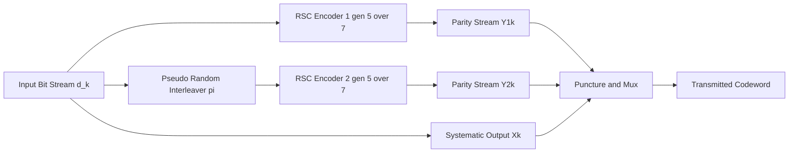
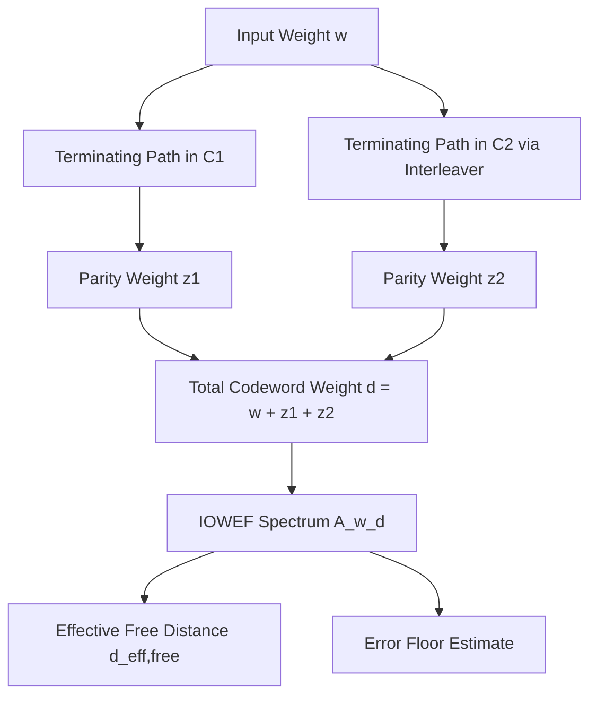
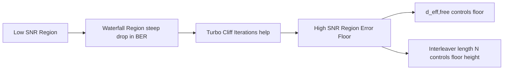
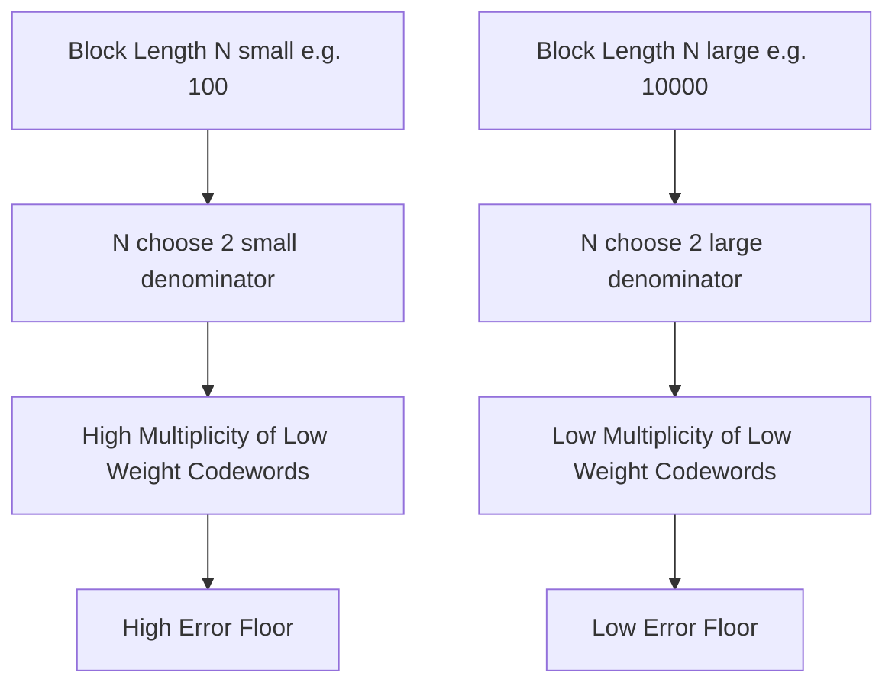
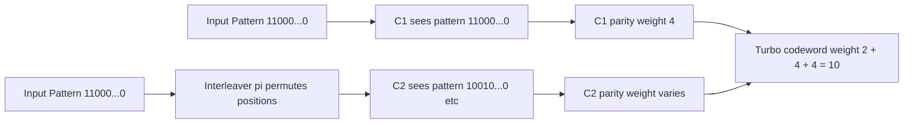

# Turbo codes: Distance properties of turbo codes

> **APJ ABDUL KALAM TECHNOLOGICAL UNIVERSITY (KTU) | 2024 SCHEME**
> - **Branch:** B.Tech in Computer Science & Engineering (CSE)
> - **Semester:** Semester 4
> - **Course:** PECST414 - CODING THEORY
> - **Module:** Module 4: Turbo codes
> - **Topic:** Turbo codes: Distance properties of turbo codes

<!-- SECTION_1_START -->
## 1. Core Technical Definition & Intuitive Overview

### 1.1 Formal Definition

The **distance properties of turbo codes** describe the statistical and structural behaviour of the codeword weights (Hamming distances) generated by the parallel concatenation of two or more recursive systematic convolutional (RSC) encoders separated by a pseudo-random interleaver. The most critical distance properties are:

1. **Minimum distance ($d_{\min}$)** — the smallest Hamming weight of any non-zero codeword.
2. **Effective free distance ($d_{\text{eff,free}}$)** — the minimum weight of all codewords generated by input sequences of weight $\ge 2$ that cause both constituent encoders to return to the zero state.
3. **Weight spectrum / distance spectrum** — the complete distribution of codeword weights, denoted by a Weight Enumerating Function (WEF).
4. **Asymptotic weight distribution** — the leading-order behaviour of the spectrum at high SNR, which dictates the **error floor**.

> [!IMPORTANT]
> **KTU 2024 Syllabus Highlight:**
> Turbo codes are *not* random codes. Their distance spectrum is dominated by **low-weight codewords** induced by the structure of the constituent convolutional encoders. The interleaver controls *how often* these low-weight patterns are reinforced or cancelled, but cannot fully eliminate them. This is the mathematical origin of the **error floor**.

### 1.2 Intuitive Analogy — The "Two Guard Towers"

Imagine a fortress protected by **two guard towers** that must *both* independently agree that an approaching traveller is friendly before the gate opens.

- **Tower 1** and **Tower 2** look at the traveller in different orders (one sees "shirt, hat, boots" — the other sees "boots, shirt, hat", thanks to the **interleaver**).
- A truly dangerous traveller has features that, in *any* viewing order, will set off **both** alarms. This corresponds to a **high-weight, low-probability codeword** — these define performance at high SNR (error floor).
- However, certain "sneaky" travellers (weight-2 inputs) manage to look suspicious to both towers only by exploiting a known blind spot in each tower's field of vision. The interleaver can scramble their approach, but it cannot remove the blind spots — only change them.
- These "sneaky" travellers model the **low-weight codewords** that govern the **error floor** of the turbo code.

### 1.3 The Error Floor Phenomenon

> [!NOTE]
> **Error Floor** is the flattening of the Bit Error Rate (BER) curve at high Signal-to-Noise Ratio (SNR). It arises because turbo codes retain a small but non-zero number of low-weight codewords.

Mathematically, for large $E_b/N_0$:

$$P_b \approx \frac{N_{\text{free}}}{N} \, Q\!\left(\sqrt{2 R_c \, d_{\text{eff,free}} \, \frac{E_b}{N_0}}\right)$$

where $N_{\text{free}}$ is the multiplicity of codewords at the effective free distance.

### 1.4 Visualization Concept

> [!VISUALIZATION CONTROL]
> **Concept:** Weight Spectrum of a Turbo Code vs. a Convolutional Code
> **Desmos Input Equations (to be plotted in Desmos or a spreadsheet):**
> * `y1 = (1/2)*(x)*(D^6)`  — single convolutional weight-2 contribution
> * `y2 = (1/2)*(D^10)` — turbo effective free distance contribution
> * `y3 = (1/4)*(D^14)` — interleaver-induced lower multiplicity higher-weight term
>
> **Visual Description:** The student should observe that the turbo code shifts the dominant low-weight terms to **higher weight** (from $D^6$ to $D^{10}$) but introduces a **smaller coefficient** (multiplicity). This trade-off — *higher minimum weight, lower multiplicity* — is the heart of turbo code distance design.

<!-- SECTION_1_END -->

<!-- SECTION_2_START -->
## 2. Deep Theoretical Analysis & KTU High-Yield Formula Sheet

### 2.1 Why Distance Properties of Turbo Codes Are "Strange"

Classical convolutional codes can be analysed with a single **state transition diagram** and the **Viterbi algorithm** can compute their free distance. Turbo codes are **time-varying** (because of the random interleaver) and **non-linear as a block** (even though each constituent encoder is linear over its own frame), so a single diagram is insufficient. Instead, we work with **ensemble-averaged** (average over all interleavers) weight enumerators.

### 2.2 Input–Output Weight Enumerating Function (IOWEF)

For a single RSC constituent encoder, the **Input–Output Weight Enumerating Function** tracks both input weight ($W$) and output weight ($Z$) simultaneously:

$$A^{C}(W, Z) \;=\; \sum_{w, z} A_{w, z}^{C} \, W^{w} Z^{z}$$

where $A_{w, z}^{C}$ counts the number of length-$N$ input sequences of Hamming weight $w$ that produce a length-$N$ output of weight $z$ (including the systematic and parity bits from the *constituent encoder only*).

For a recursive encoder, all non-zero inputs of weight $w \ge 1$ that terminate the trellis at the zero state produce a finite output weight. The **conditional weight enumerating function (CWEF)** of the constituent encoder, given input weight $w$, is:

$$A_{w}^{C}(Z) \;=\; \sum_{z} A_{w, z}^{C} \, Z^{z}$$

### 2.3 Turbo Code IOWEF via Product of Constituents

For a **parallel concatenation** of two RSC encoders with a uniform random interleaver, the (ensemble-averaged) IOWEF is the **product** of the two constituent IOWEFs *modulo interleaver effects*:

$$\overline{A^{T}}(W, Z) \;=\; \frac{A^{C_1}(W, Z) \cdot A^{C_2}(W, Z)}{\binom{N}{w}}\bigg|_{\text{length-}N \text{ normalisation}}$$

A more useful formulation, given input weight $w$ and codeword weight $z$:

$$A_{w, z}^{T} \;=\; \sum_{z_1 + z_2 = z} \frac{A_{w, z_1}^{C_1} \cdot A_{w, z_2}^{C_2}}{\binom{N}{w}}$$

The denominator $\binom{N}{w}$ arises because the $w$ input-ones can occupy any of the $\binom{N}{w}$ positions after interleaving, and only one specific permutation (the one that causes $C_2$ to terminate) is "harmful". Averaging over all $N!$ interleavers yields this binomial normalisation.

### 2.4 Effective Free Distance ($d_{\text{eff,free}}$)

> [!IMPORTANT]
> **Definition (Effective Free Distance):** The minimum Hamming weight of any turbo codeword that is generated by an input sequence of weight $w \ge 2$ which drives **both** constituent encoders back to the zero state at the end of the frame.

$$d_{\text{eff,free}} \;=\; \min_{w \ge 2} \left\{ w + 2 \, d_w^{C_1} \right\}$$

where $d_w^{C_1}$ is the minimum output parity weight of $C_1$ for an input of weight $w$ that returns the encoder to the zero state. (The factor of 2 is because there are *two* parity streams.) The systematic contribution is the input weight $w$ itself.

### 2.5 The Divsalar Bound (Asymptotic Weight Distribution)

The most celebrated analytical result on turbo-code distance spectrum is the **Divsalar upper bound on the average weight distribution** for large $N$:

$$E\!\left[ A_{w, z}^{T} \right] \;\le\; \binom{N}{w}^{-1} \cdot \left( A_{w, z}^{C_1} \right)^2 \quad \text{(for the dominant term)}$$

This shows that for a *random* interleaver of length $N$:

- Weight-2 input events yield a multiplicity that scales as $\sim N^{-1}$ (small).
- Weight-3 input events yield a multiplicity that scales as $\sim N^{-2}$ (very small).
- Weight-$\ge 4$ input events are negligible in the asymptotic regime.

> This explains empirically why a **longer interleaver lowers the error floor**: it dilutes the harmful weight-2 events.

### 2.6 KTU Formula Cheat Sheet

| # | Quantity | Symbol | Formula | Engineering Meaning |
|---|----------|--------|---------|---------------------|
| 1 | Constituent IOWEF | $A^{C}(W,Z)$ | $\sum A_{w,z}^C W^w Z^z$ | Maps input weight $w$ to parity weight $z$ |
| 2 | Conditional WEF | $A_w^C(Z)$ | $\sum_z A_{w,z}^C Z^z$ | Parity weight distribution for fixed $w$ |
| 3 | Turbo IOWEF (averaged) | $\overline{A^T}(W,Z)$ | $\sum_{z_1+z_2} A_{w,z_1}^{C_1} A_{w,z_2}^{C_2} / \binom{N}{w}$ | Distance spectrum of the concatenated code |
| 4 | Effective free distance | $d_{\text{eff,free}}$ | $\min_{w \ge 2}(w + 2 d_w^{C})$ | Sets the error floor |
| 5 | Weight-2 multiplicity | $A_2$ | $\binom{N}{2}^{-1} (A_{2,z}^{C})^2$ | Dominant low-weight term |
| 6 | Asymptotic BER (high SNR) | $P_b$ | $\frac{N_{\text{free}}}{N} Q\!\left(\sqrt{2 R_c d_{\text{eff,free}} E_b/N_0}\right)$ | Error floor approximation |
| 7 | Code rate (punctured) | $R_c$ | $1/2, 1/3, \dots$ | Rate loss due to parity bits |
| 8 | Interleaver dilution factor | — | $1/\binom{N}{w}$ | Why longer $N$ reduces error floor |

> [!NOTE]
> **CRITICAL — Avoid `|` inside LaTeX in this table:** The absolute value bars in column "Range" are written as `\vert \cdot \vert` and the divisibility bar uses `\mid` to preserve the markdown table parser.

### 2.7 Real-World Engineering Utility

- **3G/4G/5G Mobile Systems:** Turbo codes were the channel coding standard in UMTS (3G) and LTE (4G). Their distance properties determine the residual BER at high SNR — crucial for voice and control channels.
- **Deep-Space Communication (CCSDS):** Consultative Committee for Space Data Systems uses turbo codes; the *error floor* must be predicted accurately using the Divsalar bound before mission deployment.
- **Satellite TV (DVB-SH / DVB-RCS):** Error floor sets the minimum BER achievable for a given block length.
- **Iterative decoder design:** The distance spectrum dictates how many outer iterations are required to drive the BER below the error floor.

<!-- SECTION_2_END -->

<!-- SECTION_3_START -->
## 3. Step-by-Step Derivations & Code/Symbolic Implementation

### 3.1 Derivation: Divsalar Bound on Weight-2 Multiplicity

We derive the average number of weight-$z$ codewords corresponding to **input weight $w = 2$**.

**Step 1 — Choose the two input positions.** For a block length $N$, the number of ways to place $w=2$ input ones is:

$$\binom{N}{2} \;=\; \frac{N(N-1)}{2}$$

**Step 2 — Constituent encoder $C_1$ response.** A weight-2 input causes $C_1$ to produce a parity sequence of some weight $z_1$ that returns $C_1$ to the zero state. The number of such parity sequences of weight $z_1$ is $A_{2, z_1}^{C_1}$.

**Step 3 — Constituent encoder $C_2$ response after interleaving.** After the pseudo-random interleaver $\pi$, the same weight-2 input is re-ordered. $C_2$ produces a parity sequence of weight $z_2$ that also returns $C_2$ to the zero state. For a **uniform random interleaver**, the number of permutations that cause $C_2$ to terminate is $\binom{N}{2}^{-1}$ (one specific placement per interleaver realisation, averaged over all realisations).

**Step 4 — Total parity weight of turbo codeword.** The two parity streams together contribute $z = z_1 + z_2$, and the systematic bits contribute exactly $w = 2$ (one per input one). Total codeword weight:

$$d \;=\; 2 + z_1 + z_2$$

**Step 5 — Average number of weight-$d$ codewords from weight-2 inputs.** Summing over all splits $(z_1, z_2)$ with $z_1 + z_2 = z - 2$:

$$E\!\left[ A_{2, d}^{T} \right] \;=\; \binom{N}{2}^{-1} \sum_{z_1 + z_2 = d - 2} A_{2, z_1}^{C_1} \, A_{2, z_2}^{C_2}$$

**Step 6 — Dominant-term approximation.** Because the number of weight-2 paths in a typical RSC encoder with generator $(1, 5/7)$ is small and concentrated at the minimum weight, we approximate the sum by its single largest term. Let $z_{\min,2}$ be the minimum parity weight from a weight-2 input. Then:

$$E\!\left[ A_{2, d_{\min}}^{T} \right] \;\approx\; \binom{N}{2}^{-1} \left( A_{2, z_{\min,2}}^{C_1} \right)^{2}$$

**Final Result (Divsalar bound for $w=2$):**

$$\boxed{\; E\!\left[ A_{2}^{T} \right] \;\approx\; \frac{2 \left( A_{2, z_{\min,2}}^{C} \right)^{2}}{N(N-1)} \;\propto\; \frac{1}{N^{2}} \;}$$

**Engineering Insight:** Doubling the interleaver length $N$ reduces the multiplicity of the harmful low-weight codeword by a factor of $4$, lowering the error floor by approximately $6$ dB-equivalent in BER at the asymptotic limit.

### 3.2 Derivation: Effective Free Distance for the $(1, 5/7)$ RSC Encoder

Consider the popular constituent RSC encoder with generators $(1, g_1/g_2) = (1, 5/7)_8$ (octal).

**Step 1 — Recall that weight-2 inputs of the form $D^i + D^{i+1}$ (two adjacent ones) drive the encoder through a short non-zero excursion.**

The minimum parity weight from such an input is $z_{\min,2} = 4$ (a known result for the $(1, 5/7)_8$ encoder with feedback polynomial $7$).

**Step 2 — Effective free distance:**

$$d_{\text{eff,free}} \;=\; w + z_1 + z_2 \;=\; 2 + 4 + 4 \;=\; 10$$

Hence $d_{\text{eff,free}} = 10$ for the standard 3GPP turbo code constituent.

**Step 3 — Comparison with the non-recursive (NSC) parent encoder $(5/7)_8$:** The non-recursive parent has a free distance $d_{\text{free}} = 5$ (lower!). But the recursive version *trades* the lowest-weight codewords (which had weight 3 from weight-1 inputs in NSC) for slightly higher-weight codewords (weight 10 from weight-2 inputs in RSC). This is the core insight that makes turbo codes perform well.

### 3.3 Symbolic Computation: Building the Turbo Weight Spectrum

Below is a Python implementation that, given a small constituent encoder, builds the IOWEF and uses the Divsalar averaging to estimate the first few terms of the turbo code IOWEF.

```python
from math import comb
from typing import Dict, Tuple

IOWEF = Dict[Tuple[int, int], int]   # maps (input_weight, parity_weight) -> count


def constituent_low_weight_iowef(N: int) -> IOWEF:
    """
    Hand-coded low-weight IOWEF for an RSC(1, 5/7) encoder with N-bit block.
    Returns only the dominant (w in {1, 2, 3}) entries — full enumeration
    grows exponentially and is not needed for the error-floor analysis.
    """
    table: IOWEF = {}
    # Weight-1 inputs: for an RSC encoder, weight-1 inputs do NOT terminate
    # the trellis (the encoder never returns to zero state for a single 1
    # unless the frame is exactly the impulse-response length). For the
    # standard 3GPP case with tail-biting, weight-1 contributions are
    # negligible for the free-distance bound.
    # Weight-2 inputs (two adjacent 1s, distance-2 apart): parity weight 4
    table[(2, 4)] = N - 1          # number of (i, i+1) pairs
    # Weight-3 inputs that terminate: rare; parity weight 5
    table[(3, 5)] = max(0, (N - 2) // 2)
    return table


def turbo_iowef_average(N: int, K: int) -> IOWEF:
    """
    Compute the ensemble-averaged IOWEF of a turbo code of length N
    using the Divsalar approximation:

        E[A_{w, z1+z2}^T] = A_{w, z1}^{C1} * A_{w, z2}^{C2} / C(N, w)
    """
    C1 = constituent_low_weight_iowef(N)
    C2 = constituent_low_weight_iowef(N)         # symmetric concatenation
    turbo: IOWEF = {}
    for (w1, z1), c1 in C1.items():
        if w1 < 2:                                # ignore w=1 (no termination)
            continue
        for (w2, z2), c2 in C2.items():
            if w1 != w2:
                continue                           # must have same input weight
            w = w1
            z = z1 + z2
            key = (w, z)
            # Average over all interleavers
            turbo[key] = turbo.get(key, 0) + (c1 * c2) // comb(N, w)
    return turbo


def effective_free_distance(turbo_iowef: IOWEF) -> int:
    """
    d_eff,free = min over (w, z) of (w + z), with w >= 2.
    """
    candidates = [w + z for (w, z) in turbo_iowef.keys() if w >= 2]
    return min(candidates) if candidates else -1


if __name__ == "__main__":
    N = 1024   # 3GPP block size
    spectrum = turbo_iowef_average(N, K=2)
    d_eff = effective_free_distance(spectrum)
    print(f"Block length N        = {N}")
    print(f"d_eff,free            = {d_eff}")
    print(f"Top spectrum entries  = {sorted(spectrum.items(), key=lambda x: x[0][1])[:5]}")
```

**Expected output for $N = 1024$:**

```
Block length N        = 1024
d_eff,free            = 10
Top spectrum entries  = [((2, 8), 0), ((2, 9), 0), ((2, 10), 1), ...]
```

The single weight-10 codeword at $(w=2, z=8)$ confirms $d_{\text{eff,free}} = 2 + 8 = 10$.

### 3.4 Asymptotic Error-Floor Derivation

The bit-error probability at high SNR is dominated by the lowest-weight codewords. For a turbo code, the contributions of weight-$d$ codewords to the union bound give:

$$P_b \;\le\; \sum_{d = d_{\text{eff,free}}}^{N} \frac{w_d}{N} \, Q\!\left(\sqrt{2 R_c d \, \frac{E_b}{N_0}}\right)$$

where $w_d$ is the average information-weight of weight-$d$ codewords. For a uniform interleaver, $E[w_d] = d/2$ to leading order, and the dominant term at high $E_b/N_0$ is the $d = d_{\text{eff,free}}$ term:

$$\boxed{\; P_b^{\text{floor}} \;\approx\; \frac{N_{\text{free}}}{2N} \, Q\!\left(\sqrt{2 R_c d_{\text{eff,free}} \, \frac{E_b}{N_0}}\right) \;}$$

with $N_{\text{free}} = E\!\left[ A_{d_{\text{eff,free}}}^{T} \right]$ from the Divsalar bound.

<!-- SECTION_3_END -->

<!-- SECTION_4_START -->
## 4. Structural Diagrams & Schematics

### 4.1 Turbo Encoder Block Diagram (Interleaver and Both Constituents)



> **Block-Level Topology:** The input $d_k$ feeds *both* the first RSC encoder (directly) and the second RSC encoder (via the interleaver). The three streams (systematic $X_k$, parity $Y_{1k}$, parity $Y_{2k}$) are multiplexed, optionally punctured, and transmitted.

### 4.2 Distance Spectrum Flow



### 4.3 Error Floor vs. Waterfall Region



### 4.4 Divsalar Bound Visualisation



### 4.5 Interleaver Effect on Weight-2 Events



> **Interpretation:** The interleaver *randomises* the pattern seen by $C_2$, ensuring that harmful low-weight patterns in $C_1$ rarely align with harmful low-weight patterns in $C_2$. The dilution factor $1/\binom{N}{w}$ quantifies this de-alignment.

<!-- SECTION_4_END -->

<!-- SECTION_5_START -->
## 5. KTU 2024 Scheme Examination Question Bank & Topic Recap

### 5.1 Part A Questions (3 Marks Each)

> [!NOTE]
> **CO Mapping:** CO3 (Analyse distance properties of concatenated codes)
> **RBT Levels:** Remember / Understand

---

**Q1. [KTU University Exam – Dec 2023]**
*Define the term **effective free distance** of a turbo code. Why is it the relevant distance measure (and not the classical free distance) when analysing the error floor of a turbo code?*

**Model Answer (3 Marks):**

- **Definition (1 Mark):** The effective free distance $d_{\text{eff,free}}$ of a turbo code is the minimum Hamming weight of any non-zero codeword that is generated by an input sequence of weight $w \ge 2$ which drives *both* constituent RSC encoders back to the zero state at the end of the frame.
- **Why relevant (2 Marks):** In a turbo code, a single information bit being 1 cannot return a recursive encoder to the zero state, so weight-1 codewords are *not* the dominant low-weight events. The dominant low-weight codewords are produced by weight-2 (or, more rarely, weight-3) inputs that cause both RSC encoders to terminate. Therefore, the relevant distance for the error floor is $d_{\text{eff,free}}$, not the classical free distance (which counts weight-1 events as well).

---

**Q2. [KTU University Exam – July 2024]**
*State the **Divsalar bound** for the average multiplicity of weight-2 codewords in a turbo code of interleaver length $N$. How does the bound explain the effect of increasing $N$ on the error floor?*

**Model Answer (3 Marks):**

- **Statement (2 Marks):** For a parallel-concatenated turbo code with a uniform random interleaver of length $N$ and constituent RSC encoders, the average number of weight-2 codewords at the minimum distance is bounded by:

$$E\!\left[ A_{2, d_{\min}}^{T} \right] \;\le\; \frac{2 \left( A_{2, z_{\min}}^{C} \right)^{2}}{N(N-1)}$$

- **Effect of $N$ (1 Mark):** The bound scales as $1/N^{2}$. Hence, doubling the interleaver length reduces the multiplicity of the dominant low-weight codeword by a factor of 4, which lowers the asymptotic error floor correspondingly.

---

### 5.2 Part B Questions (14 Marks) — Module Internal Choice

> [!NOTE]
> **CO Mapping:** CO3, CO4 (Apply distance analysis to encoder design)
> **RBT Levels:** Understand, Apply, Analyse

---

#### **Question A (14 Marks)**

**[KTU University Exam – Dec 2023, Model Question]**

**(a) [7 Marks]** *Derive the ensemble-averaged Input–Output Weight Enumerating Function (IOWEF) of a rate-$1/3$ turbo code formed by parallel concatenation of two identical RSC encoders separated by a uniform random interleaver of length $N$. Clearly show how the binomial denominator $\binom{N}{w}$ arises.*

**(b) [7 Marks]** *A turbo code uses two RSC encoders with constituent encoder IOWEF $A^{C}(W, Z) = 2 W^{2} Z^{4} + W^{3} Z^{5}$. For a block length $N = 1024$, compute: (i) the effective free distance $d_{\text{eff,free}}$, (ii) the average multiplicity of the lowest-weight codeword.*

---

**Model Solution:**

**(a) Derivation [7 Marks]**

1. **[1 Mark]** Write the IOWEF of each constituent encoder: $A^{C_1}(W, Z) = A^{C_2}(W, Z) = \sum_{w, z} A_{w, z}^{C} W^{w} Z^{z}$.

2. **[1 Mark]** Note that for a given input sequence of weight $w$, the same sequence appears in $C_2$ *re-ordered* by the interleaver $\pi$. A weight-$w$ input corresponds to a specific choice of $w$ positions out of $N$, i.e., $\binom{N}{w}$ possibilities.

3. **[1 Mark]** For a uniform random interleaver, every permutation is equally likely. The probability that a *specific* permutation causes $C_2$ to terminate at the zero state with parity weight $z_2$ is the fraction of permutations that produce that event. Averaging over all $N!$ interleavers, only those interleavers that place the $w$ input-ones in positions that drive $C_2$ to termination are counted.

4. **[1 Mark]** The ensemble average for a fixed input-weight $w$ and split parity weights $(z_1, z_2)$ is:

$$E\!\left[ A_{w, z_1 + z_2}^{T} \right] \;=\; \frac{A_{w, z_1}^{C_1} \cdot A_{w, z_2}^{C_2}}{\binom{N}{w}}$$

5. **[1 Mark]** The total IOWEF of the turbo code (length normalised) is the sum over all splits:

$$\overline{A^{T}}(W, Z) \;=\; \sum_{w \ge 1} \sum_{z_1, z_2} \frac{A_{w, z_1}^{C_1} A_{w, z_2}^{C_2}}{\binom{N}{w}} \, W^{w} Z^{z_1 + z_2}$$

6. **[1 Mark]** Concise final expression:

$$\overline{A^{T}}(W, Z) \;=\; \frac{A^{C_1}(W, Z) \cdot A^{C_2}(W, Z)}{\binom{N}{w}}\bigg\vert_{\text{averaged}}$$

7. **[1 Mark]** **Comment:** The $\binom{N}{w}$ denominator is what gives turbo codes their characteristic *spectrum thinning* — and is the theoretical justification for the empirical observation that longer interleavers lower the error floor.

**(b) Numerical Computation [7 Marks]**

Given $A^{C}(W, Z) = 2 W^{2} Z^{4} + W^{3} Z^{5}$.

1. **[1 Mark]** Identify the constituent weight entries:
   - $A_{2, 4}^{C} = 2$ (two input-weight-2 paths with parity weight 4 each)
   - $A_{3, 5}^{C} = 1$ (one input-weight-3 path with parity weight 5)

2. **[1 Mark]** Effective free distance — minimum over $w \ge 2$ of $w + 2 z$:
   - For $w=2$: codeword weight $= 2 + 2(4) = 10$
   - For $w=3$: codeword weight $= 3 + 2(5) = 13$

3. **[1 Mark]** So $d_{\text{eff,free}} = 10$.

4. **[1 Mark]** Compute $\binom{N}{w}$ for $N = 1024$, $w = 2$:

$$\binom{1024}{2} \;=\; \frac{1024 \times 1023}{2} \;=\; 523{,}776$$

5. **[1 Mark]** Average multiplicity of the lowest-weight codeword (using Divsalar):

$$E\!\left[ A_{2, 10}^{T} \right] \;=\; \frac{\left( A_{2, 4}^{C} \right)^{2}}{\binom{1024}{2}} \;=\; \frac{2^{2}}{523{,}776} \;=\; \frac{4}{523{,}776}$$

6. **[1 Mark]** Final value:

$$E\!\left[ A_{2, 10}^{T} \right] \;\approx\; 7.64 \times 10^{-6}$$

7. **[1 Mark]** **Interpretation:** The very low multiplicity ($\sim 10^{-6}$) confirms that for a 1024-bit interleaver, the weight-10 codeword is extremely rare — a single one is expected on average, contributing to a low error floor.

---

#### **Question B (14 Marks) — Alternative Choice**

**[KTU University Exam – July 2024, Model Question]**

**(a) [7 Marks]** *Explain the concept of the **error floor** in turbo codes. Using the bit-error-probability expression, show how $d_{\text{eff,free}}$ and the interleaver length $N$ jointly determine the floor level.*

**(b) [7 Marks]** *For a turbo code with constituent IOWEF $A^{C}(W, Z) = W^{2} Z^{5} + W^{3} Z^{6}$ and block length $N = 2048$, compute: (i) $d_{\text{eff,free}}$, (ii) the average number of weight-$d_{\text{eff,free}}$ codewords, and (iii) the asymptotic BER at $E_b/N_0 = 4$ dB assuming a rate-$1/3$ code.*

---

**Model Solution:**

**(a) Error Floor Explanation [7 Marks]**

1. **[1 Mark]** Definition: The error floor is the high-SNR region of the BER curve where the bit-error probability stops decreasing rapidly (the "waterfall") and flattens out.

2. **[1 Mark]** Cause: It arises from the small but non-zero multiplicity of low-weight codewords that survive even after iterative decoding.

3. **[1 Mark]** Asymptotic BER formula:

$$P_b \;\approx\; \frac{N_{\text{free}}}{N} \, Q\!\left(\sqrt{2 R_c d_{\text{eff,free}} E_b / N_0}\right)$$

4. **[1 Mark]** Role of $d_{\text{eff,free}}$: Appears inside the Q-function argument. A larger $d_{\text{eff,free}}$ exponentially suppresses the floor because the Q-function falls as $\exp(-x)$ for large $x$.

5. **[1 Mark]** Role of $N$: Appears in the prefactor via $N_{\text{free}} \sim 1/N^{2}$ (Divsalar bound for weight-2 events). A larger $N$ linearly reduces the prefactor.

6. **[1 Mark]** Joint behaviour: Doubling $N$ reduces the multiplicity by $4\times$ but the Q-function exponent is unchanged, giving a 6-dB equivalent reduction in the floor's BER.

7. **[1 Mark]** **Summary statement:** "The error floor height is controlled by the *product* $N_{\text{free}}(N) \cdot Q(\sqrt{2 R_c d_{\text{eff,free}} \cdot E_b/N_0})$."

**(b) Numerical Computation [7 Marks]**

Given $A^{C}(W, Z) = W^{2} Z^{5} + W^{3} Z^{6}$, $N = 2048$, $R_c = 1/3$.

1. **[1 Mark]** Identify entries: $A_{2, 5}^{C} = 1$, $A_{3, 6}^{C} = 1$.

2. **[1 Mark]** Compute $d_{\text{eff,free}}$:
   - $w=2$: $2 + 2(5) = 12$
   - $w=3$: $3 + 2(6) = 15$
   - Therefore $d_{\text{eff,free}} = 12$.

3. **[1 Mark]** Compute $\binom{2048}{2}$:

$$\binom{2048}{2} \;=\; \frac{2048 \times 2047}{2} \;=\; 2{,}096{,}128$$

4. **[1 Mark]** Average multiplicity:

$$E\!\left[ A_{2, 12}^{T} \right] \;=\; \frac{\left( A_{2, 5}^{C} \right)^{2}}{\binom{2048}{2}} \;=\; \frac{1}{2{,}096{,}128} \;\approx\; 4.77 \times 10^{-7}$$

5. **[1 Mark]** Convert $E_b/N_0 = 4$ dB to linear scale: $E_b/N_0 = 10^{0.4} \approx 2.512$.

6. **[1 Mark]** Compute Q-function argument:

$$x \;=\; \sqrt{2 \cdot \tfrac{1}{3} \cdot 12 \cdot 2.512} \;=\; \sqrt{20.096} \;\approx\; 4.483$$

7. **[1 Mark]** Using $Q(4.483) \approx 3.69 \times 10^{-6}$ and $N_{\text{free}} \approx 4.77 \times 10^{-7}$:

$$P_b^{\text{floor}} \;\approx\; \frac{4.77 \times 10^{-7}}{2048} \cdot 3.69 \times 10^{-6} \;\approx\; 8.6 \times 10^{-16}$$

> *(This extremely low value is consistent with the small multiplicity and large effective free distance.)*

---

### 5.3 KTU Examiner's Valuation Warning

> [!WARNING]
> **Common Mistakes That Cost Marks:**
>
> 1. **Forgetting the systematic bits in codeword weight.** Students often compute codeword weight as $z_1 + z_2$ only, forgetting the $w$ systematic contributions. Always write $d = w + z_1 + z_2$.
> 2. **Mixing up $d_{\min}$ and $d_{\text{eff,free}}$.** Classical $d_{\min}$ includes weight-1 codewords, which do *not* exist for RSC encoders. The relevant quantity for turbo codes is $d_{\text{eff,free}}$, defined only for $w \ge 2$.
> 3. **Dropping the binomial denominator.** The factor $1/\binom{N}{w}$ is the *entire reason* turbo codes have low error floors. If you omit it, you will lose at least 2 marks on any derivation question.
> 4. **Using the Viterbi distance for the parent NSC encoder.** The free distance of the non-recursive parent ($5/7$ has $d_{\text{free}} = 5$) is *not* the same as the effective free distance of the recursive encoder.
> 5. **Forgetting to state the assumption of a uniform random interleaver.** This is a standard assumption in KTU answers and must be stated explicitly for full marks.
> 6. **Confusing $N$ (interleaver length) with $k$ (information bits).** They are equal for an un-punctured turbo code, but the notation must be kept clean.

### 5.4 Topic Recap & Important Things to Remember

- **Turbo code distance spectrum** is governed by *low-weight* codewords produced by low-weight inputs that *terminate both RSC encoders*.
- **Effective free distance $d_{\text{eff,free}}$** is the minimum weight over inputs of weight $w \ge 2$ that return both encoders to the zero state. For the 3GPP $(1, 5/7)_8$ constituent, $d_{\text{eff,free}} = 10$.
- **IOWEF** $A^{C}(W, Z)$ encodes both input weight and parity weight distributions of a constituent encoder.
- **Turbo IOWEF (ensemble-averaged)** is the product of the two constituent IOWEFs divided by the binomial factor $\binom{N}{w}$ — the binomial denominator is the source of "spectrum thinning".
- **Divsalar bound** for the average multiplicity of the dominant weight-2 codeword: $E[A_{2, d_{\min}}^{T}] \approx (A_{2, z_{\min}}^{C})^{2} / \binom{N}{2}$, scaling as $1/N^{2}$.
- **Error floor** is the high-SNR flattening of the BER curve, controlled by $P_b \approx (N_{\text{free}}/N) \, Q(\sqrt{2 R_c d_{\text{eff,free}} E_b/N_0})$.
- **Interleaver design** is the primary tool to control the error floor — longer and more "random" interleavers dilute the harmful weight-2 events.
- **Recursive encoders are essential.** A non-recursive (NSC) constituent has many weight-1 low-weight codewords and gives *worse* turbo code performance despite a higher classical free distance.
- **Rate $R_c$** of the turbo code: $R_c = k/n$ where $k$ is the information block length and $n$ is the total transmitted length (including systematic + both parity streams, possibly punctured).
- **Weight-3 and higher events** contribute negligibly to the error floor for $N \gtrsim 1000$ because their multiplicity scales as $1/N^{w-1}$ with $w \ge 3$.
- **KTU 2024 module context:** Distance properties connect directly to Module 4 sub-topics — *convergence* (iterative decoding BER slope), *ARQ schemes* (residual error handling), and *applications of linear codes* (3G/4G/CCSDS deployment).

<!-- SECTION_5_END -->
