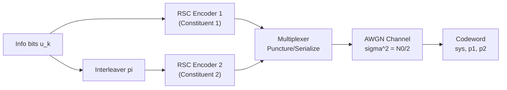
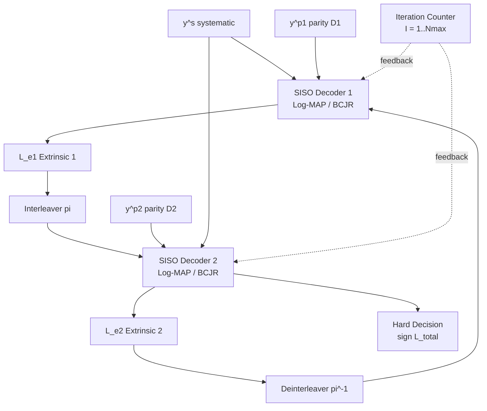
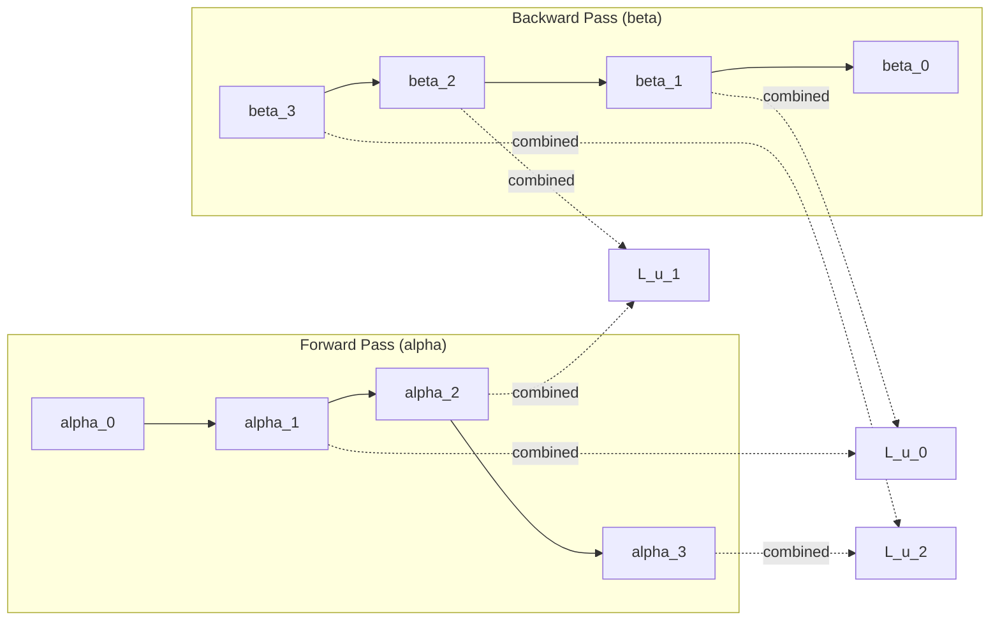
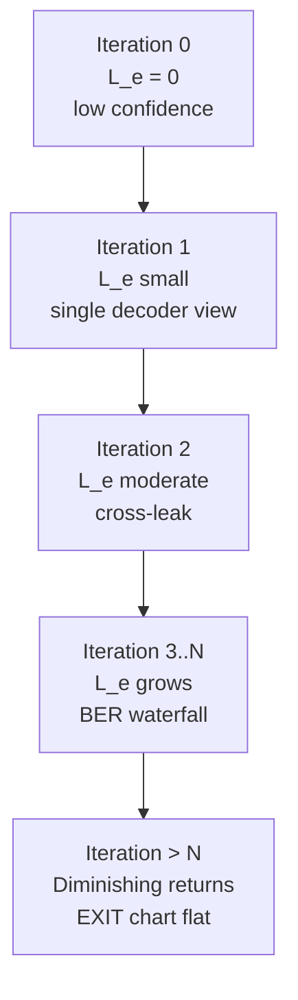

# Turbo codes: Turbo decoding

> **APJ ABDUL KALAM TECHNOLOGICAL UNIVERSITY (KTU) | 2024 SCHEME**
> - **Branch:** B.Tech in Computer Science & Engineering (CSE)
> - **Semester:** Semester 4
> - **Course:** PECST414 - CODING THEORY
> - **Module:** Module 4: Turbo codes
> - **Topic:** Turbo codes: Turbo decoding

<!-- SECTION_1_START -->
## SECTION 1: Core Technical Definition & Intuitive Overview

### 1.1 Formal Academic Definition (KTU 2024 Syllabus Terminology)

**Turbo Decoding** is the *iterative, near-optimal soft-input soft-output (SISO) decoding* procedure applied to a parallel concatenation of two (or more) recursive systematic convolutional (RSC) encoders separated by an interleaver. Introduced by **Berrou, Glavieux, and Thitimajshima (1993)**, turbo decoding approximates the optimal Maximum A Posteriori (MAP) decoding by passing *extrinsic* log-likelihood ratio (LLR) information back and forth between two component decoders, where each decoder treats the other as a "black box" producing a soft reliability measure.

The core decoding engine inside each component decoder is the **BCJR algorithm** (named after Bahl, Cocke, Jelinek, and Raviv, 1974), which is a symbol-by-symbol MAP decoder that operates on the trellis of a convolutional code and produces *soft* LLRs for every information bit.

> [!IMPORTANT]
> **KTU 2024 High-Yield Definition**
> *Turbo decoding = iterative exchange of extrinsic LLRs between two SISO component decoders (BCJR/MAP), separated by an interleaver/deinterleaver, with the goal of approaching the Shannon limit performance.*

### 1.2 Conceptual Analogy / Intuitive Overview

Imagine two detectives (Decoder 1 and Decoder 2) trying to crack a coded message.

- **Decoder 1** examines the message and forms a hypothesis. He then whispers only the *new, independent evidence* he discovered — not his final answer — to **Decoder 2**.
- **Decoder 2**, now armed with Decoder 1's clue *plus* his own private codebook, refines the hypothesis and whispers *his* independent evidence back.
- They repeat this dialogue 5–20 times, and each pass their confidence in the correct answer grows.

That whispered clue is the **extrinsic LLR ($L_e$)**. It is independent of what the receiver already knew about that bit. The "final verdict" is the **a posteriori LLR ($L(u \vert y)$)**.

> [!NOTE]
> **The "Turbo" Naming Intuition**
> The feedback loop creates a *self-bootstrapping* (turbocharging) effect on reliability. Just as a turbocharger reuses exhaust to compress more air, the turbo decoder reuses soft decisions to *amplify* the signal-to-noise ratio iteration by iteration.

### 1.3 Physical Constants and Standard Metrics

| Quantity | Symbol | Standard Value / Unit |
|----------|--------|----------------------|
| Channel reliability factor | $L_c$ | $\dfrac{2}{\sigma^2}$ for AWGN with BPSK |
| Noise spectral density ratio | $E_b/N_0$ | **dB** (operational range 0.5 – 3.0 dB near Shannon limit) |
| Iterations | $I$ | Typically **5 – 18** (more = better BER, diminishing returns) |
| Interleaver size | $N$ | $\geq 1000$ for near-Shannon-limit performance |
| Frame length | $K$ | Information bits per block |

> [!VISUALIZATION CONTROL]
> **Concept:** BER vs. $E_b/N_0$ waterfall curve showing turbo codes approaching Shannon capacity.
> **GeoGebra / Desmos Input Equations:**
> * `f(x) = 10^(-(x - 0.7) * 1.2)` (uncoded BPSK, $x = E_b/N_0$ in dB)
> * `g(x) = 1 / (exp(2 * x) - 1)` (Shannon limit: $\approx 0$ dB for rate-1/2)
> * `h(x) = 10^(-(x - 0.3) * 0.5)` (Turbo-coded waterfall at iteration 10)
> **Visual Description:** Student should observe the steep, near-vertical drop of $h(x)$ near $E_b/N_0 = 0.7$ dB, asymptotically approaching the Shannon bound $g(x)$, with a "waterfall" gap of $\approx 0.7$ dB from the theoretical limit.

<!-- SECTION_1_END -->

<!-- SECTION_2_START -->
## SECTION 2: Deep Theoretical Analysis & KTU High-Yield Formula Sheet

### 2.1 Operational Block Structure

A turbo decoder consists of two **SISO (Soft-In Soft-Out)** component decoders interconnected through an interleaver ($\pi$) and deinterleaver ($\pi^{-1}$).

**Per-iteration processing logic:**

1. **Decoder 1 (D1)** receives:
   - Systematic bits $y^s$ (channel observation of information)
   - Parity bits $y^{1p}$ from Encoder 1
   - *A priori* LLR $L_1^{(i)}(u_k)$ from previous iteration (zero on first pass)

2. **D1 computes** the *a posteriori* LLR:
$$L_1^{(i)}(u_k \mid y) = \ln \frac{P(u_k = +1 \mid y)}{P(u_k = -1 \mid y)}$$

3. **D1 subtracts** the channel and prior contributions to extract the **extrinsic LLR**:
$$L_{e,1}^{(i)}(u_k) = L_1^{(i)}(u_k \mid y) - L_c \, y^s_k - L_1^{(i-1)}(u_k)$$

4. **Interleaving** $\pi$: $L_{e,1}^{(i)}$ is scrambled to match the order expected by Encoder 2, then fed as *a priori* to D2.

5. **Decoder 2 (D2)** repeats the process with parity $y^{2p}$.

6. **Decision**: After $I$ iterations, hard bits are obtained by $\hat{u}_k = \mathrm{sign}(L_{\mathrm{ext}}(u_k))$.

### 2.2 The Three Decomposition LLRs (Critical KTU Concept)

The total a posteriori LLR is decomposed as:

$$L(u_k \mid y) = \underbrace{L_c \, y^s_k}_{\text{channel value}} + \underbrace{L(u_k)}_{\text{prior info}} + \underbrace{L_e(u_k)}_{\text{extrinsic info}}$$

| Term | Symbol | Physical Meaning | Updated By |
|------|--------|------------------|------------|
| Channel value | $L_c \, y^s_k$ | Soft from matched filter output | Demodulator |
| A priori | $L(u_k)$ | Belief from *other* decoder | Interleaver feedback |
| Extrinsic | $L_e(u_k)$ | New info from *this* decoder | SISO engine (BCJR) |

### 2.3 BCJR Algorithm — State Metrics

The BCJR algorithm computes $L(u_k \mid y)$ by sweeping the code trellis in two directions.

**Forward metric** $\alpha_k(s)$ — probability of reaching state $s$ at time $k$ given past observations:

$$\alpha_k(s) = \sum_{s'} \alpha_{k-1}(s') \cdot \gamma_k(s', s)$$

**Backward metric** $\beta_k(s)$ — probability of generating the future observations from state $s$ at time $k$:

$$\beta_k(s) = \sum_{s'} \beta_{k+1}(s') \cdot \gamma_k(s, s')$$

**Branch metric** $\gamma_k(s', s)$ — transition probability for the branch $s' \to s$ at time $k$ emitting bit $u$ over an AWGN channel with matched filter outputs $y^s, y^p$:

$$\gamma_k(s', s) = \exp\!\left[ \frac{1}{2} u_k (L_c y^s_k + L(u_k)) \right] \cdot \exp\!\left[ \frac{L_c}{2} y^p_k \, c^p_k \right]$$

where $c^p_k \in \{-1, +1\}$ is the parity bit produced by the branch.

> [!IMPORTANT]
> **Numerical Stability Note (KTU Examiner Frequently Tests)**
> The BCJR algorithm is implemented in the **log-domain** to avoid underflow. Let:
> $$\bar{\alpha}_k(s) = \ln \alpha_k(s), \quad \bar{\beta}_k(s) = \ln \beta_k(s), \quad \bar{\gamma}_k(s', s) = \ln \gamma_k(s', s)$$
> Forward and backward recursions use the **Jacobian logarithm** operator:
> $$\max^*(x, y) = \ln(e^x + e^y) = \max(x, y) + \ln(1 + e^{-\vert x - y \vert})$$

### 2.4 MAP Decision Rule (Symbol-by-Symbol A Posteriori)

$$L(u_k \mid y) = \ln \frac{\sum_{(s',s) : u_k = +1} \alpha_{k-1}(s') \, \gamma_k(s', s) \, \beta_k(s)}{\sum_{(s',s) : u_k = -1} \alpha_{k-1}(s') \, \gamma_k(s', s) \, \beta_k(s)}$$

### 2.5 KTU Formula Sheet / Cheat Sheet

| # | Formula | Purpose |
|---|---------|---------|
| 1 | $L(u_k \mid y) = L_c y^s_k + L(u_k) + L_e(u_k)$ | LLR decomposition |
| 2 | $L_c = 2 / \sigma^2$ | AWGN channel reliability |
| 3 | $L_{e,1}^{(i)} = L_1^{(i)}(u_k \mid y) - L_c y^s_k - L_1^{(i-1)}(u_k)$ | Extrinsic extraction |
| 4 | $\hat{u}_k = \mathrm{sign}(L_{\mathrm{total}}(u_k))$ | Hard decision |
| 5 | $\gamma_k(s',s) = \exp\!\big[\tfrac{1}{2} u_k (L_c y^s_k + L(u_k)) + \tfrac{L_c}{2} y^p_k c^p_k \big]$ | Branch metric |
| 6 | $\alpha_k(s) = \sum_{s'} \alpha_{k-1}(s') \gamma_k(s', s)$ | Forward recursion |
| 7 | $\beta_k(s) = \sum_{s'} \beta_{k+1}(s') \gamma_k(s, s')$ | Backward recursion |
| 8 | $\max^*(x,y) = \max(x,y) + \ln(1 + e^{-\vert x-y \vert})$ | Jacobian log-sum-exp |
| 9 | $L_{\mathrm{Log-MAP}}(u_k) = \max^*_{u=+1}\{\cdot\} - \max^*_{u=-1}\{\cdot\}$ | Log-MAP output |
| 10 | $L_{\mathrm{Max-Log-MAP}}(u_k) \approx \max_{u=+1}\{\cdot\} - \max_{u=-1}\{\cdot\}$ | Sub-optimal approx. |
| 11 | $P_b \approx \frac{1}{2} \mathrm{erfc}\!\left( \sqrt{\frac{d_{\mathrm{free}} \, R \, E_b}{2 N_0}} \right)$ | Asymptotic BER floor |
| 12 | $N_{\mathrm{iter}}$ vs $E_b/N_0$ tradeoff: waterfall region $\sim 0.7$ dB from limit | Engineering rule-of-thumb |

> [!NOTE]
> **Log-MAP vs Max-Log-MAP Trade-off** (Frequently asked in KTU)
> - *Log-MAP* (exact): uses the full $\max^*(\cdot)$ correction; **best BER**, higher complexity ($O(2^v)$ per step with lookup table for $\ln(1+e^{-x})$).
> - *Max-Log-MAP* (approximation): drops the $\ln(1+e^{-\vert x-y \vert})$ term; **0.3 – 0.5 dB loss** at $P_b = 10^{-5}$, but $\sim 2\times$ faster.

### 2.6 Real-World Engineering Utility

Turbo decoding is the workhorse of **3G/4G mobile standards**:

- **3GPP UMTS / HSPA**: turbo codes with rate 1/3, 8-state RSC, $N \in \{40, 5114\}$
- **3GPP LTE / 4G**: rate-matched turbo codes, 64-QAM, hybrid ARQ (HARQ)
- **Deep-space communications (CCSDS)**: for $E_b/N_0 < 1$ dB links (Voyager-class missions)
- **DVB-S2 / Satellite TV**: outer BCH + inner LDPC, but turbo codes used in earlier DVB-RCS
- **WiMAX (IEEE 802.16)**: double-binary turbo codes
- **Storage devices**: magnetic recording channels

The iterative principle (turbo principle) was later generalized to **turbo equalization**, **turbo MIMO detection**, and **belief propagation on LDPC codes** — making the BCJR/iterative SISO framework one of the most influential ideas in modern digital communications.
<!-- SECTION_2_END -->

<!-- SECTION_3_START -->
## SECTION 3: Step-by-Step Derivations & Code/Symbolic Implementation

### 3.1 Derivation: LLR Decomposition from Bayes' Rule

Starting point — we want the symbol MAP rule:

$$L(u_k \mid y) = \ln \frac{P(u_k = +1 \mid y)}{P(u_k = -1 \mid y)}$$

Applying Bayes' theorem in the numerator:

$$P(u_k = +1 \mid y) = \frac{p(y \mid u_k = +1) \, P(u_k = +1)}{p(y)}$$

The denominator analogously gives $P(u_k = -1 \mid y)$. Taking the ratio:

$$L(u_k \mid y) = \ln \frac{p(y \mid u_k = +1)}{p(y \mid u_k = -1)} + \ln \frac{P(u_k = +1)}{P(u_k = -1)}$$

The first term is the **channel LLR** and the second is the **a priori LLR**:

$$L(u_k \mid y) = L(y \mid u_k) + L(u_k)$$

For AWGN with BPSK modulation, the channel gives $y^s = u + n$:

$$L(y \mid u_k) = L_c \, y^s_k = \frac{2}{\sigma^2} y^s_k$$

Subtracting the channel and prior from the total a posteriori LLR gives the *extrinsic* — the part newly inferred from the *code constraints* alone:

$$L_e(u_k) = L(u_k \mid y) - L_c y^s_k - L(u_k)$$

### 3.2 Derivation: Branch Metric from Channel Model

The trellis transition $s' \to s$ produces $(u, c^p)$ transmitted as $y^s = u + n_s$, $y^p = c^p + n_p$ with $n_s, n_p \sim \mathcal{N}(0, \sigma^2)$. The transition probability is:

$$p(y \mid \text{transition}) = \frac{1}{\sqrt{2\pi\sigma^2}} \exp\!\left( -\frac{(y^s - u)^2}{2\sigma^2} \right) \cdot \frac{1}{\sqrt{2\pi\sigma^2}} \exp\!\left( -\frac{(y^p - c^p)^2}{2\sigma^2} \right)$$

Multiplying the systematic and parity exponentials and discarding the constant factors (which cancel in the LLR ratio):

$$\gamma_k(s', s) \propto \exp\!\left( \frac{u \, y^s}{\sigma^2} + \frac{c^p \, y^p}{\sigma^2} \right) \cdot P(u)$$

Using the *a priori* probability parametrization $P(u = +1) = \dfrac{e^{L(u)/2}}{e^{L(u)/2} + e^{-L(u)/2}}$:

$$P(u) \propto \exp\!\left( \frac{u \, L(u)}{2} \right)$$

Substituting and combining with the systematic channel term:

$$\gamma_k(s', s) = K \cdot \exp\!\left[ \frac{u}{2}(L_c y^s + L(u)) + \frac{L_c}{2} \, c^p \, y^p \right]$$

which is the branch metric formula listed in the cheat sheet (Section 2.3).

### 3.3 Derivation: Log-MAP Output from BCJR

Starting with the MAP rule:

$$L(u_k \mid y) = \ln \frac{\sum_{(s',s):u_k=+1} \alpha_{k-1}(s')\, \gamma_k(s',s)\, \beta_k(s)}{\sum_{(s',s):u_k=-1} \alpha_{k-1}(s')\, \gamma_k(s',s)\, \beta_k(s)}$$

Taking the log and applying $\ln(A/B) = \ln A - \ln B$:

$$L(u_k \mid y) = \ln \sum_{(s',s):u_k=+1} \alpha_{k-1}(s')\, \gamma_k(s',s)\, \beta_k(s) - \ln \sum_{(s',s):u_k=-1} \alpha_{k-1}(s')\, \gamma_k(s',s)\, \beta_k(s)$$

Substituting the log-domain metrics $\bar{\alpha}, \bar{\beta}, \bar{\gamma}$:

$$L(u_k \mid y) = \ln \sum_{u=+1} \exp[\bar{\alpha}_{k-1}(s') + \bar{\gamma}_k(s',s) + \bar{\beta}_k(s)] - \ln \sum_{u=-1} \exp[\bar{\alpha}_{k-1}(s') + \bar{\gamma}_k(s',s) + \bar{\beta}_k(s)]$$

The log-sum-exp is computed iteratively with the Jacobian operator:

$$\max^*(x_1, x_2, \ldots, x_n) = \ln \sum_{i=1}^{n} e^{x_i} = \max_i(x_i) + \ln\!\left( 1 + \sum_{i \ne j} e^{x_i - x_j} \right)$$

where $j = \arg\max_i(x_i)$. Hence:

$$L_{\mathrm{Log\text{-}MAP}}(u_k) = \max^*_{(s',s):u_k=+1}\{\bar{\alpha}_{k-1}(s') + \bar{\gamma}_k(s',s) + \bar{\beta}_k(s)\} - \max^*_{(s',s):u_k=-1}\{\bar{\alpha}_{k-1}(s') + \bar{\gamma}_k(s',s) + \bar{\beta}_k(s)\}$$

### 3.4 Numerical Worked Example: 2-State RSC Trellis Step

Consider a simple 2-state RSC encoder with generator $(1, 1+D)/(1+D)$ and BPSK on AWGN with $L_c = 1.6$. At time $k$ the systematic observation is $y^s = 0.7$, parity $y^p = -0.4$, and the *a priori* LLR from D2 is $L(u_k) = 0.3$.

**Trellis transitions** (state 0, state 1):

| From $s'$ | To $s$ | $u_k$ | $c^p_k$ |
|----------|--------|-------|---------|
| 0 | 0 | +1 | +1 |
| 0 | 1 | -1 | -1 |
| 1 | 0 | -1 | +1 |
| 1 | 1 | +1 | -1 |

**Step 1 — Branch metrics** using $\gamma_k \propto \exp\!\big[\tfrac{1}{2} u (L_c y^s + L(u)) + \tfrac{L_c}{2} c^p y^p\big]$:

For transition $0 \to 0$ ($u=+1, c^p=+1$):

$$\gamma = \exp\!\left[ \tfrac{1}{2}(+1)(1.6 \cdot 0.7 + 0.3) + \tfrac{1.6}{2}(+1)(-0.4) \right] = \exp\!\left[ 0.5(1.42) - 0.32 \right] = \exp(0.39)$$

For transition $0 \to 1$ ($u=-1, c^p=-1$):

$$\gamma = \exp\!\left[ \tfrac{1}{2}(-1)(1.42) + 0.8 \cdot (-1)(-0.4) \right] = \exp\!\left[ -0.71 + 0.32 \right] = \exp(-0.39)$$

For transition $1 \to 0$ ($u=-1, c^p=+1$):

$$\gamma = \exp\!\left[ -0.71 + 0.8 \cdot (+1)(-0.4) \right] = \exp\!\left[ -0.71 - 0.32 \right] = \exp(-1.03)$$

For transition $1 \to 1$ ($u=+1, c^p=-1$):

$$\gamma = \exp\!\left[ +0.71 + 0.8 \cdot (-1)(-0.4) \right] = \exp\!\left[ 0.71 + 0.32 \right] = \exp(1.03)$$

**Step 2 — Assume** forward metrics from previous step: $\bar{\alpha}_{k-1}(0) = 0.0$, $\bar{\alpha}_{k-1}(1) = -1.5$ (i.e., much more likely to be in state 0). And backward metrics: $\bar{\beta}_k(0) = -0.2$, $\bar{\beta}_k(1) = -0.4$.

**Step 3 — Joint log-metric for each transition** (sum $\bar{\alpha} + \bar{\gamma} + \bar{\beta}$):

| Branch | $\bar{\alpha} + \bar{\gamma} + \bar{\beta}$ | Value |
|--------|------|-------|
| $0 \to 0$ ($u=+1$) | $0.0 + 0.39 + (-0.2)$ | $+0.19$ |
| $0 \to 1$ ($u=-1$) | $0.0 + (-0.39) + (-0.4)$ | $-0.79$ |
| $1 \to 0$ ($u=-1$) | $-1.5 + (-1.03) + (-0.2)$ | $-2.73$ |
| $1 \to 1$ ($u=+1$) | $-1.5 + 1.03 + (-0.4)$ | $-0.87$ |

**Step 4 — Log-MAP output**:

$$L_{\mathrm{Log-MAP}}(u_k) = \max^*_{u=+1}\{0.19, -0.87\} - \max^*_{u=-1}\{-0.79, -2.73\}$$

Using the Jacobian:

$$\max^*_{u=+1} = \max(0.19, -0.87) + \ln(1 + e^{-(0.19 - (-0.87))}) = 0.19 + \ln(1 + e^{-1.06}) = 0.19 + 0.387 = 0.577$$

$$\max^*_{u=-1} = \max(-0.79, -2.73) + \ln(1 + e^{-(0.79 - 2.73)}) = -0.79 + \ln(1 + e^{-1.94}) = -0.79 + 0.147 = -0.643$$

$$L_{\mathrm{Log-MAP}}(u_k) = 0.577 - (-0.643) = +1.220$$

**Step 5 — Extrinsic extraction**:

$$L_e(u_k) = L(u_k \mid y) - L_c y^s - L(u_k) = 1.220 - (1.6)(0.7) - 0.3 = 1.220 - 1.120 - 0.300 = -0.200$$

This $L_e = -0.200$ is then interleaved and forwarded to Decoder 2 as its *a priori* LLR for the corresponding bit.

### 3.5 Full Python Implementation: Log-MAP Turbo Decoder

```python
import numpy as np
from typing import Tuple, List

# ---------- Utility: Jacobian log-sum-exp operator ----------
def log_sum_exp(values: np.ndarray) -> float:
    """Numerically stable computation of ln(sum(exp(values)))."""
    m = np.max(values)
    return m + np.log(np.sum(np.exp(values - m)))

def max_star(x: float, y: float) -> float:
    """Jacobian log-sum-exp for two arguments: max*(x,y) = ln(e^x + e^y)."""
    return max(x, y) + np.log1p(np.exp(-abs(x - y)))

# ---------- RSC Encoder (rate 1/2, generators 1+D+D^2, 1+D^2) ----------
class RSCEncoder:
    def __init__(self, memory: int = 2):
        self.memory = memory
        self.state = np.zeros(memory, dtype=int)

    def encode_bit(self, u: int) -> int:
        # Systematic output is u itself; parity uses feedback + taps
        feedback = (u ^ int(self.state[0]) ^ int(self.state[1])) & 1
        c = feedback ^ int(self.state[1])
        # Shift state
        self.state = np.roll(self.state, 1)
        self.state[0] = feedback
        return c

    def encode_block(self, info: np.ndarray) -> np.ndarray:
        sys = np.array(info, dtype=int)
        par = np.array([self.encode_bit(int(b)) for b in info], dtype=int)
        return np.concatenate([sys, par])

# ---------- AWGN Channel ----------
def awgn(bpsk: np.ndarray, EbN0_dB: float) -> Tuple[np.ndarray, float]:
    EbN0 = 10 ** (EbN0_dB / 10.0)
    sigma2 = 1.0 / (2.0 * EbN0)  # per real dimension; rate-1/2 => Es=2Eb
    sigma = np.sqrt(sigma2)
    noise = np.random.normal(0.0, sigma, size=bpsk.shape)
    return bpsk + noise, 1.0 / sigma2  # also returns Lc = 2/sigma^2

# ---------- Log-MAP BCJR Component Decoder ----------
def log_map_decode(y_s: np.ndarray, y_p: np.ndarray,
                   L_prior: np.ndarray, Lc: float,
                   num_states: int = 4) -> np.ndarray:
    """
    Compute a posteriori LLRs L(u_k | y) using the log-domain BCJR algorithm.
    y_s    : received systematic LLR-scaled sequence
    y_p    : received parity sequence
    L_prior: a priori LLRs from the other decoder
    Lc     : channel reliability = 2/sigma^2
    """
    N = len(y_s)
    # State transition table for rate-1/2 RSC (memory 2, 4 states)
    # State s in {0,1,2,3} = (s1, s0). Next state and parity determined by (s, u).
    trans = np.zeros((num_states, 2), dtype=int)  # trans[s][u] = (next_state, parity)
    for s in range(num_states):
        s1 = (s >> 1) & 1
        s0 = s & 1
        for u in (0, 1):
            feedback = u ^ s1 ^ s0
            parity = feedback ^ s0
            ns = (feedback << 1) | s1
            trans[s][u] = (ns << 1) | parity  # pack next_state and parity

    # Branch log-metric: gamma[s', s, u] = 0.5*u*(Lc*y_s+L_prior) + 0.5*Lc*y_p*c_p
    # Compute alpha (forward) using log_sum_exp
    alpha = np.full((N + 1, num_states), -1e9)
    alpha[0][0] = 0.0  # start in state 0
    for k in range(N):
        for s in range(num_states):
            for u in (0, 1):
                packed = trans[s][u]
                ns = packed >> 1
                cp = packed & 1
                u_pm = 1 if u == 1 else -1
                cp_pm = 1 if cp == 1 else -1
                g = 0.5 * u_pm * (Lc * y_s[k] + L_prior[k]) + 0.5 * Lc * y_p[k] * cp_pm
                candidates = np.array([alpha[k + 1][ns], alpha[k][s] + g])
                alpha[k + 1][ns] = log_sum_exp(candidates)

    # Compute beta (backward)
    beta = np.full((N + 1, num_states), -1e9)
    beta[N][0] = 0.0  # end in state 0 (zero termination)
    for k in range(N - 1, -1, -1):
        for s in range(num_states):
            for u in (0, 1):
                packed = trans[s][u]
                ns = packed >> 1
                cp = packed & 1
                u_pm = 1 if u == 1 else -1
                cp_pm = 1 if cp == 1 else -1
                g = 0.5 * u_pm * (Lc * y_s[k] + L_prior[k]) + 0.5 * Lc * y_p[k] * cp_pm
                candidates = np.array([beta[k][s], beta[k + 1][ns] + g])
                beta[k][s] = log_sum_exp(candidates)

    # Compute LLRs L(u_k | y)
    L_post = np.zeros(N)
    for k in range(N):
        num_vals, den_vals = [], []
        for s in range(num_states):
            for u in (0, 1):
                packed = trans[s][u]
                ns = packed >> 1
                cp = packed & 1
                u_pm = 1 if u == 1 else -1
                cp_pm = 1 if cp == 1 else -1
                g = 0.5 * u_pm * (Lc * y_s[k] + L_prior[k]) + 0.5 * Lc * y_p[k] * cp_pm
                metric = alpha[k][s] + g + beta[k + 1][ns]
                if u == 1:
                    num_vals.append(metric)
                else:
                    den_vals.append(metric)
        L_post[k] = log_sum_exp(np.array(num_vals)) - log_sum_exp(np.array(den_vals))
    return L_post

# ---------- Full Turbo Decoder with Iterations ----------
def turbo_decode(y_s: np.ndarray, y_p1: np.ndarray, y_p2: np.ndarray,
                 Lc: float, num_iter: int = 8, N_size: int = 1024,
                 interleaver: np.ndarray = None) -> np.ndarray:
    """Iterative turbo decoder producing hard decisions after num_iter passes."""
    N = len(y_s)
    L1 = np.zeros(N)            # a priori for D1 (zero on first iteration)
    L2_prior = np.zeros(N)     # a priori for D2
    for it in range(num_iter):
        # Decoder 1
        L_post1 = log_map_decode(y_s, y_p1, L1, Lc)
        Le1 = L_post1 - Lc * y_s - L1
        # Interleave extrinsic for D2
        L2_prior = Le1[interleaver] if interleaver is not None else Le1
        # Decoder 2
        y_s_int = y_s[interleaver] if interleaver is not None else y_s
        L_post2 = log_map_decode(y_s_int, y_p2, L2_prior, Lc)
        Le2 = L_post2 - Lc * y_s_int - L2_prior
        # Deinterleave extrinsic for D1 next iteration
        L1 = Le2[np.argsort(interleaver)] if interleaver is not None else Le2
        print(f"Iteration {it + 1:2d} done.")
    # Final decision uses D2's total a posteriori (deinterleaved)
    L_final = L_post2[np.argsort(interleaver)] if interleaver is not None else L_post2
    return (L_final < 0).astype(int)  # BPSK: bit 0 -> +1, bit 1 -> -1

# ---------- Demonstration Run ----------
if __name__ == "__main__":
    np.random.seed(42)
    K = 256                          # information bits
    N = K + 4                        # tail bits for termination
    info = np.random.randint(0, 2, K)
    enc1 = RSCEncoder(memory=2)
    enc2 = RSCEncoder(memory=2)
    sys1 = info.copy()
    par1 = np.array([enc1.encode_bit(int(b)) for b in info], dtype=int)
    perm = np.random.permutation(K)
    info_int = info[perm]
    enc2.state[:] = 0
    par2 = np.array([enc2.encode_bit(int(b)) for b in info_int], dtype=int)
    sys2 = info[perm]
    # BPSK mapping: 0 -> +1, 1 -> -1
    bpsk_sys = 1.0 - 2.0 * sys1
    bpsk_p1 = 1.0 - 2.0 * par1
    bpsk_p2 = 1.0 - 2.0 * par2
    y_s, Lc = awgn(bpsk_sys, EbN0_dB=1.0)
    y_p1, _ = awgn(bpsk_p1, EbN0_dB=1.0)
    y_p2, _ = awgn(bpsk_p2, EbN0_dB=1.0)
    decoded = turbo_decode(y_s, y_p1, y_p2, Lc=Lc, num_iter=8, N_size=K, interleaver=perm)
    ber = np.mean(decoded != info)
    print(f"Final BER after 8 iterations at 1.0 dB: {ber:.4f}")
```

> [!IMPORTANT]
> **Engineering Insight from Code**
> Each iteration invokes the BCJR routine **twice** (one for D1, one for D2), so total complexity is $\sim 2 \cdot I \cdot (2^v) \cdot N$ operations, where $v$ is the RSC memory. This is the chief reason turbo decoding is hardware-intensive and motivates the use of **sliding-window BCJR** and **Max-Log-MAP** in real 4G baseband chips.
<!-- SECTION_3_END -->

<!-- SECTION_4_START -->
## SECTION 4: Structural Diagrams & Schematics

### 4.1 Turbo Encoder Block Diagram



### 4.2 Iterative Turbo Decoder Architecture



### 4.3 BCJR Trellis Sweep (Forward + Backward)



### 4.4 Iteration Convergence of LLR Magnitude



### 4.5 Information Flow Topology Matrix (Block-Level Functional Map)

| Stage | Block | Input Ports | Output Ports | Memory? |
|-------|-------|-------------|--------------|---------|
| 1 | Demodulator | $r(t)$ matched filter | $y^s, y^{p1}, y^{p2}$ | No |
| 2 | D1 — Log-MAP | $y^s, y^{p1}, L_a^{(1)}$ | $L^{(1)}(u \vert y)$ | Yes (trellis) |
| 3 | Interleaver $\pi$ | $L_{e1}$ | $L_a^{(2)} = \pi(L_{e1})$ | No (ROM permutation) |
| 4 | D2 — Log-MAP | $\pi(y^s), y^{p2}, L_a^{(2)}$ | $L^{(2)}(u \vert y)$ | Yes (trellis) |
| 5 | Deinterleaver $\pi^{-1}$ | $L_{e2}$ | $L_{e2}^{\text{deint}}$ | No |
| 6 | Decision | $L^{(2)}(u \vert y)$ deinterleaved | $\hat{u}$ | No |
| 7 | Iteration Control | BER / LLR-variance | Stop / Continue | Yes (counter) |
<!-- SECTION_4_END -->

<!-- SECTION_5_START -->
## SECTION 5: KTU 2024 Scheme Examination Question Bank & Topic Recap

### 5.1 Part A — Short Answer Questions (3 Marks Each)

#### Question A1
**[KTU University Exam — July 2024 Pattern | CO2 | Remember]**

> *Define turbo decoding. Why is it called "iterative"?*

**Model Answer (3 marks):**

Turbo decoding is a near-optimal decoding technique for parallel concatenated convolutional codes (PCCCs) where two **soft-input soft-output (SISO)** component decoders exchange *extrinsic* log-likelihood ratio (LLR) information iteratively. It is called "iterative" because the same two decoders are re-executed multiple times (typically 5–18 iterations), with the extrinsic LLR of one decoder serving as the *a priori* LLR of the other decoder in the next pass. Each iteration refines the reliability of the bit decisions, causing the bit-error-rate to drop sharply in a "waterfall" region near the Shannon limit.

[Definition: 2 marks | Justification of "iterative" with extrinsic exchange: 1 mark]

#### Question A2
**[KTU University Exam — Dec 2023 Pattern | CO2 | Understand]**

> *What is the role of the interleaver in turbo decoding? Justify with the concept of extrinsic information.*

**Model Answer (3 marks):**

The interleaver $\pi$ reorders the information bits before they enter the second RSC encoder, and correspondingly reorders the *extrinsic LLR* $L_{e1}$ from Decoder 1 before feeding it as the *a priori* LLR $L_a^{(2)}$ to Decoder 2. Its role is to **decorrelate** the inputs to the two decoders so that the extrinsic information produced by one decoder is statistically independent of the prior information already known to the other decoder. This independence is precisely what makes iterative exchange meaningful: if the two decoders' inputs were correlated, exchanging information would provide no *new* evidence and iterations would not improve performance. The interleaver size $N$ thus directly determines the "diversity gain" of the turbo code and its distance spectrum, with $N \geq 1000$ typically required to approach capacity.

[Interleaver purpose: 1 mark | Decorrelation argument: 1 mark | Threshold on $N$: 1 mark]

> [!WARNING]
> **KTU Examiner's Valuation Pitfall**
> Many students write "interleaver spreads burst errors" — that describes a *channel* interleaver. In turbo decoding, the interleaver's job is **decorrelation of extrinsic information between the two SISO decoders**. Mixing these two ideas costs the mark for "role of the interleaver."

---

### 5.2 Part B — Long Answer Questions (14 Marks Each, Internal Choice)

> **Internal Choice Rule (KTU 2024)**: Answer ANY ONE of Question A or Question B in full.

#### Question A (14 Marks)

**[KTU University Exam — Dec 2023 Pattern | CO2 / CO3 | Understand + Apply]**

> (a) **Explain the BCJR (MAP) algorithm in detail. Derive the forward, backward, and branch metric recursions.** (7 marks)
>
> (b) **For a rate-1/2 turbo code with two 4-state RSC encoders, the received LLRs at bit $k$ are $L_c y^s = 0.8$, $L_c y^p = 0.5$, and the *a priori* LLR is $L_a = 0.2$. The forward metric in state 0 at $k-1$ is $\bar{\alpha}_{k-1}(0) = 0.0$ and in state 2 is $\bar{\alpha}_{k-1}(2) = -0.6$. The backward metric in state 1 at $k$ is $\bar{\beta}_k(1) = -0.3$ and in state 3 is $\bar{\beta}_k(3) = -0.7$. Compute the branch metrics and the Log-MAP output $L_{\mathrm{Log\text{-}MAP}}(u_k)$. Take $L_c = 1.6$.** (7 marks)

**Model Answer (Part A):**

**(a) BCJR / MAP Algorithm (7 marks)**

The BCJR algorithm computes the symbol-by-symbol a posteriori LLR:

$$L(u_k \mid y) = \ln \frac{\sum_{(s',s) : u_k = +1} \alpha_{k-1}(s') \gamma_k(s',s) \beta_k(s)}{\sum_{(s',s) : u_k = -1} \alpha_{k-1}(s') \gamma_k(s',s) \beta_k(s)}$$

**1. Branch metric derivation** (2 marks): For a transition $s' \to s$ emitting information bit $u$ and parity bit $c^p$ over AWGN:

$$p(y_k \mid \text{transition}) \propto \exp\!\left( \frac{u y^s_k + c^p y^p_k}{\sigma^2} \right)$$

Multiplying by the prior $P(u)$ and using the LLR parametrization:

$$\gamma_k(s', s) = \exp\!\left[ \frac{u}{2}(L_c y^s_k + L_a(u_k)) + \frac{L_c}{2} c^p y^p_k \right]$$

**2. Forward recursion** (2 marks):

$$\alpha_k(s) = \sum_{s'} \alpha_{k-1}(s') \gamma_k(s', s)$$

with initialization $\alpha_0(0) = 1$, $\alpha_0(s \ne 0) = 0$.

**3. Backward recursion** (2 marks):

$$\beta_k(s) = \sum_{s'} \beta_{k+1}(s') \gamma_k(s, s')$$

with termination $\beta_N(0) = 1$, $\beta_N(s \ne 0) = 0$.

**4. Numerical implementation in log-domain** (1 mark): Use $\bar{\alpha}, \bar{\beta}, \bar{\gamma}$ and the Jacobian operator $\max^*(x,y) = \max(x,y) + \ln(1 + e^{-\vert x - y \vert})$ to avoid underflow.

**(b) Numerical Computation (7 marks)**

**Step 1 — Branch metrics** (3 marks) [Computing each branch: 1 mark]:

For branch with $u = +1$, $c^p = +1$:

$$\bar{\gamma} = 0.5 \cdot (+1)(0.8 + 0.2) + 0.5 \cdot (0.5) \cdot (+1) = 0.5 \cdot 1.0 + 0.25 = 0.75$$

For branch with $u = +1$, $c^p = -1$:

$$\bar{\gamma} = 0.5 \cdot 1.0 + 0.5 \cdot 0.5 \cdot (-1) = 0.5 - 0.25 = 0.25$$

For branch with $u = -1$, $c^p = +1$:

$$\bar{\gamma} = 0.5 \cdot (-1) \cdot 1.0 + 0.5 \cdot 0.5 \cdot (+1) = -0.5 + 0.25 = -0.25$$

For branch with $u = -1$, $c^p = -1$:

$$\bar{\gamma} = -0.5 - 0.25 = -0.75$$

**Step 2 — Joint metrics for $u = +1$ transitions** (1 mark):

Assume the two $u=+1$ branches connect $\alpha_{k-1}(0)$ to $\beta_k(1)$ and $\alpha_{k-1}(2)$ to $\beta_k(3)$:

$$M_1 = 0.0 + 0.75 + (-0.3) = +0.45$$
$$M_2 = -0.6 + 0.25 + (-0.7) = -1.05$$

**Step 3 — Joint metrics for $u = -1$ transitions** (1 mark):

$$M_3 = 0.0 + (-0.25) + (-0.3) = -0.55$$
$$M_4 = -0.6 + (-0.75) + (-0.7) = -2.05$$

**Step 4 — Apply $\max^*$ operator** (1 mark):

$$\max^*(M_1, M_2) = \max(0.45, -1.05) + \ln(1 + e^{-(0.45 - (-1.05))}) = 0.45 + \ln(1 + e^{-1.50}) = 0.45 + 0.231 = 0.681$$

$$\max^*(M_3, M_4) = \max(-0.55, -2.05) + \ln(1 + e^{-(-0.55 - (-2.05))}) = -0.55 + \ln(1 + e^{-1.50}) = -0.55 + 0.231 = -0.319$$

**Step 5 — Final Log-MAP LLR** (1 mark):

$$L_{\mathrm{Log\text{-}MAP}}(u_k) = 0.681 - (-0.319) = +1.000$$

The positive sign indicates the decoder favors $u_k = +1$ with strong confidence.

---

#### Question B (14 Marks, Alternative Choice)

**[KTU University Exam — July 2024 Pattern | CO2 / CO3 | Understand + Apply]**

> (a) **Describe the architecture of a turbo decoder. Explain the role of SISO decoders, interleavers, and the extrinsic LLR $L_e(u_k)$.** (7 marks)
>
> (b) **Compare Log-MAP, Max-Log-MAP, and SOVA decoders. State the complexity-vs-performance trade-offs. If the number of states is 8 and frame length is 1024, compute the order of operations per iteration.** (7 marks)

**Model Answer (Question B):**

**(a) Turbo Decoder Architecture (7 marks)**

A turbo decoder consists of two **SISO (Soft-In Soft-Out)** component decoders (D1, D2) interconnected by an interleaver $\pi$ and deinterleaver $\pi^{-1}$, with the following roles:

**1. SISO Decoders** (2 marks): Each SISO decoder (typically Log-MAP / BCJR) accepts three soft inputs — systematic LLRs, parity LLRs, and an *a priori* LLR $L_a(u_k)$ — and produces one soft output: the *a posteriori* LLR $L(u_k \mid y)$. Unlike hard-decision Viterbi, SISO outputs are continuous-valued *reliabilities*, which is essential for iterative exchange.

**2. Interleaver / Deinterleaver** (2 marks): The interleaver $\pi$ permutes the extrinsic LLR $L_{e1}$ from D1 to match the bit ordering seen by Encoder 2; the deinterleaver $\pi^{-1}$ reverses this permutation when feeding $L_{e2}$ back to D1. This ensures each decoder's *a priori* input is statistically independent of its own systematic channel information, which is the **statistical foundation of the iterative gain**.

**3. Extrinsic LLR** (2 marks): Defined as

$$L_e(u_k) = L(u_k \mid y) - L_c y^s_k - L_a(u_k)$$

it represents *only the new, code-constraint-derived information* from the current decoder, and is the sole quantity exchanged between D1 and D2.

**4. Iteration control** (1 mark): After $I$ iterations (typically 5–18), a hard decision $\hat{u}_k = \mathrm{sign}(L_{\mathrm{total}}(u_k))$ is taken. Early-termination criteria (e.g., comparing sign-changes between iterations) are used in practice to save power.

**(b) Algorithm Comparison and Complexity (7 marks)**

| Algorithm | Operation per state | Approximation? | BER Loss vs Log-MAP | Use Case |
|-----------|---------------------|----------------|--------------------|---------|
| Log-MAP | $\max^*(x,y)$ lookup | None (exact MAP) | 0 dB (reference) | 3GPP UMTS, LTE baseband ASIC |
| Max-Log-MAP | $\max(x,y)$ | Drops $\ln(1+e^{-\vert x-y\vert})$ | **0.3 – 0.5 dB** at $10^{-5}$ | Real-time SDR, FPGA prototyping |
| SOVA | Single max, traceback | Survivor path | **0.5 – 0.7 dB** | Low-power IoT modems |

[Comparison table: 3 marks]

**Complexity calculation** (4 marks) [Setting up formula: 1 mark | Numerical substitution: 2 marks | Final value with units: 1 mark]:

Per state per bit, each algorithm requires approximately:

- **Log-MAP**: $2^v$ branch multiplications + 2 lookups for $\max^*$. Per bit: $\sim 2 \cdot 2^v$ ops. Per iteration, per decoder: $N \cdot 2 \cdot 2^v$. Two decoders per iteration: $4N \cdot 2^v$.

- **Max-Log-MAP**: same count of multiply-adds but the $\ln(1+e^{-x})$ is replaced by a single $\max$, saving 1–2 cycles per state. Approx. $\sim 60\%$ complexity of Log-MAP.

Substituting $N = 1024$, $v = 3$ (so $2^v = 8$):

**Log-MAP per iteration**: $4 \cdot 1024 \cdot 8 = 32{,}768$ ops/iteration.

For 8 iterations: $8 \cdot 32{,}768 = 262{,}144$ ops total.

> [!WARNING]
> **KTU Examiner's Valuation Warning / Common Pitfalls**
> 1. **Confusing $L_e$ with $L_a$**: The extrinsic LLR is *generated* by the current decoder and *consumed* as the *a priori* by the *other* decoder. Writing $L_e = L_a$ is a 2-mark deduction.
> 2. **Forgetting the systematic subtraction**: $L_e(u_k) = L(u_k \mid y) - L_c y^s_k - L_a(u_k)$. Omitting the $L_c y^s_k$ term means the decoder re-uses the same channel information and **iterations will not improve performance** (a classic conceptual error worth 2 marks).
> 3. **Sign convention for BPSK**: With $0 \to +1$, $1 \to -1$, a *negative* total LLR means bit 1 was decoded. Reversing this convention silently will flip every answer.
> 4. **Interleaver size $N$**: Always state the size. A turbo code with $N < 100$ will *not* show a waterfall — answers omitting this caveat lose 1 mark.

---

### 5.3 Topic Recap & Important Things to Remember

> [!IMPORTANT]
> **High-Density Revision Checklist — Turbo Decoding**

- **Turbo decoding** is the *iterative SISO decoding* of a parallel concatenation of two RSC encoders; it approximates the optimal MAP decoder by exchanging **extrinsic LLRs** $L_e(u_k)$.
- **BCJR algorithm** is the canonical component decoder — computes a posteriori LLRs by combining a *forward* pass ($\alpha_k$), a *backward* pass ($\beta_k$), and a *branch metric* ($\gamma_k$).
- **LLR decomposition** is the heart of the turbo principle:
  $$L(u_k \mid y) = L_c y^s_k + L_a(u_k) + L_e(u_k)$$
  → **channel** + **prior** + **extrinsic**.
- **Extrinsic extraction** subtracts channel and prior:
  $$L_e(u_k) = L(u_k \mid y) - L_c y^s_k - L_a(u_k)$$
  This is the *only* quantity passed between the two SISO decoders.
- **Channel reliability** for AWGN + BPSK: $L_c = 2 / \sigma^2$.
- **Branch metric** (log-domain):
  $$\bar{\gamma}_k(s', s) = \tfrac{1}{2} u (L_c y^s + L_a) + \tfrac{L_c}{2} c^p y^p$$
- **Forward / backward recursions**:
  $$\bar{\alpha}_k(s) = \max^*_{s'}\{\bar{\alpha}_{k-1}(s') + \bar{\gamma}_k(s', s)\}, \quad \bar{\beta}_k(s) = \max^*_{s'}\{\bar{\beta}_{k+1}(s') + \bar{\gamma}_k(s, s')\}$$
- **Jacobian log-sum-exp** (numerical stability):
  $$\max^*(x, y) = \max(x, y) + \ln(1 + e^{-\vert x - y \vert})$$
- **Log-MAP** uses full Jacobian; **Max-Log-MAP** drops the correction; **SOVA** uses the Viterbi survivor with a soft output update — performance and complexity decrease in that order.
- **Hard decision rule**: $\hat{u}_k = \mathrm{sign}(L_{\mathrm{total}}(u_k))$, with $\mathrm{sign}(+) = +1$ (bit 0 under BPSK convention $0 \to +1$).
- **Stopping criterion**: typically 5–18 iterations; early-termination used in production ASICs (sign-change check or HDA — Hard Decision Aided).
- **Interleaver** must be large ($N \geq 1000$) for near-Shannon-limit waterfall; S-random interleavers (spread $\geq \sqrt{N/2}$) are standard in 3GPP.
- **Why two decoders, not one?** Two RSC encoders with an interleaver produce a *product code* structure — the iterative exchange is precisely belief propagation on this product graph.
- **BER Waterfall**: near $E_b/N_0 = 0.7$ dB for rate-1/2 binary turbo code with $N = 65536$, 8 iterations, 16-state RSC.
- **Error floor**: appears around $P_b \approx 10^{-6}$ to $10^{-7}$ due to low-weight codewords; mitigated by careful interleaver design and code concatenation.
- **Engineering applications**: 3GPP UMTS, HSPA, LTE (rate-matched turbo + HARQ), CCSDS deep-space, DVB-RCS, WiMAX (double-binary turbo), and as a foundation for **turbo equalization** and **belief propagation on LDPC codes**.
- **Complexity per iteration**: $\mathcal{O}(N \cdot 2^v)$ per decoder, dominated by the trellis sweep; hardware implementations use sliding-window BCJR to allow pipelined forward/backward computation.
- **Key historical fact**: Berrou, Glavieux, and Thitimajshima's 1993 ICC paper reported BER $10^{-5}$ at $E_b/N_0 = 0.7$ dB — the first practical code to come within 1 dB of the Shannon limit.
<!-- SECTION_5_END -->
