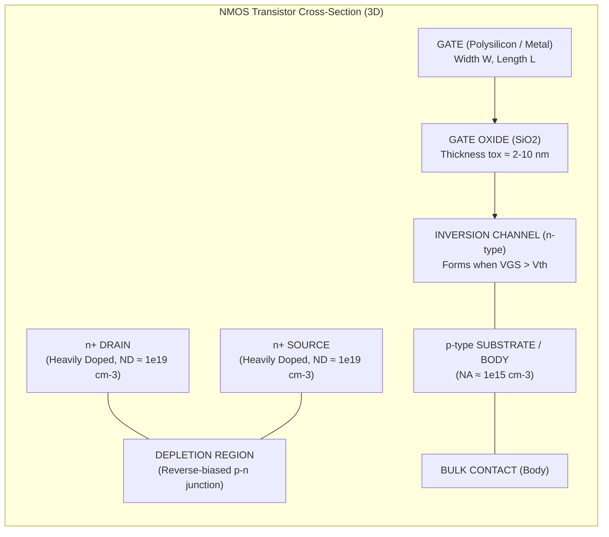
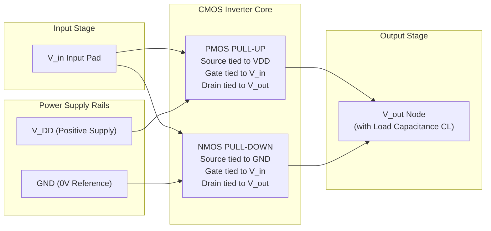
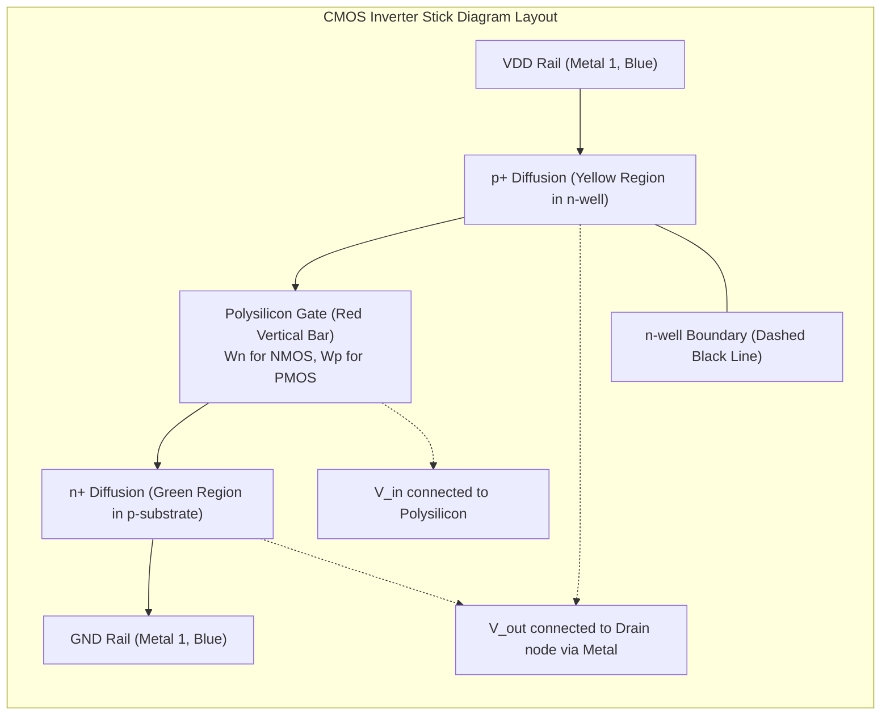
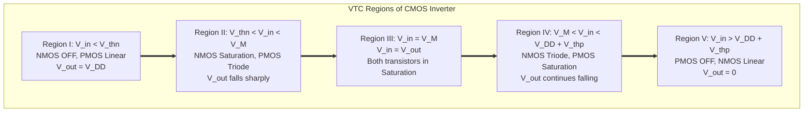
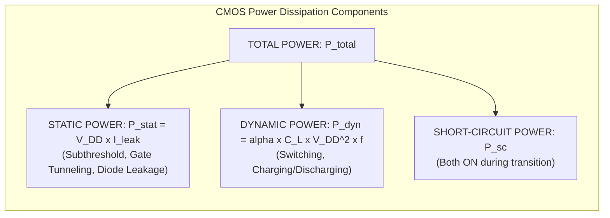
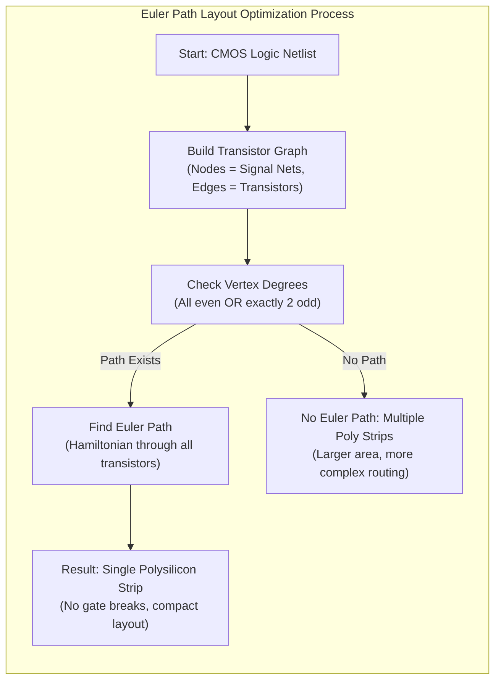

# CMOS Fundamentals for Digital VLSI Design :

<!-- SECTION_1_START -->
# CMOS Fundamentals for Digital VLSI Design

## 1.1 Core Technical Definition

> [!IMPORTANT]
> **CMOS (Complementary Metal-Oxide-Semiconductor)** is a digital logic technology that uses symmetrically paired **n-type MOSFET (NMOS)** pull-down and **p-type MOSFET (PMOS)** pull-up transistors on the same silicon substrate. The term "Complementary" refers to the fact that for every NMOS transistor turning ON, a corresponding PMOS transistor turns OFF, and vice versa — this complementary switching is the foundation of ultra-low static power digital design.

In the KTU 2024 Scheme context, the fundamental building block studied under this topic is the **CMOS Inverter**, which is analyzed across four key domains:

| Domain | What is Studied | KTU Weightage |
| :--- | :--- | :--- |
| **DC / Static** | Voltage Transfer Characteristic (VTC), Noise Margins, Switching Threshold | Very High |
| **Dynamic / Transient** | Propagation Delay, Rise/Fall times ($t_{PLH}, t_{PHL}$) | High |
| **Power** | Static $P_{stat}$, Dynamic $P_{dyn}$, Short-Circuit $P_{sc}$ | High |
| **Physical** | Stick Diagram, λ-design rules, Layout | Medium |

> [!NOTE]
> **Foundational KTU Definition — MOSFET:**
> A **Metal-Oxide-Semiconductor Field-Effect Transistor (MOSFET)** is a four-terminal voltage-controlled device consisting of a **Gate (G)**, **Source (S)**, **Drain (D)**, and **Body/Substrate (B)** terminal. The current between Source and Drain is modulated by the voltage applied across the oxide-insulated Gate, which creates an *inversion layer* (channel) at the silicon surface.

---

## 1.2 Conceptual Analogy & Intuitive Understanding

### 🚰 The "Faucet" Analogy for a MOSFET

Think of an NMOS transistor as a **smart water faucet (tap)** mounted on a cylindrical pipe:

* The **Gate (G)** is the **handle of the faucet**. You only need a small twist (voltage) to control it — no water flows *through* the handle, only the *force* of your twist.
* The **Source (S)** is the **water inlet**, and the **Drain (D)** is the **water outlet**.
* The **oxide layer** is the *insulating rubber grip* on the handle — it keeps your hand (Gate voltage) completely isolated from the water (current), which is why the Gate draws almost **zero DC current**.
* The **threshold voltage ($V_{th}$ or $V_T$)** is the *minimum twist* you must apply to the handle before *any* water starts flowing. Below $V_{th}$, the pipe is squeezed shut; above $V_{th}$, it opens progressively.

### 🔄 The "Two-Handed Door" Analogy for CMOS

A CMOS inverter is like a **two-handed swing door**:
* The **NMOS** is the *left hand* — it only opens the door when you **push** (logic '1' at input).
* The **PMOS** is the *right hand* — it only opens the door when you **pull** (logic '0' at input).
* When one hand pushes, the other pulls — **the door always has a controlled state**, and in steady state, *no one is forcing against the door* (almost zero static current flows from $V_{DD}$ to GND).

---

## 1.3 Critical Physical Constants (Must Memorize for KTU)

> [!IMPORTANT]
> **Thermal Voltage at Room Temperature:**
> $$V_T = \frac{kT}{q} \approx 25.85 \text{ mV at } 27^\circ\text{C (300 K)}$$
> where **Boltzmann's constant** $k = 1.38 \times 10^{-23}$ J/K, and **electron charge** $q = 1.6 \times 10^{-19}$ C.

| Symbol | Quantity | Typical Value / Units |
| :--- | :--- | :--- |
| $V_{DD}$ | Supply Voltage | **5 V (legacy), 3.3 V, 1.8 V, 1.2 V, 0.8 V (modern nodes)** |
| $V_{thn}$ | NMOS Threshold Voltage | **0.3 V – 0.7 V** (typical ≈ 0.4 V for 180 nm) |
| $V_{thp}$ | PMOS Threshold Voltage | **−0.3 V to −0.7 V** (magnitude similar to NMOS) |
| $t_{ox}$ | Gate Oxide Thickness | **2 nm – 10 nm** in modern processes |
| $\epsilon_{ox}$ | SiO₂ Permittivity | **3.9 × $\epsilon_0$ = 3.45 × 10⁻¹¹ F/m** |
| $\mu_n$ | Electron Mobility (NMOS) | **≈ 1350 cm²/V·s** (in Si) |
| $\mu_p$ | Hole Mobility (PMOS) | **≈ 480 cm²/V·s** (≈ $\mu_n / 3$) |
| $C_{ox}$ | Gate Oxide Capacitance per unit area | **$\epsilon_{ox} / t_{ox}$** F/m² |

> [!VISUALIZATION CONTROL]
> **Concept:** MOS Capacitor Band Diagram & Charge Inversion
> **GeoGebra / Desmos Input Equations:**
> * Plot the surface potential $\phi_s$ vs Gate Voltage $V_{GB}$ curve:
>   * `f(x) = 0.5*ln(10^((x-V_FB)/(2*V_T)))` (semilog-like response)
> * `Plot( (0, 0), (0.5, 0.3) )` and `Plot( (1.0, 0.7) )` marking accumulation, depletion, inversion regions
> **Visual Description:** The student should observe three distinct regions along the x-axis ($V_{GB}$): the flat-band, depletion (where surface charge is negative ionized acceptors), and strong inversion (where an n-type electron channel forms under the gate). The transition knee occurs at $V_{GB} = V_{th}$.

---

<!-- SECTION_1_END -->

<!-- SECTION_2_START -->
# Deep Theoretical Analysis & KTU High-Yield Formula Sheet

## 2.1 The MOS Transistor — Physical Structure

An NMOS transistor is fabricated by creating:
1. A **p-type silicon substrate (body)** doped with acceptors (Boron, ≈ 10¹⁵ cm⁻³).
2. Two heavily-doped **n⁺ regions** (Source and Drain), doped with donors (Phosphorus/Arsenic, ≈ 10¹⁹ cm⁻³).
3. A thin **silicon dioxide (SiO₂)** insulating layer grown on top.
4. A **polysilicon (or metal) Gate** electrode on top of the oxide.
5. **Ohmic contacts** to Source, Drain, Gate, and Body.

> [!NOTE]
> The body is usually tied to the most negative supply (GND for NMOS) so that the **Source-Body and Drain-Body p-n junctions are always reverse-biased**, preventing parasitic latch-up paths.

---

## 2.2 Threshold Voltage ($V_{th}$) — The Heart of MOS Physics

> [!IMPORTANT]
> **Threshold Voltage** is the minimum Gate-to-Source voltage required to create a conducting channel (inversion layer) between Source and Drain. Below $V_{th}$, the transistor is **OFF (cutoff)**; above $V_{th}$, it begins to conduct.

The complete KTU-formula for the threshold voltage is:

$$V_{th} = V_{th0} + \gamma \left( \sqrt{\vert 2\phi_F + V_{SB} \vert} - \sqrt{\vert 2\phi_F \vert} \right)$$

Where:
* $V_{th0}$ = **Zero-bias threshold voltage** (i.e., $V_{th}$ when $V_{SB} = 0$)
* $\gamma$ = **Body-effect coefficient** = $\dfrac{\sqrt{2 q \epsilon_{si} N_A}}{C_{ox}}$
* $\phi_F$ = **Fermi potential** = $\dfrac{kT}{q} \ln\left(\dfrac{N_A}{n_i}\right)$
* $V_{SB}$ = Source-to-Body voltage (positive for NMOS when body is grounded)
* $N_A$ = Substrate doping concentration
* $n_i$ = Intrinsic carrier concentration of Si (≈ 1.45 × 10¹⁰ cm⁻³ at 300 K)

> [!WARNING]
> **Body Effect:** The second term in $V_{th}$ shows that as $V_{SB}$ increases (e.g., when the Source is at a higher potential than the body), $V_{th}$ **increases**. This is called the **Body Effect**, and it makes stacked transistors (e.g., in NAND/NOR gates) **slower and harder to turn on** — a critical KTU design consideration.

---

## 2.3 I-V Characteristics of the MOSFET

The long-channel drain current equations (derived from the **gradual channel approximation**) are:

### 🔹 Cutoff Region ($V_{GS} < V_{th}$)
$$I_D = 0$$

### 🔹 Linear / Triode Region ($V_{GS} > V_{th}$ and $V_{DS} < V_{GS} - V_{th}$)
$$I_D = \mu_n C_{ox} \frac{W}{L} \left[ (V_{GS} - V_{th}) V_{DS} - \frac{V_{DS}^2}{2} \right]$$

### 🔹 Saturation Region ($V_{GS} > V_{th}$ and $V_{DS} \geq V_{GS} - V_{th}$)
$$I_D = \frac{1}{2} \mu_n C_{ox} \frac{W}{L} (V_{GS} - V_{th})^2 (1 + \lambda V_{DS})$$

Where:
* $W / L$ = **Aspect ratio** (Width-to-Length ratio of the gate)
* $\lambda$ = **Channel-length modulation parameter** (small, ≈ 0.01 to 0.1 V⁻¹)
* $\mu_n C_{ox}$ is often combined into the **process transconductance parameter** $k_n'$ (units: A/V²)

> [!TIP]
> The **saturation condition** $V_{DS} \geq V_{GS} - V_{th}$ means the overdrive voltage $V_{ov} = V_{GS} - V_{th}$ is the key parameter that drives the current.

### The Process Transconductance (Simplified Notation)
Defining $k_n' = \mu_n C_{ox}$ and $k_n = \dfrac{1}{2} k_n' \dfrac{W}{L}$:
$$I_{D,sat} = k_n (V_{GS} - V_{th})^2 (1 + \lambda V_{DS})$$

> [!IMPORTANT]
> **KTU Quick Fact:** Since $\mu_p \approx \mu_n / 3$, to make a PMOS deliver the same drive current as an NMOS, designers must size it as:
> $$\left(\frac{W}{L}\right)_{PMOS} \approx 2.5 \text{ to } 3 \times \left(\frac{W}{L}\right)_{NMOS}$$
> This is why PMOS transistors are drawn **wider** in stick diagrams and layouts.

---

## 2.4 The CMOS Inverter — Voltage Transfer Characteristic (VTC)

The CMOS inverter consists of a single PMOS (pull-up, connected to $V_{DD}$) and a single NMOS (pull-down, connected to GND), with their gates tied to the input $V_{in}$ and drains tied to the output $V_{out}$.

> [!NOTE]
> **KTU Definition — Switching Threshold ($V_M$ or $V_{SP}$):**
> The point on the VTC where $V_{in} = V_{out}$. This is the **midpoint of the logic swing**, defining the symmetry of the inverter.

$$V_M = \frac{V_{thn} + \sqrt{\dfrac{k_p}{k_n}} (V_{DD} + \vert V_{thp} \vert)}{1 + \sqrt{\dfrac{k_p}{k_n}}}$$

For a **symmetric inverter** (designed such that $V_M = V_{DD}/2$):
$$\sqrt{\frac{k_p}{k_n}} = 1 \implies \frac{(W/L)_p \mu_p}{(W/L)_n \mu_n} = 1$$

---

## 2.5 Noise Margins (Static Robustness)

> [!IMPORTANT]
> **Noise Margin** quantifies the maximum *unwanted* noise voltage that can be superimposed on a logic signal at an input without causing the output to misinterpret the logic level.

| Margin | Formula | KTU Interpretation |
| :--- | :--- | :--- |
| $V_{OH}$ | Maximum output for logic '1' | $= V_{DD}$ (ideal CMOS) |
| $V_{OL}$ | Minimum output for logic '0' | $= 0$ V (ideal CMOS) |
| $V_{IH}$ | Minimum input recognized as logic '1' | Determined by $\dfrac{dV_{out}}{dV_{in}} = -1$ point on VTC |
| $V_{IL}$ | Maximum input recognized as logic '0' | Determined by $\dfrac{dV_{out}}{dV_{in}} = -1$ point on VTC |
| $NM_H$ | High-level Noise Margin | $= V_{OH} - V_{IH}$ |
| $NM_L$ | Low-level Noise Margin | $= V_{IL} - V_{OL}$ |

---

## 2.6 Power Dissipation in CMOS

> [!IMPORTANT]
> The hallmark of CMOS is its **near-zero static power**, but it still consumes **dynamic power** during switching.

### 🔹 Static Power ($P_{stat}$)
$$P_{stat} = V_{DD} \cdot I_{leak}$$
where $I_{leak}$ is the **leakage current** (subthreshold, reverse-bias diode, gate-tunneling).

### 🔹 Dynamic (Switching) Power
The dominant component, dissipated when charging/discharging the load capacitance $C_L$:
$$P_{dyn} = \alpha \cdot C_L \cdot V_{DD}^2 \cdot f_{clk}$$
where $\alpha$ is the **switching activity factor** (probability of a 0→1 transition per clock).

### 🔹 Short-Circuit Power ($P_{sc}$)
Power consumed when both NMOS and PMOS conduct simultaneously during a brief transition:
$$P_{sc} = \frac{\beta}{12} (V_{DD} - 2V_{th})^3 \cdot \tau \cdot f_{clk}$$
where $\beta$ depends on transistor sizes and $\tau$ is the rise/fall time.

### 🔹 Total Power
$$P_{total} = P_{stat} + P_{dyn} + P_{sc}$$

---

## 2.7 KTU High-Yield Formula Cheat Sheet

| # | Concept | Formula | Conditions / Notes |
| :--- | :--- | :--- | :--- |
| 1 | Thermal Voltage | $V_T = kT/q \approx 25.85$ mV | At 300 K |
| 2 | Body-Effected $V_{th}$ | $V_{th} = V_{th0} + \gamma(\sqrt{2\phi_F + V_{SB}} - \sqrt{2\phi_F})$ | $\gamma = \sqrt{2q\epsilon_{si}N_A}/C_{ox}$ |
| 3 | Fermi Potential | $\phi_F = (kT/q)\ln(N_A/n_i)$ | Positive for p-type |
| 4 | Oxide Capacitance | $C_{ox} = \epsilon_{ox}/t_{ox}$ | Per unit area, F/m² |
| 5 | Drain Current (Linear) | $I_D = \mu C_{ox}(W/L)[(V_{GS}-V_{th})V_{DS} - V_{DS}^2/2]$ | $V_{DS} < V_{GS} - V_{th}$ |
| 6 | Drain Current (Saturation) | $I_D = \tfrac{1}{2}\mu C_{ox}(W/L)(V_{GS}-V_{th})^2(1+\lambda V_{DS})$ | $V_{DS} \geq V_{GS} - V_{th}$ |
| 7 | Switching Threshold | $V_M = (V_{thn} + \sqrt{k_p/k_n}(V_{DD}+\vert V_{thp}\vert))/(1 + \sqrt{k_p/k_n})$ | Solve $I_{Dn} = I_{Dp}$ |
| 8 | Noise Margins | $NM_H = V_{OH} - V_{IH}$, $NM_L = V_{IL} - V_{OL}$ | $NM_H, NM_L > 0$ required |
| 9 | Dynamic Power | $P_{dyn} = \alpha C_L V_{DD}^2 f$ | Dominant in CMOS |
| 10 | Static Power | $P_{stat} = V_{DD} I_{leak}$ | Mostly from subthreshold leakage |
| 11 | PMOS Sizing for Symmetry | $(W/L)_p \approx (\mu_n/\mu_p)(W/L)_n \approx 3 (W/L)_n$ | Since $\mu_n/\mu_p \approx 2.5 - 3$ |
| 12 | Short-Circuit Power | $P_{sc} = (\beta/12)(V_{DD}-2V_{th})^3 \tau f$ | Significant when $\tau$ is large |

---

## 2.8 Real-World Engineering Utility

> [!TIP]
> **Where is this used in industry?**
> * **Microprocessors / SoCs** (Intel, AMD, Apple M-series, Qualcomm Snapdragon): Every logic gate, flip-flop, and SRAM cell uses CMOS inverters as their core.
> * **Memory:** DRAM, SRAM, and Flash all use CMOS process technology.
> * **Image Sensors:** CMOS Image Sensors (CIS) in every smartphone camera.
> * **RF / Mixed-Signal:** CMOS is the lowest-cost technology for integrating analog, digital, and RF on one chip (e.g., Bluetooth, Wi-Fi transceivers).
> * **Power-Constrained IoT:** CMOS's near-zero static power is why battery-powered devices (smartwatches, sensors) can last years.
> * **Threshold Voltage Engineering:** Through *body biasing* and *multi-$V_{th}$* libraries, modern chips dynamically trade performance for leakage to meet power budgets.

---

<!-- SECTION_2_END -->

<!-- SECTION_3_START -->
# Step-by-Step Derivations, Layout Rules & Code/Symbolic Implementation

## 3.1 Derivation of the Body-Effected Threshold Voltage (KTU Favorite)

**Starting assumptions:**
* p-type substrate with doping $N_A$
* An ideal MOS capacitor with gate voltage $V_{GB}$
* The onset of **strong inversion** occurs when the surface potential $\phi_s = 2\phi_F$

**Step 1: Charge Balance on the MOS Capacitor**
The total charge in the semiconductor must be balanced by the charge on the gate metal:
$$Q_G + Q_S = 0 \quad \text{(overall neutrality)}$$

For $V_{GS} \geq V_{th}$, inversion layer charge $Q_I$ appears:
$$Q_G = - (Q_B + Q_I)$$

**Step 2: Depletion Charge $Q_B$ (Maximum at Threshold)**
At the onset of strong inversion, the depletion region reaches maximum width $W_{m}$:
$$Q_B = -q N_A W_{m} = -\sqrt{2 q \epsilon_{si} N_A (2\phi_F)}$$

**Step 3: Gate Voltage Decomposition**
The gate voltage is the sum of drops across oxide, depletion layer, and work function:
$$V_{GB} = \phi_{MS} + \phi_s + \frac{Q_B}{C_{ox}} + \frac{Q_I}{C_{ox}}$$

**Step 4: Define Threshold (when inversion just begins, $Q_I \to 0$ and $\phi_s = 2\phi_F + V_{SB}$)**
$$V_{th} = \phi_{MS} + 2\phi_F + V_{SB} + \frac{\sqrt{2 q \epsilon_{si} N_A (2\phi_F + V_{SB})}}{C_{ox}}$$

**Step 5: Define $V_{th0}$ (at $V_{SB} = 0$) and $\gamma$**
$$V_{th0} = \phi_{MS} + 2\phi_F + \frac{\sqrt{2 q \epsilon_{si} N_A (2\phi_F)}}{C_{ox}}$$
$$\gamma = \frac{\sqrt{2 q \epsilon_{si} N_A}}{C_{ox}}$$

**Step 6: Subtract to Obtain the KTU Form**
$$\boxed{V_{th} = V_{th0} + \gamma \left( \sqrt{2\phi_F + V_{SB}} - \sqrt{2\phi_F} \right)}$$

> [!NOTE]
> **Valuation Key Points:** State $Q_B$ expression (2 marks), state $V_{th0}$ definition (2 marks), combine to final boxed equation (2 marks), physical interpretation (1 mark).

---

## 3.2 Derivation of Drain Current in the Linear Region

**Starting:** Drift current at position $y$ along the channel:
$$I_D = -W \cdot \mu_n Q_I(y) \cdot \frac{dV(y)}{dy}$$

**Step 1: Inversion Charge at Point $y$**
From charge balance: $Q_I(y) = -C_{ox}[V_{GS} - V(y) - V_{th}]$

**Step 2: Substitute**
$$I_D \, dy = W \mu_n C_{ox} [V_{GS} - V(y) - V_{th}] \, dV(y)$$

**Step 3: Integrate from Source ($V=0$, $y=0$) to Drain ($V=V_{DS}$, $y=L$)**
$$\int_0^L I_D \, dy = W \mu_n C_{ox} \int_0^{V_{DS}} [V_{GS} - V - V_{th}] \, dV$$

**Step 4: Perform the Integration**
$$I_D \cdot L = W \mu_n C_{ox} \left[ (V_{GS} - V_{th})V_{DS} - \frac{V_{DS}^2}{2} \right]$$

**Step 5: Solve for $I_D$**
$$\boxed{I_D = \mu_n C_{ox} \frac{W}{L} \left[ (V_{GS} - V_{th})V_{DS} - \frac{V_{DS}^2}{2} \right]}$$

This is the **linear (triode) region** expression, valid when $V_{DS} < V_{GS} - V_{th}$.

**Step 6: Saturation — Substitute $V_{DS,sat} = V_{GS} - V_{th}$**
$$I_{D,sat} = \mu_n C_{ox} \frac{W}{L} \cdot \frac{(V_{GS} - V_{th})^2}{2}$$

$$\boxed{I_{D,sat} = \frac{1}{2} \mu_n C_{ox} \frac{W}{L} (V_{GS} - V_{th})^2}$$

> [!TIP]
> The transition from linear to saturation is the **pinch-off** point where the channel charge at the drain end goes to zero — beyond this, $I_D$ ideally stays constant (with $\lambda$ correction added).

---

## 3.3 Derivation of the CMOS Inverter Switching Threshold $V_M$

**Setup:** At $V_{in} = V_M$, by symmetry $V_{out} = V_M$. Both transistors are in **saturation** (since $V_{DS} = V_{GS} - V_M$ and for the saturation condition, we need $V_{DS} > V_{GS} - V_{th}$, i.e., $V_M > V_{thn}$ — which holds near the midpoint).

**Step 1: Equate NMOS and PMOS currents (KCL at output node)**
$$I_{Dn} = I_{Dp}$$

**Step 2: Write Saturation Currents**
$$\frac{1}{2} k_n' \left(\frac{W}{L}\right)_n (V_M - V_{thn})^2 = \frac{1}{2} k_p' \left(\frac{W}{L}\right)_p (V_{DD} - V_M - \vert V_{thp} \vert)^2$$

**Step 3: Take the Square Root of Both Sides**
$$\sqrt{k_n} (V_M - V_{thn}) = \sqrt{k_p} (V_{DD} - V_M - \vert V_{thp} \vert)$$

**Step 4: Solve for $V_M$**
$$V_M \left(1 + \sqrt{\frac{k_p}{k_n}}\right) = V_{thn} + \sqrt{\frac{k_p}{k_n}} (V_{DD} + \vert V_{thp} \vert)$$

$$\boxed{V_M = \frac{V_{thn} + \sqrt{\dfrac{k_p}{k_n}} \,(V_{DD} + \vert V_{thp} \vert)}{1 + \sqrt{\dfrac{k_p}{k_n}}}}$$

> [!IMPORTANT]
> **Symmetric Design Condition:** Setting $V_M = V_{DD}/2$ gives $\sqrt{k_p/k_n} = 1$, hence $(W/L)_p \cdot \mu_p = (W/L)_n \cdot \mu_n$. Since $\mu_n \approx 3\mu_p$, we need $(W/L)_p \approx 3 (W/L)_n$ for symmetric switching.

---

## 3.4 Derivation of Noise Margins from VTC Slope

At the points $V_{IL}$ and $V_{IH}$, the slope of the VTC is $-1$:
$$\left. \frac{dV_{out}}{dV_{in}} \right|_{V_{in} = V_{IL}} = -1, \quad \left. \frac{dV_{out}}{dV_{in}} \right|_{V_{in} = V_{IH}} = -1$$

Differentiating the current equation $I_{Dn} = I_{Dp}$ w.r.t. $V_{in}$ (in the saturation-saturation region) and setting the derivative to $-1$ yields the KTU-stated results:

$$V_{IL} = \frac{2 V_{out} + V_{thn} - V_{DD} + \sqrt{k_p/k_n}\, V_{DD}}{1 + \sqrt{k_p/k_n}}$$

$$V_{IH} = \frac{V_{DD} + V_{thp} + 2\sqrt{k_p/k_n}\, V_{out}}{1 + \sqrt{k_p/k_n}}$$

These, combined with $V_{OH} = V_{DD}$ and $V_{OL} = 0$, give the noise margins. For a symmetric inverter with $V_{thn} = \vert V_{thp} \vert = V_{th}$:
$$NM_H = NM_L = \frac{3V_{DD}/8 + V_{th}/2}{1 - \sqrt{k_p/k_n}} \quad \text{(simplified forms exist)}$$

---

## 3.5 Lambda-Based Design Rules (Mead & Conway)

> [!IMPORTANT]
> The **Lambda (λ) Design Rules** are a *technology-independent* scalable set of geometric constraints used to design CMOS layouts. All dimensions are expressed as integer multiples of **λ**, where **λ = minimum feature size / 2**.

### 3.5.1 Stick Diagram Conventions

A stick diagram is a *symbolic* layout using colored lines to represent each layer:

| Layer | Color (Conventional) |
| :--- | :--- |
| Polysilicon (Gate) | **Red** |
| n⁺ Diffusion (Active) | **Green** |
| p⁺ Diffusion (Active) | **Yellow / Orange** |
| Metal 1 (Interconnect) | **Blue** |
| Contact / Via | **Black X** or **Square** |
| n-well boundary | Dashed black line |
| Substrate / p-well | Dotted black line |

### 3.5.2 Lamda (λ) Design Rule Table

| # | Rule | Value | Purpose |
| :-- | :--- | :--- | :--- |
| 1 | Minimum **active area** (diffusion) width | 3 λ | Ensures fabrication reliability |
| 2 | Minimum **poly gate** width | 2 λ | Defines minimum channel length |
| 3 | Minimum **poly-to-active spacing** | 1 λ | Prevents short between gate and S/D |
| 4 | Minimum **active-to-active spacing** (same type) | 3 λ | Avoids S/D short circuit |
| 5 | Minimum **metal width** | 2 λ | Avoids metal line break |
| 6 | Minimum **metal-to-metal spacing** | 3 λ | Prevents shorts |
| 7 | Minimum **poly-to-metal spacing** | 1 λ | Layer-to-layer isolation |
| 8 | **Contact size** | 2 λ × 2 λ | Standard via size |
| 9 | **Contact to gate spacing** | 1 λ | Active contact must be ≥ 1 λ from gate |
| 10 | **Contact overlap of active** | 1 λ | Active must extend 1 λ beyond contact |
| 11 | **Contact overlap of metal** | 1 λ | Metal must extend 1 λ beyond contact |
| 12 | **n⁺ to p⁺ spacing** (inside n-well) | 4 λ | Ensures well boundary isolation |

### 3.5.3 Stick Diagram of the CMOS Inverter

```
                 VDD (Metal 1, blue)
                  |
                  |
        +---------+
        |  p-diff |  (yellow region in n-well)
        |  +++++  |  ← Active tap (contact)
        |  =====  |  ← Polysilicon gate (red, vertical bar)
        |  +++++  |
        +---------+
                  |
        ~~~~~~~~~~~ ← n-well boundary (dashed)
        =========== ← Polysilicon gate extends across
        +---------+
        |  n-diff |  (green region in substrate)
        |  +++++  |  ← Active tap (contact)
        |  =====  |
        |  +++++  |
        +---------+
                  |
                 GND (Metal 1, blue)

         Vin (input) connects to the polysilicon gate
         Vout (output) connects to the drains of both via metal
```

### 3.5.4 Euler Path Rule for Efficient Stick Diagrams

> [!NOTE]
> **Euler Path** is a Hamiltonian path through the *transistor graph* of the circuit. It tells you the order in which transistors can be placed in a single polysilicon strip without breaking the gate. **If an Euler path exists, the layout is most efficient** (no extra poly jogs needed).

**Algorithm:**
1. For each transistor, identify its source/drain net.
2. Build a graph: nodes = signal nets, edges = transistors.
3. Find an Euler path (visits each edge exactly once) — exists iff the graph has **0 or 2 vertices of odd degree**.

---

## 3.6 Python Implementation: CMOS Inverter VTC & Noise Margins

```python
"""
KTU VLSI Design - CMOS Inverter Static Characteristics Solver
Course: PECST415 | Module 1 | CMOS Fundamentals
Computes VTC, Noise Margins, Switching Threshold, and Power.
"""

import numpy as np
import matplotlib.pyplot as plt
from typing import Tuple, Dict

# ---------- Process & Device Parameters ----------
class CMOSProcess:
    """Encapsulates KTU-relevant CMOS process parameters."""

    def __init__(
        self,
        VDD: float = 3.3,        # Supply Voltage [V]
        Vthn: float = 0.5,       # NMOS threshold [V]
        Vthp: float = -0.55,     # PMOS threshold [V] (negative)
        mu_n: float = 540.0,     # NMOS mobility [cm^2/V·s]
        mu_p: float = 180.0,     # PMOS mobility [cm^2/V·s]
        Cox: float = 8.0e-3,     # Gate oxide cap [F/m^2]
        Wn: float = 2.0e-6,      # NMOS width [m]
        Ln: float = 0.5e-6,      # NMOS length [m]
        Wp: float = 6.0e-6,      # PMOS width [m]  (≈ 3x NMOS for symmetry)
        Lp: float = 0.5e-6,      # PMOS length [m]
        CL: float = 50e-15,      # Load capacitance [F]
        fclk: float = 100e6,     # Clock frequency [Hz]
        alpha: float = 0.1,      # Switching activity
    ):
        self.VDD = VDD
        self.Vthn = Vthn
        self.Vthp = Vthp
        self.mu_n = mu_n
        self.mu_p = mu_p
        self.Cox = Cox
        self.Wn, self.Ln = Wn, Ln
        self.Wp, self.Lp = Wp, Lp
        self.CL = CL
        self.fclk = fclk
        self.alpha = alpha
        # Process transconductance parameters
        self.kn = 0.5 * mu_n * Cox * (Wn / Ln)   # [A/V^2]
        self.kp = 0.5 * mu_p * Cox * (Wp / Lp)   # [A/V^2]

    def id_nmos_sat(self, Vgs: float, Vds: float) -> float:
        """NMOS saturation drain current (no channel-length modulation)."""
        if Vgs <= self.Vthn:
            return 0.0
        Vov = Vgs - self.Vthn
        if Vds >= Vov:
            return self.kn * Vov ** 2
        return self.kn * (2 * Vov * Vds - Vds ** 2)

    def id_pmos_sat(self, Vsg: float, Vsd: float) -> float:
        """PMOS saturation drain current (input logic '0' pull-up)."""
        if Vsg <= abs(self.Vthp):
            return 0.0
        Vov = Vsg - abs(self.Vthp)
        if Vsd >= Vov:
            return self.kp * Vov ** 2
        return self.kp * (2 * Vov * Vsd - Vsd ** 2)

    def solve_vtc(self, vin_array: np.ndarray) -> np.ndarray:
        """Solve CMOS inverter VTC by sweeping Vin and balancing currents."""
        vout = np.zeros_like(vin_array)
        for idx, Vin in enumerate(vin_array):
            # The output settles such that Idn(Vgs=Vin, Vds=Vout) = Idp(Vsg=VDD-Vin, Vsd=VDD-Vout)
            # Bisection method for robustness
            lo, hi = 0.0, self.VDD
            for _ in range(60):  # 60 iterations -> > 1e-18 precision
                mid = 0.5 * (lo + hi)
                idn = self.id_nmos_sat(Vin, mid)
                idp = self.id_pmos_sat(self.VDD - Vin, self.VDD - mid)
                # If Idn > Idp, Vout is too high (NMOS dominates), drop Vout
                if idn > idp:
                    hi = mid
                else:
                    lo = mid
            vout[idx] = 0.5 * (lo + hi)
        return vout

    def compute_noise_margins(self, vtc_in: np.ndarray, vtc_out: np.ndarray) -> Dict[str, float]:
        """Determine VIL, VIH, NM_L, NM_H from the VTC slope."""
        # Compute numerical derivative
        dVout_dVin = np.gradient(vtc_out, vtc_in)
        # VIL: rightmost Vin where slope = -1 in the high-gain region (first crossing from left)
        VIL = None
        VIH = None
        for i in range(len(vtc_in) - 1, 0, -1):
            if -1.01 < dVout_dVin[i] < -0.99 and vtc_in[i] < self.VDD / 2:
                VIL = vtc_in[i]
                break
        for i in range(len(vtc_in)):
            if -1.01 < dVout_dVin[i] < -0.99 and vtc_in[i] > self.VDD / 2:
                VIH = vtc_in[i]
                break
        VOL = 0.0
        VOH = self.VDD
        if VIL is None or VIH is None:
            return {"VIL": 0.0, "VIH": self.VDD, "NM_L": 0.0, "NM_H": 0.0}
        return {
            "VIL": VIL, "VIH": VIH,
            "VOL": VOL, "VOH": VOH,
            "NM_L": VIL - VOL,
            "NM_H": VOH - VIH,
        }

    def compute_switching_threshold(self) -> float:
        """Analytical V_M = Vin = Vout point."""
        r = np.sqrt(self.kp / self.kn)
        VM = (self.Vthn + r * (self.VDD + abs(self.Vthp))) / (1.0 + r)
        return VM

    def compute_dynamic_power(self) -> float:
        """P_dyn = alpha * C_L * VDD^2 * f."""
        return self.alpha * self.CL * self.VDD ** 2 * self.fclk

    def compute_static_power(self, Ileak: float = 1e-9) -> float:
        """P_static = VDD * Ileak."""
        return self.VDD * Ileak


# ---------- Demonstration ----------
if __name__ == "__main__":
    proc = CMOSProcess()
    vin = np.linspace(0, proc.VDD, 1000)
    vout = proc.solve_vtc(vin)
    nm = proc.compute_noise_margins(vin, vout)
    VM = proc.compute_switching_threshold()
    Pdyn = proc.compute_dynamic_power()

    print(f"--- KTU CMOS Inverter Static Analysis ---")
    print(f"VDD            = {proc.VDD:.2f} V")
    print(f"Vthn / |Vthp|  = {proc.Vthn:.2f} V / {abs(proc.Vthp):.2f} V")
    print(f"kn / kp        = {proc.kn:.2e} / {proc.kp:.2e} A/V^2")
    print(f"V_M (analytic) = {VM:.4f} V  (ideal: {proc.VDD/2:.4f} V)")
    print(f"VIL            = {nm['VIL']:.4f} V")
    print(f"VIH            = {nm['VIH']:.4f} V")
    print(f"NM_L           = {nm['NM_L']:.4f} V")
    print(f"NM_H           = {nm['NM_H']:.4f} V")
    print(f"P_dynamic      = {Pdyn*1e6:.3f} µW")

    # Plot the VTC
    plt.figure(figsize=(8, 6))
    plt.plot(vin, vout, 'b-', linewidth=2, label='CMOS Inverter VTC')
    plt.plot([0, proc.VDD], [0, proc.VDD], 'k--', alpha=0.5, label='Vin = Vout')
    plt.axvline(VM, color='red', linestyle=':', label=f'V_M = {VM:.3f} V')
    plt.axvline(nm['VIL'], color='green', linestyle='--', label=f"V_IL = {nm['VIL']:.3f} V")
    plt.axvline(nm['VIH'], color='orange', linestyle='--', label=f"V_IH = {nm['VIH']:.3f} V")
    plt.xlabel('V_in [V]')
    plt.ylabel('V_out [V]')
    plt.title('CMOS Inverter Voltage Transfer Characteristic')
    plt.grid(True)
    plt.legend(loc='lower left')
    plt.axis([0, proc.VDD, 0, proc.VDD])
    plt.tight_layout()
    plt.savefig('cmos_inverter_vtc.png', dpi=120)
    plt.show()
```

> [!TIP]
> **How to use this code:** Copy the snippet into a Python file (`cmos_inverter.py`), install `numpy` and `matplotlib`, and run. The script will print the analytical switching threshold, numerical noise margins, and dynamic power, and generate the VTC plot. Modify the process parameters to match the question in your KTU exam.

---

## 3.7 CMOS Fabrication Process (Brief)

> [!NOTE]
> **KTU Module 1 includes a brief overview of the CMOS n-well fabrication flow:**

1. **Substrate Preparation:** Start with a p-type silicon wafer.
2. **n-well Formation:** Pattern photoresist → ion-implant Phosphorus → diffuse at high temperature to form the n-well (where PMOS will sit).
3. **Active Area Definition:** Grow a thin pad oxide, deposit silicon nitride, pattern, and etch to define active (Si-exposed) regions.
4. **Field Oxide (LOCOS):** Grow thick SiO₂ in the field (isolation between transistors).
5. **Gate Oxide Growth:** Remove nitride, grow thin, high-quality gate oxide (≈ 2–10 nm).
6. **Polysilicon Deposition & Patterning:** Deposit polysilicon, dope it heavily (n⁺), pattern to form gates.
7. **n⁺ S/D Implantation:** Mask PMOS regions; implant Arsenic to form NMOS source/drain.
8. **p⁺ S/D Implantation:** Mask NMOS regions; implant BF₂ to form PMOS source/drain.
9. **Contact & Metallization:** Deposit oxide, etch contact holes, deposit Al/Cu metal, pattern.
10. **Passivation & Bonding:** Deposit protective Si₃N₄ layer; open bond pads.

---

<!-- SECTION_3_END -->

<!-- SECTION_4_START -->
# Structural Diagrams & Schematics

## 4.1 NMOS Transistor — 3D Cross-Sectional Architecture



---

## 4.2 CMOS Inverter — Functional Architecture Flow



---

## 4.3 CMOS Inverter — Stick Diagram (Schematic Topology)



---

## 4.4 CMOS Inverter VTC — Sequential Regions (5-Region Topology)



---

## 4.5 Power Dissipation Topology Matrix



---

## 4.6 Euler Path Layout Strategy Flow



---

<!-- SECTION_4_END -->

<!-- SECTION_5_START -->
# KTU 2024 Scheme Examination Question Bank & Topic Recap

> [!NOTE]
> **Question Bank Format:** Modelled on actual KTU 2024 Scheme End-Semester Examination (ESE) pattern. Part A carries 2 questions × 3 marks. Part B has Module-Internal Choice between Question A and Question B, each worth 14 marks (sub-parts of 7 marks each).

---

## 📘 PART A — Short Answer Questions (3 Marks Each)

### Question 1: [KTU University Exam — July 2024]
**(a) Define the threshold voltage of a MOSFET. Explain the body effect with a suitable expression.**

**Model Answer (3 Marks):**

> [!IMPORTANT]
> **Threshold Voltage ($V_{th}$):** The minimum Gate-to-Source voltage required at the MOS terminal to create a conducting inversion layer (channel) between the Source and Drain terminals. Below $V_{th}$, the transistor is in cutoff; above it, the channel conducts current.

> **Body Effect:** When the Source-to-Body voltage $V_{SB} > 0$ (for NMOS with grounded body), the depletion region beneath the channel widens. To invert this wider depletion region, a **larger** gate voltage is required, so $V_{th}$ increases.

$$V_{th} = V_{th0} + \gamma \left( \sqrt{2\phi_F + V_{SB}} - \sqrt{2\phi_F} \right) \quad \text{(1 Mark)}$$

where $\gamma$ is the body-effect coefficient. **[Effect explained: 1 Mark; Formula: 1 Mark]**

---

### Question 2: [KTU University Exam — Dec 2023]
**(b) List and briefly explain any three lambda (λ) design rules used in CMOS layout design.**

**Model Answer (3 Marks):**

> [!IMPORTANT]
> **Lambda Design Rules (select any 3):**

1. **Minimum Active Width = 3λ:** The diffusion (active) region must be at least 3λ wide to ensure that the source/drain can be reliably contacted and that the doping profile is uniform. **[1 Mark]**

2. **Minimum Poly Width = 2λ:** The polysilicon gate must be at least 2λ wide; this defines the minimum channel length. **[1 Mark]**

3. **Minimum Contact Size = 2λ × 2λ:** Each contact cut (via) must be 2λ × 2λ, with at least 1λ overlap of the contact by both the active area and the metal layer above. **[1 Mark]**

---

## 📗 PART B — Long Answer Questions (14 Marks Each — Module-Internal Choice)

> [!NOTE]
> **Internal Choice Pattern:** Answer **either** Question A **or** Question B in full (14 marks).

---

### **Question A: [KTU University Exam — July 2024, Module 1]**

**(a) Derive the expression for the drain current $I_D$ of an NMOS transistor operating in the linear (triode) region. State the necessary assumptions and the conditions for the linear region. (7 Marks)**

**Model Solution:**

**Step 1: Define the gradual channel approximation (GCA). (1 Mark)**
The GCA assumes that the electric field along the channel (lateral) is much smaller than the field perpendicular to the channel (vertical from the gate). This allows the inversion charge at any point $y$ to be expressed using the 1-D MOS capacitor charge relation.

**Step 2: Inversion charge per unit area at point $y$ along the channel: (2 Marks)**
$$Q_I(y) = -C_{ox} \left[ V_{GS} - V(y) - V_{th} \right]$$
where $V(y)$ is the channel potential at position $y$ (with $V(0) = 0$ at source and $V(L) = V_{DS}$ at drain).

**Step 3: Drift current expression: (1 Mark)**
The current at any cross-section is the drift of inversion charge:
$$I_D = -W \cdot \mu_n Q_I(y) \cdot \frac{dV(y)}{dy} = W \mu_n C_{ox} \left[ V_{GS} - V(y) - V_{th} \right] \frac{dV(y)}{dy}$$

**Step 4: Integrate from Source ($y=0, V=0$) to Drain ($y=L, V=V_{DS}$): (2 Marks)**
$$\int_0^L I_D \, dy = W \mu_n C_{ox} \int_0^{V_{DS}} \left[ V_{GS} - V - V_{th} \right] dV$$
$$I_D \cdot L = W \mu_n C_{ox} \left[ (V_{GS} - V_{th}) V_{DS} - \frac{V_{DS}^2}{2} \right]$$

**Step 5: Final linear-region equation: (1 Mark)**
$$\boxed{I_D = \mu_n C_{ox} \frac{W}{L} \left[ (V_{GS} - V_{th}) V_{DS} - \frac{V_{DS}^2}{2} \right]}$$

**Condition:** Valid when $V_{GS} > V_{th}$ **and** $V_{DS} < V_{GS} - V_{th}$ (channel not pinched off). **[Already implicit in derivation]**

> [!WARNING]
> **Common Pitfall (KTU Examiner's Note):**
> * Do **not** skip the GCA assumption — it's worth 1 mark.
> * Do **not** forget the negative sign on $Q_I$ — if you drop it, your current direction will be wrong, and you'll lose 1 mark.
> * Don't write the final equation without the boundary limits stated.

---

**(b) For a CMOS inverter, derive the expression for the switching threshold $V_M$. Show that for a symmetric inverter, the PMOS to NMOS width ratio is approximately 3. (7 Marks)**

**Model Solution:**

**Step 1: Define $V_M$ and the operating region: (1 Mark)**
At $V_{in} = V_M$, the VTC crosses the line $V_{out} = V_{in}$, so $V_{out} = V_M$. Near this crossing, both NMOS and PMOS are in **saturation** (as $V_{DS} = V_{GS} - V_M$ and $V_M > V_{thn}$).

**Step 2: Apply KCL at the output node: (1 Mark)**
$$I_{Dn} = I_{Dp}$$

**Step 3: Substitute saturation current equations: (1 Mark)**
$$\frac{1}{2} \mu_n C_{ox} \left(\frac{W}{L}\right)_n (V_M - V_{thn})^2 = \frac{1}{2} \mu_p C_{ox} \left(\frac{W}{L}\right)_p (V_{DD} - V_M - |V_{thp}|)^2$$

**Step 4: Take square root and rearrange: (2 Marks)**
$$\sqrt{\mu_n \left(\frac{W}{L}\right)_n} \, (V_M - V_{thn}) = \sqrt{\mu_p \left(\frac{W}{L}\right)_p} \, (V_{DD} - V_M - |V_{thp}|)$$

Solving for $V_M$:
$$V_M = \frac{V_{thn} + \sqrt{\dfrac{\mu_p (W/L)_p}{\mu_n (W/L)_n}} \cdot (V_{DD} + |V_{thp}|)}{1 + \sqrt{\dfrac{\mu_p (W/L)_p}{\mu_n (W/L)_n}}}$$

**Step 5: Symmetric Design Condition: (1 Mark)**
For a **symmetric inverter**, $V_M = V_{DD}/2$, which requires:
$$\sqrt{\frac{\mu_p (W/L)_p}{\mu_n (W/L)_n}} = 1 \implies \frac{(W/L)_p}{(W/L)_n} = \frac{\mu_n}{\mu_p}$$

**Step 6: PMOS/NMOS Width Ratio: (1 Mark)**
Since $\mu_n \approx 1350$ cm²/V·s and $\mu_p \approx 480$ cm²/V·s, $\mu_n/\mu_p \approx 2.8 \approx 3$. Therefore:
$$\boxed{\left(\frac{W}{L}\right)_p \approx 3 \left(\frac{W}{L}\right)_n}$$

> [!WARNING]
> **Common Pitfall:**
> * Some students write $\mu_p / \mu_n$ instead of $\mu_n / \mu_p$ — this is the most common error and results in the wrong answer (less than 1 instead of ~3). Always cross-check: PMOS is *weaker* per unit width, so it must be *wider*.
> * Don't forget to state the assumption that both transistors are in saturation near $V_M$.

---

### **Question B: [KTU University Exam — Dec 2023, Module 1 — Alternative Choice]**

**(a) Explain the working principle of a CMOS inverter with a circuit diagram. Plot and explain the Voltage Transfer Characteristic (VTC) curve, identifying the five operating regions. (7 Marks)**

**Model Solution:**

**Step 1: Circuit Diagram (1.5 Marks)**

A CMOS inverter consists of:
* A **PMOS transistor** with Source tied to $V_{DD}$, Drain tied to $V_{out}$, Gate tied to $V_{in}$.
* An **NMOS transistor** with Source tied to GND, Drain tied to $V_{out}$, Gate tied to $V_{in}$.

```
     VDD
      |
      |  (PMOS)
      S
      |_______ Vout
      |  (NMOS)
      S
      |
     GND

  Vin --||-- Gate (common gate for both)
```

**Step 2: Working Principle (1.5 Marks)**
* When $V_{in} = 0$ (Logic '0'): $V_{GSn} = 0 < V_{thn}$ → NMOS OFF; $V_{SGp} = V_{DD} > |V_{thp}|$ → PMOS ON. Output is pulled to $V_{DD}$ (Logic '1').
* When $V_{in} = V_{DD}$ (Logic '1'): $V_{GSn} = V_{DD} > V_{thn}$ → NMOS ON; $V_{SGp} = 0 < |V_{thp}|$ → PMOS OFF. Output is pulled to GND (Logic '0').

The two transistors are **complementary** — exactly one is ON at any DC input level, ensuring **no static current path** from $V_{DD}$ to GND.

**Step 3: VTC Plot (2 Marks)**
The VTC plots $V_{out}$ vs $V_{in}$. It has an S-shaped curve with high gain in the middle (slope < −1 near $V_M$) and flat at both ends (slope ≈ 0).

**Step 4: Five Operating Regions (2 Marks)**

| Region | $V_{in}$ Range | NMOS | PMOS | $V_{out}$ |
| :--- | :--- | :--- | :--- | :--- |
| I | $0 \leq V_{in} < V_{thn}$ | Cutoff | Linear (Triode) | $V_{DD}$ |
| II | $V_{thn} \leq V_{in} < V_M$ | Saturation | Triode | Decreasing |
| III | $V_{in} = V_M$ | Saturation | Saturation | $V_M$ |
| IV | $V_M < V_{in} \leq V_{DD} + V_{thp}$ | Triode | Saturation | Decreasing |
| V | $V_{in} > V_{DD} + V_{thp}$ | Linear (Triode) | Cutoff | 0 |

> [!WARNING]
> **Common Pitfall:**
> * Do not confuse Region II and Region IV — students often swap the NMOS/PMOS regions.
> * You must mark the VTC plot with **all 5 regions** and identify the boundary voltages $V_{thn}$, $V_M$, $V_{DD} + V_{thp}$.

---

**(b) Define Noise Margins. Derive expressions for $NM_H$ and $NM_L$ in a CMOS inverter. (7 Marks)**

**Model Solution:**

**Step 1: Define Noise Margins (2 Marks)**
> [!IMPORTANT]
> **Noise Margin** is the maximum noise voltage that can be added to a digital signal at the input of a logic gate without causing the output to be misinterpreted. They quantify the **static noise immunity** of a gate.

* **$NM_H$ (High-level Noise Margin):** Maximum noise that can be tolerated when the input is supposed to be HIGH.
* **$NM_L$ (Low-level Noise Margin):** Maximum noise that can be tolerated when the input is supposed to be LOW.

**Step 2: Define Critical Voltages (1 Mark)**
* $V_{OH}$ = Output voltage for HIGH input
* $V_{OL}$ = Output voltage for LOW input
* $V_{IH}$ = Minimum input voltage recognized as logic '1' (determined by $\dfrac{dV_{out}}{dV_{in}} = -1$ on the falling part of the VTC)
* $V_{IL}$ = Maximum input voltage recognized as logic '0' (determined by $\dfrac{dV_{out}}{dV_{in}} = -1$ on the rising part of the VTC)

**Step 3: Formal Definitions (1 Mark)**
$$NM_H = V_{OH} - V_{IH}$$
$$NM_L = V_{IL} - V_{OL}$$

**Step 4: CMOS-Specific Values (1 Mark)**
For an ideal symmetric CMOS inverter:
* $V_{OH} = V_{DD}$ and $V_{OL} = 0$
* In the high-gain region (Region II), both NMOS (sat) and PMOS (triode) conduct. Differentiating the KCL equation $I_{Dn} = I_{Dp}$ and setting $\dfrac{dV_{out}}{dV_{in}} = -1$ yields:

$$V_{IL} = \frac{1}{8}(3V_{DD} + 2V_{th})$$

**Step 5: Derive $V_{IH}$ (1 Mark)**
By symmetry in the symmetric inverter:
$$V_{IH} = \frac{1}{8}(5V_{DD} - 2V_{th})$$

**Step 6: Final Noise Margin Expressions (1 Mark)**
$$\boxed{NM_H = V_{OH} - V_{IH} = V_{DD} - \frac{5V_{DD} - 2V_{th}}{8} = \frac{3V_{DD} + 2V_{th}}{8}}$$

$$\boxed{NM_L = V_{IL} - V_{OL} = \frac{3V_{DD} + 2V_{th}}{8} - 0 = \frac{3V_{DD} + 2V_{th}}{8}}$$

> Note: $NM_H = NM_L$ for a **symmetric** CMOS inverter — a desirable property.

> [!WARNING]
> **Common Pitfall:**
> * Students often confuse $V_{IH}$/$V_{IL}$ with $V_{OH}$/$V_{OL}$ — remember: I is **Input**, O is **Output**.
> * Do not skip the **slope = −1** condition — this is the KTU board's test of whether you actually understand the geometric definition.
> * Failing to note that $NM_H = NM_L$ for symmetric design costs one mark.

---

## 🎯 KTU Examiner's Valuation Warning (Module 1 Specific)

> [!WARNING]
> **Where KTU Students Commonly Lose Marks on CMOS Fundamentals:**
>
> 1. **Confusing $V_{thn}$ with $V_{thp}$ sign convention:** Always state $V_{thp} < 0$ explicitly; using $|V_{thp}|$ in formulas is a good practice.
> 2. **Forgetting the Body Effect:** In stacked transistors (e.g., NAND gates), the body effect increases $V_{th}$ and degrades performance — examiners expect you to mention this.
> 3. **PMOS Sizing Error:** Always derive $(W/L)_p \approx 3 (W/L)_n$ from mobility ratio, not from memory.
> 4. **Stick Diagram Mistakes:** Forgetting to color the n⁺/p⁺ diffusions correctly, or missing the n-well boundary, costs 1–2 marks.
> 5. **Lambda Rule Numbers:** Memorize the exact values (3λ, 2λ, 1λ) — guessing wastes time in the exam.
> 6. **Power Equations:** Students often write $P = CV^2f$ without the **activity factor** $\alpha$. Always include it.
> 7. **VTC Operating Regions:** Marks are deducted if you don't label all 5 regions of the VTC in the diagram.

---

## 📌 Topic Recap & Important Things to Remember

> [!IMPORTANT]
> **Rapid Revision Checklist — Module 1: CMOS Fundamentals**

### 🔑 Core Definitions
- ✅ **MOSFET:** Voltage-controlled, 4-terminal (G, S, D, B) device with oxide-isolated gate.
- ✅ **Threshold Voltage ($V_{th}$):** Minimum $V_{GS}$ to create inversion channel.
- ✅ **Body Effect:** $V_{th}$ increases with $V_{SB}$; caused by widening depletion region.
- ✅ **CMOS Inverter:** Complementary pair of NMOS (pull-down) + PMOS (pull-up).
- ✅ **Noise Margin:** Maximum tolerable noise voltage at logic input without corruption.
- ✅ **Stick Diagram:** Symbolic layout using colored lines for each layer.

### 🔬 Key Equations (Memorize with Conditions)
- ✅ $V_T = kT/q \approx 25.85$ mV at 300 K
- ✅ $\phi_F = (kT/q) \ln(N_A / n_i)$
- ✅ $V_{th} = V_{th0} + \gamma (\sqrt{2\phi_F + V_{SB}} - \sqrt{2\phi_F})$
- ✅ $I_{D,lin} = \mu C_{ox} (W/L) [(V_{GS} - V_{th})V_{DS} - V_{DS}^2/2]$, valid for $V_{DS} < V_{ov}$
- ✅ $I_{D,sat} = \tfrac{1}{2} \mu C_{ox} (W/L) (V_{GS} - V_{th})^2 (1 + \lambda V_{DS})$, valid for $V_{DS} \geq V_{ov}$
- ✅ $V_M = \dfrac{V_{thn} + \sqrt{k_p/k_n}(V_{DD} + |V_{thp}|)}{1 + \sqrt{k_p/k_n}}$
- ✅ $NM_H = V_{OH} - V_{IH}$; $NM_L = V_{IL} - V_{OL}$
- ✅ $P_{dyn} = \alpha C_L V_{DD}^2 f$; $P_{stat} = V_{DD} I_{leak}$

### 📐 Design Rules (Lambda, λ = min feature / 2)
- ✅ Active width ≥ 3λ
- ✅ Poly width ≥ 2λ
- ✅ Contact size = 2λ × 2λ
- ✅ Contact to gate ≥ 1λ
- ✅ Active-to-active spacing ≥ 3λ
- ✅ Metal width ≥ 2λ; Metal-to-metal spacing ≥ 3λ

### 🎨 Stick Diagram Color Codes
- ✅ Polysilicon: **Red**
- ✅ n⁺ Diffusion: **Green**
- ✅ p⁺ Diffusion: **Yellow**
- ✅ Metal 1: **Blue**
- ✅ Contact/Via: **Black X**

### ⚡ CMOS Inverter VTC — 5 Regions
- ✅ **Region I:** $V_{in} < V_{thn}$ → NMOS OFF, PMOS Triode → $V_{out} = V_{DD}$
- ✅ **Region II:** $V_{thn} \leq V_{in} < V_M$ → NMOS Sat, PMOS Triode
- ✅ **Region III:** $V_{in} = V_M$ → Both Saturation
- ✅ **Region IV:** $V_M < V_{in} \leq V_{DD} + V_{thp}$ → NMOS Triode, PMOS Sat
- ✅ **Region V:** $V_{in} > V_{DD} + V_{thp}$ → PMOS OFF, NMOS Triode → $V_{out} = 0$

### 💡 Key Design Insights
- ✅ PMOS is **2.5–3× wider** than NMOS for symmetric switching ($V_M = V_{DD}/2$).
- ✅ CMOS has **near-zero static power** (only leakage); dynamic power dominates.
- ✅ $P_{dyn} \propto V_{DD}^2$ → Reducing $V_{DD}$ is the **most effective power-reduction strategy** (cube law effect when combined with frequency).
- ✅ **Euler Path** existence → compact stick diagram; absence → multiple poly strips.
- ✅ **Body Effect** is the reason stacked transistors are slower — KTU favorite exam question.
- ✅ **Fermi potential** $\phi_F \approx 0.3$ V for typical Si substrate doping.

### 🏭 Industry Relevance
- ✅ Modern nodes: 5 nm, 3 nm, 2 nm (TSMC, Samsung, Intel)
- ✅ Multi-$V_{th}$ libraries: HVT (low leakage), SVT (standard), LVT (high performance)
- ✅ Body biasing (FBB/RBB) used in dynamic voltage scaling
- ✅ FinFET and GAA architectures extend CMOS below 5 nm

### 📝 KTU-Specific Exam Strategy
- ✅ Always state **assumptions** (e.g., GCA, long-channel, no velocity saturation).
- ✅ **Box** the final answer in derivations.
- ✅ In VTC plots, **label all 5 regions** and the critical voltages ($V_{IL}, V_{IH}, V_M, V_{thn}, V_{DD}+V_{thp}$).
- ✅ In stick diagrams, **include the n-well boundary** and color-code correctly.
- ✅ Always specify the **condition** (linear vs saturation) before writing $I_D$.

---

<!-- SECTION_5_END -->
