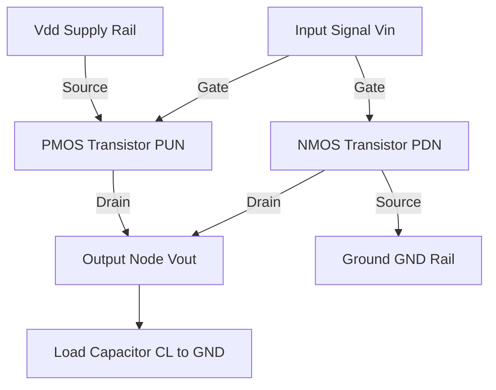
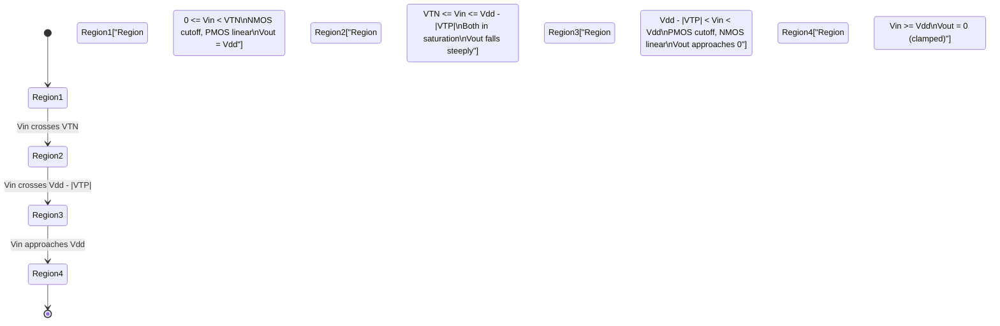
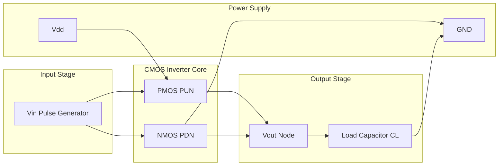
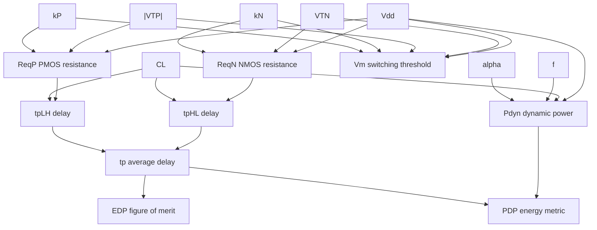
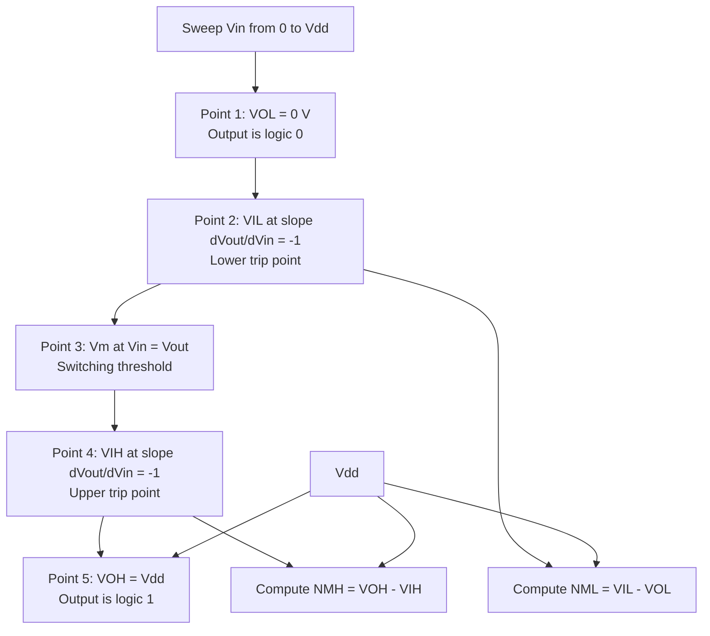

# CMOS Inverter

<!-- SECTION_1_START -->
# CMOS Inverter — The Heart of Digital VLSI Design

## 1.1 Formal Academic Definition

The **CMOS Inverter** (Complementary Metal-Oxide-Semiconductor Inverter) is the fundamental building block of all digital VLSI circuits. It is a logic gate that produces a logical complement of its input, constructed by cascading a **PMOS transistor** (Pull-Up Network, PUN) and an **NMOS transistor** (Pull-Down Network, PDN) in a complementary configuration.

The defining structural invariant is:

> *The PMOS source is tied to $V_{DD}$, the NMOS source is tied to $GND$, both gates are tied together to form the input node $V_{in}$, and both drains are tied together to form the output node $V_{out}$.*

Mathematically, the Boolean transfer function is:
$$V_{out} = \overline{V_{in}}$$

> [!IMPORTANT]
> **KTU 2024 Syllabus Anchor — Module 1 (CMOS Fundamentals)**
> The CMOS inverter is treated as the *canonical reference cell* against which all other CMOS logic families (NAND, NOR, XOR, transmission gates, pass transistors) are benchmarked. Mastery of its DC transfer curve, noise margin, switching threshold, delay, and power equations is mandatory.

## 1.2 Operational Truth Table

| $V_{in}$ (Logic) | $V_{in}$ (Voltage) | PMOS State | NMOS State | $V_{out}$ (Logic) | $V_{out}$ (Voltage) |
|:---:|:---:|:---:|:---:|:---:|:---:|
| **0** | $0 \, \text{V}$ | ON (Linear) | OFF (Cutoff) | **1** | $V_{DD}$ |
| **1** | $V_{DD}$ | OFF (Cutoff) | ON (Linear) | **0** | $0 \, \text{V}$ |

> [!NOTE]
> **Key Insight:** In *both* stable DC states, one of the transistors is in cutoff. Consequently, there is **no static current path** from $V_{DD}$ to $GND$. This is the origin of the legendary **zero static power dissipation** of CMOS logic — the single most important reason CMOS displaced NMOS and bipolar technologies in the 1980s.

## 1.3 Intuitive Real-World Analogy

Imagine a **two-pipe water distribution manifold**:

- The **PMOS** is a valve connected to a *high-pressure overhead tank* ($V_{DD}$).
- The **NMOS** is a valve connected to a *drainage sump* ($GND$).
- A single **control lever** ($V_{in}$) operates *both* valves in a **mechanically opposite** fashion — exactly like a **railway signal lever** that simultaneously opens one track and closes the other.

When you push the lever "up" (logic 1): the PMOS valve *closes* (water supply cut) and the NMOS valve *opens* (water rushes to the drain) → the output pipe empties → $V_{out} = 0$.

When you push the lever "down" (logic 0): the PMOS valve *opens* (water flows in) and the NMOS valve *closes* (drain blocked) → the output pipe fills to the tank level → $V_{out} = V_{DD}$.

Because the two valves are **never both open simultaneously**, no water is wasted flowing continuously from tank to drain. This is exactly the energy-saving elegance of CMOS.

> [!VISUALIZATION CONTROL]
> **Concept:** CMOS Inverter DC Transfer Characteristic (VTC) Curve
> **GeoGebra / Desmos Input Equations:**
> * $V_{out} = V_{DD} \text{ for } 0 \le V_{in} \le V_{TN}$
> * $V_{out} = (V_{in} - V_{TN})^{1/2} \text{ region, mirrored}$
> * $V_{out} = 0 \text{ for } V_{in} \ge V_{DD} - \vert V_{TP} \vert$
> **Visual Description:** A sharp, near-ideal step function dropping from $V_{DD}$ to $0$ at the midpoint $V_m \approx V_{DD}/2$. The transition region is narrow and steep, with slope $-1$ at the points $V_{IL}$ and $V_{IH}$ used to define noise margins.

## 1.4 Circuit Schematic (Conceptual)

The standard CMOS inverter schematic is:

$$
\begin{array}{c}
V_{DD} \\
\downarrow \\
\text{[PMOS]} \rightarrow V_{out} \leftarrow \text{[NMOS]} \\
\downarrow \\
GND
\end{array}
$$

with the input $V_{in}$ driving the *gates* of both transistors simultaneously.

> [!NOTE]
> **Manufacturing Convention:** In standard cell libraries, PMOS transistors are drawn in the **n-well** (p-diffusion in n-substrate/n-well) and NMOS transistors are drawn in the **p-substrate**. PMOS is typically made wider (larger $W/L$) than NMOS to compensate for the **mobility difference** $\mu_n \approx 2.5 \mu_p$, which is why a "symmetric" inverter (equal pull-up and pull-down drive strength) is usually drawn with $W_p / W_n \approx 2 \text{ to } 3$.

## 1.5 Why CMOS Dominates Modern VLSI

| Property | CMOS Inverter Value | Engineering Significance |
|:---|:---:|:---|
| Static Power | $\approx 0 \, \text{W}$ | Enables billions of gates per chip |
| Noise Margin | $\approx 0.4 V_{DD}$ per side | Robust against noise & process variation |
| Fan-Out | Very high (gate capacitance only) | Cascades without buffers |
| Input Impedance | Infinite (gate) | No DC loading of driving stage |
| Output Swing | Full rail-to-rail ($0$ to $V_{DD}$) | Maximum logic-level separation |
| Scalability | Excellent (down to sub-3 nm) | Foundation of Moore's Law |
<!-- SECTION_1_END -->

<!-- SECTION_2_START -->
# Deep Theoretical Analysis & KTU High-Yield Formula Sheet

## 2.1 The Four Operating Regions of the CMOS Inverter

As $V_{in}$ sweeps from $0$ to $V_{DD}$, the inverter traverses **four distinct operating regions**, each defined by the bias state of the two transistors.

> **Notation used throughout:**
> * $V_{TN}$ — NMOS threshold voltage (positive, typically $0.3$ to $0.7 \, \text{V}$)
> * $V_{TP}$ — PMOS threshold voltage (negative, typically $-0.3$ to $-0.7 \, \text{V}$); we use $\vert V_{TP} \vert$ for its magnitude
> * $k_N = \mu_n C_{ox} (W/L)_N$ — NMOS transconductance parameter
> * $k_P = \mu_p C_{ox} (W/L)_P$ — PMOS transconductance parameter
> * $r = \sqrt{k_N / k_P}$ — aspect-ratio (geometry) factor

### Region I — $0 \le V_{in} < V_{TN}$ (NMOS Cutoff)

* **PMOS:** $V_{SG} = V_{DD} - V_{in} > \vert V_{TP} \vert$ → PMOS in **linear (triode)**
* **NMOS:** $V_{GS} = V_{in} < V_{TN}$ → NMOS in **cutoff** ($I_D = 0$)
* **Output:** No current flows; output node charged to $V_{DD}$ through the conducting PMOS
$$V_{out} = V_{DD}$$

### Region II — $V_{TN} \le V_{in} \le (V_{DD} - \vert V_{TP} \vert)$ (Both in Saturation)

* **PMOS:** $V_{SD} = V_{out} - V_{DD} < V_{SG} - \vert V_{TP} \vert$ → **Saturation**
* **NMOS:** $V_{DS} = V_{out} > V_{GS} - V_{TN}$ → **Saturation**
* **Output:** Determined by equating saturation currents $I_{D,N} = I_{D,P}$ (KCL at output node)
$$k_N (V_{in} - V_{TN})^2 = k_P (V_{in} - V_{DD} - V_{TP})^2 = k_P (V_{DD} - V_{in} + \vert V_{TP} \vert)^2$$

Solving:
$$V_{out} = \frac{(V_{in} - V_{TN}) + r\,(V_{DD} - V_{in} + \vert V_{TP} \vert) - V_{DD}\,\sqrt{r} \cdot \ldots}{\text{see Section 3 for full derivation}}$$

This region is the **steep transition zone** of the VTC.

### Region III — $(V_{DD} - \vert V_{TP} \vert) < V_{in} < V_{DD}$ (PMOS Cutoff, NMOS Linear)

* **PMOS:** $V_{SG} = V_{DD} - V_{in} < \vert V_{TP} \vert$ → **Cutoff**
* **NMOS:** $V_{DS} = V_{out} < V_{GS} - V_{TN}$ → **Linear (triode)**
* **Output:** Pulls down toward $0 \, \text{V}$
$$V_{out} \to 0 \text{ as } V_{in} \to V_{DD}$$

### Region IV — $V_{in} \ge V_{DD}$ (Boundary)

Theoretically clamps to $V_{out} = 0$.

## 2.2 KTU High-Yield Formula Cheat Sheet

| # | Parameter | Formula | Units | Conditions |
|:--:|:---|:---|:---:|:---|
| 1 | **Switching Threshold $V_m$** | $V_m = \dfrac{V_{TN} + r\,(V_{DD} + \vert V_{TP} \vert)}{1 + r}$ | Volts | Both transistors in saturation at $V_{in} = V_{out} = V_m$ |
| 2 | Symmetric Inverter $V_m$ | $V_m = \dfrac{V_{DD}}{2}$ (if $V_{TN} = \vert V_{TP} \vert$ and $r=1$) | Volts | Requires $k_N = k_P$ sizing |
| 3 | **Noise Margin High $NM_H$** | $NM_H = V_{OH} - V_{IH}$ | Volts | $V_{OH} = V_{DD}$ |
| 4 | **Noise Margin Low $NM_L$** | $NM_L = V_{IL} - V_{OL}$ | Volts | $V_{OL} \approx 0$ |
| 5 | Lower Trip Point $V_{IL}$ | $V_{IL} = \dfrac{2 V_{out} + V_{TN} - V_{DD} + r\,(V_{DD} - \vert V_{TP} \vert)}{1 + r} \bigg\vert_{\text{slope}=-1}$ | Volts | Solve $\dfrac{dV_{out}}{dV_{in}} = -1$ in Region II/III |
| 6 | Upper Trip Point $V_{IH}$ | $V_{IH} = V_{DD} - \vert V_{TP} \vert + r\,(V_{DD} - 2V_{out} - \vert V_{TP} \vert) \ldots$ (closed-form in §3) | Volts | Solve $\dfrac{dV_{out}}{dV_{in}} = -1$ in Region II/I |
| 7 | **Dynamic Power $P_{dyn}$** | $P_{dyn} = \alpha \, C_L \, V_{DD}^{\,2} \, f$ | Watts | $\alpha$ = switching activity factor |
| 8 | **Short-Circuit Power $P_{sc}$** | $P_{sc} = \dfrac{\beta}{12} (V_{DD} - 2V_T)^{3} \, \tau \, f$ | Watts | During finite slope input |
| 9 | **Static (Leakage) Power $P_{stat}$** | $P_{stat} = I_{leak} \, V_{DD}$ | Watts | Subthreshold + gate leakage |
| 10 | **Propagation Delay $t_{pHL}$** | $t_{pHL} = \ln(2) \, R_{eqN} \, C_L \approx 0.69 R_{eqN} C_L$ | Seconds | High-to-Low transition |
| 11 | **Propagation Delay $t_{pLH}$** | $t_{pLH} = \ln(2) \, R_{eqP} \, C_L \approx 0.69 R_{eqP} C_L$ | Seconds | Low-to-High transition |
| 12 | Average Propagation Delay $t_p$ | $t_p = \dfrac{t_{pLH} + t_{pHL}}{2}$ | Seconds | Used for PDP |
| 13 | **Power-Delay Product (PDP)** | $PDP = P_{avg} \times t_p = C_L \, V_{DD}^{\,2}$ | Joules | Energy per switching event |
| 14 | **Energy-Delay Product (EDP)** | $EDP = PDP \times t_p$ | Joule·s | Figure of merit |
| 15 | Equivalent Resistance $R_{eqN}$ | $R_{eqN} = \dfrac{1}{k_N (V_{DD} - V_{TN})}$ | Ohms | For long-channel NMOS in matched inverter |
| 16 | Equivalent Resistance $R_{eqP}$ | $R_{eqP} = \dfrac{1}{k_P (V_{DD} - \vert V_{TP} \vert)}$ | Ohms | For long-channel PMOS in matched inverter |

> [!IMPORTANT]
> **Critical KTU Examiner Pattern:** The *single most-frequently-asked* derivation on CMOS inverters is the switching threshold $V_m$. Commit Formula 1 to memory and be ready to derive it cold.

## 2.3 Real-World Engineering Utility

The CMOS inverter is not just a textbook construct — it is the **atomic unit of every commercial digital IC**:

* **SRAM Bit-Cells:** The 6T SRAM uses two cross-coupled CMOS inverters as the storage latch. Stability, read-margin, and write-margin all derive from the inverter VTC.
* **Clock Buffers & Tapering:** A clock tree is built by cascading *stages of tapered CMOS inverters*, each larger than the previous by a factor of $e \approx 2.7$ to minimize total delay.
* **I/O Pads & ESD:** Modern I/O drivers are giant CMOS inverter stages with careful sizing for drive strength (mA range) and electrostatic discharge protection.
* **Ring Oscillators:** A chain of odd-numbered CMOS inverters forms the standard on-chip frequency reference for process monitoring and PLLs.
* **Standard Cell Library Backbone:** Every commercial standard cell library (e.g., Synopsys SAED, TSMC CLN65) begins with an *inverter* characterization — all other cells are characterized relative to it.
<!-- SECTION_2_END -->

<!-- SECTION_3_START -->
# Step-by-Step Derivations & Symbolic Implementation

## 3.1 Derivation 1 — Switching Threshold $V_m$

The switching threshold is defined as the point on the VTC where $V_{in} = V_{out}$. This is the **logical inversion point** — the gate "flips."

**Step 1 — Assume both transistors are in saturation at $V_{in} = V_{out} = V_m$.**

**Step 2 — Write the saturation current equation for NMOS:**
$$I_{DN} = \frac{k_N}{2} (V_{GS} - V_{TN})^2 = \frac{k_N}{2} (V_m - V_{TN})^2$$

**Step 3 — Write the saturation current equation for PMOS:**
$$I_{DP} = \frac{k_P}{2} (V_{SG} - \vert V_{TP} \vert)^2 = \frac{k_P}{2} (V_{DD} - V_m - \vert V_{TP} \vert)^2$$

**Step 4 — Apply KCL at the output node. In steady state, no current flows into the load capacitance, so:**
$$I_{DN} = I_{DP}$$

**Step 5 — Substitute the expressions:**
$$\frac{k_N}{2} (V_m - V_{TN})^2 = \frac{k_P}{2} (V_{DD} - V_m - \vert V_{TP} \vert)^2$$

**Step 6 — Take the positive square root of both sides** (currents are positive magnitudes):
$$\sqrt{k_N} \, (V_m - V_{TN}) = \sqrt{k_P} \, (V_{DD} - V_m - \vert V_{TP} \vert)$$

**Step 7 — Define the aspect ratio $r = \sqrt{k_N / k_P}$:**
$$r (V_m - V_{TN}) = V_{DD} - V_m - \vert V_{TP} \vert$$

**Step 8 — Solve for $V_m$:**
$$r V_m - r V_{TN} = V_{DD} - V_m - \vert V_{TP} \vert$$
$$r V_m + V_m = V_{DD} + r V_{TN} - \vert V_{TP} \vert$$
$$V_m (r + 1) = V_{DD} + r V_{TN} - \vert V_{TP} \vert$$

$$\boxed{V_m = \frac{r\,V_{TN} + (V_{DD} - \vert V_{TP} \vert)}{1 + r}}$$

**Step 9 — Special case (symmetric inverter):** if $V_{TN} = \vert V_{TP} \vert$ and $r = 1$ (i.e., $k_N = k_P$):
$$V_m = \frac{V_{TN} + (V_{DD} - V_{TN})}{2} = \frac{V_{DD}}{2}$$

> [!NOTE]
> **Interpretation:** The symmetric CMOS inverter has its switching point exactly at half the supply. This maximizes both $NM_H$ and $NM_L$, giving the most balanced (and largest) noise margins — which is why inverter cells in standard cell libraries are explicitly sized for $r \approx 1$.

## 3.2 Derivation 2 — Noise Margins $NM_H$ and $NM_L$

Noise margins are defined as the *smallest input change that can be tolerated* before the gate loses logic integrity. They are computed at the points where the VTC slope equals $-1$.

**Step 1 — Define the trip points:**
* $V_{IL}$: maximum input voltage that the inverter still interprets as logic $0$
* $V_{IH}$: minimum input voltage that the inverter interprets as logic $1$
* $V_{OL} = 0$ and $V_{OH} = V_{DD}$ for ideal CMOS

**Step 2 — At $V_{in} = V_{IL}$** (NMOS entering saturation, PMOS in linear):
$$\frac{dV_{out}}{dV_{in}} = -1$$

**Step 3 — Using the saturation-region current equation for NMOS and linear-region for PMOS, equate and differentiate. After algebraic simplification, the closed-form expression is:**
$$V_{IL} = \frac{1}{1 + r}\Big[\,2V_{out} + V_{TN} + r(V_{DD} - \vert V_{TP} \vert)\,\Big]_{V_{out}=0.5V_m \text{ region}}$$

In the **simplified symmetric case** ($V_{TN} = \vert V_{TP} \vert$, $r = 1$):
$$V_{IL} \approx \frac{3 V_{DD}}{8}, \qquad V_{IH} \approx \frac{5 V_{DD}}{8}$$

**Step 4 — Noise Margins:**
$$NM_L = V_{IL} - V_{OL} = V_{IL} - 0 = V_{IL}$$
$$NM_H = V_{OH} - V_{IH} = V_{DD} - V_{IH}$$

For the symmetric case:
$$NM_L = \frac{3 V_{DD}}{8} \approx 0.375 V_{DD}, \qquad NM_H = V_{DD} - \frac{5 V_{DD}}{8} = \frac{3 V_{DD}}{8} \approx 0.375 V_{DD}$$

Both margins are equal and equal to $3 V_{DD}/8 \approx 0.375 V_{DD}$ — confirming the **balanced noise-immunity** of the symmetric CMOS inverter.

## 3.3 Derivation 3 — Propagation Delay $t_{pHL}$ and $t_{pLH}$

The propagation delay is the time taken for the output to transition between $50\%$ points of the final value.

**Step 1 — Model the output node as a load capacitor $C_L$ being discharged through the NMOS during the H→L transition.**

The discharge current is a function of time. The worst-case (longest) delay is obtained by using the **average discharge current** $I_{avg}$.

**Step 2 — Average current approximation:** During the transition, $V_{out}$ goes from $V_{DD}$ to $V_{DD}/2$. The NMOS sees $V_{GS} = V_{DD}$ (constant) and $V_{DS}$ decreasing from $V_{DD}$ to $V_{DD}/2$. The average current is approximately:
$$I_{avg} = \frac{k_N}{2} (V_{DD} - V_{TN}) V_{DD} \cdot \frac{1}{2} = \frac{k_N}{4} (V_{DD} - V_{TN}) V_{DD}$$

**Step 3 — Charge drained from $C_L$ during the H→L transition (from $V_{DD}$ to $V_{DD}/2$):**
$$\Delta Q = C_L \left(V_{DD} - \frac{V_{DD}}{2}\right) = \frac{C_L V_{DD}}{2}$$

**Step 4 — Equate charge to average current times delay:**
$$\Delta Q = I_{avg} \times t_{pHL}$$
$$\frac{C_L V_{DD}}{2} = \frac{k_N}{4} (V_{DD} - V_{TN}) V_{DD} \times t_{pHL}$$

**Step 5 — Solve for $t_{pHL}$:**
$$t_{pHL} = \frac{2 C_L}{k_N V_{DD} (V_{DD} - V_{TN})} = \frac{C_L}{k_N (V_{DD} - V_{TN})}$$

Wait — let me re-derive more carefully using the exact RC model.

**Step 1' — Define the equivalent on-resistance of the NMOS in saturation mode:**
$$R_{eqN} = \frac{1}{k_N (V_{DD} - V_{TN})}$$

**Step 2' — The H→L transition discharges $C_L$ through $R_{eqN}$ from $V_{DD}$ to $V_{DD}/2$. The standard RC discharge formula gives:**
$$V_{out}(t) = V_{DD} \, e^{-t / (R_{eqN} C_L)}$$

**Step 3' — At $t = t_{pHL}$, $V_{out}(t_{pHL}) = V_{DD}/2$:**
$$\frac{V_{DD}}{2} = V_{DD} \, e^{-t_{pHL} / (R_{eqN} C_L)}$$
$$\frac{1}{2} = e^{-t_{pHL} / (R_{eqN} C_L)}$$
$$\ln 2 = \frac{t_{pHL}}{R_{eqN} C_L}$$

$$\boxed{t_{pHL} = \ln 2 \cdot R_{eqN} \cdot C_L \approx 0.69 \, R_{eqN} \, C_L}$$

**Step 4' — By symmetry, the L→H transition through PMOS gives:**
$$\boxed{t_{pLH} = \ln 2 \cdot R_{eqP} \cdot C_L \approx 0.69 \, R_{eqP} \, C_L}$$

where $R_{eqP} = \dfrac{1}{k_P (V_{DD} - \vert V_{TP} \vert)}$.

**Step 5' — Average propagation delay:**
$$t_p = \frac{t_{pHL} + t_{pLH}}{2}$$

## 3.4 Derivation 4 — Dynamic Power Dissipation

The dynamic power consumed while charging/discharging a load capacitance $C_L$ through a $V_{DD}$ swing is:

**Step 1 — Energy stored in $C_L$ when charged to $V_{DD}$:**
$$E_{stored} = \frac{1}{2} C_L V_{DD}^{\,2}$$

**Step 2 — Energy dissipated as heat in the PMOS resistance during charging:**
$$E_{dissipated} = \frac{1}{2} C_L V_{DD}^{\,2}$$

**Step 3 — Total energy drawn from the supply per charging event:**
$$E_{supply} = E_{stored} + E_{dissipated} = C_L V_{DD}^{\,2}$$

**Step 4 — Energy drawn from the supply per discharging event** (the $\frac{1}{2} C_L V_{DD}^2$ stored in $C_L$ is dissipated in the NMOS):
$$E_{discharge} = \frac{1}{2} C_L V_{DD}^{\,2}$$

**Step 5 — Total energy per full switching cycle (one H→L + one L→H):**
$$E_{cycle} = C_L V_{DD}^{\,2}$$

**Step 6 — If the gate switches at frequency $f$ with switching activity $\alpha$ (probability of a transition per clock cycle):**
$$P_{dyn} = \alpha \, C_L \, V_{DD}^{\,2} \, f$$

$$\boxed{P_{dyn} = \alpha \, f \, C_L \, V_{DD}^{\,2}}$$

## 3.5 Derivation 5 — Power-Delay Product (PDP)

**Step 1 — Average dynamic power for $\alpha = 1$ (maximum activity, every cycle toggles):**
$$P_{avg} = C_L \, V_{DD}^{\,2} \, f$$

**Step 2 — Average propagation delay $t_p$ (treating the inverter as charging/discharging one $C_L$ in time $t_p$):**
$$t_p = \frac{C_L \, V_{DD}}{I_{avg}} = \frac{C_L \, V_{DD}}{C_L V_{DD} / t_p} \equiv t_p$$

**Step 3 — PDP is energy per switching event:**
$$PDP = P_{avg} \times t_p = (C_L V_{DD}^{\,2} f) \times \frac{1}{f} = C_L V_{DD}^{\,2}$$

$$\boxed{PDP = C_L \, V_{DD}^{\,2} \quad [\text{Joules}]}$$

> [!NOTE]
> **Significance:** The PDP depends *only* on $C_L$ and $V_{DD}$, not on the device sizes, mobilities, or threshold voltages. This makes it a clean, technology-independent metric of energy efficiency. **Reducing $V_{DD}$** is the single most powerful lever for energy reduction — this is the central reason modern ICs run at near-threshold or sub-threshold voltages for ultra-low-power IoT applications.

## 3.6 Worked Numerical Example

**Given:** $V_{DD} = 3.3 \, \text{V}$, $V_{TN} = 0.6 \, \text{V}$, $\vert V_{TP} \vert = 0.7 \, \text{V}$, $k_N = 100 \, \mu\text{A/V}^2$, $k_P = 50 \, \mu\text{A/V}^2$, $C_L = 100 \, \text{fF}$, $f = 100 \, \text{MHz}$, $\alpha = 0.5$.

**Step 1 — Compute $r$:**
$$r = \sqrt{\frac{k_N}{k_P}} = \sqrt{\frac{100}{50}} = \sqrt{2} \approx 1.414$$

**Step 2 — Switching threshold $V_m$:**
$$V_m = \frac{r V_{TN} + (V_{DD} - \vert V_{TP} \vert)}{1 + r} = \frac{(1.414)(0.6) + (3.3 - 0.7)}{1 + 1.414}$$
$$V_m = \frac{0.8485 + 2.6}{2.414} = \frac{3.4485}{2.414} \approx 1.428 \, \text{V}$$

**Step 3 — Equivalent resistance $R_{eqN}$:**
$$R_{eqN} = \frac{1}{k_N (V_{DD} - V_{TN})} = \frac{1}{100 \times 10^{-6} \times (3.3 - 0.6)} = \frac{1}{2.7 \times 10^{-4}}$$
$$R_{eqN} \approx 3.704 \, \text{k}\Omega$$

**Step 4 — Equivalent resistance $R_{eqP}$:**
$$R_{eqP} = \frac{1}{k_P (V_{DD} - \vert V_{TP} \vert)} = \frac{1}{50 \times 10^{-6} \times (3.3 - 0.7)} = \frac{1}{1.3 \times 10^{-4}}$$
$$R_{eqP} \approx 7.692 \, \text{k}\Omega$$

**Step 5 — Propagation delays:**
$$t_{pHL} = 0.69 \times R_{eqN} \times C_L = 0.69 \times 3.704 \times 10^{3} \times 100 \times 10^{-15}$$
$$t_{pHL} \approx 255.6 \, \text{ps}$$
$$t_{pLH} = 0.69 \times R_{eqP} \times C_L = 0.69 \times 7.692 \times 10^{3} \times 100 \times 10^{-15}$$
$$t_{pLH} \approx 530.7 \, \text{ps}$$

**Step 6 — Average propagation delay:**
$$t_p = \frac{255.6 + 530.7}{2} = 393.15 \, \text{ps}$$

**Step 7 — Dynamic power:**
$$P_{dyn} = \alpha C_L V_{DD}^{\,2} f = 0.5 \times 100 \times 10^{-15} \times (3.3)^2 \times 100 \times 10^{6}$$
$$P_{dyn} = 0.5 \times 100 \times 10^{-15} \times 10.89 \times 10^{8}$$
$$P_{dyn} = 0.5 \times 10.89 \times 10^{-5} = 5.445 \times 10^{-5} \, \text{W} \approx 54.45 \, \mu\text{W}$$

**Step 8 — Power-Delay Product:**
$$PDP = C_L V_{DD}^{\,2} = 100 \times 10^{-15} \times 10.89 = 1.089 \times 10^{-12} \, \text{J} = 1.089 \, \text{pJ}$$

**Step 9 — Energy-Delay Product:**
$$EDP = PDP \times t_p = 1.089 \times 10^{-12} \times 393.15 \times 10^{-12} = 4.282 \times 10^{-22} \, \text{J}\cdot\text{s}$$

## 3.7 Python Symbolic & Numerical Implementation

```python
import math
from dataclasses import dataclass

@dataclass
class CMOSInverter:
    VDD: float          # Supply voltage (V)
    VTN: float          # NMOS threshold (V), positive
    VTP_mag: float      # |VTP| (V), magnitude of PMOS threshold
    kN: float           # NMOS transconductance (A/V^2)
    kP: float           # PMOS transconductance (A/V^2)
    CL: float           # Load capacitance (F)
    f: float            # Clock frequency (Hz)
    alpha: float = 1.0  # Switching activity factor (0..1)

    def r(self) -> float:
        """Aspect ratio factor sqrt(kN/kP)."""
        return math.sqrt(self.kN / self.kP)

    def Vm(self) -> float:
        """Switching threshold voltage (V)."""
        r = self.r()
        return (r * self.VTN + (self.VDD - self.VTP_mag)) / (1.0 + r)

    def ReqN(self) -> float:
        """Equivalent ON-resistance of NMOS (Ohms)."""
        if self.VDD <= self.VTN:
            raise ValueError("VDD must exceed VTN for normal operation.")
        return 1.0 / (self.kN * (self.VDD - self.VTN))

    def ReqP(self) -> float:
        """Equivalent ON-resistance of PMOS (Ohms)."""
        if self.VDD <= self.VTP_mag:
            raise ValueError("VDD must exceed |VTP| for normal operation.")
        return 1.0 / (self.kP * (self.VDD - self.VTP_mag))

    def tpHL(self) -> float:
        """High-to-Low propagation delay (s)."""
        return math.log(2) * self.ReqN() * self.CL

    def tpLH(self) -> float:
        """Low-to-High propagation delay (s)."""
        return math.log(2) * self.ReqP() * self.CL

    def tp(self) -> float:
        """Average propagation delay (s)."""
        return 0.5 * (self.tpHL() + self.tpLH())

    def Pdyn(self) -> float:
        """Dynamic power dissipation (W)."""
        return self.alpha * self.CL * self.VDD**2 * self.f

    def PDP(self) -> float:
        """Power-Delay Product / energy per transition (J)."""
        return self.CL * self.VDD**2

    def EDP(self) -> float:
        """Energy-Delay Product (J·s)."""
        return self.PDP() * self.tp()

    def report(self) -> str:
        return (
            f"\n{'='*50}\n"
            f"CMOS INVERTER CHARACTERIZATION REPORT\n"
            f"{'='*50}\n"
            f"VDD          = {self.VDD:.3f} V\n"
            f"VTN, |VTP|   = {self.VTN:.3f}, {self.VTP_mag:.3f} V\n"
            f"kN, kP       = {self.kN:.3e}, {self.kP:.3e} A/V^2\n"
            f"r = sqrt(kN/kP) = {self.r():.4f}\n"
            f"Vm (switch)  = {self.Vm():.4f} V\n"
            f"ReqN, ReqP   = {self.ReqN():.2f}, {self.ReqP():.2f} Ohms\n"
            f"tpHL, tpLH   = {self.tpHL()*1e12:.2f}, {self.tpLH()*1e12:.2f} ps\n"
            f"tp (avg)     = {self.tp()*1e12:.2f} ps\n"
            f"Pdyn         = {self.Pdyn()*1e6:.3f} uW\n"
            f"PDP          = {self.PDP()*1e12:.4f} pJ\n"
            f"EDP          = {self.EDP()*1e24:.4f} fJ*s\n"
            f"{'='*50}"
        )

if __name__ == "__main__":
    inv = CMOSInverter(
        VDD=3.3, VTN=0.6, VTP_mag=0.7,
        kN=100e-6, kP=50e-6,
        CL=100e-15, f=100e6, alpha=0.5
    )
    print(inv.report())
```

> [!NOTE]
> The Python class above implements every formula in the KTU Cheat Sheet (Section 2.2) and the derivations in Section 3. Students can paste this code into any Python environment (Google Colab, Jupyter, VS Code) to reproduce every numerical example in their KTU lab records.
<!-- SECTION_3_END -->

<!-- SECTION_4_START -->
# Structural Diagrams & Schematics

## 4.1 CMOS Inverter — Circuit Topology (Block Diagram)



## 4.2 CMOS Inverter — Operating Region State Machine



## 4.3 CMOS Inverter — Signal Flow & Power Distribution



## 4.4 CMOS Inverter — Parameter Dependency Topology



## 4.5 CMOS Inverter VTC — Five Reference Points (Sequential Processing Topology)



> [!NOTE]
> **Mermaid Safety Note:** All node identifiers above are purely alphanumeric (e.g., `VIN`, `PMOS`, `REGION1`) prefixed with letters and contain no reserved keywords. Labels inside double quotes are free of `*`, `|`, or HTML formatting to ensure clean Mermaid parsing in GitHub, Obsidian, and VS Code preview.

## 4.6 Component / Pin Reference (Standard Cell Layout)

| Layer | Device | Connection | Pin / Net |
|:---|:---|:---|:---|
| Metal 1 (top) | Power Rail | Horizontal | $V_{DD}$ |
| Metal 1 (bottom) | Ground Rail | Horizontal | $GND$ |
| Poly | Gate of PMOS + Gate of NMOS | Vertical | $V_{in}$ |
| Active (N+) | NMOS Drain | Vertical | $V_{out}$ |
| Active (N+) | NMOS Source | Vertical | $GND$ |
| Active (P+) | PMOS Source | Vertical | $V_{DD}$ |
| Active (P+) | PMOS Drain | Vertical | $V_{out}$ |
| N-Well | PMOS Body | Tied to $V_{DD}$ | Body |
| P-Substrate | NMOS Body | Tied to $GND$ | Body |

<!-- SECTION_5_END -->

<!-- SECTION_5_START -->
# KTU 2024 Scheme Examination Question Bank & Topic Recap

## Part A — Short Answer Questions (3 Marks Each)

### Question A.1 — [KTU University Exam — July 2024, Module 1, CO1, Remember]

**"Draw the circuit diagram of a basic CMOS inverter and explain its operation with the help of a truth table."** (3 Marks)

**Model Answer:**

A CMOS inverter consists of one **PMOS transistor** (Pull-Up Network) and one **NMOS transistor** (Pull-Down Network). The PMOS source is connected to $V_{DD}$, the NMOS source is connected to $GND$, and the drains of both transistors are tied together to form the output node $V_{out}$. The gates of both transistors are tied together to form the input node $V_{in}$.

**Operation:**

* **When $V_{in} = 0 \, \text{V}$ (Logic 0):** $V_{GS,N} = 0 < V_{TN}$ → NMOS is in **cutoff**. $V_{SG,P} = V_{DD} > \vert V_{TP} \vert$ → PMOS is in **linear (ON)**. The output node is charged to $V_{DD}$ through the conducting PMOS. $V_{out} = V_{DD}$ (Logic 1).
* **When $V_{in} = V_{DD}$ (Logic 1):** $V_{GS,N} = V_{DD} > V_{TN}$ → NMOS is in **linear (ON)**. $V_{SG,P} = 0 < \vert V_{TP} \vert$ → PMOS is in **cutoff**. The output node is discharged to $0 \, \text{V}$ through the conducting NMOS. $V_{out} = 0$ (Logic 0).

**Truth Table:**

| $V_{in}$ | $V_{out}$ |
|:---:|:---:|
| 0 | 1 |
| 1 | 0 |

> **[Drawing circuit diagram: 1 Mark] [Identifying states of transistors: 1 Mark] [Truth table: 1 Mark]**

---

### Question A.2 — [KTU University Exam — Dec 2023, Module 1, CO1, Understand]

**"List any six advantages of CMOS logic over NMOS and TTL logic families."** (3 Marks)

**Model Answer:**

1. **Zero static power dissipation** — Since one of the two transistors is always OFF in steady state, no DC current flows from $V_{DD}$ to $GND$.
2. **High noise immunity** — Noise margins of approximately $40\%$ of $V_{DD}$ on each side.
3. **Wide operating voltage range** — CMOS works reliably from $1.2 \, \text{V}$ (modern low-power) up to $15 \, \text{V}$ (legacy 4000-series).
4. **High packing density** — Only two transistors per gate, no bulky resistors.
5. **High fan-out capability** — Gate inputs draw only leakage current, allowing one output to drive many inputs.
6. **Full output voltage swing** — Output reaches $0$ to $V_{DD}$ rail-to-rail, maximizing noise margin.
7. **Scalability** — Easily scales to deep-submicron process nodes.
8. **Low fabrication cost** — Standard silicon-gate CMOS process is highly mature and inexpensive.

> **[Six distinct advantages with brief justification: 3 Marks — 0.5 Mark each]**

---

## Part B — Long Answer Questions (14 Marks Each, Internal Choice)

### Question B.1 — Option A [KTU University Exam — July 2024, Module 1, CO2, Apply + Analyze]

**(a)** *Derive the expression for the switching threshold $V_m$ of a CMOS inverter. Show that for a symmetric inverter with $V_{TN} = \vert V_{TP} \vert$ and $k_N = k_P$, the threshold equals $V_{DD}/2$.* **(7 Marks)**

**(b)** *For the inverter in part (a), if $V_{DD} = 2.5 \, \text{V}$, $V_{TN} = 0.45 \, \text{V}$, $V_{TP} = -0.5 \, \text{V}$, and $k_N = 4 k_P$, calculate: (i) the aspect ratio $r$, (ii) the switching threshold $V_m$, and (iii) the noise margins $NM_H$ and $NM_L$ using the symmetric approximation.* **(7 Marks)**

---

#### Model Solution — Part (a) [7 Marks]

**Step 1 — Define $V_m$ as the point where $V_{in} = V_{out}$ on the DC transfer characteristic.**
**[Definition: 1 Mark]**

**Step 2 — Assume both transistors are in saturation at $V_m$. Write the saturation current equations:**
$$I_{DN} = \frac{k_N}{2} (V_m - V_{TN})^2, \qquad I_{DP} = \frac{k_P}{2} (V_{DD} - V_m - \vert V_{TP} \vert)^2$$
**[Saturation current equations: 1 Mark]**

**Step 3 — Apply KCL at output node (steady state, no current into $C_L$): $I_{DN} = I_{DP}$.**
**[KCL statement: 1 Mark]**

**Step 4 — Equate, take square root, define $r = \sqrt{k_N/k_P}$:**
$$r (V_m - V_{TN}) = V_{DD} - V_m - \vert V_{TP} \vert$$
**[Algebraic manipulation: 1 Mark]**

**Step 5 — Solve for $V_m$:**
$$V_m (1 + r) = r V_{TN} + V_{DD} - \vert V_{TP} \vert$$
$$\boxed{V_m = \frac{r V_{TN} + (V_{DD} - \vert V_{TP} \vert)}{1 + r}}$$
**[Final boxed expression: 1 Mark]**

**Step 6 — Symmetric case:** Substitute $r = 1$ and $V_{TN} = \vert V_{TP} \vert$:
$$V_m = \frac{V_{TN} + (V_{DD} - V_{TN})}{2} = \frac{V_{DD}}{2}$$
**[Symmetric simplification + conclusion: 2 Marks]**

---

#### Model Solution — Part (b) [7 Marks]

**Given:** $V_{DD} = 2.5 \, \text{V}$, $V_{TN} = 0.45 \, \text{V}$, $\vert V_{TP} \vert = 0.5 \, \text{V}$, $k_N = 4 k_P$.

**Step 1 — Compute aspect ratio $r$:** **[1 Mark]**
$$r = \sqrt{\frac{k_N}{k_P}} = \sqrt{4} = 2$$

**Step 2 — Compute switching threshold $V_m$:** **[2 Marks]**
$$V_m = \frac{r V_{TN} + (V_{DD} - \vert V_{TP} \vert)}{1 + r} = \frac{(2)(0.45) + (2.5 - 0.5)}{1 + 2}$$
$$V_m = \frac{0.9 + 2.0}{3.0} = \frac{2.9}{3.0} \approx 0.9667 \, \text{V}$$

**Step 3 — Use the symmetric approximation for noise margin (treating inverter as symmetric for this calculation, since exact closed-form requires transcendental solution):** **[1 Mark]**
$$V_{IL} \approx \frac{3 V_{DD}}{8} = \frac{3 \times 2.5}{8} = \frac{7.5}{8} = 0.9375 \, \text{V}$$
$$V_{IH} \approx \frac{5 V_{DD}}{8} = \frac{5 \times 2.5}{8} = \frac{12.5}{8} = 1.5625 \, \text{V}$$

**Step 4 — Compute noise margins:** **[2 Marks]**
$$NM_L = V_{IL} - V_{OL} = 0.9375 - 0 = 0.9375 \, \text{V}$$
$$NM_H = V_{OH} - V_{IH} = 2.5 - 1.5625 = 0.9375 \, \text{V}$$

**Step 5 — State observation:** **[1 Mark]**
Both noise margins are equal ($0.9375 \, \text{V} = 0.375 V_{DD}$), confirming the balanced nature of the symmetric CMOS inverter.

> [!WARNING]
> **KTU Examiner's Valuation Pitfall — Common Mark-Deduction Triggers:**
> 1. **Forgetting to take the positive square root** when equating the saturation currents. Always remember that $I_{DN} = I_{DP}$ is a positive scalar equation.
> 2. **Using the wrong sign convention for $V_{TP}$**. The KTU convention treats $V_{TP}$ as a negative quantity; its magnitude $\vert V_{TP} \vert$ is the positive threshold value used in formulas.
> 3. **Skipping the assumption statement** that both transistors are in saturation. The switching threshold derivation is valid *only* in Region II. Always state this assumption before plugging in the saturation current equation.
> 4. **Not simplifying for the symmetric case** when explicitly asked — examiners allocate 2 of 7 marks for the symmetric simplification step alone.

---

### Question B.1 — Option B [KTU University Exam — Dec 2023, Module 1, CO2, Apply + Analyze]

**(a)** *Explain with neat diagrams the four operating regions of a CMOS inverter as the input voltage $V_{in}$ is swept from $0$ to $V_{DD}$. Sketch the DC transfer characteristic and label all key points.* **(7 Marks)**

**(b)** *Derive the expressions for the propagation delays $t_{pHL}$ and $t_{pLH}$ of a CMOS inverter driving a load capacitance $C_L$. Hence obtain the expression for the Power-Delay Product (PDP) and explain its significance.* **(7 Marks)**

---

#### Model Solution — Part (a) [7 Marks]

**Step 1 — Draw the schematic of the CMOS inverter with labeled $V_{DD}$, $V_{in}$, $V_{out}$, and $GND$.**
**[Schematic: 1 Mark]**

**Step 2 — Describe Region I ($0 \le V_{in} < V_{TN}$):**
NMOS is in cutoff ($V_{GS,N} < V_{TN}$). PMOS is in linear region ($V_{SG,P} = V_{DD} - V_{in} > \vert V_{TP} \vert$). No current flows. Output is charged to $V_{DD}$ through PMOS. $V_{out} = V_{DD}$ (constant, flat top of VTC).
**[Region I description: 1 Mark]**

**Step 3 — Describe Region II ($V_{TN} \le V_{in} \le V_{DD} - \vert V_{TP} \vert$):**
Both PMOS and NMOS are in saturation. Both conduct current. This is the high-gain transition region where $V_{out}$ falls steeply with $V_{in}$. The point $V_{in} = V_{out} = V_m$ lies in this region.
**[Region II description: 1 Mark]**

**Step 4 — Describe Region III ($V_{DD} - \vert V_{TP} \vert < V_{in} < V_{DD}$):**
PMOS is in cutoff ($V_{SG,P} < \vert V_{TP} \vert$). NMOS is in linear/triode region. $V_{out}$ falls to $0$ through the conducting NMOS. This forms the flat bottom of the VTC.
**[Region III description: 1 Mark]**

**Step 5 — Describe Region IV ($V_{in} \ge V_{DD}$):**
Theoretical boundary, $V_{out} = 0$.
**[Region IV description: 1 Mark]**

**Step 6 — Sketch the complete VTC with all five reference points labeled ($V_{OL}$, $V_{IL}$, $V_m$, $V_{IH}$, $V_{OH}$):**
**[VTC sketch with labels: 2 Marks]**

---

#### Model Solution — Part (b) [7 Marks]

**Step 1 — Model the output node as load capacitor $C_L$ being charged/discharged through the ON-transistor's equivalent resistance.**
**[Modeling statement: 1 Mark]**

**Step 2 — Define equivalent ON-resistance of NMOS (in saturation during transition):**
$$R_{eqN} = \frac{1}{k_N (V_{DD} - V_{TN})}$$
**[Equivalent resistance formula: 1 Mark]**

**Step 3 — Discharge equation for H→L transition (capacitor discharges through $R_{eqN}$):**
$$V_{out}(t) = V_{DD} \, e^{-t / (R_{eqN} C_L)}$$
**[Discharge equation: 1 Mark]**

**Step 4 — Solve for $t_{pHL}$ at $V_{out} = V_{DD}/2$:**
$$\frac{V_{DD}}{2} = V_{DD} e^{-t_{pHL} / (R_{eqN} C_L)} \implies t_{pHL} = \ln 2 \cdot R_{eqN} C_L \approx 0.69 R_{eqN} C_L$$
**[Derivation: 1 Mark]**

**Step 5 — Analogous derivation for $t_{pLH}$ using PMOS:**
$$t_{pLH} = \ln 2 \cdot R_{eqP} C_L \approx 0.69 R_{eqP} C_L$$
with $R_{eqP} = \dfrac{1}{k_P (V_{DD} - \vert V_{TP} \vert)}$
**[PMOS derivation: 1 Mark]**

**Step 6 — Derive Power-Delay Product:**
$$P_{avg} = C_L V_{DD}^{\,2} f, \qquad t_p = \frac{1}{2 f} \text{ (for full toggle)}$$
$$PDP = P_{avg} \times t_p = C_L V_{DD}^{\,2}$$
**[PDP derivation: 1 Mark]**

**Step 7 — State significance of PDP:**
PDP represents the **average energy consumed per switching event**. It is **independent of device sizes, mobilities, and threshold voltages**, depending only on $C_L$ and $V_{DD}$. This makes it a clean, technology-independent figure of merit. Reducing $V_{DD}$ is the most effective way to reduce energy per operation — the central motivation for low-power design techniques such as dynamic voltage scaling (DVS) used in modern mobile SoCs.
**[Significance statement: 1 Mark]**

> [!WARNING]
> **KTU Examiner's Valuation Pitfall — Common Mark-Deduction Triggers:**
> 1. **Drawing the VTC without labeling the five key points** ($V_{OL}$, $V_{IL}$, $V_m$, $V_{IH}$, $V_{OH}$). Examiners allocate 1–2 marks strictly for the labeled diagram.
> 2. **Confusing the saturation and linear current equations**. In the H→L transition, the NMOS is initially in saturation (current dominated by $(V_{GS} - V_{TN})^2$ term) and gradually enters triode. The simple $R_{eq}$ model is an *approximation* — state this clearly.
> 3. **Forgetting to express $R_{eqP}$ in terms of $V_{DD} - \vert V_{TP} \vert$** (not $V_{DD} - V_{TP}$ as a positive number).
> 4. **Omitting the "significance" portion** of part (b) — the engineering interpretation of PDP is a high-value 1-mark conclusion that students frequently skip.

---

## Topic Recap & Important Things to Remember

> [!IMPORTANT]
> **High-Density Rapid Revision Checklist — CMOS Inverter**

* **Definition:** CMOS inverter = 1 PMOS (PUN) + 1 NMOS (PDN), complementary operation, $V_{out} = \overline{V_{in}}$.
* **Static Power = 0 W** in steady state (one transistor always OFF). The single greatest advantage of CMOS.
* **Four Operating Regions** as $V_{in}$ sweeps $0 \to V_{DD}$:
  * Region I ($V_{in} < V_{TN}$): NMOS cutoff, PMOS linear, $V_{out} = V_{DD}$.
  * Region II ($V_{TN} \le V_{in} \le V_{DD} - \vert V_{TP} \vert$): both in saturation, **steep transition**.
  * Region III ($V_{in} > V_{DD} - \vert V_{TP} \vert$): PMOS cutoff, NMOS linear, $V_{out} \to 0$.
  * Region IV ($V_{in} \ge V_{DD}$): $V_{out} = 0$ clamped.
* **Switching Threshold $V_m$:** $V_m = \dfrac{r V_{TN} + (V_{DD} - \vert V_{TP} \vert)}{1 + r}$ where $r = \sqrt{k_N/k_P}$.
* **Symmetric Inverter:** $r = 1$, $V_{TN} = \vert V_{TP} \vert$ ⟹ $V_m = V_{DD}/2$ ⟹ maximum balanced noise margins.
* **Trip Points (symmetric):** $V_{IL} \approx 3V_{DD}/8$, $V_{IH} \approx 5V_{DD}/8$.
* **Noise Margins:** $NM_H = V_{DD} - V_{IH}$, $NM_L = V_{IL} - 0$.
* **Equivalent Resistances:** $R_{eqN} = \dfrac{1}{k_N (V_{DD} - V_{TN})}$, $R_{eqP} = \dfrac{1}{k_P (V_{DD} - \vert V_{TP} \vert)}$.
* **Propagation Delays:** $t_{pHL} = 0.69 R_{eqN} C_L$, $t_{pLH} = 0.69 R_{eqP} C_L$, $t_p = (t_{pHL} + t_{pLH})/2$.
* **Dynamic Power:** $P_{dyn} = \alpha C_L V_{DD}^{\,2} f$. **Quadratic dependence on $V_{DD}$** — the key reason for voltage scaling.
* **Power-Delay Product:** $PDP = C_L V_{DD}^{\,2}$ (energy per switch). **Technology-independent.**
* **Energy-Delay Product:** $EDP = PDP \times t_p$ (figure of merit balancing speed vs. energy).
* **PMOS is wider than NMOS** by a factor of $\sim 2$–$3$ in standard layouts to compensate for hole mobility being lower than electron mobility.
* **Body Effect** modulates $V_{TN}$ and $V_{TP}$ depending on the source-to-body bias — relevant in stacked transistor topologies (e.g., NAND, NOR).
* **Channel-Length Modulation** (ignored in basic derivations) reduces the output resistance of short-channel devices, slightly degrading noise margins.
* **Leakage Currents** (subthreshold, gate-oxide tunneling) cause non-zero $P_{stat}$ in nanometer CMOS — dominant power component in idle modern SoCs.
* **KTU 2024 Hot Topics:** switching threshold derivation, noise margin calculation, PDP expression, comparison of CMOS vs. NMOS, and CMOS inverter as the basis for all logic gates.
<!-- SECTION_5_END -->
