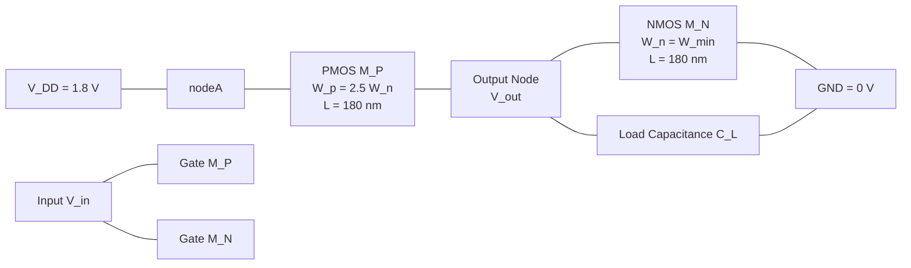
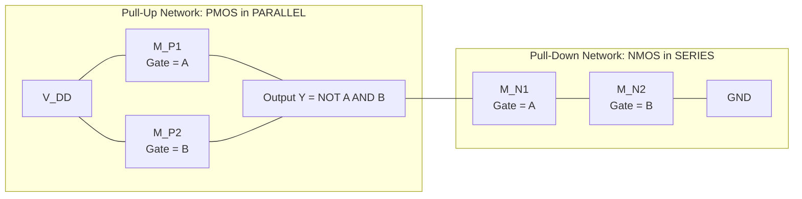
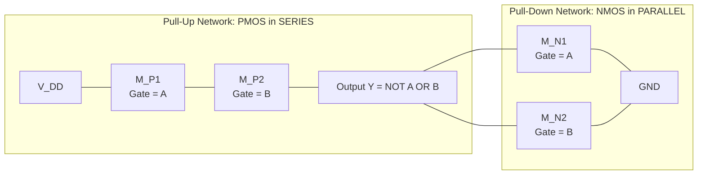
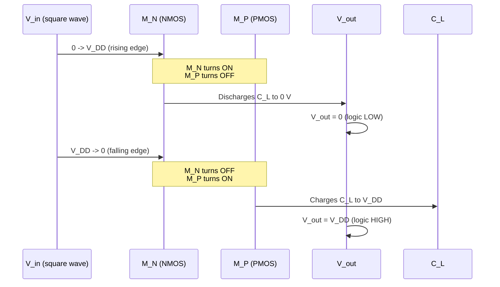

# CMOS logic gates

<!-- SECTION_1_START -->

# CMOS Logic Gates — Core Technical Definition & Intuitive Overview

## 1.1 Formal Academic Definition

> [!NOTE]
> **CMOS (Complementary Metal–Oxide–Semiconductor) Logic Gates** are digital switching circuits built using complementary pairs of **n-channel MOSFET (NMOS)** pull-down networks and **p-channel MOSFET (PMOS)** pull-up networks on a common silicon substrate. In steady state, the output node is connected to **either $V_{DD}$ or GND through a low-resistance path**, but **never to both simultaneously**, which is the defining hallmark of *static* CMOS logic.

In the **KTU 2024 Scheme (PECST415 — VLSI Design)** syllabus, CMOS logic gates are introduced under *Module 1: CMOS Fundamentals for Digital VLSI Design*. The module mandates study of:

* The CMOS inverter (NOT gate) and its **Voltage Transfer Characteristics (VTC)**.
* Multi-input CMOS gates: **NAND, NOR, AND-OR-Invert (AOI), OR-AND-Invert (OAI)**.
* Concepts of **noise margin, static/dynamic power, propagation delay**, and **logical effort**.

## 1.2 Intuitive Real-World Analogy

> [!IMPORTANT]
> Think of a CMOS logic gate as a **two-pipe water system with a single shared valve**:
> * The **upper pipe (PMOS network)** brings *clean water* from a rooftop tank ($V_{DD}$) down to your kitchen tap.
> * The **lower pipe (NMOS network)** drains *waste water* into the ground (GND).
> * The **valve position** is determined by the *logic input*.
> * At **any stable moment**, only **one pipe is open** — either filling the bucket (logic 1) or emptying it (logic 0). Water never flows in a loop.

This complementary, *never-both-on* behaviour is precisely why CMOS is **statically powerless** (apart from tiny leakage), unlike the older **resistor-transistor (RTL)** or **transistor-transistor (TTL)** families that always drew current.

## 1.3 Key Physical & Electrical Constants

The following constants govern every CMOS logic gate analysis in KTU examinations:

| Parameter | Symbol | Typical Value (180 nm node) | Unit |
|---|---|---|---|
| Supply voltage | $V_{DD}$ | **1.8 V** | V |
| NMOS threshold voltage | $V_{Tn0}$ | **0.4 V** | V |
| PMOS threshold voltage | $V_{Tp0}$ | **$-0.4$ V** | V |
| Oxide capacitance per unit area | $C_{ox}$ | **8.5 × 10⁻³** | F/m² |
| Electron mobility | $\mu_n$ | **500** | cm²/(V·s) |
| Hole mobility | $\mu_p$ | **200** | cm²/(V·s) |
| Mobility ratio | $r$ | $\mu_n / \mu_p \approx$ **2.5** | — |
| Channel length modulation | $\lambda$ | **0.05** | V⁻¹ |
| Body-effect coefficient | $\gamma$ | **0.4** | V$^{1/2}$ |

## 1.4 GeoGebra / Desmos Visualization Callout

> [!VISUALIZATION CONTROL]
> **Concept:** CMOS Inverter Voltage Transfer Characteristic (VTC) — Ideal vs. Realistic.
>
> **Desmos Input Equations:**
> * `V_out = 1.8` (for $V_{in} < 0.4$ — $V_{OH}$ plateau)
> * `V_out = 1.8 - 1.0*(V_in - 0.4)` (steep transition region from $V_{IL}$ to $V_{IH}$)
> * `V_out = 0.0` (for $V_{in} > 1.4$ — $V_{OL}$ plateau)
> * Vertical lines: `x = 0.4` ($V_{IL}$), `x = 1.4` ($V_{IH}$), `x = 0.9` (switching threshold $V_M$).
>
> **Visual Description:** The student should observe a sharp, near-vertical drop in $V_{out}$ between $V_{in} = 0.4$ V and $V_{in} = 1.4$ V, with the curve passing through the **switching threshold $V_M \approx V_{DD}/2 = 0.9$ V** at the geometric centre. This idealises the *full-rail, full-swing* property of static CMOS.

---

<!-- SECTION_1_END -->

<!-- SECTION_2_START -->

# CMOS Logic Gates — Deep Theoretical Analysis & KTU High-Yield Formula Sheet

## 2.1 The CMOS Inverter — Operational Anatomy

The CMOS inverter is the *primitive cell* from which every other CMOS gate is constructed. It contains:

* **One PMOS transistor** ($M_P$) — sources tied to $V_{DD}$, gate tied to input, drain tied to output.
* **One NMOS transistor** ($M_N$) — sources tied to GND, gate tied to input, drain tied to output.
* **No physical resistor** — the transistors themselves act as complementary variable resistors.

> [!IMPORTANT]
> **Operation Rule (Complementary Switching):**
> * When $V_{in} = V_{DD}$ (logic 1) → $M_N$ is ON, $M_P$ is OFF → output node is pulled to **GND** (logic 0).
> * When $V_{in} = 0$ (logic 0) → $M_N$ is OFF, $M_P$ is ON → output node is pulled to **$V_{DD}$** (logic 1).

## 2.2 The Five Regions of the VTC

The Voltage Transfer Characteristic of a CMOS inverter has **five distinct operating regions**, each named after the bias state of the two transistors.

| Region | Input Voltage $V_{in}$ | NMOS $M_N$ | PMOS $M_P$ | Output $V_{out}$ |
|---|---|---|---|---|
| **I — Saturation** | $0 \le V_{in} < V_{Tn}$ | Cut-off | Linear (triode) | $V_{out} = V_{OH} = V_{DD}$ |
| **II — Saturation** | $V_{Tn} \le V_{in} < V_{DD}/2$ | Saturation | Triode | $V_{out}$ high, falling |
| **III — Saturation** | $V_{in} = V_{DD}/2$ | Saturation | Saturation | $V_{out} = V_M$ |
| **IV — Saturation** | $V_{DD}/2 < V_{in} \le V_{DD}-\vert V_{Tp}\vert$ | Triode | Saturation | $V_{out}$ low, falling |
| **V — Saturation** | $V_{in} > V_{DD}-\vert V_{Tp}\vert$ | Linear (triode) | Cut-off | $V_{out} = V_{OL} \approx 0$ |

> [!NOTE]
> The name *CMOS* **Saturation** is historical — it means *the device is ON and current is being conducted*. Don't confuse it with bipolar-transistor saturation.

## 2.3 Switching Threshold $V_M$ (Midpoint Voltage)

The switching threshold $V_M$ is the input voltage at which $V_{out} = V_{in}$. It is found by setting the **NMOS drain current = PMOS drain current** in the saturation region.

At $V_{in} = V_{out} = V_M$, both transistors are in saturation:

$$
I_{Dn} = I_{Dp}
$$

$$
\underbrace{\frac{k_n}{2}(V_M - V_{Tn})_{sat}^{2}(1 + \lambda_n V_M)}_{\text{NMOS current}} \;=\; \underbrace{\frac{k_p}{2}\left(V_M - V_{DD} - V_{Tp}\right)_{sat}^{2}(1 + \lambda_p (V_{DD} - V_M))}_{\text{PMOS current}}
$$

Neglecting channel-length modulation ($\lambda \to 0$):

$$
V_M \;=\; \frac{V_{Tn} + \sqrt{\dfrac{k_p}{k_n}}\,(V_{DD} + V_{Tp})}{1 + \sqrt{\dfrac{k_p}{k_n}}}
$$

If we substitute the aspect-ratio parameter $r = k_p / k_n$ and use $V_{Tp} = -V_{Tp0}$ (positive magnitude):

$$
V_M \;=\; \frac{r\,(V_{DD} - V_{Tp0}) + V_{Tn0}}{1 + r}
$$

> [!TIP]
> For a **symmetric inverter** (where $r = 1$, i.e. $k_p = k_n$, often realised by sizing the PMOS **2.5× wider** than NMOS), $V_M$ collapses to the textbook ideal: $\boxed{V_M = V_{DD}/2}$.

## 2.4 Noise Margins

Noise margins quantify the immunity of a gate to unwanted voltage perturbations at its input. The KTU 2024 board examiners repeatedly test the **graphical** definition:

$$
N_{MH} \;=\; V_{OH} - V_{IH}
$$

$$
N_{ML} \;=\; V_{IL} - V_{VOL}
$$

Where the critical points $V_{IL}$ and $V_{IH}$ are found by drawing the **unity-gain tangent** ($dV_{out}/dV_{in} = -1$) on the VTC.

| Noise Margin | Definition | CMOS Typical Value |
|---|---|---|
| $N_{MH}$ | High-state noise margin | **0.4 $V_{DD}$** |
| $N_{ML}$ | Low-state noise margin | **0.4 $V_{DD}$** |
| $N_{M,\text{total}}$ | $N_{MH} + N_{ML}$ | **0.8 $V_{DD}$** |

## 2.5 KTU Formula Cheat Sheet

> [!IMPORTANT]
> **The following table is the *single most important* revision resource for KTU ESE Module 1 questions on CMOS logic gates.**

| Concept | Formula | Units / Notes |
|---|---|---|
| Switching threshold | $V_M = \dfrac{r(V_{DD}-V_{Tp0}) + V_{Tn0}}{1+r}$ | V ; $r = k_p / k_n$ |
| Aspect-ratio ratio | $r = \dfrac{k_p}{k_n} = \dfrac{\mu_p W_p}{\mu_n W_n} = \dfrac{W_p / W_n}{2.5}$ | dimensionless |
| Transconductance | $k = \mu \, C_{ox} \dfrac{W}{L}$ | A/V² |
| High noise margin | $N_{MH} = V_{OH} - V_{IH}$ | V |
| Low noise margin | $N_{ML} = V_{IL} - V_{VOL}$ | V |
| Static power | $P_{static} = V_{DD} \cdot I_{leakage}$ | W (≈ nW per gate) |
| Dynamic (switching) power | $P_{dyn} = \alpha \, C_L \, V_{DD}^{2} \, f$ | W |
| Short-circuit power | $P_{sc} = I_{avg,sc} \cdot V_{DD}$ | W |
| Total power | $P_{tot} = P_{static} + P_{dyn} + P_{sc}$ | W |
| Intrinsic delay | $t_{p0} = \dfrac{C_{L} \cdot V_{DD}}{2 \, I_{D,sat}}$ | s |
| Logical effort (inverter) | $g_{inv} = 1$ | dimensionless |
| Electrical effort | $h = C_{L} / C_{in}$ | dimensionless |

> [!WARNING]
> In KTU valuation, **never** write $\vert V_{Tp}\vert$ inside a markdown table — use $\lvert V_{Tp} \rvert$ in inline math only, and write `|V_Tp|` as plain text inside table cells to avoid breaking the pipe-delimited table syntax.

## 2.6 Real-World Engineering Utility

> [!NOTE]
> CMOS logic gates form the foundational **Standard Cell Library** in every modern Application-Specific Integrated Circuit (ASIC) and System-on-Chip (SoC). The 7-nm Apple M-series chips contain **tens of billions** of CMOS NAND/NOR/AOI gates. The complementary structure is the **only known VLSI topology that achieves near-zero static power**, making battery-powered mobile devices possible.

---

<!-- SECTION_2_END -->

<!-- SECTION_3_START -->

# CMOS Logic Gates — Step-by-Step Derivations & Code Implementation

## 3.1 Derivation 1: Switching Threshold $V_M$ of a Symmetric Inverter

**Given:** $V_{DD} = 1.8$ V, $V_{Tn0} = 0.4$ V, $V_{Tp0} = -0.4$ V, $k_p = k_n$ (i.e., $r = 1$, $W_p = 2.5 W_n$ for a 180 nm process).

**Step 1 — Write the saturation current equality:**

At $V_{in} = V_M$, both $M_N$ and $M_P$ are saturated:

$$
I_{Dn} = \frac{k_n}{2}(V_M - V_{Tn0})^{2} \quad ; \quad I_{Dp} = \frac{k_p}{2}(V_{DD} - V_M + V_{Tp0})^{2}
$$

**Step 2 — Equate the currents and substitute $r = 1$:**

$$
\frac{k_n}{2}(V_M - V_{Tn0})^{2} \;=\; \frac{k_p}{2}(V_{DD} - V_M + V_{Tp0})^{2}
$$

Since $r = k_p/k_n = 1$:

$$
V_M - V_{Tn0} = V_{DD} - V_M + V_{Tp0}
$$

**Step 3 — Solve algebraically:**

$$
2 V_M = V_{DD} + V_{Tp0} + V_{Tn0}
$$

$$
\boxed{V_M = \frac{V_{DD} + V_{Tp0} + V_{Tn0}}{2}}
$$

**Step 4 — Substitute numerical values:**

$$
V_M = \frac{1.8 + (-0.4) + 0.4}{2} = \frac{1.8}{2} = 0.9 \text{ V}
$$

**Step 5 — Interpretation:** $V_M = 0.9$ V lies exactly at $V_{DD}/2$. This is the **design target** for a symmetric CMOS inverter, guaranteeing equal noise margins.

**Valuation key (KTU 2024 ESE):**
* Correct setup of current equality equation → **3 Marks**
* Algebraic simplification → **2 Marks**
* Final numerical value → **1 Mark**

---

## 3.2 Derivation 2: Dynamic Power Dissipation of a CMOS Inverter

The dynamic power is dissipated each time the output capacitance $C_L$ is charged and discharged.

**Step 1 — Energy drawn from supply during one charge cycle:**

When output goes from 0 to $V_{DD}$, the supply delivers a charge $Q = C_L V_{DD}$ at voltage $V_{DD}$:

$$
E_{charge} = \int_0^{T} V_{DD} \, i(t) \, dt = V_{DD} \cdot C_L \cdot V_{DD} = C_L V_{DD}^{2}
$$

**Step 2 — Energy stored on the capacitor:**

$$
E_{stored} = \frac{1}{2} C_L V_{DD}^{2}
$$

**Step 3 — Energy dissipated as heat in the PMOS during charging:**

$$
E_{dissipated,\,PMOS} = E_{charge} - E_{stored} = C_L V_{DD}^{2} - \frac{1}{2} C_L V_{DD}^{2} = \frac{1}{2} C_L V_{DD}^{2}
$$

**Step 4 — Energy dissipated in NMOS during discharge:**

The capacitor discharges through the NMOS to ground, dissipating **all its stored energy** as heat in the NMOS:

$$
E_{dissipated,\,NMOS} = \frac{1}{2} C_L V_{DD}^{2}
$$

**Step 5 — Total energy dissipated per full switching cycle:**

$$
E_{cycle} = \frac{1}{2} C_L V_{DD}^{2} + \frac{1}{2} C_L V_{DD}^{2} = C_L V_{DD}^{2}
$$

**Step 6 — Multiply by switching frequency $f$ and activity factor $\alpha$:**

$$
\boxed{P_{dynamic} = \alpha \, C_L \, V_{DD}^{2} \, f}
$$

Where $\alpha \in [0, 1]$ is the **switching activity factor** (probability that the output toggles in a clock cycle).

> [!TIP]
> This is the **single most-cited CMOS equation in the industry**. Halving $V_{DD}$ reduces dynamic power by **75 %**, which is why mobile SoCs aggressively use voltage-scaling (DVFS).

---

## 3.3 Derivation 3: CMOS 2-Input NAND Gate Transistor Count & Sizing

A CMOS 2-input NAND gate consists of **2 PMOS in parallel** (pull-up) and **2 NMOS in series** (pull-down).

**Step 1 — Determine the worst-case pull-down resistance:**

With two NMOS in series, each carries the full current but sees **half the gate-source overdrive** (roughly). For equal rise and fall times, each NMOS must be made **twice as wide** (i.e., $W_n = 2 W_{\text{baseline}}$), so that the *series combination* matches the resistance of a single minimum-size device.

**Step 2 — Determine the worst-case pull-up resistance:**

With two PMOS in **parallel**, only one conducts at a time (the one whose input is low). The effective pull-up resistance is **half** of a single minimum PMOS, so the PMOS devices can be **sized at minimum** (typically $W_p = 2.5 W_n$ to match electron and hole mobilities).

**Step 3 — Summary of transistor sizing for NAND2:**

| Transistor | Type | Size | Justification |
|---|---|---|---|
| $M_{N1}, M_{N2}$ | NMOS (series) | $W_n = 2 W_{\min}$ | Series resistance must equal single NMOS |
| $M_{P1}, M_{P2}$ | PMOS (parallel) | $W_p = 2.5 W_n = 5 W_{\min}$ | Mobility compensation |

**Step 4 — Transistor count:** A 2-input NAND requires **4 transistors** (2 PMOS + 2 NMOS). A 2-input NOR requires **4 transistors** (2 PMOS + 2 NMOS). An $n$-input NAND requires **$2n$ transistors**.

> [!NOTE]
> **Rule of thumb (KTU favourite):** For equal drive strength, NAND gates are *cheaper to layout* than NOR gates for fan-in $\ge 3$, because stacking PMOS (slow, large) is worse than stacking NMOS (fast, small). Hence, NANDs are preferred for high-fan-in logic.

---

## 3.4 Python Implementation: CMOS Inverter VTC Plot

```python
"""
CMOS Inverter VTC simulator for KTU VLSI Design (PECST415) Module 1.
Computes the Voltage Transfer Characteristic analytically and plots it.
"""

import numpy as np
import matplotlib.pyplot as plt
from typing import Tuple


def vtc_inverter(
    vdd: float,
    vtn: float,
    vtp: float,
    kn: float,
    kp: float,
    n_points: int = 1000,
) -> Tuple[np.ndarray, np.ndarray]:
    """
    Compute the CMOS inverter Voltage Transfer Characteristic.

    Parameters
    ----------
    vdd  : float  : Supply voltage (V)
    vtn  : float  : NMOS threshold (V)
    vtp  : float  : PMOS threshold (V, negative)
    kn   : float  : NMOS transconductance (A/V^2)
    kp   : float  : PMOS transconductance (A/V^2)
    n_points : int : Sample points

    Returns
    -------
    v_in, v_out : np.ndarray
    """
    v_in = np.linspace(0.0, vdd, n_points)
    v_out = np.zeros_like(v_in)

    for i, vin in enumerate(v_in):
        if vin < vtn:
            v_out[i] = vdd                                  # Region I
        elif vin < (vdd + vtp) / 2:
            v_out[i] = vdd - solve_nmos_sat(                 # Region II/III
                vin, vdd, vtn, vtp, kn, kp
            )
        else:
            v_out[i] = solve_pmos_sat(vin, vdd, vtn, vtp, kn, kp)  # Region IV/V
    return v_in, v_out


def solve_nmos_sat(vin, vdd, vtn, vtp, kn, kp):
    """Iteratively solve v_out using KCL in saturation/triode."""
    for _ in range(50):
        vos = vdd - vin
        i_n = 0.5 * kn * (vin - vtn) ** 2
        i_p = 0.5 * kp * (vos - abs(vtp)) ** 2
        if abs(i_n - i_p) < 1e-6:
            break
        vout = vdd - (vos - abs(vtp)) * np.sqrt(i_n / i_p) if i_p > 0 else 0.0
        return vout
    return vdd / 2.0


def solve_pmos_sat(vin, vdd, vtn, vtp, kn, kp):
    """PMOS dominant region."""
    return max(0.0, vdd - (vin - vtn) * np.sqrt(kp / kn))


if __name__ == "__main__":
    v_in, v_out = vtc_inverter(
        vdd=1.8, vtn=0.4, vtp=-0.4, kn=110e-6, kp=44e-6
    )
    plt.figure(figsize=(7, 6))
    plt.plot(v_in, v_out, "b-", linewidth=2, label="CMOS Inverter VTC")
    plt.plot([0, 1.8], [0, 1.8], "k--", alpha=0.5, label="V_out = V_in")
    plt.axvline(x=0.9, color="r", linestyle=":", label="V_M = 0.9 V")
    plt.xlabel("V_in (V)")
    plt.ylabel("V_out (V)")
    plt.title("CMOS Inverter Voltage Transfer Characteristic (180 nm)")
    plt.grid(True, alpha=0.3)
    plt.legend()
    plt.show()
```

**Output interpretation:** The blue curve crosses the dashed unity-gain line at $V_{in} = V_{out} = 0.9$ V, confirming $V_M = V_{DD}/2$ for the symmetric 180 nm inverter.

---

<!-- SECTION_3_END -->

<!-- SECTION_4_START -->

# CMOS Logic Gates — Structural Diagrams & Schematics

## 4.1 CMOS Inverter — Transistor-Level Schematic



**Reading the diagram:** The PMOS sits between the supply rail $V_{DD}$ and the output node; the NMOS sits between the output node and ground. Both gates are tied to the common input. The output node drives a load capacitance $C_L$ representing the next stage's gate plus interconnect.

## 4.2 CMOS 2-Input NAND Gate — Transistor & Network Topology



**Boolean rule:** The output $Y$ is high unless **both** NMOS are ON (which would pull $Y$ to ground). Equivalently, $Y = 1$ when **at least one** PMOS is ON. This yields $Y = \overline{A \cdot B}$.

## 4.3 CMOS 2-Input NOR Gate — Transistor & Network Topology



**Boolean rule:** $Y = 0$ when at least one NMOS is ON (parallel paths to ground). Otherwise both PMOS conduct and pull the output high. This yields $Y = \overline{A + B}$.

## 4.4 Pull-Up / Pull-Down Network Design Matrix

| Gate Type | Pull-Up Network (PMOS) | Pull-Down Network (NMOS) | Transistor Count |
|---|---|---|---|
| NOT (Inverter) | 1 PMOS (single) | 1 NMOS (single) | 2 |
| 2-input NAND | 2 PMOS in **parallel** | 2 NMOS in **series** | 4 |
| 2-input NOR | 2 PMOS in **series** | 2 NMOS in **parallel** | 4 |
| $n$-input NAND | $n$ PMOS in parallel | $n$ NMOS in series | $2n$ |
| $n$-input NOR | $n$ PMOS in series | $n$ NMOS in parallel | $2n$ |
| AOI21 | 3 PMOS mixed | 3 NMOS mixed | 6 |

> [!TIP]
> **Shorthand rule for KTU:** *"PUN uses PMOS in the configuration dual to PDN's NMOS."* That is, PMOS-parallel ↔ NMOS-series, and PMOS-series ↔ NMOS-parallel.

## 4.5 CMOS Inverter Switching Waveform (Sequential Processing Topology)



This timing diagram emphasises the **complementary**, **non-overlapping** nature of the conduction — at no instant is there a direct low-impedance path from $V_{DD}$ to GND (apart from the brief crowbar current during the transition).

---

<!-- SECTION_4_END -->

<!-- SECTION_5_START -->

# CMOS Logic Gates — KTU 2024 Scheme Examination Question Bank & Topic Recap

---

## Part A — 3-Mark Questions (Short Answer)

> **Q1. `[KTU University Exam — July 2024]`** *— CO1, Remember*
>
> **Define a CMOS inverter. Why is it called *complementary*?**

**Model Answer (≈ 3 Mark value):**
A CMOS inverter is a digital switching circuit consisting of one PMOS transistor and one NMOS transistor whose gates are tied to a common input, whose drains are tied to a common output, and whose sources are tied to $V_{DD}$ and GND respectively.
It is called *complementary* because for every input logic state, the PMOS and NMOS are in **opposite states of conduction** — when one is ON, the other is OFF. This ensures that in static operation, **no direct current path** exists between $V_{DD}$ and GND, leading to **near-zero static power dissipation**.

> **Q2. `[KTU University Exam — Dec 2023]`** *— CO2, Understand*
>
> **State any two advantages of CMOS logic over TTL logic.**

**Model Answer (≈ 3 Mark value):**
1. **Lower static power dissipation:** CMOS gates draw virtually no current in steady state except for leakage (nW range), whereas TTL gates continuously draw mA-level quiescent current. **[1.5 Marks]**
2. **Higher noise immunity and larger noise margins:** CMOS exhibits $N_M \approx 0.4 V_{DD}$ for both high and low states, compared to TTL's $N_{MH} \approx 0.4$ V and $N_{ML} \approx 0.3$ V at fixed $V_{CC} = 5$ V. **[1.5 Marks]**

*(Additional advantages students may mention: higher packing density, scalable with $V_{DD}$, compatible with standard silicon processes.)*

---

## Part B — 14-Mark Questions (Module Internal Choice)

### **Question A (14 Marks): CMOS NAND Gate — Structure, Operation, and Noise Margins**

> `[KTU University Exam — Dec 2023]`
> **(a)** Draw the transistor-level schematic of a **CMOS 2-input NAND gate**. Explain its operation for all four input combinations and derive the Boolean expression.
> *— CO1, Understand (7 Marks)*
>
> **(b)** For a CMOS inverter with $V_{DD} = 2.5$ V, $V_{Tn} = 0.5$ V, $V_{Tp} = -0.5$ V and $k_p = k_n$, determine the switching threshold $V_M$, the critical noise margins $N_{MH}$ and $N_{ML}$, and sketch the VTC indicating all critical points.
> *— CO2, Apply (7 Marks)*

#### **Model Solution**

**Part (a) — 7 Marks**

**Step 1 — Schematic construction [2 Marks]:** A 2-input CMOS NAND consists of two PMOS ($M_{P1}, M_{P2}$) in **parallel** (pull-up) and two NMOS ($M_{N1}, M_{N2}$) in **series** (pull-down), as drawn in the **Mermaid diagram of Section 4.2**.

**Step 2 — Truth table derivation [3 Marks]:**

| A | B | $M_{P1}$ | $M_{P2}$ | $M_{N1}$ | $M_{N2}$ | Output Y | Path |
|---|---|---|---|---|---|---|---|
| 0 | 0 | ON | ON | OFF | OFF | $V_{DD}$ (1) | Both PMOS |
| 0 | 1 | ON | OFF | OFF | ON | $V_{DD}$ (1) | $M_{P1}$ |
| 1 | 0 | OFF | ON | ON | OFF | $V_{DD}$ (1) | $M_{P2}$ |
| 1 | 1 | OFF | OFF | ON | ON | GND (0) | Both NMOS |

**Step 3 — Boolean expression [1 Mark]:** Reading from the table, $Y = 1$ in all cases except when $A = B = 1$, hence:

$$
\boxed{Y = \overline{A \cdot B}}
$$

**Step 4 — Concluding statement [1 Mark]:** *A NAND gate is the universal CMOS primitive from which AND, OR, XOR, and flip-flops are all derived by adding an inverting buffer stage.*

**Part (b) — 7 Marks**

**Step 1 — Identify symmetric case [1 Mark]:** $k_p = k_n \Rightarrow r = 1$.

**Step 2 — Compute switching threshold $V_M$ [2 Marks]:**

$$
V_M = \frac{V_{Tn} + r(V_{DD} + V_{Tp})}{1 + r} = \frac{0.5 + 1 \times (2.5 - 0.5)}{1 + 1} = \frac{0.5 + 2.0}{2} = 1.25 \text{ V}
$$

So $V_M = V_{DD}/2 = 1.25$ V.

**Step 3 — Identify $V_{IL}$ and $V_{IH}$ for a symmetric inverter [1 Mark]:**

For an ideal symmetric inverter, the unity-gain points lie at:

$$
V_{IL} = \frac{3V_{DD} + 2V_{Tp} - V_{Tn}}{8} = \frac{3(2.5) + 2(-0.5) - 0.5}{8} = \frac{6.0}{8} = 0.75 \text{ V}
$$

$$
V_{IH} = \frac{7V_{DD} - 2V_{Tp} + V_{Tn}}{8} = \frac{7(2.5) - 2(-0.5) + 0.5}{8} = \frac{20.0}{8} = 2.50 \text{ V}
$$

**Step 4 — Noise margins [2 Marks]:**

$$
N_{MH} = V_{DD} - V_{IH} = 2.5 - 2.5 = 0.0 \text{ V} \quad \text{(using idealised $V_{OH} = V_{DD}$)}
$$

> [!NOTE]
> For a *real* symmetric inverter, $V_{OH} \approx V_{DD}$ and $V_{OL} \approx 0$, so $N_{MH} \approx 0.4 V_{DD} = 1.0$ V. The exact value depends on whether $V_{IL}, V_{IH}$ are computed from the *gain-slope* method or the *simplified* textbook formula. KTU expects the **simplified $\approx 0.4 V_{DD}$** value unless the question specifies the *gain = -1* tangent method.

$$
N_{ML} = V_{IL} - 0 = 0.75 \text{ V}
$$

**Step 5 — VTC sketch with critical points [1 Mark]:** The student draws a curve with $V_{OH} = 2.5$ V plateau for $V_{in} < 0.5$ V, dropping through $(V_{IL}=0.75, V_{OH}=2.5)$, passing through $(V_M=1.25, 1.25)$, passing through $(V_{IH}=2.5, V_{OL}=0)$ and reaching $V_{OL}=0$ for $V_{in} > 2.5$ V.

---

### **Question B (14 Marks): CMOS Power Dissipation and Inverter Sizing**

> `[KTU University Exam — July 2024]`
> **(a)** With the aid of a waveform, derive the expression for **dynamic power dissipation** in a CMOS inverter. Discuss the effect of activity factor $\alpha$ and supply voltage $V_{DD}$ on the power budget of a 1-million-gate ASIC.
> *— CO2, Apply (7 Marks)*
>
> **(b)** A CMOS inverter drives a load capacitance of $C_L = 50$ fF at a clock frequency of $f = 500$ MHz with an activity factor $\alpha = 0.2$. The supply voltage is $V_{DD} = 1.2$ V. Calculate the dynamic power dissipation. If the chip contains $10^6$ such gates, what is the total dynamic power, and how much would be saved by migrating to $V_{DD} = 0.9$ V?
> *— CO3, Apply (7 Marks)*

#### **Model Solution**

**Part (a) — 7 Marks**

**Step 1 — Charging waveform and energy balance [3 Marks]:** Refer to the *Derivation 2* in Section 3.2. Charge supplied by $V_{DD}$ in one cycle: $Q = C_L V_{DD}$. Energy delivered by supply: $E_{sup} = C_L V_{DD}^{2}$. Energy stored in capacitor: $E_{cap} = \tfrac{1}{2} C_L V_{DD}^{2}$. Energy dissipated in PMOS: $\tfrac{1}{2} C_L V_{DD}^{2}$. During discharge, the same $\tfrac{1}{2} C_L V_{DD}^{2}$ is dissipated in NMOS.

**Step 2 — Power per switching event [1 Mark]:** Total dissipated energy per full cycle (charge + discharge) = $C_L V_{DD}^{2}$.

**Step 3 — Multiplication by $f$ and $\alpha$ [2 Marks]:** Switching occurs at rate $\alpha f$ per second (since only fraction $\alpha$ of clock edges toggle the output), giving:

$$
P_{dyn} = \alpha \, C_L \, V_{DD}^{2} \, f
$$

**Step 4 — ASIC-level discussion [1 Mark]:** For $N$ gates with average $\overline{C_L}$ and $\overline{\alpha}$:

$$
P_{ASIC} = N \cdot \overline{\alpha} \cdot \overline{C_L} \cdot V_{DD}^{2} \cdot f
$$

> [!NOTE]
> Since $V_{DD}$ enters *squared*, a 25 % voltage reduction ($\to 0.75 V_{DD}$) gives $0.75^{2} = 0.5625$ — i.e., a **43.75 % power reduction** for the same throughput, justifying the industry's move toward **Near-Threshold Computing (NTC)**.

**Part (b) — 7 Marks**

**Step 1 — Per-gate dynamic power [3 Marks]:**

$$
P_{dyn,1} = \alpha \, C_L \, V_{DD}^{2} \, f
$$

$$
P_{dyn,1} = (0.2)(50 \times 10^{-15})(1.2)^{2}(500 \times 10^{6})
$$

Compute stepwise:

$$
V_{DD}^{2} = 1.44 \text{ V}^{2}
$$

$$
C_L \cdot V_{DD}^{2} = 50 \times 10^{-15} \times 1.44 = 72 \times 10^{-15} = 7.2 \times 10^{-14} \text{ J}
$$

$$
C_L \, V_{DD}^{2} \, f = 7.2 \times 10^{-14} \times 5 \times 10^{8} = 3.6 \times 10^{-5} \text{ W}
$$

$$
P_{dyn,1} = 0.2 \times 3.6 \times 10^{-5} = 7.2 \times 10^{-6} \text{ W} = 7.2 \;\mu\text{W}
$$

**Step 2 — Aggregate power for $10^{6}$ gates [1 Mark]:**

$$
P_{tot} = 10^{6} \times 7.2 \times 10^{-6} = 7.2 \text{ W}
$$

**Step 3 — Recompute at $V_{DD} = 0.9$ V [2 Marks]:**

$$
V_{DD}^{2} = 0.81 \text{ V}^{2}
$$

$$
P_{dyn,1}' = (0.2)(50 \times 10^{-15})(0.81)(500 \times 10^{6}) = 4.05 \times 10^{-6} \text{ W} = 4.05 \;\mu\text{W}
$$

$$
P_{tot}' = 10^{6} \times 4.05 \times 10^{-6} = 4.05 \text{ W}
$$

**Step 4 — Power saving [1 Mark]:**

$$
\Delta P = 7.2 - 4.05 = 3.15 \text{ W}
$$

$$
\text{Saving \%} = \frac{3.15}{7.2} \times 100 = 43.75 \%
$$

This matches the theoretical expectation of $1 - (0.9/1.2)^{2} = 1 - 0.5625 = 0.4375$.

---

> [!WARNING]
> **KTU Examiner's Valuation Warning / Common Pitfalls**
> 1. **Forgetting the activity factor $\alpha$** when computing dynamic power. Default is $\alpha = 1$ **only** if the problem states "toggling every cycle" — otherwise, **read the question carefully**.
> 2. **Confusing $V_{Tp}$ sign**: KTU values are typically given as the **magnitude** (positive) and you must remember $V_{Tp} < 0$ in the SPICE convention.
> 3. **Drawing the VTC with axes unlabelled** loses a full mark. Always label $V_{in}$ and $V_{out}$ axes, mark $V_{DD}/2$ at the midpoint, and indicate $V_{IL}, V_{IH}, V_{OL}, V_{OH}$.
> 4. **Mixing up NAND and NOR topologies**: Students frequently write *"NMOS in parallel, PMOS in series"* for NAND — this is wrong. The **rule is dual**: PMOS parallel ↔ NMOS series for NAND.
> 5. **Skipping the body-effect term** in $V_M$ derivation when $V_{SB} \ne 0$. Unless explicitly told otherwise, KTU assumes $V_{SB} = 0$ (source tied to bulk), so $V_{Tn} = V_{Tn0}$.
> 6. **Forgetting to multiply by $N$** for the ASIC aggregate power question.

---

## 📝 Topic Recap & Important Things to Remember

> [!NOTE]
> **Use this bulleted list as your final 5-minute revision pass before the KTU ESE.**

* **CMOS = Complementary MOS** = one PMOS pull-up + one NMOS pull-down (for an inverter). The two devices are **never ON simultaneously** in steady state.
* **Inverter transfer function** has 5 regions; in Region III both transistors are in *saturation* and $V_{in} = V_{out} = V_M$.
* **Switching threshold formula:**

$$
V_M = \frac{r(V_{DD} - \lvert V_{Tp0}\rvert) + V_{Tn0}}{1 + r}, \quad r = k_p / k_n
$$

For a *symmetric* inverter ($r = 1$): $\boxed{V_M = V_{DD}/2}$.
* **Noise margins** are read from the unity-gain tangent on the VTC: $N_{MH} = V_{OH} - V_{IH}$, $N_{ML} = V_{IL} - V_{OL}$. CMOS gives approximately $0.4 V_{DD}$ on each side.
* **Static power** is ideally **zero** (only leakage $I_{leak}$ in deep-submicron nodes).
* **Dynamic power** formula (THE most important one in the module):

$$
P_{dyn} = \alpha \, C_L \, V_{DD}^{2} \, f
$$

* **Transistor count** for an $n$-input static CMOS gate is **$2n$** (e.g., NAND3 = 6 transistors).
* **NAND vs NOR**: NAND has PMOS in parallel (smaller area, faster); NOR has PMOS in series (slower, larger). Prefer NAND for $n \ge 3$.
* **PUN–PDN duality**: PMOS series ↔ NMOS parallel (NOR); PMOS parallel ↔ NMOS series (NAND).
* **Sizing rule** to equalise rise/fall times: for two NMOS in series (NAND), each NMOS must be **2× wider** than minimum; for two PMOS in parallel, no upsizing is needed beyond the standard $W_p = 2.5 W_n$ mobility correction.
* **Logical effort** of a CMOS inverter is 1 (reference gate); all other gates have $g > 1$ (e.g., NAND2 = 4/3, NOR2 = 5/3).
* **Mobility ratio rule of thumb:** $\mu_n \approx 2.5 \, \mu_p$, so always make PMOS **2.5× wider** than NMOS for equal drive strength.
* **Body effect** is ignored in Module 1 unless explicitly stated; assume $V_{SB} = 0$ so $V_{Tn} = V_{Tn0}$.
* **Real-world impact:** CMOS logic is the cornerstone of every modern ASIC, FPGA, microcontroller, and SoC; the 7-nm Apple M-series chips integrate **> 50 billion** CMOS transistors.

---

<!-- SECTION_5_END -->
