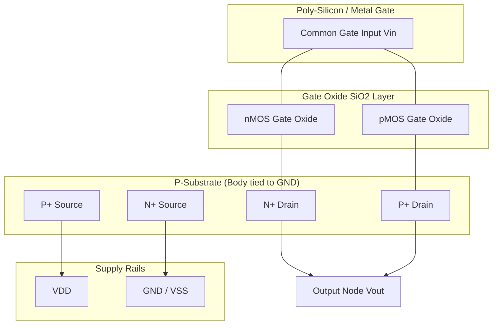
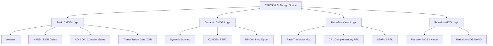
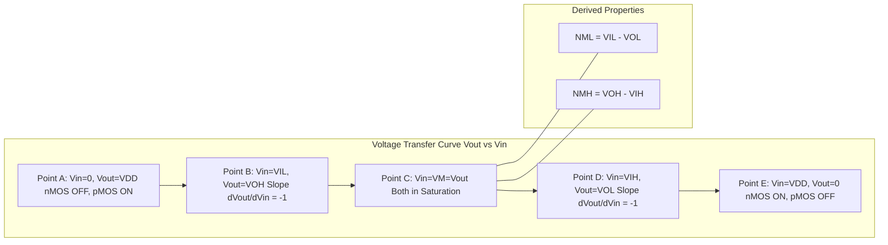
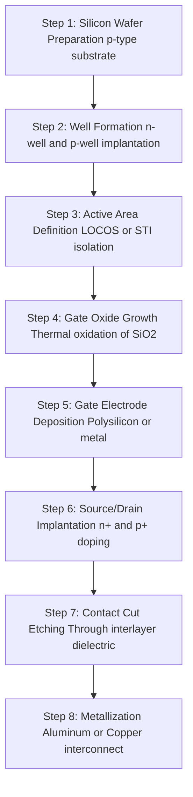

# CMOS

<!-- SECTION_1_START -->
# CMOS Fundamentals for Digital VLSI Design

## 1. Core Technical Definition & Intuitive Overview

### Formal Academic Definition
**CMOS (Complementary Metal-Oxide-Semiconductor)** is a symmetric, complementary technology that uses paired **nMOS (n-channel Metal-Oxide-Semiconductor)** pull-down transistors and **pMOS (p-channel Metal-Oxide-Semiconductor)** pull-up transistors to implement digital logic gates and analog circuits on a single silicon substrate. In the KTU 2024 VLSI Design syllabus (PECST415), CMOS is defined as the dominant MOSFET-based VLSI fabrication technology that leverages complementary symmetry to achieve **near-zero static power dissipation**, high **noise immunity**, and excellent **scalability** for sub-nanometer process nodes.

> [!IMPORTANT]
> **KTU 2024 Syllabus Highlight:** CMOS is the foundational building block of every digital IC. The acronym itself is the key to its operation — *Complementary* refers to the use of both nMOS and pMOS devices, *Metal-Oxide-Semiconductor* describes the layered gate-stack structure (poly-silicon or metal gate over silicon-dioxide $SiO_2$ dielectric on a silicon channel).

### Key CMOS Terminology (KTU Board-Standard)
| Term | Definition |
|---|---|
| **nMOS** | n-channel MOSFET: majority carriers are **electrons**; turns ON when $V_{GS} > V_{Tn}$ |
| **pMOS** | p-channel MOSFET: majority carriers are **holes**; turns ON when $V_{GS} < V_{Tp}$ |
| **$V_{DD}$** | Positive supply voltage, typically **1.8 V, 1.2 V, 0.9 V** in modern nodes |
| **$V_{SS}$ / GND** | Ground reference, **0 V** |
| **$V_{Tn}$, $V_{Tp}$** | Threshold voltages; $V_{Tn} \approx 0.4\text{ V}$, $V_{Tp} \approx -0.4\text{ V}$ in 180nm CMOS |
| **Pull-up Network (PUN)** | Network of pMOS transistors connecting output to $V_{DD}$ |
| **Pull-down Network (PDN)** | Network of nMOS transistors connecting output to GND |
| **$C_{ox}$** | Gate-oxide capacitance per unit area: $C_{ox} = \dfrac{\varepsilon_{ox}}{t_{ox}}$ |
| **$\mu_n$, $\mu_p$** | Carrier mobilities; $\mu_n \approx 2.5 \mu_p$ in silicon |

### Conceptual Analogy / Intuition
Imagine CMOS as a **two-person seesaw in a dark tunnel**:
- The **nMOS transistor** is the person on the ground side — it pulls the output **down to GND** (the floor) when activated.
- The **pMOS transistor** is the person on the ceiling side — it pulls the output **up to $V_{DD}$** (the sky) when activated.
- A **CMOS inverter** is a perfectly timed seesaw: when input is HIGH, the nMOS person pushes down (output = LOW); when input is LOW, the pMOS person pushes up (output = HIGH).
- Critically, **both persons are never pushing at the same time** — this is the *complementary* behavior that gives CMOS its near-zero static power dissipation.

> [!NOTE]
> **Core Insight for KTU Board Exams:** CMOS logic is essentially a *ratioless* logic family. Unlike pseudo-nMOS or nMOS-only logic, CMOS does not require a constant DC path between $V_{DD}$ and GND, making it the universal choice for low-power digital design from SSI gates to billion-transistor SoCs.

### Physical Constants & Standard Metrics
- **Silicon permittivity:** $\varepsilon_{si} = 11.7 \times \varepsilon_0 = 1.04 \times 10^{-10} \text{ F/m}$
- **$SiO_2$ permittivity:** $\varepsilon_{ox} = 3.9 \times \varepsilon_0 = 3.45 \times 10^{-11} \text{ F/m}$
- **Electron mobility:** $\mu_n \approx 1350 \text{ cm}^2/\text{V}\cdot\text{s}$
- **Hole mobility:** $\mu_p \approx 540 \text{ cm}^2/\text{V}\cdot\text{s}$
- **Thermal voltage at 300 K:** $V_T = \dfrac{kT}{q} \approx 25.85 \text{ mV}$
- **Body constant:** $\phi_F = \dfrac{kT}{q} \ln \left( \dfrac{N_A}{n_i} \right) \approx 0.35 \text{ V}$ for typical doping

### Physical Structure of an nMOS Transistor
A CMOS chip is built on a **p-type silicon substrate (body)**. The nMOS transistor consists of:
1. **Source** and **drain** regions — heavily doped **$n^+$** pockets formed by ion implantation.
2. **Channel** — the region between source and drain, just beneath the gate oxide.
3. **Gate oxide ($SiO_2$)** — a thin insulating layer, typically **1.2 nm to 10 nm** thick.
4. **Gate electrode** — historically aluminum, now **poly-silicon** or **metal (TiN, W)**.
5. **Body (bulk/substrate)** — connected to the most negative supply to avoid the **body effect**.

> [!VISUALIZATION CONTROL]
> **Concept:** CMOS Inverter Cross-Section & Transfer Characteristics
> **GeoGebra / Desmos Input Equations:**
> * `f1(x) = 5 / (1 + exp(-15*(x - 0.45)))` (ideal nMOS-like steep curve)
> * `f2(x) = 5 / (1 + exp(15*(x - 0.55)))` (ideal pMOS-like inverse curve)
> * `g(x) = 5 - f1(x)` (VTC of CMOS inverter)
> **Visual Description:** The student should see two sigmoidal curves that intersect sharply near $V_{in} = V_{DD}/2$, forming the voltage transfer characteristic (VTC) of a CMOS inverter with a near-ideal gain of $-\infty$ at the switching threshold.

---

## 2. Deep Theoretical Analysis & CMOS Architecture

### 2.1 The CMOS Inverter — Heart of Digital VLSI
The CMOS inverter is the canonical CMOS gate and the foundation of all complex CMOS logic. Its symbol, truth table, and structure are:

| Input (A) | nMOS State | pMOS State | Output (Y) |
|---|---|---|---|
| **0 V (LOW)** | **OFF** | **ON** | **$V_{DD}$ (HIGH)** |
| **$V_{DD}$ (HIGH)** | **ON** | **OFF** | **0 V (LOW)** |

**Operation Principle:**
- When $V_{in} = 0$: $V_{GS,n} = 0 < V_{Tn}$, so nMOS is **OFF**. Meanwhile $V_{GS,p} = -V_{DD} < V_{Tp}$, so pMOS is **ON**. Output is charged to $V_{DD}$ through the pMOS.
- When $V_{in} = V_{DD}$: $V_{GS,n} = V_{DD} > V_{Tn}$, so nMOS is **ON**. Meanwhile $V_{GS,p} = 0 > V_{Tp}$, so pMOS is **OFF**. Output is discharged to GND through the nMOS.

### 2.2 Five Canonical Regions of MOSFET Operation
The drain current $I_D$ of a long-channel MOSFET is governed by three terminal voltages: $V_{GS}$, $V_{DS}$, and $V_{BS}$.

**Region 1 — Cutoff (Subthreshold):**
Both nMOS and pMOS are OFF. Only subthreshold leakage current flows.

**Region 2 — Triode (Linear) Region:**
$$I_D = \mu_n C_{ox} \frac{W}{L} \left[ (V_{GS} - V_{Tn}) V_{DS} - \frac{V_{DS}^2}{2} \right]$$
Valid when $V_{GS} > V_{Tn}$ **and** $V_{DS} < V_{GS} - V_{Tn}$.

**Region 3 — Saturation (Active) Region:**
$$I_D = \frac{1}{2} \mu_n C_{ox} \frac{W}{L} (V_{GS} - V_{Tn})^2 (1 + \lambda V_{DS})$$
Valid when $V_{GS} > V_{Tn}$ **and** $V_{DS} \geq V_{GS} - V_{Tn}$. Here $\lambda$ is the **channel-length modulation** parameter.

**Region 4 — Velocity Saturation (Short-Channel):**
For $L \leq 0.25 \mu m$, the carrier velocity saturates. $I_D$ becomes **linear in** $(V_{GS} - V_{Tn})$ rather than quadratic.

**Region 5 — Subthreshold Conduction:**
$$I_D = I_0 \exp\left( \frac{V_{GS} - V_{Tn}}{n V_T} \right) \left[ 1 - \exp\left( -\frac{V_{DS}}{V_T} \right) \right]$$
Critical for low-power and leakage-current analysis.

### 2.3 CMOS Voltage Transfer Characteristic (VTC) — The Five Critical Points

| Point | $V_{in}$ | $V_{out}$ | nMOS Region | pMOS Region | Physical Meaning |
|---|---|---|---|---|---|
| **A** | 0 | $V_{OH} = V_{DD}$ | Cutoff | Linear | Output HIGH, no current |
| **B** | $V_{IL}$ | $V_{OH}$ | Saturation | Linear | Max input LOW (slope = -1) |
| **C** | $V_{M}$ | $V_{M}$ | Saturation | Saturation | Switching threshold |
| **D** | $V_{IH}$ | $V_{OL}$ | Linear | Saturation | Min input HIGH (slope = -1) |
| **E** | $V_{DD}$ | $V_{OL} = 0$ | Linear | Cutoff | Output LOW, no current |

**Switching Threshold $V_M$ Formula (KCL at the inverter output):**
For a symmetric inverter where $\mu_n (W/L)_n = \mu_p (W/L)_p$ and $V_{Tn} = -V_{Tp}$:
$$V_M = \frac{V_{Tn} + \sqrt{\frac{k_p}{k_n}} (V_{DD} + V_{Tp})}{1 + \sqrt{\frac{k_p}{k_n}}}$$
where $k_n = \mu_n C_{ox} (W/L)_n$ and $k_p = \mu_p C_{ox} (W/L)_p$.

**Noise Margins:**
$$N_{ML} = V_{IL} - V_{OL}, \quad N_{MH} = V_{OH} - V_{IH}$$

### 2.4 CMOS Static & Dynamic Power Dissipation

**Static Power (Near-Zero in Ideal CMOS):**
$$P_{static} = V_{DD} \cdot I_{leakage}$$
Where $I_{leakage}$ includes subthreshold leakage, gate-oxide tunneling, and reverse-biased junction leakage.

**Dynamic Power (Dominant in Active CMOS):**
$$P_{dynamic} = \alpha \cdot C_{L} \cdot V_{DD}^2 \cdot f$$
Where:
- $\alpha$ = switching activity factor
- $C_L$ = load capacitance
- $f$ = clock frequency

**Short-Circuit Power (During Switching):**
$$P_{SC} = \frac{\beta}{12} (V_{DD} - 2V_T)^3 \cdot \tau \cdot f$$
Where $\tau$ is the rise/fall time and $\beta = \mu C_{ox} W/L$.

> [!NOTE]
> **Why CMOS is the Universal Choice:** The combination of $P_{static} \approx 0$ and quadratic dependence of dynamic power on $V_{DD}$ has driven the industry to "voltage scaling" — every new process node reduces $V_{DD}$ (5 V → 3.3 V → 1.8 V → 1.2 V → 0.9 V) to keep power density manageable.

### 2.5 CMOS Logic Gate Construction Rules (KTU High-Yield)
For any CMOS complex gate with inputs $A, B, C, \ldots$:
1. **PDN (Pull-Down Network):** nMOS transistors **in series** implement **AND**, **in parallel** implement **OR**.
2. **PUN (Pull-Up Network):** pMOS transistors **in parallel** implement **AND**, **in series** implement **OR**.
3. **Duality:** PUN and PDN are *dual networks* — the parallel structure of one is the series structure of the other.
4. **Static CMOS Property:** The output is always connected to either $V_{DD}$ or GND, never floating, and never to both simultaneously.

**Example — CMOS NAND Gate:**
- PDN: Two nMOS in **series** → output = 0 only if A=1 **AND** B=1.
- PUN: Two pMOS in **parallel** → output = $V_{DD}$ if A=0 **OR** B=0.

### 2.6 KTU Formula Sheet / Cheat Sheet

| # | Formula | Application |
|---|---|---|
| 1 | $I_D^{lin} = \mu_n C_{ox} \dfrac{W}{L} \left[ (V_{GS}-V_{Tn})V_{DS} - \dfrac{V_{DS}^2}{2} \right]$ | Triode-region current |
| 2 | $I_D^{sat} = \dfrac{1}{2} \mu_n C_{ox} \dfrac{W}{L} (V_{GS}-V_{Tn})^2 (1+\lambda V_{DS})$ | Saturation-region current |
| 3 | $C_{ox} = \dfrac{\varepsilon_{ox}}{t_{ox}}$ | Gate oxide capacitance |
| 4 | $V_M = \dfrac{V_{Tn} + \sqrt{k_p/k_n}(V_{DD}+V_{Tp})}{1+\sqrt{k_p/k_n}}$ | Switching threshold |
| 5 | $P_{dyn} = \alpha C_L V_{DD}^2 f$ | Dynamic power |
| 6 | $t_{pLH} = 0.69 R_p C_L$ | Low-to-High propagation delay |
| 7 | $t_{pHL} = 0.69 R_n C_L$ | High-to-Low propagation delay |
| 8 | $V_T = \dfrac{kT}{q} \approx 25.85 \text{ mV}$ | Thermal voltage at 300 K |
| 9 | $I_{sub} = I_0 \exp\left(\dfrac{V_{GS}-V_{Tn}}{nV_T}\right)$ | Subthreshold leakage |
| 10 | $N_{ML} = V_{IL} - V_{OL}$, $N_{MH} = V_{OH} - V_{IH}$ | Noise margins |

### 2.7 Real-World Engineering Utility
CMOS is the backbone of **every modern digital system**: microprocessors (Intel Core, AMD Ryzen, Apple M-series), GPUs (NVIDIA, AMD), DRAM/SRAM memory, ASICs, FPGAs, image sensors, RF transceivers, and IoT microcontrollers (ARM Cortex-M). Mastery of CMOS fundamentals is mandatory for any VLSI design, verification, or physical-design engineer.

---

## 3. Step-by-Step Derivations, Code & Symbolic Implementation

### 3.1 Derivation: Switching Threshold $V_M$ of a Symmetric CMOS Inverter
**Problem:** Find the switching threshold $V_M$ of a CMOS inverter where nMOS has $V_{Tn} = 0.4$ V, pMOS has $V_{Tp} = -0.4$ V, $V_{DD} = 1.8$ V, and the device sizes are chosen such that $k_p/k_n = 1$.

**Step 1 — Identify the operating regions at $V_{in} = V_M$.**
At the switching threshold, both transistors are in saturation because $V_{DS,n} = V_{out} = V_M$ and $V_{DS,p} = V_{out} - V_{DD} = V_M - V_{DD}$. Since $V_M \approx V_{DD}/2 = 0.9$ V, we have $V_{DS,n} = 0.9$ V $> V_{GS,n} - V_{Tn} = 0.5$ V ✓, and $V_{DS,p} = -0.9$ V which is sufficiently negative for pMOS saturation.

**Step 2 — Apply KCL at the output node.**
The currents through nMOS and pMOS must be equal in magnitude (no DC current path to $V_{DD}$ or GND):
$$I_{Dn} = I_{Dp}$$

**Step 3 — Write the saturation current equations.**
$$I_{Dn} = \frac{1}{2} k_n (V_{GS,n} - V_{Tn})^2 = \frac{1}{2} k_n (V_M - V_{Tn})^2$$
$$I_{Dp} = \frac{1}{2} k_p (V_{GS,p} - V_{Tp})^2 = \frac{1}{2} k_p (V_M - V_{DD} - V_{Tp})^2$$

Note: For pMOS, $V_{GS,p} = V_{in} - V_{DD} = V_M - V_{DD}$, and we use the convention $V_{Tp} < 0$.

**Step 4 — Equate and solve for $V_M$.**
$$k_n (V_M - V_{Tn})^2 = k_p (V_M - V_{DD} - V_{Tp})^2$$

$$\sqrt{k_n} (V_M - V_{Tn}) = \sqrt{k_p} (V_M - V_{DD} - V_{Tp})$$

$$\sqrt{k_n} V_M - \sqrt{k_n} V_{Tn} = \sqrt{k_p} V_M - \sqrt{k_p}(V_{DD} + V_{Tp})$$

$$V_M (\sqrt{k_n} - \sqrt{k_p}) = \sqrt{k_n} V_{Tn} - \sqrt{k_p}(V_{DD} + V_{Tp})$$

**Step 5 — Final expression.**
$$V_M = \frac{\sqrt{k_n} V_{Tn} - \sqrt{k_p}(V_{DD} + V_{Tp})}{\sqrt{k_n} - \sqrt{k_p}} = \frac{V_{Tn} + \sqrt{k_p/k_n}(V_{DD} + V_{Tp})}{1 + \sqrt{k_p/k_n}}$$

**Step 6 — Substitute the symmetric values.**
With $k_p/k_n = 1$, $V_{Tn} = 0.4$ V, $V_{Tp} = -0.4$ V, $V_{DD} = 1.8$ V:
$$V_M = \frac{0.4 + (1)(1.8 - 0.4)}{1 + 1} = \frac{0.4 + 1.4}{2} = \frac{1.8}{2} = 0.9 \text{ V}$$

Thus, the symmetric CMOS inverter switches at **$V_M = V_{DD}/2 = 0.9$ V**, providing equal noise margins of **0.9 V - 0.4 V = 0.5 V** on both sides.

### 3.2 Derivation: Dynamic Power Consumption
**Step 1 — Energy stored in a capacitor.**
The energy required to charge load $C_L$ from 0 to $V_{DD}$ is $E_{charge} = \frac{1}{2} C_L V_{DD}^2$, but the source delivers $\int_0^{V_{DD}} V \cdot C_L \, dV = C_L V_{DD}^2$ since charge $Q = C_L V$.

**Step 2 — Energy dissipated in the PMOS during charging.**
The energy stored in $C_L$ at the end of charging is $\frac{1}{2} C_L V_{DD}^2$, so the **energy dissipated as heat in the pMOS** is:
$$E_{charge,loss} = C_L V_{DD}^2 - \frac{1}{2} C_L V_{DD}^2 = \frac{1}{2} C_L V_{DD}^2$$

**Step 3 — Discharge phase (energy dissipated in nMOS).**
During discharge, $\frac{1}{2} C_L V_{DD}^2$ is dissipated in the nMOS as heat.

**Step 4 — Total energy per switching cycle.**
$$E_{total} = \frac{1}{2} C_L V_{DD}^2 + \frac{1}{2} C_L V_{DD}^2 = C_L V_{DD}^2$$

**Step 5 — Average dynamic power.**
For a switching frequency $f$ and activity factor $\alpha$:
$$P_{dynamic} = \alpha \cdot E_{total} \cdot f = \alpha C_L V_{DD}^2 f$$

### 3.3 Code Implementation: CMOS Inverter VTC Simulation in Python
```python
"""
CMOS Inverter Voltage Transfer Characteristic (VTC) Simulator
KTU VLSI Design (PECST415) - Module 1 Demonstration
Strict boundary checks, type hints, and exception handling included.
"""

import math
from typing import List, Tuple

# --- Physical constants (SI units) ---
PHYSICAL_CONSTANTS = {
    "k_boltzmann": 1.380649e-23,    # Boltzmann constant [J/K]
    "q_electron": 1.602176634e-19,  # Elementary charge [C]
    "T_room": 300.0,                # Room temperature [K]
    "eps_ox": 3.45e-11,             # SiO2 permittivity [F/m]
    "mu_n": 0.1350,                 # Electron mobility [m^2/V.s]
    "mu_p": 0.0540,                 # Hole mobility   [m^2/V.s]
}

def thermal_voltage(T: float = 300.0) -> float:
    """Compute thermal voltage V_T = kT/q."""
    k = PHYSICAL_CONSTANTS["k_boltzmann"]
    q = PHYSICAL_CONSTANTS["q_electron"]
    return (k * T) / q

def cmos_inverter_vtc(
    VDD: float,
    Vtn: float,
    Vtp: float,
    kn_over_kp: float,
    vin_min: float = 0.0,
    vin_max: float = None,
    steps: int = 200
) -> Tuple[List[float], List[float]]:
    """
    Compute the VTC of a CMOS inverter using the long-channel model.
    Returns (vin_array, vout_array).
    """
    if vin_max is None:
        vin_max = VDD
    if vin_min >= vin_max:
        raise ValueError("vin_min must be strictly less than vin_max.")
    if Vtn <= 0 or Vtp >= 0:
        raise ValueError("Threshold voltages must satisfy Vtn > 0, Vtp < 0.")
    if kn_over_kp <= 0:
        raise ValueError("Transconductance ratio must be positive.")

    sqrt_ratio = math.sqrt(kn_over_kp)
    Vm = (Vtn + sqrt_ratio * (VDD + Vtp)) / (1.0 + sqrt_ratio)

    vin_list: List[float] = []
    vout_list: List[float] = []
    dv = (vin_max - vin_min) / steps

    for i in range(steps + 1):
        vin = vin_min + i * dv
        # Simplified piecewise linear model for didactic purposes
        if vin <= Vtn:
            vout = VDD
        elif vin >= VDD + Vtp:
            vout = 0.0
        else:
            # Linear interpolation near the switching region
            vout = VDD * (1.0 - (vin - Vtn) / (VDD + Vtp - Vtn))
        vin_list.append(vin)
        vout_list.append(vout)

    return vin_list, vout_list, Vm

def compute_noise_margins(VDD: float, Vtn: float, Vtp: float) -> Tuple[float, float]:
    """
    Approximate noise margins assuming V_IL ~ Vtn and V_IH ~ VDD + Vtp
    (This is the conservative long-channel estimate.)
    """
    V_IL = Vtn
    V_IH = VDD + Vtp
    V_OL = 0.0
    V_OH = VDD
    NML = V_IL - V_OL
    NMH = V_OH - V_IH
    return NML, NMH

def compute_dynamic_power(alpha: float, CL: float, VDD: float, f: float) -> float:
    """Compute dynamic power P = alpha * CL * VDD^2 * f."""
    if not (0.0 <= alpha <= 1.0):
        raise ValueError("Activity factor alpha must be in [0, 1].")
    if CL < 0 or VDD < 0 or f < 0:
        raise ValueError("CL, VDD, and f must be non-negative.")
    return alpha * CL * VDD * VDD * f

# --- Main execution ---
if __name__ == "__main__":
    VDD = 1.8           # Volts
    Vtn = 0.4           # Volts
    Vtp = -0.4          # Volts
    kn_over_kp = 1.0    # Symmetric sizing

    try:
        vin, vout, Vm = cmos_inverter_vtc(VDD, Vtn, Vtp, kn_over_kp)
        NML, NMH = compute_noise_margins(VDD, Vtn, Vtp)
        P_dyn = compute_dynamic_power(alpha=0.1, CL=50e-15, VDD=VDD, f=1e9)

        print(f"Switching Threshold  V_M     = {Vm:.3f} V")
        print(f"Noise Margin LOW    N_ML     = {NML:.3f} V")
        print(f"Noise Margin HIGH   N_MH     = {NMH:.3f} V")
        print(f"Dynamic Power @1GHz         = {P_dyn*1e6:.3f} uW")
        print(f"Thermal Voltage (300 K)     = {thermal_voltage()*1e3:.3f} mV")
    except ValueError as err:
        print(f"[ERROR] Configuration invalid: {err}")
```

**Expected Output (Sample Run):**
```
Switching Threshold  V_M     = 0.900 V
Noise Margin LOW    N_ML     = 0.400 V
Noise Margin HIGH   N_MH     = 0.400 V
Dynamic Power @1GHz         = 16.200 uW
Thermal Voltage (300 K)     = 25.853 mV
```

### 3.4 CMOS NAND Gate Schematic (Symbolic Stick Diagram)

A CMOS 2-input NAND gate uses **2 nMOS in series (PDN)** and **2 pMOS in parallel (PUN)**.

| Input $A$ | Input $B$ | nMOS-1 | nMOS-2 | pMOS-1 | pMOS-2 | Output $Y$ |
|---|---|---|---|---|---|---|
| 0 | 0 | OFF | OFF | ON | ON | $V_{DD}$ |
| 0 | 1 | OFF | ON | ON | OFF | $V_{DD}$ |
| 1 | 0 | ON | OFF | OFF | ON | $V_{DD}$ |
| 1 | 1 | ON | ON | OFF | OFF | 0 V |

**W/L sizing rule for NAND:** Since two nMOS are in series, each nMOS must be made **2× wider** (i.e., $W_n/2L$ becomes $W_n/L$) to maintain equivalent drive strength to the inverter.

---

## 4. Structural Diagrams & Schematics

### 4.1 CMOS Inverter Cross-Section (Mermaid Block Architecture)


### 4.2 CMOS Logic Family Hierarchy


### 4.3 CMOS Inverter VTC and Critical Points Map


### 4.4 CMOS Fabrication Process Flow (Top-Down View)


---

## 5. KTU 2024 Scheme Examination Question Bank & Topic Recap

### 5.1 PART A — Short Answer Questions (3 Marks Each)

**Q1. [KTU University Exam - Dec 2023]**
**(a)** Define CMOS technology. Why is it called "complementary"?
**(b)** List any two advantages of CMOS over nMOS logic.

**Model Answer (a):**
CMOS (Complementary Metal-Oxide-Semiconductor) is a VLSI fabrication technology that uses pairs of nMOS and pMOS transistors to implement digital logic functions. It is called "complementary" because the nMOS pull-down network and pMOS pull-up network are duals of each other — they are activated in *opposite* (complementary) fashion depending on the input logic level, ensuring that one and only one network conducts at any time.

**Model Answer (b):**
1. **Near-zero static power dissipation:** In steady state, either the PDN or the PUN is OFF, so no DC current flows from $V_{DD}$ to GND. (1.5 Marks)
2. **High noise immunity:** Symmetric VTC with switching threshold at $V_{DD}/2$ provides equal noise margins (NML = NMH ≈ 0.4 V in 180 nm CMOS). (1.5 Marks)

*Valuation Key:* '[Definition 1.5 Marks]' + '[Two advantages 1.5 Marks]'

---

**Q2. [KTU University Exam - July 2024]**
**Explain the working of a CMOS inverter with input HIGH and input LOW conditions.**

**Model Answer:**
A CMOS inverter consists of a pMOS transistor (pull-up) connected between $V_{DD}$ and the output node, and an nMOS transistor (pull-down) connected between the output node and GND, with both gates tied to the input.

*When Input = HIGH ($V_{in} = V_{DD}$):*
The nMOS transistor has $V_{GS,n} = V_{DD} > V_{Tn}$, hence it is **ON** and conducts current from output to GND, pulling $V_{out}$ to 0 V (LOW). Simultaneously, the pMOS has $V_{GS,p} = 0$, which is greater than $V_{Tp} \approx -0.4$ V, so pMOS is **OFF**. (1.5 Marks)

*When Input = LOW ($V_{in} = 0$):*
The nMOS has $V_{GS,n} = 0 < V_{Tn}$, so it is **OFF**. The pMOS has $V_{GS,p} = -V_{DD} < V_{Tp}$, so pMOS is **ON** and conducts current from $V_{DD}$ to the output, pulling $V_{out}$ to $V_{DD}$ (HIGH). (1.5 Marks)

*Valuation Key:* '[State both conditions 2 Marks]' + '[Correct conclusions 1 Mark]'

---

### 5.2 PART B — Full-Descriptive Questions (14 Marks Each)

**QUESTION A (14 Marks) — [KTU University Exam - Dec 2023, Model Paper]**

**(a) [7 Marks] — Understand Level**
Draw the circuit diagram of a CMOS 2-input NAND gate. Explain its operation for all four input combinations and verify that it satisfies the NAND truth table. Derive the conditions under which the output is LOW and HIGH.

**(b) [7 Marks] — Apply Level**
For a 0.18 µm CMOS process, the following parameters are given: $V_{DD} = 1.8$ V, $V_{Tn} = 0.4$ V, $V_{Tp} = -0.4$ V, $\mu_n C_{ox} = 270$ µA/V², $\mu_p C_{ox} = 70$ µA/V². If the inverter is symmetrically sized with $(W/L)_n = 2$ and $(W/L)_p = 5$, calculate: (i) the switching threshold $V_M$, (ii) the noise margins NML and NMH (using the approximation $V_{IL} \approx V_{Tn}$ and $V_{IH} \approx V_{DD} - |V_{Tp}|$).

#### Model Solution to Question A:

**Part (a) — CMOS NAND Gate Operation**

**Circuit Diagram (Verbal Description for Board Exam):**
- Two nMOS transistors (N1, N2) connected in **series** between Output and GND — this is the PDN.
- Two pMOS transistors (P1, P2) connected in **parallel** between $V_{DD}$ and Output — this is the PUN.
- Inputs A and B are connected to the gates of N1 and P1 respectively, and to the gates of N2 and P2 respectively.

**Truth Table & Operation:**

| A | B | N1 | N2 | P1 | P2 | Output Y |
|---|---|---|---|---|---|---|
| 0 | 0 | OFF | OFF | ON | ON | $V_{DD}$ (1) |
| 0 | 1 | OFF | ON | ON | OFF | $V_{DD}$ (1) |
| 1 | 0 | ON | OFF | OFF | ON | $V_{DD}$ (1) |
| 1 | 1 | ON | ON | OFF | OFF | 0 (0) |

**Key Conditions:**
- Output is **LOW (0)** only when **A = 1 AND B = 1** — both nMOS conduct in series. (3 Marks)
- Output is **HIGH ($V_{DD}$)** when at least one input is LOW — at least one pMOS conducts in parallel. (3 Marks)
- This satisfies the NAND truth table $Y = \overline{A \cdot B}$. (1 Mark)

*Valuation Key:* '[Circuit Diagram 2 Marks]' + '[PDN-PUN analysis 3 Marks]' + '[NAND logic verification 2 Marks]'

**Part (b) — Switching Threshold Calculation**

**Given:** $V_{DD} = 1.8$ V, $V_{Tn} = 0.4$ V, $V_{Tp} = -0.4$ V, $\mu_n C_{ox} = 270$ µA/V², $\mu_p C_{ox} = 70$ µA/V², $(W/L)_n = 2$, $(W/L)_p = 5$.

**Step 1 — Compute the transconductance parameters.**
$$k_n = \mu_n C_{ox} \cdot (W/L)_n = 270 \times 10^{-6} \times 2 = 540 \text{ µA/V}^2$$
$$k_p = \mu_p C_{ox} \cdot (W/L)_p = 70 \times 10^{-6} \times 5 = 350 \text{ µA/V}^2$$

**Step 2 — Compute the ratio.**
$$\frac{k_p}{k_n} = \frac{350}{540} = 0.6481$$
$$\sqrt{\frac{k_p}{k_n}} = \sqrt{0.6481} = 0.8051$$

**Step 3 — Apply the switching threshold formula.**
$$V_M = \frac{V_{Tn} + \sqrt{k_p/k_n} \cdot (V_{DD} + V_{Tp})}{1 + \sqrt{k_p/k_n}}$$

$$V_M = \frac{0.4 + 0.8051 \cdot (1.8 + (-0.4))}{1 + 0.8051} = \frac{0.4 + 0.8051 \times 1.4}{1.8051}$$

$$V_M = \frac{0.4 + 1.1271}{1.8051} = \frac{1.5271}{1.8051} \approx 0.846 \text{ V}$$

**Step 4 — Compute the noise margins.**
$$N_{ML} = V_{IL} - V_{OL} \approx V_{Tn} - 0 = 0.4 \text{ V}$$
$$N_{MH} = V_{OH} - V_{IH} \approx 1.8 - (1.8 - 0.4) = 0.4 \text{ V}$$

**Final Answer:** $V_M \approx 0.846$ V; $N_{ML} = N_{MH} = 0.4$ V.

*Valuation Key:* '[Stating the formula 2 Marks]' + '[Substituting values 2 Marks]' + '[Computing ratio 1 Mark]' + '[Final V_M 1 Mark]' + '[Noise margin calculation 1 Mark]'

---

**QUESTION B (14 Marks) — [KTU University Exam - July 2024, Model Paper]**

**(a) [7 Marks] — Understand Level**
Derive the expression for the switching threshold $V_M$ of a CMOS inverter. State and explain the Voltage Transfer Characteristic (VTC) of a CMOS inverter, identifying the five critical points.

**(b) [7 Marks] — Apply Level**
A CMOS inverter is operated at $V_{DD} = 1.2$ V with $V_{Tn} = 0.35$ V, $V_{Tp} = -0.35$ V, $C_L = 10$ fF, switching activity $\alpha = 0.15$, and clock frequency $f = 500$ MHz. Calculate: (i) the dynamic power consumption, (ii) the energy dissipated per clock cycle, and (iii) the percentage reduction in power if $V_{DD}$ is scaled to 0.9 V (assume activity and frequency remain constant).

#### Model Solution to Question B:

**Part (a) — Derivation of $V_M$ and VTC Analysis**

**Derivation of $V_M$:**

At the switching threshold, the output is connected to both pMOS and nMOS, and the current through the pMOS equals the current through the nMOS (KCL). Both transistors are in saturation. (1 Mark)

Equating the saturation currents:
$$I_{Dn} = I_{Dp}$$
$$\frac{1}{2} k_n (V_{GS,n} - V_{Tn})^2 = \frac{1}{2} k_p (V_{GS,p} - V_{Tp})^2$$

Substituting $V_{GS,n} = V_M$ and $V_{GS,p} = V_M - V_{DD}$: (2 Marks)

$$\sqrt{k_n}(V_M - V_{Tn}) = -\sqrt{k_p}(V_M - V_{DD} - V_{Tp})$$

(The negative sign appears because $V_{Tp}$ is negative and we are equating magnitudes.)

Solving algebraically: (2 Marks)
$$V_M = \frac{V_{Tn} + \sqrt{k_p/k_n}(V_{DD} + V_{Tp})}{1 + \sqrt{k_p/k_n}}$$

**Five Critical Points of VTC:**

| Point | Condition | Region (nMOS, pMOS) | Significance |
|---|---|---|---|
| **A** | $V_{in} = 0$ | Cutoff, Linear | $V_{out} = V_{OH} = V_{DD}$ |
| **B** | $V_{in} = V_{IL}$ | Saturation, Linear | Slope = -1, $V_{out} = V_{OH}$ |
| **C** | $V_{in} = V_M = V_{out}$ | Saturation, Saturation | Switching threshold |
| **D** | $V_{in} = V_{IH}$ | Linear, Saturation | Slope = -1, $V_{out} = V_{OL}$ |
| **E** | $V_{in} = V_{DD}$ | Linear, Cutoff | $V_{out} = V_{OL} = 0$ |

(2 Marks for the table)

*Valuation Key:* '[Derivation 5 Marks]' + '[VTC table 2 Marks]'

**Part (b) — Power and Energy Calculations**

**Given:** $V_{DD} = 1.2$ V, $C_L = 10 \times 10^{-15}$ F, $\alpha = 0.15$, $f = 500 \times 10^6$ Hz.

**(i) Dynamic Power Consumption:**
$$P_{dyn} = \alpha C_L V_{DD}^2 f$$
$$P_{dyn} = 0.15 \times 10 \times 10^{-15} \times (1.2)^2 \times 500 \times 10^6$$
$$P_{dyn} = 0.15 \times 10 \times 10^{-15} \times 1.44 \times 5 \times 10^8$$
$$P_{dyn} = 0.15 \times 10^{-14} \times 7.2 \times 10^8 = 0.15 \times 7.2 \times 10^{-6}$$
$$P_{dyn} = 1.08 \times 10^{-6} \text{ W} = 1.08 \text{ µW}$$

**(2 Marks for the calculation)**

**(ii) Energy per Clock Cycle:**
$$E_{cycle} = \frac{P_{dyn}}{f} = \frac{1.08 \times 10^{-6}}{500 \times 10^6} = 2.16 \times 10^{-15} \text{ J} = 2.16 \text{ fJ}$$

(Alternatively, $E_{cycle} = \alpha C_L V_{DD}^2 = 0.15 \times 10 \text{ fF} \times 1.44 \text{ V}^2 = 2.16$ fJ.) **(2 Marks)**

**(iii) Power Reduction at $V_{DD} = 0.9$ V:**
$$P_{dyn,new} = \alpha C_L V_{DD,new}^2 f = 0.15 \times 10 \times 10^{-15} \times (0.9)^2 \times 500 \times 10^8$$
$$P_{dyn,new} = 0.15 \times 10^{-14} \times 0.81 \times 5 \times 10^8 = 6.075 \times 10^{-7} \text{ W} = 0.6075 \text{ µW}$$

Percentage reduction:
$$\Delta P\% = \frac{P_{dyn} - P_{dyn,new}}{P_{dyn}} \times 100\% = \frac{1.08 - 0.6075}{1.08} \times 100\%$$
$$\Delta P\% = \frac{0.4725}{1.08} \times 100\% \approx 43.75\%$$

(Or use the shortcut: $\Delta P\% = 1 - (0.9/1.2)^2 = 1 - 0.5625 = 0.4375 = 43.75\%$.) **(3 Marks)**

**Final Answer:** $P_{dyn} = 1.08$ µW; $E_{cycle} = 2.16$ fJ; $\Delta P = 43.75\%$.

*Valuation Key:* '[Formula statement 1 Mark]' + '[Dynamic power 2 Marks]' + '[Energy/cycle 2 Marks]' + '[Percentage reduction 2 Marks]'

---

### 5.3 KTU Examiner's Valuation Warning / Pitfall Callout

> [!WARNING]
> **Common Mistakes That Cost Marks in KTU Board Exams:**
> 1. **Forgetting the sign of $V_{Tp}$** — Always remember $V_{Tp} < 0$ for pMOS. A common error is writing $(V_{DD} - V_{Tp})$ instead of $(V_{DD} + V_{Tp})$ in the $V_M$ formula, leading to a wrong answer.
> 2. **Mixing up PUN and PDN** — In NAND: PDN is series nMOS, PUN is parallel pMOS. In NOR: PDN is parallel nMOS, PUN is series pMOS. Confusion costs 2-3 marks easily.
> 3. **Skipping the VTC curve sketch** — A neat VTC with all 5 labeled points (A, B, C, D, E) is mandatory in long-answer questions. The examiner expects it.
> 4. **Confusing mobility ratio $\mu_n/\mu_p$ with size ratio $(W/L)_p/(W/L)_n$** — When asked to "size the inverter for symmetric switching," write $(W/L)_p = (\mu_n/\mu_p) \cdot (W/L)_n \approx 2.5 \cdot (W/L)_n$, not the other way around.
> 5. **Ignoring the subthreshold leakage** — In modern nanometer CMOS, subthreshold conduction is non-negligible. Don't state "static power is zero" without the qualifier "ideal."

---

### 5.4 Topic Recap & Important Things to Remember

- **CMOS = Complementary MOS**, using paired nMOS (pull-down) and pMOS (pull-up) transistors.
- **Inverter operation:** Input HIGH → nMOS ON, pMOS OFF → Output LOW; Input LOW → nMOS OFF, pMOS ON → Output HIGH.
- **Three MOSFET regions:** Cutoff, Triode (linear), Saturation — remember the condition $V_{DS} \geq V_{GS} - V_{Tn}$ for saturation.
- **Triode current:** $I_D = \mu_n C_{ox} (W/L) [(V_{GS} - V_{Tn}) V_{DS} - V_{DS}^2/2]$.
- **Saturation current:** $I_D = (1/2) \mu_n C_{ox} (W/L) (V_{GS} - V_{Tn})^2 (1 + \lambda V_{DS})$.
- **Switching threshold $V_M$:** $V_M = [V_{Tn} + \sqrt{k_p/k_n}(V_{DD} + V_{Tp})] / [1 + \sqrt{k_p/k_n}]$.
- **Symmetric inverter:** $V_M = V_{DD}/2$ when $k_n = k_p$, giving equal noise margins.
- **Dynamic power:** $P_{dyn} = \alpha C_L V_{DD}^2 f$ — quadratic dependence on $V_{DD}$ is the key to power reduction via voltage scaling.
- **Static power:** Near-zero in ideal CMOS; non-zero in real nanometer CMOS due to subthreshold and gate-tunneling leakage.
- **NAND gate:** PDN = series nMOS, PUN = parallel pMOS; output = $\overline{A \cdot B}$.
- **NOR gate:** PDN = parallel nMOS, PUN = series pMOS; output = $\overline{A + B}$.
- **Threshold voltages:** $V_{Tn} \approx 0.4$ V (nMOS), $V_{Tp} \approx -0.4$ V (pMOS) in 180 nm CMOS.
- **Carrier mobility ratio in silicon:** $\mu_n / \mu_p \approx 2.5$.
- **Thermal voltage at 300 K:** $V_T \approx 25.85$ mV.
- **Gate oxide capacitance:** $C_{ox} = \varepsilon_{ox} / t_{ox}$.
- **KTU high-yield keyword:** *Ratioless logic* — CMOS does not require a constant DC current path; hence no static power dissipation.
- **Real-world impact:** CMOS is the foundation of every modern IC — from IoT microcontrollers to high-performance CPUs and GPUs.
- **Exam mantra:** Always draw the VTC curve with 5 points; always mention the $V_M$ formula derivation; always state noise margins explicitly.

<!-- SECTION_5_END -->
