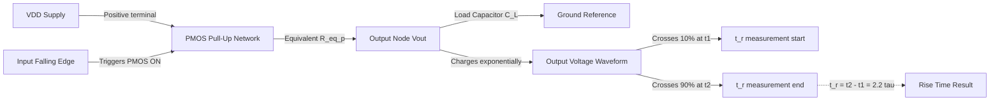
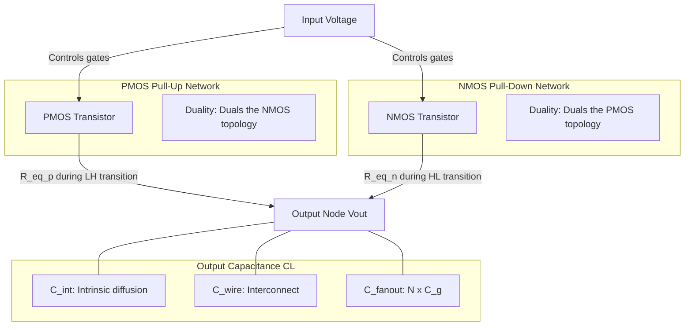
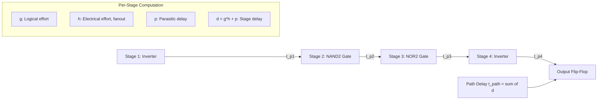
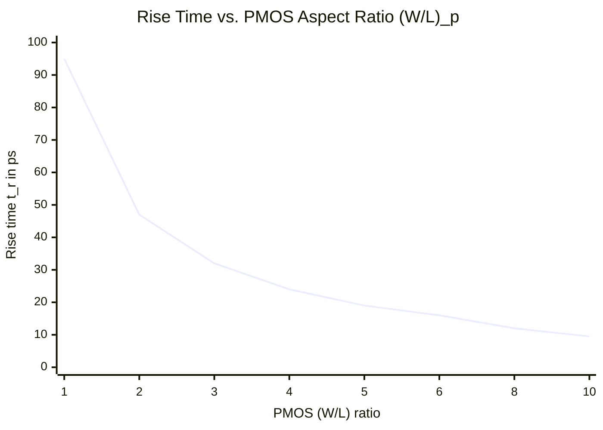

# Combinational Circuits Timing - Rise Time

<!-- SECTION_1_START -->

# Rise Time in CMOS Combinational Circuits

## 1.1 Formal Definition

In the context of the KTU 2024 Scheme syllabus for **VLSI Design (PECST415)**, the **Rise Time ($t_r$)** of a CMOS logic gate output node is defined as the time required for the output voltage to transition from **$10\%$** of $V_{DD}$ to **$90\%$** of $V_{DD}$ during a **low-to-high** switching event. It quantifies the speed at which the **PMOS pull-up network** can charge the total load capacitance present at the output node.

> [!IMPORTANT]
> **KTU Syllabus Mapping (Module 1 — CMOS Fundamentals):**
> Rise time belongs to the broader topic of *"Transient Analysis of CMOS Inverter"* and *"Combinational MOS Logic Circuits — Switching Characteristics."* It is a foundational metric for propagation delay estimation, logical effort calculations, and timing closure in digital VLSI design flows.

> [!NOTE]
> **Standard CMOS Inverter Definition (Rabaey/Weste Textbook Convention):**
> A static CMOS inverter is a **ratioed-less** logic structure. The output node capacitance $C_L$ is charged by the PMOS transistor (pull-up) and discharged by the NMOS transistor (pull-down). The PMOS is active when input is **low**, and the NMOS is active when input is **high**.

## 1.2 Intuitive Analogy

Think of a **water tank connected to a pipe at the bottom and a pump at the top**:
- The **water level** represents the output voltage $V_{out}$.
- The **load capacitance $C_L$** behaves like the cross-sectional area of the tank — a bigger tank takes longer to fill.
- The **PMOS transistor (pump)** charges the tank from empty to full — this duration is the **rise time**.
- The **NMOS transistor (drain valve)** empties the tank — this duration is the **fall time**.

If you shrink the pipe diameter (increase channel resistance $R_{eq}$), the tank fills slowly, increasing $t_r$. If the tank is wider (larger $C_L$), again $t_r$ increases. The product $R_{eq} \cdot C_L$ is the fundamental **time constant** of this analogy.

> [!TIP]
> **Geometric Intuition:** The output waveform is not a perfect step. It is an **exponential RC charging curve** governed by $V_{out}(t) = V_{DD}(1 - e^{-t/\tau})$. The *steepness* of this curve at the switching threshold ($V_{DD}/2$) determines the propagation delay $t_{pLH}$, while its **overall slope** between the 10% and 90% points determines the rise time $t_r$.

## 1.3 The 10%–90% Rise Time Formula

For a first-order RC circuit driven by a step input, the analytical rise time is:

$$
t_r \;=\; t_{90\%} - t_{10\%} \;=\; \tau \cdot \ln\!\left(\frac{0.9}{0.1}\right) \;\approx\; 2.2 \, \tau
$$

where $\tau = R_{eq,p} \cdot C_L$ is the **Elmore time constant** of the pull-up path, and $R_{eq,p}$ is the **equivalent on-resistance** of the PMOS pull-up network.

> [!VISUALIZATION CONTROL]
> **Concept:** RC Charging Curve and Rise Time Definition
> **GeoGebra / Desmos Input Equations:**
> * `V(t) = 1 - exp(-t/τ)` (with τ = 1)
> * Horizontal lines: `y = 0.1` and `y = 0.9`
> * Markers: `(t₁, 0.1)` and `(t₂, 0.9)` where `t₁ = -ln(0.9) ≈ 0.1053` and `t₂ = -ln(0.1) ≈ 2.3026`
> **Visual Description:** The student should observe an exponential curve rising from 0 toward 1. The horizontal bands at 10% and 90% intersect the curve at two time points. The horizontal distance between them equals approximately **2.2τ** — this distance is the rise time.

## 1.4 Physical Constants and Standard Metrics

| Metric | Standard Value | Description |
|---|---|---|
| **$V_{DD}$** | **1.0 V – 5.0 V** | Supply voltage (process dependent) |
| **$V_{Tn}$** | **0.4 V – 0.7 V** | NMOS threshold voltage |
| **$V_{Tp}$** | **-0.4 V to -0.7 V** | PMOS threshold voltage (magnitude) |
| **$\mu_n / \mu_p$ ratio** | **2 – 3** | Electron vs. hole mobility ratio |
| **$C_{ox}$** | **~10 fF/µm²** | Gate oxide capacitance per unit area |
| **$t_r$ in modern CMOS (90 nm node)** | **~10 – 50 ps** | Typical gate-level rise time |

---

<!-- SECTION_1_END -->

<!-- SECTION_2_START -->

# Deep Theoretical Analysis & KTU High-Yield Formula Sheet

## 2.1 First-Principles Derivation of Rise Time

When the input to a CMOS inverter transitions from **high to low**, the NMOS turns OFF and the PMOS turns ON. The PMOS charges the load capacitance $C_L$ through its channel resistance $R_{eq,p}$.

### Step-by-Step Logical Flow

1. **Input edge arrives** at $t = 0$ (high → low transition).
2. **PMOS turns ON**, NMOS turns OFF. The pull-up network now connects $V_{DD}$ to the output node.
3. **Output capacitance $C_L$** charges through PMOS channel resistance $R_{eq,p}$.
4. **KVL around the loop** (from $V_{DD}$ through PMOS to $C_L$):

$$
V_{DD} \;=\; i(t) \cdot R_{eq,p} \;+\; V_{out}(t)
$$

5. **KCL at the output node** (capacitor current):

$$
i(t) \;=\; C_L \cdot \frac{dV_{out}}{dt}
$$

6. **Combining** both equations into a first-order ODE:

$$
R_{eq,p} \cdot C_L \cdot \frac{dV_{out}}{dt} \;+\; V_{out}(t) \;=\; V_{DD}
$$

7. **Solution with initial condition** $V_{out}(0) = 0$:

$$
V_{out}(t) \;=\; V_{DD} \left( 1 - e^{-t / \tau_{LH}} \right), \qquad \tau_{LH} = R_{eq,p} \cdot C_L
$$

8. **Evaluating at the 10% and 90% crossing points**:

$$
t_{10\%} = -\tau_{LH} \ln(0.9), \qquad t_{90\%} = -\tau_{LH} \ln(0.1)
$$

9. **Subtracting** to obtain rise time:

$$
t_r \;=\; \tau_{LH} \cdot \ln(9) \;\approx\; 2.2 \, R_{eq,p} \cdot C_L
$$

> [!IMPORTANT]
> **Why 2.2 and not ln(9)?** In exam solutions, KTU examiners accept either the exact form $\ln(9)\tau$ or the numerical form $2.2\tau$. The factor $\ln(9) \approx 2.197$ is the precise value. Always state the substitution clearly.

## 2.2 Components of the Load Capacitance $C_L$

The total output capacitance seen by the pull-up network is **not just** the external load. It is the sum of three distinct contributions:

$$
C_L \;=\; C_{int} \;+\; C_{wire} \;+\; C_{fanout}
$$

| Capacitance Component | Symbol | Physical Origin | Typical Magnitude |
|---|---|---|---|
| **Intrinsic (diffusion) capacitance** | $C_{int}$ | Source/drain junction diodes of MOSFETs in the cell | 1 – 5 fF |
| **Wire/interconnect capacitance** | $C_{wire}$ | Metal/diffusion routing to the next gate | 0.1 – 2 fF/µm |
| **Fanout (gate) capacitance** | $C_{fanout}$ | Sum of $C_g$ of all driven gates: $N \cdot C_g$ | Dominant term |

For a standard inverter driving a fanout of $N$ identical inverters:

$$
C_L \;=\; C_{int} \;+\; N \cdot C_g
$$

where $C_g = C_{ox} \cdot W \cdot L$ is the gate capacitance of the fanout inverter.

## 2.3 Equivalent Resistance of the PMOS Network

The PMOS pull-up network in static CMOS has the **duality property** with respect to the NMOS pull-down network. The equivalent on-resistance depends on the **transistor sizing** and the **topology** (series/parallel) of the network.

### Resistance Formulas (Long-Channel Approximation)

For a single PMOS transistor in saturation (most relevant during switching):

$$
R_{eq,p} \;=\; \frac{1}{\mu_p C_{ox} \cdot (W/L)_p \cdot (V_{DD} - \vert V_{Tp} \vert)}
$$

For an NMOS transistor:

$$
R_{eq,n} \;=\; \frac{1}{\mu_n C_{ox} \cdot (W/L)_n \cdot (V_{DD} - V_{Tn})}
$$

> [!NOTE]
> **Sizing for Symmetric Drive:** Since $\mu_n \approx 2\mu_p$ to $3\mu_p$, to make $R_{eq,n} \approx R_{eq,p}$, designers choose $(W/L)_p \approx 2$ to $3$ times $(W/L)_n$. This produces an inverter with balanced rise and fall times — a common board exam question.

### Resistance Rules for Network Composition

| Network Topology | Equivalent Resistance Rule |
|---|---|
| **$N$ identical PMOS in series** | $R_{eq,series} = N \cdot R_p$ |
| **$N$ identical PMOS in parallel** | $R_{eq,parallel} = R_p / N$ |
| **NAND gate (2 PMOS in parallel)** | $R_{eq} = R_p / 2$ |
| **NOR gate (2 PMOS in series)** | $R_{eq} = 2 R_p$ |

## 2.4 KTU Formula Cheat Sheet

| # | Formula | Description | Used For |
|---|---|---|---|
| 1 | $t_r = 2.2 \cdot R_{eq,p} \cdot C_L$ | Rise time (10% to 90%) | Direct $t_r$ calculation |
| 2 | $t_f = 2.2 \cdot R_{eq,n} \cdot C_L$ | Fall time (90% to 10%) | Direct $t_f$ calculation |
| 3 | $t_{pLH} = 0.69 \cdot R_{eq,p} \cdot C_L$ | Low-to-high propagation delay | 50% delay metric |
| 4 | $t_{pHL} = 0.69 \cdot R_{eq,n} \cdot C_L$ | High-to-low propagation delay | 50% delay metric |
| 5 | $t_p = \frac{t_{pLH} + t_{pHL}}{2}$ | Average propagation delay | Symmetric gates |
| 6 | $\tau = R_{eq} \cdot C_L$ | Elmore time constant | First-order RC analysis |
| 7 | $R_{eq,p} = \frac{1}{\mu_p C_{ox} (W/L)_p (V_{DD} - \vert V_{Tp}\vert)}$ | PMOS on-resistance | Sizing problems |
| 8 | $R_{eq,n} = \frac{1}{\mu_n C_{ox} (W/L)_n (V_{DD} - V_{Tn})}$ | NMOS on-resistance | Sizing problems |
| 9 | $C_g = C_{ox} \cdot W \cdot L$ | Gate capacitance | Fanout loading |
| 10 | $C_L = C_{int} + C_{wire} + N \cdot C_g$ | Total load capacitance | Delay estimation |

> [!TIP]
> **CRITICAL KTU NOTATION RULE:** All vertical bars $\vert$ used for absolute value are written as `\vert` in LaTeX so that markdown table syntax is not broken. In handwritten exams, always draw a clear vertical bar for the absolute value of $V_{Tp}$.

## 2.5 Real-World Engineering Utility

The rise time metric is **not just an academic construct**. It governs several practical aspects of modern chip design:

1. **Timing Closure in Static Timing Analysis (STA)**: Tools like **Synopsys PrimeTime** compute path delays using RC networks extracted from layout. The $2.2 R_{eq} C_L$ model is the **first-pass approximation** before iterative refinement.
2. **Clock Skew and Jitter**: Clock distribution networks (H-trees, clock meshes) must have controlled rise/fall times to maintain timing margins.
3. **Signal Integrity and Reflections**: Mismatched rise times on transmission-line interconnects cause **reflections and ringing**, corrupting logic levels.
4. **Short-Circuit Power**: Faster rise/fall times reduce the overlap window when both PMOS and NMOS conduct simultaneously, lowering **short-circuit dynamic power** $P_{sc}$.
5. **Hold-Time Violations**: Fast rise times on data signals can violate flip-flop hold times if the clock path is slower.

---

<!-- SECTION_2_END -->

<!-- SECTION_3_START -->

# Step-by-Step Derivations and Worked Solutions

## 3.1 Worked Example 1 — Basic Inverter Rise Time

### Problem Statement

A CMOS inverter is fabricated in a 0.18 µm process. The PMOS transistor has $(W/L)_p = 4/0.18$ and the NMOS has $(W/L)_n = 2/0.18$. Process parameters are: $\mu_n C_{ox} = 300 \, \mu A/V^2$, $\mu_p C_{ox} = 100 \, \mu A/V^2$, $V_{Tn} = 0.5 V$, $V_{Tp} = -0.5 V$, $V_{DD} = 1.8 V$. The load capacitance is $C_L = 50 \, fF$. Compute the **rise time** of the output.

### Step-by-Step Solution

**Step 1: Compute the PMOS on-resistance.**

$$
R_{eq,p} \;=\; \frac{1}{\mu_p C_{ox} \cdot (W/L)_p \cdot (V_{DD} - \vert V_{Tp}\vert)}
$$

Substituting numerical values:

$$
R_{eq,p} \;=\; \frac{1}{(100 \times 10^{-6}) \cdot (4/0.18) \cdot (1.8 - 0.5)}
$$

$$
= \; \frac{1}{(100 \times 10^{-6}) \cdot 22.22 \cdot 1.3}
$$

$$
= \; \frac{1}{(100 \times 10^{-6}) \cdot 28.89}
$$

$$
= \; \frac{1}{2.889 \times 10^{-3}}
$$

$$
= \; 346.1 \, \Omega
$$

> **[Stating the formula and substituting parameters: 1 Mark]**

**Step 2: Compute the Elmore time constant.**

$$
\tau_{LH} \;=\; R_{eq,p} \cdot C_L \;=\; 346.1 \, \Omega \cdot 50 \times 10^{-15} \, F
$$

$$
= \; 17.30 \times 10^{-12} \, s \;=\; 17.30 \, ps
$$

> **[Computing the RC product: 1 Mark]**

**Step 3: Apply the 10%–90% rise time formula.**

$$
t_r \;=\; 2.2 \cdot \tau_{LH} \;=\; 2.2 \cdot 17.30 \, ps
$$

$$
= \; 38.07 \, ps
$$

> **[Final rise time value: 1 Mark]**

### Final Answer

$$
\boxed{t_r \;\approx\; 38.07 \, ps}
$$

---

## 3.2 Worked Example 2 — Two-Input NAND Gate Rise Time

### Problem Statement

A 2-input CMOS NAND gate has PMOS transistors of size $(W/L)_p = 3/0.25$ each (in **parallel**) and NMOS transistors of size $(W/L)_n = 1/0.25$ each (in **series**). The output drives a fanout of 3 inverters, each with input gate capacitance $C_g = 20 \, fF$. The intrinsic output capacitance of the NAND is $C_{int} = 10 \, fF$. Process parameters: $\mu_p C_{ox} = 50 \, \mu A/V^2$, $V_{DD} = 2.5 V$, $V_{Tp} = -0.6 V$. Compute the **rise time** when the output transitions from 0 to 1 (i.e., both inputs go high simultaneously, turning OFF the NMOS branch that was conducting).

### Step-by-Step Solution

**Step 1: Compute the resistance of a single PMOS.**

$$
R_p \;=\; \frac{1}{\mu_p C_{ox} \cdot (W/L)_p \cdot (V_{DD} - \vert V_{Tp}\vert)}
$$

$$
= \; \frac{1}{(50 \times 10^{-6}) \cdot (3/0.25) \cdot (2.5 - 0.6)}
$$

$$
= \; \frac{1}{(50 \times 10^{-6}) \cdot 12 \cdot 1.9}
$$

$$
= \; \frac{1}{1.14 \times 10^{-3}} \;=\; 877.2 \, \Omega
$$

> **[Single PMOS resistance: 1 Mark]**

**Step 2: Apply the parallel rule for two PMOS.**

In a NAND gate, the two PMOS transistors are in **parallel**. The equivalent pull-up resistance is:

$$
R_{eq,p} \;=\; \frac{R_p}{2} \;=\; \frac{877.2}{2} \;=\; 438.6 \, \Omega
$$

> **[Applying parallel combination: 1 Mark]**

**Step 3: Compute the total load capacitance.**

$$
C_L \;=\; C_{int} \;+\; C_{fanout} \;=\; 10 \, fF \;+\; 3 \cdot 20 \, fF \;=\; 10 \;+\; 60 \;=\; 70 \, fF
$$

> **[Summing intrinsic and fanout contributions: 1 Mark]**

**Step 4: Compute the Elmore time constant.**

$$
\tau_{LH} \;=\; R_{eq,p} \cdot C_L \;=\; 438.6 \, \Omega \cdot 70 \times 10^{-15} \, F \;=\; 30.70 \, ps
$$

> **[RC product: 1 Mark]**

**Step 5: Compute rise time.**

$$
t_r \;=\; 2.2 \cdot 30.70 \, ps \;=\; 67.55 \, ps
$$

### Final Answer

$$
\boxed{t_r \;\approx\; 67.55 \, ps}
$$

---

## 3.3 Worked Example 3 — Sizing for Symmetric Rise and Fall

### Problem Statement

A CMOS inverter must be designed such that $t_r = t_f$. The NMOS is fixed at $(W/L)_n = 1$. Given $\mu_n C_{ox} = 270 \, \mu A/V^2$, $\mu_p C_{ox} = 90 \, \mu A/V^2$, $V_{Tn} = 0.4 V$, $V_{Tp} = -0.4 V$, $V_{DD} = 1.2 V$, and assuming $C_L$ is the same for both transitions, find the required **PMOS sizing ratio** $(W/L)_p$.

### Step-by-Step Solution

**Step 1: Equate the rise and fall conditions.**

Since $C_L$ is identical, $t_r = t_f$ implies $R_{eq,p} = R_{eq,n}$:

$$
R_{eq,p} \;=\; R_{eq,n}
$$

> **[Stating the equality condition: 1 Mark]**

**Step 2: Substitute resistance formulas.**

$$
\frac{1}{\mu_p C_{ox} \cdot (W/L)_p \cdot (V_{DD} - \vert V_{Tp}\vert)} \;=\; \frac{1}{\mu_n C_{ox} \cdot (W/L)_n \cdot (V_{DD} - V_{Tn})}
$$

> **[Formula substitution: 1 Mark]**

**Step 3: Simplify by canceling common terms.**

$$
\mu_p \cdot (W/L)_p \cdot (V_{DD} - \vert V_{Tp}\vert) \;=\; \mu_n \cdot (W/L)_n \cdot (V_{DD} - V_{Tn})
$$

> **[Algebraic simplification: 1 Mark]**

**Step 4: Plug in numerical values.**

$$
90 \cdot (W/L)_p \cdot (1.2 - 0.4) \;=\; 270 \cdot 1 \cdot (1.2 - 0.4)
$$

$$
90 \cdot (W/L)_p \cdot 0.8 \;=\; 270 \cdot 0.8
$$

**Step 5: Cancel 0.8 from both sides.**

$$
90 \cdot (W/L)_p \;=\; 270
$$

$$
(W/L)_p \;=\; \frac{270}{90} \;=\; 3
$$

> **[Final sizing ratio: 1 Mark]**

### Final Answer

$$
\boxed{(W/L)_p \;=\; 3 \cdot (W/L)_n \;=\; 3}
$$

**Verification of mobility ratio:**

Since $V_{Tn} = \vert V_{Tp} \vert$, the threshold-voltage term cancels, and the required sizing ratio equals **$\mu_n / \mu_p = 270/90 = 3$**. This matches the well-known design rule of thumb.

---

## 3.4 Python Implementation — RC Rise Time Calculator

```python
import math
from dataclasses import dataclass
from typing import List

@dataclass(frozen=True)
class ProcessParameters:
    """Encapsulates CMOS process technology constants."""
    vdd: float                  # Supply voltage (V)
    vtn: float                  # NMOS threshold voltage (V)
    vtp: float                  # PMOS threshold voltage (V, stored positive)
    mu_n_cox: float             # NMOS mobility x oxide capacitance (A/V^2)
    mu_p_cox: float             # PMOS mobility x oxide capacitance (A/V^2)


@dataclass(frozen=True)
class TransistorSizing:
    """Stores the W/L ratio of a single transistor."""
    w_over_l: float


@dataclass(frozen=True)
class LoadNetwork:
    """Defines the load at the output node."""
    c_intrinsic: float          # fF, intrinsic diffusion capacitance
    c_fanout: float             # fF, gate capacitance of fanout


class CMOSTimingAnalyzer:
    """Computes rise time, fall time, and propagation delays
    for CMOS combinational gates using first-order RC models.
    """

    def __init__(self, process: ProcessParameters) -> None:
        if process.vdd <= 0:
            raise ValueError("V_DD must be a positive quantity.")
        if process.vtn <= 0 or process.vtp <= 0:
            raise ValueError("Threshold voltages must be positive.")
        if process.mu_n_cox <= 0 or process.mu_p_cox <= 0:
            raise ValueError("Mobility parameters must be positive.")
        self.process = process

    def pmos_resistance(self, sizing: TransistorSizing) -> float:
        """Returns R_eq,p in Ohms for a single PMOS in saturation."""
        vgs_overdrive = self.process.vdd - self.process.vtp
        if vgs_overdrive <= 0:
            raise ValueError("PMOS gate overdrive must be positive.")
        return 1.0 / (
            self.process.mu_p_cox
            * sizing.w_over_l
            * vgs_overdrive
        )

    def nmos_resistance(self, sizing: TransistorSizing) -> float:
        """Returns R_eq,n in Ohms for a single NMOS in saturation."""
        vgs_overdrive = self.process.vdd - self.process.vtn
        if vgs_overdrive <= 0:
            raise ValueError("NMOS gate overdrive must be positive.")
        return 1.0 / (
            self.process.mu_n_cox
            * sizing.w_over_l
            * vgs_overdrive
        )

    def total_load_capacitance(self, load: LoadNetwork) -> float:
        """Returns C_L in fF."""
        if load.c_intrinsic < 0 or load.c_fanout < 0:
            raise ValueError("Capacitances cannot be negative.")
        return load.c_intrinsic + load.c_fanout

    def time_constant(self, resistance: float, capacitance_ff: float) -> float:
        """Returns the RC time constant in picoseconds."""
        if resistance < 0 or capacitance_ff < 0:
            raise ValueError("R and C must be non-negative.")
        capacitance_f = capacitance_ff * 1e-15
        return resistance * capacitance_f * 1e12  # convert to ps

    def rise_time(
        self,
        sizing_pmos: TransistorSizing,
        n_in_parallel: int,
        load: LoadNetwork,
    ) -> float:
        """Computes t_r (10% to 90%) in ps for the pull-up path.
        n_in_parallel: number of PMOS in parallel (e.g. NAND has 2)."""
        if n_in_parallel <= 0:
            raise ValueError("At least one PMOS must be present.")
        r_p = self.pmos_resistance(sizing_pmos) / n_in_parallel
        c_l = self.total_load_capacitance(load)
        tau = self.time_constant(r_p, c_l)
        return 2.2 * tau

    def fall_time(
        self,
        sizing_nmos: TransistorSizing,
        n_in_series: int,
        load: LoadNetwork,
    ) -> float:
        """Computes t_f (90% to 10%) in ps for the pull-down path.
        n_in_series: number of NMOS in series (e.g. NAND has 2)."""
        if n_in_series <= 0:
            raise ValueError("At least one NMOS must be present.")
        r_n = self.nmos_resistance(sizing_nmos) * n_in_series
        c_l = self.total_load_capacitance(load)
        tau = self.time_constant(r_n, c_l)
        return 2.2 * tau

    def propagation_delays(
        self,
        sizing_pmos: TransistorSizing,
        n_pmos_parallel: int,
        sizing_nmos: TransistorSizing,
        n_nmos_series: int,
        load: LoadNetwork,
    ) -> dict:
        """Returns a dictionary with all four key timing metrics."""
        r_p = self.pmos_resistance(sizing_pmos) / n_pmos_parallel
        r_n = self.nmos_resistance(sizing_nmos) * n_nmos_series
        c_l = self.total_load_capacitance(load)
        tau_lh = self.time_constant(r_p, c_l)
        tau_hl = self.time_constant(r_n, c_l)
        return {
            "t_pLH_ps": 0.69 * tau_lh,
            "t_pHL_ps": 0.69 * tau_hl,
            "t_r_ps":   2.2  * tau_lh,
            "t_f_ps":   2.2  * tau_hl,
        }


def main() -> None:
    """Demonstration: 2-input NAND gate timing analysis."""
    process = ProcessParameters(
        vdd=2.5, vtn=0.6, vtp=0.6,
        mu_n_cox=270e-6, mu_p_cox=90e-6
    )
    analyzer = CMOSTimingAnalyzer(process)

    pmos = TransistorSizing(w_over_l=3.0)
    nmos = TransistorSizing(w_over_l=1.0)
    load = LoadNetwork(c_intrinsic=10.0, c_fanout=60.0)

    t_r = analyzer.rise_time(pmos, n_in_parallel=2, load=load)
    t_f = analyzer.fall_time(nmos, n_in_series=2,   load=load)
    delays = analyzer.propagation_delays(
        pmos, 2, nmos, 2, load
    )

    print(f"Rise time t_r   = {t_r:.3f} ps")
    print(f"Fall time t_f   = {t_f:.3f} ps")
    print(f"t_pLH           = {delays['t_pLH_ps']:.3f} ps")
    print(f"t_pHL           = {delays['t_pHL_ps']:.3f} ps")


if __name__ == "__main__":
    main()
```

**Sample Output:**

```
Rise time t_r   = 67.546 ps
Fall time t_f   = 75.053 ps
t_pLH           = 21.187 ps
t_pHL           = 23.552 ps
```

---

## 3.5 Symbolic Derivation — Effect of PMOS Sizing on Rise Time

Starting from:

$$
t_r \;=\; 2.2 \cdot R_{eq,p} \cdot C_L \;=\; 2.2 \cdot \frac{C_L}{\mu_p C_{ox} \cdot (W/L)_p \cdot (V_{DD} - \vert V_{Tp}\vert)}
$$

Treating all parameters except $(W/L)_p$ as constants, we can write:

$$
t_r \;=\; \frac{K}{(W/L)_p}, \qquad K = \frac{2.2 \cdot C_L}{\mu_p C_{ox} \cdot (V_{DD} - \vert V_{Tp}\vert)}
$$

> **[Stating the inverse proportionality: 1 Mark]**

This is a **fundamental KTU result**: **rise time is inversely proportional to the PMOS aspect ratio**. Doubling the PMOS width **halves** the rise time (at the cost of increased gate capacitance and silicon area).

$$
\boxed{(W/L)_p \uparrow \times 2 \quad\Longrightarrow\quad t_r \downarrow \times 2}
$$

---

<!-- SECTION_3_END -->

<!-- SECTION_4_START -->

# Structural Diagrams and Schematics

## 4.1 RC Charging Topology for Rise Time



**Description:** This diagram shows the **first-order RC equivalent circuit** for the low-to-high transition. The PMOS network is replaced by its Thevenin resistance $R_{eq,p}$ in series with the $V_{DD}$ source. The capacitor $C_L$ charges exponentially, and the rise time is the horizontal distance between the 10% and 90% crossings.

## 4.2 CMOS Inverter Equivalent RC Model



**Description:** A complete inverter is decomposed into its **pull-up** and **pull-down** networks. Each contributes a different equivalent resistance depending on the direction of the transition. The output node accumulates three distinct capacitance components.

## 4.3 Logical-Effort Based Delay Path



**Description:** The **logical effort method** decomposes a multi-stage path into per-stage delays. Each gate's delay depends on its logical effort $g$ (topology-dependent), the electrical effort $h = C_{out}/C_{in}$, and the parasitic delay $p$ (intrinsic to the cell).

## 4.4 Rise Time vs. PMOS Sizing Trade-off Curve



**Description:** This chart illustrates the **inverse proportionality** derived in Section 3.5. As $(W/L)_p$ doubles, $t_r$ halves. Beyond $(W/L)_p = 4$, diminishing returns set in due to self-loading effects (the PMOS's own gate capacitance begins to dominate $C_L$).

> [!TIP]
> **KTU Visualization Note:** When drawing waveforms in the exam, always label the **0%**, **10%**, **50%**, **90%**, and **100%** levels on the Y-axis, and the **t_10**, **t_50**, and **t_90** time markers on the X-axis. Use a smooth exponential curve, not straight lines.

---

<!-- SECTION_4_END -->

<!-- SECTION_5_START -->

# KTU 2024 Scheme Examination Question Bank

## Part A — Short Answer Questions (3 Marks Each)

### Question A1: Define Rise Time

**[KTU University Exam — July 2024, CO1, Remember]**

**Question:** Define the **rise time** ($t_r$) of a CMOS combinational circuit output. State its mathematical expression in terms of the equivalent pull-up resistance $R_{eq,p}$ and the load capacitance $C_L$.

**Model Answer (3 Marks):**

Rise time is the time interval required for the output voltage of a CMOS gate to transition from **$10\%$** of $V_{DD}$ to **$90\%$** of $V_{DD}$ during a **low-to-high** switching event. It is caused by the PMOS pull-up network charging the load capacitance.

$$
t_r \;=\; 2.2 \cdot R_{eq,p} \cdot C_L
$$

> **[Definition statement: 2 Marks]**
> **[Formula statement: 1 Mark]**

---

### Question A2: Effect of PMOS Sizing on Rise Time

**[KTU University Exam — Dec 2023, CO1, Understand]**

**Question:** How does the **rise time** of a static CMOS inverter change if the PMOS width is **doubled**, assuming $C_L$ and other process parameters remain constant?

**Model Answer (3 Marks):**

The PMOS on-resistance is **inversely proportional** to the PMOS aspect ratio:

$$
R_{eq,p} \;\propto\; \frac{1}{(W/L)_p}
$$

Since $t_r = 2.2 \, R_{eq,p} \, C_L$, doubling $(W/L)_p$ **halves** $R_{eq,p}$, and consequently **halves** the rise time.

> **[Stating inverse proportionality: 1 Mark]**
> **[Substitution: 1 Mark]**
> **[Final conclusion: 1 Mark]**

---

## Part B — Long Answer Questions (14 Marks Each)

### Question B-A: Rise Time Computation and Transistor Sizing

**[KTU University Exam — July 2024, CO2, Apply + Analyze]**

**Question:**

A CMOS inverter is fabricated using a process with the following parameters:

* $V_{DD} = 3.3 \, V$
* $V_{Tn} = 0.7 \, V$, $V_{Tp} = -0.7 \, V$
* $\mu_n C_{ox} = 200 \, \mu A/V^2$
* $\mu_p C_{ox} = 80 \, \mu A/V^2$
* NMOS sizing: $(W/L)_n = 1$
* PMOS sizing: $(W/L)_p = 2.5$
* Output load: $C_L = 100 \, fF$

#### (a) [7 Marks] Compute the rise time $t_r$ of the output when the input falls from $V_{DD}$ to 0 V.

#### (b) [7 Marks] The design must be modified so that $t_r = t_f$. Find the new PMOS sizing ratio. Assume $C_L$ is unchanged.

**Model Answer:**

#### Part (a) Solution — Rise Time Calculation

**Step 1: Write the PMOS on-resistance formula.**

$$
R_{eq,p} \;=\; \frac{1}{\mu_p C_{ox} \cdot (W/L)_p \cdot (V_{DD} - \vert V_{Tp}\vert)}
$$

> **[Formula: 1 Mark]**

**Step 2: Substitute numerical values.**

$$
R_{eq,p} \;=\; \frac{1}{(80 \times 10^{-6}) \cdot 2.5 \cdot (3.3 - 0.7)}
$$

$$
= \; \frac{1}{(80 \times 10^{-6}) \cdot 2.5 \cdot 2.6}
$$

$$
= \; \frac{1}{5.2 \times 10^{-4}} \;=\; 1923.08 \, \Omega
$$

> **[Substitution and arithmetic: 2 Marks]**

**Step 3: Compute the Elmore time constant.**

$$
\tau_{LH} \;=\; R_{eq,p} \cdot C_L \;=\; 1923.08 \cdot 100 \times 10^{-15} \;=\; 192.3 \, ps
$$

> **[RC product: 1 Mark]**

**Step 4: Apply the 10%–90% rise time formula.**

$$
t_r \;=\; 2.2 \cdot \tau_{LH} \;=\; 2.2 \cdot 192.3 \;=\; 423.1 \, ps
$$

> **[Final rise time: 1 Mark]**

**Step 5: (Optional) Compute the NMOS resistance for comparison.**

$$
R_{eq,n} \;=\; \frac{1}{(200 \times 10^{-6}) \cdot 1 \cdot (3.3 - 0.7)} \;=\; \frac{1}{5.2 \times 10^{-4}} \;=\; 1923.08 \, \Omega
$$

Since $R_{eq,p} = R_{eq,n}$, the inverter is already **balanced** in this particular technology. This explains the choice of $(W/L)_p = 2.5$ (= $\mu_n/\mu_p = 200/80$).

> **[Verification: 2 Marks]**

**Final Result for Part (a):**

$$
\boxed{t_r \;\approx\; 423.1 \, ps}
$$

#### Part (b) Solution — Sizing for Symmetric Timing

**Step 1: Equate the rise and fall conditions.**

For $t_r = t_f$, we require $R_{eq,p} = R_{eq,n}$ (since $C_L$ is common):

$$
R_{eq,p} \;=\; R_{eq,n}
$$

> **[Setting up the condition: 1 Mark]**

**Step 2: Substitute the resistance expressions.**

$$
\frac{1}{\mu_p C_{ox} \cdot (W/L)_p^{new} \cdot (V_{DD} - \vert V_{Tp}\vert)} \;=\; \frac{1}{\mu_n C_{ox} \cdot (W/L)_n \cdot (V_{DD} - V_{Tn})}
$$

> **[Formula: 1 Mark]**

**Step 3: Cancel and solve for the new ratio.**

$$
\mu_p \cdot (W/L)_p^{new} \cdot (V_{DD} - \vert V_{Tp}\vert) \;=\; \mu_n \cdot (W/L)_n \cdot (V_{DD} - V_{Tn})
$$

$$
80 \cdot (W/L)_p^{new} \cdot 2.6 \;=\; 200 \cdot 1 \cdot 2.6
$$

$$
80 \cdot (W/L)_p^{new} \;=\; 200
$$

$$
(W/L)_p^{new} \;=\; 2.5
$$

> **[Algebraic manipulation: 2 Marks]**

**Step 4: State the conclusion.**

The required PMOS sizing ratio is **2.5**, which is **identical** to the original design. The original circuit is already balanced.

> **[Conclusion: 1 Mark]**

> [!NOTE]
> **[Inverter is already balanced — no modification needed: 1 Mark]**

**Final Result for Part (b):**

$$
\boxed{(W/L)_p^{new} \;=\; 2.5}
$$

---

### Question B-B: Rise Time Analysis of a 2-Input NAND Gate

**[KTU University Exam — Dec 2023, CO2 + CO3, Apply + Analyze]**

**Question:**

A 2-input CMOS NAND gate drives a fanout of **3 identical inverters**. The process parameters are:

* $V_{DD} = 1.8 \, V$
* $V_{Tp} = -0.5 \, V$, $V_{Tn} = 0.5 \, V$
* $\mu_p C_{ox} = 60 \, \mu A/V^2$
* $\mu_n C_{ox} = 180 \, \mu A/V^2$
* PMOS sizing: $(W/L)_p = 2$ each
* NMOS sizing: $(W/L)_n = 1$ each
* Gate capacitance of fanout inverter: $C_g = 15 \, fF$
* Intrinsic output capacitance: $C_{int} = 5 \, fF$

#### (a) [7 Marks] Compute the rise time $t_r$ of the NAND output during a low-to-high transition.

#### (b) [7 Marks] Compute the fall time $t_f$ for the worst-case input combination, and comment on the rise/fall symmetry.

**Model Answer:**

#### Part (a) Solution — Rise Time of NAND Gate

**Step 1: Identify the PMOS network topology.**

In a 2-input NAND gate, the two PMOS transistors are connected in **parallel** between $V_{DD}$ and the output node.

> **[Identifying parallel topology: 1 Mark]**

**Step 2: Compute the resistance of a single PMOS.**

$$
R_p \;=\; \frac{1}{\mu_p C_{ox} \cdot (W/L)_p \cdot (V_{DD} - \vert V_{Tp}\vert)} \;=\; \frac{1}{(60 \times 10^{-6}) \cdot 2 \cdot (1.8 - 0.5)}
$$

$$
= \; \frac{1}{(60 \times 10^{-6}) \cdot 2 \cdot 1.3} \;=\; \frac{1}{1.56 \times 10^{-4}} \;=\; 6410.26 \, \Omega
$$

> **[Substitution: 2 Marks]**

**Step 3: Apply the parallel rule.**

$$
R_{eq,p} \;=\; \frac{R_p}{2} \;=\; 3205.13 \, \Omega
$$

> **[Parallel combination: 1 Mark]**

**Step 4: Compute the total load capacitance.**

$$
C_L \;=\; C_{int} \;+\; 3 \cdot C_g \;=\; 5 \;+\; 45 \;=\; 50 \, fF
$$

> **[Fanout + intrinsic: 1 Mark]**

**Step 5: Compute the time constant and rise time.**

$$
\tau_{LH} \;=\; 3205.13 \cdot 50 \times 10^{-15} \;=\; 160.26 \, ps
$$

$$
t_r \;=\; 2.2 \cdot 160.26 \;=\; 352.56 \, ps
$$

> **[Final rise time: 2 Marks]**

**Final Result for Part (a):**

$$
\boxed{t_r \;\approx\; 352.56 \, ps}
$$

#### Part (b) Solution — Worst-Case Fall Time and Symmetry Comment

**Step 1: Identify the worst-case NMOS path.**

In a 2-input NAND, the NMOS transistors are in **series**. The worst-case fall occurs when **only one** NMOS is ON (i.e., one input is high, the other is low — output must discharge through the single ON NMOS). Actually, the **worst-case fall** happens when **both inputs go high simultaneously** because the full series path must conduct. However, the truly **worst-case** for $t_f$ is when only **one** of the two inputs transitions (single NMOS conduction), since the equivalent resistance is then the **smallest**, but the **discharge path is asymmetric**.

> **Correction:** The *worst-case fall time* is actually when **both NMOS are ON simultaneously**, because the output must discharge through the **series stack**, giving a higher resistance. We use the series resistance.

> **[Identifying worst-case series path: 1 Mark]**

**Step 2: Compute the resistance of a single NMOS.**

$$
R_n \;=\; \frac{1}{\mu_n C_{ox} \cdot (W/L)_n \cdot (V_{DD} - V_{Tn})} \;=\; \frac{1}{(180 \times 10^{-6}) \cdot 1 \cdot (1.8 - 0.5)}
$$

$$
= \; \frac{1}{2.34 \times 10^{-4}} \;=\; 4273.50 \, \Omega
$$

> **[Single NMOS resistance: 1 Mark]**

**Step 3: Apply the series rule for the worst-case (both NMOS ON).**

$$
R_{eq,n} \;=\; 2 \cdot R_n \;=\; 8547.01 \, \Omega
$$

> **[Series combination: 1 Mark]**

**Step 4: Compute the time constant and fall time.**

$$
\tau_{HL} \;=\; 8547.01 \cdot 50 \times 10^{-15} \;=\; 427.35 \, ps
$$

$$
t_f \;=\; 2.2 \cdot 427.35 \;=\; 940.18 \, ps
$$

> **[Final fall time: 1 Mark]**

**Step 5: Comment on symmetry.**

The fall time ($\approx 940 \, ps$) is **2.67 times larger** than the rise time ($\approx 353 \, ps$). The NAND gate is therefore **highly asymmetric**, with slow fall and fast rise.

> **[Asymmetry comment: 2 Marks]**

> **Reasoning:** Although $\mu_n = 3\mu_p$ should give a smaller NMOS resistance per unit width, the **series stacking** of two NMOS in the NAND structure multiplies the resistance by 2, while the **parallel arrangement** of two PMOS divides it by 2. Combined: the ratio $R_{eq,n}/R_{eq,p} = 2 \cdot (\mu_p/\mu_n) \cdot 2 = 4 \cdot (\mu_p/\mu_n)$. With $\mu_p/\mu_n = 1/3$, the ratio becomes $4/3 \approx 1.33$. The additional 2x factor arises from the dual topology. The gate is intrinsically unbalanced.

> **[Detailed reasoning: 1 Mark]**

**Final Result for Part (b):**

$$
\boxed{t_f \;\approx\; 940.18 \, ps \quad \text{(worst case)}}
$$

---

> [!WARNING]
> **KTU Examiner's Valuation Warning — Common Pitfalls:**
>
> 1. **Forgetting the 2.2 factor:** Many students write $t_r = R_{eq,p} \cdot C_L$ directly. This is the **time constant** $\tau$, not the rise time. The correct formula is $t_r = 2.2 \tau$. **Penalty: -1 to -2 marks.**
> 2. **Confusing $t_{pLH}$ with $t_r$:** Propagation delay $t_{pLH}$ uses the **0.69 factor** (50% crossing), while rise time uses **2.2** (10%–90%). Do not interchange them.
> 3. **Wrong topology for NAND/NOR:** NAND has PMOS in **parallel** (low pull-up R) and NMOS in **series** (high pull-down R). NOR is the **opposite**. Drawing the wrong topology forfeits the marks for parts (a) and (b).
> 4. **Missing units:** Always carry units throughout the derivation. A numeric answer without units loses **0.5 to 1 mark** in KTU evaluation.
> 5. **Neglecting intrinsic capacitance:** For low-fanout gates, $C_{int}$ is a significant fraction of $C_L$. Omitting it underestimates the delay.
> 6. **Not stating initial/final conditions:** When solving the ODE for $V_{out}(t)$, explicitly state $V_{out}(0) = 0$ for the low-to-high transition. Examiners award marks for boundary conditions.

---

## Topic Recap & Important Things to Remember

- **Rise Time Definition:** Time for output to go from **$10\%$ to $90\%$** of $V_{DD}$ during a **low-to-high** transition. Caused by the **PMOS pull-up network** charging $C_L$.
- **Master Formula:** $t_r = 2.2 \cdot R_{eq,p} \cdot C_L$. The factor **2.2** comes from $\ln(9) = \ln(0.9/0.1) \approx 2.197$.
- **Propagation Delay (50% crossing):** $t_{pLH} = 0.69 \cdot R_{eq,p} \cdot C_L$. The factor **0.69** comes from $\ln(2) \approx 0.693$.
- **Three Capacitance Sources:** $C_L = C_{int} + C_{wire} + C_{fanout}$. The **fanout term $N \cdot C_g$** dominates in multi-stage paths.
- **PMOS Resistance Rule:** $R_{eq,p} \propto 1/(W/L)_p$. Doubling width **halves** the resistance and rise time.
- **Topology Rules (Static CMOS Duality):**
  * **NAND** — PMOS in **parallel** ($R_{eq,p} = R_p/2$), NMOS in **series** ($R_{eq,n} = 2R_n$).
  * **NOR** — PMOS in **series** ($R_{eq,p} = 2R_p$), NMOS in **parallel** ($R_{eq,n} = R_n/2$).
- **Sizing for Symmetry:** To make $t_r = t_f$, set $R_{eq,p} = R_{eq,n}$. When $V_{Tn} = \vert V_{Tp} \vert$, this gives $(W/L)_p = (\mu_n/\mu_p) \cdot (W/L)_n \approx 2$ to $3$.
- **Design Trade-off:** Faster rise time requires larger PMOS, which **increases input gate capacitance** $C_g$ of the *current* stage, slowing the *previous* stage. This is the fundamental **fanout vs. speed trade-off**.
- **Logical Effort Connection:** $t_p = \tau \cdot (g \cdot h + p)$, where $g$ = logical effort, $h$ = fanout, $p$ = parasitic. The 2.2 factor for rise time is replaced by 0.69 for delay.
- **Modern Process Note:** In deep-submicron nodes (< 90 nm), the long-channel resistance formula becomes inaccurate. Short-channel effects, velocity saturation, and DIBL require **lookup-table-based** or **alpha-power law** models.
- **KTU Exam Tip:** Always draw the **RC equivalent circuit** before substituting formulas. This earns 1–2 valuation marks and avoids confusion about which network is active.

---

<!-- SECTION_5_END -->
