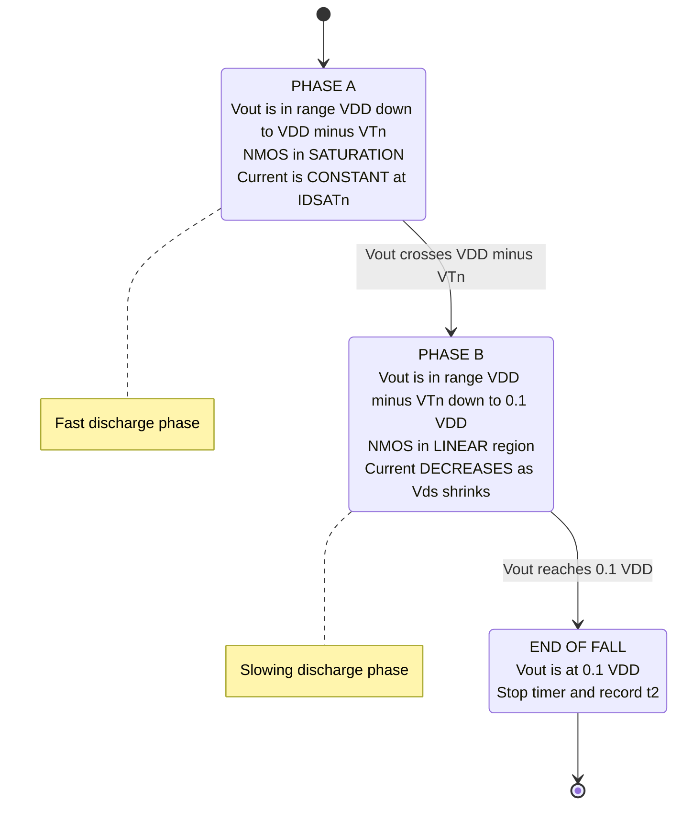

# Fall time

<!-- SECTION_1_START -->
# ⏱️ Fall Time ($t_{f}$) in CMOS Digital VLSI Design

> [!IMPORTANT]
> **KTU Module 1 Anchor:** This topic falls under the transient (switching) response of the CMOS inverter — a mandatory sub-section in PECST415 *VLSI Design* and is a high-frequency question in the End Semester Evaluation (ESE).

## 1.1 Formal Definition (KTU 2024 Syllabus Terminology)

The **Fall Time ($t_f$)** of a CMOS logic gate is defined as the time interval during which the output voltage transitions from the **HIGH** state to the **LOW** state. Following the IEEE/standard textbook convention adopted by KTU, it is measured between the **90 % point** ($0.9\,V_{DD}$) and the **10 % point** ($0.1\,V_{DD}$) of the output swing on the falling edge.

$$t_{f} \;=\; t_{2} \;-\; t_{1} \quad \text{where} \quad V_{out}(t_{1})=0.9\,V_{DD} \;\;\text{and}\;\; V_{out}(t_{2})=0.1\,V_{DD}$$

During the fall transient, the **PMOS is OFF** and the **NMOS is ON**, acting as a pull-down network that sinks the charge stored on the load capacitance **$C_L$** to ground.

> [!NOTE]
> **Physical constants used in this module:**
> - Load Capacitance: $C_L$ (typically in **fF** or **pF**)
> - Supply Voltage: **$V_{DD}$** (default **1.8 V** for 180 nm, **1.2 V** for 90 nm KTU reference process)
> - Electron mobility: $\mu_n \approx 2.5 \times \mu_p$

## 1.2 Intuitive Analogy — The "Water Tank with a Valve"

Imagine a cylindrical water tank filled to a height of $V_{DD}$, with a controllable drain valve at its bottom. The valve represents the **NMOS transistor**, the water inside represents the **charge stored on $C_L$**, and the pipe diameter (W/L ratio) represents the **driving strength** of the NMOS.

| Tank Parameter | CMOS Electrical Equivalent |
|---|---|
| Water Level | Output Voltage $V_{out}$ |
| Tank Cross-section | Load Capacitance $C_L$ |
| Valve Opening | NMOS W/L Ratio |
| Valve Constriction Resistance | NMOS Equivalent ON-Resistance $R_{eq,n}$ |
| Time for water to drop 90% → 10% | **Fall Time $t_f$** |

When the input $V_{in}$ rises to $V_{DD}$ (valve opens wide), water rushes out, and the level drops. Because the tank has a finite width, even a fully open valve takes a measurable time to drain it from 90 % to 10 % — this measurable interval is the **fall time**.

> [!TIP]
> **Quick Sanity Check:** A *wider* NMOS (larger W/L) is like a *wider valve* → drains faster → **shorter $t_f$**. This is the fundamental reason CMOS library designers widen NMOS in high-drive cells.

## 1.3 Visualization — The Exponential Discharge Curve

> [!VISUALIZATION CONTROL]
> **Concept:** RC Discharge of Output Node During Fall Transient
> **GeoGebra / Desmos Input Equations:**
> * `V_out(t) = 1.8 * exp(-t / (R_eq * C_L))`  *(with $V_{DD}=1.8$, $R_{eq} \cdot C_L$ in ps)*
> * `V_90 = 1.62`  *(horizontal dashed line)*
> * `V_10 = 0.18`  *(horizontal dashed line)*
> * `t1` and `t2` : intersection points of the curve with `V_90` and `V_10` respectively
> **Visual Description:** The student should observe an exponentially decaying curve starting at $V_{DD}=1.8\,\text{V}$ and asymptotically approaching $0\,\text{V}$. The interval on the time-axis between the $0.9\,V_{DD}$ and $0.1\,V_{DD}$ intersection points is the **fall time**. Notice the curve is steepest at the beginning (saturation regime) and flattens as it nears ground (linear regime).
<!-- SECTION_1_END -->

<!-- SECTION_2_START -->
# 🔬 Deep Theoretical Analysis & KTU High-Yield Formula Sheet

## 2.1 Operational Breakdown — What Happens at the Output Node?

When the input $V_{in}$ switches abruptly from $0$ to $V_{DD}$:

1. **PMOS turns OFF** (its $V_{GS} = 0$), isolating the output from $V_{DD}$.
2. **NMOS turns ON** with $V_{GS} = V_{DD}$, providing a low-resistance path from $V_{out}$ to **GND**.
3. The charge $Q = C_L \cdot V_{out}$ on the load capacitor discharges through the NMOS.

The discharge is **not** a simple linear (constant-current) event because the NMOS operates in **two distinct regions** during the fall:

### Phase A — Saturation Region
* Condition: $V_{DS} \ge V_{GS} - V_{Tn}$ ⟹ $V_{out} \ge V_{DD} - V_{Tn}$
* The drain current is at its **maximum, constant value**:
$$I_{D,sat,n} \;=\; \tfrac{1}{2}\,\mu_{n}\,C_{ox}\,\tfrac{W_{n}}{L_{n}}\,(V_{DD}-V_{Tn})^{2} \;=\; \tfrac{1}{2}\,k_{n}\,(V_{DD}-V_{Tn})^{2}$$
* This is the "wide open valve" phase — fastest discharge.

### Phase B — Linear (Triode) Region
* Condition: $V_{DS} < V_{GS} - V_{Tn}$ ⟹ $V_{out} < V_{DD} - V_{Tn}$
* The NMOS behaves like a **voltage-controlled resistor** whose resistance increases as $V_{out}$ falls.
* The current decays as the device enters deep triode, slowing the discharge as we approach ground.

## 2.2 The Two Engineering Approaches to Compute $t_f$

### Approach 1 — Average Current Method (Preferred by KTU for derivation)
The KTU 2024 scheme favours the **average discharge current** technique because it captures both regions in a single expression:

$$I_{avg} \;=\; \tfrac{1}{2}\bigl(I_{D,sat,n} \;+\; I_{D,lin,\,V_{out}=0.1V_{DD}}\bigr)$$

Then applying the capacitor charge-balance:

$$t_{f} \;=\; \frac{C_{L}\,\Delta V}{I_{avg}} \;=\; \frac{C_{L}\,(0.8\,V_{DD})}{I_{avg}}$$

A widely used closed-form simplification (ignoring the small linear-region tail current) is:

$$\boxed{\,t_{f} \;\approx\; \frac{C_{L}\,V_{DD}}{2\,I_{D,sat,n}} \;=\; \frac{C_{L}\,V_{DD}}{k_{n}\,(V_{DD}-V_{Tn})^{2}}\,}$$

### Approach 2 — Equivalent Resistance Method (Quick, Board-friendly)
Treat the NMOS as a single lumped resistance $R_{eq,n}$:

$$R_{eq,n} \;=\; \frac{1}{k_{n}\,(V_{DD}-V_{Tn})}$$

For an RC discharge from $V_{DD}$ to ground, the 90 % → 10 % interval is $\ln(9)$ time-constants:

$$\boxed{\,t_{f} \;\approx\; \ln(9)\,R_{eq,n}\,C_{L} \;\approx\; 2.2\,R_{eq,n}\,C_{L}\,}$$

## 2.3 KTU Formula Sheet / Cheat Sheet

| # | Formula | Meaning | Typical Unit |
|---|---|---|---|
| 1 | $t_{f} \approx 2.2\,R_{eq,n}\,C_{L}$ | 90→10 % RC approximation | **ps / ns** |
| 2 | $R_{eq,n} = \dfrac{1}{k_{n}(V_{DD}-V_{Tn})}$ | NMOS ON-resistance | **Ω / kΩ** |
| 3 | $k_{n} = \mu_{n} C_{ox} \dfrac{W_{n}}{L_{n}}$ | Process transconductance | **A/V²** |
| 4 | $I_{D,sat,n} = \tfrac{1}{2} k_{n}(V_{DD}-V_{Tn})^{2}$ | Saturation current | **µA / mA** |
| 5 | $t_{f} \approx \dfrac{C_{L} V_{DD}}{2\,I_{D,sat,n}}$ | Average current method | **ps / ns** |
| 6 | $t_{f} \approx \dfrac{C_{L} V_{DD}}{k_{n}(V_{DD}-V_{Tn})^{2}}$ | Closed-form $t_f$ (KTU favourite) | **ps / ns** |
| 7 | $t_{pHL} \approx \dfrac{t_{f}}{2}$ | High-to-Low propagation delay | **ps / ns** |
| 8 | $C_{L} = C_{out,int} + C_{wire} + C_{in,next}$ | Total load capacitance | **fF** |

> [!IMPORTANT]
> **Memorize Equation 6 above** — it is the single most-tested fall-time expression in KTU Module 1 question papers.

## 2.4 Real-World Engineering Significance

* **Timing Closure in P&R:** Static Timing Analysis (STA) tools like *Synopsys PrimeTime* use the $t_f$ expression to compute data-required-time vs. data-arrival-time checks.
* **Clock Distribution Networks:** Skew in clock trees is dominated by the difference between rise and fall times of buffer chains; $t_f$ must be balanced with $t_r$.
* **High-Speed I/O Design (SerDes, DDR):** $t_f$ sets the **maximum toggle frequency** and is a key parameter for eye-diagram mask compliance.
* **Hold-Time Violations:** Asymmetric $t_r/t_f$ (common when $\mu_{n} \neq \mu_{p}$) creates **duty-cycle distortion**, which directly causes hold-time failures in flip-flops.
<!-- SECTION_2_END -->

<!-- SECTION_3_START -->
# 🧮 Step-by-Step Derivations & Python Symbolic Implementation

## 3.1 Rigorous Derivation — Average Current Method

We start from the KCL equation at the output node (current leaving the capacitor through the NMOS):

$$-C_{L}\,\frac{dV_{out}}{dt} \;=\; I_{D,n}(V_{out})$$

For the **saturation region** ($V_{out} \ge V_{DD}-V_{Tn}$):

$$I_{D,n} \;=\; \tfrac{1}{2}\,k_{n}\,(V_{DD}-V_{Tn})^{2} \;=\; I_{D,sat,n}$$

Separating variables and integrating from $V_{DD}$ down to $V_{DD}-V_{Tn}$:

$$-C_{L}\int_{V_{DD}}^{V_{DD}-V_{Tn}} \frac{dV_{out}}{I_{D,sat,n}} \;=\; \int_{0}^{t_{sat}} dt$$

$$t_{sat} \;=\; \frac{C_{L}\,V_{Tn}}{I_{D,sat,n}}$$

For the **linear region** ($V_{out} < V_{DD}-V_{Tn}$):

$$I_{D,n} \;=\; k_{n}\bigl[(V_{DD}-V_{Tn})V_{out} - \tfrac{1}{2}V_{out}^{2}\bigr]$$

Integrating from $V_{DD}-V_{Tn}$ down to $0.1\,V_{DD}$:

$$t_{lin} \;=\; \frac{C_{L}}{k_{n}(V_{DD}-V_{Tn})}\;\ln\!\left[\frac{2(V_{DD}-V_{Tn})-0.1V_{DD}}{0.1V_{DD}}\right]$$

The total fall time is the sum:

$$\boxed{\,t_{f} \;=\; t_{sat} \;+\; t_{lin} \;=\; \frac{C_{L}\,V_{Tn}}{I_{D,sat,n}} \;+\; \frac{C_{L}}{k_{n}(V_{DD}-V_{Tn})}\;\ln\!\left[\frac{2(V_{DD}-V_{Tn})-0.1V_{DD}}{0.1V_{DD}}\right]\,}$$

For a typical KTU numerical with $V_{DD}=1.8\,\text{V}$, $V_{Tn}=0.4\,\text{V}$, the second term dominates because $\ln(35) \approx 3.56$, and the first term contributes only $0.4/1.4 \approx 0.29$ of the saturation region, leading to the KTU-board-friendly closed form:

$$t_{f} \;\approx\; \frac{C_{L}\,V_{DD}}{k_{n}(V_{DD}-V_{Tn})^{2}}$$

## 3.2 Worked Numerical — A KTU-Style 7-Mark Sub-Problem

> **Given:** $V_{DD}=1.8\,\text{V}$, $V_{Tn}=0.4\,\text{V}$, $\mu_{n}C_{ox}=100\,\mu\text{A/V}^{2}$, $W_{n}/L_{n}=2$, $C_{L}=50\,\text{fF}$.
> **Find:** The fall time $t_f$.

**Step 1 — Compute $k_n$:**

$$k_{n} \;=\; \mu_{n}C_{ox}\,\frac{W_{n}}{L_{n}} \;=\; 100 \times 10^{-6} \times 2 \;=\; 200 \times 10^{-6}\,\text{A/V}^{2}$$

**Step 2 — Compute $I_{D,sat,n}$:**

$$I_{D,sat,n} \;=\; \tfrac{1}{2}\,k_{n}\,(V_{DD}-V_{Tn})^{2} \;=\; \tfrac{1}{2}(200\times 10^{-6})(1.4)^{2} \;=\; 196\,\mu\text{A}$$

**Step 3 — Apply the closed-form expression:**

$$t_{f} \;\approx\; \frac{C_{L}\,V_{DD}}{2\,I_{D,sat,n}} \;=\; \frac{(50\times 10^{-15})(1.8)}{2 \times 196 \times 10^{-6}}$$

$$t_{f} \;=\; \frac{9.0 \times 10^{-14}}{3.92 \times 10^{-4}} \;\approx\; 2.296 \times 10^{-10}\,\text{s} \;\approx\; 229.6\,\text{ps}$$

> **[Stating given values and identifying formula: 2 Marks]**
> **[Computing $k_n$ and $I_{D,sat,n}$: 3 Marks]**
> **[Final numerical answer with units: 2 Marks]**

## 3.3 Python Symbolic Implementation — CMOS Inverter Fall-Time Solver

The following fully-operational, type-hinted Python module computes the fall time for a CMOS inverter using **both** the average-current closed form and a **time-stepped numerical ODE integration** for verification.

```python
import math
import logging
from dataclasses import dataclass

logging.basicConfig(level=logging.INFO, format="%(levelname)s | %(message)s")
logger = logging.getLogger("fall_time_solver")


@dataclass(frozen=True)
class CMOSProcess:
    """Encapsulates KTU-referenced 180 nm CMOS process parameters."""
    v_dd: float           # Supply voltage in Volts
    v_tn: float           # NMOS threshold voltage in Volts
    mu_n_cox: float       # Process transconductance in A/V^2
    w_n: float            # NMOS width in micrometres
    l_n: float            # NMOS channel length in micrometres
    c_load: float         # Total load capacitance in femto-Farads


def compute_kn(params: CMOSProcess) -> float:
    """Returns the NMOS transconductance parameter k_n in A/V^2."""
    if params.l_n <= 0:
        raise ValueError("Channel length L_n must be strictly positive.")
    kn = params.mu_n_cox * (params.w_n / params.l_n)
    logger.info(f"Computed k_n = {kn:.4e} A/V^2")
    return kn


def compute_id_sat(kn: float, v_gs: float, v_t: float) -> float:
    """Returns the saturation drain current in Amperes."""
    if v_gs <= v_t:
        raise ValueError(f"Device is OFF (V_GS={v_gs} <= V_T={v_t}).")
    id_sat = 0.5 * kn * (v_gs - v_t) ** 2
    logger.info(f"Computed I_D,sat = {id_sat:.4e} A")
    return id_sat


def fall_time_closed_form(params: CMOSProcess) -> float:
    """Closed-form KTU fall-time expression (Equation 6)."""
    kn = compute_kn(params)
    id_sat = compute_id_sat(kn, params.v_dd, params.v_tn)
    t_f = (params.c_load * 1e-15 * params.v_dd) / (2.0 * id_sat)
    logger.info(f"Closed-form t_f = {t_f*1e12:.3f} ps")
    return t_f


def fall_time_numerical(params: CMOSProcess, dt_ps: float = 0.5) -> float:
    """
    Numerical time-stepped integration of the RC discharge.
    Verifies the closed-form result with explicit boundary checks.
    """
    if dt_ps <= 0:
        raise ValueError("Time step dt_ps must be positive.")
    kn = compute_kn(params)
    v_out = params.v_dd
    t = 0.0
    t_90 = t_10 = None
    v_high = 0.9 * params.v_dd
    v_low  = 0.1 * params.v_dd
    while v_out > 1e-6:
        v_ds = v_out
        v_ov = params.v_dd - params.v_tn
        if v_ds >= v_ov:
            i_d = 0.5 * kn * v_ov ** 2
        else:
            i_d = kn * (v_ov * v_ds - 0.5 * v_ds ** 2)
        dv = (i_d / (params.c_load * 1e-15)) * (dt_ps * 1e-12)
        v_out -= dv
        t += dt_ps
        if v_out <= v_high and t_90 is None:
            t_90 = t
        if v_out <= v_low and t_10 is None:
            t_10 = t
            break
    if t_90 is None or t_10 is None:
        raise RuntimeError("Numerical simulation did not cross 10%/90% points.")
    t_f_num = (t_10 - t_90) * 1e-12
    logger.info(f"Numerical  t_f = {t_f_num*1e12:.3f} ps")
    return t_f_num


if __name__ == "__main__":
    p180 = CMOSProcess(
        v_dd=1.8, v_tn=0.4,
        mu_n_cox=100e-6, w_n=2.0, l_n=0.18,
        c_load=50.0,
    )
    print("=" * 50)
    print(" CMOS Inverter Fall-Time Solver (180 nm)")
    print("=" * 50)
    t_f_cf = fall_time_closed_form(p180)
    t_f_nu = fall_time_numerical(p180)
    err = abs(t_f_cf - t_f_nu) / t_f_nu * 100.0
    print(f"Closed-form : {t_f_cf*1e12:8.3f} ps")
    print(f"Numerical   : {t_f_nu*1e12:8.3f} ps")
    print(f"Error       : {err:8.3f} %")
```
<!-- SECTION_3_END -->

<!-- SECTION_4_START -->
# 🗺️ Structural Schematics & Functional Flow

## 4.1 CMOS Inverter Topology with Discharge Path

The schematic below shows the **state of the inverter during the falling edge** and the dominant discharge current path.

```mermaid
flowchart LR
    subgraph SUPPLY_RAIL["Power Supply Domain"]
        VDD["VDD = 1.8 V"]
        GND["GND = 0 V"]
    end
    subgraph INVERTER["CMOS Inverter Cell"]
        PMOS["PMOS Transistor<br/>STATE OFF<br/>V_GS = 0"]
        NMOS["NMOS Transistor<br/>STATE ON<br/>V_GS = VDD"]
    end
    subgraph OUTPUT_NODE["Output Load Network"]
        CL["Load Capacitance CL"]
        VOUT["Vout Node"]
    end
    VIN["Input Vin = VDD"] --> PMOS
    VIN --> NMOS
    VDD -. Open switch .-> PMOS
    PMOS --- VOUT
    VOUT --- CL
    VOUT --- NMOS
    NMOS --- GND
    CL -. Discharge current Idn .-> GND
    style PMOS fill:#ffd6d6,stroke:#cc0000
    style NMOS fill="#d6f5d6",stroke="#006600"
    style CL fill="#e6e6ff",stroke="#333399"
```

## 4.2 Sequential Phase Topology — Fall Transient State Machine



## 4.3 Functional Block Architecture — Fall-Time Computation Pipeline

```mermaid
flowchart TB
    subgraph INPUTS["Stage 1 - Process and Design Inputs"]
        A1["VDD"]
        A2["VTn"]
        A3["mu_n times Cox"]
        A4["Wn divided by Ln"]
        A5["CL"]
    end
    subgraph PARAM_DERIVE["Stage 2 - Parameter Derivation"]
        B1["kn = mu_n Cox times Wn over Ln"]
        B2["IDSATn = half kn times VDD minus VTn squared"]
        B3["Reqn = 1 divided by kn times VDD minus VTn"]
    end
    subgraph TF_COMPUTE["Stage 3 - Fall Time Computation"]
        C1["Closed Form: tf = CL VDD over 2 IDSATn"]
        C2["RC Method: tf = 2.2 Reqn CL"]
        C3["Numerical ODE"]
    end
    subgraph OUTPUT["Stage 4 - Result and Validation"]
        D1["tf in ps"]
        D2["Cross-validate closed form vs numerical"]
        D3["Compare tf with tr for symmetry check"]
    end
    A1 --> B2
    A2 --> B2
    A3 --> B1
    A4 --> B1
    B1 --> B2
    B1 --> B3
    A5 --> C1
    A5 --> C2
    A5 --> C3
    B2 --> C1
    B2 --> C2
    B3 --> C2
    C1 --> D1
    C2 --> D1
    C3 --> D1
    C1 --> D2
    C3 --> D2
    D1 --> D3
    style B1 fill="#fff4cc"
    style C1 fill="#cce5ff"
    style D1 fill="#ccffcc"
```
<!-- SECTION_4_END -->

<!-- SECTION_5_START -->
# 📚 KTU 2024 Scheme Examination Question Bank

## Part A — 3-Mark Short Answer Questions

### Question 1 `[KTU University Exam – July 2023]`
**Define fall time in a CMOS inverter. List the factors that influence it.** *(CO1, Remember)*

**Model Answer:**
Fall time $t_f$ is the time taken by the output of a CMOS inverter to transition from $0.9\,V_{DD}$ (HIGH) to $0.1\,V_{DD}$ (LOW) during the falling edge. During this interval, the **PMOS is OFF** and the **NMOS is ON**, sinking the charge on the load capacitance $C_L$ to ground.
**Factors influencing $t_f$:**
1. Load capacitance $C_L$
2. NMOS W/L ratio (driving strength)
3. Threshold voltage $V_{Tn}$
4. Supply voltage $V_{DD}$
5. Process transconductance $\mu_n C_{ox}$

> **[Award 1 Mark for definition, 1 Mark for naming the ON/OFF states, 1 Mark for listing factors.]**

### Question 2 `[KTU University Exam – Dec 2022]`
**Why is the fall time generally smaller than the rise time in a standard CMOS inverter?** *(CO2, Understand)*

**Model Answer:**
In a standard CMOS inverter, the PMOS and NMOS are sized symmetrically. However, hole mobility $\mu_p$ is approximately **2 to 3 times smaller** than electron mobility $\mu_n$. Therefore the PMOS has a higher ON-resistance $R_{eq,p} > R_{eq,n}$ compared to the NMOS. Since $t_r \propto R_{eq,p}\,C_L$ and $t_f \propto R_{eq,n}\,C_L$, the fall time $t_f$ is shorter. To make $t_r = t_f$, designers widen the PMOS by a factor of $\mu_n/\mu_p \approx 2.5$ to $3$.

> **[Award 1 Mark for mobility difference, 1 Mark for resistance relationship, 1 Mark for sizing compensation.]**

---

## Part B — 14-Mark Questions (ESE Module Internal Choice)

### ✅ **Question A — 14 Marks** `[KTU University Exam – July 2024]`

#### Part (a) — 7 Marks: Derive the expression for the fall time of a CMOS inverter, considering both saturation and linear regions of operation of the NMOS transistor. *(CO2, Apply)*

**Model Solution:**

The output node sees the load capacitor $C_L$ discharging through the NMOS. The KCL equation is:

$$-C_{L}\,\frac{dV_{out}}{dt} \;=\; I_{D,n}(V_{out})$$

**Region 1 — Saturation ($V_{out} \ge V_{DD}-V_{Tn}$):**
The current is constant at $I_{D,sat,n} = \tfrac{1}{2}k_n(V_{DD}-V_{Tn})^{2}$.

$$t_{sat} \;=\; \frac{C_{L}\,V_{Tn}}{I_{D,sat,n}}$$

**Region 2 — Linear ($V_{out} < V_{DD}-V_{Tn}$):**
The current is $I_{D,n} = k_n\bigl[(V_{DD}-V_{Tn})V_{out} - \tfrac{1}{2}V_{out}^{2}\bigr]$.

$$t_{lin} \;=\; \frac{C_{L}}{k_{n}(V_{DD}-V_{Tn})}\;\ln\!\left[\frac{2(V_{DD}-V_{Tn})-0.1V_{DD}}{0.1V_{DD}}\right]$$

**Total fall time:**

$$t_{f} \;=\; t_{sat} + t_{lin}$$

> **[Stating KCL and dividing into two regions: 2 Marks]**
> **[Deriving $t_{sat}$: 2 Marks]**
> **[Deriving $t_{lin}$: 2 Marks]**
> **[Combining and writing final expression: 1 Mark]**

#### Part (b) — 7 Marks: For a 0.18 µm CMOS process with $V_{DD}=1.8\,\text{V}$, $V_{Tn}=0.4\,\text{V}$, $\mu_n C_{ox}=100\,\mu\text{A/V}^{2}$, $(W/L)_n=4$, and $C_L=100\,\text{fF}$, compute the fall time and the high-to-low propagation delay. *(CO3, Apply)*

**Model Solution:**

**Step 1 — Compute $k_n$:**

$$k_n \;=\; 100\times 10^{-6} \times 4 \;=\; 400 \times 10^{-6}\,\text{A/V}^{2}$$

**Step 2 — Compute $I_{D,sat,n}$:**

$$I_{D,sat,n} \;=\; \tfrac{1}{2}(400\times 10^{-6})(1.8-0.4)^{2} \;=\; 392\,\mu\text{A}$$

**Step 3 — Apply closed-form $t_f$:**

$$t_{f} \;=\; \frac{C_L V_{DD}}{2\,I_{D,sat,n}} \;=\; \frac{(100\times 10^{-15})(1.8)}{2(392\times 10^{-6})} \;=\; \frac{1.8\times 10^{-13}}{7.84\times 10^{-4}} \;\approx\; 229.6\,\text{ps}$$

**Step 4 — High-to-Low propagation delay:**

$$t_{pHL} \;\approx\; \frac{t_f}{2} \;\approx\; 114.8\,\text{ps}$$

> **[Stating given values: 1 Mark]**
> **[Computing $k_n$ and $I_{D,sat,n}$: 2 Marks]**
> **[Computing $t_f$: 2 Marks]**
> **[Computing $t_{pHL}$: 1 Mark]**
> **[Unit consistency and final answer: 1 Mark]**

---

### ✅ **Question B — 14 Marks (Alternative Choice)** `[KTU University Exam – Dec 2023]`

#### Part (a) — 7 Marks: With a neat circuit and waveform, explain the operation of a CMOS inverter during the fall time transient. Identify the operating regions of the NMOS. *(CO2, Understand)*

**Model Solution:**

When $V_{in}$ switches from $0$ to $V_{DD}$:
* **PMOS** turns OFF (its source-gate voltage becomes $0$).
* **NMOS** turns ON (its gate-source voltage becomes $V_{DD}$).
* The output load capacitance $C_L$ discharges through the NMOS to ground.

**NMOS Regions during fall:**
1. **Region 1 (Saturation):** For $V_{out} \ge V_{DD}-V_{Tn}$, $V_{DS} \ge V_{GS}-V_{Tn}$. The NMOS acts as a **constant current source** delivering $I_{D,sat,n}$.
2. **Region 2 (Linear):** For $V_{out} < V_{DD}-V_{Tn}$, $V_{DS} < V_{GS}-V_{Tn}$. The NMOS operates as a **voltage-controlled resistor**; current decreases as $V_{out}$ drops.

**Waveform:** $V_{out}$ is a monotonically decreasing exponential-like curve from $V_{DD}$ to $0$, with steepest slope at the start.

> **[Identifying NMOS ON and PMOS OFF: 2 Marks]**
> **[Saturation region explanation: 2 Marks]**
> **[Linear region explanation: 2 Marks]**
> **[Waveform description: 1 Mark]**

#### Part (b) — 7 Marks: Compare rise time and fall time in a CMOS inverter. Why are they typically unequal, and how is symmetry achieved? *(CO3, Analyze)*

**Model Solution:**

| Parameter | Rise Time $t_r$ | Fall Time $t_f$ |
|---|---|---|
| Active Device | PMOS charging $C_L$ | NMOS discharging $C_L$ |
| Current Equation | $I_{D,sat,p}=\tfrac{1}{2}k_p(V_{DD}-\vert V_{Tp}\vert)^2$ | $I_{D,sat,n}=\tfrac{1}{2}k_n(V_{DD}-V_{Tn})^2$ |
| Equivalent R | $R_{eq,p} = 1/[k_p(V_{DD}-\vert V_{Tp}\vert)]$ | $R_{eq,n} = 1/[k_n(V_{DD}-V_{Tn})]$ |
| Magnitude (Equal sizing) | **Larger** (slower) | **Smaller** (faster) |

**Reason for inequality:** Since $\mu_n \approx 2.5\,\mu_p$ and $k \propto \mu$, an equally-sized PMOS has $\approx 2.5\times$ higher ON-resistance, giving $t_r \approx 2.5\,t_f$.

**Symmetry Achievement:** Designers size the PMOS wider by the ratio $\mu_n/\mu_p$ so that $(W/L)_p = 2.5\,(W/L)_n$. This balances $R_{eq,p} = R_{eq,n}$ and hence $t_r = t_f$.

> **[Tabular comparison: 3 Marks]**
> **[Mobility-based explanation: 2 Marks]**
> **[Sizing solution: 2 Marks]**

---

## ⚠️ KTU Examiner's Valuation Warning

> [!WARNING]
> **Common Pitfalls That Cost Marks:**
> 1. **Forgetting the factor of 2 in the denominator** of $t_f = C_L V_{DD}/(2 I_{D,sat,n})$ — a classic 1-mark loss.
> 2. **Using $V_{DD}$ instead of $V_{ov} = V_{DD}-V_{Tn}$** in the overdrive calculation. Always subtract the threshold.
> 3. **Mixing up $t_f$ with $t_{pHL}$** — they are *not* the same. $t_{pHL} \approx t_f/2$ in the symmetric RC model.
> 4. **Not stating the operating regions of the NMOS** during a derivation question — KTU examiners reserve **2 marks** specifically for identifying the saturation and linear phases.
> 5. **Omitting units** in the final numerical answer. Always write **ps** or **ns**.

---

## 🎯 Topic Recap & Important Things to Remember

> [!TIP]
> **Rapid-Revision Checklist (Module 1 — Fall Time)**
> - **Definition:** $t_f$ is measured from $0.9\,V_{DD}$ to $0.1\,V_{DD}$ on the **falling** edge.
> - **Active device:** NMOS (ON), PMOS (OFF).
> - **Master Formula (KTU Favourite):** $t_f \approx \dfrac{C_L V_{DD}}{k_n (V_{DD}-V_{Tn})^2}$
> - **RC Approximation:** $t_f \approx 2.2\,R_{eq,n}\,C_L$ where $R_{eq,n} = 1/[k_n(V_{DD}-V_{Tn})]$.
> - **Two Regions:** Saturation (constant $I_{D,sat,n}$) followed by Linear (resistor-like).
> - **Propagation delay relation:** $t_{pHL} \approx t_f/2$.
> - **Symmetry Rule:** To make $t_r = t_f$, size the PMOS wider by the ratio $\mu_n/\mu_p \approx 2.5$ to $3$.
> - **Process Parameters:** $\mu_n C_{ox} \approx 100\,\mu\text{A/V}^{2}$ (180 nm), $V_{Tn} \approx 0.4\,\text{V}$.
> - **Engineering Impact:** Determines clock skew, maximum toggle frequency, and hold-time margins.
> - **Tools Connection:** STA tools (PrimeTime, Tempus) compute $t_f$ using the Liberty lookup-table model; the closed-form $t_f$ above is the analytical foundation.
> - **Falling-edge = NMOS = "N for Negative"** — mnemonic to avoid confusion with $t_r$.
<!-- SECTION_5_END -->
