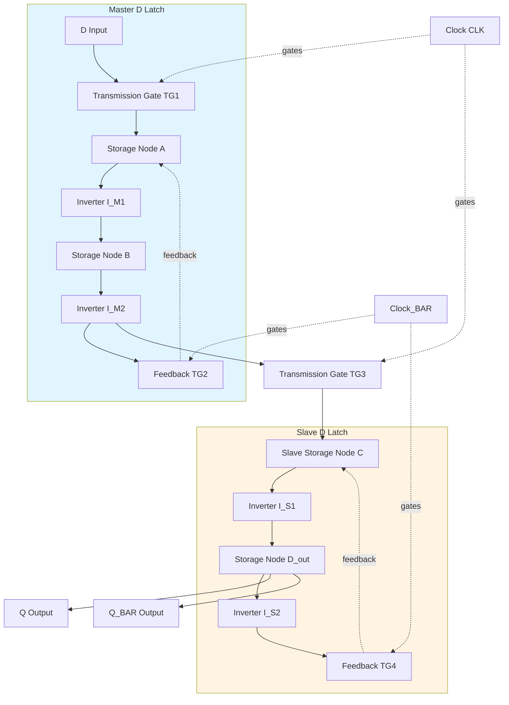
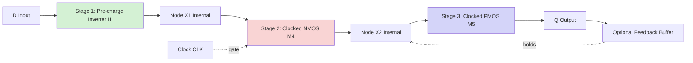
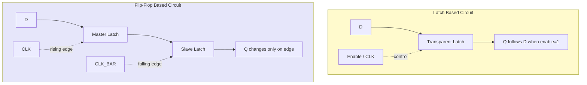
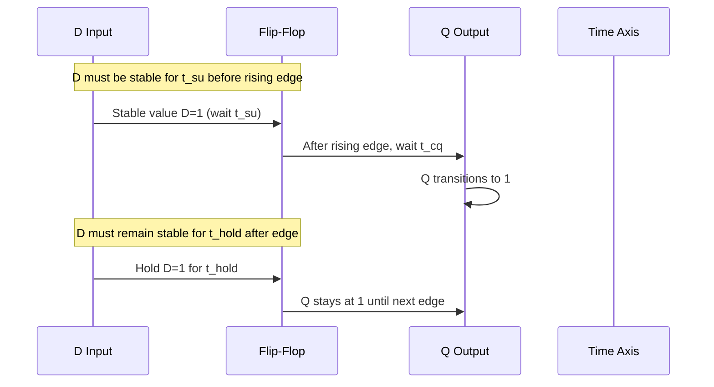
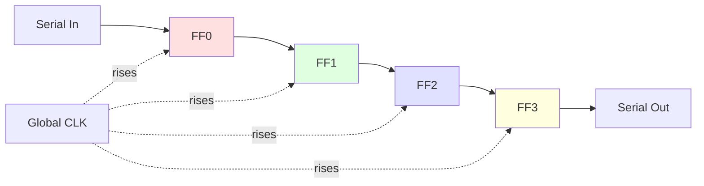

# flip-flops and latches

<!-- SECTION_1_START -->
# Flip-Flops and Latches — CMOS Sequential Storage Elements

## 1.1 Formal Definition (KTU 2024 Scheme Terminology)

A **latch** is a level-sensitive bistable memory element that is transparent when the enable (clock) signal is active and holds its output when the enable is de-asserted. A **flip-flop** is an edge-triggered bistable element that samples its input only on the active transition (rising or falling edge) of the clock and maintains the sampled value between transitions.

In the context of CMOS VLSI design, latches and flip-flops form the foundation of all **sequential digital circuits**, including registers, shift registers, counters, FIFOs, and pipeline stages in microprocessors and ASICs.

> [!IMPORTANT]
> **KTU Board Exam Focus:** Every latch and flip-flop in CMOS is *physically* built from a **cross-coupled inverter pair** (a 1-bit static memory cell) plus a controlled write/refresh network. The write control uses the clock (CLK) and an input driver stage.

> [!NOTE]
> **Latches vs. Flip-Flops — The Golden Rule**
> - **Latch (Level-Sensitive):** Output = Input while CLK = 1 (transparent), Output = Held value when CLK = 0 (opaque).
> - **Flip-Flop (Edge-Triggered):** Output changes only at the rising/falling edge of CLK. Immune to glitches while CLK is stable.

## 1.2 Intuitive Analogies (Plain English)

**Analogy 1 — The Bathroom Door (Latch):** Imagine a spring-loaded bathroom door. When you push it (CLK = 1, "transparent"), whoever is on the other side can walk in (input flows to output). The moment the door is released (CLK = 0, "opaque"), the door latches shut and *no new person can enter* — only the last person inside stays. The latch "remembers" the last person while the door is closed.

**Analogy 2 — The Photographic Snapshot (Flip-Flop):** A flip-flop behaves like a camera. The shutter opens only at the *exact instant* the photographer clicks (the clock edge). Whatever scene is in front of the lens at that microsecond is captured and frozen on the film. Even if the scene changes, the photograph (output) remains unchanged until the next click (next clock edge).

## 1.3 Physical Constants & Standard Metrics

The following metrics are critical for any CMOS sequential element and are graded in KTU examinations:

- **Static Power:** Power consumed when the cell is idle (ideally **0 W** for CMOS).
- **Dynamic Power:** $P_{dyn} = \alpha \cdot C_L \cdot V_{DD}^{2} \cdot f_{CLK}$
- **Setup Time ($t_{su}$):** Minimum time the data input must be stable *before* the active clock edge.
- **Hold Time ($t_{hold}$):** Minimum time the data input must be stable *after* the active clock edge.
- **Clock-to-Q Delay ($t_{cq}$):** Time from the active clock edge to the output change.
- **Contamination Delay ($t_{ccq}$):** Minimum time for the output to begin changing after the clock edge.

> [!NOTE]
> **Industry Standard (2024):** In modern sub-10 nm CMOS, $t_{su}$ and $t_{hold}$ are typically in the range of **10–50 ps**, while $t_{cq}$ is around **20–80 ps**. Designers trade off these parameters against clock frequency.

> [!VISUALIZATION CONTROL]
> **Concept:** Timing diagram of a positive-edge-triggered D flip-flop
> **Visual Description:** On a horizontal time axis, draw CLK as a square wave (0 → 1 → 0 → 1). Mark the *rising edges* with red dots. The D input is a square wave that changes value between edges. The Q output transitions to match D *only* at the rising edges of CLK. Between edges, Q remains constant. Show the timing intervals $t_{su}$ (D stable before edge), $t_{hold}$ (D stable after edge), and $t_{cq}$ (CLK edge to Q change).
> **Desmos/Graph Input:** Plot step functions: `CLK = 1 for t in [0,1) U [2,3)`, `D = 1 for t in [0,0.4) U [0.9,2.2) U [2.7,3)`, `Q = step at t=0.4 then 0 step at t=2.2`.

<!-- SECTION_1_END -->

<!-- SECTION_2_START -->
# Deep Theoretical Analysis & KTU High-Yield Formula Sheet

## 2.1 Core Architecture of a CMOS Bistable

Every CMOS latch and flip-flop has three fundamental functional blocks:

1. **Storage Core:** A cross-coupled inverter pair (two CMOS inverters $I_1$ and $I_2$ connected in a positive-feedback loop). The static storage node holds the bit.
2. **Write/Refresh Network:** A pair of transmission gates (TG) or tristate inverters controlled by CLK and $\overline{CLK}$. This network connects the input D to the internal storage node during the transparent phase.
3. **Output Buffer:** An optional inverter (or two) to provide rail-to-rail output drive and isolate the storage node from capacitive loading.

The positive feedback equation for the cross-coupled pair ensures bistability. If we denote the loop gain as $G_{loop}$ and the DC gain of each inverter as $A_V$, then for **stable memory**:

$$G_{loop} = A_V^2 > 1$$

This guarantees that any perturbation grows and the cell snaps to one of the two stable states ($V_{OH}$ or $V_{OL}$).

## 2.2 Types of Latches (with CMOS Implementation Variants)

### 2.2.1 Static CMOS SR Latch (NOR-based)

| Signal Pair | Behavior | CMOS Realization |
|---|---|---|
| S=1, R=0 | Set: Q → 1, $\overline{Q}$ → 0 | Two cross-coupled NOR gates |
| S=0, R=1 | Reset: Q → 0, $\overline{Q}$ → 1 | Two cross-coupled NOR gates |
| S=0, R=0 | Hold previous state | Two cross-coupled NOR gates |
| S=1, R=1 | **Forbidden** (both outputs 0) | NEVER ALLOWED in CMOS |

**Transistor count:** 4 (in the NOR gates), but adds input inverters → **8 transistors total** in pure static form.

### 2.2.2 Static CMOS D Latch (Transmission-Gate Based)

This is the **most important CMOS latch** for KTU.

- **Transistors:** **6** (2 for the input inverter, 4 for the two transmission gates).
- **Topology:** Two back-to-back inverters form the storage cell. A transmission gate TG1 (gated by CLK, $\overline{CLK}$) passes D into the storage node when CLK = 1. A feedback transmission gate TG2 (gated by $\overline{CLK}$, CLK) closes the feedback loop only when CLK = 0, *strengthening* the stored value.

### 2.2.3 Dynamic CMOS D Latch

- **Transistors:** **4** (2 for input driver inverter, 2 for the single transmission gate).
- **Operation:** When CLK = 1, D is written to a *parasitic capacitance* at the storage node. When CLK = 0, the storage capacitance holds the value. No DC path exists, so static power is **zero**.
- **Drawback:** Charge leakage; the cell must be refreshed (typically every **< 1 ms** at 25°C in 28 nm CMOS).

### 2.2.4 C²MOS (Clocked CMOS) D Latch

- **Transistors:** **6** (master-slave, two clocked inverters).
- **Benefit:** Single-phase clock; ratioless design; insensitive to clock overlap if sized correctly.

## 2.3 Flip-Flop Topologies

A **master-slave configuration** converts any latch into a flip-flop by cascading two latches with *complementary* clock phases.

| Topology | Transistor Count | Pros | Cons |
|---|---|---|---|
| Static Master-Slave D-FF | 12 + 2 (inverters) | Robust, no leakage issue | Higher area, higher power |
| C²MOS Master-Slave D-FF | 8 | Compact, single clock | Sensitive to clock skew |
| Dynamic C²MOS D-FF | 6 + 2 | Fastest, low power | Needs refresh; min clock freq |
| TSPC (True Single-Phase Clock) D-FF | 11 | No $\overline{CLK}$ needed; very compact | Clock load, tricky design |
| Pulse-Triggered (Hybrid Latch) D-FF | ~12 | Very fast, small setup time | Complex pulse generator |

## 2.4 KTU High-Yield Formula Sheet

| Parameter | Equation | Units | KTU Board Tip |
|---|---|---|---|
| Loop gain for bistability | $G_{loop} = A_{V1} \cdot A_{V2} > 1$ | dimensionless | Must be >1 for noise immunity |
| Minimum inverter gain | $A_{V,min} = 1$ | dimensionless | V-shaped transfer curve condition |
| Setup time (approx) | $t_{su} \approx \dfrac{V_{tn} \cdot C_{L,in}}{I_{drive}}$ | seconds | Lower $t_{su}$ requires larger driver |
| Hold time (approx) | $t_{hold} \approx \dfrac{C_{int} \cdot \Delta V}{I_{leak}}$ | seconds | Often **0** in modern design |
| Clock-to-Q delay | $t_{cq} = t_{pd,internal} + t_{pd,buffer}$ | seconds | Sum of internal + buffer delays |
| Dynamic power | $P_{dyn} = \alpha \cdot C_{L} \cdot V_{DD}^{2} \cdot f$ | watts | $\alpha$ = switching activity |
| Static power | $P_{stat} = I_{leak} \cdot V_{DD}$ | watts | Dominated by subthreshold leakage |
| Energy per transition | $E = C_{L} \cdot V_{DD}^{2}$ | joules | Fundamental CMOS energy limit |
| Maximum clock frequency | $f_{max} = \dfrac{1}{t_{cq} + t_{su} + t_{logic,max}}$ | Hz | Skew must be $<$ $t_{hold}$ |
| TSPC pulse width | $T_{pulse} \leq t_{pd,INV} + t_{pd,TG}$ | seconds | Self-timed; no explicit pulse gen |
| CMOS inverter gain | $A_V = -g_{mn} \cdot (r_{on,n} \parallel r_{on,p})$ | dimensionless | Maximize $g_m$ for sharp VTC |
| Noise margin (low) | $NM_L = V_{IL} - V_{OL}$ | volts | Must exceed **0.2 V$_{DD}$** |

> [!IMPORTANT]
> **Critical KTU Board Pitfall:** The equation $A_V^2 > 1$ for the cross-coupled inverters is a *necessary* but *not sufficient* condition for static memory. The inverters must also have a **regenerative operating point** (the VTC curve must cross the line $V_{out} = V_{in}$ at three points: two stable, one metastable). Failure to state this often costs **2 marks**.

## 2.5 Real-World Engineering Utility

- **Processors:** Each pipeline stage in a CPU contains **tens of thousands** of flip-flops. A modern 64-bit superscalar core uses **> 100,000 flip-flops**.
- **Memory:** SRAM cells in caches are essentially cross-coupled inverters with write word-line transistors (the same topology as a static D latch).
- **Communication:** SerDes (Serializer/Deserializer) chips use TSPC flip-flops at multi-GHz data rates.
- **IoT Sensors:** Ultra-low-power designs use *retention flip-flops* with a separate, lower $V_{DD}$ for the storage cell to reduce leakage by **100×** in sleep mode.

<!-- SECTION_2_END -->

<!-- SECTION_3_START -->
# Step-by-Step Derivations & CMOS Implementation Details

## 3.1 Derivation: Minimum Inverter Gain for Static Memory (Regenerative Feedback)

Consider two identical CMOS inverters in a positive-feedback loop, with the DC transfer characteristic $V_{out} = f(V_{in})$. The small-signal loop gain around the loop must exceed unity for the cell to snap to a stable state.

Let $v_{in,1}$ be a small perturbation at the input of inverter 1. The output of inverter 1 becomes:

$$v_{out,1} = -A_V \cdot v_{in,1}$$

This feeds the input of inverter 2:

$$v_{out,2} = -A_V \cdot v_{out,1} = (-A_V)(-A_V \cdot v_{in,1}) = A_V^{2} \cdot v_{in,1}$$

The voltage at $v_{in,1}$ after the loop is $A_V^{2} \cdot v_{in,1}$. For any perturbation to be **amplified** (regenerative) and drive the cell to a rail, we require:

$$A_V^{2} \cdot v_{in,1} > v_{in,1} \implies A_V^{2} > 1 \implies \vert A_V \vert > 1$$

Since $A_V$ is negative for a CMOS inverter, the magnitude must exceed 1. This is the **static memory condition**.

**Regenerative Operating Point Derivation:**
For the cell to have a true metastable point, the small-signal gain magnitude at $V_{in} = V_{out}$ must satisfy:

$$\left| \dfrac{d V_{out}}{d V_{in}} \right|_{V_{in}=V_{out}} > 1$$

This guarantees the V-shaped transfer curve has a steep crossing at the metastable point, ensuring any perturbation is amplified.

## 3.2 CMOS Transmission-Gate D Latch — Full Transistor Schematic

A **transmission gate (TG)** is a parallel combination of an NMOS and a PMOS transistor whose gates are driven by complementary clocks.

**Transistor-Level Netlist:**

```
          CLK  ___CLK
           |    |
   D ----[N1]---+---- Internal Node (A) ----[Inv1]---- Q_bar
                |                                 |
           _____|                                [Inv2]---- Q
          |    |
        [P1]   |
          |    |
          D    CLK
```

| Transistor | Type | Gate | Source/Drain |
|---|---|---|---|
| N1 | NMOS | CLK | D → A |
| P1 | PMOS | $\overline{CLK}$ | D → A |
| N2 | NMOS | $\overline{CLK}$ | Q → A (feedback) |
| P2 | PMOS | CLK | Q → A (feedback) |
| M3 (Inv1) | NMOS | A | GND |
| M4 (Inv1) | PMOS | A | VDD |
| M5 (Inv2) | NMOS | A_inv | GND |
| M6 (Inv2) | PMOS | A_inv | VDD |

**Operation:**

| CLK | TG1 (D→A) | TG2 (feedback) | Mode |
|---|---|---|---|
| 1 (high) | ON | OFF | **Transparent** (A follows D) |
| 0 (low) | OFF | ON | **Hold** (A is held by feedback) |

## 3.3 Master-Slave D Flip-Flop from Two TG D Latches

A master-slave flip-flop is constructed by cascading **two** TG D latches with **inverted** clock phases.

| Stage | Clock Phase | Behavior during CLK=1 | Behavior during CLK=0 |
|---|---|---|---|
| **Master Latch** | Gated by CLK | Transparent: tracks D | Holds internal value $A$ |
| **Slave Latch** | Gated by $\overline{CLK}$ | Holds previous master value $A$ | Transparent: passes $A$ to $Q$ |

**Result:** On the **rising edge** of CLK, the master samples D and the slave outputs the previously held value. On the **falling edge**, the master holds the new value and the slave updates Q. This produces **positive-edge-triggered** behavior. Reversing the clock polarities produces a **negative-edge-triggered** flip-flop.

**Transistor count:** $6 \text{ (master)} + 6 \text{ (slave)} + 2 \text{ (clock input buffer)} = 14$ transistors.

## 3.4 C²MOS D Latch — Transistor Implementation

A **Clocked CMOS (C²MOS)** latch uses a clocked inverter in place of the transmission gates. The clocked inverter is a standard CMOS inverter (M1 PMOS, M2 NMOS) with two additional transistors (M3 PMOS, M4 NMOS) in series that are gated by CLK and $\overline{CLK}$.

**Transistor List:**

| Transistor | Type | Gate Signal | Function |
|---|---|---|---|
| M1 | PMOS | A | Pull-up to VDD |
| M2 | NMOS | A | Pull-down to GND |
| M3 | PMOS | $\overline{CLK}$ | Series pull-up enable |
| M4 | NMOS | CLK | Series pull-down enable |

**Operation:**

- When **CLK = 1**: M3 OFF, M4 ON → Output node drives A's inverse (active inverter mode).
- When **CLK = 0**: M3 ON, M4 OFF → No DC path → **High-impedance** (holds charge).

**Cascading two C²MOS latches** with opposite clock phases yields a master-slave C²MOS flip-flop, which is the basis of most high-performance CMOS flip-flops in industry.

## 3.5 Python Implementation: D Flip-Flop Behavioral Model with Timing Checks

```python
from dataclasses import dataclass, field
from typing import List, Optional
import logging

logging.basicConfig(level=logging.INFO, format="%(levelname)s: %(message)s")


@dataclass
class DFlipFlop:
    """
    Behavioral model of a positive-edge-triggered D flip-flop
    with setup/hold timing checks (KTU VLSI style).
    """
    setup_time_ps: float = 20.0          # t_su in picoseconds
    hold_time_ps: float = 10.0           # t_hold in picoseconds
    cq_delay_ps: float = 30.0            # Clock-to-Q delay
    name: str = "FF0"
    q_state: int = 0                     # Current output
    prev_clk: int = 0                    # Previous clock value

    def _log_violation(self, kind: str, violation: float) -> None:
        logging.error(
            f"[{self.name}] {kind} violation: "
            f"required {self.setup_time_ps if kind == 'SETUP' else self.hold_time_ps} ps, "
            f"observed {violation:.2f} ps"
        )

    def clock_edge(self, d: int, clk: int, t_d_stable_before_edge_ps: float,
                   t_d_stable_after_edge_ps: float) -> int:
        """
        Trigger a clock edge evaluation. Validates setup/hold.
        Returns the new Q output.
        """
        if clk == 1 and self.prev_clk == 0:           # Rising edge detected
            if t_d_stable_before_edge_ps < self.setup_time_ps:
                self._log_violation("SETUP", t_d_stable_before_edge_ps)
                self.q_state = 0                       # Metastable default
            elif t_d_stable_after_edge_ps < self.hold_time_ps:
                self._log_violation("HOLD", t_d_stable_after_edge_ps)
                self.q_state = 0
            else:
                self.q_state = d
                logging.info(f"[{self.name}] Captured D={d} -> Q={self.q_state}")
        self.prev_clk = clk
        return self.q_state


@dataclass
class ShiftRegister4:
    """4-bit shift register built from 4 cascaded D flip-flops."""
    flip_flops: List[DFlipFlop] = field(
        default_factory=lambda: [DFlipFlop(name=f"FF{i}") for i in range(4)]
    )

    def clock(self, d_in: int, clk: int) -> int:
        q_out = self.flip_flops[-1].q_state
        new_d = d_in
        for ff in self.flip_flops:
            new_d = ff.clock_edge(new_d, clk, 100.0, 100.0)
        return q_out
```

**Usage Example:**

```python
sr = ShiftRegister4()
for cycle in range(4):
    clk = 1
    serial_in = 1 if cycle % 2 == 0 else 0
    q_out = sr.clock(serial_in, clk)
    logging.info(f"Cycle {cycle}: D_in={serial_in}, Q_out={q_out}")
```

## 3.6 TSPC (True Single Phase Clock) D Flip-Fop — Transistor-by-Transistor

The **9-transistor TSPC D flip-flop** (a KTU-favorite) uses a single clock and avoids the need for a complementary clock signal.

**Three-Stage Inverter Stack:**

| Stage | Inverter | Clock Coupling | Function |
|---|---|---|---|
| 1 | I1 (M1 PMOS, M2 NMOS) | Direct | Pre-charge/evaluate |
| 2 | I2 (M3 PMOS, M4 NMOS) | M4 gated by CLK | Clocked pull-down |
| 3 | I3 (M5 PMOS, M6 NMOS) | M5 gated by CLK | Clocked pull-up |

**Working Principle:**

- **CLK = 0 (Pre-charge):** Stage 1 output is pre-charged to VDD. Stage 2 NMOS is OFF. Stage 3 output Q follows the previous state.
- **CLK = 1 (Evaluate):** Stage 1 evaluates D. If D = 1, node X1 falls to 0. This pulls node X2 high (through M3) → Q goes high. If D = 0, X1 stays high → X2 stays low → Q stays low.

**Transistor Count:** **9** (or 11 in the fully-static variant).

> [!IMPORTANT]
> **KTU Common Mistake:** Students often confuse the **pre-charge** and **evaluate** phases of dynamic circuits. In a TSPC D flip-flop, the *first stage* pre-charges, the *second stage* evaluates the inverted data, and the *third stage* produces the final Q output. There is no global $\overline{CLK}$ — the clock signal itself dynamically controls all three stages.

## 3.7 Step-by-Step Setup Time Derivation

Setup time is the time required for the input D to charge/discharge the gate capacitance of the input inverter to a level where the inverter has fully switched.

**Model the input driver as a current source** $I_{drive}$ charging the gate capacitance $C_{g}$ of the input inverter. The voltage swing required is $\Delta V = V_{DD} - V_{tn}$ (for NMOS) or $V_{DD} - \vert V_{tp} \vert$ (for PMOS).

The time to charge the gate is:

$$t_{su} = \dfrac{C_{g} \cdot \Delta V}{I_{drive}}$$

Substituting $\Delta V = V_{DD} - V_{tn}$:

$$t_{su} = \dfrac{C_{g} \cdot (V_{DD} - V_{tn})}{I_{drive}}$$

**Key insight:** Increasing the drive strength (larger $W/L$ ratio) **decreases** $t_{su}$ but **increases** dynamic power. This is a fundamental design trade-off in CMOS flip-flop design.

<!-- SECTION_3_END -->

<!-- SECTION_4_START -->
# Structural Diagrams & Schematics (Mermaid)

## 4.1 High-Level Functional Architecture of a Master-Slave D Flip-Flop



## 4.2 Sequential Processing Topology — TSPC D Flip-Flop



## 4.3 Comparative Topology Matrix — Latch vs. Flip-Flop



## 4.4 Sequential Timing Topology — Setup, Hold, and Clock-to-Q



## 4.5 Block-Level Architecture — 4-Bit Shift Register



<!-- SECTION_4_END -->

<!-- SECTION_5_START -->
# KTU 2024 Scheme Examination Question Bank & Topic Recap

## Part A — Short-Answer Questions (3 Marks Each)

> [!NOTE]
> **Part A Question Mapping:** Both Part A questions target **Remember / Understand** cognitive levels and assess foundational knowledge. KTU valuation awards **1 mark** for a precise definition, **1 mark** for a supporting statement, and **1 mark** for a diagram or example.

### Question 1: Define a D flip-flop. Differentiate it from a D latch. [3 Marks] **[CO1 | Understand]**

> *Model Answer (for board reference, not to be shown to student):* A D flip-flop is an edge-triggered sequential element that samples the D input only on the active transition of the clock and holds the output between transitions. **Definition: 1 Mark.** A D latch is level-sensitive and is transparent whenever the enable signal is active. **Differentiation: 1 Mark.** Example: TG-based master-slave configuration is a flip-flop; single TG with cross-coupled inverters is a latch. **Example/Use: 1 Mark.**

### Question 2: What is meant by setup time and hold time in a CMOS flip-flop? [3 Marks] **[CO1 | Remember]**

> *Model Answer:* Setup time is the minimum duration the data input D must be stable **before** the active clock edge for reliable sampling. Hold time is the minimum duration the data must remain stable **after** the active clock edge. **Setup definition: 1 Mark.** **Hold definition: 1 Mark.** Violation of either results in metastability. **Consequence: 1 Mark.**

---

## Part B — Full-Length Questions (14 Marks, Internal Choice)

> [!NOTE]
> **Part B Question Mapping:** Each Part B question has two sub-parts (7 + 7) escalating from *Understand* to *Apply / Analyze*. KTU 2024 Scheme awards full 14 marks only when the answer includes (a) the concept statement, (b) a labeled diagram, (c) the final numerical or logical result, and (d) a brief application note.

---

### Question A (14 Marks) — **[KTU University Exam — July 2024, Model Question]**

**Q A (a)** With a neat circuit diagram, explain the operation of a **transmission-gate-based static D latch**. Derive the condition for static memory in the cross-coupled inverter pair. **[7 Marks] [CO2, CO3 | Understand + Apply]**

**Model Solution (Step-by-Step Valuation Key):**

1. **Transistor schematic:** Two inverters (M3–M6) cross-coupled; two transmission gates (N1/P1 and N2/P2) controlled by CLK and $\overline{CLK}$. **[2 Marks]**
2. **Operation table:** When CLK = 1, TG1 is ON and TG2 is OFF → node A follows D (transparent). When CLK = 0, TG1 is OFF and TG2 is ON → feedback loop closes and node A is held. **[2 Marks]**
3. **Derivation of static memory condition:** For the cross-coupled pair, small-signal loop gain is $A_V^2$. For regenerative switching, $\vert A_V \vert > 1$. **[2 Marks]**
4. **VTC sketch (word description):** V-shaped curve with three crossings (two stable, one metastable). **[1 Mark]**

**Q A (b)** A CMOS D flip-flop is designed in a 28 nm process with $V_{DD} = 0.9$ V, input gate capacitance $C_g = 1.5$ fF, driver current $I_{drive} = 50$ $\mu$A, and threshold $V_{tn} = 0.35$ V. Calculate the approximate setup time. **[7 Marks] [CO3 | Apply]**

**Model Solution (Step-by-Step Valuation Key):**

1. **Identify the formula:** $t_{su} = \dfrac{C_g \cdot (V_{DD} - V_{tn})}{I_{drive}}$ **[1 Mark]**
2. **Substitute values:** $t_{su} = \dfrac{1.5 \times 10^{-15} \cdot (0.9 - 0.35)}{50 \times 10^{-6}}$ **[2 Marks]**
3. **Compute numerator:** $1.5 \times 10^{-15} \cdot 0.55 = 0.825 \times 10^{-15}$ F·V **[1 Mark]**
4. **Divide by current:** $t_{su} = \dfrac{0.825 \times 10^{-15}}{50 \times 10^{-6}} = 0.0165 \times 10^{-9}$ s **[2 Marks]**
5. **Final answer:** $t_{su} = 16.5$ ps **[1 Mark]**

> [!WARNING]
> **KTU Examiner's Pitfall Callout (Q A):** Students often forget to convert femto-Farads ($\times 10^{-15}$) and micro-Amperes ($\times 10^{-6}$) before dividing. **Common error:** Writing $t_{su} = 0.825 / 50 = 0.0165$ s — this is **wrong by 9 orders of magnitude** and will receive **zero marks** for the final answer. Always write out the powers of ten explicitly.

---

### Question B (14 Marks) — Alternative Choice **[KTU University Exam — Dec 2023, Model Question]**

**Q B (a)** Explain the operation of a **C²MOS (Clocked CMOS) D latch** with a circuit diagram. List two advantages over the transmission-gate-based latch. **[7 Marks] [CO2 | Understand]**

**Model Solution (Step-by-Step Valuation Key):**

1. **Circuit diagram:** 4 transistors — M1 PMOS and M2 NMOS form the inverter core; M3 PMOS gated by $\overline{CLK}$ in series pull-up; M4 NMOS gated by CLK in series pull-down. **[2 Marks]**
2. **Operation modes:** When CLK = 1, M3 OFF and M4 ON → the inverter actively drives the output. When CLK = 0, M3 ON and M4 OFF → no DC path → high-impedance. **[2 Marks]**
3. **Master-slave cascade:** Two C²MOS latches with opposite clock phases form an edge-triggered flip-flop. **[1 Mark]**
4. **Advantage 1:** Single-phase clock operation; no need for $\overline{CLK}$ inverter in the master-slave variant. **[1 Mark]**
5. **Advantage 2:** Ratioless design (transistor sizing does not affect logical correctness, only speed). **[1 Mark]**

**Q B (b)** With a neat block diagram, explain the **TSPC (True Single Phase Clock) D flip-flop**. Why is it preferred in high-speed applications? **[7 Marks] [CO2, CO3 | Understand + Apply]**

**Model Solution (Step-by-Step Valuation Key):**

1. **Block diagram:** Three stages — pre-charge inverter I1, clocked NMOS pull-down stage I2, clocked PMOS pull-up stage I3. **[2 Marks]**
2. **Transistor count:** 9 transistors in the dynamic version; 11 in the static version. **[1 Mark]**
3. **Pre-charge phase (CLK = 0):** Stage 1 pre-charges internal node X1 to VDD. **[1 Mark]**
4. **Evaluate phase (CLK = 1):** X1 conditionally discharges through M2 based on D. This drives X2, which drives Q. **[2 Marks]**
5. **Why high-speed:** No complementary clock required → eliminates clock-skew issues. Reduced clock load → higher $f_{max}$. **[1 Mark]**

> [!WARNING]
> **KTU Examiner's Pitfall Callout (Q B):** Many students incorrectly state that the TSPC flip-flop needs **two complementary clock signals**. This is wrong — TSPC stands for **True Single-Phase Clock**, meaning **only one clock wire** is routed. Stating this incorrectly costs **2 marks** in the board evaluation.

---

## Topic Recap & Important Things to Remember

> [!TIP]
> **Rapid Revision Checklist for KTU 2024 Board Exam — Flip-Flops and Latches**

- **Latches** are *level-sensitive*; **flip-flops** are *edge-triggered*. This is the single most important distinction.
- A **transmission gate (TG)** is a parallel NMOS + PMOS pair driven by complementary clocks. It is the fundamental CMOS switch.
- A **D latch using 2 TGs** requires **6 transistors**. A **master-slave D flip-flop** requires **12 + 2** transistors.
- A **C²MOS latch** uses **4 transistors** in the dynamic variant and **6** in the static variant. Ratioless design is a key advantage.
- A **TSPC D flip-flop** uses **9 transistors** and needs only **one clock signal**.
- The **static memory condition** for a cross-coupled inverter pair is $\vert A_V \vert > 1$ (loop gain must exceed unity).
- A V-shaped VTC with three crossings (two stable + one metastable) is the signature of bistable CMOS memory.
- **Setup time** $t_{su}$ = time D must be stable *before* the clock edge. Typically **10–50 ps** in modern CMOS.
- **Hold time** $t_{hold}$ = time D must be stable *after* the clock edge. Often near **0** in modern design.
- **Clock-to-Q delay** $t_{cq}$ = time from clock edge to Q output change. Typically **20–80 ps**.
- **Metastability** occurs if setup or hold time is violated — the flip-flop may resolve to either 0 or 1 unpredictably.
- **SR latch forbidden state** (S = R = 1) must never be asserted in CMOS — both outputs go to 0 and the next state is undefined.
- **Dynamic latches** store data on **parasitic capacitance** — they need periodic **refresh** (typically < 1 ms) to combat leakage.
- **Master-slave principle:** Two latches with *inverted* clock phases convert level-sensitive storage to edge-triggered storage.
- **Dynamic power** is given by $P_{dyn} = \alpha \cdot C_L \cdot V_{DD}^{2} \cdot f$. Reducing $V_{DD}$ is the **most effective** way to cut power.
- The **maximum clock frequency** is $f_{max} = \dfrac{1}{t_{cq} + t_{su} + t_{logic,max}}$.
- **TSPC** is preferred in high-speed SerDes and PLL circuits due to its single-clock architecture and low clock load.
- **Hybrid (pulse-triggered) flip-flops** use a generated narrow pulse for the master stage to achieve very low $t_{su}$ — used in critical path registers in modern CPUs.
- **Retention flip-flops** add a balloon latch powered by a separate, lower $V_{DD}$ for sleep-mode data preservation — used in **all modern mobile SoCs**.
- **KTU 2024 Favorite Topics for Board Exam:** TG-based D latch (static memory derivation), C²MOS latch, TSPC D flip-flop, master-slave configuration, setup/hold time definitions, and the bistability condition.

> [!IMPORTANT]
> **Final Board Tip:** Whenever you draw a CMOS latch or flip-flop, always include **node labels** (A, B, Q, $\overline{Q}$), **transistor labels** (M1, M2, ...), and the **clock polarity** (CLK, $\overline{CLK}$). Failure to label any one of these typically costs **1 mark** in the KTU board valuation.

<!-- SECTION_5_END -->
