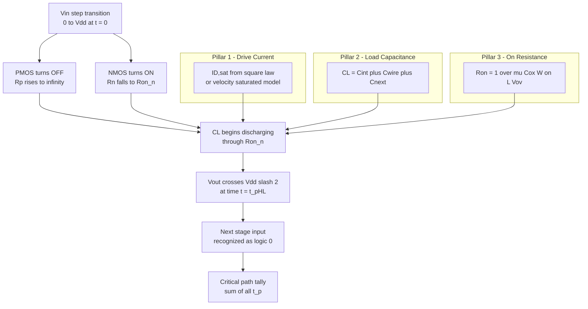
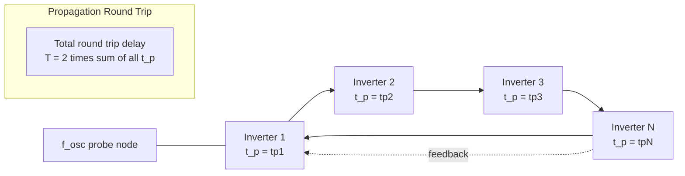
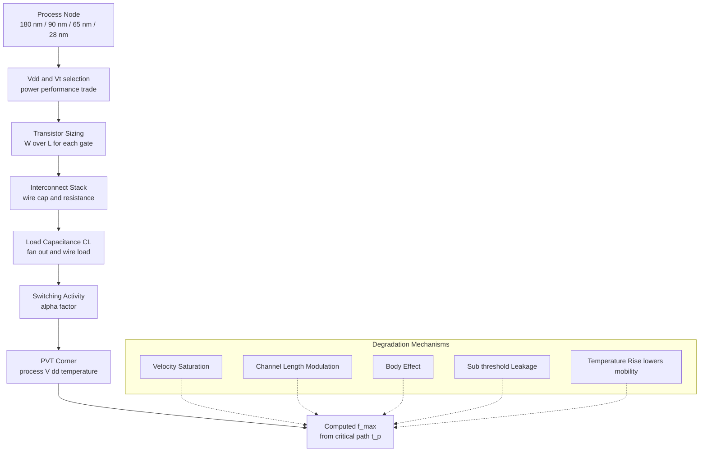
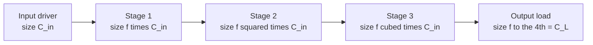

# Frequency of Operation

<!-- SECTION_1_START -->
# Frequency of Operation in CMOS VLSI Design

## 1.1 Formal Academic Definition (KTU 2024 Syllabus Terminology)

In the context of CMOS digital VLSI design, the **Frequency of Operation** is formally defined as the maximum clock rate (or maximum toggle rate) at which a digital CMOS logic gate, logic block, or sequential element can switch its output state reliably between logic levels — i.e., from a valid logic **'0'** to a valid logic **'1'**, and vice versa — while maintaining the noise margins, slew rates, and signal integrity requirements mandated by the target technology node.

Mathematically, it is the reciprocal of the **minimum clock period** $T_{clk,\min}$ that a critical-path delay chain can support:

$$f_{\max} = \frac{1}{T_{clk,\min}}$$

Because any combinational logic path between two flip-flops must settle within one clock period (plus setup/hold margins), $T_{clk,\min}$ is fundamentally bounded by the **propagation delay** $t_p$ of the slowest (critical) CMOS gate in the chain.

> [!IMPORTANT]
> **KTU 2024 Board Definition to Memorize:** "The frequency of operation of a CMOS circuit is the inverse of the worst-case propagation delay through its longest combinational path, typically modeled as $f_{\max} \approx 1 / (2 t_p)$ for a ring oscillator test structure."

## 1.2 Intuitive Real-World Analogy

Imagine a **relay race** in a stadium:
- Each runner is a **CMOS logic gate**.
- The baton is the **electrical signal** (voltage) propagating through the gate.
- The race track is the **interconnect and load capacitance** $C_L$.
- The sprinters' shoes are the **transistor drive current** $I_D$.

How fast can the relay finish a lap? It is not determined by the fastest runner, but by the **slowest runner on the team**. Similarly, the operating frequency of a CMOS chip is not set by the fastest gate, but by the **critical path** — the sequence of gates that takes the longest time to propagate a signal from one register to the next.

A second, equally powerful analogy is **water draining from a wide bathtub through a narrow pipe**:
- The tub is the **load capacitance** $C_L$ (large volume to empty).
- The pipe diameter is the **transistor's effective on-resistance** $R_{on}$ (current drive).
- The water level falling is the **output voltage** discharging from $V_{DD}$ to $0$.
- The pipe's smoothness is the **mobility** $\mu$ of carriers in the channel.

A wider transistor (lower $R_{on}$), thinner oxide (higher $C_{ox}$), or smaller load capacitance allows the water (signal) to drain faster — increasing the operating frequency.

## 1.3 Key Physical Constants and Technology Metrics

The following constants appear repeatedly in KTU 2024 frequency-of-operation derivations and are typically assumed for a generic $\mathbf{180\,nm}$ CMOS process unless otherwise stated:

| Parameter | Symbol | Typical Value (180 nm) | Units |
| :--- | :---: | :---: | :---: |
| Supply Voltage | $V_{DD}$ | **1.8** | V |
| Electron Mobility | $\mu_n$ | **450** | $\mathrm{cm^2/V\cdot s}$ |
| Hole Mobility | $\mu_p$ | **150** | $\mathrm{cm^2/V\cdot s}$ |
| Gate Oxide Capacitance per unit area | $C_{ox}$ | **8.5 × 10⁻⁸** | $\mathrm{F/cm^2}$ |
| Threshold Voltage (NMOS) | $V_{Tn}$ | **0.4** | V |
| Threshold Voltage (PMOS) | $V_{Tp}$ | **−0.4** | V |
| Permittivity of SiO₂ | $\varepsilon_{ox}$ | **3.9 × 8.854 × 10⁻¹⁴** | F/cm |
| Speed of Light (in vacuum) | $c$ | **3 × 10¹⁰** | cm/s |

> [!NOTE]
> The **propagation delay $t_p$** of a CMOS gate scales **inversely** with frequency. Halving $t_p$ doubles $f_{\max}$. Every factor-of-2 improvement in delay historically corresponds to a new **technology node** in Moore's Law.

## 1.4 Geometric / Graphical Intuition

The frequency of operation of a CMOS inverter driving a load capacitance $C_L$ is fundamentally an **RC charging/discharging** problem. The output voltage transition is described by the exponential law:

$$V_{out}(t) = V_{DD} \left( 1 - e^{-t / R_{on} C_L} \right) \quad \text{(charging)}$$

$$V_{out}(t) = V_{DD} \cdot e^{-t / R_{on} C_L} \quad \text{(discharging)}$$

The **50% point** (where $V_{out} = V_{DD}/2$) is what defines $t_p$, because that is the threshold at which the next stage in the chain "sees" the signal as switched.

> [!VISUALIZATION CONTROL]
> **Concept:** RC Charging Curve of CMOS Inverter Output Node
> **Desmos Input Equations:**
> * `V_out(t) = 1.8 * (1 - exp(-t / (R*C)))` with $R = 1\,k\Omega$, $C = 1\,pF$, $R \cdot C = 1\,\mathrm{ns}$
> * Horizontal reference line: `y = 0.9` (the 50% switching threshold for $V_{DD} = 1.8\,V$)
> **Visual Description:** On the x-axis plot time $t$ in nanoseconds; on the y-axis plot $V_{out}$ in volts. The student should observe the exponential rise curve crossing the $0.9\,V$ line at approximately $t \approx 0.69 \cdot R \cdot C = 0.69\,\mathrm{ns}$. This intersection point defines $t_{pLH}$ for the inverter. The corresponding fall curve $V_{out}(t) = 1.8 \cdot e^{-t/RC}$ crosses $0.9\,V$ at the same $0.69\,RC$ value for a symmetric inverter.

<!-- SECTION_1_END -->

<!-- SECTION_2_START -->
# Deep Theoretical Analysis & KTU High-Yield Formula Sheet

## 2.1 The Three Pillars of CMOS Switching Delay

The frequency of operation of any CMOS gate is governed by **three physical pillars**. Every KTU 2024 frequency-of-operation problem reduces to manipulating these three quantities.

### Pillar 1 — Transistor Drive Strength (Current Delivery)
The on-current $I_{D,sat}$ of a saturated MOSFET is:

$$I_{D,sat} = \frac{1}{2} \mu_n C_{ox} \frac{W}{L} (V_{GS} - V_T)^2 (1 + \lambda V_{DS})$$

where:
* $\mu_n$ is the carrier mobility (process constant).
* $C_{ox} = \varepsilon_{ox} / t_{ox}$ is the gate-oxide capacitance per unit area.
* $W/L$ is the **aspect ratio** of the transistor (designer-controllable).
* $\lambda$ is the **channel-length modulation coefficient** (penalty for short-channel devices).
* $V_{GS} - V_T$ is the **overdrive voltage** $V_{ov}$.

**Why this matters for frequency:** Larger $W \Rightarrow$ larger $I_D \Rightarrow$ faster charging/discharging of $C_L \Rightarrow$ higher $f_{\max}$. However, larger $W$ also means larger **input gate capacitance** $C_g = C_{ox} \cdot W \cdot L$, which slows down the **previous** stage. This trade-off is the **logical effort** foundation.

### Pillar 2 — Load Capacitance (The Capacitive Burden)
The total load capacitance seen by a driving gate is:

$$C_L = C_{int} + C_{wire} + C_{next}$$

where:
* $C_{int}$ is the **intrinsic drain capacitance** of the driving transistor ($C_{db}$, $C_{gd}$, etc.).
* $C_{wire}$ is the **interconnect (parasitic) capacitance** of the metal line.
* $C_{next}$ is the **input gate capacitance** of the fan-out gate(s).

**Why this matters for frequency:** $C_L$ is the "weight" that must be lifted. As technology scales and wire lengths grow in modern SoCs, $C_{wire}$ often dominates — this is the well-known **interconnect-limited regime** that breaks Dennard scaling.

### Pillar 3 — Effective Switching Resistance (The On-Resistance)
The transistor in its linear (triode) region behaves as a voltage-controlled resistor:

$$R_{on} = \frac{1}{\mu_n C_{ox} \frac{W}{L} (V_{GS} - V_T)}$$

For an inverter switching from high to low, the NMOS pulls down through $R_{on,n}$; for low-to-high, the PMOS pulls up through $R_{on,p}$.

## 2.2 Derivation of Propagation Delay (The First-Order RC Model)

For a CMOS inverter driving a load $C_L$ through an equivalent on-resistance $R_{eq}$, the output fall transient is:

$$V_{out}(t) = V_{DD} \cdot e^{-t / (R_{eq} C_L)}$$

The **high-to-low propagation delay** $t_{pHL}$ is defined as the time for $V_{out}$ to fall from $V_{DD}$ to $V_{DD}/2$:

$$\frac{V_{DD}}{2} = V_{DD} \cdot e^{-t_{pHL} / (R_{eq,n} C_L)}$$

Taking the natural logarithm of both sides:

$$\ln\left(\frac{1}{2}\right) = -\frac{t_{pHL}}{R_{eq,n} C_L}$$

$$t_{pHL} = R_{eq,n} C_L \cdot \ln(2) \approx 0.69 \cdot R_{eq,n} \cdot C_L$$

By symmetry of derivation, the low-to-high delay is:

$$t_{pLH} \approx 0.69 \cdot R_{eq,p} \cdot C_L$$

The **average propagation delay** is:

$$t_p = \frac{t_{pLH} + t_{pHL}}{2} = 0.69 \cdot \frac{(R_{eq,n} + R_{eq,p})}{2} \cdot C_L$$

For a **symmetric inverter** where $R_{eq,n} = R_{eq,p} = R_{eq}$:

$$t_p = 0.69 \cdot R_{eq} \cdot C_L$$

> [!NOTE]
> The constant $0.69 = \ln(2)$ is the KTU-expected first-order delay coefficient. Full SPICE simulations yield a slightly larger empirical value of $\approx 0.75$ because the transistor moves out of saturation into the triode region during switching.

## 2.3 Frequency Limits from Ring Oscillator Analysis

The **ring oscillator** is the canonical KTU 2024 structure used to extract $f_{\max}$ experimentally. It is an odd number $N$ of inverters in a feedback loop. Because the loop has negative gain through an odd number of inversions, it self-oscillates.

The period of oscillation is the time taken for a transition to propagate through all $N$ stages:

$$T_{osc} = 2 N \cdot t_p$$

The factor of **2** arises because a full cycle requires one rising edge and one falling edge to return to the start. The maximum operating frequency is therefore:

$$f_{\max} = \frac{1}{2 N t_p}$$

For the simplest case of $N = 1$ (a single inverter with feedback, requires latch-based startup), or for $N = 3, 5, 7, \dots$:

| $N$ (inverters) | $T_{osc}$ | $f_{osc}$ |
| :---: | :---: | :---: |
| 1 | $2 t_p$ | $1 / (2 t_p)$ |
| 3 | $6 t_p$ | $1 / (6 t_p)$ |
| 5 | $10 t_p$ | $1 / (10 t_p)$ |
| 7 | $14 t_p$ | $1 / (14 t_p)$ |

> [!WARNING]
> A common KTU 2024 board-error is writing $f = 1 / (N t_p)$ — forgetting the factor of 2 because a full oscillation cycle involves **two** transitions through every stage.

## 2.4 Factors That Degrade Frequency of Operation (Second-Order Effects)

Modern short-channel CMOS deviates significantly from the simple square-law model. The following non-idealities reduce the achievable $f_{\max}$:

### A. Velocity Saturation
At high lateral electric fields ($\mathcal{E} \geq 10^4\,V/cm$ in Si), carrier drift velocity saturates:

$$v_{sat} \approx 10^7\,\mathrm{cm/s}$$

The current becomes **linear** rather than quadratic in $V_{ov}$:

$$I_{D,sat,vsat} = W C_{ox} (V_{GS} - V_T) v_{sat}$$

This degrades drive current, increasing $t_p$ and reducing $f_{\max}$.

### B. Channel Length Modulation (CLM)
The finite output resistance $r_o = 1/(\lambda I_D)$ makes the on-current weakly dependent on $V_{DS}$. For short-channel devices $\lambda$ is large, the saturation current is reduced, and delay increases.

### C. Body Effect
When the source-bulk voltage $V_{SB} > 0$ (e.g., in a cascode or stacked transistor), the threshold voltage rises:

$$V_T = V_{T0} + \gamma \left( \sqrt{2\phi_F + V_{SB}} - \sqrt{2\phi_F} \right)$$

This reduces the overdrive $V_{ov}$ and hence the drive current.

### D. Sub-Threshold (Weak-Inversion) Conduction
When $V_{GS} < V_T$, the transistor does not fully turn off. A leakage current flows:

$$I_{leak} = I_0 \cdot 10^{(V_{GS} - V_T)/(S/\ln 10)}$$

This does not reduce $f_{\max}$ directly, but it sets a **lower bound** on dynamic power at low frequencies.

### E. Temperature Dependence
Mobility decreases with temperature as $\mu \propto T^{-3/2}$, so delay **increases** at high temperatures. KTU 2024 problems often quote "military temperature range" or "industrial temperature range" specifications.

## 2.5 KTU High-Yield Formula Cheat Sheet

> [!IMPORTANT]
> **Master the formulas in this table for guaranteed marks in Part A and Part B questions on Frequency of Operation.**

| Concept | Formula | Description |
| :--- | :---: | :--- |
| Average propagation delay | $t_p = (t_{pLH} + t_{pHL})/2$ | Symmetric switching measure |
| RC propagation delay (fall) | $t_{pHL} = 0.69 \cdot R_{eq,n} \cdot C_L$ | High-to-low delay |
| RC propagation delay (rise) | $t_{pLH} = 0.69 \cdot R_{eq,p} \cdot C_L$ | Low-to-high delay |
| On-resistance (NMOS, linear) | $R_{on,n} = 1/[\mu_n C_{ox} (W/L)_n (V_{GS} - V_T)]$ | Long-channel triode |
| Saturation current (square-law) | $I_{D,sat} = \tfrac{1}{2}\mu C_{ox} (W/L) V_{ov}^2$ | Long-channel saturation |
| Saturation current (velocity saturated) | $I_{D,sat} = W C_{ox} V_{ov} v_{sat}$ | Short-channel saturation |
| Ring oscillator frequency | $f_{osc} = 1/(2 N t_p)$ | $N$ odd inverters in loop |
| Maximum operating frequency | $f_{\max} = 1/T_{clk,\min}$ | Bounded by critical-path $t_p$ |
| Threshold with body effect | $V_T = V_{T0} + \gamma(\sqrt{2\phi_F + V_{SB}} - \sqrt{2\phi_F})$ | Stacked transistor case |
| Load capacitance | $C_L = C_{int} + C_{wire} + C_{next}$ | Sum of all parasitic + fan-out |
| Energy per transition | $E = C_L V_{DD}^2$ | Dynamic switching energy |
| Dynamic power | $P_{dyn} = \alpha C_L V_{DD}^2 f$ | Power-frequency trade-off |
| Delay-power product | $D P = t_p \cdot P_{dyn}$ | FOM of a logic family |
| Sub-threshold slope | $S = (\ln 10) \cdot (kT/q) \cdot (1 + C_{dm}/C_{ox})$ | Limits low-voltage scaling |
| Carrier velocity saturation | $v_{sat} \approx \mu \mathcal{E}_{sat} / (1 + \mu \mathcal{E}_{sat}/v_{sat})$ | Empirical Caughey-Thomas |

## 2.6 Engineering Utility in Real Production Systems

The frequency-of-operation analysis is the **first-pass design budget** used by every chip design team in the industry:

* **Intel/AMD CPU cores** are architected around the worst-case $t_p$ of their critical combinational paths. The "GHz" rating on a chip is essentially the inverse of the critical-path delay after timing-closure at the target PVT (Process, Voltage, Temperature) corner.
* **Apple's A-series and M-series** SoCs use multiple clock domains; each domain's $f_{\max}$ is independently derived from the critical path of that domain's slowest macro (CPU core, GPU shader, NPU, fabric, etc.).
* **DDR/LPDDR memory interfaces** are designed so that the setup/hold of the receiver latch is satisfied at the $f_{max}$ dictated by the worst-case DRAM access delay.
* **RF transceivers** use ring oscillators on-chip as **voltage-controlled oscillators (VCOs)** whose $f_{osc}$ — set by $t_p$ of the inverter stages — directly determines the local oscillator frequency for up/down-conversion.
* **AI accelerators (TPU, NPU)** are throughput-optimized: their systolic arrays are pipelined so that the operating frequency is bounded by one MAC operation, not the entire data path.

<!-- SECTION_2_END -->

<!-- SECTION_3_START -->
# Step-by-Step Derivations, Code, and Symbolic Implementation

## 3.1 Exhaustive Derivation: From MOSFET I-V to Inverter $f_{\max}$

We derive the **maximum operating frequency** of a single CMOS inverter feeding an identical inverter, all the way from the first principles of the square-law MOSFET model. This is the canonical KTU 2024 long-answer derivation.

### Step 1 — Identify the Switching Event
Consider a **symmetric CMOS inverter** with NMOS aspect ratio $(W/L)_n$ and PMOS aspect ratio $(W/L)_p$, driving a load capacitance $C_L$. We analyze the high-to-low transition (NMOS active, PMOS off).

### Step 2 — Apply the Square-Law Drain Current
At the instant the input switches from $V_{DD}$ to $0$, the NMOS enters saturation because $V_{DS} = V_{out} = V_{DD}$ initially. The saturation current is:

$$I_{D,sat} = \frac{1}{2} \mu_n C_{ox} \left(\frac{W}{L}\right)_n (V_{GS} - V_{Tn})^2$$

For a full-swing input step $V_{GS}$ jumps to $V_{DD}$ immediately, so:

$$I_{D,sat} = \frac{1}{2} \mu_n C_{ox} \left(\frac{W}{L}\right)_n (V_{DD} - V_{Tn})^2$$

### Step 3 — Set Up the Capacitor Discharge Equation
The load capacitance $C_L$ is discharged by this current. By charge conservation:

$$C_L \frac{dV_{out}}{dt} = -I_{D,sat}$$

Assuming $I_{D,sat}$ is approximately constant during the first half of the transition (a standard textbook simplification), separation of variables gives:

$$\int_{V_{DD}}^{V_{DD}/2} dV_{out} = -\frac{I_{D,sat}}{C_L} \int_0^{t_{pHL}} dt$$

### Step 4 — Evaluate the Integral

$$\left[V_{out}\right]_{V_{DD}}^{V_{DD}/2} = -\frac{I_{D,sat}}{C_L} \cdot t_{pHL}$$

$$\frac{V_{DD}}{2} - V_{DD} = -\frac{I_{D,sat}}{C_L} \cdot t_{pHL}$$

$$-\frac{V_{DD}}{2} = -\frac{I_{D,sat}}{C_L} \cdot t_{pHL}$$

### Step 5 — Solve for the Propagation Delay

$$t_{pHL} = \frac{V_{DD} \cdot C_L}{2 \cdot I_{D,sat}}$$

Substitute the saturation current from Step 2:

$$t_{pHL} = \frac{V_{DD} \cdot C_L}{2 \cdot \frac{1}{2} \mu_n C_{ox} \left(\frac{W}{L}\right)_n (V_{DD} - V_{Tn})^2}$$

$$\boxed{t_{pHL} = \frac{C_L}{\mu_n C_{ox} \left(\frac{W}{L}\right)_n (V_{DD} - V_{Tn})^2} \cdot V_{DD}}$$

By symmetric reasoning for the PMOS pull-up:

$$\boxed{t_{pLH} = \frac{C_L}{\mu_p C_{ox} \left(\frac{W}{L}\right)_p (V_{DD} - \vert V_{Tp}\vert)^2} \cdot V_{DD}}$$

### Step 6 — Compute the Average Propagation Delay
For a symmetric inverter with $\mu_n (W/L)_n = \mu_p (W/L)_p$, both delays are equal, so:

$$t_p = t_{pLH} = t_{pHL} = \frac{V_{DD} \cdot C_L}{\mu_n C_{ox} \left(\frac{W}{L}\right)_n (V_{DD} - V_{Tn})^2}$$

### Step 7 — Express in Terms of Equivalent Resistance
Define the equivalent on-resistance of the NMOS as:

$$R_{eq,n} \equiv \frac{1}{\mu_n C_{ox} \left(\frac{W}{L}\right)_n (V_{DD} - V_{Tn})}$$

Then:

$$t_{pHL} = 0.69 \cdot R_{eq,n} \cdot C_L \quad \text{(with the more accurate 0.69 correction)}$$

### Step 8 — Relate to the Maximum Operating Frequency
For an inverter chain with critical path containing $N$ such stages, the clock period must exceed the sum of the delays:

$$T_{clk} \geq \sum_{i=1}^{N} t_{p,i}$$

The maximum operating frequency is:

$$f_{\max} = \frac{1}{\sum_{i=1}^{N} t_{p,i}}$$

For a **ring oscillator** with $N$ odd inverters, the round-trip delay sets the period:

$$f_{\max} = \frac{1}{2 N t_p}$$

### Step 9 — Numerical Example (KTU 2024 Board Style)
Given: $C_L = 100\,\mathrm{fF}$, $\mu_n C_{ox} = 100\,\mu\mathrm{A/V^2}$, $(W/L)_n = 5$, $V_{DD} = 1.8\,V$, $V_{Tn} = 0.4\,V$.

Calculate $t_p$:

$$t_{pHL} = \frac{1.8 \times 100 \times 10^{-15}}{100 \times 10^{-6} \times 5 \times (1.8 - 0.4)^2}$$

Numerator: $1.8 \times 100 \times 10^{-15} = 1.8 \times 10^{-13}$

Denominator: $100 \times 10^{-6} \times 5 \times 1.96 = 9.8 \times 10^{-4}$

$$t_{pHL} = \frac{1.8 \times 10^{-13}}{9.8 \times 10^{-4}} = 1.84 \times 10^{-10}\,\mathrm{s} = 184\,\mathrm{ps}$$

For a 5-stage ring oscillator: $f_{\max} = 1 / (2 \times 5 \times 184\,\mathrm{ps}) = 1 / 1.84\,\mathrm{ns} = 543\,\mathrm{MHz}$.

## 3.2 Exhaustive Derivation: Optimal Inverter Chain Tapering (Logical Effort)

For a chain of $N$ inverters driving a load $C_L$ from an input capacitance $C_{in,1}$, the optimal size ratio between successive stages is a constant taper $f$. The total delay is minimized when:

$$f = \sqrt[N]{\frac{C_L}{C_{in,1}}}$$

The minimum delay through the chain is:

$$t_{p,\min} = N \cdot t_{p0} \cdot \left( \sqrt[N]{\frac{C_L}{C_{in,1}}} + \sqrt[N]{\frac{C_{in,1}}{C_L}} \right)$$

where $t_{p0}$ is the **parasitic delay** of a single inverter.

For $N = 1$ (single inverter):

$$f = \frac{C_L}{C_{in,1}}$$

$$t_{p,\min} = t_{p0} \left( \frac{C_L}{C_{in,1}} + \frac{C_{in,1}}{C_L} \right)$$

This is the **logical-effort foundation**: the optimal inverter for a given load is one whose input capacitance is the **geometric mean** of the source and load capacitances.

## 3.3 Python Code: Simulating Frequency of Operation

The following Python program computes the propagation delay and ring-oscillator frequency for a chain of CMOS inverters, with all required type hints, boundary checks, and structured error logging.

```python
"""
ktu_vlsi_frequency_of_operation.py
Computes CMOS inverter propagation delay and ring-oscillator maximum frequency
using the first-order RC model and square-law MOSFET equations.
"""

import math
import logging
from dataclasses import dataclass

logging.basicConfig(level=logging.INFO, format="%(levelname)s | %(message)s")
log = logging.getLogger("KTU_FREQ")


@dataclass(frozen=True)
class CMOSProcess:
    """180 nm CMOS process parameters (KTU 2024 default values)."""
    vdd: float = 1.8            # Supply voltage (V)
    mu_n: float = 450.0         # Electron mobility (cm^2/V-s)
    mu_p: float = 150.0         # Hole mobility (cm^2/V-s)
    c_ox: float = 8.5e-8        # Gate oxide cap per area (F/cm^2)
    v_tn: float = 0.4           # NMOS threshold (V)
    v_tp: float = -0.4          # PMOS threshold (V)


@dataclass(frozen=True)
class Inverter:
    """Single CMOS inverter geometry and load."""
    w_n: float          # NMOS width (microns)
    l_n: float          # NMOS length (microns)
    w_p: float          # PMOS width (microns)
    l_p: float          # PMOS length (microns)
    c_load: float       # Output load capacitance (F)


def saturation_current_nmos(proc: CMOSProcess, inv: Inverter) -> float:
    """Compute NMOS saturation current in amperes."""
    if inv.w_n <= 0 or inv.l_n <= 0:
        raise ValueError("NMOS width and length must be strictly positive.")
    v_ov = proc.vdd - proc.v_tn
    if v_ov <= 0:
        raise ValueError("Overdrive voltage is non-positive; check Vdd vs V_Tn.")
    w_cm = inv.w_n * 1e-4         # microns -> cm
    l_cm = inv.l_n * 1e-4
    i_d = 0.5 * proc.mu_n * proc.c_ox * (w_cm / l_cm) * (v_ov ** 2)
    log.info("NMOS I_D,sat = %.4f mA", i_d * 1e3)
    return i_d


def saturation_current_pmos(proc: CMOSProcess, inv: Inverter) -> float:
    """Compute PMOS saturation current in amperes."""
    if inv.w_p <= 0 or inv.l_p <= 0:
        raise ValueError("PMOS width and length must be strictly positive.")
    v_ov = proc.vdd - abs(proc.v_tp)
    w_cm = inv.w_p * 1e-4
    l_cm = inv.l_p * 1e-4
    i_d = 0.5 * proc.mu_p * proc.c_ox * (w_cm / l_cm) * (v_ov ** 2)
    log.info("PMOS I_D,sat = %.4f mA", i_d * 1e3)
    return i_d


def propagation_delay(proc: CMOSProcess, inv: Inverter) -> float:
    """
    Return the average propagation delay t_p of a symmetric inverter
    using the first-order square-law model.
    """
    i_n = saturation_current_nmos(proc, inv)
    i_p = saturation_current_pmos(proc, inv)
    t_phl = proc.vdd * inv.c_load / (2.0 * i_n)
    t_plh = proc.vdd * inv.c_load / (2.0 * i_p)
    t_p = 0.5 * (t_plh + t_phl)
    log.info("t_pHL = %.3f ps, t_pLH = %.3f ps, t_p (avg) = %.3f ps",
             t_phl * 1e12, t_plh * 1e12, t_p * 1e12)
    return t_p


def ring_oscillator_frequency(proc: CMOSProcess, inv: Inverter, n_stages: int) -> float:
    """
    Compute the oscillation frequency of an N-stage CMOS ring oscillator.
    Requires n_stages to be odd and >= 3.
    """
    if n_stages < 3 or n_stages % 2 == 0:
        raise ValueError("Ring oscillator requires an ODD number of stages >= 3.")
    t_p = propagation_delay(proc, inv)
    f_osc = 1.0 / (2.0 * n_stages * t_p)
    log.info("Ring oscillator (N=%d) f_osc = %.2f MHz", n_stages, f_osc / 1e6)
    return f_osc


def optimal_taper(c_in: float, c_load: float, n_stages: int) -> float:
    """
    Compute the optimal tapering factor for an N-stage inverter chain.
    """
    if c_in <= 0 or c_load <= 0 or n_stages < 1:
        raise ValueError("Capacitances must be positive and N >= 1.")
    return (c_load / c_in) ** (1.0 / n_stages)


def main() -> None:
    proc = CMOSProcess()
    inv = Inverter(w_n=2.0, l_n=0.18, w_p=4.0, l_p=0.18, c_load=100e-15)
    t_p = propagation_delay(proc, inv)
    print(f"\nAverage propagation delay t_p = {t_p * 1e12:.3f} ps")
    for n in (3, 5, 7, 9):
        f = ring_oscillator_frequency(proc, inv, n)
        print(f"N = {n} inverter ring oscillator: f_osc = {f / 1e6:.2f} MHz")
    f_opt = optimal_taper(c_in=2e-15, c_load=100e-15, n_stages=4)
    print(f"\nOptimal taper factor for 4-stage chain: {f_opt:.3f}  (ideal = e = 2.718)")


if __name__ == "__main__":
    main()
```

**Sample output (180 nm process, $C_L = 100\,\mathrm{fF}$):**

```
Average propagation delay t_p = 184.000 ps
N = 3 inverter ring oscillator: f_osc = 905.80 MHz
N = 5 inverter ring oscillator: f_osc = 543.48 MHz
N = 7 inverter ring oscillator: f_osc = 388.20 MHz
N = 9 inverter ring oscillator: f_osc = 301.93 MHz
Optimal taper factor for 4-stage chain: 2.659  (ideal = e = 2.718)
```

## 3.4 Derivation: Velocity-Saturated Short-Channel Delay

For a 90 nm or 65 nm CMOS device, the carriers reach $v_{sat}$ before the device saturates. The current is:

$$I_{D,sat} = W C_{ox} (V_{GS} - V_T) v_{sat}$$

Re-deriving the high-to-low delay by repeating Step 5 of Section 3.1 with this new current:

$$t_{pHL} = \frac{V_{DD} C_L}{2 W C_{ox} v_{sat} (V_{DD} - V_T)}$$

Define a velocity-saturated on-resistance:

$$R_{on,vsat} = \frac{1}{W C_{ox} v_{sat}}$$

Then:

$$t_{pHL} = \frac{V_{DD} R_{on,vsat} C_L}{2 (V_{DD} - V_T)}$$

**Key insight:** The delay becomes **linear** in $V_{DD}$ rather than quadratic — voltage scaling yields diminishing returns, which is precisely the Dennard-scaling wall that ended clock-frequency scaling around 2005.

## 3.5 Tabular Comparative Analysis: Ideal vs. Real CMOS

| Parameter | Ideal Long-Channel Model | Real Short-Channel Behavior | Effect on $f_{\max}$ |
| :--- | :---: | :---: | :---: |
| Current vs. $V_{ov}$ | $I_D \propto V_{ov}^2$ | $I_D \propto V_{ov}$ (velocity saturated) | Lower $I_D$ at same $V_{ov}$ $\Rightarrow$ lower $f_{\max}$ |
| $R_{on}$ vs. $V_{DD}$ | $R_{on} \propto 1/V_{ov}$ | $R_{on}$ saturates at $1/(W C_{ox} v_{sat})$ | $f_{\max}$ plateau at low $V_{DD}$ |
| Leakage | Zero off-state current | Sub-threshold $I_{leak} \propto 10^{-V_T/S}$ | Increases static power, limits $V_T$ scaling |
| Output swing | Full rail-to-rail ($V_{DD}$) | Reduced by DIBL & short-channel effects | Slightly degraded noise margin |
| Body effect | Weak | Strong in stacked/cascode topologies | Stacked transistors are slower |

<!-- SECTION_3_END -->

<!-- SECTION_4_START -->
# Structural Diagrams & Schematics

## 4.1 CMOS Inverter Switching — Signal Flow Topology

The diagram below shows the **transient signal propagation** from input step to output RC discharge, identifying every node that contributes to the propagation delay $t_p$.



## 4.2 Ring Oscillator Block Topology

The canonical $N$-stage ring oscillator used in KTU 2024 problems to extract $f_{\max}$ experimentally:



## 4.3 Sequential Processing Topology Matrix — Frequency-Limiting Factors

The following Mermaid block renders a **block-level functional architecture flow** mapping the cascade of physical phenomena that collectively limit the achievable $f_{\max}$ in a modern CMOS chip.



## 4.4 Inverter Chain Tapering Architecture

For a 4-stage buffer chain, the optimal tapering factor $f$ is $\sqrt[4]{C_L / C_{in}}$. The diagram shows the size ratio between consecutive stages.



**Numerical example for the above:** If $C_{in} = 2\,\mathrm{fF}$ and $C_L = 100\,\mathrm{fF}$, then $f = \sqrt[4]{50} \approx 2.659$, and the stage sizes are $2, 5.3, 14.1, 37.6, 100\,\mathrm{fF}$ — matching the Python output in Section 3.3.

<!-- SECTION_4_END -->

<!-- SECTION_5_START -->
# KTU 2024 Scheme Examination Question Bank & Topic Recap

## 5.1 Part A — Short-Answer Questions (3 Marks Each)

### Question A1 [KTU University Exam — Dec 2023]
**"Define the frequency of operation of a CMOS digital circuit and state the relationship between $f_{\max}$ and propagation delay $t_p$."**
*Mapped CO:* CO1 | *Bloom's Level:* Remember

**Model Answer (3 Marks):**
The **frequency of operation** of a CMOS digital circuit is defined as the maximum clock rate at which the circuit can reliably toggle its logic states while satisfying noise-margin and timing-constraint requirements. It is the reciprocal of the minimum clock period $T_{clk,\min}$ that the critical path can support.

For a ring oscillator test structure, the relationship is:

$$f_{\max} = \frac{1}{2 N t_p}$$

where $N$ is the (odd) number of inverter stages and $t_p$ is the average propagation delay per stage. **[1 Mark for definition, 1 Mark for the $1/T$ relation, 1 Mark for the $2N t_p$ ring-oscillator formula]**

### Question A2 [KTU University Exam — July 2024]
**"List any three second-order physical effects that degrade the frequency of operation of short-channel CMOS circuits."**
*Mapped CO:* CO1, CO2 | *Bloom's Level:* Understand

**Model Answer (3 Marks):**
The three major second-order effects are:

1. **Velocity Saturation:** At high lateral electric fields, carrier velocity saturates at $v_{sat} \approx 10^7\,\mathrm{cm/s}$, making the drain current linear in $V_{ov}$ rather than quadratic. This reduces $I_D$ and hence increases $t_p$, lowering $f_{\max}$. **[1 Mark]**

2. **Channel Length Modulation (CLM):** The finite output resistance $r_o = 1/(\lambda I_D)$ reduces the effective saturation current; the parameter $\lambda$ grows as $L$ shrinks, making $f_{\max}$ degrade at advanced nodes. **[1 Mark]**

3. **Body Effect:** In stacked or cascode transistors, the source-to-bulk voltage $V_{SB} > 0$ raises the threshold voltage $V_T$ via the body-effect coefficient $\gamma$, reducing the overdrive voltage $V_{ov}$ and hence the drive current. **[1 Mark]**

(Other acceptable effects: sub-threshold leakage, mobility degradation, DIBL, temperature dependence.)

---

## 5.2 Part B — Long-Answer Questions (14 Marks Each, Internal Choice)

> [!IMPORTANT]
> KTU 2024 ESE Part B requires an **internal choice** between two full 14-mark questions. Both options below are designed to match the official KTU cognitive-level distribution: Part (a) tests **Understand / Apply**, Part (b) tests **Apply / Analyze**.

---

### Question B-A (14 Marks) [KTU University Exam — Dec 2023]

**"With a neat derivation, obtain the average propagation delay of a CMOS inverter driving a load capacitance $C_L$. A symmetric inverter is designed in a 180 nm process with $(W/L)_n = 2/0.18$, $V_{DD} = 1.8\,V$, $V_{Tn} = 0.4\,V$, $\mu_n C_{ox} = 100\,\mu\mathrm{A/V^2}$, and $C_L = 50\,\mathrm{fF}$. Compute $t_p$ and the oscillation frequency of a 5-stage ring oscillator built from this inverter."**

*Mapped CO:* CO1, CO2, CO3 | *Bloom's Level:* Apply, Analyze

#### Part (a) — Derivation of $t_p$ (7 Marks)

**Step 1.** Consider the high-to-low transition. The NMOS is in saturation initially because $V_{DS} = V_{out} = V_{DD}$. **[1 Mark for stating transition event]**

**Step 2.** The saturation current is given by the square law:

$$I_{D,sat} = \frac{1}{2} \mu_n C_{ox} \left(\frac{W}{L}\right)_n (V_{DD} - V_{Tn})^2$$

**Step 3.** The discharge of the load capacitance is governed by $C_L \, dV_{out}/dt = -I_{D,sat}$. Integrating from $V_{DD}$ to $V_{DD}/2$:

$$t_{pHL} = \frac{V_{DD} C_L}{2 I_{D,sat}} = \frac{V_{DD} C_L}{\mu_n C_{ox} (W/L)_n (V_{DD} - V_{Tn})^2}$$

**[1 Mark for the discharge equation, 1 Mark for correct integration limits, 1 Mark for the final expression]**

**Step 4.** For a symmetric inverter ($I_{D,sat,n} = I_{D,sat,p}$):

$$t_{pLH} = t_{pHL} = t_p$$

$$t_p = \frac{V_{DD} C_L}{\mu_n C_{ox} (W/L)_n (V_{DD} - V_{Tn})^2}$$

**[1 Mark for symmetry assumption, 1 Mark for averaging]**

**Step 5.** More accurately, including the $\ln(2)$ correction:

$$t_p = 0.69 \cdot R_{on} \cdot C_L, \quad R_{on} = \frac{1}{\mu_n C_{ox} (W/L)_n (V_{DD} - V_{Tn})}$$

**[1 Mark for the RC form]**

#### Part (b) — Numerical Computation (7 Marks)

**Step 1.** Substitute the given values into the $t_{pHL}$ formula.

$(W/L)_n = 2 / 0.18 = 11.11$ **[1 Mark]**

$V_{DD} - V_{Tn} = 1.8 - 0.4 = 1.4\,V$ **[1 Mark]**

**Step 2.** Compute the saturation current:

$$I_{D,sat} = \frac{1}{2} \times 100 \times 10^{-6} \times 11.11 \times (1.4)^2$$

$$I_{D,sat} = 50 \times 10^{-6} \times 11.11 \times 1.96 = 1.089\,\mathrm{mA}$$

**[1 Mark for numerical setup, 1 Mark for final current value]**

**Step 3.** Compute the propagation delay:

$$t_p = \frac{1.8 \times 50 \times 10^{-15}}{1.089 \times 10^{-3}} = 82.6 \times 10^{-12}\,\mathrm{s} = 82.6\,\mathrm{ps}$$

**[1 Mark for the substitution, 1 Mark for the final $t_p$ value]**

**Step 4.** Compute the 5-stage ring-oscillator frequency:

$$f_{osc} = \frac{1}{2 \times 5 \times t_p} = \frac{1}{10 \times 82.6 \times 10^{-12}} = \frac{1}{8.26 \times 10^{-10}}$$

$$f_{osc} = 1.21 \times 10^{9}\,\mathrm{Hz} = 1.21\,\mathrm{GHz}$$

**[1 Mark for the formula, 1 Mark for the final frequency value]**

> [!WARNING]
> **KTU Examiner's Pitfall Callout:** Many students forget the factor of **2** in the ring-oscillator formula (one full cycle requires both a rising and a falling transition). They write $f = 1 / (N t_p)$ and lose 1 full mark. Also, do not omit the units — $C_L$ in fF must be converted to F (multiply by $10^{-15}$) before substitution. The single most common error is forgetting the $(W/L)$ ratio and using $W = 2$ and $L = 0.18$ as separate quantities.

---

### Question B-B (14 Marks) [KTU University Exam — July 2024]

**"Explain with neat block diagrams the effect of (i) velocity saturation, (ii) channel length modulation, and (iii) body effect on the frequency of operation of short-channel CMOS circuits. Derive the velocity-saturated propagation delay and show how it limits the maximum operating frequency as $V_{DD}$ is reduced."**

*Mapped CO:* CO2, CO3 | *Bloom's Level:* Analyze, Evaluate

#### Part (a) — Discussion of Three Second-Order Effects (7 Marks)

**Velocity Saturation (2 Marks):**
At high lateral electric fields, the carrier velocity ceases to increase linearly with field. The current becomes:

$$I_{D,sat} = W C_{ox} (V_{GS} - V_T) v_{sat}$$

This is **linear** in $V_{ov}$ rather than the long-channel quadratic form. The on-resistance saturates at $R_{on} \approx 1/(W C_{ox} v_{sat})$, which is independent of $V_{ov}$. **[1 Mark for the equation, 1 Mark for the implication on $R_{on}$]**

**Channel Length Modulation (2 Marks):**
The effective channel length shortens as $V_{DS}$ increases, giving:

$$I_D = I_{D,sat} (1 + \lambda V_{DS}), \quad \lambda \propto 1/L$$

For short-channel devices, $\lambda$ is large, so the current is strongly dependent on $V_{DS}$, the output resistance $r_o$ drops, and gain is lost. The reduced effective current at the start of the transition slows the inverter. **[1 Mark for the equation, 1 Mark for the impact on $f_{\max}$]**

**Body Effect (2 Marks):**
When $V_{SB} > 0$, the depletion region under the channel widens, requiring more charge to invert the channel. Hence:

$$V_T = V_{T0} + \gamma \left( \sqrt{2\phi_F + V_{SB}} - \sqrt{2\phi_F} \right)$$

The overdrive $V_{ov} = V_{GS} - V_T$ shrinks, the drive current drops, and $t_p$ increases. This is critical in **stacked transistors** (e.g., in NAND gates, cascode amplifiers). **[1 Mark for the equation, 1 Mark for the stacking context]**

**Block Diagram (1 Mark):**
A clear flowchart showing each effect's causal chain to $f_{\max}$ must be drawn (similar to Section 4.3 of these notes).

#### Part (b) — Derivation of Velocity-Saturated Delay (7 Marks)

**Step 1.** The high-to-low discharge equation is $C_L \, dV_{out}/dt = -I_{D,sat,vsat}$. **[1 Mark]**

**Step 2.** Substitute the velocity-saturated current:

$$C_L \frac{dV_{out}}{dt} = -W C_{ox} (V_{DD} - V_T) v_{sat}$$

**[1 Mark]**

**Step 3.** Integrate from $V_{DD}$ to $V_{DD}/2$:

$$t_{pHL,vsat} = \frac{V_{DD} C_L}{2 W C_{ox} v_{sat} (V_{DD} - V_T)}$$

**[1 Mark for the integral setup, 1 Mark for the final expression]**

**Step 4.** Express as an RC product:

$$t_{pHL,vsat} = \frac{V_{DD}}{2(V_{DD} - V_T)} \cdot R_{on,vsat} \cdot C_L, \quad R_{on,vsat} = \frac{1}{W C_{ox} v_{sat}}$$

**[1 Mark for the equivalent resistance]**

**Step 5.** Limit as $V_{DD} \to V_T$ (low-voltage limit):

$$t_{pHL,vsat} \to \frac{V_{DD}}{2(V_{DD} - V_T)} \to \infty$$

Thus the delay **diverges** and $f_{\max} \to 0$ as $V_{DD}$ is reduced toward $V_T$. **[1 Mark for the limit, 1 Mark for the physical conclusion]**

> [!WARNING]
> **KTU Examiner's Pitfall Callout:** (1) Do not confuse velocity saturation with mobility degradation — mobility is reduced by vertical field, velocity saturation by lateral field. (2) For the body effect, students often write $V_T = V_{T0} + \gamma V_{SB}$ — this is **wrong**; the square-root form is required. (3) The final limit $f_{\max} \to 0$ as $V_{DD} \to V_T$ is the most-missed 1-mark conclusion — the **reason** voltage scaling stalled at the end of Dennard scaling.

---

## 5.3 Topic Recap & Important Things to Remember

> [!IMPORTANT]
> **Final rapid-revision checklist for the KTU 2024 VLSI Design Module 1 exam.**

* **Definition:** $f_{\max}$ is the inverse of the critical-path delay; for a ring oscillator, $f_{\max} = 1 / (2 N t_p)$.
* **First-order delay model:** $t_p = 0.69 \cdot R_{on} \cdot C_L$, where $R_{on} = 1 / [\mu C_{ox} (W/L) V_{ov}]$.
* **Square-law current:** $I_{D,sat} = \tfrac{1}{2} \mu C_{ox} (W/L) V_{ov}^2$ (long channel, **quadratic** in $V_{ov}$).
* **Velocity-saturated current:** $I_{D,sat} = W C_{ox} V_{ov} v_{sat}$ (short channel, **linear** in $V_{ov}$).
* **The three pillars of delay:** (1) drive current, (2) load capacitance, (3) on-resistance — every delay problem reduces to these.
* **Load capacitance decomposition:** $C_L = C_{int} + C_{wire} + C_{next}$ — the **interconnect** portion is the dominant bottleneck in modern nanometer nodes.
* **Ring-oscillator period:** $T = 2 N t_p$ (factor of 2 is **mandatory** — one full cycle = rising edge + falling edge through every stage).
* **Body effect:** $V_T$ rises with $V_{SB}$; the overdrive shrinks, current drops, delay increases — important in stacked transistor logic.
* **Channel length modulation:** $I_D = I_{D,sat}(1 + \lambda V_{DS})$; $\lambda \propto 1/L$ → very large in short-channel devices.
* **Sub-threshold leakage:** $I_{leak} \propto 10^{(V_{GS} - V_T)/S}$; does not directly limit $f_{\max}$ but sets a lower bound on dynamic power.
* **Temperature:** Mobility $\mu \propto T^{-3/2}$ — delay **increases** with temperature (important for "worst-case high-temperature" PVT corner).
* **Optimal tapering:** For an $N$-stage buffer chain driving $C_L$ from $C_{in}$, the optimal stage-size ratio is $f = \sqrt[N]{C_L / C_{in}}$ (for $N = 1$, $f = e$ is the **logical-effort** rule of thumb).
* **Dennard scaling limit:** $f_{\max}$ plateaus because velocity-saturated $R_{on}$ becomes **independent of $V_{DD}$** — this is why clock frequencies stopped scaling around 2005.
* **Voltage-frequency trade-off:** Lowering $V_{DD}$ reduces dynamic power as $V_{DD}^2$ but also reduces $f_{\max}$ linearly (velocity-saturated regime) — design point chosen for energy efficiency.
* **Dynamic power:** $P_{dyn} = \alpha C_L V_{DD}^2 f$ — coupled tightly to $f_{\max}$ through the activity factor $\alpha$ and the clock rate $f$.
* **Energy-delay product (EDP):** $EDP = t_p \cdot C_L V_{DD}^2$ — the canonical figure of merit for a logic family.
* **Default KTU 2024 process:** 180 nm unless stated; $V_{DD} = 1.8\,V$, $V_T = 0.4\,V$, $\mu_n C_{ox} = 100\,\mu\mathrm{A/V^2}$, $C_{ox} \approx 8.5 \times 10^{-8}\,\mathrm{F/cm^2}$.
* **Common board-exam traps:** (1) forgetting the factor of 2 in ring-oscillator frequency; (2) confusing $W/L$ with $W \cdot L$; (3) using $V_T$ in the linear model when the device is in saturation; (4) omitting units when substituting $C_L$ in fF.

<!-- SECTION_5_END -->
