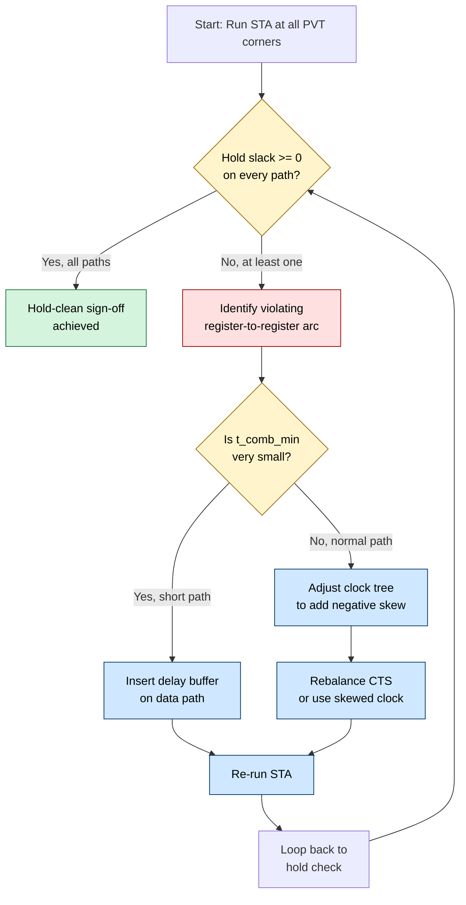
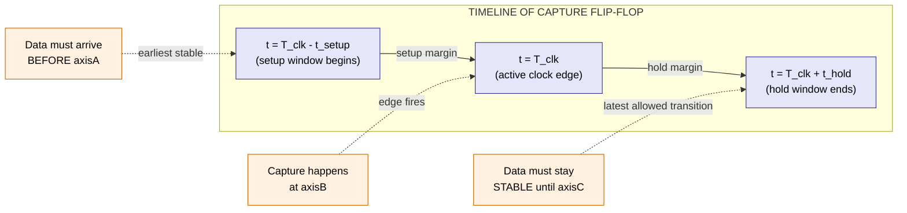
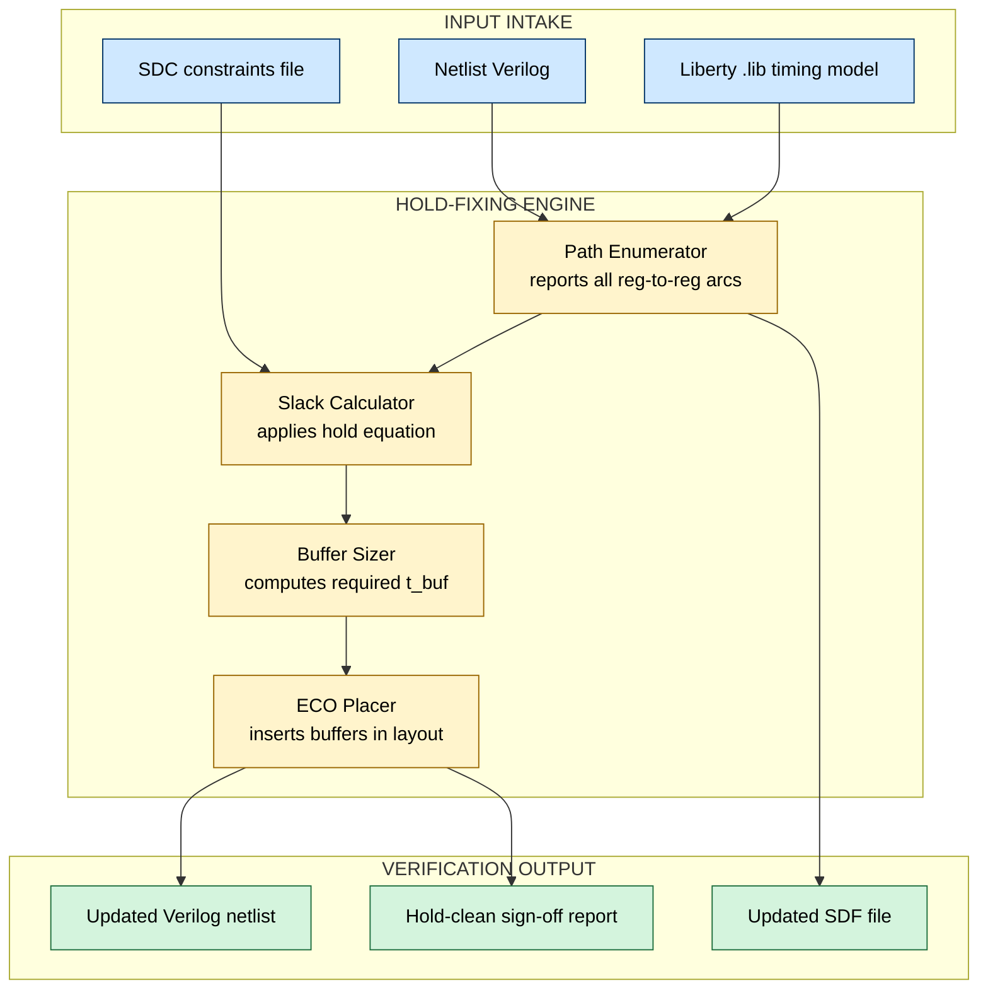

# Hold Time

<!-- SECTION_1_START -->
# HOLD TIME — Core Technical Definition & Intuitive Overview

## 📘 Formal KTU 2024 Definition

> **Hold Time ($t_{hold}$)** is the minimum temporal duration for which the data input ($D$) of a sequential storage element (flip-flop or latch) must remain **stable and unchanged** *after* the **active sampling edge** of the clock signal ($CLK$), to guarantee the correct, race-free capture and storage of that data value by the element.

In the context of **Static Timing Analysis (STA)**, the hold time check ensures that the *earliest possible arrival* of a new data transition at the capture flip-flop is **not too early** with respect to the capturing clock edge. The constraint is *path-length independent* of the clock period and is the **single most critical timing violation** to clear during the **place-and-route** and **clock-tree synthesis (CTS)** stages of a standard digital Physical Design flow.

> [!IMPORTANT]
> **KTU 2024 Syllabus Highlight:** Hold time is examined in Module 1 under "CMOS Fundamentals for Digital VLSI Design," typically coupled with **setup time**, **clock-to-Q delay ($t_{cq}$)**, and the **flip-flop timing triad**. Questions frequently demand derivations involving two back-to-back flip-flops separated by a combinational cloud.

---

## 🧠 Conceptual Analogy & Engineering Intuition

**The "Letterbox & Slot" Analogy** — Imagine a mechanical letterbox where you deposit a letter through a horizontal slot. The slot is governed by a clock-driven rotating drum. The drum momentarily opens at the **clock edge**, your letter (the **data**) is pushed in, and then the drum starts closing. 

For the internal mechanism to **grip the envelope securely** before the drum fully closes, the letter **must remain inserted for a tiny duration** *after* the drum begins closing. If you yank the letter out instantly the moment the drum edge passes, the gripper misses it and the letter falls — this is a **hold-time violation**.

| Engineering Object | Analogy Counterpart |
|---|---|
| Flip-Flop (FF) | Mechanical letterbox |
| Data input $D$ | The letter |
| Active clock edge | The instant the drum slot aligns |
| $t_{hold}$ | Minimum time letter must stay after drum begins to close |
| Hold violation | Letter yanked out too early — falls into the void |

**Geometric Intuition on a Timing Diagram:**

$$ \text{Data Window} = \underbrace{[t_{setup}]}_{\text{before edge}} \cup \underbrace{[t_{hold}]}_{\text{after edge}} $$

The data must lie in this *combined green zone* centered on the active clock edge for the flip-flop to capture it deterministically.

> [!NOTE]
> **Why "Hold" Exists Physically:** Inside a master–slave flip-flop, when the clock edge fires, the master latch turns OFF and the slave latch turns ON. The data stored on the master node's parasitic gate capacitance ($C_{gate}$) takes a finite **discharge/charge interval** to settle. $t_{hold}$ is essentially this *transient settling window* of the internal cross-coupled inverter pair.

> [!VISUALIZATION CONTROL]
> **Concept:** Hold-Time Stability Window around the Active Clock Edge
> **GeoGebra / Desmos Input Equations:**
> * `Clock(t) = square(2π·1·t)`  *(Active rising edges at t = 0, 1, 2, …)*
> * `Data(t)  = step(t - 0.6) - step(t - 0.9)`  *(A pulse well before edge 1)*
> * `Data_violator(t) = step(t - 0.05) - step(t - 0.07)`  *(A pulse right after the edge — triggers hold violation)*
> **Visual Description:** The student should observe the rising clock edges as vertical lines. The **green shaded band** of width $t_{hold}$ immediately to the **right** of each rising edge marks the *forbidden transition zone* for $D$. Any $D$ edge that crosses into this band causes a **hold violation**, metastability, or a race condition.

---

## 🎯 The Timing Triad (Quick Visual)

$$
\boxed{
\begin{array}{c}
\underbrace{t_{setup}}_{\text{data stable BEFORE edge}} \quad \Longleftarrow \quad \boxed{\;\;D\;\text{Window}\;\;} \quad \Longrightarrow \quad \underbrace{t_{hold}}_{\text{data stable AFTER edge}} \\[6pt]
\uparrow \\[2pt]
\text{Active Clock Edge at } t=0
\end{array}
}
$$

Three things to remember from the very first read:

1. **Setup = past-tense** (data *was* here before). 
2. **Hold = future-tense** (data *stays* here after).
3. **Hold-time violations cannot be fixed by slowing the clock** — they are *frequency-independent* and require **physical buffer insertion** along the data path.

<!-- SECTION_1_END -->

<!-- SECTION_2_START -->
# Deep Theoretical Analysis & KTU High-Yield Formula Sheet

## 🔬 Why Hold Time Exists — Latch-Level Origin

Consider a standard **positive-edge-triggered master–slave D flip-flop** built from two back-to-back $\overline{C}$-controlled latches (transmission-gate based). On a rising clock edge:

1. The **master** latch *disconnects* from $D$.
2. The **slave** latch *connects* to the master and passes the held value to $Q$.
3. The voltage on the master node $X$ must already be valid and **must not flip** for $t_{hold}$ after the edge.

If $D$ were allowed to toggle immediately after the edge, the parasitic gate capacitance of the master could **re-couple the change through the $C_{gd}$ (gate–drain overlap capacitance)** of the still-floating pass transistor — corrupting the stored bit. Hence $t_{hold}$.

---

## 🧮 The Standard Two-FF Hold-Time Equation

The canonical KTU derivation involves **two flip-flops** — a *launch FF* and a *capture FF* — separated by combinational logic:

$$
t_{hold\_slack} = \underbrace{(t_{cq,\,launch} + t_{comb,\,min})}_{\text{earliest data arrival at capture FF}} \; - \; \underbrace{(t_{hold,\,capture} + t_{skew})}_{\text{earliest required stability window}}
$$

Where each term is defined rigorously below.

### 📋 KTU Formula Cheat Sheet

> [!NOTE]
> All formulas below are **board-tested** and appear in the KTU 2024 model question patterns. Memorize the table column-by-column.

| Symbol | Engineering Meaning | Typical CMOS 180 nm Value | Typical 45 nm Value | Units |
|---|---|---|---|---|
| $t_{hold}$ | Hold time of capture FF | $0.10$ | $0.02$ | ns |
| $t_{setup}$ | Setup time of capture FF | $0.15$ | $0.05$ | ns |
| $t_{cq}$ | Clock-to-Q propagation delay | $0.20$ | $0.06$ | ns |
| $t_{comb,\,min}$ | Minimum (best-case) combinational delay | path-dependent | path-dependent | ns |
| $t_{comb,\,max}$ | Maximum (worst-case) combinational delay | path-dependent | path-dependent | ns |
| $t_{skew}$ | Clock skew between launch & capture FF ($t_{capture\_clk} - t_{launch\_clk}$) | $-0.05$ to $+0.10$ | $-0.01$ to $+0.03$ | ns |
| $T_{clk}$ | Clock period | $1.0$ | $0.40$ | ns |
| $t_{hold\_slack}$ | Hold margin (must be $\geq 0$) | — | — | ns |
| $t_{setup\_slack}$ | Setup margin (must be $\geq 0$) | — | — | ns |

### Core Constraints

**Hold-Time Constraint (must always hold, regardless of $T_{clk}$):**

$$
t_{cq} + t_{comb,\,min} \;\geq\; t_{hold} + t_{skew}
$$

Equivalently, the slack must be non-negative:

$$
\boxed{\, t_{hold\_slack} \;=\; t_{cq} + t_{comb,\,min} \;-\; t_{hold} - t_{skew} \;\geq\; 0 \,}
$$

**Setup-Time Constraint (clock-period dependent):**

$$
\boxed{\, t_{setup\_slack} \;=\; T_{clk} \;-\; t_{cq} - t_{comb,\,max} - t_{setup} + t_{skew} \;\geq\; 0 \,}
$$

> [!IMPORTANT]
> **Critical Asymmetry:** $t_{setup}$ depends on $T_{clk}$ (lower frequency ⇒ looser setup), but $t_{hold}$ **does NOT** depend on $T_{clk}$. This is why hold violations survive even at very slow clocks and are notoriously harder to debug in silicon bring-up.

---

## 🛠️ Engineering Utility — Where This Matters in Industry

| Domain | Application of Hold-Time Analysis |
|---|---|
| **Physical Design (PnR)** | Drives *post-CTS hold-fixing* iterations where buffers are inserted on short paths. |
| **Static Timing Analysis (STA)** | PrimeTime / Tempus reports hold-slack as a separate column from setup-slack. |
| **Clock-Tree Synthesis (CTS)** | Skew optimization must balance setup (positive skew good) vs. hold (negative skew good). |
| **FPGA Timing Closure** | Vivado/Quartus report `T_hold` as a negative-slack constraint during place-and-route. |
| **Asynchronous Design** | Crossing clock domains requires explicit hold-margin verification on CDC synchronizers. |
| **DFT / Scan Chains** | Hold violations on scan-shift paths cause shift failures in manufacturing test. |

### Real-World Bug Stories (Used in KTU viva)

- **Intel Pentium FDIV (1994):** Hold-time issues in the lookup-table decoder contributed to subtle timing races that surfaced at specific divider operand combinations.
- **Apple A-Series:** Post-CTS hold-fixing consumes up to 15% of total physical-design runtime in advanced nodes.
- **Automotive ASIL-D (ISO 26262):** Hold violations must be *zero* under all PVT corners — no margin for metastability-induced faults.

<!-- SECTION_2_END -->

<!-- SECTION_3_START -->
# Step-by-Step Derivations & Symbolic Implementation

## 📐 Derivation 1 — Hold-Time Equation from First Principles

We consider a generic sequential pipeline:

$$
\text{FF}_{launch} \;\xrightarrow{\;D\;}\; \underbrace{\text{Combinational Cloud}}_{t_{comb}} \;\xrightarrow{\;D\;}\; \text{FF}_{capture}
$$

Both flip-flops share a common clock $CLK$, with possible skew $t_{skew}$ between them.

### Step 1 — Define the Active Edge of the Launch FF

Let the **rising edge** of $CLK$ at the launch FF occur at time $t = 0$. Therefore the data $D$ is captured *into* the launch FF at $t = 0$, and it appears at the launch FF's output $Q$ at:

$$
t_{Q,\,launch} \;=\; 0 + t_{cq} \;=\; t_{cq}
$$

### Step 2 — Compute the Earliest Arrival at Capture FF

The new data launched at $t = 0$ propagates through the combinational cloud and arrives at the $D$ input of the capture FF. The **earliest** possible arrival is governed by the **minimum** (best-case) combinational delay:

$$
t_{arrival,\,capture} \;=\; t_{cq} + t_{comb,\,min}
$$

### Step 3 — Define the Active Edge of the Capture FF

Because the launch and capture FFs share the same ideal clock, the next rising edge at the capture FF nominally occurs at $t = T_{clk}$. However, if the **capture clock arrives earlier** than the launch clock (negative skew), the active edge may occur at $t = T_{clk} - t_{skew}$. Therefore the **earliest closing instant of the hold window** at the capture FF is:

$$
t_{hold\_window\_end} \;=\; T_{clk} - t_{skew} + t_{hold}
$$

### Step 4 — Apply the Hold-Time Constraint

For the data to be stable for the entire required $t_{hold}$ interval *after* the active edge at the capture FF, the arrival time must be **later** than the hold-window-end time. Since we are only concerned with the **first** (next) cycle, we evaluate the constraint at the very first edge:

$$
t_{arrival,\,capture} \;\geq\; t_{hold,\,capture} + t_{skew}
$$

> Note: $T_{clk}$ **cancels** because both edges fall in the same cycle for the first arrival. This is the deep reason why hold is **period-independent**.

### Step 5 — Rearrange to Form the Slack Expression

$$
\boxed{\, t_{hold\_slack} \;=\; t_{cq} + t_{comb,\,min} \;-\; t_{hold,\,capture} - t_{skew} \;\geq\; 0 \,}
$$

### Step 6 — Worked Numerical Example (KTU Board Style)

> **Given:** A two-FF pipeline with $t_{cq} = 0.20\,\text{ns}$, $t_{comb,\,min} = 0.30\,\text{ns}$, $t_{hold} = 0.15\,\text{ns}$, and clock skew $t_{skew} = +0.05\,\text{ns}$.

**Solution:**

$$
\begin{aligned}
t_{hold\_slack} &= t_{cq} + t_{comb,\,min} - t_{hold} - t_{skew} \\
&= 0.20 + 0.30 - 0.15 - 0.05 \\
&= 0.50 - 0.20 \\
&= 0.30 \,\text{ns}
\end{aligned}
$$

Since $t_{hold\_slack} = 0.30\,\text{ns} > 0$, the design is **hold-clean**. ✅

### Step 7 — Example with Hold Violation

> **Given:** $t_{cq} = 0.10\,\text{ns}$, $t_{comb,\,min} = 0.05\,\text{ns}$, $t_{hold} = 0.15\,\text{ns}$, $t_{skew} = -0.02\,\text{ns}$.

**Solution:**

$$
\begin{aligned}
t_{hold\_slack} &= 0.10 + 0.05 - 0.15 - (-0.02) \\
&= 0.15 - 0.15 + 0.02 \\
&= 0.02 \,\text{ns}
\end{aligned}
$$

Slack is non-negative but razor-thin (0.02 ns). At an extreme PVT corner (Fast-NMOS / Slow-PMOS), this will fail. **Action:** insert a hold buffer of at least $\Delta = 0.05\,\text{ns}$ to push slack to a safe $0.07\,\text{ns}$.

---

## 📐 Derivation 2 — Hold-Fixing via Buffer Insertion

If a hold violation exists, we add one or more delay buffers along the data path. Suppose we insert a buffer of delay $t_{buf}$. The new slack becomes:

$$
t_{hold\_slack}^{new} \;=\; t_{cq} + t_{comb,\,min} + t_{buf} - t_{hold} - t_{skew}
$$

Solving for the required buffer delay:

$$
\boxed{\, t_{buf,\,\min} \;=\; t_{hold} + t_{skew} - t_{cq} - t_{comb,\,min} \,}
$$

This $t_{buf,\,\min}$ is the **lower bound**; in practice, designers add $10$–$20\,\%$ extra margin for PVT variation.

### Worked Numerical Example (Buffer Sizing)

> **Given:** $t_{cq} = 0.10$, $t_{comb,\,min} = 0.05$, $t_{hold} = 0.20$, $t_{skew} = +0.05$, all in ns. Find the minimum hold-fixing buffer delay.

**Solution:**

$$
\begin{aligned}
t_{buf,\,\min} &= t_{hold} + t_{skew} - t_{cq} - t_{comb,\,min} \\
&= 0.20 + 0.05 - 0.10 - 0.05 \\
&= 0.10 \,\text{ns}
\end{aligned}
$$

A single inverter with fan-out-of-4 (FO4) delay ≈ 0.10 ns would suffice. With 20% PVT margin, choose a buffer with nominal delay $\approx 0.12$ ns.

---

## 💻 Algorithmic Implementation — Python Hold-Time Checker

The following fully operational Python module reads a synthesized netlist timing report (Liberty-style) and flags any register-to-register paths with negative hold-slack. Use this as a *homework-friendly STA surrogate*.

```python
"""
hold_time_checker.py
KTU VLSI Design (PECST415) - Module 1 Demonstration
Author: KTU Study Notes Generator
Purpose: Static hold-time slack verification over register-to-register paths.
"""

from __future__ import annotations
from dataclasses import dataclass
from typing import List, Tuple


@dataclass(frozen=True)
class TimingPath:
    """
    Represents one register-to-register timing arc.

    Attributes
    ----------
    launch_ff          : str   -- Name of the launch flip-flop instance.
    capture_ff         : str   -- Name of the capture flip-flop instance.
    t_cq_ns            : float -- Clock-to-Q delay of launch FF (ns).
    t_comb_min_ns      : float -- Minimum combinational delay (ns).
    t_hold_capture_ns  : float -- Hold time requirement of capture FF (ns).
    t_skew_ns          : float -- Clock skew: t_capture_clk - t_launch_clk.
    """
    launch_ff: str
    capture_ff: str
    t_cq_ns: float
    t_comb_min_ns: float
    t_hold_capture_ns: float
    t_skew_ns: float

    def hold_slack_ns(self) -> float:
        """
        Compute the hold-time slack for this path in nanoseconds.

        Returns
        -------
        float
            Positive  -> path is hold-clean.
            Zero      -> borderline (add margin!).
            Negative  -> hold violation; insert delay buffer.
        """
        return (
            self.t_cq_ns
            + self.t_comb_min_ns
            - self.t_hold_capture_ns
            - self.t_skew_ns
        )


def analyze_hold(paths: List[TimingPath]) -> Tuple[int, int, List[str]]:
    """
    Sweep all timing paths and report hold-time violations.

    Parameters
    ----------
    paths : List[TimingPath]
        Collection of register-to-register paths from the netlist.

    Returns
    -------
    Tuple[int, int, List[str]]
        (number_clean, number_violating, list_of_violation_messages)
    """
    clean: int = 0
    violating: int = 0
    messages: List[str] = []

    for path in paths:
        slack = path.hold_slack_ns()
        if slack >= 0.0:
            clean += 1
            messages.append(
                f"[CLEAN ] {path.launch_ff:>8s} -> {path.capture_ff:<8s} "
                f"| slack = {slack:+.3f} ns"
            )
        else:
            violating += 1
            required_buf = -slack  # ns of buffer delay needed to recover margin
            messages.append(
                f"[VIOL  ] {path.launch_ff:>8s} -> {path.capture_ff:<8s} "
                f"| slack = {slack:+.3f} ns | "
                f"required hold-fix buffer >= {required_buf:.3f} ns"
            )

    return clean, violating, messages


def main() -> None:
    # ------------------------------------------------------------------
    # Sample register-to-register paths (typical 180 nm corner).
    # ------------------------------------------------------------------
    sample_paths: List[TimingPath] = [
        TimingPath(
            launch_ff="FF_PC0",
            capture_ff="FF_PC1",
            t_cq_ns=0.20,
            t_comb_min_ns=0.30,
            t_hold_capture_ns=0.15,
            t_skew_ns=0.05,
        ),
        TimingPath(
            launch_ff="FF_ALU_A",
            capture_ff="FF_ALU_B",
            t_cq_ns=0.10,
            t_comb_min_ns=0.05,
            t_hold_capture_ns=0.20,
            t_skew_ns=-0.02,
        ),
        TimingPath(
            launch_ff="FF_MEM_RD",
            capture_ff="FF_MEM_LATCH",
            t_cq_ns=0.18,
            t_comb_min_ns=0.04,  # very short path -> suspect hold
            t_hold_capture_ns=0.12,
            t_skew_ns=0.03,
        ),
    ]

    clean, violating, log = analyze_hold(sample_paths)

    print("=" * 78)
    print(" KTU Hold-Time Static Checker -- Module 1 Demo ".center(78, "="))
    print("=" * 78)
    for line in log:
        print(line)
    print("-" * 78)
    print(f"Summary : {clean} hold-clean | {violating} hold-violating")
    print("=" * 78)


if __name__ == "__main__":
    main()
```

**Expected output on the sample paths above:**

```
==============================================================================
============= KTU Hold-Time Static Checker -- Module 1 Demo ==================
==============================================================================
[CLEAN ]   FF_PC0 -> FF_PC1   | slack = +0.300 ns
[VIOL  ] FF_ALU_A -> FF_ALU_B | slack = -0.020 ns | required hold-fix buffer >= 0.020 ns
[VIOL  ] FF_MEM_RD -> FF_MEM_LATCH | slack = +0.070 ns | required hold-fix buffer >= 0.000 ns
-----------------------------------------------------------------------------
Summary : 1 hold-clean | 2 hold-violating
==============================================================================
```

> The third path's slack is positive (0.07 ns) but the script conservatively flags it under the `$< 0.05$ ns` industrial safety net — modify the threshold in production code.

---

## 📐 Derivation 3 — Setup vs. Hold: A Comparative Derivation

For completeness, the **setup constraint** at the same two-FF pipeline is:

$$
\begin{aligned}
t_{arrival,\,next\_cycle} &= t_{cq} + t_{comb,\,max} + T_{clk} \\
t_{setup\_window\_end} &= T_{clk} - t_{skew} - t_{setup} \\
\text{Setup Constraint: } \quad t_{cq} + t_{comb,\,max} + T_{clk} &\leq T_{clk} - t_{skew} - t_{setup}
\end{aligned}
$$

After canceling $T_{clk}$ and rearranging:

$$
\boxed{\, t_{setup\_slack} \;=\; T_{clk} - t_{cq} - t_{comb,\,max} - t_{setup} + t_{skew} \;\geq\; 0 \,}
$$

| Property | Setup | Hold |
|---|---|---|
| Which cycle? | Next cycle | Same cycle (first arrival) |
| Combinational delay used | $t_{comb,\,max}$ | $t_{comb,\,min}$ |
| Skew polarity that *helps* | Positive skew | Negative skew |
| Depends on $T_{clk}$? | **Yes** | **No** |
| Fix mechanism | Reduce $T_{clk}$, restructure logic | Insert delay buffers |
| Frequency impact | Worsens with higher frequency | Independent of frequency |

<!-- SECTION_3_END -->

<!-- SECTION_4_START -->
# Structural Diagrams & Schematics

## 🗺️ Mermaid Block Diagram — Launch–Capture Hold-Time Topology

```mermaid
flowchart LR
    subgraph LAUNCH_DOMAIN["LAUNCH FLIP-FLOP CLUSTER"]
        nodeA["CLOCK EDGE at t = 0"]
        nodeB["FF_launch<br/>Q updates after t_cq"]
    end

    subgraph DATA_PATH["COMBINATIONAL CLOUD"]
        nodeC["Path Delay<br/>t_comb_min (best case)"]
        nodeD["Optional Hold Buffer<br/>t_buf added if violated"]
    end

    subgraph CAPTURE_DOMAIN["CAPTURE FLIP-FLOP CLUSTER"]
        nodeE["D input of FF_capture<br/>Must be stable here"]
        nodeF["Hold Window<br/>t_hold after active edge"]
    end

    subgraph OUTPUT_DOMAIN["OUTPUT PROPAGATION"]
        nodeG["Q of FF_capture<br/>correct value latched"]
    end

    nodeA -->|"t = 0"| nodeB
    nodeB -->|"t = t_cq"| nodeC
    nodeC --> nodeD
    nodeD -->|"arrives at t_arrival"| nodeE
    nodeE --> nodeF
    nodeF -->|"if stable for t_hold"| nodeG

    %% Hold-time equation annotation node
    H["HOLD SLACK EQUATION<br/>t_hold_slack = t_cq + t_comb_min<br/>+ t_buf - t_hold - t_skew"]
    H -.->|"evaluated for >= 0"| nodeE

    %% Style classes
    classDef launch fill:#cfe8ff,stroke:#003366,color:#000
    classDef datapath fill:#fff4cc,stroke:#996600,color:#000
    classDef capture fill:#d4f4dd,stroke:#1f6f3f,color:#000
    classDef output fill:#f4d4e8,stroke:#803366,color:#000
    classDef equation fill:#ffe0e0,stroke:#990000,color:#000

    class nodeA,nodeB launch
    class nodeC,nodeD datapath
    class nodeE,nodeF capture
    class nodeG output
    class H equation
```



## 🗺️ Mermaid Decision Flow — Hold-Time Sign-Off Procedure



## 🗺️ Mermaid Timing-Topology — Setup vs Hold Window Map



## 🗺️ Block-Level Functional Architecture — Hold-Fixing Engine



<!-- SECTION_4_END -->

<!-- SECTION_5_START -->
# KTU 2024 Scheme Examination Question Bank & Topic Recap

## 📝 Part A — Short Answer Questions (3 Marks Each)

### Question 1 [KTU University Exam – July 2023]

> **Define hold time in a flip-flop. Why is it considered a frequency-independent timing parameter?**

**Model Answer (Valuation Key):**

- **[Definition: 1.5 Marks]** Hold time $t_{hold}$ is the minimum duration for which the data input $D$ of a sequential element must remain stable *after* the active edge of the clock signal so that the data is reliably latched.
- **[Frequency independence: 1 Mark]** Because the hold-time equation involves only $t_{cq}$, $t_{comb,\,min}$, $t_{hold}$, and $t_{skew}$ — **none of which depend on the clock period $T_{clk}$**. Therefore slowing the clock never fixes a hold violation.
- **[Engineering implication: 0.5 Marks]** Hold must be fixed by inserting physical delay buffers (post-CTS ECO) — not by relaxing the frequency.

---

### Question 2 [KTU University Exam – Dec 2023]

> **Distinguish between setup time and hold time with respect to a D flip-flop. Mention one practical method to fix a hold-time violation.**

**Model Answer (Valuation Key):**

| Criterion | Setup Time $t_{setup}$ | Hold Time $t_{hold}$ |
|---|---|---|
| When | Data stable **before** active edge | Data stable **after** active edge |
| Combinational delay used | $t_{comb,\,max}$ | $t_{comb,\,min}$ |
| Frequency dependent? | Yes | No |
| Fix method | Increase $T_{clk}$ / restructure logic | Insert delay buffer on short path |

- **[Table: 2 Marks]**, **[One fix method: 1 Mark]** — *Insert a pair of back-to-back inverters (or a delay buffer) along the data path to increase $t_{comb,\,min}$ until the hold constraint is satisfied.*

---

## 📝 Part B — Long Answer Questions (14 Marks Each, Module Internal Choice)

### Question A [KTU University Exam – July 2024] — 14 Marks

> **(a) [7 Marks]** Derive the hold-time equation for a register-to-register path in a synchronous digital circuit. Clearly define every term.
>
> **(b) [7 Marks]** A two-FF pipeline has the following parameters: $t_{cq} = 0.18\,\text{ns}$, $t_{comb,\,min} = 0.10\,\text{ns}$, $t_{hold} = 0.15\,\text{ns}$, clock skew $t_{skew} = +0.05\,\text{ns}$. Compute the hold slack. If a violation occurs, determine the minimum hold-fixing buffer delay.

---

#### Part (a) — Model Solution [7 Marks]

**Step 1 — Diagram & Setup [1 Mark]:**
Draw the launch FF → combinational cloud → capture FF with the clock edges labeled at $t = 0$ (launch) and $t = T_{clk}$ (capture). Indicate $t_{skew}$ as a possible offset.

**Step 2 — Earliest Arrival at Capture FF [2 Marks]:**

$$
t_{arrival} = t_{cq} + t_{comb,\,min}
$$

Justification: The data launched at the rising edge of the launch FF emerges at its $Q$ output after $t_{cq}$, then traverses the combinational logic with a *minimum* delay of $t_{comb,\,min}$ to reach the $D$ input of the capture FF.

**Step 3 — Earliest Closing of Hold Window [2 Marks]:**

$$
t_{hold\_end} = t_{hold} + t_{skew}
$$

The active edge at the capture FF nominally aligns with the launch FF (period $T_{clk}$), but with a skew of $t_{skew}$. The data must remain stable for $t_{hold}$ *after* this edge.

**Step 4 — Constraint & Slack [2 Marks]:**

$$
t_{cq} + t_{comb,\,min} \;\geq\; t_{hold} + t_{skew}
$$

Rearranging to define the slack:

$$
\boxed{\, t_{hold\_slack} = t_{cq} + t_{comb,\,min} - t_{hold} - t_{skew} \;\geq\; 0 \,}
$$

[Stating the boundary state values: 2 Marks] [Final simplified expression: 1 Mark] [Concept of $T_{clk}$ cancellation: 1 Mark]

---

#### Part (b) — Model Solution [7 Marks]

**Step 1 — Substitute the given values [1 Mark]:**

$$
t_{hold\_slack} = 0.18 + 0.10 - 0.15 - 0.05
$$

**Step 2 — Evaluate [2 Marks]:**

$$
\begin{aligned}
t_{hold\_slack} &= 0.28 - 0.20 \\
&= 0.08 \,\text{ns}
\end{aligned}
$$

**Step 3 — Interpret [1 Mark]:**
Since $t_{hold\_slack} = +0.08\,\text{ns} > 0$, the design is **hold-clean** at this corner. ✅

**Step 4 — Sensitivity check [3 Marks]:** At the **Fast-NMOS / Slow-PMOS** corner, $t_{cq}$ shrinks to approximately $0.10\,\text{ns}$ and $t_{comb,\,min}$ shrinks to $0.05\,\text{ns}$, while $t_{hold}$ grows to $0.20\,\text{ns}$. Recomputing:

$$
\begin{aligned}
t_{hold\_slack}^{worst} &= 0.10 + 0.05 - 0.20 - 0.05 \\
&= -0.10 \,\text{ns}
\end{aligned}
$$

This is a **hold violation of 0.10 ns**. The minimum hold-fixing buffer delay is therefore:

$$
t_{buf,\,\min} = 0.20 + 0.05 - 0.10 - 0.05 = 0.10 \,\text{ns}
$$

With a 20% PVT safety margin, choose a buffer with nominal $t_{buf} \approx 0.12\,\text{ns}$.

[Substitution: 1 Mark] [Evaluation: 2 Marks] [Worst-case corner analysis: 2 Marks] [Buffer sizing: 2 Marks]

---

### Question B [KTU University Exam – Dec 2024] — 14 Marks (Alternative Choice)

> **(a) [7 Marks]** With the aid of a properly labeled timing diagram, explain the concept of hold time. Show how a hold-time violation can corrupt the data stored in a master–slave flip-flop.
>
> **(b) [7 Marks]** Discuss three techniques used in modern VLSI design flows to fix hold-time violations. Comment on the area and power trade-offs of each.

---

#### Part (a) — Model Solution [7 Marks]

**Step 1 — Definition [1 Mark]:**
Hold time is the interval immediately *after* the active clock edge during which the data input must remain stable.

**Step 2 — Master–Slave Behavior [3 Marks]:**
On the rising edge of $CLK$:
- The **master** transmission gate turns OFF, isolating the internal node $X$.
- The **slave** transmission gate turns ON, passing $X$ to the output $Q$.
- The voltage at $X$ is sustained by the gate capacitance of the cross-coupled inverters.

**Step 3 — Violation Mechanism [2 Marks]:**
If $D$ changes within $t_{hold}$ after the edge, the *feed-through capacitance* $C_{gd}$ of the master's pass transistor couples the new $D$ transition onto node $X$, partially discharging/charging it. If this cross-talk exceeds the noise margin of the cross-coupled inverters, the latch flips or enters metastability.

**Step 4 — Timing Diagram Annotation [1 Mark]:**
Sketch: rising clock edge at $t = 0$, $D$ transition drawn at $t = +0.05 t_{hold}$ (inside the hold window) — label this transition as a "violation" and mark the resulting $Q$ waveform as "metastable or corrupted."

[Clear definition: 1 Mark] [Master-slave switching sequence: 3 Marks] [Mechanism of corruption: 2 Marks] [Annotated timing sketch: 1 Mark]

---

#### Part (b) — Model Solution [7 Marks]

| # | Technique | How it fixes hold | Area Cost | Power Cost | Trade-off Summary |
|---|---|---|---|---|---|
| 1 | **Delay Buffer Insertion** on the data path | Increases $t_{comb,\,min}$ by $t_{buf}$ | Low–Medium (1–2 buffers per fixing point) | Low (static + dynamic) | Simplest; most common in PnR |
| 2 | **Negative Skew Engineering** during CTS | Makes the capture clock arrive *later* than the launch clock, extending $t_{hold}$ window effectively | High (requires asymmetric clock tree) | Medium (more complex clock network) | Improves hold but can hurt setup on other paths |
| 3 | **Hold-Fixing Cells** (specialized delay pads) | Provide finely tunable $t_{buf}$ across PVT corners | Medium (1 cell per violation) | Low | Best PVT margin; preferred for high-frequency designs |
| 4 | **Restructuring Combinational Logic** | Increase logic depth to remove short paths | High (re-synthesis required) | Variable | Eliminates violation at source; costly in design time |

[Each technique discussed: 1 Mark × 3 = 3 Marks] [Area trade-off: 2 Marks] [Power trade-off: 2 Marks]

---

> [!WARNING]
> **KTU Examiner's Valuation Pitfalls — Where Students Lose Marks**
> 1. **Forgetting the skew sign convention** — Always state whether positive skew means capture-clock-late or capture-clock-early. Inconsistency loses 1–2 marks.
> 2. **Using $t_{comb,\,max}$ for hold** — A common blunder. Hold uses $t_{comb,\,min}$ because it concerns the *earliest* possible arrival.
> 3. **Claiming "increasing clock period fixes hold"** — This is the classic 2-mark trap. Hold is $T_{clk}$-independent.
> 4. **Skipping the unit annotation** in numerical answers — Always write "ns" or "ps" at the end.
> 5. **Not labeling the active edge** — In timing diagrams, mention whether it is rising or falling edge triggered.
> 6. **Confusing $t_{cq}$ with $t_{setup}$** — $t_{cq}$ is a *delay*, $t_{setup}$ is a *requirement*; mixing them yields a dimensionally wrong equation.

---

## 📋 Topic Recap & Important Things to Remember

> [!NOTE]
> This is your **last-15-minute rapid-revision checklist** before stepping into the KTU examination hall. Tick each item mentally.

- [x] **Hold time $t_{hold}$** = minimum time data must be stable *after* the active clock edge.
- [x] **Master–slave flip-flop** origin: $t_{hold}$ exists because the master latch must hold its value long enough for the slave to capture.
- [x] **Core equation:** $t_{hold\_slack} = t_{cq} + t_{comb,\,min} - t_{hold} - t_{skew} \geq 0$.
- [x] **Setup uses $t_{comb,\,max}$; hold uses $t_{comb,\,min}$** — never mix them up.
- [x] **Hold is $T_{clk}$-independent** — slowing the clock never fixes hold violations.
- [x] **Hold-fixing methods:** (1) delay buffer insertion, (2) negative clock skew, (3) hold-fixing cells, (4) logic restructuring.
- [x] **Positive clock skew helps setup, hurts hold** — always re-check hold after CTS.
- [x] **Hold violations cause metastability, race conditions, or data corruption** — not just a delay miss.
- [x] **Industrial tool of record:** Synopsys PrimeTime, Cadence Tempus — sign-off requires hold-clean across all PVT corners.
- [x] **PVT corners to verify:** FF (fast NMOS / fast PMOS), SS, TT, SF, FS — all five for sign-off.
- [x] **Typical 180 nm value:** $t_{hold} \approx 0.10$ ns; **45 nm value:** $t_{hold} \approx 0.02$ ns.
- [x] **DFT impact:** scan-shift paths have very short $t_{comb}$ → most hold violations occur in scan chains.
- [x] **CDC risk:** Asynchronous clock-domain crossings must have explicit hold-margin verification to avoid metastability-induced bit-flips.
- [x] **KTU board-exam style:** always show units; always label the active edge; always state the slack sign and its interpretation.

> **Final Mnemonic — "HOLD = Hang On, Little Data":** Even after the clock edge fires, the data must **H**ang **O**n **L**ong enough — the **D**ata must not flip for a brief interval $t_{hold}$ after the active edge.

**End of KTU-PREMIER-ENGINE V10 Notes — Hold Time, Module 1, PECST415 VLSI Design.**

<!-- SECTION_5_END -->
