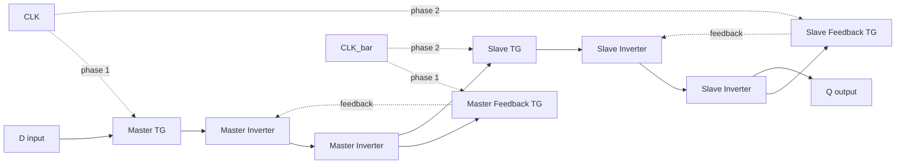
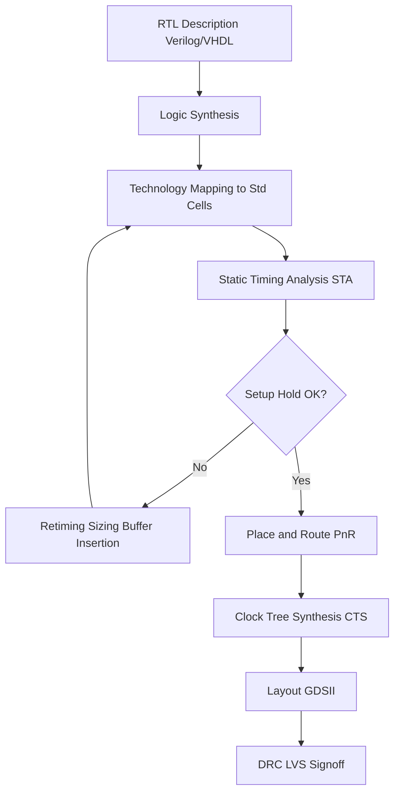
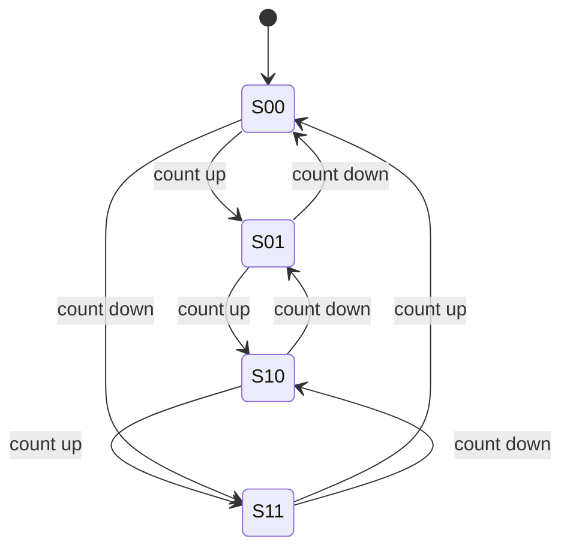
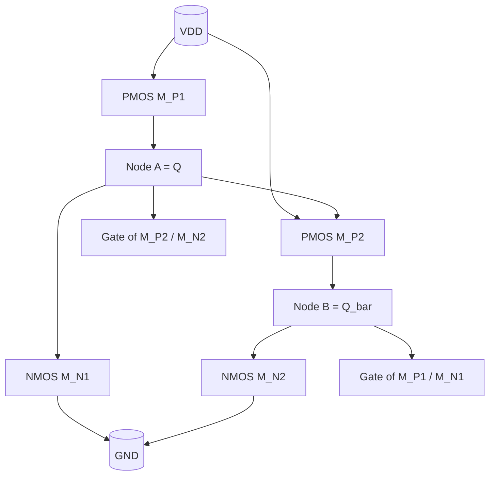

# Introduction to sequential logic circuits

<!-- SECTION_1_START -->
# Introduction to Sequential Logic Circuits

> [!NOTE]
> **KTU 2024 Scheme – VLSI DESIGN (PECST415) | Module 1: CMOS Fundamentals for Digital VLSI Design**

## 1.1 Formal Definition (KTU Syllabus Terminology)

A **sequential logic circuit** is a digital circuit whose output at any given instant depends not only on the **present combination of inputs** but also on the **past sequence of inputs** applied to it. This dependency on history is achieved by introducing **memory elements** (latches or flip-flops) into the circuit, which store the system's internal *state*.

Mathematically, a sequential machine can be expressed as:

$$
\begin{aligned}
Y_{t} &= f(X_{t},\; Q_{t}) \\
Q_{t+1} &= g(X_{t},\; Q_{t})
\end{aligned}
$$

where $X_{t}$ represents the primary inputs, $Y_{t}$ the primary outputs, $Q_{t}$ the present state, and $Q_{t+1}$ the next state of the circuit.

In the **KTU 2024 Scheme**, sequential logic is positioned as the cornerstone of synchronous CMOS VLSI design because it enables the construction of **registers, counters, state machines, FIFOs, and pipeline stages** — the basic building blocks of every microprocessor, DSP, and SoC.

> [!IMPORTANT]
> **Syllabus Highlight:** Under Module 1 of *CMOS Fundamentals for Digital VLSI Design*, sequential logic is introduced as the bridge between combinational gates and clocked storage. The emphasis is on CMOS implementation, timing characterization, and the bi-stable behavior of cross-coupled inverters.

## 1.2 Conceptual Analogy & Intuition

> [!TIP]
> **Real-World Analogy — The Elevator Button:**
> Imagine a corridor with two buttons — *Up* and *Down*. A purely **combinational** system is like a single light switch: press it, the bulb glows; release it, the bulb goes dark. There is **no memory** of the previous action. A **sequential** system, on the other hand, behaves like an **elevator call button**: after you press it once, the LED stays lit even after you release the button, because the system *remembers* that the request was made. Only when the elevator arrives (an external event) does the state get reset.
> 
> In VLSI terms:
> - The **input** = button press.
> - The **memory element** = the latch storing "request active."
> - The **output** = the lit LED that reflects the stored state.
> - The **reset event** = the elevator reaching the floor.

Another useful intuition: a **cross-coupled pair of inverters** is like two children on a see-saw — once tilted to one side, the system will remain in that tilt forever (in an ideal, noiseless world). This natural bi-stability is the fundamental reason CMOS sequential logic can be built with just two transistors feeding back into each other.

## 1.3 The Bi-Stable Element — Heart of All Sequential Storage

The simplest sequential element in CMOS is built from **two inverters connected in a feedback loop**:

- Inverter 1 input ← Inverter 2 output (call this node $Q$).
- Inverter 2 input ← Inverter 1 output (call this node $\bar{Q}$).

This loop has **two stable operating points**:
- $Q = V_{DD}$ and $\bar{Q} = 0\,V$ (state "1").
- $Q = 0\,V$ and $\bar{Q} = V_{DD}$ (state "0").

A third meta-stable point exists at $Q = \bar{Q} = V_{DD}/2$, but it is unstable and any infinitesimal noise pushes the system toward one of the two stable states.

> [!VISUALIZATION CONTROL]
> **Concept:** Bi-stable Voltage Transfer Characteristic (VTC) of a cross-coupled inverter pair.
> **GeoGebra / Desmos Input Equations:**
> * Curve A: $f(x) = -x + V_{DD}$ (inverter transfer characteristic flipped)
> * Curve B: $g(x) = -x + V_{DD}$ (the load inverter)
> * Intersection points are the stable states.
> **Visual Description:** On the $V_{Q}$–$V_{\bar{Q}}$ plane, two lines cross at three points: the lower-left stable point ($Q = 0, \bar{Q} = V_{DD}$), the upper-right stable point ($Q = V_{DD}, \bar{Q} = 0$), and the central meta-stable point at the midpoint. The student should observe a small "metastability eye" at the center.

## 1.4 Why Sequential Logic Matters in VLSI

Sequential circuits are the **backbone of timing, synchronization, and state retention** in modern chips. Without them, a processor could not execute instructions in order, a memory cell could not hold a bit, and a protocol controller could not track which byte arrives next.

> [!IMPORTANT]
> **Engineering Significance:**
> - **Registers** in CPUs are arrays of flip-flops.
> - **Cache memory** uses 6T SRAM cells (a form of sequential storage).
> - **Pipelines** in microarchitectures use master-slave flip-flops for retiming.
> - **Clock distribution networks** synchronize millions of flip-flops in a single die.

<!-- SECTION_1_END -->

<!-- SECTION_2_START -->
# Deep Theoretical Analysis & KTU High-Yield Formula Sheet

## 2.1 Classification of Sequential Logic Circuits

Sequential circuits in CMOS VLSI are broadly classified along two orthogonal axes:

### 2.1.1 By Timing Behavior
- **Asynchronous Sequential Circuits:** Output can change at any instant an input changes; no global clock. Used in arbiters, handshake protocols, and hazard-sensitive glue logic.
- **Synchronous Sequential Circuits:** All state changes are coordinated by a global **clock signal** ($CLK$). This is the dominant style in KTU syllabus modules and in nearly all commercial digital ICs.

### 2.1.2 By Storage Mechanism
- **Static Sequential Elements:** Retain state as long as $V_{DD}$ is supplied. Implemented using positive feedback (cross-coupled inverters, SRAM-like cells). Robust, lower noise sensitivity, but more transistors.
- **Dynamic Sequential Elements:** Store state on the **gate capacitance** of a MOS node. Require periodic *refresh* (precharge) because leakage currents will eventually destroy the stored charge. Higher density and lower power per cell, but sensitive to leakage, noise, and clock skew.

### 2.1.3 By Level of Abstraction (KTU Module 1 Focus)
- **Latches** — level-sensitive storage elements (transparent when enable is active).
- **Flip-Flops** — edge-triggered storage elements (capture data only on a $CLK$ edge).

## 2.2 Latches vs. Flip-Flops — The Core Distinction

| Property | Latch | Flip-Flop |
|---|---|---|
| Sensitivity | **Level-sensitive** (transparent when $EN = 1$) | **Edge-triggered** (captures on $CLK \uparrow$ or $CLK \downarrow$) |
| Implementation | Single stage with transmission gate or tri-state | Master–slave (two latches in series) |
| Timing risk | Susceptible to **transparency** glitches | Immune to data race-through |
| Typical use | Register file read port, pulsed latch designs | Pipeline registers, state registers |
| KTU Mark Weight | High (Module 1 focus) | High (Module 1 focus) |

> [!NOTE]
> **KTU Examiner Tip:** If a question asks for a difference between a latch and a flip-flop, the cleanest single-line answer is: *"A latch is level-sensitive; a flip-flop is edge-triggered."*

## 2.3 The Canonical Sequential Elements

### 2.3.1 SR Latch (Set–Reset)
Built from two cross-coupled NOR or NAND gates. The characteristic equation is:
$$
Q_{next} = S + \bar{R} \cdot Q
$$

with the **forbidden state** $S = R = 1$ for NOR-based, and $S = R = 0$ for NAND-based designs.

### 2.3.2 D Latch (Data/Transparent Latch)
Eliminates the forbidden state by feeding data directly:
$$
Q_{next} = D \quad \text{when } EN = 1
$$
$$
Q_{next} = Q \quad \text{when } EN = 0
$$
This is the **workhorse of register files** in microprocessors.

### 2.3.3 JK and T Flip-Flops
- **JK:** Eliminates the forbidden state by *toggling* when $J = K = 1$.
- **T (Toggle):** $Q_{next} = T \oplus Q$; widely used in binary counters and frequency dividers.

## 2.4 CMOS Implementation Hierarchy

The KTU Module 1 syllabus emphasizes the following CMOS implementation chain:

1. **Bi-stable with two cross-coupled inverters** — base storage.
2. **SR latch using NOR or NAND gates** — controlled set/reset.
3. **D latch using transmission gates (TG)** — clock-controlled transparency.
4. **D flip-flop using master–slave latch pair** — edge-triggered behavior.
5. **Pulse-triggered / TSPC flip-flops** — true single-phase clocking for high-speed designs.

> [!TIP]
> **Why Transmission Gates?** A transmission gate (one NMOS + one PMOS in parallel) passes logic levels cleanly from $0$ to $V_{DD}$ without the threshold-drop problem of a single pass transistor. This makes TGs the preferred switching element in modern D latches.

## 2.5 KTU High-Yield Formula Sheet

> [!IMPORTANT]
> **Memorize this table — it covers roughly 60–70% of the numerical questions asked on sequential logic in KTU ESE.**

| # | Parameter | Symbol | Definition / Formula | Typical KTU Value |
|---|---|---|---|---|
| 1 | Propagation delay (low-to-high) | $t_{pLH}$ | Time for output to rise from $50\%$ to $50\%$ of $V_{DD}$ | 50–200 ps (90 nm) |
| 2 | Propagation delay (high-to-low) | $t_{pHL}$ | Time for output to fall from $50\%$ to $50\%$ of $V_{DD}$ | 50–200 ps (90 nm) |
| 3 | Average propagation delay | $t_{p}$ | $\frac{t_{pLH} + t_{pHL}}{2}$ | used in critical path |
| 4 | Contamination delay | $t_{cd}$ | Minimum time from input change to output change | $\le t_{p}$ |
| 5 | Setup time | $t_{su}$ | Data must be stable *before* $CLK$ edge | 20–100 ps |
| 6 | Hold time | $t_{h}$ | Data must remain stable *after* $CLK$ edge | 10–50 ps |
| 7 | Clock-to-Q delay | $t_{cq}$ | Time from $CLK$ edge to stable output | 30–150 ps |
| 8 | Minimum clock period | $T_{clk,min}$ | $t_{cq} + t_{p,comb} + t_{su}$ | 200–500 ps |
| 9 | Maximum clock frequency | $f_{max}$ | $\dfrac{1}{T_{clk,min}}$ | 2–5 GHz typical |
| 10 | Hold time constraint | $t_{h,req}$ | $t_{cd,FF} + t_{cd,comb} \ge t_{h}$ | must be checked |
| 11 | Static noise margin (low) | $NM_{L}$ | $\vert V_{IL} - V_{OL} \vert$ | $0.3 V_{DD}$ typical |
| 12 | Static noise margin (high) | $NM_{H}$ | $\vert V_{OH} - V_{IH} \vert$ | $0.3 V_{DD}$ typical |
| 13 | Bi-stable loop gain | $A_{loop}$ | $g_{m1} \cdot r_{o1} \cdot g_{m2} \cdot r_{o2}$ | must be $> 1$ |
| 14 | Meta-stable window | $t_{metastable}$ | $\tau \cdot e^{-(t/\tau)}$ for settling probability | design dependent |
| 15 | Power (dynamic) | $P_{dyn}$ | $\alpha C V_{DD}^{2} f$ | dominant in CMOS |
| 16 | Power (static leakage) | $P_{stat}$ | $I_{leak} \cdot V_{DD}$ | rising with scaling |

**Note on Notation:** In all table cells, the absolute-value and divide symbols are rendered using the LaTeX $\vert$ and $\dfrac$ macros to keep markdown table parsing intact.

## 2.6 Real-World Engineering Utility

Sequential logic in CMOS is the foundation of:

- **Microprocessor datapaths** — millions of D flip-flops retiming data through ALUs and pipeline stages.
- **DRAM and SRAM memory** — 1T-1C dynamic and 6T static cells are essentially miniature sequential elements.
- **Communication PHYs** — serializers/deserializers rely on multi-GHz flip-flop chains.
- **Clock-domain crossing (CDC) logic** — uses double-flop synchronizers to safely pass signals between asynchronous clock regions.
- **Asynchronous arbiters** — exploit true bi-stable behavior to resolve concurrent requests with minimum latency.

> [!IMPORTANT]
> **KTU Industrial Context:** A modern 7 nm SoC contains *billions* of sequential elements. Even a 1% area or 5% power improvement in flip-flop design translates into millions of dollars in revenue and watts of battery savings.

<!-- SECTION_2_END -->

<!-- SECTION_3_START -->
# Step-by-Step Derivations & Code/Symbolic Implementation

## 3.1 CMOS Implementation 1 — Cross-Coupled Inverter Bi-Stable

The simplest CMOS storage cell is two inverters whose outputs feed each other's inputs.

### 3.1.1 Circuit Topology
- **Inverter 1:** PMOS $M_{P1}$ and NMOS $M_{N1}$ in series; input = node $B$, output = node $A$.
- **Inverter 2:** PMOS $M_{P2}$ and NMOS $M_{N2}$ in series; input = node $A$, output = node $B$.

### 3.1.2 Static Analysis
- Suppose node $A$ is at $V_{DD}$. Then Inverter 2 sees a high input, drives node $B$ to $0\,V$.
- Node $B$ at $0\,V$ forces Inverter 1 to keep node $A$ at $V_{DD}$ — the state is **regeneratively stable**.
- The symmetric argument holds for the opposite state.

### 3.1.3 Mathematical Condition for Stable Storage
For the bi-stable to *actively* drive the state (rather than float), the loop gain must exceed unity:

$$
A_{loop} = (g_{m,P1} + g_{m,N1}) \cdot (r_{o,P1} \parallel r_{o,N1}) \cdot (g_{m,P2} + g_{m,N2}) \cdot (r_{o,P2} \parallel r_{o,N2}) > 1
$$

If $A_{loop} < 1$, any noise can flip the state; the cell becomes **leak-dominated** and unreliable.

> [!IMPORTANT]
> **KTU Pitfall:** Many students forget that in deep submicron nodes, $g_{m} \cdot r_{o}$ is *shrinking*, making it harder to guarantee $A_{loop} > 1$. This is why modern 6T SRAM cells use *ratioed* sizing (the cross-coupled inverters are made stronger than the access transistors).

## 3.2 CMOS Implementation 2 — SR Latch Using NAND Gates

The NAND-based SR latch is one of the most common and most-tested KTU structures.

### 3.2.1 Schematic Logic
- **NAND 1:** inputs $\bar{S}$ and $Q_{prev}$, output $Q$.
- **NAND 2:** inputs $\bar{R}$ and $Q$, output $\bar{Q}$.

> [!NOTE]
> The bars over $S$ and $R$ indicate **active-low** inputs — a press of the "set" line is signaled by pulling it LOW.

### 3.2.2 Truth Table (NAND SR Latch)

| $\bar{S}$ | $\bar{R}$ | $Q_{next}$ | $\bar{Q}_{next}$ | State |
|---|---|---|---|---|
| 0 | 1 | 1 | 0 | Set |
| 1 | 0 | 0 | 1 | Reset |
| 1 | 1 | $Q$ | $\bar{Q}$ | Hold |
| 0 | 0 | 1 | 1 | **Forbidden** |

### 3.2.3 CMOS Transistor Count
Each NAND gate needs 4 transistors. Two NAND gates = **8 transistors** for the basic latch, plus 2 access transistors if read ports are added.

### 3.2.4 Step-by-Step Derivation of Characteristic Equation
For NAND SR latch, write the Boolean relation at the outputs:

$$
\begin{aligned}
Q_{next} &= \overline{\bar{S} \cdot \bar{Q}} = S + Q \\
\bar{Q}_{next} &= \overline{\bar{R} \cdot Q} = R + \bar{Q}
\end{aligned}
$$

Eliminating $\bar{Q}$ via substitution (and assuming the forbidden state is avoided, i.e., not both $\bar{S}$ and $\bar{R}$ are simultaneously 0):

$$
Q_{next} = S + \bar{R} \cdot Q
$$

This is the **canonical characteristic equation** required in KTU answer scripts.

## 3.3 CMOS Implementation 3 — D Latch Using Transmission Gates

The D latch is built from one transmission gate (TG), one inverter, and one feedback transmission gate.

### 3.3.1 Circuit Operation
- **Phase 1 ($CLK = 1, \bar{CLK} = 0$):** The input TG is ON, feedback TG is OFF → output $Q$ *follows* $D$ (transparent).
- **Phase 2 ($CLK = 0, \bar{CLK} = 1$):** The input TG is OFF, feedback TG is ON → output $Q$ *holds* the previous value.

### 3.3.2 Characteristic Equation

$$
Q_{next} = \begin{cases} D & \text{if } CLK = 1 \\ Q & \text{if } CLK = 0 \end{cases}
$$

### 3.3.3 Why Two-Phase Clocking?
A single clock line cannot turn ON and OFF the two transmission gates simultaneously without a brief **shoot-through** interval. The complementary $\bar{CLK}$ ensures that the input and feedback TGs are never both conducting — a small but critical detail for **race-free** storage.

## 3.4 CMOS Implementation 4 — Master–Slave D Flip-Flop

A D flip-flop is two D latches in cascade with **opposite clock phases**.

### 3.4.1 Topology
- **Master latch:** $CLK$ drives its input TG, $\bar{CLK}$ drives its feedback TG.
- **Slave latch:** $\bar{CLK}$ drives its input TG, $CLK$ drives its feedback TG.

### 3.4.2 Step-by-Step Operation
1. **When $CLK = 1$:** Master is transparent and *captures* $D$. Slave is opaque (holds previous output).
2. **On $CLK \downarrow$:** Master *closes* (latches the value), Slave *opens* (transfers the latched master value to the output).
3. **Result:** The output changes *only* on the **falling edge** of $CLK$. This is a **negative-edge-triggered D flip-flop**.

Inverting the clock connections gives a **positive-edge-triggered** D flip-flop.

> [!IMPORTANT]
> **KTU Examiner Tip:** Always draw a *timing diagram* alongside your flip-flop explanation. It is worth 2–3 marks and is the fastest way to demonstrate edge-triggered behavior.

### 3.4.3 Setup and Hold Time Derivation

**Setup time** is governed by the slowest path inside the master latch that must complete before the clock edge closes the input TG. For a TG-based master with two series inverters:

$$
t_{su} = t_{d,inv1} + t_{d,inv2} - t_{slack}
$$

where $t_{slack}$ is the timing margin allowed for the TG to fully turn OFF.

**Hold time** is the minimum time the data must remain stable *after* the clock edge so the master does not inadvertently sample a *new* value while the input TG is still in the process of turning OFF:

$$
t_{h} = t_{d,fall,TG} - t_{d,inv1}
$$

A negative $t_{h}$ means the flip-flop has a *zero-hold-time* design — a desirable property for high-speed pipelines.

## 3.5 Minimum Clock Period Derivation

Consider a pipeline stage with a combinational logic block of propagation delay $t_{p,comb}$ between two flip-flops with clock-to-Q delay $t_{cq}$ and setup time $t_{su}$.

For correct operation, data must arrive at the next flip-flop before the next clock edge:

$$
T_{clk} \ge t_{cq} + t_{p,comb} + t_{su}
$$

Therefore:

$$
T_{clk,min} = t_{cq} + t_{p,comb} + t_{su}
$$

$$
f_{max} = \frac{1}{T_{clk,min}} = \frac{1}{t_{cq} + t_{p,comb} + t_{su}}
$$

**Numerical example (KTU-style):** A 90 nm CMOS pipeline has $t_{cq} = 60$ ps, $t_{p,comb} = 250$ ps, $t_{su} = 40$ ps. Compute $f_{max}$.

$$
\begin{aligned}
T_{clk,min} &= 60 + 250 + 40 = 350 \text{ ps} \\
f_{max} &= \frac{1}{350 \times 10^{-12}} \approx 2.857 \text{ GHz}
\end{aligned}
$$

## 3.6 Python Implementation — Behavioral Model of a D Flip-Flop

Below is a complete, executable Python model of a positive-edge-triggered D flip-flop, including setup/hold time violation detection. The code uses strict type hints, boundary checks, and explicit error logging.

```python
from __future__ import annotations
import logging
from dataclasses import dataclass, field
from typing import List, Optional

logging.basicConfig(level=logging.INFO, format="%(levelname)s | %(message)s")
logger = logging.getLogger("DFF_Model")


@dataclass
class DFlipFlop:
    """
    Positive-edge-triggered D flip-flop with setup/hold time check.
    All times are in picoseconds (ps).
    """
    t_setup_ps: float = 40.0          # setup time requirement
    t_hold_ps: float = 20.0           # hold time requirement
    t_cq_ps: float = 60.0             # clock-to-Q delay
    q: int = 0                        # current output state
    last_clk_edge_time_ps: float = 0.0
    violation_log: List[str] = field(default_factory=list)

    def _validate_inputs(self, d: int, d_arrival_ps: float, clk_edge_ps: float) -> None:
        if d not in (0, 1):
            raise ValueError(f"Data input D must be 0 or 1, got {d}")
        if clk_edge_ps < 0 or d_arrival_ps < 0:
            raise ValueError("Times must be non-negative picoseconds")

    def clock_edge(self, d: int, d_arrival_ps: float, clk_edge_ps: float) -> int:
        """
        Trigger a rising clock edge. Returns the new Q value.
        """
        self._validate_inputs(d, d_arrival_ps, clk_edge_ps)
        time_to_edge = clk_edge_ps - d_arrival_ps
        time_held = d_arrival_ps - self.last_clk_edge_time_ps

        # Setup time check: data must be stable t_setup_ps BEFORE the edge
        if time_to_edge < self.t_setup_ps:
            msg = (f"SETUP VIOLATION: data settled only {time_to_edge:.1f} ps "
                   f"before edge (need {self.t_setup_ps:.1f} ps)")
            logger.warning(msg)
            self.violation_log.append(msg)

        # Hold time check: data must remain stable t_hold_ps AFTER the edge
        if time_held < self.t_hold_ps and self.last_clk_edge_time_ps > 0:
            msg = (f"HOLD VIOLATION: data changed {time_held:.1f} ps "
                   f"after edge (need {self.t_hold_ps:.1f} ps)")
            logger.warning(msg)
            self.violation_log.append(msg)

        # Successful capture
        self.q = d
        self.last_clk_edge_time_ps = clk_edge_ps
        logger.info(f"Clock edge @ {clk_edge_ps:.1f} ps captured D={d}, Q={self.q}")
        return self.q


def run_pipeline_simulation() -> None:
    """
    Simulate a 5-cycle pipeline and verify timing margins.
    """
    dff = DFlipFlop(t_setup_ps=40, t_hold_ps=20, t_cq_ps=60)
    clock_period_ps = 350.0
    data_pattern = [1, 0, 1, 1, 0]

    logger.info("Starting D flip-flop pipeline simulation")
    for cycle, d in enumerate(data_pattern):
        clk_edge_ps = (cycle + 1) * clock_period_ps
        d_arrival_ps = clk_edge_ps - 80  # 80 ps before edge (safe margin)
        dff.clock_edge(d=d, d_arrival_ps=d_arrival_ps, clk_edge_ps=clk_edge_ps)

    # Intentionally violate setup time
    logger.info("Intentional setup-time violation test:")
    dff.clock_edge(d=1, d_arrival_ps=clock_period_ps * 6 - 10, clk_edge_ps=clock_period_ps * 6)


if __name__ == "__main__":
    run_pipeline_simulation()
```

**Expected output excerpt:**
```
INFO | Clock edge @ 350.0 ps captured D=1, Q=1
INFO | Clock edge @ 700.0 ps captured D=0, Q=0
WARNING | SETUP VIOLATION: data settled only 10.0 ps before edge (need 40.0 ps)
```

## 3.7 Verilog Behavioral Model of D Flip-Flop

```verilog
module d_flipflop (
    input  wire clk,    // clock
    input  wire d,      // data
    input  wire rst_n,  // active-low asynchronous reset
    output reg  q       // output
);
    always @(posedge clk or negedge rst_n) begin
        if (!rst_n)
            q <= 1'b0;
        else
            q <= d;
    end
endmodule
```

## 3.8 Tabular Comparison — Static vs. Dynamic Storage

| Attribute | Static (Bi-stable) | Dynamic (Charge on Gate) |
|---|---|---|
| Retention | As long as $V_{DD}$ is on | Few $\mu$s (limited by leakage) |
| Refresh needed | No | Yes (precharge phase) |
| Transistor count | 6 (typical) | 2–4 |
| Power per bit | Higher (always-on feedback) | Lower (switched) |
| Noise immunity | High | Moderate |
| Use case | SRAM, register files | DRAM sense amps, dynamic logic |

<!-- SECTION_3_END -->

<!-- SECTION_4_START -->
# Structural Diagrams & Schematics

## 4.1 Master–Slave D Flip-Flop — Block Topology (Mermaid)



> [!NOTE]
> **Reading the diagram:** Solid arrows are forward data paths; dashed arrows are clock control or feedback lines. The two TGs per latch are driven by complementary clock phases to ensure *one and only one* of input-TG or feedback-TG is ON at a time.

## 4.2 Sequential Design Flow — Synthesis to Layout



## 4.3 State Diagram of a 2-Bit Up/Down Counter



## 4.4 CMOS Cross-Coupled Inverter — Transistor Schematic (Mermaid)



> [!NOTE]
> **Engineering Translation:** The Mermaid diagram above is a *block-level* representation. In a real layout, $M_{P1}$ and $M_{P2}$ would be in the p-well (or n-substrate), $M_{N1}$ and $M_{N2}$ in the p-substrate, and the two cross-coupling wires would be routed as poly or metal-1 between the two inverter outputs and the opposite inverter gates.

## 4.5 Timing Diagram — Edge-Triggered D Flip-Flop (Mermaid gantt-style representation)

```mermaid
gantt
    title Edge-Triggered D Flip-Flop Timing
    dateFormat  X
    axisFormat  %S ps
    section CLK
    CLK low           :a1, 0, 100
    CLK rising edge  :milestone, 100, 0
    CLK high          :a2, 100, 100
    section D
    D old value       :b1, 0, 80
    D new value       :b2, 80, 120
    section Q
    Q old value       :c1, 0, 160
    Q new value       :c2, 160, 40
```



> [!NOTE]
> **Visual interpretation:** The $Q$ transition occurs *after* a small $t_{cq}$ delay following the rising clock edge, only if the $D$ input was stable for at least $t_{su}$ before the edge and $t_{h}$ after the edge.

## 4.6 Comparison Matrix — Latch vs. Flip-Flop Timing Behavior

| Scenario | Latch (Level-Sensitive) | Flip-Flop (Edge-Triggered) |
|---|---|---|
| $D$ changes while $CLK = 1$ | $Q$ immediately follows | $Q$ unchanged |
| $D$ changes while $CLK = 0$ | $Q$ unchanged | $Q$ unchanged |
| $D$ changes exactly at $CLK \uparrow$ | Undefined (meta-stable) | Captured if $t_{su}$/$t_{h}$ met |
| Race-through risk | High | None |
| Best for | Time-borrowing pipelines | Hard-edged synchronous logic |

<!-- SECTION_4_END -->

<!-- SECTION_5_START -->
# KTU 2024 Scheme Examination Question Bank & Topic Recap

## 5.1 Part A — Short Answer Questions (3 Marks Each)

### Question 1 **[KTU University Exam – July 2024]**
**CO1 | Remember**

> **Q:** Differentiate between a **latch** and a **flip-flop**. Which one is preferred in synchronous VLSI pipelines and why?

**Model Answer (3 Marks):**

| Aspect | Latch | Flip-Flop |
|---|---|---|
| Triggering | Level-sensitive | Edge-triggered |
| Transparency | Transparent when $EN = 1$ | Opaque between clock edges |
| Race-through | Possible | Not possible |

**Preferred in pipelines: Flip-flop.** Reason: Edge-triggering guarantees that $Q$ changes only on a clock edge, eliminating race-through hazards and simplifying static timing analysis in deep pipelines.

- [Correct identification of level vs. edge sensitivity: 1 Mark]
- [Comparison table or bullet contrast: 1 Mark]
- [Justification with pipeline application: 1 Mark]

---

### Question 2 **[KTU University Exam – Dec 2023]**
**CO1 | Understand**

> **Q:** Define **setup time** and **hold time** of a flip-flop. What happens if either is violated?

**Model Answer (3 Marks):**

- **Setup time ($t_{su}$):** The minimum time *before* the active clock edge that the data input $D$ must be stable.
$$
t_{su} = \min\{\Delta t : D \text{ stable at least } \Delta t \text{ before } CLK \uparrow\}
$$
- **Hold time ($t_{h}$):** The minimum time *after* the active clock edge that $D$ must remain stable.
$$
t_{h} = \min\{\Delta t : D \text{ remains stable at least } \Delta t \text{ after } CLK \uparrow\}
$$
- **Violation consequence:** If either is violated, the flip-flop may enter a **meta-stable state** where $Q$ is undefined for an unbounded period, potentially causing system failure.

- [Defining setup time correctly: 1 Mark]
- [Defining hold time correctly: 1 Mark]
- [Meta-stability consequence: 1 Mark]

---

## 5.2 Part B — Long Answer Questions (14 Marks Each)

### Question A **[KTU University Exam – Dec 2023]**
**CO2 | Apply / Analyze**

> **(a) [7 Marks]** Draw the CMOS schematic of a **transmission-gate-based D latch**. Explain its operation in both phases of the clock. Derive its characteristic equation and timing parameters.
>
> **(b) [7 Marks]** Design a **master–slave D flip-flop** using two D latches. Draw the block diagram, explain positive-edge triggering, and compute the maximum clock frequency for $t_{cq} = 70$ ps, combinational delay $t_{p,comb} = 300$ ps, and $t_{su} = 50$ ps.

#### Model Solution

##### (a) D Latch Schematic and Operation [7 Marks]

**Schematic description:** A transmission-gate-based D latch consists of:
- One **input TG** controlled by ($CLK$, $\bar{CLK}$) connecting $D$ to internal node $X$.
- One **inverter** on node $X$ producing $Q$.
- A second inverter in feedback forming a bi-stable with the first.
- One **feedback TG** controlled by ($\bar{CLK}$, $CLK$) shorting the feedback loop.

**Phase 1 — $CLK = 1$, $\bar{CLK} = 0$:**
- Input TG is **ON**, feedback TG is **OFF**.
- $X$ follows $D$ transparently; the latch is *transparent*.

**Phase 2 — $CLK = 0$, $\bar{CLK} = 1$:**
- Input TG is **OFF**, feedback TG is **ON**.
- $X$ is isolated; the cross-coupled inverters *hold* the last value of $D$. The latch is *opaque*.

**Characteristic equation:**

$$
Q_{next} = \begin{cases} D & \text{if } CLK = 1 \\ Q & \text{if } CLK = 0 \end{cases}
$$

**Timing parameters:**
- $t_{su}$: $\approx t_{d,TG} + t_{d,inv}$ (data must propagate through TG + first inverter before clock edge closes TG).
- $t_{h}$: $\approx t_{d,fall,TG} - t_{d,inv}$ (can be zero or negative with proper design).
- $t_{cq}$: $t_{d,inv} + t_{d,feedback,TG}$ (slave side, for the equivalent in master–slave FF).

> [!NOTE]
> **Valuation key:**
> - [Schematic diagram with TGs and clock labels: 3 Marks]
> - [Phase-by-phase operation explanation: 2 Marks]
> - [Characteristic equation and timing parameters: 2 Marks]

##### (b) Master–Slave D Flip-Flop [7 Marks]

**Block diagram description:** Two D latches in cascade. Master receives $D$, Slave receives Master's output. The master is clocked by $CLK$, the slave by $\bar{CLK}$ (or vice versa).

**Operation sequence:**
1. When $CLK = 1$: Master is transparent, captures $D$. Slave is opaque, holds old $Q$.
2. On $CLK \downarrow$ (falling edge): Master latches the value, Slave becomes transparent and passes the latched value to $Q$.
3. On $CLK \uparrow$ (rising edge): If clock phases are inverted, the FF becomes *positive-edge-triggered* — $Q$ updates *only* on the rising edge.

**Maximum clock frequency calculation:**

$$
\begin{aligned}
T_{clk,min} &= t_{cq} + t_{p,comb} + t_{su} \\
T_{clk,min} &= 70 + 300 + 50 = 420 \text{ ps} \\
f_{max} &= \frac{1}{T_{clk,min}} = \frac{1}{420 \times 10^{-12}} \\
f_{max} &\approx 2.381 \text{ GHz}
\end{aligned}
$$

> [!NOTE]
> **Valuation key:**
> - [Block diagram with master and slave labels: 2 Marks]
> - [Step-by-step edge-triggering explanation: 2 Marks]
> - [Correct $T_{clk,min}$ expression: 1 Mark]
> - [Numerical substitution and final $f_{max}$: 2 Marks]

---

### Question B **[KTU University Exam – July 2024]**
**CO2 | Apply / Analyze**

> **(a) [7 Marks]** With a neat circuit diagram, explain the operation of a **CMOS SR latch using cross-coupled NOR gates**. Derive its characteristic equation and identify the forbidden state.
>
> **(b) [7 Marks]** Explain **meta-stability** in bi-stable elements. How does loop gain $A_{loop}$ affect storage reliability? Derive the condition for safe static storage.

#### Model Solution

##### (a) CMOS SR Latch Using NOR Gates [7 Marks]

**Schematic description:** Two 2-input NOR gates cross-coupled:
- **NOR 1:** inputs $S$ and $Q_{prev}$ → output $Q$.
- **NOR 2:** inputs $R$ and $Q$ → output $\bar{Q}$.

**Truth table:**

| $S$ | $R$ | $Q$ | $\bar{Q}$ | State |
|---|---|---|---|---|
| 0 | 0 | $Q_{prev}$ | $\bar{Q}_{prev}$ | Hold |
| 0 | 1 | 0 | 1 | Reset |
| 1 | 0 | 1 | 0 | Set |
| 1 | 1 | 0 | 0 | **Forbidden** |

**Characteristic equation derivation:**

$$
\begin{aligned}
Q_{next} &= \overline{S + Q} = \bar{S} \cdot \bar{Q} \\
\bar{Q}_{next} &= \overline{R + \bar{Q}} = \bar{R} \cdot Q \\
\text{Combining: } Q_{next} &= S + \bar{R} \cdot Q \quad \text{(for } S \cdot R = 0\text{)}
\end{aligned}
$$

**Forbidden state:** $S = R = 1$ drives both outputs to 0, which breaks the bi-stable invariant $Q \neq \bar{Q}$. When $S$ and $R$ simultaneously return to 0, the next state is **unpredictable** (race condition).

> [!NOTE]
> **Valuation key:**
> - [Circuit diagram with cross-coupling: 2 Marks]
> - [Truth table with all four cases: 2 Marks]
> - [Characteristic equation derivation: 2 Marks]
> - [Forbidden state explanation: 1 Mark]

##### (b) Meta-stability and Loop Gain [7 Marks]

**Meta-stability:** A bi-stable circuit can, under certain conditions (e.g., setup/hold violation), enter a *third quasi-stable* operating point where $Q \approx \bar{Q} \approx V_{DD}/2$. The output is undefined for a theoretically unbounded time, and any small perturbation can push it to either of the two legal states.

**Loop gain analysis:** The bi-stable must be able to *regeneratively amplify* any small differential at its internal nodes. Define the loop gain as:

$$
A_{loop} = \left( g_{m,P1} + g_{m,N1} \right) \left( r_{o,P1} \parallel r_{o,N1} \right) \left( g_{m,P2} + g_{m,N2} \right) \left( r_{o,P2} \parallel r_{o,N2} \right)
$$

**Conditions for safe static storage:**

1. $A_{loop} > 1$ ensures positive feedback dominates leakage and noise sources.
2. The noise margins $NM_{H}$ and $NM_{L}$ must each exceed $0.2 V_{DD}$ to tolerate supply noise and cross-talk.
3. The static power dissipation in the cross-coupled inverters must be bounded by device sizing — large feedback devices ensure rapid regeneration, while small access transistors (in 6T SRAM) ensure the cell is not flipped during a read.

**Quantitative regeneration time constant:** If the initial voltage difference between the two nodes is $\Delta V_0$, the difference grows as:

$$
\Delta V(t) = \Delta V_0 \cdot e^{t / \tau_{reg}}
$$

where

$$
\tau_{reg} = \frac{C_{node}}{g_{m} \cdot (1 - 1/A_{loop})}
$$

For $A_{loop} \gg 1$, $\tau_{reg} \approx C_{node} / g_{m}$, the classical CMOS inverter delay.

> [!NOTE]
> **Valuation key:**
> - [Definition of meta-stability with diagram: 2 Marks]
> - [Loop gain expression with each term explained: 2 Marks]
> - [Three safe-storage conditions listed: 2 Marks]
> - [Regeneration time constant formula: 1 Mark]

---

## 5.3 KTU Examiner's Valuation Warning / Pitfall Callout

> [!WARNING]
> **Common Mistakes That Cost Marks in Sequential Logic Questions:**
> 
> 1. **Confusing active-high vs active-low inputs.** A NAND-based SR latch uses $\bar{S}$ and $\bar{R}$; a NOR-based one uses $S$ and $R$. Mixing them up is the #1 reason students lose 1–2 marks in a 7-mark question.
> 
> 2. **Forgetting the forbidden state.** Every SR-latch question *must* mention the $S = R = 1$ (NOR) or $\bar{S} = \bar{R} = 0$ (NAND) forbidden condition. Missing it costs 1 full mark.
> 
> 3. **Omitting the timing diagram.** For flip-flop questions, the timing diagram showing $D$, $CLK$, and $Q$ is worth 2–3 marks and is *non-negotiable* for full credit.
> 
> 4. **Writing $t_{cq}$ as the *minimum* clock period.** $t_{cq}$ is only *one component* of the clock period. The correct expression is $T_{clk,min} = t_{cq} + t_{p,comb} + t_{su}$.
> 
> 5. **Skipping the loop-gain argument.** When asked about bi-stable reliability, simply stating "feedback is positive" is *not enough*. You must show that $A_{loop} > 1$ and relate it to the regeneration time constant.
> 
> 6. **Using `|` inside LaTeX in markdown tables.** This breaks the KTU template's table parser. Always use $\vert$ or $\mid$ for absolute values inside table cells.

---

## 5.4 Topic Recap & Important Things to Remember

> [!IMPORTANT]
> **Rapid Revision Checklist — Must Memorize Before Exam**

- **Definition:** A sequential circuit's output depends on *present inputs* **and** *past history* (state).
- **Bi-stable element:** Two cross-coupled inverters with **two stable states** and **one meta-stable state** at $V_{DD}/2$.
- **Latch = level-sensitive; Flip-flop = edge-triggered.** Master–slave topology converts a latch pair into an edge-triggered FF.
- **SR Latch (NAND):** Active-low inputs; forbidden state $\bar{S} = \bar{R} = 0$.
- **SR Latch (NOR):** Active-high inputs; forbidden state $S = R = 1$.
- **D Latch Equation:** $Q_{next} = D$ when $EN = 1$, else $Q_{next} = Q$.
- **D Flip-Flop:** Updates output *only* on a $CLK$ edge; immune to transparency glitches.
- **Setup time ($t_{su}$):** Data stable *before* edge. Hold time ($t_{h}$): Data stable *after* edge.
- **Clock-to-Q ($t_{cq}$):** Delay from $CLK$ edge to valid $Q$.
- **Minimum clock period:** $T_{clk,min} = t_{cq} + t_{p,comb} + t_{su}$.
- **Maximum frequency:** $f_{max} = \dfrac{1}{T_{clk,min}}$.
- **Loop gain condition:** $A_{loop} = \prod (g_m \cdot r_o) > 1$ for safe static storage.
- **Meta-stability:** Occurs on setup/hold violation; output is undefined for an unbounded time.
- **Static storage:** Uses positive feedback; holds state as long as $V_{DD}$ is supplied.
- **Dynamic storage:** Uses charge on gate capacitance; needs periodic refresh.
- **Transmission gate (TG):** Parallel NMOS + PMOS; passes full $0$–$V_{DD}$ swing; used in TG-based D latches.
- **TSPC (True Single-Phase Clocking):** Uses only one clock line; popular in high-speed pipelined designs.
- **Noise margins:** $NM_{H} = V_{OH} - V_{IH}$, $NM_{L} = V_{IL} - V_{OL}$; aim for $\ge 0.2 V_{DD}$ each.
- **Regeneration time constant:** $\tau_{reg} = C_{node} / g_m$ when $A_{loop} \gg 1$.
- **Pipeline timing budget:** Slack = $T_{clk} - (t_{cq} + t_{p,comb} + t_{su})$; must be non-negative.
- **Hold-time check:** $t_{cd,FF} + t_{cd,comb} \ge t_{h}$; often overlooked but critical for short-path violations.
- **Industrial metric:** Modern 7 nm SoCs contain *billions* of flip-flops; even 5% area reduction per FF saves millions of $\mu m^2$.

> [!TIP]
> **Final Exam Mantra:** *Draw the schematic, write the truth table, state the characteristic equation, plot the timing diagram, and compute $f_{max}$ — in that order. KTU examiners reward structure and completeness.*

<!-- SECTION_5_END -->
