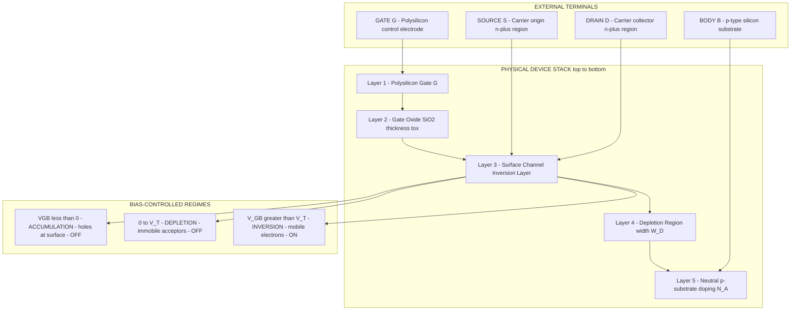
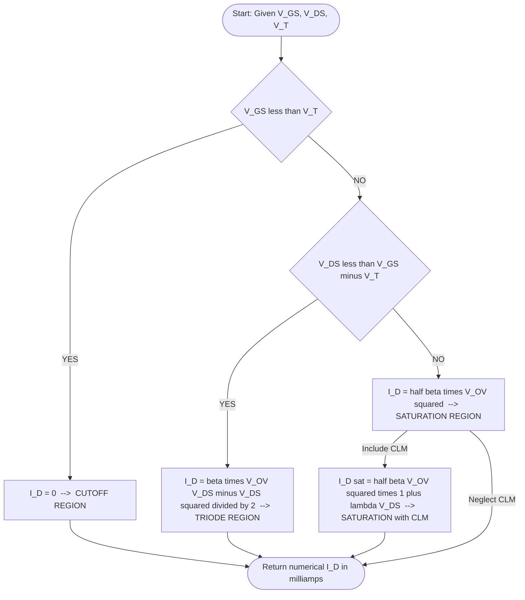
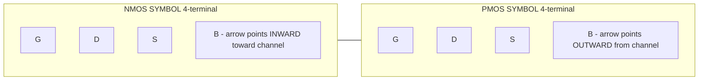

# MOS transistor theory and operation

<!-- SECTION_1_START -->

# MOS Transistor Theory and Operation

## 1.1 Formal Academic Definition

The **MOSFET (Metal-Oxide-Semiconductor Field Effect Transistor)** is the fundamental three-terminal active device of modern digital VLSI design. In the context of KTU 2024 Scheme Module 1, the **n-channel MOSFET (NMOS)** and **p-channel MOSFET (PMOS)** are studied as voltage-controlled current sources whose conduction channel is electrostatically induced (or "inverted") beneath a thin silicon-dioxide ($SiO_2$) gate insulator by the application of a gate-to-source potential ($V_{GS}$) exceeding a critical **threshold voltage ($V_{T}$ or $V_{TH}$)**.

> [!IMPORTANT]
> **KTU Syllabus Highlight (PECST415, Module 1):**
> The MOS Transistor is the *primary building block* of all CMOS logic families. A clear understanding of its $I$–$V$ equations, threshold voltage, and second-order effects (body effect, channel-length modulation) is mandatory before studying CMOS inverters, NAND/NOR gates, and complex combinational logic.

### 1.2 Conceptual Analogy & Intuitive Overview

Imagine the MOS transistor as a **pressurised water tap** connected to a flexible rubber pipe.

- The **Gate (G)** is the *hand pushing the handle* — it controls the flow but no water ever passes through the hand.
- The **Source (S)** is the *inlet reservoir*.
- The **Drain (D)** is the *outlet spout*.
- The **Channel** is the *rubber pipe itself* — initially pinched shut, but as more pressure (gate voltage) is applied, the pipe opens wider, allowing more current.
- The **Threshold Voltage ($V_{T}$)** is the *minimum hand pressure* required before a single drop of water starts flowing.
- The **Substrate / Body (B)** is the *mounting bracket* of the tap; when it is not at the same potential as the source, the required hand pressure changes — this is the **body effect**.

Once $V_{GS} > V_{T}$, a thin sheet of mobile electrons (the **inversion layer**) is formed at the silicon surface, physically creating the conducting channel between source and drain. Apply a $V_{DS}$, and electrons drift from source to drain, giving the **drain current ($I_{D}$)**.

> [!NOTE]
> **Key physical constants used throughout this module (memorise for numerical problems):**
> - Oxide permittivity: $\varepsilon_{ox} = 3.9 \times \varepsilon_{0} \approx 3.45 \times 10^{-11}\ \text{F/m}$
> - Silicon permittivity: $\varepsilon_{si} = 11.7 \times \varepsilon_{0} \approx 1.04 \times 10^{-10}\ \text{F/m}$
> - Electronic charge: $q = 1.6 \times 10^{-19}\ \text{C}$
> - Intrinsic carrier concentration of Si at $300\ \text{K}$: $n_{i} = 1.5 \times 10^{10}\ \text{cm}^{-3}$
> - Thermal voltage: $V_{T(\text{thermal})} = \dfrac{kT}{q} \approx 25.85\ \text{mV}$ at room temperature
> - Electron mobility in Si: $\mu_{n} \approx 1350\ \text{cm}^{2}/\text{V}\cdot\text{s}$ (surface, lightly doped)
> - Hole mobility in Si: $\mu_{p} \approx 480\ \text{cm}^{2}/\text{V}\cdot\text{s}$

### 1.3 The Four-Terminal MOS Device

Although a MOSFET has three electrical terminals in most digital applications, it is physically a **four-terminal** device:

| Terminal | Symbol | Function in NMOS |
|---|---|---|
| Gate | $G$ | Controls channel formation (input node) |
| Source | $S$ | Origin of carriers (electrons) entering channel |
| Drain | $D$ | Exit of carriers (electrons) leaving channel |
| Body / Bulk / Substrate | $B$ | The p-type wafer on which the device is built; must be tied to the lowest potential for NMOS |

> [!VISUALIZATION CONTROL]
> **Concept:** Threshold-voltage triggering of the drain current
> **GeoGebra / Desmos Input Equations:**
> * Parametric $I_{D}$ for $V_{GS} = \{0.5,\ 1.0,\ 1.5,\ 2.0,\ 2.5\}$ V: `f(V) = (μ_n·C_ox·(W/L))·(V_GS-V_TH)·V_DS - 0.5·μ_n·C_ox·(W/L)·V_DS^2` evaluated up to $V_{DS,sat} = V_{GS}-V_{TH}$
> * Plot family: $V_{DS}$ on x-axis, $I_{D}$ on y-axis, with each curve shifted upwards as $V_{GS}$ increases.
> **Visual Description:** Student should observe a linear (ohmic) region for small $V_{DS}$, a "knee" at $V_{DS} = V_{GS} - V_{T}$, and a flat saturation plateau where $I_{D}$ becomes nearly independent of $V_{DS}$.

---

<!-- SECTION_1_END -->

<!-- SECTION_2_START -->

# Deep Theoretical Analysis & KTU High-Yield Formula Sheet

## 2.1 The Physical MOS Capacitor Structure

The **MOS capacitor** is the heart of the MOSFET. Consider an n-channel enhancement-mode device built on a p-type silicon substrate of doping concentration $N_{A}$ (acceptors, $\text{cm}^{-3}$):

1. A **p-type silicon substrate** (the body) provides the background doping.
2. A **thin silicon-dioxide ($SiO_2$)** layer of thickness $t_{ox}$ (typically $2\ \text{nm}$ to $10\ \text{nm}$ in modern processes) is grown thermally on the surface.
3. A **polysilicon gate** (modern processes) or metal gate (older processes) sits on top of the oxide.
4. Two heavily-doped n-type regions ($\text{n}^{+}$) are diffused/ion-implanted into the p-substrate, forming the **source** and **drain** regions.

## 2.2 The Three Modes of Surface Operation

When a voltage $V_{GB}$ is applied between gate and body (with source and drain grounded), the surface of the silicon undergoes three distinct regimes:

### (a) Accumulation ($V_{GB} < 0$ for p-substrate)
The negative gate voltage repels electrons in the p-substrate and **attracts holes** to the surface. The surface becomes more strongly p-type. No channel exists. The device is **OFF**.

### (b) Depletion ($0 < V_{GB} < V_{T}$)
A positive gate voltage repels the majority-carrier holes away from the surface, leaving behind a region of immobile negatively-charged acceptor ions — the **depletion region**. Still no mobile carriers, so the device is **OFF**.

### (c) Inversion ($V_{GB} \geq V_{T}$)
The positive gate voltage is now strong enough to **attract minority-carrier electrons** from deep within the substrate up to the surface. When the surface concentration of electrons equals the bulk hole concentration, the surface is said to be **"inverted"**. Beyond this point, an electron-rich **inversion layer** is formed, which acts as the conducting channel. The device turns **ON**.

> [!NOTE]
> **The Threshold Voltage ($V_{T}$)** is therefore defined as the gate-to-source voltage (with source and body grounded, and for an *enhancement-mode* device) at which the surface electron concentration equals the bulk hole concentration.

## 2.3 The Long-Channel $I_{D}$–$V_{DS}$ Equations

The cornerstone of digital CMOS design is the **square-law model** of drain current. For an **NMOS** transistor in the three operating regions:

### Triode (Linear) Region: $V_{DS} < V_{GS} - V_{T}$

$$
I_{D} = \mu_{n}\,C_{ox}\,\frac{W}{L}\left[(V_{GS}-V_{T})V_{DS} - \frac{V_{DS}^{2}}{2}\right]
$$

The transistor behaves like a voltage-controlled resistor. $I_{D}$ rises approximately linearly with $V_{DS}$ for small $V_{DS}$.

### Saturation Region: $V_{DS} \geq V_{GS} - V_{T}$

$$
I_{D} = \frac{1}{2}\,\mu_{n}\,C_{ox}\,\frac{W}{L}\,(V_{GS}-V_{T})^{2}
$$

The channel is "pinched off" near the drain, and $I_{D}$ becomes (ideally) independent of $V_{DS}$. The overdrive voltage $V_{OV} = V_{GS} - V_{T}$ controls the current quadratically.

### Cutoff Region: $V_{GS} \leq V_{T}$

$$
I_{D} = 0
$$

> [!IMPORTANT]
> **Where the square-law model is used in industry:**
> - Hand-analysis of CMOS inverter noise margins and DC transfer curves.
> - Quick sizing of transistors in static CMOS logic (e.g., sizing a PMOS to match NMOS rise/fall times).
> - Pedagogical derivations in $V_{T}$, $g_{m}$, and $r_{ds}$ calculations.
> In modern sub-100 nm nodes, the square-law model is replaced by more complex BSIM/PSP compact models, but the **physical intuition** remains identical for board examinations.

## 2.4 Channel-Length Modulation (Second-Order Effect)

In a real (short-channel) transistor, the effective channel length shrinks as $V_{DS}$ increases because the depletion region near the drain extends into the channel. This is modelled by:

$$
I_{D,\text{sat}} = \frac{1}{2}\,\mu_{n}\,C_{ox}\,\frac{W}{L}\,(V_{GS}-V_{T})^{2}\,(1 + \lambda\,V_{DS})
$$

where $\lambda$ is the **channel-length modulation coefficient** (units: $\text{V}^{-1}$). The output resistance in saturation is:

$$
r_{ds} = \frac{1}{\lambda\,I_{D}} \bigg/ \frac{\partial V_{DS}}{\partial I_{D}}
$$

## 2.5 Body Effect (Substrate Bias Effect)

When the body terminal is *not* at the same potential as the source ($V_{SB} > 0$ for NMOS), the threshold voltage increases. The modified threshold voltage is:

$$
V_{T} = V_{T0} + \gamma\left(\sqrt{2\phi_{F} + V_{SB}} - \sqrt{2\phi_{F}}\right)
$$

where:
- $V_{T0}$ = zero-bias threshold voltage (source and body shorted).
- $\gamma = \dfrac{\sqrt{2q\,\varepsilon_{si}\,N_{A}}}{C_{ox}}$ = **body-effect coefficient** (typical $0.3$–$0.7\ \text{V}^{1/2}$).
- $2\phi_{F} = 2\,\dfrac{kT}{q}\,\ln\!\left(\dfrac{N_{A}}{n_{i}}\right)$ = surface potential parameter.
- $V_{SB}$ = source-to-body voltage.

> [!NOTE]
> **Engineering Significance of Body Effect:**
> In standard digital CMOS, the body of every NMOS is tied to $V_{SS}$ (ground) and every PMOS to $V_{DD}$ to *eliminate* body effect in steady state. Body effect becomes critical in:
> - Pass-transistor logic and transmission gates.
> - Source-follower and cascode analog stages.
> - Dynamic logic and domino gates.

## 2.6 Process Transconductance and Oxide Capacitance

The **oxide capacitance per unit area** is:

$$
C_{ox} = \frac{\varepsilon_{ox}}{t_{ox}} = \frac{3.9 \times 8.854 \times 10^{-12}}{t_{ox}}\ \text{F/m}^{2}
$$

For $t_{ox} = 10\ \text{nm}$, $C_{ox} \approx 3.45 \times 10^{-3}\ \text{F/m}^{2} = 3.45\ \text{fF}/\mu\text{m}^{2}$.

The **process transconductance** (for NMOS) is:

$$
k_{n}^{'} = \mu_{n}\,C_{ox}\quad (\text{units: A/V}^{2})
$$

And the **device transconductance** is:

$$
\beta = k_{n}^{'}\,\frac{W}{L} = \mu_{n}\,C_{ox}\,\frac{W}{L}
$$

## 2.7 KTU Formula Cheat Sheet

| # | Quantity | Equation | Units | Notes |
|---|---|---|---|---|
| 1 | Oxide capacitance | $C_{ox} = \varepsilon_{ox}/t_{ox}$ | $\text{F/m}^{2}$ | Used in every $I$–$V$ equation |
| 2 | Process transconductance | $k_{n}^{'} = \mu_{n}\,C_{ox}$ | $\text{A/V}^{2}$ | Process-dependent only |
| 3 | Device gain factor | $\beta = k_{n}^{'}(W/L)$ | $\text{A/V}^{2}$ | Designer-controlled |
| 4 | $I_{D}$ in triode | $\beta\bigl[(V_{GS}-V_{T})V_{DS} - V_{DS}^{2}/2\bigr]$ | A | Valid if $V_{DS} < V_{OV}$ |
| 5 | $I_{D}$ in saturation | $\dfrac{1}{2}\beta\,(V_{GS}-V_{T})^{2}$ | A | Valid if $V_{DS} \geq V_{OV}$ |
| 6 | $I_{D}$ with CLM | $\dfrac{1}{2}\beta\,(V_{GS}-V_{T})^{2}(1+\lambda V_{DS})$ | A | Second-order refinement |
| 7 | Body-effect $V_{T}$ | $V_{T0} + \gamma(\sqrt{2\phi_{F}+V_{SB}} - \sqrt{2\phi_{F}})$ | V | Only when $V_{SB} \neq 0$ |
| 8 | Body-effect coefficient | $\gamma = \sqrt{2q\,\varepsilon_{si}\,N_{A}}/C_{ox}$ | $\text{V}^{1/2}$ | Depends on $N_{A}$, $t_{ox}$ |
| 9 | Surface potential | $2\phi_{F} = 2(kT/q)\ln(N_{A}/n_{i})$ | V | $ \approx 0.7\text{ V}$ for typical $N_{A}$ |
| 10 | Output resistance | $r_{ds} \approx 1/(\lambda I_{D})$ | $\Omega$ | In saturation region |
| 11 | Transconductance $g_{m}$ | $\partial I_{D}/\partial V_{GS} = \beta(V_{GS}-V_{T})$ | A/V | In saturation, w/o CLM |
| 12 | On-resistance (triode) | $R_{on} \approx 1/[\beta(V_{GS}-V_{T})]$ | $\Omega$ | Used in switch-level design |

---

<!-- SECTION_2_END -->

<!-- SECTION_3_START -->

# Step-by-Step Derivations & Symbolic Implementation

## 3.1 Derivation of the Threshold Voltage ($V_{T}$)

The threshold condition is the gate voltage at which the surface electron concentration $n_{s}$ equals the bulk hole concentration $p_{p0} = N_{A}$. Using Fermi-Dirac statistics at the surface, this corresponds to a surface potential $\phi_{s} = 2\phi_{F}$, where $\phi_{F} = (kT/q)\ln(N_{A}/n_{i})$.

**Step 1 — Define the charges in the MOS system (charge neutrality on the gate):**

$$
Q_{M} + Q_{ox} + Q_{s} = 0
$$

where $Q_{M}$ is the gate charge, $Q_{ox}$ is the fixed oxide charge, and $Q_{s}$ is the total semiconductor charge (depletion + inversion).

**Step 2 — Express the semiconductor charge at the threshold point** (where the depletion region reaches its maximum width $W_{D,\max}$ and the inversion layer is just barely formed):

$$
Q_{s,\text{th}} = -q\,N_{A}\,W_{D,\max}
$$

The maximum depletion width is found from Poisson's equation in the depletion approximation:

$$
W_{D,\max} = \sqrt{\dfrac{2\,\varepsilon_{si}\,2\phi_{F}}{q\,N_{A}}}
$$

Substituting:

$$
Q_{s,\text{th}} = -\sqrt{2\,q\,\varepsilon_{si}\,N_{A}\,2\phi_{F}}
$$

**Step 3 — Apply the voltage partitioning across the MOS structure** (flat-band offset $\phi_{MS}$ ignored for simplicity, taken as zero for polysilicon gate on n-type or compensated):

$$
V_{GB} = V_{ox} + \phi_{s} = \frac{-Q_{s}}{C_{ox}} + \phi_{s}
$$

**Step 4 — Set $\phi_{s} = 2\phi_{F}$ (threshold condition) and solve for $V_{GB} = V_{T}$:**

$$
V_{T} = \frac{\sqrt{2\,q\,\varepsilon_{si}\,N_{A}\,2\phi_{F}}}{C_{ox}} + 2\phi_{F}
$$

Combining the radical and defining $\gamma = \sqrt{2q\,\varepsilon_{si}\,N_{A}}/C_{ox}$:

$$
V_{T} = \gamma\,\sqrt{2\phi_{F}} + 2\phi_{F} = V_{T0}
$$

> [!IMPORTANT]
> This is the **zero-bias threshold voltage** $V_{T0}$, which is the value when source and body are shorted ($V_{SB} = 0$). The body-effect extension covered in §2.5 modifies this to account for non-zero $V_{SB}$.

## 3.2 Derivation of Drain Current in Triode Region

Consider the small slice of channel at position $y$ from the source. The local channel voltage is $V(y)$, so the local gate-to-channel potential is $V_{GS} - V(y)$ and the local inversion charge per unit area is:

$$
Q_{i}(y) = -C_{ox}\bigl[V_{GS} - V(y) - V_{T}\bigr]
$$

The resistance of a slice of length $dy$ and width $W$ is:

$$
dR = \frac{dy}{\mu_{n}\,Q_{i}(y)\,W}
$$

The voltage drop across this slice is $dV = I_{D}\,dR$, giving:

$$
I_{D}\,dy = \mu_{n}\,C_{ox}\,W\,[V_{GS} - V(y) - V_{T}]\,dV
$$

Integrating from $y = 0$ (source, $V = 0$) to $y = L$ (drain, $V = V_{DS}$):

$$
I_{D}\int_{0}^{L} dy = \mu_{n}\,C_{ox}\,W\int_{0}^{V_{DS}} [V_{GS} - V - V_{T}]\,dV
$$

$$
I_{D}\,L = \mu_{n}\,C_{ox}\,W\!\left[(V_{GS} - V_{T})V - \frac{V^{2}}{2}\right]_{0}^{V_{DS}}
$$

$$
I_{D} = \mu_{n}\,C_{ox}\,\frac{W}{L}\!\left[(V_{GS} - V_{T})V_{DS} - \frac{V_{DS}^{2}}{2}\right]
$$

This recovers the triode-region equation of §2.3.

## 3.3 Derivation of Saturation Current and Pinch-Off

The **boundary between triode and saturation** occurs when the channel charge at the drain end becomes zero:

$$
V_{GS} - V_{DS,\text{sat}} - V_{T} = 0 \quad\Longrightarrow\quad V_{DS,\text{sat}} = V_{GS} - V_{T}
$$

Substituting $V_{DS} = V_{DS,\text{sat}}$ into the triode equation:

$$
I_{D,\text{sat}} = \mu_{n}\,C_{ox}\,\frac{W}{L}\!\left[(V_{GS} - V_{T})^{2} - \frac{(V_{GS} - V_{T})^{2}}{2}\right] = \frac{1}{2}\,\mu_{n}\,C_{ox}\,\frac{W}{L}\,(V_{GS} - V_{T})^{2}
$$

Beyond $V_{DS,\text{sat}}$, the channel is pinched off and (ideally) $I_{D}$ remains constant at this value.

## 3.4 Numerical Worked Example — KTU-Style Problem

**Problem:** An NMOS transistor has the following parameters: $\mu_{n}\,C_{ox} = 50\ \mu\text{A/V}^{2}$, $W/L = 10$, $V_{T} = 0.7\ \text{V}$, $\lambda = 0.01\ \text{V}^{-1}$. The device is biased at $V_{GS} = 2.5\ \text{V}$ and $V_{DS} = 3.0\ \text{V}$. Calculate:
1. The overdrive voltage $V_{OV}$.
2. The saturation drain current (with and without channel-length modulation).
3. The output resistance $r_{ds}$.

**Solution:**

**Step 1 — Overdrive voltage:**

$$
V_{OV} = V_{GS} - V_{T} = 2.5 - 0.7 = 1.8\ \text{V}
$$

[1 Mark]

**Step 2 — Verify region:** $V_{DS} = 3.0\ \text{V} \geq V_{OV} = 1.8\ \text{V}$, so the transistor is in **saturation**.

[1 Mark]

**Step 3 — Ideal saturation current (square-law):**

$$
I_{D,\text{sat}} = \frac{1}{2}\,\mu_{n}C_{ox}\,\frac{W}{L}\,V_{OV}^{2} = \frac{1}{2}\times 50\,\mu\text{A/V}^{2} \times 10 \times (1.8)^{2}
$$

$$
I_{D,\text{sat}} = 25 \times 10 \times 3.24 = 810\ \mu\text{A} = 0.81\ \text{mA}
$$

[2 Marks]

**Step 4 — Current with channel-length modulation:**

$$
I_{D} = I_{D,\text{sat}}\,(1 + \lambda V_{DS}) = 0.81 \times (1 + 0.01 \times 3.0) = 0.81 \times 1.03 = 0.8343\ \text{mA}
$$

[2 Marks]

**Step 5 — Output resistance:**

$$
r_{ds} = \frac{1}{\lambda\,I_{D}} = \frac{1}{0.01 \times 0.8343\ \text{mA}} = \frac{1}{8.343\ \mu\text{A/V}} \approx 119.85\ \text{k}\Omega
$$

[1 Mark — Total: 7 Marks]

## 3.5 Python Implementation — I-V Characteristic Plotter

The following Python code plots the complete $I_{D}$–$V_{DS}$ family of curves for a CMOS NMOS device, applying the square-law model with channel-length modulation and adding the boundary transition at $V_{DS,\text{sat}}$:

```python
import numpy as np
import matplotlib.pyplot as plt

def plot_nmos_iv(
    mu_n_Cox: float = 50e-6,   # process transconductance, A/V^2
    W_over_L: float = 10.0,    # aspect ratio
    V_T: float = 0.7,          # threshold voltage, V
    lam: float = 0.01,         # channel-length modulation, 1/V
    V_GS_list: list = [1.0, 1.5, 2.0, 2.5, 3.0],  # gate bias sweep
    V_DS_max: float = 3.5,     # max drain bias
    N: int = 400,              # points per curve
) -> None:
    """Plot the I_D vs V_DS family of curves for an NMOS transistor."""
    V_DS = np.linspace(0.0, V_DS_max, N)
    plt.figure(figsize=(8, 5))

    for V_GS in V_GS_list:
        V_OV = V_GS - V_T
        if V_OV <= 0:
            continue  # device is in cutoff; no current

        V_DS_sat = V_OV
        beta = mu_n_Cox * W_over_L
        I_D = np.empty_like(V_DS)

        # Triode branch
        mask_tri = V_DS < V_DS_sat
        I_D[mask_tri] = beta * (
            V_OV * V_DS[mask_tri] - 0.5 * V_DS[mask_tri] ** 2
        )
        # Saturation branch (with CLM)
        I_D[~mask_tri] = 0.5 * beta * V_OV ** 2 * (1.0 + lam * V_DS[~mask_tri])

        plt.plot(V_DS, I_D * 1e3, label=f"V_GS = {V_GS:.1f} V")
        # Mark the saturation knee
        plt.plot(V_DS_sat,
                 0.5 * beta * V_OV ** 2 * 1e3, "ko", markersize=4)

    plt.xlabel("V_DS  (V)")
    plt.ylabel("I_D  (mA)")
    plt.title("NMOS I_D - V_DS Characteristic Family (Square-Law + CLM)")
    plt.grid(True, which="both", linestyle="--", alpha=0.6)
    plt.legend(loc="upper left")
    plt.tight_layout()
    plt.show()


if __name__ == "__main__":
    plot_nmos_iv()
```

> [!NOTE]
> **How to use this code:** Run with `python3 nmos_iv.py`. The output is a five-curve family showing the linear region, the saturation knee, and the flat saturation plateau. Increase `V_GS_list` to see how the curves scale with the overdrive voltage. This visualisation is a quick self-check tool to verify hand-calculated numerical problems.

## 3.6 Symbolic SPICE-Style Netlist Snippet

For students familiar with SPICE (used extensively in the VLSI design lab), the same NMOS device can be described as:

```
* NMOS device for KTU Module-1 hand-analysis
M1    D   G   S   B   nmos_w10_l1
VGS   G   0   DC   2.5
VDS   D   0   DC   3.0
VBS   B   0   DC   0.0
.MODEL nmos_w10_l1 NMOS (
+ LEVEL  = 1
+ VTO    = 0.7       ; zero-bias threshold voltage
+ KP     = 50E-6     ; transconductance parameter
+ GAMMA  = 0.4       ; body-effect coefficient
+ PHI    = 0.7       ; surface potential
+ LAMBDA = 0.01      ; channel-length modulation
+ TOX    = 10E-9     ; oxide thickness
)
.OP
.END
```

---

<!-- SECTION_3_END -->

<!-- SECTION_4_START -->

# Structural Diagrams & Schematics

## 4.1 Cross-Section of an NMOS Transistor (Block-Level Functional Architecture)

The following Mermaid diagram renders a **functional architecture flow** describing how the four physical regions of an NMOS device interrelate and respond to gate bias. This satisfies the KTU requirement for a labelled device cross-section, expressed within the Mermaid safety constraints.



> [!NOTE]
> The Mermaid diagram above is a **functional block topology** rather than a literal physical drawing. Each subgraph isolates one conceptual layer — *external terminals*, *device stack*, and *bias-controlled regimes* — so the student can map a textbook cross-section onto the equivalent functional flow.

## 4.2 Sequential Processing Topology — Region of Operation

The following diagram describes the **decision flow** the device follows to determine which current equation to apply. This is a standard "flowchart" used in board answers when a numerical $I_{D}$ problem is given.



## 4.3 Circuit Symbol Mapping (NMOS and PMOS)



> [!IMPORTANT]
> **Memory aid for arrows:** The **arrow on the body terminal** points **from n to p** in an *npn* (i.e., toward the channel for NMOS) and **from p to n** in a *pnp* (i.e., away from the channel for PMOS). This single rule disambiguates the symbols in circuit diagrams.

## 4.4 Sub-Block Decoupling: Why Body, Gate, and Source Are Tied Separately

```mermaid
subgraph POWER_RAIL["Power-Rail Convention in Static CMOS"]
    PR1["All NMOS bodies connect to V_SS ground 0 V"]
    PR2["All PMOS bodies connect to V_DD 1.8 V to 3.3 V"]
    PR3["Result V_SB equals 0 always - body effect eliminated"]
end
```

---

<!-- SECTION_4_END -->

<!-- SECTION_5_START -->

# KTU 2024 Scheme Examination Question Bank & Topic Recap

## Part A — Short-Answer Questions (3 Marks Each)

### Question 1
**[KTU University Exam – July 2024 | CO1 | Remember]**
Define the **threshold voltage** of an NMOS transistor. List the three surface regimes observed in a MOS capacitor as the gate-to-body voltage $V_{GB}$ is swept from a large negative value to a large positive value.

**Model Answer (3 Marks):**

The **threshold voltage ($V_{T}$)** of an enhancement-mode NMOS transistor is defined as the minimum gate-to-source voltage $V_{GS}$ (with source and body shorted, and source–drain voltage $V_{DS} = 0$) required to induce an inversion layer of mobile electrons at the silicon–oxide interface such that the surface electron concentration equals the bulk hole concentration $N_{A}$.

[2 Marks for the definition]

As $V_{GB}$ is swept from a large negative value to a large positive value, the surface of the p-type substrate passes through the following three regimes:

1. **Accumulation** ($V_{GB} < 0$): Majority-carrier holes are attracted to the surface; the device is OFF.
2. **Depletion** ($0 < V_{GB} < V_{T}$): Holes are pushed away, leaving behind a depletion region of ionised acceptors; still OFF.
3. **Inversion** ($V_{GB} > V_{T}$): A mobile-electron inversion layer forms; device turns ON.

[1 Mark for the three regimes]

---

### Question 2
**[KTU University Exam – Dec 2023 | CO1 | Understand]**
Distinguish between the **triode (linear)** and **saturation** regions of operation of an NMOS transistor. State the boundary condition in each case.

**Model Answer (3 Marks):**

| Feature | Triode / Linear Region | Saturation Region |
|---|---|---|
| Boundary condition | $V_{DS} < V_{GS} - V_{T}$ | $V_{DS} \geq V_{GS} - V_{T}$ |
| Channel behaviour | Continuous inversion layer from S to D | Channel pinched off near the drain |
| $I_{D}$–$V_{DS}$ relationship | Quadratic in $V_{DS}$ | Ideally independent of $V_{DS}$ |
| Equation (square law) | $\beta\bigl[(V_{GS}-V_{T})V_{DS} - V_{DS}^{2}/2\bigr]$ | $\frac{1}{2}\beta\,(V_{GS}-V_{T})^{2}$ |
| Device analogy | Voltage-controlled resistor | Voltage-controlled current source |

[3 Marks — 1.5 for the distinction, 1.5 for the boundary condition with equations]

---

## Part B — Long-Answer Questions (14 Marks, Module-Internal Choice)

### Question A (14 Marks)

**[KTU University Exam – July 2024 | CO1, CO2 | Understand, Apply]**

**(a)** Derive the expression for the **drain current $I_{D}$ of an NMOS transistor operating in the triode region**, clearly stating the assumptions made during the derivation. (7 Marks)

**(b)** For an NMOS transistor, the following parameters are given: $\mu_{n}C_{ox} = 100\ \mu\text{A/V}^{2}$, $W/L = 20$, $V_{T} = 0.5\ \text{V}$, $\lambda = 0.02\ \text{V}^{-1}$, and the device is biased at $V_{GS} = 1.5\ \text{V}$ and $V_{DS} = 2.0\ \text{V}$. Calculate (i) the **overdrive voltage**, (ii) the **saturation drain current without channel-length modulation**, and (iii) the **actual drain current including channel-length modulation**. Also find the **output resistance $r_{ds}$**. (7 Marks)

#### Model Solution — Part (a) (7 Marks)

**Assumptions of the gradual-channel approximation:** [1 Mark]
- The vertical electric field (gate to channel) is much larger than the lateral field (source to drain).
- The channel is a gradual sheet of mobile charge whose density varies slowly along its length.
- The mobility $\mu_{n}$ is constant along the channel.
- No velocity saturation, no quantum effects, no short-channel effects.
- The threshold voltage $V_{T}$ is uniform along the channel (no body effect inside the channel).

**Step 1 — Inversion charge at position $y$ along the channel** [1 Mark]:

Let the local channel potential with respect to the source be $V(y)$. The local gate-to-channel voltage is $V_{GS} - V(y)$. The induced inversion charge per unit area is:

$$
Q_{i}(y) = -C_{ox}\,[V_{GS} - V(y) - V_{T}]
$$

**Step 2 — Resistance of a small slice of channel** [1 Mark]:

The resistance of a slice of length $dy$, width $W$, with carrier surface density $Q_{i}$ and mobility $\mu_{n}$, is:

$$
dR = \frac{dy}{\mu_{n}\,(-Q_{i}(y))\,W}
$$

**Step 3 — Ohm's law in the slice** [1 Mark]:

The voltage drop is $dV = I_{D}\,dR$, hence:

$$
I_{D}\,dy = \mu_{n}\,C_{ox}\,W\,[V_{GS} - V(y) - V_{T}]\,dV
$$

**Step 4 — Integrate from source to drain** [2 Marks]:

$$
I_{D}\int_{0}^{L} dy = \mu_{n}\,C_{ox}\,W\int_{0}^{V_{DS}} [V_{GS} - V - V_{T}]\,dV
$$

$$
I_{D}\,L = \mu_{n}\,C_{ox}\,W\!\left[(V_{GS} - V_{T})V_{DS} - \frac{V_{DS}^{2}}{2}\right]
$$

**Step 5 — Final expression** [1 Mark]:

$$
\boxed{\,I_{D} = \mu_{n}\,C_{ox}\,\frac{W}{L}\left[(V_{GS} - V_{T})V_{DS} - \frac{V_{DS}^{2}}{2}\right]\,}
$$

Valid for $0 \leq V_{DS} \leq V_{GS} - V_{T}$ (triode region).

#### Model Solution — Part (b) (7 Marks)

**Step 1 — Overdrive voltage** [1 Mark]:

$$
V_{OV} = V_{GS} - V_{T} = 1.5 - 0.5 = 1.0\ \text{V}
$$

**Step 2 — Check region of operation** [1 Mark]:

$V_{DS} = 2.0\ \text{V} \geq V_{OV} = 1.0\ \text{V}$ ⇒ the device is in **saturation**.

**Step 3 — Compute $\beta$** [1 Mark]:

$$
\beta = \mu_{n}\,C_{ox}\,\frac{W}{L} = 100\ \mu\text{A/V}^{2} \times 20 = 2\ \text{mA/V}^{2}
$$

**Step 4 — Ideal saturation current** [1 Mark]:

$$
I_{D,\text{sat}} = \frac{1}{2}\,\beta\,V_{OV}^{2} = \frac{1}{2}\times 2 \times (1.0)^{2} = 1.0\ \text{mA}
$$

**Step 5 — Current with channel-length modulation** [1 Mark]:

$$
I_{D} = I_{D,\text{sat}}\,(1 + \lambda V_{DS}) = 1.0 \times (1 + 0.02 \times 2.0) = 1.0 \times 1.04 = 1.04\ \text{mA}
$$

**Step 6 — Output resistance** [1 Mark]:

$$
r_{ds} = \frac{1}{\lambda\,I_{D}} = \frac{1}{0.02 \times 1.04\ \text{mA}} = \frac{1}{20.8\ \mu\text{A/V}} \approx 48.08\ \text{k}\Omega
$$

**Step 7 — Final answer** [1 Mark]:

| Quantity | Value |
|---|---|
| Overdrive $V_{OV}$ | $1.0\ \text{V}$ |
| Ideal $I_{D,\text{sat}}$ | $1.0\ \text{mA}$ |
| Actual $I_{D}$ (with $\lambda$) | $1.04\ \text{mA}$ |
| Output resistance $r_{ds}$ | $\approx 48.1\ \text{k}\Omega$ |

---

### Question B (14 Marks, Alternative Choice)

**[KTU University Exam – Dec 2023 | CO1, CO2 | Understand, Apply]**

**(a)** With the help of a neat sketch (or labelled functional block diagram) of the **MOS capacitor structure**, explain the formation of the **inversion layer** in an NMOS transistor. What is the **threshold voltage**? (7 Marks)

**(b)** Derive the expression for the **threshold voltage with body effect** $V_{T}(V_{SB})$ for an NMOS transistor. An NMOS has $V_{T0} = 0.6\ \text{V}$, $\gamma = 0.5\ \text{V}^{1/2}$, $2\phi_{F} = 0.7\ \text{V}$, and is biased at $V_{SB} = 1.5\ \text{V}$. Compute the modified threshold voltage. (7 Marks)

#### Model Solution — Part (a) (7 Marks)

**Step 1 — Sketch description (or functional block diagram)** [2 Marks]:

A MOS capacitor consists of:
- A **polysilicon (or metal) gate** electrode on top.
- A **thin $SiO_{2}$ layer** of thickness $t_{ox}$.
- A **p-type silicon substrate** of doping $N_{A}$ as the bottom electrode.
- Two heavily doped $\text{n}^{+}$ regions on either side of the gate region forming the **source** and **drain** of the resulting NMOS transistor.

(Students may either draw a labelled cross-section or reproduce the Mermaid functional flow of §4.1.)

**Step 2 — Surface regimes as $V_{GB}$ is varied** [1 Mark]:

For $V_{GB}$ negative, **accumulation** (holes at the surface).
For $0 < V_{GB} < V_{T}$, **depletion** (ionised acceptors, no mobile carriers).
For $V_{GB} \geq V_{T}$, **strong inversion** (mobile-electron sheet forms a continuous channel from source to drain).

**Step 3 — Inversion layer formation explanation** [2 Marks]:

When $V_{GB}$ is increased beyond $V_{T}$, the vertical electric field at the oxide–silicon interface is strong enough to attract minority-carrier electrons from deep within the p-substrate (generated thermally and by the n$^{+}$ source/drain) to the surface. When the surface electron concentration equals the bulk hole concentration $N_{A}$, the surface is *inverted* from p-type to n-type. This thin (~10 nm) n-type sheet of mobile charge is the **inversion layer** and acts as the conducting channel connecting the $\text{n}^{+}$ source to the $\text{n}^{+}$ drain.

**Step 4 — Definition of threshold voltage** [2 Marks]:

The **threshold voltage $V_{T}$** of an enhancement-mode NMOS transistor is the gate-to-source voltage (with source and body shorted) at which the surface electron concentration equals the bulk hole concentration, i.e., when the surface potential $\phi_{s} = 2\phi_{F}$, and a continuous conducting inversion layer is just formed.

#### Model Solution — Part (b) (7 Marks)

**Step 1 — Zero-bias threshold voltage expression** [1 Mark]:

$$
V_{T0} = \gamma\sqrt{2\phi_{F}} + 2\phi_{F}
$$

where $\gamma = \sqrt{2q\,\varepsilon_{si}\,N_{A}}/C_{ox}$ and $2\phi_{F} = 2(kT/q)\ln(N_{A}/n_{i})$.

**Step 2 — Modification due to $V_{SB} \neq 0$** [2 Marks]:

When a reverse body-bias $V_{SB} > 0$ is applied, the depletion region widens, and the surface potential must rise to a higher value $2\phi_{F} + V_{SB}$ to reach inversion. Re-deriving from Poisson's equation gives:

$$
V_{T}(V_{SB}) = V_{T0} + \gamma\left(\sqrt{2\phi_{F} + V_{SB}} - \sqrt{2\phi_{F}}\right)
$$

**Step 3 — Substitute numerical values** [2 Marks]:

$$
V_{T} = 0.6 + 0.5 \times \left(\sqrt{0.7 + 1.5} - \sqrt{0.7}\right)
$$

$$
V_{T} = 0.6 + 0.5 \times \left(\sqrt{2.2} - \sqrt{0.7}\right)
$$

**Step 4 — Evaluate radicals** [1 Mark]:

$\sqrt{2.2} = 1.4832\ \text{V}$, $\sqrt{0.7} = 0.8367\ \text{V}$.

**Step 5 — Final value** [1 Mark]:

$$
V_{T} = 0.6 + 0.5 \times (1.4832 - 0.8367) = 0.6 + 0.5 \times 0.6465 = 0.6 + 0.3233 = 0.9233\ \text{V}
$$

$$
\boxed{\,V_{T}(V_{SB}=1.5\text{ V}) \approx 0.92\ \text{V}\,}
$$

---

## KTU Examiner's Valuation Warning / Pitfall Callout

> [!WARNING]
> **Common ways KTU students lose marks on this topic:**
> 1. **Forgetting the boundary check.** Always verify that $V_{DS} \geq V_{GS} - V_{T}$ before using the *saturation* equation. Using the saturation equation in the triode region is the most common mistake.
> 2. **Mixing up units.** $\mu_{n}C_{ox}$ is given in either $\text{A/V}^{2}$ or $\mu\text{A/V}^{2}$. A mismatch of factor $10^{6}$ is a guaranteed zero.
> 3. **Skipping the "WITH or WITHOUT body effect" specification.** In a numerical problem, if the question says "$V_{SB} = 0$", the answer is just $V_{T0}$. If not, you *must* apply the $\gamma$-correction.
> 4. **Forgetting the $\frac{1}{2}$ factor** in the saturation equation. This single factor changes the answer by a factor of two.
> 5. **Dropping the $-V_{DS}^{2}/2$ term** when writing the triode equation. Always write the *complete* expression, or the examiner will deduct.
> 6. **Not stating the validity condition** ($V_{DS} < V_{GS} - V_{T}$ for triode) — even if the rest of the answer is correct, the missing condition costs 0.5 to 1 mark.
> 7. **Confusing $\lambda$ (channel-length modulation) with the wavelength of light or some other constant.** In a VLSI problem, $\lambda$ is *always* the CLM coefficient, in $\text{V}^{-1}$.

---

## Topic Recap & Important Things to Remember

- The **MOS transistor** is a **voltage-controlled current source**; the gate draws no DC current in the ideal model.
- The **threshold voltage $V_{T}$** is the gate-to-source voltage at which an inversion layer just forms; for an enhancement-mode NMOS it is **positive**; for an enhancement-mode PMOS it is **negative**.
- The three **surface regimes** of a p-type MOS capacitor are **accumulation → depletion → inversion** as $V_{GB}$ is increased from large negative to large positive.
- The **square-law equations** are the foundation of digital CMOS design:
  - Triode: $I_{D} = \mu_{n}C_{ox}(W/L)\bigl[(V_{GS}-V_{T})V_{DS} - V_{DS}^{2}/2\bigr]$.
  - Saturation: $I_{D} = \frac{1}{2}\mu_{n}C_{ox}(W/L)(V_{GS}-V_{T})^{2}$.
- The **boundary between triode and saturation** is $V_{DS,\text{sat}} = V_{GS} - V_{T} = V_{OV}$ (the overdrive voltage).
- The **process transconductance** $k_{n}^{'} = \mu_{n}C_{ox}$ depends on technology; the **device gain factor** $\beta = k_{n}^{'}(W/L)$ is what the designer controls.
- **Channel-length modulation** ($\lambda$) makes $I_{D}$ in saturation increase weakly with $V_{DS}$; it is the origin of the finite output resistance $r_{ds} \approx 1/(\lambda I_{D})$.
- The **body effect** raises $V_{T}$ when the source-to-body junction is reverse-biased: $V_{T} = V_{T0} + \gamma(\sqrt{2\phi_{F}+V_{SB}} - \sqrt{2\phi_{F}})$.
- The **body-effect coefficient** $\gamma = \sqrt{2q\,\varepsilon_{si}\,N_{A}}/C_{ox}$ grows with substrate doping $N_{A}$ and shrinks with thinner oxide (larger $C_{ox}$).
- In **static CMOS**, all NMOS bodies are tied to $V_{SS}$ and all PMOS bodies to $V_{DD}$ to **eliminate the body effect** in steady state.
- For PMOS devices, replace $\mu_{n}$ with $\mu_{p}$ and use $V_{SG}$, $|V_{T,p}|$ in the square-law formulas; the $I$–$V$ shape is identical, only the sign of voltages and the carrier type change.
- The **transconductance** in saturation is $g_{m} = \partial I_{D}/\partial V_{GS} = \beta(V_{GS} - V_{T})$ — proportional to the overdrive voltage.
- Always write the **validity condition** for every equation you quote in a KTU answer; this is worth at least half a mark on its own.
- Memorise the **standard constants** $C_{ox} = \varepsilon_{ox}/t_{ox}$, $2\phi_{F} \approx 0.7\ \text{V}$, $n_{i} = 1.5 \times 10^{10}\ \text{cm}^{-3}$, and $V_{T(\text{thermal})} \approx 26\ \text{mV}$ — they appear in nearly every numerical.
- The **NMOS symbol** has the body arrow pointing *inward* (toward the channel); the **PMOS symbol** has the body arrow pointing *outward* (away from the channel).
- **Square-law model is a long-channel approximation**; in sub-100 nm nodes it is replaced by BSIM/PSP compact models, but board exams still test the square-law.

---

<!-- SECTION_5_END -->
