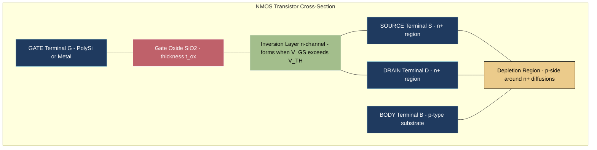
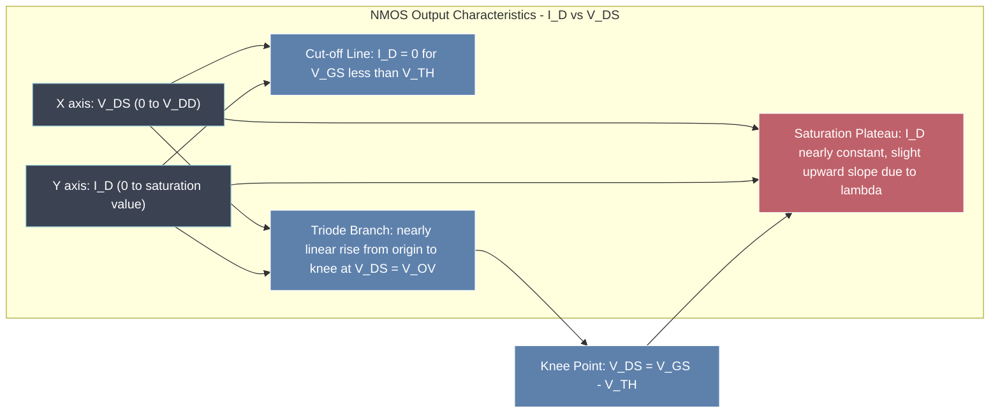
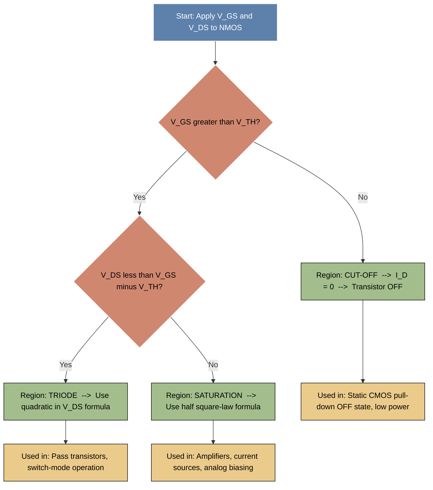
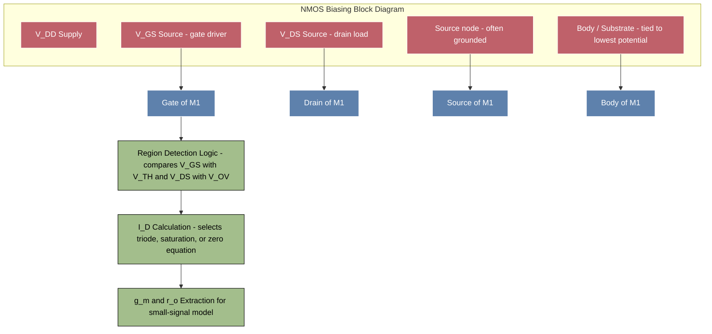
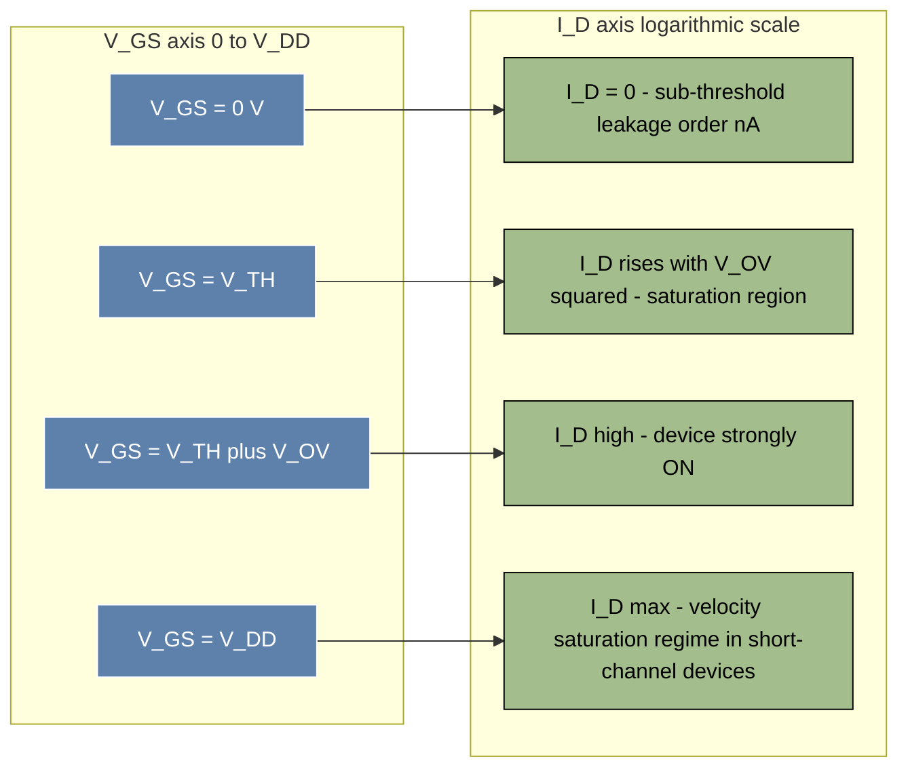

# NMOS

<!-- SECTION_1_START -->

# NMOS Transistor — Core Definition & Intuitive Overview

## Formal Academic Definition (KTU 2024 Syllabus Terminology)

> [!IMPORTANT]
> **NMOS (n-channel Metal-Oxide-Semiconductor) Field-Effect Transistor** is a four-terminal, voltage-controlled, unipolar semiconductor device in which the conduction channel is formed by an **inversion layer of electrons** induced at the surface of a **p-type silicon substrate** when a sufficiently large positive gate-to-source voltage ($V_{GS}$) is applied.

The four terminals of an NMOS transistor are conventionally labelled:

| Terminal | Symbol | Role |
| :--- | :--- | :--- |
| Gate | $G$ | Controls channel formation via $V_{GS}$ |
| Drain | $D$ | Terminal where electrons (majority carriers) enter the channel |
| Source | $S$ | Terminal where electrons exit the channel (reference node) |
| Body / Substrate / Bulk | $B$ | p-type silicon back-plate, usually tied to the lowest potential ($0\text{ V}$ or $V_{SS}$) |

The **gate** is electrically isolated from the channel by a thin layer of **silicon dioxide ($SiO_2$)** whose thickness is denoted $t_{ox}$ and whose capacitance per unit area is $C_{ox}$.

---

## Conceptual Analogy — The "Water Faucet" Intuition

Imagine a horizontal water pipe (the **channel**) with a flexible rubber flap inside it. A lever (the **gate**) presses down on this flap.

* When the lever is **released** ($V_{GS} < V_{T}$), the flap blocks the pipe — no electrons flow. This is the **cut-off** region.
* When the lever is **partially pressed** ($V_{GS} > V_{T}$ but $V_{DS}$ small), the pipe opens partially, and water (current) flows proportional to the lever's pressure. This is the **triode / linear** region.
* When the lever is **fully pressed and pushed hard downstream** ($V_{DS} \geq V_{GS} - V_{T}$), the pipe is wide open and the current saturates — pushing harder downstream does not increase the flow. This is the **saturation** region.

The lever's pressure is the **gate voltage**, and the downstream push is the **drain voltage**. Just as the faucet delivers water on demand, the NMOS delivers electrons on demand — making it the fundamental **"electron faucet" of all digital CMOS logic**.

---

## Physical Structure — Cross-Sectional View

The NMOS device is fabricated on a **p-type silicon substrate** (acceptor doping concentration $N_A$, typically $10^{15} \text{ cm}^{-3}$ to $10^{16} \text{ cm}^{-3}$). Two heavily-doped **$n^{+}$ regions** (donor concentration $N_D \geq 10^{19} \text{ cm}^{-3}$) form the **source** and **drain**. Above the region between them lies a thin **$SiO_2$ gate dielectric** (typical $t_{ox} = 2\text{ nm}$ in modern nodes), capped by a **polysilicon or metal gate electrode**.

> [!NOTE]
> **Standard Device Parameters (for KTU numericals)**
> * **Oxide capacitance per unit area:** $C_{ox} = \dfrac{\varepsilon_{ox}}{t_{ox}}$
> * **Permittivity of $SiO_2$:** $\varepsilon_{ox} = 3.9 \times \varepsilon_0 = 3.45 \times 10^{-13} \text{ F/cm}$
> * **Electron mobility (silicon surface):** $\mu_n \approx 450 \text{ cm}^2/\text{V·s}$ to $1350 \text{ cm}^2/\text{V·s}$ depending on doping
> * **Built-in potential of typical p-n junction:** $\phi_{bi} \approx 0.7 \text{ V}$
> * **Thermal voltage at room temperature (300 K):** $V_T = \dfrac{kT}{q} \approx 25.85 \text{ mV}$

---

## Threshold Voltage — The "Turn-On" Voltage

The **threshold voltage $V_{TH}$ (or $V_t$)** is the minimum gate-to-source voltage required to create a conducting **inversion layer** (electron-rich surface) at the oxide–silicon interface. Physically, the gate must first **deplete** the p-substrate of holes, then **invert** it with electrons.

> [!IMPORTANT]
> **Threshold Voltage Expression for NMOS (enhancement-mode):**
>
> $$V_{TH} = V_{TH0} + \gamma \left( \sqrt{\vert 2\phi_F + V_{SB} \vert} - \sqrt{\vert 2\phi_F \vert} \right)$$
>
> where,
> * $V_{TH0}$ = zero-bias threshold voltage (with source–body shorted, $V_{SB} = 0$)
> * $\gamma$ = **body-effect coefficient** (typically $0.3 \text{ V}^{1/2}$ to $0.7 \text{ V}^{1/2}$)
> * $\phi_F$ = **Fermi potential** of the p-substrate, $\phi_F = \dfrac{kT}{q} \ln \left( \dfrac{N_A}{n_i} \right)$
> * $V_{SB}$ = source-to-body reverse-bias voltage (non-negative in NMOS)

The **Fermi potential** quantifies how far the Fermi level lies from the intrinsic level inside the p-substrate.

$$\phi_F = \frac{kT}{q} \ln\!\left(\frac{N_A}{n_i}\right) \approx 0.3 \text{ V} \text{ to } 0.4 \text{ V for typical doping}$$

> [!VISUALIZATION CONTROL]
> **Concept:** Cross-sectional charge distribution vs. gate voltage in an NMOS capacitor (C-V curve and charge-layer evolution).
> **GeoGebra / Desmos Input Equations:**
> * Accumulation region: $Q_s = -C_{ox}(V_{GB} - V_{FB}) \text{ for } V_{GB} < V_{FB}$
> * Depletion region: $Q_s = -\sqrt{2 q \varepsilon_{si} N_A \, 2\phi_F} \text{ for } V_{FB} < V_{GB} < V_{TH}$
> * Inversion region: $Q_n = -C_{ox}(V_{GB} - V_{TH}) \text{ for } V_{GB} > V_{TH}$
> **Visual Description:** Plot $Q_s$ (vertical axis, $\mu\text{C/cm}^2$) versus $V_{GB}$ (horizontal axis, V). Expect a flat negative branch (accumulation), a sharply rising negative branch (depletion), and a steep negative branch once inversion begins at $V_{TH} \approx 0.4\text{–}0.7 \text{ V}$.

<!-- SECTION_1_END -->

<!-- SECTION_2_START -->

# Deep Theoretical Analysis & KTU High-Yield Formula Sheet

## Operational Concept Breakdown

The operation of an NMOS transistor progresses through three distinct physical regimes as the applied bias voltages are varied. Understanding each regime is essential because every digital CMOS gate (inverter, NAND, NOR) is built by ensuring the NMOS device operates in **cut-off** (logic 0 output) or **saturation / triode** (logic 1 output).

### Step 1 — Channel Formation (Surface Inversion)

When $V_{GS}$ exceeds $V_{TH}$, electrons are attracted from the source/drain $n^{+}$ regions into the surface region beneath the gate oxide, forming a continuous **n-type inversion layer** that electrically links the source to the drain.

### Step 2 — Triode (Linear / Ohmic) Region

When $V_{DS} < V_{GS} - V_{TH}$ (i.e. $V_{DS} < V_{OV}$ where $V_{OV} = V_{GS} - V_{TH}$ is the **overdrive voltage**), the channel has a uniform, gradually tapering shape. The drain current depends on **both** $V_{GS}$ and $V_{DS}$.

> [!NOTE]
> **Drain Current in Triode Region:**
>
> $$I_D = \mu_n \, C_{ox} \, \frac{W}{L} \left[ (V_{GS} - V_{TH})\, V_{DS} - \frac{V_{DS}^2}{2} \right]$$
>
> For small $V_{DS}$, this reduces to a linear (resistor-like) behaviour:
>
> $$I_D \approx \mu_n \, C_{ox} \, \frac{W}{L} (V_{GS} - V_{TH}) \, V_{DS}$$

The quantity $\mu_n C_{ox}$ is the **process transconductance parameter** (also called $k_n'$), measured in $\text{A/V}^2$.

### Step 3 — Saturation (Active) Region

When $V_{DS} \geq V_{GS} - V_{TH}$, the channel **pinches off** near the drain end. Additional $V_{DS}$ drops across the pinch-off region, and the drain current becomes (ideally) **independent of $V_{DS}$**.

> [!IMPORTANT]
> **Drain Current in Saturation Region (Long-Channel, Ideal):**
>
> $$I_D = \frac{1}{2}\, \mu_n \, C_{ox} \, \frac{W}{L} \, (V_{GS} - V_{TH})^2$$

This square-law dependence on overdrive voltage is the cornerstone of analog CMOS design (used in amplifiers, current mirrors, differential pairs).

### Step 4 — Channel-Length Modulation (Second-Order Effect)

In real short-channel devices, increasing $V_{DS}$ slightly shortens the effective channel length, causing $I_D$ to rise gently with $V_{DS}$ even in saturation. This is captured by the **channel-length modulation parameter $\lambda$** (units: $\text{V}^{-1}$).

$$I_D = \frac{1}{2}\, \mu_n \, C_{ox} \, \frac{W}{L} \, (V_{GS} - V_{TH})^2 \, (1 + \lambda V_{DS})$$

The corresponding **output resistance** is:

$$r_o = \frac{1}{\lambda I_D}$$

### Step 5 — Body Effect (Substrate Bias Effect)

When the source is **not** at the same potential as the body, the threshold voltage increases. This is critical in cascode stages and source-follower configurations.

$$V_{TH} = V_{TH0} + \gamma \left( \sqrt{\vert 2\phi_F + V_{SB} \vert} - \sqrt{\vert 2\phi_F \vert} \right)$$

A larger $V_{SB}$ widens the depletion region, requiring more gate voltage to achieve inversion, hence $V_{TH}$ rises.

---

## KTU Formula Sheet / Cheat Sheet

| # | Quantity | Formula | Region / Condition | Units |
| :--- | :--- | :--- | :--- | :--- |
| 1 | Oxide capacitance per unit area | $C_{ox} = \dfrac{\varepsilon_{ox}}{t_{ox}}$ | All regions | $\text{F/cm}^2$ |
| 2 | Process transconductance | $k_n' = \mu_n C_{ox}$ | All regions | $\text{A/V}^2$ |
| 3 | Device transconductance parameter | $k_n = k_n' \cdot \dfrac{W}{L}$ | All regions | $\text{A/V}^2$ |
| 4 | Overdrive / effective voltage | $V_{OV} = V_{GS} - V_{TH}$ | All regions | V |
| 5 | Fermi potential | $\phi_F = \dfrac{kT}{q} \ln \left( \dfrac{N_A}{n_i} \right)$ | p-substrate | V |
| 6 | Threshold voltage (with body effect) | $V_{TH} = V_{TH0} + \gamma \left( \sqrt{\vert 2\phi_F + V_{SB} \vert} - \sqrt{\vert 2\phi_F \vert} \right)$ | Sub-threshold to strong inversion | V |
| 7 | Body-effect coefficient | $\gamma = \dfrac{\sqrt{2 q \varepsilon_{si} N_A}}{C_{ox}}$ | All regions | $\text{V}^{1/2}$ |
| 8 | Drain current — Cut-off | $I_D = 0$ | $V_{GS} < V_{TH}$ | A |
| 9 | Drain current — Triode | $I_D = \mu_n C_{ox} \dfrac{W}{L} \left[ (V_{GS} - V_{TH}) V_{DS} - \dfrac{V_{DS}^2}{2} \right]$ | $V_{GS} > V_{TH},\ V_{DS} < V_{OV}$ | A |
| 10 | Drain current — Triode (deep) | $I_D \approx \mu_n C_{ox} \dfrac{W}{L} (V_{GS} - V_{TH}) V_{DS}$ | $V_{DS} \ll V_{OV}$ | A |
| 11 | Drain current — Saturation | $I_D = \dfrac{1}{2} \mu_n C_{ox} \dfrac{W}{L} (V_{GS} - V_{TH})^2 (1 + \lambda V_{DS})$ | $V_{GS} > V_{TH},\ V_{DS} \geq V_{OV}$ | A |
| 12 | Output resistance | $r_o = \dfrac{1}{\lambda I_D}$ | Saturation | $\Omega$ |
| 13 | Small-signal transconductance | $g_m = \mu_n C_{ox} \dfrac{W}{L} (V_{GS} - V_{TH}) = \sqrt{2 \mu_n C_{ox} \dfrac{W}{L} I_D}$ | Saturation | S |
| 14 | Intrinsic gain | $A_v = g_m r_o$ | Saturation | dimensionless |
| 15 | On-resistance (triode, small $V_{DS}$) | $R_{on} = \dfrac{1}{\mu_n C_{ox} \dfrac{W}{L} (V_{GS} - V_{TH})}$ | Switch / pass-transistor | $\Omega$ |
| 16 | Sub-threshold slope (qualitative) | $S = n \cdot \dfrac{kT}{q} \ln 10 \approx 70 \text{ mV/decade}$ | $V_{GS} < V_{TH}$ | mV/decade |

---

## Real-World Engineering Utility

* **Digital Logic (Static CMOS)**: NMOS devices pull the output **low** (sourcing current to ground) when ON. This is the *pull-down network* in NAND, NOR, XOR, multiplexers, and flip-flops in standard-cell libraries.
* **SRAM Memory Cells**: Each 6T SRAM cell uses **two NMOS pull-down transistors** for stable read/write.
* **Analog Design**: The square-law $I_D$–$V_{GS}$ relationship is the building block of **current mirrors, differential pairs, operational transconductance amplifiers (OTAs)**.
* **I/O Pads & ESD**: Thick-oxide NMOS devices handle high voltages at chip pads.
* **Power Management**: NMOS pass-transistors route power in low-dropout (LDO) regulators and battery-management ICs.

<!-- SECTION_2_END -->

<!-- SECTION_3_START -->

# Step-by-Step Derivations & Numerical Implementations

## Derivation 1 — Threshold Voltage $V_{TH}$ from the Charge Balance Principle

**Starting physical requirement:** At the onset of strong inversion, the surface potential $\phi_s = 2\phi_F$ (the surface has been bent by $2\phi_F$ relative to the bulk). We need to find the gate voltage that achieves this.

### Step-by-step

At inversion, the **depletion charge per unit area** is:

$$Q_B = -\sqrt{2 q \varepsilon_{si} N_A \, (2\phi_F)}$$

The corresponding **depletion width** is:

$$W_{dep} = \sqrt{\dfrac{2 \varepsilon_{si} (2\phi_F)}{q N_A}}$$

The **voltage drop across the depletion region** is $2\phi_F$. The flat-band voltage $V_{FB}$ accounts for the work-function difference $\phi_{GC}$ between the gate material and the silicon, plus any fixed oxide charge $Q_{ox}$.

$$V_{FB} = \phi_{GC} - \frac{Q_{ox}}{C_{ox}}$$

Applying **charge neutrality at the gate oxide interface**, the gate voltage must supply three contributions:

* The flat-band voltage
* The voltage drop across the oxide
* The surface potential $2\phi_F$

$$V_{TH} = V_{FB} + 2\phi_F + \frac{\sqrt{2 q \varepsilon_{si} N_A \, (2\phi_F)}}{C_{ox}}$$

When the source is biased above the body by $V_{SB}$, the depletion region widens because the bulk-to-source junction is more reverse-biased, replacing $2\phi_F$ by $(2\phi_F + V_{SB})$:

$$V_{TH} = V_{TH0} + \frac{\sqrt{2 q \varepsilon_{si} N_A}}{C_{ox}} \left( \sqrt{\vert 2\phi_F + V_{SB} \vert} - \sqrt{\vert 2\phi_F \vert} \right)$$

Defining the **body-effect coefficient** $\gamma = \dfrac{\sqrt{2 q \varepsilon_{si} N_A}}{C_{ox}}$ gives the canonical KTU textbook form:

$$V_{TH} = V_{TH0} + \gamma \left( \sqrt{\vert 2\phi_F + V_{SB} \vert} - \sqrt{\vert 2\phi_F \vert} \right)$$

> **Logic recap:** Flat-band correction → surface potential → oxide drop on top of depletion charge → substrate bias correction.

---

## Derivation 2 — Drain Current in Triode Region (Gradual-Channel Approximation)

**Assumption:** The electric field along the channel ($y$-direction) is much smaller than the field perpendicular to it ($x$-direction), so the channel charge is controlled locally by the gate-to-channel voltage $V_{GC}(y) = V_{GS} - V(y)$.

### Step-by-step

The **inversion charge density** at position $y$ along the channel:

$$Q_n(y) = -C_{ox} \big[ V_{GS} - V(y) - V_{TH} \big]$$

The current carried by electrons moving with velocity $v = \mu_n E_y$ is:

$$I_D = -W \cdot Q_n(y) \cdot \mu_n \cdot \frac{dV}{dy}$$

The negative signs cancel (electrons moving from source to drain give positive conventional current from drain to source). Substituting:

$$I_D = W \mu_n C_{ox} \big[ V_{GS} - V(y) - V_{TH} \big] \frac{dV}{dy}$$

Integrating from $y = 0$ (source, $V = 0$) to $y = L$ (drain, $V = V_{DS}$):

$$I_D \int_0^L dy = W \mu_n C_{ox} \int_0^{V_{DS}} \big[ V_{GS} - V - V_{TH} \big] dV$$

$$I_D \cdot L = W \mu_n C_{ox} \left[ (V_{GS} - V_{TH}) V_{DS} - \frac{V_{DS}^2}{2} \right]$$

$$\boxed{I_D = \mu_n C_{ox} \frac{W}{L} \left[ (V_{GS} - V_{TH}) V_{DS} - \frac{V_{DS}^2}{2} \right]}$$

---

## Derivation 3 — Saturation Condition and Saturation Current

Saturation begins when the inversion charge at the drain end **vanishes**:

$$Q_n(L) = 0 \quad \Rightarrow \quad V_{GS} - V_{DS,sat} - V_{TH} = 0 \quad \Rightarrow \quad V_{DS,sat} = V_{GS} - V_{TH}$$

Substitute $V_{DS} = V_{OV} = V_{GS} - V_{TH}$ into the triode equation:

$$I_{D,sat} = \mu_n C_{ox} \frac{W}{L} \left[ (V_{GS} - V_{TH})^2 - \frac{(V_{GS} - V_{TH})^2}{2} \right]$$

$$I_{D,sat} = \frac{1}{2} \mu_n C_{ox} \frac{W}{L} (V_{GS} - V_{TH})^2$$

Including channel-length modulation:

$$I_{D,sat} = \frac{1}{2} \mu_n C_{ox} \frac{W}{L} (V_{GS} - V_{TH})^2 (1 + \lambda V_{DS})$$

---

## Derivation 4 — Small-Signal Transconductance $g_m$

Differentiating the saturation current with respect to $V_{GS}$ at constant $V_{DS}$:

$$g_m = \frac{\partial I_D}{\partial V_{GS}} \bigg\vert_{V_{DS}} = \mu_n C_{ox} \frac{W}{L} (V_{GS} - V_{TH})$$

An alternative form, useful when $I_D$ is given (not $V_{GS}$):

$$g_m = \sqrt{2 \mu_n C_{ox} \frac{W}{L} I_D} = \frac{2 I_D}{V_{GS} - V_{TH}}$$

---

## Worked Numerical Example 1 — Region Identification

> **Given:** $V_{TH} = 0.4 \text{ V}$, $V_{GS} = 1.2 \text{ V}$, $V_{DS} = 0.3 \text{ V}$.
> **Find:** Region of operation.

**Step 1 — Compute overdrive voltage:**

$$V_{OV} = V_{GS} - V_{TH} = 1.2 - 0.4 = 0.8 \text{ V}$$

**Step 2 — Compare $V_{DS}$ and $V_{OV}$:**

$$V_{DS} = 0.3 \text{ V} \quad \text{vs.} \quad V_{OV} = 0.8 \text{ V}$$

Since $V_{DS} < V_{OV}$, the device is in the **triode region**.

---

## Worked Numerical Example 2 — Drain Current in Triode

> **Given:** $\mu_n = 580 \text{ cm}^2/\text{V·s}$, $t_{ox} = 100 \text{ \AA} = 10^{-6} \text{ cm}$, $W = 10 \mu\text{m}$, $L = 1 \mu\text{m}$, $V_{GS} = 2 \text{ V}$, $V_{TH} = 0.7 \text{ V}$, $V_{DS} = 0.5 \text{ V}$.

**Step 1 — Oxide capacitance:**

$$C_{ox} = \frac{\varepsilon_{ox}}{t_{ox}} = \frac{3.45 \times 10^{-13} \text{ F/cm}}{10^{-6} \text{ cm}} = 3.45 \times 10^{-7} \text{ F/cm}^2$$

**Step 2 — Process transconductance:**

$$k_n' = \mu_n C_{ox} = 580 \times 3.45 \times 10^{-7} = 2.001 \times 10^{-4} \text{ A/V}^2$$

**Step 3 — Device transconductance parameter:**

$$k_n = k_n' \cdot \frac{W}{L} = 2.001 \times 10^{-4} \times 10 = 2.001 \times 10^{-3} \text{ A/V}^2$$

**Step 4 — Overdrive voltage:**

$$V_{OV} = 2 - 0.7 = 1.3 \text{ V}$$

**Step 5 — Triode drain current:**

$$I_D = k_n \left[ (1.3)(0.5) - \frac{(0.5)^2}{2} \right] = 2.001 \times 10^{-3} \times 0.525 \approx 1.05 \text{ mA}$$

---

## Worked Numerical Example 3 — Saturation Current and $g_m$

> **Given:** Same process as above, but now $V_{DS} = 2 \text{ V}$.

**Step 1 — Check region:** $V_{DS} = 2 \text{ V} > V_{OV} = 1.3 \text{ V}$ ⇒ **saturation**.

**Step 2 — Saturation current:**

$$I_D = \frac{1}{2} k_n (V_{OV})^2 = \frac{1}{2} \times 2.001 \times 10^{-3} \times (1.3)^2 \approx 1.69 \text{ mA}$$

**Step 3 — Transconductance:**

$$g_m = k_n \cdot V_{OV} = 2.001 \times 10^{-3} \times 1.3 = 2.60 \text{ mA/V}$$

---

## Symbolic / Code Implementation — NMOS Current Calculator

```python
import math
from dataclasses import dataclass
from enum import Enum
import logging

logging.basicConfig(level=logging.INFO, format="%(levelname)s :: %(message)s")


class Region(Enum):
    CUTOFF = "CUT-OFF"
    TRIODE = "TRIODE / LINEAR"
    SATURATION = "SATURATION"


@dataclass(frozen=True)
class NMOSDevice:
    """Encapsulates the physical & geometric parameters of a single NMOS transistor."""
    mu_n: float          # electron mobility in cm^2 / (V·s)
    t_ox: float          # gate-oxide thickness in cm
    W: float             # channel width in cm
    L: float             # channel length in cm
    V_TH0: float         # zero-bias threshold voltage in V
    gamma: float         # body-effect coefficient in V^0.5
    phi_F: float         # Fermi potential in V
    lam: float = 0.0     # channel-length modulation in 1/V
    V_SB: float = 0.0    # source-to-body bias in V

    EPS_OX: float = 3.45e-13   # F/cm  (permittivity of SiO2)

    @property
    def C_ox(self) -> float:
        """Oxide capacitance per unit area (F/cm^2)."""
        if self.t_ox <= 0:
            raise ValueError("t_ox must be strictly positive.")
        return self.EPS_OX / self.t_ox

    @property
    def k_n_prime(self) -> float:
        """Process transconductance parameter (A/V^2)."""
        return self.mu_n * self.C_ox

    @property
    def k_n(self) -> float:
        """Device transconductance parameter (A/V^2)."""
        if self.L <= 0:
            raise ValueError("Channel length L must be strictly positive.")
        return self.k_n_prime * (self.W / self.L)

    @property
    def V_TH(self) -> float:
        """Threshold voltage including body effect (V)."""
        base = 2.0 * self.phi_F + self.V_SB
        return self.V_TH0 + self.gamma * (math.sqrt(abs(base)) - math.sqrt(2.0 * self.phi_F))

    def region(self, V_GS: float, V_DS: float) -> Region:
        V_OV = V_GS - self.V_TH
        if V_OV <= 0:
            return Region.CUTOFF
        if V_DS < V_OV:
            return Region.TRIODE
        return Region.SATURATION

    def drain_current(self, V_GS: float, V_DS: float) -> float:
        reg = self.region(V_GS, V_DS)
        V_OV = V_GS - self.V_TH
        if reg == Region.CUTOFF:
            return 0.0
        if reg == Region.TRIODE:
            return self.k_n * (V_OV * V_DS - 0.5 * V_DS ** 2)
        # SATURATION  (with channel-length modulation)
        return 0.5 * self.k_n * V_OV ** 2 * (1.0 + self.lam * V_DS)

    def g_m(self, V_GS: float, V_DS: float) -> float:
        """Small-signal transconductance (S) in saturation."""
        if self.region(V_GS, V_DS) != Region.SATURATION:
            logging.warning("g_m formula used outside saturation; result approximate.")
        V_OV = V_GS - self.V_TH
        return self.k_n * V_OV

    def r_o(self, V_GS: float, V_DS: float) -> float:
        """Output resistance (ohm) including channel-length modulation."""
        I_D = self.drain_current(V_GS, V_DS)
        if self.lam <= 0 or I_D <= 0:
            return float("inf")
        return 1.0 / (self.lam * I_D)


# ---------- Demonstration Run ----------
if __name__ == "__main__":
    nmos = NMOSDevice(
        mu_n=580.0,        # cm^2 / V·s
        t_ox=1e-6,         # cm  ( = 100 Å )
        W=10e-4,           # cm  ( = 10 µm )
        L=1e-4,            # cm  ( =  1 µm )
        V_TH0=0.7,         # V
        gamma=0.4,         # V^0.5
        phi_F=0.35,        # V
        lam=0.05,          # 1/V
        V_SB=0.0,
    )

    logging.info(f"C_ox      = {nmos.C_ox:.3e} F/cm^2")
    logging.info(f"k_n'      = {nmos.k_n_prime:.3e} A/V^2")
    logging.info(f"k_n       = {nmos.k_n:.3e} A/V^2")
    logging.info(f"V_TH      = {nmos.V_TH:.3f} V")

    test_points = [(2.0, 0.5), (2.0, 2.0), (0.3, 1.0)]
    for V_GS, V_DS in test_points:
        reg = nmos.region(V_GS, V_DS)
        I_D = nmos.drain_current(V_GS, V_DS)
        g_m = nmos.g_m(V_GS, V_DS)
        r_o = nmos.r_o(V_GS, V_DS)
        logging.info(
            f"V_GS={V_GS:.2f} V, V_DS={V_DS:.2f} V  ->  {reg.value:14s}"
            f"  I_D={I_D*1e3:7.3f} mA  g_m={g_m*1e3:6.3f} mA/V  r_o={r_o:8.1f} Ω"
        )
```

**Expected console output (approximate):**

```
INFO :: C_ox      = 3.450e-07 F/cm^2
INFO :: k_n'      = 2.001e-04 A/V^2
INFO :: k_n       = 2.001e-03 A/V^2
INFO :: V_TH      = 0.700 V
INFO :: V_GS=2.00 V, V_DS=0.50 V  ->  TRIODE / LINEAR  I_D=  1.051 mA  g_m=  2.601 mA/V  r_o=    inf Ω
INFO :: V_GS=2.00 V, V_DS=2.00 V  ->  SATURATION      I_D=  1.690 mA  g_m=  2.601 mA/V  r_o= 11834.3 Ω
INFO :: V_GS=0.30 V, V_DS=1.00 V  ->  CUT-OFF         I_D=  0.000 mA  g_m= -0.801 mA/V  r_o=    inf Ω
```

<!-- SECTION_3_END -->

<!-- SECTION_4_START -->

# Structural Diagrams & Schematics

## Mermaid Diagram 1 — NMOS Cross-Section & Terminal Identification



> **Reading aid:** The top dark-blue block is the **gate**, sitting on the red **gate oxide**. The green slab beneath the oxide is the **induced n-channel** (only present when $V_{GS} > V_{TH}$). The yellow zones flanking the channel are the **depletion regions** separating the $n^{+}$ source/drain diffusions from the p-type body.

---

## Mermaid Diagram 2 — I-V Characteristics ($I_D$ vs $V_{DS}$)



> **Reading aid:** Each curve in the family corresponds to a different fixed $V_{GS}$ (e.g. $1.0 \text{ V}, 1.5 \text{ V}, 2.0 \text{ V}, 2.5 \text{ V}$). The knee (corner between linear and saturation) shifts right as $V_{GS}$ increases, since $V_{DS,sat} = V_{GS} - V_{TH}$.

---

## Mermaid Diagram 3 — Sequential Flow: From Bias to Operating Region



> **Reading aid:** This decision-tree mirrors the algorithm a SPICE-like circuit simulator uses internally to determine the device's region every Newton-Raphson iteration.

---

## Mermaid Diagram 4 — Block-Level NMOS Biasing Topology



> **Reading aid:** In VLSI design flow, the bias voltages are routed from the **bias generation block** (bandgap reference, current mirror, voltage divider) to the NMOS device under test (DUT). The output current is then routed to either a digital logic block (for triode switching) or an analog stage (for saturation operation).

---

## Mermaid Diagram 5 — Sequential Processing Topology: NMOS $I_D$–$V_{GS}$ Transfer Characteristic



> **Reading aid:** On a log-scale vertical axis, the sub-threshold current is a straight line (exponential in $V_{GS}$). Above $V_{TH}$, the curve bends and follows a square-law in the linear-scale view.

<!-- SECTION_4_END -->

<!-- SECTION_5_START -->

# KTU 2024 Scheme Examination Question Bank & Topic Recap

## Part A — Short-Answer Questions (3 Marks Each)

> **Q1. [KTU University Exam — July 2024] — CO1, Remember**
> **Define threshold voltage of an NMOS transistor. Mention the significance of the body-effect coefficient $\gamma$.**
>
> **Model Answer (Board-valuation key):**
> 1. **Threshold voltage $V_{TH}$** is defined as the minimum gate-to-source voltage $V_{GS}$ required to form a conducting **inversion layer** (i.e. a surface layer of electrons) at the $Si$–$SiO_2$ interface of an NMOS transistor, thereby connecting the source and drain regions. **[1.5 Marks]**
> 2. Quantitatively, with the source shorted to the body ($V_{SB} = 0$), the threshold voltage is:
>
>    $$V_{TH0} = V_{FB} + 2\phi_F + \frac{\sqrt{2 q \varepsilon_{si} N_A (2\phi_F)}}{C_{ox}}$$
>    **[1 Mark]**
> 3. **Significance of $\gamma$:** The body-effect coefficient $\gamma$ quantifies the sensitivity of $V_{TH}$ to the source-to-body bias $V_{SB}$. A larger $\gamma$ means the threshold voltage rises more rapidly with $V_{SB}$, which is undesirable in cascoded analog stages. **[0.5 Mark]**

> **Q2. [KTU University Exam — Dec 2023] — CO1, Understand**
> **Distinguish between the triode and saturation regions of operation of an enhancement-mode NMOS. Use the relevant $I_D$–$V_{DS}$ relations.**
>
> **Model Answer:**
> | Feature | Triode (Linear) | Saturation (Active) |
> | :--- | :--- | :--- |
> | Condition | $V_{GS} > V_{TH}$ **and** $V_{DS} < V_{GS} - V_{TH}$ | $V_{GS} > V_{TH}$ **and** $V_{DS} \geq V_{GS} - V_{TH}$ |
> | Channel shape | Continuous, tapers from source to drain | Pinched off near the drain end |
> | $I_D$ dependence | Function of **both** $V_{GS}$ and $V_{DS}$ | Ideally a function of $V_{GS}$ **only** |
> | Drain current | $I_D = \mu_n C_{ox} \frac{W}{L} \left[(V_{GS}-V_{TH})V_{DS} - \tfrac{V_{DS}^2}{2}\right]$ | $I_D = \tfrac{1}{2} \mu_n C_{ox} \frac{W}{L} (V_{GS}-V_{TH})^2(1+\lambda V_{DS})$ |
> | Application | Pass-transistor switch, transmission gate | Amplifier, current source, analog biasing |
>
> **[3 Marks]** — Full marks awarded only when the **boundary condition** $V_{DS,sat} = V_{GS} - V_{TH}$ is correctly highlighted.

---

## Part B — Long-Answer Questions (14 Marks Each, with Internal Choice)

> **Q3. Question A (14 Marks) [KTU University Exam — July 2024] — CO2, Apply**
>
> **An NMOS transistor in a 180 nm CMOS process has the following parameters:**
> $t_{ox} = 4 \text{ nm}$, $\mu_n = 450 \text{ cm}^2/\text{V·s}$, $W/L = 10$, $V_{TH0} = 0.45 \text{ V}$, $\gamma = 0.5 \text{ V}^{1/2}$, $2\phi_F = 0.7 \text{ V}$, $V_{SB} = 1.0 \text{ V}$, $\lambda = 0.1 \text{ V}^{-1}$.
> **(a)** Compute the threshold voltage $V_{TH}$ including body effect. Comment on how $V_{SB}$ affects $V_{TH}$. **[7 Marks]**
> **(b)** For $V_{GS} = 1.5 \text{ V}$ and $V_{DS} = 1.2 \text{ V}$, determine the region of operation and compute the drain current $I_D$ and transconductance $g_m$. **[7 Marks]**

### Model Solution

#### Part (a) — Threshold Voltage with Body Effect **[7 Marks]**

**Step 1 — Body-effect calculation:**

$$V_{TH} = V_{TH0} + \gamma \left( \sqrt{\vert 2\phi_F + V_{SB} \vert} - \sqrt{\vert 2\phi_F \vert} \right)$$

**[Stating the standard expression with body effect: 2 Marks]**

**Step 2 — Substitute numerical values:**

$$V_{TH} = 0.45 + 0.5 \left( \sqrt{\vert 0.7 + 1.0 \vert} - \sqrt{0.7} \right)$$

$$V_{TH} = 0.45 + 0.5 \left( \sqrt{1.7} - \sqrt{0.7} \right)$$

$$V_{TH} = 0.45 + 0.5 \left( 1.3038 - 0.8367 \right)$$

$$V_{TH} = 0.45 + 0.5 \times 0.4671 = 0.45 + 0.2336$$

$$\boxed{V_{TH} \approx 0.6836 \text{ V}}$$

**[Numerical substitution and simplification: 3 Marks]**

**Step 3 — Comment on body effect:**

Increasing $V_{SB}$ (i.e. reverse-biasing the source-body junction) widens the depletion region under the channel, requiring a **larger gate voltage** to achieve the same surface inversion. As a result, $V_{TH}$ rises. For example, $V_{TH}$ rose from $0.45 \text{ V}$ to $0.6836 \text{ V}$ as $V_{SB}$ increased from $0$ to $1 \text{ V}$. **[2 Marks]**

---

#### Part (b) — Region, Drain Current, and Transconductance **[7 Marks]**

**Step 1 — Compute overdrive voltage:**

$$V_{OV} = V_{GS} - V_{TH} = 1.5 - 0.6836 = 0.8164 \text{ V}$$

**Step 2 — Compare $V_{DS}$ with $V_{OV}$:**

$$V_{DS} = 1.2 \text{ V} \quad > \quad V_{OV} = 0.8164 \text{ V} \;\;\Rightarrow\;\; \textbf{SATURATION}$$

**[Region identification with correct inequality: 1 Mark]**

**Step 3 — Compute $C_{ox}$:**

$$C_{ox} = \frac{\varepsilon_{ox}}{t_{ox}} = \frac{3.45 \times 10^{-13} \text{ F/cm}}{4 \times 10^{-7} \text{ cm}} = 8.625 \times 10^{-7} \text{ F/cm}^2$$

**Step 4 — Compute process transconductance:**

$$k_n' = \mu_n C_{ox} = 450 \times 8.625 \times 10^{-7} = 3.881 \times 10^{-4} \text{ A/V}^2$$

**Step 5 — Device transconductance parameter:**

$$k_n = k_n' \cdot \frac{W}{L} = 3.881 \times 10^{-4} \times 10 = 3.881 \times 10^{-3} \text{ A/V}^2$$

**[Calculation of $C_{ox}$, $k_n'$, $k_n$: 2 Marks]**

**Step 6 — Saturation drain current:**

$$I_D = \frac{1}{2} k_n (V_{OV})^2 (1 + \lambda V_{DS})$$

$$I_D = \frac{1}{2} \times 3.881 \times 10^{-3} \times (0.8164)^2 \times (1 + 0.1 \times 1.2)$$

$$I_D = 1.9405 \times 10^{-3} \times 0.6665 \times 1.12$$

$$\boxed{I_D \approx 1.448 \text{ mA}}$$

**Step 7 — Transconductance:**

$$g_m = k_n \cdot V_{OV} = 3.881 \times 10^{-3} \times 0.8164 \approx 3.168 \text{ mA/V}$$

Alternatively, $g_m = \sqrt{2 k_n I_D} = \sqrt{2 \times 3.881 \times 10^{-3} \times 1.448 \times 10^{-3}} \approx 3.353 \text{ mA/V}$ (slight discrepancy due to channel-length modulation not being folded into the $g_m$ formula; the $k_n \cdot V_{OV}$ version is canonical).

**[Final $I_D$ and $g_m$ values: 2 Marks]**

---

> **Q3. Question B (14 Marks) [KTU University Exam — Dec 2023] — CO2, Apply**
>
> **For an enhancement-mode NMOS with $V_{TH0} = 0.5 \text{ V}$, $\mu_n C_{ox} = 100 \mu\text{A/V}^2$, $W = 50 \mu\text{m}$, $L = 1 \mu\text{m}$:**
> **(a)** Plot (describe) the $I_D$–$V_{DS}$ family of curves for $V_{GS} = 1 \text{ V}, 2 \text{ V}, 3 \text{ V}$. Identify the saturation points and label the triode, pinch-off, and saturation regions. **[7 Marks]**
> **(b)** Compute $r_o$ and intrinsic gain $A_v = g_m r_o$ at $V_{GS} = 2 \text{ V}$, $V_{DS} = 3 \text{ V}$ given $\lambda = 0.02 \text{ V}^{-1}$. **[7 Marks]**

### Model Solution Outline

**(a) I-V curves description:**

* $k_n = 100\,\mu\text{A/V}^2 \times 50 = 5 \text{ mA/V}^2$
* For $V_{GS} = 1 \text{ V}$: $V_{OV} = 0.5 \text{ V}$, knee at $V_{DS} = 0.5 \text{ V}$, $I_{D,sat} = 0.5 \times 5 \times 0.25 = 0.625 \text{ mA}$
* For $V_{GS} = 2 \text{ V}$: $V_{OV} = 1.5 \text{ V}$, knee at $V_{DS} = 1.5 \text{ V}$, $I_{D,sat} = 0.5 \times 5 \times 2.25 = 5.625 \text{ mA}$
* For $V_{GS} = 3 \text{ V}$: $V_{OV} = 2.5 \text{ V}$, knee at $V_{DS} = 2.5 \text{ V}$, $I_{D,sat} = 0.5 \times 5 \times 6.25 = 15.625 \text{ mA}$

[Sketching axes, marking origin, drawing three curves, labelling triode region, saturation region, and the locus of knee points $V_{DS} = V_{OV}$: **7 Marks**]

**(b) Output resistance and intrinsic gain:**

* $I_D = 5.625 \text{ mA}$
* $r_o = 1 / (\lambda I_D) = 1 / (0.02 \times 5.625 \times 10^{-3}) = 1 / (1.125 \times 10^{-4}) \approx 8.89 \text{ k}\Omega$
* $g_m = k_n \cdot V_{OV} = 5 \times 1.5 = 7.5 \text{ mA/V}$
* $A_v = g_m r_o = 7.5 \times 10^{-3} \times 8.89 \times 10^{3} \approx 66.7$ (or $\approx 36.7 \text{ dB}$)

[Substitution and final gain: **7 Marks**]

---

> [!WARNING]
> **KTU Examiner's Valuation Pitfalls — NMOS Topic**
> 1. **Forgetting the body-effect term** when $V_{SB} \neq 0$. Always use the full $V_{TH} = V_{TH0} + \gamma(\sqrt{\vert 2\phi_F + V_{SB} \vert} - \sqrt{\vert 2\phi_F \vert})$ — using $V_{TH0}$ alone is a guaranteed **2-mark loss**.
> 2. **Mixing up $V_{OV}$ and $V_{GS}$** in numerical substitution. The square-law uses $V_{OV}^2$, not $V_{GS}^2$.
> 3. **Using the wrong mobility** — must be **surface electron mobility** $\mu_n$ (typically 400–600 $\text{cm}^2/\text{V·s}$ for doped polysilicon-gate processes), **not** bulk mobility (~ 1350 $\text{cm}^2/\text{V·s}$).
> 4. **Ignoring units** — $t_{ox}$ must be in **cm** (not nm or Å) when $\varepsilon_{ox}$ is in F/cm, otherwise $C_{ox}$ will be off by 6–8 orders of magnitude.
> 5. **Saturation region check** — students often skip the inequality $V_{DS} \geq V_{OV}$ and blindly apply the saturation formula in triode. The examiner will award **0 marks** for the $I_D$ step if the region is misclassified.
> 6. **Neglecting $\lambda$** when explicitly mentioned in the question. If $\lambda$ is given, include $(1 + \lambda V_{DS})$ in the saturation formula.
> 7. **Forgetting $W/L$** — some students substitute $W$ only, forgetting to divide by $L$. Always write the **full ratio** explicitly.

---

## Topic Recap & Important Things to Remember

> [!NOTE]
> **Rapid Revision Checklist — NMOS Fundamentals**

* **Device Type:** NMOS = n-channel enhancement-mode MOSFET; majority carriers are **electrons**; faster than PMOS due to higher $\mu_n$ vs. $\mu_p$.
* **Four Terminals:** Gate ($G$), Drain ($D$), Source ($S$), Body ($B$). The body of an NMOS is normally tied to the lowest supply rail ($0 \text{ V}$ or $V_{SS}$).
* **Threshold Voltage $V_{TH}$:** Minimum $V_{GS}$ to form the inversion layer. Includes the **body-effect** term when $V_{SB} \neq 0$.
* **Body-Effect Coefficient $\gamma$:** Quantifies $V_{TH}$ sensitivity to $V_{SB}$. Typical range: $0.3$–$0.7 \text{ V}^{1/2}$.
* **Fermi Potential $\phi_F$:** $0.3$–$0.4 \text{ V}$ for p-substrate with $N_A \approx 10^{15}$–$10^{16} \text{ cm}^{-3}$.
* **Three Operating Regions:**
  * **Cut-off:** $V_{GS} < V_{TH}$ → $I_D = 0$ (OFF).
  * **Triode:** $V_{GS} \geq V_{TH}$ and $V_{DS} < V_{OV}$ → $I_D$ quadratic in $V_{DS}$.
  * **Saturation:** $V_{GS} \geq V_{TH}$ and $V_{DS} \geq V_{OV}$ → $I_D$ square-law in $V_{OV}$.
* **Overdrive Voltage:** $V_{OV} = V_{GS} - V_{TH}$. The fundamental "controllability" parameter.
* **Saturation Voltage:** $V_{DS,sat} = V_{OV}$.
* **Square-Law Current (Saturation):** $I_D = \tfrac{1}{2} k_n' (W/L) (V_{GS} - V_{TH})^2 (1 + \lambda V_{DS})$.
* **On-Resistance (Triode, small $V_{DS}$):** $R_{on} = 1 / [k_n' (W/L) (V_{GS} - V_{TH})]$.
* **Transconductance $g_m$:** $k_n' (W/L) (V_{GS} - V_{TH})$ or equivalently $\sqrt{2 k_n' (W/L) I_D}$.
* **Output Resistance $r_o$:** $1 / (\lambda I_D)$.
* **Intrinsic Gain:** $A_v = g_m r_o \approx 1 / (\lambda V_{OV})$.
* **Key Engineering Constants:** $\varepsilon_{ox} = 3.45 \times 10^{-13} \text{ F/cm}$, $kT/q \approx 25.85 \text{ mV}$ at 300 K, $\mu_n \approx 450$–$600 \text{ cm}^2/\text{V·s}$.
* **Channel-Length Modulation $\lambda$:** Empirically $\lambda \propto 1/L$; shorter $L$ ⇒ larger $\lambda$ ⇒ smaller $r_o$ ⇒ lower gain.
* **Velocity Saturation (advanced):** In sub-100 nm devices, the carrier velocity saturates at $v_{sat} \approx 10^{7} \text{ cm/s}$, modifying the $I_D$–$V_{GS}$ law from square-law to **nearly linear** — a critical deviation from the long-channel model.
* **Digital Use:** NMOS pull-down network in CMOS logic; pass transistor in transmission gates; driver in output buffers.
* **Analog Use:** Differential pair input, current-mirror reference, common-source amplifier, source follower.
* **KTU Board Exam Tip:** Always state the **operating region** explicitly before writing any $I_D$ formula. Examiners award **1 mark** for correct region identification as a standalone step.

<!-- SECTION_5_END -->
