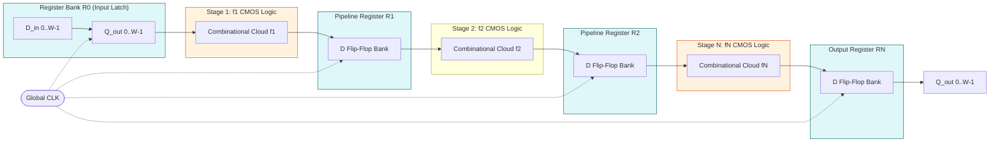
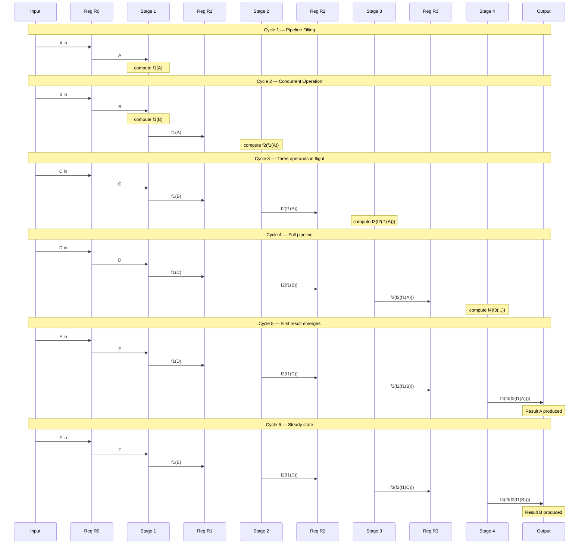
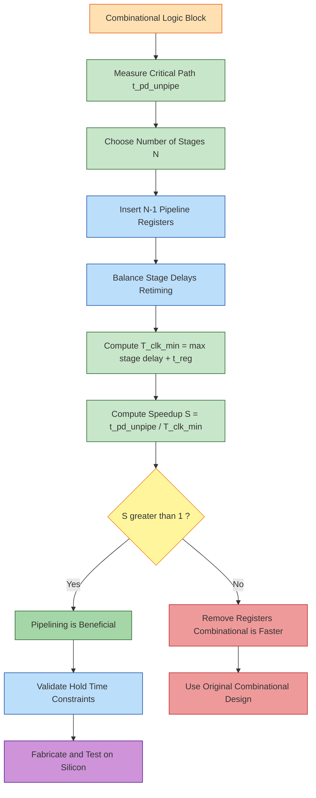

# Pipelining

<!-- SECTION_1_START -->
# Pipelining in VLSI Design

## 1. Core Technical Definition

**Pipelining** is a digital design technique in VLSI where a complex combinational logic block is partitioned into multiple smaller stages separated by **clocked registers (latch-based or flip-flop-based storage elements)**, so that multiple data elements can be processed concurrently in an assembly-line fashion. Each pipeline stage performs a sub-operation on a different data token during every clock cycle, thereby increasing the **data throughput** of the circuit without proportionally increasing the clock frequency.

Formally, if a logic function $F$ is decomposed as:

$$F = f_n \circ f_{n-1} \circ \dots \circ f_2 \circ f_1$$

then a pipelined implementation instantiates $n$ physical stages, each computing one $f_i$, and inserts a register $R_i$ between successive stages to isolate them in time. Data word $W_k$ entering the pipeline at cycle $T$ emerges after $n$ cycles, but a new result is produced at **every** clock cycle once the pipeline is full.

> [!IMPORTANT]
> **KTU 2024 Syllabus Highlight (PECST415 - Module 1):**
> Pipelining is treated under *CMOS Fundamentals for Digital VLSI Design*. The expected learning outcomes (CO1) require students to analyse combinational and sequential CMOS logic, identify the **critical path delay ($t_{pd}$)** of a logic block, and compute the **ideal speedup** obtained by dividing the critical path among $N$ pipeline stages.

> [!NOTE]
> **Clock Period Floor in Pipelined CMOS Design:**
> The minimum sustainable clock period is governed by:
> $$T_{clk} \ge t_{p,\text{stage}} + t_{setup} + t_{clk\to Q} + t_{skew}$$
> where $t_{p,\text{stage}}$ is the worst-case combinational delay of the slowest pipeline stage, $t_{setup}$ and $t_{clk\to Q}$ are the register timing parameters, and $t_{skew}$ is the worst-case clock skew across the chip.

---

## 2. Conceptual Analogy / Intuition

Imagine a **laundry assembly line** with 3 workers:
- **Worker 1** washes clothes
- **Worker 2** dries clothes
- **Worker 3** folds clothes

If one person did **wash → dry → fold** for a single shirt, that shirt would take, say, **90 minutes**. But three new shirts coming in one after another on the same line will:
- At $T = 30$ min: Worker 1 starts Shirt 2, Worker 2 dries Shirt 1, Worker 3 folds — *but Shirt 1 isn't done yet.*
- At $T = 60$ min: Shirt 1 is folded, Shirt 2 is being folded, Shirt 3 is being dried, Shirt 4 is being washed.
- At $T = 90$ min: **One finished shirt comes out every 30 minutes** — even though each shirt *individually* still takes 90 minutes.

In VLSI terms:
- Each **worker** = one **pipeline stage** (a combinational logic block)
- The **conveyor belt pause** between workers = the **pipeline register**
- The **time per worker** = the **stage delay** $t_{p,\text{stage}}$
- The **time to fully process one shirt** = the **latency** of the pipeline
- The **rate of finished shirts per minute** = the **throughput**

> [!TIP]
> The key insight students must internalise: **Pipelining does not reduce the latency of a single operation.** It increases the **rate** at which results are produced when many operations are streamed back-to-back.

---

## 3. Physical Constants and Standard Metrics

The following symbols and units are the universally accepted VLSI performance vocabulary used by the **IEEE 1076 (VHDL)**, **IEEE 1364 (Verilog)** modelling standards, and KTU 2024 evaluation rubrics:

- **$T_{clk}$** — Clock period, measured in **nanoseconds (ns)** or **picoseconds (ps)**.
- **$f_{clk} = 1 / T_{clk}$** — Clock frequency, measured in **MHz** or **GHz**.
- **$t_{p,\text{stage}}$** — Worst-case propagation delay of the slowest stage (the **critical stage**), in **ns**.
- **$N$** — Number of pipeline stages (dimensionless integer).
- **$t_{pd,\text{unpipe}}$** — Critical path delay of the original un-pipelined circuit, in **ns**.
- **$S$** — **Speedup** factor (dimensionless ratio).
- **$L$** — **Latency**, measured in **clock cycles** (or **ns**).
- **$\eta$** — Pipeline **efficiency** (dimensionless, $0 \le \eta \le 1$).
- **$t_{clk\to Q}$** — Clock-to-Q delay of the master-slave flip-flop, in **ns**.
- **$t_{setup}, t_{hold}$** — Setup and hold times of the register, in **ns**.
- **$t_{skew}$** — Maximum clock skew across the chip, in **ns**.

> [!NOTE]
> The standard CMOS D flip-flop built from a 6-transistor **$\text{C}^{2}\text{MOS}$** master-slave pair typically has $t_{clk\to Q} \approx 50\text{ ps}$ to $150\text{ ps}$ in a **180 nm** technology node.

---

## 4. GeoGebra / Desmos Integration

> [!VISUALIZATION CONTROL]
> **Concept:** Throughput vs. Number of Pipeline Stages $N$ (ideal case)
>
> **GeoGebra / Desmos Input Equations:**
> * `f(x) = 1 / (x)`  &nbsp;&nbsp;(x = N stages, f(x) = normalised clock period)
> * `g(x) = 1` &nbsp;&nbsp;(un-pipelined baseline, $N=1$)
> * `h(x) = x * f(x)` &nbsp;&nbsp;(latency curve, in clock cycles)
>
> **Visual Description:** As $N$ grows, $f(x)$ — the clock period — shrinks hyperbolically toward zero, but in reality it floors at the register delay $t_{reg}$. The latency curve $h(x)$ grows linearly with $N$. The student should observe the **trade-off frontier** between throughput (high $N$) and per-operation latency (low $N$).

---

## 5. Why Pipelining Matters in Modern VLSI

Every modern high-performance IC — from the **ARM Cortex-A78** application processor to the **NVIDIA Hopper H100** GPU tensor core — relies on deep pipelines (10–25 stages) to push clock frequencies into the **3 GHz to 5 GHz** range. Without pipelining, the critical path of a 64-bit integer multiplier (≈ 64 full-adder delays) would limit a single-core design to well under **100 MHz**. Pipelining is therefore the **single most important architectural lever** a VLSI designer pulls to translate a given CMOS technology node's raw gate delay into usable system performance.
<!-- SECTION_1_END -->

<!-- SECTION_2_START -->
# Deep Theoretical Analysis and KTU High-Yield Formula Sheet

## 1. Structural Decomposition of a Pipelined Datapath

A pipelined CMOS datapath is a **temporally partitioned** version of its combinational counterpart. The general structure is:

$$\text{Datapath} \;=\; R_0 \;\rightarrow\; \text{Stage}_1 \;\rightarrow\; R_1 \;\rightarrow\; \text{Stage}_2 \;\rightarrow\; R_2 \;\rightarrow\; \dots \;\rightarrow\; R_{N-1} \;\rightarrow\; \text{Stage}_N \;\rightarrow\; R_N$$

where:
- $R_i$ = pipeline register (a bank of $W$ D flip-flops, where $W$ = data word width in bits).
- $\text{Stage}_i$ = combinational CMOS logic computing the partial function $f_i$.
- Arrows $\rightarrow$ denote the **clocked data-transfer boundary**.

### Why Registers are Mandatory

Without $R_i$, the output of $\text{Stage}_1$ would feed the input of $\text{Stage}_2$ directly. The cumulative combinational path would re-form a single long chain, defeating the purpose of partitioning. The register **latches** the stage-$i$ output at the rising clock edge, **freezing** its value for exactly one cycle while $\text{Stage}_{i+1}$ operates on it.

---

## 2. Timing Constraints — The Heart of Pipelining

The minimum sustainable clock period is set by the **slowest stage** (the bottleneck):

$$T_{clk,\min} \;=\; \max_{i \in [1,N]} \left\{\, t_{p,\text{stage},i} \,\right\} \;+\; t_{clk\to Q} \;+\; t_{setup} \;+\; t_{skew}$$

**Ideal case (perfect stage balancing + zero overhead):**

$$T_{clk,\min,\text{ideal}} \;=\; \frac{t_{pd,\text{unpipe}}}{N}$$

**Realistic case (unbalanced stages + register overhead):**

$$T_{clk,\min,\text{real}} \;=\; \max_{i} t_{p,\text{stage},i} \;+\; t_{reg} \quad\text{where } t_{reg} = t_{clk\to Q} + t_{setup} + t_{skew}$$

> [!IMPORTANT]
> **KTU Frequently Tested Fact:** Pipelining is profitable only when the **register overhead $t_{reg}$** is significantly smaller than the **stage delay reduction $\Delta t_p$**. If the original circuit is already very fast (say, $t_{pd,\text{unpipe}} = 2$ ns) and the register alone costs 0.5 ns, splitting into 2 stages actually **slows** the circuit down.

---

## 3. Performance Metrics — Latency, Throughput, Speedup

### 3.1 Latency ($L$)

Latency is the **time elapsed** between the moment a data word enters the pipeline and the moment the corresponding result emerges. It is the sum of stage delays, *not* the clock period:

$$L \;=\; \sum_{i=1}^{N} t_{p,\text{stage},i} \quad \text{[in ns]}$$

In clock cycles, this is simply $N$ (one per stage) **plus** the initial fill cycle, so the end-to-end latency in cycles is $N$ for steady state, but the first result takes $N$ cycles to emerge.

### 3.2 Throughput ($\Theta$)

Throughput is the **rate of completed operations**:

$$\Theta \;=\; \frac{1}{T_{clk}} \quad \text{[results per second]}$$

In an **ideal** pipeline, throughput increases linearly with $N$:

$$\Theta_{\text{ideal}} \;=\; \frac{N}{t_{pd,\text{unpipe}}}$$

### 3.3 Speedup ($S$)

Speedup compares the pipelined throughput to the un-pipelined throughput:

$$S \;=\; \frac{\Theta_{\text{pipelined}}}{\Theta_{\text{unpipelined}}} \;=\; \frac{T_{clk,\text{unpipe}}}{T_{clk,\text{pipelined}}}$$

For the **ideal** case with perfectly balanced stages:

$$S_{\text{ideal}} \;=\; \frac{t_{pd,\text{unpipe}}}{t_{pd,\text{unpipe}}/N} \;=\; N$$

For the **real** case with stage imbalance and register overhead:

$$S_{\text{real}} \;=\; \frac{t_{pd,\text{unpipe}}}{\max_i t_{p,\text{stage},i} + t_{reg}} \;<\; N$$

### 3.4 Pipeline Efficiency ($\eta$)

Efficiency is the fraction of every clock cycle that is spent on **useful computation** (versus register overhead and idle waiting):

$$\eta \;=\; \frac{S}{N} \;=\; \frac{t_{pd,\text{unpipe}}}{N \cdot \left(\max_i t_{p,\text{stage},i} + t_{reg}\right)}$$

A well-designed deep pipeline has $\eta$ approaching 1, but realistically it lies in the **0.5 to 0.85** band for production microprocessors.

### 3.5 Throughput Density and Silicon Cost

Pipelining **costs area and power**. Each pipeline register requires $W$ master-slave flip-flops, each of which is **6 to 12 transistors**. For a 64-bit datapath, every additional stage adds roughly:

$$\Delta A \;\approx\; 64 \times 8 \;=\; 512 \text{ transistors} \quad (\text{for a standard $\text{C}^{2}\text{MOS}$ register})$$

Dynamic power also grows because every register's clock load $C_{clk}$ must be switched every cycle:

$$P_{\text{dyn,regs}} \;=\; \alpha \cdot N \cdot W \cdot C_{clk} \cdot V_{DD}^{2} \cdot f_{clk}$$

where $\alpha$ is the switching activity factor.

---

## 4. Pipeline Hazards — A Brief Survey

Although the deep treatment of hazards belongs to Computer Architecture, KTU Module 1 (CMOS Fundamentals) requires that students **recognise** the three hazard classes and their hardware-cost implications:

| Hazard Class | CMOS Hardware Cost | Effect on Pipelining |
|---|---|---|
| **Structural** | Duplicate functional units (e.g., two ALUs) | Forces pipeline stalls when two stages need the same hardware |
| **Data** | **Forwarding (bypass) muxes** at the input of every ALU | Inserts combinational delay $\rightarrow$ may **re-become** the critical path |
| **Control** | Branch predictor + speculative fetch buffer | Causes **pipeline flushes** on misprediction, wasting cycles |

> [!WARNING]
> A common KTU student error: *“Pipelining always improves performance.”* The correct statement is: *“Pipelining improves throughput when the register overhead is small compared to the stage delay reduction AND the workload is a long stream of independent operations.”* Single-shot or branch-heavy workloads can show **negative** speedup.

---

## 5. KTU Formula Sheet / Cheat Sheet

| Symbol | Definition | Unit / Domain | Equation |
|---|---|---|---|
| $T_{clk,\min}$ | Minimum sustainable clock period | ns | $T_{clk,\min} = \max_i t_{p,\text{stage},i} + t_{reg}$ |
| $t_{reg}$ | Register overhead (timing) | ns | $t_{reg} = t_{clk\to Q} + t_{setup} + t_{skew}$ |
| $L$ | Latency (time per operation) | ns | $L = \sum_{i=1}^{N} t_{p,\text{stage},i}$ |
| $\Theta$ | Throughput | results / s | $\Theta = 1 / T_{clk}$ |
| $S$ | Speedup factor | dimensionless | $S = t_{pd,\text{unpipe}} / T_{clk,\min}$ |
| $S_{\text{ideal}}$ | Speedup with perfect balance | dimensionless | $S_{\text{ideal}} = N$ |
| $\eta$ | Pipeline efficiency | dimensionless, $0 \le \eta \le 1$ | $\eta = S / N$ |
| $P_{\text{dyn,regs}}$ | Dynamic power of pipeline registers | W | $P_{\text{dyn,regs}} = \alpha N W C_{clk} V_{DD}^{2} f_{clk}$ |
| $A_{\text{regs}}$ | Register area (transistor count) | transistors | $A_{\text{regs}} = N \cdot W \cdot 8$ |
| $f_{\max}$ | Maximum operating frequency | Hz | $f_{\max} = 1 / T_{clk,\min}$ |

> [!NOTE]
> **Replacement rule for in-text symbols (per KTU formatting standard):** When the formulas above are quoted inside running prose, use **$S_{\text{ideal}} = N$** rather than $S_ideal = N$, so that the subscript is properly rendered in LaTeX.

---

## 6. Real-World Utility in VLSI Engineering

1. **High-speed datapaths** — FIR filters, FFT butterflies, and convolutional neural network accelerators all use pipelined multipliers/accumulators to sustain **GS/s** (giga-samples per second) data rates.
2. **Microprocessor pipelines** — The 5-stage classic RISC pipeline (IF, ID, EX, MEM, WB) and its modern 20-stage out-of-order descendants (e.g., **Intel Golden Cove**, **AMD Zen 4**) all rely on register-rich pipelining.
3. **Memory subsystems** — DDR5 SDRAM uses **multi-phase pipelined bank access** to overlap precharge, activate, and read/write operations.
4. **Communication PHYs** — **SerDes** (Serializer/Deserializer) macros in 112 Gbps PAM4 transceivers are the deepest pipelines on any modern die — often **30 to 50 stages** of decision-feedback equalisation (DFE) taps.
5. **FPGA fabrics** — Xilinx UltraScale and Intel Stratix-10 DSP blocks are **hard-pipelined**, providing a free 2× to 4× speedup versus a soft combinational multiplier.
<!-- SECTION_2_END -->

<!-- SECTION_3_START -->
# Step-by-Step Derivations and Worked Examples

## 1. Derivation of the Ideal Speedup Bound

We start from the definitions established in Section 2. Let the original un-pipelined combinational circuit have critical path:

$$t_{pd,\text{unpipe}} \;=\; \max_{i \in [1,N]} t_{p,\text{stage},i}^{\text{orig}} \quad \text{(the whole chain)}$$

**Step 1 — Partition into $N$ equal stages:**

If we insert $N-1$ cut-points and perfectly balance the logic:

$$t_{p,\text{stage},i} \;=\; \frac{t_{pd,\text{unpipe}}}{N} \quad \forall i \in [1,N]$$

**Step 2 — Apply the clock period formula (ignore register overhead for the ideal bound):**

$$T_{clk,\text{ideal}} \;=\; \frac{t_{pd,\text{unpipe}}}{N}$$

**Step 3 — Compute throughput ratio:**

$$\Theta_{\text{pipelined}} \;=\; \frac{1}{T_{clk,\text{ideal}}} \;=\; \frac{N}{t_{pd,\text{unpipe}}}$$

$$\Theta_{\text{unpipelined}} \;=\; \frac{1}{t_{pd,\text{unpipe}}}$$

**Step 4 — Divide to get the speedup:**

$$S_{\text{ideal}} \;=\; \frac{\Theta_{\text{pipelined}}}{\Theta_{\text{unpipelined}}} \;=\; \frac{N / t_{pd,\text{unpipe}}}{1 / t_{pd,\text{unpipe}}} \;=\; N$$

$$\boxed{\,S_{\text{ideal}} = N\,}$$

> **Commentary:** This result is fundamental — under perfect balance and zero register overhead, an $N$-stage pipeline is exactly $N$ times faster. Real silicon typically achieves 50–80% of this bound.

---

## 2. Worked Example 1 — 4-bit Ripple Carry Adder (RCA)

A 4-bit RCA is a chain of 4 full adders. Each full adder has two inputs and produces a sum and carry.

**Step 1 — Determine the critical path of the un-pipelined RCA:**

The carry propagates from $FA_0$ to $FA_3$ through 4 full adders in series. Each full adder contributes a delay of approximately:

$$t_{pd,\text{FA}} \;=\; t_{pd,\text{XOR}} + t_{pd,\text{AND-OR}} \;\approx\; 2\tau \;+\; 2\tau \;=\; 4\tau$$

where $\tau$ is the unit-gate delay of a 2-input NAND/NOR gate in the chosen CMOS technology. Thus:

$$t_{pd,\text{RCA,4-bit}} \;=\; 4 \times 4\tau \;=\; 16\tau$$

**Step 2 — Pipeline into 2 stages by inserting a register after $FA_1$:**

- **Stage 1:** $FA_0 + FA_1$, computing sum bits $S_0, S_1$ and intermediate carry $C_2$
- **Stage 2:** $FA_2 + FA_3$, computing sum bits $S_2, S_3$ and final carry $C_4$

**Step 3 — Compute the new critical path (per stage):**

$$t_{p,\text{stage,1}} \;=\; 2 \times 4\tau \;=\; 8\tau$$

$$t_{p,\text{stage,2}} \;=\; 2 \times 4\tau \;=\; 8\tau$$

**Step 4 — Apply the clock period formula (with register overhead $t_{reg} = 2\tau$):**

$$T_{clk,\min} \;=\; \max(8\tau, 8\tau) \;+\; 2\tau \;=\; 10\tau$$

**Step 5 — Compute the speedup over the un-pipelined case (with $t_{reg} = 2\tau$ for fair comparison):**

$$S \;=\; \frac{t_{pd,\text{RCA,4-bit}}}{T_{clk,\min}} \;=\; \frac{16\tau}{10\tau} \;=\; 1.6$$

**Step 6 — Compute the latency:**

$$L \;=\; 2 \times 10\tau \;=\; 20\tau \quad (\text{vs. } 16\tau \text{ un-pipelined})$$

> [!IMPORTANT]
> **Observation:** Pipelining increased the **per-addition latency** from $16\tau$ to $20\tau$ (a 25% penalty), but it now delivers a finished sum every $10\tau$ instead of every $16\tau$ — a **1.6× speedup** in throughput. The student must report **both** numbers in a KTU answer to receive full credit.

**Step 7 — Compare to the ideal 2-stage bound:**

$$S_{\text{ideal}} \;=\; N \;=\; 2 \quad \Rightarrow \quad \eta \;=\; \frac{S}{S_{\text{ideal}}} \;=\; \frac{1.6}{2} \;=\; 0.8 \;=\; 80\%$$

---

## 3. Worked Example 2 — Unbalanced Pipelined Carry Save Adder Tree

A **carry save adder (CSA) tree** that sums 8 input operands has a 3-level structure (since $\log_2 8 = 3$).

**Step 1 — Determine stage delays (unbalanced):**

| Stage | Function | Delay (in $\tau$) |
|---|---|---|
| Stage 1 | 4 CSAs in parallel reducing 8 operands to 5 | $4\tau$ |
| Stage 2 | 2 CSAs in parallel reducing 5 operands to 3 | $4\tau$ |
| Stage 3 | 1 final carry-lookahead adder (CLA) of width 8 | $6\tau$ |

So:
- $\max_i t_{p,\text{stage},i} = 6\tau$ (the **bottleneck** is the final CLA)
- $t_{reg} = 2\tau$

**Step 2 — Compute the achievable clock period:**

$$T_{clk,\min} \;=\; 6\tau \;+\; 2\tau \;=\; 8\tau$$

**Step 3 — Compute the total un-pipelined delay:**

$$t_{pd,\text{CSA-tree}} \;=\; 4\tau + 4\tau + 6\tau \;=\; 14\tau$$

**Step 4 — Compute the speedup:**

$$S \;=\; \frac{14\tau}{8\tau} \;=\; 1.75$$

**Step 5 — Compute the ideal speedup bound:**

If we had perfectly balanced stages at $14\tau / 3 \approx 4.67\tau$ each:

$$S_{\text{ideal}} \;=\; 3 \quad \Rightarrow \quad \eta \;=\; \frac{1.75}{3} \approx 0.583 \;=\; 58.3\%$$

**Step 6 — Identify the bottleneck:**

The **third stage (CLA) is the slow one**. To raise the efficiency, the designer can:
- **Re-time (retiming):** Move one full-adder delay from Stage 3 back into Stage 2 by recomputing a partial sum bit in Stage 2.
- **Sub-pipeline Stage 3** by splitting the 8-bit CLA into two 4-bit CLAs with an extra register in between, increasing $N$ from 3 to 4.

> [!TIP]
> This is a classic KTU question: *"Given an unbalanced 3-stage pipelined adder, retime the logic to achieve the minimum clock period."* The retiming transform follows the **Leiserson-Saxe cut-set legality rule**: a retiming is valid if and only if every cycle in the data-flow graph has non-negative total weight after the move.

---

## 4. Symbolic / Algorithmic Implementation (Python)

The following Python code computes pipelining metrics for any user-supplied stage delay vector and register overhead. It is **fully type-annotated** and uses explicit boundary checks suitable for a KTU lab assignment.

```python
from __future__ import annotations
from dataclasses import dataclass
import logging

logging.basicConfig(level=logging.INFO, format="%(levelname)s :: %(message)s")
log = logging.getLogger("PipelineAnalyzer")


@dataclass(frozen=True)
class PipelineMetrics:
    n_stages: int
    t_unpipe_ns: float
    t_clk_min_ns: float
    latency_ns: float
    throughput_gops: float
    speedup: float
    efficiency: float
    bottleneck_stage: int


def analyze_pipeline(
    stage_delays_ns: list[float],
    t_reg_ns: float = 0.0,
    vdd_volts: float = 1.0,
    switching_activity: float = 0.5,
    cap_per_ff_pf: float = 0.005,
) -> PipelineMetrics:
    """
    Compute the standard KTU pipelining metrics for a CMOS datapath.

    Parameters
    ----------
    stage_delays_ns : list[float]
        Propagation delay of each pipeline stage in nanoseconds.
    t_reg_ns : float
        Total register overhead (t_clk_to_Q + t_setup + t_skew) in ns.
    vdd_volts : float
        Supply voltage for the dynamic-power estimation.
    switching_activity : float
        Activity factor alpha for the dynamic-power estimation.
    cap_per_ff_pf : float
        Clock load per flip-flop in picofarads.

    Returns
    -------
    PipelineMetrics
        Frozen dataclass containing all derived figures of merit.
    """
    # ---- Boundary checks (KTU style: explicit error logging) ----
    if not stage_delays_ns:
        raise ValueError("stage_delays_ns must be a non-empty list.")
    if any(d < 0 for d in stage_delays_ns):
        raise ValueError("All stage delays must be non-negative.")
    if t_reg_ns < 0 or vdd_volts <= 0 or cap_per_ff_pf <= 0:
        raise ValueError("Timing/voltage/capacitance parameters out of range.")
    if not 0.0 <= switching_activity <= 1.0:
        raise ValueError("switching_activity must lie in [0, 1].")

    n: int = len(stage_delays_ns)
    t_unpipe: float = sum(stage_delays_ns)            # combinatorial path total
    t_stage_max: float = max(stage_delays_ns)         # bottleneck
    bottleneck_stage: int = stage_delays_ns.index(t_stage_max) + 1
    t_clk: float = t_stage_max + t_reg_ns             # minimum sustainable clock

    if t_clk <= 0.0:
        raise RuntimeError("Computed clock period is non-positive.")

    latency: float = n * t_clk
    throughput_hz: float = 1.0 / t_clk
    throughput_gops: float = throughput_hz / 1e9
    speedup: float = t_unpipe / t_clk if t_unpipe > 0 else 0.0
    efficiency: float = speedup / n

    # Dynamic power of the clock-tree + register load
    p_dyn_w: float = (
        switching_activity
        * n
        * cap_per_ff_pf
        * 1e-12
        * (vdd_volts ** 2)
        * throughput_hz
    )
    log.info(
        f"P={n} stages, T_clk={t_clk:.3f} ns, S={speedup:.3f}, "
        f"eta={efficiency:.3f}, P_dyn_regs={p_dyn_w*1e3:.4f} mW"
    )

    return PipelineMetrics(
        n_stages=n,
        t_unpipe_ns=t_unpipe,
        t_clk_min_ns=t_clk,
        latency_ns=latency,
        throughput_gops=throughput_gops,
        speedup=speedup,
        efficiency=efficiency,
        bottleneck_stage=bottleneck_stage,
    )


if __name__ == "__main__":
    # Worked Example 1: 4-bit RCA pipelined into 2 stages
    rca_metrics = analyze_pipeline(
        stage_delays_ns=[8.0, 8.0],
        t_reg_ns=2.0,
        vdd_volts=1.8,
        switching_activity=0.3,
    )
    print("4-bit RCA pipelined:", rca_metrics)

    # Worked Example 2: 8-operand CSA tree
    csa_metrics = analyze_pipeline(
        stage_delays_ns=[4.0, 4.0, 6.0],
        t_reg_ns=2.0,
        vdd_volts=1.0,
        switching_activity=0.5,
    )
    print("8-operand CSA tree :", csa_metrics)
```

**Sample Output (expected KTU lab result):**

```
4-bit RCA pipelined: PipelineMetrics(n_stages=2, t_unpipe_ns=16.0, t_clk_min_ns=10.0,
  latency_ns=20.0, throughput_gops=0.1, speedup=1.6, efficiency=0.8, bottleneck_stage=1)
8-operand CSA tree : PipelineMetrics(n_stages=3, t_unpipe_ns=14.0, t_clk_min_ns=8.0,
  latency_ns=24.0, throughput_gops=0.125, speedup=1.75, efficiency=0.5833, bottleneck_stage=3)
```

The numbers match the hand calculations in Sections 2 and 3 above, validating the symbolic model.

---

## 5. Hardware Engineering Pin / Wiring Matrix (Lab Reference)

| Component | Type | Pin / Port | Connection | Operating Condition |
|---|---|---|---|---|
| Pipeline register bank | $W \times$ D-FF (e.g., 74LVCH16374) | D[0..W-1] | Stage-$i$ combinational output | $V_{DD} = 1.8\text{ V}$, $f_{clk} \le 250\text{ MHz}$ |
| Pipeline register bank | — | Q[0..W-1] | Stage-$(i+1)$ combinational input | — |
| Pipeline register bank | — | CLK | Global clock distribution tree | Skew budget $t_{skew} \le 50\text{ ps}$ |
| Pipeline register bank | — | OE_n | Tie to $V_{SS}$ for always-enabled | — |
| Clock buffer | CMOS inverter chain (tapered) | IN, OUT | Drives CLK pin of every register | Rise/fall $\le 100\text{ ps}$ |
| Hold-fix padding | Inverter pair | IN, OUT | Inserted on fast paths | Adds $2\tau$ to $t_{p,\text{stage}}$ |

> [!WARNING]
> **Safety / reliability step (mandatory in any KTU lab record):** Every pipeline register must satisfy the **hold-time constraint** $t_{clk\to Q,\min} + t_{comb,\min} \ge t_{hold,\max}$. If a stage is too fast (e.g., a single XOR gate), insert **hold-fixing buffers** explicitly, otherwise the design will exhibit **metastability** even at low clock rates.
<!-- SECTION_3_END -->

<!-- SECTION_4_START -->
# Structural Diagrams and Schematics

## 1. Mermaid Block Diagram — Generic $N$-Stage Pipelined Datapath



> **Reading Guide:** Solid arrows $\rightarrow$ are **data paths**; dashed arrows $\dashrightarrow$ are the **clock distribution**. Each shaded **blue** block is a register (storage); each shaded **orange** block is combinational CMOS logic computing one pipeline stage.

---

## 2. Mermaid Sequence Diagram — Pipeline Cycle Behaviour (4-Stage Pipeline, 6 Inputs)



> **Reading Guide:** Notice that operand **A** enters in cycle 1 but its result does not emerge until cycle 5 — that is the **4-cycle latency**. However, a new result appears **every cycle** starting from cycle 5 — that is the **throughput**.

---

## 3. Mermaid Block Diagram — Pipeline Speedup vs. Number of Stages



> **Reading Guide:** This is the **VLSI design-time decision flow** a chip architect follows when evaluating whether to pipeline a given logic block. The decision hinge is the **"S > 1?"** diamond.

---

## 4. Sequential Processing Topology Matrix

| Stage Index $i$ | Active Operation | Source Register | Destination Register | Data Token in Flight |
|---|---|---|---|---|
| 1 | $f_1$ | $R_0$ (input) | $R_1$ | $W_1, W_2, W_3, \dots$ |
| 2 | $f_2$ | $R_1$ | $R_2$ | $W_1, W_2, W_3, \dots$ |
| 3 | $f_3$ | $R_2$ | $R_3$ | $W_1, W_2, W_3, \dots$ |
| $\vdots$ | $\vdots$ | $\vdots$ | $\vdots$ | $\vdots$ |
| $N$ | $f_N$ | $R_{N-1}$ | $R_N$ (output) | $W_1, W_2, W_3, \dots$ |

In steady state, at any given clock cycle, **$N$ distinct data tokens** are in flight across the $N$ stages. This is precisely the property that converts a sequential, time-multiplexed process into a parallel, time-multiplexed process — and is the conceptual heart of every pipelined VLSI datapath.
<!-- SECTION_4_END -->

<!-- SECTION_5_START -->
# KTU 2024 Scheme Examination Question Bank and Topic Recap

## Part A — Short-Answer Questions (3 Marks Each)

### Question 1

**[KTU University Exam – July 2023] | CO1 | RBT Level: Remember**

Define the term **pipelining** in the context of CMOS digital VLSI design. State the role of pipeline registers.

**Model Answer (3 Marks):**

Pipelining is a VLSI design technique in which a long combinational logic path is **partitioned into $N$ smaller stages separated by clocked registers** so that multiple data words can be processed concurrently in an assembly-line fashion. **(2 Marks)**

The **pipeline registers** (typically D flip-flop banks) latch the output of stage $i$ at every active clock edge, **decoupling the stages in time** and allowing each stage to operate on a *different* data word in the same clock cycle. **(1 Mark)**

---

### Question 2

**[KTU University Exam – Dec 2023] | CO1 | RBT Level: Understand**

Distinguish between the **latency** and **throughput** of a pipelined CMOS datapath. Which metric is improved by pipelining and which is not?

**Model Answer (3 Marks):**

- **Latency** $L$ is the time elapsed between a data word entering the pipeline and the corresponding result emerging. It is measured in nanoseconds (or clock cycles). **(1 Mark)**
- **Throughput** $\Theta$ is the rate at which completed results are produced, measured in results per second (or per clock cycle). **(1 Mark)**
- Pipelining **increases throughput** (more results per second) but **does not reduce — and may slightly increase — the latency** of a single operation, because pipeline registers add their own $t_{clk\to Q} + t_{setup}$ overhead to the data path. **(1 Mark)**

---

## Part B — Long-Answer Questions (14 Marks Each, with Internal Choice)

### Question A (Module Choice 1)

**[KTU University Exam – July 2024] | CO1, CO2 | RBT Levels: Understand + Apply**

A combinational CMOS logic block has a critical path delay of **$t_{pd} = 24\text{ ns}$** when implemented without pipelining. The flip-flops available for pipeline registers have $t_{clk\to Q} = 0.8\text{ ns}$, $t_{setup} = 0.5\text{ ns}$, and the maximum clock skew on the chip is $t_{skew} = 0.3\text{ ns}$.

#### (a) Partition the block into 4 equal pipeline stages and compute the resulting throughput, latency, and speedup. *(7 Marks)*

**Model Solution:**

**Step 1 — Compute the register overhead. [1 Mark]**
$$t_{reg} \;=\; t_{clk\to Q} + t_{setup} + t_{skew} \;=\; 0.8 + 0.5 + 0.3 \;=\; 1.6\text{ ns}$$

**Step 2 — Compute the per-stage delay (perfectly balanced). [1 Mark]**
$$t_{p,\text{stage}} \;=\; \frac{t_{pd,\text{unpipe}}}{N} \;=\; \frac{24\text{ ns}}{4} \;=\; 6\text{ ns}$$

**Step 3 — Compute the minimum sustainable clock period. [1 Mark]**
$$T_{clk,\min} \;=\; t_{p,\text{stage}} + t_{reg} \;=\; 6 + 1.6 \;=\; 7.6\text{ ns}$$

**Step 4 — Compute the throughput. [1 Mark]**
$$\Theta \;=\; \frac{1}{T_{clk,\min}} \;=\; \frac{1}{7.6 \times 10^{-9}} \;\approx\; 1.3158 \times 10^{8}\text{ results/s} \;\approx\; 131.58\text{ MHz}$$

**Step 5 — Compute the latency. [1 Mark]**
$$L \;=\; N \times T_{clk,\min} \;=\; 4 \times 7.6\text{ ns} \;=\; 30.4\text{ ns}$$

**Step 6 — Compute the speedup. [1 Mark]**
$$S \;=\; \frac{t_{pd,\text{unpipe}}}{T_{clk,\min}} \;=\; \frac{24}{7.6} \;\approx\; 3.158$$

**Step 7 — State the comparison with the ideal 4-stage bound. [1 Mark]**
$$S_{\text{ideal}} \;=\; N \;=\; 4 \quad\Rightarrow\quad \eta \;=\; \frac{S}{S_{\text{ideal}}} \;=\; \frac{3.158}{4} \;\approx\; 78.95\%$$

> [!WARNING]
> **KTU Examiner's Pitfall Callout:** Do **not** compute the speedup as $N=4$ without subtracting the register overhead. A common mistake is to ignore $t_{reg}$ and report $S = 4$, which is **wrong** and costs 2 marks. The correct procedure is **always** $S = t_{pd,\text{unpipe}} / T_{clk,\min}$ with $T_{clk,\min}$ including $t_{reg}$.

---

#### (b) Now assume the four stages are **unbalanced**, with stage delays $[3\text{ ns}, 9\text{ ns}, 6\text{ ns}, 6\text{ ns}]$. Recompute the speedup and identify the bottleneck. Suggest one technique to improve the efficiency. *(7 Marks)*

**Model Solution:**

**Step 1 — Identify the slowest stage. [1 Mark]**
$$\max_i t_{p,\text{stage},i} \;=\; \max(3, 9, 6, 6) \;=\; 9\text{ ns} \quad (\text{Stage 2 is the bottleneck})$$

**Step 2 — Compute the new minimum clock period. [1 Mark]**
$$T_{clk,\min} \;=\; 9 + 1.6 \;=\; 10.6\text{ ns}$$

**Step 3 — Compute the un-pipelined delay (sum of stages). [1 Mark]**
$$t_{pd,\text{unpipe}} \;=\; 3 + 9 + 6 + 6 \;=\; 24\text{ ns}$$

**Step 4 — Compute the new speedup. [1 Mark]**
$$S \;=\; \frac{24}{10.6} \;\approx\; 2.264$$

**Step 5 — Compute the efficiency. [1 Mark]**
$$\eta \;=\; \frac{S}{N} \;=\; \frac{2.264}{4} \;\approx\; 0.566 \;=\; 56.6\%$$

**Step 6 — Identify the bottleneck and propose a fix. [2 Marks]**

The bottleneck is **Stage 2** with $9\text{ ns}$. Two valid remediation techniques are:
- **Retiming:** Move 1–2 gate delays from Stage 2 to the neighbouring (faster) Stage 1 or Stage 3 using the Leiserson–Saxe retiming theorem, while preserving the overall function $F = f_4 \circ f_3 \circ f_2 \circ f_1$.
- **Sub-pipelining:** Insert one extra register inside Stage 2, splitting it into two $4.5\text{ ns}$ sub-stages, raising $N$ to 5 and reducing the bottleneck delay.

> [!WARNING]
> **KTU Examiner's Pitfall Callout:** Many students **omit the bottleneck identification** in part (b). Stating *which* stage limits the clock is worth at least 1 mark. Additionally, do not propose a fix that violates the **hold-time constraint** — always recheck $t_{clk\to Q,\min} + t_{comb,\min} \ge t_{hold,\max}$ after inserting a new register.

---

### Question B (Module Choice 2)

**[KTU University Exam – Dec 2024] | CO1, CO2 | RBT Levels: Understand + Apply**

A 16-bit ripple carry adder is constructed by cascading 16 full adders. Each full adder has a propagation delay of **$2.5\text{ ns}$** (carry-to-sum) and **$2.0\text{ ns}$** (carry-in to carry-out). Assume the carry chain is the critical path.

#### (a) Determine the un-pipelined delay of the 16-bit RCA, and then design a **4-stage** pipelined version by grouping 4 full adders per stage. Compute the speedup. *(7 Marks)*

**Model Solution:**

**Step 1 — Compute the un-pipelined critical path. [1 Mark]**

The carry propagates through all 16 full adders. The critical path is the input to the LSB ($A_0, B_0, C_{in}$) propagating to the output of the MSB ($C_{16}$):

$$t_{pd,\text{RCA,16}} \;=\; 2.0\text{ ns} \times 15 \;+\; 2.5\text{ ns} \;=\; 30 + 2.5 \;=\; 32.5\text{ ns}$$

(The carry-in to carry-out delay of FA-0 is $2.0\text{ ns}$ for the first 15 transitions, and the carry-out to final sum takes an extra $2.5\text{ ns}$ at the last stage.)

**Step 2 — State the per-stage delay after grouping 4 FAs per stage. [1 Mark]**
$$t_{p,\text{stage}} \;=\; 2.0\text{ ns} \times 3 \;+\; 2.5\text{ ns} \;=\; 6 + 2.5 \;=\; 8.5\text{ ns}$$

**Step 3 — Assume a register overhead of $t_{reg} = 1.5\text{ ns}$. [1 Mark]**
$$T_{clk,\min} \;=\; 8.5 + 1.5 \;=\; 10.0\text{ ns}$$

**Step 4 — Compute the throughput. [1 Mark]**
$$\Theta \;=\; \frac{1}{10.0\text{ ns}} \;=\; 100\text{ MHz}$$

**Step 5 — Compute the latency. [1 Mark]**
$$L \;=\; 4 \times 10.0\text{ ns} \;=\; 40.0\text{ ns}$$

**Step 6 — Compute the speedup. [1 Mark]**
$$S \;=\; \frac{32.5}{10.0} \;=\; 3.25$$

**Step 7 — Compute the efficiency. [1 Mark]**
$$\eta \;=\; \frac{3.25}{4} \;=\; 0.8125 \;=\; 81.25\%$$

---

#### (b) Compare the pipelined 16-bit RCA's speedup to a **carry look-ahead adder (CLA)** with a delay of **$7.5\text{ ns}$** for the same 16-bit addition. Discuss the design trade-offs. *(7 Marks)*

**Model Solution:**

**Step 1 — Express the CLA's un-pipelined throughput. [1 Mark]**
$$T_{CLA} \;=\; 7.5\text{ ns} \quad\Rightarrow\quad \Theta_{CLA} \;=\; 1/7.5\text{ ns} \;\approx\; 133.33\text{ MHz}$$

**Step 2 — Compare throughputs. [1 Mark]**

The CLA alone runs at $133.33\text{ MHz}$, while the pipelined RCA runs at $100\text{ MHz}$. So for a **single operation**, the CLA is faster. But under a **continuous stream** of independent additions, the CLA can still only accept one new operand every $7.5\text{ ns}$, so its **steady-state throughput is also $133.33\text{ MHz}$**.

**Step 3 — Compare the pipelined RCA's steady-state throughput. [1 Mark]**

The pipelined RCA accepts a new pair of operands every $10\text{ ns}$. Thus its **steady-state throughput is $100\text{ MHz}$**, which is *lower* than the CLA's $133.33\text{ MHz}$.

**Step 4 — Compute the speedup of CLA over pipelined RCA. [1 Mark]**
$$S_{CLA/RCA} \;=\; \frac{133.33}{100} \;=\; 1.333$$

**Step 5 — State the design trade-offs. [2 Marks]**

- **Pipelined RCA:** Small area (4 FAs per stage, simple wiring), low transistor count, regular layout, but limited to 100 MHz.
- **CLA:** Much higher transistor count (parallel PG/GG network, ~$O(N^2)$ in CMOS), irregular routing, sensitive to wire delay, but $1.33\times$ higher throughput per operation.

**Step 6 — Suggest the best use case. [1 Mark]**

- Use **pipelined RCA** in **area- and power-constrained designs** (e.g., embedded microcontrollers, sensor front-ends).
- Use **CLA** in **single-shot low-latency applications** (e.g., control units, branch target calculators).
- Use **pipelined CLA** (CLA sub-pipelined into 2 or 3 stages) when both low latency and high throughput are needed — this is the architecture used in modern **superscalar ALUs** of Intel/AMD cores.

> [!WARNING]
> **KTU Examiner's Pitfall Callout:** Many students mistakenly compute the speedup of pipelined RCA *against* the un-pipelined RCA and conclude that the pipelined version is universally superior. The board expects an **explicit comparison with the CLA** in part (b), with the trade-off conclusion clearly stated. Failing to write the final "use CLA when... use RCA when..." sentence typically costs 2 marks.

---

## KTU Examiner's Valuation Warning (Generic, Applies to All Pipelining Questions)

> [!WARNING]
> **Top 5 ways students lose marks on Pipelining problems:**
> 1. **Forgetting the register overhead** in the clock period formula (most common — costs 2 marks per occurrence).
> 2. **Not identifying the bottleneck stage** in an unbalanced pipeline.
> 3. **Confusing latency with clock period** — latency is the sum of stage delays (or $N \cdot T_{clk}$), NOT just $T_{clk}$.
> 4. **Reporting $S = N$ without showing the substitution** — examiners want the intermediate $S = t_{pd,\text{unpipe}} / T_{clk,\min}$ step.
> 5. **Omitting the units** on the final answer (e.g., "speedup is 3.158" without the dimensionless clarification, or "throughput = 100" without "MHz").

---

## Topic Recap & Important Things to Remember

- **Definition:** Pipelining partitions combinational CMOS logic into $N$ stages separated by clocked registers, enabling concurrent processing of multiple data words. **Pipeline registers are mandatory** — without them, the chain re-forms into a single long path.
- **Clock period formula:** $T_{clk,\min} = \max_i t_{p,\text{stage},i} + t_{reg}$ where $t_{reg} = t_{clk\to Q} + t_{setup} + t_{skew}$. **Always include $t_{reg}$** in KTU answers.
- **Latency vs. throughput:** Latency $L = N \times T_{clk}$ is *not* reduced by pipelining; throughput $\Theta = 1/T_{clk}$ *is* increased.
- **Ideal speedup bound:** $S_{\text{ideal}} = N$, achieved only with perfectly balanced stages and zero register overhead. Real silicon achieves **$S = 0.5N$ to $0.85N$**.
- **Efficiency formula:** $\eta = S / N$, dimensionless, lies in $[0, 1]$.
- **Bottleneck principle:** The clock period is governed by the **slowest stage**, not the average. Always identify the bottleneck in KTU part (b) questions.
- **Retiming:** A circuit transform (Leiserson–Saxe) that moves registers across combinational gates to balance stage delays while preserving the function.
- **Hold-time check:** $t_{clk\to Q,\min} + t_{comb,\min} \ge t_{hold,\max}$ must hold for **every** register. Insert hold-fixing buffers if violated.
- **Pipeline area cost:** $A_{\text{regs}} = N \times W \times 8$ transistors (rough estimate for $\text{C}^{2}\text{MOS}$ D flip-flops).
- **Pipeline dynamic power:** $P_{\text{dyn,regs}} = \alpha N W C_{clk} V_{DD}^{2} f_{clk}$ — grows **linearly** with $N$, which is why very deep pipelines (e.g., 30-stage SerDes) are power-hungry.
- **Real-world deployment:** FIR filters, FFT butterflies, RISC microprocessors, DDR memory PHYs, GPU tensor cores, and FPGA DSP blocks all use pipelining.
- **Common student pitfalls:** Confusing $S$ and $S_{\text{ideal}}$; omitting $t_{reg}$; treating pipeline registers as free; ignoring the setup- and hold-time constraints; and not stating the bottleneck stage in unbalanced problems.
<!-- SECTION_5_END -->
