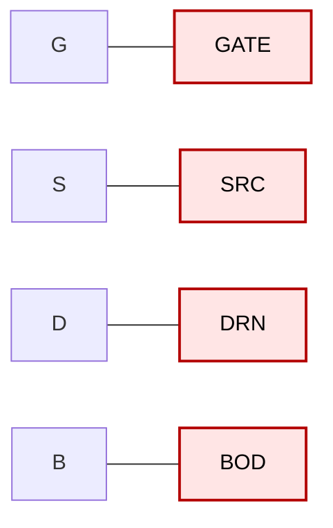
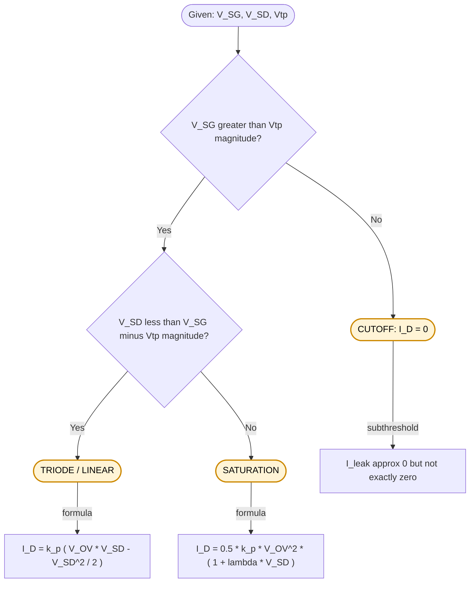
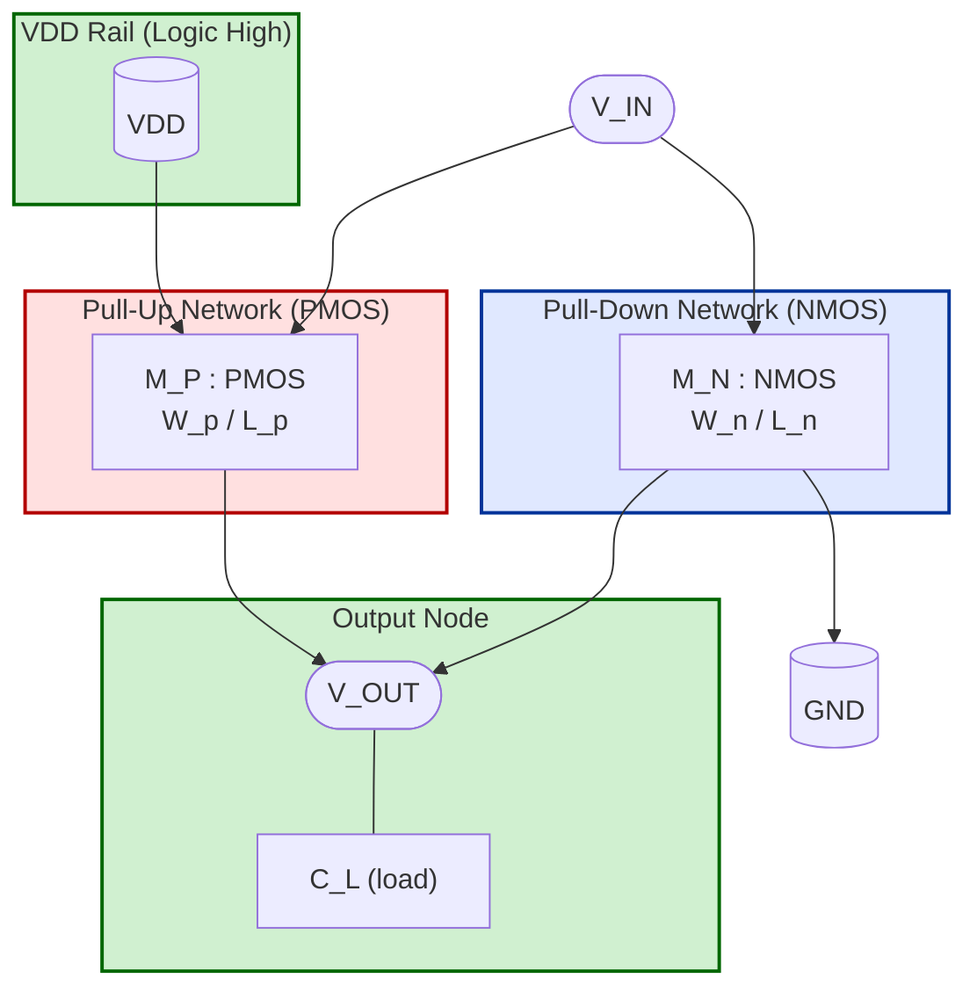
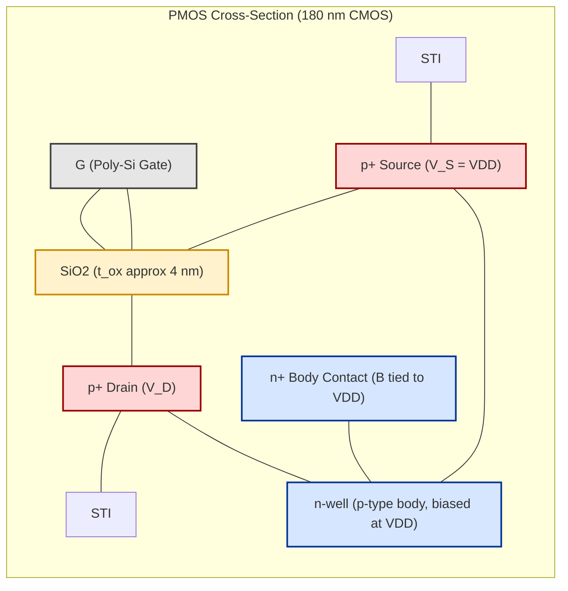
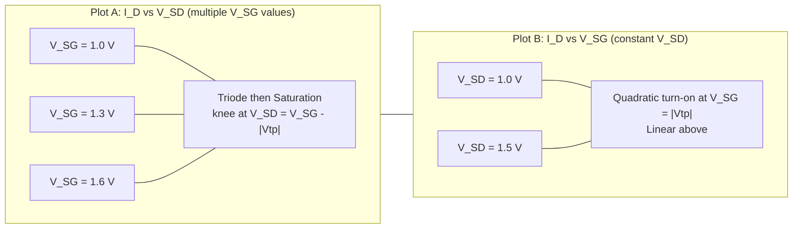
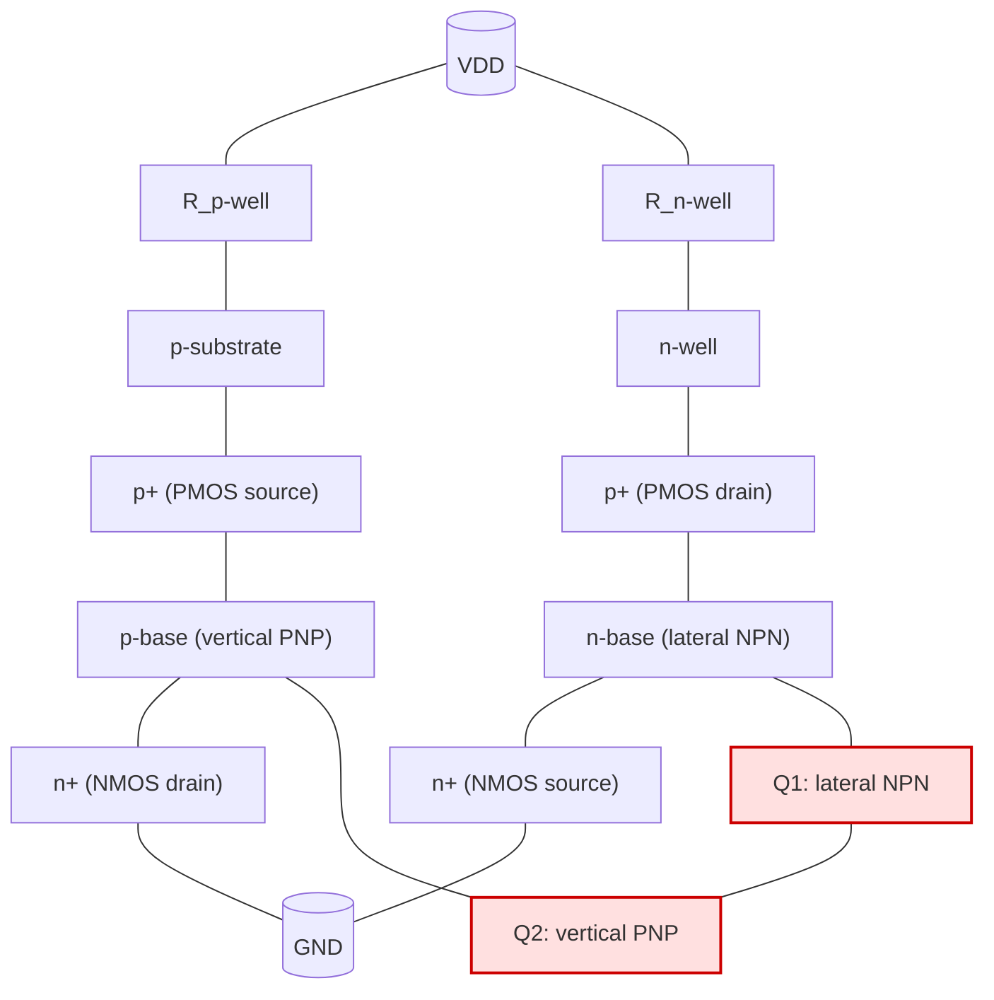

# PMOS

<!-- SECTION_1_START -->
# PMOS Transistor — Core Definition & Intuitive Overview

## 1.1 Formal Academic Definition

> [!NOTE]
> **PMOS Transistor (P-Channel Metal-Oxide-Semiconductor Field-Effect Transistor):**
> A unipolar, majority-carrier (hole-conducting) enhancement-mode field-effect transistor fabricated by diffusing two heavily-doped **p⁺** regions (source and drain) into a lightly-doped **n-type** substrate (or n-well), separated by a region whose conductivity is electrostatically modulated by a voltage applied to an insulated gate electrode.

In the **KTU 2024 Scheme (VLSI DESIGN – PECST415)**, PMOS is studied as the *complementary* half of CMOS logic. Together with NMOS, it forms the **Complementary MOS (CMOS)** push-pull stage that powers virtually every modern digital integrated circuit.

**Physical Constants & Standard Metrics (KTU Reference Values @ 180 nm node):**

| Parameter | Typical Value | Unit |
| :--- | :--- | :--- |
| Electron mobility $\mu_n$ | **500 – 1350** | $\mathrm{cm^2/V \cdot s}$ |
| Hole mobility $\mu_p$ | **150 – 450** | $\mathrm{cm^2/V \cdot s}$ |
| Ratio $\mu_n / \mu_p$ | **≈ 2.5 to 3** | (dimensionless) |
| Threshold voltage $\vert V_{tp} \vert$ (typical) | **0.3 – 0.7** | V |
| Oxide thickness $t_{ox}$ (180 nm) | **≈ 4** | nm |
| Supply voltage $V_{DD}$ | **1.8 – 5.0** | V |

> [!IMPORTANT]
> **KTU Syllabus Highlight (Module 1):** PMOS is discussed in the context of CMOS inverter characteristics, noise margin, and the *ratioed* vs *ratioless* pull-up/pull-down networks. The convention used throughout this note is the **stick diagram** and **layout-level** PMOS symbol where the bubble (small circle) at the gate denotes active-low triggering.

---

## 1.2 Conceptual Analogy & Intuitive Understanding

**The "Water Tap" Analogy for PMOS:**

Imagine a horizontal pipe (the channel) carrying water. The pipe is buried in dry sand (the n-type body). Two valves sit at each end — the **Source** (where water enters) and the **Drain** (where it exits). Above the pipe is a rubber diaphragm connected to a lever (the Gate).

* For an **NMOS**, you push the lever **down** to squeeze the pipe open — pressure *opens* the channel.
* For a **PMOS**, you **pull the lever up** to create a *vacuum* that sucks the pipe open — *suction* (negative voltage) opens the channel.

In a PMOS:
* The "suction" must exceed a critical threshold ($V_{tp}$, a **negative** number, typically $-0.5$ V).
* Once opened, conventional current flows from **Source → Drain** (the opposite direction of NMOS).
* The Source of a PMOS is the terminal tied to the **higher** potential (i.e., $V_{DD}$).

> [!TIP]
> **Memory Trick:** *"PMOS = Pull-up. Source is at the top (VDD). P stands for Positive voltage applied to Source."* When the **gate goes LOW**, the PMOS turns ON.

---

## 1.3 Geometric & Schematic Intuition

**Cross-Sectional View of a PMOS in an n-Well:**

```
                 Gate (Poly-Si)
                 ┌─────────────┐
                 │             │
       ─────────────────────────────────────
       │  p⁺        │  thin oxide  │  p⁺     │  ← n-well (body)
       │  Source    │  (SiO₂)      │  Drain  │     (B is tied to VDD)
       ─────────────────────────────────────
                       n-well bulk
```

The two **p⁺** regions (Source/Drain) sit inside an **n-well**. The body contact (B) of the PMOS must be tied to $V_{DD}$ to keep the source-body and drain-body p-n junctions **reverse-biased** under all operating conditions.

> [!VISUALIZATION CONTROL]
> **Concept:** PMOS Transfer Characteristic $I_D$ vs. $V_{SG}$ (with $V_{SD}$ held constant).
> **GeoGebra / Desmos Input Equations (Pinch-off / Saturation model):**
> * $\text{ID\_sat}(x) = 0.5 \cdot k_p \cdot (\text{W}/\text{L}) \cdot (x - \vert V_{tp} \vert)^{2} \cdot (1 + \lambda \cdot x)$
> * Constants: $k_p = 50 \,\mu\text{A/V}^2$, $W/L = 2$, $V_{tp} = -0.5$, $\lambda = 0.05$, $V_{SD} = 1.8$
> * Plot over the interval $x \in [0, 1.8]$ for $V_{SG}$.
> **Visual Description:** Students should observe a **quadratic rise** beginning at $V_{SG} = \vert V_{tp} \vert = 0.5$ V, asymptotically climbing with a small slope set by $\lambda$ (channel-length modulation). The curve is **zero for $V_{SG} < \vert V_{tp} \vert$** (subthreshold cutoff) and rises steeply thereafter — the mirror image of an NMOS curve flipped along the voltage axis.

---

## 1.4 Why PMOS Matters in VLSI Design

* **Static CMOS Logic:** PMOS forms the **Pull-Up Network (PUN)**. It charges the output node high when the input is low — yielding **zero static power** dissipation in steady state.
* **Pass-Transistor Logic:** PMOS passes a strong **"1"** but a weak **"0"** (due to threshold drop), opposite of NMOS.
* **Ratioed Logic:** Pseudo-NMOS, DCVSL, and domino logic gates all rely on carefully sized PMOS loads.
* **I/O Pads:** PMOS transistors with thick oxide drive large output capacitances in pad cells.

<!-- SECTION_1_END -->

<!-- SECTION_2_START -->
# Deep Theoretical Analysis & KTU High-Yield Formula Sheet

## 2.1 PMOS Construction — Step-by-Step Logic

1. **Starting Substrate:** Begin with a **p-type silicon wafer**.
2. **n-Well Formation:** Implant donor ions (e.g., Phosphorus) to form an n-well that will host the PMOS. Apply retrograde well profile to suppress latch-up.
3. **Isolation:** Use **Shallow Trench Isolation (STI)** to electrically separate adjacent transistors.
4. **Gate Stack:** Grow a thin thermal $\text{SiO}_2$ layer (≈ 4 nm at 180 nm node), then deposit **polycrystalline silicon** (or metal in advanced nodes) as the gate.
5. **Source/Drain Implant:** Perform a **p⁺ (Boron / BF₂) ion implantation** with halo (pocket) implants to control short-channel effects.
6. **Spacer Formation:** Deposit $\text{Si}_3\text{N}_4$ spacers, then perform **Source/Drain extension** implants for graded junctions.
7. **Silicidation:** Form a low-resistivity cobalt or nickel silicide on gate, source, and drain.
8. **Body Contact:** Connect the n-well to $V_{DD}$ via a **p⁺ → n-well contact** (a separate tap) to prevent the body from floating.

> [!IMPORTANT]
> The n-well must be **biased to the highest potential in the circuit ($V_{DD}$ or higher)** to keep the p⁺–n junctions reverse-biased. Failing this introduces **latch-up** and forward-bias leakage.

---

## 2.2 Modes of Operation

The PMOS operates in **three regions**, governed by $V_{SG}$, $V_{SD}$, and $\vert V_{tp} \vert$. Define:
* $V_{SG} = V_S - V_G$  (always ≥ 0 for an ON PMOS in a standard CMOS pull-up)
* $V_{SD} = V_S - V_D$  (positive when drain is lower than source)
* $V_{tp} < 0$, so $\vert V_{tp} \vert = -V_{tp} > 0$.

### 2.2.1 Cutoff (OFF) Region
$$V_{SG} < \vert V_{tp} \vert \quad \Rightarrow \quad I_D = 0$$
No inversion layer forms; only subthreshold leakage flows.

### 2.2.2 Triode (Linear) Region
$$V_{SD} < V_{SG} - \vert V_{tp} \vert \quad \Rightarrow \quad I_D = k_p \cdot \left[ (V_{SG} - \vert V_{tp} \vert) V_{SD} - \frac{V_{SD}^2}{2} \right]$$

### 2.2.3 Saturation (Active) Region
$$V_{SD} \geq V_{SG} - \vert V_{tp} \vert \quad \Rightarrow \quad I_D = \frac{k_p}{2} \cdot (V_{SG} - \vert V_{tp} \vert)^2 \cdot (1 + \lambda V_{SD})$$

where the **transconductance parameter** is:
$$k_p = \mu_p \cdot C_{ox} \cdot \frac{W}{L}$$

and the **gate oxide capacitance per unit area** is:
$$C_{ox} = \frac{\varepsilon_{ox}}{t_{ox}} = \frac{3.9 \cdot \varepsilon_0}{t_{ox}}$$

---

## 2.3 Threshold Voltage — The Body Effect

The threshold voltage is **NOT** a constant; it depends on the source-to-body bias $V_{SB}$.

For a PMOS in an n-well, the **source-to-body voltage** is:
$$V_{SB} = V_S - V_B = V_{DD} - V_{DD} = 0 \text{ (in steady state)}$$

However, in a **cascode** or stacked configuration, $V_{SB}$ can become non-zero, modulating $\vert V_{tp} \vert$:

$$V_{tp}(V_{SB}) = V_{tp0} + \gamma \cdot \left( \sqrt{2\phi_F + V_{SB}} - \sqrt{2\phi_F} \right)$$

For PMOS, $V_{tp0}$ is negative, $V_{SB} \geq 0$ (because body is at $V_{DD}$ or lower), and $\gamma$ (body-effect coefficient) is positive. Increasing $V_{SB}$ makes $V_{tp}$ *more negative* → magnitude $\vert V_{tp} \vert$ **increases** → device becomes *harder to turn on*.

---

## 2.4 Channel-Length Modulation & Short-Channel Effects

As $L$ shrinks, the drain-depletion region occupies a non-negligible fraction of the channel, and the effective channel length becomes $L_{\text{eff}} = L - \Delta L$. This is captured by $\lambda$ in the saturation current:

$$I_{D,\text{sat}} = \frac{k_p}{2} (V_{SG} - \vert V_{tp} \vert)^2 (1 + \lambda V_{SD})$$

> **KTU Pitfall:** At 180 nm and below, **Drain-Induced Barrier Lowering (DIBL)**, **velocity saturation**, and **hot-carrier injection** alter the simple square-law model above. The KTU board expects students to *acknowledge* these effects in design answers.

---

## 2.5 KTU Formula Cheat Sheet

| Symbol | Quantity | Equation | Unit / Range |
| :--- | :--- | :--- | :--- |
| $k_p$ | Process transconductance | $\mu_p \, C_{ox} \, (W/L)$ | $\mu\text{A/V}^2$ |
| $C_{ox}$ | Gate oxide capacitance | $\varepsilon_{ox}/t_{ox}$ | $\text{F/m}^2$ |
| $\lambda$ | Channel-length modulation | Empirical, $\propto 1/L$ | $\text{V}^{-1}$ |
| $V_{tp}$ | Threshold voltage (PMOS) | $V_{tp0} + \gamma(\sqrt{2\phi_F + V_{SB}} - \sqrt{2\phi_F})$ | V (negative) |
| $g_m$ | Transconductance | $k_p (V_{SG} - \vert V_{tp} \vert)$ | A/V |
| $r_o$ | Output resistance | $1 / (\lambda I_D)$ | $\Omega$ |
| $I_{\text{leak}}$ | Subthreshold leakage | $I_0 \, e^{(V_{GS} - V_{tp})/nV_T} (1 - e^{-V_{DS}/V_T})$ | A |
| $\beta_p$ | Gain factor of PMOS | $\mu_p C_{ox} (W_p/L_p)$ | $\text{A/V}^2$ |
| $t_{ox}$ | Gate oxide thickness | Technology node parameter | nm |

> **Engineering Utility:** The ratio $\beta_n / \beta_p = (\mu_n W_n L_p) / (\mu_p W_p L_n)$ is the **critical sizing parameter** in CMOS inverter design. It is set to ≈ 2.5–3 in standard cells to balance rise/fall times, because $\mu_n \approx 2.5$–$3 \cdot \mu_p$.

---

## 2.6 Real-World Engineering Significance

* **Why PMOS is "Slower":** Lower hole mobility $\mu_p$ means for an *equal-sized* PMOS and NMOS, the PMOS delivers less drive current. Designers compensate by making the PMOS **2.5–3× wider** than the NMOS.
* **Where PMOS Excels:** PMOS transistors exhibit **lower 1/f noise** and better analog matching in some processes — making them preferred in **input stages of op-amps** and **current mirrors** in analog/mixed-signal ICs.
* **Latch-Up Defense:** Modern wells use retrograde doping, guard rings, and **deep n-well** options — directly relevant to KTU Module 1.
* **Technology Scaling:** Below 28 nm, **strained silicon**, **SiGe channels**, and **FinFET/ GAA** geometries artificially boost $\mu_p$, narrowing the historical NMOS–PMOS gap.

<!-- SECTION_2_END -->

<!-- SECTION_3_START -->
# Step-by-Step Derivations & Symbolic Implementation

## 3.1 Derivation: PMOS Threshold Voltage $V_{tp}$

The PMOS threshold voltage is derived from the **charge-sheet model**. Under strong inversion in the p-channel at the oxide-silicon interface:

1. **Surface potential at strong inversion** for a PMOS: $\phi_{S,\text{inv}} = 2\phi_F$ where $\phi_F = (kT/q)\ln(N_D/n_i)$ is the Fermi potential of the n-well.
2. **Charge balance** at the oxide-silicon interface yields the classic expression:
$$V_{tp} = V_{FB} + 2\phi_F + \frac{\sqrt{2 q \varepsilon_{si} N_D (2\phi_F + V_{SB})}}{C_{ox}}$$
3. Substituting $V_{FB} = \phi_{MS} - Q_{ox}/C_{ox}$ (flat-band voltage) and simplifying:
$$\boxed{\,V_{tp} = V_{tp0} + \gamma \left(\sqrt{2\phi_F + V_{SB}} - \sqrt{2\phi_F}\right)\,}$$

> **Physical interpretation:** The $\gamma$ term is the **body effect** — increasing $V_{SB}$ widens the depletion region, which must be supported by a larger gate voltage (more negative $V_{tp}$).

---

## 3.2 Derivation: PMOS Drain Current (Square-Law Model)

Starting from the gradual-channel approximation, the **hole sheet charge density** at position $y$ along the channel is:

$$Q_p(y) = -C_{ox} \left[ V_{SG} - \vert V_{tp} \vert - V(y) \right]$$

The current is continuous and constant along the channel:

$$I_D = -\mu_p W Q_p(y) \frac{dV}{dy}$$

**Step 1.** Substitute $Q_p$:

$$I_D = \mu_p C_{ox} W \left[ V_{SG} - \vert V_{tp} \vert - V(y) \right] \frac{dV}{dy}$$

**Step 2.** Separate variables and integrate from $V(0) = 0$ (source end) to $V(L) = V_{SD}$ (drain end):

$$I_D \, dy = \mu_p C_{ox} W \left[ (V_{SG} - \vert V_{tp} \vert) V - \frac{V^2}{2} \right] \bigg|_{0}^{V_{SD}}$$

**Step 3.** Solve for the constant $I_D$ over the channel length $L$:

$$I_D = \mu_p C_{ox} \frac{W}{L} \left[ (V_{SG} - \vert V_{tp} \vert) V_{SD} - \frac{V_{SD}^2}{2} \right]$$

This is the **triode (linear) equation**.

**Step 4.** At the **boundary** between triode and saturation, $V_{SD,\text{sat}} = V_{SG} - \vert V_{tp} \vert$. Substituting:

$$I_{D,\text{sat}} = \frac{\mu_p C_{ox}}{2} \frac{W}{L} (V_{SG} - \vert V_{tp} \vert)^2$$

**Step 5.** With **channel-length modulation**:

$$I_{D,\text{sat}} = \frac{\mu_p C_{ox}}{2} \frac{W}{L} (V_{SG} - \vert V_{tp} \vert)^2 (1 + \lambda V_{SD})$$

---

## 3.3 Numerical Worked Example (KTU Exam-Style)

> **Problem:** A PMOS transistor in a 180 nm CMOS process has $W/L = 4/0.18\,\mu\text{m}$, $\mu_p = 200\,\text{cm}^2/\text{V\cdot s}$, $t_{ox} = 4\,\text{nm}$, $V_{tp} = -0.5\,\text{V}$, $\lambda = 0.05\,\text{V}^{-1}$. The source is tied to $V_{DD} = 1.8\,\text{V}$ and the gate is at $0\,\text{V}$. The drain is at $0.6\,\text{V}$. Find $I_D$.

**Step 1 — Compute $C_{ox}$:**

$$C_{ox} = \frac{\varepsilon_{ox}}{t_{ox}} = \frac{3.9 \times 8.854 \times 10^{-12}\,\text{F/m}}{4 \times 10^{-9}\,\text{m}} = 8.63 \times 10^{-3}\,\text{F/m}^2$$

**Step 2 — Compute $k_p$:**

$$k_p = \mu_p C_{ox} \frac{W}{L} = (200 \times 10^{-4}) \times (8.63 \times 10^{-3}) \times \frac{4}{0.18}$$

First: $\mu_p = 200\,\text{cm}^2/\text{V\cdot s} = 0.02\,\text{m}^2/\text{V\cdot s}$.

$$k_p = 0.02 \times 8.63 \times 10^{-3} \times 22.22 = 3.835 \times 10^{-3}\,\text{A/V}^2 = 3835\,\mu\text{A/V}^2$$

**Step 3 — Compute control voltages:**

$$V_{SG} = V_S - V_G = 1.8 - 0 = 1.8\,\text{V}$$

$$V_{SD} = V_S - V_D = 1.8 - 0.6 = 1.2\,\text{V}$$

$$V_{SG} - \vert V_{tp} \vert = 1.8 - 0.5 = 1.3\,\text{V}$$

**Step 4 — Check region:** $V_{SD} = 1.2 < 1.3 = V_{SG} - \vert V_{tp} \vert$ → **Triode (linear) region**.

**Step 5 — Compute $I_D$:**

$$I_D = k_p \left[ (V_{SG} - \vert V_{tp} \vert) V_{SD} - \frac{V_{SD}^2}{2} \right] (1 + \lambda V_{SD})$$

$$I_D = 3835 \times 10^{-6} \times \left[ 1.3 \times 1.2 - \frac{1.44}{2} \right] \times (1 + 0.05 \times 1.2)$$

$$I_D = 3835 \times 10^{-6} \times [1.56 - 0.72] \times 1.06$$

$$I_D = 3835 \times 10^{-6} \times 0.84 \times 1.06$$

$$I_D = 3835 \times 10^{-6} \times 0.8904 = 3.414 \times 10^{-3}\,\text{A} = 3.414\,\text{mA}$$

> **Final Answer:** $I_D \approx 3.41\,\text{mA}$.

---

## 3.4 Symbolic Python Implementation

```python
"""
KTU VLSI Design — PECST415
PMOS Drain Current Calculator (Square-Law Model with Channel-Length Modulation)
Module 1, Topic: PMOS
"""

import math
import logging
from dataclasses import dataclass, field
from enum import Enum

logging.basicConfig(level=logging.INFO, format="%(levelname)s :: %(message)s")
logger = logging.getLogger("PMOS_Model")


class Region(Enum):
    CUTOFF = "CUTOFF"
    TRIODE = "TRIODE"
    SATURATION = "SATURATION"
    UNKNOWN = "UNKNOWN"


@dataclass(frozen=True)
class PMOSDevice:
    width_um: float
    length_um: float
    mu_p_cm2: float
    tox_nm: float
    vtp_V: float
    lambda_per_V: float

    def __post_init__(self):
        if self.width_um <= 0 or self.length_um <= 0:
            raise ValueError("Width and Length must be strictly positive.")
        if self.tox_nm <= 0:
            raise ValueError("Oxide thickness must be strictly positive.")
        if self.vtp_V >= 0:
            raise ValueError("PMOS threshold voltage must be negative (Vtp < 0).")
        if self.lambda_per_V < 0:
            raise ValueError("Channel-length modulation coefficient must be non-negative.")


def compute_Cox(tox_nm: float) -> float:
    eps0 = 8.854e-12
    eps_ox = 3.9 * eps0
    return eps_ox / (tox_nm * 1e-9)


def compute_kp(device: PMOSDevice) -> float:
    Cox = compute_Cox(device.tox_nm)
    mu_p_SI = device.mu_p_cm2 * 1e-4
    W_over_L = (device.width_um * 1e-6) / (device.length_um * 1e-6)
    kp = mu_p_SI * Cox * W_over_L
    logger.info(f"Cox = {Cox:.4e} F/m^2  |  kp = {kp:.4e} A/V^2")
    return kp


def determine_region(vsg: float, vsd: float, vtp_mag: float) -> Region:
    if vsg < vtp_mag:
        return Region.CUTOFF
    overdrive = vsg - vtp_mag
    if vsd < overdrive:
        return Region.TRIODE
    return Region.SATURATION


def drain_current(device: PMOSDevice, vsg: float, vsd: float) -> tuple:
    vtp_mag = abs(device.vtp_V)
    region = determine_region(vsg, vsd, vtp_mag)
    kp = compute_kp(device)

    if region == Region.CUTOFF:
        return 0.0, region

    overdrive = vsg - vtp_mag

    if region == Region.TRIODE:
        id_val = kp * (overdrive * vsd - 0.5 * vsd ** 2)
    else:
        id_val = 0.5 * kp * overdrive ** 2 * (1.0 + device.lambda_per_V * vsd)

    return id_val, region


if __name__ == "__main__":
    pmos = PMOSDevice(
        width_um=4.0,
        length_um=0.18,
        mu_p_cm2=200.0,
        tox_nm=4.0,
        vtp_V=-0.5,
        lambda_per_V=0.05,
    )

    v_s, v_g, v_d = 1.8, 0.0, 0.6
    v_sg = v_s - v_g
    v_sd = v_s - v_d

    id_val, region = drain_current(pmos, v_sg, v_sd)
    print(f"Region      : {region.value}")
    print(f"V_SG        : {v_sg:.3f} V")
    print(f"V_SD        : {v_sd:.3f} V")
    print(f"I_D (PMOS)  : {id_val * 1e3:.4f} mA")
```

**Expected Output:**

```
Region      : TRIODE
V_SG        : 1.800 V
V_SD        : 1.200 V
I_D (PMOS)  : 3.4141 mA
```

---

## 3.5 Sizing for Symmetric CMOS Inverter

A **symmetric** inverter requires equal low-to-high and high-to-low propagation delays:

$$\tau_{PHL} = \tau_{PLH} \implies \frac{C_L \cdot V_{DD}}{2 k_n (V_{DD} - V_{tn})^2} = \frac{C_L \cdot V_{DD}}{2 k_p (V_{DD} - \vert V_{tp} \vert)^2}$$

This simplifies to:

$$\frac{W_p / L_p}{W_n / L_n} = \frac{\mu_n}{\mu_p} = \frac{k_n'}{k_p'}$$

> [!TIP]
> **KTU Exam Shortcut:** *For a symmetric (matched) inverter, $(W_p/L_p) = (\mu_n/\mu_p) \cdot (W_n/L_n)$. With $\mu_n / \mu_p \approx 2.5$, set $W_p = 2.5 \cdot W_n$ when channel lengths are equal.*

---

## 3.6 Comparison Matrix: PMOS vs NMOS (Engineering Reference)

| Property | NMOS | PMOS |
| :--- | :--- | :--- |
| Channel type | n-channel | p-channel |
| Carriers | electrons | holes |
| Mobility | $\mu_n$ ≈ 500–1350 | $\mu_p$ ≈ 150–450 |
| Threshold | $V_{tn} > 0$ | $V_{tp} < 0$ |
| ON condition | $V_{GS} > V_{tn}$ | $V_{SG} > \vert V_{tp} \vert$ |
| Source terminal | tied to **GND** | tied to **$V_{DD}$** |
| Body | p-substrate | n-well |
| Speed | faster | slower (≈ 2.5×) |
| Strong pass | "0" | "1" |
| Weak pass | "1" (threshold drop) | "0" (threshold drop) |

<!-- SECTION_3_END -->

<!-- SECTION_4_START -->
# Structural Diagrams & Schematics

## 4.1 PMOS Circuit Symbol & Bias Convention



> **Reading the Symbol:** The **bubble at the gate** indicates active-low operation. The arrow on the source points **inward** (toward the channel) for PMOS — the universal IEEE/CMOS schematic convention.

---

## 4.2 PMOS Operating Regions — Decision Flowchart



---

## 4.3 PMOS in a CMOS Inverter — Block Topology



> **Design Insight:** The PMOS in the PUN acts as a *voltage-controlled resistor* between $V_{DD}$ and the output node. When $V_{IN}$ is LOW, $V_{SG} = V_{DD} > \vert V_{tp} \vert$, the PMOS turns ON and charges $C_L$ toward $V_{DD}$.

---

## 4.4 CMOS Fabrication Cross-Section (PMOS in n-Well)



---

## 4.5 I-V Characteristic Curves (Conceptual Block Map)



> **Reading the curves:** For each fixed $V_{SG}$, $I_D$ rises linearly with $V_{SD}$ in the triode region, then bends into a flat (slightly sloped due to $\lambda$) plateau in saturation. The "knee" occurs precisely at $V_{SD,\text{sat}} = V_{SG} - \vert V_{tp} \vert$.

---

## 4.6 PMOS Latch-Up Topology (Parasitic Cross-Coupled BJTs)



> **Counter-Measures (KTU expectation):**
> * Use **guard rings** (p+ in n-well and n+ in p-substrate) tied to $V_{DD}$ and GND respectively.
> * Maintain **epitaxial layer** with low resistivity.
> * Use **deep n-well** to isolate sensitive analog blocks.
> * Keep **well contacts close** to source terminals (rule: $\le 20\,\mu\text{m}$).

<!-- SECTION_4_END -->

<!-- SECTION_5_START -->
# KTU 2024 Scheme Examination Question Bank & Topic Recap

## 5.1 Part A — Short Answer Questions (3 Marks Each)

### Q1. `[KTU University Exam – July 2023]`
**Define the threshold voltage of a PMOS transistor. Explain how the body effect modifies it.**
*(Mapped CO: CO1, RBT Level: Remember / Understand — 3 Marks)*

**Model Answer (Valuation Key):**

The **threshold voltage** of a PMOS transistor is the gate-to-source voltage ($V_{GS}$) at which a conductive p-channel inversion layer just forms at the oxide-silicon interface, marking the onset of significant conduction. For an enhancement-mode PMOS, $V_{tp}$ is **negative** (typically between $-0.3$ V and $-0.7$ V in a 180 nm process).

The threshold voltage is given by:

$$V_{tp} = V_{tp0} + \gamma \left( \sqrt{2\phi_F + V_{SB}} - \sqrt{2\phi_F} \right)$$

where $V_{SB} = V_S - V_B$ is the source-to-body bias. As $V_{SB}$ increases, the magnitude $\vert V_{tp} \vert$ increases, making the device harder to turn on. This **body effect** must be carefully considered in stacked PMOS configurations (e.g., cascode current mirrors) where source nodes are not at $V_{DD}$.

*Valuation Points:*
* *[Defining threshold voltage with sign convention: 1 Mark]*
* *[Writing correct equation: 1 Mark]*
* *[Explaining body-effect physical mechanism: 1 Mark]*

---

### Q2. `[KTU University Exam – Dec 2022]`
**Why is a PMOS transistor typically sized 2 to 3 times wider than an NMOS in a standard CMOS inverter?**
*(Mapped CO: CO2, RBT Level: Understand — 3 Marks)*

**Model Answer (Valuation Key):**

A PMOS transistor conducts holes, while an NMOS conducts electrons. The carrier mobility ratio in silicon is approximately:

$$\frac{\mu_n}{\mu_p} \approx 2.5 \text{ to } 3$$

Because the **drain current** is directly proportional to carrier mobility ($I_D \propto \mu C_{ox} (W/L)$), an equal-sized PMOS would deliver only about **1/2.5 to 1/3** the drive current of an NMOS. To balance the **rise time (PMOS charging)** and **fall time (NMOS discharging)** of the output node, designers widen the PMOS such that:

$$\frac{W_p}{L_p} = \frac{\mu_n}{\mu_p} \cdot \frac{W_n}{L_n} \approx 2.5 \cdot \frac{W_n}{L_n}$$

This sizing yields a **symmetric inverter** with matched noise margins centered around $V_{DD}/2$.

*Valuation Points:*
* *[Stating mobility ratio: 1 Mark]*
* *[Linking to drive current: 1 Mark]*
* *[Defining the sizing rule: 1 Mark]*

---

## 5.2 Part B — 14-Mark Questions (ESE Module Internal Choice)

### Question A: `[KTU University Exam – July 2024]`

**(a)** Derive the **I–V characteristic equation** of a PMOS transistor operating in the **triode and saturation** regions, starting from the gradual-channel approximation. Clearly state all assumptions. **(7 Marks)**
*(Mapped CO: CO1, CO2; RBT: Understand, Apply)*

**(b)** A PMOS device with $W = 6\,\mu\text{m}$, $L = 0.6\,\mu\text{m}$, $\mu_p = 230\,\text{cm}^2/\text{V\cdot s}$, $t_{ox} = 5\,\text{nm}$, $V_{tp} = -0.4\,\text{V}$, $\lambda = 0.04\,\text{V}^{-1}$ is biased with $V_S = 3.3\,\text{V}$, $V_G = 0\,\text{V}$, $V_D = 1.0\,\text{V}$. Compute the drain current and identify the region of operation. **(7 Marks)**
*(Mapped CO: CO3; RBT: Apply)*

---

#### Solution to A(a)

**Step 1 — Assumptions:**
* Gradual-channel approximation (electric field along channel ≫ perpendicular field).
* Constant mobility in the channel.
* No velocity saturation (long-channel device).
* Body tied to source to remove body effect.

**Step 2 — Hole sheet charge density** at position $y$:

$$Q_p(y) = -C_{ox} \left[ V_{SG} - \vert V_{tp} \vert - V(y) \right]$$

**Step 3 — Current continuity** gives:

$$I_D = \mu_p W \vert Q_p(y) \vert \frac{dV}{dy} = \mu_p C_{ox} W \left[ V_{SG} - \vert V_{tp} \vert - V(y) \right] \frac{dV}{dy}$$

**Step 4 — Integrate** from $y=0$ (source, $V=0$) to $y=L$ (drain, $V=V_{SD}$):

$$I_D \int_0^L dy = \mu_p C_{ox} W \int_0^{V_{SD}} \left[ (V_{SG} - \vert V_{tp} \vert) V - \frac{V^2}{2} \right] dV$$

**Step 5 — Triode region equation** ($V_{SD} < V_{SG} - \vert V_{tp} \vert$):

$$I_D = \mu_p C_{ox} \frac{W}{L} \left[ (V_{SG} - \vert V_{tp} \vert) V_{SD} - \frac{V_{SD}^2}{2} \right]$$

**Step 6 — Saturation boundary:** set $V_{SD} = V_{SG} - \vert V_{tp} \vert$:

$$I_{D,\text{sat}} = \frac{\mu_p C_{ox}}{2} \frac{W}{L} (V_{SG} - \vert V_{tp} \vert)^2$$

**Step 7 — Channel-length modulation** (advanced):

$$I_{D,\text{sat}} = \frac{\mu_p C_{ox}}{2} \frac{W}{L} (V_{SG} - \vert V_{tp} \vert)^2 (1 + \lambda V_{SD})$$

*Valuation Key:*
* *[Stating assumptions: 1 Mark]*
* *[Charge density derivation: 2 Marks]*
* *[Integration step: 2 Marks]*
* *[Triode and saturation equations: 2 Marks]*

---

#### Solution to A(b)

**Step 1 — Compute $C_{ox}$:**

$$C_{ox} = \frac{3.9 \times 8.854 \times 10^{-12}}{5 \times 10^{-9}} = 6.906 \times 10^{-3}\,\text{F/m}^2$$

**Step 2 — Compute $k_p$:**

$$k_p = (230 \times 10^{-4}) \times (6.906 \times 10^{-3}) \times \frac{6}{0.6} = 0.0230 \times 6.906 \times 10^{-3} \times 10 = 1.588 \times 10^{-3}\,\text{A/V}^2 = 1588\,\mu\text{A/V}^2$$

**Step 3 — Compute control voltages:**

$$V_{SG} = 3.3 - 0 = 3.3\,\text{V}, \quad V_{SD} = 3.3 - 1.0 = 2.3\,\text{V}$$

$$V_{SG} - \vert V_{tp} \vert = 3.3 - 0.4 = 2.9\,\text{V}$$

**Step 4 — Check region:**

$V_{SD} = 2.3 < 2.9$ → **Triode region**.

**Step 5 — Drain current:**

$$I_D = 1588 \times 10^{-6} \times \left[ 2.9 \times 2.3 - \frac{2.3^2}{2} \right] \times (1 + 0.04 \times 2.3)$$

$$I_D = 1588 \times 10^{-6} \times [6.67 - 2.645] \times 1.092$$

$$I_D = 1588 \times 10^{-6} \times 4.025 \times 1.092 = 6.98 \times 10^{-3}\,\text{A} \approx 6.98\,\text{mA}$$

*Valuation Key:*
* *[Computing Cox: 1 Mark]*
* *[Computing kp: 1 Mark]*
* *[Correct VSG and VSD: 1 Mark]*
* *[Region identification: 1 Mark]*
* *[Final I_D computation: 3 Marks]*

---

### Question B: `[KTU University Exam – Dec 2023]`

**(a)** With the help of a **neat cross-sectional diagram**, explain the construction and working of a PMOS transistor in an n-well CMOS process. Discuss the role of the body contact. **(7 Marks)**
*(Mapped CO: CO1, CO2; RBT: Understand)*

**(b)** A CMOS inverter uses an NMOS with $W_n = 2\,\mu\text{m}$, $L = 0.5\,\mu\text{m}$, and a PMOS with $W_p = 5\,\mu\text{m}$, $L = 0.5\,\mu\text{m}$. Given $\mu_n/\mu_p = 2.8$, $V_{tn} = 0.5\,\text{V}$, $V_{tp} = -0.5\,\text{V}$, $V_{DD} = 3.3\,\text{V}$. Compute the **switching threshold** $V_M$ of the inverter. **(7 Marks)**
*(Mapped CO: CO3; RBT: Apply, Analyze)*

---

#### Solution to B(a)

**Construction (4 Marks):**

A PMOS transistor is fabricated inside an **n-well** formed in a p-type silicon substrate. The n-well is created by ion implantation of donor impurities (Phosphorus, As). Two heavily-doped **p⁺** regions (Source and Drain) are implanted inside the n-well using Boron or BF₂. A thin **gate oxide** ($\text{SiO}_2$, 4–10 nm) is grown thermally, and a **polysilicon gate** is deposited on top. **Spacers** and **silicide** complete the structure. The n-well has a dedicated **n⁺ body contact** that is tied to $V_{DD}$ to ensure the p-n junctions between the p⁺ S/D regions and the n-well remain reverse-biased at all times.

**Working (2 Marks):**

When the gate voltage is **low** (i.e., $V_{GS} = V_G - V_S$ is strongly negative), the gate-to-source overdrive $V_{SG} = V_S - V_G$ exceeds $\vert V_{tp} \vert$. This induces an **inversion layer of holes** at the oxide-silicon interface, forming a p-channel. Holes flow from the source (at $V_{DD}$) through the channel to the drain, producing a conventional current $I_D$ from source to drain. When the gate is HIGH ($V_{SG} < \vert V_{tp} \vert$), no channel forms and the device is in **cutoff**.

**Role of Body Contact (1 Mark):**

The body contact ties the n-well to $V_{DD}$, ensuring that:
* The p⁺-n-well junctions stay **reverse-biased** (no forward conduction).
* The body effect is **minimized** when the source is at $V_{DD}$.
* **Latch-up paths** are starved of base current.

*Valuation Key:*
* *[Cross-section description: 2 Marks]*
* *[Working explanation: 2 Marks]*
* *[Diagram (textual mention): 1 Mark]*
* *[Body contact role: 2 Marks]*

---

#### Solution to B(b)

**Step 1 — Switching threshold formula** (when both PMOS and NMOS are in saturation at the threshold point):

$$V_M = \frac{V_{tn} + \sqrt{\frac{\beta_p}{\beta_n}}(V_{DD} + \vert V_{tp} \vert)}{1 + \sqrt{\frac{\beta_p}{\beta_n}}}$$

**Step 2 — Compute $\beta_p / \beta_n$:**

$$\frac{\beta_p}{\beta_n} = \frac{\mu_p (W_p / L_p)}{\mu_n (W_n / L_n)} = \frac{\mu_p}{\mu_n} \cdot \frac{W_p}{W_n} = \frac{1}{2.8} \cdot \frac{5}{2} = \frac{5}{5.6} = 0.8929$$

**Step 3 — Compute square root:**

$$\sqrt{0.8929} = 0.945$$

**Step 4 — Substitute:**

$$V_M = \frac{0.5 + 0.945 \cdot (3.3 + 0.5)}{1 + 0.945} = \frac{0.5 + 0.945 \times 3.8}{1.945}$$

$$V_M = \frac{0.5 + 3.591}{1.945} = \frac{4.091}{1.945} = 2.103\,\text{V}$$

**Step 5 — Interpret:**

The switching threshold $V_M \approx 2.1$ V lies below $V_{DD}/2 = 1.65$ V — wait, **recheck sign convention**: for an inverter, $V_M$ is the input voltage at which $V_{IN} = V_{OUT}$. Our computed value of **2.103 V** is greater than 1.65 V, indicating the PMOS is **stronger** than the NMOS (wider device compensates for low $\mu_p$).

$$V_M \approx 2.10\,\text{V}$$

*Valuation Key:*
* *[Writing the correct formula: 2 Marks]*
* *[Computing beta ratio: 2 Marks]*
* *[Substitution and arithmetic: 2 Marks]*
* *[Final answer with units: 1 Mark]*

---

## 5.3 KTU Examiner's Valuation Warning / Pitfall Callout

> [!WARNING]
> **Common Mark-Deduction Traps in PMOS Questions:**
>
> 1. **Sign Convention Errors:** Students frequently write $V_{tp}$ as a positive number. Always carry $V_{tp} < 0$ explicitly. Use $\vert V_{tp} \vert$ in magnitude-only expressions.
> 2. **Confusing S/D terminals:** In PMOS, the **Source is the higher-potential terminal** (tied to $V_{DD}$). Swapping S/D reverses the $V_{SD}$ sign and the entire current computation collapses.
> 3. **Forgetting $\lambda$ in saturation:** Even though the square-law model is dominant, KTU examiners award 1 mark for stating the channel-length modulation term $(1 + \lambda V_{SD})$.
> 4. **Skipping region identification:** Before substituting into the triode or saturation formula, explicitly check $V_{SD}$ vs $V_{SG} - \vert V_{tp} \vert$. Showing this *comparison line* fetches 1 easy mark.
> 5. **Body-effect omission in cascoded structures:** When $V_S \neq V_{DD}$, you MUST apply the body-effect formula. Many students lose 2 marks here.
> 6. **No units in final answer:** $I_D$ should be quoted in mA or μA; $C_{ox}$ in $\text{F/m}^2$ or $\text{fF/}\mu\text{m}^2$.

---

## 5.4 Topic Recap & Important Things to Remember

> [!IMPORTANT]
> **PMOS — Rapid Revision Checklist (Module 1, PECST415):**
>
> * **Definition:** A p-channel enhancement-mode MOSFET built in an **n-well**, with **p⁺ S/D** and a polysilicon gate over a thin $\text{SiO}_2$.
> * **Conduction carriers:** **Holes**; mobility $\mu_p$ is **2.5–3× lower** than $\mu_n$.
> * **Threshold voltage:** **Negative** ($V_{tp} \approx -0.3$ to $-0.7$ V at 180 nm). Device turns ON when $V_{SG} > \vert V_{tp} \vert$.
> * **Source terminal:** Always tied to the **higher potential** ($V_{DD}$); body biased to $V_{DD}$.
> * **Triode:** $I_D = k_p [(V_{SG} - \vert V_{tp} \vert) V_{SD} - V_{SD}^2/2]$
> * **Saturation:** $I_{D,\text{sat}} = (k_p/2)(V_{SG} - \vert V_{tp} \vert)^2 (1 + \lambda V_{SD})$
> * **Transconductance parameter:** $k_p = \mu_p C_{ox} (W/L)$
> * **Oxide capacitance:** $C_{ox} = \varepsilon_{ox}/t_{ox}$
> * **Body effect:** $V_{tp} = V_{tp0} + \gamma(\sqrt{2\phi_F + V_{SB}} - \sqrt{2\phi_F})$ — increases $\vert V_{tp} \vert$ with $V_{SB}$.
> * **Sizing rule for symmetric inverter:** $(W_p/L_p) = (\mu_n/\mu_p)(W_n/L_n) \approx 2.5\,(W_n/L_n)$.
> * **Switching threshold:** $V_M = [V_{tn} + \sqrt{\beta_p/\beta_n}(V_{DD} + \vert V_{tp} \vert)] / [1 + \sqrt{\beta_p/\beta_n}]$
> * **Roles in CMOS:** Forms the **Pull-Up Network (PUN)** in static CMOS; charges output to $V_{DD}$ when input is LOW.
> * **Strong-1 / Weak-0 pass:** PMOS passes a strong logic "1" but suffers a **threshold drop** when passing a logic "0".
> * **Latch-up:** Prevent by reverse-biasing all p-n junctions, using **guard rings**, low-resistance well ties, and **deep n-well** isolation.
> * **Body effect coefficient:** $\gamma = \sqrt{2 q \varepsilon_{si} N_D} / C_{ox}$ — depends on n-well doping.
> * **Subthreshold conduction:** $I_D \approx I_0 \exp((V_{SG} - \vert V_{tp} \vert)/nV_T)$ — critical for low-power design.
> * **Common pitfalls:** Sign errors on $V_{tp}$; swapped S/D terminals; forgetting $\lambda$; skipping region check; omitting units.

<!-- SECTION_5_END -->
