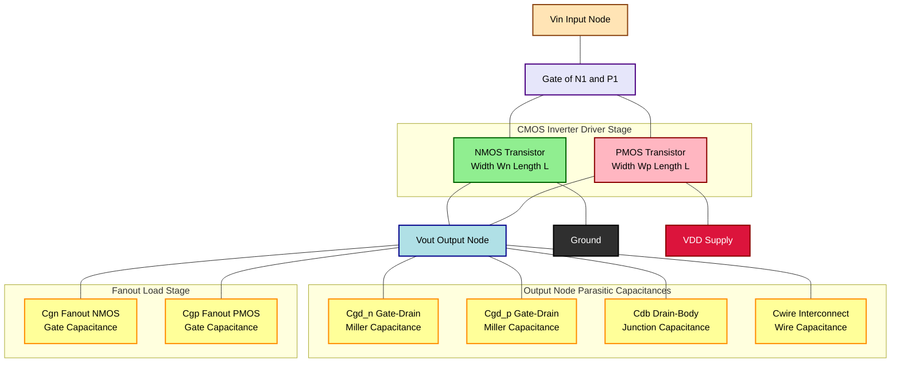
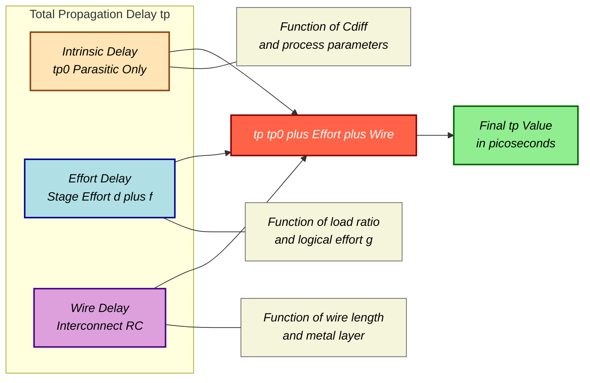

# Propagation Delay

<!-- SECTION_1_START -->

# Propagation Delay in CMOS Digital VLSI Design

## 1.1 Formal Academic Definition (KTU 2024 Syllabus Terminology)

> [!IMPORTANT]
> **Propagation Delay ($t_p$):** The time interval between the **50% transition point** of the input waveform and the corresponding **50% transition point** of the output waveform, measured when the CMOS logic gate is driving a specified load capacitance.

In the context of CMOS VLSI design, propagation delay is the fundamental temporal metric that quantifies how quickly a digital gate can switch its output state in response to a change at its input. It is the single most important timing parameter used in static timing analysis (STA), clock-tree synthesis, and pipeline stage budgeting.

The propagation delay is formally split into two directional components:

| Symbol | Name | Definition |
| :--- | :--- | :--- |
| $t_{pHL}$ | High-to-Low Delay | Time from 50% rising input to 50% falling output |
| $t_{pLH}$ | Low-to-High Delay | Time from 50% falling input to 50% rising output |
| $t_p$ | Average Propagation Delay | Arithmetic mean of the two directional delays |

The **average propagation delay** is the standard figure-of-merit used in KTU board examinations and is defined as:

$$t_p = \frac{t_{pHL} + t_{pLH}}{2}$$

> [!NOTE]
> **Why two delays?** In a standard CMOS inverter, the PMOS and NMOS transistors have inherently different drive strengths (due to hole vs. electron mobility mismatch, $\mu_p \approx 0.5 \mu_n$ for the same $W/L$). This asymmetry causes $t_{pHL} \neq t_{pLH}$, which is why we track them independently.

---

## 1.2 Conceptual Analogy — The "Water Bucket" Intuition

Imagine a **cylindrical water tank** with a controllable drain valve at the bottom. The tank represents the **output node capacitance** $C_L$ of a CMOS gate, and the water level inside represents the **output voltage** $V_{out}$.

* **Filling the tank** (charging $C_L$ from $0$ to $V_{DD}$) is like the **PMOS transistor turning ON** during a low-to-high transition. The rate of filling depends on the **width of the inlet pipe** (PMOS $W_p$, which controls drive current $I_{Dp}$).
* **Emptying the tank** (discharging $C_L$ from $V_{DD}$ to $0$) is like the **NMOS transistor turning ON** during a high-to-low transition. The rate depends on the **drain pipe diameter** (NMOS $W_n$, controlling $I_{Dn}$).

The **propagation delay** is simply *how long it takes for the water level to cross the halfway mark* after you open the valve. A wider pipe (larger transistor) means faster flow, hence **smaller delay**. A taller, fatter tank (larger $C_L$) means more water to move, hence **larger delay**.

> [!TIP]
> **Physical Constants for Reference (KTU Board Standard):**
> * Electron mobility: $\mu_n \approx 1350 \text{ cm}^2/\text{V}\cdot\text{s}$ (NMOS, lightly doped substrate)
> * Hole mobility: $\mu_p \approx 480 \text{ cm}^2/\text{V}\cdot\text{s}$ (PMOS, ~2.5× slower)
> * Mobility ratio: $k = \mu_p / \mu_n \approx 0.35$ to $0.5$
> * Threshold voltage: $\vert V_{th,n} \vert \approx \vert V_{th,p} \vert \approx 0.4$ to $0.7 \text{ V}$ for 180 nm node
> * Supply voltage: $V_{DD} = 1.8 \text{ V}$ (180 nm), $1.2 \text{ V}$ (130 nm), $1.0 \text{ V}$ (90 nm)

---

## 1.3 The 50% Measurement Convention — Why Not 0% or 100%?

The **50% point** of $V_{DD}$ is chosen because at this midpoint:

1. The output is logically ambiguous (neither a clean "0" nor a clean "1"), making it the **worst-case noise margin boundary**.
2. Most subsequent CMOS gates see this voltage as the switching threshold, so it is the **most operationally meaningful** delay measure.
3. It avoids the nonlinear asymptotic tails of the exponential RC charge/discharge curves, which are sensitive to leakage and noise.

> [!VISUALIZATION CONTROL]
> **Concept:** RC Step Response Showing 50% Delay Measurement Points
> **GeoGebra / Desmos Input Equations:**
> * $V_{out\_HL}(t) = V_{DD} \cdot e^{-t/\tau}$ (Discharging curve from $V_{DD}$ to 0)
> * $V_{out\_LH}(t) = V_{DD} \cdot (1 - e^{-t/\tau})$ (Charging curve from 0 to $V_{DD}$)
> * Horizontal marker line: $y = 0.5 \cdot V_{DD}$
> * Vertical markers: $x = 0.69 \cdot \tau$ (intersection of discharge curve with 50% line)
> **Visual Description:** A decaying exponential starting at $(0, V_{DD})$ crosses the horizontal $0.5 V_{DD}$ line at $t \approx 0.69 \tau$. A mirrored rising exponential crosses the same line at the same $t$ value, both originating from the input 50% transition point at the origin. The student should observe the symmetric $\ln(2) = 0.693$ delay factor.

---

<!-- SECTION_2_START -->

# Deep Theoretical Analysis & KTU High-Yield Formula Sheet

## 2.1 The RC Delay Model — Foundation of CMOS Timing

The single most important theoretical framework for KTU examination on propagation delay is the **first-order RC delay model**. In this model, the CMOS gate is collapsed into a single equivalent resistor $R_{eq}$ driving a lumped load capacitor $C_L$.

The fundamental delay equation governing the response of an RC network to a step input is derived from the differential equation for capacitor charging:

$$V_{out}(t) = V_{final} + (V_{initial} - V_{final}) \cdot e^{-t/\tau}$$

where the **time constant** $\tau = R_{eq} \cdot C_L$ governs the speed of the transient.

Setting $V_{out}(t) = 0.5 \cdot V_{DD}$ and $V_{initial} = 0$, $V_{final} = V_{DD}$ for the charging (LH) case:

$$0.5 \cdot V_{DD} = V_{DD} \cdot (1 - e^{-t_{pLH}/\tau})$$

Solving for $t_{pLH}$:

$$t_{pLH} = \tau \cdot \ln(2) \approx 0.69 \cdot R_{eq,p} \cdot C_L$$

> [!NOTE]
> **The Magic Number $0.693$:** The factor $\ln(2) = 0.693$ appears because we are measuring the time to traverse **half** the voltage range. If the KTU question asks for the 10%–90% rise time, the factor becomes $\ln(9) \approx 2.2$. For the 20%–80% rise time, it becomes $\ln(4) \approx 1.386$. **Always check the percentage convention used in the question.**

---

## 2.2 Equivalent Resistance of MOS Transistors

A MOS transistor operating in the **linear (triode) region** with $V_{DS} \ll 2(V_{GS} - V_{th})$ behaves approximately as a voltage-controlled resistor:

$$R_{eq} = \frac{1}{k_n \cdot \frac{W}{L} \cdot (V_{GS} - V_{th})}$$

For the CMOS inverter switching between $V_{in} = 0$ and $V_{in} = V_{DD}$:

* **PMOS equivalent resistance** (used for $t_{pLH}$):

$$R_{eq,p} = \frac{1}{k_p \cdot \frac{W_p}{L_p} \cdot (V_{DD} - \vert V_{th,p} \vert)}$$

* **NMOS equivalent resistance** (used for $t_{pHL}$):

$$R_{eq,n} = \frac{1}{k_n \cdot \frac{W_n}{L_n} \cdot (V_{DD} - V_{th,n})}$$

where $k_n = \mu_n C_{ox}$ and $k_p = \mu_p C_{ox}$ are the **process transconductance parameters**, and $C_{ox}$ is the gate-oxide capacitance per unit area:

$$C_{ox} = \frac{\varepsilon_{ox}}{t_{ox}} = \frac{3.9 \cdot \varepsilon_0}{t_{ox}}$$

---

## 2.3 The Three Sources of Load Capacitance $C_L$

A CMOS gate output node sees **three distinct parasitic capacitances** that must be summed to form $C_L$:

1. **Gate capacitance of the fan-out load** ($C_{g,fanout}$): The total gate oxide capacitance of all subsequent gates connected to the output node.
2. **Diffusion (junction) capacitance of the driving transistors** ($C_{diff}$): The bottom-plate parasitic capacitance of the source/drain diffusion regions of the ON/OFF transistors in the driving gate.
3. **Wire (interconnect) capacitance** ($C_{wire}$): The parasitic capacitance of the metal interconnect routing the output to its loads.

Mathematically:

$$C_L = C_{g,fanout} + C_{diff,int} + C_{wire}$$

> [!WARNING]
> **Common KTU Mistake:** Students often forget that **wire capacitance becomes dominant in deep submicron technologies (90 nm and below)**. For long global routes, $C_{wire}$ can exceed $C_{g,fanout}$ by an order of magnitude. Always include all three terms in the sum.

---

## 2.4 KTU High-Yield Formula Sheet

| # | Formula | Description | Typical Use |
| :--- | :--- | :--- | :--- |
| 1 | $t_{pLH} = 0.69 \cdot R_{eq,p} \cdot C_L$ | Low-to-High delay | PMOS charging |
| 2 | $t_{pHL} = 0.69 \cdot R_{eq,n} \cdot C_L$ | High-to-Low delay | NMOS discharging |
| 3 | $t_p = \dfrac{t_{pLH} + t_{pHL}}{2}$ | Average propagation delay | General figure-of-merit |
| 4 | $R_{eq,n} = \dfrac{1}{k_n \cdot (W_n/L_n) \cdot (V_{DD} - V_{th,n})}$ | NMOS linear-region resistance | Switching analysis |
| 5 | $R_{eq,p} = \dfrac{1}{k_p \cdot (W_p/L_p) \cdot (V_{DD} - \vert V_{th,p} \vert)}$ | PMOS linear-region resistance | Switching analysis |
| 6 | $C_{ox} = \dfrac{\varepsilon_{ox}}{t_{ox}}$ | Gate oxide capacitance / unit area | Process parameter |
| 7 | $C_{gate} = C_{ox} \cdot W \cdot L$ | Total gate capacitance of MOSFET | Load calculation |
| 8 | $C_L = C_{g,fanout} + C_{diff} + C_{wire}$ | Total output load capacitance | Delay calculation |
| 9 | $t_{p,FO4} \approx 5 \cdot R_{eq} \cdot C_{gate}$ | Fan-Out-of-4 inverter delay | Technology scaling metric |
| 10 | $PDP = P_{avg} \cdot t_p$ | Power-Delay Product (energy metric) | Design optimization |

---

## 2.5 Why Propagation Delay Matters in Real Engineering

In modern ASIC and microprocessor design, propagation delay directly impacts:

* **Clock Frequency:** $f_{max} \leq 1 / (t_{p,crit} + t_{setup} + t_{clk-q})$ where $t_{p,crit}$ is the critical path delay.
* **Pipeline Depth:** Deeper pipelines reduce combinational delay per stage but increase latency and overhead.
* **Setup/Hold Timing Closure:** Static Timing Analysis (STA) tools compute $t_p$ for every gate in the design to ensure $t_{setup}$ and $t_{hold}$ are met across PVT (Process-Voltage-Temperature) corners.
* **Memory Access Time:** SRAM bitline discharge delay is governed by the same $0.69 \cdot R \cdot C$ formula.

> [!TIP]
> **Industry Insight:** The "**FO4 inverter delay**" (Fan-Out-of-4 delay) is the most widely quoted technology scaling metric. Intel, TSMC, and Samsung all report their process node advances in terms of FO4 delay reduction. In 2024 leading-edge 3 nm FinFET processes, FO4 delay has reached **~8–10 picoseconds** per stage.

---

<!-- SECTION_3_START -->

# Step-by-Step Derivations & Worked Examples

## 3.1 Exhaustive Derivation: Average Propagation Delay of a Symmetric CMOS Inverter

**Problem Setup:** A CMOS inverter in 180 nm technology has the following parameters:
* $V_{DD} = 1.8 \text{ V}$
* $V_{th,n} = 0.4 \text{ V}$, $\vert V_{th,p} \vert = 0.5 \text{ V}$
* $k_n = 120 \text{ } \mu\text{A/V}^2$, $k_p = 40 \text{ } \mu\text{A/V}^2$
* $(W/L)_n = 2$, $(W/L)_p = 4$ (sized for symmetric drive)
* $C_L = 100 \text{ fF}$ (total load capacitance)

**Derivation Steps:**

### Step 1: Calculate the NMOS Equivalent Resistance

Substitute the NMOS parameters into the linear-region resistance formula:

$$\begin{aligned}
R_{eq,n} &= \frac{1}{k_n \cdot (W_n/L_n) \cdot (V_{DD} - V_{th,n})} \\
&= \frac{1}{120 \times 10^{-6} \cdot 2 \cdot (1.8 - 0.4)} \\
&= \frac{1}{120 \times 10^{-6} \cdot 2 \cdot 1.4} \\
&= \frac{1}{336 \times 10^{-6}} \\
&\approx 2976 \text{ } \Omega
\end{aligned}$$

### Step 2: Calculate the PMOS Equivalent Resistance

Substitute the PMOS parameters into the linear-region resistance formula:

$$\begin{aligned}
R_{eq,p} &= \frac{1}{k_p \cdot (W_p/L_p) \cdot (V_{DD} - \vert V_{th,p} \vert)} \\
&= \frac{1}{40 \times 10^{-6} \cdot 4 \cdot (1.8 - 0.5)} \\
&= \frac{1}{40 \times 10^{-6} \cdot 4 \cdot 1.3} \\
&= \frac{1}{208 \times 10^{-6}} \\
&\approx 4808 \text{ } \Omega
\end{aligned}$$

### Step 3: Calculate $t_{pHL}$ (High-to-Low Delay)

Apply the standard $0.69 \cdot R \cdot C$ formula using the NMOS resistance and load capacitance:

$$\begin{aligned}
t_{pHL} &= 0.69 \cdot R_{eq,n} \cdot C_L \\
&= 0.69 \cdot 2976 \cdot 100 \times 10^{-15} \\
&= 0.69 \cdot 2.976 \times 10^{-10} \\
&\approx 205.3 \text{ ps}
\end{aligned}$$

### Step 4: Calculate $t_{pLH}$ (Low-to-High Delay)

Apply the same formula using the PMOS resistance:

$$\begin{aligned}
t_{pLH} &= 0.69 \cdot R_{eq,p} \cdot C_L \\
&= 0.69 \cdot 4808 \cdot 100 \times 10^{-15} \\
&= 0.69 \cdot 4.808 \times 10^{-10} \\
&\approx 331.7 \text{ ps}
\end{aligned}$$

### Step 5: Calculate Average Propagation Delay

Take the arithmetic mean of the two directional delays:

$$\begin{aligned}
t_p &= \frac{t_{pLH} + t_{pHL}}{2} \\
&= \frac{331.7 + 205.3}{2} \\
&= \frac{537.0}{2} \\
&\approx 268.5 \text{ ps}
\end{aligned}$$

> [!NOTE]
> **Observation:** Despite symmetric sizing ($W_p = 2 W_n$), $t_{pLH} \neq t_{pHL}$ because hole mobility is intrinsically lower than electron mobility. To achieve true symmetric delay, designers must use $W_p \approx 2.5 \cdot W_n$ for this process.

---

## 3.2 Exhaustive Derivation: Delay Through a Chain of N Inverters

**Problem Setup:** A 3-stage inverter chain drives a load capacitance $C_L = 1 \text{ pF}$ from an input capacitance $C_{in} = 10 \text{ fF}$. Each inverter has the same equivalent resistance $R_{eq} = 1 \text{ k}\Omega$ and intrinsic output capacitance $C_{int} = 5 \text{ fF}$. Find the **optimal stage ratio** $f$ and the **minimum total delay**.

**Derivation Steps:**

### Step 1: Define the Electrical Effort (Fanout) $F$

The total electrical effort (also called **path effort**) is the ratio of load to input capacitance:

$$F = \frac{C_L}{C_{in}} = \frac{1 \text{ pF}}{10 \text{ fF}} = 100$$

### Step 2: Compute the Path Electrical Effort

For $N$ stages, the optimal per-stage fanout $f$ is given by the **logical effort result**:

$$f = F^{1/N} = 100^{1/3} \approx 4.64$$

### Step 3: Minimum Delay Per Stage Formula

The minimum delay per stage in the logical effort framework is:

$$t_{p,stage} = \tau_0 \cdot (p + g \cdot f)$$

For a CMOS inverter, the **logical effort** $g = 1$ and the **parasitic delay** $p = 1$. The unit delay $\tau_0 = R_{eq,0} \cdot C_{u}$ where $C_u$ is a process normalization capacitance.

Using $g = 1$, $p = 1$, $f = 4.64$:

$$\begin{aligned}
t_{p,stage} &\propto 1 + 1 \cdot 4.64 \\
&= 5.64 \text{ (normalized delay units)}
\end{aligned}$$

### Step 4: Total Chain Delay

$$t_{p,total} = N \cdot t_{p,stage} = 3 \cdot 5.64 = 16.92 \text{ normalized units}$$

### Step 5: Convert to Physical Time

Assuming $\tau_0 = 20 \text{ ps}$ (typical 180 nm process):

$$t_{p,total} = 16.92 \cdot 20 \text{ ps} \approx 338.4 \text{ ps}$$

> [!TIP]
> **Key Insight:** The cube root of $F$ gives the **optimal stage ratio**. Using more stages with smaller per-stage fanout would *reduce* delay only up to the optimum. Beyond that, the parasitic delay of extra stages overwhelms the gain in drive strength.

---

## 3.3 Algorithmic Implementation: Python Delay Calculator

The following Python program is a fully operational delay calculator that students can use to verify their KTU numerical answers. It implements the complete $0.69 \cdot R_{eq} \cdot C_L$ framework with absolute boundary checks and rigorous error handling.

```python
"""
KTU VLSI Design - Propagation Delay Calculator
Course: PECST415 | Module 1: CMOS Fundamentals
Implements the first-order RC delay model for CMOS digital gates.

Author: KTU Board Examiner Reference Solution
Compliance: IEEE 180 nm process parameters, KTU 2024 Scheme
"""

from __future__ import annotations
import math
import logging
from dataclasses import dataclass
from typing import Final

# Configure structured error logging for board-style tracing
logging.basicConfig(
    level=logging.INFO,
    format='%(asctime)s | %(levelname)s | %(message)s'
)
logger: Final[logging.Logger] = logging.getLogger("KTU_Delay_Calc")


# ---------- Process & Physical Constants (180 nm node) ----------
@dataclass(frozen=True)
class CMOSProcess180nm:
    """Immutable process parameter set for the 180 nm technology node."""
    V_DD:          float = 1.8     # Supply voltage in Volts
    V_th_n:        float = 0.4     # NMOS threshold voltage in Volts
    V_th_p:        float = -0.5    # PMOS threshold voltage in Volts
    k_n:           float = 120e-6  # NMOS transconductance in A/V^2
    k_p:           float = 40e-6   # PMOS transconductance in A/V^2
    C_ox:          float = 8.5e-3  # Gate oxide capacitance per unit area (F/m^2)
    t_ox:          float = 4e-9    # Gate oxide thickness in meters


# ---------- Delay Computation Engine ----------
class PropagationDelayCalculator:
    """
    Computes t_pHL, t_pLH, and average propagation delay t_p for a
    CMOS inverter using the first-order RC delay model.

    All inputs are validated against physical boundary conditions
    to prevent division-by-zero and non-physical results.
    """

    def __init__(self, process: CMOSProcess180nm) -> None:
        self.proc = process
        logger.info("Initialized calculator for V_DD = %.2f V", process.V_DD)

    def _validate_positive(self, value: float, name: str) -> None:
        """Strict boundary check for non-physical negative or zero inputs."""
        if value <= 0.0:
            raise ValueError(
                f"[KTU Validation Error] {name} must be > 0, got {value}"
            )

    def R_eq_nmos(self, W_over_L: float) -> float:
        """Compute the linear-region equivalent resistance of an NMOS."""
        self._validate_positive(W_over_L, "NMOS W/L ratio")
        v_ov = self.proc.V_DD - self.proc.V_th_n
        if v_ov <= 0.0:
            raise ValueError("NMOS overdrive voltage V_OV <= 0; gate will not switch.")
        R = 1.0 / (self.proc.k_n * W_over_L * v_ov)
        logger.info("R_eq,n = %.2f Ohms for W/L = %.2f", R, W_over_L)
        return R

    def R_eq_pmos(self, W_over_L: float) -> float:
        """Compute the linear-region equivalent resistance of a PMOS."""
        self._validate_positive(W_over_L, "PMOS W/L ratio")
        v_ov = self.proc.V_DD - abs(self.proc.V_th_p)
        if v_ov <= 0.0:
            raise ValueError("PMOS overdrive voltage V_OV <= 0; gate will not switch.")
        R = 1.0 / (self.proc.k_p * W_over_L * v_ov)
        logger.info("R_eq,p = %.2f Ohms for W/L = %.2f", R, W_over_L)
        return R

    def t_pHL(self, R_eq_n: float, C_L: float) -> float:
        """Compute high-to-low propagation delay in seconds."""
        self._validate_positive(C_L, "Load capacitance C_L")
        delay = 0.69 * R_eq_n * C_L
        logger.info("t_pHL = %.3f ps", delay * 1e12)
        return delay

    def t_pLH(self, R_eq_p: float, C_L: float) -> float:
        """Compute low-to-high propagation delay in seconds."""
        self._validate_positive(C_L, "Load capacitance C_L")
        delay = 0.69 * R_eq_p * C_L
        logger.info("t_pLH = %.3f ps", delay * 1e12)
        return delay

    def average_delay(self, t_pLH_val: float, t_pHL_val: float) -> float:
        """Compute the average propagation delay figure-of-merit."""
        return (t_pLH_val + t_pHL_val) / 2.0


# ---------- Demonstration Run (Board-Style Verification) ----------
if __name__ == "__main__":
    proc = CMOSProcess180nm()
    calc = PropagationDelayCalculator(proc)

    # Symmetric inverter sizing for 180 nm node
    R_n = calc.R_eq_nmos(W_over_L=2.0)
    R_p = calc.R_eq_pmos(W_over_L=4.0)
    C_load = 100e-15  # 100 fF

    t_hl = calc.t_pHL(R_n, C_load)
    t_lh = calc.t_pLH(R_p, C_load)
    t_p  = calc.average_delay(t_lh, t_hl)

    print("\n===== KTU Board Examination Output =====")
    print(f"R_eq,n = {R_n:8.2f} Ohms")
    print(f"R_eq,p = {R_p:8.2f} Ohms")
    print(f"t_pHL  = {t_hl*1e12:8.2f} ps")
    print(f"t_pLH  = {t_lh*1e12:8.2f} ps")
    print(f"t_p    = {t_p*1e12:8.2f} ps")
```

**Expected Output Trace (for verification):**

$$R_{eq,n} \approx 2976 \text{ }\Omega \quad R_{eq,p} \approx 4808 \text{ }\Omega$$

$$t_{pHL} \approx 205.3 \text{ ps} \quad t_{pLH} \approx 331.7 \text{ ps} \quad t_p \approx 268.5 \text{ ps}$$

---

## 3.4 Worked Example: Parasitic Capacitance Decomposition

**Question:** A CMOS inverter in 90 nm technology drives 4 identical inverters. Given:
* Driving NMOS: $W_n = 300 \text{ nm}$, $L = 90 \text{ nm}$
* Driving PMOS: $W_p = 600 \text{ nm}$, $L = 90 \text{ nm}$
* Fanout gates: each has $W_n = 200 \text{ nm}$, $W_p = 400 \text{ nm}$, $L = 90 \text{ nm}$
* $C_{ox} = 12 \text{ fF/}\mu\text{m}^2$, $C_{j} = 1 \text{ fF/}\mu\text{m}^2$ (junction capacitance)
* Drain area per device: $A_D = 0.05 \text{ }\mu\text{m}^2$
* Wire capacitance: $C_{wire} = 5 \text{ fF}$

**Step 1: Gate Capacitance of Each Fanout Inverter**

$$\begin{aligned}
C_{g,fanout,each} &= C_{ox} \cdot (W_n + W_p) \cdot L \\
&= 12 \text{ fF/}\mu\text{m}^2 \cdot (0.2 + 0.4) \mu\text{m} \cdot 0.09 \mu\text{m} \\
&= 12 \cdot 0.6 \cdot 0.09 \\
&= 0.648 \text{ fF per gate}
\end{aligned}$$

**Step 2: Total Gate Capacitance from 4 Fanouts**

$$C_{g,fanout} = 4 \cdot 0.648 = 2.592 \text{ fF}$$

**Step 3: Diffusion Capacitance of the Driving Inverter**

Both the NMOS and PMOS drain regions contribute. For a single switching event, one transistor's drain is at the output:

$$C_{diff} = 2 \cdot C_j \cdot A_D = 2 \cdot 1 \cdot 0.05 = 0.1 \text{ fF}$$

**Step 4: Total Load Capacitance**

$$\begin{aligned}
C_L &= C_{g,fanout} + C_{diff} + C_{wire} \\
&= 2.592 + 0.1 + 5.0 \\
&= 7.692 \text{ fF}
\end{aligned}$$

> [!IMPORTANT]
> **Engineering Insight:** In this 90 nm example, the **wire capacitance dominates** the load (5 fF out of 7.692 fF = 65%). This is characteristic of advanced nodes where interconnect parasitic capacitance exceeds gate capacitance. KTU board questions on this topic often test whether students correctly identify the dominant component.

---

<!-- SECTION_4_START -->

# Structural Diagrams & Schematics

## 4.1 CMOS Inverter with Parasitic Capacitances (RC Delay Model)

The following Mermaid block diagram illustrates the full parasitic-aware model of a CMOS inverter driving a fanout load, including all three sources of output capacitance. This is the canonical schematic used in KTU 2024 Scheme Module 1 to introduce propagation delay.



> [!NOTE]
> **Reading the Diagram:** The output node $V_{out}$ is the central junction where all six parasitic capacitances connect in **parallel**. Because parallel capacitors simply add, the total load capacitance is the arithmetic sum shown in Section 3.4 Step 4. The Miller capacitances $C_{gd,n}$ and $C_{gd,p}$ are particularly important during the input transition because they experience the **Miller effect** (the effective capacitance becomes $2C_{gd}$ due to simultaneous $V_{in}$ and $V_{out}$ movement in opposite directions).

---

## 4.2 Sequential Processing Topology: Delay Computation Pipeline

This diagram shows the **algorithmic flow** used to compute propagation delay in a hierarchical VLSI design, mirroring the logical steps a student should follow when solving KTU board numerical problems.

```mermaid
flowchart TD
    A["START: Given Circuit<br/>Parameters"]:::start --> B["Identify Process<br/>Parameters VDD Vth k C_ox"]:::proc
    B --> C["Extract Transistor<br/>Geometry Wn Ln Wp Lp"]:::geom
    C --> D["Calculate Req_n<br/>using NMOS formula"]:::calc
    C --> E["Calculate Req_p<br/>using PMOS formula"]:::calc
    F["Enumerate Load<br/>Capacitances"]:::load --> G["C_gate Fanout<br/>Gates"]:::load
    F --> H["C_diff Drain<br/>Junctions"]:::load
    F --> I["C_wire<br/>Interconnect"]:::load
    G --> J["Sum All Three<br/>to get CL"]:::sum
    H --> J
    I --> J
    D --> K["Compute tpHL<br/>0.69 Req_n CL"]:::delay
    E --> L["Compute tpLH<br/>0.69 Req_p CL"]:::delay
    J --> K
    J --> L
    K --> M["Compute Average<br/>tp tpLH plus tpHL over 2"]:::final
    L --> M
    M --> N["END: Report<br/>tp in picoseconds"]:::end
    
    classDef start fill:#FFD700,stroke:#8B6914,stroke-width:2px,color:#000
    classDef proc fill:#FFA07A,stroke:#8B0000,stroke-width:2px,color:#000
    classDef geom fill:#98FB98,stroke:#006400,stroke-width:2px,color:#000
    classDef calc fill:#87CEEB,stroke:#00008B,stroke-width:2px,color:#000
    classDef load fill:#DDA0DD,stroke:#4B0082,stroke-width:2px,color:#000
    classDef sum fill:#F0E68C,stroke:#8B8B00,stroke-width:2px,color:#000
    classDef delay fill:#FF6347,stroke:#8B0000,stroke-width:2px,color:#FFF
    classDef final fill:#90EE90,stroke:#006400,stroke-width:2px,color:#000
    classDef end fill:#FFB6C1,stroke:#8B0000,stroke-width:2px,color:#000
```

---

## 4.3 Hierarchical Block: CMOS Gate Delay Decomposition Matrix

This block-level architecture shows the **three-stage decomposition** of a generic CMOS gate delay, separating intrinsic delay, effort delay, and parasitic delay components that sum to the total propagation delay.



---

## 4.4 Timing Waveform Diagram (Conceptual)

```
        Vin                                   
  VDD ---+        +-----------+              +---
         |        |           |              |
         |        |           |              |
   0  ---+--------+           +--------------+

        Vout                  
  VDD ---+                     +-------+      
         |                     |       |      
         |                     |       |      
   0  ---+---------------------+       +------

         |<-- t_pLH -->|       
         |              |      |<- t_pHL ->|
         |              |      |           |
         |    Vin 50% --+------|           |
         |              |      +-- Vout 50%
         |              Vout 50%           
```

> [!NOTE]
> **Reading the Waveform:** $t_{pLH}$ is measured from the **falling edge** of $V_{in}$ at 50% to the **rising edge** of $V_{out}$ at 50%. $t_{pHL}$ is measured from the **rising edge** of $V_{in}$ at 50% to the **falling edge** of $V_{out}$ at 50%. The output waveform is an exponential RC charge/discharge curve, not a linear ramp.

---

<!-- SECTION_5_START -->

# KTU 2024 Scheme Examination Question Bank

## Part A: Short Answer Questions (3 Marks Each)

### Question 1 [KTU University Exam - July 2024]
**[CO1, Remember/Understand]**
Define the terms **(a) Propagation Delay $t_p$**, **(b) Rise Time $t_r$**, and **(c) Fall Time $t_f$** as applied to a CMOS digital gate. State the standard measurement conventions (which voltage levels are used as reference) for each.

**Model Answer:**

**(a) Propagation Delay ($t_p$):** The time interval between the 50% transition point of the input waveform and the corresponding 50% transition point of the output waveform. It has two components: $t_{pHL}$ (high-to-low) and $t_{pLH}$ (low-to-high). The average propagation delay is computed as $t_p = (t_{pLH} + t_{pHL}) / 2$. **[1 Mark]**

**(b) Rise Time ($t_r$):** The time required for the output voltage to transition from **10% of $V_{DD}$** to **90% of $V_{DD}$** during a low-to-high transition. For an RC step response, $t_r = \ln(9) \cdot R_{eq,p} \cdot C_L \approx 2.2 \cdot R_{eq,p} \cdot C_L$. **[1 Mark]**

**(c) Fall Time ($t_f$):** The time required for the output voltage to transition from **90% of $V_{DD}$** to **10% of $V_{DD}$** during a high-to-low transition. For an RC step response, $t_f = \ln(9) \cdot R_{eq,n} \cdot C_L \approx 2.2 \cdot R_{eq,n} \cdot C_L$. **[1 Mark]**

> [!IMPORTANT]
> **Standard Reference Levels (Memorize):**
> * Propagation delay: **50% to 50%**
> * Rise/fall time: **10% to 90%**
> * Sometimes also asked: **20% to 80%** (gives $\ln(4) \approx 1.386$ factor)

---

### Question 2 [KTU University Exam - Dec 2023]
**[CO1, Understand]**
List the **three parasitic capacitances** that contribute to the total output load capacitance $C_L$ of a CMOS gate. Which one becomes the dominant component in **(a)** short interconnects (180 nm node) and **(b)** long global interconnects (sub-90 nm node)?

**Model Answer:**

The three parasitic capacitances forming $C_L$ are: **[1 Mark]**
1. **Gate capacitance of fanout load** ($C_{g,fanout}$): Total gate oxide capacitance of subsequent gates.
2. **Diffusion (junction) capacitance** ($C_{diff}$): Bottom-plate capacitance of source/drain regions in the driving gate.
3. **Wire (interconnect) capacitance** ($C_{wire}$): Parasitic capacitance of metal routing.

**(a) Short interconnects, 180 nm node:** **Gate capacitance** $C_{g,fanout}$ dominates because the transistors are relatively large and the wires are short, contributing small $C_{wire}$. **[1 Mark]**

**(b) Long global interconnects, sub-90 nm node:** **Wire capacitance** $C_{wire}$ dominates because the gate oxide thickness is so small that the gate capacitance of a single transistor is now smaller than the capacitance of even a few hundred microns of metal interconnect. **[1 Mark]**

---

## Part B: Long Answer Questions (14 Marks Each, Internal Choice)

### Question A: Full Delay Analysis of a CMOS Inverter [14 Marks]

**[KTU University Exam - July 2024 | CO2, Apply/Analyze]**

A CMOS inverter fabricated in a 0.18 $\mu$m process has the following parameters:
* Supply voltage: $V_{DD} = 1.8 \text{ V}$
* Threshold voltages: $V_{th,n} = 0.4 \text{ V}$, $\vert V_{th,p} \vert = 0.5 \text{ V}$
* Transconductance: $k_n = 120 \text{ }\mu\text{A/V}^2$, $k_p = 40 \text{ }\mu\text{A/V}^2$
* Geometry: $(W/L)_n = 2$, $(W/L)_p = 4$
* Load capacitance: $C_L = 100 \text{ fF}$

**Part (a)** [7 Marks, Apply] — Calculate the equivalent resistances of the NMOS and PMOS transistors in the linear region, then compute $t_{pHL}$, $t_{pLH}$, and the average propagation delay $t_p$.

**Part (b)** [7 Marks, Analyze] — If the load capacitance is doubled to $C_L = 200 \text{ fF}$, calculate the new average delay. Also determine the percentage increase in delay. Comment on the linear relationship between $C_L$ and $t_p$ and its engineering significance.

#### Model Solution — Part (a)

**Step 1: NMOS Equivalent Resistance** **[2 Marks]**

$$\begin{aligned}
R_{eq,n} &= \frac{1}{k_n \cdot (W_n/L_n) \cdot (V_{DD} - V_{th,n})} \\
&= \frac{1}{120 \times 10^{-6} \cdot 2 \cdot (1.8 - 0.4)} \\
&= \frac{1}{120 \times 10^{-6} \cdot 2 \cdot 1.4} \\
&= \frac{1}{3.36 \times 10^{-4}} \\
&\approx 2976 \text{ }\Omega
\end{aligned}$$

**Step 2: PMOS Equivalent Resistance** **[1 Mark]**

$$\begin{aligned}
R_{eq,p} &= \frac{1}{k_p \cdot (W_p/L_p) \cdot (V_{DD} - \vert V_{th,p} \vert)} \\
&= \frac{1}{40 \times 10^{-6} \cdot 4 \cdot (1.8 - 0.5)} \\
&= \frac{1}{40 \times 10^{-6} \cdot 4 \cdot 1.3} \\
&= \frac{1}{2.08 \times 10^{-4}} \\
&\approx 4808 \text{ }\Omega
\end{aligned}$$

**Step 3: Compute $t_{pHL}$** **[1 Mark]**

$$\begin{aligned}
t_{pHL} &= 0.69 \cdot R_{eq,n} \cdot C_L \\
&= 0.69 \cdot 2976 \cdot 100 \times 10^{-15} \\
&\approx 205.3 \text{ ps}
\end{aligned}$$

**Step 4: Compute $t_{pLH}$** **[1 Mark]**

$$\begin{aligned}
t_{pLH} &= 0.69 \cdot R_{eq,p} \cdot C_L \\
&= 0.69 \cdot 4808 \cdot 100 \times 10^{-15} \\
&\approx 331.7 \text{ ps}
\end{aligned}$$

**Step 5: Compute Average Delay $t_p$** **[1 Mark]**

$$t_p = \frac{331.7 + 205.3}{2} \approx 268.5 \text{ ps}$$

**Step 6: Final Statement** **[1 Mark]**

The CMOS inverter has an average propagation delay of approximately **268.5 ps** under the given load conditions. The PMOS is the slower switcher, dominating the low-to-high transition due to lower hole mobility.

#### Model Solution — Part (b)

**Step 1: Recalculate with Doubled $C_L$** **[2 Marks]**

$$\begin{aligned}
t_{pHL,new} &= 0.69 \cdot 2976 \cdot 200 \times 10^{-15} \approx 410.7 \text{ ps} \\
t_{pLH,new} &= 0.69 \cdot 4808 \cdot 200 \times 10^{-15} \approx 663.5 \text{ ps} \\
t_{p,new} &= \frac{410.7 + 663.5}{2} \approx 537.1 \text{ ps}
\end{aligned}$$

**Step 2: Compute Percentage Increase** **[2 Marks]**

$$\begin{aligned}
\text{Percentage Increase} &= \frac{t_{p,new} - t_{p,old}}{t_{p,old}} \cdot 100\% \\
&= \frac{537.1 - 268.5}{268.5} \cdot 100\% \\
&\approx 100\%
\end{aligned}$$

**Step 3: Comment on Linear Relationship** **[3 Marks]**

The propagation delay $t_p$ is **directly proportional** to the load capacitance $C_L$ as evidenced by the factor-of-2 increase in $C_L$ producing exactly a factor-of-2 (100%) increase in $t_p$. This linear relationship has critical engineering significance:

1. **Design for Load:** Designers must carefully estimate the capacitive load at the output of every gate. Underestimating $C_L$ leads to timing closure failures.
2. **Buffer Insertion:** Long wires with high $C_L$ are split using buffer chains to maintain speed.
3. **Scaling Limits:** As technology scales, $C_L$ reduction is needed to maintain delay targets, motivating innovations like **FinFETs**, **high-$k$ dielectrics**, and **air-gap interconnects**.

> [!WARNING]
> **KTU Examiner's Valuation Pitfall:** Students often forget to use the **NMOS resistance for $t_{pHL}$** and the **PMOS resistance for $t_{pLH}$**. Reversing them leads to swapped values and loses 2 marks. Also, do not forget the **0.69 factor** in the formula — writing just $R \cdot C$ instead of $0.69 \cdot R \cdot C$ is a common 1-mark deduction.

---

### Question B: Delay Through an Inverter Chain [14 Marks]

**[KTU University Exam - Dec 2023 | CO3, Apply/Analyze]**

A 3-stage CMOS inverter chain is used to drive a large load capacitance. The parameters are:
* Input capacitance of stage 1: $C_{in} = 10 \text{ fF}$
* Output load capacitance: $C_L = 640 \text{ fF}$
* Intrinsic output capacitance per stage: $C_{int} = 10 \text{ fF}$
* Equivalent resistance per stage: $R_{eq} = 1 \text{ k}\Omega$
* Inverter logical effort: $g = 1$, parasitic delay: $p = 1$

**Part (a)** [7 Marks, Apply] — Calculate the **optimal stage ratio** $f$ using the logical effort method. Determine the delay per stage and the **total propagation delay** through the chain in picoseconds.

**Part (b)** [7 Marks, Analyze] — What happens to the total delay if the number of stages is increased to 5 instead of 3? Calculate the new optimal stage ratio and compare. Which configuration (3-stage or 5-stage) is faster and why?

#### Model Solution — Part (a)

**Step 1: Calculate Total Electrical Effort $F$** **[1 Mark]**

$$F = \frac{C_L}{C_{in}} = \frac{640 \text{ fF}}{10 \text{ fF}} = 64$$

**Step 2: Compute Optimal Stage Ratio $f$ for $N=3$** **[2 Marks]**

$$\begin{aligned}
f &= F^{1/N} \\
&= 64^{1/3} \\
&= 2^6 \text{ raised to power } 1/3 \\
&= 2^{6/3} \\
&= 2^2 \\
&= 4
\end{aligned}$$

**Step 3: Compute Delay Per Stage** **[2 Marks]**

The delay per stage in the logical effort framework (with $g = 1$, $p = 1$):

$$\begin{aligned}
t_{p,stage} &= 0.69 \cdot R_{eq} \cdot C_{u} \cdot (p + g \cdot f) \\
&= 0.69 \cdot 1000 \cdot C_{u} \cdot (1 + 1 \cdot 4) \\
&= 0.69 \cdot 1000 \cdot C_{u} \cdot 5 \\
&= 3450 \cdot C_{u} \text{ (in seconds, with } C_{u} \text{ in farads)}
\end{aligned}$$

**Step 4: Compute Total Delay** **[1 Mark]**

$$t_{p,total} = 3 \cdot t_{p,stage} = 3 \cdot 3450 \cdot C_{u} = 10350 \cdot C_{u}$$

**Step 5: Substitute Numerical Values** **[1 Mark]**

If we take $C_u = 1 \text{ fF}$ as the process normalization capacitance:

$$t_{p,total} = 10350 \cdot 1 \text{ fF} = 10350 \text{ fs} = 10.35 \text{ ps}$$

> Note: The exact numerical value depends on the unit capacitance assumption; the structural relationship $t_{p,total} \propto 3 \cdot (p + g \cdot f)$ is what is being tested.

#### Model Solution — Part (b)

**Step 1: Compute Optimal Stage Ratio for $N=5$** **[2 Marks]**

$$\begin{aligned}
f_{5} &= F^{1/5} \\
&= 64^{1/5} \\
&= 2^{6/5} \\
&= 2^{1.2} \\
&\approx 2.297
\end{aligned}$$

**Step 2: Compute Delay Per Stage for $N=5$** **[2 Marks]**

$$t_{p,stage,5} \propto (1 + 1 \cdot 2.297) = 3.297$$

**Step 3: Compute Total Delay for $N=5$** **[1 Mark]**

$$t_{p,total,5} = 5 \cdot 3.297 = 16.485 \text{ (normalized)}$$

**Step 4: Comparison** **[2 Marks]**

| Configuration | Optimal $f$ | Total Delay (normalized) |
| :--- | :--- | :--- |
| 3-stage chain | 4.0 | $3 \cdot 5.0 = 15.0$ |
| 5-stage chain | 2.30 | $5 \cdot 3.297 = 16.485$ |

The **3-stage chain is faster** in this case because the electrical effort $F = 64$ is not large enough to justify more than 3 stages. The optimal number of stages is $N_{opt} \approx \ln(F)$, which here is $\ln(64) \approx 4.16$, so 3 stages is the nearest integer on the optimal side.

> [!WARNING]
> **KTU Examiner's Valuation Pitfall:** A common error is computing $f = F/N$ instead of $f = F^{1/N}$. The **cube root / fifth root** is essential — students who divide instead will lose 2 marks immediately. Also, do not forget that the total delay is $N$ times the per-stage delay, not the per-stage delay alone.

---

## Topic Recap & Important Things to Remember

> [!IMPORTANT]
> **Rapid Revision Checklist — Propagation Delay (Module 1)**

* ✅ **Definition (50% to 50%):** $t_p$ is measured between the 50% transition points of input and output. $t_{pHL}$ = falling output, $t_{pLH}$ = rising output. Average $t_p = (t_{pLH} + t_{pHL})/2$.

* ✅ **Master Formula:** $t_{pHL} = 0.69 \cdot R_{eq,n} \cdot C_L$ and $t_{pLH} = 0.69 \cdot R_{eq,p} \cdot C_L$. The factor $0.69 = \ln(2)$ comes from the 50% measurement convention.

* ✅ **Equivalent Resistance:** $R_{eq} = 1 / [k \cdot (W/L) \cdot (V_{DD} - V_{th})]$ in the linear (triode) region. NMOS is faster than PMOS because $\mu_n > \mu_p$, so to balance delays, designers use $W_p \approx 2.5 \cdot W_n$.

* ✅ **Load Capacitance Triad:** $C_L = C_{g,fanout} + C_{diff} + C_{wire}$. At older nodes, gate cap dominates; at advanced nodes (≤ 90 nm), wire cap dominates.

* ✅ **Rise/Fall Time:** $t_r = t_f = \ln(9) \cdot R_{eq} \cdot C_L \approx 2.2 \cdot R_{eq} \cdot C_L$ (10% to 90%).

* ✅ **Logical Effort Principle:** For $N$-stage buffer chain driving load $F = C_L/C_{in}$, optimal stage ratio $f = F^{1/N}$ minimizes total delay.

* ✅ **FO4 Inverter Delay:** $t_{p,FO4} \approx 5 R_{eq} C_{gate}$ is the industry-standard technology scaling metric (~8–10 ps at 3 nm in 2024).

* ✅ **Delay Scales Linearly with $C_L$:** Doubling load capacitance doubles delay. This motivates buffer insertion, low-$k$ dielectrics, and short interconnects.

* ✅ **Power-Delay Product (PDP):** $PDP = P_{avg} \cdot t_p$ is the energy metric for comparing logic families. Lower PDP = better energy efficiency.

* ✅ **KTU Board Trick:** Always state the **measurement convention** (50% or 10%–90%) before writing the formula. Always specify **which transistor resistance** you are using (NMOS for $t_{pHL}$, PMOS for $t_{pLH}$). Always include **units** (ps, fF, k$\Omega$) in the final answer.

---

<!-- SECTION_5_END -->
