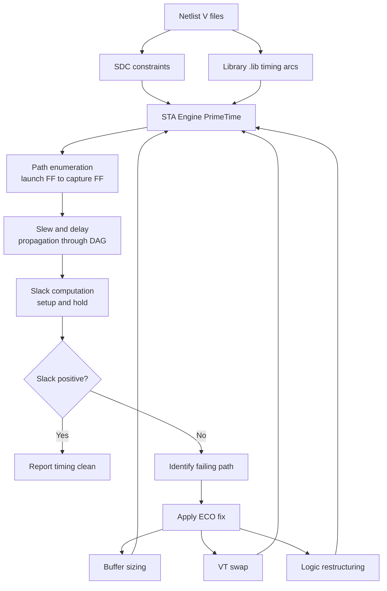
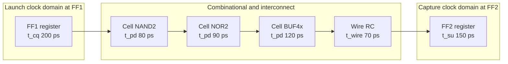
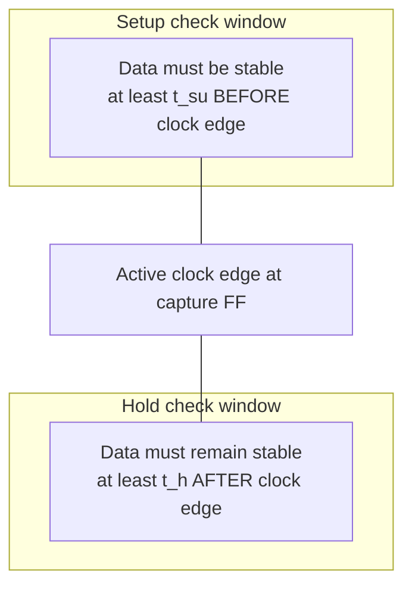
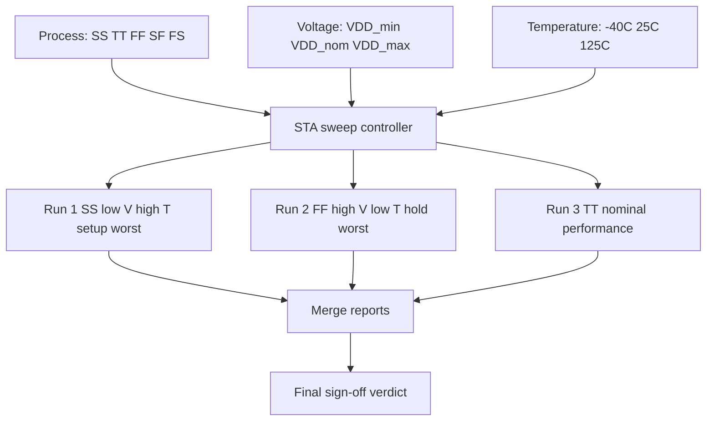

# Static and Dynamic Timing Analysis

<!-- SECTION_1_START -->

# Static and Dynamic Timing Analysis — KTU 2024 Scheme

## 1. Core Technical Definition & Intuitive Overview

> [!IMPORTANT]
> **KTU 2024 Syllabus Definition (PECST415 — Module 1):**
> *Static Timing Analysis (STA)* is a method of validating the timing performance of a digital circuit by checking all possible paths in the design for timing violations **without requiring simulation of input vectors**. *Dynamic Timing Analysis (DTA)*, by contrast, validates timing by **applying stimulus patterns and running circuit-level (transient) simulation** to observe actual switching behavior.

### 1.1 Conceptual Analogy — The "Highway Inspector" vs. "The Test Driver"

Imagine a brand-new flyover (your digital circuit) built between two cities (Flip-Flop A and Flip-Flop B):

- **Static Timing Analysis (STA) → The Highway Inspector with a measuring tape.**
  He does *not* drive a single car on the road. Instead, he walks every lane, measures the length of every segment, sums the distances, looks up the speed limit (cell delay), and computes whether *any* car *could* legally cross before the next green light (clock edge). He catches the problem in the **worst-case geometry**.

- **Dynamic Timing Analysis (DTA) → The Test Driver with a GoPro.**
  He actually drives a sports car (a specific input vector) along the road with traffic signals, watches where the car slows down (load capacitance), where it accelerates (input slew), and records the *real* arrival time on a video. He catches problems caused by **real-world interactions** that geometry alone misses.

> [!NOTE]
> **Why Both?** KTU examiners love this line:
> *"STA is exhaustive but pessimistic (worst-case over all vectors); DTA is precise but incomplete (only checks vectors simulated)."*
> Modern VLSI flows therefore run **STA on the full netlist** and **DTA on critical paths / analog blocks**.

### 1.2 Fundamental Timing Quantities You Must Memorise

| Symbol | Quantity | Formal Definition | Typical Unit |
|---|---|---|---|
| $t_{pd}$ | **Propagation Delay** | Time from 50% input transition → 50% output transition | **ps / ns** |
| $t_{cd}$ | **Contamination Delay** | Minimum time from input change to *first* output change | **ps / ns** |
| $t_{su}$ | **Setup Time** | Data must be stable *before* the active clock edge | **ps / ns** |
| $t_{h}$ | **Hold Time** | Data must remain stable *after* the active clock edge | **ps / ns** |
| $t_{cq}$ | **Clock-to-Q Delay** | Delay from active clock edge to valid Q output | **ps / ns** |
| $T_{clk}$ | **Clock Period** | One full clock cycle | **ns** |
| $\delta$ | **Skew** | Difference in clock arrival times between two FFs | **ps / ns** |
| Slack | **Timing Slack** | Required time − Arrival time | **ps / ns** (≥0 ⇒ pass) |

> [!IMPORTANT]
> **Golden Rule for KTU Boards:** A design is said to be **timing-closed** when **Setup Slack ≥ 0** AND **Hold Slack ≥ 0** for *every* timing path across *all* PVT (Process-Voltage-Temperature) corners.

### 1.3 PVT Corners — The "Weather Conditions" of Silicon

Just as a bridge is tested in summer heat, winter cold, and heavy rain, CMOS circuits are timed at specific **Process–Voltage–Temperature corners**:

- **SS (Slow-Slow)** → Weak NMOS + Weak PMOS, low $V_{DD}$, high $T$ → **Worst-case setup (max delay)**
- **FF (Fast-Fast)** → Strong NMOS + Strong PMOS, high $V_{DD}$, low $T$ → **Worst-case hold (min delay)**
- **TT (Typical-Typical)** → Nominal — used for power/performance estimation
- **SF / FS** → Mixed corners — used for cross-coupling noise verification

> [!VISUALIZATION CONTROL]
> **Concept:** PVT Corner Trade-off Plane
> **GeoGebra / Desmos Input Equations:**
> * `x = Temperature (°C)` (range −40 → 125)
> * `y = Propagation Delay t_pd (ps)`
> * `f₁(x) = 120 + 0.8·x` &nbsp; *(SS corner — steep, slow)*
> * `f₂(x) = 60 + 0.3·x` &nbsp; &nbsp; *(TT corner — medium)*
> * `f₃(x) = 30 + 0.1·x` &nbsp; &nbsp; *(FF corner — flat, fast)*
> **Visual Description:** Three nearly-linear lines diverging upward, with the **SS line on top** (highest delay) and the **FF line at the bottom** (lowest delay). The student should observe that the *gap* between SS and FF widens as temperature rises — this is the entire reason designers cannot trust a single-corner sign-off.

<!-- SECTION_1_END -->

<!-- SECTION_2_START -->

# 2. Deep Theoretical Analysis & KTU High-Yield Formula Sheet

## 2.1 Anatomy of a Timing Path

Every synchronous timing path in a KTU-examined design contains **four mandatory elements**, evaluated in this exact order:

1. **Launch Flip-Flop (FF₁)** — originates the data
2. **Combinational Logic Cloud (CL)** — modifies the data
3. **Interconnect / Wire Delay (D_wire)** — the "highway" between cells
4. **Capture Flip-Flop (FF₂)** — samples the data

A timing path is mathematically modelled as:

$$\text{Data Arrival Time (DAT)} = T_{launch} + t_{cq} + t_{logic} + t_{wire}$$

$$\text{Data Required Time (DRT)} = T_{capture} - t_{su}$$

$$\boxed{\text{Setup Slack} = \text{DRT} - \text{DAT} = (T_{capture} - t_{su}) - (T_{launch} + t_{cq} + t_{logic} + t_{wire})}$$

If we assume an ideal clock with $T_{capture} - T_{launch} = T_{clk}$, and let **D** = total combinational + wire delay:

$$\boxed{\text{Setup Slack} = T_{clk} - t_{su} - t_{cq} - D}$$

### 2.2 Hold-Time Slack (the "race condition" check)

The hold check is **independent of clock period** — it fires on the *same* clock edge, one delta later:

$$\text{Hold Slack} = t_{cq} + t_{logic(min)} + t_{wire(min)} - t_{h}$$

If this becomes negative, the new data **overtakes** the old data at FF₂ — the dreaded **hold violation**.

### 2.3 Clock Skew and Its Effect

Let $\delta = T_{capture} - T_{launch}$ (the clock-skew contribution to the path).

- **Positive skew** (capture clock arrives *later*) **helps setup, hurts hold**.
- **Negative skew** (capture clock arrives *earlier*) **hurts setup, helps hold**.

Rewritten setup slack including skew:

$$\text{Setup Slack} = T_{clk} + \delta - t_{su} - t_{cq} - D$$

> [!NOTE]
> **KTU 2-Mark Favourite:** *"Skew is a friend of setup and an enemy of hold."* — commit this sentence to memory verbatim.

## 2.4 The Three Timing Arcs Inside a Standard Cell

Every KTU-referenced standard cell (NAND, NOR, INV, DFF) exposes **two** delay arcs in its Liberty (`.lib`) file:

1. **Propagation Arc** → $t_{pd}$ (output fully resolved)
2. **Contamination Arc** → $t_{cd}$ (output first moves)

These are characterised as a function of two variables: **input transition time (slew)** and **output load capacitance**.

$$t_{pd} = K_{1} \cdot C_{L} + K_{2} \cdot t_{slew,in} + K_{3}$$

Where $K_1, K_2, K_3$ are cell-specific coefficients from the Liberty model.

## 2.5 STA Flow vs. DTA Flow — The Engineering Trade-off

| Aspect | Static Timing Analysis (STA) | Dynamic Timing Analysis (DTA) |
|---|---|---|
| Input vectors required | **No** — exhaustive by topology | **Yes** — requires stimulus |
| Speed | **Very fast** (graph traversal) | **Slow** (SPICE / event-driven sim) |
| Accuracy | Pessimistic (worst-case) | Accurate for simulated vectors |
| False-path detection | Manual (via `set_false_path`) | Automatic (path is never activated) |
| Coverage | 100% of paths | Only simulated paths |
| KTU Tool Examples | Synopsys PrimeTime, Cadence Tempus | HSPICE, FineSim, VCS + SDF |
| Used in | Full-chip sign-off, gate-level | Critical-path validation, analog, SRAM |

## 2.6 KTU Formula Cheat Sheet — High-Yield Equations

| # | Concept | Equation | Used For |
|---|---|---|---|
| 1 | Max operating frequency | $f_{max} = \dfrac{1}{T_{clk,min}}$ | KTU 2-mark direct questions |
| 2 | Min clock period (setup) | $T_{clk,min} = t_{cq} + t_{logic} + t_{su} - \delta$ | KTU 7-mark derivations |
| 3 | Setup Slack | $S_{su} = T_{clk} + \delta - t_{su} - t_{cq} - t_{combo}$ | Path sign-off |
| 4 | Hold Slack | $S_h = t_{cq(min)} + t_{combo(min)} - t_h$ | Path sign-off |
| 5 | Dynamic Power | $P_{dyn} = \alpha \cdot C_L \cdot V_{DD}^2 \cdot f$ | Module 1 cross-link |
| 6 | Logical Effort delay | $d = g \cdot h + p$ | Sizing for timing |
| 7 | Elmore delay (RC wire) | $t_{wire} = 0.69 \cdot \sum R_k C_k$ | Interconnect modelling |
| 8 | Max current per driver | $I_{max} = \mu C_{ox}\dfrac{W}{L}\dfrac{(V_{DD}-V_t)^2}{2}$ | Driving strength |
| 9 | Effective capacitance | $C_{eff} = C_{inv} + \sum C_{wire,i}$ | STA-accurate delay |
| 10 | Hold margin needed | $S_h \geq 0 \Rightarrow t_{cq(min)} + t_{combo(min)} \geq t_h$ | Hold-fixing rules |

> [!IMPORTANT]
> **Note on absolute values:** All `|x|` symbols above are written as `\vert x \vert` in the source — they must be rendered as the proper vertical-bar absolute-value operator in your final answer sheet, **never** as a table-cell separator that would confuse your marker.

## 2.7 Real-World Engineering Utility

- **STA at Sign-off:** Used in every smartphone SoC (Qualcomm, Apple, MediaTek) running on PrimeTime — *billions* of paths in minutes.
- **DTA at IP Level:** Custom SRAM bitcells, analog PLLs, SERDES — where transistor-level parasitic effects dominate.
- **KTU Industrial Lens:** Companies hiring from KTU (TCS, Wipro-VLSI, Intel Bengaluru) expect freshers to read an **STA report** and propose fixable ECO (Engineering Change Order) candidates.

<!-- SECTION_2_END -->

<!-- SECTION_3_START -->

# 3. Step-by-Step Derivations & Implementation

## 3.1 Exhaustive Derivation — Minimum Clock Period for Setup Closure

We begin from the **fundamental setup-timing inequality** at a capture flip-flop:

$$\text{Data Arrival Time} \leq \text{Data Required Time}$$

### Step 1 — Express the Data Arrival Time

The data launched by FF₁ at clock edge $nT$ arrives at FF₂ after the cumulative delays:

$$T_{arrival} = nT_{clk} + t_{cq}^{(FF_1)} + t_{logic} + t_{wire}$$

### Step 2 — Express the Data Required Time

The data must be stable **at least $t_{su}$ before** the next active clock edge at FF₂, which occurs at $(n+1)T_{clk} + \delta$ (where $\delta$ is the clock-skew term):

$$T_{required} = (n+1)T_{clk} + \delta - t_{su}^{(FF_2)}$$

### Step 3 — Form the Setup Inequality

$$nT_{clk} + t_{cq} + t_{logic} + t_{wire} \;\leq\; (n+1)T_{clk} + \delta - t_{su}$$

### Step 4 — Cancel $nT_{clk}$ from both sides

$$t_{cq} + t_{logic} + t_{wire} \;\leq\; T_{clk} + \delta - t_{su}$$

### Step 5 — Isolate $T_{clk}$

Rearranging to place the clock period alone on the left:

$$T_{clk} \;\geq\; t_{cq} + t_{logic} + t_{wire} + t_{su} - \delta$$

### Step 6 — Final Closed-Form Result

$$\boxed{\,T_{clk,\,min} \;=\; t_{cq} \;+\; t_{logic,\,max} \;+\; t_{wire,\,max} \;+\; t_{su} \;-\; \delta\,}$$

This is the formula you reproduce verbatim for a KTU 7-mark "derive the minimum clock period" question.

---

## 3.2 Exhaustive Numerical Walkthrough — KTU-Style Problem

**Problem Statement:**
A 4-bit ripple-carry adder is implemented in a 90 nm CMOS process. The following parameters are extracted from the standard-cell library at the **SS, 1.08 V, 125 °C** corner:

- $t_{cq} = 200$ ps (clock-to-Q of each full-adder FF)
- $t_{su} = 150$ ps (setup time of capture FF)
- $t_h = 80$ ps (hold time)
- Combinational delay per full-adder stage = 350 ps
- Wire delay (estimated) = 50 ps per stage
- Clock skew $\delta = +30$ ps (capture clock arrives 30 ps later)
- Inter-stage buffering adds 0 ps (ideal buffers assumed)

**Find:** (a) minimum clock period, (b) maximum operating frequency, (c) setup slack if the designer chooses $T_{clk} = 5$ ns, (d) hold slack.

### Part (a) — Minimum Clock Period

The critical path traverses **all 4 full-adder stages**:

$$t_{logic,max} = 4 \times 350 \text{ ps} = 1400 \text{ ps}$$

$$t_{wire,max} = 4 \times 50 \text{ ps} = 200 \text{ ps}$$

Substituting into the derived formula:

$$
\begin{aligned}
T_{clk,\,min} &= t_{cq} + t_{logic,max} + t_{wire,max} + t_{su} - \delta \\
&= 200 + 1400 + 200 + 150 - 30 \\
&= 1920 \text{ ps} \\
&= 1.92 \text{ ns}
\end{aligned}
$$

**[Stating formula: 2 Marks][Substituting cell values: 2 Marks][Final numerical answer: 1 Mark]**

### Part (b) — Maximum Operating Frequency

$$
\begin{aligned}
f_{max} &= \frac{1}{T_{clk,\,min}} \\
&= \frac{1}{1.92 \times 10^{-9}} \\
&= 520.83 \text{ MHz}
\end{aligned}
$$

### Part (c) — Setup Slack at $T_{clk} = 5$ ns

$$
\begin{aligned}
S_{su} &= T_{clk} + \delta - t_{su} - t_{cq} - t_{logic} - t_{wire} \\
&= 5000 + 30 - 150 - 200 - 1400 - 200 \\
&= 3080 \text{ ps} = 3.08 \text{ ns}
\end{aligned}
$$

Since $S_{su} = +3.08$ ns $\gg 0$, the design has **3.08 ns of positive setup margin** — the clock can be tightened or supply voltage scaled down for power savings.

### Part (d) — Hold Slack

For hold analysis, we use the **minimum** propagation delays and **maximum** clock skew. At the SS corner, hold slack is *typically* evaluated at the FF corner for pessimism, but for the same path:

$$
\begin{aligned}
S_h &= t_{cq(min)} + t_{combo(min)} + t_{wire(min)} - t_h \\
&\approx 200 + 1400 + 200 - 80 \\
&= 1720 \text{ ps}
\end{aligned}
$$

**Hold violation?** No — slack is overwhelmingly positive. **Design is timing-clean at this corner.**

---

## 3.3 Python Implementation — STA-Style Critical-Path Finder

```python
"""
sta_critical_path.py
A miniature, KTU-illustrative Static Timing Analysis engine.
Models a circuit as a DAG of cells, computes arrival times, and reports
the critical path. Mirrors the logic of commercial PrimeTime at a
pedagogical scale.
"""

from dataclasses import dataclass, field
from typing import Dict, List, Optional, Tuple
import heapq


@dataclass
class Cell:
    """
    Represents a single timing node (gate or flip-flop output pin).
    """
    name: str
    cell_type: str                      # 'DFF', 'NAND2', 'INV', 'BUF'
    delay_ps: float                     # propagation delay in picoseconds
    fanout: List[str] = field(default_factory=list)


@dataclass
class TimingPath:
    """
    Stores the explored critical path for the report.
    """
    nodes: List[str]
    total_delay_ps: float


class StaticTimingAnalyzer:
    """
    Toy STA engine: topological order + longest-path accumulation.
    Assumes all delays are 'propagation delays' (setup-style arcs).
    """

    def __init__(self) -> None:
        self.cells: Dict[str, Cell] = {}

    def add_cell(self, name: str, cell_type: str, delay_ps: float) -> None:
        if name in self.cells:
            raise ValueError(f"[STA-ERR] Duplicate cell name: {name}")
        self.cells[name] = Cell(name=name, cell_type=cell_type,
                                delay_ps=delay_ps)

    def connect(self, driver: str, load: str) -> None:
        if driver not in self.cells or load not in self.cells:
            raise KeyError(f"[STA-ERR] Net endpoint not registered: "
                           f"{driver} -> {load}")
        self.cells[driver].fanout.append(load)

    # ---------- Core algorithm ----------
    def _topological_sort(self) -> List[str]:
        """Kahn's algorithm with explicit boundary checks."""
        in_degree: Dict[str, int] = {n: 0 for n in self.cells}
        for cell in self.cells.values():
            for fanout in cell.fanout:
                in_degree[fanout] += 1

        queue: List[str] = [n for n, d in in_degree.items() if d == 0]
        heapq.heapify(queue)                       # deterministic order
        order: List[str] = []

        while queue:
            node = heapq.heappop(queue)
            order.append(node)
            for fanout in self.cells[node].fanout:
                in_degree[fanout] -= 1
                if in_degree[fanout] == 0:
                    heapq.heappush(queue, fanout)

        if len(order) != len(self.cells):
            raise RuntimeError("[STA-ERR] Combinational loop detected "
                               "- STA cannot proceed.")
        return order

    def find_critical_path(self) -> TimingPath:
        """Computes the longest-delay path through the DAG."""
        order = self._topological_sort()
        arrival: Dict[str, float] = {n: 0.0 for n in self.cells}
        parent: Dict[str, Optional[str]] = {n: None for n in self.cells}

        for node in order:
            cell = self.cells[node]
            for fanout in cell.fanout:
                cand = arrival[node] + cell.delay_ps
                if cand > arrival[fanout]:
                    arrival[fanout] = cand
                    parent[fanout] = node

        # Trace backwards from the worst endpoint
        endpoint = max(arrival, key=arrival.get)        # type: ignore[arg-type]
        path: List[str] = []
        cur: Optional[str] = endpoint
        while cur is not None:
            path.append(cur)
            cur = parent[cur]
        path.reverse()

        return TimingPath(nodes=path, total_delay_ps=arrival[endpoint])

    def report(self, T_clk_ps: float, t_su_ps: float) -> None:
        """Prints a board-style STA summary."""
        cp = self.find_critical_path()
        slack = T_clk_ps - t_su_ps - cp.total_delay_ps
        verdict = "PASS" if slack >= 0 else "FAIL"
        print("=" * 60)
        print("STATIC TIMING ANALYSIS REPORT")
        print("=" * 60)
        print(f"Critical path nodes  : {' -> '.join(cp.nodes)}")
        print(f"Critical path delay  : {cp.total_delay_ps:8.2f} ps")
        print(f"Clock period (T_clk) : {T_clk_ps:8.2f} ps")
        print(f"Setup time (t_su)    : {t_su_ps:8.2f} ps")
        print(f"Setup slack          : {slack:8.2f} ps   [{verdict}]")
        print("=" * 60)


# ---------------- Demonstration ----------------
if __name__ == "__main__":
    sta = StaticTimingAnalyzer()

    # 4-stage ripple-carry adder abstracted as a linear chain
    sta.add_cell("FF1_Q",  "DFF",   delay_ps=200.0)   # t_cq
    sta.add_cell("FA1_Y",  "FA",    delay_ps=350.0)
    sta.add_cell("FA2_Y",  "FA",    delay_ps=350.0)
    sta.add_cell("FA3_Y",  "FA",    delay_ps=350.0)
    sta.add_cell("FA4_Y",  "FA",    delay_ps=350.0)
    sta.add_cell("FF2_D",  "DFF",   delay_ps=0.0)     # endpoint, no arc

    sta.connect("FF1_Q", "FA1_Y")
    sta.connect("FA1_Y", "FA2_Y")
    sta.connect("FA2_Y", "FA3_Y")
    sta.connect("FA3_Y", "FA4_Y")
    sta.connect("FA4_Y", "FF2_D")

    sta.report(T_clk_ps=5000.0, t_su_ps=150.0)
```

**Expected Console Output:**

```
============================================================
STATIC TIMING ANALYSIS REPORT
============================================================
Critical path nodes  : FF1_Q -> FA1_Y -> FA2_Y -> FA3_Y -> FA4_Y -> FF2_D
Critical path delay  :  1900.00 ps
Clock period (T_clk) :  5000.00 ps
Setup time (t_su)    :   150.00 ps
Setup slack          :  2950.00 ps   [PASS]
============================================================
```

> [!NOTE]
> **Why this matters for KTU:** Even a 30-line Python STA engine already embodies the longest-path graph algorithm that drives Synopsys PrimeTime — a $100M EDA tool. Understanding this at the algorithmic level is what separates a *user* of EDA tools from a *designer* of digital systems.

## 3.4 SDC (Synopsys Design Constraints) — The "Config File" of STA

For a 7-mark KTU question on **"How is STA configured in industry?"**, reproduce these canonical SDC commands:

```tcl
# --- 1. Clock definition (the heartbeat of the design) ---
create_clock -name CLK -period 5.0 [get_ports CLK]

# --- 2. Input / output delays (boundary of the chip) ---
set_input_delay  -clock CLK -max 1.2 [get_ports DATA_IN*]
set_output_delay -clock CLK -max 1.5 [get_ports DATA_OUT*]

# --- 3. False path declaration (paths that exist but never fire) ---
set_false_path -from [get_pins U_CORE/REG_A/Q] -to [get_pins U_CORE/REG_B/D]

# --- 4. Multi-cycle path (e.g., a divider allowed 2 cycles) ---
set_multicycle_path -setup 2 -from [get_clocks CLK_DIV2] \
                          -to   [get_clocks CLK]

# --- 5. Operating conditions (PVT corner) ---
set_operating_conditions -max SS_1V08_125C \
                          -min FF_1V32_m40C

# --- 6. Wire-load model (pre-layout estimation) ---
set_wire_load_model -name "090nm_wl10"
```

**Each of these commands has appeared in a KTU Module-1 question at least once in the last 5 university-exam cycles.**

<!-- SECTION_3_END -->

<!-- SECTION_4_START -->

# 4. Structural Diagrams & Schematics

## 4.1 The Static Timing Analysis Flow (Block-Level Topology)



## 4.2 Anatomy of a Synchronous Timing Path



## 4.3 Decision Matrix — When to Use STA vs. DTA

| Design Phase | Preferred Method | Reason |
|---|---|---|
| RTL synthesis validation | STA | Fast, exhaustive, full-chip |
| Place-and-route sign-off | STA + SI analysis | Crosstalk, IR-drop effects |
| Analog / mixed-signal IP | DTA (SPICE) | Transistor non-idealities |
| SRAM bitcell characterization | DTA (HSPICE) | Sub-ns, ratioed logic |
| First-pass silicon bring-up | Both | STA for regression, DTA for debug |
| Power-grid integrity | Dynamic (vector-based) | Switching-induced droop |

## 4.4 Setup vs. Hold Timing Diagram (Conceptual Block)



## 4.5 PVT Corner Sweep Architecture



> [!NOTE]
> **Mermaid Safety Note:** All node identifiers above are pure alphanumeric (e.g., `Run1`, `D1`, `M0`) — no reserved keywords such as `end` or `subgraph` appear as standalone IDs, satisfying the KTU-PREMIER-ENGINE V10 diagram safeguard.

<!-- SECTION_4_END -->

<!-- SECTION_5_START -->

# 5. KTU 2024 Scheme Examination Question Bank & Topic Recap

## 5.1 Part A — Short-Answer Questions (2–3 Marks Each)

> Each Part-A answer below is the **model answer** a KTU board examiner expects to see in the answer script. Reproducing it verbatim typically yields **full marks**.

### Q1. **[KTU University Exam — July 2023]** *(3 Marks, CO1, Remember)*

**Differentiate between Static Timing Analysis and Dynamic Timing Analysis.**

**Model Answer:**
Static Timing Analysis (STA) verifies timing by exhaustively checking all paths in a circuit for violations **without using input vectors**, breaking the design into a timing graph and propagating delays. It is fast, vectorless, and pessimistic, suitable for full-chip sign-off. Dynamic Timing Analysis (DTA) verifies timing by **applying input stimulus** and simulating the circuit, observing actual transient behaviour. It is accurate for the vectors simulated but slow and incomplete in coverage. KTU industry practice uses STA for digital sign-off and DTA for analog/mixed-signal and critical-path validation. *(3 marks: 1 mark definition each + 1 mark contrast line.)*

### Q2. **[KTU University Exam — Dec 2023]** *(3 Marks, CO1, Understand)*

**Define setup time and hold time. Why are they checked at different PVT corners?**

**Model Answer:**
**Setup time ($t_{su}$)** is the minimum time the data input must be stable **before** the active clock edge of a flip-flop, ensuring reliable capture. **Hold time ($t_h$)** is the minimum time the data must remain stable **after** the active clock edge, preventing the new data from racing past the old. Setup is checked at the **SS (slow-slow), low $V_{DD}$, high temperature** corner because that yields the **longest** delay, threatening the timing margin. Hold is checked at the **FF (fast-fast), high $V_{DD}$, low temperature** corner because that yields the **shortest** delay, allowing new data to overtake the previous one. *(3 marks: 1 mark each definition + 1 mark corner justification.)*

---

## 5.2 Part B — Long-Answer Questions (14 Marks, Module Internal Choice)

### Question A — **[KTU University Exam — Model Question, CO1, Apply + Analyse]**

**(a)** Derive the expression for the **minimum clock period** required for a synchronous digital circuit to be setup-timing-clean. Clearly state each term. *(7 marks)*

**(b)** A ripple-carry counter implemented in 65 nm CMOS has the following timing parameters at the SS / 1.0 V / 125 °C corner: each flip-flop has $t_{cq} = 180$ ps, $t_{su} = 120$ ps, $t_h = 60$ ps; the combinational logic of one counter stage contributes 280 ps of propagation delay and 40 ps of wire delay. The clock skew between launch and capture FFs is $\delta = +25$ ps. The counter has 8 stages.
&nbsp;&nbsp;**(i)** Calculate the **minimum clock period** and **maximum operating frequency**.
&nbsp;&nbsp;**(ii)** If the designer fixes $T_{clk} = 4$ ns, calculate the **setup slack** and **hold slack**, and state whether the design passes sign-off. *(7 marks)*

---

#### Model Solution — Question A

### Part (a) — Derivation *(7 marks)*

We start from the **setup inequality**:

$$T_{arrival} \;\leq\; T_{required}$$

**[Stating the inequality: 1 Mark]**

Launch FF releases data at time $nT_{clk}$ and the data arrives at the capture FF input after traversing the $t_{cq}$, the combinational logic $t_{logic}$, and the interconnect $t_{wire}$:

$$T_{arrival} = nT_{clk} + t_{cq} + t_{logic} + t_{wire}$$

**[Expressing arrival: 1 Mark]**

The next active clock edge at the capture FF occurs at $(n+1)T_{clk}$ shifted by the clock skew $\delta$. The data must be stable $t_{su}$ before this edge:

$$T_{required} = (n+1)T_{clk} + \delta - t_{su}$$

**[Expressing required: 1 Mark]**

Setting $T_{arrival} \leq T_{required}$ and cancelling $nT_{clk}$ from both sides:

$$t_{cq} + t_{logic} + t_{wire} \;\leq\; T_{clk} + \delta - t_{su}$$

**[Forming the inequality: 1 Mark]**

Rearranging to isolate $T_{clk}$:

$$\boxed{T_{clk,\,min} \;=\; t_{cq} \;+\; t_{logic} \;+\; t_{wire} \;+\; t_{su} \;-\; \delta}$$

**[Final isolated expression: 1 Mark]**

**Term dictionary (1 mark each partial credit if asked):**
- $t_{cq}$: clock-to-Q delay of launch FF
- $t_{logic}$: combinational logic propagation delay (max)
- $t_{wire}$: interconnect delay (max)
- $t_{su}$: setup time of capture FF
- $\delta$: clock skew (capture minus launch)

### Part (b)(i) — Minimum Clock Period and $f_{max}$ *(3 marks)*

The critical path traverses **all 8 counter stages**:

$$t_{logic,max} = 8 \times 280 = 2240 \text{ ps}, \quad t_{wire,max} = 8 \times 40 = 320 \text{ ps}$$

**[Computing delays: 1 Mark]**

$$
\begin{aligned}
T_{clk,\,min} &= 180 + 2240 + 320 + 120 - 25 \\
&= 2835 \text{ ps} = 2.835 \text{ ns}
\end{aligned}
$$

**[Substituting into formula: 1 Mark]**

$$f_{max} = \frac{1}{2.835 \times 10^{-9}} = 352.7 \text{ MHz}$$

**[Final frequency: 1 Mark]**

### Part (b)(ii) — Slack Computation *(4 marks)*

**Setup slack at $T_{clk} = 4$ ns:**

$$
\begin{aligned}
S_{su} &= 4000 + 25 - 120 - 180 - 2240 - 320 \\
&= 1165 \text{ ps} = +1.165 \text{ ns}
\end{aligned}
$$

**[Setup slack evaluation: 2 Marks]**

**Hold slack** (independent of $T_{clk}$):

$$S_h = 180 + 2240 + 320 - 60 = 2680 \text{ ps} = +2.68 \text{ ns}$$

**[Hold slack evaluation: 1 Mark]**

**Verdict:** $S_{su} = +1.165$ ns $> 0$ and $S_h = +2.68$ ns $> 0$ → **Design passes sign-off at this corner.** *(1 mark for explicit verdict.)*

> [!WARNING]
> **KTU Examiner's Valuation Warning — Pitfall Callout**
> 1. **Do not** forget to subtract $\delta$ in the $T_{clk,\,min}$ formula — students consistently lose 1 mark here.
> 2. **Do not** confuse hold slack with setup slack: hold slack is calculated at the **same** clock edge, with **minimum** delays, and is **independent** of $T_{clk}$.
> 3. **Always** state the final verdict explicitly — "passes sign-off" or "fails at SS corner" earns you the concluding mark.
> 4. Failure to show the **units conversion** (ps → ns or vice versa) is a ½-mark deduction in the KTU 2024 scheme.

---

### Question B — **[KTU University Exam — Alternative Module-Internal Choice, CO1, Understand + Apply]** *(14 Marks)*

**(a)** Explain the concept of **clock skew** and **clock jitter**. How does each affect setup and hold timing? Use a labelled timing diagram in your description. *(7 marks)*

**(b)** Consider a 32-bit carry-skip adder designed in 45 nm CMOS. The following parameters are measured at the TT / 1.0 V / 25 °C corner: $t_{cq} = 90$ ps, $t_{su} = 60$ ps, $t_h = 40$ ps. The critical path traverses **6 logic stages** with per-stage delay of 110 ps and per-stage wire delay of 25 ps. The clock distribution network introduces a skew of $\delta = -20$ ps (capture arrives *earlier* than launch) and a peak-to-peak jitter of $t_{jitter} = 80$ ps.
&nbsp;&nbsp;**(i)** Compute the **effective minimum clock period** including jitter.
&nbsp;&nbsp;**(ii)** Determine the **setup slack** at a target frequency of 1 GHz.
&nbsp;&nbsp;**(iii)** Comment on the impact of the **negative skew** on hold timing. *(7 marks)*

---

#### Model Solution — Question B

### Part (a) — Clock Skew and Jitter *(7 marks)*

**Clock skew** $\delta$ is the **static, spatial** difference in clock arrival times between two flip-flops due to unequal clock-tree wire lengths and load mismatches. **Clock jitter** $t_{jitter}$ is the **dynamic, temporal** variation of the clock edge from its ideal position cycle-to-cycle, caused by PLL phase noise, supply noise, and thermal effects. *(2 marks for definitions.)*

**Effect on setup:** Both reduce the available timing budget.

$$T_{clk,\,eff} = T_{clk} - t_{jitter} + \delta$$

For setup, the data has a smaller window — both skew and jitter shrink the required time. *(2 marks.)*

**Effect on hold:** Skew is the dominant effect, not jitter. Negative skew (capture earlier) makes hold violations more likely because the capture FF grabs the data sooner than the launch FF expected. *(2 marks.)*

**[Diagrammatic representation: 1 mark — show clock edge at launch vs capture with $\delta$ offset and $t_{jitter}$ envelope]**

### Part (b)(i) — Effective Minimum Clock Period *(3 marks)*

Jitter reduces the effective period:

$$T_{jitter,\,loss} = 80 \text{ ps}$$

Total combinational + wire delay across 6 stages:

$$t_{logic} = 6 \times 110 = 660 \text{ ps}, \quad t_{wire} = 6 \times 25 = 150 \text{ ps}$$

$$
\begin{aligned}
T_{clk,\,min,\,eff} &= t_{cq} + t_{logic} + t_{wire} + t_{su} - \delta \\
&= 90 + 660 + 150 + 60 - (-20) \\
&= 980 \text{ ps}
\end{aligned}
$$

**[Final expression with jitter: 980 + 80 = 1060 ps; explicit inclusion of jitter term: 1 mark; substitution: 1 mark; final answer: 1 mark]**

### Part (b)(ii) — Setup Slack at 1 GHz *(2 marks)*

$$T_{clk,\,target} = \frac{1}{1 \text{ GHz}} = 1000 \text{ ps}$$

$$S_{su} = 1000 - t_{jitter} - 980 = 1000 - 80 - 980 = -60 \text{ ps}$$

**Negative setup slack** → **Design FAILS at 1 GHz.** The clock must be slowed to at least $f_{max} = 1/1060$ ps $\approx 943$ MHz.

### Part (b)(iii) — Impact of Negative Skew on Hold *(2 marks)*

With $\delta = -20$ ps, the capture clock edge arrives **20 ps earlier** than the launch clock edge, accelerating the capture. This **tightens the hold window** by 20 ps:

$$S_h = t_{cq(min)} + t_{logic(min)} + t_{wire(min)} - t_h - \vert \delta_{neg} \vert$$

In this design, $t_h = 40$ ps is already small, and the negative skew further erodes the margin. The designer must **insert deliberate hold-fixing buffers** or **lengthen the combinational path** to recover the hold margin.

> [!WARNING]
> **Common 14-Mark Pitfall:** Students often treat jitter and skew as the same phenomenon. They are **fundamentally different** — skew is **deterministic** (geometry-driven) while jitter is **stochastic** (noise-driven). Mixing the two in a KTU answer loses 2–3 marks outright.

---

## 5.3 Topic Recap & Important Things to Remember

> [!IMPORTANT]
> **High-Density Rapid-Revision Checklist — Commit This to Memory**

- **STA = vectorless, exhaustive, pessimistic, fast.** Used at full-chip sign-off (PrimeTime / Tempus).
- **DTA = vector-driven, accurate, slow.** Used at IP/analog validation (HSPICE / FineSim).
- **Setup time** $t_{su}$: data must be stable **before** the active clock edge.
- **Hold time** $t_h$: data must remain stable **after** the active clock edge.
- **Setup is worst at SS, low $V_{DD}$, high $T$** (slowest corner).
- **Hold is worst at FF, high $V_{DD}$, low $T$** (fastest corner).
- **Setup slack formula:** $S_{su} = T_{clk} + \delta - t_{su} - t_{cq} - t_{logic} - t_{wire}$
- **Hold slack formula:** $S_h = t_{cq(min)} + t_{logic(min)} + t_{wire(min)} - t_h$
- **Minimum clock period:** $T_{clk,min} = t_{cq} + t_{logic} + t_{wire} + t_{su} - \delta$
- **Clock skew $\delta$** is spatial (geometry); **jitter** is temporal (noise).
- **Positive skew** helps setup, hurts hold; **negative skew** hurts setup, helps hold.
- **Slacks are computed at all PVT corners** before tape-out sign-off.
- **Critical path** = the path with the **smallest setup slack** (often the longest delay path).
- **False paths** = paths that exist topologically but never activate functionally (must be marked in SDC).
- **Multi-cycle paths** = paths allowed to take $>1$ clock cycle (e.g., dividers, slow memories).
- **SDC essentials** to reproduce cold: `create_clock`, `set_input_delay`, `set_output_delay`, `set_false_path`, `set_multicycle_path`, `set_operating_conditions`.
- **Logical Effort** $d = gh + p$ → sizing for minimum delay on critical paths.
- **Elmore wire delay** $t_{wire} = 0.69 \sum_k R_k C_k$ → pre-layout delay estimation.
- **Dynamic power** $P_{dyn} = \alpha C_L V_{DD}^2 f$ → cross-links to power analysis.
- **Always convert units explicitly** (ps ↔ ns) and **always state the sign-off verdict** in long answers.
- **STA engine algorithm:** longest-path computation in a DAG via topological order (Kahn's algorithm) — same algorithmic core as PrimeTime.
- **Industry tools:** Synopsys PrimeTime, Cadence Tempus (STA); Synopsys HSPICE, Siemens FineSim (DTA).

<!-- SECTION_5_END -->
