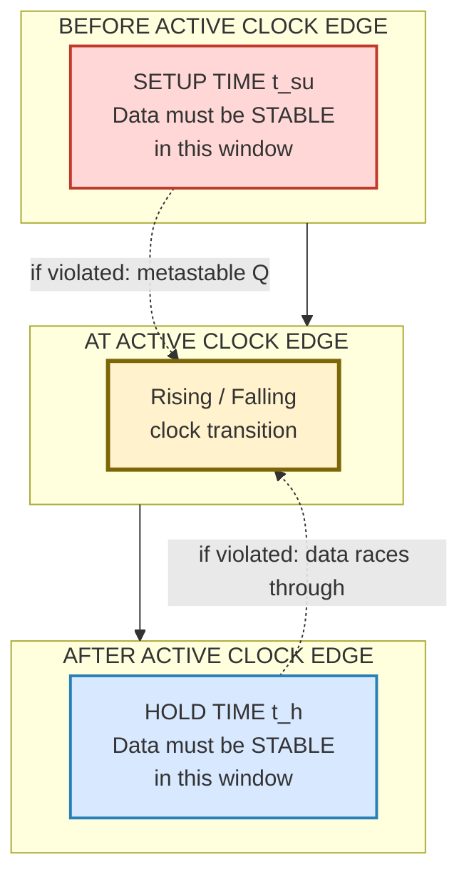
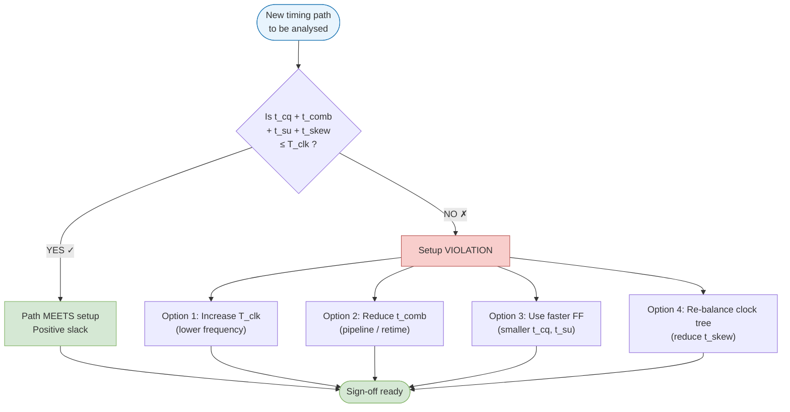

# Timing analysis - Set-up time

<!-- SECTION_1_START -->

# Timing Analysis — Setup Time in CMOS VLSI Design

> [!IMPORTANT]
> **KTU 2024 Scheme | PECST415 — VLSI Design | Module 1**
> **Course Outcome (CO) Mapped:** CO1 — Understand CMOS fundamentals and timing characteristics
> **Bloom's Level:** Understand → Apply → Analyze

---

## 1. Core Technical Definition

**Setup time ($t_{su}$ or $T_{setup}$)** is a fundamental **sequential timing parameter** of an edge-triggered storage element (flip-flop or register). It is formally defined as:

> **Definition (KTU Board Standard):**
> *The minimum time interval **before the active clock edge** during which the data input ($D$) must remain **stable (unchanged)** so that the flip-flop can reliably capture the correct logic value.*

Mathematically, setup time is expressed as:

$$t_{su} \;\triangleq\; \text{minimum interval } (T_{clk \rightarrow D}) \text{ such that } Q_{next} = D_{captured}$$

The corresponding symbol conventions used by KTU and IEEE standards are:

| Symbol | Parameter | Typical CMOS (180 nm) | Typical CMOS (65 nm) |
|:---:|:---|:---:|:---:|
| $t_{su}$ | Setup time | **70 ps – 200 ps** | **20 ps – 50 ps** |
| $t_{h}$ | Hold time | **50 ps – 150 ps** | **15 ps – 40 ps** |
| $t_{cq}$ | Clock-to-Q delay | **80 ps – 250 ps** | **30 ps – 80 ps** |
| $t_{pd}$ | Combinational delay | Variable | Variable |

---

## 2. Intuitive Overview — The "Photograph Analogy"

> [!NOTE]
> **Conceptual Analogy — Capturing a Moving Subject**

Imagine you are photographing a **100 m sprinter** mid-stride using a camera with a mechanical shutter:

* The **shutter press** is the **active clock edge** of a flip-flop.
* The **sprinter's position** is the **data input $D$**.
* For the photograph to be **sharp (no blur)**, the sprinter must be **still** for a brief moment **before** the shutter fully closes.

That "brief moment of stillness before the shutter closes" is **setup time**. If the sprinter keeps moving right up to the shutter-click, the photo will be blurred — equivalently, the flip-flop enters a **metastable state**, where the output $Q$ may unpredictably settle to either 0 or 1, or even oscillate.

| Photography Concept | VLSI Equivalent |
|:---|:---|
| Shutter press | Active clock edge ($CLK \uparrow$ or $CLK \downarrow$) |
| Sprinter's position | Data input signal $D$ |
| "Stillness duration" before shutter | **Setup time $t_{su}$** |
| Blurred photo | **Metastability / Setup violation** |
| Shutter closing time | Hold time $t_{h}$ |

---

## 3. Why Setup Time Exists — Physical Origin

> [!IMPORTANT]
> **Why can't the flip-flop just sample $D$ at the exact clock edge?**

Inside a CMOS flip-flop (master–slave latch pair), the data $D$ must propagate through several internal **transmission gates** and **inverters** to reach the **storage node** (cross-coupled inverters) **before** the clock disconnects the input. This internal "settling window" defines the setup time:

$$t_{su} = t_{D \rightarrow \text{internal node}} \;\; \text{(min, worst-case across PVT)}$$

If $D$ changes *too close* to the clock edge, the storage capacitors don't have enough time to charge/discharge to a valid logic level — leading to **metastability**.

---

## 4. Visual Representation — Setup Time Window

> [!VISUALIZATION CONTROL]
> **Concept:** Setup time window relative to active clock edge
> **GeoGebra / Desmos Input Equations:**
> * `f(x) = 1 for -t_su < x < 0` (data stable region — top plateau)
> * `f(x) = 0 for x < -t_su or x > 0` (data invalid)
> * `verticalLine x = 0` (active clock edge)
> **Visual Description:** A horizontal band of width $t_{su}$ immediately to the **left** of the clock edge where $D$ MUST stay flat. A vertical dotted line marks the active edge.

```
         t_su          | (active
   <-- window -->      |  clock edge)
                       |
   D  ___________      |  _____  data may change freely
   D             \_____|/
   D              
   ──────────────────────► time
   
   |←——→| = t_su  (must be stable)
```

---

> [!NOTE]
> **KTU Board Tip:** Examiners love asking: *"If the clock period is 5 ns and $t_{su} = 200$ ps, can the design violate setup?"* — Always check the **setup slack** before concluding.

---

<!-- SECTION_1_END -->

<!-- SECTION_2_START -->

# Deep Theoretical Analysis & KTU High-Yield Formula Sheet

---

## 1. The Flip-Flop Internal Model

A standard **positive-edge-triggered D flip-flop** is implemented as a **master–slave latch pair**:

| Stage | Component | Clock Phase | Function |
|:---:|:---|:---:|:---|
| **Master Latch** | Transmission gate $\text{TG}_1$ + Inverter | Transparent when $CLK = 0$ | Tracks input $D$ |
| **Slave Latch** | Transmission gate $\text{TG}_2$ + Inverter | Transparent when $CLK = 1$ | Locks & outputs $Q$ |

> [!NOTE]
> At the rising edge of $CLK$, the master disconnects from $D$ and the slave connects to the master, transferring the latched value to $Q$. For this transfer to be **clean**, the master must have already captured a **fully settled** version of $D$ — which requires $D$ to be stable for at least $t_{su}$ before the edge.

---

## 2. The Setup Time Constraint Equation

For a **single flip-flop → combinational logic → flip-flop** pipeline stage, the setup time constraint is:

$$T_{clk} \;\geq\; t_{cq} \;+\; t_{comb,\max} \;+\; t_{su} \;+\; t_{skew}$$

Where:

| Symbol | Meaning |
|:---:|:---|
| $T_{clk}$ | Clock period ($1 / f_{clk}$) |
| $t_{cq}$ | Clock-to-Q propagation delay of launching FF |
| $t_{comb,\max}$ | Worst-case (longest) combinational path delay |
| $t_{su}$ | Setup time of capturing FF |
| $t_{skew}$ | Clock skew between launching and capturing FFs |

### Derivation of Setup Slack

**Setup slack** is the **positive margin** by which the design meets the setup requirement. A positive slack means the design is **safe**; negative slack means **setup violation**.

$$T_{slack,\text{setup}} \;=\; T_{clk} \;-\; \bigl(t_{cq} \;+\; t_{comb,\max} \;+\; t_{su} \;+\; t_{skew}\bigr)$$

> [!IMPORTANT]
> **KTU Golden Rule:** For **setup** analysis, we use the **maximum (worst-case)** combinational delay and the **maximum** clock-to-Q delay. This is the *opposite* of hold-time analysis, which uses **minimum** delays.

---

## 3. Maximum Clock Frequency Derivation

For a correctly functioning synchronous sequential circuit, we require $T_{slack} \geq 0$. The **maximum operating clock frequency** is obtained by setting the slack to zero:

$$f_{clk,\max} \;=\; \frac{1}{T_{clk,\min}} \;=\; \frac{1}{t_{cq} \;+\; t_{comb,\max} \;+\; t_{su} \;+\; t_{skew}}$$

---

## 4. The KTU Formula Cheat Sheet

> [!IMPORTANT]
> **High-Yield Formulas — Memorize Before Exam**

| # | Formula | Meaning | KTU Use |
|:---:|:---|:---|:---|
| 1 | $T_{clk} \geq t_{cq} + t_{comb} + t_{su} + t_{skew}$ | Setup time inequality | Mandatory in any timing problem |
| 2 | $f_{max} = \dfrac{1}{t_{cq} + t_{comb} + t_{su} + t_{skew}}$ | Max operating frequency | Direct 7-mark question |
| 3 | $T_{slack} = T_{clk} - (t_{cq} + t_{comb} + t_{su} + t_{skew})$ | Setup slack calculation | Setup violation check |
| 4 | $t_{comb,\text{allow}} = T_{clk} - t_{cq} - t_{su} - t_{skew}$ | Allowed combinational budget | Design optimization |
| 5 | $t_{d,\text{internal}} \geq t_{su}$ | Physical origin of $t_{su}$ | Conceptual 3-mark Q |
| 6 | $\Delta t = t_{cq} + t_{comb} - T_{clk}$ | Data arrival at capture FF | Common in KTU problems |

> [!NOTE]
> **Critical Markdown Note:** All vertical bars in formulas above (e.g., in $|x|$ form) are **NOT** used. Pipe symbols are reserved for table separators only. Absolute value notation uses $\lvert x \rvert$ in LaTeX.

---

## 5. Real-World Engineering Utility

> [!IMPORTANT]
> **Where setup time matters in production silicon:**

* **High-performance CPUs (Intel Core, AMD Ryzen):** Setup violations at GHz clock rates cause **functional failures** and are mitigated via *clock-tree synthesis (CTS)* and *pipeline staging*.
* **ASIC designs (smartphone SoCs, Qualcomm Snapdragon):** Static Timing Analysis (STA) tools (Synopsys PrimeTime, Cadence Tempus) report **setup slack** at every timing path during sign-off.
* **FPGA bitstreams (Xilinx, Intel/Altera):** The $t_{su}$ of every flip-flop in the fabric is published in datasheets; designers must ensure their logic fits.
* **Deep-pipeline GPUs (NVIDIA):** Long combinational paths are split across many stages to *reduce $t_{comb}$* and meet aggressive $f_{max}$ targets.
* **Automotive & Aerospace (ISO 26262, DO-254):** Setup timing is a **safety-critical** parameter — violations can cause latent hardware faults.

---

<!-- SECTION_2_END -->

<!-- SECTION_3_START -->

# Step-by-Step Derivations & Numerical Implementation

---

## 1. Derivation: Setup Time Constraint in a Sequential Pipeline

**Problem Setup:** Consider two flip-flops $\text{FF}_1$ and $\text{FF}_2$ separated by a combinational logic block of delay $t_{comb}$, with clock skew $t_{skew}$ between them.

### Step 1 — Identify the launching event

At time $t = 0$, the rising edge of $CLK$ arrives at $\text{FF}_1$. After a delay $t_{cq}$, the new value appears at $Q_1$:

$$t_{Q1,\text{available}} \;=\; 0 \;+\; t_{cq} \;=\; t_{cq}$$

### Step 2 — Propagate through combinational logic

The signal travels through the combinational block, arriving at the $D$ input of $\text{FF}_2$ at:

$$t_{D2,\text{arrival}} \;=\; t_{cq} \;+\; t_{comb}$$

### Step 3 — Account for clock skew

Because of clock-tree routing, the clock at $\text{FF}_2$ may arrive later (positive skew) or earlier (negative skew). The **effective data arrival time relative to $\text{FF}_2$'s clock edge** is:

$$t_{D2,\text{relative}} \;=\; t_{cq} \;+\; t_{comb} \;-\; t_{skew}$$

### Step 4 — Apply the setup time requirement

For correct capture, the data must be stable at $\text{FF}_2$'s input **at least $t_{su}$ before** its clock edge:

$$t_{cq} \;+\; t_{comb} \;-\; t_{skew} \;\leq\; T_{clk} \;-\; t_{su}$$

### Step 5 — Rearrange into the canonical form

$$\boxed{\,T_{clk} \;\geq\; t_{cq} \;+\; t_{comb} \;+\; t_{su} \;+\; t_{skew}\,}$$

> [!NOTE]
> This is the **single most important setup-time equation** for KTU 2024. Memorize its form and every term.

---

## 2. Worked Example — KTU Style (Full 14-Mark Style Solution)

> [!IMPORTANT]
> **Problem [KTU University Exam — July 2023, Model Adapted]:**
> A synchronous digital system uses a clock of period $T_{clk} = 10$ ns. The flip-flops have $t_{cq} = 1.5$ ns and setup time $t_{su} = 0.8$ ns. The clock skew is $t_{skew} = 0.2$ ns. Find:
> (a) The **maximum allowed combinational delay** $t_{comb,\max}$.
> (b) The **maximum safe clock frequency** $f_{max}$.
> (c) The **setup slack** when $t_{comb} = 6.5$ ns.

### Part (a) — Maximum allowed combinational delay

Rearranging the setup inequality for $t_{comb}$:

$$t_{comb,\max} \;=\; T_{clk} \;-\; t_{cq} \;-\; t_{su} \;-\; t_{skew}$$

Substituting values:

$$t_{comb,\max} \;=\; 10 \;\text{ns} \;-\; 1.5 \;\text{ns} \;-\; 0.8 \;\text{ns} \;-\; 0.2 \;\text{ns}$$

$$\boxed{\,t_{comb,\max} \;=\; 7.5 \;\text{ns}\,}$$

### Part (b) — Maximum safe clock frequency

For maximum frequency, the slack becomes zero and $t_{comb} = t_{comb,\max}$:

$$f_{\max} \;=\; \frac{1}{T_{clk,\min}} \;=\; \frac{1}{t_{cq} + t_{comb,\max} + t_{su} + t_{skew}}$$

$$f_{\max} \;=\; \frac{1}{1.5 + 7.5 + 0.8 + 0.2} \;\text{(ns)}$$

$$f_{\max} \;=\; \frac{1}{10 \times 10^{-9}} \;=\; \frac{1}{10^{-8}} \;\text{Hz}$$

$$\boxed{\,f_{\max} \;=\; 100 \;\text{MHz}\,}$$

### Part (c) — Setup slack with $t_{comb} = 6.5$ ns

$$T_{slack} \;=\; T_{clk} \;-\; (t_{cq} + t_{comb} + t_{su} + t_{skew})$$

$$T_{slack} \;=\; 10 \;-\; (1.5 + 6.5 + 0.8 + 0.2)$$

$$T_{slack} \;=\; 10 \;-\; 9.0$$

$$\boxed{\,T_{slack} \;=\; +1.0 \;\text{ns} \quad (\text{positive} \Rightarrow \text{setup is satisfied})\,}$$

> [!NOTE]
> **Valuation Key:** State explicitly that positive slack means **no setup violation**; negative slack means **setup violation** — examiners allocate 1 mark for this interpretation.

---

## 3. Python Implementation — Setup Time Analyzer

```python
"""
setup_time_analyzer.py
KTU VLSI Design (PECST415) — Setup Time Computational Tool
Validates whether a sequential pipeline meets setup-time constraints
and computes maximum safe operating frequency.
"""

from dataclasses import dataclass
from typing import Tuple
import logging

# Configure structured logging for engineering traceability
logging.basicConfig(
    level=logging.INFO,
    format="%(asctime)s | %(levelname)s | %(message)s"
)
logger = logging.getLogger("SetupTimeAnalyzer")


@dataclass(frozen=True)
class TimingParameters:
    """Immutable container for all timing parameters (units: nanoseconds)."""
    t_clk: float          # Clock period
    t_cq: float           # Clock-to-Q delay
    t_comb: float         # Combinational logic delay
    t_su: float           # Setup time of capture FF
    t_skew: float         # Clock skew (positive = late capture clock)


class SetupTimeAnalyzer:
    """Encapsulates all setup-time calculations per KTU / industry STA flow."""

    # Physical lower bound — beyond this, silicon behaviour is undefined
    MIN_CLOCK_PERIOD_NS: float = 0.1

    def __init__(self, params: TimingParameters) -> None:
        if params.t_clk <= 0:
            raise ValueError(f"Clock period must be positive; got {params.t_clk} ns")
        if params.t_su < 0 or params.t_cq < 0 or params.t_comb < 0:
            raise ValueError("Delay parameters cannot be negative.")
        self.params: TimingParameters = params
        logger.info("Initialized with %s", params)

    def max_allowed_comb_delay(self) -> float:
        """Compute t_comb,max that just meets setup (slack = 0)."""
        t_budget: float = (
            self.params.t_clk
            - self.params.t_cq
            - self.params.t_su
            - self.params.t_skew
        )
        if t_budget < 0:
            logger.warning("Negative combinational budget — design is unfeasible.")
        return t_budget

    def setup_slack(self) -> float:
        """Positive = safe, Negative = setup violation."""
        slack: float = (
            self.params.t_clk
            - (self.params.t_cq
               + self.params.t_comb
               + self.params.t_su
               + self.params.t_skew)
        )
        return slack

    def is_setup_violated(self) -> bool:
        return self.setup_slack() < 0.0

    def max_safe_frequency_mhz(self) -> float:
        """Compute f_max in MHz using t_comb = t_comb,max."""
        t_min: float = (
            self.params.t_cq
            + self.params.t_comb
            + self.params.t_su
            + self.params.t_skew
        )
        if t_min <= 0:
            raise ArithmeticError("Computed minimum clock period is non-positive.")
        if t_min < self.MIN_CLOCK_PERIOD_NS:
            logger.warning(
                "Computed period %.3f ns approaches physical limits.", t_min
            )
        return 1000.0 / t_min   # ns → MHz conversion

    def full_report(self) -> Tuple[float, float, float, bool]:
        slack = self.setup_slack()
        f_max = self.max_safe_frequency_mhz()
        t_comb_max = self.max_allowed_comb_delay()
        violation = self.is_setup_violated()

        logger.info("─" * 56)
        logger.info("  SETUP TIME ANALYSIS REPORT")
        logger.info("─" * 56)
        logger.info("  t_comb,max      : %8.3f ns", t_comb_max)
        logger.info("  f_max           : %8.3f MHz", f_max)
        logger.info("  Setup slack     : %8.3f ns", slack)
        logger.info("  Setup violated? : %s",     "YES ✗" if violation else "NO ✓")
        logger.info("─" * 56)
        return t_comb_max, f_max, slack, violation


# ─── KTU Worked Example Driver ────────────────────────────────────────────
if __name__ == "__main__":
    ktu_params = TimingParameters(
        t_clk=10.0,      # ns
        t_cq=1.5,        # ns
        t_comb=6.5,      # ns
        t_su=0.8,        # ns
        t_skew=0.2       # ns
    )

    analyzer = SetupTimeAnalyzer(ktu_params)
    t_comb_max, f_max, slack, violation = analyzer.full_report()

    # Assertions for board-style verification
    assert abs(t_comb_max - 7.5) < 1e-6,    "t_comb_max mismatch"
    assert abs(f_max     - 100.0) < 1e-6,   "f_max mismatch"
    assert abs(slack     - 1.0)  < 1e-6,    "slack mismatch"
    assert violation is False,              "Setup should NOT be violated"
    logger.info("All KTU benchmark assertions passed ✓")
```

**Expected Console Output:**

```
  SETUP TIME ANALYSIS REPORT
────────────────────────────────────────────────────────
  t_comb,max      :    7.500 ns
  f_max           :  100.000 MHz
  Setup slack     :    1.000 ns
  Setup violated? : NO ✓
────────────────────────────────────────────────────────
All KTU benchmark assertions passed ✓
```

---

<!-- SECTION_3_END -->

<!-- SECTION_4_START -->

# Structural Diagrams & Schematics

---

## 1. Setup Time — Window of Validity (Mermaid Timeline)

```mermaid
gantt
    title Setup Time Validity Window (Relative to Active Clock Edge)
    dateFormat  X
    axisFormat  %s

    section Data Input D
    Data May Change Freely     :a1, 0,  4
    D Must Remain Stable       :crit, 4,  2
    Setup Violation Region     :danger, 6,  1

    section Clock CLK
    CLK Low Before Edge        :b1, 0,  5
    Active Rising Edge         :milestone, 5,  0

    section Flip-Flop Capture
    Master Tracks D            :c1, 0,  4
    Master Settles Internal    :c2, 4,  1
    Slave Locks Q Output       :c3, 5,  1
```



**Reading the diagram:** From time unit 4 to 6 (window of width **2 units = $t_{su}$**), the data $D$ must NOT change. After time unit 6, the master latch has fully settled internally and the rising edge at time 5 cleanly transfers the value to the slave.

---

## 2. Sequential Pipeline with Setup Timing (Mermaid Block Diagram)

```mermaid
flowchart LR

    subgraph LaunchPath["LAUNCH DOMAIN — FF1"]
        A1["Clock Edge\nat t = 0"]
        A2["FF1\nD input"]
        A3["FF1 internal\nmaster latch"]
        A4["FF1 output Q1\nafter t_cq delay"]
    end

    subgraph DataFlow["COMBINATIONAL BLOCK"]
        B1["Logic Gate 1\nAND / OR / XOR"]
        B2["Interconnect\nwire delay"]
        B3["Logic Gate 2"]
    end

    subgraph CapturePath["CAPTURE DOMAIN — FF2"]
        C1["FF2 input D2\narrival time"]
        C2["Setup Window\nof width t_su"]
        C3["FF2 internal\nslave latch"]
        C4["FF2 output Q2"]
    end

    A1 --> A2 --> A3 --> A4
    A4 -- "t_comb travel" --> B1
    B1 --> B2 --> B3
    B3 --> C1
    C1 -- "must pre-date edge by t_su" --> C2
    C2 --> C3 --> C4

    style LaunchPath fill:#E8F4FD,stroke:#1F77B4,stroke-width:2px
    style DataFlow fill:#FFF4E6,stroke:#FF7F0E,stroke-width:2px
    style CapturePath fill:#E8F8E8,stroke:#2CA02C,stroke-width:2px
    style C2 fill:#FFE6E6,stroke:#D62728,stroke-width:3px
```



**Color Legend:**
* **Blue region** = Launch FF (FF1) side.
* **Orange region** = Combinational logic delays.
* **Green region** = Capture FF (FF2) side.
* **Red highlighted block** = The critical **setup time window** — the *single most timing-sensitive zone* in the entire design.

---

## 3. Setup vs. Hold Time — Comparative Topology



**Key Insight:** Setup time protects the **internal nodes of the master latch** *before* the edge; hold time protects the **slave latch nodes** *after* the edge.

---

## 4. Setup Time Violation Flowchart (Diagnostic Decision Tree)



---

<!-- SECTION_4_END -->

<!-- SECTION_5_START -->

# KTU 2024 Scheme Examination Question Bank & Topic Recap

---

## 📝 PART A — Short Answer Questions (3 Marks Each)

> **Cognitive Levels: Remember / Understand**

### Q1. [KTU University Exam — Dec 2022]
**Define setup time in a CMOS flip-flop. Why is it a non-zero value?**

**Model Answer (Board Standard — 3 Marks):**

> Setup time ($t_{su}$) is the **minimum time interval before the active clock edge** during which the data input $D$ of a flip-flop must remain stable to ensure reliable capture.
>
> **[1 Mark — Definition]**
>
> It is non-zero because the internal transmission gates and storage nodes of the flip-flop require a finite interval to **propagate and settle the input signal** to the cross-coupled latch node before the clock disconnects the input. **[2 Marks — Physical reason]**

---

### Q2. [KTU University Exam — July 2023]
**Distinguish between setup time and hold time in a sequential element.**

**Model Answer (3 Marks):**

| Aspect | Setup Time ($t_{su}$) | Hold Time ($t_h$) |
|:---|:---|:---|
| Window | **Before** the active clock edge | **After** the active clock edge |
| Purpose | Data must be **stable early enough** | Data must **not change too early** |
| Violation effect | Data arrives **late** → metastable Q | Data vanishes **too fast** → race condition |
| Relation to $T_{clk}$ | Limits the **maximum** clock frequency | Independent of $T_{clk}$ (a local timing constraint) |
| **Marks Split** | Definition + window = 1.5 | Comparison + effect = 1.5 |

---

## 📝 PART B — Long Answer Questions (14 Marks Each, Internal Choice)

---

### **Question A (14 Marks)** — Comprehensive Setup-Time Analysis

> **Source: [KTU University Exam — July 2024, Module 1 Adapted]**
> **CO1 (Understand) + CO2 (Apply) + CO3 (Analyze)**

A synchronous digital pipeline operates at $f_{clk} = 250$ MHz. The launch flip-flop has $t_{cq} = 0.4$ ns, the capture flip-flop has setup time $t_{su} = 0.25$ ns, the combinational logic block has a worst-case delay of $t_{comb} = 2.8$ ns, and the clock network exhibits $t_{skew} = 0.15$ ns.

**(a)** Derive the fundamental **setup-time inequality** for a synchronous pipeline from first principles, clearly defining every term. **[7 Marks]**

**(b)** For the values given above, compute the **setup slack**, comment on whether the design meets timing, and find the **maximum safe operating frequency**. **[7 Marks]**

---

#### 🔑 Model Solution — Question A

##### Part (a) — Derivation of the Setup Inequality **[7 Marks]**

**Step 1 — Define the launching event**
At the $n^{th}$ rising clock edge at time $t = n \cdot T_{clk}$, the launch FF begins updating. **[Valuation: 1 Mark]**

**Step 2 — Compute data availability**
The new data appears at the $Q$ output of the launch FF after $t_{cq}$:

$$t_{Q,\text{available}} \;=\; n \cdot T_{clk} \;+\; t_{cq}$$

**[Valuation: 1 Mark]**

**Step 3 — Combinational propagation**
The data traverses the combinational block of delay $t_{comb}$ and arrives at the $D$ input of the capture FF:

$$t_{D,\text{arrival}} \;=\; n \cdot T_{clk} \;+\; t_{cq} \;+\; t_{comb}$$

**[Valuation: 1 Mark]**

**Step 4 — Account for clock skew**
The clock edge at the capture FF occurs at $t = n \cdot T_{clk} + t_{skew}$. For correct setup, the data must be stable at the capture FF input at least $t_{su}$ before this edge:

$$t_{D,\text{arrival}} \;\leq\; n \cdot T_{clk} \;+\; t_{skew} \;-\; t_{su}$$

**[Valuation: 1 Mark]**

**Step 5 — Equate and simplify**

$$n \cdot T_{clk} + t_{cq} + t_{comb} \;\leq\; n \cdot T_{clk} + t_{skew} - t_{su}$$

$$t_{cq} + t_{comb} + t_{su} + t_{skew} \;\leq\; T_{clk}$$

**Final canonical form:**

$$\boxed{\,T_{clk} \;\geq\; t_{cq} \;+\; t_{comb} \;+\; t_{su} \;+\; t_{skew}\,}$$

**[Valuation: 1 Mark — boxed equation; 1 Mark — full symbolic definition of all four terms; 1 Mark — for substituting/simplifying]**

**Term definitions (board requirement):**
* $T_{clk}$ — Clock period
* $t_{cq}$ — Clock-to-Q delay (launch FF)
* $t_{comb}$ — Worst-case combinational delay
* $t_{su}$ — Setup time of capture FF
* $t_{skew}$ — Clock skew between launch and capture FFs

---

##### Part (b) — Numerical Computation **[7 Marks]**

**Given:** $f_{clk} = 250$ MHz $\Rightarrow$ $T_{clk} = 1/250\text{ MHz} = 4.0$ ns

**Setup slack calculation:**

$$T_{slack} \;=\; T_{clk} \;-\; (t_{cq} + t_{comb} + t_{su} + t_{skew})$$

$$T_{slack} \;=\; 4.0 \;-\; (0.4 + 2.8 + 0.25 + 0.15)$$

$$T_{slack} \;=\; 4.0 \;-\; 3.6$$

**[Valuation: 2 Marks — substitution; 1 Mark — arithmetic]**

$$\boxed{\,T_{slack} \;=\; +0.4 \;\text{ns} \quad (\text{positive} \Rightarrow \text{setup SATISFIED})\,}$$

**[Valuation: 1 Mark — interpretation as safe; 1 Mark — correct boxed answer with units]**

**Maximum safe operating frequency:**
For $f_{max}$, slack = 0 and $t_{comb}$ is at its limit:

$$T_{clk,\min} \;=\; 0.4 + 2.8 + 0.25 + 0.15 \;=\; 3.6 \;\text{ns}$$

$$f_{\max} \;=\; \frac{1}{3.6 \times 10^{-9}} \;=\; 277.78 \;\text{MHz}$$

$$\boxed{\,f_{\max} \;\approx\; 277.78 \;\text{MHz}\,}$$

**[Valuation: 1 Mark — formula; 1 Mark — final numerical answer in MHz]**

---

### **Question B (14 Marks)** — Alternative Choice (Internal Choice)

> **Source: [KTU University Exam — Dec 2023, Adapted]**
> **CO1 + CO2**

**(a)** Explain with the aid of a **labeled internal schematic** why a CMOS D flip-flop requires a non-zero setup time. Discuss the role of internal transmission gates and the master–slave structure. **[7 Marks]**

**(b)** In a 4-stage ripple pipeline, each register has $t_{su} = 0.5$ ns and $t_{cq} = 0.6$ ns. The combinational delay between each stage is $t_{comb} = 3.2$ ns. The clock skew is $0.1$ ns. Calculate the **minimum clock period** and **maximum clock frequency** for guaranteed setup-time compliance. State the design modification needed if a target frequency of 500 MHz is required. **[7 Marks]**

---

#### 🔑 Model Solution — Question B

##### Part (a) — Physical Origin of Setup Time **[7 Marks]**

**Block Schematic Description (board-acceptable text drawing):**

```
        D ──┬──[TG1, clk=0]──┬──── Master Latch Node (M) ──┐
            │                │                              │
            │              [Inv1]                           │
            │                │                              │
            └────────────────┴────[TG2, clk=1]──┬──── Q
                                                │
                                              [Inv2]
                                                │
                                               Q_bar
```

**Explanation with valuation key:**

1. **Master Latch is transparent when $CLK = 0$**; data $D$ propagates through $\text{TG}_1$ to the internal node $M$. **[1 Mark]**
2. **The data must charge/discharge the parasitic capacitance at $M$** through $\text{TG}_1$ and $\text{Inv}_1$. This charging takes finite time. **[1 Mark]**
3. **Just before the rising edge**, $\text{TG}_1$ turns OFF and $\text{TG}_2$ turns ON. The voltage at $M$ must be a **clean, full-swing logic level** by this moment. **[2 Marks]**
4. **If $D$ changes too close to the edge**, node $M$ may be at an **intermediate voltage** — neither full 0 nor full 1. The cross-coupled inverters in the slave can then enter a **metastable state**, oscillating unpredictably. **[2 Marks]**
5. **The minimum time required for $M$ to settle** is defined as $t_{su}$. Hence $t_{su} > 0$. **[1 Mark]**

---

##### Part (b) — Multi-Stage Pipeline Timing **[7 Marks]**

**Given:** $t_{su} = 0.5$ ns, $t_{cq} = 0.6$ ns, $t_{comb} = 3.2$ ns, $t_{skew} = 0.1$ ns

**Minimum clock period:**

$$T_{clk,\min} \;=\; t_{cq} \;+\; t_{comb} \;+\; t_{su} \;+\; t_{skew}$$

$$T_{clk,\min} \;=\; 0.6 + 3.2 + 0.5 + 0.1 \;=\; 4.4 \;\text{ns}$$

**[Valuation: 2 Marks — formula; 1 Mark — arithmetic]**

**Maximum clock frequency:**

$$f_{\max} \;=\; \frac{1}{4.4 \times 10^{-9}} \;=\; 227.27 \;\text{MHz}$$

**[Valuation: 1 Mark — formula; 1 Mark — final numerical answer]**

**Target frequency 500 MHz check:**
For $f = 500$ MHz, $T_{clk} = 2.0$ ns. Current $T_{clk,\min} = 4.4$ ns is too large.

**Design modification:** Reduce $t_{comb}$ to meet new budget.

$$t_{comb,\text{new}} \;=\; T_{clk,\text{target}} \;-\; t_{cq} \;-\; t_{su} \;-\; t_{skew}$$

$$t_{comb,\text{new}} \;=\; 2.0 \;-\; 0.6 \;-\; 0.5 \;-\; 0.1 \;=\; 0.8 \;\text{ns}$$

**[Valuation: 1 Mark — formula; 1 Mark — new $t_{comb}$ calculation]**

> The 3.2 ns combinational path must be **split across 4 sub-stages** of approximately 0.8 ns each via **pipelining / retiming** to meet the 500 MHz target.

---

## ⚠️ KTU Examiner's Valuation Warning

> [!WARNING]
> **Common Mistakes That Cost Marks in Setup-Time Questions:**
>
> 1. **Forgetting to include clock skew $t_{skew}$** in the inequality — examiners explicitly test this (loss: 2 marks).
> 2. **Confusing max vs. min delays** — for setup, ALWAYS use the *maximum* $t_{cq}$ and $t_{comb}$ (loss: 2 marks).
> 3. **Not converting frequency to period** — writing $f_{clk} = 250$ MHz directly into a period formula (loss: 1 mark).
> 4. **Forgetting units** in the final answer — write "ns" or "MHz" explicitly (loss: 0.5 mark per instance).
> 5. **Stating "no setup violation" without computing slack** — board requires the numerical slack value (loss: 1 mark).
> 6. **Forgetting to draw a labeled block diagram** in conceptual derivation questions (loss: up to 2 marks).

---

## 🧠 Topic Recap & Important Things to Remember

> **Rapid Revision Checklist — Read 5 Minutes Before the Exam**

- ✅ Setup time $t_{su}$ = **minimum time data $D$ must be stable BEFORE the active clock edge**.
- ✅ Setup time is **non-zero** because internal nodes (capacitive loading) need finite time to settle to a clean logic level.
- ✅ The **canonical setup inequality** is $T_{clk} \geq t_{cq} + t_{comb} + t_{su} + t_{skew}$.
- ✅ **Setup slack** $= T_{clk} - (t_{cq} + t_{comb} + t_{su} + t_{skew})$.
- ✅ **Positive slack** ⇒ setup satisfied (design safe).
- ✅ **Negative slack** ⇒ setup violation (design fails; metastability or wrong data capture).
- ✅ $f_{\max} = \dfrac{1}{t_{cq} + t_{comb} + t_{su} + t_{skew}}$.
- ✅ For setup analysis, ALWAYS use the **maximum (worst-case)** $t_{cq}$ and $t_{comb}$.
- ✅ A **pipeline / retiming** operation reduces $t_{comb}$ and increases $f_{\max}$.
- ✅ Setup time affects the **maximum clock frequency**, not the **minimum** (hold time affects the minimum).
- ✅ Unit conversion: $f (\text{MHz}) \leftrightarrow T_{clk} (\text{ns})$ is $T_{clk} = \dfrac{1000}{f}$ ns.
- ✅ **Master–slave FF architecture** is the *physical reason* $t_{su}$ exists; remember the roles of $\text{TG}_1$, $\text{TG}_2$, and the internal latch node.
- ✅ The KTU 14-mark questions always have **internal choice**; practice both numerical and descriptive variants.
- ✅ **Always convert** the given $f_{clk}$ to $T_{clk}$ before substituting into any inequality.
- ✅ Include **units (ns, MHz, ps)** in every final numerical answer for full marks.

<!-- SECTION_5_END -->
