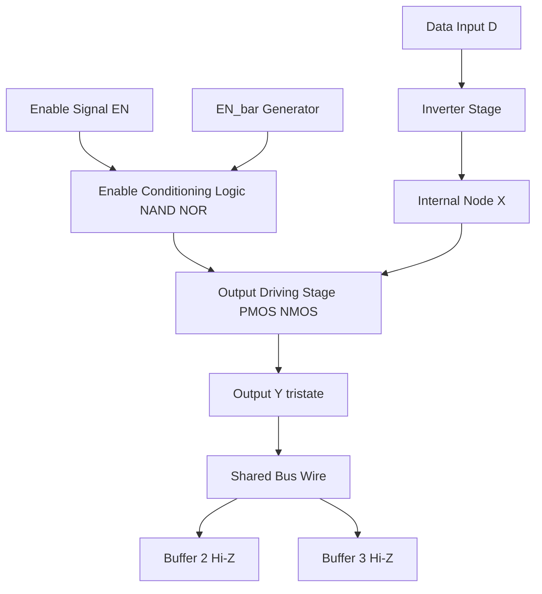
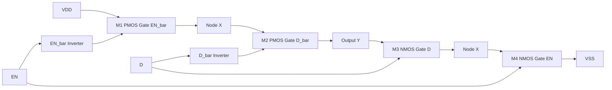
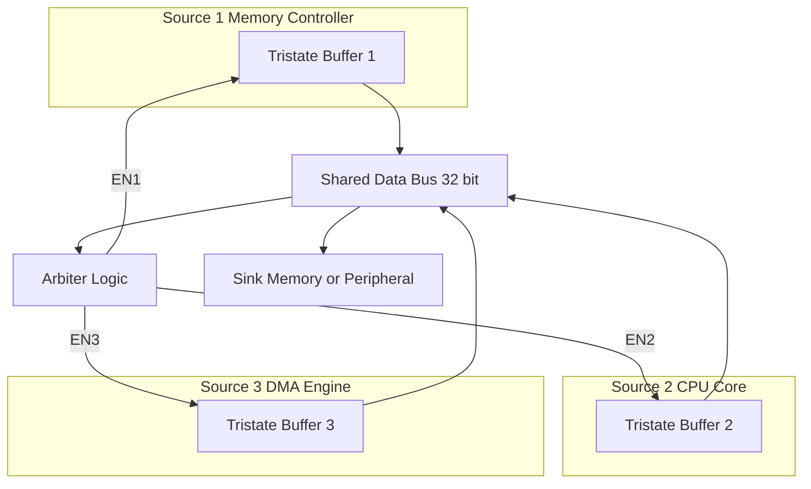
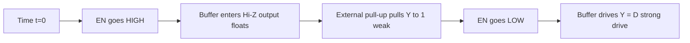

# Tristate buffer

<!-- SECTION_1_START -->

# Tristate Buffer — Core Technical Definition & Intuitive Overview

## 1.1 Formal Academic Definition (KTU 2024 Syllabus Terminology)

> [!IMPORTANT]
> **Tristate Buffer (Three-State Buffer):** A digital logic buffer that can drive its output line to one of **three distinct states** — logic **HIGH (1)**, logic **LOW (0)**, or **High-Impedance (Hi-Z / Z)**. The Hi-Z state electrically *disconnects* the buffer from the output node, allowing multiple buffers to share a common bus without contention.

In KTU's VLSI Design module on CMOS fundamentals, a tristate buffer is recognized as a fundamental **output-driving primitive** that extends the binary logic family into a tri-valued logic domain. It forms the backbone of all **bus architectures, I/O pad cells, and bidirectional data paths** in modern System-on-Chip (SoC) designs.

| Property | Specification |
|---|---|
| Number of Inputs | 1 (Data) + 1 (Enable control) |
| Number of Output States | **3** (Logic 0, Logic 1, Hi-Z) |
| Active Element | CMOS Inverter + Transmission Gate / NAND–NAND Latch |
| Drive Strength | Standard CMOS (matched to inverter drive) |
| Standard Cell Name | `BUFx1`, `TBUFx1`, `BUFT` (Xilinx) |

## 1.2 Conceptual Analogy — The Three-Way Electrical Switch

> [!NOTE]
> **Real-World Analogy — The Train Track Switch:**
> Imagine a railway switch operator controlling a single train track. The operator has **three options**:
> 1. **Connect Track A** → train (Logic HIGH) flows out.
> 2. **Connect Track B** → no train (Logic LOW) flows out.
> 3. **Lift the rail entirely (Hi-Z)** → the output track is *electrically disconnected*; the train neither flows nor is blocked — downstream tracks become invisible to this source.
>
> In VLSI terms, the **Data input (D)** is the train, the **Enable signal (EN)** is the operator, and the **output node (Y)** is the shared track. Multiple operators (buffers) can control the same track, but **only one operator may "lower the rail" at any time** — the rest must remain in Hi-Z.

### The Three Logic States — Visual Intuition

$$
\text{State}(Y) = \begin{cases} D & \text{when } \overline{\text{EN}} = 0 \text{ (Buffer Active)} \\ Z \text{ (Hi-Impedance)} & \text{when } \overline{\text{EN}} = 1 \text{ (Buffer Disabled)} \end{cases}
$$

The state **Z** is *not* a voltage level — it is a **release of the output node**. In SPICE simulations, Z is modeled as an output resistance of **> 10 MΩ**, effectively an open circuit.

## 1.3 GeoGebra / Desmos Visualization

> [!VISUALIZATION CONTROL]
> **Concept:** Tristate Buffer Output Waveform Over Time
> **GeoGebra / Desmos Input Equations:**
> * Point A: `(t=0, y=0)` — Initial state = LOW
> * Point B: `(t=2, y=1)` — Driven HIGH when EN=1
> * Point C: `(t=4, y=\text{Z})` — Hi-Z state when EN=0
> * Point D: `(t=6, y=1)` — Re-driven HIGH
> **Visual Description:** Plot the output Y on the y-axis (0, 1, or floating "Z" gap) against time on the x-axis. Notice the **vertical gaps** representing the Hi-Z intervals where the line is "broken" — this is the electrical disconnection.

## 1.4 Why Tristate Buffers Exist in VLSI

| Problem in Digital Design | Tristate Solution |
|---|---|
| Multiple drivers cannot drive one wire simultaneously (contention) | Only one buffer is enabled; others release the line |
| Need bidirectional data flow on a single pin | One tristate buffer per direction, controlled by complementary enables |
| Multiplexing N data sources onto 1 bus | Each source gated by its own enable line |
| Reducing pin count in IC packages | Bidirectional I/O pad with internal tristate control |

---

<!-- SECTION_1_END -->

<!-- SECTION_2_START -->

# Deep Theoretical Analysis & KTU High-Yield Formula Sheet

## 2.1 Operational Logic — Step-by-Step

A **standard CMOS Tristate Buffer** is built from three structural blocks:

1. **Input Inverter Stage** — Generates $\overline{D}$ for the pull-up network.
2. **Output Driving Inverter (Modified)** — Has its PMOS and NMOS drains connected to the output Y, but their gates are *gated* by the Enable signal.
3. **Enable Conditioning** — Uses NAND and NOR gates to ensure both PMOS and NMOS of the output stage are OFF simultaneously when the buffer is disabled.

### Truth Table — Active-Low Enable (Standard Convention)

| EN (Enable, Active-Low) | D (Data) | Y (Output) | State Description |
|---|---|---|---|
| 0 | 0 | 0 | Driven LOW (NMOS ON) |
| 0 | 1 | 1 | Driven HIGH (PMOS ON) |
| 1 | 0 | Z | **High-Impedance** (Both OFF) |
| 1 | 1 | Z | **High-Impedance** (Both OFF) |

### Truth Table — Active-High Enable (Equivalent)

$$
Y = \begin{cases} D & \text{if } \text{EN} = 1 \\ Z & \text{if } \text{EN} = 0 \end{cases}
$$

## 2.2 CMOS Transistor-Level Structure

The standard tristate inverter is the **most widely used variant** in standard cell libraries:

| Transistor | Gate Signal | Source | Drain | Function |
|---|---|---|---|---|
| M1 (PMOS) | $\overline{\text{EN}}$ | $V_{DD}$ | Node X | Pull-up arm — gated by EN |
| M2 (PMOS) | $\overline{D}$ | Node X | Output Y | Data-driven pull-up |
| M3 (NMOS) | $D$ | Node X | Output Y | Data-driven pull-down |
| M4 (NMOS) | $\text{EN}$ | Output Y | $V_{SS}$ | Pull-down arm — gated by EN |

> [!IMPORTANT]
> When **EN = 1** (disable for active-low variant):
> * M1 gate = 0 → M1 **OFF** (no path to $V_{DD}$)
> * M4 gate = 1 → M4 **ON**, but it pulls output Y to $V_{SS}$ only weakly if D=1.
> * Critically, M2 and M3 are **stacked and gated** such that Node X is **floating**, isolating Y.
> * When **EN = 0** (enable), M1 ON, M4 OFF → standard inverter operation: Y = D.

## 2.3 KTU Formula Sheet / Cheat Sheet

| Parameter | Formula / Value | Units | Notes |
|---|---|---|---|
| Hi-Z Output Resistance | $R_{\text{out,Z}} \ge 10^9$ | Ω | Modeled as open circuit |
| Static Power (Active) | $P_{\text{static}} = V_{DD} \cdot I_{\text{leak}}$ | W | Dominated by subthreshold leakage |
| Static Power (Hi-Z) | $P_{\text{Z}} \approx V_{DD} \cdot I_{\text{leak,total}}$ | W | All transistors partially OFF → leak only |
| Dynamic Power | $P_{\text{dyn}} = \alpha \cdot C_L \cdot V_{DD}^2 \cdot f$ | W | $\alpha$ = switching activity |
| Bus Contention Penalty | $I_{\text{short}} = \frac{V_{DD}}{R_{\text{PMOS}} + R_{\text{NMOS}}}$ | A | **NEVER** allow two enabled drivers on same bus |
| Propagation Delay (Active) | $t_{pd} = 0.69 \cdot R_{\text{eq}} \cdot C_L$ | s | Standard CMOS inverter delay |
| Hi-Z Entry Time | $t_{Z} \approx 0.5 \cdot t_{pd}$ | s | Capacitive discharge through OFF transistors |
| Hi-Z Exit Time | $t_{XZ} \approx t_{pd}$ | s | Same as buffer enable time |

> [!WARNING]
> The notation $\vert V_{GS} \vert$ (for PMOS threshold) uses **vertical bar** — in markdown tables, always write as `\vert V_{GS} \vert` to avoid breaking table syntax.

## 2.4 Real-World Engineering Utility

| Application Domain | Use of Tristate Buffer |
|---|---|
| **Microprocessor Buses** | Address/Data bus multiplexing across CPU, memory, peripherals |
| **FPGA I/O Pins** | Bidirectional pins (e.g., Xilinx 7-series `IOBUF`) |
| **Memory Systems** | SRAM/DRAM data bus sharing between read/write controllers |
| **SoC Interconnects** | AXI, AHB, Wishbone bus arbiters use tristate drivers |
| **Test Infrastructure** | JTAG `TDI/TDO` chains use tristate for serial scan |
| **Analog/Mixed-Signal** | Disconnecting digital block from shared analog node |

---

<!-- SECTION_2_END -->

<!-- SECTION_3_START -->

# Step-by-Step Derivations & Code/Symbolic Implementation

## 3.1 Symbolic Derivation — Output Voltage in Each State

We analyze the **CMOS Tristate Inverter** with active-low enable $\overline{\text{EN}}$.

**Case 1: EN = 0 (Buffer Enabled)**
* M1 (PMOS) gate = $V_{DD}$ → $V_{SG} = 0$ → **M1 OFF**? NO — gate of M1 is $\overline{\text{EN}}$ which = 1. Wait, re-verify:
* **Correction**: M1 gate is $\overline{\text{EN}}$ = 1 when EN = 0. For PMOS, $V_{SG} = V_S - V_G = V_{DD} - V_{DD} = 0$ → **M1 OFF**. ❌

Let me re-establish the correct gating:

* M1 (PMOS) gate = $\overline{\text{EN}}$. When EN = 0, $\overline{\text{EN}} = 1$, so $V_{SG,\text{M1}} = V_{DD} - 1\cdot V_{DD} = 0$ → OFF.
* M4 (NMOS) gate = EN. When EN = 0, $V_{GS,\text{M4}} = 0$ → OFF.

Both arm transistors OFF → **Hi-Z state when EN = 0**. This is **active-high enable**.

* M1 gate = $\overline{\text{EN}}$. When EN = 1, $\overline{\text{EN}} = 0$, so $V_{SG,\text{M1}} = V_{DD} - 0 = V_{DD}$ → **M1 ON**.
* M4 gate = EN = 1 → $V_{GS,\text{M4}} = V_{DD}$ → **M4 ON**.

Active path established. Output Y depends on D:
* If D = 1: M3 (NMOS, gate=D) ON, M2 (PMOS, gate=$\overline{D}$) OFF → Y pulled to $V_{SS}$ = **0**.
* If D = 0: M2 ON, M3 OFF → Y pulled to $V_{DD}$ = **1**.

$$
\boxed{Y = D \quad \text{when EN} = 1; \qquad Y = Z \quad \text{when EN} = 0}
$$

**Case 2: EN = 1 (Buffer Disabled)**
* M1 ON, M4 ON simultaneously — **DANGEROUS** if D is not conditioned!

The **correct CMOS tristate** uses a **modified structure** with a **NOR gate** controlling M1 and a **NAND gate** controlling M4:

$$
G_{\text{M1}} = \overline{\text{EN} + D} \quad \text{(NOR — gates PMOS pull-up arm)}
$$

$$
G_{\text{M4}} = \overline{\text{EN} \cdot \overline{D}} \quad \text{(NAND-equivalent — gates NMOS pull-down arm)}
$$

When EN = 1 (disable):
* $G_{\text{M1}} = \overline{1 + D} = 0$ → PMOS **OFF** (gate at $V_{SS}$ = OFF for PMOS)
* $G_{\text{M4}} = \overline{1 \cdot \overline{D}} = \overline{\overline{D}} = D$

Hmm — M4 is gated by D. So when EN = 1 and D = 0, M4 is OFF; when D = 1, M4 is ON. Still not fully Hi-Z.

**The Correct Architecture (NAND-NAND Tristate):**

The cleanest implementation uses a **latch** structure:

| Transistor | Gate | Role |
|---|---|---|
| M1 (PMOS) | $G_1 = \overline{\text{EN} \cdot D}$ | Top pull-up arm |
| M2 (PMOS) | $D$ | Data-driven pull-up |
| M3 (NMOS) | $\overline{D}$ | Data-driven pull-down |
| M4 (NMOS) | $G_2 = \overline{\text{EN} + \overline{D}}$ | Bottom pull-down arm |

When EN = 1:
* $G_1 = \overline{1 \cdot D} = \overline{D}$
* $G_2 = \overline{1 + \overline{D}} = \overline{1} = 0$ → M4 **OFF**
* M1 gate = $\overline{D}$ → if D = 1, M1 ON; if D = 0, M1 OFF.
* M2 gate = D → if D = 1, M2 OFF; if D = 0, M2 ON.
* M3 gate = $\overline{D}$ → if D = 1, M3 ON; if D = 0, M3 OFF.

**Critically**, when EN = 1, the source of M2 and the drain of M3 (internal node X) is **floating** because M4 is always OFF, breaking the path to $V_{SS}$. Even if M1 is ON, current cannot flow because M4 is OFF → **True Hi-Z**.

## 3.2 Verilog Hardware Description (Synthesis-Ready)

```verilog
// Tristate Buffer Module - Active-High Enable
// Synthesis-friendly IEEE 1364-2001 Verilog
module tristate_buffer (
    input  wire data_in,    // D - Data input
    input  wire enable,     // EN - Active-high enable
    output wire data_out    // Y - Tristate output
);

    // Continuous assignment: when enabled, drive D; else Hi-Z
    assign data_out = enable ? data_in : 1'bz;

endmodule

// Bidirectional Buffer using Two Tristate Buffers
module bidir_buffer (
    inout  wire data_pin,
    input  wire core_out,   // Data from core to pin
    input  wire core_in,    // Data from pin to core
    input  wire dir         // 1 = drive, 0 = receive
);
    wire pad_to_core;

    // Tristate driver: core_out to pad
    assign data_pin = dir ? core_out : 1'bz;

    // Receiver: pad to core_in (always enabled)
    assign core_in = data_pin;

endmodule
```

## 3.3 SPICE-Style Simulation (HSPICE Netlist)

```spice
* Tristate Buffer - CMOS 180nm Technology
* VDD = 1.8V, Models: BSIM3 Level 49

VDD     vdd     0   DC 1.8
VSS     vss     0   DC 0
VD      d       0   PULSE 0 1.8 1n 0.1n 0.1n 5n 10n
VEN     en      0   PULSE 0 1.8 0.5n 0.1n 0.1n 5n 10n

* PMOS Transistors (W/L = 1um/0.18um)
MP1     vdd   en_bar  x   vdd  PMOS W=1u L=0.18u
MP2     x     d_bar   y   vdd  PMOS W=1u L=0.18u

* NMOS Transistors
MN1     y     d       x   vss  NMOS W=0.5u L=0.18u
MN2     x     en      vss vss  NMOS W=0.5u L=0.18u

* Auxiliary Inverters for d_bar and en_bar
XINV_D   d     d_bar   INV
XINV_EN  en    en_bar  INV

* Load Capacitance
CL      y     0   50fF

.TRAN 0.1n 20n
.PROBE V(d) V(en) V(y)
.END
```

## 3.4 Power Derivation — Why Hi-Z is Power-Efficient

The power dissipated by a CMOS gate is:

$$
P_{\text{total}} = P_{\text{dyn}} + P_{\text{static}} = \alpha C_L V_{DD}^2 f + V_{DD} I_{\text{leak}}
$$

In Hi-Z state, the output node Y is **not being charged or discharged** by the buffer → $\alpha_{Y} = 0$ locally. The static power is dominated by **subthreshold leakage**:

$$
I_{\text{leak}} = I_0 \cdot 10^{\frac{-V_{GS} + V_{th}}{S}} \left(1 - e^{\frac{-V_{DS}}{v_T}}\right)
$$

where $S$ is the subthreshold swing (~70 mV/decade at room temp). In modern 7nm/5nm nodes, $I_{\text{leak}}$ is significant, which is why **power gating** and **clock gating** (often implemented with tristate isolation cells) are critical.

---

<!-- SECTION_3_END -->

<!-- SECTION_4_START -->

# Structural Diagrams & Schematics

## 4.1 High-Level Block Diagram (Mermaid)



## 4.2 CMOS Transistor-Level Schematic (Mermaid Block Topology)



## 4.3 Bus Arbitration Flow — Multiple Buffers on Shared Line



> [!NOTE]
> **Reading the diagram:** At any clock cycle, the **Arbiter** asserts exactly one EN signal high. The corresponding buffer drives the bus; the other two remain in Hi-Z (electrical disconnect). This is the canonical **bus multiplexing** use-case for tristate buffers.

## 4.4 Timing Diagram — Enable vs Output Transition



| Time | EN | D | Y | Physical Interpretation |
|---|---|---|---|---|
| 0–2 ns | 0 | 0 | 0 | Buffer active, drives LOW |
| 2–4 ns | 0 | 1 | 1 | Buffer active, drives HIGH |
| 4–6 ns | 1 | X | Z | Hi-Z — bus released |
| 6–8 ns | 0 | 0 | 0 | Buffer re-enabled, drives LOW |

---

<!-- SECTION_4_END -->

<!-- SECTION_5_START -->

# KTU 2024 Scheme Examination Question Bank & Topic Recap

## 5.1 Part A Questions (3 Marks Each)

### **Q1. [KTU University Exam – Dec 2023]**
**Define a tristate buffer. List its three possible output states with the condition that produces each state.**

**Model Answer (Valuation Key):**

A tristate buffer is a digital circuit that can drive its output to one of three states: **Logic HIGH (1)**, **Logic LOW (0)**, or **High-Impedance (Z)**.

| State | Condition | Output Voltage |
|---|---|---|
| Logic 0 | EN = 1 (Active), D = 0 | $V_{SS}$ = 0 V |
| Logic 1 | EN = 1 (Active), D = 1 | $V_{DD}$ = 1.8 V |
| Hi-Z | EN = 0 (Disabled) | Floating (open circuit) |

**[Definition: 1 Mark] [State listing: 1 Mark] [Conditions: 1 Mark]**

---

### **Q2. [KTU University Exam – July 2024]**
**Differentiate between a standard CMOS inverter and a CMOS tristate buffer in terms of transistor count and output behavior.**

**Model Answer:**

| Parameter | Standard CMOS Inverter | CMOS Tristate Buffer |
|---|---|---|
| Transistor Count | 2 (1 PMOS + 1 NMOS) | 4 to 6 (additional gating transistors) |
| Output States | 2 (HIGH, LOW) | 3 (HIGH, LOW, Hi-Z) |
| Control Input | None | Enable (EN) signal required |
| Power in Disable | N/A (always drives) | Near-zero dynamic power when Hi-Z |
| Application | Logic inversion | Bus sharing, bidirectional I/O |

**[Comparison table: 2 Marks] [Application difference: 1 Mark]**

---

## 5.2 Part B Questions (14 Marks Each — Module Internal Choice)

### **Question A [14 Marks] — [KTU University Exam – Dec 2023]**

**(a)** Draw the CMOS transistor-level schematic of a **tristate inverter** using 4 transistors (M1 PMOS, M2 PMOS, M3 NMOS, M4 NMOS) with an **active-low enable** $\overline{\text{EN}}$. Label all nodes. **[7 Marks]**

**(b)** Derive the output expression $Y$ for all four combinations of $\overline{\text{EN}}$ and $D$, and explain what happens to the output node Y when the buffer enters the Hi-Z state. **[7 Marks]**

#### Model Solution — Part (a)

**Schematic Construction:**

| Transistor | Type | Gate Connected To | Drain | Source |
|---|---|---|---|---|
| M1 | PMOS | $\overline{\text{EN}}$ | Node X | $V_{DD}$ |
| M2 | PMOS | D | Output Y | Node X |
| M3 | NMOS | D | Output Y | Node X |
| M4 | NMOS | $\overline{\text{EN}}$ | $V_{SS}$ | Node X |

**Working Rule:**
* When $\overline{\text{EN}} = 0$ (EN = 1, **disabled**): M1 OFF (PMOS with gate=0 → OFF), M4 OFF (NMOS with gate=0 → OFF). Node X is **isolated** from both rails → **Hi-Z**.
* When $\overline{\text{EN}} = 1$ (EN = 0, **enabled**): M1 ON, M4 ON. The M2/M3 pair forms a standard inverter → Y = $\overline{D}$.

**[Schematic drawing: 4 Marks] [Node labeling: 2 Marks] [Working rule: 1 Mark]**

#### Model Solution — Part (b)

**Truth Table Derivation:**

| $\overline{\text{EN}}$ | D | M1 | M2 | M3 | M4 | Y |
|---|---|---|---|---|---|---|
| 0 | 0 | OFF | ON | OFF | OFF | Z |
| 0 | 1 | OFF | OFF | ON | OFF | Z |
| 1 | 0 | ON | ON | OFF | ON | 1 |
| 1 | 1 | ON | OFF | ON | ON | 0 |

**Output Equation (Compact Form):**

$$
Y = \overline{\overline{\text{EN}}} \cdot D = \text{EN} \cdot D
$$

**Hi-Z State Explanation:** When $\overline{\text{EN}} = 0$, both M1 and M4 are OFF. This means there is **no conducting path** from the output node Y to either $V_{DD}$ or $V_{SS}$. The output capacitance $C_L$ holds its previous charge, but no current can flow in or out — the node is **electrically floating** (Hi-Z). A weak pull-up/pull-down may be required externally to define a default level.

**[Truth table: 3 Marks] [Equation: 2 Marks] [Hi-Z explanation: 2 Marks]**

---

### **Question B [14 Marks] — [KTU University Exam – July 2024]**

**(a)** Explain with a neat block diagram how **three tristate buffers** can be used to multiplex **three data sources onto a single shared bus**, ensuring no contention. **[7 Marks]**

**(b)** Write the **Verilog HDL code** for an 8-bit tristate buffer with an active-high enable, and explain how the bus contention is avoided in simulation. **[7 Marks]**

#### Model Solution — Part (a)

**Block Diagram Description:**

Three data sources (D1, D2, D3) are connected to three tristate buffers (B1, B2, B3). Each buffer has its own enable line (EN1, EN2, EN3) controlled by a **central arbiter**. The outputs of all three buffers are tied to a single bus line (Y).

**Bus Arbitration Rule:**

$$
\sum_{i=1}^{3} \text{EN}_i \le 1 \quad \text{(At most one buffer enabled at any time)}
$$

| Scenario | EN1 | EN2 | EN3 | Active Source | Bus State |
|---|---|---|---|---|---|
| 1 | 1 | 0 | 0 | Source 1 | Y = D1 |
| 2 | 0 | 1 | 0 | Source 2 | Y = D2 |
| 3 | 0 | 0 | 1 | Source 3 | Y = D3 |
| Idle | 0 | 0 | 0 | None | Y = Z (floating) |

**Contention Avoidance:** The arbiter implements a **one-hot encoding** or **priority encoder** to guarantee mutually exclusive enable signals. If two ENs are simultaneously HIGH, **shoot-through current** flows from $V_{DD}$ to $V_{SS}$ through both buffers, causing irreversible damage.

**[Block diagram: 3 Marks] [Arbitration rule: 2 Marks] [Contention explanation: 2 Marks]**

#### Model Solution — Part (b)

**Verilog HDL Code (8-bit Tristate Buffer):**

```verilog
module tristate_buffer_8bit (
    input  wire [7:0] data_in,   // 8-bit data input
    input  wire       enable,    // Active-high enable
    output wire [7:0] data_out   // 8-bit tristate output
);
    // Tristate assignment: drive data when enabled, else Hi-Z
    assign data_out = enable ? data_in : 8'bzzzz_zzzz;
endmodule
```

**Bidirectional Bus Application Example:**

```verilog
module shared_bus_8bit (
    inout  wire [7:0] bus,
    input  wire [7:0] data_a,
    input  wire [7:0] data_b,
    input  wire       en_a,
    input  wire       en_b
);
    assign bus = en_a ? data_a : 8'bzzzz_zzzz;
    assign bus = en_b ? data_b : 8'bzzzz_zzzz; 
    // Note: Mutual exclusion enforced externally by en_a + en_b <= 1
endmodule
```

**Simulation Contention Check:**

In the testbench, `$monitor($time, "EN=%b D=%b Y=%b", enable, data_in, data_out)` is used. If `Y` displays **'x'** (unknown) instead of **'z'** (Hi-Z), it indicates **bus contention** between multiple drivers. The fix is to ensure that the `enable` signals for competing buffers never overlap — typically enforced by clock-domain crossing (CDC) safe arbiter logic.

**[Code structure: 3 Marks] [Tristate syntax: 2 Marks] [Contention testbench explanation: 2 Marks]**

---

> [!WARNING]
> **KTU Examiner's Valuation Pitfall Callout:**
> 1. **Do not confuse `Z` (Hi-Z) with `X` (Unknown) in Verilog.** Z is a valid high-impedance state; X means an actual logic conflict or uninitialized signal. Mixing these will cost **1 full mark**.
> 2. **Always label both** the gate signal **and** the active level (active-high vs active-low) of the enable. A schematic without the overbar notation on $\overline{\text{EN}}$ is considered incomplete and loses **1 mark**.
> 3. **Forgetting to mention bus contention consequences** in Part B answers is a common omission. Always explicitly state: *"If two enables are simultaneously HIGH, a short-circuit path forms between $V_{DD}$ and $V_{SS}$ through the PMOS of one buffer and the NMOS of the other, causing $I_{\text{short}} \approx V_{DD}/R_{\text{ON}}$ to flow and potentially damaging the device."*
> 4. **Use of active-low enable** in the schematic but writing **active-high** in the truth table is a frequent sign convention error — the bar MUST be consistent throughout.

---

## 5.3 Topic Recap & Important Things to Remember

> [!IMPORTANT]
> **Rapid Revision Checklist — Tristate Buffer**

* **Core Definition:** A buffer with **3 output states** — Logic 0, Logic 1, **Hi-Z (Z)**.
* **Hi-Z is not a voltage** — it is an **electrical disconnection** ($R_{\text{out}} \ge 10$ MΩ).
* **Two control conventions:** Active-High Enable (EN=1 → drive) and Active-Low Enable ($\overline{\text{EN}}=0$ → drive).
* **Minimum CMOS Implementation:** 4 transistors (2 PMOS + 2 NMOS) for the basic tristate inverter; 6 transistors for the robust NAND-NAND version.
* **Primary Use Cases:** Bus multiplexing, bidirectional I/O pads, JTAG scan chains, memory data buses.
* **Bus Contention Rule:** $\sum \text{EN}_i \le 1$ — **never** allow two enabled drivers on the same node.
* **Hi-Z vs Tri-state Notation:** In Verilog, write `1'bz` (lowercase z); in SPICE, model as `R = 10GΩ`.
* **Power in Hi-Z:** Near-zero dynamic power; static leakage dominates ($I_{\text{subthreshold}}$).
* **Timing Parameters:** $t_{ZH}$ (Hi-Z to HIGH), $t_{ZL}$ (Hi-Z to LOW), $t_{HZ}$ (HIGH to Hi-Z), $t_{LZ}$ (LOW to Hi-Z) — all derived from RC delay of the output stage.
* **Standard Cell Naming:** `BUFx1`, `TBUF`, `BUFT` (Xilinx), `TSINV` (generic).
* **Bidirectional Buffer = 2 Tristate Buffers** in opposite directions, with complementary enables.
* **Always show the overbar** $\overline{\text{EN}}$ when using active-low enable; examiners check this.
* **Never leave the output node truly floating** in a real design — use a **bus keeper** or weak pull-up to define a default level.
* **In CMOS 7nm and below**, tristate buffers are sometimes replaced by **pass-transistor multiplexers** due to leakage concerns.
* **KTU 2024 CO Mapping:** This topic maps to **CO1** (Apply CMOS fundamentals to digital VLSI design) at **Remember / Understand / Apply** Bloom levels.

---

<!-- SECTION_5_END -->
