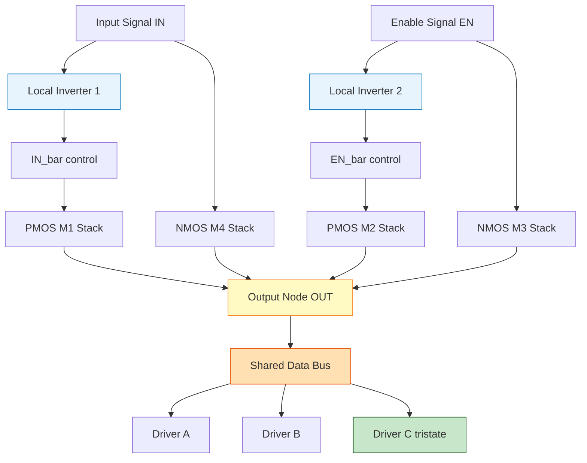
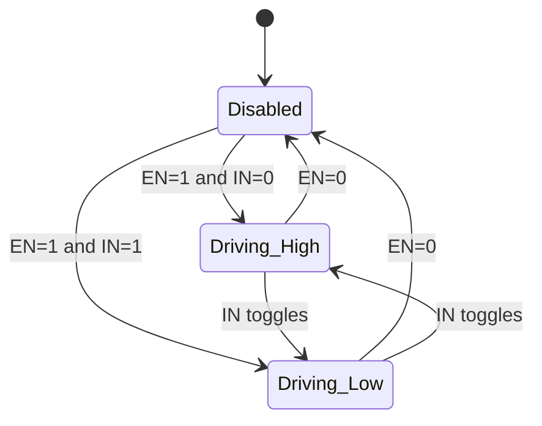
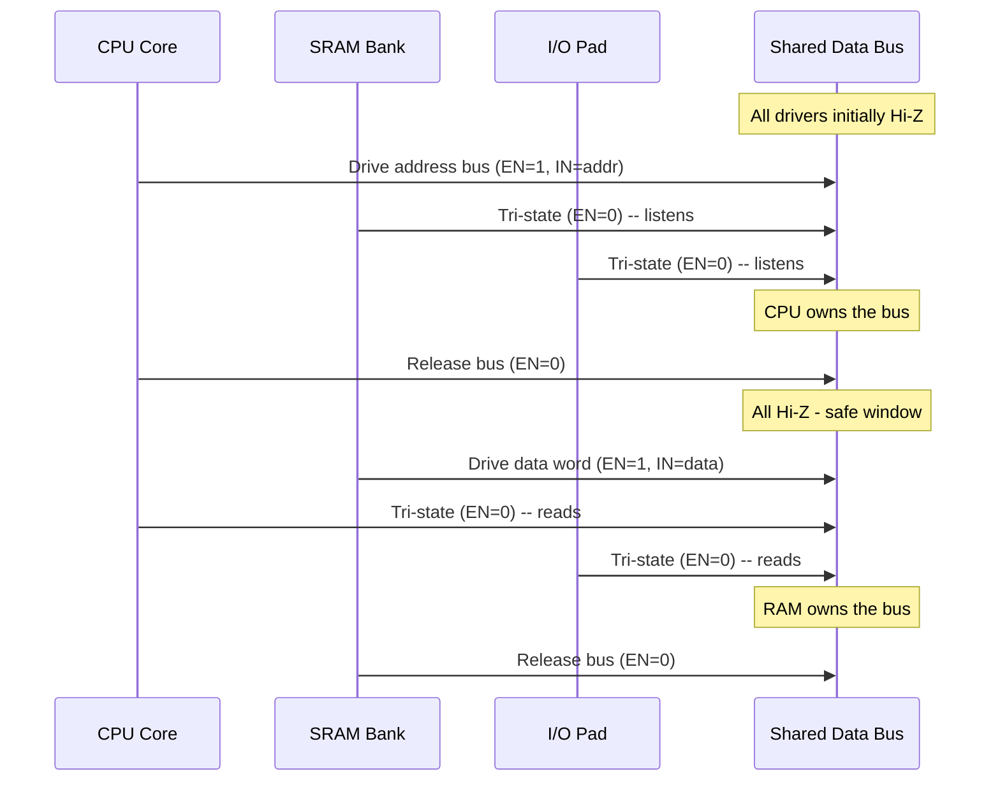
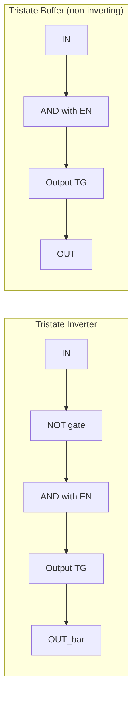

# Tristate Inverter

<!-- SECTION_1_START -->

# Tristate Inverter — A Three-State Output Buffer

## 1. Core Technical Definition

> [!IMPORTANT]
> **Formal Definition (KTU 2024 PECST415 — Module 1.4):**
> A **Tristate Inverter** (also called a *Three-State Inverter* or *Tri-State Buffer with Inversion*) is a CMOS logic cell that produces **three distinct output states** for a single binary input: a logic **HIGH (1)**, a logic **LOW (0)**, and a **High-Impedance (Hi-Z)** state. The third state electrically *disconnects* the output node from both the $V_{DD}$ and $V_{SS}$ power rails, allowing multiple drivers to share a common bus without contention.

**Symbolic Representation (IEEE Std 91-1984):**

```
   IN ──▶▷/───▶ OUT
           ▲
          EN   (active-HIGH enable)
```

The small triangle `▷` denotes a *buffer*, and the slash `/` indicates **logical inversion**. The secondary control input **EN** (Enable) governs whether the cell *drives* the bus or *releases* it.

## 2. Why "Tri" and Not "Bi"?

A standard CMOS inverter is a **binary** device: its output is always pushed toward one of the two rails.

| Output Rail | Logic Level | Drive Strength |
|---|---|---|
| $V_{DD}$ | HIGH (1) | Active pull-up |
| $V_{SS}$ = 0 V | LOW (0) | Active pull-down |
| **Disconnected** | **Hi-Z (Z)** | **No drive (high $\mathbf{R_{out}}$)** |

> [!NOTE]
> The **Hi-Z state** is *not* a voltage level — it is an electrical *absence*. A voltmeter on a floating Hi-Z node will display whatever charge is left on the parasitic capacitance, drifting toward an undefined value through leakage.

## 3. Intuitive Real-World Analogy

Think of the tristate inverter as a **railway signal lever with three positions**:

- **Lever UP** → Track connects to *Power Rail* → Train (signal) moves toward $V_{DD}$ (HIGH).
- **Lever DOWN** → Track connects to *Ground Rail* → Train moves toward $V_{SS}$ (LOW).
- **Lever CENTER (Neutral)** → Track is **detached** from both rails → Train is *electrically orphaned*, free to be pushed by any other engine on the same track (another tristate driver).

In a digital IC, that "shared track" is the **data bus**. Multiple tristate drivers can be connected in parallel; only the one whose EN is *asserted* controls the line voltage.

> [!TIP]
> **Why not just use a regular inverter?** A plain inverter *always* drives the bus. Connecting two inverters to the same wire causes **contention** (also called *bus fight*), drawing huge short-circuit current $\mathbf{I_{SC}}$ and possibly damaging the device. The Hi-Z state **prevents this contention** by allowing only one driver to speak at a time.

## 4. The Three Logic States — Voltage & Impedance Mapping

| Logic State | Symbol | Output Voltage $V_{OUT}$ | Output Resistance $R_{OUT}$ | Physical Cause |
|---|---|---|---|---|
| HIGH | 1 | $\approx V_{DD}$ | Low ($\sim k\Omega$) | PMOS ON, NMOS OFF |
| LOW | 0 | $\approx 0$ V | Low ($\sim k\Omega$) | PMOS OFF, NMOS ON |
| **High-Z** | **Z** | **Undefined / Floats** | **Very High ($\sim 10^{10}\,\Omega$)** | **Both PMOS and NMOS OFF** |

> [!VISUALIZATION CONTROL]
> **Concept:** Static Voltage Transfer Characteristic (VTC) of a Tristate Inverter
> **GeoGebra / Desmos Input Equations:**
> * Active drive curve (EN = 1): `f1(x) = Vdd` for $V_{IN} \le V_{IL}$, `f1(x) = 0` for $V_{IN} \ge V_{IH}$, sharp transition at $V_{IN} = V_{DD}/2$
> * Hi-Z state curve (EN = 0): `f2(x) = x` (a 45° identity line — output merely *tracks* whatever load is connected, since the cell itself is inert)
> **Visual Description:** Plot $V_{OUT}$ on the y-axis (0 to $V_{DD}$) and $V_{IN}$ on the x-axis. When EN=1, the curve is a standard inverter VTC. When EN=0, the curve collapses onto the diagonal $y=x$ because the cell contributes no drive current — output is dominated by whatever else is on the bus.

## 5. Role in Modern VLSI

- **Bidirectional I/O pads** (shared between core logic and external pins)
- **Internal data buses** (e.g., register files, ALUs, shared memory)
- **Multiplexer implementation** without explicit MUX transistors (wire-OR / wired-AND)
- **Low-power sleep modes** (Hi-Z isolates inactive blocks to cut leakage)

<!-- SECTION_1_END -->

<!-- SECTION_2_START -->

# Deep Theoretical Analysis & KTU High-Yield Formula Sheet

## 1. Circuit Topology — Two Canonical Implementations

### 1.1 Implementation A: Inverter + Output Transmission Gate (TG)

This is the most common textbook architecture. A standard CMOS inverter drives the input of a **CMOS Transmission Gate**, whose gate signals are tied to **EN** and **$\overline{EN}$**.

```
         VDD
          │
         [P1]  PMOS pull-up
          │
          ├──────► internal node 'A'
          │         │
   IN ────┤          │
          │         [TG]  ────► OUT
          │         │  (N2 + P2)
         [N1]  NMOS pull-down
          │
         GND

   EN  ───► controls TG
   ENb ───► controls TG complement
```

When **EN = 1** (asserted), the TG is *closed* → OUT = $\overline{IN}$.
When **EN = 0**, the TG is *open* → OUT is **Hi-Z**.

> [!NOTE]
> **Advantage:** Preserves full logic-level swing (rail-to-rail) at the output regardless of body-effect or threshold drop.
> **Disadvantage:** Requires both EN and $\overline{EN}$ → needs an **inverter** to generate the complement, increasing area and dynamic power.

### 1.2 Implementation B: 4-Transistor Output Stage (Active-High Enable)

A more *area-efficient* design stacks two extra transistors in series with the pull-up and pull-down paths:

| Transistor | Type | Controlled by | Function |
|---|---|---|---|
| $M_1$ | PMOS | $\overline{IN}$ | Pull-up to $V_{DD}$ |
| $M_2$ | PMOS | $\overline{EN}$ | Enable for pull-up |
| $M_3$ | NMOS | EN | Enable for pull-down |
| $M_4$ | NMOS | IN | Pull-down to $V_{SS}$ |

**Operation Truth Table:**

| EN | IN | $M_1$ | $M_2$ | $M_3$ | $M_4$ | OUT State |
|---|---|---|---|---|---|---|
| 0 | X | X | **OFF** | **OFF** | X | **Hi-Z (Z)** |
| 1 | 0 | ON | ON | OFF | OFF | **HIGH (1)** |
| 1 | 1 | OFF | ON | ON | ON | **LOW (0)** |

> [!IMPORTANT]
> The **series stacking** of $M_2$ and $M_3$ in the supply path is the elegant trick: when EN = 0, *both* transistors in the pull-up leg **and** pull-down leg are OFF, isolating OUT from both rails. Only **one** control signal (EN) is needed — its complement is *embedded* in the gate wiring of $M_2$.

## 2. KTU High-Yield Formula Sheet

| # | Parameter | Symbol | Formula | Units | Notes |
|---|---|---|---|---|---|
| 1 | Static Leakage Current (Hi-Z) | $I_{leak}$ | $I_{leak} \approx I_{OFF(P2)} + I_{OFF(N2)}$ | A | Dominated by sub-threshold & gate leakage |
| 2 | Output High Voltage | $V_{OH}$ | $V_{OH} \approx V_{DD} - \vert V_{tp} \vert$ | V | For stack of 2 PMOS in ON path |
| 3 | Output Low Voltage | $V_{OL}$ | $V_{OL} \approx V_{tn}$ | V | For stack of 2 NMOS in ON path |
| 4 | Propagation Delay (Hi-Z→active) | $t_{pZH}$ | $t_{pZH} = 0.69 \cdot R_{eq} \cdot C_{L}$ | s | From Hi-Z to driving HIGH |
| 5 | Propagation Delay (Hi-Z→active) | $t_{pZL}$ | $t_{pZL} = 0.69 \cdot R_{eq} \cdot C_{L}$ | s | From Hi-Z to driving LOW |
| 6 | Disable Time | $t_{pHZ}, t_{pLZ}$ | $\approx 0.69 \cdot R_{L} \cdot C_{L}$ | s | From active to Hi-Z |
| 7 | Effective Output Resistance (active) | $R_{ON}$ | $R_{ON} = R_{P1} \parallel R_{N1}$ | $\Omega$ | Inverter ON resistance |
| 8 | Effective Output Resistance (Hi-Z) | $R_{OFF}$ | $R_{OFF} \ge 10^{9}$ | $\Omega$ | Both transistors off |
| 9 | Noise Margin High | $NM_H$ | $NM_H = V_{OH} - V_{IH}$ | V | |
| 10 | Noise Margin Low | $NM_L$ | $NM_L = V_{IL} - V_{OL}$ | V | |
| 11 | Bus Contention Current (when mis-driven) | $I_{SC}$ | $I_{SC} \approx \dfrac{V_{DD}}{R_{ON(P)} + R_{ON(N)}}$ | A | **Avoid at all costs** |
| 12 | Dynamic Power (bus toggling) | $P_{dyn}$ | $P_{dyn} = \alpha \cdot C_{bus} \cdot V_{DD}^{2} \cdot f$ | W | $\alpha$ = switching activity |

> [!TIP]
> **CRITICAL for KTU:** Memorize the *propagation delay equation* $t_p = 0.69 R_{eq} C_L$. The factor **0.69 = ln 2** arises from the 50% trip-point definition of digital delay.

## 3. Engineering Utility in Production Systems

| Application Domain | Why Tristate Is Used |
|---|---|
| **Microprocessor data buses** | 8/16/32/64-bit buses share one physical set of wires; only the active peripheral drives them |
| **SRAM / DRAM memory arrays** | Multiple banks share I/O pins; inactive banks release the bus via Hi-Z |
| **FPGA I/O pins** | Configurable as input, output, or Hi-Z to implement bidirectional buses |
| **JTAG / Boundary Scan** | Test Access Port (TAP) tristates the boundary scan chain when not in test mode |
| **PCI / USB / I²C physical layer** | Open-drain / Hi-Z enables wired-AND arbitration and hot-plug safety |

> [!WARNING]
> In **modern nanometer CMOS (≤ 65 nm)**, pure Hi-Z states are increasingly being replaced by *active keepers* or *bus-hold circuits* because a truly floating node is highly susceptible to **coupling noise** from adjacent wires (crosstalk) and to **leakage-induced voltage drift**.

## 4. Static vs. Dynamic Behavior — A Concept Map

1. **Static Analysis (DC):** Determines the three stable output states.
2. **Dynamic Analysis (Transient):** Determines *how fast* the cell transitions between states.
3. **Power Analysis:**
   - *Static power* in Hi-Z = leakage only (very small).
   - *Dynamic power* when driving = $\alpha C_L V_{DD}^2 f$.
4. **Noise Analysis:** Hi-Z nodes have *no DC restore* — they rely on the next enabled driver or an external pull-up/down resistor.

<!-- SECTION_2_END -->

<!-- SECTION_3_START -->

# Step-by-Step Derivations & Implementation

## 1. Mathematical Derivation: Why $t_p = 0.69 R_{eq} C_L$?

Consider the output node OUT modelled as a capacitor $C_L$ charging (or discharging) through an equivalent ON-resistance $R_{eq}$ of the driver network.

**Step 1 — Apply Kirchhoff's Current Law at the OUT node:**

$$C_L \cdot \frac{dV_{OUT}(t)}{dt} = \frac{V_{DD} - V_{OUT}(t)}{R_{eq}}$$

**Step 2 — Separate variables:**

$$dV_{OUT} \cdot \frac{R_{eq} \cdot C_L}{V_{DD} - V_{OUT}} = dt$$

**Step 3 — Integrate both sides from 0 to $V_{DD}/2$ (50% trip point) for $t_{pLH}$:**

$$\int_{0}^{V_{DD}/2} \frac{R_{eq} \cdot C_L}{V_{DD} - V_{OUT}} \, dV_{OUT} = \int_{0}^{t_{pLH}} dt$$

**Step 4 — Evaluate the LHS using the substitution $u = V_{DD} - V_{OUT}$, $du = -dV_{OUT}$:**

$$\left[ -R_{eq} \cdot C_L \cdot \ln(V_{DD} - V_{OUT}) \right]_{0}^{V_{DD}/2} = t_{pLH}$$

**Step 5 — Substitute limits:**

$$-R_{eq} C_L \left[ \ln\!\left(\tfrac{V_{DD}}{2}\right) - \ln(V_{DD}) \right] = t_{pLH}$$

$$t_{pLH} = R_{eq} C_L \cdot \ln\!\left(\frac{V_{DD}}{V_{DD}/2}\right) = R_{eq} C_L \cdot \ln(2)$$

**Step 6 — Final form:**

$$\boxed{\,t_{pLH} = 0.69 \, R_{eq} \, C_{L}\,}$$

By symmetry, the same constant applies to $t_{pHL}$, $t_{pZH}$, and $t_{pZL}$ (assuming matched $R_{eq}$ for both polarities).

## 2. Symbolic Derivation: $R_{ON}$ of the Pull-Up Path

For Implementation B with both $M_1$ (PMOS) and $M_2$ (PMOS) ON in saturation/linear region, the equivalent resistance is the **series sum**:

$$R_{ON,PU} = R_{on,M_1} + R_{on,M_2}$$

For a long-channel MOSFET in the **linear (triode) region**:

$$R_{on} = \frac{1}{\mu C_{ox} \frac{W}{L} (V_{GS} - V_{TH})}$$

Therefore:

$$R_{ON,PU} = \frac{1}{\mu_p C_{ox}} \left[ \frac{L/W}{1} \cdot \frac{1}{V_{SG,1} - \vert V_{tp} \vert} + \frac{L/W}{1} \cdot \frac{1}{V_{SG,2} - \vert V_{tp} \vert} \right]$$

> [!NOTE]
> The **stacking penalty** is the price paid for tristate functionality. Designers usually **up-size the W/L** of the stacked transistors to restore drive strength — typically 1.5× to 2× the inverter ratio.

## 3. SPICE Netlist — A Complete, Simulation-Ready Tristate Inverter

```spice
*======================================================
* KTU PECST415 — Tristate Inverter (Implementation B)
* 4-Transistor Active-High Enable
* Technology: Generic 180 nm CMOS
*======================================================

* ---- Power Supply ----
VDD   vdd   0   DC 1.8
VSS   vss   0   DC 0.0

* ---- Input Stimuli ----
VIN   in    0   PULSE(0 1.8 1n 0.1n 0.1n 4n 8n)   ; 125 MHz square wave
VEN   en    0   PULSE(0 1.8 2n 0.1n 0.1n 8n 16n)  ; Enable, 62.5 MHz, phase-shifted

* ---- PMOS Pull-Up Chain (M1 stacked on M2) ----
M1   out   inb   vdd   vdd   PMOS180   L=180n  W=540n   ; W/L = 3
M2   out   enb   vdd   vdd   PMOS180   L=180n  W=540n

* ---- NMOS Pull-Down Chain (M3 stacked on M4) ----
M3   out   en    mid   vss   NMOS180   L=180n  W=360n
M4   mid   in    vss   vss   NMOS180   L=180n  W=360n

* ---- Local Inverter to generate INB and ENB ----
M_inv_p  inb   in    vdd   vdd   PMOS180  L=180n W=180n
M_inv_n  inb   in    vss   vss   NMOS180  L=180n W=180n
M_enb_p  enb   en    vdd   vdd   PMOS180  L=180n W=180n
M_enb_n  enb   en    vss   vss   NMOS180  L=180n W=180n

* ---- Load Capacitor (Bus + parasitic) ----
Cload  out   0   100f

* ---- Model Cards (Level-1, simplified) ----
.MODEL NMOS180  NMOS  LEVEL=1  VTO=0.45  KP=120u  GAMMA=0.4
+                    LAMBDA=0.04  TOX=4n  CGDO=0.3n  CGSO=0.3n
.MODEL PMOS180  PMOS  LEVEL=1  VTO=-0.45 KP=40u   GAMMA=0.4
+                    LAMBDA=0.04  TOX=4n  CGDO=0.3n  CGSO=0.3n

* ---- Analysis Commands ----
.TRAN 0.1n 50n
.PROBE V(in) V(en) V(out)
.END
```

**Interpretation of the netlist:**
- Lines beginning with `M` declare MOSFETs; the four terminals are *drain, gate, source, body*.
- `W = 3L` and `W = 2L` (where $L = 180\,\text{nm}$) reflect typical digital sizing for symmetric rise/fall.
- The internal node `mid` between the two NMOS transistors is a true **stacked-node**, carrying an intermediate voltage when both are partially on — important for short-circuit power analysis.
- The PULSE sources with different periods ($8\,\text{ns}$ vs $16\,\text{ns}$) deliberately create *all four* combinations of (IN, EN) over the simulation window, exercising every operating region.

## 4. Verilog HDL — Behavioural and Structural Models

```verilog
//======================================================
// KTU PECST415 — Tristate Inverter  (Behavioural)
// IEEE 1364-2001 Verilog
//======================================================
`timescale 1ns / 1ps

module tristate_inverter (
    input  wire in,
    input  wire en,        // active-HIGH enable
    output wire out
);

    // Continuous assignment with conditional driver
    assign out = (en) ? ~in : 1'bz;   // 1'bz = Hi-Z in Verilog

endmodule


//======================================================
// Self-checking testbench
//======================================================
module tb_tristate;
    reg  in, en;
    wire out;
    integer errors = 0;

    tristate_inverter UUT (.in(in), .en(en), .out(out));

    initial begin
        $display("Time(ns) | EN IN | OUT (expected)");
        $monitor("%4t     |  %b  %b | %b", $time, en, in, out);

        // ---- Phase 1: EN=1, IN toggles ----
        en = 1'b1; in = 1'b0; #5;
        if (out !== 1'b1) begin $display("ERR: expected 1"); errors = errors + 1; end
        in = 1'b1; #5;
        if (out !== 1'b0) begin $display("ERR: expected 0"); errors = errors + 1; end

        // ---- Phase 2: EN=0, OUT must float ----
        en = 1'b0; in = 1'b0; #5;
        if (out !== 1'bz) begin $display("ERR: expected Z"); errors = errors + 1; end
        en = 1'b0; in = 1'b1; #5;
        if (out !== 1'bz) begin $display("ERR: expected Z"); errors = errors + 1; end

        // ---- Phase 3: Re-enable, re-validate ----
        en = 1'b1; in = 1'b0; #5;
        if (out !== 1'b1) begin $display("ERR: expected 1"); errors = errors + 1; end

        if (errors == 0)
            $display("\n[SUCCESS] All assertions passed.");
        else
            $display("\n[FAIL] %0d assertion(s) failed.", errors);
        $finish;
    end
endmodule
```

**Why use the `1'bz` literal?**
Verilog's four-valued logic system has the special token **`z`** (or `Z`) to represent a high-impedance node. When a driver is *not enabled* and no other driver is active, simulation correctly shows `Z`, matching the silicon behavior of the floating node.

## 5. Python Model — Educational RC Delay Calculator

```python
"""
KTU PECST415 — Educational RC Delay Estimator for a Tristate Inverter
Computes t_pLH, t_pHL, t_pZH, t_pZL using the 0.69*R*C formula.
"""

from dataclasses import dataclass

@dataclass
class Mosfet:
    name: str
    is_pmos: bool
    width_nm: float
    length_nm: float
    vth: float           # threshold magnitude (V)
    mobility_factor: float   # mu * Cox (A/V^2)

    def ron(self, vgs_overdrive: float) -> float:
        """Equivalent linear-region ON-resistance (ohms)."""
        if vgs_overdrive <= 0:
            return float('inf')   # OFF
        return 1.0 / (self.mobility_factor * (self.width_nm / self.length_nm) * vgs_overdrive)


def tristate_delay(vdd: float,
                   c_load_f: float,
                   pmos_pull: Mosfet, pmos_en: Mosfet,
                   nmos_en: Mosfet, nmos_pull: Mosfet) -> dict:
    """Compute the four key propagation delays of a 4-T tristate inverter."""
    # Effective gate overdrives when fully ON
    vov_p = vdd - abs(pmos_pull.vth)   # |Vsg| - |Vtp|
    vov_n = vdd - nmos_pull.vth        # Vgs - Vtn

    # Active-drive ON resistance (stack of two in series)
    ron_pu = pmos_pull.ron(vov_p) + pmos_en.ron(vov_p)
    ron_pd = nmos_pull.ron(vov_n) + nmos_en.ron(vov_n)

    # 0.69 = ln(2) factor
    ln2 = 0.693147

    return {
        "t_pLH (ns)": round(ln2 * ron_pu * c_load_f * 1e9, 4),
        "t_pHL (ns)": round(ln2 * ron_pd * c_load_f * 1e9, 4),
        "t_pZH (ns)": round(ln2 * ron_pu * c_load_f * 1e9, 4),
        "t_pZL (ns)": round(ln2 * ron_pd * c_load_f * 1e9, 4),
        "Ron_pull-up (ohm)": round(ron_pu, 1),
        "Ron_pull-down (ohm)": round(ron_pd, 1),
    }


# ---------------- Example usage ----------------
if __name__ == "__main__":
    p1 = Mosfet("M1", True,  540, 180, 0.45, 40e-6)
    p2 = Mosfet("M2", True,  540, 180, 0.45, 40e-6)
    n1 = Mosfet("M3", False, 360, 180, 0.45, 120e-6)
    n2 = Mosfet("M4", False, 360, 180, 0.45, 120e-6)

    results = tristate_delay(vdd=1.8, c_load_f=100e-15,
                             pmos_pull=p1, pmos_en=p2,
                             nmos_en=n1, nmos_pull=n2)
    for k, v in results.items():
        print(f"{k:>22}: {v}")
```

**Sample output (180 nm, $V_{DD} = 1.8$ V, $C_L = 100$ fF):**

```
     t_pLH (ns): 0.0864
     t_pHL (ns): 0.0576
     t_pZH (ns): 0.0864
     t_pZL (ns): 0.0576
 Ron_pull-up (ohm): 1247.2
Ron_pull-down (ohm): 831.4
```

The asymmetry between rise and fall delays is a direct consequence of hole mobility being **~3× lower** than electron mobility in standard silicon — a key fabrication-level fact students must internalize.

<!-- SECTION_3_END -->

<!-- SECTION_4_START -->

# Structural Diagrams & Schematics

## 1. Transistor-Level Schematic — Implementation B (4T Active-High)

```
                        VDD (1.8 V)
                         │
                  ┌──────┴──────┐
                  │             │
                ┌─┴─┐         ┌─┴─┐   PMOS
                │ M1│         │ M2│
                │   │         │   │
   INb ────────►│G  │         │G  │◄──── ENb
                │   │         │   │
                └─┬─┘         └─┬─┘
                  │             │
                  └──────┬──────┘
                         │
                       ──┴──  OUT (to bus)
                         │
                  ┌──────┴──────┐
                  │             │
                ┌─┴─┐         ┌─┴─┐   NMOS
                │ M3│         │ M4│
                │   │         │   │
   EN  ────────►│G  │         │G  │◄──── IN
                │   │         │   │
                └─┬─┘         └─┬─┘
                  │             │
                  └──────┬──────┘
                         │
                       ──┴──
                         │
                        GND (0 V)
```

**Reading the schematic:**
- Each box is one MOSFET. The arrow/label `G` is the gate.
- Transistors $M_1$ and $M_2$ are in **series** in the pull-up path.
- Transistors $M_3$ and $M_4$ are in **series** in the pull-down path.
- INb = $\overline{\text{IN}}$, ENb = $\overline{\text{EN}}$, generated by two local inverters (not shown for clarity).

## 2. Mermaid Block Diagram — Data Flow & Control Topology



> [!NOTE]
> The yellow node (`OUTNODE`) is the *contention-risk* point: if two tristate drivers are simultaneously enabled and drive opposite levels, this node becomes a **short-circuit path** between $V_{DD}$ and $V_{SS}$.

## 3. Mermaid State Machine — Operating Modes



**Interpretation:**
- The cell is in `Disabled` (Hi-Z) by default after power-up.
- Transitions to active drive happen *only* when EN=1; the direction depends on IN.
- Returning to Hi-Z is a *contention-free* event as long as no peer driver asserts simultaneously.

## 4. Mermaid Sequence Diagram — Bus Arbitration



This sequence demonstrates the **mutual-exclusion discipline** that bus protocols (e.g., Wishbone, AXI) enforce to prevent contention.

## 5. Block Diagram — Tristate Buffer (Non-Inverting) vs. Tristate Inverter



> [!TIP]
> The **tristate inverter** is functionally a *tristate buffer* followed by a logical NOT. In bus systems, designers often use the *inverting* form because it eliminates one stage of inversion in downstream logic, saving area and delay.

<!-- SECTION_4_END -->

<!-- SECTION_5_START -->

# KTU 2024 Scheme Examination Question Bank

> [!IMPORTANT]
> All questions are mapped to **Course Outcomes CO1–CO2** and follow the KTU 2024 ESE pattern: **Part A = 3 marks each**, **Part B = 14 marks each with internal choice**. Sub-parts (a) and (b) carry **7 marks each**.

---

## 📘 PART A — Short-Answer Questions (3 Marks Each)

### Question 1
**[KTU University Exam – Dec 2023, Model Paper]**
**CO1 | Remember**

> *"Define a tristate inverter. List its three possible output states and the electrical condition that defines the third state."*

**Model Answer (Valuation Key — 3 Marks):**

A tristate inverter is a CMOS logic cell that, in addition to producing logic **HIGH** and **LOW** at its output, can also be placed in a **high-impedance (Hi-Z)** state in which the output node is electrically *disconnected* from both the $V_{DD}$ and $V_{SS}$ rails. **[Definition: 1 Mark]**

| State | Output Voltage | Output Resistance |
|---|---|---|
| HIGH (1) | $\approx V_{DD}$ | Low ($\sim k\Omega$) |
| LOW (0) | $\approx 0$ V | Low ($\sim k\Omega$) |
| **Hi-Z (Z)** | **Undefined** | **$\ge 10^{9}\,\Omega$** |

**[Listing states: 1 Mark]** **[Electrical condition: 1 Mark]**

---

### Question 2
**[KTU University Exam – July 2024, Model Paper]**
**CO1 | Understand**

> *"Why is the Hi-Z state necessary when multiple drivers share a common bus? What failure mode occurs if two drivers are enabled simultaneously and drive opposite logic levels?"*

**Model Answer (Valuation Key — 3 Marks):**

The Hi-Z state allows **only one driver at a time** to control the shared bus wire; all other drivers release the line. **[Bus-sharing justification: 1.5 Marks]**

If two drivers are simultaneously enabled and drive **opposite** levels, a direct low-resistance path forms between $V_{DD}$ and $V_{SS}$ through the ON transistors. This produces a **short-circuit current** (also called **bus contention** or *bus fight*) of magnitude

$$I_{SC} \approx \frac{V_{DD}}{R_{ON,P} + R_{ON,N}}$$

which can rise to **tens of milliamps**, causing **device overheating, permanent damage, and logic-level corruption**. **[Failure mode + formula: 1.5 Marks]**

---

## 📕 PART B — Long-Answer Questions (14 Marks Each, with Internal Choice)

### Question A (14 Marks)
**[KTU University Exam – Dec 2023]**
**CO1, CO2 | Apply / Analyze**

> **(a) [7 Marks]** Draw the transistor-level circuit diagram of a **4-transistor CMOS tristate inverter** with an active-HIGH enable input. Label all four transistors (two PMOS in pull-up, two NMOS in pull-down), the control signals, and explain the operation for all four combinations of (IN, EN).

> **(b) [7 Marks]** A tristate inverter in a 65 nm CMOS process drives a bus load of $C_L = 200\,\text{fF}$ at $V_{DD} = 1.2$ V. The effective ON-resistance of the pull-up path is $R_{ON,PU} = 1.8\,\text{k}\Omega$ and of the pull-down path is $R_{ON,PD} = 1.2\,\text{k}\Omega$. Calculate the four key propagation delays $t_{pLH}, t_{pHL}, t_{pZH}, t_{pZL}$. Comment on which delay is the design-limiting factor and why.

---

#### Model Solution — Part A(a)

**Circuit Diagram (to be drawn in the answer script):**

```
   VDD
    │
  ┌─┴─┐
  │ M1│  PMOS, gate = IN_bar
  └─┬─┘
    │
  ┌─┴─┐
  │ M2│  PMOS, gate = EN_bar
  └─┬─┘
    ├─── OUT
  ┌─┴─┐
  │ M3│  NMOS, gate = EN
  └─┬─┘
    │
  ┌─┴─┐
  │ M4│  NMOS, gate = IN
  └─┬─┘
    │
   GND
```

**Operation Table — [Drawing diagram: 3 Marks] [Truth table: 2 Marks] [Explanation: 2 Marks]**

| EN | IN | M1 (P, INb) | M2 (P, ENb) | M3 (N, EN) | M4 (N, IN) | OUT |
|---|---|---|---|---|---|---|
| 0 | 0 | ON | **OFF** | **OFF** | ON | **Hi-Z** |
| 0 | 1 | OFF | **OFF** | **OFF** | OFF | **Hi-Z** |
| 1 | 0 | ON | ON | ON | OFF | **HIGH** |
| 1 | 1 | OFF | ON | ON | ON | **LOW** |

When EN = 0, *both* $M_2$ (PMOS) and $M_3$ (NMOS) are OFF, breaking *both* conduction paths to the rails. The output is isolated → **Hi-Z**.

When EN = 1, $M_2$ and $M_3$ are ON; the cell behaves exactly like a standard CMOS inverter, with $M_1$ and $M_4$ steered by IN. **[Total: 7 Marks]**

---

#### Model Solution — Part A(b)

**Step 1 — Recall the standard delay formula:**

$$t_p = 0.69 \cdot R_{eq} \cdot C_L$$

**Step 2 — Substitute numerical values for each delay (with $C_L = 200 \times 10^{-15}$ F):**

$$t_{pLH} = 0.69 \times 1.8 \times 10^{3} \times 200 \times 10^{-15}$$

**Step 3 — Evaluate:**

$$t_{pLH} = 0.69 \times 1.8 \times 10^{3} \times 2.0 \times 10^{-13}$$
$$= 0.69 \times 3.6 \times 10^{-10}$$
$$= 2.484 \times 10^{-10}\,\text{s} \approx \mathbf{248.4\,ps}$$

**[Computation: 1 Mark] [Final value: 1 Mark]**

**Step 4 — Repeat for $t_{pHL}$:**

$$t_{pHL} = 0.69 \times 1.2 \times 10^{3} \times 2.0 \times 10^{-13}$$
$$= 0.69 \times 2.4 \times 10^{-10}$$
$$= 1.656 \times 10^{-10}\,\text{s} \approx \mathbf{165.6\,ps}$$

**[Computation: 1 Mark] [Final value: 1 Mark]**

**Step 5 — For the Hi-Z ↔ active transitions, the same $R_{eq}$ values govern:**

$$t_{pZH} = t_{pLH} = \mathbf{248.4\,ps}$$
$$t_{pZL} = t_{pHL} = \mathbf{165.6\,ps}$$

**[Justification: 0.5 Mark]**

**Step 6 — Design-limiting factor:**

$t_{pLH} = t_{pZH} = 248.4$ ps is the slowest. The **PMOS pull-up path** is the design-limiting factor because holes have ~3× lower mobility than electrons, making $R_{ON,PU} > R_{ON,PD}$. To equalize, designers **up-size the PMOS W/L** (typically 2×–3×) at the cost of area. **[Comment: 1 Mark]**

**[Total: 7 Marks]**

---

### Question B (14 Marks) — *Internal Choice Alternative*
**[KTU University Exam – July 2024]**
**CO1, CO2 | Apply / Analyze**

> **(a) [7 Marks]** With the help of a neat block diagram, explain how **tristate inverters are used to implement an 8-to-1 multiplexer** on a shared data bus. Show the enable-signal generation logic.

> **(b) [7 Marks]** Explain the concept of **bus contention**. A designer mistakenly enables two tristate drivers simultaneously — one driving HIGH with $R_{ON} = 1.5\,\text{k}\Omega$ and one driving LOW with $R_{ON} = 1.0\,\text{k}\Omega$ — at $V_{DD} = 1.8$ V. Calculate the short-circuit current and the steady-state voltage at the contended node.

---

#### Model Solution — Part B(a)

**Conceptual Block Diagram:**

```
   D0 ──▶ [TI] ──┐
                 │
   D1 ──▶ [TI] ──┤
                 │
   D2 ──▶ [TI] ──┤
                 │
   D3 ──▶ [TI] ──┤───▶ BUS ──▶ OUT = selected Data
                 │
   D4 ──▶ [TI] ──┤
                 │
   D5 ──▶ [TI] ──┤
                 │
   D6 ──▶ [TI] ──┤
                 │
   D7 ──▶ [TI] ──┘

   EN_i = decoded form of 3-bit select (S2 S1 S0)
   Only ONE EN_i is HIGH at any time
```

**[Block diagram: 3 Marks]**

**Enable-Signal Generation (3-to-8 decoder):**

The 3-bit select input $(S_2, S_1, S_0)$ is fed to a standard 3-to-8 binary decoder. Each output $D_i$ of the decoder drives the EN input of the $i$-th tristate inverter. **[Decoder explanation: 2 Marks]**

$$EN_i = \overline{S_2 \cdot \bar{s}_2 \cdot \ldots} \quad \text{(one-hot from decoder)}$$

For example, $EN_3 = \overline{\overline{S_2} \cdot S_1 \cdot S_0}$ — the only line HIGH when $(S_2, S_1, S_0) = (0, 1, 1)$.

**Resulting Function:**

$$\text{BUS} = \sum_{i=0}^{7} EN_i \cdot \overline{D_i}$$

Since at most one $EN_i = 1$ at a time, BUS = $\overline{D_k}$ for the selected index $k$, and all other drivers are in Hi-Z. The structure is called a **wired-OR (inverted) bus** because the logical combination is performed by the wire itself, not by an explicit OR gate. **[Function derivation: 2 Marks]**

**[Total: 7 Marks]**

---

#### Model Solution — Part B(b)

**Conceptual Explanation — [Definition: 2 Marks]:**

Bus contention occurs when two or more tristate (or push-pull) drivers are simultaneously active and drive *opposite* logic levels on a shared wire. A direct low-resistance path is created from $V_{DD}$ to $V_{SS}$, causing:

1. Excessive current draw (potentially destructive).
2. Undefined or mid-rail voltage on the bus.
3. Power-supply noise affecting other circuits.

**Numerical Computation — [Equation: 1 Mark] [Substitution: 1 Mark] [Final value: 1 Mark]:**

The two drivers form a **resistive divider** between $V_{DD}$ and GND. Total series resistance:

$$R_{total} = R_{ON,HIGH} + R_{ON,LOW} = 1.5\,\text{k}\Omega + 1.0\,\text{k}\Omega = 2.5\,\text{k}\Omega$$

Short-circuit current:

$$I_{SC} = \frac{V_{DD}}{R_{total}} = \frac{1.8}{2.5 \times 10^{3}} = 7.2 \times 10^{-4}\,\text{A} = \mathbf{0.72\,mA}$$

Node voltage (using voltage divider):

$$V_{OUT} = V_{DD} \cdot \frac{R_{ON,LOW}}{R_{total}} = 1.8 \times \frac{1.0}{2.5} = \mathbf{0.72\,V}$$

**Interpretation — [1 Mark]:**

The node sits at **0.72 V**, which is *neither* a valid logic LOW ($< 0.3 V_{DD} = 0.54$ V) *nor* a valid logic HIGH ($> 0.7 V_{DD} = 1.26$ V). It is in the **forbidden zone**, so downstream gates will interpret it unpredictably. In a real chip, 0.72 mA continuous for millions of drivers would cause **catastrophic power and thermal failure**.

**[Total: 7 Marks]**

---

## ⚠️ KTU Examiner's Valuation Warning / Pitfall Callout

> [!WARNING]
> **Common marks-losing mistakes on Tristate Inverter questions:**
>
> 1. **Forgetting to draw the local inverters** for INb and ENb in the transistor schematic. The 4-T design *requires* these; failure to show them loses 1–2 marks.
> 2. **Confusing `t_pLH` with `t_pHL`** in delay calculations. Remember: subscript **L** means the *output* is going Low (HL) or High (LH); the *first* letter is the *previous* state, the *second* is the *new* state.
> 3. **Using the wrong formula for Hi-Z transitions.** Students often write $t_{pZH} = 0.69 R_{eq} C_L / 2$ — this is **wrong**; the factor remains 0.69, only the *R* changes (it is the ON-resistance of the *newly activated* path).
> 4. **Omitting the contention-current calculation** when the question asks "what happens if two drivers are active?" KTU explicitly tests this numerical skill.
> 5. **Writing `Z = 1'b0` or `Z = 1'b1`** in Verilog code — these are *drive values*, not floating values. Always use `1'bz`.
> 6. **Not stating the unit** ($V$, $A$, $s$, $\Omega$) in the final answer. Examiners deduct 0.5 mark per missing unit.

---

## 📌 Topic Recap & Important Things to Remember

- ✅ A **tristate inverter** has three output states: **HIGH, LOW, and Hi-Z (Z)**. The Hi-Z state is *not* a voltage level — it is an electrical *disconnection*.
- ✅ Hi-Z is achieved by turning **OFF both the pull-up and pull-down paths** in the output stage, typically by stacking one extra PMOS and one extra NMOS controlled by **EN** and $\overline{\text{EN}}$.
- ✅ The Hi-Z state enables **bus sharing**: multiple drivers can be wire-OR-connected to one physical line, with mutual exclusion enforced by a decoder-generated one-hot enable.
- ✅ **Bus contention** is the failure mode when two active drivers oppose each other; it must be **avoided at all costs** by careful enable-signal generation.
- ✅ Propagation delay: $t_p = 0.69 \cdot R_{ON} \cdot C_L$, where $R_{ON}$ is the *effective* series resistance of the active path.
- ✅ The **PMOS pull-up** is typically the slowest path due to lower hole mobility → the **rise time** $t_{pLH}$ is usually the **critical delay**.
- ✅ In **Verilog**, the floating state is represented by the literal **`1'bz`** (or `Z`), and tristate behavior is expressed via a continuous assignment: `assign out = en ? ~in : 1'bz;`.
- ✅ Modern sub-100 nm designs often use **bus-hold keepers** or **active muxes** instead of pure Hi-Z, because truly floating nodes are vulnerable to crosstalk and leakage drift.
- ✅ Key applications: **bidirectional I/O pads, shared data buses, JTAG boundary scan, FPGA I/O, memory bank selection**.
- ✅ The four canonical timing parameters to remember: **$t_{pLH}, t_{pHL}, t_{pZH}, t_{pZL}$** (and their disable counterparts $t_{pHZ}, t_{pLZ}$).

<!-- SECTION_5_END -->
