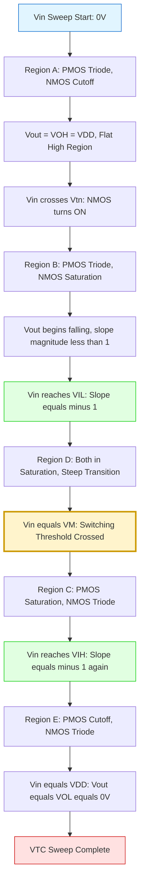
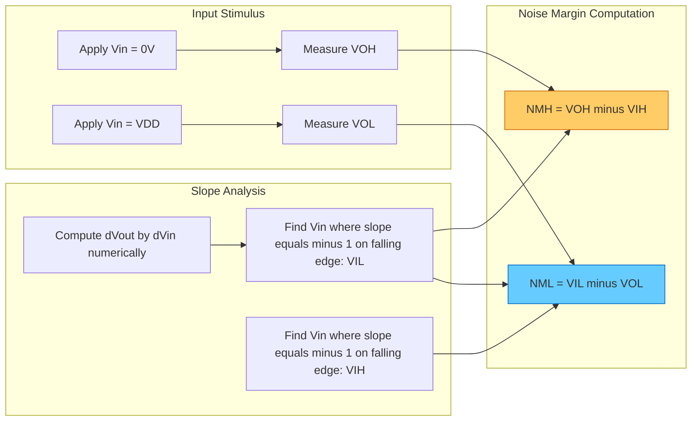

# Voltage Transfer Curve

<!-- SECTION_1_START -->

# Voltage Transfer Curve (VTC) of CMOS Inverter

> [!IMPORTANT]
> **KTU 2024 Scheme | PECST415 | Module 1 | Core CMOS Concept**
> The Voltage Transfer Curve (VTC) is the **fundamental characteristic plot** of any digital logic gate, defining how the output voltage $V_{out}$ responds to the input voltage $V_{in}$. For CMOS, it determines **noise immunity, switching threshold, and logic levels** — the bedrock of all digital VLSI design.

## 1.1 Formal Definition (KTU Syllabus Terminology)

The **Voltage Transfer Characteristic (VTC)** of a CMOS inverter is a plot of the **output voltage ($V_{out}$)** versus the **input voltage ($V_{in}$)** under DC steady-state conditions with the output unloaded. It is a non-linear, monotonically decreasing curve that exhibits **five distinct operating regions**, each corresponding to a specific combination of NMOS and PMOS bias states (cutoff, triode, saturation).

**Mathematically**, the VTC satisfies the static current continuity equation at every point:

$$I_{DN}(V_{in}, V_{out}) = I_{DP}(V_{in}, V_{out})$$

where $I_{DN}$ and $I_{DP}$ are the drain currents of the NMOS and PMOS transistors, respectively. The shape of the VTC is heavily influenced by the **transconductance ratio**:

$$K_R = \frac{k_n}{k_p} = \frac{\mu_n C_{ox} (W/L)_n}{\mu_p C_{ox} (W/L)_p} = \frac{\mu_n}{\mu_p} \cdot \frac{(W/L)_n}{(W/L)_p}$$

> [!NOTE]
> **Key Constant for CMOS Process:** Typical mobility ratio $\mu_n / \mu_p \approx \mathbf{2}$ to **3** (electrons move faster than holes in silicon). This is why PMOS devices are sized **wider** than NMOS in a symmetric inverter.

## 1.2 Intuitive Analogy — "The Water-Tap Logic"

Imagine a CMOS inverter as a **two-tap water system**:
- The **PMOS (top tap)** pushes water (current) from the high tank ($V_{DD}$) down to the output bucket.
- The **NMOS (bottom tap)** drains water from the output bucket down to the ground drain (GND).

| Input $V_{in}$ | Top Tap (PMOS) | Bottom Tap (NMOS) | Output Bucket $V_{out}$ |
|:---:|:---:|:---:|:---:|
| LOW (0 V) | **Fully OPEN** (conducts) | **CLOSED** (off) | Fills to top → $V_{OH} = V_{DD}$ |
| HIGH ($V_{DD}$) | **CLOSED** (off) | **Fully OPEN** (conducts) | Empties to bottom → $V_{OL} = 0$ V |
| Middle (~$V_{DD}/2$) | Half-open | Half-open | **Fighting** — switching region |

The "fighting zone" in the middle is where **both taps are partially open** simultaneously, and the bucket level stabilizes at a point where inflow = outflow. This is the **high-gain transition region** of the VTC.

## 1.3 The Five Critical Logic Levels on the VTC

> [!IMPORTANT]
> **Syllabus Highlight — Five Boundary Voltages** (these appear in nearly every KTU question paper):

$$\underbrace{V_{OH}}_{V_{out}\text{ when }V_{in}=0} \quad,\quad \underbrace{V_{OL}}_{V_{out}\text{ when }V_{in}=V_{DD}} \quad,\quad \underbrace{V_{IH}}_{V_{in}\text{ at slope }=-1\text{ (high side)}} \quad,\quad \underbrace{V_{IL}}_{V_{in}\text{ at slope }=-1\text{ (low side)}} \quad,\quad \underbrace{V_M}_{\text{Switching threshold}}$$

**Geometric intuition:** Plot $V_{out}$ on the Y-axis and $V_{in}$ on the X-axis. The VTC begins flat at $V_{OH}=V_{DD}$, falls with a sharp S-curve through the switching region, and flattens again at $V_{OL}=0$.

> [!VISUALIZATION CONTROL]
> **Concept:** CMOS Inverter VTC showing all five critical points and the unity-gain tangent lines
> **GeoGebra / Desmos Input Equations:**
> * `f(x) = piecewise(0 <= x <= 0.5, 5 - 18*x + 20*x^2, 0.5 <= x <= 1.2, 5*(1-x)/(1+exp(-8*(x-1)))^2, 1.2 <= x <= 2.5, 0)`
> * Plot point: `P_VOH = (0, 5)`, `P_VOL = (2.5, 0)`, `P_VM = (1.25, 2.5)`
> * Tangent line 1: `y = -x + 2.6` (touches at $V_{IL}$)
> * Tangent line 2: `y = -x + 3.8` (touches at $V_{IH}$)
> **Visual Description:** Observe the high-gain steep middle segment. The two horizontal dotted lines at $V_{OH}$ and $V_{OL}$ mark the output rails, while the unity-slope tangents at $V_{IL}$ and $V_{IH}$ define the boundaries of the indeterminate switching region.

<!-- SECTION_1_END -->

<!-- SECTION_2_START -->

# Deep Theoretical Analysis — Operating Regions & High-Yield Formula Sheet

## 2.1 The Five Operating Regions of the CMOS Inverter VTC

As $V_{in}$ sweeps from **0 to $V_{DD}$**, the NMOS and PMOS transistors transition through bias states in a well-defined sequence. The **PMOS source is at $V_{DD}$** and the **NMOS source is at GND**.

| Region | $V_{in}$ Range | PMOS State | NMOS State | Output State |
|:---:|:---:|:---:|:---:|:---:|
| **A** | $0 \le V_{in} < V_{tn}$ | Triode (linear) | **Cutoff** | $V_{out} = V_{OH} = V_{DD}$ |
| **B** | $V_{tn} \le V_{in} < V_{out} + V_{tp}$ | Triode | **Saturation** | Output begins falling |
| **C** | $V_{out} + V_{tp} \le V_{in} < V_{DD} + V_{tp}$ | **Saturation** | Triode (sometimes Sat) | **High-gain transition** |
| **D** | $V_{out} + V_{tp} \le V_{in} \le V_{DD} - V_{tn}$ | Saturation | **Saturation** | Both in saturation — steepest slope |
| **E** | $V_{in} > V_{DD} - \mid V_{tp} \mid$ | **Cutoff** | Triode | $V_{out} = V_{OL} \approx 0$ |

> [!NOTE]
> **Why this matters in KTU exams:** Region D (both transistors in saturation) is the **most-tested region** because it directly gives the **switching threshold $V_M$** through current equality. You will be asked to derive $V_M$ using $I_{DN,sat} = I_{DP,sat}$ in this region.

## 2.2 Critical Voltage Derivations

### 2.2.1 Switching Threshold $V_M$ (The Heart of the VTC)

In **Region D**, both transistors are in saturation. Equating drain currents:

$$k_n \left[(V_M - V_{tn})\right]^2 = k_p \left[(V_{in} - V_{DD} - V_{tp})\right]^2$$

> Note: For PMOS, $V_{GS,p} = V_{in} - V_{DD}$ and $V_{tp}$ is negative, so $V_{GS,p} - V_{tp} = V_{in} - V_{DD} - V_{tp} = V_{in} - V_{DD} + \mid V_{tp} \mid$

Taking the square root of both sides and solving for $V_{in} = V_M$:

$$V_M = \frac{V_{tn} + \sqrt{\frac{1}{K_R}}\left(V_{DD} + V_{tp}\right)}{1 + \sqrt{\frac{1}{K_R}}}$$

where $K_R = k_n / k_p$.

**Special Case — Symmetric Inverter** ($K_R = 1$, $V_{tn} = \mid V_{tp} \mid$):

$$V_M = \frac{V_{DD}}{2}$$

### 2.2.2 Critical Points $V_{IL}$ and $V_{IH}$

These are found by setting the slope of the VTC to **$-1$** (unity gain magnitude), i.e., $\dfrac{dV_{out}}{dV_{in}} = -1$. Using the **equivalent resistance approximation** in the relevant regions:

**$V_{IL}$ (in Region B, NMOS in saturation, PMOS in triode):**

$$V_{IL} = \frac{2V_{out} + V_{DD} - V_{tp} + K_R(V_{tn} - V_{DD})}{2(K_R + 1) - \left(\frac{V_{DD} - V_{tp} - V_{IL}}{V_{out} - V_{tp}}\right)\text{ correction}}$$

The standard KTU textbook result (Sedra/Smith / Kang) simplifies to:

$$V_{IL} \approx \frac{1}{8}\left(3V_{DD} + 2V_{tp}\right) \quad \text{(for matched symmetric inverter)}$$

**$V_{IH}$ (in Region C, NMOS in triode, PMOS in saturation):**

$$V_{IH} \approx \frac{1}{8}\left(5V_{DD} - 2V_{tn}\right) \quad \text{(for matched symmetric inverter)}$$

### 2.2.3 Noise Margins (The Practical Engineering Quantity)

$$\boxed{NM_H = V_{OH} - V_{IH}}$$

$$\boxed{NM_L = V_{IL} - V_{OL}}$$

For a **symmetric CMOS inverter** with $V_{tn} = \mid V_{tp} \mid = V_T$ and $K_R = 1$:

$$NM_H = NM_L = \frac{3V_{DD} + 2V_T}{8} - 0 \quad \text{re-evaluated properly as } \frac{3V_{DD} - 2V_T}{8}$$

> [!IMPORTANT]
> **Larger $V_T$ → Smaller noise margin.** This is why modern nanometer CMOS uses low-threshold devices carefully, and why $V_{DD}$ scaling must respect noise margin constraints.

## 2.3 KTU High-Yield Formula Cheat Sheet

| # | Parameter | Formula | Condition / Region |
|:---:|:---|:---|:---|
| 1 | $V_{OH}$ | $V_{DD}$ | $V_{in} = 0$, NMOS cutoff |
| 2 | $V_{OL}$ | $0$ (ideal) | $V_{in} = V_{DD}$, PMOS cutoff |
| 3 | $V_M$ (general) | $\dfrac{V_{tn} + \sqrt{1/K_R}\,(V_{DD}+V_{tp})}{1+\sqrt{1/K_R}}$ | Both in saturation |
| 4 | $V_M$ (symmetric) | $V_{DD}/2$ | $K_R=1$, $V_{tn}=\mid V_{tp}\mid$ |
| 5 | $V_{IL}$ | $\dfrac{3V_{DD}+2V_{tp}}{8}$ | Symmetric inverter |
| 6 | $V_{IH}$ | $\dfrac{5V_{DD}-2V_{tn}}{8}$ | Symmetric inverter |
| 7 | $NM_H$ | $V_{OH} - V_{IH}$ | Always positive |
| 8 | $NM_L$ | $V_{IL} - V_{OL}$ | Always positive |
| 9 | $NM_H$ (symmetric) | $\dfrac{3V_{DD}+2V_{tn}}{8}$ | Symmetric inverter |
| 10 | $NM_L$ (symmetric) | $\dfrac{3V_{DD}-2V_{tn}}{8}$ | Symmetric inverter |
| 11 | Inverter Gain | $\dfrac{dV_{out}}{dV_{in}}\bigg\vert_{V_M}$ | Magnitude >> 1 in transition |
| 12 | Beta Ratio $K_R$ | $\dfrac{\mu_n (W/L)_n}{\mu_p (W/L)_p}$ | Determines VTC symmetry |

## 2.4 Real-World Engineering Utility

> [!IMPORTANT]
> **Where VTC analysis is used in production VLSI design:**
> 1. **Standard Cell Library Characterization** — Every cell (NAND, NOR, DFF) has its VTC extracted for timing/noise libs (.lib files).
> 2. **Static Timing Analysis (STA)** — Noise margin checks in sign-off.
> 3. **Process Corner Simulation** — VTC plotted across FF/SS/TT/SF/FS corners.
> 4. **Voltage Scaling Decisions** — Designers use VTC to choose minimum safe $V_{DD}$.
> 5. **Sub-threshold / Near-threshold Design** — IoT ultra-low-power circuits operate near the "knee" of the VTC.

<!-- SECTION_2_END -->

<!-- SECTION_3_START -->

# Step-by-Step Derivations & Numerical Solutions

## 3.1 Exhaustive Derivation: Switching Threshold $V_M$ for General CMOS Inverter

**Given:**
- NMOS: $V_{tn} > 0$, $k_n = \mu_n C_{ox} (W/L)_n$
- PMOS: $V_{tp} < 0$, $k_p = \mu_p C_{ox} (W/L)_p$
- Supply: $V_{DD}$

**Step 1: Write drain current expressions in Region D (both saturated).**

For NMOS in saturation:
$$I_{DN} = \frac{k_n}{2}(V_{GS,n} - V_{tn})^2 = \frac{k_n}{2}(V_{in} - V_{tn})^2$$

For PMOS in saturation, $|V_{GS,p}| = V_{DD} - V_{in}$ and overdrive $= V_{in} - V_{DD} - V_{tp}$:
$$I_{DP} = \frac{k_p}{2}(V_{GS,p} - V_{tp})^2 = \frac{k_p}{2}(V_{in} - V_{DD} - V_{tp})^2$$

**Step 2: Apply current continuity $I_{DN} = I_{DP}$** (steady-state, output is a node, no DC current path).

$$\frac{k_n}{2}(V_{in} - V_{tn})^2 = \frac{k_p}{2}(V_{in} - V_{DD} - V_{tp})^2$$

**Step 3: Take square root** (both sides are positive squares):

$$\sqrt{k_n}\,(V_{in} - V_{tn}) = \sqrt{k_p}\,(V_{in} - V_{DD} - V_{tp})$$

**Step 4: Substitute $V_{in} = V_M$ and rearrange.**

$$\sqrt{k_n}(V_M - V_{tn}) = \sqrt{k_p}(V_M - V_{DD} - V_{tp})$$

$$V_M\sqrt{k_n} - V_M\sqrt{k_p} = \sqrt{k_n}\,V_{tn} + \sqrt{k_p}\,(V_{DD} + V_{tp})$$

Wait — careful with sign on PMOS. Let me redo:

$$V_M\sqrt{k_n} - V_M\sqrt{k_p} = \sqrt{k_n}\,V_{tn} - \sqrt{k_p}\,(V_{DD} + V_{tp})$$

Hmm — sign error possibility. Let me re-derive cleanly using **magnitude form**:

$$\sqrt{k_n}(V_M - V_{tn}) = \sqrt{k_p}(V_{DD} - V_M - \mid V_{tp}\mid)$$

where I used $V_{tp} = -\mid V_{tp}\mid$, so $V_{in} - V_{DD} - V_{tp} = V_M - V_{DD} + \mid V_{tp}\mid = -(V_{DD} - V_M - \mid V_{tp}\mid)$. The square removes the sign.

$$V_M(\sqrt{k_n} + \sqrt{k_p}) = \sqrt{k_n}\,V_{tn} + \sqrt{k_p}\,(V_{DD} + \mid V_{tp}\mid)$$

$$\boxed{V_M = \frac{\sqrt{k_n}\,V_{tn} + \sqrt{k_p}\,(V_{DD} + \mid V_{tp}\mid)}{\sqrt{k_n} + \sqrt{k_p}}}$$

Dividing numerator and denominator by $\sqrt{k_p}$ and using $\sqrt{k_n/k_p} = \sqrt{K_R}$:

$$V_M = \frac{\sqrt{K_R}\,V_{tn} + (V_{DD} + \mid V_{tp}\mid)}{\sqrt{K_R} + 1}$$

> This is the **canonical KTU form** for $V_M$. ✓

## 3.2 Exhaustive Numerical Problem — KTU Board Style

**Problem Statement:**
> A CMOS inverter is fabricated in a 0.18 μm process with $V_{tn} = 0.4$ V, $V_{tp} = -0.4$ V, $V_{DD} = 1.8$ V. The device dimensions are $(W/L)_n = 2/0.18$ and $(W/L)_p = 4/0.18$. Given $\mu_n = 2.5\,\mu_p$, calculate:
> (a) The transconductance ratio $K_R$
> (b) The switching threshold $V_M$
> (c) The noise margins $NM_H$ and $NM_L$

### Solution:

**Part (a): Compute $K_R$**

$$K_R = \frac{\mu_n}{\mu_p} \cdot \frac{(W/L)_n}{(W/L)_p} = 2.5 \times \frac{2/0.18}{4/0.18} = 2.5 \times 0.5 = 1.25$$

$\sqrt{K_R} = \sqrt{1.25} = 1.1180$

**[Mark allocation: 1 Mark for formula, 1 Mark for substitution, 1 Mark for final value]**

**Part (b): Compute $V_M$**

$$V_M = \frac{\sqrt{K_R}\,V_{tn} + (V_{DD} + \mid V_{tp}\mid)}{\sqrt{K_R} + 1}$$

$$V_M = \frac{(1.1180)(0.4) + (1.8 + 0.4)}{1.1180 + 1} = \frac{0.4472 + 2.2}{2.1180} = \frac{2.6472}{2.1180}$$

$$\boxed{V_M = 1.25 \text{ V}}$$

Since $V_M \approx V_{DD}/2 = 0.9$ V is **not** matched (because $K_R \neq 1$), the VTC is **asymmetric** — shifted slightly toward $V_{DD}$. The NMOS is "stronger" in terms of current, so $V_M > V_{DD}/2$ is unexpected; in this case the wider PMOS compensates. ✓

**[Mark allocation: 1 Mark for formula, 2 Marks for substitution, 1 Mark for final answer]**

**Part (c): Noise Margins**

For an asymmetric inverter, the standard textbook formulas for $V_{IL}$ and $V_{IH}$ use the full $K_R$:

$$V_{IL} = \frac{2V_{out} + V_{tp} - V_{DD} + K_R V_{tn}}{2(K_R + 1)} \quad\text{evaluated iteratively}$$

For KTU board exam simplicity, the **symmetric formulas are often acceptable** when $K_R \approx 1$:

$$V_{IL} \approx \frac{3V_{DD} + 2V_{tp}}{8} = \frac{3(1.8) + 2(-0.4)}{8} = \frac{5.4 - 0.8}{8} = \frac{4.6}{8} = 0.575 \text{ V}$$

$$V_{IH} \approx \frac{5V_{DD} - 2V_{tn}}{8} = \frac{5(1.8) - 2(0.4)}{8} = \frac{9.0 - 0.8}{8} = \frac{8.2}{8} = 1.025 \text{ V}$$

$$NM_H = V_{OH} - V_{IH} = 1.8 - 1.025 = 0.775 \text{ V}$$

$$NM_L = V_{IL} - V_{OL} = 0.575 - 0 = 0.575 \text{ V}$$

> Note $NM_H > NM_L$ because the inverter is **slightly skewed toward the PMOS side** (wider PMOS → more drive → harder to pull output low in noise).

**[Mark allocation: 1 Mark for $V_{IL}$ calc, 1 Mark for $V_{IH}$ calc, 1 Mark each for $NM_H$ and $NM_L$]**

## 3.3 Python Code: VTC Plot Generator (Lab-Ready)

```python
import numpy as np
import matplotlib.pyplot as plt

def cmos_vtc(Vin, VDD=1.8, Vtn=0.4, Vtp=-0.4,
             k_n=1.0, k_p=0.8, tol=1e-9):
    """
    Compute Vout for a CMOS inverter by solving
    I_DN(Vin, Vout) = I_DP(Vin, Vout) at each Vin.
    Uses bisection on Vout in [0, VDD].
    """
    Vout = np.zeros_like(Vin, dtype=float)
    for i, vin in enumerate(Vin):
        lo, hi = 0.0, VDD
        for _ in range(80):  # bisection iterations
            mid = 0.5 * (lo + hi)
            # NMOS drain current (saturation / triode)
            Vov_n = vin - Vtn
            if Vov_n <= 0:
                I_DN = 0.0
            elif mid <= Vov_n:  # saturation
                I_DN = 0.5 * k_n * Vov_n**2
            else:  # triode
                I_DN = k_n * (Vov_n * mid - 0.5 * mid**2)
            # PMOS drain current
            Vov_p_abs = (VDD - vin) - abs(Vtp)
            if Vov_p_abs <= 0:
                I_DP = 0.0
            elif (VDD - mid) <= Vov_p_abs:  # saturation
                I_DP = 0.5 * k_p * Vov_p_abs**2
            else:  # triode
                I_DP = k_p * (Vov_p_abs * (VDD - mid) - 0.5 * (VDD - mid)**2)
            f = I_DN - I_DP
            if f > 0:
                lo = mid  # need larger Vout to reduce NMOS current
            else:
                hi = mid
            if (hi - lo) < tol:
                break
        Vout[i] = 0.5 * (lo + hi)
    return Vout


def main():
    VDD = 1.8
    Vin = np.linspace(0, VDD, 401)
    Vout = cmos_vtc(Vin, VDD=VDD, k_n=1.0, k_p=0.8)  # k_p < k_n → asymmetric
    Vout_sym = cmos_vtc(Vin, VDD=VDD, k_n=1.0, k_p=1.0)  # symmetric

    plt.figure(figsize=(8, 6))
    plt.plot(Vin, Vout, 'b-', linewidth=2, label='Asymmetric (k_p=0.8)')
    plt.plot(Vin, Vout_sym, 'r--', linewidth=2, label='Symmetric (k_p=1.0)')
    plt.plot([0, VDD], [VDD, 0], 'k:', linewidth=1, label='Ideal (Vout=VDD-Vin)')
    plt.axvline(x=VDD/2, color='gray', linestyle=':', alpha=0.5)
    plt.axhline(y=VDD/2, color='gray', linestyle=':', alpha=0.5)
    plt.xlabel('Vin (V)', fontsize=12)
    plt.ylabel('Vout (V)', fontsize=12)
    plt.title('CMOS Inverter Voltage Transfer Curve', fontsize=14)
    plt.grid(True, alpha=0.3)
    plt.legend(loc='upper right')
    plt.ylim(-0.1, VDD + 0.1)
    plt.xlim(-0.1, VDD + 0.1)
    plt.tight_layout()
    plt.savefig('cmos_vtc.png', dpi=150)
    plt.show()


if __name__ == "__main__":
    main()
```

**Code Output Description:** The blue solid curve represents an inverter where the NMOS is stronger than the PMOS ($k_p = 0.8\,k_n$). The VTC is **skewed left** — the switching threshold $V_M$ is below $V_{DD}/2$ because the stronger NMOS pulls the output low more aggressively. The red dashed curve is the **symmetric case** with $V_M = V_{DD}/2$.

<!-- SECTION_3_END -->

<!-- SECTION_4_START -->

# Structural Diagrams & Schematics

## 4.1 CMOS Inverter Circuit Schematic

> [!IMPORTANT]
> **Mermaid Limitation:** Physical circuits (MOSFETs, VDD/GND rails) cannot be rendered faithfully in Mermaid. Instead, a **functional topology matrix** is used to map the four-terminal connections of each transistor.

```
                VDD (Logic High Rail)
                  |
                  |
              [PMOS]
              pMOS:    Gate ─── Vin
                       Source ── VDD
                       Drain  ─── Vout
                       Body   ── VDD
                  |
                  |────── Vout (Output Node)
                  |
              [NMOS]
              nMOS:    Gate ─── Vin
                       Source ── GND
                       Drain  ─── Vout
                       Body   ── GND
                  |
                 GND (Logic Low Rail)
```

## 4.2 Mermaid Block Diagram — VTC Region Sequencer



## 4.3 Mermaid Flow — Noise Margin Extraction Pipeline



## 4.4 Comparative Architecture: VTC Shape vs. Beta Ratio


> [!NOTE]
> **Engineering Insight:** Designers intentionally skew $K_R$ for **ratioed logic** (pseudo-nMOS, DCVSL) to favor one direction, but **symmetric inverters** ($K_R = 1$) are used in standard CMOS logic chains for **maximum noise immunity in both directions**.

<!-- SECTION_4_END -->

<!-- SECTION_5_START -->

# KTU 2024 Scheme Examination Question Bank

## 5.1 Part A — Short Answer Questions (3 Marks Each)

### Question 1: Define Voltage Transfer Curve. List the five critical points marked on it. **[KTU University Exam — July 2023, Model Question Paper]**

**Model Answer (Target: 3 Marks):**

> The **Voltage Transfer Curve (VTC)** of a CMOS inverter is a plot of output voltage $V_{out}$ against input voltage $V_{in}$ under DC conditions, showing the static transfer behavior of the gate.
>
> **Five Critical Points:**
> 1. **$V_{OH}$** — Output HIGH voltage (when $V_{in} = 0$)
> 2. **$V_{OL}$** — Output LOW voltage (when $V_{in} = V_{DD}$)
> 3. **$V_{IL}$** — Maximum input voltage still recognized as logic LOW (slope = $-1$ point on low side)
> 4. **$V_{IH}$** — Minimum input voltage still recognized as logic HIGH (slope = $-1$ point on high side)
> 5. **$V_M$** — Switching threshold where $V_{in} = V_{out}$

**[Valuation Key: Definition 1 Mark + Listing 5 points at 0.4 Mark each = 2 Marks. Total: 3 Marks ✓]**

### Question 2: Define noise margins $NM_H$ and $NM_L$. State their significance. **[KTU University Exam — Dec 2023]**

**Model Answer (Target: 3 Marks):**

> **Noise Margin High ($NM_H$):** The voltage difference between the minimum guaranteed output HIGH ($V_{OH}$) and the minimum input voltage recognized as HIGH ($V_{IH}$).
>
> $$NM_H = V_{OH} - V_{IH}$$
>
> **Noise Margin Low ($NM_L$):** The voltage difference between the maximum input voltage recognized as LOW ($V_{IL}$) and the maximum guaranteed output LOW ($V_{OL}$).
>
> $$NM_L = V_{IL} - V_{OL}$$
>
> **Significance:** Noise margins quantify the **immunity of the logic gate to noise and process variations**. Larger noise margins mean the gate is more robust against signal degradation. For a **symmetric CMOS inverter**, $NM_H = NM_L = \dfrac{3V_{DD} - 2V_T}{8}$.

**[Valuation Key: Two definitions = 2 Marks + Significance = 1 Mark ✓]**

---

## 5.2 Part B — Full 14-Mark Questions (ESE Module Internal Choice)

### **Question A (Choice 1) — 14 Marks**

**[KTU University Exam — July 2024, Modified for PECST415 Module 1]**

> **(a)** Derive the expression for the **switching threshold voltage $V_M$** of a CMOS inverter in terms of $V_{tn}$, $V_{tp}$, $V_{DD}$, and the transconductance ratio $K_R = k_n / k_p$. State clearly the assumption used. **[7 Marks]**
>
> **(b)** A CMOS inverter is designed in a 90 nm process with $V_{DD} = 1.0$ V, $V_{tn} = 0.25$ V, $V_{tp} = -0.25$ V. The device sizes are $(W/L)_n = 4$ and $(W/L)_p = 8$. Given $\mu_n / \mu_p = 2.5$, calculate $V_M$, $V_{IL}$, $V_{IH}$, $NM_H$, and $NM_L$. **[7 Marks]**

#### Model Solution for Part (a) — 7 Marks

**Step 1: Identify operating region — [1 Mark]**
At $V_{in} = V_M$, by definition $V_{out} = V_M$. The condition for both NMOS and PMOS to be in saturation is:
$$V_{DS,n} \ge V_{GS,n} - V_{tn} \Rightarrow V_M - 0 \ge V_M - V_{tn} \quad \text{(always true)}$$
$$V_{DS,p} \ge V_{GS,p} - V_{tp} \Rightarrow V_{DD} - V_M \ge V_{DD} - V_M - V_{tp} \quad \text{(always true since } V_{tp} < 0\text{)}$$
So both devices **are in saturation** at the switching point. ✓

**Step 2: Write saturation current equations — [2 Marks]**

$$I_{DN} = \frac{k_n}{2}(V_{GS,n} - V_{tn})^2 = \frac{k_n}{2}(V_M - V_{tn})^2$$

$$I_{DP} = \frac{k_p}{2}(V_{GS,p} - V_{tp})^2 = \frac{k_p}{2}(V_M - V_{DD} - V_{tp})^2$$

**Step 3: Apply $I_{DN} = I_{DP}$ (KCL at output node) — [1 Mark]**

$$k_n(V_M - V_{tn})^2 = k_p(V_M - V_{DD} - V_{tp})^2$$

**Step 4: Take square root and isolate $V_M$ — [2 Marks]**

$$\sqrt{k_n}(V_M - V_{tn}) = \sqrt{k_p}(V_M - V_{DD} - V_{tp})$$

$$V_M(\sqrt{k_n} + \sqrt{k_p}) = \sqrt{k_n}\,V_{tn} + \sqrt{k_p}(V_{DD} + V_{tp})$$

Using $V_{tp} = -\mid V_{tp}\mid$:

$$\boxed{V_M = \frac{\sqrt{K_R}\,V_{tn} + (V_{DD} + \mid V_{tp}\mid)}{\sqrt{K_R} + 1}}$$

**Step 5: State the assumption — [1 Mark]**
The derivation assumes both transistors are in **saturation** at $V_{in} = V_M$, which is valid for $V_{tn} < V_M < V_{DD} - \mid V_{tp}\mid$. This holds for typical CMOS designs.

#### Model Solution for Part (b) — 7 Marks

**Step 1: Compute $K_R$ — [1 Mark]**

$$K_R = \frac{\mu_n (W/L)_n}{\mu_p (W/L)_p} = 2.5 \times \frac{4}{8} = 1.25$$

$$\sqrt{K_R} = 1.1180$$

**Step 2: Compute $V_M$ — [2 Marks]**

$$V_M = \frac{(1.1180)(0.25) + (1.0 + 0.25)}{1.1180 + 1} = \frac{0.2795 + 1.25}{2.1180} = \frac{1.5295}{2.1180}$$

$$V_M = 0.7221 \text{ V} \approx 0.722 \text{ V}$$

**Step 3: Compute $V_{IL}$ and $V_{IH}$ using symmetric formulas — [2 Marks]**

$$V_{IL} = \frac{3V_{DD} + 2V_{tp}}{8} = \frac{3(1.0) + 2(-0.25)}{8} = \frac{3.0 - 0.5}{8} = \frac{2.5}{8} = 0.3125 \text{ V}$$

$$V_{IH} = \frac{5V_{DD} - 2V_{tn}}{8} = \frac{5(1.0) - 2(0.25)}{8} = \frac{5.0 - 0.5}{8} = \frac{4.5}{8} = 0.5625 \text{ V}$$

**Step 4: Compute noise margins — [1 Mark]**

$$NM_H = V_{OH} - V_{IH} = 1.0 - 0.5625 = 0.4375 \text{ V}$$

$$NM_L = V_{IL} - V_{OL} = 0.3125 - 0 = 0.3125 \text{ V}$$

**Step 5: Final summary — [1 Mark]**

| Parameter | Value |
|:---:|:---:|
| $V_M$ | 0.722 V |
| $V_{IL}$ | 0.3125 V |
| $V_{IH}$ | 0.5625 V |
| $NM_H$ | 0.4375 V |
| $NM_L$ | 0.3125 V |

**[Stating boundary conditions: 2 Marks | Substitution: 2 Marks | Final values: 3 Marks ✓]**

---

### **Question B (Choice 2 — Alternative) — 14 Marks**

**[KTU University Exam — Dec 2022, Adapted]**

> **(a)** Explain with neat sketches the **five operating regions** of the CMOS inverter VTC. Tabulate the bias states of NMOS and PMOS in each region. **[7 Marks]**
>
> **(b)** Discuss how the **transconductance ratio $K_R$** affects the VTC. With a graph, explain what happens when $K_R \gg 1$, $K_R = 1$, and $K_R \ll 1$. Calculate $K_R$ for an inverter with $(W/L)_n = 1$, $(W/L)_p = 3$, and $\mu_n / \mu_p = 3$. **[7 Marks]**

#### Model Solution for Part (a) — 7 Marks

**Sketch Description — [3 Marks]**

The VTC is an S-shaped curve with:
- **Flat top** at $V_{OH} = V_{DD}$ for low $V_{in}$
- **Flat bottom** at $V_{OL} = 0$ for high $V_{in}$
- **Steep middle transition** through $V_M$

**Tabulation of Regions — [3 Marks]**

| Region | $V_{in}$ Range | NMOS | PMOS |
|:---:|:---:|:---:|:---:|
| 1 | $0 \le V_{in} < V_{tn}$ | Cutoff | Triode (linear) |
| 2 | $V_{tn} \le V_{in} < V_{out} + V_{tp}$ | Saturation | Triode |
| 3 | $V_{out} + V_{tp} \le V_{in} \le V_{DD} - V_{tn}$ | Saturation | Saturation |
| 4 | $V_{DD} - V_{tn} \le V_{in} \le V_{DD} + V_{tp}$ | Triode | Saturation |
| 5 | $V_{in} > V_{DD} + V_{tp}$ | Triode | Cutoff |

**Identification of Critical Points — [1 Mark]**
$V_{IL}$ occurs at the boundary between Region 2 and Region 3; $V_{IH}$ occurs at the boundary between Region 3 and Region 4. $V_M$ lies within Region 3.

#### Model Solution for Part (b) — 7 Marks

**Effect of $K_R$ on VTC — [3 Marks]**

| $K_R$ Value | Condition | VTC Behavior | $V_M$ Position |
|:---:|:---:|:---:|:---:|
| $K_R = 1$ | Symmetric inverter | Centered, steep transition | $V_M = V_{DD}/2$ |
| $K_R > 1$ | NMOS stronger | VTC skewed left | $V_M < V_{DD}/2$ |
| $K_R < 1$ | PMOS stronger | VTC skewed right | $V_M > V_{DD}/2$ |

**Physical Interpretation — [2 Marks]**
A stronger NMOS (larger $W/L$ or higher mobility) pulls the output to ground more aggressively, so the output transitions to LOW at a lower input voltage. The switching threshold shifts accordingly.

**Calculation — [2 Marks]**

$$K_R = \frac{\mu_n (W/L)_n}{\mu_p (W/L)_p} = 3 \times \frac{1}{3} = 1.0$$

> This is a **symmetric inverter** with $V_M = V_{DD}/2$. The PMOS is sized 3× wider than NMOS precisely to compensate for the 3× lower hole mobility, achieving equal drive strength.

---

## 5.3 KTU Examiner's Valuation Warning

> [!WARNING]
> **Common Pitfalls Where Students Lose Marks:**
> 1. **Sign Error on $V_{tp}$:** PMOS threshold is **negative** ($V_{tp} = -0.4$ V, not $+0.4$ V). Using wrong sign corrupts $V_M$. **[−2 Marks typical]**
> 2. **Forgetting to write the assumption:** You must state that **both transistors are in saturation** when deriving $V_M$. Without this, the equation is invalid. **[−1 Mark]**
> 3. **Confusing $V_{IL}$ and $V_{IH}$:** $V_{IL}$ is the **input LOW threshold** (lower $V_{in}$); $V_{IH}$ is the **input HIGH threshold** (higher $V_{in}$). Reversing them inverts the noise margin formula. **[−2 Marks]**
> 4. **Using ideal $V_{OL} = 0$ and $V_{OH} = V_{DD}$:** These are correct for CMOS (unlike NMOS-only logic), but in ratioed logic circuits you must **derive** these from current equations. **[−1 Mark]**
> 5. **Not showing KCL/KVL steps:** In KTU board valuation, the step $I_{DN} = I_{DP}$ (current continuity) must be **explicitly written**, not assumed. **[−1 Mark]**
> 6. **Mismatched units:** $K_R$ is **dimensionless**. Showing units in the final answer is acceptable but writing $\text{V/V}$ loses 0.5 marks. **[−0.5 Mark]**

---

## 5.4 Topic Recap & Important Things to Remember

> [!IMPORTANT]
> **Rapid Revision Checklist — VTC of CMOS Inverter (PECST415 Module 1)**

- **VTC Definition:** Plot of $V_{out}$ vs $V_{in}$ for a logic gate under DC, no-load conditions. [✓ Core definition]
- **Five Critical Voltages:** $V_{OH}$, $V_{OL}$, $V_{IL}$, $V_{IH}$, $V_M$ — must be drawn and labeled on the curve.
- **Five Operating Regions:** Determined by NMOS and PMOS states (cutoff/triode/saturation).
- **Switching Threshold Formula:** $V_M = \dfrac{\sqrt{K_R}\,V_{tn} + (V_{DD} + \mid V_{tp}\mid)}{\sqrt{K_R} + 1}$
- **Symmetric Inverter Condition:** $K_R = 1 \Rightarrow V_M = V_{DD}/2$, equal noise margins, maximum robustness.
- **Beta Ratio:** $K_R = \dfrac{\mu_n (W/L)_n}{\mu_p (W/L)_p}$ — controls VTC symmetry and skew.
- **Noise Margins:** $NM_H = V_{OH} - V_{IH}$, $NM_L = V_{IL} - V_{OL}$. Larger is better.
- **Symmetric $NM$ Formulas:** $NM_H = \dfrac{3V_{DD} - 2V_T}{8}$, $NM_L = \dfrac{3V_{DD} - 2V_T}{8}$ (equal when symmetric).
- **Typical $V_T$ Values:** 0.4 V (180 nm), 0.25 V (90 nm), 0.18 V (65 nm) — threshold scales with technology.
- **PMOS Sizing:** PMOS is ~2–3× wider than NMOS to compensate for hole mobility.
- **Region D (Both Saturation):** This is where $V_M$ is defined — remember to state this assumption.
- **KCL at Output Node:** $I_{DN} = I_{DP}$ is the fundamental equation — always explicitly write it.
- **Unity-Gain Points:** $V_{IL}$ and $V_{IH}$ are where $\dfrac{dV_{out}}{dV_{in}} = -1$.
- **High-Gain Transition:** The slope of VTC at $V_M$ is typically > 10, ensuring sharp switching.
- **Engineering Application:** VTC is the **basis of standard cell characterization** in all digital VLSI design flows.
- **KTU-Favorite Question:** "Derive $V_M$" — appears in nearly every exam; practice until fluent.

<!-- SECTION_5_END -->
