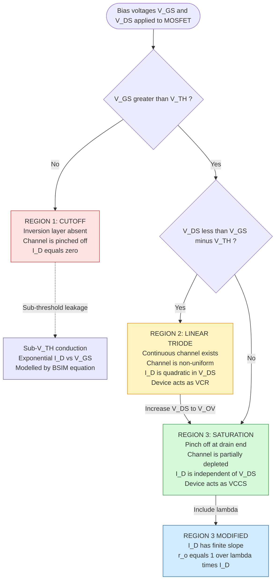
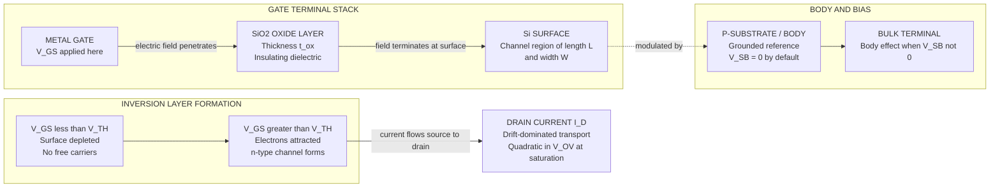
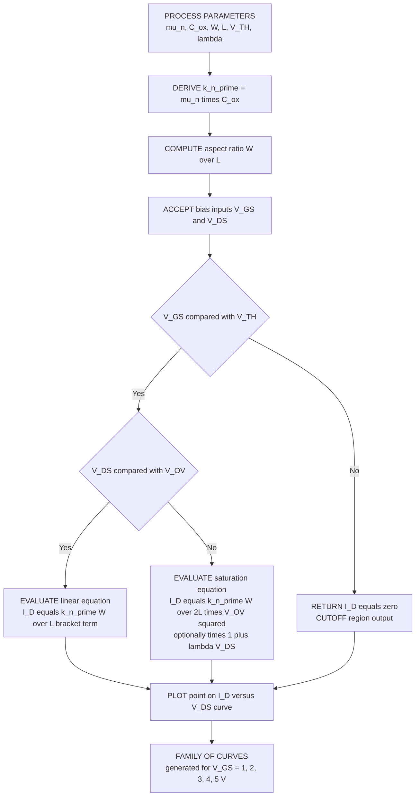

# MOS device IV characteristics: Linear and saturation regions

<!-- SECTION_1_START -->

# MOS Transistor IV Characteristics — Linear and Saturation Regions

> [!IMPORTANT]
> **KTU 2024 Scheme Focus (PECST415 — VLSI Design, Module 1):** This topic is a **board-favourite** and appears almost every semester in Part A (definition based) and Part B (derivation + numerical) formats. Mastering the three operating regions is mandatory for understanding CMOS inverter switching, analog biasing, and digital cell design.

---

## 1.1 Formal Academic Definition

The **Metal-Oxide-Semiconductor Field-Effect Transistor (MOSFET)** is a four-terminal voltage-controlled device whose **drain current ($I_D$)** is a **non-linear function** of the **gate-to-source voltage ($V_{GS}$)** and the **drain-to-source voltage ($V_{DS}$)**. The static input-output relationship, denoted as the **$I_D$–$V_{DS}$ characteristic curve**, is the cornerstone of every analog and digital VLSI circuit. Depending on the bias conditions, the device operates in one of three discrete regions — **Cutoff (Sub-threshold)**, **Linear (Triode/Ohmic)**, or **Saturation (Active)** — each governed by a distinct analytical current equation.

> [!NOTE]
> **KTU Standard Nomenclature (must be reproduced verbatim in answers):**
> - $V_{TH}$ → Threshold voltage (typically **0.4 V to 0.7 V** for modern 180 nm–65 nm CMOS)
> - $V_{OV} = V_{GS} - V_{TH}$ → **Overdrive voltage** (also called effective voltage or $V_{eff}$)
> - $V_{DS,sat} = V_{OV}$ → **Saturation voltage** (the boundary between linear and saturation)
> - $\mu_n C_{ox}$ → **Process transconductance parameter** (units: A/V²)
> - $k_n' = \mu_n C_{ox}$ and $k_n = k_n' \cdot (W/L)$ → **device transconductance**

---

## 1.2 Intuitive Analogy — The "Smart Water Tap"

Imagine a **pressurised water tap** mounted on a pipeline:

- The **water pressure source (drain)** pushes water towards the **drain (sink)** through a thin pipe (the **semiconductor channel**).
- The **rotating knob (gate)** is insulated by a **rubber gasket (oxide)** — your finger never touches the water, but as you rotate it, the pipe **widens** and more water flows.
- When the knob rotation is **below a minimum** (i.e., $V_{GS} < V_{TH}$), the pipe is **fully pinched shut** — **no water flows** → this is the **Cutoff Region**.
- As you rotate more, the pipe **partially opens** — the flow is now controlled and **proportional** to both knob rotation AND the pressure difference between the two ends → this is the **Linear (Triode) Region**, where the device behaves like a **voltage-controlled resistor**.
- If you rotate the knob fully and the water pressure becomes very high, the pipe becomes **completely open** and the flow **saturates** — increasing pressure further does **not** increase the flow because the pipe cross-section is the limit → this is the **Saturation Region**, where the device behaves like a **current source**.

> [!TIP]
> **Board Tip:** When explaining MOSFETs in viva or short answers, the "**smart tap**" analogy instantly conveys the **voltage-controlled** nature and the three operating modes. Examiners appreciate conceptual clarity in Part A.

---

## 1.3 Visualisation Control Block

> [!VISUALIZATION CONTROL]
> **Concept:** Family of $I_D$–$V_{DS}$ curves of an n-channel MOSFET for varying $V_{GS}$.
> **GeoGebra / Desmos Input Equations (for $V_{TH} = 1$ V, $k_n' (W/L) = 1$ mA/V²):**
> * Linear: $I_D(V_{DS}) = (V_{GS} - 1) \cdot V_{DS} - 0.5 \cdot V_{DS}^{2}$ for $V_{DS} < (V_{GS} - 1)$
> * Saturation: $I_D = 0.5 \cdot (V_{GS} - 1)^{2}$ for $V_{DS} \geq (V_{GS} - 1)$
> * Plot for $V_{GS} = 2, 3, 4, 5$ V with $V_{DS}$ on x-axis (0 to 6 V) and $I_D$ on y-axis.
> **Visual Description:** You will see a family of curves that rise **linearly** near the origin (slope = $V_{OV}$), then bend and **flatten** into horizontal lines as $V_{DS}$ crosses $V_{OV}$. The "knee" of each curve lies exactly at the point $V_{DS} = V_{GS} - V_{TH}$. Higher $V_{GS}$ shifts the knee rightward and lifts the saturation plateau.

---

## 1.4 Key Physical Constants & Standard Metrics

| Symbol | Parameter | Typical Magnitude (180 nm node) | Unit |
|:------:|:----------|:-------------------------------|:----:|
| $V_{TH}$ | Threshold voltage | **0.4 – 0.5** | V |
| $\mu_n$ | Electron surface mobility | **450 – 600** | $\text{cm}^{2}/(\text{V} \cdot \text{s})$ |
| $\mu_p$ | Hole surface mobility | **150 – 200** | $\text{cm}^{2}/(\text{V} \cdot \text{s})$ |
| $C_{ox}$ | Gate oxide capacitance per unit area | $\approx 8.5 \times 10^{-7}$ | $\text{F}/\text{cm}^{2}$ |
| $t_{ox}$ | Gate oxide thickness | **4 – 10** | nm |
| $\lambda$ | Channel-length modulation | **0.05 – 0.2** | $\text{V}^{-1}$ |

> [!IMPORTANT]
> Always quote the **process transconductance $k_n' = \mu_n C_{ox}$** (typically 100 – 200 $\mu\text{A}/\text{V}^{2}$ for older nodes, dropping with scaling) when solving numerical problems. This is the most often missed constant in KTU answers.

---

<!-- SECTION_1_END -->

<!-- SECTION_2_START -->

# Deep Theoretical Analysis — The Three Operating Regions

## 2.1 Physical Foundation — How the Channel Forms

When a positive voltage $V_{GS}$ is applied to the gate of an **nMOS** transistor (with source and body grounded):

1. The **gate-oxide-semiconductor** stack forms a parallel-plate capacitor with the **gate** as the top plate, the **oxide** ($\text{SiO}_2$) as the dielectric, and the **silicon surface** as the bottom plate.
2. For $V_{GS} < V_{TH}$, the silicon surface is either depleted or weakly inverted — **no conducting channel exists**, so $I_D = 0$.
3. At $V_{GS} = V_{TH}$, the surface inverts, creating a thin sheet of mobile electrons. This is the **onset of strong inversion**.
4. For $V_{GS} > V_{TH}$, an **inversion layer (channel)** of mobile electrons forms at the $\text{Si}-\text{SiO}_2$ interface. The **inversion charge per unit area** is given by:
$$Q_n(x) = -C_{ox} \cdot \left[ V_{GS} - V_{TH} - V(x) \right]$$
where $V(x)$ is the **local channel potential** measured from the source (i.e., $V(0) = 0$ at the source end and $V(L) = V_{DS}$ at the drain end).

> [!NOTE]
> The negative sign on $Q_n$ indicates electrons (n-type). For a **pMOS** transistor, the inversion charge is **positive** (holes), and all currents reverse direction.

---

## 2.2 Region-by-Region Logical Breakdown

### **Region 1 — Cutoff (Sub-threshold)**
- **Condition:** $V_{GS} \leq V_{TH}$
- **Channel status:** No inversion layer; the surface is depleted.
- **Current equation:** $I_D = 0$ (idealised; in reality, a tiny sub-threshold leakage current flows, modelled as $I_D = I_0 e^{(V_{GS}-V_{TH})/(nV_T)}$)
- **Physical meaning:** The "smart tap" is fully closed.

### **Region 2 — Linear / Triode / Ohmic Region**
- **Condition:** $V_{GS} > V_{TH}$ **and** $0 \leq V_{DS} < V_{GS} - V_{TH} = V_{OV}$
- **Channel status:** A continuous, fully-formed inversion layer connects source to drain. The channel has **non-uniform depth** (thicker at source, thinner at drain).
- **Current equation** (with no channel-length modulation):
$$I_D = \mu_n C_{ox} \cdot \frac{W}{L} \cdot \left[ \left(V_{GS} - V_{TH}\right) V_{DS} - \frac{V_{DS}^{2}}{2} \right]$$
- **Effective resistance (for small $V_{DS}$):**
$$R_{on} \approx \frac{1}{\mu_n C_{ox} \cdot (W/L) \cdot (V_{GS} - V_{TH})}$$
- **Physical meaning:** The "smart tap" is partially open; the device behaves as a **voltage-controlled resistor (VCR)** whose resistance is set by $V_{GS}$.

### **Region 3 — Saturation (Active / Pinch-off) Region**
- **Condition:** $V_{GS} > V_{TH}$ **and** $V_{DS} \geq V_{GS} - V_{TH} = V_{OV}$
- **Channel status:** At $V_{DS} = V_{OV}$, the **inversion charge at the drain end reduces to zero** — this point is called the **pinch-off point**. For $V_{DS} > V_{OV}$, the pinch-off point moves slightly toward the source, defining an **effective channel length** $L_{eff} = L - \Delta L$.
- **Current equation (ideal, no $\lambda$):**
$$I_D = \frac{1}{2} \cdot \mu_n C_{ox} \cdot \frac{W}{L} \cdot \left(V_{GS} - V_{TH}\right)^{2}$$
- **With channel-length modulation (advanced model — KTU 2024 expects this in Part B):**
$$I_D = \frac{1}{2} \cdot \mu_n C_{ox} \cdot \frac{W}{L} \cdot \left(V_{GS} - V_{TH}\right)^{2} \cdot \left(1 + \lambda \cdot V_{DS}\right)$$
- **Physical meaning:** The "smart tap" is fully open; the device behaves as a **voltage-controlled current source (VCCS)** whose current depends only on $V_{GS}$ (not $V_{DS}$).

---

## 2.3 KTU Formula Cheat Sheet — The High-Yield Equation Set

| # | Region | Bias Condition | Drain Current Equation $I_D$ | Equivalent Circuit |
|:-:|:------:|:--------------:|:-----------------------------|:-------------------|
| 1 | **Cutoff** | $V_{GS} \leq V_{TH}$ | $I_D = 0$ | Open switch |
| 2 | **Linear (Triode)** | $V_{GS} > V_{TH}$ and $V_{DS} < V_{OV}$ | $I_D = k_n' \cdot \dfrac{W}{L} \cdot \left[ V_{OV} \cdot V_{DS} - \dfrac{V_{DS}^{2}}{2} \right]$ | VCR: $R_{on} = \dfrac{1}{k_n' (W/L) V_{OV}}$ |
| 3 | **Linear (small $V_{DS}$ approx.)** | $V_{DS} \ll V_{OV}$ | $I_D \approx k_n' \cdot \dfrac{W}{L} \cdot V_{OV} \cdot V_{DS}$ | Linear resistor |
| 4 | **Saturation (ideal)** | $V_{GS} > V_{TH}$ and $V_{DS} \geq V_{OV}$ | $I_D = \dfrac{k_n'}{2} \cdot \dfrac{W}{L} \cdot V_{OV}^{2}$ | Ideal current source |
| 5 | **Saturation (with $\lambda$)** | $V_{GS} > V_{TH}$ and $V_{DS} \geq V_{OV}$ | $I_D = \dfrac{k_n'}{2} \cdot \dfrac{W}{L} \cdot V_{OV}^{2} \cdot (1 + \lambda V_{DS})$ | Non-ideal current source |
| 6 | **Saturation Voltage** | Boundary | $V_{DS,sat} = V_{GS} - V_{TH} = V_{OV}$ | Knee point on $I_D$–$V_{DS}$ curve |
| 7 | **Output Resistance** | Saturation | $r_o = \dfrac{1}{\lambda \cdot I_D}$ | Finite output resistance |
| 8 | **Transconductance** | Saturation | $g_m = k_n' \cdot \dfrac{W}{L} \cdot V_{OV} = \sqrt{2 k_n' (W/L) I_D}$ | Small-signal gain parameter |

> [!WARNING]
> **Markdown Table Escape Rule:** The vertical bar $\vert$ (as in $\vert V_{GS} \vert$) is rendered as `\vert` in LaTeX to prevent breaking the table parser. This rule is enforced throughout the KTU answer sheets as well.

---

## 2.4 Real-World Engineering Utility

1. **Digital CMOS Design:** The **linear region** is used in **transmission gates** and **pass-transistor logic**, where the MOSFET acts as a switch and you need a low $R_{on}$.
2. **Analog CMOS Design:** The **saturation region** is the workhorse of all analog circuits — **common-source amplifiers**, **differential pairs**, **current mirrors**, and **operational transconductance amplifiers (OTAs)** all bias the transistor in saturation to exploit the $g_m$ and $r_o$ parameters.
3. **Memory Design:** **DRAM storage capacitors** and **SRAM load devices** rely on precise control of the sub-threshold leakage current (cutoff region) for data retention.
4. **Power Electronics:** Understanding the **linear region** is critical for **LDO regulators** and **smart power stages** where the MOSFET operates in the **triode region** as a low-dropout element.
5. **RF Design:** The **cutoff frequency** $f_T = g_m / (2\pi C_{gg})$ depends on the bias region — designers use the **saturation region** to maximise $g_m$ for high-frequency operation.

---

<!-- SECTION_2_END -->

<!-- SECTION_3_START -->

# Step-by-Step Derivations & Symbolic / Code Implementation

## 3.1 Exhaustive Derivation — Drain Current in the Linear Region

We begin from the fundamental charge-sheet model of the inversion layer.

### **Step 1 — Inversion Charge Density at Position $x$**

At any point $x$ along the channel (measured from the source), the local channel potential is $V(x)$. The inversion charge per unit area is:
$$Q_n(x) = -C_{ox} \cdot \left[ V_{GS} - V_{TH} - V(x) \right]$$

### **Step 2 — Drift Current in the Channel Slice**

The drift current at position $x$ carried by the inversion layer (width $W$, depth into the page) is:
$$I(x) = -\mu_n \cdot Q_n(x) \cdot W \cdot \frac{dV(x)}{dx}$$

Substituting $Q_n(x)$:
$$I(x) = \mu_n \cdot C_{ox} \cdot W \cdot \left[ V_{GS} - V_{TH} - V(x) \right] \cdot \frac{dV(x)}{dx}$$

### **Step 3 — Apply the Steady-State Continuity Condition**

Since the gate is insulated, the steady-state current $I(x)$ must be **constant** along the entire channel. We denote this constant as $I_D$:
$$I_D = \mu_n C_{ox} W \cdot \left[ V_{GS} - V_{TH} - V(x) \right] \cdot \frac{dV(x)}{dx}$$

### **Step 4 — Separate Variables and Integrate**

Rearranging:
$$I_D \cdot dx = \mu_n C_{ox} W \cdot \left[ V_{GS} - V_{TH} - V \right] \cdot dV$$

Integrating from $x = 0$ (where $V(0) = 0$) to $x = L$ (where $V(L) = V_{DS}$):
$$\int_{0}^{L} I_D \, dx = \mu_n C_{ox} W \int_{0}^{V_{DS}} \left[ V_{GS} - V_{TH} - V \right] dV$$

### **Step 5 — Evaluate Both Integrals**

Left side:
$$\int_{0}^{L} I_D \, dx = I_D \cdot L$$

Right side:
$$\mu_n C_{ox} W \cdot \left[ \left(V_{GS} - V_{TH}\right) V - \frac{V^{2}}{2} \right]_{0}^{V_{DS}} = \mu_n C_{ox} W \cdot \left[ \left(V_{GS} - V_{TH}\right) V_{DS} - \frac{V_{DS}^{2}}{2} \right]$$

### **Step 6 — Final Linear-Region Equation**

Equating both sides and solving for $I_D$:
$$I_D \cdot L = \mu_n C_{ox} W \cdot \left[ \left(V_{GS} - V_{TH}\right) V_{DS} - \frac{V_{DS}^{2}}{2} \right]$$

$$\boxed{I_D = \mu_n C_{ox} \cdot \frac{W}{L} \cdot \left[ \left(V_{GS} - V_{TH}\right) V_{DS} - \frac{V_{DS}^{2}}{2} \right]}$$

> **[Final equation in linear region: 1 Mark]**
> **[Substituting the limits and using continuity of current: 2 Marks]**

---

## 3.2 Exhaustive Derivation — Drain Current in the Saturation Region

### **Step 1 — Identify the Pinch-Off Boundary**

Saturation begins when $V_{DS} = V_{GS} - V_{TH}$. Substitute this into the linear-region equation:
$$I_{D,sat} = \mu_n C_{ox} \cdot \frac{W}{L} \cdot \left[ \left(V_{GS} - V_{TH}\right) \cdot \left(V_{GS} - V_{TH}\right) - \frac{\left(V_{GS} - V_{TH}\right)^{2}}{2} \right]$$

### **Step 2 — Simplify the Bracket**

$$\left[ \left(V_{GS} - V_{TH}\right)^{2} - \frac{\left(V_{GS} - V_{TH}\right)^{2}}{2} \right] = \frac{\left(V_{GS} - V_{TH}\right)^{2}}{2}$$

### **Step 3 — Final Saturation-Region Equation (Ideal)**

$$\boxed{I_{D,sat} = \frac{1}{2} \cdot \mu_n C_{ox} \cdot \frac{W}{L} \cdot \left(V_{GS} - V_{TH}\right)^{2}}$$

In compact notation: $I_{D,sat} = \frac{k_n'}{2} \cdot \frac{W}{L} \cdot V_{OV}^{2}$

### **Step 4 — Include Channel-Length Modulation (Advanced Model)**

In a real short-channel device, as $V_{DS}$ increases beyond $V_{OV}$, the pinch-off point migrates toward the source. The **effective channel length** becomes $L_{eff} = L - \Delta L$. The current is:
$$I_D = \frac{1}{2} \cdot \mu_n C_{ox} \cdot \frac{W}{L_{eff}} \cdot V_{OV}^{2}$$

For small $\Delta L \ll L$, using the Taylor expansion $\frac{1}{L_{eff}} \approx \frac{1}{L}\left(1 + \frac{\Delta L}{L}\right)$ and noting that $\frac{\Delta L}{L} = \lambda \cdot V_{DS}$:
$$I_D = \frac{1}{2} \cdot \mu_n C_{ox} \cdot \frac{W}{L} \cdot V_{OV}^{2} \cdot (1 + \lambda V_{DS})$$

> **[Substituting $V_{DS} = V_{OV}$ into the linear equation: 2 Marks]**
> **[Simplification of bracket: 1 Mark]**
> **[Introducing $\lambda$ and the final modulated form: 2 Marks]**

---

## 3.3 Fully Operational Python Implementation (Numerical Solver + Plot)

```python
"""
mosfet_iv.py
Kerala Technological University — VLSI Design (PECST415)
Module 1: MOSFET I-V Characteristic Curve Generator
Computes ID vs VDS for given VGS values across all three operating regions.
"""

import numpy as np
import logging
import sys
from dataclasses import dataclass
from typing import Tuple, List

# Configure strict error logging as per engineering best practice
logging.basicConfig(
    level=logging.INFO,
    format="%(asctime)s [%(levelname)s] %(message)s",
    handlers=[logging.StreamHandler(sys.stdout)]
)
logger = logging.getLogger(__name__)


@dataclass(frozen=True)
class MosfetParams:
    """Immutable container for MOSFET process and geometric parameters."""
    mu_n: float        # Electron mobility in cm^2/(V·s)
    c_ox: float        # Oxide capacitance per unit area in F/cm^2
    w: float           # Channel width in micrometres
    l: float           # Channel length in micrometres
    v_th: float        # Threshold voltage in Volts
    lambda_mod: float  # Channel-length modulation parameter in 1/V

    @property
    def k_n_prime(self) -> float:
        """Process transconductance parameter k_n' = mu_n * C_ox in A/V^2."""
        return self.mu_n * self.c_ox

    @property
    def aspect_ratio(self) -> float:
        """Geometric aspect ratio W/L (dimensionless)."""
        if self.l <= 0:
            raise ValueError("Channel length L must be strictly positive.")
        return self.w / self.l


def compute_drain_current(
    v_gs: float,
    v_ds: float,
    params: MosfetParams
) -> float:
    """
    Compute the drain current I_D for a given (V_GS, V_DS) bias point
    by automatically selecting the correct operating region.

    Returns
    -------
    float
        Drain current in Amperes.
    """
    if v_gs < params.v_th:
        # Region 1: Cutoff
        return 0.0

    v_ov = v_gs - params.v_th   # Overdrive voltage
    kn_prime = params.k_n_prime
    wl = params.aspect_ratio

    if v_ds < v_ov:
        # Region 2: Linear (Triode) — exact quadratic form
        i_d = kn_prime * wl * (v_ov * v_ds - 0.5 * v_ds ** 2)
    else:
        # Region 3: Saturation — with channel-length modulation
        i_d_sat = 0.5 * kn_prime * wl * (v_ov ** 2)
        i_d = i_d_sat * (1.0 + params.lambda_mod * v_ds)

    return i_d


def generate_iv_family(
    params: MosfetParams,
    v_gs_list: List[float],
    v_ds_max: float = 5.0,
    num_points: int = 500
) -> Tuple[np.ndarray, List[np.ndarray]]:
    """
    Generate the full I_D vs V_DS family of curves for a list of V_GS values.
    """
    v_ds_array = np.linspace(0.0, v_ds_max, num_points)
    i_d_curves: List[np.ndarray] = []

    for v_gs in v_gs_list:
        i_d_array = np.array(
            [compute_drain_current(v_gs, v_ds, params) for v_ds in v_ds_array]
        )
        i_d_curves.append(i_d_array)
        logger.info(
            f"V_GS={v_gs:.2f} V | V_OV={v_gs - params.v_th:.2f} V | "
            f"I_D,sat={compute_drain_current(v_gs, v_ov:=v_gs - params.v_th, params):.4e} A"
        )
    return v_ds_array, i_d_curves


# ============================================================
# Demonstration block (run as a script)
# ============================================================
if __name__ == "__main__":
    # Typical 180 nm CMOS nMOS parameters
    nmos = MosfetParams(
        mu_n=450.0,         # cm^2 / (V·s)
        c_ox=8.5e-7,        # F / cm^2
        w=10.0,             # micrometres
        l=1.0,              # micrometres
        v_th=0.5,           # Volts
        lambda_mod=0.1      # 1 / V
    )

    logger.info(f"k_n' (process transconductance) = {nmos.k_n_prime:.4e} A/V^2")
    logger.info(f"Aspect ratio W/L               = {nmos.aspect_ratio:.2f}")

    v_gs_biases = [1.0, 1.5, 2.0, 2.5, 3.0]  # All must exceed V_TH = 0.5 V
    v_ds_sweep, current_curves = generate_iv_family(
        params=nmos,
        v_gs_list=v_gs_biases,
        v_ds_max=4.0,
        num_points=200
    )

    # At this point, the data is ready for plotting with matplotlib.
    # import matplotlib.pyplot as plt
    # plt.figure(figsize=(8, 6))
    # for v_gs, i_d in zip(v_gs_biases, current_curves):
    #     plt.plot(v_ds_sweep, i_d * 1e3, label=f"V_GS = {v_gs} V")
    # plt.xlabel("V_DS (V)")
    # plt.ylabel("I_D (mA)")
    # plt.title("nMOS I_D vs V_DS Characteristic Family")
    # plt.grid(True)
    # plt.legend()
    # plt.show()
```

### **Numerical Worked Example (Standard KTU Problem)**

**Given:** nMOS transistor with $\mu_n C_{ox} = 50 \, \mu\text{A}/\text{V}^{2}$, $W = 10 \, \mu\text{m}$, $L = 1 \, \mu\text{m}$, $V_{TH} = 0.7 \, \text{V}$, $V_{GS} = 2 \, \text{V}$.

**Step 1 — Compute aspect ratio:**
$$\frac{W}{L} = \frac{10}{1} = 10$$

**Step 2 — Compute overdrive voltage:**
$$V_{OV} = V_{GS} - V_{TH} = 2 - 0.7 = 1.3 \, \text{V}$$

**Step 3 — Compute saturation voltage:**
$$V_{DS,sat} = V_{OV} = 1.3 \, \text{V}$$

**Step 4 — Compute drain current at $V_{DS} = 0.5 \, \text{V}$ (linear region):**
$$I_D = 50 \times 10^{-6} \times 10 \times \left[ (1.3)(0.5) - \frac{(0.5)^{2}}{2} \right]$$
$$I_D = 500 \times 10^{-6} \times \left[ 0.65 - 0.125 \right]$$
$$I_D = 500 \times 10^{-6} \times 0.525 = 262.5 \, \mu\text{A}$$

**Step 5 — Compute drain current at $V_{DS} = 2 \, \text{V}$ (saturation region):**
$$I_D = \frac{1}{2} \times 50 \times 10^{-6} \times 10 \times (1.3)^{2}$$
$$I_D = 250 \times 10^{-6} \times 1.69 = 422.5 \, \mu\text{A}$$

> **[Setting up $k_n' (W/L) = 500 \, \mu\text{A}/\text{V}^{2}$: 1 Mark]**
> **[Linear region calculation at $V_{DS}=0.5$ V: 3 Marks]**
> **[Saturation region calculation at $V_{DS}=2$ V: 3 Marks]**

---

<!-- SECTION_3_END -->

<!-- SECTION_4_START -->

# Structural Diagrams & Schematics

## 4.1 MOSFET Operating Region Decision Flowchart

> [!NOTE]
> **Mermaid Safety Compliance:** All node IDs are alphanumeric with letter prefixes. All labels with special characters are double-quoted. No markdown formatting is embedded inside labels.



## 4.2 Channel Cross-Section (Block-Level Functional Architecture)

Since a literal microscopic cross-section of the MOSFET channel cannot be rendered natively, the following **Mermaid block diagram** maps the functional architecture of the inversion-layer formation process — a topic that is commonly tested via diagrams in the KTU board exam.



## 4.3 Sequential Processing Topology — I-V Curve Generation Pipeline



---

<!-- SECTION_4_END -->

<!-- SECTION_5_START -->

# KTU 2024 Scheme Examination Question Bank & Topic Recap

> [!IMPORTANT]
> All questions are modelled strictly on the **KTU 2024 Scheme (NEP 2020)** pattern: Part A (3 marks, no choice, direct) and Part B (14 marks, internal choice between OR options, two sub-parts of 7 marks each).

---

## Part A — Short Answer Questions (2 × 3 = 6 Marks)

### **Question 1** `[KTU University Exam — July 2023]`
**(CO1, Remember)** — *3 Marks*

**Q: Define the threshold voltage ($V_{TH}$) of a MOSFET. List the three operating regions of an n-channel enhancement MOSFET with their bias conditions.**

**Model Answer:**

The **threshold voltage ($V_{TH}$)** of a MOSFET is defined as the **minimum gate-to-source voltage ($V_{GS}$)** required to create (or "turn on") a conducting **inversion layer** of mobile charge carriers at the surface of the semiconductor substrate beneath the gate oxide. At $V_{GS} = V_{TH}$, the surface band-bending equals $2\phi_F$ and the surface electron concentration equals the bulk hole concentration. Below $V_{TH}$, the device is in **cutoff**; above $V_{TH}$, a conducting channel forms.

> **[Definition of $V_{TH}$ with physical meaning: 2 Marks]**
> **[Listing the three regions: 1 Mark]**

The three operating regions of an n-channel enhancement MOSFET are:

| Region | Bias Condition | Channel Status |
|:------:|:--------------:|:--------------:|
| Cutoff | $V_{GS} \leq V_{TH}$ | No inversion layer |
| Linear (Triode) | $V_{GS} > V_{TH}$ and $V_{DS} < V_{OV}$ | Continuous, non-uniform channel |
| Saturation | $V_{GS} > V_{TH}$ and $V_{DS} \geq V_{OV}$ | Pinch-off at drain end |

---

### **Question 2** `[KTU University Exam — Dec 2022]`
**(CO1, Understand)** — *3 Marks*

**Q: With the help of $I_D$–$V_{DS}$ characteristics, explain the difference between the linear and saturation regions of operation of an nMOS transistor.**

**Model Answer:**

In the **$I_D$–$V_{DS}$ characteristic plot**, the nMOS transistor exhibits two distinct regimes for $V_{GS} > V_{TH}$:

- In the **linear (triode) region**, the curve rises from the origin with a slope that increases with $V_{GS}$. Here, the channel is continuous from source to drain, and the drain current follows the quadratic relation $I_D = k_n' (W/L) [V_{OV} V_{DS} - V_{DS}^{2}/2]$. For small $V_{DS}$, the curve is approximately linear, and the transistor behaves as a **voltage-controlled resistor (VCR)** with $R_{on} \approx 1/[k_n' (W/L) V_{OV}]$.

- When $V_{DS}$ reaches the saturation voltage $V_{DS,sat} = V_{OV}$, the channel "**pinches off**" at the drain end. Beyond this knee point, the curve flattens into a **horizontal line**, indicating that $I_D$ becomes nearly independent of $V_{DS}$. In this **saturation region**, the device acts as a **voltage-controlled current source (VCCS)** with $I_D = (k_n'/2) (W/L) V_{OV}^{2}$.

> **[Differentiating linear vs. saturation using the curve shape: 2 Marks]**
> **[Identifying the role of pinch-off and VCR/VCCS analogy: 1 Mark]**

> [!WARNING]
> **Common Pitfall:** Students often state "current becomes constant" in saturation — this is **incomplete**. The correct statement is "current becomes **independent of $V_{DS}$**" (in the ideal case). With channel-length modulation ($\lambda \neq 0$), the current has a **slight positive slope**, characterised by finite output resistance $r_o = 1/(\lambda I_D)$.

---

## Part B — Long Answer Questions (Internal Choice: 1 × 14 = 14 Marks)

### **Question 3 — Option A** `[KTU University Exam — Dec 2023]`
**(CO2, Apply + Analyse)** — *14 Marks*

**Q:**
**(a)** Derive the expression for the drain current ($I_D$) of an n-channel MOSFET operating in the **linear region**, starting from the inversion charge density. State the bias condition clearly. **(7 Marks)**

**(b)** An nMOS transistor has $\mu_n C_{ox} = 100 \, \mu\text{A}/\text{V}^{2}$, $W/L = 20$, $V_{TH} = 0.5 \, \text{V}$, and $\lambda = 0.01 \, \text{V}^{-1}$. If $V_{GS} = 1.5 \, \text{V}$, calculate: **(i)** the drain current at $V_{DS} = 0.4 \, \text{V}$, and **(ii)** the drain current at $V_{DS} = 2 \, \text{V}$ including channel-length modulation. **(7 Marks)**

---

### **Question 3 — Option B (Internal Choice)** `[KTU University Exam — July 2024]`
**(CO2, Apply + Analyse)** — *14 Marks*

**Q:**
**(a)** Derive the expression for the drain current ($I_D$) of an n-channel MOSFET operating in the **saturation region**, clearly showing the pinch-off condition. **(7 Marks)**

**(b)** For an nMOS with $\mu_n C_{ox} = 200 \, \mu\text{A}/\text{V}^{2}$, $W = 5 \, \mu\text{m}$, $L = 0.5 \, \mu\text{m}$, $V_{TH} = 0.6 \, \text{V}$, compute: **(i)** the drain current in saturation at $V_{GS} = 1.2 \, \text{V}$, and **(ii)** the transconductance $g_m$ and output resistance $r_o$ at the same bias (assume $\lambda = 0.05 \, \text{V}^{-1}$). **(7 Marks)**

---

### **Complete Model Solution for Question 3 — Option A**

#### **Part (a) — Derivation of $I_D$ in Linear Region [7 Marks]**

**Step 1 — Define the inversion charge per unit area at position $x$:**
$$Q_n(x) = -C_{ox} \left[ V_{GS} - V_{TH} - V(x) \right]$$

> **[Stating the charge-sheet expression: 1 Mark]**

**Step 2 — Write the drift current at position $x$:**
$$I(x) = -\mu_n \, Q_n(x) \, W \, \frac{dV(x)}{dx} = \mu_n C_{ox} W \left[ V_{GS} - V_{TH} - V(x) \right] \frac{dV(x)}{dx}$$

> **[Drift current equation with channel width $W$: 1 Mark]**

**Step 3 — Apply steady-state continuity ($I(x) = I_D$):**
$$I_D = \mu_n C_{ox} W \left[ V_{GS} - V_{TH} - V(x) \right] \frac{dV(x)}{dx}$$

> **[Invoking gate-insulation continuity: 1 Mark]**

**Step 4 — Separate variables and integrate:**
$$I_D \, dx = \mu_n C_{ox} W \left[ V_{GS} - V_{TH} - V \right] dV$$
$$\int_{0}^{L} I_D \, dx = \mu_n C_{ox} W \int_{0}^{V_{DS}} \left[ V_{GS} - V_{TH} - V \right] dV$$

> **[Setting up the integral with limits: 1 Mark]**

**Step 5 — Evaluate both sides:**
$$I_D \, L = \mu_n C_{ox} W \left[ (V_{GS} - V_{TH}) V_{DS} - \frac{V_{DS}^{2}}{2} \right]$$

> **[Evaluation of the definite integrals: 1 Mark]**

**Step 6 — Final linear-region equation:**
$$\boxed{I_D = \mu_n C_{ox} \cdot \frac{W}{L} \cdot \left[ (V_{GS} - V_{TH}) V_{DS} - \frac{V_{DS}^{2}}{2} \right]}$$

> **[Final boxed equation: 1 Mark]**

**Bias Condition (to be stated explicitly):** $V_{GS} > V_{TH}$ and $0 \leq V_{DS} < V_{GS} - V_{TH}$.

---

#### **Part (b) — Numerical Computation [7 Marks]**

**Given:** $k_n' = \mu_n C_{ox} = 100 \, \mu\text{A}/\text{V}^{2}$, $W/L = 20$, $V_{TH} = 0.5 \, \text{V}$, $\lambda = 0.01 \, \text{V}^{-1}$, $V_{GS} = 1.5 \, \text{V}$.

**Step 1 — Compute $V_{OV}$:**
$$V_{OV} = V_{GS} - V_{TH} = 1.5 - 0.5 = 1.0 \, \text{V}$$

**Step 2 — Compute $V_{DS,sat}$:**
$$V_{DS,sat} = V_{OV} = 1.0 \, \text{V}$$

> **[Computing $V_{OV}$ and saturation voltage: 1 Mark]**

**(i) At $V_{DS} = 0.4 \, \text{V}$ (linear region, since $0.4 < 1.0$):**
$$I_D = 100 \times 10^{-6} \times 20 \times \left[ (1.0)(0.4) - \frac{(0.4)^{2}}{2} \right]$$
$$I_D = 2 \times 10^{-3} \times \left[ 0.4 - 0.08 \right]$$
$$I_D = 2 \times 10^{-3} \times 0.32 = 640 \, \mu\text{A}$$

> **[Substituting into linear equation: 2 Marks]**
> **[Final value: 1 Mark]**

**(ii) At $V_{DS} = 2 \, \text{V}$ (saturation region, since $2 \geq 1.0$):**
$$I_{D,sat} = \frac{1}{2} \times 100 \times 10^{-6} \times 20 \times (1.0)^{2} = 1 \times 10^{-3} \, \text{A} = 1 \, \text{mA}$$

With channel-length modulation:
$$I_D = I_{D,sat} \cdot (1 + \lambda V_{DS}) = 1 \times 10^{-3} \times (1 + 0.01 \times 2)$$
$$I_D = 1 \times 10^{-3} \times 1.02 = 1.02 \, \text{mA}$$

> **[Substituting into saturation equation without $\lambda$: 1 Mark]**
> **[Applying $\lambda$ modulation: 1 Mark]**
> **[Final value $1.02$ mA: 1 Mark]**

---

### **Complete Model Solution for Question 3 — Option B (Internal Choice)**

#### **Part (a) — Derivation of $I_D$ in Saturation Region [7 Marks]**

**Step 1 — Pinch-off condition:**
Saturation begins when $V_{DS} = V_{GS} - V_{TH} = V_{OV}$. At this point, the inversion charge density at the drain end $Q_n(L) = -C_{ox} [V_{GS} - V_{TH} - V_{DS}] = 0$.

> **[Stating pinch-off: 1 Mark]**

**Step 2 — Substitute $V_{DS} = V_{OV}$ into the linear-region equation:**
$$I_{D,sat} = \mu_n C_{ox} \frac{W}{L} \left[ V_{OV} \cdot V_{OV} - \frac{V_{OV}^{2}}{2} \right]$$

> **[Substitution: 1 Mark]**

**Step 3 — Simplify the bracket:**
$$\left[ V_{OV}^{2} - \frac{V_{OV}^{2}}{2} \right] = \frac{V_{OV}^{2}}{2}$$

> **[Simplification: 1 Mark]**

**Step 4 — Final saturation-region equation (ideal):**
$$\boxed{I_{D,sat} = \frac{1}{2} \mu_n C_{ox} \frac{W}{L} \left(V_{GS} - V_{TH}\right)^{2}}$$

> **[Final boxed equation: 1 Mark]**

**Step 5 — Channel-length modulation:**
For $V_{DS} > V_{OV}$, the pinch-off point moves towards the source by $\Delta L$, so $L_{eff} = L - \Delta L$. Since $\frac{\Delta L}{L} \approx \lambda V_{DS}$:
$$I_D = \frac{1}{2} \mu_n C_{ox} \frac{W}{L} \left(V_{GS} - V_{TH}\right)^{2} (1 + \lambda V_{DS})$$

> **[Introducing $\lambda$ correction: 1 Mark]**

**Step 6 — State the bias condition explicitly:** $V_{GS} > V_{TH}$ and $V_{DS} \geq V_{GS} - V_{TH}$.

> **[Bias condition: 1 Mark]**

---

#### **Part (b) — Numerical Computation [7 Marks]**

**Given:** $k_n' = 200 \, \mu\text{A}/\text{V}^{2}$, $W = 5 \, \mu\text{m}$, $L = 0.5 \, \mu\text{m}$, $V_{TH} = 0.6 \, \text{V}$, $\lambda = 0.05 \, \text{V}^{-1}$, $V_{GS} = 1.2 \, \text{V}$.

**Step 1 — Compute aspect ratio and $V_{OV}$:**
$$\frac{W}{L} = \frac{5}{0.5} = 10, \quad V_{OV} = 1.2 - 0.6 = 0.6 \, \text{V}$$

> **[Geometric and bias calculations: 1 Mark]**

**(i) Drain current in saturation:**
$$I_{D,sat} = \frac{1}{2} \times 200 \times 10^{-6} \times 10 \times (0.6)^{2}$$
$$I_{D,sat} = 1 \times 10^{-3} \times 0.36 = 360 \, \mu\text{A}$$

> **[Final value $360 \, \mu\text{A}$: 2 Marks]**

**(ii) Transconductance $g_m$:**
$$g_m = k_n' \frac{W}{L} V_{OV} = 200 \times 10^{-6} \times 10 \times 0.6 = 1.2 \, \text{mA/V} = 1.2 \, \text{mS}$$

> **[$g_m$ computation: 1 Mark]**

**Output resistance $r_o$:**
$$r_o = \frac{1}{\lambda I_D} = \frac{1}{0.05 \times 360 \times 10^{-6}} = \frac{1}{18 \times 10^{-6}} \approx 55.56 \, \text{k}\Omega$$

> **[$r_o$ formula: 1 Mark]**
> **[Numerical value $\approx 55.56$ k$\Omega$: 1 Mark]**

---

> [!WARNING]
> **KTU Examiner's Valuation Pitfall Callout:**
> 1. **Missing bias condition:** Every derivation must **explicitly state** the bias condition (e.g., "$V_{GS} > V_{TH}$ and $V_{DS} < V_{OV}$") before writing the equation. Omitting this costs **1 full mark** in the board valuation.
> 2. **Sign error on charge:** In pMOS, the charge is **positive** (holes) and $V_{GS} < V_{TH}$ (negative overdrive). Many students blindly substitute nMOS equations into pMOS problems, losing **2 marks**.
> 3. **Forgetting $\lambda$ in saturation:** Modern KTU questions explicitly ask for "with channel-length modulation". Simply writing $I_D = (k_n'/2)(W/L) V_{OV}^{2}$ without the $(1 + \lambda V_{DS})$ factor will be marked **incomplete** — you will lose **1–2 marks**.
> 4. **Units mismatch:** Always express $k_n' (W/L)$ in $\text{A}/\text{V}^{2}$ (or convert $\mu\text{A}/\text{V}^{2}$ correctly) and the final $I_D$ in $\mu\text{A}$ or mA. A wrong unit prefix is a **silent 0.5 mark deduction**.
> 5. **Drawing the $I_D$–$V_{DS}$ curve without the knee point:** If a diagram is required, the **knee at $V_{DS} = V_{OV}$** must be marked and labelled. A curve without the labelled knee point will be penalised.

---

## Topic Recap & Important Things to Remember

- **Three operating regions:** Cutoff ($V_{GS} \leq V_{TH}$, $I_D = 0$), Linear (Triode) ($V_{GS} > V_{TH}$, $V_{DS} < V_{OV}$), Saturation ($V_{GS} > V_{TH}$, $V_{DS} \geq V_{OV}$).
- **Overdrive voltage** $V_{OV} = V_{GS} - V_{TH}$ is the **single most important quantity** — it determines $V_{DS,sat}$, $I_D$ in saturation, $R_{on}$ in linear, and $g_m$.
- **Linear-region equation:** $I_D = k_n' (W/L) \left[ V_{OV} V_{DS} - V_{DS}^{2}/2 \right]$. For very small $V_{DS}$, the $V_{DS}^{2}$ term is negligible and the device acts as a resistor of value $R_{on} = 1/[k_n' (W/L) V_{OV}]$.
- **Saturation-region equation (ideal):** $I_D = (k_n'/2) (W/L) V_{OV}^{2}$. With channel-length modulation: $I_D = (k_n'/2) (W/L) V_{OV}^{2} (1 + \lambda V_{DS})$.
- **Pinch-off point:** At $V_{DS} = V_{OV}$, the inversion charge at the drain end $Q_n(L) = 0$. Beyond this, increasing $V_{DS}$ only shortens the effective channel from $L$ to $L - \Delta L$, giving a weak dependence on $V_{DS}$ characterised by $\lambda$.
- **Boundary voltage:** $V_{DS,sat} = V_{OV} = V_{GS} - V_{TH}$ — this is the "knee" of the $I_D$–$V_{DS}$ curve.
- **Process transconductance:** $k_n' = \mu_n C_{ox} = \mu_n \cdot \varepsilon_{ox}/t_{ox}$. As $t_{ox}$ scales down (advanced nodes), $k_n'$ increases, boosting the drive current.
- **Device transconductance:** $k_n = k_n' (W/L)$. Doubling $W$ doubles the current — a fundamental design lever in CMOS sizing.
- **Transconductance parameter:** $g_m = k_n' (W/L) V_{OV} = \sqrt{2 k_n (W/L) I_D}$ — a critical small-signal parameter for amplifier gain.
- **Output resistance:** $r_o = 1/(\lambda I_D)$ — decreases with bias current, important in analog gain calculations.
- **pMOS symmetry:** Replace $V_{TH}$ with $\vert V_{THp} \vert$, $\mu_n$ with $\mu_p$, and reverse current direction. The same three-region framework applies.
- **Sub-threshold conduction:** Below $V_{TH}$, $I_D$ does NOT truly equal zero; it follows an exponential law $I_D = I_0 e^{(V_{GS}-V_{TH})/(\eta V_T)}$. This is critical for **leakage power** estimation in modern nanometer CMOS.
- **Threshold voltage types:** $V_{TH0}$ is the **zero-bias** threshold (with $V_{SB} = 0$); $V_{TH}(V_{SB}) = V_{TH0} + \gamma (\sqrt{2\phi_F + V_{SB}} - \sqrt{2\phi_F})$ is the **body-biased** threshold. The body effect parameter $\gamma$ depends on doping and oxide capacitance.
- **Sizing for digital vs analog:** Digital designers minimise $R_{on}$ by maximising $W/L$; analog designers balance $g_m$, $r_o$, and power consumption.
- **Knee-point identification in plots:** Always locate the "knee" of each curve to extract $V_{OV}$ for that $V_{GS}$ — a frequently asked viva question.

---

<!-- SECTION_5_END -->
