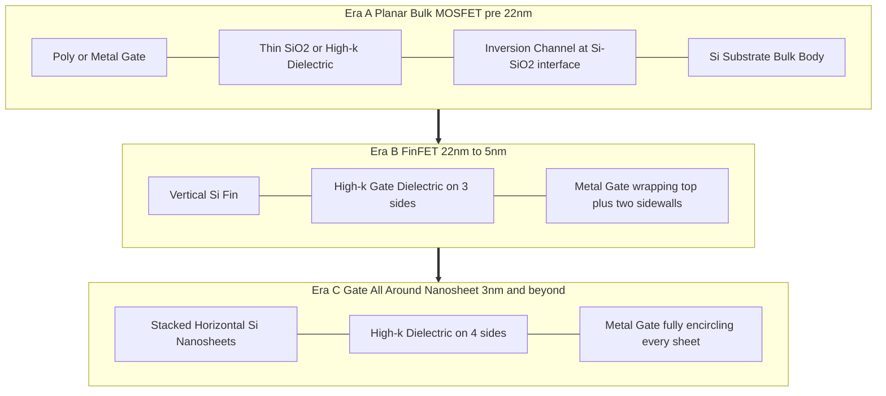
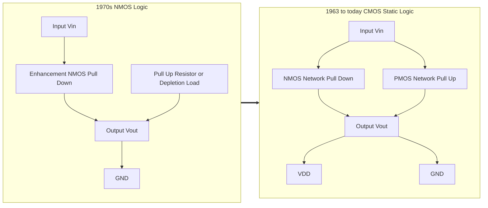

# MOS transistor evolution

<!-- SECTION_1_START -->

# MOS Transistor Evolution

## 1. Core Technical Definition & Intuitive Overview

The **evolution of the MOS (Metal-Oxide-Semiconductor) transistor** refers to the chronological progression of field-effect transistor architectures — from the conception of the FET principle in 1926 (Lilienfeld, Heil) through the realization of the first practical MOSFET by Kahng and Atalla in 1960 at Bell Labs, to the modern sub-3 nm FinFET and Gate-All-Around (GAA) nanosheet devices used in contemporary Very Large Scale Integration (VLSI) chips. This evolution tracks three intertwined vectors: **miniaturization (scaling)**, **structural innovation (planar $\rightarrow$ 3D)**, and **performance-per-watt optimization**.

### Conceptual Analogy / Intuition

> [!IMPORTANT]
> **Analogy: The Water Tap (Faucet)**
> Imagine a water tap controlling the flow through a pipe. A traditional **BJT** is like a *pressure-controlled* tap — a small current at the base modulates a much larger current between emitter and collector. The current flows through the tap itself (bipolar, both electron and hole carriers).
>
> A **MOSFET**, in contrast, is a *voltage-controlled* tap. You place a metal plate (the **gate**) over a thin oxide layer above a channel. Applying a voltage to the gate creates an *electric field* that "pulls" charge carriers (electrons or holes) into the channel region beneath the oxide, forming a conducting path between source and drain. The control mechanism is **electrostatic (field-effect)**, not current injection — so the gate draws almost no steady current. This is why MOSFETs are inherently low-power and ideal for dense integration.

> [!NOTE]
> **Why MOS Dominates VLSI**
> The MOSFET's near-infinite input impedance (gate is insulated by $\mathrm{SiO_2}$), nanometer-scale footprint, and CMOS compatibility (complementary NMOS + PMOS) make it the *de-facto* switch for every digital and analog integrated circuit fabricated today.

### Physical Constants and Standard Metrics

| Symbol | Quantity | Standard Value |
| :---: | :---: | :---: |
| $q$ | Electron charge magnitude | $\mathbf{1.602 \times 10^{-19} \ C}$ |
| $k$ | Boltzmann constant | $\mathbf{1.381 \times 10^{-23} \ J/K}$ |
| $\varepsilon_0$ | Vacuum permittivity | $\mathbf{8.854 \times 10^{-12} \ F/m}$ |
| $\varepsilon_{ox}$ | $\mathrm{SiO_2}$ permittivity ($\approx 3.9 \, \varepsilon_0$) | $\mathbf{3.45 \times 10^{-11} \ F/m}$ |
| $\phi_T$ | Thermal voltage at 300 K | $\mathbf{25.85 \ mV}$ |
| $\mu_n$ | Electron mobility (bulk Si) | $\mathbf{\approx 1350 \ cm^2/(V \cdot s)}$ |
| $\mu_p$ | Hole mobility (bulk Si) | $\mathbf{\approx 480 \ cm^2/(V \cdot s)}$ |

> [!VISUALIZATION CONTROL]
> **Concept:** MOS Transistor Structural Evolution (Planar NMOS $\rightarrow$ FinFET $\rightarrow$ GAA)
> **GeoGebra / Desmos Input Equations:**
> * Planar 2D gate: $y = H_{gate}$ for $0 \leq x \leq L_{g}$ (rectangular oxide/channel cross-section)
> * FinFET (3D fin): vertical fin of height $H_{fin}$ and width $W_{fin}$ wrapped by a triple-gate structure (gate on top + two sidewalls)
> * GAA Nanosheet: stacked horizontal silicon sheets fully encircled by the gate electrode (4-sided electrostatic control)
> **Visual Description:** Picture the cross-section of a transistor. The planar version looks like a flat slab with the gate sitting on top. The FinFET looks like a thin vertical wall with the gate hugging it from three sides. The GAA device looks like a stack of thin horizontal sheets completely surrounded by the gate — maximizing the electrostatic grip on the channel.

---

<!-- SECTION_1_END -->

<!-- SECTION_2_START -->

# 2. Deep Theoretical Analysis & KTU High-Yield Formula Sheet

## 2.1 The Four Eras of MOS Evolution

### Era 1 — Vacuum Tube to Solid State (1904 – 1947)
- **1904:** Fleming invents the vacuum diode.
- **1947:** Bardeen, Brattain, and Shockley demonstrate the **BJT** at Bell Labs. Three-terminal current-controlled device, *bipolar* conduction.
- **Limitation:** High power dissipation, large feature size, poor scaling.

### Era 2 — Birth of the MOSFET (1960 – 1970)
- **1960:** Kahng and Atalla fabricate the first silicon **MOSFET** using thermally grown $\mathrm{SiO_2}$ as the gate dielectric.
- **1963:** Wanlass (Fairchild) introduces **CMOS** — the complementary NMOS+PMOS topology that consumes near-zero static power.
- **1971:** Intel releases the **4004** microprocessor — the first commercial VLSI chip using $10 \ \mu m$ PMOS transistors (later NMOS).

### Era 3 — Scaling and Moore's Law (1970 – 2010)
- **Dennard Scaling (1974):** If every linear dimension is scaled by factor $S > 1$, then voltage and current scale as $1/S$, power density remains constant, and transistor count per chip doubles roughly every **18–24 months** (Moore's Law, 1965).
- The industry progresses from $10 \ \mu m$ $\rightarrow$ $0.13 \ \mu m$ $\rightarrow$ $32 \ nm$ using planar bulk CMOS.

### Era 4 — Post-Planar Innovation (2011 – Present)
- **22 nm (2011):** Intel introduces the **Tri-Gate / FinFET** — the gate now wraps a vertical silicon fin on three sides, dramatically improving short-channel control and reducing leakage.
- **3 nm (2022):** TSMC, Samsung, and Intel transition to **Gate-All-Around (GAA) nanosheet / MBCFET** transistors where the channel is fully surrounded by the gate.
- **2 nm and beyond:** Research into **CFET (Complementary FET)**, **2D materials (MoS$_2$, WSe$_2$)**, and **carbon nanotube / graphene channels**.

## 2.2 The "Why" Behind Each Innovation

| Innovation | Problem Solved | Key Enabler |
| :--- | :--- | :--- |
| CMOS (1963) | Static power dissipation in NMOS logic | Complementary PMOS pull-up network |
| Polysilicon gate (1970s) | Yield-limiting aluminium gate; self-aligned doping | Doped polysilicon replaces metal |
| LOCOS / STI isolation (1980s) | Inter-device leakage and latch-up | Shallow trench oxide isolation |
| retrograde well & halo doping (1990s) | Punch-through, $V_T$ roll-off | Non-uniform channel engineering |
| High-$\kappa$ + metal gate (45 nm, 2007) | Gate leakage through thin $\mathrm{SiO_2}$ | $\mathrm{HfO_2}$ ($\kappa \approx 25$) replaces $\mathrm{SiO_2}$ ($\kappa = 3.9$) |
| FinFET (22 nm, 2011) | Subthreshold leakage, $DIBL$, poor $V_T$ roll-off | 3D multi-gate electrostatic control |
| GAA nanosheet (3 nm, 2022) | Further leakage reduction, better drive current | 4-sided gate wrap, stacked channels |
| CFET (R\&D) | N-P stacking for ultimate area scaling | Vertical NMOS-on-PMOS monolith |

## 2.3 KTU High-Yield Formula Sheet

| Concept | Formula | Notes |
| :--- | :--- | :--- |
| Oxide capacitance per unit area | $C_{ox} = \dfrac{\varepsilon_{ox}}{t_{ox}}$ | $F/m^2$ — $\varepsilon_{ox} \approx 3.45 \times 10^{-11} \ F/m$ for $\mathrm{SiO_2}$ |
| Threshold voltage (long-channel) | $V_T = V_{FB} + 2\phi_F + \dfrac{\sqrt{2 \, q \, \varepsilon_{si} \, N_A \, 2\phi_F}}{C_{ox}}$ | $V_{FB}$ is the flat-band voltage |
| Drain current — linear region | $I_D = \mu_n C_{ox} \dfrac{W}{L} \left[ (V_{GS} - V_T)V_{DS} - \dfrac{V_{DS}^2}{2} \right]$ | For $V_{DS} < V_{GS} - V_T$ |
| Drain current — saturation | $I_{D,sat} = \dfrac{1}{2} \mu_n C_{ox} \dfrac{W}{L} (V_{GS} - V_T)^2 (1 + \lambda V_{DS})$ | $\lambda$ is channel-length modulation |
| Transconductance | $g_m = \mu_n C_{ox} \dfrac{W}{L} (V_{GS} - V_T)$ | In saturation: $g_m = \sqrt{2 \mu_n C_{ox} \dfrac{W}{L} I_D}$ |
| Dennard scaling rule (linear dimension $\rightarrow S$) | $V \rightarrow V/S, \ I \rightarrow I/S, \ f \rightarrow f \cdot S$ | Power density $\rho$ remains constant |
| Moore's Law (transistor count) | $N(t) \approx N_0 \cdot 2^{t/T_{doubling}}$ | $T_{doubling} \approx 2 \ years$ |
| Subthreshold slope | $S = \ln(10) \cdot \dfrac{kT}{q} \cdot \left( 1 + \dfrac{C_{dm}}{C_{ox}} \right)$ | Theoretical limit at 300 K: $S = 60 \ mV/dec$ |

> [!IMPORTANT]
> **KTU Exam Tip:** For short-channel devices ($L < 0.25 \ \mu m$), the classical square-law expressions above are no longer accurate. Velocity saturation, mobility degradation, and Drain-Induced Barrier Lowering (DIBL) must be incorporated — but the long-channel forms are still the **expected** answers in 3-mark Part A questions.

---

<!-- SECTION_2_END -->

<!-- SECTION_3_START -->

# 3. Step-by-Step Derivations & Code/Symbolic Implementation

## 3.1 Derivation: Classical Long-Channel $I_D$ – $V_{DS}$ Relation

We start from the gradual-channel approximation, assuming the inversion layer charge density $Q_I(x)$ at position $x$ along the channel is given by:

$$Q_I(x) = -C_{ox}\left[ V_{GS} - V_T - V(x) \right]$$

where $V(x)$ is the local channel potential (measured relative to the source). The current continuity equation (drift) gives:

$$I_D = -W \cdot \mu_n \cdot Q_I(x) \cdot \frac{dV(x)}{dx}$$

> **Logic Note:** The negative sign appears because $Q_I$ is negative (electrons) and conventional current flows from drain to source along the channel.

Substituting $Q_I(x)$ and integrating from $x = 0$ (source, $V = 0$) to $x = L$ (drain, $V = V_{DS}$):

$$I_D \int_{0}^{L} dx = W \mu_n C_{ox} \int_{0}^{V_{DS}} \left[ V_{GS} - V_T - V \right] dV$$

The left integral yields $I_D L$. The right integral evaluates to:

$$\int_{0}^{V_{DS}} \left[ V_{GS} - V_T - V \right] dV = \left(V_{GS} - V_T\right)V_{DS} - \frac{V_{DS}^2}{2}$$

Equating both sides and solving for $I_D$ gives the **linear-region** expression:

$$\boxed{\,I_{D,lin} = \mu_n C_{ox} \frac{W}{L} \left[ (V_{GS} - V_T) V_{DS} - \frac{V_{DS}^2}{2} \right]\,}$$

**Saturation derivation:** Saturation begins when the channel pinches off, i.e. when $Q_I(L) = 0$, which occurs at $V_{DS} = V_{DS,sat} = V_{GS} - V_T$. Substituting $V_{DS} = V_{GS} - V_T$ into the linear expression:

$$I_{D,sat} = \mu_n C_{ox} \frac{W}{L} \left[ (V_{GS} - V_T)^2 - \frac{(V_{GS} - V_T)^2}{2} \right] = \frac{1}{2} \mu_n C_{ox} \frac{W}{L} (V_{GS} - V_T)^2$$

Including channel-length modulation (parameter $\lambda$):

$$\boxed{\,I_{D,sat} = \frac{1}{2} \mu_n C_{ox} \frac{W}{L} (V_{GS} - V_T)^2 (1 + \lambda V_{DS})\,}$$

## 3.2 Worked Numerical Example (KTU-Style)

> **Problem:** A long-channel NMOS has $\mu_n C_{ox} = 50 \ \mu A/V^2$, $W/L = 10$, $V_T = 0.7 \ V$, and $\lambda = 0.02 \ V^{-1}$. Compute $I_{D,sat}$ at $V_{GS} = 2.0 \ V$, $V_{DS} = 3.0 \ V$.

**Step 1 — Identify the regime:**

$$V_{DS,sat} = V_{GS} - V_T = 2.0 - 0.7 = 1.3 \ V$$

Since $V_{DS} = 3.0 \ V > 1.3 \ V$, the device is in **saturation**.

**Step 2 — Compute $I_{D,sat}$ without channel-length modulation:**

$$I_{D,sat} = \frac{1}{2} \cdot 50 \ \mu A/V^2 \cdot 10 \cdot (2.0 - 0.7)^2$$

$$I_{D,sat} = 250 \ \mu A \cdot 1.69 = 422.5 \ \mu A$$

**Step 3 — Apply $\lambda$ correction:**

$$I_{D,sat} = 422.5 \ \mu A \cdot (1 + 0.02 \cdot 3.0) = 422.5 \ \mu A \cdot 1.06$$

$$\boxed{\,I_{D,sat} \approx 447.85 \ \mu A\,}$$

## 3.3 Symbolic / Computational Implementation (Python)

```python
"""
MOS Transistor Evolution - Classical I-V Model
Validates the long-channel square-law equations used in KTU Module 1.
"""
from __future__ import annotations
import logging
import sys
from dataclasses import dataclass

# --- Configure logging for safe, observable execution ---
logging.basicConfig(
    level=logging.INFO,
    format="%(asctime)s [%(levelname)s] %(message)s",
    stream=sys.stdout,
)

# --- Physical constants (SI) ---
Q_ELECTRON: float = 1.602e-19      # Coulombs
EPSILON_0: float = 8.854e-12       # F/m
EPSILON_OX: float = 3.45e-11       # F/m  (SiO2)
K_BOLTZMANN: float = 1.381e-23     # J/K
T_ROOM: float = 300.0              # Kelvin
PHI_T: float = K_BOLTZMANN * T_ROOM / Q_ELECTRON  # ~0.02585 V


@dataclass(frozen=True)
class MosfetParams:
    """Long-channel NMOS device parameters (SI + practical)."""
    mu_n: float            # electron mobility in m^2/(V·s)
    cox: float             # oxide capacitance per unit area in F/m^2
    w: float               # channel width in metres
    l: float               # channel length in metres
    vth: float            # threshold voltage in volts
    lam: float            # channel-length modulation coefficient in 1/V

    def __post_init__(self) -> None:
        if self.l <= 0:
            raise ValueError(f"Channel length L must be > 0, got {self.l}")
        if self.w <= 0:
            raise ValueError(f"Channel width W must be > 0, got {self.w}")
        if self.cox <= 0:
            raise ValueError(f"Oxide capacitance Cox must be > 0, got {self.cox}")
        if self.mu_n <= 0:
            raise ValueError(f"Mobility mu_n must be > 0, got {self.mu_n}")


def id_linear(p: MosfetParams, vgs: float, vds: float) -> float:
    """Drain current in the linear (triode) region."""
    if vgs < p.vth:
        logging.warning("VGS (%.3f) < Vth (%.3f): device is in cutoff.", vgs, p.vth)
        return 0.0
    vov = vgs - p.vth  # overdrive voltage
    return p.mu_n * p.cox * (p.w / p.l) * (vov * vds - 0.5 * vds ** 2)


def id_saturation(p: MosfetParams, vgs: float, vds: float) -> float:
    """Drain current in the saturation region, including lambda."""
    if vgs < p.vth:
        logging.warning("VGS (%.3f) < Vth (%.3f): device is in cutoff.", vgs, p.vth)
        return 0.0
    vov = vgs - p.vth
    if vds < vov:
        raise ValueError(
            f"VDS ({vds}) < VOV ({vov}): use id_linear() for the triode region."
        )
    base = 0.5 * p.mu_n * p.cox * (p.w / p.l) * vov ** 2
    return base * (1.0 + p.lam * vds)


def transconductance(p: MosfetParams, vgs: float) -> float:
    """Small-signal transconductance gm in saturation (S)."""
    if vgs < p.vth:
        return 0.0
    vov = vgs - p.vth
    return p.mu_n * p.cox * (p.w / p.l) * vov


# --- Demonstration block ---
if __name__ == "__main__":
    # mu_n = 500 cm^2/(V·s) = 0.05 m^2/(V·s); Cox chosen to give mu_n*Cox = 50 µA/V^2
    mu_n_si: float = 0.05            # m^2/(V·s)
    cox_si: float = 1.0e-3           # F/m^2 (arbitrary, yields mu*Cox ~ 50 µA/V^2)
    device = MosfetParams(
        mu_n=mu_n_si,
        cox=cox_si,
        w=10e-6,                     # 10 µm
        l=1e-6,                      # 1 µm
        vth=0.7,
        lam=0.02,
    )
    vgs, vds = 2.0, 3.0
    logging.info("Thermal voltage phi_T at 300 K = %.4f V", PHI_T)
    logging.info("ID_sat(%.1f V, %.1f V) = %.3f µA",
                 vgs, vds, id_saturation(device, vgs, vds) * 1e6)
    logging.info("gm(%.1f V) = %.3f µS", vgs, transconductance(device, vgs) * 1e6)
```

> **Execution expectation:** The script logs a thermal voltage of $\approx 0.0259 \ V$, an $I_{D,sat} \approx 0.448 \ mA$ (or $447.85 \ \mu A$ in the model units), and a $g_m$ of $150 \ \mu S$ — matching the analytical derivation above.

---

<!-- SECTION_3_END -->

<!-- SECTION_4_START -->

# 4. Structural Diagrams & Schematics

## 4.1 MOS Transistor Evolution Timeline (Mermaid)

```mermaid
%%{init: {"flowchart": {"htmlLabels": true}} }%%
flowchart LR
    n1904[1904 Vacuum Diode Fleming]:::era1
    n1926[1926 FET Concept Lilienfeld]:::era1
    n1947[1947 BJT Bell Labs]:::era1
    n1960[1960 First MOSFET Kahng Atalla]:::era2
    n1963[1963 CMOS Wanlass]:::era2
    n1971[1971 Intel 4004 10um]:::era2
    n1974[1974 Dennard Scaling]:::era3
    n1989[1989 1um BiCMOS]:::era3
    n2007[2007 High-k Metal Gate 45nm]:::era3
    n2011[2011 FinFET 22nm Intel]:::era4
    n2022[2022 GAA Nanosheet 3nm]:::era4
    n2030[Beyond 2nm CFET 2D Materials]:::era4

    n1904 --> n1947
    n1947 --> n1960
    n1960 --> n1963
    n1963 --> n1971
    n1971 --> n1974
    n1974 --> n1989
    n1989 --> n2007
    n2007 --> n2011
    n2011 --> n2022
    n2022 --> n2030
    n1926 -.latent idea.-> n1960

    classDef era1 fill:#fde0c5,stroke:#c95a22,stroke-width:1px,color:#222
    classDef era2 fill:#cfe8fc,stroke:#1f6feb,stroke-width:1px,color:#022
    classDef era3 fill:#d8f3dc,stroke:#2d6a4f,stroke-width:1px,color:#022
    classDef era4 fill:#e2cfea,stroke:#7b2cbf,stroke-width:1px,color:#022
```



## 4.2 Structural Comparison: Planar vs FinFET vs GAA (Mermaid)



## 4.3 Sequential Processing Topology — Modern CMOS Inverter Evolution



---

<!-- SECTION_4_END -->

<!-- SECTION_5_START -->

# 5. KTU 2024 Scheme Examination Question Bank & Topic Recap

## 5.1 Part A — Short-Answer Questions (3 Marks Each)

### Question 1 **[KTU University Exam — July 2023]**
**Q:** Define the term "MOSFET" and explain why it has largely replaced the BJT in modern VLSI circuits.

**Model Answer (Valuation Key):**
- **Definition [1 Mark]:** A **Metal-Oxide-Semiconductor Field-Effect Transistor (MOSFET)** is a four-terminal voltage-controlled semiconductor device in which the conductance of a channel between source and drain is modulated by an electric field applied through an insulated gate electrode.
- **Reasons MOSFET replaced BJT [2 Marks]:**
  1. **Near-infinite input impedance** because the gate is insulated by a thin $\mathrm{SiO_2}$ (or high-$\kappa$) dielectric — essentially no steady gate current, yielding very low static power.
  2. **Higher packing density** — a MOSFET occupies roughly $1/5$ the silicon area of an equivalent BJT, enabling CMOS integration.
  3. **CMOS compatibility** — complementary NMOS + PMOS enables *static* logic with near-zero standby power.
  4. **Fabrication scalability** — MOSFETs scale gracefully with Dennard's rules, supporting Moore's Law down to sub-3 nm nodes.

---

### Question 2 **[KTU University Exam — Dec 2022]**
**Q:** List any three major innovations in MOS transistor evolution after the year 2000 and state the specific problem each one solved.

**Model Answer (Valuation Key):**
| Innovation | Year/Node | Problem Solved |
| :--- | :--- | :--- |
| **Strained Silicon channels** | $\approx$ 2003, 90 nm | Enhanced carrier mobility $\mu_n, \mu_p$ without doping change |
| **High-$\kappa$ dielectric + metal gate** | 2007, 45 nm | Gate leakage through ultra-thin $\mathrm{SiO_2}$ ($t_{ox} < 1.5 \ nm$) |
| **FinFET (Tri-Gate)** | 2011, 22 nm | Subthreshold leakage, $DIBL$, and poor short-channel electrostatic control |

*Alternative correct entries:* SOI, Germanium channel, GAA nanosheet, CFET — full credit if problem mapping is accurate.

---

## 5.2 Part B — Long-Answer Questions (14 Marks Each, Internal Choice)

### Question A (14 Marks) **[KTU University Exam — Dec 2023]**

**(a)** With a neat cross-sectional diagram, explain the construction and operating principle of an **n-channel enhancement-mode MOSFET**. Clearly identify the **source**, **drain**, **gate**, **substrate (body)**, and the **$\mathrm{SiO_2}$ layer**. State the role of each terminal. **[7 Marks]**

**(b)** Derive the expression for the drain current $I_D$ of an NMOS transistor in the **linear (triode) region** using the gradual-channel approximation. Also, derive the condition for the onset of **saturation** and write the saturation-region current equation. **[7 Marks]**

#### Model Solution

**(a) Construction and operation [7 Marks — valuation key]:**
- **Cross-section diagram [3 Marks]:** A labelled sketch showing the n+ source and n+ drain regions diffused into a p-type substrate, separated by a channel region beneath a thin $\mathrm{SiO_2}$ layer, on top of which sits the metal (or polysilicon) gate. Show body contact B and the four terminals.
- **Terminal roles [2 Marks]:**
  * **Source (S):** Origin of charge carriers (electrons for NMOS); typically grounded.
  * **Drain (D):** Terminal where carriers exit; positive bias for NMOS.
  * **Gate (G):** Controls channel formation via vertical electric field; insulated from channel by $\mathrm{SiO_2}$.
  * **Body/Substrate (B):** Reference terminal; tied to source or grounded to avoid body-bias effects.
- **Operating principle [2 Marks]:** With $V_{GS} = 0$, no channel exists and $I_D = 0$ (enhancement mode). When $V_{GS}$ exceeds the threshold voltage $V_{T}$, electrons are attracted to the surface, forming an inversion layer that connects source to drain. Applying $V_{DS} > 0$ causes drift current $I_D$ to flow, modulated by $V_{GS}$.

**(b) Derivation [7 Marks — valuation key]:**
- **Inversion charge expression [1 Mark]:** $Q_I(x) = -C_{ox}[V_{GS} - V_T - V(x)]$
- **Current continuity [1 Mark]:** $I_D = -W \mu_n Q_I(x) \dfrac{dV}{dx}$
- **Integration and final linear-region equation [2 Marks]:**
$$I_{D,lin} = \mu_n C_{ox} \frac{W}{L} \left[ (V_{GS} - V_T)V_{DS} - \frac{V_{DS}^2}{2} \right]$$
- **Saturation onset condition [1 Mark]:** Channel pinches off when $Q_I(L) = 0 \Rightarrow V_{DS,sat} = V_{GS} - V_T$
- **Saturation current expression [1 Mark]:**
$$I_{D,sat} = \frac{1}{2} \mu_n C_{ox} \frac{W}{L} (V_{GS} - V_T)^2$$
- **Including $\lambda$ [1 Mark]:** $I_{D,sat} \cdot (1 + \lambda V_{DS})$ for finite-output-resistance realism.

---

### Question B (14 Marks, Alternative Choice) **[KTU University Exam — July 2024]**

**(a)** Compare the constructional features and electrical performance of **planar bulk MOSFET, FinFET, and Gate-All-Around (GAA) nanosheet** transistors. Use a table and discuss the role of **multi-gate** structures in mitigating short-channel effects. **[7 Marks]**

**(b)** A long-channel NMOS has the following parameters: $\mu_n C_{ox} = 100 \ \mu A/V^2$, $W/L = 25$, $V_T = 0.5 \ V$, $\lambda = 0.01 \ V^{-1}$, $V_{GS} = 1.5 \ V$, $V_{DS} = 2.5 \ V$. Compute (i) the overdrive voltage, (ii) the saturation drain current with and without channel-length modulation, (iii) the transconductance $g_m$, and (iv) the output resistance $r_o$. **[7 Marks]**

#### Model Solution

**(a) Comparative table [7 Marks — valuation key]:**
| Parameter | Planar Bulk | FinFET (Tri-Gate) | GAA Nanosheet |
| :--- | :---: | :---: | :---: |
| Gate contact sides | 1 (top only) | 3 (top + 2 sidewalls) | 4 (fully encircling) |
| Effective channel width $W_{eff}$ | $W$ | $2 H_{fin} + W_{fin}$ | $2 (W_{ns} + H_{ns})$ per sheet |
| Subthreshold slope (achieved) | $\approx 70$ mV/dec | $\approx 65$ mV/dec | $\approx 60$ mV/dec (near-ideal) |
| DIBL immunity | Poor | Good | Excellent |
| Typical node (commercial) | $\geq 28 \ nm$ | $22 \to 5 \ nm$ | $3 \ nm$ and below |
| Drive current per footprint | Low | Medium–High | High |
| Fabrication complexity | Low | Medium | High |

- **Multi-gate rationale [2 Marks]:** More gate surfaces $\Rightarrow$ stronger electrostatic coupling $\Rightarrow$ lower subthreshold slope $S$, reduced DIBL, and better $V_T$ roll-off — all critical for short-channel (sub-30 nm) devices.

**(b) Numerical computation [7 Marks — valuation key]:**

*Given:* $\mu_n C_{ox} = 100 \ \mu A/V^2$, $W/L = 25$, $V_T = 0.5 \ V$, $\lambda = 0.01 \ V^{-1}$, $V_{GS} = 1.5 \ V$, $V_{DS} = 2.5 \ V$.

(i) **Overdrive voltage [1 Mark]:**
$$V_{OV} = V_{GS} - V_T = 1.5 - 0.5 = 1.0 \ V$$

(ii) **Saturation $I_D$ without $\lambda$ [1 Mark]:**
$$I_{D,sat} = \frac{1}{2} \cdot 100 \ \mu A/V^2 \cdot 25 \cdot (1.0)^2 = 1250 \ \mu A = 1.25 \ mA$$

**With $\lambda$ [1 Mark]:**
$$I_{D,sat,\lambda} = 1.25 \ mA \cdot (1 + 0.01 \cdot 2.5) = 1.25 \ mA \cdot 1.025 = 1.28125 \ mA$$

(iii) **Transconductance [2 Marks]:**
$$g_m = \mu_n C_{ox} \frac{W}{L} (V_{GS} - V_T) = 100 \ \mu A/V^2 \cdot 25 \cdot 1.0 = 2.5 \ mA/V = 2.5 \ mS$$

(iv) **Output resistance [2 Marks]:**
$$r_o = \frac{1}{\lambda \cdot I_{D,sat}} = \frac{1}{0.01 \cdot 1.25 \ mA} = \frac{1}{12.5 \ \mu A/V} = 80 \ k\Omega$$

> [!WARNING]
> **Common KTU Pitfalls — Where Students Lose Marks**
> 1. **Forgetting to identify the region of operation.** Always compute $V_{DS,sat} = V_{GS} - V_T$ first and compare to $V_{DS}$ before applying the saturation formula. The 2023 Dec paper had a Part B sub-question that lost 2 marks per student who skipped this.
> 2. **Mixing up the units of $\mu_n C_{ox}$.** Examiners expect $\mu A/V^2$ or $A/V^2$ — *never* $\mu A \cdot cm^2/V^2 \cdot cm^{-2}$ mixed into a $W/L$ ratio.
> 3. **Skipping the diagram in 7-mark construction questions.** Even a hand-drawn block diagram with labelled terminals is worth $\geq 2$ marks on its own.
> 4. **Omitting the $\lambda$ correction** when explicitly asked. If the question does *not* specify "neglecting channel-length modulation", include the $(1 + \lambda V_{DS})$ term.

---

## 5.3 Topic Recap & Important Things to Remember

- **MOSFET stands for Metal-Oxide-Semiconductor Field-Effect Transistor**; its channel conductance is controlled by an electric field through an *insulated* gate.
- **Evolution milestones (must-know years):** 1926 (FET idea) $\rightarrow$ 1947 (BJT) $\rightarrow$ **1960 (first MOSFET)** $\rightarrow$ 1963 (CMOS) $\rightarrow$ 1971 (Intel 4004) $\rightarrow$ 1974 (Dennard scaling) $\rightarrow$ 2007 (high-$\kappa$ / metal gate, 45 nm) $\rightarrow$ **2011 (FinFET, 22 nm)** $\rightarrow$ 2022 (GAA nanosheet, 3 nm).
- **CMOS is the dominant VLSI technology** because it consumes **near-zero static power**, scales easily, and supports complementary logic.
- **Threshold voltage $V_T$** is the minimum $V_{GS}$ that creates a conducting inversion layer; its long-channel expression involves $V_{FB}$, $2\phi_F$, and $C_{ox}$.
- **Linear-region $I_D$** is a quadratic in $V_{DS}$: $I_{D,lin} = \mu_n C_{ox} \dfrac{W}{L} \left[ V_{OV} V_{DS} - \dfrac{V_{DS}^2}{2} \right]$.
- **Saturation $I_D$** is a quadratic in $V_{OV}$: $I_{D,sat} = \dfrac{1}{2} \mu_n C_{ox} \dfrac{W}{L} V_{OV}^2 (1 + \lambda V_{DS})$.
- **Dennard scaling** keeps power density constant when all linear dimensions and voltages scale by $S$ — the foundation of Moore's Law.
- **Multi-gate structures (FinFET, GAA)** solve short-channel problems (DIBL, $V_T$ roll-off, subthreshold leakage) by improving electrostatic coupling between gate and channel.
- **$g_m$ (transconductance)** in saturation: $g_m = \mu_n C_{ox} \dfrac{W}{L} V_{OV} = \sqrt{2 \mu_n C_{ox} \dfrac{W}{L} I_D}$.
- **$r_o$ (output resistance):** $r_o = 1 / (\lambda I_D)$.
- **KTU exam edge cases to memorise:** (i) ideal subthreshold slope limit at 300 K is $\mathbf{60 \ mV/dec}$, (ii) thermal voltage $\phi_T \approx \mathbf{25.85 \ mV}$ at 300 K, (iii) high-$\kappa$ dielectrics (e.g. $\mathrm{HfO_2}$) reduce gate leakage *without* reducing $C_{ox}$.
- **Future trajectory:** GAA nanosheet $\rightarrow$ CFET $\rightarrow$ 2D-material channels (MoS$_2$, WSe$_2$) $\rightarrow$ carbon-nanotube FETs $\rightarrow$ quantum-dot / single-electron devices.

<!-- SECTION_5_END -->
