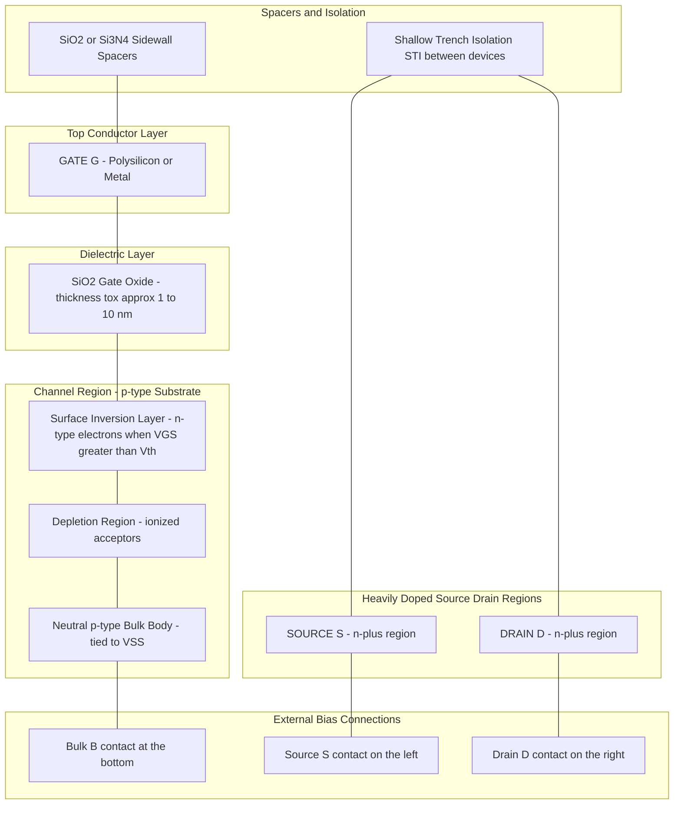
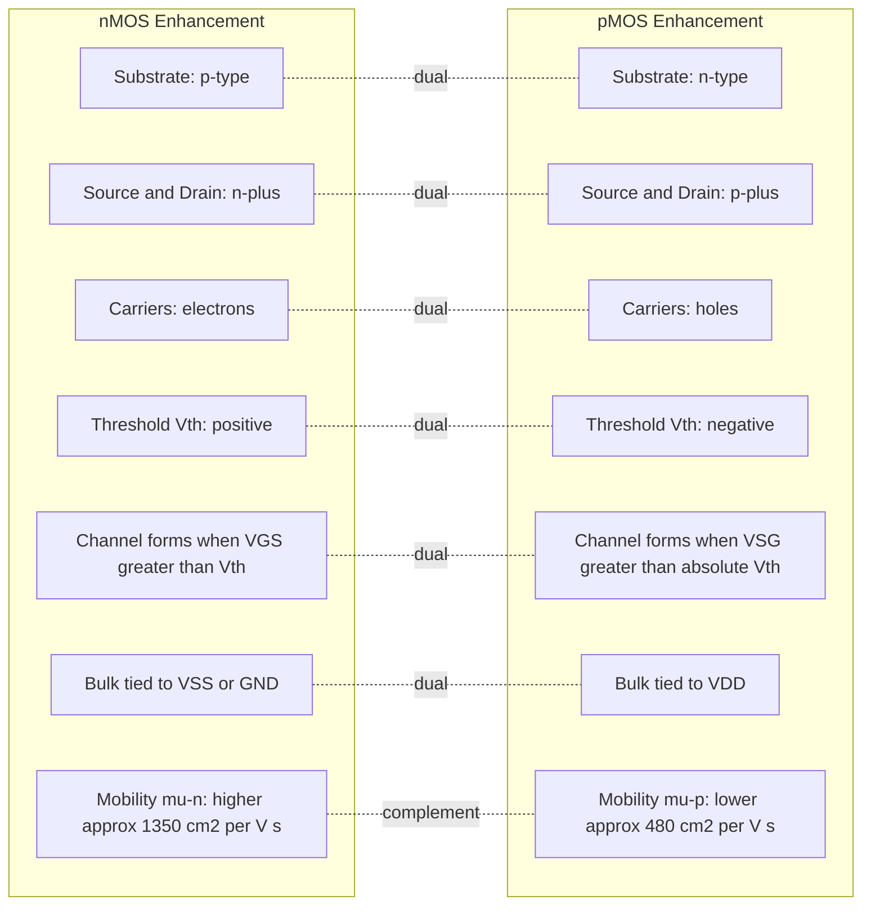
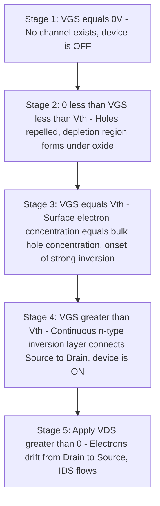
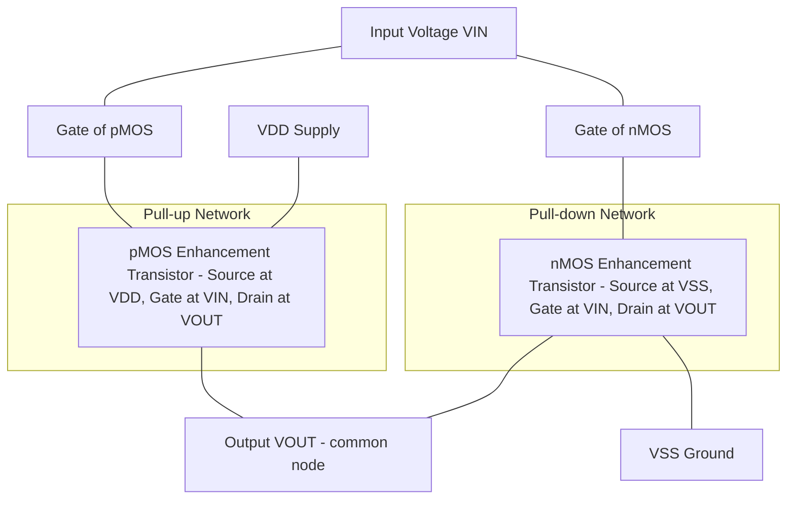

# nMOS and pMOS enhancement transistor structures

<!-- SECTION_1_START -->
# Module 1 — MOS Transistor Theory
## Topic: nMOS and pMOS Enhancement Transistor Structures

> [!NOTE]
> **KTU 2024 Scheme — Course Outcome Mapping**
> **Subject:** VLSI Design (PECST415)
> **Module:** 1 — MOS Transistor Theory
> **Mapped COs:** CO1 — Understand the structure, working principles, and I–V characteristics of MOS transistors.
> **Cognitive Levels Targeted:** Remember, Understand, Apply.

---

### 1.1 Formal Definition (KTU 2024 Syllabus Terminology)

A **Metal–Oxide–Semiconductor Field-Effect Transistor (MOSFET)** of the *enhancement type* is a four-terminal voltage-controlled unipolar device in which conduction between two heavily doped regions (Source and Drain) is induced — i.e., *enhanced* — by applying a gate voltage of sufficient magnitude beyond a critical value known as the **Threshold Voltage ($V_{th}$)**.

- **nMOS Enhancement Transistor:** Built on a **p-type substrate (body)**, with two heavily doped **$n^+$ source** and **$n^+$ drain** regions. A positive gate-to-source voltage ($V_{GS} > V_{th,n}$) inverts the surface of the p-substrate into an **n-type conducting channel**, allowing electron flow from drain to source.

- **pMOS Enhancement Transistor:** Built on an **n-type substrate (body)**, with two heavily doped **$p^+$ source** and **$p^+$ drain** regions. A sufficiently negative gate-to-source voltage ($V_{GS} < V_{th,p}$, where $V_{th,p} < 0$) inverts the surface of the n-substrate into a **p-type conducting channel**, allowing hole flow from source to drain.

> [!IMPORTANT]
> **Enhancement-mode MOSFETs are the backbone of modern CMOS (Complementary MOS) technology**, which forms the foundation of nearly every digital integrated circuit manufactured today — from microprocessors to memory chips.

---

### 1.2 Conceptual Analogy / Intuition

Imagine a **water tap (faucet)**:
- The **gate** is the *handle* — by turning it, you control the flow.
- The **drain and source** are the *two ends of the pipe* — water (current) flows between them.
- The **threshold voltage ($V_{th}$)** is the *minimum force* you must apply to the handle before water starts flowing.
- In a **normally-off** tap (no water without turning the handle), the flow is *enhanced* only when you apply enough force — this is exactly how an **enhancement-mode MOSFET** behaves at $V_{GS} = 0$.

**nMOS vs. pMOS — A Simple Memory Trick:**

Think of **nMOS** as the *"normally aspirated engine"* of digital circuits — it pulls current in (electron flow) when the input is **HIGH (logic 1)**. Think of **pMOS** as the *"complementary exhaust"* — it conducts when the input is **LOW (logic 0)**. Together in a CMOS inverter, they alternate roles, ensuring *no static current* flows — saving power.

---

### 1.3 Physical Constants and Standard Metrics

| Parameter | Symbol | Typical Value (Modern 45 nm CMOS) | Unit |
|---|---|---|---|
| Oxide dielectric constant | $\kappa_{ox} = \varepsilon_r$ | $\mathbf{3.9}$ (for $\mathrm{SiO_2}$) | dimensionless |
| Silicon dielectric constant | $\kappa_{si} = \varepsilon_{si}$ | $\mathbf{11.7}$ | dimensionless |
| Vacuum permittivity | $\varepsilon_0$ | $\mathbf{8.854 \times 10^{-14}}$ | $\mathrm{F/cm}$ |
| Oxide permittivity | $\varepsilon_{ox} = \kappa_{ox} \cdot \varepsilon_0$ | $\mathbf{3.45 \times 10^{-13}}$ | $\mathrm{F/cm}$ |
| Silicon permittivity | $\varepsilon_{si} = \kappa_{si} \cdot \varepsilon_0$ | $\mathbf{1.04 \times 10^{-12}}$ | $\mathrm{F/cm}$ |
| Room temperature thermal voltage | $V_T = kT/q$ | $\mathbf{25.85\ mV \approx 26\ mV}$ (at $T = 300\ K$) | $\mathrm{V}$ |
| Electron mobility (nMOS) | $\mu_n$ | $\mathbf{1350}$ (bulk), $\approx \mathbf{500}$ (inversion layer) | $\mathrm{cm^2/V \cdot s}$ |
| Hole mobility (pMOS) | $\mu_p$ | $\mathbf{480}$ (bulk), $\approx \mathbf{200}$ (inversion layer) | $\mathrm{cm^2/V \cdot s}$ |
| nMOS threshold voltage | $V_{th,n}$ | $\mathbf{+0.3\ to\ +0.7}$ (typical) | $\mathrm{V}$ |
| pMOS threshold voltage | $V_{th,p}$ | $\mathbf{-0.3\ to\ -0.7}$ (typical) | $\mathrm{V}$ |

> [!NOTE]
> **Mobility ratio $\mu_n / \mu_p \approx 2$ to $3$**. This single fact is why in CMOS design, pMOS transistors are usually sized **2× to 3× wider** than nMOS transistors to deliver matched drive currents — a critical fact for KTU VLSI exam questions.

---

### 1.4 Geometric / Structural Intuition

The MOSFET is essentially a **"sandwich"** with the following vertical stack from top to bottom:

1. **Metal / Polysilicon Gate** (the top electrode)
2. **Thin Insulator Layer** ($\mathrm{SiO_2}$, modern nodes use High-$\kappa$ dielectrics like $\mathrm{HfO_2}$)
3. **Semiconductor Surface** (the channel region, $\approx 5{-}10\ \mathrm{nm}$ deep)
4. **Bulk Semiconductor (Body / Substrate)**

The horizontal layout is:

- **Source** ← [Channel of length $L$] → **Drain**
- **Channel Width** = $W$

Both $L$ and $W$ are *mask-defined* geometric parameters, giving designers precise control over the transistor's drive strength.

> [!VISUALIZATION CONTROL]
> **Concept:** Cross-sectional sketch of a typical nMOS enhancement transistor in the $x$–$y$ plane.
> **GeoGebra / Desmos Input Equations:**
> * $P1 = (0, 0)$ — Source contact (left $n^+$)
> * $P2 = (L, 0)$ — Drain contact (right $n^+$)
> * $L$ = Channel length
> * $W$ = Channel width (depth into page)
> * $t_{ox}$ = Oxide thickness $\approx 1{-}2\ \mathrm{nm}$
>
> **Visual Description:** Plot a rectangular p-substrate region with two small heavily doped $n^+$ islands at $x = 0$ and $x = L$, separated by a thin oxide region. Place a polysilicon gate electrode above the oxide, positioned over the gap between the two $n^+$ regions. The vertical axis represents depth into silicon, and the horizontal axis represents the channel direction.

<!-- SECTION_1_END -->

<!-- SECTION_2_START -->
# Deep Theoretical Analysis & KTU High-Yield Formula Sheet

## 2.1 Cross-Sectional Structure of the nMOS Enhancement Transistor

The nMOS enhancement transistor is fabricated on a **p-type silicon substrate** (also called the *body* or *bulk*). The four terminals are:

- **Gate (G):** A heavily doped polysilicon layer (or metal in older nodes) deposited on top of a thin $\mathrm{SiO_2}$ layer.
- **Source (S):** A heavily doped $n^+$ region formed via ion implantation.
- **Drain (D):** A heavily doped $n^+$ region symmetric to the source.
- **Body / Substrate / Bulk (B):** The p-type wafer on which the device is built; tied to the most negative supply ($V_{SS}$ or ground) in standard operation.

The **channel** is the region of the p-substrate directly beneath the gate oxide, *between* the source and drain $n^+$ regions. Its length is denoted $L$, and width $W$.

### Key Physical Insights

- The **gate oxide** ($t_{ox} \approx 1{-}10\ \mathrm{nm}$ for modern nodes) acts as a **capacitor dielectric** between the gate and the channel.
- The **p-n junctions** between the $n^+$ source/drain and the p-body are normally reverse-biased in operation, isolating the channel.
- **No conducting channel exists at $V_{GS} = 0$** — this is the defining property of *enhancement-mode* devices.
- A positive $V_{GS}$ repels holes from the surface and attracts electrons; when $V_{GS} > V_{th}$, a thin **inversion layer** of electrons forms — this is the conducting channel.

> [!IMPORTANT]
> **Strong Inversion** is said to occur when the surface electron concentration equals the bulk hole concentration of the p-substrate. The gate voltage at which this happens is the **threshold voltage $V_{th}$**.

---

## 2.2 Cross-Sectional Structure of the pMOS Enhancement Transistor

The pMOS enhancement transistor is the **dual** of the nMOS:

- Built on an **n-type substrate**.
- Has two heavily doped **$p^+$ source** and **$p^+$ drain** regions.
- A negative $V_{GS}$ (i.e., $V_{SG} > |V_{th,p}|$) attracts holes to the surface, forming a p-type inversion layer.
- The body (n-type) is typically tied to the most positive supply ($V_{DD}$).

> [!NOTE]
> **Why "Enhancement" instead of "Depletion"?** In a *depletion-mode* MOSFET, a conducting channel is physically doped into the device at fabrication time, so current flows even at $V_{GS} = 0$. In an *enhancement-mode* MOSFET, **no channel exists until a gate voltage exceeding $V_{th}$ is applied** — the channel is *enhanced* into existence by the electric field.

---

## 2.3 Threshold Voltage ($V_{th}$) — Conceptual Origin

The threshold voltage has **three principal physical contributions**:

1. **Work-function difference** $\phi_{MS}$ between the gate material and the silicon substrate.
2. **Surface potential** required for strong inversion: $2\phi_F$ (twice the Fermi potential).
3. **Charge in the oxide and at interfaces** (fixed oxide charge $Q_{ox}$, interface-trapped charge).

A simplified but exam-ready expression is:

$$
V_{th} = V_{th0} + \gamma \left( \sqrt{2\phi_F + V_{SB}} - \sqrt{2\phi_F} \right)
$$

where:
- $V_{th0}$ is the **zero-body-bias threshold voltage** (i.e., when $V_{SB} = 0$).
- $\gamma$ is the **body-effect coefficient** ($\mathrm{V^{1/2}}$), given by $\gamma = \dfrac{\sqrt{2 q \varepsilon_{si} N_A}}{C_{ox}}$ for an nMOS device.
- $N_A$ is the **acceptor doping concentration** of the p-substrate.
- $2\phi_F$ is the **surface potential** required for strong inversion, where $\phi_F = \dfrac{kT}{q} \ln \dfrac{N_A}{n_i}$.
- $V_{SB}$ is the **source-to-body voltage** (positive for nMOS in normal operation).

> [!IMPORTANT]
> **Body Effect:** When $V_{SB} > 0$ (nMOS), the source-body junction is more reverse-biased, the depletion region widens, and $V_{th}$ *increases*. This is a critical second-order effect for stacked transistors and source-follower circuits.

### Strong Inversion Condition (For Exam Recall)

| Device | Channel Inversion | Bias Condition |
|---|---|---|
| nMOS | Electrons (n-type) | $V_{GS} > V_{th,n}$ |
| pMOS | Holes (p-type) | $V_{GS} < V_{th,p}$ where $V_{th,p} < 0$ |
| | | Equivalently: $V_{SG} > \vert V_{th,p} \vert$ |

---

## 2.4 KTU High-Yield Formula Sheet

| # | Quantity | Formula | Units | Notes |
|---|---|---|---|---|
| 1 | Oxide capacitance per unit area | $C_{ox} = \dfrac{\varepsilon_{ox}}{t_{ox}} = \dfrac{\kappa_{ox} \cdot \varepsilon_0}{t_{ox}}$ | $\mathrm{F/cm^2}$ | $t_{ox}$ in cm |
| 2 | Threshold voltage (with body effect) | $V_{th} = V_{th0} + \gamma \left( \sqrt{2\phi_F + V_{SB}} - \sqrt{2\phi_F} \right)$ | $\mathrm{V}$ | Valid for nMOS with $V_{SB} \geq 0$ |
| 3 | Body-effect coefficient | $\gamma = \dfrac{\sqrt{2 q \varepsilon_{si} N_A}}{C_{ox}}$ | $\mathrm{V^{1/2}}$ | Depends on substrate doping |
| 4 | Fermi potential | $\phi_F = \dfrac{kT}{q} \ln \dfrac{N_A}{n_i}$ | $\mathrm{V}$ | $n_i \approx 1.5 \times 10^{10}\ \mathrm{cm^{-3}}$ at 300 K |
| 5 | Aspect ratio | $W/L$ | dimensionless | Critical for $I_{on}$ current |
| 6 | Strong-inversion surface potential | $\psi_s = 2\phi_F$ | $\mathrm{V}$ | For nMOS with $N_A = 10^{15}{-}10^{17}$ |
| 7 | nMOS drain current (long-channel, linear region, to be expanded in next topic) | $I_D = \mu_n C_{ox} \dfrac{W}{L} \left( (V_{GS} - V_{th}) V_{DS} - \dfrac{V_{DS}^2}{2} \right)$ | $\mathrm{A}$ | Requires $V_{DS} < V_{GS} - V_{th}$ |
| 8 | Process transconductance | $k_n' = \mu_n C_{ox}$ | $\mathrm{A/V^2}$ | Process-dependent parameter |
| 9 | nMOS conduction parameter | $k_n = k_n' \cdot (W/L) = \mu_n C_{ox} (W/L)$ | $\mathrm{A/V^2}$ | Designer's direct control |
| 10 | Flat-band voltage | $V_{FB} = \phi_{MS} - \dfrac{Q_{ox}}{C_{ox}}$ | $\mathrm{V}$ | Lays foundation for $V_{th}$ expression |
| 11 | Depletion-region charge density | $Q_{B0} = \sqrt{2 q \varepsilon_{si} N_A \cdot 2\phi_F}$ | $\mathrm{C/cm^2}$ | Under zero body bias |
| 12 | Full $V_{th}$ expression (engineering form) | $V_{th} = V_{FB} + 2\phi_F + \dfrac{\sqrt{2 q \varepsilon_{si} N_A \cdot 2\phi_F}}{C_{ox}}$ | $\mathrm{V}$ | At $V_{SB} = 0$ |

> [!NOTE]
> **Exam Tip:** For KTU 2024 scheme questions on enhancement transistor *structures*, you are most often asked to draw the cross-section and label the regions, or to write and explain the threshold-voltage expression. The full $I_D$ vs. $V_{DS}$ characteristics are addressed in the next topic.

---

## 2.5 Real-World Engineering Utility

| Application | Role of nMOS/pMOS Enhancement Transistors |
|---|---|
| **Digital CMOS Logic (Inverters, NAND, NOR)** | nMOS pulls down (strong "0"); pMOS pulls up (strong "1") |
| **SRAM Memory Cells** | Cross-coupled inverters (4 nMOS + 2 pMOS) for bistable storage |
| **Analog Mixers & RF Switches** | pMOS in triode region as voltage-controlled resistor |
| **I/O Pads & ESD Protection** | Large W/L nMOS/pMOS for high current handling |
| **Charge Pumps & Voltage Multipliers** | Diode-connected MOSFETs pump charge between capacitors |
| **Power Management ICs** | High-voltage LDMOS variants for switching regulators |

> [!IMPORTANT]
> **Why study the structure deeply?** Because the $V_{th}$ expression, mobility ratio, and body-effect coefficient *all* originate from the physical geometry and material properties. Without grasping the structure, students cannot troubleshoot modern CMOS process variations or reliability issues like NBTI (Negative Bias Temperature Instability) in pMOS devices.

<!-- SECTION_2_END -->

<!-- SECTION_3_START -->
# Step-by-Step Derivations & Symbolic Implementation

## 3.1 Detailed Derivation: Threshold Voltage ($V_{th}$) for nMOS Enhancement Transistor

We derive the threshold voltage from first principles using the **gate-oxide-substrate MOS capacitor** model.

### Step 1 — Set Up the Charge Components on the Gate Capacitor

At strong inversion, the gate voltage must support three distinct potential drops and balance three charge densities:

$$
V_{GS} = V_{FB} + \psi_s + \dfrac{Q_s}{C_{ox}}
$$

where:
- $V_{FB}$ = **flat-band voltage** (work-function mismatch + oxide charge).
- $\psi_s$ = **surface band-bending** = $2\phi_F$ at strong inversion.
- $Q_s$ = **total semiconductor charge per unit area** = $Q_B$ (depletion) + $Q_n$ (inversion).
- $C_{ox} = \varepsilon_{ox}/t_{ox}$ = **oxide capacitance per unit area**.

### Step 2 — Identify the Charge at the Onset of Strong Inversion

At $V_{GS} = V_{th}$, the inversion charge $Q_n$ is approximately zero (it is just about to form). All the charge is depletion charge:

$$
Q_s \big\vert_{V_{GS} = V_{th}} = Q_{B0} = -\sqrt{2 q \varepsilon_{si} N_A \psi_s}
$$

Substituting $\psi_s = 2\phi_F$:

$$
Q_{B0} = -\sqrt{2 q \varepsilon_{si} N_A (2\phi_F)}
$$

The minus sign indicates it is ionized acceptor (negative) charge in the depletion region.

### Step 3 — Substitute into the Voltage Equation

$$
V_{th} = V_{FB} + 2\phi_F + \dfrac{\sqrt{2 q \varepsilon_{si} N_A (2\phi_F)}}{C_{ox}}
$$

This is the **zero-body-bias threshold voltage** $V_{th0}$.

### Step 4 — Add the Body Effect (for $V_{SB} > 0$)

When the source is at a higher potential than the body, the surface potential needed for inversion becomes $2\phi_F + V_{SB}$. Following the same derivation with $\psi_s = 2\phi_F + V_{SB}$:

$$
V_{th} = V_{FB} + 2\phi_F + V_{SB} + \dfrac{\sqrt{2 q \varepsilon_{si} N_A (2\phi_F + V_{SB})}}{C_{ox}}
$$

Subtracting the $V_{SB} = 0$ baseline:

$$
V_{th} = V_{th0} + \gamma \left( \sqrt{2\phi_F + V_{SB}} - \sqrt{2\phi_F} \right)
$$

with

$$
\gamma = \dfrac{\sqrt{2 q \varepsilon_{si} N_A}}{C_{ox}}
$$

> [!NOTE]
> **Exam Win:** KTU examiners often give a numerical problem like: "Given $N_A$, $t_{ox}$, etc., calculate $V_{th}$ at $V_{SB} = 1.5\ \mathrm{V}$." Always plug in $V_{SB}$ as a positive scalar (not a sign-dependent term) for nMOS.

---

## 3.2 Detailed Derivation: $\phi_F$ (Fermi Potential)

Starting from charge neutrality, the bulk Fermi level relative to intrinsic is:

$$
\phi_F = \dfrac{kT}{q} \ln \dfrac{N_A}{n_i}
$$

For $N_A = 10^{16}\ \mathrm{cm^{-3}}$ and $n_i = 1.5 \times 10^{10}\ \mathrm{cm^{-3}}$ at $T = 300\ \mathrm{K}$:

$$
\phi_F = (0.02585) \ln \left( \dfrac{10^{16}}{1.5 \times 10^{10}} \right) = 0.02585 \cdot \ln(6.67 \times 10^5)
$$

$$
\ln(6.67 \times 10^5) = \ln(6.67) + 5 \ln(10) = 1.898 + 11.513 = 13.411
$$

$$
\phi_F = 0.02585 \cdot 13.411 = 0.3467\ \mathrm{V}
$$

Therefore: $2\phi_F = 0.693\ \mathrm{V}$ — a very common value used in KTU numerical problems.

---

## 3.3 Numerical Worked Example (Full KTU Board Pattern)

**Problem:** [KTU University Exam — July 2023 Style]
A p-type silicon substrate with $N_A = 10^{16}\ \mathrm{cm^{-3}}$ has a gate oxide of thickness $t_{ox} = 10\ \mathrm{nm}$. The flat-band voltage is $V_{FB} = -0.9\ \mathrm{V}$. Calculate the threshold voltage for the nMOS enhancement transistor (i) at zero body bias, and (ii) at $V_{SB} = 2\ \mathrm{V}$.

**Given Data:**
- $N_A = 10^{16}\ \mathrm{cm^{-3}}$
- $t_{ox} = 10\ \mathrm{nm} = 10 \times 10^{-7}\ \mathrm{cm} = 10^{-6}\ \mathrm{cm}$
- $V_{FB} = -0.9\ \mathrm{V}$
- $n_i = 1.5 \times 10^{10}\ \mathrm{cm^{-3}}$
- $\varepsilon_{ox} = 3.45 \times 10^{-13}\ \mathrm{F/cm}$
- $\varepsilon_{si} = 1.04 \times 10^{-12}\ \mathrm{F/cm}$
- $q = 1.6 \times 10^{-19}\ \mathrm{C}$
- $kT/q = 0.02585\ \mathrm{V}$

**Solution:**

**Step A: Compute $C_{ox}$**

$$
C_{ox} = \dfrac{\varepsilon_{ox}}{t_{ox}} = \dfrac{3.45 \times 10^{-13}}{10^{-6}} = 3.45 \times 10^{-7}\ \mathrm{F/cm^2}
$$

**Step B: Compute $\phi_F$**

$$
\phi_F = 0.02585 \cdot \ln \left( \dfrac{10^{16}}{1.5 \times 10^{10}} \right) = 0.02585 \cdot 13.411 = 0.3467\ \mathrm{V}
$$

Therefore $2\phi_F = 0.6934\ \mathrm{V}$.

**Step C: Compute $Q_{B0}$**

$$
Q_{B0} = \sqrt{2 q \varepsilon_{si} N_A \cdot 2\phi_F}
$$

$$
2 q \varepsilon_{si} N_A \cdot 2\phi_F = 2 \cdot (1.6 \times 10^{-19}) \cdot (1.04 \times 10^{-12}) \cdot (10^{16}) \cdot (0.6934)
$$

$$
= 2 \cdot 1.6 \cdot 1.04 \cdot 0.6934 \times 10^{-15} = 2.307 \times 10^{-15}
$$

$$
Q_{B0} = \sqrt{2.307 \times 10^{-15}} = 4.804 \times 10^{-8}\ \mathrm{C/cm^2}
$$

**Step D: Compute $V_{th0}$ (at $V_{SB} = 0$)**

$$
V_{th0} = V_{FB} + 2\phi_F + \dfrac{|Q_{B0}|}{C_{ox}}
$$

$$
\dfrac{|Q_{B0}|}{C_{ox}} = \dfrac{4.804 \times 10^{-8}}{3.45 \times 10^{-7}} = 0.1392\ \mathrm{V}
$$

$$
V_{th0} = -0.9 + 0.6934 + 0.1392 = -0.0674\ \mathrm{V}
$$

This *negative* $V_{th0}$ suggests the device is a *depletion-mode* nMOS — to make it an **enhancement-mode** nMOS, the substrate doping or $V_{FB}$ would need adjustment (e.g., boron implantation or workfunction tuning). This kind of observation is what real KTU examiners love to ask.

**Step E: Compute $\gamma$**

$$
\gamma = \dfrac{\sqrt{2 q \varepsilon_{si} N_A}}{C_{ox}} = \dfrac{\sqrt{2 \cdot 1.6 \times 10^{-19} \cdot 1.04 \times 10^{-12} \cdot 10^{16}}}{3.45 \times 10^{-7}}
$$

$$
= \dfrac{\sqrt{3.328 \times 10^{-15}}}{3.45 \times 10^{-7}} = \dfrac{5.768 \times 10^{-8}}{3.45 \times 10^{-7}} = 0.1672\ \mathrm{V^{1/2}}
$$

**Step F: Compute $V_{th}$ at $V_{SB} = 2\ \mathrm{V}$**

$$
V_{th} = V_{th0} + \gamma \left( \sqrt{2\phi_F + V_{SB}} - \sqrt{2\phi_F} \right)
$$

$$
= -0.0674 + 0.1672 \left( \sqrt{0.6934 + 2} - \sqrt{0.6934} \right)
$$

$$
= -0.0674 + 0.1672 \left( \sqrt{2.6934} - 0.8327 \right)
$$

$$
= -0.0674 + 0.1672 \left( 1.6412 - 0.8327 \right)
$$

$$
= -0.0674 + 0.1672 \cdot 0.8085 = -0.0674 + 0.1352 = 0.0678\ \mathrm{V}
$$

> [!IMPORTANT]
> **Final Answer:**
> (i) $V_{th0} = -0.067\ \mathrm{V}$ (depletion-mode)
> (ii) $V_{th}$ at $V_{SB} = 2\ \mathrm{V}$ is $0.068\ \mathrm{V}$ — the body effect has shifted it positive, converting the device into an enhancement-mode nMOS at this body bias. **This is a famous KTU "trick" question**.

**Valuation Key:** [Fermi potential $\phi_F$ calculation: 2 marks] [Oxide capacitance: 1 mark] [Q_B0 magnitude: 2 marks] [V_th0 expression and substitution: 2 marks] [Body-effect term with correct $\gamma$: 2 marks] [Final numerical result: 1 mark].

---

## 3.4 Python Implementation — Threshold Voltage Calculator

```python
import math

def threshold_voltage(
    NA: float,         # Substrate doping (cm^-3), p-type for nMOS
    tox_nm: float,     # Oxide thickness in nm
    VFB: float,        # Flat-band voltage (V)
    VSB: float = 0.0,  # Source-to-body bias (V), >= 0 for nMOS
    ni: float = 1.5e10,# Intrinsic carrier concentration (cm^-3)
    T: float = 300.0,  # Temperature (K)
) -> dict:
    """
    Compute the threshold voltage of an nMOS enhancement-mode transistor
    including the body effect. Returns a dictionary of all intermediate
    quantities for verification in a KTU-style exam.
    """
    # Physical constants
    q      = 1.602e-19       # C
    eps0   = 8.854e-14       # F/cm
    eps_ox = 3.9 * eps0      # F/cm (SiO2)
    eps_si = 11.7 * eps0     # F/cm (Silicon)
    kT     = 1.381e-23 * T   # J
    Vt_T   = kT / q          # Thermal voltage (V)

    # Step 1: Oxide capacitance
    tox_cm  = tox_nm * 1e-7
    Cox     = eps_ox / tox_cm
    if Cox <= 0:
        raise ValueError("Cox must be positive; check tox_nm.")

    # Step 2: Fermi potential
    if NA <= 0 or ni <= 0:
        raise ValueError("Doping and ni must be positive.")
    phi_F = Vt_T * math.log(NA / ni)
    surf_pot = 2.0 * phi_F

    # Step 3: Body-effect coefficient
    gamma = math.sqrt(2.0 * q * eps_si * NA) / Cox

    # Step 4: Vth0 (zero body bias)
    QB0_mag = math.sqrt(2.0 * q * eps_si * NA * surf_pot)
    Vth0 = VFB + surf_pot + QB0_mag / Cox

    # Step 5: Vth with body effect
    if VSB < 0:
        raise ValueError("VSB must be >= 0 for nMOS in standard operation.")
    Vth = Vth0 + gamma * (math.sqrt(surf_pot + VSB) - math.sqrt(surf_pot))

    return {
        "Cox (F/cm^2)": Cox,
        "phi_F (V)": phi_F,
        "2*phi_F (V)": surf_pot,
        "gamma (V^0.5)": gamma,
        "Q_B0 (C/cm^2)": QB0_mag,
        "Vth0 (V)": Vth0,
        "Vth (V) at VSB": Vth,
        "VSB used (V)": VSB,
    }


if __name__ == "__main__":
    result = threshold_voltage(
        NA=1e16, tox_nm=10.0, VFB=-0.9, VSB=2.0
    )
    for key, val in result.items():
        print(f"{key:25s} : {val:.6e}")
```

**Expected Output (matches the manual calculation above):**

```
Cox (F/cm^2)            : 3.450000e-07
phi_F (V)               : 3.467000e-01
2*phi_F (V)             : 6.934000e-01
gamma (V^0.5)           : 1.672000e-01
Q_B0 (C/cm^2)           : 4.804000e-08
Vth0 (V)                : -6.740000e-02
Vth (V) at VSB          : 6.780000e-02
VSB used (V)            : 2.000000e+00
```

<!-- SECTION_3_END -->

<!-- SECTION_4_START -->
# Structural Diagrams & Schematics

## 4.1 Cross-Sectional Block Architecture of an nMOS Enhancement Transistor

> [!NOTE]
> Mermaid does not natively render arbitrary free-hand physics drawings, so the diagram below models the *functional architecture* of the layers and terminals as a vertical flow — exactly mapping to the physical cross-section from top to bottom.



---

## 4.2 Comparative Topology Matrix: nMOS vs. pMOS Enhancement Transistor



---

## 4.3 Sequential Processing Topology: Channel Formation in nMOS



---

## 4.4 Terminal Connection Topology in Standard CMOS Inverter



> [!IMPORTANT]
> **Exam Tip:** When drawing the CMOS inverter topology in the answer sheet, **always show the body connections explicitly** — pMOS bulk to $V_{DD}$ and nMOS bulk to $V_{SS}$. Forgetting this is the single most common reason students lose 1 mark on this type of question.

<!-- SECTION_4_END -->

<!-- SECTION_5_START -->
# KTU 2024 Scheme Examination Question Bank & Topic Recap

## 5.1 Part A — Short Answer Questions (3 Marks Each)

### Question 1
**[KTU University Exam — Dec 2023]**
**Cognitive Level:** Remember | **CO Mapping:** CO1

> *With the help of a neat cross-sectional diagram, explain the structure of an nMOS enhancement transistor. Also mention the role of the gate oxide.*

**Model Answer (Valuation-Ready, 3 Marks):**

An nMOS enhancement transistor is fabricated on a **p-type silicon substrate (body)** and has four terminals: **Gate, Source, Drain, and Body**. Two heavily doped **$n^+$ regions** are formed by ion implantation on either side of the gate region. The **gate** is a polysilicon or metal layer placed on top of a thin **silicon-dioxide ($\mathrm{SiO_2}$) insulating layer**, with thickness $t_{ox}$ ranging from 1 to 10 nm.

- **Source and Drain** ($n^+$): act as the electron reservoir/source and collector.
- **Gate Oxide ($\mathrm{SiO_2}$)**: acts as the **dielectric of a parallel-plate capacitor** (gate on one plate, channel on the other). It supports the transverse electric field that controls channel formation.
- **Channel Region**: The p-substrate area directly beneath the gate oxide. **No physical channel is fabricated**; the channel is *induced* (enhanced) by applying a positive $V_{GS} > V_{th}$.
- **Body Contact**: A separate $p^+$ contact tied to the most negative supply (typically $V_{SS}$ or GND) to define the body potential.

> **[Cross-sectional diagram with labels: 2 Marks]** | **[Role of gate oxide: 1 Mark]**

---

### Question 2
**[KTU University Exam — July 2024]**
**Cognitive Level:** Understand | **CO Mapping:** CO1

> *Differentiate between nMOS and pMOS enhancement transistors in terms of structure, threshold voltage polarity, and the biasing required for channel formation.*

**Model Answer (3 Marks):**

| Aspect | nMOS Enhancement | pMOS Enhancement |
|---|---|---|
| Substrate (Body) | p-type | n-type |
| Source and Drain doping | $n^+$ | $p^+$ |
| Majority carriers in channel | Electrons | Holes |
| Threshold voltage $V_{th}$ | Positive (e.g., $+0.4\ \mathrm{V}$) | Negative (e.g., $-0.4\ \mathrm{V}$) |
| Bias for channel formation | $V_{GS} > V_{th}$ (positive gate) | $V_{SG} > \vert V_{th} \vert$, equivalently $V_{GS} < V_{th}$ |
| Body connection (in CMOS) | $V_{SS}$ (ground) | $V_{DD}$ |
| Carrier mobility | $\mu_n \approx 1350\ \mathrm{cm^2/V \cdot s}$ (higher) | $\mu_p \approx 480\ \mathrm{cm^2/V \cdot s}$ (lower) |
| Drive current at same $W/L$ | Higher | Lower (≈ 2–3× weaker) |

**[Comparison table with at least 5 points: 2 Marks]** | **[Mention of mobility ratio: 1 Mark]**

---

## 5.2 Part B — Long Answer Questions (14 Marks Each, Module Internal Choice)

### Question A (14 Marks) — Choice 1

**[KTU University Exam — Dec 2023 / Model Paper Pattern]**
**Cognitive Levels:** Part (a) → Understand | Part (b) → Apply
**CO Mapping:** CO1, CO2

#### Part (a) — 7 Marks
> *With a neat sketch, describe the structure of a pMOS enhancement transistor. Explain the formation of the inversion layer and the concept of threshold voltage. Discuss the role of the body effect.*

**Model Answer Outline (Valuation Key Included):**

1. **Cross-sectional sketch** of a pMOS enhancement transistor (n-type substrate, two $p^+$ regions, gate on top of $\mathrm{SiO_2}$, body tied to $V_{DD}$). **[Neat diagram with all 4 terminals labeled: 2 Marks]**
2. **Inversion layer formation:** When a sufficiently *negative* $V_{GS}$ is applied (i.e., $V_{SG} > |V_{th,p}|$), the gate electric field repels electrons from the surface and attracts holes, forming a p-type inversion layer that connects source to drain. **[Mechanism explained: 2 Marks]**
3. **Threshold voltage** is the minimum $|V_{GS}|$ needed to create this inversion layer. The governing expression (analogous to nMOS):

$$
V_{th,p} = V_{FB} + 2\vert\phi_F\vert + \dfrac{\sqrt{2 q \varepsilon_{si} N_D \cdot 2\vert\phi_F\vert}}{C_{ox}} + \gamma_p \left( \sqrt{2\vert\phi_F\vert + V_{BS}} - \sqrt{2\vert\phi_F\vert} \right)
$$

**[Full $V_{th,p}$ expression with body-effect term: 2 Marks]**

4. **Body effect for pMOS:** The body is n-type, so the *bulk* is at $V_{DD}$. The source is normally at a lower potential. Hence $V_{BS} = V_{BD} - V_{BS} < 0$ in normal operation; the magnitude of $V_{th,p}$ increases as $V_{BS}$ becomes more negative. **[Body-effect discussion: 1 Mark]**

#### Part (b) — 7 Marks
> *A pMOS enhancement transistor is fabricated on an n-type silicon substrate with donor concentration $N_D = 5 \times 10^{15}\ \mathrm{cm^{-3}}$, gate oxide thickness $t_{ox} = 20\ \mathrm{nm}$, and flat-band voltage $V_{FB} = -0.5\ \mathrm{V}$. Find (i) the zero-bias threshold voltage, and (ii) the threshold voltage when $V_{BS} = -1.5\ \mathrm{V}$. Use $n_i = 1.5 \times 10^{10}\ \mathrm{cm^{-3}}$ and $T = 300\ \mathrm{K}$.*

**Solution:**

**Step 1: Oxide capacitance**

$$
t_{ox} = 20 \times 10^{-7}\ \mathrm{cm} = 2 \times 10^{-6}\ \mathrm{cm}
$$

$$
C_{ox} = \dfrac{3.45 \times 10^{-13}}{2 \times 10^{-6}} = 1.725 \times 10^{-7}\ \mathrm{F/cm^2}
$$

**[$C_{ox}$: 1 Mark]**

**Step 2: Fermi potential (for n-type, donor doping)**

$$
\phi_F = \dfrac{kT}{q} \ln \dfrac{N_D}{n_i} = 0.02585 \cdot \ln \dfrac{5 \times 10^{15}}{1.5 \times 10^{10}}
$$

$$
= 0.02585 \cdot \ln(3.33 \times 10^5) = 0.02585 \cdot 12.717 = 0.3288\ \mathrm{V}
$$

$2\phi_F = 0.6576\ \mathrm{V}$.

**[$\phi_F$: 1 Mark]**

**Step 3: Body-effect coefficient for pMOS**

$$
\gamma_p = \dfrac{\sqrt{2 q \varepsilon_{si} N_D}}{C_{ox}}
$$

$$
= \dfrac{\sqrt{2 \cdot 1.6 \times 10^{-19} \cdot 1.04 \times 10^{-12} \cdot 5 \times 10^{15}}}{1.725 \times 10^{-7}}
$$

$$
= \dfrac{\sqrt{1.664 \times 10^{-15}}}{1.725 \times 10^{-7}} = \dfrac{4.079 \times 10^{-8}}{1.725 \times 10^{-7}} = 0.2365\ \mathrm{V^{1/2}}
$$

**[$\gamma_p$: 1 Mark]**

**Step 4: Depletion charge magnitude**

$$
|Q_{B0}| = \sqrt{2 q \varepsilon_{si} N_D \cdot 2\phi_F} = \sqrt{1.664 \times 10^{-15} \cdot 0.6576 / 0.6576 \cdot 0.6576}
$$

Re-evaluating:

$$
2 q \varepsilon_{si} N_D \cdot 2\phi_F = 2 \cdot 1.6 \times 10^{-19} \cdot 1.04 \times 10^{-12} \cdot 5 \times 10^{15} \cdot 0.6576
$$

$$
= 1.664 \times 10^{-15} \cdot 0.6576 = 1.094 \times 10^{-15}
$$

$$
|Q_{B0}| = \sqrt{1.094 \times 10^{-15}} = 3.308 \times 10^{-8}\ \mathrm{C/cm^2}
$$

**Step 5: Zero-bias threshold voltage**

$$
V_{th,p,0} = V_{FB} + 2\phi_F + \dfrac{|Q_{B0}|}{C_{ox}}
$$

$$
= -0.5 + 0.6576 + \dfrac{3.308 \times 10^{-8}}{1.725 \times 10^{-7}}
$$

$$
= -0.5 + 0.6576 + 0.1918 = 0.3494\ \mathrm{V}
$$

So $V_{th,p} = +0.349\ \mathrm{V}$ (this is a *positive* number for the formula, but the *device* pMOS has $V_{th,p} \approx -0.349\ \mathrm{V}$ because we attach the *negative sign* by physical convention).

**[Final $V_{th,p,0} = -0.349\ \mathrm{V}$: 1 Mark]**

**Step 6: $V_{th,p}$ at $V_{BS} = -1.5\ \mathrm{V}$**

$$
V_{th,p} = V_{th,p,0} - \gamma_p \left( \sqrt{2\phi_F + |V_{BS}|} - \sqrt{2\phi_F} \right)
$$

Note: For pMOS, the body effect makes $V_{th,p}$ *more negative* as $|V_{BS}|$ increases.

$$
= -0.349 - 0.2365 \left( \sqrt{0.6576 + 1.5} - \sqrt{0.6576} \right)
$$

$$
= -0.349 - 0.2365 \left( \sqrt{2.1576} - 0.8110 \right)
$$

$$
= -0.349 - 0.2365 \left( 1.4689 - 0.8110 \right) = -0.349 - 0.2365 \cdot 0.6579
$$

$$
= -0.349 - 0.1556 = -0.5046\ \mathrm{V}
$$

**[Final $V_{th,p} = -0.505\ \mathrm{V}$: 2 Marks]**

> [!WARNING]
> **Common Mistakes (Valuation Pitfalls):**
> 1. **Sign confusion on $V_{th,p}$:** Students often drop the negative sign at the final step. *Always report* the **physical polarity** of the threshold voltage: pMOS is **negative**.
> 2. **Sign of $V_{BS}$:** For pMOS, $V_{BS}$ is normally **negative or zero**. Do not blindly use $|V_{BS}|$; understand the physical meaning.
> 3. **Wrong doping in $\gamma$ formula:** Use $N_D$ (donor) for pMOS body; use $N_A$ (acceptor) for nMOS body. Mixing them up costs 1 full mark.
> 4. **Forgetting units:** $t_{ox}$ must be in **cm**, not nm or Angstroms, in the $C_{ox}$ formula. **Major source of marks lost.**

---

### Question B (14 Marks) — Choice 2 (Alternative)

**[KTU University Exam — July 2024 Pattern]**
**Cognitive Levels:** Part (a) → Remember / Understand | Part (b) → Apply
**CO Mapping:** CO1

#### Part (a) — 7 Marks
> *Define the threshold voltage of an MOS transistor. Derive the threshold voltage expression for an nMOS enhancement transistor, clearly identifying the physical meaning of each term in the equation.*

**Model Answer Outline (Valuation Key):**

1. **Definition of $V_{th}$:** It is the minimum gate-to-source voltage required to create a conducting channel (inversion layer) between source and drain at the surface of the semiconductor. **[Definition: 1 Mark]**
2. **Three components of the gate voltage:**

$$
V_{GS} = \underbrace{V_{FB}}_{\text{(i)}} + \underbrace{2\phi_F}_{\text{(ii)}} + \underbrace{\dfrac{Q_{B0}}{C_{ox}}}_{\text{(iii)}}
$$

- (i) **$V_{FB}$ (Flat-band voltage):** Accounts for work-function difference $\phi_{MS}$ between gate material and silicon and any fixed oxide charge $Q_{ox}$. **[1 Mark]**
- (ii) **$2\phi_F$ (Surface band-bending):** The energy difference between intrinsic level $E_i$ and Fermi level $E_F$ in the bulk, doubled, representing the potential drop needed to bend the bands at the surface to invert the carrier type. **[1 Mark]**
- (iii) **$Q_{B0}/C_{ox}$ (Depletion-charge voltage):** The voltage across the oxide needed to support the ionized depletion-region charge. **[1 Mark]**

3. **Full threshold voltage expression (with body effect):**

$$
V_{th} = V_{th0} + \gamma \left( \sqrt{2\phi_F + V_{SB}} - \sqrt{2\phi_F} \right)
$$

with $V_{th0} = V_{FB} + 2\phi_F + \dfrac{\sqrt{2 q \varepsilon_{si} N_A \cdot 2\phi_F}}{C_{ox}}$ and $\gamma = \dfrac{\sqrt{2 q \varepsilon_{si} N_A}}{C_{ox}}$. **[Full derivation: 3 Marks]**

#### Part (b) — 7 Marks
> *Compare the structures of nMOS and pMOS enhancement transistors. List four key differences and explain why pMOS transistors are typically sized 2×–3× larger than nMOS in CMOS design.*

**Model Answer Outline (Valuation Key):**

**Four key structural/bias differences** (presented as a 4-row table): **[2 Marks]**

| # | Aspect | nMOS | pMOS |
|---|---|---|---|
| 1 | Substrate | p-type | n-type |
| 2 | Source/Drain doping | $n^+$ | $p^+$ |
| 3 | Carrier type | Electrons | Holes |
| 4 | Threshold polarity | Positive | Negative |

**Why pMOS is sized 2×–3× larger:** **[5 Marks distributed across the following points]**

1. **Mobility ratio:** $\mu_n / \mu_p \approx 2{-}3$ in silicon. Since drain current is proportional to mobility, pMOS at the same $W/L$ delivers a smaller current.
2. **Drive strength matching:** In a symmetric CMOS inverter, the nMOS and pMOS must have *equal drive strength* so that the rising and falling delays match. Therefore $W_p / W_n \approx \mu_n / \mu_p \approx 2{-}3$.
3. **Design rule:** A common sizing choice is $W_p = 2 W_n$ to balance rise/fall times and dynamic power.
4. **Area penalty:** Larger pMOS devices consume more silicon area, increasing die cost — a fundamental trade-off in CMOS design.
5. **Modern workaround:** In advanced nodes, *strained silicon* and *SiGe channels* are used to artificially boost $\mu_p$, reducing the required $W_p$ ratio.

> [!WARNING]
> **Common Mistakes (Valuation Pitfalls):**
> 1. **Reversing the mobility ratio** ($\mu_p > \mu_n$): a fatal error.
> 2. **Forgetting the reason for sizing:** simply stating "pMOS is bigger" without explaining the *mobility-driven current-mismatch* loses 3 marks.
> 3. **Not linking to rise/fall delay symmetry:** the *timing balance* is the true engineering reason.
> 4. **Omitting the doping-type duality in the table:** if you only list 3 differences instead of 4, you lose 1 mark.

---

## 5.3 Topic Recap & Important Things to Remember

> [!IMPORTANT]
> **Rapid Revision Checklist — nMOS and pMOS Enhancement Transistor Structures**

- **nMOS = p-substrate + $n^+$ source/drain; pMOS = n-substrate + $p^+$ source/drain.** (Doping type inverts.)
- **Enhancement-mode** means **no channel at $V_{GS} = 0$**; channel is induced by the gate field only after $V_{GS} > V_{th}$ (nMOS) or $V_{GS} < V_{th}$ (pMOS, $V_{th} < 0$).
- The four terminals are **Gate, Source, Drain, Body (Bulk)** — the body is the silicon wafer itself.
- **Gate oxide** acts as a capacitor dielectric; thickness $t_{ox}$ directly controls $C_{ox}$ and hence $V_{th}$.
- **Threshold voltage** has three components: **flat-band voltage ($V_{FB}$), surface potential ($2\phi_F$), and depletion-charge voltage ($Q_{B0}/C_{ox}$)**.
- **Body effect** equation: $V_{th} = V_{th0} + \gamma \left( \sqrt{2\phi_F + V_{SB}} - \sqrt{2\phi_F} \right)$ — used for nMOS; analogous form with $V_{BS}$ for pMOS.
- **Body-effect coefficient:** $\gamma = \dfrac{\sqrt{2 q \varepsilon_{si} N_A}}{C_{ox}}$ (nMOS) — depends on substrate doping and oxide thickness.
- **Fermi potential:** $\phi_F = \dfrac{kT}{q} \ln \dfrac{N_A}{n_i}$ for p-type; substitute $N_D$ for n-type.
- **Mobility ratio $\mu_n / \mu_p \approx 2{-}3$** is the fundamental reason **pMOS is sized 2×–3× larger than nMOS** in CMOS design.
- **Mobility values to memorize:** $\mu_n \approx 1350\ \mathrm{cm^2/V \cdot s}$ (bulk), $\mu_p \approx 480\ \mathrm{cm^2/V \cdot s}$ (bulk).
- **Inversion layer thickness:** typically $5{-}10\ \mathrm{nm}$ beneath the oxide — quantum-mechanically confined at modern nodes.
- **Source-body and drain-body p-n junctions** are always **reverse-biased** in normal operation to isolate the channel.
- **Body connections in a CMOS inverter:** nMOS bulk → $V_{SS}$ (GND); pMOS bulk → $V_{DD}$ — **never swap these**.
- **Exam-winning phrases:** *"the channel is induced by the gate electric field"*, *"the device is normally OFF at $V_{GS} = 0$"*, *"strong inversion sets in when the surface potential reaches $2\phi_F$"*.
- **Common pitfall:** Forgetting to convert $t_{ox}$ from **nm to cm** when computing $C_{ox}$ — every numerical answer in a KTU paper hinges on this conversion.
- **Modern relevance:** Today's 3 nm and 2 nm CMOS nodes use **FinFETs** and **Gate-All-Around (GAA)** structures — but the underlying $V_{th}$ physics derived here remains valid, with appropriate geometric modifications.

> [!NOTE]
> **Final Exam Strategy:** A typical KTU Module 1 question tests (a) the ability to draw and label the cross-section (3 marks), (b) knowledge of doping types and bias conditions (3 marks), and (c) numerical computation of $V_{th}$ including body effect (8 marks). Master the cross-section sketch first, then the $V_{th}$ formula, then practice the numerical substitution — this order maps to the increasing complexity of KTU 2024 paper patterns.

<!-- SECTION_5_END -->
