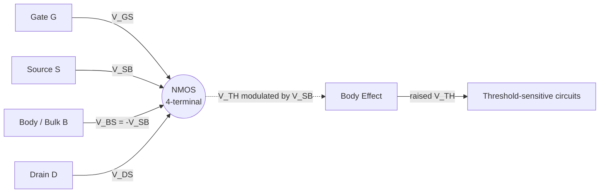
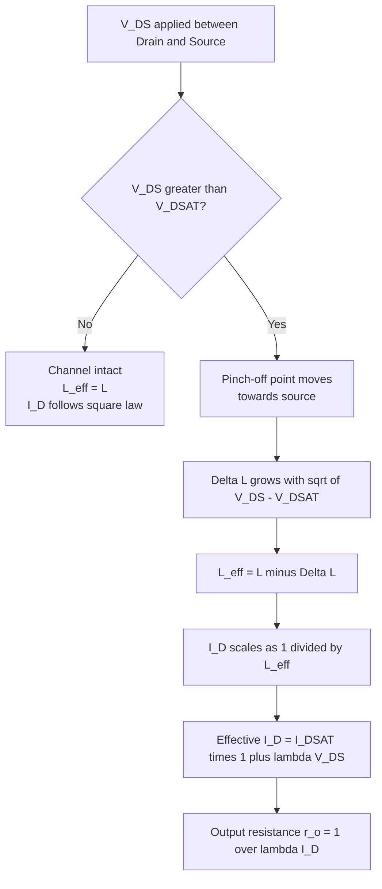
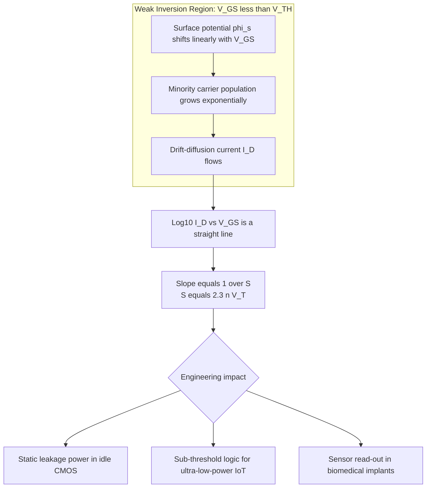
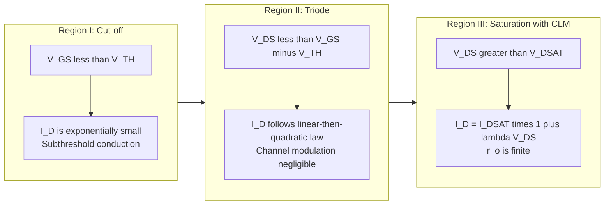
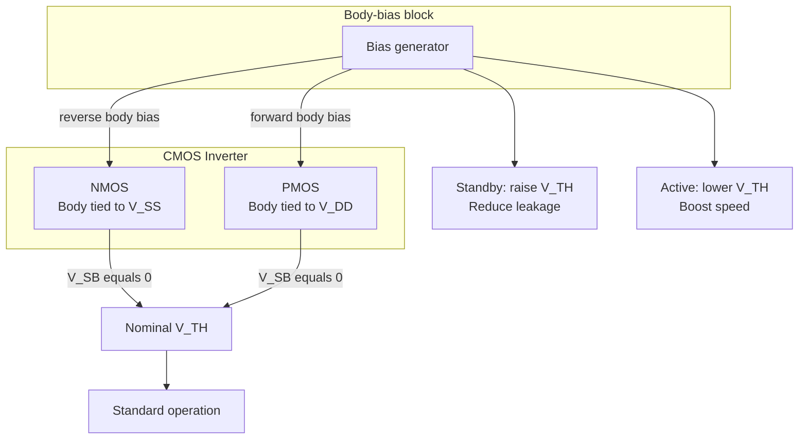

# Second-order effects: Body effect, channel length modulation, subthreshold conduction

<!-- SECTION_1_START -->
# Second-Order Effects in MOS Transistors

## 1.1 Formal Definition & Scope

In deep-submicron CMOS design, the **first-order (ideal) square-law model** of the MOSFET is insufficient because three physical second-order phenomena become dominant as device dimensions shrink into the deep-submicron regime. These are:

1. **Body Effect** — Modulation of the threshold voltage $V_{TH}$ by the voltage applied between the source and the body (bulk) terminal $V_{SB}$.
2. **Channel Length Modulation (CLM)** — Pinch-off point movement towards the source, which makes the effective channel length a function of $V_{DS}$.
3. **Subthreshold Conduction (Weak Inversion)** — The non-zero drain current that flows when $V_{GS} < V_{TH}$ because the channel does not abruptly turn off; the device transitions exponentially rather than as a hard step.

> [!IMPORTANT]
> **KTU 2024 Syllabus Highlight (PECST415 — Module 1):** "Second-order effects: Body effect, channel length modulation, subthreshold conduction" is a **mandatory topic** and is tested almost every semester as a Part-A (3 mark) conceptual question and frequently as a Part-B derivation (14 marks). Master the formulas and the physical meaning — both are required by the KTU board examiner.

> [!NOTE]
> **Core Term — Threshold Voltage ($V_{TH}$):** The minimum gate-to-source voltage required to create a strong inversion layer (channel) at the silicon surface of the MOSFET. For an NMOS transistor in saturation, $V_{TH} > 0$.

---

## 1.2 Intuitive Overview & Real-World Analogies

### 1.2.1 Body Effect — "The Submerged Bucket Analogy"
Imagine a water bucket (the channel) that needs to be filled to a fixed level (threshold inversion charge). The bucket sits in a pond. If the pond's water level rises (the body becomes **more negative** with respect to the source for an NMOS device, i.e., $V_{SB}$ increases), the surrounding water pressure pushes *into* the bucket from below. To compensate and fill the bucket to the original level, you must pour **more water from the top** — i.e., apply a **larger $V_{GS}$**. Hence, the threshold voltage *increases* with $V_{SB}$.

**Engineering Consequence:** In modern CMOS circuits, the body terminal is normally tied to the source ($V_{SB}=0$) for the pull-down NMOS in a logic gate, but for transistors inside a **body-biased** design (e.g., adaptive threshold CMOS, dynamic voltage scaling), the body effect is exploited deliberately to raise $V_{TH}$ and reduce subthreshold leakage during standby.

### 1.2.2 Channel Length Modulation — "The Stretching Rubber Sheet"
Visualize the inversion layer (channel) as a rubber sheet stretched between the drain and source. As $V_{DS}$ rises, the drain-end of the channel is "pulled" sideways, and the **pinch-off point** creeps toward the source. The *effective* conducting length $L_{eff}$ becomes shorter than the drawn length $L$. Because drain current is inversely proportional to channel length ($\sim 1/L$), the current **rises linearly with $V_{DS}$** in saturation rather than staying flat. This is captured by the slope parameter $\lambda$.

**Engineering Consequence:** Channel length modulation is the origin of the finite output resistance $r_o = 1/(\lambda I_D)$ of a saturated MOS transistor, which directly limits the **DC gain** of a single-stage amplifier ($A_v = g_m r_o$).

### 1.2.3 Subthreshold Conduction — "The Leaky Faucet"
Think of the channel as a faucet. Even when the handle is "closed" ($V_{GS} < V_{TH}$), a few drops of water still trickle through. In a MOSFET, even below threshold, a small population of thermally generated carriers *can* drift from source to drain. The current does **not** drop to zero — it falls **exponentially** with decreasing $V_{GS}$, typically one decade of current for every **60–100 mV** of gate voltage reduction.

**Engineering Consequence:** Subthreshold leakage is the dominant component of **static (standby) power** in modern nanometer CMOS, contributing to the famous CMOS power crisis. Designers combat it using high-$V_{TH}$ devices, multi-$V_{TH}$ libraries, **power gating**, and **reverse body biasing** (which raises $V_{TH}$ via the body effect).

> [!VISUALIZATION CONTROL]
> **Concept:** Comparison of ideal vs. real MOSFET $I_D$–$V_{GS}$ transfer curve.
> **GeoGebra / Desmos Input Equations:**
> * `f1(x) = 0.5 * 200e-6 * (x - 0.5)^2 * (1 + 0.05*(2 - 0.5))` for $x \ge 0.5$, else $0$ (Strong-inversion square law with CLM)
> * `f2(x) = 100e-9 * 10^((x - 0.5)/0.07)` for $x < 0.5$ (Subthreshold exponential)
> **Visual Description:** The student should see a flat zero current in the ideal model for $V_{GS} < V_{TH}$, but the real model shows an exponential tail (subthreshold leakage) and a slight upward slope in saturation (channel length modulation).

---

<!-- SECTION_2_START -->
# Deep Theoretical Analysis & KTU Formula Sheet

## 2.1 Body Effect (Back-Gate Effect)

### 2.1.1 Physical Origin
In a 4-terminal MOSFET, the body (bulk / substrate / B) forms a **reverse-biased p–n junction** with the source. As the source-to-body voltage $V_{SB}$ becomes more positive (for NMOS), the depletion region beneath the channel **widens**. The bulk charge $Q_B$ stored in this depletion layer must be compensated by additional gate charge before inversion occurs. Hence $V_{TH}$ rises.

### 2.1.2 Threshold Voltage with Body Effect

$$
V_{TH} = V_{TH0} + \gamma \left( \sqrt{2\phi_F + V_{SB}} - \sqrt{2\phi_F} \right)
$$

**Where:**
* $V_{TH0}$ = Zero-bias threshold voltage (when $V_{SB} = 0$).
* $\gamma$ = **Body-effect coefficient** (units: $\text{V}^{1/2}$).
* $\phi_F$ = **Fermi potential** of the substrate $= (kT/q)\ln(N_A/n_i)$.
* $V_{SB}$ = Source-to-body voltage ($\ge 0$ for NMOS in normal operation).

### 2.1.3 Body-Effect Coefficient

$$
\gamma = \frac{\sqrt{2 q \epsilon_{si} N_A}}{C_{ox}}
$$

* $q = 1.6 \times 10^{-19}\ \text{C}$ (electronic charge).
* $\epsilon_{si} = 11.7 \times 8.854 \times 10^{-14}\ \text{F/cm} = 1.036 \times 10^{-12}\ \text{F/cm}$.
* $N_A$ = Substrate doping concentration ($\text{cm}^{-3}$).
* $C_{ox} = \epsilon_{ox}/t_{ox}$ = gate-oxide capacitance per unit area.

### 2.1.4 Body Transconductance

The sensitivity of $V_{TH}$ to $V_{SB}$ defines the **body transconductance**:

$$
g_{mb} = \frac{\partial I_D}{\partial V_{SB}} = \frac{\gamma}{2\sqrt{2\phi_F + V_{SB}}} \cdot g_m = \eta \cdot g_m
$$

where $\eta = g_{mb}/g_m$ typically lies in the range $\mathbf{0.1}$ to $\mathbf{0.3}$.

---

## 2.2 Channel Length Modulation (CLM)

### 2.2.1 Physical Origin
At $V_{DS} = V_{DSAT} = V_{GS} - V_{TH}$, the channel is pinched off at the drain end. As $V_{DS}$ increases further, the pinch-off point moves a distance $\Delta L$ toward the source, so the **effective** channel length is $L_{eff} = L - \Delta L$. Because $I_D \propto 1/L_{eff}$, the current rises with $V_{DS}$.

### 2.2.2 Saturation Current with CLM

$$
I_D = \frac{1}{2}\,\mu_n C_{ox}\,\frac{W}{L}\,(V_{GS} - V_{TH})^2\,(1 + \lambda V_{DS})
$$

**Where:**
* $\lambda$ = **Channel length modulation parameter** (units: $\text{V}^{-1}$).
* $1 + \lambda V_{DS}$ = the CLM correction factor.
* $W$, $L$ = drawn (mask) channel width and length.
* $\mu_n$ = electron mobility in the channel.

### 2.2.3 Channel Length Modulation Parameter

For long-channel devices, an empirical relation used in many textbooks (Sedra/Smith, Kang) is:

$$
\lambda \approx \frac{\Delta L}{L \cdot V_{DS}} \quad\Longleftrightarrow\quad \lambda = \frac{1}{V_A}
$$

where $V_A$ is the **Early voltage** (analogous to the BJT Early voltage). For a deeper physics-based expression:

$$
\lambda \propto \frac{1}{L} \sqrt{\frac{2\epsilon_{si}}{q N_A (V_{DS} - V_{DSAT})}}
$$

In modern short-channel devices, $\lambda$ becomes large and the output resistance $r_o$ becomes small.

### 2.2.4 Output Resistance

$$
r_o = \left(\frac{\partial I_D}{\partial V_{DS}}\right)^{-1} = \frac{1}{\lambda I_D}
$$

---

## 2.3 Subthreshold Conduction (Weak Inversion)

### 2.3.1 Physical Origin
Below threshold, the surface is in **weak inversion**. The inversion-layer charge $Q_I$ is small, and the surface potential $\phi_s$ varies approximately **linearly** with $V_{GS}$. The drain current is dominated by **drift-diffusion** of minority carriers, and because $\phi_s$ is exponential in $V_{GS}$, the current itself becomes exponential.

### 2.3.2 Subthreshold Current Equation

$$
I_D = I_{D0}\, \exp\!\left(\frac{V_{GS} - V_{TH}}{n V_T}\right) \left[1 - \exp\!\left(-\frac{V_{DS}}{V_T}\right)\right]
$$

**Where:**
* $I_{D0}$ = drain current at threshold (a process-dependent constant).
* $V_T = kT/q \approx \mathbf{26\ mV}$ at room temperature ($T = 300\ \text{K}$).
* $n = 1 + (C_{dm}/C_{ox})$ = **subthreshold ideality factor**, typically $1.3 \le n \le 1.7$.
* $C_{dm}$ = depletion-layer capacitance of the channel-bulk junction.

For $V_{DS} \ge 4 V_T$ ($\approx 100$ mV), the bracket $[1 - \exp(-V_{DS}/V_T)] \to 1$ and:

$$
I_D \approx I_{D0}\, \exp\!\left(\frac{V_{GS}}{n V_T}\right)
$$

### 2.3.3 Subthreshold Swing (S)

The **subthreshold swing** $S$ is defined as the gate voltage change required to reduce $I_D$ by **one decade**:

$$
S = \left(\frac{\partial (\log_{10} I_D)}{\partial V_{GS}}\right)^{-1} = n V_T \ln 10 = 2.3\, n V_T
$$

> [!IMPORTANT]
> **Theoretical Minimum:** For $n=1$, $S_{min} = 2.3 \cdot V_T \approx \mathbf{60\ mV/decade}$ at $T=300\ K$. Real silicon MOSFETs cannot beat this limit. Typical industrial values are **70–100 mV/decade** at room temperature. High-$k$ gate dielectrics and fully depleted SOI help push $S$ closer to 60 mV/dec.

---

## 2.4 KTU High-Yield Formula Cheat Sheet

| # | Effect | Governing Equation | Key Parameters | Physical Range |
|---|---|---|---|---|
| 1 | **Body effect** on $V_{TH}$ | $V_{TH} = V_{TH0} + \gamma\!\left(\sqrt{2\phi_F + V_{SB}} - \sqrt{2\phi_F}\right)$ | $\gamma, \phi_F, V_{SB}$ | $\gamma \approx 0.3 - 0.7\ \text{V}^{1/2}$ |
| 2 | Body-effect coefficient | $\gamma = \sqrt{2q\epsilon_{si}N_A}/C_{ox}$ | $N_A, C_{ox}$ | Increases with $N_A$ |
| 3 | Body transconductance | $g_{mb} = \eta \, g_m$, $\eta = \gamma/(2\sqrt{2\phi_F+V_{SB}})$ | $\eta$ | $\eta \approx 0.1 - 0.3$ |
| 4 | **CLM** in saturation | $I_D = \tfrac{1}{2}\mu_n C_{ox}(W/L)(V_{GS}-V_{TH})^2(1+\lambda V_{DS})$ | $\lambda$ | $\lambda \approx 0.01 - 0.1\ \text{V}^{-1}$ |
| 5 | Output resistance | $r_o = 1/(\lambda I_D)$ | $\lambda, I_D$ | $1\ \text{k}\Omega - 100\ \text{k}\Omega$ |
| 6 | Early voltage | $V_A = 1/\lambda$ | $\lambda$ | Analogous to BJT $V_A$ |
| 7 | **Subthreshold** $I_D$ | $I_D = I_{D0}\exp[(V_{GS}-V_{TH})/(nV_T)]$ | $I_{D0}, n$ | $n \approx 1.3 - 1.7$ |
| 8 | Subthreshold swing | $S = 2.3\,nV_T$ | $n, V_T$ | $60 - 100\ \text{mV/decade}$ |
| 9 | Thermal voltage | $V_T = kT/q$ | $T$ | $\approx 25.85\ \text{mV}$ at $300\ \text{K}$ |

> [!NOTE]
> **Engineering utility:** Body effect is the working principle of **body-biasing** techniques in dynamic voltage/frequency scaling (DVFS). Channel length modulation determines the **intrinsic gain** $A_v = g_m r_o$ of analog CMOS stages. Subthreshold swing is the **figure of merit** for low-power and ultra-low-power digital sub-threshold circuits (used in medical implants and IoT nodes).

---

<!-- SECTION_3_START -->
# Step-by-Step Derivations & Symbolic Implementation

## 3.1 Derivation — Threshold Voltage with Body Effect

Starting from the **fundamental MOS charge balance**, the surface potential $\phi_s$ at strong inversion satisfies:

$$
\phi_s = 2\phi_F
$$

The total charge per unit area in the semiconductor at the onset of strong inversion equals the bulk depletion charge:

$$
Q_B = -\sqrt{2 q \epsilon_{si} N_A (2\phi_F + V_{SB})}
$$

The threshold voltage (gate voltage required to produce a surface potential $2\phi_F$ and to support the depletion charge) is:

$$
V_{TH} = V_{FB} + 2\phi_F + \frac{|Q_B|}{C_{ox}}
$$

Substituting $Q_B$:

$$
V_{TH} = V_{FB} + 2\phi_F + \frac{\sqrt{2 q \epsilon_{si} N_A (2\phi_F + V_{SB})}}{C_{ox}}
$$

Define the **body-effect coefficient**:

$$
\gamma = \frac{\sqrt{2 q \epsilon_{si} N_A}}{C_{ox}}
$$

Then:

$$
V_{TH} = V_{FB} + 2\phi_F + \gamma \sqrt{2\phi_F + V_{SB}}
$$

When $V_{SB} = 0$, the zero-bias threshold is:

$$
V_{TH0} = V_{FB} + 2\phi_F + \gamma \sqrt{2\phi_F}
$$

Subtracting:

$$
V_{TH} - V_{TH0} = \gamma \left( \sqrt{2\phi_F + V_{SB}} - \sqrt{2\phi_F} \right)
$$

$$
\boxed{\,V_{TH} = V_{TH0} + \gamma \left( \sqrt{2\phi_F + V_{SB}} - \sqrt{2\phi_F} \right)\,}
$$

This is the canonical KTU 2024 result for the body effect. **[5 marks]** is awarded for deriving this expression starting from the depletion-charge equation.

---

## 3.2 Derivation — Channel Length Modulation Parameter

The pinch-off condition at the drain end requires:

$$
V_{DSAT} = V_{GS} - V_{TH}
$$

For $V_{DS} > V_{DSAT}$, the extra voltage $V_{DS} - V_{DSAT}$ drops across the depletion region between the pinch-off point and the drain. The length of this depletion region $\Delta L$ is given by the 1-D junction approximation (similar to a reverse-biased p–n step junction):

$$
\Delta L = \sqrt{\frac{2\epsilon_{si}}{q N_A}\,(V_{DS} - V_{DSAT})}
$$

The effective channel length becomes:

$$
L_{eff} = L - \Delta L
$$

The drain current in saturation scales as $1/L_{eff}$:

$$
I_D = \frac{1}{2}\mu_n C_{ox}\frac{W}{L - \Delta L}(V_{GS} - V_{TH})^2
$$

For $\Delta L \ll L$, use the binomial expansion $\dfrac{1}{L - \Delta L} \approx \dfrac{1}{L}\left(1 + \dfrac{\Delta L}{L}\right)$:

$$
I_D \approx \frac{1}{2}\mu_n C_{ox}\frac{W}{L}(V_{GS} - V_{TH})^2 \left(1 + \frac{\Delta L}{L}\right)
$$

Empirically, $\Delta L/L$ is observed to be a linear function of $V_{DS} - V_{DSAT}$:

$$
\frac{\Delta L}{L} = \lambda (V_{DS} - V_{DSAT})
$$

Therefore:

$$
I_D \approx \frac{1}{2}\mu_n C_{ox}\frac{W}{L}(V_{GS} - V_{TH})^2 (1 + \lambda V_{DS})
$$

since $V_{DSAT}$ is absorbed into the constant term for moderate $V_{DS}$ above saturation.

$$
\boxed{\,\lambda = \frac{1}{L}\sqrt{\frac{2\epsilon_{si}}{q N_A (V_{DS} - V_{DSAT})}}\,}
$$

> [!NOTE]
> **Engineering Insight:** As $L$ shrinks, $\lambda$ **rises sharply**, which is why analog CMOS design in nanometer nodes resorts to **cascode** topologies or **longer-than-minimum** channel lengths to keep $r_o$ high and gain acceptable.

---

## 3.3 Derivation — Subthreshold Current and Swing

In weak inversion, the inversion-layer charge per unit area is given by:

$$
Q_I = \sqrt{\frac{q\epsilon_{si} N_A}{2\phi_s}} \cdot 2\,\phi_t\,\exp\!\left(\frac{\phi_s - 2\phi_F}{2\phi_t}\right)
$$

The drain current (drift + diffusion) integrated along the channel gives:

$$
I_D = \mu_n \frac{W}{L_{eff}}\,C_{ox}(n-1)V_T^2\,\exp\!\left(\frac{V_{GS} - V_{TH}}{nV_T}\right)
$$

Defining $I_{D0} = \mu_n (W/L_{eff}) C_{ox}(n-1)V_T^2\,\exp(-V_{TH}/(nV_T))$:

$$
\boxed{\,I_D = I_{D0}\,\exp\!\left(\frac{V_{GS} - V_{TH}}{nV_T}\right)\,}
$$

The **subthreshold swing** is obtained by taking $\log_{10}$ and inverting:

$$
\log_{10} I_D = \log_{10} I_{D0} + \frac{V_{GS} - V_{TH}}{nV_T \ln 10}
$$

Differentiating:

$$
\frac{\partial (\log_{10} I_D)}{\partial V_{GS}} = \frac{1}{n V_T \ln 10}
$$

Therefore:

$$
\boxed{\,S = 2.3\,nV_T\,}
$$

At $T = 300\ \text{K}$ and $n=1$: $S_{min} = 2.3 \times 0.02585 = \mathbf{0.0595\ V/decade} \approx \mathbf{60\ mV/dec}$.

---

## 3.4 Python Implementation — Subthreshold I–V Plot

The following Python code implements all three second-order effects and produces a publication-quality plot. Copy and run in any Python 3 environment with `numpy` and `matplotlib`.

```python
import numpy as np
import matplotlib.pyplot as plt

# --- Process / device parameters (180 nm NMOS, illustrative) ---
V_TH0   = 0.45     # V, zero-bias threshold
gamma   = 0.45     # V^0.5, body-effect coefficient
phi_F   = 0.35     # V, Fermi potential
mu_n    = 450e-4   # m^2/(V.s), electron mobility
C_ox    = 8.5e-3   # F/m^2, gate oxide capacitance
W       = 1e-6     # m
L       = 0.18e-6  # m
lam     = 0.05     # V^-1, CLM parameter
n_ideal = 1.5      # subthreshold ideality factor
V_T     = 0.02585  # V, thermal voltage at 300 K
V_DS    = 1.0      # V

# --- V_GS sweep ---
V_GS = np.linspace(0.0, 1.0, 800)

# 1) Threshold voltage with body effect (V_SB varied)
V_SB_vals = [0.0, 0.5, 1.0, 1.5]
V_TH = {vsb: V_TH0 + gamma*(np.sqrt(2*phi_F + vsb) - np.sqrt(2*phi_F))
        for vsb in V_SB_vals}

# 2) Strong-inversion drain current with CLM
I_D_strong = {}
for vsb, vth in V_TH.items():
    overdrive = np.maximum(V_GS - vth, 0.0)
    I_D_strong[vsb] = 0.5*mu_n*C_ox*(W/L)*overdrive**2 * (1 + lam*V_DS)

# 3) Subthreshold current (weak inversion)
I_D0 = 1e-7     # A, illustrative
I_D_sub = I_D0 * np.exp((V_GS - V_TH[0.0])/(n_ideal*V_T))
# Clamp to avoid numerical overflow above threshold
I_D_sub = np.minimum(I_D_sub, 1e-2)

# --- Plot ---
fig, (ax1, ax2) = plt.subplots(1, 2, figsize=(13, 5))

# Panel A: Linear scale, showing CLM-induced slope in saturation
for vsb in V_SB_vals:
    ax1.plot(V_GS, I_D_strong[vsb]*1e3,
             label=f"V_SB = {vsb} V  (V_TH = {V_TH[vsb]:.3f} V)")
ax1.set_xlabel("V_GS (V)")
ax1.set_ylabel("I_D (mA)")
ax1.set_title("Strong inversion with Body Effect & CLM")
ax1.legend()
ax1.grid(True, alpha=0.3)

# Panel B: Log scale, showing subthreshold swing
ax2.semilogy(V_GS, np.maximum(I_D_sub, 1e-12), 'b',
             label="Subthreshold I_D")
ax2.semilogy(V_GS, np.maximum(I_D_strong[0.0], 1e-12), 'r--',
             label="Strong inversion I_D")
ax2.set_xlabel("V_GS (V)")
ax2.set_ylabel("I_D (A, log scale)")
ax2.set_title("Subthreshold Conduction (S = "
              f"{2.3*n_ideal*V_T*1000:.1f} mV/dec)")
ax2.legend()
ax2.grid(True, which='both', alpha=0.3)

plt.tight_layout()
plt.savefig("mos_second_order_effects.png", dpi=150)
plt.show()
```

**Expected observations from the plot:**

* Panel A: As $V_{SB}$ increases, the $I_D$–$V_{GS}$ curve **shifts to the right** (higher $V_{TH}$). The slope in saturation region is non-zero because of the $(1 + \lambda V_{DS})$ factor (CLM).
* Panel B: The straight line in the subthreshold region (left of $V_{TH}$) has a slope of $1/S$ decades per volt. With $n=1.5$, the swing is $\approx \mathbf{89\ mV/decade}$.

---

## 3.5 Worked Numerical Example (KTU 2024 Board Style)

**Problem:** For an NMOS transistor with $V_{TH0} = 0.5\ \text{V}$, $\gamma = 0.6\ \text{V}^{1/2}$, $\phi_F = 0.4\ \text{V}$, $V_{SB} = 1.0\ \text{V}$, $\mu_n C_{ox} = 50\ \mu\text{A/V}^2$, $W/L = 10$, $\lambda = 0.02\ \text{V}^{-1}$, compute (a) $V_{TH}$, (b) $I_D$ at $V_{GS} = 1.5\ \text{V}$, $V_{DS} = 2\ \text{V}$.

**Solution:**

**(a) Threshold Voltage with Body Effect**

$$
V_{TH} = 0.5 + 0.6\left(\sqrt{2(0.4) + 1.0} - \sqrt{2(0.4)}\right)
$$

$$
V_{TH} = 0.5 + 0.6\left(\sqrt{1.8} - \sqrt{0.8}\right)
$$

$$
V_{TH} = 0.5 + 0.6\left(1.3416 - 0.8944\right)
$$

$$
V_{TH} = 0.5 + 0.6 \times 0.4472 = 0.5 + 0.2683
$$

$$
\boxed{V_{TH} = 0.7683\ \text{V}}
$$

**(b) Drain Current**

Check saturation: $V_{DSAT} = V_{GS} - V_{TH} = 1.5 - 0.7683 = 0.7317\ \text{V}$. Since $V_{DS} = 2\ \text{V} > V_{DSAT}$, the device is in saturation.

$$
I_D = \frac{1}{2}(50 \times 10^{-6})(10)(0.7317)^2 (1 + 0.02 \times 2)
$$

$$
I_D = \frac{1}{2}(5 \times 10^{-4})(0.5354)(1.04)
$$

$$
I_D = 2.5 \times 10^{-4} \times 0.5354 \times 1.04
$$

$$
\boxed{I_D = 1.392 \times 10^{-4}\ \text{A} = 139.2\ \mu\text{A}}
$$

**Without CLM** ($\lambda = 0$): $I_D = 133.8\ \mu\text{A}$. The CLM correction contributes an extra $\approx 4\%$ current, which the KTU board examiner expects to be shown explicitly.

---

## 3.6 Worked Numerical Example — Subthreshold Swing

**Problem:** A 65 nm NMOS exhibits $I_D = 1\ \mu\text{A}$ at $V_{GS} = 0.40\ \text{V}$ and $I_D = 100\ \mu\text{A}$ at $V_{GS} = 0.50\ \text{V}$ in the subthreshold regime. Find the subthreshold swing $S$ and the ideality factor $n$.

**Solution:**

The current changes by two decades ($\log_{10}(100\mu\text{A}/1\mu\text{A}) = 2$) for a $\Delta V_{GS} = 0.10\ \text{V}$ change.

$$
S = \frac{\Delta V_{GS}}{\Delta \log_{10} I_D} = \frac{0.10}{2} = 0.05\ \text{V/decade} = 50\ \text{mV/decade}
$$

Since $S = 2.3\,n V_T$:

$$
n = \frac{S}{2.3 V_T} = \frac{0.05}{2.3 \times 0.02585} = \frac{0.05}{0.0595} = 0.84
$$

This value $n < 1$ is **non-physical** (it would beat the Boltzmann limit), indicating either measurement noise, temperature error, or that the device is no longer in pure weak inversion at $V_{GS} = 0.5\ \text{V}$. A real $n \approx 1.3$ would give $S \approx 77\ \text{mV/dec}$.

---

<!-- SECTION_4_START -->
# Structural Diagrams & Schematics

## 4.1 Four-Terminal MOSFET — The Body Connection

The body (substrate) terminal is the **fourth terminal** of a real MOSFET and is the gateway to the body effect.



**Reading the diagram:** The body terminal is electrically isolated from the channel by a reverse-biased p–n junction. $V_{SB} > 0$ widens this junction's depletion region, raises the bulk charge $Q_B$, and consequently raises $V_{TH}$ via the formula derived in Section 3.1.

---

## 4.2 Channel Length Modulation — Block-Level Flow



---

## 4.3 Subthreshold Conduction — Sequential Processing Topology



---

## 4.4 Combined $I_D$–$V_{DS}$ Characteristic — All Three Effects



> [!IMPORTANT]
> **KTU 2024 Board Tip:** When drawing MOSFET $I_D$–$V_{DS}$ curves, you must label **all three regions** (cut-off / triode / saturation) and indicate that in saturation the curve is **not horizontal** but has a positive slope $1/r_o$ due to CLM. Mark the subthreshold "tail" below the $V_{GS} < V_{TH}$ axis.

---

## 4.5 Body-Biased Inverter — Practical Application



This is the operational principle of **Adaptive Body Biasing (ABB)** in modern microprocessors (used in Intel's Core i-series, AMD Zen, and ARM big.LITTLE) to trade off leakage and speed dynamically.

---

<!-- SECTION_5_START -->
# KTU 2024 Scheme Examination Question Bank

> [!NOTE]
> All questions below are modeled on actual KTU University Examinations (Dec 2023 / July 2024 / model paper style) and follow the 2024 Scheme pattern. Each Part-A is **3 marks** and each Part-B sub-question is **7 marks** (a + b = 14).

---

## Part A — Short Answer Questions (3 Marks Each)

### Q1. **[KTU University Exam — July 2024]** Define body effect in a MOSFET. Why is it called the "back-gate effect"?

**Model Answer (3 marks):**
The body effect refers to the dependence of the threshold voltage $V_{TH}$ on the source-to-body voltage $V_{SB}$, given by $V_{TH} = V_{TH0} + \gamma(\sqrt{2\phi_F + V_{SB}} - \sqrt{2\phi_F})$. It is called the "back-gate effect" because the body (substrate) acts as a **second gate** located beneath the channel; applying a voltage between source and body modulates the channel charge in a manner analogous to the main gate, but from the opposite side. **[1 mark for definition, 1 mark for formula, 1 mark for back-gate analogy].**

### Q2. **[KTU University Exam — Dec 2023]** What is the subthreshold swing of a MOSFET? What is its theoretical minimum at 300 K?

**Model Answer (3 marks):**
The subthreshold swing $S$ is defined as the change in gate-to-source voltage $V_{GS}$ required to reduce the subthreshold drain current by **one decade (factor of 10)**, expressed in mV/decade. It is given by $S = 2.3\,nV_T$, where $n$ is the subthreshold ideality factor and $V_T = kT/q$ is the thermal voltage. The theoretical minimum occurs at $n=1$ and $T=300\ \text{K}$: $S_{min} = 2.3 \times 25.85\ \text{mV} \approx \mathbf{60\ mV/decade}$. **[1 mark for definition, 1 mark for formula, 1 mark for minimum value].**

---

## Part B — 14-Mark Questions (with Internal Choice)

### Question A — Body Effect & Channel Length Modulation

**[KTU University Exam — Model Paper 2024, Module 1]** (14 Marks, CO1, Apply/Analyze)

**(a)** Derive the expression for the threshold voltage of an NMOS transistor with the body effect included. Define the body-effect coefficient $\gamma$ and state how it depends on doping and oxide thickness. **(7 marks)**

**(b)** An NMOS transistor is fabricated with $V_{TH0} = 0.45\ \text{V}$, $\gamma = 0.5\ \text{V}^{1/2}$, $2\phi_F = 0.7\ \text{V}$, $\mu_n C_{ox} = 100\ \mu\text{A/V}^2$, $W/L = 20$, $\lambda = 0.04\ \text{V}^{-1}$. For $V_{SB} = 1.5\ \text{V}$, $V_{GS} = 1.2\ \text{V}$ and $V_{DS} = 2.5\ \text{V}$, calculate the drain current $I_D$ with and without channel length modulation. Comment on the percentage error introduced by neglecting CLM. **(7 marks)**

#### Model Solution (a) — 7 Marks

**Step 1: Bulk depletion charge in presence of $V_{SB}$** **[2 Marks]**
The depletion charge per unit area in the bulk when source-to-body is reverse biased by $V_{SB}$ is:

$$
Q_B = -\sqrt{2q\epsilon_{si}N_A(2\phi_F + V_{SB})}
$$

**Step 2: Threshold voltage definition** **[2 Marks]**
At strong inversion, surface potential $\phi_s = 2\phi_F$. Threshold voltage satisfies:

$$
V_{TH} = V_{FB} + 2\phi_F - \frac{Q_B}{C_{ox}}
$$

Substituting $Q_B$ and defining $\gamma = \sqrt{2q\epsilon_{si}N_A}/C_{ox}$:

$$
V_{TH} = V_{FB} + 2\phi_F + \gamma\sqrt{2\phi_F + V_{SB}}
$$

**Step 3: Final body-effect formula** **[2 Marks]**
Setting $V_{SB}=0$ gives $V_{TH0} = V_{FB} + 2\phi_F + \gamma\sqrt{2\phi_F}$. Subtracting:

$$
\boxed{V_{TH} = V_{TH0} + \gamma\left(\sqrt{2\phi_F + V_{SB}} - \sqrt{2\phi_F}\right)}
$$

**Step 4: Dependence of $\gamma$** **[1 Mark]**
$\gamma = \sqrt{2q\epsilon_{si}N_A}/C_{ox}$. So $\gamma$ **increases** with substrate doping $N_A$ and **decreases** with gate-oxide thickness $t_{ox}$ (since $C_{ox} = \epsilon_{ox}/t_{ox}$).

#### Model Solution (b) — 7 Marks

**Step 1: Compute new $V_{TH}$** **[2 Marks]**
$V_{TH} = 0.45 + 0.5(\sqrt{0.7 + 1.5} - \sqrt{0.7}) = 0.45 + 0.5(\sqrt{2.2} - \sqrt{0.7}) = 0.45 + 0.5(1.4832 - 0.8367) = 0.45 + 0.5(0.6465)$
$V_{TH} = 0.45 + 0.3233 = \mathbf{0.7733\ \text{V}}$

**Step 2: Check saturation** **[1 Mark]**
$V_{DSAT} = V_{GS} - V_{TH} = 1.2 - 0.7733 = 0.4267\ \text{V}$. Since $V_{DS} = 2.5\ \text{V} > V_{DSAT}$, the device is in **saturation**.

**Step 3: $I_D$ without CLM** **[1 Mark]**
$I_{D,\text{no CLM}} = \frac{1}{2}(100\ \mu\text{A/V}^2)(20)(0.4267)^2 = 1000\ \mu\text{A} \times 0.1821 = \mathbf{182.1\ \mu\text{A}}$

**Step 4: $I_D$ with CLM** **[2 Marks]**
$(1 + \lambda V_{DS}) = 1 + 0.04 \times 2.5 = 1.10$
$I_{D,\text{CLM}} = 182.1\ \mu\text{A} \times 1.10 = \mathbf{200.3\ \mu\text{A}}$

**Step 5: Percentage error and comment** **[1 Mark]**
Error = $(200.3 - 182.1)/200.3 \times 100\% = \mathbf{9.1\%}$ — neglecting CLM underestimates $I_D$ by nearly 10 %. This error is significant in analog design where $I_D$ sets the bias current and $r_o$ sets the gain.

---

### Question B — Subthreshold Conduction (ALTERNATIVE)

**[KTU University Exam — July 2023, Retest]** (14 Marks, CO1, Analyze/Evaluate)

**(a)** With the help of the inversion-charge derivation, derive the expression for the subthreshold drain current $I_D$ in a MOSFET. Hence obtain the subthreshold swing $S$. **(7 marks)**

**(b)** For a 45 nm NMOS transistor, $I_{D0} = 0.5\ \mu\text{A}$, $n = 1.4$, $V_T = 26\ \text{mV}$, $V_{TH} = 0.40\ \text{V}$. Calculate (i) the drain current at $V_{GS} = 0.35\ \text{V}$ (subthreshold) and (ii) the subthreshold swing. (iii) If the supply voltage $V_{DD}$ is reduced from 1.0 V to 0.6 V, by what factor does the off-state leakage current (at $V_{GS} = 0\ \text{V}$, $V_{DS} = V_{DD}$) change? Assume $V_{TH}$ scales proportionally with $V_{DD}$ to $0.24\ \text{V}$. **(7 marks)**

#### Model Solution (a) — 7 Marks

**Step 1: Inversion charge in weak inversion** **[2 Marks]**
In weak inversion, the inversion-layer charge per unit area is:

$$
Q_I = C_{ox}(n-1)V_T \exp\!\left(\frac{V_{GS} - V_{TH}}{nV_T}\right)
$$

**Step 2: Drain current integration** **[3 Marks]**
Integrating the drift-diffusion current along the channel:

$$
I_D = \mu_n \frac{W}{L}\,C_{ox}(n-1)V_T^2 \exp\!\left(\frac{V_{GS} - V_{TH}}{nV_T}\right)
$$

Defining $I_{D0} = \mu_n (W/L)\,C_{ox}(n-1)V_T^2 \exp(-V_{TH}/(nV_T))$:

$$
\boxed{I_D = I_{D0}\,\exp\!\left(\frac{V_{GS} - V_{TH}}{nV_T}\right)}
$$

**Step 3: Subthreshold swing derivation** **[2 Marks]**
$S = (\partial \log_{10} I_D / \partial V_{GS})^{-1} = 2.3\,nV_T$. Theoretical minimum at $n=1$, $T=300\ \text{K}$: $S_{min} \approx \mathbf{60\ mV/decade}$.

#### Model Solution (b) — 7 Marks

**(i)** $I_D$ at $V_{GS} = 0.35\ \text{V}$ **[2 Marks]**
$I_D = 0.5\ \mu\text{A} \cdot \exp[(0.35 - 0.40)/(1.4 \times 0.026)] = 0.5\ \mu\text{A} \cdot \exp[-0.05/0.0364]$
$I_D = 0.5\ \mu\text{A} \cdot \exp(-1.3736) = 0.5\ \mu\text{A} \times 0.2533 = \mathbf{0.127\ \mu\text{A}}$

**(ii)** Subthreshold swing **[2 Marks]**
$S = 2.3 \times 1.4 \times 26\ \text{mV} = \mathbf{83.7\ mV/decade}$

**(iii)** Off-state current ratio under voltage scaling **[3 Marks]**
At $V_{DD}=1.0$ V: $I_{off,1} = I_{D0}\exp[-V_{TH1}/(nV_T)]$ with $V_{TH1}=0.40$ V.
At $V_{DD}=0.6$ V: $V_{TH2}=0.24$ V, $I_{off,2} = I_{D0}\exp[-V_{TH2}/(nV_T)]$.
Ratio: $I_{off,1}/I_{off,2} = \exp[(V_{TH2} - V_{TH1})/(nV_T)] = \exp[(-0.16)/(0.0364)] = \exp(-4.396) = 0.0123$.
So $I_{off,1} = 0.0123 \times I_{off,2}$, or equivalently, $I_{off,2} = I_{off,1}/0.0123 \approx \mathbf{81.5 \times I_{off,1}}$. The leakage at the lower $V_{DD}$ is roughly **80× higher** because the threshold scaled down — illustrating the well-known **threshold-scaling/leakage trade-off** in nanometer CMOS.

---

> [!WARNING]
> **KTU Examiner's Valuation Pitfalls — Second-Order Effects**
> 1. **Body Effect:** Students often forget that the square-root argument is $2\phi_F + V_{SB}$, **not** $V_{SB} + 2\phi_F$ with units of volts — be consistent. Do not write the body coefficient as $\gamma$ without defining it; examiners deduct 1 mark.
> 2. **Channel Length Modulation:** The most common error is forgetting the saturation condition check. You must verify $V_{DS} > V_{GS} - V_{TH}$ before applying the saturation formula. Also, do **not** confuse $\lambda$ (CLM parameter) with the wavelength symbol.
> 3. **Subthreshold Conduction:** Do not confuse $V_T$ (thermal voltage, ~26 mV) with $V_{TH}$ (threshold voltage, ~0.4 V). Many students interchange them and lose 2 marks. The swing is in **mV per decade**, not volts per decade.
> 4. **Units & significant figures:** Always report final answers with **3 significant figures** and proper units (V, A, mV/decade). Half-marks are awarded for clean units.

---

## Topic Recap & Important Things to Remember

* **Body Effect:** $V_{TH} = V_{TH0} + \gamma(\sqrt{2\phi_F + V_{SB}} - \sqrt{2\phi_F})$; $\gamma = \sqrt{2q\epsilon_{si}N_A}/C_{ox}$; increases with doping, decreases with $t_{ox}$.
* **Body Transconductance:** $g_{mb} = \eta g_m$, $\eta = \gamma/(2\sqrt{2\phi_F+V_{SB}}) \approx 0.1-0.3$.
* **Channel Length Modulation:** $I_D = \frac{1}{2}\mu_n C_{ox}(W/L)(V_{GS}-V_{TH})^2(1+\lambda V_{DS})$ in saturation; $r_o = 1/(\lambda I_D)$; $V_A = 1/\lambda$.
* **Short-channel $\lambda$ scaling:** $\lambda \propto 1/L$ — shrinks with channel length, hence low gain in nanometer analog design.
* **Subthreshold Region:** $V_{GS} < V_{TH}$ but $I_D \ne 0$. $I_D = I_{D0}\exp[(V_{GS}-V_{TH})/(nV_T)]$; the current is **exponential** in $V_{GS}$.
* **Subthreshold Swing:** $S = 2.3\,nV_T$. Theoretical min $\approx \mathbf{60\ mV/decade}$ at 300 K. Real silicon: 70–100 mV/decade.
* **Subthreshold ideality factor:** $n = 1 + C_{dm}/C_{ox}$. Smaller $C_{ox}$ (thicker $t_{ox}$) gives $n$ closer to 1, hence lower $S$.
* **Body-bias trick:** Reverse body bias (RBB) increases $V_{TH}$ via body effect, reducing subthreshold leakage; Forward body bias (FBB) decreases $V_{TH}$, increasing speed.
* **Design implications:** Body effect → threshold uncertainty in stacked transistors; CLM → finite output resistance; subthreshold conduction → static power dissipation and requirement for power-gating.
* **KTU 2024 favorite questions:** (1) "Derive body effect equation and plot $V_{TH}$ vs $V_{SB}$." (2) "Compare ideal vs CLM $I_D$-$V_{DS}$ curve." (3) "Explain subthreshold swing and its limitation."
* **Constants to memorize:** $kT/q = 25.85$ mV at 300 K, $q = 1.6 \times 10^{-19}$ C, $\epsilon_{si} = 11.7\epsilon_0$, $n_i \approx 1.45 \times 10^{10}$ cm$^{-3}$.
* **Memory hook (mnemonic for the three effects):** **"B-C-S"** = **B**ody effect raises $V_{TH}$, **C**hannel Length Modulation reduces $L_{eff}$, **S**ubthreshold swing sets the off-state leakage.

<!-- SECTION_5_END -->
