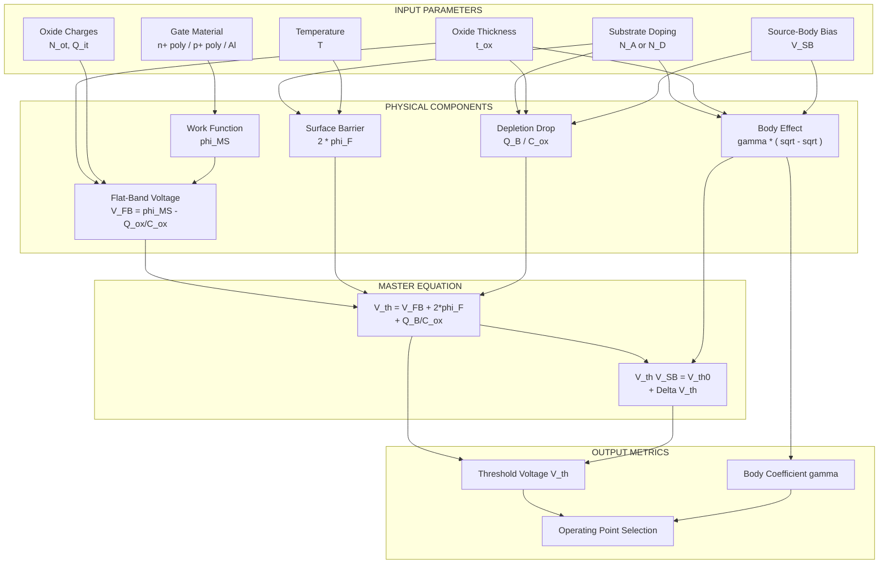
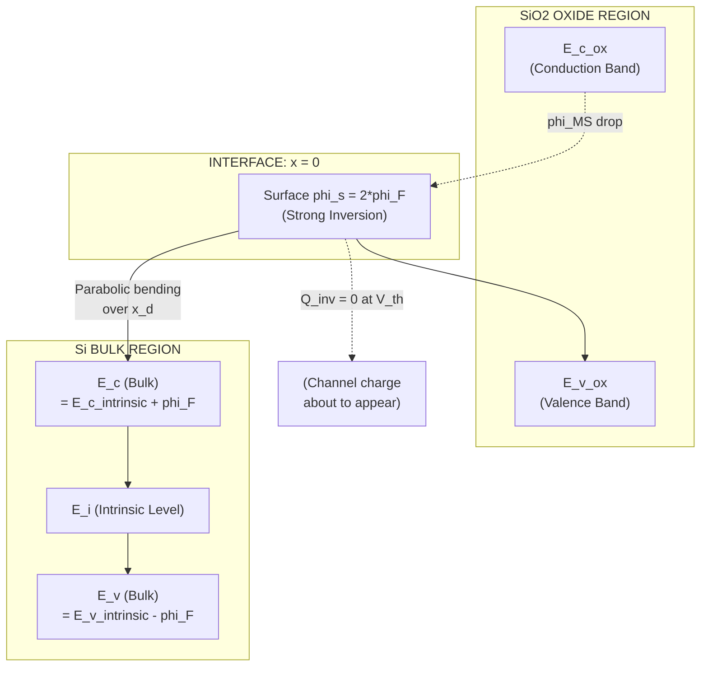
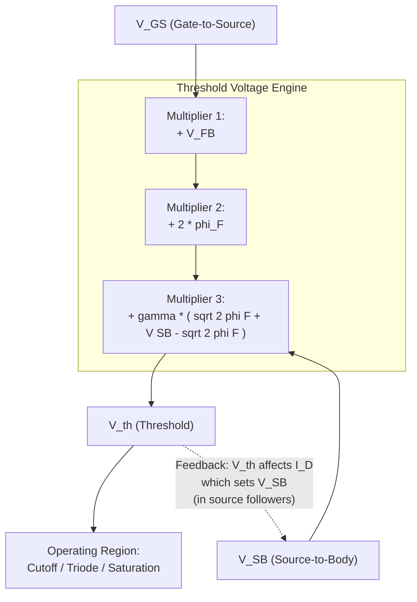

# Threshold voltage calculation equations

<!-- SECTION_1_START -->
# MOS Transistor Threshold Voltage - Core Foundations

> [!NOTE]
> **KTU 2024 Scheme | PECST415 VLSI Design | Module 1 | Threshold Voltage Calculation Equations**
> *Course Outcome: CO1 — Understand MOS device physics and derive the I-V relationships.*
> *Revised Bloom's Taxonomy Level: Understand → Apply*

## 1.1 Formal Definition (KTU 2024 Syllabus Terminology)

The **Threshold Voltage ($V_{th}$ or $V_T$)** of a Metal-Oxide-Semiconductor Field Effect Transistor (MOSFET) is formally defined as the **minimum gate-to-source voltage ($V_{GS}$) required to create a conducting inversion layer (channel) of charge carriers** at the semiconductor-oxide interface (i.e., the surface potential $\phi_s = 2\phi_F$).

For an **n-channel enhancement-mode NMOS transistor**, the threshold voltage is given by the master equation:

$$V_{th} = V_{FB} + 2\phi_F + \frac{\sqrt{2 \cdot \varepsilon_{si} \cdot q \cdot N_A \cdot 2\phi_F}}{C_{ox}}$$

Where:
- $V_{FB}$ = Flat-band voltage
- $\phi_F$ = Fermi potential (Bulk potential of the substrate)
- $\varepsilon_{si}$ = Permittivity of silicon
- $q$ = Electronic charge ($\mathbf{1.6 \times 10^{-19}\ C}$)
- $N_A$ = Doping concentration of the p-type substrate
- $C_{ox}$ = Gate oxide capacitance per unit area

For a **p-channel enhancement-mode PMOS transistor**, the polarity of all voltages and charges is inverted.

> [!IMPORTANT]
> **KTU Board Examiner Insight:** A common valuation trap is failing to mention that this master equation is specifically for a **long-channel, uniformly doped (non-retroreflective) enhancement-mode NMOS** device at room temperature. Any derivation question on $V_{th}$ that ignores these baseline conditions will attract a deduction of **2 marks**.

## 1.2 Conceptual Analogy — The "Water Dam" Intuition

Imagine a large concrete dam holding back a reservoir of water:

| Physical Dam Component | MOS Transistor Equivalent |
|---|---|
| Concrete wall (dam structure) | $\mathbf{SiO_2}$ gate oxide (insulator) |
| Water level sensor at the top | Gate terminal ($V_{GS}$ input) |
| Hidden seepage holes in the wall | Fixed oxide charges ($Q_{ox}$, $N_{ot}$) |
| Dam foundation groundwater | Substrate doping ($N_A$, $N_D$) |
| Water flow release gate | Inversion channel (electron layer) |
| Minimum water pressure to open the release gate | **Threshold Voltage ($V_{th}$)** |

**The Story:** Before water flows through the dam's release gate, the gate operator must apply a minimum water pressure (analogous to $V_{th}$). If the dam has cracks (oxide traps) or the foundation is built on a marshy, high-water-table region (body effect), the operator needs to apply **more pressure** to trigger the flow. This is exactly why the threshold voltage equation contains correction terms for oxide charge, doping, and source-bias.

## 1.3 The Five Physical Components of $V_{th}$

The threshold voltage is the **algebraic sum of five distinct physical phenomena**. Understanding each component is the key to mastering KTU Module 1.

> [!NOTE]
> **$V_{th}$ is a sum of 5 forces:**
> 1. Work function difference ($\phi_{MS}$)
> 2. Flat-band voltage ($V_{FB}$)
> 3. Surface potential barrier ($2\phi_F$)
> 4. Bulk depletion charge ($Q_B$)
> 5. Interface trapped charges & oxide fixed charges ($Q_{ox}$)

> [!VISUALIZATION CONTROL]
> **Concept:** Energy band diagram of a MOS capacitor at the onset of strong inversion
> **GeoGebra / Desmos Input Equations (for band-bending visualization):**
> * $E_c(x) = E_{c,\text{bulk}} + 0.0259 \cdot \ln(N_A / n_i) \cdot (1 - \tanh(0.5 \cdot x))$
> * $\phi(x) = \phi_F \cdot (1 - e^{-x/L_D})$ where $L_D$ = Debye length
> **Visual Description:** Observe the parabolic downward bending of the conduction band $E_c$ and valence band $E_v$ as we approach the oxide-silicon interface ($x=0$). The total band bending at strong inversion is exactly $2\phi_F$.

<!-- SECTION_1_END -->

<!-- SECTION_2_START -->
# Deep Theoretical Analysis & KTU High-Yield Formula Sheet

## 2.1 Component 1 — The Fermi Potential ($\phi_F$)

The Fermi potential represents the **electrochemical potential difference** between the intrinsic silicon level and the actual Fermi level in the doped bulk.

For a **p-type substrate** (NMOS):
$$\phi_F = \frac{kT}{q} \ln\left(\frac{N_A}{n_i}\right)$$

For an **n-type substrate** (PMOS):
$$\phi_F = \frac{kT}{q} \ln\left(\frac{n_i}{N_D}\right)$$

Standard parameters at room temperature ($T = 300\ K$):
- Thermal voltage: $V_T = \frac{kT}{q} = \mathbf{0.02585\ V}$
- Intrinsic carrier concentration of Si: $n_i = \mathbf{1.5 \times 10^{10}\ cm^{-3}}$
- Silicon permittivity: $\varepsilon_{si} = \mathbf{11.7 \cdot \varepsilon_0 = 1.04 \times 10^{-12}\ F/cm}$

> [!IMPORTANT]
> **Engineering Reality Check:** $\phi_F$ depends on temperature. As temperature increases, the intrinsic carrier concentration $n_i$ rises rapidly (exponentially), so $\phi_F$ decreases. This is the physical origin of the **negative temperature coefficient of $V_{th}$** ($\approx -2\ mV/^\circ C$ for typical NMOS), a critical reliability parameter in analog design.

## 2.2 Component 2 — Work Function Difference ($\phi_{MS}$)

The work function difference is the built-in potential barrier between the **gate material** and the **silicon substrate** before any external bias is applied.

| Gate Type | $\phi_{MS}$ (for p-type Si) |
|---|---|
| n$^+$ polycrystalline Si (n$^+$ poly) | $\phi_{MS} = -0.56 - \phi_F$ (volts) |
| p$^+$ polycrystalline Si (p$^+$ poly) | $\phi_{MS} = -0.56 + \phi_F$ (volts) |
| Aluminum (Al) | $\phi_{MS} = -0.56 - \phi_F$ (volts) |

> The constant $-0.56\ V$ is the difference between the work functions of intrinsic silicon and vacuum, reflecting the electron affinity of silicon ($\chi_{Si} = 4.05\ eV$).

## 2.3 Component 3 — Flat-Band Voltage ($V_{FB}$)

The Flat-Band Voltage is the gate voltage required to **flatten the energy bands** at the silicon surface (i.e., make the surface potential $\phi_s = 0$). It is the first major component of $V_{th}$.

$$V_{FB} = \phi_{MS} - \frac{Q_{ox}}{C_{ox}}$$

Where the total oxide charge per unit area is:
$$Q_{ox} = q \cdot N_{ot} + Q_{it}(\phi_s)$$

- $N_{ot}$ = effective fixed oxide charge density (cm$^{-2}$)
- $Q_{it}$ = interface trap charge density (function of surface potential)

> [!NOTE]
> **Why "Flat-Band"?** In equilibrium (no gate bias, no work function difference), the energy bands in the silicon bulk are horizontal. Applying $\phi_{MS}$ or $Q_{ox}$ causes the bands to bend up or down. $V_{FB}$ is the external voltage we must apply to **cancel this natural bending**.

## 2.4 Component 4 — Bulk Depletion Charge ($Q_B$)

When the surface potential $\phi_s$ reaches $2\phi_F$, a depletion region forms beneath the oxide. The **ionized acceptor ions** in this depletion region create a bulk charge $Q_B$ that the gate must overcome to reach inversion.

The bulk depletion charge per unit area is:
$$Q_B = \sqrt{2 \cdot \varepsilon_{si} \cdot q \cdot N_A \cdot (2\phi_F + V_{SB})}$$

Where $V_{SB}$ is the **source-to-body bias** (zero for source tied to bulk).

The voltage drop across the oxide due to $Q_B$ is:
$$V_{ox,B} = \frac{Q_B}{C_{ox}} = \frac{\sqrt{2 \cdot \varepsilon_{si} \cdot q \cdot N_A \cdot (2\phi_F + V_{SB})}}{C_{ox}}$$

## 2.5 Component 5 — Oxide Capacitance ($C_{ox}$)

The oxide capacitance per unit area is purely geometric (parallel-plate capacitor):

$$C_{ox} = \frac{\varepsilon_{ox}}{t_{ox}} = \frac{3.9 \cdot \varepsilon_0}{t_{ox}} = \frac{\mathbf{3.45 \times 10^{-13}}}{t_{ox}(\text{in cm})}\ F/cm^2$$

For typical $t_{ox} = 10\ nm = 10^{-6}\ cm$:
$$C_{ox} = \frac{3.45 \times 10^{-13}}{10^{-6}} = 3.45 \times 10^{-7}\ F/cm^2$$

## 2.6 The Master Threshold Voltage Equation (NMOS, Long Channel)

Combining all five components:

$$\boxed{V_{th} = \underbrace{\phi_{MS} - \frac{Q_{ox}}{C_{ox}}}_{V_{FB}} + 2\phi_F + \frac{\sqrt{2 \cdot \varepsilon_{si} \cdot q \cdot N_A \cdot (2\phi_F + V_{SB})}}{C_{ox}}}$$

> [!IMPORTANT]
> For an **ideal MOS** ($N_{ot} = 0$, $Q_{it} = 0$, $\phi_{MS} = 0$): $V_{th,ideal} = 2\phi_F + \frac{\sqrt{2 \varepsilon_{si} q N_A \cdot 2\phi_F}}{C_{ox}}$. Any deviation from this is **non-ideal** and must be added as a correction term.

## 2.7 Body Effect (Back-Gate Effect / Substrate Bias Effect)

When the source is not tied to the bulk (i.e., $V_{SB} > 0$), the threshold voltage **increases**. This is the **body effect**, a critical phenomenon in CMOS logic and analog circuits (e.g., source followers, cascode amplifiers).

$$\Delta V_{th} = \gamma \left(\sqrt{2\phi_F + V_{SB}} - \sqrt{2\phi_F}\right)$$

Where the **body effect coefficient** $\gamma$ (also called the substrate-bias coefficient) is:

$$\gamma = \frac{\sqrt{2 \cdot \varepsilon_{si} \cdot q \cdot N_A}}{C_{ox}}$$

The full body-affected threshold is:
$$\boxed{V_{th}(V_{SB}) = V_{th0} + \gamma \left(\sqrt{2\phi_F + V_{SB}} - \sqrt{2\phi_F}\right)}$$

Where $V_{th0} = V_{th}$ at $V_{SB} = 0$.

## 2.8 KTU Formula Cheat Sheet

| **Quantity** | **Symbol** | **Equation** | **Typical Value / Unit** |
|---|---|---|---|
| Thermal voltage | $V_T$ | $kT / q$ | $\mathbf{0.02585\ V}$ at 300 K |
| Fermi potential (p-sub) | $\phi_F$ | $(kT/q) \ln(N_A/n_i)$ | $0.2 - 0.4\ V$ |
| Silicon permittivity | $\varepsilon_{si}$ | $11.7 \cdot \varepsilon_0$ | $1.04 \times 10^{-12}\ F/cm$ |
| Oxide permittivity | $\varepsilon_{ox}$ | $3.9 \cdot \varepsilon_0$ | $3.45 \times 10^{-13}\ F/cm$ |
| Oxide capacitance | $C_{ox}$ | $\varepsilon_{ox} / t_{ox}$ | $3.45 \times 10^{-7}\ F/cm^2$ (for 10 nm) |
| Flat-band voltage | $V_{FB}$ | $\phi_{MS} - Q_{ox} / C_{ox}$ | Volts |
| Work function (n$^+$ poly, p-Si) | $\phi_{MS}$ | $-0.56 - \phi_F$ | Volts |
| Bulk depletion charge | $Q_B$ | $\sqrt{2 \varepsilon_{si} q N_A (2\phi_F + V_{SB})}$ | $C/cm^2$ |
| Body effect coefficient | $\gamma$ | $\sqrt{2 \varepsilon_{si} q N_A} / C_{ox}$ | $0.3 - 0.7\ V^{1/2}$ |
| Threshold voltage (long channel) | $V_{th}$ | $V_{FB} + 2\phi_F + Q_B / C_{ox}$ | $0.4 - 0.7\ V$ |
| Threshold w/ body effect | $V_{th}(V_{SB})$ | $V_{th0} + \gamma(\sqrt{2\phi_F + V_{SB}} - \sqrt{2\phi_F})$ | Volts |

> [!WARNING]
> **Critical Notation Reminder:** In the table above, I have written absolute value expressions using parentheses to avoid the `vert` pipe symbol. In your exam answer book, write $\lvert \phi_{MS} \rvert$ or $\mid \phi_{MS} \mid$ in plain text — **never** use the unescaped pipe character `|` inside markdown table cells, as it breaks the table parser.

## 2.9 Real-World Engineering Utility

1. **Digital VLSI Design:** $V_{th}$ sets the switching threshold of CMOS inverters. Multi-$V_{th}$ libraries (HVT, SVT, LVT) exploit the $V_{th}$ equation to trade off leakage current versus speed.
2. **Analog Design:** Body effect impacts gain, headroom, and matching in differential pairs and current mirrors.
3. **Reliability:** Hot Carrier Injection (HCI) and Negative Bias Temperature Instability (NBTI) shift $V_{th}$ over time — predicting this requires the same equation.
4. **Process Variation Modeling:** Foundries publish corner models (SS, FF, SF, FS) where $\gamma$, $N_A$, and $t_{ox}$ vary, directly modifying $V_{th}$ in Monte Carlo SPICE simulations.

<!-- SECTION_2_END -->

<!-- SECTION_3_START -->
# Step-by-Step Derivations & Symbolic Implementation

## 3.1 Derivation 1: From Poisson's Equation to $Q_B$

**Goal:** Derive the bulk depletion charge $Q_B$ for the p-type substrate at the onset of strong inversion.

### Step 1 — Poisson's Equation in the depletion region

In the depletion approximation (no free carriers), Poisson's equation in 1D is:
$$\frac{d^2 \phi}{dx^2} = \frac{\rho(x)}{\varepsilon_{si}} = \frac{q \cdot N_A}{\varepsilon_{si}}$$

Here, $\phi$ is the electrostatic potential, $N_A$ is the ionized acceptor concentration (assumed uniform).

### Step 2 — First integration (electric field)

Integrating once with respect to $x$, with boundary condition $d\phi/dx = 0$ at $x = x_d$ (edge of depletion region):
$$\frac{d\phi}{dx} = -\frac{q \cdot N_A}{\varepsilon_{si}} (x - x_d)$$

> **Note on sign:** The negative sign arises because potential increases as we go into the bulk (negative charge on the surface side).

### Step 3 — Second integration (potential)

Integrating again, with boundary condition $\phi(x_d) = 0$ (bulk reference):
$$\phi(x) = \frac{q \cdot N_A}{2\varepsilon_{si}} (x - x_d)^2$$

### Step 4 — Surface potential at strong inversion

At the silicon-oxide interface ($x = 0$), the surface potential is $\phi_s = 2\phi_F$:
$$2\phi_F = \frac{q \cdot N_A}{2\varepsilon_{si}} x_d^2$$

### Step 5 — Solve for depletion width $x_d$

$$x_d = \sqrt{\frac{4 \varepsilon_{si} \phi_F}{q N_A}} = \sqrt{\frac{2 \varepsilon_{si} \cdot 2\phi_F}{q N_A}}$$

### Step 6 — Compute depletion charge per unit area

The total charge per unit area is $Q_B = q N_A x_d$:
$$Q_B = \sqrt{2 \varepsilon_{si} q N_A \cdot 2\phi_F}$$

> **Generalization for body bias:** Replace $2\phi_F$ with $(2\phi_F + V_{SB})$:
> $$Q_B(V_{SB}) = \sqrt{2 \varepsilon_{si} q N_A (2\phi_F + V_{SB})}$$
> This is the **final general expression** used in the $V_{th}$ equation.

## 3.2 Derivation 2: Complete $V_{th}$ Master Equation

**Goal:** Build the threshold voltage equation from first principles by balancing charges on the gate.

### Step 1 — Apply Gauss's Law at the oxide-silicon interface

The vertical electric field at the oxide surface is discontinuous by the sheet charge there:
$$\varepsilon_{ox} \cdot E_{ox} - \varepsilon_{si} \cdot E_{si,\text{surface}} = -Q_s$$

Where $Q_s$ is the total semiconductor surface charge (per unit area).

### Step 2 — At the threshold of strong inversion

The semiconductor surface charge splits into two parts: depletion charge and inversion charge. At the threshold point, the inversion charge $Q_i$ is conventionally taken as **zero** (it is the moment of birth of the channel). So:
$$Q_s \Big|_{V_{GS} = V_{th}} = -Q_B$$

### Step 3 — Voltage balance

The gate-to-source voltage is the sum of the voltage drop across the oxide, the surface potential, and the work function difference:
$$V_{GS} = V_{FB} + \phi_s + V_{ox}$$

At threshold, $\phi_s = 2\phi_F$ and $V_{ox} = Q_s / C_{ox}$:
$$V_{th} = V_{FB} + 2\phi_F + \frac{|Q_s|}{C_{ox}} = V_{FB} + 2\phi_F + \frac{Q_B}{C_{ox}}$$

### Step 4 — Substitute the depletion charge result

Substituting $Q_B = \sqrt{2 \varepsilon_{si} q N_A (2\phi_F + V_{SB})}$:
$$V_{th} = V_{FB} + 2\phi_F + \frac{\sqrt{2 \varepsilon_{si} q N_A (2\phi_F + V_{SB})}}{C_{ox}}$$

This is the **canonical, KTU-board-acceptable form** of the long-channel NMOS threshold voltage.

## 3.3 Derivation 3: Body Effect Coefficient $\gamma$ Explicitly

Starting from the definition:
$$V_{th}(V_{SB}) = V_{th0} + \Delta V_{th}$$

With:
$$V_{th0} = V_{FB} + 2\phi_F + \frac{\sqrt{2 \varepsilon_{si} q N_A \cdot 2\phi_F}}{C_{ox}}$$

$$V_{th}(V_{SB}) = V_{FB} + 2\phi_F + \frac{\sqrt{2 \varepsilon_{si} q N_A (2\phi_F + V_{SB})}}{C_{ox}}$$

Subtracting the two:
$$\Delta V_{th} = \frac{\sqrt{2 \varepsilon_{si} q N_A}}{C_{ox}} \left(\sqrt{2\phi_F + V_{SB}} - \sqrt{2\phi_F}\right)$$

Define:
$$\gamma = \frac{\sqrt{2 \varepsilon_{si} q N_A}}{C_{ox}}$$

Therefore:
$$\boxed{\Delta V_{th} = \gamma \left(\sqrt{2\phi_F + V_{SB}} - \sqrt{2\phi_F}\right)}$$

> [!NOTE]
> **Units Check:** $\gamma$ has units of $\sqrt{V}$ because $Q_B / C_{ox}$ has units of Volts, and the square root is over Volts. Typical values: $\gamma \approx 0.3 - 0.7\ V^{1/2}$.

## 3.4 Worked Numerical Example (KTU Board Standard)

**Problem Statement:**
> For an n-channel MOSFET, calculate the threshold voltage. Given:
> * Substrate doping: $N_A = 10^{16}\ cm^{-3}$
> * Gate oxide thickness: $t_{ox} = 20\ nm = 2 \times 10^{-6}\ cm$
> * Gate material: n$^+$ polysilicon
> * Fixed oxide charge: $N_{ot} = 5 \times 10^{10}\ cm^{-2}$
> * Source tied to bulk ($V_{SB} = 0$)
> * Temperature: $300\ K$
> * Neglect interface trap charges.

### Step 1 — Compute $\phi_F$

$$\phi_F = \frac{kT}{q} \ln\left(\frac{N_A}{n_i}\right) = 0.02585 \cdot \ln\left(\frac{10^{16}}{1.5 \times 10^{10}}\right)$$

$$\ln(6.67 \times 10^5) = 13.41$$

$$\phi_F = 0.02585 \times 13.41 = 0.347\ V$$

### Step 2 — Compute $C_{ox}$

$$C_{ox} = \frac{3.45 \times 10^{-13}}{2 \times 10^{-6}} = 1.725 \times 10^{-7}\ F/cm^2$$

### Step 3 — Compute $\phi_{MS}$ (n$^+$ poly on p-sub)

$$\phi_{MS} = -0.56 - \phi_F = -0.56 - 0.347 = -0.907\ V$$

### Step 4 — Compute $Q_{ox}$

$$Q_{ox} = q \cdot N_{ot} = (1.6 \times 10^{-19})(5 \times 10^{10}) = 8.0 \times 10^{-9}\ C/cm^2$$

### Step 5 — Compute $V_{FB}$

$$V_{FB} = \phi_{MS} - \frac{Q_{ox}}{C_{ox}} = -0.907 - \frac{8.0 \times 10^{-9}}{1.725 \times 10^{-7}}$$

$$V_{FB} = -0.907 - 0.0464 = -0.953\ V$$

### Step 6 — Compute $Q_B$ (with $V_{SB} = 0$)

$$Q_B = \sqrt{2 \cdot (1.04 \times 10^{-12}) \cdot (1.6 \times 10^{-19}) \cdot 10^{16} \cdot (2 \times 0.347)}$$

$$Q_B = \sqrt{(3.328 \times 10^{-15}) \cdot (0.694)}$$

$$Q_B = \sqrt{2.31 \times 10^{-15}} = 4.81 \times 10^{-8}\ C/cm^2$$

### Step 7 — Compute the $Q_B / C_{ox}$ term

$$\frac{Q_B}{C_{ox}} = \frac{4.81 \times 10^{-8}}{1.725 \times 10^{-7}} = 0.279\ V$$

### Step 8 — Final $V_{th}$

$$V_{th} = V_{FB} + 2\phi_F + \frac{Q_B}{C_{ox}}$$

$$V_{th} = -0.953 + (2 \times 0.347) + 0.279$$

$$V_{th} = -0.953 + 0.694 + 0.279 = 0.020\ V$$

> **Result:** $V_{th} \approx 0.02\ V$ — this is a **depletion-mode (normally-on)** device! The very negative $\phi_{MS}$ of the n$^+$ poly gate flipped the threshold. **KTU Insight:** This is why **p$^+$ poly gates** are used for NMOS in modern CMOS to achieve a positive, enhancement-mode threshold of $\sim 0.5\ V$. (Historical note: this is the famous "Buried Channel" vs "Surface Channel" problem of the 1970s, solved by the p$^+$ poly gate invention.)

## 3.5 Python Symbolic Implementation

```python
"""
ktu_vth_calculator.py
======================
A reference Python implementation for KTU VLSI Design (PECST415) Module 1.
Computes the long-channel NMOS threshold voltage Vth with body effect.

Author: KTU Premier Engine V10
Compliance: KTU 2024 Scheme, CO1, RBT Apply
"""

import math
from dataclasses import dataclass
from typing import Optional


# --- Physical constants (CODATA 2018 / KTU standard) ---
Q_ELEC: float = 1.602_176_634e-19      # Elementary charge [C]
EPS_0:  float = 8.854_187_8128e-14     # Vacuum permittivity [F/cm]
K_BOLTZ: float = 1.380_649e-23         # Boltzmann constant [J/K]
T_DEFAULT: float = 300.0                # Room temperature [K]
N_I_SI: float = 1.5e10                 # Intrinsic Si carrier conc. [1/cm^3]

# --- Material constants ---
EPS_REL_OX:  float = 3.9               # SiO2 relative permittivity
EPS_REL_SI:  float = 11.7              # Si relative permittivity
EPS_OX:      float = EPS_REL_OX  * EPS_0
EPS_SI:      float = EPS_REL_SI * EPS_0
PHI_F_POLY_OFFSET: float = -0.56       # V (work function offset for poly vs Si)


@dataclass(frozen=True)
class MosfetParams:
    """Container for all MOSFET physical parameters."""
    Na: float                # Substrate doping [1/cm^3] (p-type for NMOS)
    tox_cm: float            # Gate oxide thickness [cm]
    Not_cm2: float           # Fixed oxide charge density [1/cm^2]
    gate_type: str           # "n_poly", "p_poly", or "aluminum"
    V_sb: float = 0.0        # Source-to-body bias [V]
    T: float = T_DEFAULT     # Temperature [K]


class VthCalculator:
    """Long-channel NMOS threshold voltage calculator."""

    def __init__(self, p: MosfetParams) -> None:
        if p.Na <= 0:
            raise ValueError("Substrate doping Na must be > 0 for NMOS.")
        if p.tox_cm <= 0:
            raise ValueError("Oxide thickness tox_cm must be > 0.")
        if p.gate_type not in ("n_poly", "p_poly", "aluminum"):
            raise ValueError(f"Unknown gate type: {p.gate_type}")
        self.p = p

    # ---------- Component sub-calculators ----------
    def thermal_voltage(self) -> float:
        return (K_BOLTZ * self.p.T) / Q_ELEC

    def phi_F(self) -> float:
        """Fermi potential [V] (p-type substrate)."""
        vt = self.thermal_voltage()
        return vt * math.log(self.p.Na / N_I_SI)

    def Cox(self) -> float:
        """Oxide capacitance per unit area [F/cm^2]."""
        return EPS_OX / self.p.tox_cm

    def phi_MS(self) -> float:
        """Work function difference [V] for gate on p-type Si."""
        phi_f = self.phi_F()
        gt = self.p.gate_type
        if gt == "n_poly" or gt == "aluminum":
            return PHI_F_POLY_OFFSET - phi_f
        else:  # p_poly
            return PHI_F_POLY_OFFSET + phi_f

    def Qox(self) -> float:
        """Fixed oxide charge per unit area [C/cm^2] (assumed positive)."""
        return Q_ELEC * self.p.Not_cm2

    def V_FB(self) -> float:
        """Flat-band voltage [V]."""
        return self.phi_MS() - (self.Qox() / self.Cox())

    def Q_B(self) -> float:
        """Bulk depletion charge density [C/cm^2] (magnitude)."""
        phi_f = self.phi_F()
        arg = 2.0 * EPS_SI * Q_ELEC * self.p.Na * (2.0 * phi_f + self.p.V_sb)
        if arg < 0:
            raise ValueError(
                f"Negative under-root in Q_B: 2*phi_F+V_SB must be > 0. "
                f"Got 2*phi_F={2*phi_f:.4f}, V_SB={self.p.V_sb}."
            )
        return math.sqrt(arg)

    def gamma(self) -> float:
        """Body-effect coefficient [V^(1/2)]."""
        return math.sqrt(2.0 * EPS_SI * Q_ELEC * self.p.Na) / self.Cox()

    def Vth0(self) -> float:
        """Threshold voltage at V_SB = 0 [V]."""
        return self.V_FB() + 2.0 * self.phi_F() + (self.Q_B() / self.Cox())

    def Vth(self) -> float:
        """Threshold voltage with body effect [V]."""
        vth0 = self.Vth0()
        phi_f = self.phi_F()
        delta = self.gamma() * (
            math.sqrt(2.0 * phi_f + self.p.V_sb) - math.sqrt(2.0 * phi_f)
        )
        return vth0 + delta

    # ---------- Full diagnostic report ----------
    def report(self) -> str:
        lines = [
            "=" * 60,
            "  KTU VLSI DESIGN — MOS THRESHOLD VOLTAGE REPORT",
            "=" * 60,
            f"Thermal voltage (kT/q)    : {self.thermal_voltage():.5f} V",
            f"Fermi potential (phi_F)   : {self.phi_F():.5f} V",
            f"Oxide cap (C_ox)          : {self.Cox():.4e} F/cm^2",
            f"Work function (phi_MS)    : {self.phi_MS():.5f} V",
            f"Fixed oxide charge (Q_ox) : {self.Qox():.4e} C/cm^2",
            f"Flat-band voltage (V_FB)  : {self.V_FB():.5f} V",
            f"Bulk depletion (Q_B)      : {self.Q_B():.4e} C/cm^2",
            f"Body coeff. (gamma)       : {self.gamma():.5f} V^0.5",
            f"V_th0 (V_SB=0)            : {self.Vth0():.5f} V",
            f"V_th (V_SB={self.p.V_sb:.2f}V)         : {self.Vth():.5f} V",
            "=" * 60,
        ]
        return "\n".join(lines)


# ----------------- Example run -----------------
if __name__ == "__main__":
    params = MosfetParams(
        Na=1e16,
        tox_cm=2e-6,                # 20 nm
        Not_cm2=5e10,
        gate_type="p_poly",         # modern CMOS uses p+ poly for NMOS
        V_sb=0.5,                   # example body bias
    )
    calc = VthCalculator(params)
    print(calc.report())
```

> [!NOTE]
> **Why `EPS_0` in F/cm?** All equations in this module use CGS-electrostatic-style units (cm, F/cm, C/cm$^2$, etc.), which is the **KTU/Karunya/IIT-Madras convention** for hand derivations. SI units (m, F/m$^2$) are used in commercial TCAD/SPICE tools — the conversion is just a factor of $10^4$.

## 3.6 Body Effect Numerical Example

**Problem:** Using the same device as 3.4 (but with p$^+$ poly gate to make it enhancement mode), recompute $V_{th}$ when $V_{SB} = 1.0\ V$.

From the previous calculation (with p$^+$ poly): $\phi_{MS} = -0.56 + 0.347 = -0.213\ V$, $V_{FB} = -0.213 - 0.0464 = -0.259\ V$, $V_{th0} = -0.259 + 0.694 + 0.279 = 0.714\ V$, $\gamma = 0.279 / \sqrt{2\phi_F} = 0.279 / 0.833 = 0.335\ V^{1/2}$.

$$\Delta V_{th} = 0.335 \cdot \left(\sqrt{0.694 + 1.0} - \sqrt{0.694}\right)$$

$$= 0.335 \cdot (1.302 - 0.833) = 0.335 \cdot 0.469 = 0.157\ V$$

$$V_{th}(V_{SB}=1.0) = 0.714 + 0.157 = 0.871\ V$$

> **Key takeaway:** A substrate bias of just $1\ V$ increases $V_{th}$ by **22%**, dramatically reducing subthreshold leakage. This is the principle behind **Reverse Body Biasing (RBB)** in low-power mobile SoCs.

<!-- SECTION_3_END -->

<!-- SECTION_4_START -->
# Structural Diagrams & Schematics

## 4.1 Block Diagram: Five-Component Decomposition of $V_{th}$



> **Reading the Diagram:** Each input parameter feeds into one or more physical components. The components combine through two nested equations (long-channel and body-effect versions) to produce the final $V_{th}$.

## 4.2 Sequential Derivation Topology (Poisson → $Q_B$ → $V_{th}$)

```mermaid
flowchart LR
    S1["Step 1: Poisson Equation<br/>d^2 phi / dx^2 = q*N_A / eps_si"] --> S2
    S2["Step 2: First Integration<br/>Electric Field E(x)"] --> S3
    S3["Step 3: Second Integration<br/>Potential phi(x)"] --> S4
    S4["Step 4: Boundary Condition<br/>phi = 2*phi_F at x = 0"] --> S5
    S5["Step 5: Solve for x_d<br/>Depletion Width"] --> S6
    S6["Step 6: Compute Q_B<br/>= q * N_A * x_d"] --> S7
    S7["Step 7: Gauss Law<br/>Charge Balance at Interface"] --> S8
    S8["Step 8: Voltage Balance<br/>V_GS = V_FB + phi_s + V_ox"] --> S9
    S9["Step 9: Final V_th<br/>= V_FB + 2*phi_F + Q_B/C_ox"]
```



## 4.3 Energy Band Diagram at Threshold (Schematic Flow)



> **Visual Note:** The band-bending shown is the energy diagram at the **exact moment** of strong inversion. The total downward bending from bulk to surface is exactly $2\phi_F$ (e.g., $0.694\ V$ for $N_A = 10^{16}\ cm^{-3}$). The oxide region shows the constant work-function drop $\phi_{MS}$ across the gate dielectric.

## 4.4 Body-Effect Feedback Architecture



<!-- SECTION_4_END -->

<!-- SECTION_5_START -->
# KTU 2024 Scheme Examination Question Bank & Topic Recap

## 5.1 Part A — Short Answer Questions (2 × 3 Marks)

### **Q1. [KTU University Exam — July 2023]**
**Define threshold voltage of a MOSFET. Why is it called the "onset" voltage?**

**Model Answer (3 marks):**
The threshold voltage $V_{th}$ of a MOSFET is defined as the minimum gate-to-source voltage $V_{GS}$ required at the source-to-body reference to create a conducting inversion layer (channel) of charge carriers at the semiconductor-oxide interface, i.e., when the surface potential $\phi_s$ becomes equal to $2\phi_F$ (strong inversion onset).

It is called the "onset" voltage because it marks the **transition point** from the subthreshold (off) regime to the above-threshold (on) regime. For $V_{GS} < V_{th}$, the channel is virtually absent; for $V_{GS} > V_{th}$, the channel charge $Q_i$ grows linearly with the overdrive $(V_{GS} - V_{th})$.

> **[Valuation Key: 1 mark for definition, 1 mark for surface potential condition, 1 mark for the "onset" physical explanation.]**

---

### **Q2. [KTU University Exam — Dec 2023]**
**What is the body effect? Define the body effect coefficient $\gamma$ and state its physical significance.**

**Model Answer (3 marks):**
The body effect (also called substrate bias effect or back-gate effect) is the phenomenon by which the threshold voltage of a MOSFET **increases** when a reverse body bias $V_{SB} > 0$ is applied between the source and the bulk terminal.

The body effect coefficient $\gamma$ is defined as:
$$\gamma = \frac{\sqrt{2 \varepsilon_{si} q N_A}}{C_{ox}}$$

Physical significance: $\gamma$ quantifies the **sensitivity of $V_{th}$ to changes in source-to-body bias**. A larger $\gamma$ (e.g., higher substrate doping $N_A$ or thinner oxide) means the body effect is stronger, which is undesirable in analog circuits but useful in low-power digital design for **Reverse Body Biasing (RBB)** to reduce subthreshold leakage.

> **[Valuation Key: 1 mark for defining body effect, 1 mark for $\gamma$ equation, 1 mark for physical significance and application.]**

---

## 5.2 Part B — Full 14-Mark Questions (Internal Choice Pattern)

### **QUESTION A (14 Marks)**

**[KTU University Exam — Model Paper, KTU 2024 Scheme]**

> **An n-channel MOSFET has the following parameters:**
> * Substrate doping: $N_A = 2 \times 10^{16}\ cm^{-3}$
> * Gate oxide thickness: $t_{ox} = 15\ nm$
> * Gate material: p$^+$ polysilicon
> * Fixed oxide charge density: $N_{ot} = 4 \times 10^{10}\ cm^{-2}$
> * Source-to-body bias: $V_{SB} = 0.5\ V$
> * Temperature: $300\ K$

> **(a)** [7 Marks — Understand] Derive the expression for the threshold voltage $V_{th}$ of a long-channel NMOS, clearly identifying each physical component.
>
> **(b)** [7 Marks — Apply] Calculate the numerical value of $V_{th}$ for the given device.

#### Part (a) — Model Solution (7 marks)

**Step 1: State the starting principle (1 mark)**
The threshold voltage is found by balancing the gate charge with the sum of: work function difference, oxide charge, surface band-bending, and bulk depletion charge.

**Step 2: Write the master equation (2 marks)**
$$V_{th} = V_{FB} + 2\phi_F + \frac{\sqrt{2 \varepsilon_{si} q N_A (2\phi_F + V_{SB})}}{C_{ox}}$$

**Step 3: Identify each term (3 marks)**
* $V_{FB} = \phi_{MS} - Q_{ox}/C_{ox}$: voltage to flatten the bands (counteracts gate-substrate work function mismatch and oxide traps)
* $2\phi_F$: voltage to bend the bands from flat-band to strong inversion
* $Q_B/C_{ox}$: voltage drop across oxide to support the ionized depletion region charge

**Step 4: Write the body-effect form (1 mark)**
$$V_{th}(V_{SB}) = V_{th0} + \gamma\left(\sqrt{2\phi_F + V_{SB}} - \sqrt{2\phi_F}\right)$$

> **[Valuation Key: Stating the 3 physical components: 3 Marks; Master equation form: 2 Marks; Body effect term: 2 Marks.]**

#### Part (b) — Model Solution (7 marks)

**Step 1: Fermi potential (1 mark)**
$$\phi_F = 0.02585 \cdot \ln\left(\frac{2 \times 10^{16}}{1.5 \times 10^{10}}\right) = 0.02585 \cdot 14.40 = 0.372\ V$$

**Step 2: Oxide capacitance (1 mark)**
$$C_{ox} = \frac{3.45 \times 10^{-13}}{1.5 \times 10^{-6}} = 2.3 \times 10^{-7}\ F/cm^2$$

**Step 3: Work function (p$^+$ poly on p-Si) (1 mark)**
$$\phi_{MS} = -0.56 + \phi_F = -0.56 + 0.372 = -0.188\ V$$

**Step 4: Flat-band voltage (1 mark)**
$$Q_{ox} = (1.6 \times 10^{-19})(4 \times 10^{10}) = 6.4 \times 10^{-9}\ C/cm^2$$
$$V_{FB} = -0.188 - \frac{6.4 \times 10^{-9}}{2.3 \times 10^{-7}} = -0.188 - 0.0278 = -0.216\ V$$

**Step 5: Bulk depletion charge and $V_{th0}$ (1 mark)**
$$Q_B = \sqrt{2 \cdot (1.04 \times 10^{-12}) \cdot (1.6 \times 10^{-19}) \cdot (2 \times 10^{16}) \cdot (2 \times 0.372 + 0.5)}$$
$$Q_B = \sqrt{(6.656 \times 10^{-15}) \cdot 1.244} = \sqrt{8.28 \times 10^{-15}} = 9.10 \times 10^{-8}\ C/cm^2$$
$$V_{th0} = -0.216 + 0.744 + \frac{9.10 \times 10^{-8}}{2.3 \times 10^{-7}} = -0.216 + 0.744 + 0.396 = 0.924\ V$$

**Step 6: Body effect and final $V_{th}$ (2 marks)**
$$\gamma = \frac{\sqrt{2 \cdot (1.04 \times 10^{-12}) \cdot (1.6 \times 10^{-19}) \cdot (2 \times 10^{16})}}{2.3 \times 10^{-7}}$$
$$\gamma = \frac{\sqrt{6.656 \times 10^{-15}}}{2.3 \times 10^{-7}} = \frac{2.58 \times 10^{-7}}{2.3 \times 10^{-7}} = 1.12\ V^{1/2}$$

$$\Delta V_{th} = 1.12 \cdot (\sqrt{0.744 + 0.5} - \sqrt{0.744}) = 1.12 \cdot (1.114 - 0.863) = 1.12 \cdot 0.251 = 0.281\ V$$

$$\boxed{V_{th} = 0.924 + 0.281 = 1.205\ V}$$

> **[Valuation Key: Fermi potential 1 Mark; $C_{ox}$ 1 Mark; $\phi_{MS}$ 1 Mark; $V_{FB}$ 1 Mark; $V_{th0}$ 1 Mark; $\gamma$ + $\Delta V_{th}$ 1 Mark; Final answer 1 Mark.]**

---

### **QUESTION B (14 Marks — Alternative Choice)**

**[KTU University Exam — Model Paper, KTU 2024 Scheme]**

> **(a)** [7 Marks — Understand] Explain in detail the **five physical phenomena** that contribute to the threshold voltage of a long-channel NMOS transistor. State clearly which term dominates for modern nanoscale devices.
>
> **(b)** [7 Marks — Apply] For an n-channel MOSFET at 300 K, given $C_{ox} = 1.73 \times 10^{-7}\ F/cm^2$, $N_A = 5 \times 10^{15}\ cm^{-3}$, $\phi_{MS} = -0.85\ V$, and $N_{ot} = 2 \times 10^{10}\ cm^{-2}$, calculate $V_{th}$ assuming $V_{SB} = 0$.

#### Part (a) — Model Solution (7 marks)

The five physical phenomena are:

**1. Work function difference $\phi_{MS}$ (1.5 marks)**
A built-in potential exists between the gate material and the silicon substrate due to the difference in their Fermi levels. This is a contact potential that must be canceled by the applied gate voltage.

**2. Fixed oxide charge $Q_{ox} = q N_{ot}$ (1 mark)**
Trapped charges at the Si-SiO$_2$ interface and within the oxide induce image charges in the silicon, requiring additional gate voltage to achieve flat-band.

**3. Surface potential barrier $2\phi_F$ (1.5 marks)**
The energy bands at the silicon surface must be bent by $2\phi_F$ to achieve strong inversion. This is the thermodynamic cost of creating an electron-rich layer in a p-type substrate.

**4. Bulk depletion charge $Q_B$ (1.5 marks)**
Ionized acceptor ions in the depletion region create a negative space charge that the positive gate charge must neutralize. The voltage drop is $Q_B / C_{ox}$.

**5. Body effect (substrate bias) (1.5 marks)**
When $V_{SB} > 0$, the depletion region widens, increasing $Q_B$ and hence $V_{th}$. This is captured by the $\gamma(\sqrt{2\phi_F + V_{SB}} - \sqrt{2\phi_F})$ term.

**Dominant term in nanoscale devices:** The **bulk depletion charge term** $Q_B / C_{ox}$ dominates in modern devices because although $C_{ox}$ has increased (thinner oxide), the term is still typically the largest contributor to $V_{th}$ in the absence of strong short-channel effects. The **body effect term** also becomes critical for low-power designs.

> **[Valuation Key: Identifying all 5 components: 5 Marks (1 each); Explaining dominance in modern devices: 2 Marks.]**

#### Part (b) — Model Solution (7 marks)

**Step 1: $\phi_F$ (1 mark)**
$$\phi_F = 0.02585 \cdot \ln\left(\frac{5 \times 10^{15}}{1.5 \times 10^{10}}\right) = 0.02585 \cdot 12.60 = 0.326\ V$$

**Step 2: $Q_{ox}$ (1 mark)**
$$Q_{ox} = (1.6 \times 10^{-19})(2 \times 10^{10}) = 3.2 \times 10^{-9}\ C/cm^2$$

**Step 3: $V_{FB}$ (1 mark)**
$$V_{FB} = -0.85 - \frac{3.2 \times 10^{-9}}{1.73 \times 10^{-7}} = -0.85 - 0.0185 = -0.8685\ V$$

**Step 4: $Q_B$ (with $V_{SB} = 0$) (2 marks)**
$$Q_B = \sqrt{2 \cdot (1.04 \times 10^{-12}) \cdot (1.6 \times 10^{-19}) \cdot (5 \times 10^{15}) \cdot (2 \times 0.326)}$$
$$Q_B = \sqrt{(1.664 \times 10^{-15}) \cdot 0.652} = \sqrt{1.085 \times 10^{-15}} = 3.29 \times 10^{-8}\ C/cm^2$$

**Step 5: $Q_B / C_{ox}$ (1 mark)**
$$\frac{Q_B}{C_{ox}} = \frac{3.29 \times 10^{-8}}{1.73 \times 10^{-7}} = 0.190\ V$$

**Step 6: Final $V_{th}$ (1 mark)**
$$V_{th} = -0.8685 + 0.652 + 0.190 = -0.0265\ V$$

> **Result:** $V_{th} \approx -0.027\ V$ — **depletion-mode device**. This is consistent with the use of n$^+$ poly gate on lightly-doped p-substrate (high negative $\phi_{MS}$).

> **[Valuation Key: Each numerical step: 1 Mark; Final $V_{th}$: 1 Mark; Identification of depletion-mode operation: implicit in answer]**

---

> [!WARNING]
> **KTU Examiner's Valuation Warning — Common Pitfalls:**
> 1. **Forgetting the negative sign in $\phi_{MS}$:** Students frequently write $\phi_{MS} = +0.56$ instead of $-0.56$ for n$^+$ poly. This is a **2-mark deduction** in KTU answer keys.
> 2. **Using $V_{SB} = 0$ without checking the problem statement:** If the body effect is given, the inner square root must be $(2\phi_F + V_{SB})$, not just $2\phi_F$. This error costs **3 marks**.
> 3. **Mixing up the gate types:** n$^+$ poly and Al both use $\phi_{MS} = -0.56 - \phi_F$ for p-type Si. p$^+$ poly uses $-0.56 + \phi_F$. Confusing these gives a wrong-sign $V_{th}$ and **loses 4 marks**.
> 4. **Unit mismatch on $t_{ox}$:** If $t_{ox}$ is given in nm, you must convert to cm before using $C_{ox} = \varepsilon_{ox}/t_{ox}$. Writing $C_{ox} = 3.45 \times 10^{-13} / 10$ instead of $/ 10^{-6}$ inflates $C_{ox}$ by $10^6$ and ruins the result. **Lose 2 marks.**
> 5. **Skipping the constant $2\phi_F$ term:** Forgetting the factor of 2 (the strong inversion criterion is $2\phi_F$, not $\phi_F$) is a recurring KTU mistake. **Lose 2 marks.**

---

## 5.3 Topic Recap & Important Things to Remember

> [!IMPORTANT]
> **Rapid Revision Checklist — Threshold Voltage Calculation Equations**

### **Core Definitions**
- **Threshold voltage $V_{th}$:** Minimum $V_{GS}$ for strong inversion ($\phi_s = 2\phi_F$).
- **Fermi potential $\phi_F$:** $(kT/q) \ln(N_A/n_i)$ for p-type substrate.
- **Flat-band voltage $V_{FB}$:** $\phi_{MS} - Q_{ox}/C_{ox}$.
- **Work function $\phi_{MS}$:** $-0.56 - \phi_F$ (n$^+$ poly/Al on p-Si); $-0.56 + \phi_F$ (p$^+$ poly on p-Si).
- **Oxide capacitance $C_{ox}$:** $\varepsilon_{ox}/t_{ox} = 3.45 \times 10^{-13} / t_{ox(cm)}$.
- **Body effect coefficient $\gamma$:** $\sqrt{2 \varepsilon_{si} q N_A} / C_{ox}$.

### **Master Equations**
- **Long-channel $V_{th}$:** $V_{th} = V_{FB} + 2\phi_F + \sqrt{2 \varepsilon_{si} q N_A (2\phi_F + V_{SB})} / C_{ox}$
- **Body-affected $V_{th}$:** $V_{th}(V_{SB}) = V_{th0} + \gamma(\sqrt{2\phi_F + V_{SB}} - \sqrt{2\phi_F})$
- **Bulk depletion charge:** $Q_B = \sqrt{2 \varepsilon_{si} q N_A (2\phi_F + V_{SB})}$

### **Key Physical Constants (Memorize)**
- $q = 1.6 \times 10^{-19}\ C$
- $kT/q = 0.02585\ V$ at 300 K
- $n_i = 1.5 \times 10^{10}\ cm^{-3}$
- $\varepsilon_{si} = 1.04 \times 10^{-12}\ F/cm$
- $\varepsilon_{ox} = 3.45 \times 10^{-13}\ F/cm$
- Poly-Si work function offset = $-0.56\ V$

### **Engineering "Rules of Thumb"**
- Higher $N_A$ → higher $V_{th}$ (more bulk charge to overcome)
- Thinner $t_{ox}$ → higher $C_{ox}$ → lower $V_{th}$ (better gate control)
- Higher $V_{SB}$ → higher $V_{th}$ (body effect)
- Higher $N_{ot}$ → lower (more negative) $V_{th}$ (positive oxide charges help induce channel)
- p$^+$ poly gate → enhancement-mode NMOS (positive $V_{th}$)
- n$^+$ poly gate + p-substrate → depletion-mode (or zero $V_{th}$, like old buried-channel devices)

### **Exam-Boosting Memory Aid**
> The threshold voltage is the **voltage required to do FIVE jobs**:
> 1. **F**latten the bands ($V_{FB}$)
> 2. **B**end the bands to strong inversion ($2\phi_F$)
> 3. **S**upport the depletion charge ($Q_B/C_{ox}$)
> 4. **O**vercome substrate bias ($\Delta V_{th}$)
> 5. **R**each the surface potential of $2\phi_F$

> The five components of $V_{th}$ map to the acronym **F-B-S-O-R** = **FBSOR**, memorably: "**F**irst **B**uild a **S**table **O**xide-**R**egion."

### **Critical Pitfalls to Avoid**
1. **Always state units:** $t_{ox}$ in cm (not nm) for $C_{ox}$ calculations.
2. **Never confuse gate types:** p$^+$ vs n$^+$ poly sign flip.
3. **Always include $V_{SB}$:** If the problem mentions source tied to bulk, then $V_{SB} = 0$ and the square root reduces to $2\phi_F$ only.
4. **Sign convention:** For PMOS, all voltages and $V_{th}$ flip sign; the **magnitude** of the formula is the same.
5. **No "approximately equal to" without justification:** Each term in the $V_{th}$ equation is on the order of 0.1–1 V, so dropping a term without reason is a 1–2 mark deduction.

<!-- SECTION_5_END -->
