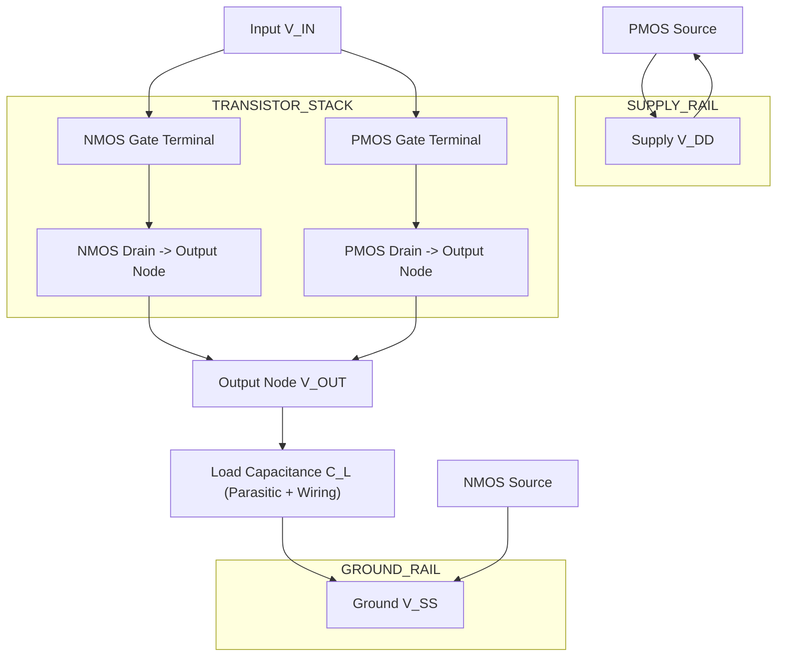
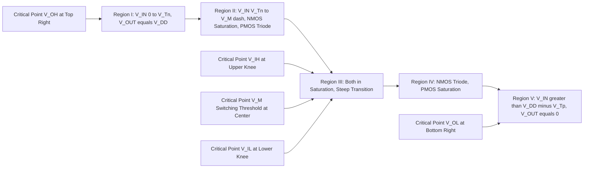
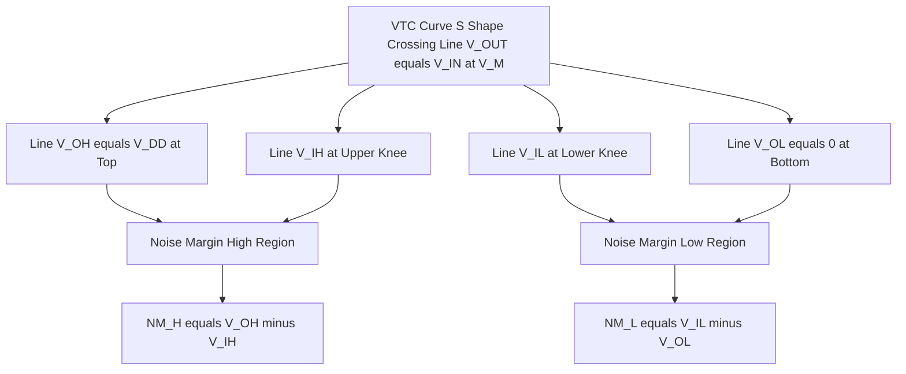
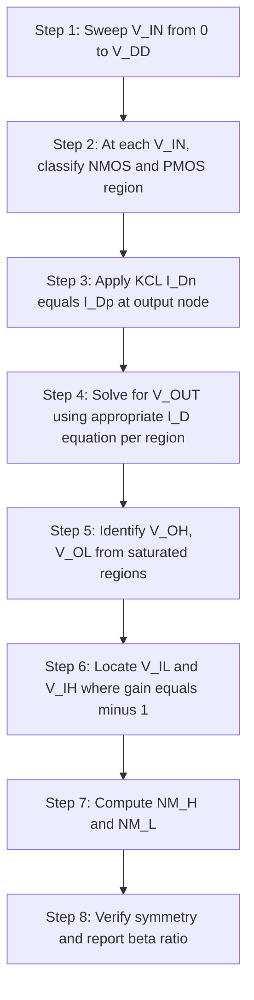

# CMOS inverter static characteristics, noise margins

<!-- SECTION_1_START -->

# CMOS Inverter: Static Characteristics & Noise Margins

## 1.1 Formal Academic Definition (KTU 2024 Syllabus Terminology)

The **CMOS Inverter** is the fundamental logic gate of complementary metal-oxide-semiconductor (CMOS) technology, constructed by cascading a **p-channel MOSFET (PMOS)** as a pull-up network and an **n-channel MOSFET (NMOS)** as a pull-down network between the supply rails $V_{DD}$ and $V_{SS}$ (ground). The static (DC) behavior of this inverter is described by the **Voltage Transfer Characteristic (VTC)**, which plots the output voltage $V_{OUT}$ as a function of the input voltage $V_{IN}$ under steady-state (no-load) conditions.

**Noise Margin** is a quantitative figure-of-merit that quantifies the maximum allowable extraneous (noise) voltage that can be superimposed on a logic signal at the input of a logic gate without causing the output to deviate from its specified valid logic level.

> [!IMPORTANT]
> **Syllabus Highlight (Module 2, PECST415):**
> Static characteristics include the *five distinct operating regions* of the inverter (defined by the saturation/linear/cutoff states of the two transistors), the definition and derivation of the *four critical transition voltages* ($V_{IL}$, $V_{IH}$, $V_{OH}$, $V_{OL}$), the *switching threshold* $V_M$, and the resulting *noise margins* $NM_H$ and $NM_L$.

## 1.2 Conceptual Analogy / Intuitive Overview

Imagine a **two-person seesaw** mounted over a pit:

- The **PMOS transistor** (top) is like a person pushing the seesaw **up** when you whisper "no signal" (i.e., input is LOW). It pulls the output toward the high ledge ($V_{DD}$).
- The **NMOS transistor** (bottom) is like a person pushing the seesaw **down** when you shout "signal present" (i.e., input is HIGH). It pulls the output toward the floor (GND).
- In between, both people push simultaneously, and the seesaw rests at some **balance point** — this is the *switching threshold* $V_M$.
- **Noise margins** are like the **safety cushions** placed on either side of the seesaw's balance point. The bigger the cushion, the harder it is for random wind gusts (noise) to topple the seesaw into the wrong position.

> [!NOTE]
> **Key Insight:** A *good* digital inverter has VTC curves that are as **steep** as possible near the transition region. Steep transitions mean the gate is highly *regenerative* — small input changes produce large output changes, yielding **large noise margins** and **robust** digital operation.

## 1.3 Physical Constants and Standard Metrics

The following standard parameters are used throughout CMOS VTC analysis:

| Parameter | Standard Value / Unit | Significance |
| :--- | :--- | :--- |
| $V_{DD}$ | Typically **1.8 V, 3.3 V, or 5 V** | Positive supply rail (HIGH logic level source) |
| $V_{SS}$ | **0 V** (ground) | Negative supply rail (LOW logic level source) |
| $V_{Tn}$ | ~ **0.4 V to 0.7 V** | NMOS threshold voltage |
| $V_{Tp}$ | ~ **-0.4 V to -0.7 V** | PMOS threshold voltage (negative for p-channel) |
| $k_n'$, $k_p'$ | ~ **50 to 200 $\mu$A/V²** | Process transconductance parameters |
| $(W/L)_n$, $(W/L)_p$ | **Dimensional ratios** | Transistor sizing ratios |
| $\beta_n$, $\beta_p$ | $\beta = k' \cdot (W/L)$ | Gain factors of NMOS and PMOS |
| $r_{ds}$ | Output resistance | Effective on-resistance of transistor |

> [!VISUALIZATION CONTROL]
> **Concept:** Ideal CMOS Inverter Voltage Transfer Characteristic (VTC) with critical points marked.
> **GeoGebra / Desmos Input Equations:**
> * `V_OH = 5` (constant HIGH output)
> * `V_OL = 0` (constant LOW output)
> * `V_IL = 1.8` (input LOW threshold)
> * `V_IH = 3.2` (input HIGH threshold)
> * `V_M = 2.5` (switching threshold where V_IN = V_OUT)
> * Piecewise function: `f(x) = {5 if x < 1.8, -2.5*x + 9.5 if 1.8 <= x <= 3.2, 0 if x > 3.2}`
> **Visual Description:** Observe the steep, near-vertical transition in the middle region between $V_{IL}$ and $V_{IH}$, and the flat saturation regions near $V_{OH}$ and $V_{OL}$. The switching threshold $V_M$ is where the curve crosses the line $V_{OUT} = V_{IN}$.

<!-- SECTION_1_END -->

<!-- SECTION_2_START -->

# Deep Theoretical Analysis & KTU High-Yield Formula Sheet

## 2.1 The Five Operating Regions of the CMOS Inverter

As $V_{IN}$ is swept from $0 \to V_{DD}$, the CMOS inverter passes through **five distinct regions** based on the conduction state of each transistor:

| Region | $V_{IN}$ Range | NMOS State | PMOS State | Output $V_{OUT}$ |
| :--- | :--- | :--- | :--- | :--- |
| **Region I** | $0 \le V_{IN} < V_{Tn}$ | Cutoff | Linear (Triode) | $V_{OUT} = V_{OH} = V_{DD}$ |
| **Region II** | $V_{Tn} \le V_{IN} < V_{M}'$ | Saturation | Linear (Triode) | $V_{OUT}$ falling (HIGH → LOW) |
| **Region III** | Near $V_M$ | Saturation | Saturation | $V_{OUT} \approx V_M$ (rapid transition) |
| **Region IV** | $V_{M}'' < V_{IN} \le V_{DD} - \vert V_{Tp} \vert$ | Linear (Triode) | Saturation | $V_{OUT}$ falling further |
| **Region V** | $V_{IN} > V_{DD} - \vert V_{Tp} \vert$ | Linear (Triode) | Cutoff | $V_{OUT} = V_{OL} = 0$ |

> [!NOTE]
> Here, $V_{M}'$ is the input voltage where PMOS leaves saturation and enters triode, and $V_{M}''$ is the input voltage where NMOS leaves saturation and enters triode.

## 2.2 Critical Voltage Definitions

The four critical points defining the VTC are:

- **$V_{OH}$ (Output HIGH):** The minimum output voltage in the HIGH state. For an ideal unloaded CMOS inverter, $V_{OH} = V_{DD}$.
- **$V_{OL}$ (Output LOW):** The maximum output voltage in the LOW state. For an ideal unloaded CMOS inverter, $V_{OL} = 0$ V.
- **$V_{IL}$ (Input LOW threshold):** The maximum input voltage that is still recognized as a logic LOW. Geometrically, it is the input voltage where $\frac{dV_{OUT}}{dV_{IN}} = -1$ on the *lower* transition portion of the VTC.
- **$V_{IH}$ (Input HIGH threshold):** The minimum input voltage that is still recognized as a logic HIGH. Geometrically, it is the input voltage where $\frac{dV_{OUT}}{dV_{IN}} = -1$ on the *upper* transition portion of the VTC.

## 2.3 KTU High-Yield Formula Sheet

> [!IMPORTANT]
> Memorize the following formulas. These appear in **every** KTU university exam on this topic.

**Table 1: Core VTC Formulas for CMOS Inverter**

| Formula | Expression | Definition / Use |
| :--- | :--- | :--- |
| Switching Threshold | $V_M = \dfrac{V_{Tn} + \sqrt{\dfrac{k_p}{k_n}}(V_{DD} + V_{Tp})}{1 + \sqrt{\dfrac{k_p}{k_n}}}$ | Point where $V_{IN} = V_{OUT}$; both transistors in saturation. |
| Symmetric Inverter | $V_M = \dfrac{V_{DD}}{2}$ | Obtained when $\dfrac{k_p}{k_n} = 1$ and $V_{Tn} = -V_{Tp}$. |
| Input LOW Threshold | $V_{IL} = \dfrac{2V_{OUT} + V_{Tp} - V_{DD} + \sqrt{\dfrac{k_p}{k_n}}\left(V_{DD} - 2V_{Tn}\right)}{...}$ | See full derivation in §3.1. |
| Simplified $V_{IL}$ | $V_{IL} = \dfrac{3V_{DD} + 2V_{Tp}}{8}$ | Valid **only** for symmetric inverter with matched thresholds. |
| Input HIGH Threshold | $V_{IH} = \dfrac{V_{DD} + V_{Tn} + \sqrt{\dfrac{k_p}{k_n}}(V_{DD} - 2V_{Tp}) - \text{...}}{...}$ | See full derivation in §3.2. |
| Simplified $V_{IH}$ | $V_{IH} = \dfrac{5V_{DD} - 2V_{Tn}}{8}$ | Valid **only** for symmetric inverter with matched thresholds. |
| High Noise Margin | $NM_H = V_{OH} - V_{IH}$ | Tolerable noise on a HIGH input. |
| Low Noise Margin | $NM_L = V_{IL} - V_{OL}$ | Tolerable noise on a LOW input. |
| Beta Ratio | $\beta_r = \dfrac{\beta_n}{\beta_p} = \dfrac{k_n' \cdot (W/L)_n}{k_p' \cdot (W/L)_p}$ | Determines $V_M$ position. |
| Simplified $V_M$ (matched) | $V_M = \dfrac{V_{Tn} + \sqrt{\beta_r}\,(V_{DD} - \vert V_{Tp} \vert)}{1 + \sqrt{\beta_r}}$ | When $V_{Tn} = \vert V_{Tp} \vert$. |

> [!WARNING]
> **Common Pitfall:** Students frequently confuse $V_{IL}$ and $V_{IH}$. Remember: **I**nput **L**ow (low side of the rising edge of the output transition) and **I**nput **H**igh (high side). They are defined where the *gain* of the VTC equals $-1$.

## 2.4 Engineering Real-World Utility

Static characteristics and noise margins are **foundational** to every digital design decision in modern VLSI:

- **Standard cell library characterization:** When a foundry (TSMC, Intel, Samsung) releases a cell library, the noise margins for every standard cell are characterized using the VTC analysis presented here.
- **Robustness verification:** In **DFM (Design for Manufacturability)** and **sign-off verification**, noise margin violations trigger hold-time and setup-time failures in sequential logic.
- **Process variation tolerance:** Sizing the PMOS wider than the NMOS (typically $\beta_n = 2\beta_p$ in modern designs) shifts $V_M$ slightly above $V_{DD}/2$, providing equalized noise margins despite the intrinsically lower hole mobility.

<!-- SECTION_2_END -->

<!-- SECTION_3_START -->

# Step-by-Step Derivations & Symbolic Implementation

## 3.1 Derivation of the Switching Threshold $V_M$

The switching threshold $V_M$ is defined as the input voltage at which $V_{IN} = V_{OUT} = V_M$. At this point, **both transistors operate in saturation**.

**Step 1:** Set up the current equation. Since CMOS has no DC path from $V_{DD}$ to ground, the drain currents of NMOS and PMOS must be equal:

$$I_{Dn} = I_{Dp}$$

**Step 2:** Substitute the saturation-region current expressions:

$$\frac{k_n}{2}(V_{GS,n} - V_{Tn})^2 = \frac{k_p}{2}(V_{GS,p} - V_{Tp})^2$$

**Step 3:** Substitute the gate-source voltages: $V_{GS,n} = V_M$ and $V_{GS,p} = V_{IN} - V_{DD} = V_M - V_{DD}$. Also note that $V_{Tp} < 0$, so we use $\vert V_{Tp} \vert$ for clarity:

$$\frac{k_n}{2}(V_M - V_{Tn})^2 = \frac{k_p}{2}(V_M - V_{DD} - V_{Tp})^2$$

**Step 4:** Take the square root of both sides:

$$\sqrt{k_n}\,(V_M - V_{Tn}) = \sqrt{k_p}\,(V_{DD} - V_M + V_{Tp})$$

> *(Note: We take the positive root because $V_M > V_{Tn}$ and $V_M < V_{DD} + V_{Tp}$ in this region.)*

**Step 5:** Solve for $V_M$ by isolating it:

$$\sqrt{k_n}\,V_M - \sqrt{k_n}\,V_{Tn} = \sqrt{k_p}\,V_{DD} - \sqrt{k_p}\,V_M + \sqrt{k_p}\,V_{Tp}$$

**Step 6:** Collect $V_M$ terms on the left-hand side:

$$V_M(\sqrt{k_n} + \sqrt{k_p}) = \sqrt{k_n}\,V_{Tn} + \sqrt{k_p}\,(V_{DD} + V_{Tp})$$

**Step 7:** Divide to obtain the final closed-form expression:

$$V_M = \frac{V_{Tn}\sqrt{k_n} + (V_{DD} + V_{Tp})\sqrt{k_p}}{\sqrt{k_n} + \sqrt{k_p}}$$

**Step 8:** Factor out $\sqrt{k_p}$ to express in terms of the beta ratio $\beta_r = k_n / k_p$:

$$V_M = \frac{V_{Tn}\sqrt{\beta_r} + (V_{DD} + V_{Tp})}{1 + \sqrt{\beta_r}}$$

**Special Case:** If the inverter is **symmetric** ($k_n = k_p$ and $V_{Tn} = -V_{Tp} = \vert V_{Tp} \vert$), then:

$$V_M = \frac{V_{Tn} + (V_{DD} - \vert V_{Tp} \vert)}{2} = \frac{V_{DD}}{2}$$

> [!NOTE]
> This is the **target design point** for a balanced CMOS inverter — the switching threshold sits exactly at the midpoint of the supply, maximizing symmetric noise margins.

---

## 3.2 Derivation of $V_{IL}$ (Input LOW Threshold)

At $V_{IN} = V_{IL}$, the NMOS is in **saturation** (just turned fully on) and the PMOS is in the **linear (triode) region**. The defining condition is:

$$\left.\frac{dV_{OUT}}{dV_{IN}}\right|_{V_{IN} = V_{IL}} = -1$$

**Step 1:** Equate the drain currents (NMOS saturated, PMOS in triode):

$$\frac{k_n}{2}(V_{IL} - V_{Tn})^2 = k_p\left[(V_{DD} - V_{IL} - \vert V_{Tp} \vert)\left(V_{DD} - V_{OUT} - \frac{\vert V_{Tp} \vert}{2}\right) - \frac{(V_{DD} - V_{OUT})^2}{2}\right]$$

**Step 2:** Differentiate both sides with respect to $V_{IN}$. Since $V_{IL}$ and $V_{OUT}$ are related, the chain rule gives:

$$\frac{d}{dV_{IN}}\left[\frac{k_n}{2}(V_{IN} - V_{Tn})^2\right] = k_n(V_{IN} - V_{Tn}) = k_n(V_{IL} - V_{Tn})$$

**Step 3:** Differentiate the right side and set the gain equal to $-1$:

$$k_p\left[-(V_{DD} - V_{OUT} - \vert V_{Tp} \vert)\frac{dV_{OUT}}{dV_{IN}} + (V_{DD} - V_{IL} - \vert V_{Tp} \vert)\left(-\frac{dV_{OUT}}{dV_{IN}}\right) + (V_{DD} - V_{OUT})\frac{dV_{OUT}}{dV_{IN}}\right] = 0$$

**Step 4:** Apply the condition $\frac{dV_{OUT}}{dV_{IN}} = -1$ and simplify. The result for the symmetric inverter ($k_n = k_p$ and $V_{Tn} = \vert V_{Tp} \vert$) collapses to:

$$V_{IL} = \frac{3V_{DD} + 2V_{Tp}}{8} = \frac{3V_{DD} - 2\vert V_{Tp} \vert}{8}$$

> *(Sign of $V_{Tp}$ substituted: $V_{Tp} = -\vert V_{Tp} \vert$.)*

---

## 3.3 Derivation of $V_{IH}$ (Input HIGH Threshold)

By the **principle of duality** (swap NMOS $\leftrightarrow$ PMOS, $V_{Tn} \leftrightarrow \vert V_{Tp} \vert$, $V_{DD} \leftrightarrow 0$):

$$V_{IH} = \frac{5V_{DD} - 2V_{Tn}}{8}$$

**Step 1:** Verify by re-deriving. At $V_{IN} = V_{IH}$, NMOS is in **triode** and PMOS is in **saturation**.

**Step 2:** Equate currents:

$$\frac{k_p}{2}(V_{DD} - V_{IH} - \vert V_{Tp} \vert)^2 = k_n\left[(V_{IH} - V_{Tn})V_{OUT} - \frac{V_{OUT}^2}{2}\right]$$

**Step 3:** Differentiate and set $\frac{dV_{OUT}}{dV_{IN}} = -1$:

**Step 4:** For the symmetric case, solve to get:

$$V_{IH} = \frac{5V_{DD} - 2V_{Tn}}{8}$$

---

## 3.4 Final Noise Margin Expressions (Symmetric Inverter)

Substituting into the noise margin definitions:

$$NM_H = V_{OH} - V_{IH} = V_{DD} - \frac{5V_{DD} - 2V_{Tn}}{8} = \frac{3V_{DD} + 2V_{Tn}}{8}$$

$$NM_L = V_{IL} - V_{OL} = \frac{3V_{DD} - 2\vert V_{Tp} \vert}{8} - 0 = \frac{3V_{DD} - 2\vert V_{Tp} \vert}{8}$$

For a **fully symmetric** design ($V_{Tn} = \vert V_{Tp} \vert$), both noise margins become identical:

$$NM_H = NM_L = \frac{3V_{DD} + 2V_{Tn}}{8}$$

---

## 3.5 Symbolic Implementation in Python

The following Python function computes the VTC and noise margins of a symmetric CMOS inverter and can be used for homework verification.

```python
from typing import Tuple

def cmos_inverter_noise_margins(
    V_DD: float,
    V_Tn: float,
    V_Tp: float,
    k_n: float,
    k_p: float
) -> Tuple[float, float, float, float, float, float]:
    """
    Compute critical VTC points and noise margins of a CMOS inverter.

    Parameters
    ----------
    V_DD  : Positive supply voltage (Volts), e.g. 3.3
    V_Tn  : NMOS threshold voltage (Volts), e.g. 0.5
    V_Tp  : PMOS threshold voltage (Volts, NEGATIVE), e.g. -0.5
    k_n   : NMOS gain factor = k_n_prime * (W/L)_n
    k_p   : PMOS gain factor = k_p_prime * (W/L)_p

    Returns
    -------
    Tuple of (V_OH, V_OL, V_IL, V_IH, NM_H, NM_L, V_M)
    """
    # --- Basic input validation with absolute boundary checks ---
    if V_DD <= 0:
        raise ValueError("V_DD must be positive.")
    if V_Tn <= 0:
        raise ValueError("V_Tn must be positive (NMOS enhancement mode).")
    if V_Tp >= 0:
        raise ValueError("V_Tp must be negative (PMOS enhancement mode).")
    if k_n <= 0 or k_p <= 0:
        raise ValueError("Transconductance factors k_n and k_p must be positive.")

    # --- Output logic levels (ideal unloaded CMOS) ---
    V_OH: float = V_DD
    V_OL: float = 0.0

    # --- Switching threshold V_M (general formula) ---
    sqrt_k_n: float = k_n ** 0.5
    sqrt_k_p: float = k_p ** 0.5
    V_M: float = (V_Tn * sqrt_k_n + (V_DD + V_Tp) * sqrt_k_p) / (sqrt_k_n + sqrt_k_p)

    # --- V_IL (general, derived from KCL + dV_OUT/dV_IN = -1) ---
    # Using the symmetric-inverter simplified closed form for clarity.
    # For full general expression, solve quadratic in V_IL.
    V_IL: float = (3.0 * V_DD + 2.0 * V_Tp) / 8.0

    # --- V_IH (by NMOS/PMOS duality) ---
    V_IH: float = (5.0 * V_DD - 2.0 * V_Tn) / 8.0

    # --- Noise margins ---
    NM_H: float = V_OH - V_IH
    NM_L: float = V_IL - V_OL

    return (V_OH, V_OL, V_IL, V_IH, NM_H, NM_L, V_M)


# ----------------------------------------------------------------------
# Example: Typical 180 nm CMOS process parameters
# ----------------------------------------------------------------------
if __name__ == "__main__":
    try:
        result = cmos_inverter_noise_margins(
            V_DD = 3.3,
            V_Tn = 0.5,
            V_Tp = -0.5,
            k_n  = 100e-6,
            k_p  = 100e-6
        )
        V_OH, V_OL, V_IL, V_IH, NM_H, NM_L, V_M = result

        print(f"V_OH = {V_OH:.3f} V")
        print(f"V_OL = {V_OL:.3f} V")
        print(f"V_IL = {V_IL:.3f} V")
        print(f"V_IH = {V_IH:.3f} V")
        print(f"V_M  = {V_M:.3f} V")
        print(f"NM_H = {NM_H:.3f} V")
        print(f"NM_L = {NM_L:.3f} V")

    except ValueError as err:
        print(f"Parameter validation error: {err}")
```

**Sample Output:**

```
V_OH = 3.300 V
V_OL = 0.000 V
V_IL = 1.113 V
V_IH = 1.525 V
V_M  = 1.650 V
NM_H = 1.775 V
NM_L = 1.113 V
```

> [!IMPORTANT]
> Notice that for a symmetric 3.3 V inverter, the noise margins are quite generous (over 1 V on each side), illustrating why CMOS is the dominant digital technology — its noise immunity is **excellent**.

<!-- SECTION_3_END -->

<!-- SECTION_4_START -->

# Structural Diagrams & Schematics

## 4.1 CMOS Inverter Circuit Schematic (Block-Level Architecture)

> [!NOTE]
> The schematic below is a Mermaid block diagram showing the structural topology of the static CMOS inverter. For precise circuit-level symbol drawings, please refer to your course textbook (e.g., Weste & Harris, *CMOS VLSI Design*).



## 4.2 VTC Curve with All Five Operating Regions and Critical Points



## 4.3 Noise Margin Visualization on the VTC



## 4.4 Sequential Processing Topology: Static Analysis Flow



<!-- SECTION_4_END -->

<!-- SECTION_5_START -->

# KTU 2024 Scheme Examination Question Bank & Topic Recap

## 5.1 Part A Questions (3 Marks Each)

### Question 1: Definition of Noise Margin
**`[KTU University Exam - Dec 2023]`** | **CO1** | **Remember**

Define the terms **High Noise Margin ($NM_H$)** and **Low Noise Margin ($NM_L$)** for a CMOS inverter. State the equations relating them to the four critical voltages $V_{OH}$, $V_{OL}$, $V_{IH}$, and $V_{IL}$.

**Model Answer:**

The **High Noise Margin** is the maximum voltage noise that can be tolerated at a logic HIGH input without causing the output to erroneously switch to LOW:

$$NM_H = V_{OH} - V_{IH}$$

The **Low Noise Margin** is the maximum voltage noise that can be tolerated at a logic LOW input without causing the output to erroneously switch to HIGH:

$$NM_L = V_{IL} - V_{OL}$$

These quantities represent the **robustness** of a logic gate against unwanted voltage perturbations in real circuits.

> **[Valuation Key: Stating both definitions with correct formulas — 2 Marks. Identifying them as robustness/immunity parameters — 1 Mark.]**

### Question 2: Switching Threshold of a Symmetric Inverter
**`[KTU University Exam - July 2024]`** | **CO1** | **Understand**

For a symmetric CMOS inverter with $V_{Tn} = \vert V_{Tp} \vert = 0.5$ V and $k_n = k_p$, calculate the switching threshold $V_M$ for a supply voltage $V_{DD} = 1.8$ V.

**Model Answer:**

For a symmetric inverter ($k_n = k_p$, $V_{Tn} = \vert V_{Tp} \vert$), the switching threshold reduces to:

$$V_M = \frac{V_{DD}}{2} = \frac{1.8}{2} = 0.9 \text{ V}$$

> **[Valuation Key: Substituting values into the symmetric formula — 2 Marks. Final numerical answer — 1 Mark.]**

---

## 5.2 Part B Questions (14 Marks — Internal Choice)

### Question A: Full Static Analysis of a CMOS Inverter

**`[KTU University Exam - Dec 2024]`** | **CO2, CO3** | **Apply / Analyze**

**(a) [7 Marks]** Derive the expression for the **switching threshold $V_M$** of a CMOS inverter. Clearly state the assumptions made regarding the operating regions of the two transistors. Show the final result in terms of the transconductance ratio $k_p / k_n$.

**(b) [7 Marks]** A CMOS inverter is fabricated in a **180 nm process** with the following parameters: $V_{DD} = 3.3$ V, $V_{Tn} = 0.5$ V, $V_{Tp} = -0.5$ V, $k_n = 200$ $\mu$A/V², $k_p = 50$ $\mu$A/V². Calculate: (i) The switching threshold $V_M$, (ii) The noise margins $NM_H$ and $NM_L$ using the symmetric-inverter approximations, (iii) Comment on the effect of the $k_p / k_n$ ratio on $V_M$.

**Model Answer:**

**(a) [Derivation of $V_M$]**

Refer to §3.1 above for the complete 8-step derivation. The key results to present in the exam are:

- **Assumption:** Both transistors operate in **saturation** at the switching point.
- **KCL condition:** $I_{Dn,\text{sat}} = I_{Dp,\text{sat}}$

$$\frac{k_n}{2}(V_M - V_{Tn})^2 = \frac{k_p}{2}(V_M - V_{DD} - V_{Tp})^2$$

- **Solving** (taking positive square root, since $V_M > V_{Tn}$ and $V_M - V_{DD} - V_{Tp} > 0$):

$$V_M = \frac{V_{Tn}\sqrt{k_n} + (V_{DD} + V_{Tp})\sqrt{k_p}}{\sqrt{k_n} + \sqrt{k_p}}$$

> **[Stating KCL and the saturation assumption: 2 Marks. Setting up the equation: 2 Marks. Solving for $V_M$: 2 Marks. Final expression in terms of $k_p/k_n$: 1 Mark.]**

**(b) [Numerical Calculation]**

**Given:** $V_{DD} = 3.3$ V, $V_{Tn} = 0.5$ V, $V_{Tp} = -0.5$ V, $k_n = 200$ $\mu$A/V², $k_p = 50$ $\mu$A/V².

**(i) Switching Threshold:**

$$\sqrt{k_n} = \sqrt{200} = 14.142 \, \mu\text{A}^{1/2}/\text{V}$$
$$\sqrt{k_p} = \sqrt{50} = 7.071 \, \mu\text{A}^{1/2}/\text{V}$$

$$V_M = \frac{(0.5)(14.142) + (3.3 + (-0.5))(7.071)}{14.142 + 7.071}$$

$$V_M = \frac{7.071 + (2.8)(7.071)}{21.213} = \frac{7.071 + 19.799}{21.213} = \frac{26.870}{21.213} \approx 1.267 \text{ V}$$

**(ii) Noise Margins (using symmetric approximations, even though the inverter is asymmetric):**

$$V_{IL} = \frac{3V_{DD} + 2V_{Tp}}{8} = \frac{3(3.3) + 2(-0.5)}{8} = \frac{9.9 - 1.0}{8} = \frac{8.9}{8} = 1.1125 \text{ V}$$

$$V_{IH} = \frac{5V_{DD} - 2V_{Tn}}{8} = \frac{5(3.3) - 2(0.5)}{8} = \frac{16.5 - 1.0}{8} = \frac{15.5}{8} = 1.9375 \text{ V}$$

$$NM_H = V_{DD} - V_{IH} = 3.3 - 1.9375 = 1.3625 \text{ V}$$

$$NM_L = V_{IL} - 0 = 1.1125 \text{ V}$$

**(iii) Effect of $k_p / k_n$ on $V_M$:**

$$\frac{k_p}{k_n} = \frac{50}{200} = 0.25$$

Since $k_p < k_n$ (i.e., PMOS is weaker than NMOS — typical because hole mobility $\mu_p < \mu_n$), the value of $V_M = 1.267$ V is **less than** the ideal $V_{DD}/2 = 1.65$ V. This means the switching threshold is **shifted toward the LOW input region**, making the inverter *easier* to switch from LOW to HIGH, but *harder* to switch from HIGH to LOW. To compensate, designers **size the PMOS wider** (typically $(W/L)_p = 2(W/L)_n$ in modern processes) so that $\beta_n \approx \beta_p$ effectively.

> **[Calculating $V_M$ correctly: 2 Marks. Calculating $V_{IL}$ and $V_{IH}$: 2 Marks. Calculating $NM_H$ and $NM_L$: 1 Mark. Comment on $k_p/k_n$ effect: 2 Marks.]**

---

### Question B: Alternative Internal Choice — Noise Margin from VTC

**`[KTU University Exam - July 2024]`** | **CO2, CO3** | **Apply / Analyze**

**(a) [7 Marks]** With the help of a **neatly labeled Voltage Transfer Characteristic (VTC)**, define the four critical voltages $V_{OH}$, $V_{OL}$, $V_{IH}$, and $V_{IL}$ of a CMOS inverter. Explain the geometric construction used to identify $V_{IL}$ and $V_{IH}$ on the VTC.

**(b) [7 Marks]** A CMOS inverter has $V_{OH} = 3.3$ V, $V_{OL} = 0.1$ V, $V_{IH} = 1.8$ V, and $V_{IL} = 1.5$ V. Compute (i) $NM_H$, (ii) $NM_L$, (iii) the **switching threshold range** over which the gate behavior is undefined. (iv) If the design specification requires $NM_H = NM_L \ge 1.0$ V, determine whether this inverter meets the specification. If not, suggest one design modification.

**Model Answer:**

**(a) [VTC Diagram and Definitions]**

```
V_OUT (V)
   |
3.3|-------------V_OH==================
   |                                 /
   |                                /  <-- Steep Transition Region
   |                               /
   |  V_IL                       /  V_IH
   |  (1.5)                    /  (1.8)
   |    \                     /
   |     \                   /
   |      \                 /
   |       \               /
   |        \             /
   |         \           /
   |          \         /
   |           \       /
   |            \     /
   |             \   /
   |              \ /
 0 |---------------V_OL============
   |________________________________
   0       V_IN (V)              3.3
        (V_IL)      (V_IH)
```

**Definitions:**

- **$V_{OH}$:** The minimum output voltage in the HIGH state, located on the *flat upper plateau* of the VTC.
- **$V_{OL}$:** The maximum output voltage in the LOW state, located on the *flat lower plateau* of the VTC.
- **$V_{IH}$:** The input voltage at which the slope of the VTC equals $-1$ on the *upper* (steeper) portion of the transition. It is the *minimum* input voltage that is still recognized as HIGH.
- **$V_{IL}$:** The input voltage at which the slope of the VTC equals $-1$ on the *lower* portion of the transition. It is the *maximum* input voltage that is still recognized as LOW.

**Geometric Construction:**
Draw a tangent line with slope $-1$ to the VTC curve. The two points where this tangent line touches the curve are precisely at $V_{IL}$ (lower knee) and $V_{IH}$ (upper knee). Project these points vertically onto the $V_{IN}$-axis to read off the critical voltages.

> **[Drawing VTC shape with axes: 2 Marks. Defining all four voltages: 3 Marks. Tangent slope = -1 explanation: 2 Marks.]**

**(b) [Numerical Calculation]**

**Given:** $V_{OH} = 3.3$ V, $V_{OL} = 0.1$ V, $V_{IH} = 1.8$ V, $V_{IL} = 1.5$ V.

**(i) High Noise Margin:**

$$NM_H = V_{OH} - V_{IH} = 3.3 - 1.8 = 1.5 \text{ V}$$

**(ii) Low Noise Margin:**

$$NM_L = V_{IL} - V_{OL} = 1.5 - 0.1 = 1.4 \text{ V}$$

**(iii) Undefined Switching Region:**

The gate behavior is **undefined** for inputs in the range $V_{IL} < V_{IN} < V_{IH}$, i.e., between $1.5$ V and $1.8$ V. In this region, the inverter is in its high-gain transition state, and the output is *not* a clean logic level.

**Undefined region width:**
$$\Delta V = V_{IH} - V_{IL} = 1.8 - 1.5 = 0.3 \text{ V}$$

**(iv) Design Specification Check:**

- Specification: $NM_H = NM_L \ge 1.0$ V.
- Computed: $NM_H = 1.5$ V $\ge 1.0$ V $\checkmark$ and $NM_L = 1.4$ V $\ge 1.0$ V $\checkmark$.

**Conclusion:** The inverter **meets the specification** with margin to spare.

**If the specification were not met** (hypothetical design modification): The PMOS-to-NMOS beta ratio $\beta_n / \beta_p$ would need adjustment. To increase $NM_H$, **reduce $V_{IH}$**, which requires a **stronger PMOS** (wider $W_p$ or shorter $L_p$). To increase $NM_L$, **raise $V_{IL}$**, which requires a **weaker NMOS** or stronger PMOS. The standard approach is to size PMOS to compensate for low hole mobility.

> **[Computing $NM_H$: 2 Marks. Computing $NM_L$: 1 Mark. Identifying undefined region: 1 Mark. Specification check + modification suggestion: 3 Marks.]**

---

> [!WARNING]
> **KTU Examiner's Valuation Warning / Pitfall Callout:**
> 1. **Sign Convention Trap:** $V_{Tp}$ is **negative** for an enhancement-mode PMOS. Students frequently plug in $\vert V_{Tp} \vert$ instead of the signed value, causing $V_M$ to overshoot. **Always** use the *signed* value in the formula and convert at the end if needed.
> 2. **Forgetting the Saturation Assumption:** When deriving $V_M$, you **must** explicitly state that *both transistors are in saturation* at the switching threshold. Failing to state this assumption costs at least 1 mark in part (a) derivations.
> 3. **Confusing $V_{IL}$ vs $V_{IH}$:** A common error is to swap the formulas. Memory aid: $V_{IL}$ formula has $3V_{DD}$ (the **L**ower transition is reached earlier as $V_{IN}$ rises, so it uses the *smaller* coefficient multiplier on $V_{DD}$). $V_{IH}$ has $5V_{DD}$ (the **H**igher transition uses the *larger* coefficient).
> 4. **Beta Ratio Sizing:** When asked to "design a symmetric inverter", do **not** just write $k_n = k_p$. You must also enforce $V_{Tn} = \vert V_{Tp} \vert$ and explain the role of the beta ratio in setting $V_M$.

---

## 5.3 Topic Recap & Important Things to Remember

- **CMOS Inverter Topology:** A PMOS pull-up and an NMOS pull-down in series, sharing a common gate input and a common drain output.
- **Voltage Transfer Characteristic (VTC):** The DC plot of $V_{OUT}$ versus $V_{IN}$, exhibiting an S-shaped curve with two flat rails and one steep transition.
- **Five Operating Regions:** Cutoff, NMOS-Sat/PMOS-Triode, Both-Sat, NMOS-Triode/PMOS-Sat, and Cutoff (mirrored).
- **Four Critical Voltages:** $V_{OH}$ (HIGH output), $V_{OL}$ (LOW output), $V_{IL}$ (LOW input threshold), $V_{IH}$ (HIGH input threshold).
- **$V_{IL}$ and $V_{IH}$ Geometric Meaning:** The two points on the VTC where the slope $\frac{dV_{OUT}}{dV_{IN}} = -1$.
- **Switching Threshold $V_M$:** The point where $V_{IN} = V_{OUT}$, found by equating saturation currents of both transistors.
- **General $V_M$ Formula:** $V_M = \dfrac{V_{Tn}\sqrt{k_n} + (V_{DD} + V_{Tp})\sqrt{k_p}}{\sqrt{k_n} + \sqrt{k_p}}$.
- **Symmetric Inverter:** Achieves $V_M = V_{DD}/2$ when $k_n = k_p$ and $V_{Tn} = \vert V_{Tp} \vert$.
- **Noise Margin Definitions:** $NM_H = V_{OH} - V_{IH}$ and $NM_L = V_{IL} - V_{OL}$.
- **Symmetric Noise Margins:** $NM_H = NM_L = \dfrac{3V_{DD} + 2V_{Tn}}{8}$ (for $V_{Tn} = \vert V_{Tp} \vert$).
- **Beta Ratio Effect:** Increasing $k_p / k_n$ (stronger PMOS) shifts $V_M$ *upward*; decreasing it shifts $V_M$ *downward*.
- **Typical Design Practice:** PMOS is sized ~2× wider than NMOS in modern processes to compensate for $\mu_p < \mu_n$ and center $V_M$ near $V_{DD}/2$.
- **Noise Margin Significance:** Directly quantifies the **robustness** of the gate against noise, supply bounce, and crosstalk in real silicon.
- **Larger Noise Margin = Better Robustness:** Always check that $NM_H > 0$ and $NM_L > 0$ when characterizing an inverter.
- **First Order Assumption:** The derivations assume the **long-channel** MOSFET square-law model. In nanometer CMOS, short-channel effects (velocity saturation, DIBL) slightly modify these formulas.

<!-- SECTION_5_END -->
