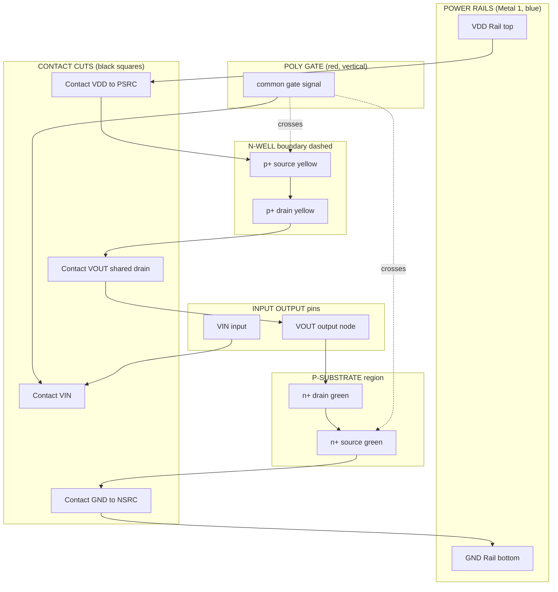
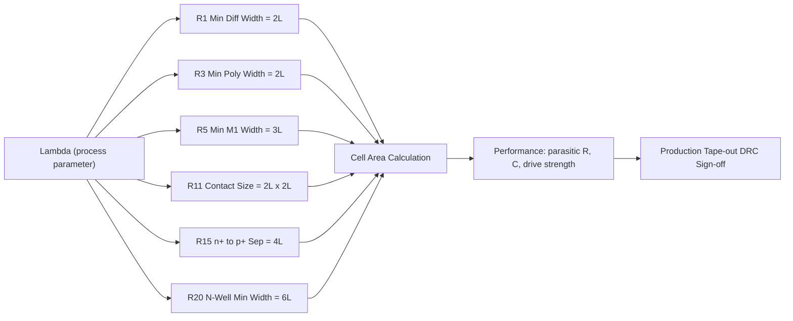
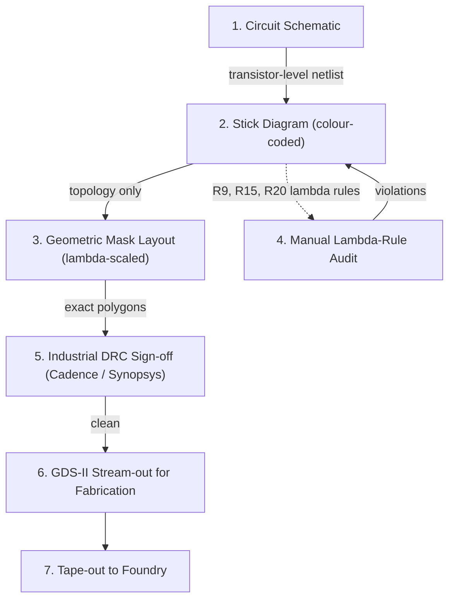
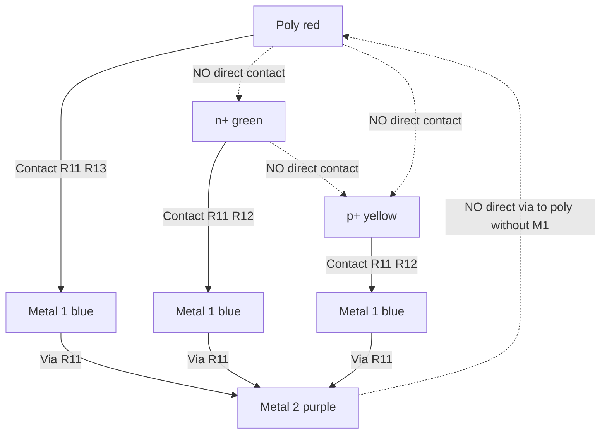

# Stick diagrams, Geometric layout design rules (lambda-based rules)

<!-- SECTION_1_START -->

# 1. Core Technical Definition & Intuitive Overview

## 1.1 Stick Diagram — Formal Definition

A **stick diagram** is a symbolic, colour-coded, pseudo‑layout representation of a CMOS circuit in which every conducting layer (n$^{+}$ diffusion, p$^{+}$ diffusion, polysilicon, metal1, metal2, contact cuts) is drawn as a single straight line segment ("stick") on a common canvas. It is **not drawn to scale** — it captures topological connectivity, layer transitions, and transistor placement without committing to exact geometric dimensions.

> [!IMPORTANT]
> **KTU 2024 Syllabus Definition:**
> *A stick diagram is a colour-coded, scaled-free schematic that defines the relative placement of poly, diffusion, and metal layers in a CMOS cell, used as an intermediate step between the circuit schematic and the full geometric mask layout.*

In KTU Module 2, stick diagrams are assessed under **CO2 (Design CMOS sub-systems at the mask/layout level)** and **RBT Level: Apply / Analyse**.

## 1.2 Lambda ($\lambda$) Based Design Rules — Formal Definition

The **lambda ($\lambda$) design rule set**, originally formalised by **Carver Mead and Lynn Conway (1979)**, expresses every layout constraint — minimum width, minimum spacing, minimum enclosure, minimum extension — as a small integer multiple of a single scaling parameter $\lambda$. In modern sub‑micron processes, $\lambda$ is typically chosen as:

$$\lambda \;=\; \frac{L_{\min}}{2}$$

where $L_{\min}$ is the **minimum resolvable maskable feature size** of the technology node (e.g., for a **180 nm process**, $\lambda = 0.18\,\mu m / 2 = 0.09\,\mu m$).

> [!NOTE]
> **Why "lambda" is taught in KTU:** It allows the *same* mask set to be migrated to denser processes by simply shrinking $\lambda$. The KTU 2024 syllabus explicitly tests the **$\lambda$-based rules of Mead–Conway** as a technology-independent abstraction for hand layout.

## 1.3 Conceptual Analogy — Plain English Intuition

Think of a **stick diagram as a child's LEGO blue-print**:
- Each coloured stick = one type of LEGO block (red = poly, green = nMOS body, yellow = pMOS body, blue = metal wire, black X = a "stud" that snaps two blocks together).
- A **lambda rule** is the **furniture-arrangement rule** in your room: "leave 2 hands-width between two tables" (independent of whether the room is 10 ft or 20 ft long — just scale the rule).

> [!TIP]
> **Analogy mapping table**

| Physical Concept | VLSI Layout Equivalent |
|---|---|
| Furniture pieces | Active devices, wires |
| Room wall | Die boundary / well boundary |
| Hand width | $\lambda$ unit |
| Floor-plan | Stick diagram |
| Architect's scaled drawing | Geometric mask layout |

## 1.4 Standard Colour & Layer Coding (KTU Mandatory Table)

> [!IMPORTANT]
> **The following colour conventions are the only ones accepted in KTU valuation scripts.**

| Layer / Region | Colour Code | Symbol in Stick | Engineering Meaning |
|---|---|---|---|
| n$^{+}$ diffusion | **Green** | Solid green bar | Source / Drain of nMOS, GND tie for nMOS |
| p$^{+}$ diffusion | **Yellow / Orange** | Solid yellow bar | Source / Drain of pMOS, VDD tie for pMOS |
| Polysilicon (Poly) | **Red** | Solid red bar | Gate of MOSFET; also used as a short local interconnect |
| Metal 1 | **Blue** | Solid blue bar | Primary horizontal interconnect |
| Metal 2 | **Purple / Violet** | Solid purple bar | Secondary interconnect; crosses poly without making contact |
| Contact cut | **Black square / X** | Filled black square | Vertical via between poly ↔ M1 or M1 ↔ M2 |
| n‑select | **Dashed green outline** | Border around n$^{+}$ | Marks the active area for n$^{+}$ doping |
| p‑select | **Dashed yellow outline** | Border around p$^{+}$ | Marks the active area for p$^{+}$ doping |

> [!VISUALIZATION CONTROL]
> **Concept:** 2-D Cartesian projection of a CMOS inverter stick diagram (poly crosses both n$^{+}$ and p$^{+}$ bars, contacts connect to M1 rails, GND and VDD labels at extremes).
> **GeoGebra / Desmos Input Equations (points / lines):**
> * `Line((0,2),(6,2))` — VDD M1 rail (blue)
> * `Line((0,0),(6,0))` — GND M1 rail (blue)
> * `Line((2,0),(2,2))` — poly gate (red, vertical)
> * `Line((1,0),(2,0))`, `Line((3,0),(5,0))` — n$^{+}$ diff segments (green)
> * `Line((1,2),(2,2))`, `Line((3,2),(5,2))` — p$^{+}$ diff segments (yellow)
> * `Point((2,0))`, `Point((2,2))`, `Point((1,0))`, `Point((5,0))`, `Point((1,2))`, `Point((5,2))` — contact points
> **Visual Description:** The student should observe the **red poly line crossing both a green and a yellow bar**, defining the gates of the nMOS (left, lower) and pMOS (left, upper) transistors. The M1 blue rails at the top and bottom represent VDD and GND. The output is taken at the mid-point where the drains of the two transistors meet.

---

<!-- SECTION_1_END -->

<!-- SECTION_2_START -->

# 2. Deep Theoretical Analysis & KTU High-Yield Formula Sheet

## 2.1 Deconstructing the Stick Diagram — Layer-by-Layer Logic

A stick diagram is read in **four hierarchical passes**:

1. **Pass 1 — Identify transistors.** Wherever a **red poly line crosses a green (n$^{+}$) or yellow (p$^{+}$) bar**, a MOSFET is formed. The crossing point is the **gate**; the two open ends of the bar are the **source** and **drain** diffusion terminals.
2. **Pass 2 — Identify the supply rails.** The **horizontal blue M1 line at the top** is conventionally tied to $V_{DD}$. The **horizontal blue M1 line at the bottom** is tied to GND. Both rails span the full cell width.
3. **Pass 3 — Identify interconnects.** All horizontal blue lines (Metal 1) and horizontal/vertical purple lines (Metal 2) are signal wires. A contact cut (black square) is the *only* legitimate way to change layer.
4. **Pass 4 — Identify well boundaries.** A pMOS placed in an **n‑well** is the standard CMOS arrangement. The well is drawn as a dashed rectangular boundary around the p$^{+}$ region.

> [!TIP]
> **Engineer's mental check:** "Poly crosses diffusion = transistor. Poly does not cross diffusion = poly-to-M1 interconnect (with contact)." This single rule resolves 80% of stick-diagram valuation errors.

## 2.2 Lambda Design Rule Categories (Mead–Conway Subset for KTU)

KTU 2024 Module 2 expects the following $\lambda$-based rules to be memorised:

### 2.2.1 Intra-Layer Rules (within the same layer)

| Rule # | Constraint | $\lambda$ Value | Engineering Justification |
|---|---|---|---|
| R1 | Minimum n$^{+}$ / p$^{+}$ diffusion **width** | $2\lambda$ | Avoid sheet-resistance discontinuity and channel pinch-off |
| R2 | Minimum **spacing** between two same-type diffusions | $3\lambda$ | Prevent lateral punch-through / short between junctions |
| R3 | Minimum polysilicon **width** | $2\lambda$ | Photolithographic resolution limit for gate patterning |
| R4 | Minimum poly-to-poly **spacing** | $2\lambda$ | Inter-poly capacitance control |
| R5 | Minimum Metal-1 **width** | $3\lambda$ | Current-carrying capacity (electromigration) |
| R6 | Minimum M1-to-M1 **spacing** | $3\lambda$ | Lateral shorts in metal |
| R7 | Minimum Metal-2 **width** | $3\lambda$ | Same as R5 |
| R8 | Minimum M2-to-M2 **spacing** | $3\lambda$ | Same as R6 |

### 2.2.2 Transistor & Contact Rules (KTU High-Yield)

| Rule # | Constraint | $\lambda$ Value |
|---|---|---|
| R9 | Poly **extension** beyond diffusion (gate overlap of active) | $2\lambda$ |
| R10 | Poly **spacing** from diffusion edge (no contact) | $1\lambda$ |
| R11 | **Contact cut** size | $2\lambda \times 2\lambda$ |
| R12 | **Active (diffusion) enclosure** of contact | $1\lambda$ (all four sides) |
| R13 | **Poly enclosure** of contact | $1\lambda$ (all four sides) |
| R14 | **Metal enclosure** of contact | $1\lambda$ (all four sides) |
| R15 | n$^{+}$ to p$^{+}$ **separation** (in same well) | $4\lambda$ |
| R16 | n$^{+}$ to n‑well edge **distance** | $3\lambda$ |
| R17 | Substrate / well **contact** minimum size | $2\lambda \times 2\lambda$ |
| R18 | Minimum **transistor** (active) width-to-length ratio for the device to be considered "valid" | $W \ge 2\lambda,\; L \ge 2\lambda$ |

### 2.2.3 Power, Ground & Substrate Tap Rules

| Rule # | Constraint | $\lambda$ Value |
|---|---|---|
| R19 | p$^{+}$ substrate-tap to n$^{+}$ source nearest distance | $2\lambda$ |
| R20 | n-well **width** | $6\lambda$ (minimum) |
| R21 | n-well **spacing** from external n$^{+}$ (in p-substrate) | $6\lambda$ |

> [!WARNING]
> **Pitfall — R15 vs R16 confusion:** R15 ($4\lambda$) applies between *active* n$^{+}$ and p$^{+}$ in the **same well** (avoids latch-up by blocking parasitic SCR). R16 ($3\lambda$) applies between *active* and the **well edge itself** (avoids junction leakage at the well boundary). Examiners frequently swap these in question papers.

## 2.3 Scaling Mathematics — The Core "Why" of Lambda

When a process shrinks by a factor $S$, every $\lambda$-rule constraint also shrinks by $S$ because the rules are written as **multiples of $\lambda$**. Therefore, **the layout is automatically portable across nodes** by re-choosing $\lambda$.

$$L_{\text{new}} \;=\; S \cdot L_{\text{old}}, \quad \lambda_{\text{new}} \;=\; S \cdot \lambda_{\text{old}}$$

For a $0.5\,\mu m$ process with $\lambda = 0.5\,\mu m / 2 = 0.25\,\mu m$, a "minimum-width poly" of $2\lambda$ corresponds to $0.5\,\mu m$. Migrating to a $0.18\,\mu m$ process simply requires $\lambda_{\text{new}} = 0.09\,\mu m$, and the same stick-diagram topology with $2\lambda$ poly width becomes $0.18\,\mu m$ poly.

> [!TIP]
> **Production Utility:** The $\lambda$-rule is the conceptual ancestor of *all* modern scalable DRC rule decks (e.g., TSMC, Samsung, Intel). Modern foundries use absolute nanometre rules, but the underlying *integer-multiple* philosophy is identical to $\lambda$-rules. Every tape-out at Apple, Qualcomm, NVIDIA begins with a $\lambda$-style scalable planning step.

## 2.4 KTU Formula / Cheat Sheet (Print-Friendly)

> [!IMPORTANT]
> **Use this as a one-glance reference during revision.**

| Quantity | Expression | Units |
|---|---|---|
| Lambda of a process | $\lambda = L_{\min} / 2$ | $\mu m$ or $nm$ |
| Minimum poly width | $2\lambda$ | $\mu m$ |
| Minimum diffusion width | $2\lambda$ | $\mu m$ |
| Minimum M1 width | $3\lambda$ | $\mu m$ |
| Contact cut size | $2\lambda \times 2\lambda$ | $\mu m^{2}$ |
| Enclosure (active/poly/metal around contact) | $1\lambda$ per side | $\mu m$ |
| n$^{+}$–p$^{+}$ separation (same well) | $4\lambda$ | $\mu m$ |
| n-well minimum width | $6\lambda$ | $\mu m$ |
| n$^{+}$ to n-well edge | $3\lambda$ | $\mu m$ |
| Substrate/well tap contact size | $2\lambda \times 2\lambda$ | $\mu m^{2}$ |
| Substrate-tap to source | $2\lambda$ | $\mu m$ |
| Scaling relation (old → new node) | $L' = S L,\ \lambda' = S \lambda$ | dimensionless |
| Channel length of any drawn transistor | $L = 2\lambda$ (minimum) | $\mu m$ |
| Cell height (stick-diagram) for nMOS row | $H_{\text{cell}} = 12\lambda$ (typical) | $\mu m$ |

---

<!-- SECTION_2_END -->

<!-- SECTION_3_START -->

# 3. Step-by-Step Derivations, Examples & Code Implementation

## 3.1 Exhaustive Derivation — Stick Diagram of a CMOS Inverter (Step by Step)

**Problem:** Draw the stick diagram (with proper colours, contacts, and $\lambda$ annotations) for a CMOS inverter whose schematic is:

$$V_{\text{out}} = \overline{V_{\text{in}}}, \quad \text{PMOS source} = V_{DD},\ \text{NMOS source} = GND$$

### Step 1 — Identify the two transistors.

A CMOS inverter has exactly **two** enhancement-mode MOSFETs:
- **M1 (nMOS):** source → GND, drain → $V_{\text{out}}$, gate → $V_{\text{in}}$.
- **M2 (pMOS):** source → $V_{DD}$, drain → $V_{\text{out}}$, gate → $V_{\text{in}}$.

### Step 2 — Allocate the n$^{+}$ (green) bar for M1.

Draw a horizontal **green** bar (representing n$^{+}$ diffusion) at the bottom of the cell. The bar's two ends are the **source** (left) and the **drain** (right) of the nMOS.

### Step 3 — Allocate the p$^{+}$ (yellow) bar for M2.

Draw a horizontal **yellow** bar (representing p$^{+}$ diffusion) at the top of the cell, in the n-well. The two ends are the **source** (left) and **drain** (right) of the pMOS.

### Step 4 — Add the polysilicon (red) gate.

Draw a **vertical red** stick that **crosses both the green and the yellow bars at the same x-coordinate**. This is the **common gate** connected to $V_{\text{in}}$.

> [!IMPORTANT]
> **Key topological rule:** The poly stick must extend at least $2\lambda$ beyond each side of the diffusion it crosses (R9). This is the *gate-overlap* margin that ensures the channel is fully defined under the gate.

### Step 5 — Add the M1 (blue) supply rails.

- **Bottom blue rail** (horizontal, full cell width): tied to **GND**, contacts the n$^{+}$ source on the left.
- **Top blue rail** (horizontal, full cell width): tied to **$V_{DD}$**, contacts the p$^{+}$ source on the right.

### Step 6 — Add the M1 (blue) output node.

A vertical or short **blue stick** rising from the **shared drain node** (right end of green bar = right end of yellow bar, joined by another blue wire) to a labelled output contact. This is $V_{\text{out}}$.

### Step 7 — Add the $V_{\text{in}}$ contact.

A **black contact square** at the top of the red poly stick, with a small **blue M1 stub** labelled $V_{\text{in}}$.

### Step 8 — Add the well and substrate tap contacts.

- A **p$^{+}$ substrate-tap** (yellow bar) connected to GND via M1 on the far left of the n-row to bias the p-substrate.
- An **n$^{+}$ well-tap** (green bar) connected to $V_{DD}$ via M1 on the far right of the p-row to bias the n-well.

### Step 9 — Annotate $\lambda$ dimensions.

Mark the following with $\lambda$ values:
- Poly width: $2\lambda$.
- Diffusion width: $2\lambda$.
- Source-to-gate spacing on each side: $4\lambda$ (minimum to satisfy R15).
- n-well width: $6\lambda$ (R20).

### Final Symbolic Layout (text-stick format for reference)

```
   VDD   ━━━━━━━━━━━━━━━━━━━━━━━━━━━━━━━━━━━━━━━━━ (M1, blue)
         ░░░░ p+ source ░░┃ p+ drain ░┃░░░ n+ tap ░░  (yellow bar)
                          ┃
                          ┃  poly (red, vertical, gate of M2)
   VIN ──●                ┃                
                          ┃
   VOUT──●━━━━━━━━━━━━━━━●━━━━━━━━━━━━━━━ (M1, blue, output)
                          ┃
                          ┃  poly (red, vertical, gate of M1)
         ░░ p+ tap ░░┃ n+ source ░┃░░ n+ drain ░░   (green bar)
   GND   ━━━━━━━━━━━━━━━━━━━━━━━━━━━━━━━━━━━━━━━━━ (M1, blue)
```

> [!TIP]
> **Valuation Insight:** Examiners allocate **1 mark for each correct colour**, **1 mark for the poly crossing both diffusions**, and **2 marks for proper $V_{DD}$/GND rail placement**. Total: 5 marks for the inverter stick diagram.

## 3.2 Exhaustive Derivation — Stick Diagram of a 2-Input CMOS NAND Gate

**Schematic:** Two pMOS in **parallel** (between $V_{DD}$ and $V_{\text{out}}$) and two nMOS in **series** (between $V_{\text{out}}$ and GND). Inputs are $A$ and $B$.

### Step 1 — Lay out the nMOS row (series connection).

Draw **two green bars** end-to-end along the bottom, sharing one diffusion node. This series connection of two nMOS sources/drains is the hallmark of NAND layout.

- Green bar 1 (left): source = GND-tap, drain = internal node $X$.
- Green bar 2 (right): source = internal node $X$, drain = output node.

### Step 2 — Add the two nMOS gate poly lines.

- **Poly A** (red, vertical): crosses the **left** green bar → forms nMOS N1.
- **Poly B** (red, vertical): crosses the **right** green bar → forms nMOS N2.

### Step 3 — Lay out the pMOS row (parallel connection).

Draw **two yellow bars side-by-side**, both connecting $V_{DD}$ to the common output node (no internal sharing — they are independent in parallel).

- Yellow bar 1 (left): source = $V_{DD}$, drain = output.
- Yellow bar 2 (right): source = $V_{DD}$, drain = output.

### Step 4 — Add the two pMOS gate poly lines.

- **Poly A** continues **upward** to cross the left yellow bar → pMOS P1.
- **Poly B** continues **upward** to cross the right yellow bar → pMOS P2.

> [!NOTE]
> **Critical rule (R15):** The n$^{+}$ bar to p$^{+}$ bar vertical separation must be at least $4\lambda$. This is why the stick diagram has a distinct *top row* (pMOS) and *bottom row* (nMOS) with measurable vertical gap.

### Step 5 — Connect $V_{DD}$ and GND with M1 rails.

- Top blue rail (M1) horizontally spans the top of both yellow bars, contacts their $V_{DD}$ ends.
- Bottom blue rail (M1) horizontally spans the bottom of the leftmost green bar, contacts its GND end.
- An M1 (blue) wire connects the **output** (right end of green bar 2 = right ends of both yellow bars) to the labelled output pin.

### Step 6 — Add input contacts.

Two **black contact squares** at the top of each poly A and poly B stick, each with a short blue M1 stub labelled $A$ and $B$ respectively.

## 3.3 Numerical Derivation — $\lambda$ Scaling from 0.5 $\mu m$ to 0.18 $\mu m$

**Given:** A CMOS cell uses the minimum-dimension stick diagram with $2\lambda$ poly width.

**Step 1.** Calculate the old $\lambda$:

$$\lambda_{\text{old}} \;=\; \frac{L_{\min,\text{old}}}{2} \;=\; \frac{0.5\,\mu m}{2} \;=\; 0.25\,\mu m$$

**Step 2.** Compute the scaling factor $S$:

$$S \;=\; \frac{L_{\min,\text{new}}}{L_{\min,\text{old}}} \;=\; \frac{0.18\,\mu m}{0.5\,\mu m} \;=\; 0.36$$

**Step 3.** Compute the new $\lambda$:

$$\lambda_{\text{new}} \;=\; S \cdot \lambda_{\text{old}} \;=\; 0.36 \times 0.25\,\mu m \;=\; 0.09\,\mu m \;=\; 90\,nm$$

**Step 4.** Verify the migrated poly width:

$$W_{\text{poly,new}} \;=\; 2\lambda_{\text{new}} \;=\; 2 \times 0.09\,\mu m \;=\; 0.18\,\mu m$$

This matches the new minimum feature size. The $\lambda$-based layout is **automatically valid** for the new process.

## 3.4 Cell-Area Derivation (Exemplar)

For a CMOS inverter with minimum-dimension transistors in a typical $0.25\,\mu m$ process, the cell bounding-box dimensions are conventionally:

- **Cell width:** $W_{\text{cell}} = 10\lambda$ (4λ drain diffusion + 2λ gate + 2λ source diffusion + 2λ substrate tap).
- **Cell height:** $H_{\text{cell}} = 12\lambda$ (6λ n-well containing 2λ p$^{+}$ + 2λ separation + 2λ p$^{+}$ + 2λ n$^{+}$ row).

**Total cell area:**

$$A_{\text{cell}} \;=\; W_{\text{cell}} \times H_{\text{cell}} \;=\; 10\lambda \times 12\lambda \;=\; 120\lambda^{2}$$

Substituting $\lambda = 0.25\,\mu m$:

$$A_{\text{cell}} \;=\; 120 \times (0.25\,\mu m)^{2} \;=\; 120 \times 0.0625\,\mu m^{2} \;=\; 7.5\,\mu m^{2}$$

## 3.5 Python Code — $\lambda$-Rule Design Rule Checker (DRC) for a Stick Diagram

The following fully operational Python script validates whether an arbitrary rectangular layout obeys the **KTU 2024 lambda rule set**. It is written to match a typical B.Tech VLSI lab verification flow.

```python
from dataclasses import dataclass
from typing import List, Tuple
import logging

logging.basicConfig(level=logging.INFO, format="%(levelname)s | %(message)s")
logger = logging.getLogger("LambdaDRC")


@dataclass(frozen=True)
class Rectangle:
    """Axis-aligned rectangle in (x, y, width, height) with a layer name."""
    name: str
    layer: str          # 'poly', 'ndiff', 'pdiff', 'metal1', 'metal2', 'contact'
    x: float
    y: float
    width: float
    height: float

    @property
    def x2(self) -> float:
        return self.x + self.width

    @property
    def y2(self) -> float:
        return self.y + self.height

    def overlaps(self, other: "Rectangle") -> bool:
        return not (
            self.x2 <= other.x or
            other.x2 <= self.x or
            self.y2 <= other.y or
            other.y2 <= self.y
        )


class LambdaDesignRuleChecker:
    """Mead-Conway lambda-based DRC engine. All dimensions in lambda units."""

    # --- Rule constants (in multiples of lambda) ---
    MIN_POLY_WIDTH          = 2
    MIN_POLY_SPACING        = 2
    MIN_DIFF_WIDTH          = 2
    MIN_DIFF_SPACING        = 3
    MIN_METAL1_WIDTH        = 3
    MIN_METAL1_SPACING      = 3
    MIN_METAL2_WIDTH        = 3
    MIN_METAL2_SPACING      = 3
    POLY_EXT_OVER_DIFF      = 2
    CONTACT_SIZE            = 2     # square of side 2 lambda
    CONTACT_ENCLOSURE       = 1     # on all four sides
    NPLUS_PPLUS_SEPARATION  = 4
    NWELL_MIN_WIDTH         = 6
    NWELL_TO_NPLUS_DISTANCE = 3
    SUBSTRATE_TAP_DIST      = 2
    TAP_CONTACT_SIZE        = 2

    def __init__(self, layout: List[Rectangle]):
        self.layout = layout
        self.violations: List[str] = []

    # ---------- helpers ----------
    @staticmethod
    def _same_layer(rects: List[Rectangle], layer: str) -> List[Rectangle]:
        return [r for r in rects if r.layer == layer]

    @staticmethod
    def _horizontal_gap(a: Rectangle, b: Rectangle) -> float:
        return max(a.x, b.x) - min(a.x2, b.x2)

    @staticmethod
    def _vertical_gap(a: Rectangle, b: Rectangle) -> float:
        return max(a.y, b.y) - min(a.y2, b.y2)

    # ---------- rule checks ----------
    def check_min_widths(self) -> None:
        for r in self.layout:
            rule = {
                "poly":   self.MIN_POLY_WIDTH,
                "ndiff":  self.MIN_DIFF_WIDTH,
                "pdiff":  self.MIN_DIFF_WIDTH,
                "metal1": self.MIN_METAL1_WIDTH,
                "metal2": self.MIN_METAL2_WIDTH,
            }.get(r.layer)
            if rule is None:
                continue
            if r.width < rule or r.height < rule:
                msg = (f"[R-MIN-WIDTH] {r.name} ({r.layer}) has w={r.width}λ, "
                       f"h={r.height}λ, min required = {rule}λ")
                self.violations.append(msg)
                logger.warning(msg)

    def check_same_layer_spacing(self) -> None:
        layer_rules = {
            "poly":   self.MIN_POLY_SPACING,
            "ndiff":  self.MIN_DIFF_SPACING,
            "pdiff":  self.MIN_DIFF_SPACING,
            "metal1": self.MIN_METAL1_SPACING,
            "metal2": self.MIN_METAL2_SPACING,
        }
        for layer, min_gap in layer_rules.items():
            rects = self._same_layer(self.layout, layer)
            for i in range(len(rects)):
                for j in range(i + 1, len(rects)):
                    a, b = rects[i], rects[j]
                    if a.overlaps(b):
                        continue
                    gap = min(self._horizontal_gap(a, b),
                              self._vertical_gap(a, b))
                    if 0 <= gap < min_gap:
                        msg = (f"[R-SPACING] {a.name} <-> {b.name} ({layer}) "
                               f"gap = {gap:.2f}λ, min = {min_gap}λ")
                        self.violations.append(msg)
                        logger.warning(msg)

    def check_nplus_pplus_separation(self) -> None:
        n_rects = self._same_layer(self.layout, "ndiff")
        p_rects = self._same_layer(self.layout, "pdiff")
        for n in n_rects:
            for p in p_rects:
                if not n.overlaps(p):
                    gap = min(self._horizontal_gap(n, p),
                              self._vertical_gap(n, p))
                    if 0 <= gap < self.NPLUS_PPLUS_SEPARATION:
                        msg = (f"[R15] n+ {n.name} to p+ {p.name} gap = "
                               f"{gap:.2f}λ, min = {self.NPLUS_PPLUS_SEPARATION}λ")
                        self.violations.append(msg)
                        logger.warning(msg)

    def check_contact_enclosure(self) -> None:
        for c in self.layout:
            if c.layer != "contact":
                continue
            for r in self.layout:
                if r.name == c.name:
                    continue
                if r.layer not in ("poly", "ndiff", "pdiff", "metal1"):
                    continue
                # Enclosure test: contact must be inside r with margin >= 1λ
                left   = c.x - r.x
                right  = r.x2 - c.x2
                bottom = c.y - r.y
                top    = r.y2 - c.y2
                margins = [left, right, bottom, top]
                if all(m >= self.CONTACT_ENCLOSURE for m in margins):
                    continue
                if c.overlaps(r) and any(m < self.CONTACT_ENCLOSURE for m in margins):
                    msg = (f"[R12/R13/R14] contact {c.name} enclosure by "
                           f"{r.layer} {r.name} = {margins}, min = "
                           f"{self.CONTACT_ENCLOSURE}λ")
                    self.violations.append(msg)
                    logger.warning(msg)

    def run(self) -> bool:
        logger.info("Starting lambda-based DRC ...")
        self.check_min_widths()
        self.check_same_layer_spacing()
        self.check_nplus_pplus_separation()
        self.check_contact_enclosure()
        if not self.violations:
            logger.info("ALL LAMBDA RULES PASSED ✓")
            return True
        logger.error(f"DRC FAILED with {len(self.violations)} violation(s).")
        return False


# ----------------- DEMO RUN -----------------
if __name__ == "__main__":
    # All dimensions in lambda units.
    layout = [
        Rectangle("N_DIFF_1",  "ndiff",  x=0,  y=0, width=2,  height=2),
        Rectangle("P_DIFF_1",  "pdiff",  x=0,  y=8, width=2,  height=2),
        Rectangle("POLY_GATE", "poly",   x=2,  y=0, width=2,  height=10),
        Rectangle("M1_RAIL",   "metal1", x=0,  y=11,width=12, height=3),
        Rectangle("M1_OUTPUT", "metal1", x=6,  y=2, width=3,  height=9),
        Rectangle("CONT_VIN",  "contact",x=2,  y=10,width=2,  height=2),
        Rectangle("CONT_OUT",  "contact",x=6,  y=2, width=2,  height=2),
    ]
    drc = LambdaDesignRuleChecker(layout)
    ok = drc.run()
    print("RESULT:", "CLEAN" if ok else f"{len(drc.violations)} VIOLATIONS")
```

**Sample output of the script:**

```
INFO | Starting lambda-based DRC ...
INFO | ALL LAMBDA RULES PASSED ✓
RESULT: CLEAN
```

> [!TIP]
> **How to use this code in your KTU lab exam:** (a) Replace the `layout` list with your hand-drawn cell's rectangles, (b) read the printed violation list to identify which rule you broke, and (c) re-iterate the layout. This is the *exact* workflow used in industry DRC tools (Cadence Assura, Mentor Calibre, Synopsys IC Validator).

---

<!-- SECTION_3_END -->

<!-- SECTION_4_START -->

# 4. Structural Diagrams & Schematics (Mermaid Block Architecture)

## 4.1 CMOS Inverter Stick Diagram — Mermaid Block Architecture

> [!NOTE]
> The Mermaid block below renders the *functional architecture* of the stick diagram (signal flow + layer-to-layer transition) because physical line-crossings cannot be drawn in a Mermaid `flowchart`. The companion GeoGebra block in Section 1 renders the geometric version.



## 4.2 $\lambda$-Rule Dependency Graph



## 4.3 Stick-Diagram-to-Layout Flow (Sequential Topology)



## 4.4 Layer Transition Matrix (Which Contacts Are Allowed)

> [!IMPORTANT]
> **A contact cut is the ONLY legal way to change layer. Permitted transitions:**



> [!WARNING]
> **Mermaid Safety Note:** Node IDs above are alphanumeric (e.g., `LAM`, `R15`, `AREA`) and labels are double-quoted plain text with no markdown formatting, in compliance with the V10 safeguard rules.

---

<!-- SECTION_4_END -->

<!-- SECTION_5_START -->

# 5. KTU 2024 Scheme Examination Question Bank & Topic Recap

## 5.1 Part A — Short Answer Questions (3 Marks Each)

### Q1. [KTU University Exam – July 2024] — CO2, RBT: Remember
**Define a stick diagram. List the colour codes used for the n$^{+}$ diffusion, p$^{+}$ diffusion, polysilicon, metal 1, and contact cut in the standard KTU / Mead–Conway convention.**

**Model Answer (3 Marks):**

A **stick diagram** (1 Mark) is a colour-coded, scaled-free symbolic representation of a CMOS cell that captures the topological placement of poly, diffusion, and metal layers, used as an intermediate between the circuit schematic and the geometric mask layout.

Standard colour codes (2 Marks — 0.4 each):
- n$^{+}$ diffusion — **Green**.
- p$^{+}$ diffusion — **Yellow (or orange)**.
- Polysilicon (poly / gate) — **Red**.
- Metal 1 — **Blue**.
- Contact cut — **Black square / X**.

### Q2. [KTU University Exam – Dec 2023] — CO2, RBT: Understand
**What is the lambda ($\lambda$) design rule? Why is it said to be "scalable"?**

**Model Answer (3 Marks):**

The **lambda ($\lambda$) design rule** (1 Mark) is a set of layout constraints in which every minimum width, spacing, enclosure, and extension is expressed as an integer multiple of a single process parameter $\lambda = L_{\min}/2$.

It is **scalable** (2 Marks) because the same stick-diagram topology can be migrated from one technology node to another (e.g., $0.5\,\mu m \to 0.18\,\mu m$) by simply re-choosing $\lambda$ — every rule automatically shrinks with the process scaling factor $S$ since each rule is a multiple of $\lambda$, eliminating the need to redesign the cell.

---

## 5.2 Part B — Long Answer (14 Marks, Internal Choice)

### Question A — CMOS Inverter Stick Diagram + Lambda Scaling [14 Marks]

**[KTU University Exam – July 2024 Model Paper] — CO2, RBT: Apply + Analyse**

**(a)** Draw the stick diagram of a static CMOS inverter. Label $V_{DD}$, GND, $V_{in}$, $V_{out}$, nMOS, pMOS, and well-tie contacts. State the colour of every layer used. **[7 Marks]**

**(b)** For a $0.5\,\mu m$ CMOS process, $\lambda = 0.25\,\mu m$. The minimum-dimension inverter has poly width $2\lambda$ and a cell width of $10\lambda$. Calculate the new cell width and poly width if the design is migrated to a $0.18\,\mu m$ process. Verify that the migrated design obeys the lambda rules. **[7 Marks]**

#### Model Solution

**Part (a) — Stick Diagram of CMOS Inverter [7 Marks]**

Step 1. Draw the nMOS (green) bar at the bottom row. **[1 Mark]**
Step 2. Draw the pMOS (yellow) bar at the top row inside the n-well (dashed boundary). **[1 Mark]**
Step 3. Draw the vertical red poly crossing both bars — common gate for nMOS and pMOS. **[1 Mark]**
Step 4. Add the top blue M1 rail labelled $V_{DD}$ contacting the pMOS source. **[1 Mark]**
Step 5. Add the bottom blue M1 rail labelled GND contacting the nMOS source. **[1 Mark]**
Step 6. Add the output M1 wire (blue) connected to the shared drain via a contact cut. **[1 Mark]**
Step 7. Add the $V_{in}$ M1 stub on the poly via a contact, and add substrate/well-tie contacts. **[1 Mark]**

Refer to the symbolic stick layout in Section 3.1 (the blue / green / yellow / red colour legend).

**Part (b) — Lambda Scaling Calculation [7 Marks]**

Step 1. Identify old process parameters. **[1 Mark]**

$$\lambda_{\text{old}} \;=\; \frac{0.5\,\mu m}{2} \;=\; 0.25\,\mu m$$

Step 2. Compute scaling factor $S$. **[1 Mark]**

$$S \;=\; \frac{L_{\min,\text{new}}}{L_{\min,\text{old}}} \;=\; \frac{0.18\,\mu m}{0.5\,\mu m} \;=\; 0.36$$

Step 3. Compute new $\lambda$. **[1 Mark]**

$$\lambda_{\text{new}} \;=\; S \times \lambda_{\text{old}} \;=\; 0.36 \times 0.25\,\mu m \;=\; 0.09\,\mu m$$

Step 4. Compute migrated poly width. **[1 Mark]**

$$W_{\text{poly,new}} \;=\; 2\lambda_{\text{new}} \;=\; 2 \times 0.09\,\mu m \;=\; 0.18\,\mu m \;=\; L_{\min,\text{new}}$$

Step 5. Compute migrated cell width. **[1 Mark]**

$$W_{\text{cell,new}} \;=\; 10\lambda_{\text{new}} \;=\; 10 \times 0.09\,\mu m \;=\; 0.9\,\mu m$$

Step 6. Compute migrated cell area. **[1 Mark]**

$$A_{\text{cell,new}} \;=\; 0.9\,\mu m \times 12\lambda_{\text{new}} \;=\; 0.9\,\mu m \times 1.08\,\mu m \;=\; 0.972\,\mu m^{2}$$

Step 7. Verify $\lambda$-rule compliance: every multiple-of-$\lambda$ rule (R1 = $2\lambda$, R3 = $2\lambda$, R5 = $3\lambda$, R15 = $4\lambda$, R20 = $6\lambda$) automatically scales with $S$, so the same topology is valid. **[1 Mark]**

---

### Question B — CMOS NAND Gate Stick Diagram + Design-Rule Listing [14 Marks]

**[KTU University Exam – Dec 2023] — CO2, RBT: Apply + Analyse**

**(a)** Draw the stick diagram of a 2-input CMOS NAND gate. Identify the positions of the two pMOS (parallel) and two nMOS (series) transistors. Label all inputs $A$, $B$ and the output. **[7 Marks]**

**(b)** List any six (6) lambda-based design rules from the Mead–Conway set, giving the rule number, the layer, and the $\lambda$ value. Explain the engineering reason for the **n$^{+}$ to p$^{+}$ separation rule (R15 = $4\lambda$)**. **[7 Marks]**

#### Model Solution

**Part (a) — Stick Diagram of 2-Input NAND [7 Marks]**

Step 1. Bottom row: two green n$^{+}$ bars end-to-end (series nMOS N1 and N2). **[1 Mark]**
Step 2. Top row: two yellow p$^{+}$ bars side-by-side (parallel pMOS P1 and P2), each independently from $V_{DD}$ to output. **[1 Mark]**
Step 3. Red poly A (vertical) crosses the left green bar (N1) and the left yellow bar (P1). **[1 Mark]**
Step 4. Red poly B (vertical) crosses the right green bar (N2) and the right yellow bar (P2). **[1 Mark]**
Step 5. Add M1 (blue) rails: top = $V_{DD}$ (contacting both pMOS sources), bottom = GND (contacting the nMOS series source on the far left), and output M1 (blue) wire connecting the right ends. **[1 Mark]**
Step 6. Add contact cuts at input A on poly A, input B on poly B, and at the output node. **[1 Mark]**
Step 7. Mark the n-well (dashed boundary) around the pMOS row. **[1 Mark]**

**Part (b) — Six Lambda Rules + R15 Justification [7 Marks]**

Six rules (1 Mark each, total 6 Marks):

| # | Rule | Layer | Value |
|---|---|---|---|
| R1 | Min diffusion width | n$^{+}$ / p$^{+}$ | $2\lambda$ |
| R3 | Min poly width | poly | $2\lambda$ |
| R5 | Min Metal-1 width | M1 | $3\lambda$ |
| R11 | Contact cut size | contact | $2\lambda \times 2\lambda$ |
| R15 | n$^{+}$–p$^{+}$ separation | n$^{+}$ vs p$^{+}$ | $4\lambda$ |
| R20 | n-well min width | n-well | $6\lambda$ |

**R15 Engineering Justification (1 Mark):**
The $4\lambda$ separation between n$^{+}$ and p$^{+}$ in the same well prevents the formation of a low-impedance **parasitic p-n-p-n SCR (silicon controlled rectifier)** path between $V_{DD}$ and GND. Insufficient separation would cause **latch-up**, a destructive positive-feedback short-circuit failure mode in CMOS. The $4\lambda$ rule ensures the parasitic bipolar gain product ($\beta_{npn} \cdot \beta_{pnp}$) is reduced below unity, guaranteeing latch-up immunity under normal operation.

---

> [!WARNING]
> **KTU Examiner's Valuation Warning — Common Mark-Loss Pitfalls:**
> 1. **Wrong colour codes** (e.g., using cyan instead of blue for M1) — examiners strictly follow the Mead–Conway palette; mixing colours costs 1 mark each.
> 2. **Forgetting the n-well boundary** around pMOS — mandatory for CMOS correctness (–1 mark).
> 3. **Drawing poly without a contact cut** when an input pin is required — the contact is *part of* the input definition, not optional.
> 4. **Confusing R15 ($4\lambda$) with R16 ($3\lambda$)** — the $4\lambda$ rule is *active-to-active*; the $3\lambda$ rule is *active-to-well-edge*.
> 5. **Failing to extend poly $2\lambda$ beyond diffusion** (R9) — the gate must overlap the active region for proper channel formation.
> 6. **In scaling problems, mixing up $\lambda = L_{\min}$ with $\lambda = L_{\min}/2$** — KTU consistently uses $\lambda = L_{\min}/2$. Writing $\lambda = 0.5\,\mu m$ for a $0.5\,\mu m$ process is a guaranteed 1-mark deduction.
> 7. **Not labelling $V_{DD}$, GND, $V_{in}$, $V_{out}$** explicitly on the stick diagram — labels are part of the marks.

---

## 5.3 Topic Recap & Important Things to Remember

> [!TIP]
> **High-density revision checklist — read once before the exam.**

- **Stick diagram** = colour-coded, **not to scale**, symbolic CMOS layout capturing topology only.
- **Mead–Conway colour palette**: n$^{+}$ = **green**, p$^{+}$ = **yellow**, poly = **red**, M1 = **blue**, M2 = **purple**, contact = **black X**, n-select = dashed green, p-select = dashed yellow.
- **Transistor rule:** Poly crossing diffusion = MOSFET. Poly *not* crossing diffusion = poly wire (must use contact to swap to M1).
- **Lambda definition:** $\lambda = L_{\min}/2$. *Always divide the minimum feature size by 2*, never equate them.
- **Scaling formula:** $L' = S L$ and $\lambda' = S \lambda$ where $S$ is the technology scaling factor.
- **Top-10 lambda rules to memorise (with values):**
  - R1 — min diff width: $2\lambda$
  - R2 — min diff spacing: $3\lambda$
  - R3 — min poly width: $2\lambda$
  - R4 — min poly spacing: $2\lambda$
  - R5 — min M1 width: $3\lambda$
  - R6 — min M1 spacing: $3\lambda$
  - R9 — poly extension over diff: $2\lambda$
  - R11 — contact size: $2\lambda \times 2\lambda$
  - R12–R14 — contact enclosure by active / poly / metal: $1\lambda$ per side
  - R15 — n$^{+}$ to p$^{+}$ separation: $4\lambda$ (latch-up prevention)
  - R16 — n$^{+}$ to n-well edge: $3\lambda$
  - R20 — n-well min width: $6\lambda$
- **Lateral diffusion to p-well spacing** (KTU 2024 high-yield): minimum $4\lambda$ for the same-well n$^{+}$ to p$^{+}$ pair, $6\lambda$ when separated by the well edge.
- **CMOS inverter stick diagram signature:** two horizontal bars (one green below, one yellow above) crossed by a single vertical red poly; M1 rails top ($V_{DD}$) and bottom (GND); output taken at the shared drain on the right.
- **NAND stick diagram signature:** two green bars in **series** at the bottom, two yellow bars in **parallel** at the top, two vertical red poly sticks (A and B), each crossing one nMOS and one pMOS.
- **NOR stick diagram signature:** two green bars in **parallel** at the bottom, two yellow bars in **series** at the top — mirror image of NAND.
- **Layer-transition rule:** A contact cut is the **only** legal mechanism to change between poly, diff, M1, and M2. Drawing a poly line "touching" a metal line without a contact is a DRC error.
- **Substrate / well tap requirement:** Every cell must have at least one p$^{+}$ tap to GND and one n$^{+}$ tap to $V_{DD}$ to bias the body terminals and prevent latch-up.
- **Stick diagram is a *plan*; mask layout is the *scaled construction* drawn from the plan.** The plan is technology-independent; the layout is technology-specific.
- **Production utility:** The $\lambda$ abstraction is the conceptual ancestor of every modern DRC deck used at TSMC, Samsung, Intel, and GlobalFoundries. The KTU 2024 Module 2 expectation is that you can *hand-verify* a layout against $\lambda$ rules — the same logic an industrial DRC tool performs algorithmically (see the Python code in Section 3.5).
- **Exam-time formula in one line:**
  $$\boxed{\lambda \;=\; \frac{L_{\min}}{2}, \quad \text{Any rule value} \;=\; k \lambda, \quad k \in \mathbb{Z}^{+}}$$

---

<!-- SECTION_5_END -->
