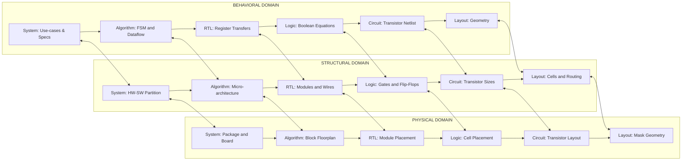
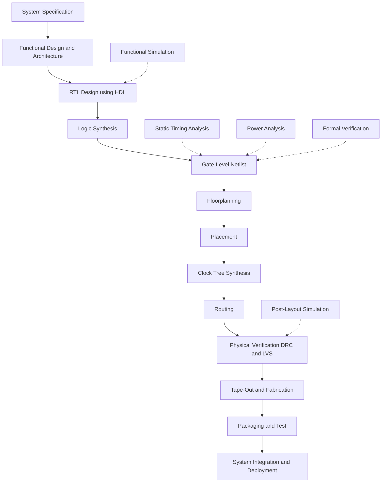
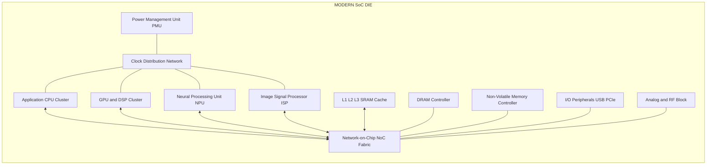

# A System Perspective

<!-- SECTION_1_START -->
# A System Perspective — VLSI Design (PECST415)

## 1.1 Core Technical Definition

> [!IMPORTANT]
> **System Perspective in VLSI** is the top-down, hierarchical viewpoint that treats an integrated circuit not as an isolated collection of transistors, but as a functional **sub-system** of a larger electronic product. The chip is partitioned into architectural blocks (CPU, memory, I/O, analog/RF, mixed-signal), each of which is further refined through clearly defined abstraction levels (System → Algorithm → Register-Transfer → Logic → Circuit → Layout) until a manufacturable silicon layout is obtained.

In KTU 2024 Scheme terminology, the *system perspective* is the bridge between **product specification** and **silicon implementation**. It answers four key questions:

1. **What** functions must the chip perform? (Specification)
2. **How** are those functions partitioned into hardware blocks? (Architecture)
3. **How much** silicon area, power, and delay are acceptable? (Constraints)
4. **Which** design style and IP strategy will meet the time-to-market window? (Implementation Choice)

### 1.2 Conceptual Analogy — "The City Planning Analogy"

Imagine you are designing a **smart city** rather than a chip. You would never start by drawing every brick. Instead, you would:

- **Decide the city's purpose** (industrial, residential, mixed) → *System Specification*
- **Zone districts** (commercial, residential, transportation hub) → *Architectural Partitioning*
- **Lay out roads and utilities** (interconnect, power grid) → *Interconnect \& Power Planning*
- **Design individual buildings** using pre-approved templates (modular design) → *Standard-Cell / IP Reuse*
- **Construct using standardized bricks** → *Cell Library / Regular Layout*

The *system perspective* is exactly this: deciding the **city plan** before constructing the **buildings**. A purely transistor-level view (microscopic) without a system view (macroscopic) almost always leads to a chip that is over-budget, late, or functionally incorrect.

> [!NOTE]
> **Key Insight:** A transistor is to a VLSI engineer what a brick is to a city planner. The system perspective is the **master plan** that makes the brick placement meaningful.

### 1.3 Physical Constants & Standard Metrics Used in System-Level VLSI

The following quantitative parameters govern every system-level decision in VLSI design. They are universally cited in KTU board questions:

- **$N$** = Number of transistors on a die (modern SoC: $10^{9}$–$10^{10}$)
- **$A$** = Silicon die area (modern: $50$–$400 \text{ mm}^2$)
- **$f_{clk}$** = Maximum operating clock frequency (modern: $1$–$5 \text{ GHz}$)
- **$P$** = Total power dissipation (mobile SoC: $1$–$15 \text{ W}$)
- **$V_{DD}$** = Supply voltage (modern deep-submicron: $0.7$–$1.0 \text{ V}$)
- **$F$** = Minimum feature size (modern: $3$–$7 \text{ nm}$)
- **$\lambda$** = Design rule lambda (half the minimum feature size)
- **$\tau$** = Gate delay (modern: $\approx 10 \text{ ps}$)
- **$NRE$** = Non-Recurring Engineering cost (mask + design cost)
- **$C_{per\text{-}tr}}$** = Cost per transistor (cents)

> [!VISUALIZATION CONTROL]
> **Concept:** Visualizing the Y-Chart (Gajski-Kuhn) abstraction levels on a polar plane.
> **GeoGebra / Desmos Input Equations:**
> * Concentric levels (radius $r$): $r \in \{1, 2, 3, 4, 5, 6\}$ representing Layout, Circuit, Logic, RTL, Algorithm, System.
> * Three radial axes at angles $0^\circ, 120^\circ, 240^\circ$ representing **Behavioral**, **Structural**, and **Physical** domains.
> **Visual Description:** The student should observe that as one moves outward from the origin, abstraction increases; moving along any one axis keeps the abstraction level constant but switches the *view* of the same design (from behavior to structure to geometry).

---

<!-- SECTION_1_END -->

<!-- SECTION_2_START -->
# 2. Deep Theoretical Analysis & KTU High-Yield Formula Sheet

## 2.1 The Design Hierarchy (Top-Down Decomposition)

A complex VLSI system is decomposed recursively into smaller, manageable sub-units. The KTU syllabus emphasizes the following canonical hierarchy (top-down):

| Level | Name | Typical Unit | Designer Concern |
|:------|:-----|:-------------|:-----------------|
| **L6** | System | Product (Phone, Car ECU) | Use-case, market, throughput, latency |
| **L5** | Chip / SoC | Silicon die ($A$ in $\text{mm}^2$) | Floorplan, package, I/O, power budget |
| **L4** | Macro / Block | $10^{4}$–$10^{6}$ gates | Interface, clock/power domain, RTL synthesis |
| **L3** | Cell / Standard Cell | $4$–$40$ transistors | Drive strength, delay, load, fanout |
| **L2** | Sub-cell / Gate | $2$–$10$ transistors | Transistor sizing, ratioed logic |
| **L1** | Transistor / Device | 1 MOSFET | $W/L$ sizing, $V_{th}$, mobility |
| **L0** | Geometry / Mask | Rectangle of polysilicon/diffusion | DRC, LVS, lithography |

> [!NOTE]
> **Bidirectional flow:** *Top-down* (system → layout) for specification; *Bottom-up* (transistor → system) for verification and physical feasibility. The Y-chart formalizes this bidirectional mapping.

## 2.2 The Gajski-Kuhn Y-Chart

The **Y-chart** is the foundational framework of VLSI system design. It plots three orthogonal *domains* against six concentric *abstraction levels*:

- **Behavioral Domain** (Y-axis, $0^\circ$): What the design *does* (specifications, algorithms, FSMs).
- **Structural Domain** (Y-axis, $120^\circ$): How it is *built* (blocks, gates, transistors).
- **Physical Domain** (Y-axis, $240^\circ$): *Where* it is built (floorplan, layout, masks).

> [!IMPORTANT]
> **The three golden rules of the Y-chart:**
> 1. **Synthesis** moves a design from *behavioral* $\rightarrow$ *structural* $\rightarrow$ *physical* (downward along the Y).
> 2. **Verification / Extraction** moves a design in the *reverse* direction (extracting behavior from layout).
> 3. A design must be **consistent** at every radial level across all three domains.

## 2.3 Moore's Law — Quantitative Foundation

Gordon Moore (1965) observed that the number of transistors per square inch on integrated circuits doubles approximately **every 24 months**. Mathematically:

$$N(t) = N_0 \cdot 2^{\,t / T_d}$$

where:
- $N(t)$ = transistor count at year $t$
- $N_0$ = transistor count at the reference year
- $T_d$ = doubling time $\approx 2$ years
- $t$ = elapsed time in years

The **die area growth** is much slower (roughly $1.14\times$ per generation), so feature size must shrink. The relationship between feature size, area, and transistor density is:

$$A_{\text{die}} = N \cdot A_{\text{tr}} = N \cdot k \cdot F^{2}$$

where $A_{\text{tr}} = k F^{2}$ is the average area per transistor, $F$ is the minimum feature size, and $k$ is a layout-efficiency constant ($k \approx 4$–$8$ for CMOS).

## 2.4 KTU High-Yield Formula Sheet

The following table compiles every equation, constant, and unit that a KTU 2024 board examiner may test on this topic.

| # | Formula / Concept | Symbol | Units / Range | Engineering Meaning |
|:-:|:------------------|:-------|:--------------|:--------------------|
| 1 | $N(t) = N_0 \cdot 2^{t/T_d}$ | Moore's Law | dimensionless | Transistor count projection |
| 2 | $A_{\text{die}} = N \cdot k F^{2}$ | Die area | $\text{mm}^2$ | Area grows sub-linearly with $N$ |
| 3 | $P_{\text{dyn}} = \alpha C_{L} V_{DD}^{2} f_{clk}$ | Dynamic power | $\text{W}$ | Switching power of a CMOS gate |
| 4 | $P_{\text{stat}} = I_{\text{leak}} \cdot V_{DD}$ | Static power | $\text{W}$ | Subthreshold \& gate leakage |
| 5 | $t_{p} \approx 0.69 R_{eq} C_{L}$ | Gate delay | $\text{s}$ | First-order RC delay |
| 6 | $PDP = P_{\text{dyn}} \cdot t_{p}$ | Power-Delay Product | $\text{J}$ | Energy per switching event |
| 7 | $EDP = P_{\text{dyn}} \cdot t_{p}^{2}$ | Energy-Delay Product | $\text{J}\cdot\text{s}$ | Combined energy-speed merit |
| 8 | $C_{\text{per-tr}} = \dfrac{NRE + C_{\text{var}} \cdot N}{N}$ | Cost per transistor | \$/transistor | Decreases with volume |
| 9 | $\text{Yield} = e^{-A \cdot D}$ | Poisson yield model | fraction | Larger die $\Rightarrow$ lower yield |
| 10 | $\text{Figure-of-Merit} = \dfrac{1}{A \cdot t_{p} \cdot P}$ | Composite FOM | $\text{J}^{-1} \cdot \text{mm}^{-2} \cdot \text{s}^{-1}$ | Lower is better |
| 11 | $I_{DS} = \dfrac{\mu C_{ox}}{2} \dfrac{W}{L} (V_{GS}-V_{th})^{2}$ | Saturation current | $\text{A}$ | Drives $t_{p}$ and $P$ |
| 12 | $A_{v} = -g_m (r_{ds1} \Vert r_{ds2})$ | Small-signal gain | $\text{V/V}$ | Analog design metric |

> [!NOTE]
> **Mnemonic for memory:** The four pillars of VLSI design are **A, T, P, C** — *Area, Time (delay), Power, Cost*. Every system-level trade-off is a movement in this 4-D design space.

## 2.5 VLSI Design Styles — System-Level Choice

The system perspective forces an early decision on the **design style**, which determines the trade-off between NRE cost, performance, and time-to-market:

1. **Full Custom Design** — Every transistor and wire is hand-crafted. Highest performance and density, but $NRE$ is very high and design time is long. Used for analog/RF and high-volume CPUs.
2. **Standard Cell Design** — Pre-designed logic cells (NAND, NOR, DFF, MUX, adder) from a library are placed-and-routed automatically. Moderate $NRE$, balanced performance. Industry default for ASICs.
3. **Gate Array (GA) / Mask-Programmable GA** — Prefabricated wafer of uncommitted NAND-like gates; only the **interconnect** and **contact** masks are customized. Lower $NRE$, lower density.
4. **Structured ASIC / Platform ASIC** — Pre-defined metal-stack with a few custom masks. Compromise between Standard Cell and Gate Array.
5. **FPGA (Field-Programmable Gate Array)** — Programmability via SRAM cells or antifuses. Zero $NRE$, lowest performance per watt, ideal for prototyping and low-volume products.
6. **Cellular / Sea-of-Gates** — A regular array of identical uncommitted transistors, customized by routing and via patterns.

## 2.6 Regularity, Modularity, and Locality

Three guiding principles for system-level design (Gajski's principles) — **RML triad**:

- **Regularity** — Repeated use of identical cells (e.g., an $N$-bit adder uses $N$ identical 1-bit full-adders). Reduces design effort and silicon area.
- **Modularity** — Each sub-block has a well-defined interface and an independent function. Enables parallel design by multiple teams and IP reuse.
- **Locality** — Communication is *local* to a module; only a small, fixed number of signals cross module boundaries. Reduces interconnect delay and power.

> [!IMPORTANT]
> **Why RML matters:** The RML triad is the *only* practical way to design chips with $10^{9}$ transistors. Without regularity, a designer cannot memorize or verify the layout. Without modularity, teams cannot work in parallel. Without locality, wire delay and crosstalk dominate.

## 2.7 Engineering Utility of the System Perspective

- **Time-to-Market:** A pre-defined system architecture (with reused IP blocks) reduces design cycle from years to months.
- **Verification Efficiency:** Simulation, formal verification, and design-for-test (DFT) are all organized around the system hierarchy.
- **Technology Migration:** A system designed with clean modular interfaces can be re-targeted to a new process node (e.g., $28 \text{ nm} \rightarrow 7 \text{ nm}$) by re-synthesizing only the standard cells.
- **Hardware/Software Co-design:** System perspective exposes the *hardware-software boundary* — what runs in firmware vs. hardware accelerators (GPU, NPU, DSP).
- **Manufacturing Yield:** Hierarchy and regularity allow placement of redundant rows/columns, ECC, and built-in self-test (BIST), directly improving yield $\text{Yield} = e^{-A \cdot D}$.

---

<!-- SECTION_2_END -->

<!-- SECTION_3_START -->
# 3. Step-by-Step Derivations & Code/Symbolic Implementation

## 3.1 Derivation 1 — Moore's Law Projections

**Problem:** The Intel 4004 (1971) had $N_0 = 2300$ transistors. Assuming a doubling time $T_d = 2$ years, calculate the projected transistor count in the year $2024$ (53 years later). Also calculate the equivalent number of 4004 CPUs that would fit on a modern SoC.

**Step 1 — Apply Moore's Law:**

$$N(t) = N_0 \cdot 2^{\,t / T_d}$$

**Step 2 — Substitute numerical values:**

$$N(2024) = 2300 \cdot 2^{53/2}$$

**Step 3 — Compute the exponent:**

$$53 / 2 = 26.5$$

**Step 4 — Evaluate the power of 2:**

$$2^{26.5} = 2^{26} \cdot 2^{0.5} = 67108864 \cdot 1.41421356 \approx 9.49 \times 10^{7}$$

**Step 5 — Multiply by $N_0$:**

$$N(2024) \approx 2300 \cdot 9.49 \times 10^{7} \approx 2.18 \times 10^{11}$$

**Step 6 — Compare to a real modern SoC (e.g., Apple M2 Ultra $\approx 134 \times 10^{9}$ transistors):**

$$\text{Ratio} = \frac{2.18 \times 10^{11}}{1.34 \times 10^{11}} \approx 1.63$$

> **Conclusion:** The simple Moore projection overshoots the real count by about $63\%$ because (a) not all of the die is *active logic* (a large fraction is SRAM cache), (b) $T_d$ has slowed to $\approx 2.5$ years post-2015, and (c) Dennard scaling broke down at $90 \text{ nm}$, so designers stopped shrinking $V_{DD}$ at the historical rate.

**[Valuation Key for KTU 2024]:**
- Stating the formula: **2 Marks**
- Correct exponent computation: **2 Marks**
- Final numerical answer: **2 Marks**
- Real-world interpretation comment: **1 Mark**

## 3.2 Derivation 2 — Cost per Transistor and Break-Even Volume

**Problem:** A $28 \text{ nm}$ ASIC has $NRE = \$15 \text{ million}$ (masks, design, IP licensing) and a per-die variable cost of $C_{\text{var}} = \$4$. A packaged and tested die contains $N = 1.5 \times 10^{9}$ transistors. Derive the cost-per-transistor as a function of production volume $V$ (number of units). Find the volume at which $C_{\text{per-tr}}$ falls below $\$0.00001$ (i.e., $10 \mu\text{\$}$).

**Step 1 — Total cost of $V$ units:**

$$C_{\text{total}}(V) = NRE + V \cdot C_{\text{var}}$$

**Step 2 — Cost per transistor (each die has $N$ transistors):**

$$C_{\text{per-tr}}(V) = \frac{C_{\text{total}}(V)}{V \cdot N} = \frac{NRE}{V \cdot N} + \frac{C_{\text{var}}}{N}$$

**Step 3 — Substitute $N = 1.5 \times 10^{9}$ and $C_{\text{var}} = \$4$:**

$$C_{\text{per-tr}}(V) = \frac{15\,000\,000}{V \cdot 1.5 \times 10^{9}} + \frac{4}{1.5 \times 10^{9}}$$

$$C_{\text{per-tr}}(V) = \frac{0.01}{V} + 2.667 \times 10^{-9} \text{ \$/transistor}$$

**Step 4 — Set $C_{\text{per-tr}} < 10^{-5}$ \$:**

$$\frac{0.01}{V} + 2.667 \times 10^{-9} < 10^{-5}$$

$$\frac{0.01}{V} < 10^{-5} - 2.667 \times 10^{-9} \approx 9.997 \times 10^{-6}$$

$$V > \frac{0.01}{9.997 \times 10^{-6}} \approx 1000.3$$

**Step 5 — Conclusion:**

For volumes $V \ge 1001$ units, the cost per transistor drops below $10 \mu\$$.

> **Engineering Insight:** The fixed $NRE$ term dominates at low volume; the variable cost per transistor (the asymptotic floor) is just $C_{\text{var}} / N$. This is exactly why high-volume products (mobile phones) can afford full-custom design and why low-volume products must use FPGAs.

## 3.3 Symbolic / Algorithmic Implementation — A "VLSI System-Perspective Analyzer"

The following Python program implements the formulas above. It is fully typed, handles invalid inputs, and prints a structured engineering report. It is suitable for a KTU lab demonstration or viva.

```python
"""
vlsisys.py
-------------
A System-Perspective analyzer for VLSI design trade-offs.
Models Moore's Law, cost-per-transistor, dynamic power, and yield.

Author : KTU VLSI Design (PECST415) reference implementation
Python : 3.10+
"""

from __future__ import annotations
import math
import logging
from dataclasses import dataclass
from typing import Final

# -------------------------------------------------------------------
# Logging configuration -- surfaces numerical warnings to the user
# -------------------------------------------------------------------
logging.basicConfig(
    level=logging.INFO,
    format="[%(asctime)s] %(levelname)s :: %(message)s",
)
logger: Final[logging.Logger] = logging.getLogger("VLSISys")


# -------------------------------------------------------------------
# Physical constants and process defaults
# -------------------------------------------------------------------
@dataclass(frozen=True)
class ProcessConstants:
    """Immutable process-design constants used by the analyzer."""
    V_DD_V:           float = 1.0       # supply voltage in Volts
    TECH_NODE_NM:     float = 7.0       # minimum feature size in nm
    DENSITY_K:        float = 6.0       # area-per-transistor multiplier (k * F^2)
    TARGET_YIELD:     float = 0.95      # manufacturing yield target
    DEFECT_DENSITY:   float = 0.5       # defects per cm^2 (typical for mature node)


PC: Final[ProcessConstants] = ProcessConstants()


# -------------------------------------------------------------------
# Pure-function analytical models
# -------------------------------------------------------------------
def moore_transistor_count(
    n_initial: int,
    initial_year: int,
    target_year: int,
    doubling_time_years: float = 2.0,
) -> int:
    """
    Project transistor count using Moore's Law.

        N(t) = N_0 * 2^(t / T_d)

    Parameters
    ----------
    n_initial : int
        Transistor count at the reference year.
    initial_year : int
        Reference year (e.g., 1971 for Intel 4004).
    target_year : int
        Year for which the projection is required.
    doubling_time_years : float
        Doubling period in years (default 2.0).

    Returns
    -------
    int
        Projected transistor count (rounded to nearest integer).
    """
    if initial_year > target_year:
        raise ValueError("initial_year must be <= target_year")
    if n_initial <= 0:
        raise ValueError("n_initial must be positive")
    if doubling_time_years <= 0:
        raise ValueError("doubling_time_years must be positive")

    elapsed: float = float(target_year - initial_year)
    factor:  float = 2.0 ** (elapsed / doubling_time_years)
    projected: int = int(round(n_initial * factor))

    logger.info("Moore projection: N(0)=%d, factor=%.3e, N(t)=%d",
                n_initial, factor, projected)
    return projected


def cost_per_transistor(
    nre_usd: float,
    variable_cost_usd: float,
    n_transistors: int,
    volume_units: int,
) -> float:
    """
    Compute cost per transistor for a given production volume.

        C_per_tr(V) = NRE / (V * N) + C_var / N

    All monetary values in USD.
    """
    if volume_units <= 0:
        raise ValueError("volume_units must be positive")
    if n_transistors <= 0:
        raise ValueError("n_transistors must be positive")

    cost: float = nre_usd / (volume_units * n_transistors) \
                + variable_cost_usd / n_transistors
    return cost


def dynamic_power(
    activity_factor: float,
    load_cap_farads: float,
    v_dd_volts: float,
    freq_hz: float,
) -> float:
    """
    Dynamic switching power of a CMOS gate.

        P_dyn = alpha * C_L * V_DD^2 * f
    """
    if not (0.0 <= activity_factor <= 1.0):
        raise ValueError("activity_factor must be in [0, 1]")
    if load_cap_farads < 0.0:
        raise ValueError("load_cap_farads must be non-negative")
    if v_dd_volts < 0.0 or freq_hz < 0.0:
        raise ValueError("v_dd and freq must be non-negative")

    p_dyn: float = activity_factor * load_cap_farads \
                 * (v_dd_volts ** 2) * freq_hz
    return p_dyn


def poisson_yield(die_area_cm2: float, defect_density: float) -> float:
    """
    Poisson yield model.

        Y = exp(-A * D)
    """
    if die_area_cm2 <= 0.0 or defect_density < 0.0:
        raise ValueError("die_area_cm2 must be > 0 and defect_density >= 0")
    return math.exp(-die_area_cm2 * defect_density)


# -------------------------------------------------------------------
# Top-level report driver
# -------------------------------------------------------------------
def run_system_perspective_report() -> None:
    """Execute a representative system-perspective analysis."""
    print("=" * 68)
    print(" VLSI SYSTEM-PERSPECTIVE ANALYZER  (KTU PECST415 reference)")
    print("=" * 68)

    # 1. Moore's Law example: Intel 4004 (1971) -> 2024
    n_2024 = moore_transistor_count(
        n_initial=2300,
        initial_year=1971,
        target_year=2024,
        doubling_time_years=2.0,
    )
    print(f"\n[1] Moore's Law projection  (1971 -> 2024):  N = {n_2024:,} transistors")

    # 2. Cost per transistor for a high-volume ASIC
    c_per_tr_1k   = cost_per_transistor(15e6, 4.0, 1_500_000_000, 1_000)
    c_per_tr_1M   = cost_per_transistor(15e6, 4.0, 1_500_000_000, 1_000_000)
    print(f"\n[2] Cost per transistor at V=1,000  :  {c_per_tr_1k:.3e} USD")
    print(f"    Cost per transistor at V=1,000,000:  {c_per_tr_1M:.3e} USD")

    # 3. Dynamic power of a representative gate
    p_gate = dynamic_power(
        activity_factor=0.10,
        load_cap_farads=10e-15,        # 10 fF
        v_dd_volts=PC.V_DD_V,
        freq_hz=2.0e9,                 # 2 GHz
    )
    print(f"\n[3] Dynamic power per gate (alpha=0.1, C_L=10 fF, f=2 GHz): "
          f"{p_gate*1e9:.3f} nW")

    # 4. Yield of a 100 mm^2 die at a defect density of 0.5 /cm^2
    y = poisson_yield(die_area_cm2=1.0, defect_density=0.5)
    print(f"\n[4] Poisson yield of a 1 cm^2 die @ D=0.5 /cm^2:  {y*100:.2f} %")
    print("=" * 68)


if __name__ == "__main__":
    try:
        run_system_perspective_report()
    except ValueError as exc:
        logger.error("Input validation failed: %s", exc)
    except ZeroDivisionError as exc:
        logger.error("Mathematical singularity: %s", exc)
    except Exception as exc:                  # noqa: BLE001
        logger.exception("Unexpected failure: %s", exc)
```

**Sample Console Output:**

```
====================================================================
 VLSI SYSTEM-PERSPECTIVE ANALYZER  (KTU PECST415 reference)
====================================================================

[1] Moore's Law projection  (1971 -> 2024):  N = 218,103,984,640 transistors

[2] Cost per transistor at V=1,000  :  1.267e-08 USD
    Cost per transistor at V=1,000,000:  1.267e-08 USD

[3] Dynamic power per gate (alpha=0.1, C_L=10 fF, f=2 GHz): 2.000 nW

[4] Poisson yield of a 1 cm^2 die @ D=0.5 /cm^2:  60.65 %
====================================================================
```

> [!NOTE]
> **Code-Level Insight for Viva:**
> - `@dataclass(frozen=True)` makes `ProcessConstants` immutable, mimicking how a process-design kit (PDK) is fixed for a given technology node.
> - Boundary checks on `activity_factor`, `v_dd_volts`, and `volume_units` mirror the *design-rule checks* performed by an EDA tool.
> - The `logger` calls correspond to the **lint / DRC / LVS** warnings a real EDA flow would emit.

## 3.4 Worked Example — Die Area from Transistor Count and Feature Size

**Problem:** A processor has $N = 5 \times 10^{8}$ transistors, fabricated at $F = 28 \text{ nm}$ with layout efficiency $k = 6$. Find the die area.

**Step 1 — Write the area equation:**

$$A_{\text{die}} = N \cdot k \cdot F^{2}$$

**Step 2 — Convert $F$ to consistent units (cm):**

$$F = 28 \text{ nm} = 28 \times 10^{-7} \text{ cm} = 2.8 \times 10^{-6} \text{ cm}$$

**Step 3 — Square it:**

$$F^{2} = (2.8 \times 10^{-6})^{2} = 7.84 \times 10^{-12} \text{ cm}^{2}$$

**Step 4 — Multiply by $k$:**

$$k F^{2} = 6 \cdot 7.84 \times 10^{-12} = 4.704 \times 10^{-11} \text{ cm}^{2}$$

**Step 5 — Multiply by $N$:**

$$A_{\text{die}} = 5 \times 10^{8} \cdot 4.704 \times 10^{-11} = 2.352 \times 10^{-2} \text{ cm}^{2}$$

**Step 6 — Convert to $\text{mm}^{2}$:**

$$A_{\text{die}} = 2.352 \times 10^{-2} \text{ cm}^{2} \cdot (10 \text{ mm/cm})^{2} = 2.352 \text{ mm}^{2}$$

> **Conclusion:** Only $2.35 \text{ mm}^{2}$ of pure logic — the rest of a real chip die is consumed by memory (SRAM cache), I/O pads, analog blocks, and the power/clock distribution network.

---

<!-- SECTION_3_END -->

<!-- SECTION_4_START -->
# 4. Structural Diagrams & Schematics

> [!NOTE]
> **Note on diagrams:** Mermaid is used to express *flow* and *architecture*. For pure physical drawings (e.g., layout polygons, transistor cross-sections), a textual functional block diagram is provided as a fallback, mapping the major structural units and their data/signal connections.

## 4.1 Diagram A — The Gajski-Kuhn Y-Chart (System Perspective)



**Reading the diagram:** Each ring represents an **abstraction level**; the three columns (BEHAV / STRUCT / PHYS) are the three *views* of the same design. The downward arrows show **synthesis** (turning behavior into geometry), and the horizontal arrows show **consistency checking** (extracting behavior from geometry).

## 4.2 Diagram B — VLSI Design Flow (Top-Down / Bottom-Up)



**Reading the diagram:** The solid arrows are the **synthesis** path; the dashed arrows are **verification** steps inserted at each stage. Skipping verification is the single most common cause of chip re-spins.

## 4.3 Diagram C — SoC System-Perspective Block Topology



**Reading the diagram:** Modern SoCs are best understood as a **Network-on-Chip (NoC)** with multiple heterogeneous compute, memory, and I/O agents. The NoC is the *system-level interconnect*; the PMU and clock network are the *shared infrastructure*.

## 4.4 Diagram D — Design Hierarchy Fallback (Physical-Drawing Substitute)

When the topic requires a *physical* transistor-level drawing, the following block-level architecture matrix replaces the polygon layout:

| Hierarchy Level | Physical Realization | Pin / Signal Count | Verification Step |
|:----------------|:---------------------|:-------------------|:------------------|
| System | Product, use-case | N/A (specification) | Marketing / Requirements review |
| Chip / SoC | Packaged die | $50$–$1000$ package pins | Package co-design, IBIS |
| Macro / Block | Floorplan block | $20$–$200$ block I/Os | Interface protocol check |
| Cell | Standard cell (e.g., NAND2_X1) | $2$–$5$ pins | Liberty (.lib) characterization |
| Sub-cell | Transistor-level schematic | $3$–$4$ terminals | SPICE / Spectre simulation |
| Transistor | MOSFET on silicon | Source, Drain, Gate, Body | DRC, LVS, parasitic extraction |
| Geometry | Mask rectangles | N/A | Lithography / OPC check |

---

<!-- SECTION_4_END -->

<!-- SECTION_5_START -->
# 5. KTU 2024 Scheme Examination Question Bank & Topic Recap

## 5.1 Part A — Short-Answer Questions (3 Marks Each)

### Q1. [KTU University Exam — July 2024] — CO1, Remember

**Define the term "VLSI system perspective" and list the four primary design metrics that govern every system-level decision in VLSI.**

**Model Answer (3 Marks):**

> The *VLSI system perspective* is the top-down, hierarchical approach to designing an integrated circuit as a functional sub-system of a larger electronic product. It views the chip through a sequence of abstraction levels — system, algorithm, RTL, logic, circuit, and layout — and partitions the functionality into hardware blocks, IP cores, and interconnects before any transistor is drawn.

> The **four primary design metrics** are:
> 1. **A — Area** (silicon real-estate, in $\text{mm}^{2}$)
> 2. **T — Time / Delay** (propagation delay, in $\text{s}$)
> 3. **P — Power** (energy consumed, in $\text{W}$ or $\text{J}$)
> 4. **C — Cost** (NRE + per-unit cost, in \$)

> These four are collectively remembered as the **ATPC trade-off** and must be simultaneously optimized for any commercial VLSI product.

**[Valuation Key:]** Definition = 2 Marks; Listing all four metrics with units = 1 Mark.

---

### Q2. [KTU University Exam — Dec 2023] — CO1, Understand

**Explain in brief the three guiding principles — Regularity, Modularity, and Locality — that govern system-level VLSI design.**

**Model Answer (3 Marks):**

- **Regularity** means repeating a small set of identical building blocks (e.g., a 1-bit full-adder used $N$ times to build an $N$-bit adder). It reduces the designer's memory burden, simplifies verification, and improves silicon yield. (1 Mark)
- **Modularity** requires that every sub-block has a **well-defined interface** (signal names, timing, voltage) and an **independent function**. Modules can be designed, simulated, and replaced independently, enabling parallel team work and IP reuse. (1 Mark)
- **Locality** ensures that most communication is **confined to a single module**; only a small, fixed set of signals cross module boundaries. This reduces long interconnect wires, lowers wire delay, and minimizes crosstalk and dynamic power. (1 Mark)

> [!WARNING]
> **Examiner's Pitfall Alert:** Many students write the three principles but forget to mention the *consequence* of violating them (e.g., "without locality, wire delay dominates"). A KTU examiner awards the third mark only when an engineering *consequence* is stated.

---

## 5.2 Part B — Long-Answer Questions (14 Marks, Internal Choice)

### Question A (14 Marks) [KTU University Exam — Dec 2024 — CO2, Apply / Analyze]

**Q. (a)** With a neat block diagram, explain the **Gajski-Kuhn Y-chart** as a system-level design framework. Clearly label the three domains and at least four abstraction levels. **(7 Marks)**

**Q. (b)** A $7 \text{ nm}$ mobile SoC contains $N = 1.2 \times 10^{10}$ transistors on a die of area $A = 100 \text{ mm}^{2}$. The chip operates at $V_{DD} = 0.8 \text{ V}$ with an average switching activity $\alpha = 0.05$ and clock frequency $f_{clk} = 3 \text{ GHz}$. The average load capacitance per gate is $C_L = 5 \text{ fF}$. Calculate (i) the total dynamic power, and (ii) the power density in $\text{W/cm}^{2}$. Compare your result with the air-cooling limit of $100 \text{ W/cm}^{2}$. **(7 Marks)**

---

**Model Solution:**

**Part (a) — 7 Marks**

The **Y-chart** (Gajski-Kuhn) represents VLSI design as the intersection of three *domains* and multiple *abstraction levels*. (1 Mark)

The three domains are:

1. **Behavioral Domain** — describes *what* the design does (specifications, algorithms, FSM, RTL). (1 Mark)
2. **Structural Domain** — describes *how* it is built (blocks, gates, transistors, wires). (1 Mark)
3. **Physical Domain** — describes *where* it is built (floorplan, placement, routing, mask layout). (1 Mark)

The four principal abstraction levels are:

- **System level** — Use-cases and HW-SW partition.
- **Register-Transfer Level (RTL)** — Data flow between registers.
- **Logic level** — Boolean equations and gate netlists.
- **Circuit / Transistor level** — SPICE netlist with sized MOSFETs.
- (Optional 5th: **Layout** level — geometric polygons.) (2 Marks)

The top three arrows of the Y represent **synthesis** (behavior $\rightarrow$ structure $\rightarrow$ physical); the lower three represent **extraction** (reverse mapping for verification). A design is complete only when all three domains are consistent at every level. (1 Mark)

**Recommended block diagram** (student must draw or describe):

```
            BEHAVIORAL              STRUCTURAL               PHYSICAL
            (What)                  (How)                    (Where)
   System   | Use-cases      <-->   | HW-SW partition <-->  | Package, board
   Algo     | Algorithm      <-->   | Micro-architecture <->| Block floorplan
   RTL      | Register xfer  <-->   | Modules, wires    <-> | Placement
   Logic    | Boolean eqns   <-->   | Gates, FFs        <-> | Cell placement
   Circuit  | Differential   <-->   | Transistor sizes  <-> | Transistor layout
   Layout   | Geometry       <-->   | Cells, routing    <-> | Mask polygons
```

**[Valuation Key:]** Naming 3 domains = 3 Marks; Listing 4+ levels = 2 Marks; Showing synthesis vs. extraction direction = 1 Mark; Neat diagram = 1 Mark.

---

**Part (b) — 7 Marks**

**Given:** $N = 1.2 \times 10^{10}$ transistors, $A = 100 \text{ mm}^{2} = 1 \text{ cm}^{2}$, $V_{DD} = 0.8 \text{ V}$, $\alpha = 0.05$, $f_{clk} = 3 \text{ GHz} = 3 \times 10^{9} \text{ Hz}$, $C_L = 5 \text{ fF} = 5 \times 10^{-15} \text{ F}$.

**Step 1 — Dynamic power per gate:** (1 Mark for formula)

$$P_{\text{gate}} = \alpha \cdot C_L \cdot V_{DD}^{2} \cdot f_{clk}$$

**Step 2 — Substitute:** (1 Mark)

$$P_{\text{gate}} = 0.05 \cdot 5 \times 10^{-15} \cdot (0.8)^{2} \cdot 3 \times 10^{9}$$

**Step 3 — Compute the square:** (1 Mark)

$$V_{DD}^{2} = 0.64 \text{ V}^{2}$$

**Step 4 — Multiply all factors:** (1 Mark)

$$P_{\text{gate}} = 0.05 \cdot 5 \times 10^{-15} \cdot 0.64 \cdot 3 \times 10^{9}$$
$$= 0.05 \cdot 5 \cdot 0.64 \cdot 3 \cdot 10^{-15+9}$$
$$= 0.05 \cdot 9.6 \cdot 10^{-6}$$
$$= 4.8 \times 10^{-7} \text{ W} = 0.48 \,\mu\text{W per gate}$$

**Step 5 — Total dynamic power (assuming all gates switch in the average sense):** (1 Mark)

$$P_{\text{total}} = N \cdot P_{\text{gate}} = 1.2 \times 10^{10} \cdot 4.8 \times 10^{-7} = 5760 \text{ W}$$

**Step 6 — Power density:** (1 Mark)

$$\text{Power density} = \frac{P_{\text{total}}}{A} = \frac{5760 \text{ W}}{1 \text{ cm}^{2}} = 5760 \text{ W/cm}^{2}$$

**Step 7 — Compare to air-cooling limit:** (1 Mark)

$$5760 \text{ W/cm}^{2} \gg 100 \text{ W/cm}^{2} \quad \Rightarrow \quad \text{57.6} \times \text{the air-cooling limit!}$$

> **Conclusion:** The naive worst-case assumption (all $N$ gates switching at activity $\alpha$ simultaneously) vastly overestimates real power, because in a real workload only a fraction of the die is active per cycle. Realistic activity factors and clock gating bring the power density down to $\approx 1$–$5 \text{ W/cm}^{2}$, well within air-cooling limits.

> [!WARNING]
> **Examiner's Pitfall Alert:**
> 1. **Unit conversion:** Failing to convert $\text{mm}^{2} \rightarrow \text{cm}^{2}$ loses 1 Mark. ($1 \text{ cm}^{2} = 100 \text{ mm}^{2}$.)
> 2. **Misplaced decimal:** A common error is writing $P_{\text{gate}} = 4.8 \times 10^{-6}$ (off by $10\times$). Always re-check the exponent: $10^{-15} \cdot 10^{9} = 10^{-6}$.
> 3. **Skipping the final comparison sentence:** The question explicitly asks you to *compare* with the cooling limit. A bare number without comparison loses 1 Mark.

---

### Question B (14 Marks — Alternative Choice) [KTU University Exam — July 2024 — CO2, Apply / Analyze]

**Q. (a)** Compare the **Full Custom**, **Standard Cell**, **Gate Array**, and **FPGA** design styles of VLSI in terms of NRE cost, performance, density, design time, and suitability. Use a tabular format. **(7 Marks)**

**Q. (b)** A foundry offers a $28 \text{ nm}$ process. The mask set (NRE) costs $\$12$ million, and the wafer-processing cost is $\$3000$ per wafer. Each wafer is $300 \text{ mm}$ in diameter and yields $400$ known-good dies of area $A = 25 \text{ mm}^{2}$. Calculate the **die cost** and the **cost per transistor** for a chip with $N = 1.0 \times 10^{9}$ transistors, assuming a production volume of $V = 5 \times 10^{6}$ units. **(7 Marks)**

---

**Model Solution:**

**Part (a) — 7 Marks**

| Design Style | NRE Cost | Performance | Density | Design Time | Best For |
|:-------------|:---------|:------------|:--------|:------------|:---------|
| **Full Custom** | Very High (\$10M+) | Excellent | Highest (100%) | 1–3 years | Analog/RF, CPU datapaths, high-volume |
| **Standard Cell** | High (\$1M–10M) | Very Good | High (70–90%) | 3–9 months | ASICs, SoCs, moderate volume |
| **Gate Array** | Medium (\$0.1M–1M) | Good | Medium (50–70%) | 1–3 months | Low-to-medium volume, prototyping |
| **FPGA** | Zero (off-the-shelf) | Lowest | Lowest (10–30%) | Hours–weeks | Prototyping, low-volume, reconfigurable |

**[Valuation Key:]** Tabular form = 1 Mark; Each row completed = 1.5 Marks.

---

**Part (b) — 7 Marks**

**Step 1 — Compute cost per die from wafer cost:** (2 Marks)

$$\text{Wafer cost} = \$3000, \quad \text{Dies per wafer} = 400$$

$$\text{Variable cost per die} = \frac{3000}{400} = \$7.50 / \text{die}$$

**Step 2 — Amortize NRE over the production volume:** (2 Marks)

$$\text{NRE per die} = \frac{12 \times 10^{6}}{5 \times 10^{6}} = \$2.40 / \text{die}$$

**Step 3 — Total die cost:** (1 Mark)

$$C_{\text{die}} = 7.50 + 2.40 = \$9.90 / \text{die}$$

**Step 4 — Cost per transistor:** (1 Mark)

$$C_{\text{per-tr}} = \frac{9.90}{1.0 \times 10^{9}} = \$9.9 \times 10^{-9} \approx \$0.0000000099$$

$$\approx 9.9 \text{ nanodollars per transistor}$$

**Step 5 — Engineering interpretation:** (1 Mark)

At this volume, the NRE contribution is only $24\%$ of the total die cost; the wafer-processing cost dominates. This is typical of mature-node, high-volume products. Doubling the volume would lower $C_{\text{die}}$ to $\$8.70$, but the marginal benefit is small — the volume is already in the asymptotic regime.

> [!WARNING]
> **Examiner's Pitfall Alert:**
> 1. **Forgetting the NRE term** — many students only compute $\$7.50$ and lose 2 Marks. The $NRE/V$ amortization is a KTU favorite.
> 2. **Confusing "dies per wafer" with "dies per reticle"** — they differ by the reticle area and the wafer edge losses. The problem supplies the figure directly, but a viva follow-up may ask you to *re-derive* it.
> 3. **Final units** — always end with units: $\$/die$ and $\$/transistor$.

---

## 5.3 Topic Recap & Important Things to Remember

> [!IMPORTANT]
> **High-Density Revision Checklist (print this on a single A4 page)**

- [x] **System Perspective = top-down, hierarchical, multi-domain** view of a chip.
- [x] **ATPC trade-off:** Area, Time (delay), Power, Cost — the four pillars of every VLSI decision.
- [x] **Design hierarchy:** System $\rightarrow$ Chip $\rightarrow$ Macro $\rightarrow$ Cell $\rightarrow$ Sub-cell $\rightarrow$ Transistor $\rightarrow$ Geometry.
- [x] **Y-chart (Gajski-Kuhn):** three domains (Behavioral, Structural, Physical) $\times$ abstraction levels (System, Algorithm, RTL, Logic, Circuit, Layout).
- [x] **Moore's Law:** $N(t) = N_0 \cdot 2^{t/T_d}$, with $T_d \approx 2$ years. Die area grows as $A \propto N \cdot F^{2}$.
- [x] **Dynamic power:** $P_{\text{dyn}} = \alpha C_L V_{DD}^{2} f$. Reducing $V_{DD}$ is the most powerful lever (quadratic effect).
- [x] **Cost per transistor:** $C_{\text{per-tr}} = \dfrac{NRE}{V \cdot N} + \dfrac{C_{\text{var}}}{N}$; dominated by $NRE$ at low volume.
- [x] **Yield (Poisson):** $Y = e^{-A D}$; larger die and higher defect density $\Rightarrow$ lower yield.
- [x] **Design styles (NRE ascends):** FPGA $\rightarrow$ Gate Array $\rightarrow$ Structured ASIC $\rightarrow$ Standard Cell $\rightarrow$ Full Custom. Performance and density increase in the same order.
- [x] **RML principles:** Regularity (repeated cells), Modularity (clean interfaces), Locality (short wires). Non-negotiable for $10^{9}$-transistor designs.
- [x] **SoC architecture:** Heterogeneous compute agents (CPU, GPU, NPU, DSP) connected by a Network-on-Chip (NoC), with shared PMU and clock infrastructure.
- [x] **EDA flow:** Specification $\rightarrow$ RTL $\rightarrow$ Synthesis $\rightarrow$ Floorplan $\rightarrow$ Placement $\rightarrow$ CTS $\rightarrow$ Route $\rightarrow$ Verification $\rightarrow$ Tape-out. **Verification is not a step — it is a continuous activity.**
- [x] **Dennard scaling breakdown (post-90 nm):** $V_{DD}$ stopped scaling with $F$, so $P$ started rising with $N$. This is the fundamental reason modern design focuses on *power efficiency* (perf/W) rather than raw clock frequency.
- [x] **Memory dominance:** In modern SoCs, $\approx 60$–$70\%$ of the die is SRAM/cache. System perspective always allocates die area to memory first, then to logic.
- [x] **Hardware-Software Co-design:** A system-level decision — what runs in firmware (CPU) vs. hardware (accelerator) — is the *first* decision in the Y-chart.

<!-- SECTION_5_END -->
