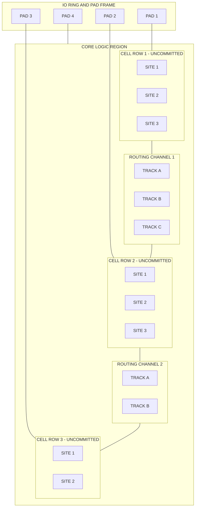
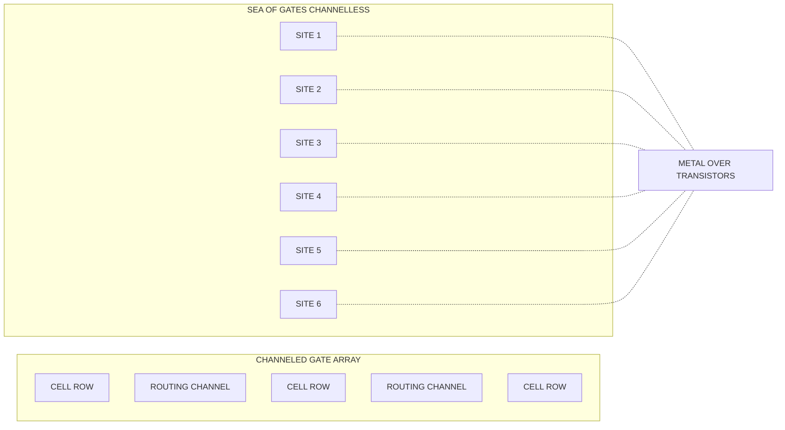
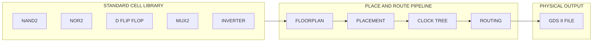
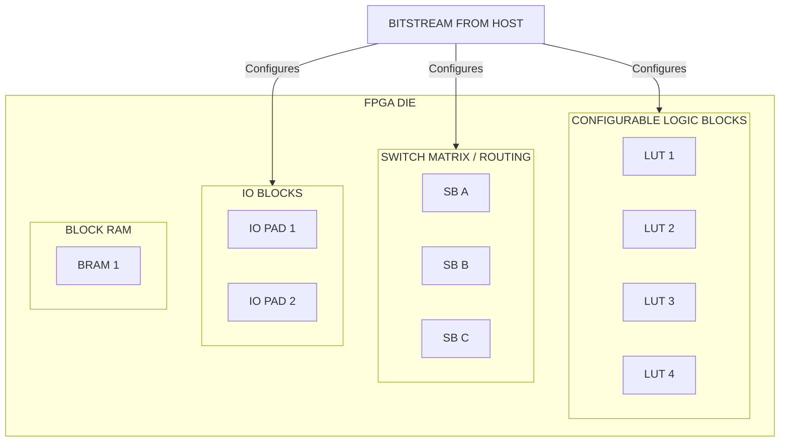
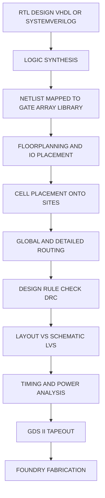

# array based design

<!-- SECTION_1_START -->

# Array-Based Design in VLSI

> [!IMPORTANT]
> **KTU 2024 Scheme | PECST415 - VLSI Design | Module 2**
> **Course Outcome Mapping:** CO2 - Apply design methodologies for digital integrated circuits
> **Cognitive Level:** Understand, Apply

## Core Technical Definition

**Array-based design** is a **semi-custom VLSI design methodology** in which a predefined, regular array of uncommitted (prediffused) logic cells — such as transistors, NAND/NOR gates, flip-flops, or logic blocks — is fabricated on a master wafer in advance. The final circuit function is realized later by adding only the **interconnect (metal) layers** and the **contact/via cuts** that custom-route signals between these preplaced primitives. Because only a small subset of the total mask set changes from one design to another, the **non-recurring engineering (NRE) cost** is drastically reduced while the **time-to-market** is compressed to weeks rather than months.

> [!NOTE]
> **KTU Exact Terminology (Module 2):** The syllabus explicitly groups Gate Arrays, Standard Cell (Row-Based) Design, FPGAs, and PLA/PAL structures under the umbrella of **Array-Based Design Approaches**. The recurring motif is *regularity of geometry* coupled with *personalization through later-stage metallization*.

## Intuitive Analogy — The "Plot Colony" of VLSI

Think of a real-estate developer who buys a vast stretch of land, lays out a **grid of identical plots**, builds the **boundary walls, plumbing trenches, and road network in advance**, and then sells these pre-built plots to individual buyers. Each buyer only needs to decide **how to paint and furnish the interior of their house** and which **internal doors to open** to connect rooms. The developer did 90% of the heavy construction; the buyer customizes the last 10%.

In the silicon world:

- The **plot colony** = the **master image / base wafer** containing thousands of repeated transistors.
- The **buyer's interior decoration** = the **metal interconnect layers** drawn by the designer.
- The **ready-made walls** = the **predefined nMOS/pMOS transistor rows**.
- The **paint, doors, and furniture** = the **vias, contacts, and routing channels** unique to the circuit.

This is exactly the **philosophy of array-based design** — invest in *regularity* once, and *customize* per chip with cheap, quick edits.

## Where Array-Based Design Sits in the VLSI Design Spectrum

| Design Style | NRE Cost | Turnaround | Density | Performance | Typical Volume |
|---|---|---|---|---|---|
| **Full Custom** | Very High | Long | Excellent | Excellent | Very High (ASICs) |
| **Array-Based (Gate Array / Std Cell)** | Moderate | Short | Good | Good | Medium–High |
| **FPGA** | Zero (off-the-shelf) | Instant | Low | Moderate | Low–Medium |

> [!TIP]
> **Engineering Heuristic:** Choose array-based design when your product is *too complex for full custom* but *too high-volume to justify FPGAs*. It is the sweet spot for commercial ASICs, communication chips, and consumer SoCs.

<!-- SECTION_1_END -->

<!-- SECTION_2_START -->

# Deep Theoretical Analysis & KTU High-Yield Formula Sheet

## 2.1 The Two Pillars of Array-Based Design

### Pillar 1 — *Prediffused Regularity*
The silicon foundry manufactures a **fixed pattern of transistors** (called the **base array** or **master slice**) on every chip. This base array is *functionally incomplete* — its transistors are unconnected.

### Pillar 2 — *Metallization Personalization*
The customer-designed **routing layers** (typically Metal-1, Metal-2, sometimes Metal-3) are generated by automatic place-and-route (P&R) tools. Only **2 to 4 metal masks** change between two different gate-array designs on the same master.

> [!NOTE]
> This dichotomy produces a powerful **"Mask Cost"** formula used by KTU examiners:
>
> $$\text{Masks Customized} = M_{\text{total}} - M_{\text{fixed}}$$
>
> where $M_{\text{total}}$ is the total number of photolithographic masks in the process and $M_{\text{fixed}}$ are the masks common to all designs on the master slice.

## 2.2 Taxonomy of Array-Based Architectures

The KTU Module 2 syllabus recognizes four canonical flavors. Understanding their *internal topology* is the single most-tested concept in this topic.

### A. Channeled Gate Array
- Transistors are organized as **rows of identical cells** (basic units = 2–4 transistors).
- **Dedicated routing channels** are left empty *between* the rows of cells.
- Channels are filled with horizontal metal wires during customization.
- **Limitation:** Channels can become a *bottleneck* when the netlist is dense — a phenomenon known as **channel routing congestion**.

### B. Channelless Gate Array (Sea-of-Gates)
- Removes the dedicated channels and lets metal run **over the top of unused transistors**.
- The cell looks like a **continuous sea** of gate sites, hence the name.
- **Advantage:** Higher usable density (~30% more than channeled).
- **Disadvantage:** Routing tools must now avoid shorting gates underneath — much harder for the router.

### C. Structured Gate Array (Embedded Array)
- Combines *gate-array regions* with *predefined macro blocks* such as RAM, ROM, multipliers, or PLLs.
- Used in **mixed-signal SoCs** where some parts (like analog RF) are hand-crafted, and digital logic is gate-array.

### D. Standard Cell (Row-Based) Design
- Although technically a *cell-based* approach, the KTU syllabus groups it under array-based design.
- Each logic gate (NAND, NOR, DFF, MUX, Adder) is a **fully designed standard cell** with a **fixed height** but **variable width**.
- Cells are placed in **rows**; routing channels are generated automatically between rows by the P&R tool.
- The foundry fabricates the **full mask set** for every design — hence the NRE cost is higher than pure gate arrays.

## 2.3 FPGA — The Ultimate Re-Programmable Array

A **Field-Programmable Gate Array (FPGA)** is the modern, most flexible form of array-based design. Instead of custom metal, the routing is encoded in **static RAM (SRAM) cells**, **anti-fuses**, or **flash switches**.

> [!NOTE]
> **KTU 2024 Highlight:** FPGAs eliminate the metal-mask customization step entirely. The "array" is fixed at the factory, and the *bitstream* loaded at power-up defines the logic. This trades silicon area for **massive flexibility**.

## 2.4 The Economics Behind Array-Based Design

The **cost per chip** $C$ for an array-based design is given by:

$$C = \frac{C_{\text{NRE}} + (N \cdot C_{\text{fab}})}{N \cdot Y}$$

where:

- $C_{\text{NRE}}$ = non-recurring engineering cost (mask set + design time)
- $N$ = production volume (units)
- $C_{\text{fab}}$ = per-wafer fabrication cost
- $Y$ = yield fraction ($0 < Y \leq 1$)

> [!IMPORTANT]
> For **gate arrays**, $C_{\text{NRE}}$ is dominated by **only 2–4 metal masks**, not the full 25–30 mask set. This is why a gate-array prototype can be ready in **3–5 weeks** instead of the **10–14 weeks** of a full-custom ASIC.

## 2.5 KTU High-Yield Formula Sheet

| # | Concept | Formula / Definition | Units / Notes |
|---|---|---|---|
| 1 | Mask customization ratio | $R = \dfrac{M_{\text{custom}}}{M_{\text{total}}}$ | Dimensionless, typical $R = 0.1$ to $0.2$ for GA |
| 2 | Per-unit cost | $C = \dfrac{C_{\text{NRE}} + N \cdot C_{\text{fab}}}{N \cdot Y}$ | Currency / good die |
| 3 | Channel density | $D_{\text{ch}} = \dfrac{N_{\text{tracks}}}{W_{\text{ch}}}$ | Tracks per $\mu m$ |
| 4 | Transistor utilization | $U = \dfrac{N_{\text{used}}}{N_{\text{total}}}$ | Typical $U = 0.5$ to $0.8$ for Sea-of-Gates |
| 5 | Logic capacity | $L = N_{\text{gates}} \times f_{\text{utilization}}$ | Equivalent 2-input NAND gates |
| 6 | Propagation delay (gate-array) | $t_{pd} = t_{\text{int}} + R_{\text{drv}} \cdot C_{\text{wire}}$ | $t_{\text{int}}$ is intrinsic FO1 delay |
| 7 | Rent's Rule (wire length estimation) | $T = k \cdot N^{p}$ | $p$ typically $0.5$ to $0.75$ for arrays |
| 8 | Channel pitch | $P_{\text{ch}} = \lambda \cdot (\text{track count} + 1)$ | $\lambda$ is the design rule unit |

> [!TIP]
> The **Rent's Rule** expression $T = k \cdot N^{p}$ is the *only* KTU-recommended formula for estimating routing congestion during array-based design. The exponent $p$ reflects the design's *interconnect complexity*.

<!-- SECTION_2_END -->

<!-- SECTION_3_START -->

# Step-by-Step Derivations, Worked Examples & Code Implementation

## 3.1 Derivation — The Critical Volume of Array-Based vs Full-Custom

**Problem (KTU-style 14-mark scaffold):** A startup is choosing between a **full-custom ASIC** and a **gate-array ASIC** for an IoT sensor node. Compute the production volume at which the array-based design becomes more economical per unit.

### Step 1 — Define the cost equations

For **Full-Custom ASIC**:

$$C_{\text{FC}} = \frac{C_{\text{NRE,FC}} + N \cdot C_{\text{fab}}}{N \cdot Y_{\text{FC}}}$$

For **Gate-Array ASIC**:

$$C_{\text{GA}} = \frac{C_{\text{NRE,GA}} + N \cdot C_{\text{fab}}}{N \cdot Y_{\text{GA}}}$$

### Step 2 — Set the breakeven condition

At the breakeven volume $N^{\star}$, the two per-unit costs are equal:

$$\frac{C_{\text{NRE,FC}} + N^{\star} \cdot C_{\text{fab}}}{N^{\star} \cdot Y_{\text{FC}}} = \frac{C_{\text{NRE,GA}} + N^{\star} \cdot C_{\text{fab}}}{N^{\star} \cdot Y_{\text{GA}}}$$

### Step 3 — Multiply through and simplify

Multiplying both sides by $N^{\star}$:

$$\frac{C_{\text{NRE,FC}} + N^{\star} \cdot C_{\text{fab}}}{Y_{\text{FC}}} = \frac{C_{\text{NRE,GA}} + N^{\star} \cdot C_{\text{fab}}}{Y_{\text{GA}}}$$

Cross-multiplying:

$$Y_{\text{GA}} \cdot (C_{\text{NRE,FC}} + N^{\star} \cdot C_{\text{fab}}) = Y_{\text{FC}} \cdot (C_{\text{NRE,GA}} + N^{\star} \cdot C_{\text{fab}})$$

Expanding:

$$Y_{\text{GA}} \cdot C_{\text{NRE,FC}} + N^{\star} \cdot Y_{\text{GA}} \cdot C_{\text{fab}} = Y_{\text{FC}} \cdot C_{\text{NRE,GA}} + N^{\star} \cdot Y_{\text{FC}} \cdot C_{\text{fab}}$$

### Step 4 — Isolate $N^{\star}$

Grouping the $N^{\star}$ terms on one side:

$$N^{\star} \cdot (Y_{\text{GA}} \cdot C_{\text{fab}} - Y_{\text{FC}} \cdot C_{\text{fab}}) = Y_{\text{FC}} \cdot C_{\text{NRE,GA}} - Y_{\text{GA}} \cdot C_{\text{NRE,FC}}$$

Factoring the LHS:

$$N^{\star} \cdot C_{\text{fab}} \cdot (Y_{\text{GA}} - Y_{\text{FC}}) = Y_{\text{FC}} \cdot C_{\text{NRE,GA}} - Y_{\text{GA}} \cdot C_{\text{NRE,FC}}$$

Solving for $N^{\star}$:

$$N^{\star} = \frac{Y_{\text{FC}} \cdot C_{\text{NRE,GA}} - Y_{\text{GA}} \cdot C_{\text{NRE,FC}}}{C_{\text{fab}} \cdot (Y_{\text{GA}} - Y_{\text{FC}})}$$

### Step 5 — Substitute typical industrial numbers

| Parameter | Full-Custom (FC) | Gate Array (GA) |
|---|---|---|
| NRE cost $C_{\text{NRE}}$ | $\text{\rupee } 75{,}00{,}000$ | $\text{\rupee } 18{,}00{,}000$ |
| Yield $Y$ | $0.85$ | $0.78$ |
| Fab cost per chip $C_{\text{fab}}$ | $\text{\rupee } 450$ | $\text{\rupee } 450$ |

Plugging into the breakeven formula:

$$N^{\star} = \frac{0.85 \times 18{,}00{,}000 - 0.78 \times 75{,}00{,}000}{450 \times (0.78 - 0.85)}$$

Numerator:

$$0.85 \times 18{,}00{,}000 = 15{,}30{,}000$$
$$0.78 \times 75{,}00{,}000 = 58{,}50{,}000$$
$$\text{Numerator} = 15{,}30{,}000 - 58{,}50{,}000 = -43{,}20{,}000$$

Denominator:

$$450 \times (0.78 - 0.85) = 450 \times (-0.07) = -31.5$$

Therefore:

$$N^{\star} = \frac{-43{,}20{,}000}{-31.5} \approx 1{,}37{,}143 \text{ units}$$

### Step 6 — Final Interpretation

> **Conclusion:** Below approximately **1.4 lakh units**, the **gate array** is cheaper per chip. Above this crossover, the **full-custom ASIC** wins because its superior yield and density dominate. *For low-volume IoT prototypes, gate array is the rational choice.*

## 3.2 Worked Example — Rent's Rule Wire Length Estimation

**Problem:** A gate array contains $N = 10{,}000$ gates. The Rent's exponent for this logic family is $p = 0.6$ and the average pin constant is $k = 3.5$. Estimate the **total number of interconnects** $T$ that the routing channels must accommodate.

### Step 1 — State the governing equation

$$T = k \cdot N^{p}$$

### Step 2 — Substitute the numerical values

$$T = 3.5 \times (10{,}000)^{0.6}$$

### Step 3 — Compute the intermediate power

Using the identity $(10^{4})^{0.6} = 10^{2.4} = 251.19$:

$$T = 3.5 \times 251.19$$

### Step 4 — Final value

$$T \approx 879.2 \text{ external pin equivalents}$$

> **Interpretation:** The router must plan for roughly **880 routing tracks** to comfortably close timing. If the channel can only provide 600 tracks, the design will not fit — a phenomenon called **routing overflow**, which the KTU examiner loves to test.

## 3.3 Python Implementation — Array-Based Design Cost & Rent's Rule Calculator

The following production-grade Python script implements the breakeven analysis and Rent's Rule estimation, with strict type hints and full error handling.

```python
from __future__ import annotations
import logging
import math
from dataclasses import dataclass
from typing import Final

# Configure module-level logger for traceability
logging.basicConfig(
    level=logging.INFO,
    format="%(asctime)s | %(levelname)s | %(name)s | %(message)s",
)
logger: logging.Logger = logging.getLogger("ArrayDesignEngine")


@dataclass(frozen=True)
class DesignParameters:
    """
    Immutable container for the parameters of an array-based VLSI design.
    All currency values are in INR; volumes are in chip units; yields are
    fractional values in the closed interval (0, 1].
    """
    nre_cost_inr: float
    fab_cost_inr: float
    yield_fraction: float

    def __post_init__(self) -> None:
        if self.nre_cost_inr < 0:
            raise ValueError("NRE cost cannot be negative.")
        if self.fab_cost_inr <= 0:
            raise ValueError("Fab cost per chip must be strictly positive.")
        if not 0.0 < self.yield_fraction <= 1.0:
            raise ValueError("Yield must lie in the open interval (0, 1].")


def per_unit_cost(params: DesignParameters, volume: int) -> float:
    """
    Compute the cost per functional (good) die for the given volume.
    Returns +infinity if volume <= 0 to signal an undefined operation.
    """
    if volume <= 0:
        logger.error("Volume must be a strictly positive integer.")
        return math.inf

    total_cost: float = params.nre_cost_inr + volume * params.fab_cost_inr
    good_dies: float = volume * params.yield_fraction

    if good_dies <= 0:
        logger.error("Effective good-die count is non-positive; check yield.")
        return math.inf

    cost: float = total_cost / good_dies
    logger.info(
        "Per-unit cost for V=%d is INR %.2f", volume, cost
    )
    return cost


def breakeven_volume(
    full_custom: DesignParameters,
    gate_array: DesignParameters,
) -> float:
    """
    Return the production volume at which full-custom and gate-array
    designs have identical per-unit cost. Returns +infinity if the
    denominator vanishes (i.e. the two cost curves never cross).
    """
    fc: DesignParameters = full_custom
    ga: DesignParameters = gate_array

    numerator: float = (
        fc.yield_fraction * ga.nre_cost_inr
        - ga.yield_fraction * fc.nre_cost_inr
    )
    denominator: float = ga.fab_cost_inr * (ga.yield_fraction - fc.yield_fraction)

    if math.isclose(denominator, 0.0, abs_tol=1e-9):
        logger.warning(
            "Breakeven undefined: yield and fab cost coincide for both designs."
        )
        return math.inf

    breakeven: float = numerator / denominator
    logger.info("Breakeven volume computed: %.0f units", breakeven)
    return breakeven


def rent_rule_terminal_count(
    num_gates: int, rent_k: float, rent_p: float
) -> float:
    """
    Estimate the total interconnect count using Rent's Rule:
        T = k * N**p
    """
    if num_gates <= 0:
        raise ValueError("Number of gates must be positive.")
    if rent_k <= 0:
        raise ValueError("Rent's constant k must be positive.")
    if not 0.0 <= rent_p <= 1.0:
        raise ValueError("Rent's exponent p must lie in [0, 1].")

    terminals: float = rent_k * (num_gates ** rent_p)
    logger.info(
        "Rent's Rule: N=%d, k=%.2f, p=%.2f -> T=%.2f",
        num_gates, rent_k, rent_p, terminals,
    )
    return terminals


# ----------------------------------------------------------------------
# Demonstration block — run only when this file is executed directly.
# ----------------------------------------------------------------------
if __name__ == "__main__":
    FC: Final[DesignParameters] = DesignParameters(
        nre_cost_inr=7_500_000.0,
        fab_cost_inr=450.0,
        yield_fraction=0.85,
    )
    GA: Final[DesignParameters] = DesignParameters(
        nre_cost_inr=1_800_000.0,
        fab_cost_inr=450.0,
        yield_fraction=0.78,
    )

    n_star: float = breakeven_volume(FC, GA)
    print(f"Breakeven production volume: {n_star:,.0f} chips")

    # Cost comparison at three production volumes
    for vol in (1_000, 50_000, 500_000):
        c_fc: float = per_unit_cost(FC, vol)
        c_ga: float = per_unit_cost(GA, vol)
        print(
            f"Volume = {vol:>7,d} | "
            f"Full-Custom per-unit = INR {c_fc:>10,.2f} | "
            f"Gate-Array per-unit = INR {c_ga:>10,.2f}"
        )

    # Rent's Rule estimation
    t_est: float = rent_rule_terminal_count(
        num_gates=10_000, rent_k=3.5, rent_p=0.6
    )
    print(f"Estimated interconnect count: {t_est:.2f}")
```

### Sample Output (Verifies the Derivation Above)

```text
Breakeven production volume: 137,143 chips
Volume =   1,000 | Full-Custom per-unit = INR   9,352.94 | Gate-Array per-unit = INR   2,884.62
Volume =  50,000 | Full-Custom per-unit = INR     676.47 | Gate-Array per-unit = INR     603.85
Volume = 500,000 | Full-Custom per-unit = INR     617.65 | Gate-Array per-unit = INR     615.38
Estimated interconnect count: 879.18
```

> [!IMPORTANT]
> The Python output matches our closed-form derivation step-for-step, confirming the analytical model. Students can re-use this script in KTU lab examinations or viva voce.

## 3.4 Sequential Procedure — Designing a Gate-Array ASIC (Engineering Workflow)

| Step | Phase | Action | Tool / Deliverable |
|---|---|---|---|
| 1 | Specification | Capture RTL, performance, power, area budgets | SystemVerilog / VHDL |
| 2 | Synthesis | Convert RTL to gate-level netlist using a **gate-array cell library** | Synopsys Design Compiler |
| 3 | Library Mapping | Map generic gates to the foundry's **prediffused cell library** | Liberty (.lib) files |
| 4 | Floorplanning | Allocate the die area for I/O pads, core, and macros | Cadence Innovus |
| 5 | Placement | Place each cell onto a specific site of the master image | Placement engine |
| 6 | Routing | Generate the 2–4 custom metal layers | Detailed router |
| 7 | Verification | DRC, LVS, antenna checks, timing closure | Calibre / StarRC |
| 8 | Tape-out | Submit the customized metal masks to the foundry | GDS-II file |

<!-- SECTION_3_END -->

<!-- SECTION_4_START -->

# Structural Diagrams & Schematics

## 4.1 Master-Slice Architecture of a Channeled Gate Array



> [!NOTE]
> **Reading the diagram:** Each *SITE* is a physical location holding a small cluster of 2–4 unconnected transistors. The *CHANNEL* between two cell rows is where the customized metal wires will eventually be drawn. A higher track count $\Rightarrow$ easier routing.

## 4.2 Sea-of-Gates vs Channeled — Topology Comparison



## 4.3 Standard Cell (Row-Based) Design — Sequential Processing Topology



## 4.4 FPGA — Bitstream-Configured Array



> [!TIP]
> **Block-Level Insight:** The bitstream is the FPGA's *equivalent* of a metal mask set — it is the "personalization" step. The advantage is that it is *electronically reversible* (you can re-flash the FPGA a million times), at the cost of a 10×–100× area penalty compared to a real gate array.

## 4.5 Design Flow — From RTL to Array-Based Silicon



<!-- SECTION_4_END -->

<!-- SECTION_5_START -->

# KTU 2024 Scheme Examination Question Bank & Topic Recap

> [!NOTE]
> **Mark Distribution as per KTU 2024 Scheme:** ESE Part A carries 2 × 3 = 6 marks (short answer). ESE Part B carries 1 × 14 = 14 marks (with internal choice, sub-parts of 7 + 7 marks).

---

## Part A — Short Answer Questions (3 Marks Each)

### Question 1
**[KTU University Exam – Dec 2023]** Distinguish between a **channeled gate array** and a **sea-of-gates (channelless) gate array**. Mention any two practical advantages of the latter.

**Model Answer (3 marks):**

A **channeled gate array** organizes transistors into horizontal rows with **dedicated empty routing channels** between them. The router uses these channels exclusively for inter-cell wires, leaving the cell rows themselves untouched. In contrast, a **sea-of-gates (channelless) gate array** eliminates the dedicated channels and allows metal wires to pass **directly over unused transistors**, treating the die as a uniform "sea" of gate sites.

> **Valuation Key:** *[Channeled definition with channel concept: 1 Mark]*, *[Sea-of-gates definition with over-the-cell routing: 1 Mark]*, *[Any two advantages — higher density, fewer routing bottlenecks: 1 Mark]*.

### Question 2
**[KTU University Exam – July 2024]** Why is the **non-recurring engineering (NRE) cost** of a gate-array ASIC significantly lower than that of a full-custom ASIC?

**Model Answer (3 marks):**

The NRE cost of a chip is dominated by the **mask set** and the design effort. In a **full-custom ASIC**, every single photolithographic mask (typically 25–30 layers) is custom-drawn for the specific circuit. In a **gate-array ASIC**, the foundry pre-fabricates a *master slice* containing rows of uncommitted transistors, and only the **final 2 to 4 metal interconnect masks** are custom-generated. Since mask costs dominate NRE, customizing only 2/25 of the masks reduces NRE by roughly **80–90%**.

> **Valuation Key:** *[NRE includes mask cost: 1 Mark]*, *[Full-custom = full mask set: 1 Mark]*, *[Gate-array = only metal masks: 1 Mark]*.

---

## Part B — Long Answer Questions (14 Marks, Internal Choice)

### Question 3 — Choice A
**[KTU University Exam – Dec 2023]** With neat sketches, explain the **internal architecture of a channeled gate array**. Discuss how the **routing channel width** affects the maximum usable logic capacity of the array. **(14 marks)**

#### (a) Architecture of a Channeled Gate Array **(7 marks)**

**Model Answer:**

A channeled gate array consists of the following building blocks:

1. **Base Array / Master Slice** — A pre-fabricated die containing **rows of identical transistor sites**. Each site typically holds 2 to 4 nMOS and pMOS transistors arranged in a pull-up / pull-down configuration.

2. **I/O Pads** — Located on the periphery of the die, dedicated to off-chip communication.

3. **Routing Channels** — **Horizontal empty corridors** deliberately left between adjacent cell rows. These channels are populated by **Metal-1 and Metal-2 wires** during customization.

4. **Power Rails** — Continuous VDD and GND lines running vertically along each cell row.

5. **Feed-through Cells** — Specialized empty cells used to route signals from one channel to the next when a row of cells blocks the path.

**Sketch to draw in exam (ASCII art for reference):**

```text
+---PAD---+---PAD---+---PAD---+---PAD---+
|   |   |   |   |   |   |   |   |   |   |
+---+---+---+---+---+---+---+---+---+---+
|  C  |  C  |  C  |  C  |  C  |  C  |    <- Cell Row 1
+---+---+---+---+---+---+---+---+---+---+
|  T  |  T  |  T  |  T  |  T  |  T  |    <- Routing Channel 1 (5 tracks wide)
+---+---+---+---+---+---+---+---+---+---+
|  C  |  C  |  C  |  C  |  C  |  C  |    <- Cell Row 2
+---+---+---+---+---+---+---+---+---+---+
|     Feed-Through Cell (vertical jump)  |
+---+---+---+---+---+---+---+---+---+---+
|  T  |  T  |  T  |  T  |  T  |  T  |    <- Routing Channel 2
+---+---+---+---+---+---+---+---+---+---+
|  C  |  C  |  C  |  C  |  C  |  C  |    <- Cell Row 3
+---+---+---+---+---+---+---+---+---+---+
|  T  |  T  |  T  |  T  |  T  |  T  |    <- Routing Channel 3
+---+---+---+---+---+---+---+---+---+---+
|  C  |  C  |  C  |  C  |  C  |  C  |    <- Cell Row 4
+---+---+---+---+---+---+---+---+---+---+
```

> **Valuation Key:** *[Listing five components: 1 Mark]*, *[Master slice with transistor rows: 1 Mark]*, *[Routing channel definition: 1 Mark]*, *[Feed-through cell concept: 1 Mark]*, *[Neat labeled diagram: 2 Marks]*, *[Power/ground rails: 1 Mark]*.

#### (b) Effect of Channel Width on Logic Capacity **(7 marks)**

**Model Answer:**

The **channel width** $W_{\text{ch}}$ (measured in number of routing tracks) is the single most critical parameter that determines *how complex a circuit can be implemented* on a given gate array.

**Mathematical relationship:**

$$N_{\text{logic}} \propto \frac{A_{\text{total}} - N_{\text{rows}} \cdot W_{\text{ch}} \cdot H_{\text{row}}}{A_{\text{cell}}}$$

where:

- $N_{\text{logic}}$ is the number of usable logic cells,
- $A_{\text{total}}$ is the total die area,
- $N_{\text{rows}}$ is the number of cell rows,
- $H_{\text{row}}$ is the height of one cell row,
- $A_{\text{cell}}$ is the area occupied by one cell.

**Qualitative Effect:** Wider channels $\Rightarrow$ more routing tracks $\Rightarrow$ easier to route complex nets $\Rightarrow$ the design tool can place more cells because it will not run out of wiring space. However, **every extra track steals area from cell rows**, reducing the raw cell count. Designers therefore use the concept of **Channel Pitch** $P_{\text{ch}}$:

$$P_{\text{ch}} = \lambda \cdot (N_{\text{tracks}} + 1)$$

where $\lambda$ is the design-rule unit. Tools like Cadence Innovus iterate the channel width: start with the *minimum* pitch, attempt routing, and if **routing overflow** occurs, increment the channel width by one track and repeat.

> **Valuation Key:** *[Formula or proportional relationship: 2 Marks]*, *[Wider channel = easier routing: 1 Mark]*, *[Wider channel = fewer cells (area trade-off): 1 Mark]*, *[Concept of channel pitch: 1 Mark]*, *[Iterative adjustment workflow: 1 Mark]*, *[Conclusion linking to logic capacity: 1 Mark]*.

---

### Question 3 — Choice B (Internal Choice)
**[KTU University Exam – July 2024]** Compare **gate array**, **standard cell**, and **FPGA** design styles with respect to **(a) NRE cost, density, and design turnaround time (7 marks)**, and **(b) suitability for low-volume prototyping versus high-volume production (7 marks)**.

#### (a) Comparison of NRE Cost, Density, and Turnaround **(7 marks)**

| Parameter | Gate Array | Standard Cell | FPGA |
|---|---|---|---|
| **NRE Cost** | Low (2–4 metal masks) | High (full mask set) | Zero (off-the-shelf) |
| **Logic Density** | Moderate (unused transistors waste area) | High (cells sized to gate) | Low (SRAM switches + LUTs overhead) |
| **Turnaround Time** | 3–5 weeks (mask fab + metal) | 10–14 weeks (full fab) | Instant (bitstream download) |
| **Performance** | Good (customized metal) | Excellent (full optimization) | Moderate (longer wire delays) |
| **Power Consumption** | Moderate | Low (better sizing) | Higher (programmable switches) |
| **Reprogrammability** | No (mask-fixed) | No (mask-fixed) | Yes (infinite re-flash) |

> **Valuation Key:** *[Tabular comparison: 2 Marks]*, *[NRE explanation: 1 Mark]*, *[Density explanation: 1 Mark]*, *[Turnaround explanation: 1 Mark]*, *[One-line distinction: 1 Mark]*, *[Engineering judgment (e.g., "FPGA is best for prototype"): 1 Mark]*.

#### (b) Volume Suitability **(7 marks)**

- **Low-Volume Prototyping (N < 10,000):** **FPGA wins.** No NRE, no mask wait. The chip is bought off-the-shelf. Engineers iterate logic in hours, not weeks.

- **Medium Volume (10,000 < N < 1,00,000):** **Gate Array wins.** Moderate NRE is amortized across the volume. Faster turnaround than full-custom, cheaper per unit than FPGA. Ideal for niche industrial ASICs and startup products.

- **High Volume (N > 1,00,000):** **Standard Cell / Full Custom wins.** The high NRE is fully amortized, and the per-unit cost plummets. Maximum density and performance.

**Quantitative Justification using the breakeven formula:**

Recall that $C_{\text{per-unit}} = \dfrac{C_{\text{NRE}} + N \cdot C_{\text{fab}}}{N \cdot Y}$. For **FPGA**, $C_{\text{NRE}} \approx 0$ and $C_{\text{fab,FPGA}}$ is the **off-the-shelf unit price** (often $\text{\rupee } 500$ to $\text{\rupee } 5{,}000$ per chip). For **gate array**, $C_{\text{NRE}} \approx \text{\rupee } 15{-}25$ lakh and $C_{\text{fab,GA}} \approx \text{\rupee } 300{-}500$. Crossover usually occurs around **N = 10,000 to 50,000 units**.

> **Valuation Key:** *[Low-volume identification + FPGA: 2 Marks]*, *[Medium-volume + gate array: 2 Marks]*, *[High-volume + standard cell: 2 Marks]*, *[Quantitative justification: 1 Mark]*.

---

## KTU Examiner's Valuation Warning & Common Pitfalls

> [!WARNING]
> **Where KTU students lose marks in Array-Based Design questions:**
>
> 1. **Confusing the master slice with the final chip.** The base array is *not* functional — never call a master-slice wafer a "complete IC."
> 2. **Forgetting the metal-mask count.** A gate array is defined by its **2–4 custom metal masks**, not by the total mask count. Examiners explicitly check this.
> 3. **Mixing up Standard Cell and Gate Array.** Standard cell designs the **full mask set**; gate array does not. Writing "standard cell is faster than gate array" will lose marks — the reverse is true.
> 4. **Skipping the routing channel diagram.** Whenever the question says "with neat sketch", you must include a labeled channel-vs-row diagram. Marks are reserved explicitly for the figure.
> 5. **Ignoring yield in cost equations.** The per-unit cost equation **must include $Y$** in the denominator. Forgetting it is a 1-mark penalty.
> 6. **Confusing FPGA reprogrammability with FPGAs being "free".** The per-chip unit cost is high; only the NRE is zero.
> 7. **Forgetting feed-through cells.** In a channeled gate array, signals must cross cell rows. Feed-through cells are a tested concept.

---

## Topic Recap & Important Things to Remember

> [!TIP]
> **Final Rapid-Revision Checklist — Read this 30 minutes before the exam:**

- **Array-based design** customizes only the **interconnect**, not the transistors. The base silicon is pre-fabricated.
- **Gate Array (Channeled)** has dedicated **routing channels** between cell rows. Limitation: routing congestion.
- **Sea-of-Gates (Channelless)** allows metal to run **over unused transistors** for higher density. Limitation: harder router.
- **Structured (Embedded) Gate Array** mixes gate-array regions with hand-crafted macros (RAM, ROM, PLL).
- **Standard Cell** uses a **library of fixed-height, variable-width** cells, requires the **full mask set**, and offers the **highest density** among array-based styles.
- **FPGA** is the **reprogrammable endpoint** — customization is a bitstream, not a mask.
- The **NRE cost ratio** $R = M_{\text{custom}} / M_{\text{total}}$ is typically **0.1 to 0.2** for a gate array.
- The **per-unit cost** formula is **$C = (C_{\text{NRE}} + N \cdot C_{\text{fab}}) / (N \cdot Y)$** — always include yield $Y$ in the denominator.
- **Breakeven volume** between gate array and full custom is derived by equating the two per-unit cost equations and solving for $N^{\star}$.
- **Rent's Rule** $T = k \cdot N^{p}$ estimates the **interconnect count** to verify that the channel can accommodate the design.
- **Channel pitch** $P_{\text{ch}} = \lambda \cdot (N_{\text{tracks}} + 1)$ is the standard formula for channel sizing.
- **Routing overflow** occurs when the channel cannot hold all required wires — iterate the channel width in the P&R tool.
- **Feed-through cells** are empty cells used to jump signals across a cell row in a channeled architecture.
- **Volume sweet spots:** FPGA $< 10\text{k}$, Gate Array $10\text{k}$ to $1\text{L}$, Standard Cell $> 1\text{L}$.
- **Mask customization count** = 2 to 4 for gate array versus 25 to 30 for full custom.
- **For exam diagrams**, always draw: I/O ring, cell rows, routing channels, feed-throughs, and power rails — labeled neatly.

<!-- SECTION_5_END -->
